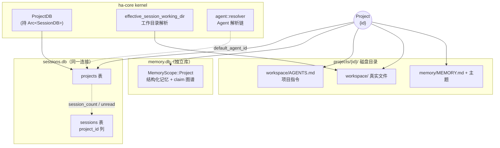
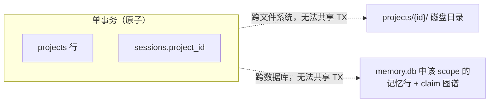
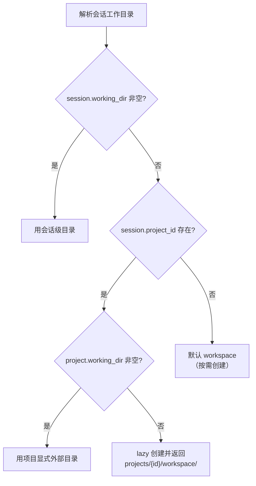
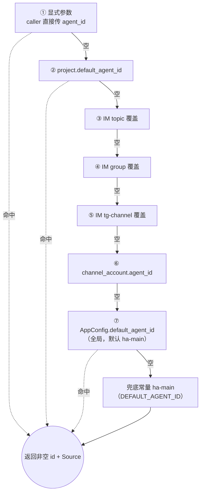
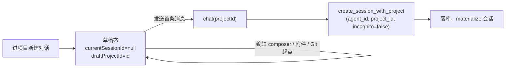
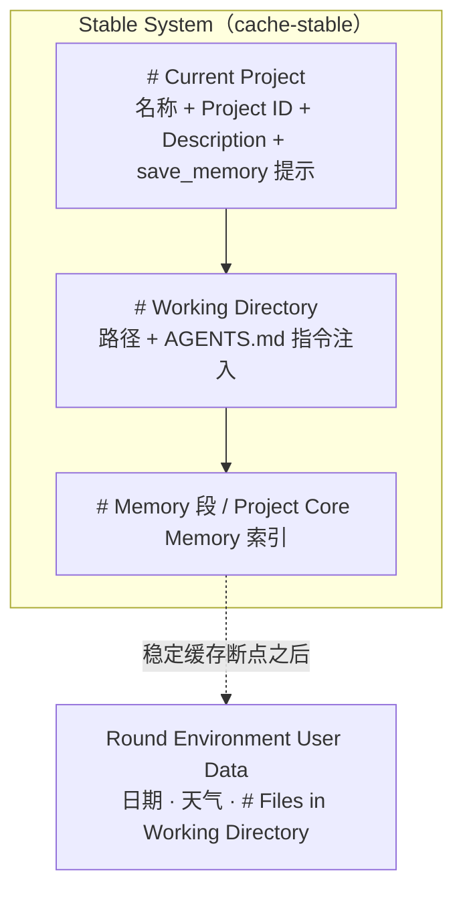
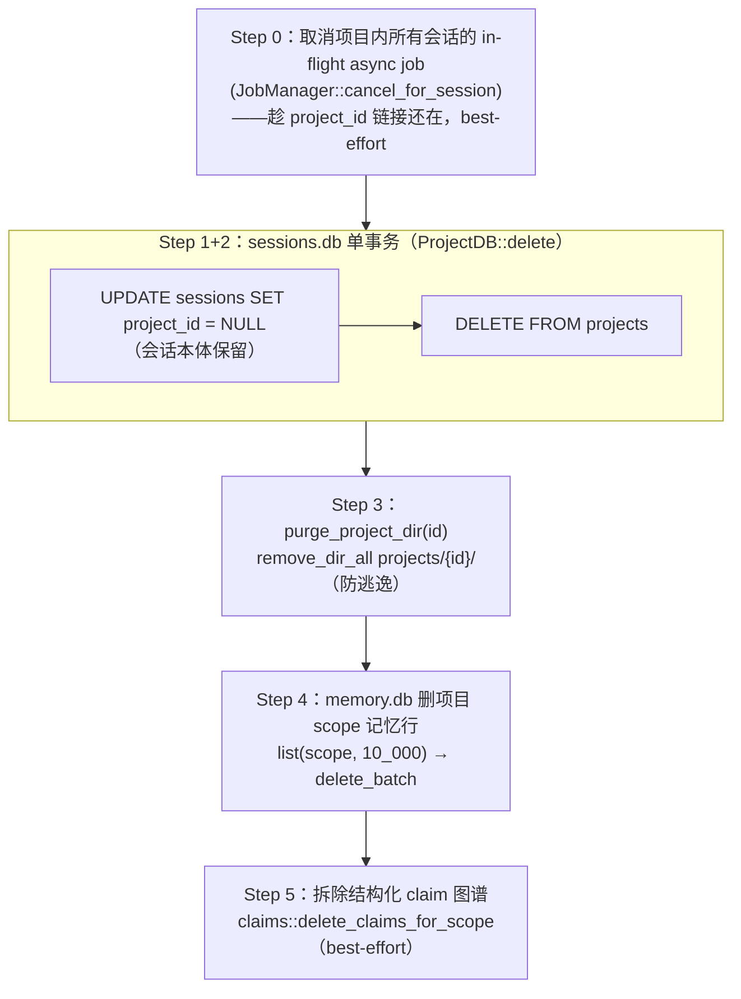
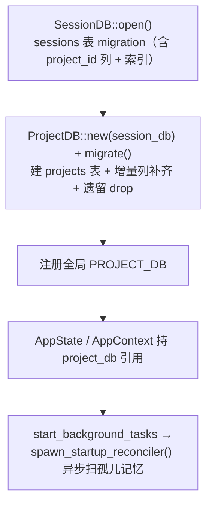

# Project 项目系统架构

> 返回 [文档索引](../../README.md) | 更新时间：2026-08-11

## 目录

- [核心思想](#核心思想)
- [全景：一个项目聚合了什么](#全景一个项目聚合了什么)
- [三处存储与事务边界](#三处存储与事务边界)
- [数据模型](#数据模型)
- [SQLite Schema](#sqlite-schema)
- [磁盘布局](#磁盘布局)
- [工作目录解析链](#工作目录解析链)
- [Agent 解析链（7 级）](#agent-解析链7-级)
- [会话懒创建与草稿态](#会话懒创建与草稿态)
- [Prompt 上下文装配](#prompt-上下文装配)
- [记忆系统接入](#记忆系统接入)
- [文件浏览器与 preview-by-path](#文件浏览器与-preview-by-path)
- [级联删除与孤儿清理](#级联删除与孤儿清理)
- [核心 API](#核心-api)
- [接入层](#接入层)
- [前端 UI](#前端-ui)
- [EventBus 事件](#eventbus-事件)
- [启动顺序](#启动顺序)
- [安全约束](#安全约束)
- [关联文档](#关联文档)
- [文件清单](#文件清单)

---

## 核心思想

Project 要解决的问题是：**一组相关会话需要共享同一份工作上下文**——同样的目录、同样的长期记忆、同样的行为约定，而不必在每个会话里重复配置。它是一个**可选的会话容器**：`sessions.project_id = NULL` 的会话保持无项目时的原有行为，完全不受影响。项目不是对话的必需分组，而是 opt-in 的聚合。

一个项目对它内部的会话统一提供四样东西：

| 共享物 | 真相源 | 一句话 |
|---|---|---|
| **项目范围长期记忆** | `memory.db`（`MemoryScope::Project { id }`） | 可检索、可召回的结构化事实，项目内可见、跨项目隔离 |
| **项目自动记忆** | `projects/{id}/memory/MEMORY.md` + 主题 `*.md` | 有界索引稳定注入、主题按需读取的本机项目经验 |
| **项目指令** | 项目根目录 `AGENTS.md` | 文件即唯一真相源，直接编辑，装配进每个项目内会话的稳定 system 合同 |
| **主文件夹** | 用户显式选的目录，或默认 `projects/{id}/workspace/` | 新会话 cwd、相对路径、Git 与项目指令的默认根 |
| **其他源文件夹** | `projects.linked_dirs_json` | 可由 Agent 与文件浏览器搜索、读取、编辑的额外绝对路径根 |

贯穿整个子系统的一条哲学是 **「项目文件就是工作目录里的真实文件」**（对齐 [文件操作统一](file-operations.md)）：上传的文件直接落工作目录，模型靠每轮 environment user-data 中的顶层文件清单发现候选，再用 `read` / `read_context_resource` 按需读取。系统中**没有** `project_files` 表、独立的 `files/` / `extracted/` 目录、文本预提取注入，也**没有** `project_read_file` 工具——文件读写一律走文件浏览器 API 的 `WorkspaceScope` 作用域闭合。

围绕这些目标，几条设计取舍决定了整体形态：

- **项目表寄居在 `sessions.db`**：`projects` 表与 `sessions` 表同一个 SQLite 连接（`ProjectDB` 持 `Arc<SessionDB>`），因此「项目 ↔ 会话」的关系查询能在单库单事务内完成，删除项目时会话解绑与项目行删除是原子的。
- **记忆跨库**：项目记忆落在独立的 `memory.db`，无法与 `sessions.db` 共享事务。删除项目时分两库执行，靠启动期 reconciler 兜底孤儿清理。
- **工作目录单一真相源**：会话最终工作目录由 [`session::effective_session_working_dir`](../../../crates/ha-core/src/session/helpers.rs) 唯一解析（默认 workspace 首次解析时 lazy 创建）；文件读写经 [`filesystem::WorkspaceScope`](../../../crates/ha-core/src/filesystem/workspace.rs)（canonicalize + `starts_with`，失败闭合）。
- **一个主文件夹 + 多个辅助文件夹**：设置 UI 统一呈现为“源文件夹”列表；将辅助文件夹设为主文件夹时，原主文件夹原子降为辅助文件夹。辅助文件夹不改变 cwd / 相对路径 / 根 `AGENTS.md` 语义，但文件浏览器可切根执行同一套搜索、预览与 CRUD。会话单独覆盖 cwd 时，项目主文件夹不会消失，而是作为该会话末尾的虚拟辅助根继续可见、可读写。
- **指令单一真相源**：元数据与 SQLite 都不保存指令；根 `AGENTS.md` 是唯一入口，设置页直接读写它。旧 `projects.instructions` 列在迁移中直接 drop，不迁移历史内容。
- **无反向认领**：项目不认领 (channel, account)；IM 会话归属项目靠 chat 内 `/project <id>` 显式触发（详见 [Agent 解析链](#agent-解析链7-级) 与 [im-channel.md](../integration/im-channel.md)）。

## 全景：一个项目聚合了什么

一个 `project_id` 像一根引线，把三处物理存储和一个工作目录串起来。它们各有真相源、各有生命周期：



会话通过 `sessions.project_id` 挂进项目后，它的 Agent、工作目录、稳定 system 合同、每轮 environment user-data 与记忆作用域都会随之改变——这些改变都发生在解析期（lazy resolve），项目属性一变即对所有未单独覆盖的会话生效，不在项目表里复制会话级副本。

## 三处存储与事务边界

项目的持久化分布在三处，理解它们的事务边界是理解删除与一致性策略的关键：



`projects` 表与 `sessions` 表同库，删除时的「解绑会话 + 删项目行」在**同一个事务**内完成，不会留下半删状态。磁盘目录与 `memory.db` 都在事务之外：删除时在 TX 后接续清理，一旦中途崩溃，残留物（孤儿目录、孤儿记忆行）都**对应用无害**——它们的 `project_id` 已不存在，永远不会被 `list` 查出，靠启动期 reconciler 懒清理，而非同步事务。详见 [级联删除与孤儿清理](#级联删除与孤儿清理)。

## 数据模型

### Project（[`types.rs`](../../../crates/ha-core/src/project/types.rs)）

| 字段 | 类型 | 说明 |
|---|---|---|
| `id` | `String` | UUID v4 主键 |
| `name` | `String` | 项目名称（trim 后不得为空） |
| `description` | `Option<String>` | 项目简介 |
| `logo` | `Option<String>` | 项目 logo data URL（`data:image/...;base64,...`，见 [安全约束](#安全约束)） |
| `color` | `Option<String>` | 强调色（UI 内部装饰用） |
| `default_agent_id` | `Option<String>` | 新建会话的默认 Agent（解析链第 2 级） |
| `default_model_id` | `Option<String>` | **已废弃兼容列**：只随 DB 与回滚流转，不参与任何解析、不在 UI 暴露。项目会话统一走默认 Agent，运行默认值在会话创建时固定 |
| `working_dir` | `Option<String>` | 项目级默认工作目录（绝对路径）；session 未单独设置时回落到此；`NULL` = 用默认 workspace |
| `linked_dirs` | `Vec<String>` | 其他源文件夹（canonical 绝对路径，最多 32 个）；不参与 cwd 与 `AGENTS.md` 解析 |
| `created_at` / `updated_at` | `i64` | Unix 毫秒时间戳 |
| `sort_order` | `i64` | 侧边栏排序键，越小越靠前；由 `reorder` 写入，默认按更新时间铺开 |
| `archived` | `bool` | 归档标志（不删除，默认列表过滤） |

### 聚合与概览类型

**`ProjectMeta`** = `Project`（flatten）+ 两个列表聚合计数：

- `session_count` —— 项目内未归档会话数（`ProjectDB::list` 子查询）。
- `unread_count` —— 项目内**普通顶层**未读 session 数（每个 session 最多计 `1`）。它复用会话未读的同一套谓词 [`regular_unread_predicate_sql`](../../../crates/ha-core/src/session/db.rs)（= `regular_session_scope_sql` + `regular_unread_exists_sql`），因此排除 Cron / IM channel-attached / Subagent 子会话 / incognito / 非 `regular` kind，并额外排除前端确认正在阅读的当前会话（SQL 里 `s.id != active`，避免闪烁式前端减一）。`/projects` 列表数字角标用它；`mark_project_sessions_read` 清同一范围。

**`ProjectOverviewSummary`**（项目概览页专用聚合，[`overview.rs`](../../../crates/ha-core/src/project/overview.rs)）：项目列表刻意不跨库补记忆数（避免 N+1），概览页需要的用户口径由这里单独一次性聚合。任一可选指标读取失败**不清空整页**：

| 字段 | 来源 | 说明 |
|---|---|---|
| `session_count` | `list_recent_regular_chats_for_project` | 用户可见的顶层项目会话数 |
| `recent_sessions` | 同上（limit 5） | 最近 5 条用户会话 |
| `auto_memory_topic_count` | `project::memory::list` | 自动记忆主题数（`Option`，失败留空） |
| `active_claim_count` | `claims::list_claims_page(status="active")` | 当前有效结构化记忆数；过期 / 待审核 / 已归档 / 已替代不计入（`Option`） |
| `instructions` | `read_project_instructions` | 根 `AGENTS.md` 的 `ProjectInstructionsStats`：`path` / `line_count` / `size_bytes` / `empty`（`Option`，缺文件留空） |

### 输入 DTO

- `CreateProjectInput`：`name` 必填，其余可选（含 `logo` / `working_dir` / `linked_dirs` 等所有可写字段）。
- `UpdateProjectInput`：PATCH 语义，字段 `Option<_>`（`None` = 不变，`Some("")` = 清空为 `NULL`），`linked_dirs: Some(vec)` 替换完整辅助目录列表，并含 `archived`。
- `working_dir` 的写入统一走 [`util::canonicalize_working_dir`](../../../crates/ha-base/src/util.rs)：空串当清空，否则 canonicalize + `is_dir` 校验，不通过 `Err`。
- `linked_dirs` 逐项走同一 canonicalize 校验，精确去重并移除与主目录相同的路径；后端限制最多 32 项，避免无界 prompt / 权限表面。
- UI 的“设为主文件夹”一次 PATCH 同时写 `working_dir` 与完整 `linked_dirs`，因此不需要新增角色字段或额外迁移；原主目录加入 `linked_dirs`，目标目录从中移除。

> 系统中不存在 `ProjectFile` / `BoundChannel` 类型——文件即工作目录真实文件，IM 反向认领已不存在。

## SQLite Schema

`projects` 表随 `SessionDB` 连接共享，由 [`ProjectDB::migrate()`](../../../crates/ha-core/src/project/db.rs) 幂等建表（每次启动都会跑，安全）：

```sql
CREATE TABLE IF NOT EXISTS projects (
    id                TEXT PRIMARY KEY,
    name              TEXT NOT NULL,
    description       TEXT,
    color             TEXT,
    default_agent_id  TEXT,
    default_model_id  TEXT,
    created_at        INTEGER NOT NULL,
    updated_at        INTEGER NOT NULL,
    archived          INTEGER NOT NULL DEFAULT 0,
    logo              TEXT,
    working_dir       TEXT,
    linked_dirs_json  TEXT NOT NULL DEFAULT '[]',
    sort_order        INTEGER NOT NULL DEFAULT 0
);
CREATE INDEX IF NOT EXISTS idx_projects_archived
    ON projects(archived, updated_at DESC);
CREATE INDEX IF NOT EXISTS idx_projects_archived_sort
    ON projects(archived, sort_order ASC, updated_at DESC);
```

`migrate()` 还对老库做**增量列补齐**与**遗留清理**（破坏性直接 drop，无数据迁移）：

- 补齐 `logo` / `working_dir` / `linked_dirs_json` / `sort_order` 列（`linked_dirs_json` 对旧项目默认 `[]`；`sort_order` 首次加入时按 `updated_at` 铺开初始值）。
- `DROP COLUMN emoji`（早期图标列）。
- `DROP TABLE project_files` + 其索引（文件改为工作目录真实文件）。
- `DROP COLUMN bound_channel_id / bound_channel_account_id` + `idx_projects_bound_channel`（IM 反向认领已不存在，需 SQLite 3.35+）。
- `DROP COLUMN instructions`（项目指令改为根 `AGENTS.md`，按产品决策不迁移旧列内容）。

**sessions 表扩展**（[`session/db.rs`](../../../crates/ha-core/src/session/db.rs)）：迁移阶段 `ALTER TABLE sessions ADD COLUMN project_id TEXT` + 建 `idx_sessions_project_id`，老库零破坏升级。

## 磁盘布局

```text
~/.hope-agent/
├── sessions.db                        # projects + sessions 同一个 DB
├── memory.db                          # 项目记忆（独立 DB，MemoryScope::Project）
└── projects/
    └── {project_id}/
        ├── memory/                    # 项目自动记忆；始终留在内部数据目录
        │   ├── MEMORY.md              # 生成的简短索引；上限 200 行 / 25KB
        │   └── *.md                   # 带 frontmatter 的主题详情；按需读取
        └── workspace/                 # 默认工作目录（未显式选目录时）；上传/产出/浏览都在此
            ├── AGENTS.md              # 项目指令唯一真相源（用户可选择不创建）
            └── <用户与 agent 的真实文件>
```

> 用户在项目设置里**显式选了** `working_dir` 时，工作目录指向那个外部真实目录（不在 `projects/{id}/` 内），此时 `projects/{id}/workspace/` 可能为空。自动记忆（`memory/`）永远留在内部数据目录，绝不寄生到外部工作目录。

路径由 [`paths.rs`](../../../crates/ha-base/src/paths.rs) 集中管理：`projects_dir()` / `project_dir(id)` / `project_workspace_dir(id)`。工作目录解析的单一入口是 [`project::resolve_project_dir`](../../../crates/ha-core/src/project/files.rs)：显式 `working_dir` 优先，否则 lazy 创建默认 workspace 并 `ensure_dir_canonical` 返回。

## 工作目录解析链

会话最终工作目录由 [`session::helpers::effective_session_working_dir`](../../../crates/ha-core/src/session/helpers.rs)（及其 `effective_working_dir_for_meta` 变体）单一入口解析，优先级 **session > project > 默认 workspace**：



两个非显然但重要的行为：

- **项目会话总有工作目录**：要么是显式 `working_dir`，要么是 lazy 创建的默认 `projects/{id}/workspace/`。
- **Lazy ensure 不写 DB**：默认 workspace 在首次解析时 `ensure_dir_canonical` 创建并返回，`project.working_dir` 保持 `NULL`——这样 `HA_DATA_DIR` 仍可整体迁移（路径不硬编码进库）。改 `working_dir` 立即对未单独设置的项目内已有会话生效（lazy resolve，不复制快照）。

**写入校验入口**：session / project 共用 [`util::canonicalize_working_dir`](../../../crates/ha-base/src/util.rs)——空串当清空（写 `NULL`），非空则 `canonicalize` + `is_dir`，不通过 `Err`。

**消费点**：解析出的合并值最终喂给三处——

| 消费方 | 作用 |
|---|---|
| **稳定 system 渲染**（[`agent/config.rs`](../../../crates/ha-core/src/agent/config.rs)） | 传给 `system_prompt::build`，注入 `# Working Directory` 固定合同；可变目录观察不进入该字符串 |
| **主对话工具执行**（[`agent/mod.rs`](../../../crates/ha-core/src/agent/mod.rs)） | 写入 `ToolExecContext.session_working_dir`，被 `read` / `write` / `exec` 解析相对路径 |
| **斜杠命令执行**（[`slash_commands/handlers/mod.rs`](../../../crates/ha-core/src/slash_commands/handlers/mod.rs)） | 让内置命令也走合并值 |

**UI 区分两种来源**（[`WorkingDirectoryButton`](../../../src/components/chat/input/WorkingDirectoryButton.tsx) / `ChatTitleBar`）：会话级（`session.working_dir` 非空）显示路径 + clear 按钮；继承自项目（会话级空、走 `project.working_dir`）显示路径 + 标注「继承自项目」，**不渲染 clear 按钮**（避免 no-op 误操作）。

## Agent 解析链（7 级）

新会话 `agent_id` 的解析统一走 [`agent::resolver::resolve_default_agent_id_full`](../../../crates/ha-core/src/agent/resolver.rs)：从最具体到最兜底逐级尝试，**首个非空胜出**。`_with_source` 变体还携带来源 tag，供 `/status` 显示到底命中了哪一级。无 IM 上下文的 desktop / HTTP 用 `resolve_default_agent_id(project, channel_account)` 包装，只传项目 + channel-account 两级。



| 优先级 | 来源 | 触发条件 |
|---|---|---|
| 1 | **显式参数** | 调用方在 API / Tauri 命令里直接传 `agent_id` |
| 2 | **`project.default_agent_id`** | session 落入项目，项目设置了默认 Agent |
| 3 | **IM topic** `TelegramTopicConfig.agent_id` | Telegram forum topic 级覆盖（最具体 IM scope） |
| 4 | **IM group** `TelegramGroupConfig.agent_id` | 群级覆盖 |
| 5 | **IM tg-channel** `TelegramChannelConfig.agent_id` | 广播频道级覆盖 |
| 6 | **`channel_account.agent_id`** | IM channel account per-account 软默认 |
| 7 | **`AppConfig.default_agent_id`** | 全局设置，默认 `"ha-main"` |
| — | **硬编码 `"ha-main"`** | 兜底常量（`agent_loader::DEFAULT_AGENT_ID`），保证永远返回非空 id |

channel worker 不自写解析链——IM 分派（topic > group > channel-override > channel-account）已折叠进这个函数，全部收敛到单一真相源。

**配套 API**：

| 入口 | 作用 |
|---|---|
| Tauri `get_default_agent_id` / `set_default_agent_id` | 读 / 写 `AppConfig.default_agent_id` |
| HTTP `GET / PUT /api/config/default-agent` | 同上 |
| `ha-settings` 工具 `category="default_agent"` | 模型可改（LOW 风险，SKILL.md 已登记） |
| `/status` 斜杠命令 | 项目会话里追加项目摘要段，并标注 Agent Source 命中级别 |

## 会话懒创建与草稿态

普通对话与「进项目新建对话」在**交互入口**采用对称的懒创建：不预先 `create_session_cmd` 落库，而是停在草稿态（`currentSessionId = null`），前端用 `draftProjectId` 记住项目（仿 `draftWorkingDir`）。首条消息发送时，`chat` 命令带 `projectId` 走 `create_session_with_project` 才真正落库。



这样进项目不再产生未发消息的空会话行，且草稿态与普通对话走**相同**的模型 / 权限模式 seeding。几个关键约束：

- `chat` 在 `agent_id` 缺省时按 `project.default_agent_id` 解析 agent（对齐 `create_session_cmd`）。
- **`project_id` 与 `incognito` 互斥**：`create_session_with_project(agent_id, project_id, incognito)` 里，只要 `project_id` 为 `Some`，`incognito` 被后端强制置回 `false`。
- **仅交互入口懒创建**：IM 入站 / cron / subagent 仍 eager `create_session_with_project`（消息必须立即落库）。
- 前端 `effectiveProjectId = 已加载会话 meta.projectId ?? draftProjectId` 是「当前在哪个项目」的单一来源（覆盖草稿态与落库过渡窗口，避免 badge 闪烁与切回普通会话时的陈旧泄漏）。

**首轮 Git bootstrap**：草稿在首发前还维护 `ProjectRuntimeDraft`（默认 `local`；Git 项目在 `local` / `worktree` 两种运行位置下都可从本地或 remote-tracking 分支选起点）。切换项目保留 composer 文本、普通附件与引用，但清空草稿 KB attach、Git 缓存与运行位置。首次发送经 `ChatStartArgs.projectBootstrap` 接入 Tauri / HTTP 共用的 `ha-core::project_bootstrap` 编排；已有 session 携带该字段、非项目草稿、归档项目、非法 ref 或非 Git 目录均 fail closed。统一目录、Bootstrap 状态机、脏改动复制与恢复契约见 [Managed Worktree 控制平面](../agent/worktree.md#项目首轮-bootstrap)；Session materialize 后的 Diff / 分支 / 提交 / 推送 / PR 与双向 Handoff 见 [Session Git 控制平面](../agent/git-control.md)。

## Prompt 上下文装配

会话挂到项目后，项目上下文被分到两条 authority/lifecycle 明确的通道。项目身份、工作目录约定和 Core Memory 索引属于稳定 system 合同；日期、天气与可变的顶层目录清单属于当轮非可信 environment user-data。文件增删因此不会重拼稳定前缀，也不会因为由项目携带就继承 system/developer authority：



- **`# Current Project`**（[`system_prompt/sections.rs`](../../../crates/ha-core/src/system_prompt/sections.rs)）：注入在 Memory 段**之前**。包含项目名称、稳定的 `Project ID` 与可选 `Description`，并在长期记忆开启时尾随一句提示——本会话 `save_memory` 默认落 project scope（想逃出项目边界要显式传 `scope='global'` 或 `'agent'`）。OpenClaw 模式同样注入此段；其更早的 `# Project Context` 只描述四文件 Agent pack，不能替代当前 HA 项目身份。它不再承载任何数据库指令。
- **`# Working Directory`**（详见 [prompt-system.md](prompt-system.md)）：路径声明 + `## Working Directory Instructions` 子节，紧跟在 Project 段之后、Memory 段之前。项目工作目录始终有根 `AGENTS.md`，由既有 working-dir instruction loader 读取并按 20,000 字符上限注入——这也是项目指令的唯一入口。通用非项目工作目录仍保留 `AGENTS.md` 优先、`CLAUDE.md` fallback 的发现规则。
- **`# Linked Project Directories`**：紧跟当前工作目录，稳定列出所有额外源文件夹的绝对路径；会话覆盖 cwd 时也包含项目主文件夹。项目主目录仍是项目指令 authority，其他辅助根的 `AGENTS.md` 不自动注入；sandboxed `exec` 一次只把选定 `cwd` 挂载到 `/workspace`，要在额外根执行必须显式把 `cwd` 设为该根，不能假设多个宿主根同时可见。
- **`# Files in Working Directory`**（清单由 [`system_prompt/sections.rs`](../../../crates/ha-core/src/system_prompt/sections.rs) 的 `build_working_dir_files_section` 构建，再由 `system_prompt::build_round_environment_data` 装配）：进入 `<hope_round_data source="environment">` 的 **user-data lane**，不再进入 system prompt。清单非递归、只列名、名称排序、跳过隐藏项与 `.git` / `node_modules` / `target` / `__pycache__` / `.venv` 等目录、上限 100 条、每轮刷新；同一目录状态仍产出 byte-identical 文本。模型靠普通 `read` / `read_context_resource` 工具按需读具体内容。
- **`# Files in Linked Project Directories`**：同属每轮 environment user-data；最多预览前 8 个辅助根、每根 25 个顶层条目，其余根仍可通过稳定绝对路径按需读取，避免目录数放大 prompt。

> 系统里不存在「目录清单 / 小文件内联 / `project_read_file`」的多层 system 注入——它由上面的 environment user-data 清单加按需读取工具取代。目录内容、召回正文和其他外部观察始终是非可信 data，不能借项目上下文升权。

## 记忆系统接入

项目内有两套互补、但物理分离的记忆，加上一层用户手动维护的指令：

| 层 | 真相源 | 进入 prompt 的方式 | 适合内容 |
|---|---|---|---|
| 项目范围动态记忆 | `memory.db` / `MemoryScope::Project` | Fast Recall 按 turn 选择，可选 Deep Recall；legacy static 仅回滚时启用 | 可检索事实、用户偏好、跨会话语义召回 |
| Project Core Memory | `projects/{id}/memory/MEMORY.md` + 主题 `*.md` | 会话快照固定注入有界索引，详情由记忆工具按需读 | 稳定架构约定、长期工作流、踩坑与参考索引 |
| 项目指令 | 根 `AGENTS.md` | 由 `# Working Directory` 段注入 | 用户明确维护的固定规则，始终按指令语义处理 |

**MemoryScope 第三变种**（[`memory/types.rs`](../../../crates/ha-core/src/memory/types.rs)）：

```rust
pub enum MemoryScope {
    Global,
    Agent { id: String },
    Project { id: String },
}
```

- **召回 / Core 优先级**：动态候选排序与 Core 共享预算都按 `Project（最高）→ Agent → Global（最低，shared=true 时）`；默认不把 SQLite 项目记忆批量静态注入。
- **自动提取作用域**（[`ha-memory/src/extract.rs`](../../../crates/ha-memory/src/extract.rs)）：项目事实在项目会话写 `Project`；非项目会话提取出的 project-like 内容进入 `pending_memory_candidates`，不得回退成 Agent scope。用户显式保存仍受 kernel 的 live scope / session policy 裁决。
- **概览记忆口径**：项目列表不查记忆库；`build_project_overview` 单次读取自动记忆主题数与当前项目有效结构化记忆数（过期 / 待审核 / 已归档 / 已替代不计入）。

### Project Core Memory 的渐进式披露

Global / Agent / Project 三层现在共用 [`CoreMemoryRepository`](../../../crates/ha-core/src/memory/core_repository.rs)；Project 的 [`project/memory.rs`](../../../crates/ha-core/src/project/memory.rs) 只保留兼容薄适配，把旧 API 映射到共享仓库。核心机制：

- **确定性可重建索引**：`MEMORY.md` 由后端根据主题 frontmatter 重建，按 `feedback / project / reference / user` 分组，只保存文件名与一句摘要。上限 **200 行 / 25KB**（`CORE_INDEX_MAX_*`）。
- **文件配额**：单个主题最大 **128KB**、每项目最多 **256 个主题**（`CORE_TOPIC_MAX_BYTES` / `CORE_MAX_TOPIC_FILES`）；安全文件名仅允许 ASCII 字母、数字、`_`、`-` 与 `.md`（长度 ≤ 128）。每次入口都校验 project 祖先与 memory 目录不是 symlink，并用 canonical parent containment 拒绝路径逃逸；topic / index / lock 也必须是常规文件。
- **稳定 fingerprint**：主题正文变化但 `name / description / type` 不变时，`MEMORY.md` 字节不变，因此 prompt fingerprint 与 Provider cache 前缀不变——只有新增、删除或改摘要才合理失效一次。索引随 session Core snapshot 固定，后台 topic/index 更新不改变当前会话；显式 reload、Tier 3 compact 或新会话才生效。
- **工具面**：`core_memory(scope=project)` 是 canonical 工具，`project_memory` 是兼容别名。二者都属 Memory tier，遵守全局长期记忆、Core、Agent memory、session use/contribute policy、incognito、Plan / Skill / deny 等实时 gate；project id 只能从 live session 解析。owner UI 在记忆关闭时仍可管理本机文件，但 agent 不会注入或调用。
- **并发与陈旧写**：`list / search / read` 提供发现与按需读取（`read` 默认返回 ≤ 12,000 字符，支持 `offset / maxChars`，并回传磁盘原文 BLAKE3 `fileHash`）；已有主题的 `write / delete` 必须把它作为 `expectedFileHash` 带回，文件被改 / 删或缺 hash 时 fail closed。`write / delete / rebuild_index` 经 repository 的 **OS 独占锁**串行化，覆盖跨会话、owner 请求乃至多进程竞争。完成后发送 `memory:core_changed`，兼容入口可继续发送旧事件供 UI 过渡。
- **入 prompt 前净化**：索引先做 prompt-injection pattern 过滤与 XML text escape，持久化摘要不能闭合信封。项目删除时 `purge_project_dir` 连同 Core 文件与锁文件一起清理；显式外部工作目录永不承载自动记忆。

## 文件浏览器与 preview-by-path

项目文件由 workspace-scoped 文件管理 API 读写，全部经 [`filesystem::WorkspaceScope`](../../../crates/ha-core/src/filesystem/workspace.rs)。四个入口 → canonicalize 根 → 每次操作 canonicalize 目标 + `starts_with` 校验，失败即闭合：

- `for_session` / `for_project` → 可写根（归档项目固定只读）；
- `for_project_folder` → 项目辅助源文件夹。`scopeId` 绑定基础 scope/id、`linked_dirs` 索引与期望绝对路径；每次解析都回读 live Project 并要求索引和路径仍精确匹配，目录删除、换序或换项目后旧 scope 自动失效。session cwd 与项目主目录不同时，索引 `linked_dirs.len()` 表示只对该 session 有效的虚拟项目主根，同样实时核对路径；
- `for_path` → 只读 worktree 跳转，写操作一律拒；
- mutation 统一走 `resolve_effective_writable`，HTTP 再叠 `filesystem.allow_remote_writes`（默认 false）远程写闸门。

核心 ops 在 [`filesystem/ops.rs`](../../../crates/ha-core/src/filesystem/ops.rs)：list / read_text / extract / CAS write_text / delete / rename / mkdir / atomic upload。接入面是 Tauri `project_fs_*`（capabilities / list / read_text / extract / search / resolve / write_text / delete / rename / mkdir / upload / claim_upload）+ HTTP `/api/fs/*` + Transport 双适配。`project_fs_capabilities` 与 mutation 共用最终判定；已有文本保存必须携带 raw-byte BLAKE3 `expectedFileHash`，新建 / 另存为用 `createOnly`，冲突返回结构化 outcome 且禁止强制覆盖。完整交互与上传生命周期只在 [file-operations.md](file-operations.md) 维护。

**preview-by-path**（按绝对路径读取 / 提取）：Tauri `preview_read_text` / `preview_extract` + 客户端 `convertFileSrc`；HTTP `GET /api/sessions/{id}/files/{read,extract,by-path}` 共用 `authorized_canonical_file_path`——被会话 tool 消息引用 ∪ 落在会话工作目录内。二者皆非的主机任意路径一律 403（远端严禁放行任意主机路径）；桌面信任本机。详见 [file-operations.md](file-operations.md)。

前端组件在 [`src/components/chat/project/file-browser/`](../../../src/components/chat/project/file-browser/)，挂载于项目设置 Files 标签（`stacked`）与主聊天区右侧面板（`split`）。项目存在辅助源文件夹时，顶部根选择器可在主目录和各辅助目录之间切换；切根会清空搜索、Git/worktree 与编辑器状态，存在未保存编辑时先走确认。CRUD 后发 `project:fs_changed` 事件跨视图同步。

## 级联删除与孤儿清理

删除项目要触碰三处存储，但只有一处能享受事务保护。[`delete_project_cascade`](../../../crates/ha-core/src/project/files.rs) 按「先原子、后尽力」的顺序推进：



为什么先取消 async job（Step 0）：`db.delete` 只清 `project_id`，会话本体存活，不会触发 `session:deleted`，清理 watcher 也看不到它们；一旦 `project_id` 变 `NULL`，就再没有链接能找到这些 job，它们会对着一个孤儿工作目录继续跑。所以必须趁链接还在时取消。查询失败只 warn，不阻塞删除。

**Step 3、4、5 都在事务外**（跨文件系统 / 跨库无法共享 TX）。设计取舍：若 Step 2 之后崩溃，残留物 = `projects/{id}/` 目录 + `memory.db` 中该 scope 的记忆行 / claim，**均对应用无害**（id 已不存在，永不会被 `list` 查出）。

**用户显式选的外部 `working_dir` 永不删**——它落在 `projects/` 之外，Step 3 的 containment 检查会把它挡在外面。

### 启动期 Reconciler（[`reconcile.rs`](../../../crates/ha-core/src/project/reconcile.rs)）

`spawn_startup_reconciler()` 在 `app_init` 后台 `spawn_blocking` 一次性执行，失败只 `app_warn!` 绝不阻塞启动：

```text
alive      = ProjectDB::list_all_ids()                     （still-live 项目）
referenced = backend.list_distinct_project_scope_ids()     （memory.db 里引用过的 scope id）
orphans    = referenced − alive
for each orphan: list(Project scope, 10_000) → delete_batch
```

项目删除频率低，所以没有周期 timer，重启时一次扫描足够。注意：reconciler 只兜底**记忆行**（Step 4 的产物），并不重扫 claim 图谱——Step 5 只在删除热路径执行。

### purge_project_dir 防逃逸

canonicalize `dir` 与 `projects_root`，若 `starts_with(canonical_root)` 不成立 → `app_error!` 拒绝 `remove_dir_all`。防御符号链接越界与遍历式 project id（虽然 id 来自 `Uuid::new_v4()`，不会构造 `..`，仍守一道）。

## 核心 API

### ProjectDB（[`db.rs`](../../../crates/ha-core/src/project/db.rs)）

| 方法 | 说明 |
|---|---|
| `create(CreateProjectInput)` → `Project` | 插入新项目（校验 name / logo / working_dir，分配 `sort_order`） |
| `get(id)` → `Option<Project>` | 取单个项目 |
| `update(id, UpdateProjectInput)` → `Project` | 动态 SQL 部分更新；普通字段空串 → `NULL`；文件系统校验在取 SQLite 锁前完成 |
| `delete(id)` → `()` | 单 TX 两步：① unassign 会话 ② 删项目行。磁盘 / 记忆清理由 `delete_project_cascade` 在 TX 外接续 |
| `reorder(&[id])` → `()` | 持久化侧边栏顺序；未列出的活跃项目保持相对序并追加在后 |
| `list_all_ids()` → `Vec<String>` | 轻量 id 列表，reconciler 专用 |
| `list(include_archived, active_session_id)` → `Vec<ProjectMeta>` | 带 `session_count` / `unread_count` 聚合子查询；`active_session_id` 在 SQL 里被未读口径排除 |

项目普通文件 CRUD 全在 [文件浏览器 API](#文件浏览器与-preview-by-path)。[`files.rs`](../../../crates/ha-core/src/project/files.rs) 另提供项目指令专用编排（`create_project_with_instructions_file` / `update_project_with_instructions_file`、`inspect_project_instructions`、`ensure_project_instructions`、`read_project_instructions`、`save_project_instructions`）——它们固定操作根 `AGENTS.md`：读取不创建缺失文件，显式保存才以 create-new 语义建立文件；保存走 `platform::write_atomic`（新建走 `write_atomic_create_new`），以读取时的 `expectedExists` + raw BLAKE3 作 stale-write guard，共用 `filesystem.maxTextEditMb` 动态上限。新增 / 编辑项目可把 `ProjectInstructionsDraft` 与元数据一并提交；创建接口用默认开启的 `createInstructionsIfMissing` 控制缺失时是否创建，**未实际变更工作目录的元数据更新不得补建文件**，文件步骤失败会回滚项目创建或元数据更新，指令内容始终不进入 SQLite。

### session ↔ project 绑定（[`session/db.rs`](../../../crates/ha-core/src/session/db.rs)）

| 方法 | 说明 |
|---|---|
| `create_session_with_project(agent_id, project_id, incognito)` | 带项目归属创建会话；`project_id` 为 `Some` 时强制 `incognito=false` |
| `set_session_project(session_id, project_id)` | 搬迁会话到另一项目或 unassign（`/project` IM 路由、`move_session_to_project` 共用） |
| `list_sessions_paged(agent_id, project_filter, limit, offset, active_session_id)` | `ProjectFilter`：`All` / `Unassigned` / `InProject(id)` |

## 接入层

### Tauri 命令（[`commands/project.rs`](../../../src-tauri/src/commands/project.rs)）

注册在 [`src-tauri/src/lib.rs`](../../../src-tauri/src/lib.rs) `invoke_handler!`：

| 命令 | 作用 |
|---|---|
| `list_projects_cmd(include_archived?, active_session_id?)` | 项目列表与会话 / 未读聚合 |
| `get_project_overview_cmd(id)` | 项目首页聚合：用户会话、自动记忆、有效结构化记忆、`AGENTS.md` 状态 |
| `get_project_cmd(id)` | 取单个 |
| `create_project_cmd(input, instructions, createInstructionsIfMissing?)` | 创建项目；默认原子落根 `AGENTS.md` 草稿，也可保留已有目录中的缺失状态；emit `project:created` |
| `update_project_cmd(id, patch, instructions)` | 更新元数据并原子落根 `AGENTS.md` 草稿；任一文件步骤失败则回滚元数据；emit `project:updated` |
| `reorder_projects_cmd(project_ids)` | 持久化侧边栏项目顺序；emit `project:updated {kind:"reordered"}` |
| `inspect_project_instructions_cmd(working_dir?, project_id?)` | 表单中只读检查目标根 `AGENTS.md`；缺失返回空草稿但不建文件 |
| `get_project_instructions_cmd(id)` | 只读检查根 `AGENTS.md`；缺失返回空草稿但不建文件 |
| `save_project_instructions_cmd(id, content, expectedFileHash, expectedExists)` | 校验存在状态与内容 hash，必要时建文件并原子保存 Markdown，emit `project:fs_changed` |
| `delete_project_cmd(id)` | 走 `delete_project_cascade`，emit `project:deleted` |
| `archive_project_cmd(id, archived)` | 等价 patch `{archived}`，emit `project:updated` |
| `list_project_sessions_cmd(id, limit?, offset?)` | 基于 `ProjectFilter::InProject`，含 `enrich_pending_interactions` |
| `move_session_to_project_cmd(session_id, project_id?)` | `project_id=None` 即 unassign |
| `mark_project_sessions_read_cmd(id)` | 清零项目 `unread_count` |
| `list_project_memories_cmd(id, limit?, offset?)` | Project scope 记忆列表 |
| `list_project_memory_files_cmd(id)` | 项目自动记忆主题列表 |
| `read_project_memory_file_cmd(id, file_name)` | 读取一个主题正文 |
| `write_project_memory_file_cmd(id, input)` | 原子创建 / 更新主题并重建索引 |
| `delete_project_memory_file_cmd(id, file_name, expected_file_hash)` | 校验磁盘 hash 后删除主题并重建索引 |
| `rebuild_project_memory_index_cmd(id)` | 从主题 frontmatter 确定性重建 `MEMORY.md` |

文件读写见 [文件浏览器 API](#文件浏览器与-preview-by-path) 的 `project_fs_*` 命令；会话级工作目录 / agent 切换见 [Session 系统](session.md) 的 `update_session_working_dir` / `update_session_agent`。

### HTTP 路由（[`routes/projects.rs`](../../../crates/ha-server/src/routes/projects.rs)）

| 方法 | 路径 | Handler |
|---|---|---|
| `GET` | `/api/projects` | `list_projects` |
| `POST` | `/api/projects` | `create_project` |
| `POST` | `/api/projects/reorder` | `reorder_projects` |
| `POST` | `/api/projects/instructions/inspect` | `inspect_project_instructions_file` |
| `GET` | `/api/projects/:id` | `get_project` |
| `GET` | `/api/projects/:id/overview` | `get_project_overview` |
| `PATCH` | `/api/projects/:id` | `update_project` |
| `DELETE` | `/api/projects/:id` | `delete_project` |
| `GET` | `/api/projects/:id/instructions` | `get_project_instructions` |
| `PUT` | `/api/projects/:id/instructions` | `save_project_instructions_file` |
| `POST` | `/api/projects/:id/archive` | `archive_project` |
| `GET` | `/api/projects/:id/sessions` | `list_project_sessions` |
| `POST` | `/api/projects/:id/read` | `mark_project_sessions_read` |
| `GET` | `/api/projects/:id/memories` | `list_project_memories` |
| `GET` / `PUT` | `/api/projects/:id/memory-files` | 列表 / 写入项目自动记忆 |
| `GET` / `DELETE` | `/api/projects/:id/memory-files/:file_name` | 读取 / 删除主题 |
| `POST` | `/api/projects/:id/memory-files/rebuild-index` | 重建 `MEMORY.md` |
| `PATCH` | `/api/sessions/:id/project` | `move_session_to_project` |

文件 CRUD 走 `/api/fs/*`（见 [文件浏览器 API](#文件浏览器与-preview-by-path)），不存在 `/api/projects/:id/files*` 路由。端点对照总表见 [api-reference.md](../system/api-reference.md)。

## `/project` 与 `/projects` 斜杠命令

源：[`slash_commands/handlers/project.rs`](../../../crates/ha-core/src/slash_commands/handlers/project.rs)。

| 形式 | 行为 |
|---|---|
| `/projects` | picker：返回 `ShowProjectPicker`，前端渲染项目选择器 |
| `/project`（无参） | 同 picker（`ShowProjectPicker`） |
| `/project <name>`（desktop / HTTP） | fuzzy 匹配 → `EnterProject` action → 前端创建项目作用域新会话 |
| `/project <name>`（IM 会话） | fuzzy 匹配 → `AssignProject` action → channel worker 调 `set_session_project` 直接 UPDATE 现有 `sessions.project_id`，**不创建新 session** |

IM 会话与 desktop 会话的差异源于 UX 预期：桌面进项目预期开一个新会话，而 IM 里一条聊天就是一个会话，`/project` 只是把它重新指向某个项目。`/project` 在 IM 渠道**可用**——当前 `IM_DISABLED_COMMANDS = ["agent", "handover", "pet"]`（[`slash_defs/registry.rs`](../../../crates/ha-core/src/slash_defs/registry.rs)），不含 `project`。

## 前端 UI

### 侧边栏树状渲染（[`ProjectSection.tsx`](../../../src/components/chat/project/ProjectSection.tsx)）

项目是侧边栏一等节点，每个项目渲染为可折叠的 `ProjectGroup`：

- 展开后嵌套该项目下的会话列表（复用 `SessionItem`）；展开状态按单条 `localStorage` 键 `ha:project-expanded`（一条 JSON 存所有项目的展开集，`ProjectSection.tsx` 内联）持久化。
- **每个项目独立分页**（[`useProjectSessions`](../../../src/components/chat/project/hooks/useProjectSessions.ts)）：展开时按需调 `list_project_sessions_cmd` 拉自己的会话（而非从共享全局会话数组里筛——全局数组只持最近一页，会漏掉项目里较早的会话），默认页大小 15；底部按钮增减一页。采用 **window-refetch 模型**（恒 `offset:0`、`limit:windowSize`），分页 ≤15 条对本地 SQLite 成本极低，且免去 append/dedup 竞态。实时刷新复用 ChatScreen 既有机制：以该项目在全局会话数组中切片的指纹（`changeSignal`，含 id/updatedAt/pinnedAt/unread/title/pending）加 `ProjectMeta.session_count` 作为 refetch 触发，**指纹仅作触发、绝不用于渲染**。二次点击已激活的「对话」入口时，后端目标同时返回 sidebar 顺序下的 `listOffset`，项目 window 一次扩到目标位置，不再逐页递增 refetch。
- Hover「新建对话」+「设置」；右键菜单 新建 / 设置 / 归档。
- 主区 `SessionList` 的「对话 / Subagent」浏览 Tab 各自独立分页，并在后端 `LIMIT/OFFSET` 前组合 `ProjectFilter::Unassigned`、顶层/子会话类型和 Agent 过滤，避免最近项目会话占满全局页后把平铺列表截空。侧边栏搜索不受浏览 Tab 限制，仍全局覆盖项目会话。
- 项目名后追加 `working_dir` 摘要。

### ProjectDialog（[`ProjectDialog.tsx`](../../../src/components/chat/project/ProjectDialog.tsx)）

`mode="create" | "edit"` 复用同一组件，字段：name / description / logo（data URL 上传）/ color / defaultAgentId，以及统一的“源文件夹”列表。列表第一项为主文件夹，辅助项菜单支持“设为主文件夹”与移除；创建时第一个选择自动成为主文件夹。组件通过 [`ProjectInstructionsField`](../../../src/components/chat/project/ProjectInstructionsField.tsx) 直接加载主目录根 `AGENTS.md`，支持 Markdown 编辑 / 预览、行数与 UTF-8 大小。切换主目录会先只读检查新目录下的文件；保存时草稿与元数据同请求提交，但仍只写文件、不进入项目表。`defaultModelId` 仅为旧数据兼容，不在 UI 暴露且不参与会话解析。保存按钮三态（idle → saving → saved/failed）。编辑态内嵌 [`ProjectKnowledgeSection`](../../../src/components/chat/project/ProjectKnowledgeSection.tsx)（项目级知识空间绑定，详见 [knowledge-base.md](knowledge-base.md)）。

### ProjectOverviewDialog（右侧 Sheet，[`ProjectOverviewDialog.tsx`](../../../src/components/chat/project/ProjectOverviewDialog.tsx)）

文件名保留，UI 实为右侧 `Sheet`，4 Tab。Sheet 左边缘支持鼠标左右拖拽调整宽度（键盘 `←/→` 同样可调、双击恢复默认），宽度写入 `ha:project-settings-sheet-width`；小屏保持全宽且隐藏拖拽柄。

| Tab | 作用 |
|---|---|
| **Overview** | 四张可点击状态卡 + 最近 5 条用户会话 + 项目上下文快捷入口；宽抽屉双栏、窄抽屉单栏，初次加载用骨架屏 |
| **Files** | [`FileBrowserView`](../../../src/components/chat/project/file-browser/)（树 + 预览 + 上传 / 删除 / 重命名 / 新建目录；归档项目只读） |
| **Instructions** | [`ProjectInstructionsEditor`](../../../src/components/chat/project/ProjectInstructionsEditor.tsx) 直接加载 / 保存根 `AGENTS.md`；Markdown 源码编辑、渲染预览、实时行数与 UTF-8 大小、`Cmd/Ctrl+S`、撤销未保存草稿、跨 Tab 保留草稿、并发修改保护、路径与失败反馈；归档项目只读 |
| **Auto Memory** | [`ProjectMemorySection`](../../../src/components/chat/project/ProjectMemorySection.tsx)：主题列表、frontmatter 字段与 Markdown 正文编辑 / 预览、删除、索引重建；归档项目只读 |

### 标题栏（`ChatTitleBar`）

- 项目会话前缀渲染**项目 chip**（点击打开设置 Sheet）。
- Agent 名换成 [`AgentSwitcher`](../../../src/components/chat/AgentSwitcher.tsx) dropdown，**仅 `messages.length === 0`** 时可换（前端 disabled，后端 SQL `message_count == 0` 强制校验）。
- [`WorkingDirectoryButton`](../../../src/components/chat/input/WorkingDirectoryButton.tsx) 显示生效路径，区分会话级 / 继承自项目。

### Hooks 与 i18n

- [`useProjects`](../../../src/components/chat/project/hooks/useProjects.ts)：加载 + CRUD 封装 + 订阅 EventBus 事件自动刷新。
- [`useProjectFs`](../../../src/components/chat/project/hooks/useProjectFs.ts)：文件浏览器状态（list / read / write / 上传 / 删除 / 重命名），订阅 `project:fs_changed`。
- [`useFileBrowserSplit`](../../../src/components/chat/project/hooks/useFileBrowserSplit.ts)：主聊天区右侧 split 文件面板开合。
- 项目翻译在 `project.*` 命名空间。新增 key 当次改动需 12 语齐全（`scripts/sync-i18n.mjs`）。

## EventBus 事件

| 事件名 | payload | 发射时机 |
|---|---|---|
| `project:created` | `{projectId}` | 创建成功后 |
| `project:updated` | `{projectId}` 或 `{kind:"reordered"}` | 更新 / 归档 / `working_dir` patch / 重排序成功后 |
| `project:deleted` | `{projectId}` | `delete_project_cascade` 成功后 |
| `project:fs_changed` | `{scope, scopeId, dir, path}` | 文件浏览器 CRUD 或保存 `AGENTS.md` 后，跨视图同步 |
| `project_memory:changed` | `{projectId, action}` | owner API 或 agent 工具写入 / 删除 / 重建索引后 |
| `memory:core_changed` | Core Memory payload | 共享 Core Memory 仓库写入后（canonical 事件，Project / Agent / Global 共用） |

前端 [`useProjects`](../../../src/components/chat/project/hooks/useProjects.ts) 订阅前 3 个触发 `reloadProjects()`，`useProjectFs` 订阅 `project:fs_changed`。

## 启动顺序



`ProjectDB::migrate()` 只跑 DDL 与列迁移——它**不会**为缺失 `AGENTS.md` 的现有项目补建文件（缺失可保留是产品决策，见 [安全约束](#安全约束) 与 [核心 API](#核心-api)）。`migrate` 失败是 fatal（`panic`），保证任何命令触碰前表结构已就绪。

## 安全约束

- **工作目录写入校验**：所有写路径走 `util::canonicalize_working_dir`，`canonicalize` + `is_dir` 不通过 `Err`。
- **项目指令文件闭合**：文件名固定为根 `AGENTS.md`；拒绝 symlink / 非普通文件，读取要求 UTF-8 且不超过 `filesystem.maxTextEditMb`，保存用 `platform::write_atomic`（新建 `write_atomic_create_new`），并比较读取时 raw BLAKE3 与保存时磁盘 hash，冲突拒绝覆盖；HTTP 专用端点属 API key 保护的 owner 设置面，不受通用文件浏览器写闸门影响。
- **未变更即不补建**：未实际变更工作目录的元数据更新不得补建 `AGENTS.md`；启动迁移与只读检查同样不补建。
- **文件浏览器作用域闭合**：`WorkspaceScope` canonicalize + `starts_with`，失败即拒；`for_project_folder` 每次按 live Project 的 `linked_dirs` 身份重新授权，session 覆盖 cwd 时追加的项目主根固定使用末尾索引并复核 live 主目录，旧索引 / 旧路径 fail closed；`for_path` 只读跳转写操作一律拒；HTTP 写端点叠加 `filesystem.allow_remote_writes`（默认 false）闸门。
- **preview-by-path 鉴权**：HTTP 三端点共用 `authorized_canonical_file_path`（会话引用 ∪ 工作目录内），主机任意路径 403；桌面信任本机。
- **删除前防逃逸**：`purge_project_dir` canonicalize 比对 `projects_root`，拒绝对其外目录 `remove_dir_all`。
- **上传上限**：新版租约用 `filesystem.maxWorkspaceUploadMb`（默认 20 MiB，范围 1–512）并在 start / complete / claim 三处复检；旧 multipart / whole-body 入口固定 20 MiB 兼容上限。
- **自动记忆路径闭合**：project id 必须是 UUID；主题文件名为严格 basename；项目目录祖先与 `memory/` 做 symlink + canonical containment 校验，主题 / 索引 / 锁文件拒绝 symlink / 非常规文件，写入统一走 `platform::write_atomic`。
- **并发与陈旧写**：mutation 全程持项目级 OS 独占锁；更新 / 删除按 raw-file BLAKE3 做 compare-before-write，不能用陈旧 owner 草稿或 agent 读取覆盖新版本。
- **事务边界**：`ProjectDB::delete` 单 TX 内 unassign + delete；跨库的 memory / claim 删除放 TX 外，失败走 reconciler 兜底。
- **logo 校验**（[`db.rs::validate_logo`](../../../crates/ha-core/src/project/db.rs)）：长度上限 512KB；必须 `data:image/...;base64,` 前缀，**拒绝任何 http(s):// URL**（避免 SSRF / 第三方追踪）与 `javascript:` / `file:` 等 schema；失败 `bail!` 不静默裁剪。

## 关联文档

- [Session 系统](session.md) — `sessions.project_id` 列、`ProjectFilter` 枚举、会话级 working_dir / agent 切换 API
- [知识空间](knowledge-base.md) — 项目级 KB 绑定（`ProjectKnowledgeSection`，`effective_kb_access` 取 `max(session, project)`）
- [文件操作统一](file-operations.md) — 「文件即真实文件」、文件预览面板、preview-by-path 鉴权
- [Managed Worktree 控制平面](../agent/worktree.md) / [Session Git 控制平面](../agent/git-control.md) — 项目首轮 Git bootstrap 与 Session 级 Git 操作
- [IM Channel 系统](../integration/im-channel.md) — `/project <id>` IM 路由（无反向认领）
- [记忆系统](memory.md) — `MemoryScope::Project`、三级作用域预算、Core Memory 工具面
- [提示词系统](prompt-system.md) — `# Current Project` / `# Working Directory` 段装配顺序
- [配置系统](../infra/config-system.md) — `AppConfig.default_agent_id` 在 7 级解析链中的位置

## 文件清单

| 文件 | 职责 |
|---|---|
| [`crates/ha-core/src/project/mod.rs`](../../../crates/ha-core/src/project/mod.rs) | 模块声明 + re-export |
| [`crates/ha-core/src/project/types.rs`](../../../crates/ha-core/src/project/types.rs) | `Project` / `ProjectMeta` / `ProjectOverviewSummary` / `ProjectInstructionsStats` + 两个 Input DTO |
| [`crates/ha-core/src/project/db.rs`](../../../crates/ha-core/src/project/db.rs) | `ProjectDB`（复用 `SessionDB` 连接）+ migrate + `reorder` + `validate_logo` |
| [`crates/ha-core/src/project/files.rs`](../../../crates/ha-core/src/project/files.rs) | `AGENTS.md` 生命周期与原子读写 / `resolve_project_dir` / 辅助根 live resolver / `delete_project_cascade` / `purge_project_dir` 防逃逸 |
| [`crates/ha-core/src/project/overview.rs`](../../../crates/ha-core/src/project/overview.rs) | `build_project_overview` 概览聚合（会话 / 记忆 / claim / AGENTS.md 状态） |
| [`crates/ha-core/src/memory/core_repository.rs`](../../../crates/ha-core/src/memory/core_repository.rs) | 三层 Core Memory 的目录、frontmatter、索引、CRUD / 搜索、snapshot 与并发真相源 |
| [`crates/ha-core/src/project/memory.rs`](../../../crates/ha-core/src/project/memory.rs) | Project Core Memory 兼容薄适配与旧 API 映射 |
| [`crates/ha-core/src/project/reconcile.rs`](../../../crates/ha-core/src/project/reconcile.rs) | 启动期跨库孤儿记忆清理 |
| [`crates/ha-base/src/paths.rs`](../../../crates/ha-base/src/paths.rs) | `projects_dir` / `project_dir` / `project_workspace_dir` |
| [`crates/ha-core/src/session/db.rs`](../../../crates/ha-core/src/session/db.rs) | `sessions.project_id` 迁移 + `ProjectFilter` + 绑定 API + 未读谓词 |
| [`crates/ha-core/src/session/helpers.rs`](../../../crates/ha-core/src/session/helpers.rs) | `effective_session_working_dir` 合并入口 |
| [`crates/ha-core/src/filesystem/workspace.rs`](../../../crates/ha-core/src/filesystem/workspace.rs) | `WorkspaceScope` 作用域闭合（`for_session` / `for_project` / `for_project_folder` / `for_path`） |
| [`crates/ha-core/src/filesystem/ops.rs`](../../../crates/ha-core/src/filesystem/ops.rs) | 文件浏览器读写 ops |
| [`crates/ha-core/src/agent/resolver.rs`](../../../crates/ha-core/src/agent/resolver.rs) | 7 级 agent 解析链 + `_with_source` 调试入口 |
| [`crates/ha-base/src/util.rs`](../../../crates/ha-base/src/util.rs) | `canonicalize_working_dir`（session / project 共用写入校验） |
| [`crates/ha-core/src/slash_commands/handlers/project.rs`](../../../crates/ha-core/src/slash_commands/handlers/project.rs) | `/project` / `/projects` handler（`EnterProject` / `AssignProject` / `ShowProjectPicker`） |
| [`src-tauri/src/commands/project.rs`](../../../src-tauri/src/commands/project.rs) | Tauri 项目命令 + emit 事件 |
| [`src-tauri/src/commands/project_fs.rs`](../../../src-tauri/src/commands/project_fs.rs) | 文件浏览器 Tauri 命令 + preview-by-path |
| [`crates/ha-server/src/routes/projects.rs`](../../../crates/ha-server/src/routes/projects.rs) | HTTP 项目 Handler；overview 路由只做 `ha-core` 聚合的薄适配 |
| [`crates/ha-server/src/routes/project_fs.rs`](../../../crates/ha-server/src/routes/project_fs.rs) | HTTP `/api/fs/*` 文件浏览器路由 |
| [`src/components/chat/project/ProjectSection.tsx`](../../../src/components/chat/project/ProjectSection.tsx) | 侧边栏项目树 |
| [`src/components/chat/project/ProjectDialog.tsx`](../../../src/components/chat/project/ProjectDialog.tsx) | create / edit 复用对话框（含 KB 绑定段） |
| [`src/components/chat/project/ProjectInstructionsField.tsx`](../../../src/components/chat/project/ProjectInstructionsField.tsx) | create / edit 表单内的受控 `AGENTS.md` Markdown 编辑 / 预览字段 |
| [`src/components/chat/project/ProjectOverviewDialog.tsx`](../../../src/components/chat/project/ProjectOverviewDialog.tsx) | 项目设置 Sheet（Overview / Files / Instructions / Auto Memory） |
| [`src/components/chat/project/ProjectInstructionsEditor.tsx`](../../../src/components/chat/project/ProjectInstructionsEditor.tsx) | 根 `AGENTS.md` Markdown 编辑 / 预览与保存反馈 |
| [`src/components/chat/project/ProjectMemorySection.tsx`](../../../src/components/chat/project/ProjectMemorySection.tsx) | 项目自动记忆 owner 管理页 |
| [`src/components/chat/project/file-browser/`](../../../src/components/chat/project/file-browser/) | 文件浏览器（树 / 预览 / 拖宽） |
| [`src/components/chat/project/hooks/`](../../../src/components/chat/project/hooks/) | `useProjects` / `useProjectFs` / `useProjectSessions` / `useFileBrowserSplit` |
| [`src/components/chat/input/WorkingDirectoryButton.tsx`](../../../src/components/chat/input/WorkingDirectoryButton.tsx) | 工作目录按钮（区分会话级 / 继承自项目） |
| [`src/components/chat/AgentSwitcher.tsx`](../../../src/components/chat/AgentSwitcher.tsx) | 标题栏 Agent dropdown（messages 非空时 disabled） |
