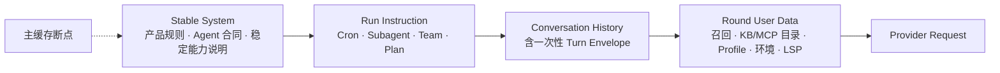
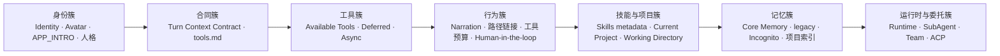
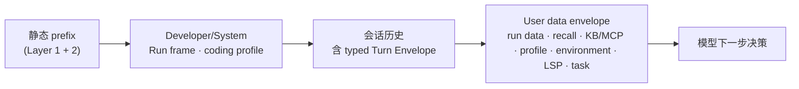
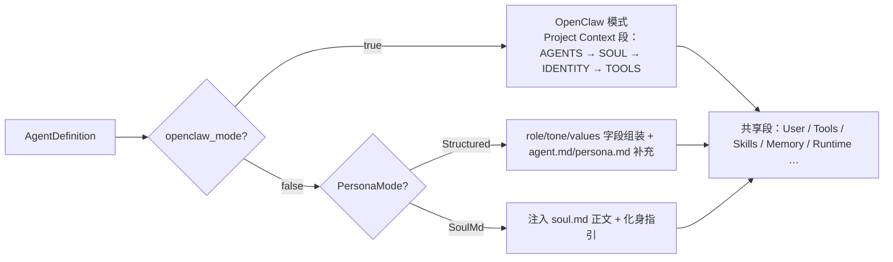

# Hope Agent 提示词系统技术文档

> 返回 [文档索引](../../README.md) | 更新时间：2026-08-23

## 目录

- [核心思想](#核心思想)
- [四通道结构与缓存边界](#四通道结构与缓存边界)
  - [首次提交 Typed Mention Wire 契约](#首次提交-typed-mention-wire-契约)
  - [Typed Mention 历史 Receipt](#typed-mention-历史-receipt)
  - [Layer 1 — 静态基础段](#layer-1--静态基础段)
  - [Layer 2 — 静态能力补充](#layer-2--静态能力补充)
  - [Layer 3 — 受信运行指令与动态用户数据](#layer-3--受信运行指令与动态用户数据)
- [两种组装模式](#两种组装模式)
  - [OpenClaw 兼容模式](#openclaw-兼容模式)
  - [Legacy 兜底路径](#legacy-兜底路径)
- [Agent Home 与会话工作目录](#agent-home-与会话工作目录)
- [会话状态段：权限 / 执行 / 工作流 / IM](#会话状态段权限--执行--工作流--im)
- [Per-Tool 描述系统](#per-tool-描述系统)
  - [工具描述清单](#工具描述清单)
  - [动态工具段生成](#动态工具段生成)
- [硬编码行为约束](#硬编码行为约束)
  - [Tool-Call Narration](#tool-call-narration)
  - [Human-in-the-loop](#human-in-the-loop)
  - [Memory Guidelines](#memory-guidelines)
- [Plan Mode 提示词](#plan-mode-提示词)
- [上下文压缩提示词](#上下文压缩提示词)
- [条件注入段](#条件注入段)
  - [Sub-Agent Delegation](#sub-agent-delegation)
  - [Sandbox Mode](#sandbox-mode)
  - [ACP External Agents](#acp-external-agents)
  - [桌面专属 Markdown 路径链接](#桌面专属-markdown-路径链接)
- [Prompt 缓存优化](#prompt-缓存优化)
  - [Cache 失效矩阵](#cache-失效矩阵)
- [关键文件索引](#关键文件索引)

---

## 核心思想

发给大模型的上下文不是一个无类型大字符串，而是四条有明确权威边界的通道：稳定 system、受信运行指令、当前用户 turn、非可信动态数据。稳定 system 仍由几十个 section 按固定顺序组装；`@`（包括 Plans 页产生的 typed `@plan`）、Skill 正文、Note、文件、Hook/IM metadata 不再追加到这个字符串。

这套设计围绕三个相互支撑的想法：

1. **稳定前缀 + role-correct 动态通道 = 缓存友好**。LLM 的 prompt 缓存按前缀命中。人格、产品合同、稳定能力说明与 eager tool schema 放在稳定前缀；Cron/Subagent/Plan 等运行框架放在其后的受信 instruction；用户选择的 Skill 保持 user authority；Note、文件、召回、Profile、环境、LSP、Hook/IM metadata 放在尾部 user-data 信封。动态内容既不改变稳定前缀，也不会因“动态”被提升为 system。

2. **行为红线编译进二进制，用户删不掉**。人格模板 `agent.md` 允许用户自定义甚至彻底重写。如果把「什么时候该问用户」「沙箱不是权限绕过」这类硬约束写进模板，用户一改就可能整段删掉，约束随之丢失。所以这些指引以编译期常量的形式由组装器直接注入，不经过任何用户可编辑的文件。

3. **Prompt 引导与执行授权分离**。每个 Agent 的工具、技能、子 Agent、KB 与 MCP 能力仍按 live policy 过滤；Skill 的 `allowed-tools` 对普通工具只会单调收窄，permission / sandbox / Tool Scope / KB access / subagent queue 才是执行边界。唯一 intrinsic continuation 例外 `read_context_resource` 不被 Skill / Plan ceiling 意外裁掉，但仍受 Agent `denied-tools`、`ToolScope`、turn / session / principal 绑定，并且只有统一 permission engine 验证的有效 bound ref 才确定性 allow。`@agent`、`@plugin`、`@connector` 只提供引用与能力数据，是否调用由主模型结合完整请求决定。

`ContextEngine` 的扩展口同样遵守这条边界：`stable_system_prompt_addition()` 只允许返回稳定、受信的引擎行为合同；召回结果、用户/项目正文与任何可变状态不得通过该接口进入 system，必须走动态 Data lane。

理解了这三点，后面所有的段序、条件、缓存策略都只是它们的落地细节。

---

## 四通道结构与缓存边界

一次请求先冻结当前 turn 的 typed sidecar，再由四个 Provider adapter 按各自 wire 协议映射同一逻辑边界：



当前用户输入及其 typed bindings 只在 conversation history 中物化一次。Tool Loop 只追加完整 API round；Provider retry/failover 复用同一个冻结 context、文件字节、Agent ref 与 Skill ceiling。动态数据只参与完整上下文预算，不参与稳定 system fingerprint 或 request routing key。

Composer 的可执行 `@` chip 也以 typed binding 列表为准，不再仅凭正文正则渲染：手输/粘贴的 `@file`、Skill/Agent/Capability link 或 `@plan:` 同形文本保持普通文本外观和普通文本语义；只有第一方 picker/命令 AST 产生的 binding 才显示对应 chip。独立登记的只读 `[[note]]` 兼容语法仍可按正文显示并解析。

### 首次提交 Typed Mention Wire 契约

首次提交当前用户 turn 时，正文与 `IncomingTurnWire` sidecar 一起进入 direct dispatch 或 durable queue；它不是 system prompt 的一部分。当前已发布 wire 固定为 `promptContractVersion=3`、`mentionWireVersion=1`、`canonicalizationVersion=1`，形状如下（摘要值仅作占位）：

```json
{
  "promptContractVersion": 3,
  "mentionWireVersion": 1,
  "userInput": {
    "inputItemId": "input_1",
    "canonicalizationVersion": 1,
    "text": "检查 @README.md",
    "digest": "sha256:<64 lowercase hex>"
  },
  "mentions": [
    {
      "id": "mention_1",
      "kind": "file",
      "targetId": "README.md",
      "displayLabel": "README.md",
      "origin": "first_party_composer_gesture",
      "sourceAnchor": {
        "type": "inline",
        "inputItemId": "input_1",
        "canonicalTextDigest": "sha256:<same digest>",
        "startUtf8": 7,
        "endUtf8": 17
      }
    }
  ]
}
```

后端在解析对象或进行 Provider I/O 前执行原子校验：版本必须完全匹配；`userInput.text` 必须等于实际提交正文，SHA-256 必须由后端重算一致；`inputItemId` / mention id 只能含 ASCII 字母数字、`-`、`_` 且不超过 128 bytes；最多 32 个 mention；`targetId` 非空、无控制字符且不超过 2048 bytes，label 不超过 256 bytes。当前 transport **只接受** `SourceAnchor::Inline`：anchor 必须绑定同一 input id 与 digest，采用 canonical UTF-8 bytes 的半开区间，落在字符边界、非空且互不重叠；前端 DOM 的 UTF-16 offset 在构造 wire 时先转换为 UTF-8 offset。`AdjacentContentPart` 虽已存在于类型中，但当前校验会明确拒绝，不能把它写成已支持能力。

anchor 覆盖的原文 token 还必须与 `kind + targetId` 确定性匹配；`slash_command_ast` 目前只允许 Skill 且必须锚定整条 `/skill` 命令。缺少 sidecar 的普通输入仍合法，但其中同形 `@` 文本不产生 binding；带 sidecar 而版本、digest、span、token 或上限任一不符时整轮 fail-visible，不回退到字符串猜测。校验和 live resolution 的结果只冻结一次，后续 Tool Loop、retry 与 failover 复用同一 Initial Context；不会再次从可见正文解析或重新读取已冻结资源。

### Typed Mention 历史 Receipt

历史消息中的 `@` chip 也不从正文猜测。后端完成 typed wire 校验以及 File/Plan/Note/Skill/Agent/Plugin/Connector 解析后，先把最终 `PromptContextReceipt` 随 `initial_context_committed` 写入 turn journal；`flush(RoleSwitch)` 返回正数 durable sequence 后，才把可删除的 UI 投影幂等 merge 到该 `chat_turn.user_message_id` 对应的 `messages.attachments_meta.typed_mention_receipt`：

```json
{
  "receiptVersion": 1,
  "sourceJournalSeq": 7,
  "promptContractVersion": 3,
  "mentionWireVersion": 1,
  "canonicalTextFingerprint": "a4c9e21f8b3d670125ab4e9c",
  "contextFingerprint": "73de0a416b92c58f10ad7e34",
  "mentions": [
    {
      "mentionId": "file-1",
      "kind": "file",
      "targetId": "README.md",
      "displayLabel": "README",
      "origin": "first_party_composer_gesture",
      "status": "resolved",
      "raw": "@README.md",
      "startUtf8": 0,
      "endUtf8": 10
    }
  ]
}
```

投影只包含最终状态为 `resolved` 的 inline binding；`raw` 由后端按已验证 canonical message 的 UTF-8 span 精确提取，前端若使用 UTF-16 selection 必须显式换算，不能回退正则/parser。`sourceJournalSeq` 必须为正数，它把缓存投影绑定到已耐久的 Initial Context；journal 才是恢复真相源，message metadata 不参与执行、授权或重放。merge 事务必须重新读取目标 user-message 的 `content`，用同一 installation-keyed 算法重算 canonical fingerprint，并逐项复核 UTF-8 span/`raw` 后才可写 metadata；这样 Hook rewrite、`display_text` 或消息替换不会继承另一份输入快照的 provenance。legacy/空 binding、`unavailable`/`rejected`、span/fingerprint 不一致、durability flush 失败、缺少 turn→user-message 映射时均不写；Incognito 保持同形内存 receipt，但不新增 message metadata。Provider failover 重复投影同一 receipt 时该 key 覆盖自身、保留 plan/goal/user attachment 等其他 metadata。

Markdown 消息不会把可见 token 或静态 href 当作 provenance。每个 renderer 实例生成一个不可预测且在组件生命周期内稳定的 marker namespace，把已验证 span 映射到实例内 lookup table；历史 hydration 即使替换 binding 数组对象也复用同一 marker，避免 Markdown block memo 留下旧 href 后退化为普通锚点。消息卸载后 namespace 与 lookup table 一起销毁，手输同形 marker 不会获得 chip 语义。

`unavailable` / `rejected` 不能只存在 journal/UI receipt 中：在 Provider I/O 前，后端还会按已验证 source anchor 排序，把每个失败 binding 的 `mentionId`、`kind`、`displayLabel`、`status` 放进当前 user-level Turn Envelope。该状态块不含 target id、远程错误、目标正文或安全判定原因，不从可见 token 反推对象，也不获得 system/developer authority；它只让模型明确知道选中的 Note、Agent 或 Capability 当前不可用，避免把缺失数据静默当成已读取。显式 Skill 是更严格的例外：整组 Skill 的 live resolution、正文 materialization 与 `allowed-tools` ceiling 必须原子成功，否则整个 turn 在 Provider I/O 前 fail-closed，不靠状态块继续成 unrestricted prompt。

### Layer 1 — 静态基础段

入口 `build_with_resolved_session()`。段落按 `sections.push()` 的实际顺序追加，空段在最终 `join("\n\n")` 前被过滤掉。逻辑上可分成几个簇：



完整段序（权威顺序以本表为准）：

| # | 段 | 恒定 / 条件 | 条件 |
| - | -- | ----------- | ---- |
| 1 | Identity 行 | 恒定 | OpenClaw 模式省略 role 后缀；结构化模式在 `PersonaMode::SoulMd` 下同样省略 |
| 2 | Avatar 行 | 条件 | `AgentConfig.avatar` 非空、非 `data:` URL、长度 ≤ `MAX_AVATAR_LEN`（1024） |
| 3 | `APP_INTRO` | 恒定 | 一句话说明 Hope Agent 是什么 |
| 4 | `# Project Context`（4 文件）+ SOUL 化身指引 | 条件 | 仅 `openclaw_mode`；化身段还需 SOUL.md 非空 |
| 5 | Personality | 条件 | 仅非 OpenClaw。`SoulMd` 模式注入 soul.md 正文 + 化身段；否则 `build_personality_section()` 非空时注入 |
| 6 | agent.md | 条件 | 非 OpenClaw 且文件非空 |
| 7 | persona.md | 条件 | 非 OpenClaw 且文件非空 |
| 8 | `# Turn Context Contract` | 恒定 | 声明 typed `@`、Skill、Resource、Agent ref 与执行权限的边界 |
| 9 | tools.md | 条件 | 非 OpenClaw（OpenClaw 已并入 `# Project Context`）且文件存在 |
| 10 | `# Available Tools` | 恒定 | 内容由 `dispatch::resolve_tool_fate` 过滤 |
| 11 | `# Additional Tools`（deferred 目录） | 条件 | 开启 deferred 工具加载 |
| 12 | 异步工具指南 | 条件 | 异步工具功能启用 |
| 13 | Tool-Call Narration | 条件 | `AppConfig.tool_call_narration_enabled`（默认 `true`） |
| 14 | `# File Path Formatting` | 条件 | `app_init::is_desktop()`，见[桌面专属 Markdown 路径链接](#桌面专属-markdown-路径链接) |
| 15 | 工具轮次预算提醒 | 条件 | `capabilities.max_tool_rounds` 有界（非 0） |
| 16 | `# Human-in-the-loop` | 恒定 | 编译常量，agent.md 不可覆盖 |
| 17 | Skills 目录 | 恒定 | 按 allow/deny 与会话 `paths:` 激活过滤；显式 Skill 正文不在此层 |
| 18 | `# Current Project` | 条件 | 会话属于项目（含 OpenClaw；其更早的 `# Project Context` 只描述四文件 Agent pack） |
| 19 | `# Working Directory`（含 `## Working Directory Instructions`） | 条件 | 会话 `working_dir` 非空；目录内容清单不在此层 |
| 20 | `# Core Memory`（V2 三作用域） | 条件 | `v2_core_enabled` 且渲染结果非空 |
| 21 | legacy Memory 段（Core 文件 / Pinned / Profile / SQLite + Guidelines） | 条件 | `memory_enabled`；子段再受 `legacy_core_enabled` / `legacy_static_enabled` 门控 |
| 22 | `# Incognito Session` | 条件 | `incognito` |
| 23 | 项目自动记忆索引 | 条件 | `legacy_core_enabled` 且传入了 `project_auto_memory_index` |
| 24 | `# Runtime` | 恒定 | Host / OS / Shell、模型 / provider、Agent home；当天日期不在此层 |
| 25 | Sub-Agent Delegation | 条件 | subagent capability 开启 **且** `subagent` 工具 eager **且** 段非空 |
| 26 | Agent Team | 条件 | `team.enabled` 且 `team` 工具 eager 且段非空 |
| 27 | ACP External Agents | 条件 | `acp.enabled` 且 `acp_spawn` 工具 eager 且段非空 |

**记忆段的稳定性契约**：20–23 属于 Layer 1 静态 prefix，同一会话的 `CoreMemorySnapshot` 在 reload / Tier 3 compact / 资格变化 / 进程重启前保持字节稳定。自动的 Fast/Deep Recall、Profile、Procedure、Awareness 一律走 Layer 3，不得反向改写这几段。完整预算与 fail-closed 契约见 [记忆系统架构](memory.md)。

**代码位置**：`crates/ha-core/src/system_prompt/build.rs` — `build_with_resolved_session()`。

### Layer 2 — 静态能力补充

入口 `Agent::append_stable_capability_prompt()`。它仍写在同一个前缀字符串里，追加在 Layer 1 之后，按以下顺序：

1. **eager 能力补充说明**：`send_notification` / `image_generate` / `audio_generate` / `canvas`——各自工具 eager 时才追加；`ToolScope` 收窄后按 scope 再过滤一遍（知识空间侧栏对话就不该宣传被裁掉的能力）。
2. **`# Unconfigured Capabilities`**：`ToolFate::HintOnly` 的工具，即「功能存在但尚未全局配置」的升级提示。hints 先 `sort()` 保证顺序稳定以利缓存；`ToolScope` 非 `None` 时整段清空。
3. 不再接受任何一次性自由字符串。Plan、MCP catalog、Knowledge Bases、用户 Profile 与 IM attach metadata 已分别进入 Run Instruction 或 Round User Data；`append_stable_capability_prompt()` 只补稳定、由本地 dispatch 决定的能力说明。

**代码位置**：`crates/ha-core/src/agent/mod.rs` — `append_stable_capability_prompt()`（经 `build_full_system_prompt` / `prepare_full_system_prompt` 进入）。

### Layer 3 — 受信运行指令与动态用户数据

顺序由 `streaming_adapter::dynamic_instruction_suffixes` / `dynamic_data_suffixes` 定义，四个 Provider 适配器共用同一来源顺序，由 `dynamic_context_contract_tests` 锁定。



`run_instruction_suffix` 与 Coding Profile 是受信运行指令；Permission / Execution / Workflow / Sandbox 当前模式、Active Goal 固定运行合同，以及仅在有活动任务时出现的固定 Task Tracker 合同，也在回合开始/round head 冻结到这一 lane，因此 mode、Goal 或任务正文变化不会重拼稳定 system。`run_data_suffix`、Active Goal 的用户目标与状态、Awareness、Active Memory、Procedure、相关笔记、已挂 KB、MCP 目录、User Profile、当天日期、天气/目录清单、LSP、任务 label/status snapshot 与 Hook 输出全部经 `<hope_round_data>` 放进 user role。Plan 固定合同与 plan 文档也分开存放，后者不能继承 developer authority。

Anthropic 只给稳定 system 与最后一个 eager tool schema 标显式 cache breakpoint；OpenAI Responses 的受支持模型把稳定 developer block设为 explicit breakpoint；Codex 不发送公共 OpenAI cache 参数。所有动态 block 都不带显式 cache marker。

压缩预算使用 `prompt_for_budget()` 计入稳定 prompt、受信 Run 与全部动态 user-data，但它只做预算输入，不改变真实 Provider role。

**代码位置**：
- Layer 3 顺序契约：`crates/ha-core/src/agent/streaming_adapter.rs`（`RoundRequest` / `dynamic_instruction_suffixes` / `dynamic_data_suffixes`）
- 每轮组装：`crates/ha-agent-runtime/src/streaming_loop.rs`（core 提供 prompt/context policy 端口）

---

## 两种组装模式

`build()` 根据 `config.openclaw_mode` 二选一，二者互斥，优先级 OpenClaw > 结构化。结构化模式内部还有一个 `SoulMd` 人格子变体（注入 `soul.md` 正文而非从字段组装）。第 4 段起的共享段（用户上下文、工具、技能、记忆、运行时……）两模式照常注入。



|               | 结构化模式（默认）                          | OpenClaw 兼容模式                 |
| ------------- | ------------------------------------------- | --------------------------------- |
| 触发条件      | 默认                                        | `openclaw_mode: true`             |
| Identity 行   | `"You are {name}, a {role}, running in Hope Agent on {os} {arch}."` | `"You are {name}, running in Hope Agent on {os} {arch}."` |
| Avatar 行     | `AgentConfig.avatar` 非空时追加 `"Your avatar image is at: {path}"`（跳过 `data:` URL 与超过 1KB 的字符串，防止 base64 图片膨胀 prompt） | 同左 |
| Personality   | `PersonalityConfig` 字段组装（或 SoulMd 注入 soul.md） | 跳过                              |
| agent.md      | 补充身份说明                                | 不使用                            |
| persona.md    | 补充个性说明                                | 不使用                            |
| OpenClaw 文件 | —                                           | 注入 `# Project Context` 段       |

### OpenClaw 兼容模式

启用 `openclaw_mode` 后，提示词采用 OpenClaw 风格的 4 文件组装，按固定顺序拼进 `# Project Context` 段（只注入非空文件）：

```
# Project Context

The following project context files have been loaded:

## AGENTS.md    ← 工作空间规则、红线、记忆指导
## SOUL.md      ← 性格、价值观、语气、边界
## IDENTITY.md  ← 身份元数据（名称、生物类型、风格）
## TOOLS.md     ← 本地环境说明（摄像头、SSH、TTS）
```

如果 SOUL.md 存在且非空，追加化身指引（`SOUL_EMBODIMENT_GUIDANCE`）：

> "If SOUL.md is present, embody its persona and tone throughout all interactions."

**文件存储**：`~/.hope-agent/agents/{id}/agents.md`、`identity.md`、`soul.md`（`tools.md` 复用现有文件）。

**模板预填充**：首次启用时空文件自动填充内置模板（`crates/ha-core/templates/openclaw_*.md`，纯英文）。

**UI 行为**：启用后 Identity/Personality tab 禁用（显示提示），行为 tab 工具指导只读，记忆 tab 提示核心记忆与 OpenClaw MEMORY.md 兼容。

**与其他段的关系**：OpenClaw 模式下 `tools.md` 已并入 `# Project Context`，跳过独立的 tools.md 段；其余共享段照常注入。

**代码位置**：`crates/ha-core/src/system_prompt/build.rs` — `build()` 开头的 `if definition.config.openclaw_mode` 分支。

### Legacy 兜底路径

`build_legacy()` 在 `load_agent()` 加载 Agent 配置失败时（配置文件损坏或不存在）作为降级路径，拼出一个能用的基础 system prompt：

- 用默认 agent.md 模板作身份段，注入**全部**工具描述（不按 Agent 过滤）
- 从全局 `AppConfig` 加载技能
- 保留 Tool-Call Narration（同样受 `tool_call_narration_enabled` 门控）、异步工具指南、工具预算、运行时段
- **不注入** Human-in-the-loop、权限 / 执行 / 工作流模式、Markdown 路径链接、Memory、SubAgent、Sandbox、ACP 等需要 Agent 定义或会话状态的段

它是异常路径下的最小可用 prompt，正常会话永远走 `build()`。

**代码位置**：`crates/ha-core/src/system_prompt/build.rs` — `build_legacy()`。

---

## Agent Home 与会话工作目录

这两个目录在 prompt 中必须语义分离，否则模型会把 Agent 自己的内部目录误当成用户的项目目录。

| 概念 | 来源 | Prompt 呈现 | 用途 |
| ---- | ---- | ----------- | ---- |
| **Agent home** | `paths::agent_home_dir(agent_id)`，形如 `~/.hope-agent/{agent_id}-home/` | `# Runtime` 段中的 `- Agent home: ...` | Agent 自己的长期 scratch/home，可存工作期间的内部文件和状态 |
| **会话工作目录** | `sessions.working_dir`，由 `set_session_working_dir` 设置 | 独立 `# Working Directory` 段 | 当前会话用户希望默认读写的业务目录 |

`Agent home` 不再在 prompt 中叫「Working directory」。`# Working Directory` 段在会话 `working_dir` 设置时注入（项目会话总有工作目录——显式 `working_dir` 或懒创建的默认 workspace），位置在 `# Current Project` 之后、Memory 之前；段内指令子节 `## Working Directory Instructions` 会同步发现并注入目录约定（按 AGENTS.md 优先、CLAUDE.md fallback，含其 `@`-引入的文件），无需用户每轮重复。

**项目指令没有数据库副本**：设置页直接编辑项目根 `AGENTS.md`，添加已有目录时可显式选择不创建缺失文件；`# Current Project` 只描述项目元数据，`# Working Directory` 是项目指令的唯一注入点。

**当天日期与顶层文件清单不再属于 system prompt**。它们和天气合并为 `build_round_environment_data()` 的非可信环境观察，经 `<hope_round_data source="environment">` 放在 user-data 尾部；目录清单非递归、只列名字、名称排序、跳过隐藏与 `.git`/`node_modules`/`target`/`__pycache__`/`.venv` 等目录、cap 100 条。跨日、增删文件或天气刷新因此不改变 stable system fingerprint。模型靠 `date` 获取精确时区时间，靠 `read` / `read_context_resource` 等工具读取具体内容。

执行层与 prompt 保持一致：path-aware 工具的相对路径按「显式绝对路径 > 会话工作目录 > Agent home」解析；`exec` 无 `cwd` 时再回退到用户 home。详细工具层规则见 [tool-system.md](tool-system.md#2-文件系统)。

**代码位置**：
- Runtime / Working Directory / 每轮环境数据：`crates/ha-core/src/system_prompt/sections.rs`
- 注入顺序：`crates/ha-core/src/system_prompt/build.rs`
- 会话 working dir 取值：`crates/ha-core/src/agent/config.rs`、`crates/ha-core/src/agent/mod.rs`

---

## 会话状态上下文：权限 / 执行 / 工作流 / IM

`prepare_session_policy_context()` 在 blocking pool 从绑定的 `SessionDB` 读取权限、执行、工作流、Sandbox 与 Active Goal，冻结成当轮 policy snapshot。它们都是**行为提示**而非权限开关——真正的裁决仍在权限引擎、sandbox、hook、workflow runtime。IM 同样按 turn 拆为固定 Run instruction 与外部 Data；这些内容都不进入稳定 system 字符串。

| 段落 | 来源 | 触发条件 | 作用 |
| ---- | ---- | -------- | ---- |
| `# Current Permission Mode` | `sessions.permission_mode` | 每个正常 chat turn | 告诉模型当前处于 `default` / `smart` / `yolo`，合理决定工具调用自主度；权限引擎仍是唯一真相 |
| `# Execution Mode` | `sessions.execution_mode` | `guarded` / `deep` / `autonomous`；`off` 不注入 | 告诉模型长任务推进策略、验证深度、修复次数和停止条件 |
| `# Workflow Mode` | `sessions.workflow_mode` | `on` / `ultracode`；`off` 不注入 | 告诉模型可自主动态编排；由模型判断是否调 `workflow_run` 创建 durable run |
| IM attachment/frame | `SessionMeta.channel_info` / inbound envelope | 会话绑定或消息来自 IM | 固定行为走 Run instruction；chat/sender 字段走 user-data |

### Permission Mode

`build_permission_mode_guidance()` 按三档生成不同正文，并由 `prepare_session_policy_context()` 在回合开始时作为 trusted run instruction 冻结；它不属于 Layer 1：

- **`default`**：照常调用必要工具，是否弹审批由系统决定；不要因为「可能弹窗」而提前停下。
- **`smart`**：在 default 语义上说明 `_confidence: "high"` 自报字段——`write`/`edit`/`apply_patch` 判断安全时可加此字段跳过审批（工作目录内常规编辑、本对话已改过的文件通常合格）；大范围覆盖、删除、目录外写入应留给审批。保护路径（`~/.ssh`、`.env`）与危险命令（`rm -rf /`、`git push --force`）永远不能靠该字段放行。
- **`yolo`**：当前会话审批层已授予全部权限，鼓励模型在目标与范围明确时更自由主动地推进；同时强调授权不代表可偏离用户目标，Plan Mode 与后端硬安全仍可覆盖。

### Execution Mode

`ExecutionMode::system_prompt_section()` 生成 run instruction，枚举 `off | guarded | deep | autonomous`：

- **`off`**：默认，不注入。
- **`guarded`**：非平凡 coding work 走 observe → plan → edit → targeted validate → report；验证失败**最多一次**定向修复。
- **`deep`**：更充分的仓库侦察与回归风险判断，适合跨模块 / 长任务；验证失败**最多两次**定向修复。
- **`autonomous`**：允许在普通 observe/edit/validate 步骤间持续推进而不逐步等确认，但保留全部权限、hook、sandbox、审批和项目边界——此模式绝不绕过审批门。

它只影响模型的行为规划；持久 workflow 的创建 / 审批 / 暂停 / 恢复 / 取消仍由 [Workflow](../agent/workflow.md) 的 runtime / owner API 执行。

### Workflow Mode

`WorkflowMode::system_prompt_section()` 生成 run instruction，枚举 `off | on | ultracode`：

- **`off`**：默认，不注入段，也不向模型暴露 `workflow_run`。
- **`on`**：提示模型在多阶段、宽搜索/比较、connector 或文件证据、长时间运行、独立验证、可恢复后台执行或需可审计轨迹时自行调 `workflow_run`；tiny 对话、单个显然动作、已验证机械任务保持 inline。
- **`ultracode`**：在 `on` 基础上更偏质量和覆盖，实质任务默认作为 workflow 候选。

该段明确 Workflow 不是 coding-only、也不是「让用户写脚本」的功能——模型应自己生成 workflow script 并创建 durable run。执行层仍由 `workflow_run` 工具、Workflow Script Gate、permission preview、primary launcher、pause/resume/cancel/recovery 兜底。

### IM Channel Attachment

`# IM Channel Attachment` 的固定行为合同通过 `RunInstructionContext::Channel` 放在稳定缓存断点之后；当前 inbound sender/chat metadata 以及桌面/HTTP attach 的 audience metadata 通过 `run_data_suffix` 放在 user-data lane。两者不再共享自由字符串：外部平台字段永远是非可信 routing/audience data。

**代码位置**：
- Permission mode guidance：`crates/ha-core/src/system_prompt/constants.rs`
- Execution mode section：`crates/ha-base/src/execution_mode.rs`
- Workflow mode section：`crates/ha-base/src/workflow_mode.rs`
- IM attachment section：`crates/ha-core/src/system_prompt/sections.rs`
- 会话状态解析：`crates/ha-core/src/agent/config.rs`

### Active Goal 与 Sandbox

`prepare_session_policy_context()` 在 blocking pool 读取绑定 `SessionDB`，把 permission / execution / workflow / sandbox 与 Active Goal 作为一个当轮快照。Active Goal 的固定自治、证据与完成规则由 `active_goal_runtime_contract()` 进入 trusted run instruction；objective、criteria、handoff、budget、audit 等可变字段由 `render_active_goal_data()` 进入 user-data。Sandbox 只把后端已生效的模式与配置告诉模型，执行真相仍由 sandbox / permission 层掌握。Provider retry / failover 复用同一初始快照。

---

## Per-Tool 描述系统

每个工具拥有一条独立的详细描述常量，取代把所有工具挤在一起的单一字符串。这带来三个好处：

1. **精准过滤**：Agent 只看到被授权的工具描述，减少无关 token。
2. **详细指南**：每条描述包含使用方式、最佳实践、常见陷阱。
3. **工具优先级**：`exec` 明确标注「优先使用专用工具」，防止模型绕过 `read`/`edit`/`grep`/`find` 直接用 shell。

### 工具描述清单

工具描述以 `TOOL_DESC_*` 常量定义，通过 `TOOL_DESCRIPTIONS` 数组（`name → 常量`）映射。

| 分类         | 工具               | 常量                           | 描述要点                                                 |
| ------------ | ------------------ | ------------------------------ | -------------------------------------------------------- |
| **执行**     | exec               | `TOOL_DESC_EXEC`               | cwd/timeout/background/sandbox；**强调优先使用专用工具** |
|              | process            | `TOOL_DESC_PROCESS`            | 管理 legacy 后台 exec session；禁止 sleep 轮询           |
| **文件操作** | read               | `TOOL_DESC_READ`               | 分页/图片检测/PDF 分页；**先读后改**                     |
|              | write              | `TOOL_DESC_WRITE`              | 优先用 edit；不创建不必要的文件                          |
|              | edit               | `TOOL_DESC_EDIT`               | old_text 唯一性；replace_all 重命名                      |
|              | ls                 | `TOOL_DESC_LS`                 | 目录列表；创建前先验证                                   |
|              | grep               | `TOOL_DESC_GREP`               | **禁止用 exec 替代**；regex + multiline                  |
|              | find               | `TOOL_DESC_FIND`               | **禁止用 exec 替代**；glob 模式                          |
|              | apply_patch        | `TOOL_DESC_APPLY_PATCH`        | 多文件补丁；3-pass fuzzy matching                        |
| **网络**     | web_search         | `TOOL_DESC_WEB_SEARCH`         | 搜索当前信息                                             |
|              | web_fetch          | `TOOL_DESC_WEB_FETCH`          | 抓取网页内容                                             |
|              | browser            | `TOOL_DESC_BROWSER`            | 无头浏览器；动态页面交互                                 |
| **记忆**     | save_memory        | `TOOL_DESC_SAVE_MEMORY`        | 事实/截止日期/临时上下文；禁止保存临时信息               |
|              | recall_memory      | `TOOL_DESC_RECALL_MEMORY`      | 关键词/语义搜索；include_history                         |
|              | update_memory      | `TOOL_DESC_UPDATE_MEMORY`      | 更新已有记忆                                             |
|              | delete_memory      | `TOOL_DESC_DELETE_MEMORY`      | 删除过期记忆                                             |
|              | update_core_memory | `TOOL_DESC_UPDATE_CORE_MEMORY` | 持久指令写入 Core（兼容别名）                            |
|              | memory_get         | `TOOL_DESC_MEMORY_GET`         | 按 ID 获取完整记忆                                       |
| **委托**     | subagent           | `TOOL_DESC_SUBAGENT`           | spawn/send/check/kill；异步执行与受限 continuation       |
|              | agents_list        | `TOOL_DESC_AGENTS_LIST`        | 列出可委托 Agent                                         |
|              | acp_spawn          | `TOOL_DESC_ACP_SPAWN`          | 外部 ACP Agent（Claude Code/Codex）                      |
| **会话**     | sessions_create    | `TOOL_DESC_SESSIONS_CREATE`    | 创建普通/Project 会话并可直接启动首个持久 turn           |
|              | sessions_list      | `TOOL_DESC_SESSIONS_LIST`      | 跨会话通信发现                                           |
|              | session_status     | `TOOL_DESC_SESSION_STATUS`     | 会话详细状态                                             |
|              | sessions_search    | `TOOL_DESC_SESSIONS_SEARCH`    | FTS 检索会话消息并返回上下文窗口                         |
|              | sessions_history   | `TOOL_DESC_SESSIONS_HISTORY`   | 分页历史记录                                             |
|              | sessions_send      | `TOOL_DESC_SESSIONS_SEND`      | 向已有普通会话提交持久 turn                              |
| **媒体**     | image              | `TOOL_DESC_IMAGE`              | 视觉输入；把图片附件带入下一轮模型并用 task/question 指定目标 |
|              | image_generate     | `TOOL_DESC_IMAGE_GENERATE`     | AI 图片生成；failover                                    |
|              | audio_generate     | `TOOL_DESC_AUDIO_GENERATE`     | 音频生成（TTS 语音 / 音乐 / 音效）；failover             |
|              | pdf                | `TOOL_DESC_PDF`                | PDF 文本提取；大文件必须分页                             |
| **其他**     | canvas             | `TOOL_DESC_CANVAS`             | 富内容制品                                               |
|              | manage_cron        | `TOOL_DESC_MANAGE_CRON`        | 定时任务管理                                             |
|              | send_notification  | `TOOL_DESC_SEND_NOTIFICATION`  | 系统通知                                                 |
|              | ask_user_question  | `TOOL_DESC_ASK_USER_QUESTION`  | 结构化交互问答；**WHEN / WHEN NOT / HOW 三段触发规则**   |
|              | get_weather        | `TOOL_DESC_GET_WEATHER`        | 天气查询                                                 |
|              | task_create        | `TOOL_DESC_TASK_CREATE`        | 计划任务创建                                             |
|              | task_update        | `TOOL_DESC_TASK_UPDATE`        | 任务状态/字段更新                                        |
|              | task_list          | `TOOL_DESC_TASK_LIST`          | 列出当前任务                                             |

**代码位置**：`crates/ha-core/src/system_prompt/constants.rs`。

### 动态工具段生成

`# Available Tools` 段只放当次真正 eager 的工具描述，判定源是 `dispatch::resolve_tool_fate`：

```rust
fn build_tools_section(agent_id, agent_config, incognito) -> String {
    let ctx = DispatchContext { agent_id, agent_config, incognito, app_config };
    let eager = all_dispatchable_tools()
        .filter(|tool| matches!(resolve_tool_fate(tool, &ctx), InjectEager));
    let descs = TOOL_DESCRIPTIONS
        .filter(|(name, _)| eager.contains(name));
    format!("# Available Tools\n\n{}", descs.join("\n\n"))
}
```

- Core 工具按 tier 直接注入；Standard / Configured 工具先按 `capabilities.tools.allow/deny` 覆盖 tier 默认值。
- Configured 工具未完成全局配置时不进 Available Tools，而进入 `# Unconfigured Capabilities` 提示（Layer 2）。
- deferred 工具不进 Available Tools，进入 `# Additional Tools (use tool_search to discover)`。
- **共享同一套语义**：`# Available Tools`、`agent/mod.rs::build_tool_schemas()`、`tool_search` 和执行层兜底都以 `dispatch::resolve_tool_fate()` 为准。

**代码位置**：`crates/ha-core/src/system_prompt/sections.rs` — `build_tools_section()`。

### 运行控制语义与最小提示词

插入中的用户消息最终以真正的 `user` message 进入 provider history，模型天然能看到最新要求；因此**不得**为“插入”另加一段全局状态机提示，也不得把 UI 状态、工具路由表或取消进度复制进 system prompt。默认基线是零新增“插入场景专用”的跨工具全局指令；只允许精简校准既有工具摘要、schema 与 action 可发现性，避免稳定前缀膨胀和工具契约漂移。

模型能否查看、调整、关闭、暂停或恢复某类运行单元，以各工具 schema 的 action 枚举、描述和执行层校验为准：普通 Subagent 支持查看、发送调整、关闭与受限 continuation，但没有 pause；Async Job 和 Process 只有查看/取消类能力；Team 与 Workflow 的 `pause/resume` 必须出现在各自工具描述的关键动作中；Cron 的 pause/resume 只控制 schedule 生命周期，不冒充冻结或恢复当前 run。`runtime_cancel` 只描述可证明属于当前会话的 kind，不能把应用级全局对象包装成模型可取消对象。

工具描述必须区分“取消请求已接受”和“目标已进入终态”，并写明不可恢复的停止原因。只有专项评测稳定证明模型在收到新 user message 后不会重新评估已有委派时，才允许补充一条跨工具原则；具体动作和生命周期仍留在工具描述，不上升为新的长篇行为段。

当前不提供统一的模型侧 `runtime_status` 或 `stop_everything`：各子系统的 `list/check/status` 保留自己的真相源、owner 边界和生命周期语义，模型按需发现并分域操作。只有真实模型专项评测持续证明现有发现路径不足，才可另行评估只读聚合状态；它不得顺带成为新的写入口，也不得把不同运行单元压成虚假的统一 pause/resume。

---

## 硬编码行为约束

以下三段以编译期常量注入，用户改 `agent.md` 也删不掉——它们是模型行为的底线，必须和工具 schema 一起始终可用。

### Tool-Call Narration

紧跟异步工具指南、先于 Human-in-the-loop 注入。`build()` / `build_legacy()` 两条路径都在 `AppConfig.tool_call_narration_enabled` 为真时注入（默认 `true`，用户可关）——这是它与「无条件注入」的 Human-in-the-loop 的唯一区别。

**动机**：对齐「边说边做」的体验。Messages API / OpenAI streaming 原生支持在一个 assistant turn 内 `text_delta` 与 `tool_use` block 交替输出，模型完全可以「先吐一句自然语言预告 → 再 emit 工具调用」。体验的核心不在流式或 UI 管线，而在 system prompt 是否显式要求模型这样做。

段标题为 `# Text output (does not apply to tool calls)`，指令要点：

- 第一次工具调用前用一句话说清即将做什么
- 只在出现新发现、方向改变、阻塞、委托或完成时更新叙述，连续两次调用之间不重复同一意图
- 禁止叙述内部独白（「let me think…」）
- 用完整、简洁的句子，末尾说清 what changed / what's next

**代码位置**：常量 `TOOL_CALL_NARRATION_GUIDANCE`（`constants.rs`）；注入见 `build.rs`；门控旗标 `AppConfig.tool_call_narration_enabled`（默认 `true`）。

### Human-in-the-loop

紧跟工具描述 / Tool-Call Narration 之后注入，始终启用（`ask_user_question` 是 Core Interaction 工具，不受非 Core 工具开关影响）。它给模型一个**全局思维框架**：把 `ask_user_question` 当作「主动协作的常规通道」，而非「卡住时的兜底升级」。

三段结构：

| 段落 | 用途 | 要点 |
|------|------|------|
| **Ask the user when** | 强触发器 | 不可逆/高代价操作（删 >5 文件 / DB 迁移 / force push / 依赖 major bump）、真实歧义、多路径相近、≥2 次失败 |
| **Do NOT ask when** | 反触发器（刹车） | 可自查的（read/grep/ls 能查、AGENTS.md 已记）、低成本可撤销、纯风格/格式/命名 |
| **How to ask** | 节流约束 | 相关问题合并成一次调用（最多 4 问）、每任务 ≤1–2 次、优先前置 |

**与工具描述层的协同**：`TOOL_DESC_ASK_USER_QUESTION` 也含 WHEN / WHEN NOT / HOW 三段，但聚焦**工具调用的具体规则**（参数语法、Plan Mode 禁令、approval 边界）；Human-in-the-loop 段则提供**全局思维框架**。两层措辞不同——工具描述说「怎么问」，全局指引说「何时切换到问的模式」。详细对比见 [ask-user.md](../agent/ask-user.md)。

**代码位置**：常量 `HUMAN_IN_THE_LOOP_GUIDANCE`（`constants.rs`）；注入见 `build.rs`（Tool-Call Narration 之后）。

### Memory Guidelines

`MEMORY_GUIDELINES` 常量，作为 Memory 段的 guidelines 子段追加，仅在有效 Memory policy 允许时注入。它指导 Agent 区分各记忆工具的使用场景，且**从记忆预算里预留自身长度**——避免过大的 `MEMORY.md` 把这段指引挤掉，让模型失去用工具的方法。

| 工具                                  | 使用场景                                      |
| ------------------------------------- | --------------------------------------------- |
| `core_memory`                         | 三层 Core 索引 / topic 的读取、写入、提升与 reload |
| `update_core_memory`                  | 旧长期指令写入兼容入口，内部映射到 Core       |
| `project_memory`                      | Project Core topic 的兼容入口，仅项目会话可用 |
| `save_memory`                         | 事实、截止日期、临时上下文、值得备注的发现    |
| `recall_memory`                       | 查找先前偏好/约束/上下文                      |
| `recall_memory(include_history=true)` | 搜索历史对话（「last time」「we discussed」） |

**禁止保存**：临时任务细节、代码片段、调试步骤、可从代码库推导的信息。

默认只把会话冻结的 Global / Agent / Project `CoreMemorySnapshot` 与紧凑工具协议放进稳定 Memory 段；SQLite memories、Profile Snapshot、Pinned Claims、Episode、Procedure、Graph 均走当轮的 Dynamic Recall 后缀（Layer 3），不再默认常驻。只有完整 V1 rollback 或显式 `compatibility.legacyStaticMemory=true` 才恢复旧静态块。完整预算、迁移、会话 policy 和 fail-closed 契约见 [记忆系统架构](memory.md)。

**代码位置**：常量 `MEMORY_GUIDELINES`（`constants.rs`）；渲染与预算记账在 `build.rs` 的 `build_memory_section()`；V2 三作用域 Core 渲染在记忆模块的 `render_core_memory_v2_for_context()`。

---

## Plan Mode 上下文

Plan Mode 不重拼稳定 system prompt。平台维护的 Planning / Review / Executing 固定合同在 turn start 冻结为稳定缓存断点之后的 Run Instruction；用户或模型写出的 plan 文档通过独立 `plan_data` 进入 user-data。两者由 `PlanResolvedContext` 同时解析，同一 turn 的 retry / failover 复用冻结快照。详细架构见 [Plan Mode 架构文档](../agent/plan-mode.md)。四条兼容命名常量位于 `crates/ha-core/src/plan/constants.rs`，其中的 `SYSTEM_PROMPT` 名称不代表实际 placement。

### 5 阶段规划 Prompt

**常量**：`PLAN_MODE_SYSTEM_PROMPT`

```
Phase 1: Deep Exploration        → subagent 并行探索（最多 3 个），梳理关键要素和依赖
Phase 2: Requirements Clarification → ask_user_question 结构化问答，带选项卡片
Phase 3: Design & Architecture    → 方案对比，风险识别
Phase 4: Plan Composition         → submit_plan 提交
Phase 5: Review & Refinement      → 用户审核，inline comment 修订
```

**工具限制**：

- 禁止修改项目文件：`apply_patch`、`canvas`（连带 `write`/`edit`/`artifact` 一并锁死）
- `write`/`edit` 只能操作 `~/.hope-agent/plans/` 下的 `.md` 计划文件
- `exec`（shell 命令）需用户审批
- 允许：`read`、`grep`、`find`、`web_search`、`web_fetch`、`subagent`、`ask_user_question`、`submit_plan`

**计划格式要求**：

- 以**逻辑单元为中心**组织步骤，而非抽象阶段
- 主步骤用有序列表 `1. <动词> — <文件路径或交付物>`；复杂计划可用 `### Step N` 标题
- 涉及代码修改时包含代码片段、文件引用、wire-up 细节；引用已有内容标注来源
- **不使用 markdown 复选框语法**（`- [ ]` / `- [x]`）——计划是可读的执行指南，细粒度执行 todo 由执行阶段的 task 工具单独跟踪
- 代码任务须含 `Critical Files / Files` 段；末尾 `Verification` 段列出具体验证方法

### 执行阶段 Prompt

**常量**：`PLAN_EXECUTING_SYSTEM_PROMPT_PREFIX`

- 已审批计划在执行期**冻结**——不改 plan 文件；需结构性修订时退出再重新进入 plan mode 增量编辑
- 用 `task_create` / `task_update` 追踪进度（三态：pending / in_progress / completed），同一时刻至多一个 `in_progress`
- 执行期新发现的工作追加为 todo，而非改计划文件
- 执行前已建 git checkpoint，失败可回滚

### 完成阶段 Prompt

**常量**：`PLAN_COMPLETED_SYSTEM_PROMPT`

- 总结完成情况
- 高亮失败/跳过的步骤并解释原因
- 建议后续行动

### 子 Agent 上下文隔离

**常量**：`PLAN_SUBAGENT_CONTEXT_NOTICE`

Plan Mode 用子 Agent 探索时注入此 notice，提醒 planning subagent：执行 Agent **看不到**你的探索历史，计划必须**自包含**（关键细节、来源引用、前置条件）——「The plan IS the only context」。

---

## 上下文压缩提示词

上下文压缩采用 5 层渐进式结构（Tier 0 反应式微压缩 + Tier 1–4），Prompt System 仅在压缩动作发生时复用下列常量参与第 3 层 LLM 摘要。触发条件、mid-loop checkpoint、ledger/recovery 等实现细节见 [context-compact.md](context-compact.md)。

### Summarization System Prompt

**常量**：`SUMMARIZATION_SYSTEM_PROMPT`（`context_compact/summarization.rs`）

```
You are a context compaction assistant.
CRITICAL: Respond with TEXT ONLY. Do NOT call tools.

You are creating a continuation summary for a long-running local AI assistant session.
The old conversation history will be replaced by your summary, followed by
deterministic runtime state and recent messages.

Include these sections:
## Primary Request and Success Criteria
## Current Execution State
## Decisions and Rationale
## Files, Symbols, and Artifacts
## Tool Results Worth Preserving
## Errors, Failed Attempts, and Fixes
## User Feedback and Constraints
## Pending Work and Next Action
## Trust Boundaries and Security Notes
```

**设计要点**：

- 摘要是 continuation handoff，不是全局状态镜像；下一个模型实例应能立即接手。
- 明确 no-tools guard：摘要模型只输出文本。
- 9 段结构化输出，覆盖成功标准、执行状态、决策、文件/符号、值得保留的工具结果、失败尝试、用户纠正、下一步和信任边界。
- 精确保留路径、ID、URL、命令名、函数名和用户约束；逐条保留用户反馈以免压缩后重复犯错。
- 不把 tool output / web / KB / recovered file snapshot 这类 untrusted data 当指令。
- 不重复 runtime ledger，也不复述每轮会从 live state 重建的 task/memory/KB/cwd/permission 状态，避免第二真相源。

### 标识符保留策略

**常量**：`IDENTIFIER_PRESERVATION_INSTRUCTIONS`（`context_compact/mod.rs`）

```
Preserve all opaque identifiers exactly as written (no shortening or reconstruction),
including UUIDs, hashes, IDs, tokens, hostnames, IPs, ports, URLs, and file names.
```

通过 `CompactConfig.identifier_policy` 配置：

| 策略             | 行为                                     |
| ---------------- | ---------------------------------------- |
| `strict`（默认） | 使用内置保留指令                         |
| `off`            | 不注入保留指令                           |
| `custom`         | 使用用户自定义 `identifier_instructions` |

### 压缩配置参数

| 参数                         | 默认值 | 说明                         |
| ---------------------------- | ------ | ---------------------------- |
| `soft_trim_ratio`            | 0.50   | Tier 2 软截断触发比例        |
| `hard_clear_ratio`           | 0.70   | Tier 2 硬清除触发比例        |
| `preserve_recent_rounds`     | 4      | 保护最近 N 个消息 round；普通短回合尽量扩到所属 user turn，长 tool loop 保持可裁剪前缀 |
| `soft_trim_max_chars`        | 6,000  | 超过此值才软截断             |
| `soft_trim_head_chars`       | 2,000  | 软截断保留头部               |
| `soft_trim_tail_chars`       | 2,000  | 软截断保留尾部               |
| `summarization_threshold`    | 0.85   | Tier 3 总结触发比例          |
| `summary_max_tokens`         | 4,096  | 总结输出最大 token           |
| `summarization_timeout_secs` | 300    | 总结调用超时                 |
| `max_compaction_injected_context_share` | 0.5 | Tier 3 摘要、ledger、recovery 的联合注入预算 |

**代码位置**：`CompactConfig` 结构与默认值在 `crates/ha-config-schema/src/context_compact.rs`；摘要提示词与 split 逻辑在 `crates/ha-core/src/context_compact/summarization.rs`。

---

## 条件注入段

### Sub-Agent Delegation

**触发条件**：subagent capability 开启 **且** `subagent` 工具 eager **且** 段非空。

**注入内容**：

- 可委托 Agent 列表（emoji + name + id + description）
- 使用方式：spawn → 异步执行 → 自动推送结果；canonical `send` 调整活跃 attempt 或为允许续跑的终态创建新 immutable attempt，`steer` / `resume` 仅为兼容别名；check 查看状态；kill 只请求关闭，确认终态后才能宣称已停止
- spawn 选项：label、files、model override
- 当前深度显示 `Current depth: N/M`

**过滤规则**：列出自身并标注 `*(self — fork for parallel work)*` 支持 self-fork 并行；受 `SubagentConfig.allow/deny` 控制。

**代码位置**：`crates/ha-core/src/system_prompt/sections.rs` — SubAgent Delegation 段构建。

### Sandbox Mode

**触发条件**：当前有效 `sandbox_mode.enabled()`；有 `session_id` 时用 `sessions.sandbox_mode`，无 session meta 时回落到 `AgentConfig.capabilities.effective_default_sandbox_mode()`。它由 `prepare_session_policy_context()` 生成 trusted run instruction，不进入 Layer 1。

**注入内容**：

- 当前会话沙箱模式和一句话行为
- `exec` 按 session policy 自动在 Docker 容器内执行，无需额外传 `sandbox=true`
- 当前 `SandboxConfig` 快照：镜像、network mode、rootfs 读写、capability policy、no-new-privileges、PID limit、tmpfs mount
- 工作目录在容器内挂载为 `/workspace`，持久化语义由模式决定
- 四种非 `off` 模式差异：`standard` 不放松审批、`isolated` 临时副本不持久化、`workspace` 真实工作区挂载并放松部分软审批、`trusted` 沙箱内最大自治但 strict 仍审批
- 安全/持久化边界：**沙箱不是权限绕过**；`write`/`edit`/`apply_patch` 仍是 host-side durable file 工具

**边界**：该段是模型行为提示，不是安全边界。实际执行以当前 `SessionMeta.sandbox_mode` 经 `ToolExecContext.sandbox_mode` 传入工具执行层为准；会话可在创建后切换 sandbox mode，新值从下一 turn 的 policy snapshot 生效。

### ACP External Agents

**触发条件**：`config.acp.enabled == true` 且 `acp_spawn` 工具 eager 且段非空（全局 `acp_control.enabled` 折进 tool-fate 判定）。

**注入内容**：

- 可用 ACP 后端列表（检测 binary 是否存在）
- 使用场景区分：`subagent`（内部）vs `acp_spawn`（外部）
- 异步执行 + check(wait=true) 阻塞等待

**代码位置**：`crates/ha-core/src/system_prompt/sections.rs` — ACP External Agents 段构建。

### 桌面专属 Markdown 路径链接

**触发条件**：`app_init::is_desktop()`（即 `runtime_role() == Some("desktop")`）。Server / ACP 模式跳过——server 用户点了也无从响应，ACP 的路径由外部编辑器接管。它是 Layer 1 段序里的第 14 段，紧跟 Tool-Call Narration；会话 Permission policy 位于稳定边界之后，不参与这里的相对顺序。

**注入内容**（`MARKDOWN_PATH_LINKS_GUIDANCE`，标题 `# File Path Formatting`）：

- 提到本地文件一律写成可点击 markdown 链接：`[file.ext](/absolute/path/file.ext)`，可带行号锚点 `[file.ext:42](/absolute/path/file.ext#L42)`
- 目标含空格时用尖括号包裹
- 禁止相对路径、`file://`、裸绝对路径和行内代码包裹的路径
- 该规则不适用于命令和标识符

**动机**：模型默认会吐 `/Users/.../foo.ts` 或行内代码形式的裸路径，两者都难读且不可点击。Markdown 链接同时解决「显示文本短」和「目标可点击」。

**前端消费路径**：

1. `MarkdownRenderer.tsx` 的 `localPathFromHref()` 判定一个 anchor 是否指向本机路径——接受 `/` 与 `~/` 前缀；也还原 Tauri/WebKit 有时把 `/Users/...` 暴露成同源绝对 URL 的情况（同源 origin 或 `tauri.localhost`，以及 `file:` 协议）。**只承诺 Unix 风格路径**：Streamdown 用固定 `defaultSchema` 的 `rehype-sanitize`，Windows `C:\` 路径的 href 在 sanitize 阶段就被剥掉，根本到不了这里。
2. `normalizeLocalPath()` 剥掉 `#L<line>` 锚点再 `decodeURI`。**当前不接 IDE 协议，行号会被丢弃**——prompt 允许模型写 `:42` / `#L42` 只为可读性，点击后仍按整文件打开。
3. 命中本地路径的 anchor 交给 `MarkdownFileLink`，走统一文件操作策略（`useFileResource` + `FileContextMenu`，见 [file-operations.md](file-operations.md)）：按 `fileKind` × 运行模式决议预览 / 打开 / 下载。桌面 Transport 的 `openFilePath()` 最终 `invoke("open_directory")`；HTTP Transport 的 `supportsLocalFileOps()` 返回 `false`，且 `/api/desktop/open-directory` 在 server 侧是 no-op（返回 `ok:false` + 说明），避免在 server 主机上误开文件。
4. **未命中本地路径**的 anchor 不付出任何 hook 与 ContextMenu 代价，直接渲染成普通 `<a>`（或 `MarkdownWebLink`）——一条流式消息可能渲染上百个 anchor，这是该文件的核心性能约束。

**例外（红线）**：这些 anchor 的悬浮提示用原生 HTML `title`，**不用 shadcn Tooltip**。包 `TooltipTrigger` 会在长回复里炸 DOM 并破坏 anchor 的组件签名。这是「Tooltip 必须用 `@/components/ui/tooltip`」的一处登记例外。

**代码位置**：
- 常量：`crates/ha-core/src/system_prompt/constants.rs` — `MARKDOWN_PATH_LINKS_GUIDANCE`
- 运行模式判定：`crates/ha-core/src/app_init.rs`（`is_desktop`，实现下沉 `ha-base::runtime_role`）
- 前端解析与分流：`src/components/common/MarkdownRenderer.tsx`
- Transport：`src/lib/transport-tauri.ts`（`openFilePath()`）；`src/lib/transport-http.ts`（`supportsLocalFileOps()`）；`crates/ha-server/src/routes/desktop.rs`（`open_directory()`）

---

## Prompt 缓存优化

整个提示词系统的组装策略最终服务一个目标：**最大化 prompt 缓存命中，压低费用与首字延迟**。

**请求诊断只记形状不记正文**。`agent::token_manifest` 每轮生成 content-free 的 `RoundTokenManifest`：只记各 prompt/tool/history 段的字节数、估算 token、安装/进程本地 keyed fingerprint、工具计数和 transport body 大小，不记录正文或可离线枚举的裸内容 hash。稳定 system + eager tools 位于前缀；动态 instruction/data 位于其后。

**返回后按 provider/model/round 记实际用量**。`contextInputTokens`、`freshInputTokens`、cache read/write、output 与 TTFT。Prompt Cache 只改变 fresh prefill、费用和 TTFT；`contextInputTokens` 始终表示模型本轮实际占用的完整上下文，不因 cache hit 减少。

**缓存路由 key**。`prompt_cache_key` 由 installation-local 持久密钥对 provider、model、Provider instance（配置 id + base URL）、当前认证主体的 keyed partition、prompt contract v3、稳定 system，以及本轮最终 eager + deferred tool schema 做 keyed digest；非 Incognito 另以 Agent id、Incognito 以 session id 生成隔离 scope。API Key、account id 和裸 auth hash 不进入请求或日志。用户文本、History、Run frame、typed mention 的正文、Skill/Note/Hook/IM data 本身不进入 key；但 mention/Skill/Plan/KB/MCP 状态若改变了最终 tool schema，schema bytes 会使 key 有意变化。切换 auth profile/account、兼容 backend、Agent 或 Incognito session 会强制换 partition/scope。OpenAI Chat 对兼容端点做 capability 记忆；Anthropic 不使用 request-level key；Codex 明确不发送该字段。

**持久 key 的发布与降级**。进程内以单一 `OnceLock<RoutingKeyState>` 串行化首次初始化；无论最先进入的是 `init_runtime()` 还是更早的 `keyed_digest` / 诊断 fingerprint，都会先从 credentials 目录读取或创建 `prompt-cache-routing-v1.key`，后续调用只复用同一份 key 与初始化状态，不会由另一路径用临时随机 key 抢占。首次安装由竞争进程对 `prompt-cache-routing-v1.lock` 取 OS 独占锁，持锁后再次读取，仍不存在才用 `write_secure_file` 原子发布 32-byte 随机 key；其他进程指数退避重读，最多等待 2 秒，因此并行启动不会各自覆盖安装 key。Unix 安全写可能在 rename 已完成后才因父目录 `fsync` 报错；此时必须先重读目标，若可见内容是完整 32-byte key 就采用它，避免其他进程使用已发布 key 而当前进程错误降级。只有初始 key 已损坏、目录/锁失败、安全写报错且重读仍无有效 key，或发布超时，才记录不含密钥的 warning 并冻结一份仅驻留当前进程的随机 key。该降级仍保持 keyed digest 的隐私隔离，只牺牲跨进程/重启的 cache affinity；它不会回退到正文裸 hash，也不会在请求或日志中暴露安装 key。

**OpenAI Responses 的显式缓存**。仅 `api.openai.com` 上的 GPT-5.6+ 走显式缓存：稳定系统提示放在首个 `developer` `input_text` block，并设 `prompt_cache_breakpoint: {mode: explicit}` 与 `prompt_cache_options: {mode: explicit, ttl: 30m}`。5.4/5.5 保持自动缓存；Codex 和未知兼容端不假设支持这些字段。

### Cache 失效矩阵

这里的“routing key”指应用发送的请求级亲和 key；它相同不等于整个请求 body 相同。动态 History/Turn 后缀仍会变化，Provider 自动缓存是否命中由 Provider 决定；OpenAI Responses 的显式 breakpoint 则只锚定稳定 system 段。

| 变化 | 应用 routing key | Provider 可见变化 / 当前行为 |
| --- | --- | --- |
| 普通用户消息、History、Tool result | 不变 | History/Turn 后缀变化；不污染稳定 system 断点 |
| `@file` / `@plan` / `@note` / `@agent` / `@connector` 的选择、内容或 receipt | 选择/data 本身不变；若同时改变最终 tool schema 才变化 | User instruction / untrusted data 变化；mention 不直接执行 |
| `@skill` / `/skill` 或模型调用 `skill()` | Skill 正文与选择事实本身不变；`allowed-tools` 收窄或 deferred activation 改变最终 schema 时变化 | Skill 正文留在 user authority；工具集合变化有意切换 tools prefix |
| Hook / IM、Profile、Recall / Awareness、环境、LSP、日期、天气、目录清单 | 不变 | 只改变 Run/Data/History 后缀 |
| Permission、Sandbox、Execution、Workflow、Plan、Goal / Task 状态 | 单纯运行 frame 变化时不变；若 Plan/Workflow/ToolScope 等改变最终 schema 则变化 | 执行仍做 live policy 检查，prompt 不是授权缓存 |
| Agent identity / personality / `agent.md` / `tools.md`、稳定 ContextEngine addition、冻结 Core Memory、Project / Working Directory 稳定说明、Skills metadata 目录 | 变化 | 稳定 system 输入确实变化，旧前缀不应复用 |
| eager/deferred 工具 schema 的增删或内容变化，包括 Agent filter、`denied-tools`、Skill/Plan ceiling、KB 可见性、工具 activation、MCP catalog schema 实变 | 变化 | key 序列化本轮最终两组 schema；仅 catalog generation/顺序噪声而 schema bytes 未变时不额外失效 |
| Provider format、model、Provider config id / base URL、认证主体、prompt contract | 变化 | 切到独立 Provider/tenant/contract 路由域 |
| Agent 切换、Incognito 开关或 Incognito session 切换 | 变化 | scope 分别绑定 Agent id 或 Incognito session id，禁止跨域亲和 |
| 持久 routing key 初始化失败 | 当前进程内稳定；重启/其他进程会变化 | 安全降级为 process-local key，只丢跨重启/进程复用 |

**渐进式披露压低前缀体积**。工具详细描述只为 eager 工具注入；deferred 目录用紧凑名称索引，完整 schema 只在激活后出现。Skills 首轮只保留名称和有界触发语句，完整 SKILL.md 由 `skill` 工具加载。Subagent/Team/ACP 的长指南在工具 eager 时进入静态 prompt；deferred 时随完整 schema 组成 activation package，客户端激活和 Provider 原生 tool reference 都能加载而不改变稳定缓存前缀。

具体策略：

| 策略         | 实现                          | 效果                              |
| ------------ | ----------------------------- | --------------------------------- |
| 日期移出 prefix | `date +%Y-%m-%d %Z` 进入 environment user-data | 跨日不再使 stable system 失效 |
| 固定段顺序   | 段落按固定顺序组装            | prompt prefix 稳定，利于 KV cache |
| 常量描述     | 工具/行为描述为编译时常量     | 不受运行时数据影响                |
| 注入预算     | markdown 配置段限制 20K；文件资源按 context window 的 20% 总预算（8K–200K）公平分摊 | 防止动态内容挤掉历史与输出空间 |
| 易变内容后置 | Profile、天气、目录清单、召回、LSP 进 user-data 尾部 | 普通 turn churn 不动稳定前缀 |

**日期函数**：`current_date()`（`system_prompt/helpers.rs`）只生成 date-only 的 round environment data，不参与 stable system；需要精确时间时模型可 `exec date`。

---

## 关键文件索引

| 文件                                            | 内容                                                                      |
| ----------------------------------------------- | ------------------------------------------------------------------------- |
| `crates/ha-core/src/system_prompt/build.rs`     | **核心**：结构化 / OpenClaw 两模式组装、`build_with_resolved_session()` 段序、记忆段预算 |
| `crates/ha-core/src/system_prompt/constants.rs` | `TOOL_DESCRIPTIONS` 映射（每项对应一个 `TOOL_DESC_*` 常量）、`HUMAN_IN_THE_LOOP_GUIDANCE` / `TOOL_CALL_NARRATION_GUIDANCE` / `MARKDOWN_PATH_LINKS_GUIDANCE` / `MEMORY_GUIDELINES` 等行为常量、`build_permission_mode_guidance()` |
| `crates/ha-core/src/system_prompt/sections.rs`  | 各 section builder（personality/tools/skills/runtime/subagent/acp/working-dir） |
| `crates/ha-core/src/prompt_context.rs`          | typed wire 校验、authority-safe Turn Envelope、receipt、Agent/resource refs |
| `crates/ha-core/src/cache_routing.rs`           | installation-local cache routing key 与 content-free audit fingerprint |
| `crates/ha-core/src/agent/mod.rs`               | Layer 2 稳定能力补充、Run/Data snapshot、知识与 capability data 构建 |
| `crates/ha-core/src/agent/streaming_adapter.rs` | Run instruction 与 Round user-data 顺序契约                              |
| `crates/ha-core/src/agent/content.rs`           | 文件/Plan/附件的模型窗口自适应 full/preview materialization               |
| `crates/ha-agent-runtime/src/provider_adapters/` | Anthropic/OpenAI Chat/OpenAI Responses/Codex 的 role 与 cache 序列化      |
| `crates/ha-base/src/execution_mode.rs` · `workflow_mode.rs` | 执行 / 工作流模式枚举与 `system_prompt_section()`           |
| `crates/ha-core/src/agent_config.rs`            | Agent 配置结构（personality/tools/skills/memory/subagents/openclaw_mode）  |
| `crates/ha-core/src/agent_loader.rs`            | Agent 加载（agent.json + md 文件 + OpenClaw 模板）                        |
| `crates/ha-core/templates/openclaw_*.md`        | OpenClaw 兼容模式 4 个模板文件（纯英文）                                  |
| `crates/ha-core/src/plan/constants.rs`          | Plan Mode 提示词常量（规划 / 执行 / 完成 / 子 Agent 隔离）                 |
| `crates/ha-core/src/context_compact/`           | 上下文压缩（摘要 system prompt + 标识符保留）；`CompactConfig` 结构在 `crates/ha-config-schema/src/context_compact.rs` |
| `crates/ha-core/src/user_config.rs`             | 用户上下文构建（name/role/birthday/timezone/…）                          |
| `crates/ha-skills/src/skills/`                  | 技能目录加载（扫描 + 解析 + budget 裁剪），经 `ha_core::skills_hooks::load_all_skills_with_budget` 回调 |
| `crates/ha-core/src/skills/prompt.rs`           | 技能段渲染 `build_skills_prompt`（纯格式化，留 kernel）                   |
| `crates/ha-core/src/tools/definitions/` + `tool_defs/` | 工具 JSON Schema 定义（发送给 LLM 的 function calling schema） |
