# 对话与模型服务架构

> 返回 [文档索引](../../README.md) | 更新时间：2026-08-23

本文讲清 Hope Agent 如何"接上任意一家大模型、把对话跑起来、并在出问题时优雅降级"。覆盖 Provider 配置系统、四种 API 协议的适配、Thinking/Reasoning 回传、Failover 模型链、以及对话数据的双轨落盘。

---

## 核心思想

Hope Agent 要面对一个碎片化的现实：市面上有几十家大模型服务商，它们**协议不同**（Anthropic Messages、OpenAI Chat、OpenAI Responses、ChatGPT OAuth）、**表达"多想一会儿"的方式不同**（有的传 `reasoning_effort`，有的传 `thinking budget_tokens`，有的传 `enable_thinking`）、**流式事件格式不同**、**可靠性也参差不齐**（限流、过载、超时、上下文溢出随时可能发生）。

整个子系统围绕四个关键设计把这份复杂性收敛掉：

1. **协议归四类**。所有服务商无论叫什么名字，最终都归到 4 种 `ApiType` 之一。适配层只需实现四套请求构建 / SSE 解析 / 历史持久化，新增服务商只是往模板表里加一条配置。

2. **对话历史只有一份、可按需变形**。`conversation_history` 是一段活在内存里的 JSON 消息序列。每个 Provider 在发请求前，把它**标准化**成自家 API 需要的形状。这样即使中途从一个服务商降级到另一个，历史也能无损转译过去。

3. **失败是常态，用模型链兜底**。每一轮对话不是"调一个模型"，而是"走一条模型链"。执行器先给错误分类，再决定是**原地重试**、**紧急压缩后重试**、还是**跳到链上的下一个模型**。

4. **展示与上下文两条落盘通道**。同一段对话以两种形态存进 SQLite：一条一行的 `messages` 表喂前端展示与搜索；整段序列化的 `context_json` 喂下一轮 API 调用。二者服务于完全不同的读取模式。

理解了这四点，后面的所有细节都只是它们的展开。

**关联源码**：`crates/ha-core/src/provider/`（Provider 配置与写入契约）、`crates/ha-core/src/agent/`（Agent 状态与 runtime contract）、`crates/ha-agent-runtime/src/provider_adapters/`（四套协议实现）、`crates/ha-agent-runtime/src/{engine,streaming_loop}.rs`（主执行机）、`crates/ha-core/src/failover/`（错误分类与策略）、`crates/ha-core/src/chat_engine/`（TurnKernel、durability/finalize）、`crates/ha-core/src/session/`（持久化）、`crates/ha-config-schema/src/provider.rs`（配置 wire 类型）。

---

## 1. Provider 系统

### 1.1 两个核心枚举

Provider 相关的 wire 类型（跨进程序列化的纯数据）住在 `crates/ha-config-schema/src/provider.rs`，`ha-core::provider` 原样再导出——脱敏 / 写入 helper 等带凭据的逻辑仍留在 `ha-core`。

一切从两个枚举开始：**用什么协议说话**（`ApiType`）、**怎么表达推理强度**（`ThinkingStyle`）。

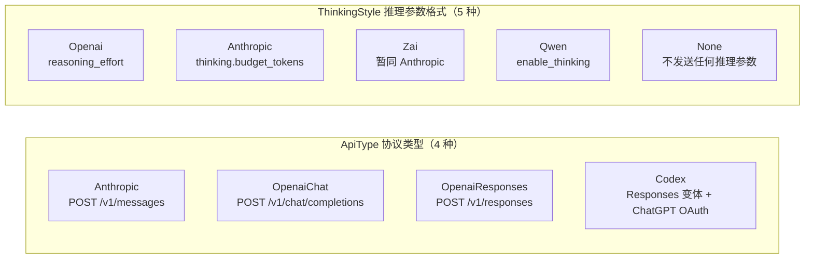

- `ApiType`（kebab-case 序列化：`anthropic` / `openai-chat` / `openai-responses` / `codex`）决定走哪套适配器。Codex 的默认端点是 `https://chatgpt.com/backend-api/codex`，其余三种默认指向各自官方域名。
- `ThinkingStyle` 默认是 `Openai`。`Zai` 目前与 `Anthropic` 走同一套 `budget_tokens` 格式，单列出来是为将来 Z.AI 分化时留位置。

### 1.2 ProviderConfig：一个服务商的完整配置

| 字段 | 类型 | 说明 |
|------|------|------|
| `id` | String (UUID) | 唯一标识 |
| `name` | String | 用户自定义显示名 |
| `api_type` | ApiType | 协议类型 |
| `base_url` | String | API 端点 |
| `api_key` | String | 单密钥凭据（Codex 走 OAuth，此处为空）。遗留字段——多密钥场景优先用 `auth_profiles` |
| `auth_profiles` | Vec\<AuthProfile\> | 多密钥档案：非空时取代 `api_key`，供限流/鉴权/计费错误时**自动轮换密钥** |
| `models` | Vec\<ModelConfig\> | 可用模型列表 |
| `enabled` | bool | 启用/禁用 |
| `user_agent` | String | 自定义 User-Agent 头（空串会被 `sanitize` 回落到默认值，避免部分网关对空 UA 返 403） |
| `thinking_style` | ThinkingStyle | Provider 级推理参数格式 |
| `allow_private_network` | bool | 显式允许 base_url 落到私网/环回地址（自托管 Ollama / LM Studio 用）；为 true 时前端保存会把该 host 追加进 SSRF 可信列表 |
| `currency` | Option\<Currency\> | 模型单价币种（`USD` / `CNY`），缺省 = USD |

**多密钥轮换（`auth_profiles`）** 是 Provider 系统里容易被忽略的一层能力：一个服务商下可以挂多个 `AuthProfile`（各带自己的 `label` / `api_key` / 可选 `base_url` 覆盖 / `enabled` 开关）。`effective_profiles()` 给出当轮可用的档案序——Codex 恒返回空（走 OAuth 不用 key），有 `auth_profiles` 时返回其中 enabled 的档案，否则把遗留 `api_key` 合成成一个默认档案。Failover 执行器就是在这个档案序上做限流/鉴权/计费错误后的密钥轮换。

**币种与成本**：单价一律照厂商价目页**原文录入**，币种由 Provider 级 `currency` 声明。换算集中在 `dashboard::cost::resolve_cost` 一处，按 `CNY_PER_USD`（kernel 常量，当前 `7.0`，粗粒度只服务成本展示）折算成 USD；模板、GUI、导入导出全程透传数字不换算。内置模板中 qwen / volcengine / tencent 标 `CNY`。

### 1.3 ModelConfig：一个模型的配置

| 字段 | 类型 | 说明 |
|------|------|------|
| `id` | String | 模型标识（如 `claude-sonnet-4-6`） |
| `name` | String | 显示名（如 `Claude Sonnet 4.6`） |
| `input_types` | Vec\<String\> | 支持的输入模态：`["text", "image", "video"]`；**空 = 未配置**（视为支持视觉，交给 API 判定）、非空但不含 `image` = 显式声明不支持视觉 |
| `context_window` | u32 | 上下文窗口（tokens），默认 200_000 |
| `max_tokens` | u32 | 最大输出 tokens，默认 8192 |
| `reasoning` | bool | 是否支持推理 |
| `thinking_style` | Option\<ThinkingStyle\> | 模型级覆盖；`None` = 继承 Provider 级 |
| `cost_input` / `cost_output` | Option\<f64\> | 每百万 token 单价。`None` = 未标价（回退内置估算表），`Some(0.0)` = 明确不按 token 计费（本地模型、包月端点，如实记 $0）——两者语义不同，勿混写 |

**推理是否真正开启，是三段式解析的结果**（`effective_thinking_style_for_model`）：

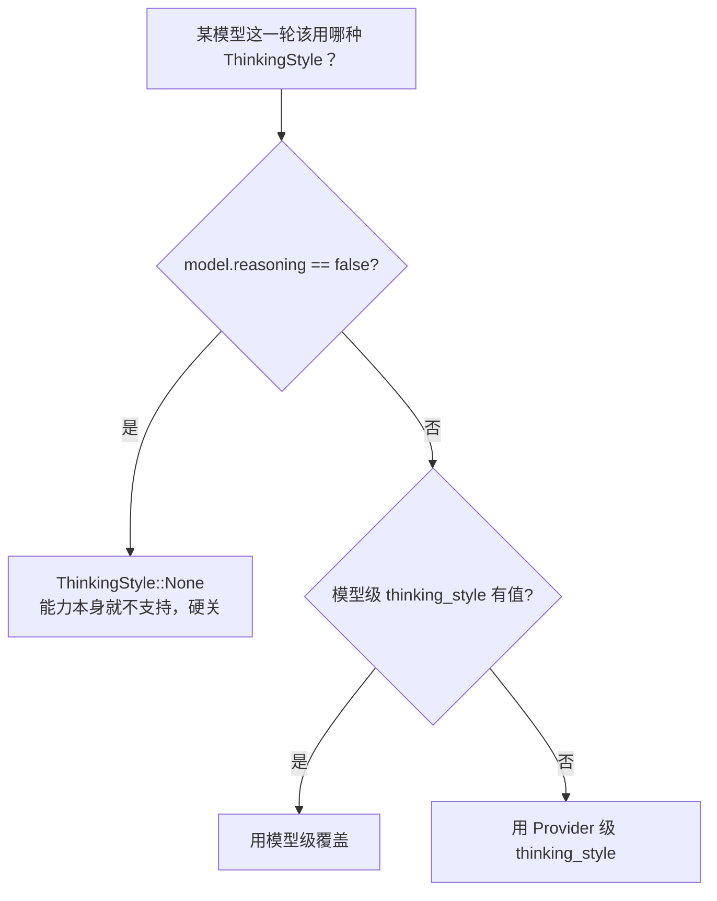

因此"模型支持推理"（`reasoning` 声明的**能力**）与"这一轮是否真的发送 thinking 参数"（三段式解析决定的**行为**）是两个层次，不要混为一谈。

`model_supports_vision(model_id)` 同理是 catalog 驱动、零 API 往返：查不到模型或 `input_types` 为空则默认支持（旧配置升级不静默丢视觉），非空且不含 `image` 则判定不支持——这正是[视觉桥](#11-视觉桥vision-bridge)的触发门。

### 1.4 AppConfig：全局配置根

持久化到 `~/.hope-agent/config.json`，与 Provider 相关的顶层字段：

- `providers`：已注册的 Provider 列表
- `active_model`：当前选中的模型 `{providerId, modelId}`
- `fallback_models`：全局降级模型链
- `proxy`：全局代理（`system` / `none` / `custom`），作用于所有出站 HTTP
- 其余子配置（`compact` / `notification` / `mediaGen` / `webSearch` …）见各自文档

### 1.5 前端模板

内置模板住在 `src/components/settings/provider-setup/templates/`，按用途分四个文件，用户在 GUI 里一键套用后即成为一份 `ProviderConfig`。当前约 **50 个内置 Provider、数百个预设模型**（模板文件是唯一权威，随版本增删）：

| 文件 | 类别 | Provider 数（约） | 特点 |
|------|------|:---:|------|
| `international.ts` | 国际 | 8 | Anthropic / OpenAI / Google / xAI / Mistral / DeepSeek 等一线厂商 |
| `china.ts` | 国内 | 11 | Kimi / 通义千问 / 豆包 / 智谱 / MiniMax 等，多标 CNY 计价 |
| `infrastructure.ts` | 基础设施 / 聚合 | 26 | OpenRouter / Groq / Together / Fireworks / 各类网关与 TEE 推理 |
| `local.ts` | 本地 / 自托管 | 5 | Ollama / LiteLLM / vLLM / LM Studio / SGLang，指向 `127.0.0.1` |

> 精确复核：`grep -c '^\s*id:' src/components/settings/provider-setup/templates/{international,china,infrastructure,local}.ts` 数模型条目。

模板里最值得记的是**协议归类**——大多数国内/聚合服务商都用 `openai-chat`（OpenAI 兼容），少数走原生 `anthropic`（MiniMax、Kimi Coding、Synthetic 等），OpenAI 官方与 GitHub Copilot 走 `openai-responses`。推理格式则跟着服务商走：智谱标 `zai`、通义/百炼标 `qwen`、Anthropic 系标 `anthropic`，其余多为 `openai`。这套"模板 → ApiType → ThinkingStyle"的映射就是新增服务商时要填对的三件事。

#### 2026-08-31 模板核验与迁移边界

- Cloudflare 新建模板使用账户 REST 路径 `https://api.cloudflare.com/client/v4/accounts/{accountId}/ai/v1`，第三方模型带 `anthropic/` 前缀，用户须填写账户 ID 与适用的 Cloudflare Token。已有网关配置不自动改写；Workers AI 还需网关标识请求头，不在该第三方模型模板中冒充支持。[官方 REST 说明](https://developers.cloudflare.com/ai-gateway/usage/rest-api/)
- Copilot 新建默认列表移除 7 月已退役的 Gemini 2.5 Pro / 3 Flash，以及 9 月 1 日将退役的 Gemini 3.1 Pro、Opus 4.6、Sonnet 4.6、Raptor mini。Sonnet 4.6 年付个人计划的例外仍可自行配置，既有配置不删除，也不把账户目录等同于全局可用性。[7 月公告](https://github.blog/changelog/2026-07-31-gemini-2-5-pro-and-gemini-3-flash-deprecated/)、[9 月退役公告](https://github.blog/changelog/2026-07-31-upcoming-august-2026-model-deprecations-in-github-copilot/)
- OpenAI 直连的 GPT-5.6 / Sol 基础输入/输出价为每百万令牌 4/20 美元，促销至少持续至 2026-11-21；Sonnet 5 直连基础价为 2/10 美元，已转为长期定价。同步内置估算表，不覆盖用户价格或网关模板报价。缓存、长上下文阶梯、实际账单与历史价不是本表表达的内容，大盘仍是估算而非账单；促销结束前重新核验。[Sol 定价](https://developers.openai.com/api/docs/models/gpt-5.6-sol)、[Claude 定价](https://platform.claude.com/docs/en/about-claude/pricing)

### 1.6 Provider 写入契约

所有对 `providers` 列表与 `active_model` 的写入，必须走 `crates/ha-core/src/provider/crud.rs` 的 helper——禁止在 Tauri / HTTP / onboarding / importer / local_llm 任何路径里直接 `providers.push` / `retain` 或手写 `active_model`。每个 helper 都带一个 `source: &'static str` 审计标签，并统一经 `mutate_config` 落盘（配置读写契约见 [config-system](../infra/config-system.md)）。

| Helper | 语义 |
|---|---|
| `add_provider(cfg, source)` | 生成新 id 并 append 到列表尾部（前端"新增后取最后一项"依赖此语义） |
| `add_and_activate_provider(cfg, model_id, source)` | 添加并把 active model 切到指定模型（onboarding 用） |
| `add_many_providers(cfgs, source)` | 批量导入、保留各自 id（importer 用） |
| `update_provider(cfg, source)` | 按 id 整体替换该 Provider；返回布尔=是否需要重建当前 Agent 缓存 |
| `delete_provider(id, source)` | 删除 Provider，并清理挂在其上的 `active_model` / fallback 引用 |
| `delete_providers_by_api_type(api_type, source)` | 按协议类型批量删除（如清空所有 Codex Provider） |
| `reorder_providers(order, source)` | 按给定 id 序列重排 |
| `set_active_model(provider_id, model_id, source)` | 唯一允许修改 `active_model` 的入口 |
| `ensure_codex_provider_persisted(active, source)` | Codex Provider 构造期失败保活（配合 OAuth 重新登录） |

删改 Provider 后 crud 会顺带跑 `repair_hard_deleted_model_references`：把因硬删除而悬空的 `active_model` / fallback 引用修好，避免下一轮 chat 指向不存在的模型。本地 LLM 安装路径另有专用入口 `upsert_known_local_provider_model`（在 `provider/local.rs`），按下节 catalog 的 host/port 去重。

### 1.7 本地后端目录（Local Backend Catalog）

自托管后端的已知端点硬编码在 `crates/ha-core/src/provider/local.rs::known_local_backends()`：

| Kind | 端口 | 接受的 host | 备注 |
|---|:---:|---|---|
| `ollama` | 11434 | `127.0.0.1` / `localhost` / `::1` / `ollama.local` | 本地大模型默认入口 |
| `litellm` | 4000 | `127.0.0.1` / `localhost` / `::1` | 统一 LLM 代理网关 |
| `vllm` | 8000 | 同上 | 高性能推理 |
| `lm-studio` | 1234 | 同上 | 桌面端本地推理 |
| `sglang` | 30000 | 同上 | 高性能推理 |

匹配规则固定为「`apiType` 一致 + host/port 命中」，URL path 一律忽略——所以 `http://localhost:11434/v1` 也算 Ollama。Tauri 命令 `local_llm_known_backends` 与 HTTP `GET /api/local-llm/known-backends` 同步暴露此目录；前端判断"是否已配置本地后端"必须消费它，禁止再写硬编码 regex。本地一键安装、模型拉取等流程详见 [local-model-loading.md](local-model-loading.md)。

---

## 2. Agent 核心

### 2.1 LlmProvider：把配置拍平成"能直接发请求的凭据 + 模型"

`crates/ha-core/src/agent/types.rs` 里的 `LlmProvider` 枚举，是 `ProviderConfig` 解析后的运行时形态——每个变体只携带发一次请求所需的最小信息：

```rust
enum LlmProvider {
    Anthropic       { api_key, base_url, model },
    OpenAIChat      { api_key, base_url, model },
    OpenAIResponses { api_key, base_url, model },
    Codex           { access_token, account_id, model },  // OAuth，不带 api_key
}
```

Codex 变体特殊：它不带 `api_key`，而是 `access_token` + `account_id`（ChatGPT OAuth）。这个差异一路贯穿到鉴权头、失败路径和 profile 轮换策略。

### 2.2 AssistantAgent：一次对话的完整运行时

`AssistantAgent` 是对话的核心对象，字段很多（KB 访问范围、Plan 模式状态、记忆快照、awareness 后缀等都挂在上面）。与本文主题相关的几个：

| 字段 | 类型 | 说明 |
|------|------|------|
| `provider` | LlmProvider | 决定走哪套适配器 |
| `thinking_style` | ThinkingStyle | 推理参数格式 |
| `conversation_history` | `Mutex<Vec<Value>>` | 完整对话状态，跨 `chat()` 调用持久驻留 |
| `context_window` | u32 | 模型上下文窗口 |
| `compact_config` | CompactConfig | 上下文压缩配置 |
| `denied_tools` | Vec\<String\> | 基于深度的工具策略 |
| `plan_agent_mode` | `ArcSwap<PlanAgentMode>` | Plan / Executing 双 Agent 模式，用 ArcSwap 支持 turn 中途无锁切换 |

关键约束：已提交的 canonical `conversation_history` 是**会话上下文真相**；主工具循环另维护本次请求专用 projection。Tier 1 接纳后的 provider-native delta 同时追加到两者，Tier 0/2 只改变 request projection，checkpoint / crash recovery / `context_json` 只写 canonical。它们共同经过“历史标准化”（第 6 节），但只有冻结后的 request projection 进入 Provider body。

### 2.3 Chat 分发

正式回合经 `TurnKernel` 准入后，由 `ha-agent-runtime` 的 `chat_dispatch::run_agent_chat()` 按 `provider` 变体分发到四套 feature-owned 适配入口。`AssistantAgent` 仍是 core-owned 状态容器和能力端口集合，但不再向 shell 暴露第二套 `chat()` 执行入口：

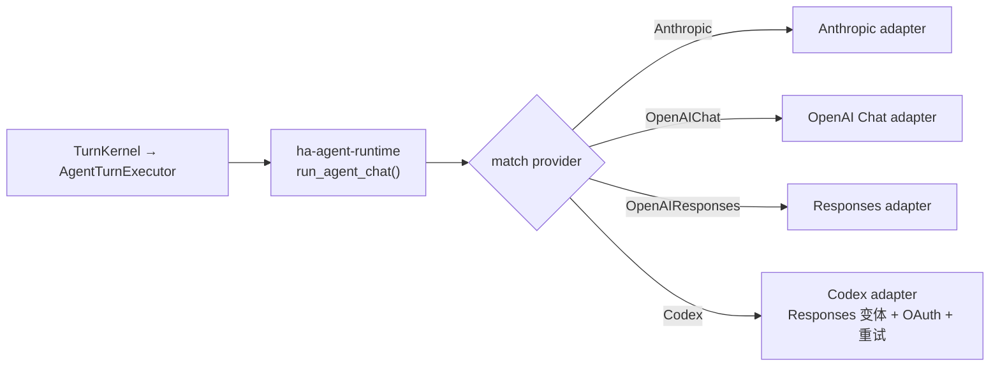

---

## 3. 对话流程

### 3.1 主流程

对话的唯一准入入口是 `TurnKernel::submit`（`crates/ha-core/src/chat_engine/turn_kernel.rs`）。桌面、HTTP、ACP、Channel、Cron、subagent、注入、Session Tool 和 Eval 都只构造 `TurnRequest` 与来源专用 `TurnSubmission`；kernel 解析模型链并冻结 Provider/config lease，再经必需的 `AgentTurnExecutor` 端口交给 `ha-agent-runtime`。Provider 网络协议、failover 和 Hope round/tool loop 位于 feature crate，权限、台账、durability、Stop/finalize 仍由 `ha-core` 裁决。

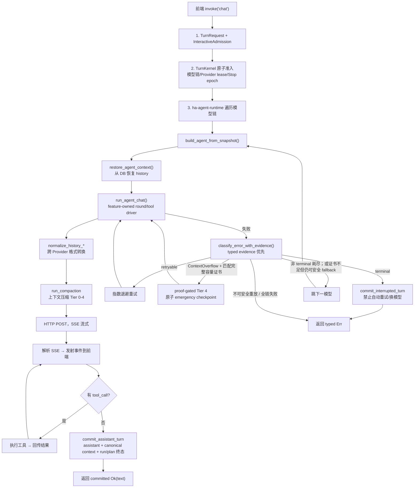

### 3.2 事件流

Provider 通过 `on_delta` 回调实时推送 JSON 事件（`crates/ha-core/src/agent/events.rs`）。前端与 IM 都消费同一套事件：

| 事件类型 | 关键字段 | 说明 |
|---------|------|------|
| `text_delta` | `content` | 增量正文 |
| `thinking_delta` | `content` | 增量推理内容 |
| `tool_call` | `call_id`, `name`, `arguments` | 工具调用开始 |
| `tool_call_args_rewritten` | `call_id`, `arguments` | 工具参数被就地改写（如路径规范化）后回投前端 |
| `tool_result` | `call_id`, `result`, `duration_ms`, `is_error` | 工具执行结果 |
| `usage` | `input_tokens`, `output_tokens`, `model`, `ttft_ms` | Token 用量 |
| `round_limit_reached` | — | tool loop 触到轮数上限 |
| `context_compaction_progress` | `phase`, `kind` | 压缩进度（仅 live，GUI banner） |
| `context_compacted` | `tier_applied`, `tokens_before`, `tokens_after`, `manifest` | 压缩完成 |
| `model_retry` | `model`, `attempt`, `reason` | 同模型重试（适配器/执行器发出，用户可见） |
| `model_fallback` | `model`, `from_model`, `reason` | 跨模型降级 |

`model_retry`（同一个模型再试一次）与 `model_fallback`（换到链上下一个模型）是两回事：前者是重试策略的产物，后者是失败降级的产物。

### 3.3 前端事件处理

`src/components/chat/useChatStream.ts`：

- `text_delta` + `thinking_delta`：缓冲 + `requestAnimationFrame` 批量刷新（约 60fps），避免每个 token 都触发 React 重渲染
- `tool_call`：先同步 flush 缓冲区，再创建 pending 状态的 ToolCallBlock
- `tool_result`：更新对应 ToolCallBlock 为完成/错误态
- `thinking_delta`：渲染进可折叠的 ThinkingBlock

---

## 4. 四种协议的适配实现

每种 `ApiType` 对应 `ha-agent-runtime/src/provider_adapters/` 下一个 adapter；`chat_dispatch` 是唯一分发点，adapter 负责请求体构建、SSE 解析和 Provider-native history。core 只提供 `StreamingChatAdapter` 契约与 history/context 能力，不保留第二份协议薄壳。

### 4.1 Anthropic Messages API

`crates/ha-agent-runtime/src/provider_adapters/anthropic_adapter.rs`。

请求体：

```json
{
  "model": "claude-sonnet-4-6",
  "max_tokens": 16384,
  "system": [{ "type": "text", "text": "...", "cache_control": { "type": "ephemeral" } }],
  "messages": [...],
  "tools": [...],
  "stream": true,
  "thinking": { "type": "enabled", "budget_tokens": 4096 }
}
```

`cache_control` 用于 Prompt Cache 复用，详见 [Side Query 缓存架构](../agent/side-query.md)。

assistant 历史里 thinking 块与 text、tool_use 并列存进 `content` 数组：

```json
{
  "role": "assistant",
  "content": [
    { "type": "thinking", "thinking": "推理过程..." },
    { "type": "text", "text": "回复内容" },
    { "type": "tool_use", "id": "call_123", "name": "read", "input": {} }
  ]
}
```

**Thinking 回传**：thinking 块原样留在 content 数组里，下一轮回传给 API，保证多轮推理连贯。

### 4.2 OpenAI Chat Completions API

`crates/ha-agent-runtime/src/provider_adapters/openai_chat_adapter.rs`。这是覆盖面最广的一套——绝大多数 OpenAI 兼容服务商都走它。

推理参数按 `ThinkingStyle` 分发（`apply_thinking_to_chat_body`，定义在 `agent/config.rs`）：

| ThinkingStyle | 参数形态 | 典型服务商 |
|---------------|---------|-------------|
| Openai | `reasoning_effort: "high"` | OpenAI、DeepSeek、Mistral、xAI 等 |
| Anthropic | `thinking: { type: "enabled", budget_tokens: N }` | MiniMax、Kimi Coding |
| Zai | 同 Anthropic | 智谱 Z.AI |
| Qwen | `enable_thinking: true` | 通义千问、阿里云百炼 |
| None | 不发送 | 不支持推理的 Provider |

**Thinking 有两种来源**：

1. **`reasoning_content` 字段**（原生推理模型）→ 直接从 SSE delta 提取
2. **`<think>` 标签**（Qwen / DeepSeek 等把推理夹在正文标签里）→ `ThinkTagFilter` 状态机实时分离 thinking 与 text（见 §5.2）

assistant 历史格式：

```json
{
  "role": "assistant",
  "content": "回复内容",
  "reasoning_content": "推理过程...",
  "tool_calls": [{ "id": "call_123", "type": "function", "function": { "name": "read", "arguments": "{}" } }]
}
```

### 4.3 OpenAI Responses API

`crates/ha-agent-runtime/src/provider_adapters/openai_responses_adapter.rs`（SSE 解析入口 `parse_openai_sse`）。

请求体：

```json
{
  "model": "gpt-5.6",
  "store": false,
  "stream": true,
  "instructions": "系统提示词",
  "input": [...],
  "reasoning": { "effort": "high", "summary": "auto" },
  "tools": [...]
}
```

#### reasoning item 从不回传（`store: false` 的硬约束）

Hope Agent 始终用 `store: false` 调 Responses API。这个模式的语义是**服务端不持久化 reasoning item**，`rs_*` id 只是一次性引用。于是产生一个尖锐的坑：下一轮请求只要带上历史里的 reasoning item，无论是否附 `encrypted_content`，服务端都会按 id 去查持久化记录，查不到就 404（`Item with id 'rs_xxx' not found. Items are not persisted when store is set to false.`）。

由此定下契约：**reasoning item 从不进入 `conversation_history`，从不参与下一轮 replay**。具体做法：

1. 请求里**不加** `include: ["reasoning.encrypted_content"]`
2. SSE 收到 reasoning 事件时，`response.reasoning_summary_text.delta` 流给前端做"思考可视化"，但结构化的 reasoning item（id + encrypted_content）**就地丢弃**
3. `parse_openai_sse` 的返回签名里根本没有 reasoning item
4. `normalize_history_for_responses` 把任何残留的 `type: reasoning` item 一并跳过（兜底旧版本写下的 context_json）

代价是每轮推理独立、少几秒 reasoning 时间，换来的是与 `store=false` stateless 语义完全对齐，回避上述 `rs_*` id 查无记录的 404。

SSE 事件处理：

| 事件 | 处理 |
|------|------|
| `response.reasoning_summary_text.delta` | `emit_thinking_delta` + 累积（仅 UI 可视化） |
| `response.reasoning_summary_part.done` | 追加 `\n\n` 段落分隔 |
| `response.output_text.delta` | `emit_text_delta` + 累积 |
| `response.output_item.added` (function_call) | 创建 pending tool call |
| `response.output_item.done` (reasoning) | 丢弃结构化 item |
| `response.output_item.done` (function_call) | 完成 tool call |
| `response.completed` | 提取 usage + 兜底文本提取 |

历史格式（注意 reasoning item 缺席）：

```json
[
  { "role": "user", "content": "问题" },
  { "type": "message", "role": "assistant", "content": [{ "type": "output_text", "text": "回复" }], "status": "completed" },
  { "type": "function_call", "id": "fc_xxx", "call_id": "fc_xxx", "name": "read", "arguments": "{}" },
  { "type": "function_call_output", "call_id": "fc_xxx", "output": "文件内容" }
]
```

### 4.4 Codex OAuth API

`crates/ha-agent-runtime/src/provider_adapters/codex_adapter.rs`（SSE 解析复用 Responses 的 `parse_openai_sse`）。请求/响应格式与 Responses API 相同，额外特性集中在**认证、模型目录与失败策略**：

- **OAuth 认证**：`Authorization: Bearer {access_token}` + `chatgpt-account-id` 头
- **终端登录**：`hope-agent auth codex login` 复用同一 PKCE loopback 流程，成功后写 `~/.hope-agent/credentials/auth.json` 并调 `ensure_codex_provider_persisted(...)`；`--no-open` 只打印 URL，适合 SSH/headless 配合 `ssh -L 1455:127.0.0.1:1455 <host>`
- **内置模型目录三处必须同步**：`agent::config::get_codex_models()` / `provider::helpers::default_codex_models()` / `provider::crud::default_codex_model_ids()`（id 集合 + 顺序一致，单测锁长度）。`DEFAULT_CODEX_MODEL_ID` 当前是 `gpt-5.6-terra`——**不是**列表里的旗舰 `gpt-5.6-sol`。原因：GPT-5.6 按 ChatGPT 套餐分级（Free/Go 只有 Terra，Sol 需付费套餐），而这个常量会通过 `ActiveModelUpdate::Always` 套到每个新登录账号，必须选所有 Codex 账号都有的那一档
- **重试与降级**：Codex adapter 的一次 dispatch claim 严格只发送一次，不在内部隐藏传输层重试。明确未发送或收到完整 HTTP 拒绝的 retryable 错误由外层执行器按 policy 退避；每次重试都重新准备精确正文、建立新计划并取得新 claim。收到响应前发送状态未知、流中断或 WAL 收敛失败统一进入 `DispatchUnknown`，禁止自动重发；Codex 仍不参与 profile 轮换，只有**非 terminal** 错误耗尽当前模型后才允许外层 fallback model 链换模型
- **不参与 profile 轮换**：OAuth 无 api_key profile，执行器硬编码跳过 Codex 的 profile 选择；凭据失败直接走标准失败路径到下一模型
- **构造期失败保活**：`ensure_codex_provider_persisted` 保证 token 缺失或构造异常时配置仍持久化，下次手动登录即可补回，不会被静默移除

---

## 5. Thinking / Reasoning 系统

### 5.1 推理强度映射

用户侧的推理强度是一个统一的六档标度：`none | minimal | low | medium | high | xhigh`（`agent/config.rs`）。它先经模型钳制，再按 `ThinkingStyle` 落成各家 API 的具体参数。

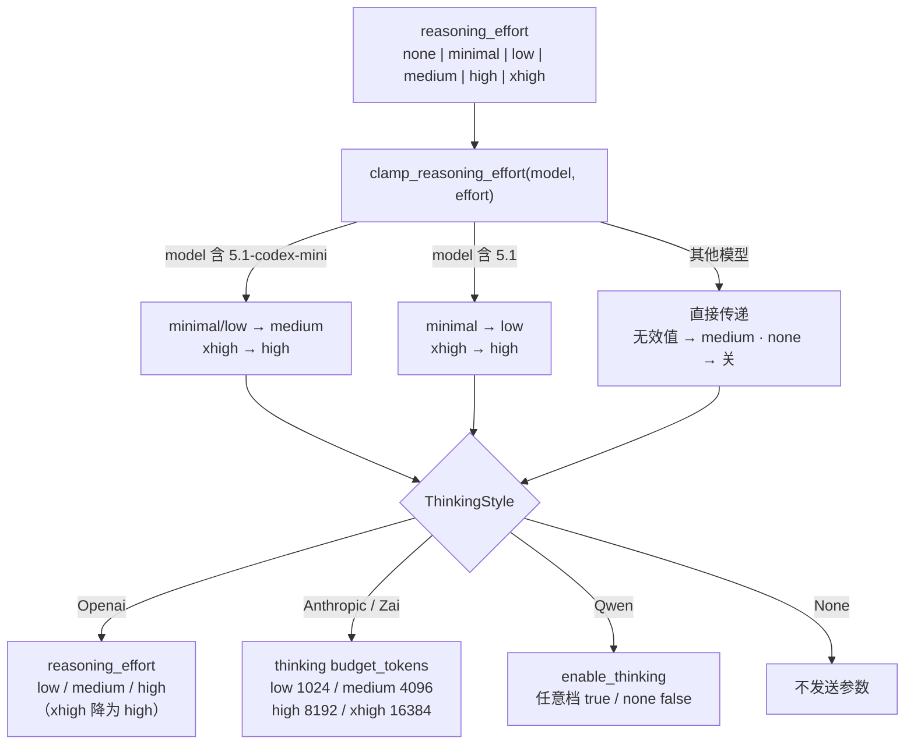

上图是兼容端的保守基线，不能推断所有 Chat Completions 都不支持 `xhigh`。适配器随后只对 HTTPS、默认端口、无 URL 凭据的精确官方主机与模型 ID 应用已核验规则；不改用户偏好，不把同名网关模型套入原厂策略：

| 官方主机 / 模型 | 请求档位修正 |
| --- | --- |
| `generativelanguage.googleapis.com` / `gemini-3.7-flash` | `minimal → low`，`xhigh/max → high` |
| `api.x.ai` / `grok-4.6` | `minimal → low`，保留 `xhigh`，`max → xhigh` |
| `api.openai.com` / `gpt-5.6`、`gpt-5.6-sol/terra/luna` | `minimal → low`，保留 `xhigh/max` |

关闭思考、未指定档位、非 OpenAI 思考格式与未知端点不被这张表重新开启或改写。2026-08-31 核验：[Gemini 3.7 Flash](https://ai.google.dev/gemini-api/docs/models/gemini-3.7-flash)、[Grok 推理](https://docs.x.ai/developers/model-capabilities/text/reasoning)、[GPT-5.6 Sol](https://developers.openai.com/api/docs/models/gpt-5.6-sol)。Anthropic 旧式预算仍低于 `max_tokens`；Claude 5 自适应思考沿原生适配器既有契约。

### 5.2 ThinkTagFilter

`agent/types.rs` 里的有状态流式解析器，专门从 Chat Completions 响应中剥离 `<think>` 标签内的推理：

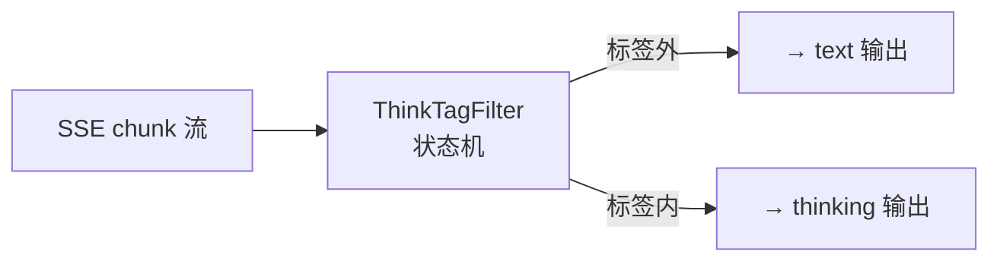

- 支持 `<think>` / `<thinking>` / `<thought>`（大小写不敏感）
- 正确处理跨 chunk 边界被切断的部分标签
- 当 `reasoning_effort == "none"` 时直接丢弃 thinking 内容

### 5.3 多轮 Thinking 回传

每个 Provider 都把 thinking 内容保存进 `conversation_history`，好让下一轮模型看得到自己上一轮的推理。三家的存储形态各不相同：

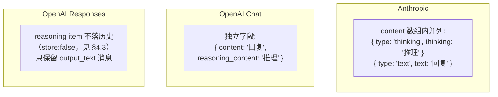

Responses 是唯一的例外：它的推理**不回传**，每轮从头独立。

---

## 6. History 格式标准化

### 6.1 问题

当 failover 降级或用户手动切换模型时，`conversation_history` 里可能残留**另一个 Provider 格式**的消息。比如把 Responses API 的 `{ type: "reasoning" }` 直接发给 Anthropic API 会直接报错。

### 6.2 解决：读历史时按目标 Provider 变形

`agent/context.rs` 里三个标准化函数，每个 Provider 在读取历史发请求前调用对应的一个：

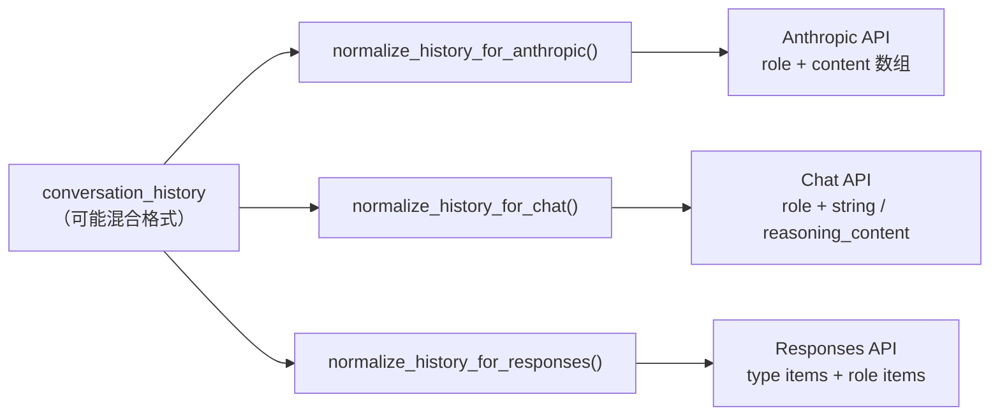

**`normalize_history_for_anthropic()`**

| 输入形态 | 转换 |
|---------|------|
| `type: "reasoning"`（加密） | 跳过 |
| `type: "function_call"` / `function_call_output` | 跳过（Anthropic 用 tool_use） |
| `type: "message"`（Responses） | 提取 output_text → `{ role, content: text }` |
| `reasoning_content` 字段（Chat） | 转成 `[{ type: "thinking" }, { type: "text" }]` |
| 标准 role 消息 | 直通 |

**`normalize_history_for_chat()`**

| 输入形态 | 转换 |
|---------|------|
| `type: "reasoning"` / `function_call` / `function_call_output` | 跳过 |
| `type: "message"`（Responses） | 提取 text → `{ role, content: text }` |
| Anthropic content 数组（thinking + text） | text → `content`，thinking → `reasoning_content` |
| 标准 role 消息 | 直通 |

**`normalize_history_for_responses()`**

| 输入形态 | 转换 |
|---------|------|
| 原生 Responses 项 | 直通 |
| Anthropic tool_use / tool_result 数组 | 跳过（Responses 用 function_call） |
| Anthropic content 数组 | 提取 text → `{ role, content: text }` |
| `reasoning_content` 字段 | 移除 |
| 任何残留 `type: reasoning` | 跳过（对齐 §4.3 契约） |

### 6.3 调用时机

每个 `chat_*` 方法开头即调用对应函数，把内存历史转成本轮 API 认的形状——历史本身不变，只是产出一份变形后的副本喂给这次请求。

---

## 7. Failover 降级系统

### 7.1 错误分类

生产调用由 `classify_error_with_evidence(error)` 先消费 typed 请求状态和 Provider 结构化字段；只有缺少类型证据时才用 `classify_error(error_text)` 做兼容分类。发送状态安全边界永远覆盖字符串相似度：

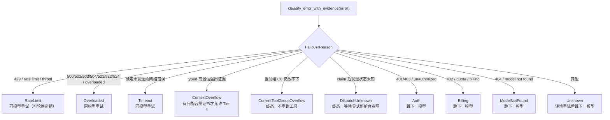

几个要点：

- **ContextOverflow 不是终态，但也不自动等于 Tier 4**——只有与失败请求绑定的本地完整容量证书、可重放工具边界和压缩后完整请求证明全部成立，才发布紧急 history；裸 overflow 文本或只有 Provider 结构化 evidence 时不改历史。
- **Overloaded 覆盖一大票 5xx**（含 Cloudflare 的 521/522/524）。
- **请求阶段决定是否可重试**：dispatch claim 前且能证明零字节发送的连接错误可归 Timeout；claim 后、headers 前的失败是 `DispatchUnknown`；headers 后的 SSE 中断是已开始响应但不完整，由持久终态收敛，二者都不自动重发。
- `EvaluationBudget`、`CurrentToolGroupOverflow`、`DispatchUnknown` 都是 terminal；前者用于确定性评测，后两者是线上安全终态。

### 7.2 模型链解析

一轮对话到底用哪条模型链，由五级优先级决定（桌面 `commands/chat.rs` 与 HTTP `routes/chat.rs` 完全对称）：

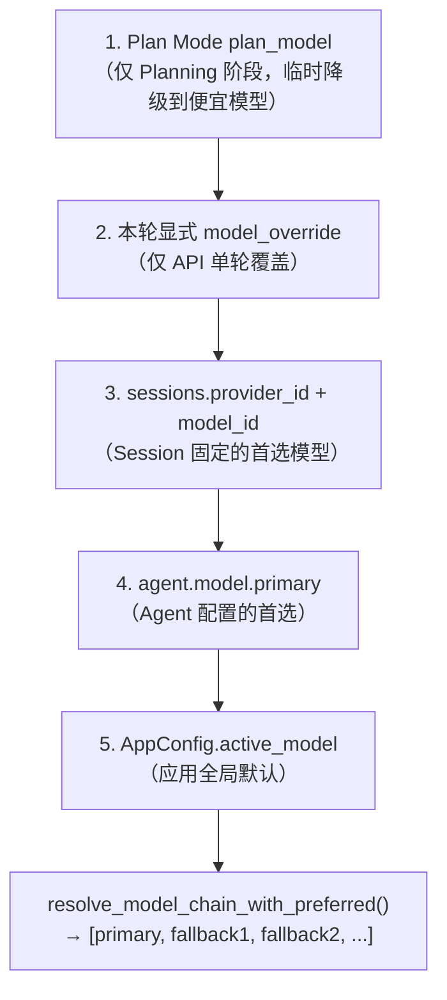

前三级决定"首选模型"（`preferred_model`），后两级是 `resolve_model_chain` 内部的兜底；解析结果再拼上 fallback 链形成完整迭代序。

几个不读代码看不出的行为：

- **Session 创建时就固定有效模型、温度与 Think**；Agent/全局默认之后再变，不反向影响已有 Session。
- **fallback 只记录本轮实际用的模型和用量，绝不回写 Session 首选**——所以下一轮仍从原主模型重新开始。
- **Provider 被禁用**时保留首选引用并临时跳过，重新启用即恢复；只有**永久删除**才清理全局 / Agent / Session 里的硬失效引用。
- **GUI 草稿**通过 `sessionDefaults` 携带模型/温度/Think，仅在首次创建 Session 时消费；`modelOverride` / `temperatureOverride` / `reasoningEffort` 是单轮 API 覆盖，不作为 GUI 的会话持久化通道。
- **Agent 字段独立继承全局**：`primary=None` 跟随全局主模型，`fallbacks=[]` 跟随全局 fallback 链，`temperature=None` / `reasoning_effort=None` 各自跟随全局值；一旦配了 Agent fallbacks 就**完全替代**全局 fallbacks。

### 7.3 重试策略

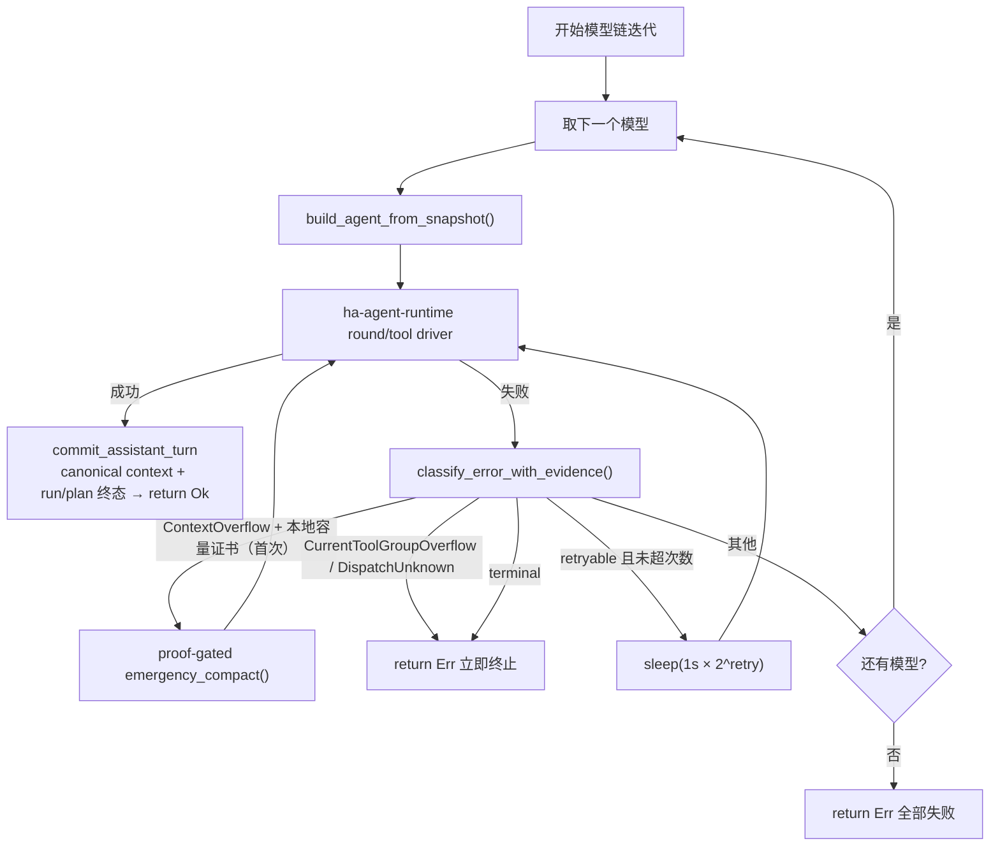

### 7.4 精确请求、单次发送与响应完成证明

主对话在 Provider adapter 内分成 `prepare_round_request` 与 `dispatch_prepared` 两段。prepare 生成最终 JSON bytes 和不含凭据的 identity（Provider/model/shape、endpoint kind、content type、长度、keyed fingerprint）；WAL 先发布 request-local projection plan 与 context fence，再在网络 I/O 前取得唯一 dispatch claim。实际 POST 直接发送这份冻结 bytes，禁止 `.json()` 二次序列化；HTTP client 显式关闭 redirect 和 reqwest transparent retry，所以一个 claim 恰好对应一个 send。Authorization、API key、OAuth token 和 account token 只存在于传输 header，不进入 exact payload 或日志。

收到 HTTP headers 立即记录 `response_started`。之后只有 Provider 自己的终止证明才算成功：Anthropic=`message_stop`，OpenAI Chat=`[DONE]` + 非空合法 `finish_reason`（tool call 还要求完整参数），Responses/Codex=`response.completed`。SSE 以 byte buffer 跨 HTTP chunk 分帧后再严格 UTF-8 解码；非法 UTF-8、EOF 残帧、解析错误、半截 tool call 或缺终止事件全部失败关闭，不能把 partial output 当成功继续执行工具。

主请求 exact WAL 的恢复矩阵是：未联网的 `context_committed` 可安全撤销；遗留 `dispatching` 转 `send_unknown`；`response_started` 无完整终止证明转 `terminal(response_incomplete)`；`send_unknown` 永不自动 supersede/retry。下一次用户显式发起新的前台 run 时，系统在任何网络动作前原子把旧歧义收敛为 `manual_retry_as_new`。这套生产接线当前只覆盖主请求；Tier 3 summary/side query 仍使用各自的一次性执行器，没有持久 exact-body WAL。

---

## 8. 数据落盘：双轨存储

### 8.1 为什么是两条通道

对话数据以两种形态并行落进 `~/.hope-agent/sessions.db`（SQLite），服务于两种截然不同的读取模式：

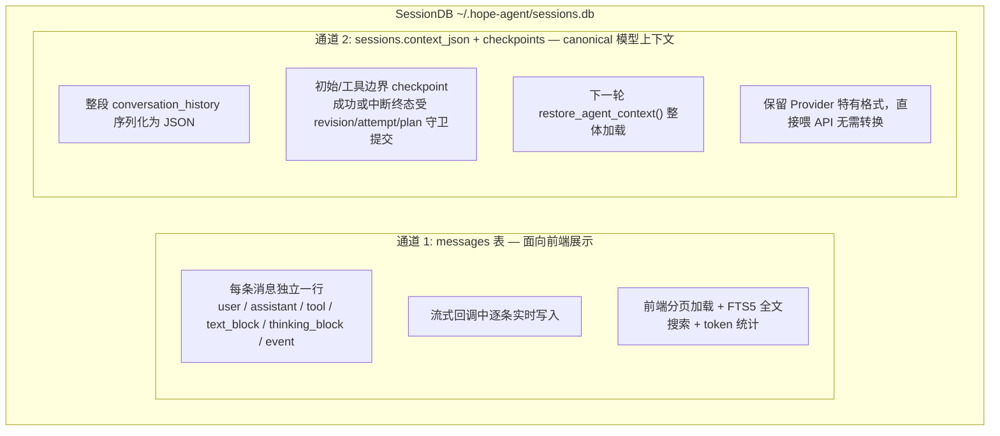

一句话：`messages` 是**行式的人类/工具投影**；`context_json` 与 stream checkpoint 是**整块的 canonical 模型上下文**。前者方便分页/搜索/统计，后者保留 Provider-native API 形状并由 revision、run/attempt 和 active request plan 共同保护。任何一方都不能单独冒充完整 exact request body。

### 8.2 通道 1：messages 表

Schema（`crates/ha-core/src/session/db.rs`，此处列出载荷相关列，实际还有 token 缓存计量、`tool_metadata`、`source`、持久化 run id 等运维列）：

```sql
CREATE TABLE messages (
  id               INTEGER PRIMARY KEY AUTOINCREMENT,
  session_id       TEXT NOT NULL,
  role             TEXT NOT NULL,     -- user|assistant|tool|text_block|thinking_block|event
  content          TEXT NOT NULL DEFAULT '',
  timestamp        TEXT NOT NULL,
  attachments_meta TEXT,             -- 附件 JSON 元数据
  model            TEXT,
  tokens_in        INTEGER,
  tokens_out       INTEGER,
  reasoning_effort TEXT,
  tool_call_id     TEXT,
  tool_name        TEXT,
  tool_arguments   TEXT,
  tool_result      TEXT,
  tool_duration_ms INTEGER,
  is_error         INTEGER DEFAULT 0,
  thinking         TEXT,             -- assistant 思维过程（独立列，经迁移追加）
  ttft_ms          INTEGER,          -- Time to First Token
  -- …外加 tokens_cache_creation/tokens_cache_read/tokens_in_last、tool_metadata、source 等
  FOREIGN KEY (session_id) REFERENCES sessions(id) ON DELETE CASCADE
);

-- FTS5 全文搜索（仅索引 user/assistant 消息），insert/delete/update 三触发器保持同步
CREATE VIRTUAL TABLE messages_fts USING fts5(content, content='messages', content_rowid='id');
```

**写入时机**（`chat_engine`，由命令层/路由层驱动）：

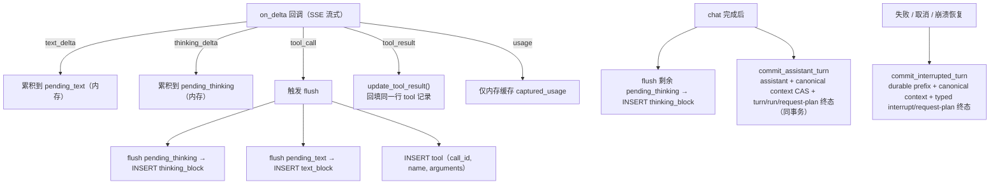

**消息角色**（`MessageRole` 枚举）：

| Role | 说明 | 写入时机 |
|------|------|---------|
| `user` | 用户输入 | chat 开始时 |
| `assistant` | AI 最终回复 | chat 完成后 |
| `tool` | 工具调用记录 | tool_call 时（result 后续回填） |
| `text_block` | 中间文本片段 | tool_call 前 flush |
| `thinking_block` | 中间思维片段 | tool_call 前 flush |
| `event` | 系统事件（降级通知等） | failover / 错误时 |

**为什么需要 text_block / thinking_block？** 多轮 tool loop 里，消息顺序是 `thinking → text → tool_call → tool_result → thinking → text → ...`。如果只在最后写一条 assistant 消息，中间这些片段与 tool_call 的时序关系就丢了。`text_block` / `thinking_block` 把多轮执行过程的完整时序保留下来。

### 8.3 通道 2：context_json

生产主对话不会在成功末尾无条件调用裸 `save_context()`。canonical context 会在初始上下文、工具结果边界、Tier 3/Tier 4 发布点写入带 run/attempt/revision 的 checkpoint；最终成功由 `commit_assistant_turn` 在一个事务里提交 assistant、context CAS、turn/run 和 active request plan 终态，失败/取消/恢复则由 `commit_interrupted_turn` 收敛 durable prefix、typed interrupt 与 request-plan 状态。`save_context_at_revision` / `save_context_if_unchanged` 是较窄的修订守卫，裸 `save_context` 只保留给兼容/测试路径，新增生产入口不得绕过组合事务。加载仍走 `restore_agent_context`：读取已提交 `context_json` → 反序列化成 `Vec<Value>` → `agent.set_conversation_history()`。

`context_json` 里的具体形态取决于**最后一次用的 Provider**——可能是 Anthropic content 数组、OpenAI Chat 的 `reasoning_content` 平铺、或 Responses 的 `type` items（其中 reasoning item 已按 §4.3 契约缺席）。正因如此，下一轮加载后必须先经 §6 的标准化，才能安全喂给可能不同的目标 Provider。

### 8.4 写入时序全景

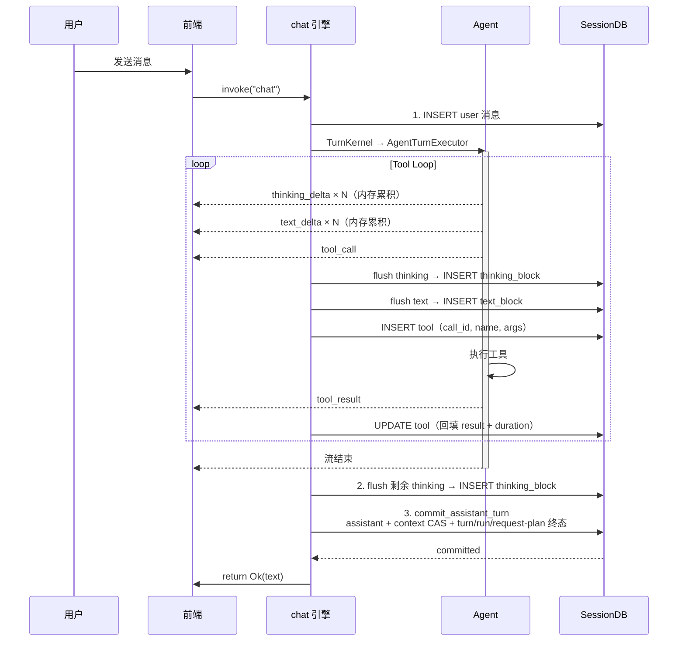

### 8.5 Failover 场景下的存储交互

跨 Provider 降级时，双轨存储与历史标准化协同工作：

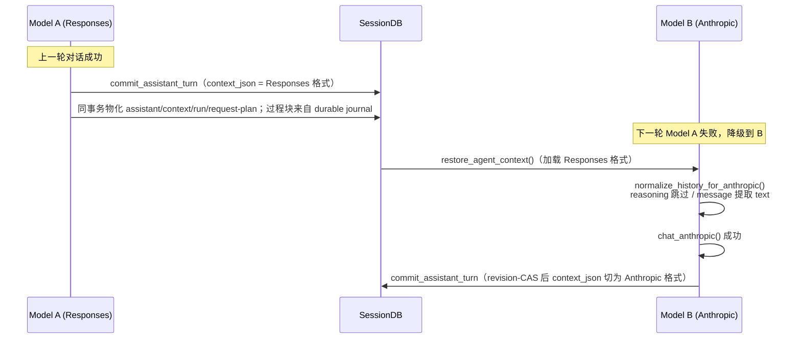

### 8.6 附件存储

```
~/.hope-agent/
  attachments/{session_id}/{uuid}.png    ← 用户上传的图片/文件
  generated-images/{timestamp}_{uuid}.png ← AI 生成的图片
```

附件在 chat 开始时落盘；`attachments_meta`（名称/MIME/大小/路径）存进 messages 表；Session 删除时级联清理附件目录。

---

## 9. 上下文管理

Provider 系统作为压缩的**消费方**，只需保证两件事：消息格式标准化（§6）与 Token 计量准确。压缩本身是一套 **5 层渐进式**结构（详见 [context-compact.md](context-compact.md)）：

- **Tier 0** 容量救援中的短命旧工具结果清理（不调额外模型，但会改写分歧点后的缓存前缀）
- **Tier 1** 当前工具组 C0/整组接纳与兼容单结果截断
- **Tier 2** 容量救援中的旧结果软/硬降档
- **Tier 3** 日常高水位 LLM 摘要；摘要输入过大时，第 0/2 层只处理一次性摘要输入副本
- **Tier 4** ContextOverflow 应急恢复

日常低于摘要高水位时保持旧前缀不变；只有完整请求容量救援会发布第 0/2 层投影。若本次精确请求依靠该投影才适配，摘要要求会与请求计划的 `context_committed` 转换在同一事务登记，下一安全主请求在发送前执行一次第 3 层。触发、频率地板、运行时台账与恢复注入由 `agent/context.rs` + `context_compact` 负责。摘要构建会正确处理所有模型服务商格式的消息（`context_compact/summarization.rs`）：推理项跳过、函数调用转为 `[tool_call]`、Anthropic 思考块使用有界预览等。

---

## 10. 数据流全景图

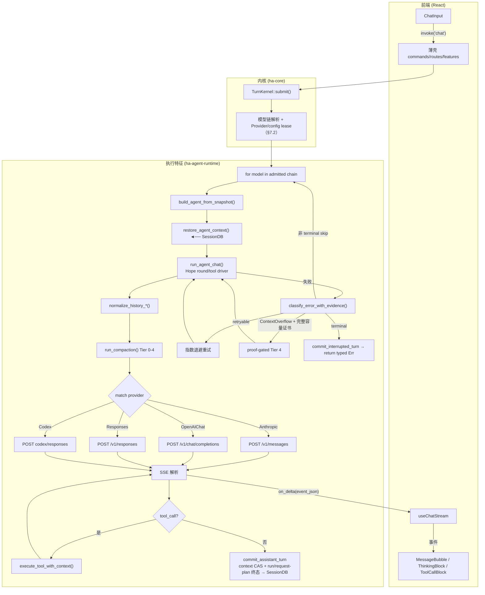

---

## 11. 视觉桥（Vision Bridge）

主模型不支持视觉（静态 `input_types` 显式不含 `image`，或 OpenAI 兼容端点运行时拒绝 `image_url`）却收到图片时，视觉桥用一个**单独配置**的视觉模型把图片转成文字描述注入主模型；桥关闭时这张图只能被丢弃、留一个 `[image omitted]` 占位符。执行实现位于 `crates/ha-agent-runtime/src/vision_bridge.rs`，配置、用量、会话与安全裁决仍由 core 能力端口提供。

> `function_models.vision`（视觉桥）与 `function_models.automation`（后台一次性 LLM 调用的默认模型链）是同一个 `FunctionModelsConfig` 容器下平级的两个功能，互不影响。后者见 [模型 vs Agent 统一配置](automation-model.md)。

### 11.1 配置与解析

- `AppConfig.function_models.vision: Option<ActiveModel>`。**opt-in**：`None` = 视觉桥关闭（维持占位符行为），不做自动挑选。
- 设置三件套：GUI 全局模型区 `ModelSelector`（过滤 `inputTypes` 含 `image`）、`ha-settings` 的 `function_models` category（纯模型引用无凭据、不 redact）、SKILL.md 登记。专用命令 `get_vision_model` / `set_vision_model`（Tauri + HTTP `GET`/`PUT /api/models/vision`）。未配置桥且图片被忽略时，GUI banner 提供直达该选择器的“配置视觉桥”动作；IM 提示给出同一路径。
- `vision_bridge::prepare(session_id, incognito)` 解析：取 `function_models.vision` → `find_provider` → 校验 `model_supports_vision` → 构建 vision agent → 绑定 session id（`incognito` 由调用方传入，令 `KIND_VISION` 用量在无痕会话跳过入账）。任一步失败返回 `None`（桥关闭，回退占位符）。

### 11.2 流水线：memo-cache + 每轮临时 transform

核心约束：tool loop 在内存 `conversation_history` 里逐轮追加、整体重发，且 `SessionDB::save_context` 把它**原样序列化落 `context_json`**——所以**绝不能就地把图换成文字**（永久丢图、不可逆，日后换回视觉模型无法恢复）。

方案 = **进程级 memo cache（异步填、每图一次）+ 每轮对临时 `api_messages` 副本做同步 rewrite**，`conversation_history` 保持原样可逆：

1. 挂接点在 `streaming_loop.rs` 的 **round head**，`prepare_messages_for_api` 产出 `api_messages` 之后。`collect_identities` 递归识别图片（不读文件，用路径/hash 作 identity）：用户图块（各 Provider 的 `image` / `image_url` / `input_image`）+ 工具结果里的 `__IMAGE_BASE64__` / `__IMAGE_FILE__` marker。
2. 对 cache miss 的图**并发有界**转述（每图超时约束），填 cache；仅 miss 才读盘编码。
3. 递归把每张图换成 `[Image description: …]` 文本 part（或转述失败时的占位符）。

OpenAI Chat 兼容端点还有一条运行时恢复路径：静态 catalog 乐观放行图片 → 端点以 400 明确拒绝 `image_url` → adapter 仅在当前 turn 标记运行时图片路径不可用 → 返回类型化恢复信号 → round head 用已配置视觉桥改写临时消息并**重试同一轮**。因此不会先删图完成一次错误回答。通用的 `image_url` 拒绝也可能只代表 `role=tool` 图片 wire 不受支持，证据不足以持久化改写模型 `input_types` 或污染跨 turn 缓存；后续含图 turn 会重新探测。

单个 round-head hook 统一覆盖两条路：round 0 覆盖用户图，round N 覆盖上一轮追加的工具图。memo cache 让重扫廉价（每图只转述一次，跨 round / 跨 turn）。这个统一 transform 是**唯一降级点**，provider 无关——下游各 adapter 的 `expand_*_image_markers_for_api` 此时已无图可处理，自然 no-op。

### 11.3 转述、用量与安全

- **用量单独计**：转述复用带图 one_shot 路径，但记 `KIND_VISION`（非 `KIND_SIDE_QUERY`），Dashboard 单独统计"视觉"成本。**不走 failover**（单次 one_shot，失败即 `Err`）。
- **鲁棒回退**：未配置 / 不可解析 / 转述失败 / 超时 → 回退占位符，**绝不 hard-fail 整个 turn**。一次性提示事件 `{"type":"vision_bridge","status":"engaged"|"unavailable"}`（每 turn 最多一条；GUI banner + IM 双通道）。
- **注入即 untrusted**：转录文本套 `<untrusted_external_data source="vision_bridge:image">` 信封 + 转义——图片里藏 `SYSTEM: ignore prior instructions…` 只能当数据、不当指令（对齐 `[[note]]` / 被动召回的处理）。
- **incognito**：照常运行（图片可用性是核心功能），但对 `sessions.incognito != 0` 自动跳过用量入账；且**走 per-turn 临时缓存、绝不写全局共享缓存**（转录含敏感文字，关闭即焚 + 不跨会话命中）。全局缓存是有界 `TtlCache`（容量 256 + 6h TTL + LRU），非无界 HashMap。
- **惰性构建 + 超时兜底**：`prepare` 只解析校验配置（不建 agent），vision agent 在首个真图 cache-miss 时才构建并 memoize 一 turn——纯文字 turn 永不白建。含图轮首次构建会同步跑 Codex OAuth 刷新（该刷新自身无 timeout，可能长时间阻塞本轮），故整个构建套 `AGENT_BUILD_TIMEOUT = 20s`：超时即回退占位符，且**不写 memo**，下一轮重试——一次瞬时 OAuth 卡顿不永久禁用本 turn 的视觉桥。
- **取消可响应 + 不缓存**：`apply` 把"构建 + 并发转述"整体与取消信号 `tokio::select!` 竞速——用户 Stop 即腰斩在途工作、立即返回；被取消的图转述**绝不写缓存**（取消 ≠ 失败，须干净重试），并抑制 `unavailable` 提示（取消不是"视觉不可用"）。转述并发受 `Semaphore(MAX_CONCURRENT = 4)` + 每图 `TRANSCRIBE_TIMEOUT = 30s` 约束。
- **扫描范围**：只处理 user / tool-result 消息，**跳过 assistant 消息**——其 tool_use / tool_call 参数可能形似图片块，改写会毁坏 tool 调用。
- **防递归**：转述本身带图调视觉模型，`apply` 只在主对话 round head 挂接，**绝不在 side_query 路径触发**。
- **已知限制**：① 运行时能力探测目前只覆盖已有明确拒绝判定的 OpenAI Chat 兼容端点；Anthropic / Responses / Codex 仍依赖静态 catalog；② side_query 缓存快照仍按旧降级折成 `[image omitted]`，与桥改写的 `[Image description]` 不一致，桥活跃时 side_query prompt cache 可能 miss；③ 多图消息 round-head 转述受 `MAX_CONCURRENT` + 每图 30s 超时限。

---

## 12. 关键文件索引

| 模块 | 文件 | 职责 |
|------|------|------|
| Provider wire 类型 | `crates/ha-config-schema/src/provider.rs` | ApiType / ThinkingStyle / ProviderConfig / ModelConfig / AuthProfile / ModelChain / ProxyConfig |
| Provider 写入 & 目录 | `crates/ha-core/src/provider/{crud,local,helpers}.rs` | 写入契约 helper、本地后端目录、模型链解析、脱敏 |
| Agent 状态与能力端口 | `crates/ha-core/src/agent/mod.rs` · `agent/llm_adapter.rs` | AssistantAgent 状态、上下文/权限能力与稳定 Provider runtime contract；不拥有 shell 可调用的 chat 入口 |
| Agent 类型 | `crates/ha-core/src/agent/types.rs` | LlmProvider、AssistantAgent、ThinkTagFilter |
| Anthropic | `crates/ha-agent-runtime/src/provider_adapters/anthropic_adapter.rs` | Messages API + thinking 块回传 |
| Chat Completions | `crates/ha-agent-runtime/src/provider_adapters/openai_chat_adapter.rs` | ThinkingStyle 分发 + reasoning_content / `<think>` 回传 |
| Responses API | `crates/ha-agent-runtime/src/provider_adapters/openai_responses_adapter.rs` | Responses 请求 + SSE 解析；`store:false` 下 reasoning item 就地丢弃 |
| Codex OAuth | `crates/ha-agent-runtime/src/provider_adapters/codex_adapter.rs` | Responses 变体 + OAuth + exact prepare/单次 dispatch；retry 只在外层以新 plan/claim 发生 |
| 推理参数 | `crates/ha-core/src/agent/config.rs` | 5 种 ThinkingStyle 映射、effort 钳制、Codex 模型目录 |
| 内容构建 | `crates/ha-core/src/agent/content.rs` | 各 Provider 的用户消息格式构建 |
| 事件发射 | `crates/ha-core/src/agent/events.rs` | text_delta / thinking_delta / tool_call 等 |
| 历史标准化 | `crates/ha-core/src/agent/context.rs` | 三个 normalize 函数、push_user_message、run_compaction |
| Hope round/tool driver | `crates/ha-agent-runtime/src/streaming_loop.rs` | API round、tool batch、steer、动态 prompt 后缀 |
| 视觉桥 | `crates/ha-agent-runtime/src/vision_bridge.rs` | 图片转述注入、memo cache、超时/取消兜底 |
| 上下文压缩 | `crates/ha-core/src/context_compact/` | 5 层渐进式压缩 + 摘要 / ledger / recovery 编排 |
| Failover | `crates/ha-core/src/failover/{mod,executor}.rs` | 错误分类、统一执行器（policy + provider 选择 + 退避 + Codex 不轮换） |
| Session DB | `crates/ha-core/src/session/` | SQLite 持久化、messages FTS 搜索、context_json |
| Turn Kernel | `crates/ha-core/src/chat_engine/turn_kernel.rs` | 来源密封、模型路由、配置/凭据租约、原子准入与 executor port |
| Agent runtime | `crates/ha-agent-runtime/src/engine.rs` | 主流程、模型链迭代、failover 与终态编排 |
| Chat 内核能力 | `crates/ha-core/src/chat_engine/` | durability、Stop/finalize、事件、上下文与持久化不变量 |
| Chat 薄壳 | `src-tauri/src/commands/chat.rs` · `crates/ha-server/src/routes/chat.rs` | 桌面命令层 / HTTP·WS 入口 |
| 前端模板 | `src/components/settings/provider-setup/templates/` | 内置 Provider 模板（四类文件） |
| 前端 Hook | `src/components/chat/useChatStream.ts` | 事件处理、delta 批量刷新 |
| 成本定价 | `crates/ha-dash/src/dashboard/cost.rs` | `resolve_cost` / `estimate_cost`：单价换算 + 内置估算表 |
