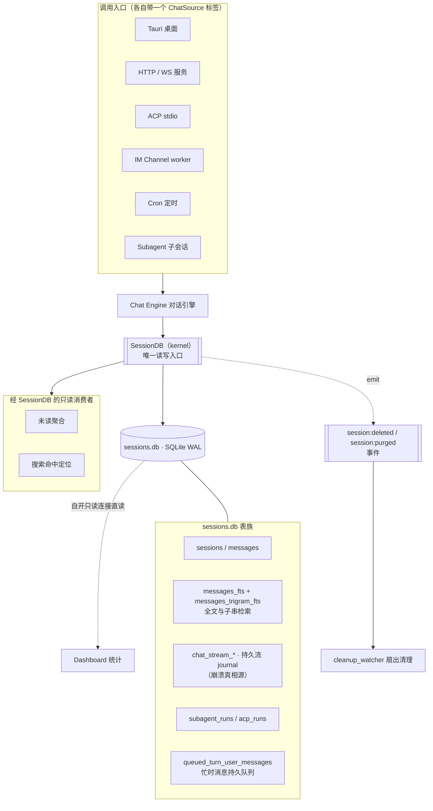
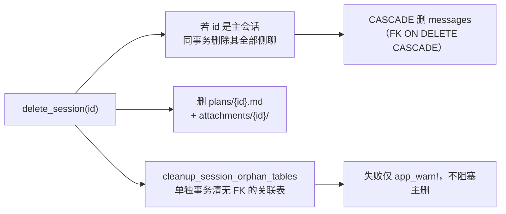
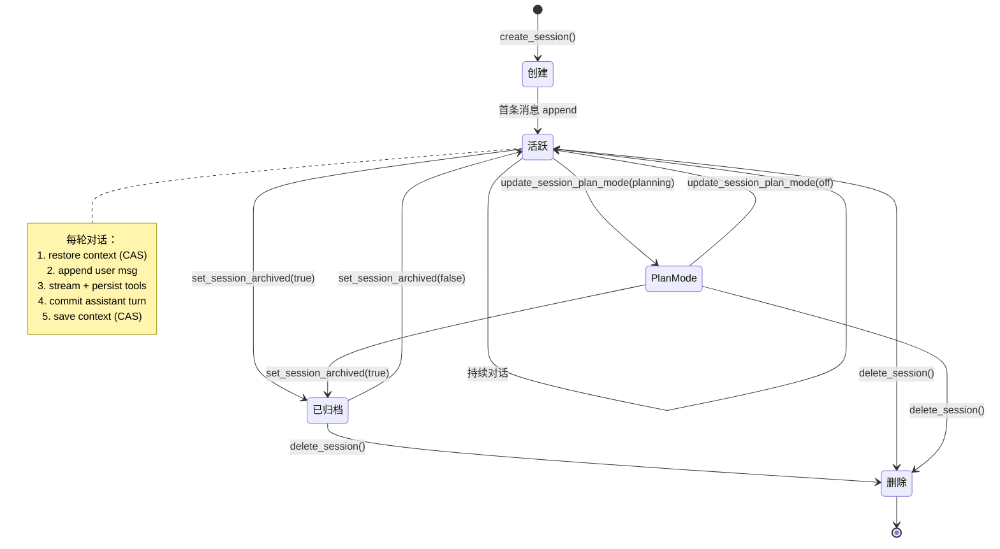
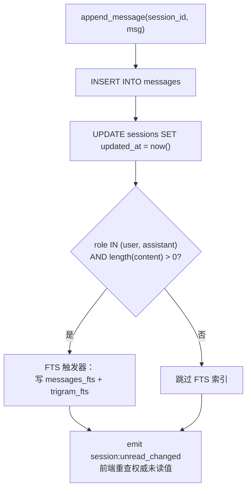
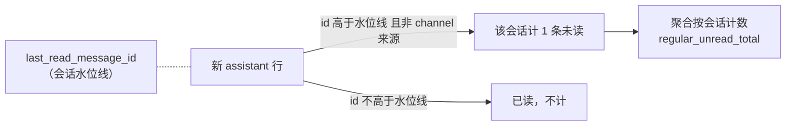
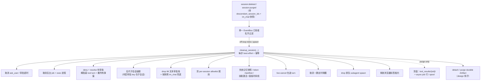

# Session 会话系统架构

> 返回 [文档索引](../../README.md) | 更新时间：2026-08-29

## 目录

- [核心思想](#核心思想)
- [架构总览](#架构总览)
- [数据模型](#数据模型)
  - [SessionMeta](#sessionmeta)
  - [SessionMessage](#sessionmessage)
  - [MessageRole](#messagerole)
  - [NewMessage Builder](#newmessage-builder)
- [SQLite Schema](#sqlite-schema)
- [核心 API](#核心-api)
- [会话生命周期](#会话生命周期)
- [未读追踪](#未读追踪)
- [会话 Fork](#会话-fork)
- [侧聊](#侧聊)
- [无痕会话（Incognito）](#无痕会话incognito)
- [生命周期协调清理（cleanup_watcher）](#生命周期协调清理cleanup_watcher)
- [会话级工作目录](#会话级工作目录)
- [会话级 Awareness 与 Agent 切换](#会话级-awareness-与-agent-切换)
- [自动会话标题](#自动会话标题)
- [关联文档](#关联文档)
- [文件清单](#文件清单)

---

## 核心思想

Session 是 Hope Agent 里"一段对话"的持久化本体。桌面窗口、HTTP 客户端、ACP stdio、IM 渠道、定时任务、子 Agent——所有入口最终都把消息写进同一个会话账本。整个子系统围绕四个想法组织：

1. **单一 SQLite 账本**。会话元信息、逐条消息、工具调用记录、上下文快照、子 Agent / ACP 运行记录，全部落在 `~/.hope-agent/sessions.db`，用 WAL 模式支撑高并发读写。写连接由 kernel 的 `SessionDB` 独占，不对特征 crate 开放；纯只读聚合（ha-dash 大盘）例外，自开一条 `SQLITE_OPEN_READ_ONLY` 连接直读 sessions.db，句柄物理上写不了。业务"机器"可以分散到各特征 crate，但**对 sessions.db 的写入与 SQL 台账恒留在 kernel（ha-core）**。

2. **消息是一张超集宽表**。用户输入、模型回复、工具调用、系统事件、流式中间块共用一张 `messages` 表；`role` 区分类型，其余列按角色选择性填充。这样翻页、搜索、导出都只面对一张表，代价是每行有很多可空列。

3. **未读是水位线，不是逐条标记**。每个会话只记一个 `last_read_message_id`。"有没有未读"通过一条 `EXISTS(...)` 实时算出，产品口径是**未读会话数**而非未读消息数——一个会话哪怕堆了十条未读回复也只贡献 1。这避免了大规模逐条 UPDATE。

4. **隐私与生命周期是硬边界**。无痕会话"关闭即焚"，不进列表、不进搜索、不进统计，且任何把内容写盘或在焚毁后继续跑的旁路都被显式封死。删除/焚毁一个会话时，一个统一的清理 watcher 把事件扇出给所有仍持有该会话引用的内存子系统，杜绝泄漏。

理解了这四点，后面的字段表、Schema、API 都只是它们的展开。

## 架构总览



`SessionDB` 是所有对话数据写入的窄腰：入口层（桌面命令、HTTP 路由、ACP、渠道、cron、子 Agent）都经 Chat Engine 落到它，未读聚合、搜索也经它读。大盘统计是唯一例外——它自开一条只读连接直读 sessions.db，不走 `SessionDB`。删除类操作额外 emit 一个生命周期事件，由 `cleanup_watcher` 负责把内存态清干净（见后文）。

## 数据模型

源类型见 [session/types.rs](../../../crates/ha-core/src/session/types.rs)。

### SessionMeta

会话元信息，用于列表展示与路由。序列化为 camelCase。

| 字段 | 类型 | 说明 |
|---|---|---|
| `id` | `String` | UUID 主键 |
| `title` | `Option<String>` | 会话标题 |
| `title_source` | `String` | 标题来源：`manual` / `first_message` / `llm`（默认 manual） |
| `agent_id` | `String` | 关联 Agent ID，默认 `ha-main`（`agent_loader::DEFAULT_AGENT_ID`） |
| `provider_id` / `provider_name` / `model_id` | `Option<String>` | 当前 Provider 与模型信息 |
| `temperature` | `Option<f64>` | 该会话固定的采样温度；`None` 表示已快照 provider 原生默认（不是"继续继承"） |
| `reasoning_effort` | `Option<String>` | 会话级 Think / 推理强度覆盖；`None` 回退运行时默认 |
| `runtime_defaults_initialized` | `bool`（内部，不序列化） | 区分"已快照的 `None` 默认"与"尚未捕获默认的旧行" |
| `created_at` / `updated_at` | `String` | RFC 3339 时间戳 |
| `pinned_at` | `Option<String>` | 置顶时间戳；非空时 sidebar 将其排在未置顶会话之上 |
| `archived_at` | `Option<String>` | 归档时间戳；非空时从活跃列表、全局搜索、未读聚合隐藏，但保留消息与归属 |
| `message_count` | `i64` | 消息总数（子查询计算） |
| `unread_count` | `i64` | 普通会话未读标记，仅 `0/1`；聚合按 session 计数不按消息数 |
| `channel_unread_count` | `i64` | IM 会话未读标记，仅 `0/1`；与普通会话分离，非 channel 会话恒 `0` |
| `has_error` | `bool` | 最新持久化消息是否被标记为错误（sidebar 红色感叹号） |
| `pending_interaction_count` | `i64` | 待用户交互数（pending 工具审批 + ask_user 组数）；由 command / route 层填充，`list_sessions_paged` 不算 |
| `pending_countdown` | `Option<PendingCountdown>` | 上述 pending 交互中最早的自动解决截止；含 `deadline_at_ms` / `total_ms` / `server_now_ms`（毫秒统一，前端不再处理审批毫秒 vs ask_user 秒的单位分裂） |
| `is_cron` | `bool` | 是否为定时任务创建的会话 |
| `parent_session_id` | `Option<String>` | 父会话 ID（子 Agent 会话专用；Fork 会话**不**用这个） |
| `forked_from_session_id` | `Option<String>` | Fork 来源会话 ID；用户可见 lineage |
| `forked_from_message_id` | `Option<i64>` | Fork 实际复制到的末条来源消息；完整 Fork 与首条 user 之前的空 Fork 均为 `None` |
| `forked_from_session_title` | `Option<String>` | 来源会话当前标题的只读 JOIN 投影；来源删除或无标题时为空 |
| `plan_mode` | `PlanModeState` | Plan Mode 状态：`off` / `planning` / `review` / `executing` / `completed`（snake_case，默认 off） |
| `execution_mode` | `ExecutionMode` | 会话级执行强度：`off` / `guarded` / `deep` / `autonomous`（`/mode` 设置，下一轮作为 run instruction 注入，不改稳定 system） |
| `workflow_mode` | `WorkflowMode` | 工作流自治模式：`off` / `on` / `ultracode`；开启后模型可调工作流工具创建可观测的 durable run |
| `permission_mode` | `SessionMode` | 会话级权限模式：`default` / `smart` / `yolo`（默认 default） |
| `sandbox_mode` | `SandboxMode` | 会话级沙箱模式：`off` / `standard` / `isolated` / `workspace` / `trusted`（默认 off） |
| `project_id` | `Option<String>` | 所属项目 ID；项目作用域记忆 / 文件在该项目内全部会话间共享 |
| `channel_info` | `Option<ChannelSessionInfo>` | IM Channel 关联信息（LEFT JOIN `channel_conversations`） |
| `incognito` | `bool` | 无痕开关：不注入被动记忆 / awareness、不做自动记忆提取，且关闭即焚 |
| `working_dir` | `Option<String>` | 会话级工作目录绝对路径（稳定工作目录合同进入 system，易变目录清单进入 user-data，并作为 `exec` / `read` 默认 cwd）；server 模式指 server 机器路径 |
| `kind` | `SessionKind` | 会话分类：`regular` / `side` / `knowledge` / `design` / `eval_fixture`；非普通会话从主侧边栏 / 选择器隐藏 |

`SessionMeta::is_regular_chat()` 收敛了"这是否一段普通用户对话"的判定（供托盘下拉等跨界面复用）：非 cron、非子会话、非 IM、非无痕、非归档、`kind == Regular`。项目成员资格**允许**——项目对话仍是用户对话，只是装进了项目容器。

### SessionMessage

消息读模型。所有消息类型共用这张超集结构，`role` 决定哪些字段有意义。

| 分组 | 字段 | 说明 |
|---|---|---|
| 通用 | `id` `session_id` `role` `content` `timestamp` | `id` 自增主键，`timestamp` 为 RFC 3339 |
| User | `attachments_meta` | 附件元信息 JSON（well-known key 见 `ATTACHMENT_META_KEY_*`） |
| Assistant | `model` `tokens_in` `tokens_out` `reasoning_effort` `ttft_ms` | 响应模型、token 用量、首 token 延迟 |
| Assistant | `tokens_in_last` | 末轮输入 token（`ChatUsage::last_input_tokens`，压缩判定用） |
| Assistant | `tokens_cache_creation` `tokens_cache_read` | prompt cache 写入 / 命中 token（OpenAI 侧对应 `cached_tokens`） |
| Assistant | `thinking` | 旧路径内联思考；新路径改用独立 `ThinkingBlock` 行以保持工具调用前后顺序 |
| Tool | `tool_call_id` `tool_name` `tool_arguments` `tool_result` `tool_duration_ms` `is_error` | 工具调用及结果 |
| Tool | `tool_metadata` | 结构化副输出 JSON（如文件 diff 前后快照、`+N -M`），不污染重放进模型的 `tool_result` |
| 流式 | `stream_status` | placeholder 行的流式状态（见下文） |
| 血缘 | `persistence_run_id` | 物化该行的 durable 流运行，用于 reload 时用权威 journal 快照替换当前 checkpoint 投影，不重复渲染 |

`stream_status` 追踪那些"先插占位、再节流更新、最后 finalize"的增量写入行，四态加 legacy：

- `streaming` — 正在写入的占位行。工具行以此为初值：`tool()` 构造器插入时置 `streaming`，拿到结果 UPDATE 成 `completed`，于是 INSERT 与 UPDATE 之间崩溃留下的半条行可被启动扫尾识别
- `completed` — 已 finalize，`content` 是最终内容
- `orphaned` — 启动扫尾把上次崩溃残留的 `streaming` 行批量改成此状态（`mark_orphaned_streaming_rows`）；前端按"上次未完成"渲染
- `recovered` — 启动 finalize 或 Fork 复制时把 `orphaned` 规范化为此值，表示那段被中断的部分已被保留、不该再当待恢复处理
- `NULL` — 旧库残留，所有 reader 视为 `completed`

text / thinking 的流式内容不再走占位行，其崩溃真相源是 `chat_stream_*` journal + spool，详见 [chat-engine.md · 耐久流协调器](chat-engine.md#耐久流协调器)。

> `messages` 表里还有 `source` / `queue_request_id` / `logical_block_seq` 三列，属持久化 / 血缘写侧字段，由 `NewMessage` 写入而**不**出现在 `SessionMessage` 读模型里。`source` 记录驱动该 turn 的入口（`ChatSource::as_str()` 小写：`desktop` / `http` / `channel` / `subagent` / `parent_injection` / `cron` / `acp`），NULL 保守视作 `desktop`，未读徽标与 GUI→IM 镜像引用前缀按它分流。

### MessageRole

6 种角色：

```
User          — 用户输入
Assistant     — 模型响应
Event         — 系统事件（错误通知、模型降级等）
Tool          — 工具调用及结果
TextBlock     — 中间文本块（工具调用前的文本输出，保持顺序）
ThinkingBlock — 中间思考块（工具调用前的思考输出，保持多轮思考顺序）
```

`TextBlock` / `ThinkingBlock` 是流式输出中的中间态。当模型在输出途中穿插工具调用，引擎把已累积的文本 / 思考 flush 成独立消息插到 tool_call 之前，让 UI 展示顺序与模型实际输出顺序一致。

### NewMessage Builder

`NewMessage` 是插入用的写模型，提供便捷构造函数统一设时间戳与角色：

| 构造函数 | 角色 | 说明 |
|---|---|---|
| `NewMessage::user(content)` | User | 简单用户消息 |
| `NewMessage::assistant(content)` | Assistant | 模型响应 |
| `NewMessage::tool(call_id, name, args, result, duration, is_error)` | Tool | 工具调用记录（初值 `stream_status='streaming'`） |
| `NewMessage::text_block(content)` | TextBlock | 中间文本块 |
| `NewMessage::thinking_block(content)` | ThinkingBlock | 中间思考块 |
| `NewMessage::thinking_block_with_duration(content, ms)` | ThinkingBlock | 带耗时的思考块 |
| `NewMessage::event(content)` / `error_event(content)` | Event | 系统事件 / 错误事件 |

链式 `with_source(ChatSource)` 打入口标签、`with_tool_metadata(...)` 附结构化副输出。

## SQLite Schema

`SessionDB::open()` 时自动建表建索引，并以"探测某列是否存在再 `ALTER TABLE ADD COLUMN`"的方式做渐进迁移——任何旧版本产生的库都能打开而不需版本表或破坏性重建。下列是合并所有迁移后的**逻辑视图**。

### 主表

```sql
CREATE TABLE sessions (
    id                            TEXT PRIMARY KEY,
    title                         TEXT,
    title_source                  TEXT NOT NULL DEFAULT 'manual',  -- manual / first_message / llm
    agent_id                      TEXT NOT NULL DEFAULT 'ha-main',
    provider_id                   TEXT,
    provider_name                 TEXT,
    model_id                      TEXT,
    temperature                   REAL,
    runtime_defaults_initialized  INTEGER NOT NULL DEFAULT 0,
    reasoning_effort              TEXT,
    created_at                    TEXT NOT NULL,
    updated_at                    TEXT NOT NULL,
    context_json                  TEXT,                            -- Agent conversation_history 快照
    context_revision              INTEGER NOT NULL DEFAULT 0,      -- 上下文 CAS revision
    context_run_id                TEXT,                            -- 最近一次成功写 context 的 persistence run
    last_read_message_id          INTEGER DEFAULT 0,
    is_cron                       INTEGER NOT NULL DEFAULT 0,
    parent_session_id             TEXT,                            -- 子 Agent 会话
    forked_from_session_id        TEXT,                            -- Fork 来源
    forked_from_message_id        INTEGER,                         -- Fork 消息边界
    plan_mode                     TEXT DEFAULT 'off',
    plan_steps                    TEXT,                            -- Plan 步骤进度 JSON（崩溃恢复）
    plan_executing_started_at     TEXT,
    plan_completed_at             TEXT,
    permission_mode               TEXT NOT NULL DEFAULT 'default', -- default / smart / yolo
    sandbox_mode                  TEXT NOT NULL DEFAULT 'off',     -- off / standard / isolated / workspace / trusted
    execution_mode                TEXT NOT NULL DEFAULT 'off',     -- off / guarded / deep / autonomous
    workflow_mode                 TEXT NOT NULL DEFAULT 'off',     -- off / on / ultracode
    project_id                    TEXT,                            -- 所属项目
    awareness_config_json         TEXT,                            -- per-session awareness override
    incognito                     INTEGER NOT NULL DEFAULT 0,
    working_dir                   TEXT,                            -- 会话级工作目录
    pinned_at                     TEXT,
    archived_at                   TEXT,                            -- NULL = 活跃
    kind                          TEXT NOT NULL DEFAULT 'regular'  -- regular / side / knowledge / design / eval_fixture
);

CREATE TABLE messages (
    id                       INTEGER PRIMARY KEY AUTOINCREMENT,
    session_id               TEXT NOT NULL,
    role                     TEXT NOT NULL,                   -- user / assistant / event / tool / text_block / thinking_block
    content                  TEXT NOT NULL DEFAULT '',
    timestamp                TEXT NOT NULL,
    attachments_meta         TEXT,
    model                    TEXT,
    tokens_in                INTEGER,
    tokens_out               INTEGER,
    reasoning_effort         TEXT,
    tool_call_id             TEXT,
    tool_name                TEXT,
    tool_arguments           TEXT,
    tool_result              TEXT,
    tool_duration_ms         INTEGER,
    is_error                 INTEGER DEFAULT 0,
    thinking                 TEXT,                            -- 旧路径内联思考
    ttft_ms                  INTEGER,
    tokens_in_last           INTEGER,
    tokens_cache_creation    INTEGER,
    tokens_cache_read        INTEGER,
    tool_metadata            TEXT,                            -- 工具结构化副输出 JSON
    stream_status            TEXT,                            -- streaming / completed / orphaned / recovered，NULL 视为 completed
    source                   TEXT,                            -- ChatSource 入口标签，NULL 视作 desktop
    is_side_snapshot         INTEGER NOT NULL DEFAULT 0,      -- 侧聊复制上下文；Dashboard 不计为新活动
    queue_request_id         TEXT,                            -- 持久队列 exactly-once 幂等键
    persistence_run_id       TEXT,                            -- durable stream 物化来源
    logical_block_seq        INTEGER,                         -- run 内逻辑块序号（重放幂等）
    FOREIGN KEY (session_id) REFERENCES sessions(id) ON DELETE CASCADE
);
```

上下文以 `Vec<serde_json::Value>` 序列化成 JSON 存进 `sessions.context_json`。运行时对话 / tool-loop 的上下文写入必须走 revision CAS（`load_context_with_revision` + `save_context_at_revision`），旧快照 fail closed；无条件的 `save_context` 只保留兼容 / 测试用途，新对话入口不得盲写覆盖。

### 持久流与忙时队列表

以下表也建在 sessions.db 里，但语义归属 Chat Engine 与 turn 队列，此处只列存在与用途，细节见对应文档。

- `chat_stream_runs` / `chat_stream_attempts` / `chat_stream_journal` / `chat_stream_context_checkpoints`——追加式的流运行、尝试与逐块 journal，是流式回合的崩溃真相源，`run/turn` 经外键挂到 `sessions` 与 `chat_turns`。`base_context_json` 存本轮 user 注入前的精确 provider context。详见 [chat-engine.md](chat-engine.md)。
- `queued_turn_user_messages`——忙时用户消息的持久队列（`request_id` 唯一实现 exactly-once），承载 `is_plan_trigger` / `goal_trigger` / `plan_comment_json` / `options_json`（planMode / workflowMode 等重放参数）/ `channel_origin_json`（IM 最小无凭据路由信封）等重放上下文；`status` 除 `queued` 外还有 `held_after_stop`。UI 只保存投影。

### 索引

```sql
CREATE INDEX idx_messages_session_id     ON messages(session_id);
CREATE INDEX idx_messages_session_role   ON messages(session_id, role);   -- 角色过滤扫描
CREATE INDEX idx_sessions_agent_id       ON sessions(agent_id);
CREATE INDEX idx_sessions_updated_at     ON sessions(updated_at DESC);
CREATE INDEX idx_sessions_project_id     ON sessions(project_id);
CREATE INDEX idx_sessions_pinned_at      ON sessions(pinned_at DESC);
CREATE INDEX idx_sessions_forked_from    ON sessions(forked_from_session_id);
CREATE INDEX idx_sessions_archived_at    ON sessions(archived_at DESC) WHERE archived_at IS NOT NULL;

-- 部分索引：只覆盖 streaming 行，让启动扫尾 mark_orphaned_streaming_rows() 走 O(streaming-count)
CREATE INDEX idx_messages_stream_active
  ON messages(session_id, stream_status) WHERE stream_status = 'streaming';

-- durable 流重放幂等
CREATE UNIQUE INDEX idx_messages_persistence_block
  ON messages(persistence_run_id, logical_block_seq)
  WHERE persistence_run_id IS NOT NULL AND logical_block_seq IS NOT NULL;
```

### FTS5 全文搜索

消息内容维护**两张** FTS5 虚拟表，都以 `messages` 为外部内容表、`id` 为 rowid，区别在分词器：

```sql
-- 词元匹配（unicode61 支持 CJK）
CREATE VIRTUAL TABLE messages_fts USING fts5(
    content, content='messages', content_rowid='id', tokenize='unicode61'
);
-- 子串匹配（trigram，用于短片段 / 中缀检索）
CREATE VIRTUAL TABLE messages_trigram_fts USING fts5(
    content, content='messages', content_rowid='id', tokenize='trigram'
);
```

两张表各配 INSERT / DELETE / UPDATE 三个触发器自动同步，**只索引 `user` / `assistant` 角色的非空消息**（tool / event 等不索引）。DELETE / UPDATE 触发器的 `WHEN` 条件与 INSERT 严格一致，避免删除未索引消息导致 FTS 计数损坏：

```sql
CREATE TRIGGER messages_fts_ai AFTER INSERT ON messages
WHEN new.role IN ('user', 'assistant') AND length(new.content) > 0
BEGIN
    INSERT INTO messages_fts(rowid, content) VALUES (new.id, new.content);
END;
-- messages_fts_ad / messages_fts_au 及 trigram 三兄弟同构
```

`open()` 时执行 FTS rebuild 修复可能的既有损坏；`delete_session()` 失败时也会 rebuild 后重试。

### 子 Agent / ACP 运行表

`subagent_runs` 与 `acp_runs` 记录后台子 Agent 与 ACP 后端进程的运行。二者都无 FK CASCADE 到 `sessions`，故会话删除时由单独的孤儿清理事务处理（见下文）。

```sql
CREATE TABLE subagent_runs (
    run_id TEXT PRIMARY KEY,
    parent_session_id TEXT NOT NULL,
    parent_agent_id TEXT NOT NULL,
    child_agent_id TEXT NOT NULL,
    child_session_id TEXT NOT NULL,
    task TEXT NOT NULL,
    status TEXT NOT NULL DEFAULT 'spawning',  -- spawning / running / completed / error / interrupted 等
    result TEXT, error TEXT,
    depth INTEGER NOT NULL DEFAULT 1,
    model_used TEXT,
    started_at TEXT NOT NULL, finished_at TEXT, duration_ms INTEGER,
    label TEXT, attachment_count INTEGER DEFAULT 0,
    input_tokens INTEGER, output_tokens INTEGER
    -- 另有 thread/attempt 控制面列（trigger_kind / terminal_reason / lease_epoch /
    -- delivery_kind / owner_kind 等），详见 subagent.md
);

CREATE TABLE acp_runs (
    run_id TEXT PRIMARY KEY,
    parent_session_id TEXT NOT NULL,
    backend_id TEXT NOT NULL,
    external_session_id TEXT,
    task TEXT NOT NULL,
    status TEXT NOT NULL DEFAULT 'starting',  -- starting / running / completed / error / timeout / killed
    result TEXT, error TEXT, model_used TEXT,
    started_at TEXT NOT NULL, finished_at TEXT, duration_ms INTEGER,
    input_tokens INTEGER, output_tokens INTEGER,
    label TEXT, pid INTEGER                    -- pid: 后端进程 PID
);
```

`subagent_runs` 是子 Agent 尝试的真相源，之上还有 `subagent_threads` / `subagent_dispatches` / `subagent_result_deliveries` 管身份、投递与序列化——那套控制面属 Subagent 子系统，见 [subagent.md](../agent/subagent.md)。

## 核心 API

### 会话管理

| 方法 | 说明 |
|---|---|
| `create_session(agent_id)` | 创建新会话，返回 `SessionMeta` |
| `create_session_with_parent(agent_id, parent_id)` | 创建子 Agent 会话 |
| `create_session_with_project(agent_id, project_id)` | 创建项目作用域会话；`project_id` 非空时强制 `incognito=false`（互斥防御） |
| `fork_session(source_id, source_message_id)` | 把普通顶层会话派生为新的普通会话（见 [会话 Fork](#会话-fork)） |
| `create_side_chat(source_id)` | 从普通顶层会话的最近稳定历史创建 `kind=side` 的侧聊 |
| `list_side_chats(source_id)` | 只按 `forked_from_session_id` 列出某个主会话拥有的侧聊 |
| `get_session(session_id)` | 获取单个会话元信息（含 Channel LEFT JOIN） |
| `list_sessions(agent_id)` | 列出全部会话（按 `updated_at DESC`） |
| `list_sessions_paged(agent_id, project_filter, limit, offset, active_session_id)` | 分页列表，返回 `(Vec<SessionMeta>, total_count)` |
| `list_sessions_paged_for_sidebar(agent_id, project_filter, parent_filter, limit, offset, active_session_id)` | 侧边栏分页：在 SQL `LIMIT/OFFSET` 前同时应用项目归属、顶层 / 子会话与 Agent 过滤，避免某类会话占满页面后再被前端丢弃 |
| `list_archived_sessions_paged(limit, offset)` | 归档管理分页：含普通 / 项目 / IM / Subagent / Cron / Knowledge / Design，排除 incognito / eval fixture |
| `set_session_archived(session_id, archived)` | 归档 / 恢复；归档时清置顶并把当前消息推进为已读，保留 transcript / 项目 / Agent / 专属空间绑定 |
| `delete_session(session_id)` | 删除会话（清理协议见下） |
| `purge_session_if_incognito(session_id)` | 仅当会话是无痕态时硬删——前端切走当前无痕会话时调用，实现"关闭即焚" |
| `purge_orphan_incognito_sessions()` | 启动兜底：遍历 `incognito = 1 AND updated_at < (now - 60s)` 的残留会话删除，防御 crash / SIGKILL / 断电 |

**过滤器枚举**：

- `ProjectFilter<'a>`：`All`（不过滤）/ `Unassigned`（`project_id IS NULL`）/ `InProject(&str)`。
- `ParentSessionFilter`：`All` / `Root`（`parent_session_id IS NULL`）/ `Child`（`IS NOT NULL`）。主侧边栏的「对话 / Subagent」分别用 `Root / Child`，并与 `ProjectFilter::Unassigned` 组合后再分页。
- `SessionTypeFilter`（搜索用）：`Regular` / `Cron` / `Subagent` / `Channel`。

**`active_session_id` 例外参数**：默认 `incognito = 0` 会把无痕会话过滤出列表，但用户当前正打开的那个无痕会话仍需出现在 sidebar。`Some(sid)` 时 WHERE 变为 `(s.incognito = 0 OR s.id = ?)`；`None` 严格过滤。

**归档可见性契约**：活跃 sidebar、项目计数、Knowledge / Design 历史、Cron / Channel 活跃列表、全局 FTS、未读聚合都必须过滤 `archived_at IS NULL`；设置里的归档管理页是唯一跨类型归档列表，且分页按需读取，不一次拉全历史。按 ID 直读仍允许（供恢复 / 深链）。无痕会话拒绝归档（其生命周期是关闭即焚）。永久删除只从归档管理页暴露并要求二次确认。owner 的 Tauri / HTTP 删除入口统一经 `ha_cron::cron::delete_conversation_and_run_logs`——先清 `cron.db` 里对该对话的引用再删 Session，防止 Cron 时间线把已删对话当成缺失 Session 的审计空壳重新显示。归档不是 IM 静音边界：已绑定 Channel 收到新入站用户消息会自动恢复，且"恢复 + 用户消息落库 + 首条标题生成"必须在同一个 `SessionDB::run` 阻塞任务里按序执行，避免阻塞异步 dispatcher 或在恢复失败后继续隐藏写入。

**`delete_session` 清理协议**：



删除普通主会话时，会在同一 `Immediate` 事务中删除它拥有的活跃与已归档侧聊；普通 Fork 不受影响。每个被删侧聊仍单独执行文件、孤儿表、权限信任集清理并发出生命周期事件，保证其在途 turn、审批与后台状态都能被 `cleanup_watcher` 收敛。第 ③ 步在一个单独事务里按序清掉不随 `sessions` FK 级联的关联表：`session_skill_activation`、`session_tool_activation`、`learning_events`、`subagent_result_deliveries`、`subagent_dispatches`、`subagent_threads`、`subagent_runs`（`parent_session_id` 或 `child_session_id` 命中）、`acp_runs`。失败只 `app_warn!` 不向上抛——保证主删 `sessions` 行成功后即使关联清理失败也不阻塞用户。该 contract 在 [AGENTS.md](../../../AGENTS.md) 列为强制。删除后残留在内存里的引用由 `cleanup_watcher` 负责（见后文）。

### 消息 CRUD

| 方法 | 说明 |
|---|---|
| `append_message(session_id, msg)` | 追加消息并更新 `updated_at`，返回消息 ID |
| `load_session_messages(session_id)` | 加载全部消息（ASC） |
| `load_session_messages_latest(session_id, limit)` | 加载最新 N 条 + 总数（首屏） |
| `load_session_messages_before(session_id, before_id, limit)` | 向上翻页（scroll up） |
| `load_session_messages_around(session_id, target_id, before, after)` | 加载目标消息前后窗口（默认 40/20），用于搜索命中定位 |
| `update_tool_result(session_id, call_id, result, duration, is_error)` | 按 call_id 更新工具执行结果 |

### 元数据更新

| 方法 | 说明 |
|---|---|
| `update_session_title(session_id, title)` | 用户改名并把来源设为 `manual`；文本未变则原子 no-op、保留原来源 |
| `update_session_title_with_source(...)` | 更新标题并设置来源标签 |
| `update_session_title_if_source(session_id, title, expected_source)` | 仅当 `title_source == expected_source` 时更新（防 LLM 标题覆盖用户手改） |
| `update_session_model(...)` | 更新当前 Provider / 模型信息 |
| `mark_session_cron(session_id)` | 标记为 Cron 会话 |
| `update_session_plan_mode(...)` | 更新 Plan Mode 状态 |
| `update_session_permission_mode(...)` / `update_session_sandbox_mode(...)` | 更新会话级权限 / 沙箱模式 |
| `update_session_incognito(session_id, bool)` | 切换无痕态；开启时若属项目、绑 IM、Workflow Mode 已开、有 open Goal 或已有 WorkflowRun，直接 `Err`（互斥防御） |
| `update_session_working_dir(session_id, Option<&str>)` | 设置 / 清空会话级工作目录；空串当清空 |
| `update_session_agent(session_id, agent_id)` | 切换会话 Agent；先统计 user / assistant 消息数，非零直接拒绝 |

### 上下文持久化

| 方法 | 说明 |
|---|---|
| `load_context_with_revision(session_id)` | 加载 Agent context 与当前 CAS revision |
| `save_context_at_revision(session_id, json, run_id, expected_revision)` | 仅 revision 匹配时更新并递增；旧快照 fail closed |
| `checkpoint_stream_context(...)` | 同一事务物化 durable journal 前缀 + CAS 更新中间 context |
| `commit_assistant_turn(...)` | assistant / context / turn / usage / run 的原子成功提交 |
| `commit_interrupted_turn(...)` | 最大合法前缀的原子中断 / 恢复提交 |
| `load_context(session_id)` | 兼容读取上下文 JSON（无则 `None`） |

### Plan Mode 崩溃恢复

`save_plan_steps` / `load_plan_steps` 把 Plan 步骤进度实时写进 `sessions.plan_steps`。应用崩溃重启后从此列恢复执行进度，避免重复执行已完成步骤。Plan Mode 状态机与审批见 [plan-mode.md](../agent/plan-mode.md)。

### 已读状态

见 [未读追踪](#未读追踪)。

| 方法 | 说明 |
|---|---|
| `mark_session_read(session_id)` | 显式将单个会话全部标记已读 |
| `mark_session_read_through(session_id, through_message_id)` | 只推进到 UI 已实际渲染的消息，且永不回退 |
| `mark_session_read_batch(session_ids)` | 批量标记已读 |
| `regular_unread_total(active_session_id)` | 全库普通未读会话数；不依赖 sidebar 分页 |
| `next_regular_unread_session(active_session_id)` | 按 sidebar 真实顺序返回首个普通未读会话及组内 `list_offset` |
| `mark_all_sessions_read()` | 只标记普通顶层会话已读（与普通聚合严格同 scope，不清 Cron / IM） |

### 全文搜索

```rust
pub fn search_messages(
    query: &str,
    agent_id: Option<&str>,
    session_id: Option<&str>,            // None = 全局搜索；Some = 单会话 Cmd+F
    types: Option<&[SessionTypeFilter]>, // 会话类型筛选
    limit: usize,
) -> Result<Vec<SessionSearchResult>>
```

- 用 FTS5 `MATCH`，每个 token 双引号包裹做精确匹配（`sanitize_fts_query`）
- **incognito 双路径语义**：`session_id = None`（全局 FTS）强制 `s.incognito = 0`，无痕内容**不会**被全局搜到；`session_id = Some(sid)`（会话内 Cmd+F）**不过滤** incognito——用户既已在该无痕会话里，允许搜本会话
- 侧边栏浏览态只留「对话 / Subagent」两 Tab，各以 `unassigned + parent_session + agent_id` 独立分页；输入搜索词后隐藏浏览 Tab，固定以 `Regular + Subagent + Channel` 做全局检索（项目会话、IM 渠道、Subagent 都可被发现，Cron 由独立面板承载）
- snippet 用 STX/ETX（U+0002/U+0003）作 mark 边界——不可能出现在用户文本里，前端按字符 split 后白名单包回 `<mark>...</mark>`，避免 HTML escape/unescape 攻击面
- 结果 `SessionSearchResult` 含 `message_id` / `session_id` / `session_title` / `agent_id` / `message_role` / `content_snippet` / `timestamp` / `relevance_rank` / `is_cron` / `parent_session_id` / `project_id` / `channel_type` / `channel_chat_type` / `match_kind`（`match_kind` 区分命中的是消息正文还是会话标题）；命中后经 `load_session_messages_around` 加载上下文 + 滚动定位 + pulse 高亮，Cmd+F 与全局搜索复用同一路径

### Subagent / ACP 运行记录

`subagent_db.rs` / `acp_db.rs` 提供两套运行记录 CRUD：

| Subagent | ACP |
|---|---|
| `insert_subagent_run` / `update_subagent_status` / `set_subagent_finished_at` | `insert_acp_run` / `update_acp_run_status`（含 pid、external session id）/ `finish_acp_run`（自动算 duration） |
| `get_subagent_run` / `list_subagent_runs` / `list_active_subagent_runs` / `count_active_subagent_runs` | `get_acp_run` / `list_acp_runs` |
| `cleanup_orphan_subagent_runs`：Primary 启动时把当前 epoch 的 queued/spawning/running attempt 收敛为 `Interrupted(process_interrupted)`，同步投影 / Workflow，并为符合条件的普通 parent 补 durable delivery | |

## 会话生命周期



一条消息落库时的原子流程如下——FTS 索引与未读事件都挂在这个写入路径上：



## 未读追踪

产品口径是**未读会话数**。一个会话只要存在满足 `id > last_read_message_id AND role = 'assistant'` 的消息行就贡献 `1`，无论有多少条未读回复。会话行只展示一个点；只有全局 / 项目 / Cron 等聚合入口展示会话数量，禁止在分页 Tab 上展示由当前页临时求和的不完整数字。



### 单一来源：regular scope

普通对话的资格判定唯一来源是 `regular_session_scope_sql` + `regular_unread_exists_sql`——SessionMeta flag、`regular_unread_total`、`next_regular_unread_session`、项目 rollup、`mark_all_sessions_read()` 全部复用，禁止手抄条件。scope 白名单为：

```
is_cron = 0
AND parent_session_id IS NULL
AND incognito = 0
AND archived_at IS NULL
AND kind = 'regular'
AND NOT EXISTS (channel_conversations 绑定)
```

项目会话与未归项目的普通顶层会话都包含。

### 普通与 IM 互不清除，Scheduled 是普通域的投影

普通与 IM Channel 是两个互不干扰的未读域：普通域只看 `COALESCE(source,'desktop') != 'channel'` 的 assistant 行；IM 域只看 channel 绑定会话内 `source='channel'` 的 assistant 行。`source` NULL 保守视作 desktop（兼容旧数据）。知识空间、Eval、Subagent、无痕，以及未来用独立 `SessionKind` 的空间默认排除。

Scheduled 不是第三个域：运行会话本身就是普通会话（`origin.kind='cron'`），其角标是同一 watermark 经 `scheduled_session_scope_sql` 的过滤投影，因此读普通对话即清 Scheduled 角标，反之亦然。详见 [cron](../infra/cron.md)。

### 何时算"已读"

只有聊天主视图已选中、document 可见、窗口聚焦、消息列表位于最新位置时，当前会话才作为 `active_session_id` 从显示聚合排除并推进水位线；ChatScreen 在其它 App view 仍挂载、窗口失焦、用户正在上翻历史都**不**算已读。阅读面调 `mark_session_read_through`，只推进到最后一个已渲染的 DB message id，缓存补拉未完成 / 失败时不得提前清除更晚的 assistant 行；右键「标记已读」等显式动作可省略上限、清到 `MAX(id)`。

assistant 落库或水位线更新后 emit `session:unread_changed`，payload 带可选 `domain=regular|channel|cron` 仅用于避免无关域重查；消费者仍必须查询权威值、不信任事件里的派生数量，`domain` 缺失时保守重查。

## 会话 Fork

Fork 把当前会话派生为一个新的、可独立继续的普通会话——新会话有自己的 ID，原 transcript 不被改动，用户可在两条路线并行探索。

入口有两类：消息工具栏按所选消息建立含 / 不含边界的 Fork；内置 `/fork` 斜杠命令调用 `fork_session(source_id, None)`，从当前全部已落库且已完成的 transcript 建立分支并立即切换当前桌面 / Web / Quick Chat 或 IM 映射。`/fork` 是控制命令，不写入源会话或分支 transcript，也不携带输入框草稿。

### 数据语义

- `forked_from_session_id` / `forked_from_message_id` 是普通会话 lineage，只用于"接续自"提示与跳原会话；后者记实际复制到的末条消息，首条 user 之前的空 Fork 为 `None`。
- `parent_session_id` 只表示子 Agent 会话。Fork 会话必须保留 `parent_session_id = NULL`，否则会被 sidebar / 未读 / 子会话 UI 当成隐藏子会话。
- 共享 SELECT 追加 `forked_from_session_title` 只读投影；来源删除后 fork 仍保留来源 ID，但标题为空。

### 复制范围

`fork_session(source_id, source_message_id)` 与 `fork_session_before_message(source_id, before_message_id)` 以数据库事务 + 失败清理共同保证一致性：

1. 校验来源是普通顶层会话：非 incognito、非 cron、非 subagent、`kind = regular`。
2. 校验消息边界属于来源会话。`source_message_id` 为空复制完整 transcript，非空复制到该消息（含）为止；`before_message_id` 必须指向普通 user 消息，只复制它**之前**的 transcript，允许首条之前得到空历史。GUI 点 assistant 的 Fork 走含边界；点普通 user 消息走不含边界，并把该 user 正文、上传 / 粘贴文件、文件 quote 与消息 quote 恢复成新会话可编辑的 composer 草稿并聚焦输入框——文件先复制进新会话附件目录，远端只返回新会话自己的受控 URL。
3. 拒绝复制 `stream_status = 'streaming'` 的未完成行，避免派生出半条输出。
4. 创建新 `sessions` 行，复制 agent / model / project / workdir、permission / sandbox / execution / workflow mode 等稳定配置。
5. 复制 `messages` 行，保留原时间戳、tool metadata、token 与 source；已终止的 `orphaned` 行在副本中规范化为 `recovered`，避免启动恢复器把静态 fork 误认成待恢复运行。会话私有的上传与 `tool_media_items` 引用文件复制到新会话附件目录，并把 `path` / `localPath` / `/api/attachments/{session}/...` URL 改写为新会话；工作区 quote 等外部引用保持原样——于是删掉来源会话后派生会话的附件仍可独立读取。
6. 新会话 `last_read_message_id` 设为复制后的末尾消息，避免复制历史立刻变未读。

附件复制或写库任一步失败即回滚事务并删掉已创建的新附件目录；提交后先释放 writer mutex 再经读连接加载新 `SessionMeta`，避免同线程重复获取写锁。

### 不复制的内容

Fork **不**复制 active Goal、Loop schedule、Workflow run、Task progress、pending approval、background job、subagent / acp run 等运行态——它们是当前执行路线的 live state，复制会让两条会话共享或竞争同一批异步任务。新会话只带历史上下文与稳定配置，后续 goal / loop / workflow 由它重新创建。

## 侧聊

侧聊用于在不切换、不停止主对话的情况下追问一条独立问题。产品入口与 Codex 的侧边对话保持同一组语义：`/side [问题]` 可直接创建并发送首问；输入框上方保留当前主会话的多个侧聊入口；选中 transcript 文本可把该摘录作为消息引用带入新侧聊。关闭面板只收起视图，重新点击入口即可恢复。

### 持久化与可见性

- 侧聊是 `SessionKind::Side`，使用自己的 `session_id`、消息账本、审批、流式恢复与 TurnKernel 准入；前端只增加一个 `ui_surface=side_chat` 的产品路由标记，不另造模型调用或流式协议。
- `forked_from_session_id` 是主会话归属关系，`parent_session_id` 仍只留给 Subagent。侧聊只能从非无痕、非 Cron、非 IM、非子会话的 `kind=regular` 顶层会话创建。
- 侧聊不进入主侧边栏、普通未读、全局搜索或 `/sessions` 选择器；唯一发现入口是 `list_side_chats(source_id)`。这保证它不会污染普通会话空间，也避免为未读系统增加第三个域。
- 侧聊继承创建瞬间的 Agent、模型、项目、工作目录、权限、沙箱与执行配置，以及会话级记忆策略、感知覆盖配置和知识空间绑定（保留原读写权限）；之后独立演进，不共享 Goal、Workflow、审批或后台作业等运行态。工作流模式不继承，保持关闭。
- 主会话是侧聊的生命周期所有者：永久删除主会话会原子删除其全部活跃与已归档侧聊；普通 Fork 仍是独立的一等会话，不随来源删除。
- 主会话归档时，所属侧聊的宠物活动投影隐藏，包含归档后才完成的轮次；主会话恢复且侧聊自身未归档时才重新具备投影资格。归档不因此取消侧聊执行。

### 主对话运行中的快照

创建动作与 transcript 复制在同一数据库事务中完成。若主会话存在 `running` / `cancelling` 的 `chat_turns`，以该 turn 的 `user_message_id` 为不含边界，只复制更早的稳定历史；因此不会复制半条 assistant / tool API round，也不需要停止或等待主 turn。主会话空白时允许创建空侧聊。没有在途 turn 时复制全部已落库历史，并复用 Fork 的附件复制与路径改写合同。

同一事务还复制源会话的条件技能与延迟工具激活账本，保留激活顺序，使已发现的能力在侧聊中仍可用；后续激活独立演进。激活记录不是审批授权，工具仍须通过侧会话当前的可见性与权限守卫。

默认标题、自动标题优化和标题来源修复只读取侧聊新产生的消息，查询取样上限前即排除 `is_side_snapshot=1` 的历史，避免将父会话主题或自主任务触发元数据当作侧聊自己的标题依据。

阈值/空闲记忆提取经 `SessionDB::load_side_chat_memory_history` 读取最近 6 条非快照用户与助手消息。压缩前提取则严格保留压缩器给出的丢弃片段，只排除继承内容，不读取保留区消息。创建时给继承的原生上下文加内部 `_ha_side_snapshot` 标记，模型格式转换及含继承内容的摘要继续保留，发送模型前统一剥离；因此混合摘要也不会重复学习父会话内容。新侧聊持久记录 `side_snapshot_context_version=1`，旧侧聊缺少可靠来源标记时跳过压缩前提取，仍可从自身账本进行空闲提取。普通会话路径不变，侧聊正常对话仍使用完整继承上下文。

稳定历史中的工具结果引用与消息在同一事务复制到 `session_result_refs`，`message_id` / `source_message_id` 重映射到侧聊快照，引用来源记为 `fork`；不复制主会话请求计划归属。无消息锚点的引用仅在稳定原生上下文包含对应结果标识时继承；在途或范围外引用不授权，已失效结果不阻断侧聊创建。结果对象与 occurrence 不复制，原有模型可读、回读策略及正文可用性守卫仍生效。

侧聊默认标题以首条真实用户消息为准；`/help`、`/status`、`/usage` 等控制事件不占用首问资格，即使命令触发标题检查，也从已落库的侧聊首问取正文与附件信息。普通会话的命令标题行为不变。

### 传输与界面

Tauri 的 `create_side_chat_cmd` / `list_side_chats_cmd` 与 HTTP 的 `POST|GET /api/sessions/{id}/side-chats` 完全同形。桌面 / Bundled Web 在主 composer 上方渲染父会话范围内的入口条，侧聊在右侧浮层中复用 `MessageList`、`ChatInput`、`ApprovalDialog`、`useChatStream` 与耐久 turn 语义。主对话与侧聊各自拥有独立的流状态，可以同时生成。

侧聊输入框只列出当前嵌入面板能完整承载的控制命令（清空、压缩、停止、改名、模型、推理强度、帮助、状态与用量）；会导航到其它会话、项目或独立工作台的命令不进入菜单，执行入口也按同一 allowlist 拒绝，避免隐藏会话已被后端修改而侧聊面板无法表达结果。

侧聊暂不承载计划和工作流审批：`enter_plan_mode`、`submit_plan` 与 `workflow` 在模型工具定义和执行层同时禁用，普通文本讨论不受影响。工作流开关不显示，持久化入口拒绝开启；旧侧聊即使曾保存开启值，有效模式仍按关闭处理。入口条独立显示运行、完成与失败状态；HTTP 重连或事件缺失通知后重新读取权威流状态，恢复断线期间的终态，用户打开侧聊后确认该轮结果。

浏览器与 Mac 镜像共用 `useMirrorPanelSessionScope`：各自的显示与关闭状态按当前对话面对应的真实会话标识分别保存，切换主对话和侧聊时独立恢复并关闭旧悬浮镜像；无痕状态不进入缓存，草稿落库时迁移原有面板归属。镜像状态不得再由父会话工作台缓存覆盖，否则关闭一个对话的镜像会抑制另一个对话的自动打开。

共享后台作业面板与角标同样跟随当前对话面，分别订阅主会话与当前侧聊的作业，显示、关闭及自动激活状态按真实会话隔离。完整工作台仍属于主会话，不混入侧聊作业；从其作业区块打开完整列表时先返回主对话。作业展开状态以唯一作业标识区分，无痕面板状态不缓存。

团队发现、迷你指示器及团队控制面同样跟随当前对话面；切换团队时重新挂载控制面，避免保留旧团队的选择状态。终态角标恢复使用流状态中的 `lastTerminalRead`，它复用服务端消息已读水位及与 Pet 相同的轮次结果边界；已读结果重挂载后不再提示，尚未读取的新结果仍可恢复。

入口条不因面板打开、入口点击或终态事件而自行确认已读。只有消息区可读、位于末尾、归属匹配且经过两次绘制后的持久已读回执成功，才通知入口条重新查询该侧聊的 `lastTerminalRead`；终态事件也查询一次，以覆盖回执先于终态到达的顺序。隐藏应用页面、失焦、向上滚动或仍只渲染旧消息时，不清除新结果提示。各侧聊的查询世代独立，旧响应不得覆盖更新的轮次事件。

终结流程把准确的可见停止/错误通知标识与轮次状态一起写入 `chat_turns.terminal_message_id`，成功轮次则保存回答标识；读取此前的部分回复或用户消息不能确认尚未展示的通知。无通知的旧终结入口只在终结时捕获一次当前边界，查询不再动态扫描消息；后续控制命令和轮次都不能重新激活已读结果。旧数据库仅迁移时按终结时间与下一轮边界回填一次；此规则与 Pet 共用。

侧聊输入框复用任务进度与状态切换、删除控件；打开或重连时读取 `list_session_tasks` 的权威账本，实时接收本会话的 `task_updated`，消息只作加载前的临时快照。历史中继承的父会话任务标识不得进入可操作快照；删除后的账本优先于旧消息，即使其最新时间戳变早或成为空列表也不得复活旧任务。读取期间收到实时更新或切换会话后，旧查询结果失效。

Mac 镜像的工具截图及动作后帧携带可信执行上下文中的 `sessionId`；只允许所属会话与当前对话面一致的帧自动打开或更新面板。切换对话面清除旧帧，后台侧聊不抢占前台镜像或操作时间线；无归属的面板轮询仍作为全局显示器预览，不当作工具活动。

## 无痕会话（Incognito）

`sessions.incognito` 是无痕态的**单一真相源**。无痕会话除关闭被动 AI 行为外，关闭即焚——不进侧边栏、不进全局 FTS、不进 Dashboard 统计。它与 Project、IM Channel、durable Goal / Workflow 控制面**互斥**。

### 关闭的被动行为

- 不注入 Memory（含 Active Memory）
- 不注入 Awareness suffix（`refresh_awareness_suffix` 入口短路）
- 不跑 inline / idle / flush-before-compact 自动记忆提取
- 不参与跨会话 Awareness 候选采集

### 不进列表 / 统计的过滤路径

| 过滤位置 | 默认 | 例外 |
|---|---|---|
| `list_sessions_paged` | WHERE `incognito = 0` | `active_session_id = Some(sid)` 时该 sid 出列表 |
| `search_messages`（global） | WHERE `s.incognito = 0` | 无 |
| `search_messages`（in-session Cmd+F） | 不过滤 | — |
| Dashboard `build_session_filter` | WHERE `incognito = 0` | 无 |

### 关闭即焚

| 触发点 | 行为 |
|---|---|
| 前端切走当前无痕会话 | 调 `purge_session_if_incognito` 硬删，不留记录 |
| 启动期 | `purge_orphan_incognito_sessions` 兜底：扫描 `incognito = 1 AND updated_at < (now - 60s)` 残留会话删除，防御 crash / SIGKILL / 断电 |

60s cutoff 是纵深防御：即使 `runtime_lock` 选举失败导致两个进程并存，也不会误杀对方刚创建的活跃会话。

### 焚毁旁路守卫

"关闭即焚"不止是"不进列表"——任何把无痕内容**写到磁盘**、或在焚毁后**还跑回合**的旁路都必须封死。`ToolExecContext.incognito`（agent 侧从 `SessionMeta` 单点注入）是工具执行期的无痕真相源；`is_session_incognito` 是 fail-closed 三态：DB 未初始化→`false`、行确不存在（已删 / 已焚）→`true`（兜底跳过尾随落盘 / 记忆）、瞬时锁 / IO 错误→warn + `false`（不误吞正常会话）。

| 旁路 | 风险 | 守卫 |
|---|---|---|
| 记忆提取 | 焚毁后尾随的 inline/idle/flush 提取把内容写进 memory.db | `is_session_incognito` fail-closed：行不存在按无痕跳过 |
| 工具结果 / 请求投影 | ResultStore、request plan 或媒体文件在焚毁后残留 | 普通文本正文能力当前全局 fail-closed；incognito 的 occurrence/projection/plan/recovery 仅在有界内存，媒体不写持久 ResultStore，焚毁 watcher 仍递归清遗留 `tool_results/<sid>/` 兜底 |
| 异步任务落盘 | `background_jobs.db` 存明文 args + spool 文件留全量输出 | `record_running_job` 无痕 args 存占位 + `incognito` 列；结果只留 inline preview、绝不 spool；焚毁 watcher 删行 + spool 兜底 |
| 持久 AllowAlways | 「始终允许」规则越过焚毁存活 | `GrantContext.incognito` → 强制 `AllowScope::Session`（内存态、随会话规则清除）；前端隐藏 AllowAlways 按钮 |

再加两道"焚毁不留尾巴"守卫：**幽灵回合**——异步结果注入（`async_jobs::injection` + `subagent::injection::inject_and_run_parent` 顶部 + idle 等待后双兜底）在会话已删 / 已焚时只 `mark_injected` 并跳过，杜绝向死会话凭空起计费 LLM 回合；**在途回合**——前端焚毁前 best-effort `stop_chat`，后端 `cleanup_watcher` 在 `session:purged` 时 live-cancel `active_turn`，双保险中断在途流式。

### 与 Project / IM Channel 互斥

无痕会话不能进项目、不能绑 IM channel、不能和 durable Goal / Workflow 并存，五处联合执行：

- 前端 `IncognitoToggle` 在 `project_id != null` 或 `channel_info != null` 时灰化 + tooltip
- 后端 `update_session_incognito` 对属项目 / 绑 IM / Workflow Mode 开 / open Goal / 已有 WorkflowRun 直接 `Err`
- `create_session_with_project` 在 `project_id` 存在时强制 `incognito = false`
- `channel/db.rs::ensure_conversation` 入口防御式清零（IM 路径创建的会话强制 `incognito = false`）
- `update_session_workflow_mode` 反向防御：无痕会话不能开 Workflow Mode；Goal / WorkflowRun 创建入口也拒无痕 session

## 生命周期协调清理（cleanup_watcher）

删除 / 焚毁一个会话时，DB 的 FK CASCADE 只清得掉挂在 `sessions` 下的行。但多个**内存子系统**仍持有它的引用——待审批、后台 job、exec 进程、IM 文本审批栈、在途 turn、per-session allowlist 规则、定时唤醒、排队 subagent、浏览器标签租约、面板动作时间线、durable Artifact……这些不清就会泄漏。`session::cleanup_watcher` 是 `session:deleted` / `session:purged` 的**唯一订阅者**，把一次生命周期事件扇出到所有子系统。



设计要点：

- **单订阅 + 名字过滤**：一个 subscriber，只认 `EVENT_SESSION_DELETED` / `EVENT_SESSION_PURGED`。
- **扇出跑在接收循环外 `tokio::spawn`**：`cleanup_session` 含多次 DB 查询 + 全局锁扫描，inline await 会让突发删除回压 broadcast buffer 触发 `Lagged`（丢后续清理）；off-loop 后每步 best-effort + per-subsystem 幂等，不同会话并发清理安全。
- **`Lagged` 走 `app_error!`（运维信号非保证）**：丢一个生命周期事件 = 那个会话清理永不跑（审批挂死 / job 不取消 / 无痕产物不清）；它仍骑共享 EventBus，根治需专用 lifecycle channel / reconcile。
- **从两处 tier-agnostic 后台任务 spawn**，刻意不放进 channel listener——server / ACP 无 channel registry 但同样删会话、需要此清理。
- **`delete` vs `purge`**：普通 `delete` 由 projection/payload/result 生命周期与有界 reconciler/GC 收敛；`purge`（无痕焚毁）还会立即清遗留 `tool_results/<sid>/` 与 async-job 行 / spool。任何 `send_unknown` hold 必须先保留歧义证据，不能被普通 journal GC 静默删除。

**删除前必须快照的两样东西**（`SessionDB::capture_session_cleanup_context`）：`descendant_session_ids`（父→子映射，来自 `subagent_runs`）与 `im_chat`（IM attach 坐标，来自 `channel_conversations`）都随会话 FK 级联删除，emit 时已不可从 DB 恢复。后代子会话必须单独级联清理——一个后台 subagent 的内层工具审批 park 在**子会话** id 上，被删的父 id 匹配不到；IM 审批也必须按快照坐标兜底，因为 `channel_conversations` 行没了、session-keyed 查找解析不出 chat。

## 会话级工作目录

`sessions.working_dir` 持久化用户为该对话指定的绝对路径，有两重作用：① `system_prompt::build` 在 Project 段之后、Memory 段之前插入 `# Working Directory` 段告诉模型默认操作目录；② 作为 `exec` 的实际 cwd 与 `read` 工具相对路径解析的首选根——**不是纯 prompt 提示**。合并规则见 [project.md](project.md)，本节只覆盖会话侧入口。

### 写入校验

`update_session_working_dir(session_id, Option<&str>)` 走 `canonicalize_working_dir`：空串当清空；非空先 `canonicalize` + `is_dir` 校验，不通过返回 `Err`；通过才写列。

### 桌面 vs HTTP

| 模式 | 前端入口 | 行为 |
|---|---|---|
| 桌面（Tauri） | `WorkingDirectoryButton` | 调 `plugin-dialog` 的 `open({ directory: true })` 弹原生目录选择 |
| HTTP/Server | `WorkingDirectoryButton` + `ServerDirectoryBrowser` | 走 `GET /api/filesystem/list-dir`（单级 + Bearer） |

### 与 project_id / incognito 正交

- 项目内会话仍可单独设会话级 working_dir，经 `session::helpers::effective_session_working_dir` 合并：`session.working_dir > project.working_dir > 不注入`，且 **lazy resolve**——不复制项目快照，改项目工作目录立即对未单独设置的项目内已有会话生效。
- 无痕会话也可设会话级 working_dir（与无痕语义不冲突——它是工具默认 cwd）。

## 会话级 Awareness 与 Agent 切换

### awareness_config_json

per-session override 列。非空时 `refresh_awareness_suffix` 用该会话的覆盖配置，为空则用 Agent 级配置。`incognito = 1` 时整个 refresh 路径短路。前端 `AwarenessToggle` 在 incognito 时 `disabled`，但**不**改写 `awareness_config_json`——关闭无痕后配置自动恢复原状。

### Agent 切换 + 空会话校验

`update_session_agent` 在同一把连接锁下先统计 user / assistant 消息数，非零直接返回 `Err`，通过才执行普通 UPDATE：

```sql
SELECT COUNT(*) FROM messages
WHERE session_id = ? AND role IN ('user', 'assistant');
-- 计数 > 0 即 Err；否则
UPDATE sessions SET agent_id = ? WHERE id = ?;
```

只数 user / assistant 行，所以只含 tool / event 行的会话仍可切换 Agent。前端 `AgentSwitcher` 在有消息时 disabled 是 UX 防御；DB 层是真实 contract（防止从 ACP / IM 等绕过 UI 的写路径走漏，造成上下文错乱）。

## 自动会话标题

`title_source` 是三态机器：`manual` / `first_message` / `llm`。源见 [session_title.rs](../../../crates/ha-core/src/session_title.rs)。

| 来源 | 触发 | 覆盖关系 |
|---|---|---|
| `manual` | 用户实际改成不同标题 | 终态，不被自动覆盖；进入编辑后原样失焦不改变来源 |
| `first_message` | `ensure_first_message_title()` 从首个用户可见输入取候选（≤50 字符自动 truncate） | 仅当非无痕、`title IS NULL AND message_count <= 1` 且候选非空时设置 |
| `llm` | 自主任务启动时由 `maybe_schedule_autonomous_start` 提前调度，任意成功 Chat Engine 回合再由 `maybe_schedule_after_success` 兜底重试 | **仅当 `title_source == 'first_message'`** 时才覆盖（`update_session_title_if_source` 语义性 CAS），保护用户手改 |

### LLM 触发条件

- `AppConfig.session_title.enabled == true`（默认开启）
- `meta.incognito == false`
- `meta.title_source == 'first_message'`
- 选模型：`session_title.{provider_id, model_id}` 配置 > 当前 chat 模型

Goal / Loop / Workflow 可能一个 turn 内跑数分钟，不能等最终 assistant 行才有自然标题。Chat Engine 因此在识别到 `goal_trigger`、`loop_trigger`、用户可见的 Goal / Loop slash 创建消息或已开启 Workflow Mode 时，用首个用户语义输入提前调度；成功回合收尾再以首个 assistant 结果作失败重试。Loop 标题上下文读用户可见创建消息，绝不把内部 `<loop_trigger>` 协议当标题素材。

LLM 路径走独立线程 + 独立 tokio 运行时（不阻塞 chat 流）；同一 session 由进程内 lease 去重，开始 / 收尾不重复请求。失败仅 `app_warn!` 不影响主流程。标题调度独立于 `post_turn_effects`，故 `ParentInjection` 等后台推进也能完成 Loop 标题优化；记忆提取与技能审核仍受该开关约束。

### auto_title 实现

`auto_title()`（[helpers.rs](../../../crates/ha-core/src/session/helpers.rs)）对候选取第一行：≤50 字符直接用，超过则截断到 47 字符 + `"..."`，用字符计数正确处理 CJK 与 emoji。`first_message_title_candidate()` 优先级：非空消息正文 → `source=pasted_text` 且经 canonicalize 后位于当前 session attachment 目录内的首个非空文本行 → 附件名去扩展名。大段粘贴被转成文件、正文为空时因此仍有自然标题；候选仍为空则不写 `New Chat` 和 `title_source`，保留后续真实输入 / LLM 起标题的机会。Tauri、HTTP、IM 都在首条消息持久化后把同一份 `attachments_meta` 传入该入口。

## 关联文档

- [Chat Engine](chat-engine.md) — 对话引擎，Session 的主要调用方；durable stream journal 崩溃恢复
- [Plan Mode](../agent/plan-mode.md) — Plan Mode 状态机与步骤持久化
- [Subagent](../agent/subagent.md) — 子 Agent 系统，`subagent_runs` / thread / attempt 控制面
- [Project 系统](project.md) — 项目容器与工作目录合并规则
- [Cron](../infra/cron.md) — 定时任务会话与时间线

## 文件清单

| 文件 | 职责 |
|---|---|
| `crates/ha-core/src/session/mod.rs` | 模块声明与 re-export |
| `crates/ha-core/src/session/types.rs` | SessionMeta / SessionMessage / MessageRole / NewMessage / SessionKind 等类型 |
| `crates/ha-core/src/session/db.rs` | SessionDB 核心（open、CRUD、FTS、已读、迁移、过滤器、search、fork） |
| `crates/ha-core/src/session/helpers.rs` | auto_title / ensure_first_message_title / effective_session_working_dir / is_session_incognito 等 |
| `crates/ha-core/src/session/subagent_db.rs` | Subagent 运行记录 CRUD |
| `crates/ha-core/src/session/acp_db.rs` | ACP 运行记录 CRUD |
| `crates/ha-core/src/session/stream_persistence.rs` | `chat_stream_*` 持久流表与读写 |
| `crates/ha-core/src/session/turn_queue.rs` | `queued_turn_user_messages` 忙时持久队列 |
| `crates/ha-core/src/session/cleanup_watcher.rs` | 删除 / 焚毁的内存子系统协调清理 |
| `crates/ha-core/src/session_title.rs` | 自动标题：来源 CAS、语义上下文、启动 / 收尾调度与去重 |
| `src-tauri/src/commands/session.rs` | Tauri 命令层 |
| `crates/ha-server/src/routes/sessions.rs` | HTTP 路由层（REST API） |
