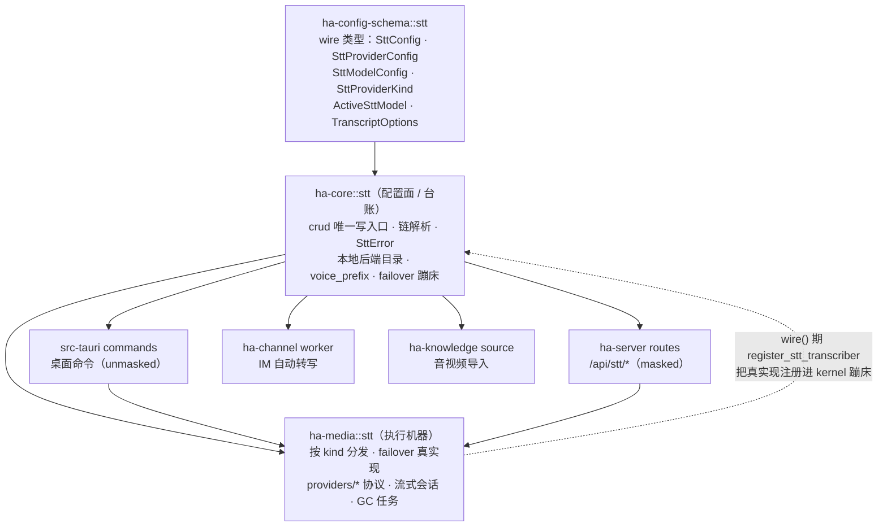
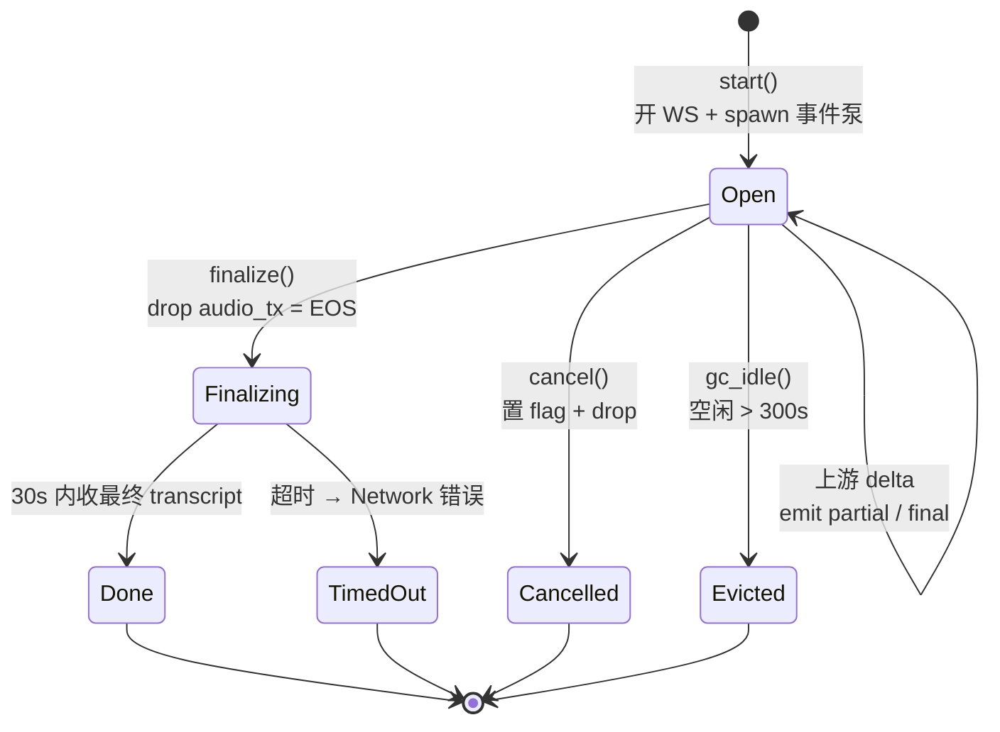

# 语音转写（STT）

> 返回 [文档索引](../../README.md)
>
> 关联源码：
> - 配置 wire 类型：[`crates/ha-config-schema/src/stt.rs`](../../../crates/ha-config-schema/src/stt.rs)
> - 配置面 / 台账 / 链解析：[`crates/ha-core/src/stt/`](../../../crates/ha-core/src/stt/)
> - 执行机器（协议 / 流式会话 / failover 真实现）：[`crates/ha-media/src/stt/`](../../../crates/ha-media/src/stt/)
> - 桌面命令：[`src-tauri/src/commands/stt.rs`](../../../src-tauri/src/commands/stt.rs)；HTTP 路由：[`crates/ha-server/src/routes/stt.rs`](../../../crates/ha-server/src/routes/stt.rs)
> - IM 自动转写消费者：[`crates/ha-channel/src/channel/worker/media.rs`](../../../crates/ha-channel/src/channel/worker/media.rs)；知识空间导入：[`crates/ha-knowledge/src/knowledge/source.rs`](../../../crates/ha-knowledge/src/knowledge/source.rs)

## 核心思想

STT（Speech-to-Text）把语音转成文本，喂给三条消费路径：桌面语音输入、IM 入站语音消息、知识空间的音视频导入。它是一个**独立配置、独立鉴权、独立错误分类**的子系统，与主 LLM Provider 列表**物理隔离**。

隔离不是为了整齐，而是因为两者的模型语义与协议表面根本对不上：

- **语义维度不同**：转写模型按分钟计费、区分是否支持流式、有各自的语种覆盖——这些字段在 LLM Provider 上没有对应位置。
- **协议表面更杂**：一次转写可能是 OpenAI multipart 上传、chat-completions 里的 `input_audio` JSON、或五种彼此不兼容的 WebSocket 方言（Deepgram / AssemblyAI / Azure / 火山 / 讯飞）。把这些塞进 LLM 的 `provider::ApiType` 枚举只会污染那条主路径。

于是 STT 走了和 Memory 的 Embedding 子系统一样的思路：**自带一份 Provider 列表、自带一套 wire 协议分发、自带一套分类错误**。它提供三类能力：

- **桌面语音输入**：一次性 batch 转写（`stt_transcribe_blob`）+ 流式会话（边说边出字，`SttSessionManager`）。
- **IM 自动转写**：账号级 opt-in，把入站语音消息转成文本注入对话，**batch-only**（IM 不用流式）。
- **本地后端**：whisper.cpp / faster-whisper / FunASR / sherpa-onnx 一键接入（都走 OpenAI 兼容端点 + `allow_private_network`）。

所有配置写入经唯一入口 `stt::crud` 走 `mutate_config` 并 emit `config:changed`，形状与 LLM Provider 的写入契约同构。

## 分层与 crate 归属

拆分后 STT 横跨四层 crate：wire 类型下沉到 schema 层，「台账 + 契约 + 纯链解析逻辑」留在 kernel，真正干活的「执行机器」搬到特征 crate `ha-media`，最外层是桌面 / HTTP 薄壳和两个业务消费者。



关键接缝在 kernel 与 `ha-media` 之间：kernel 的 `failover_transcribe_batch` 只是一段**蹦床（trampoline）**——它持有一个 `OnceLock<SttTranscriber>` 函数指针。`ha-media` 在装配期（`wire()`）调 `register_stt_transcriber` 把真实现塞进去。这样 kernel 保住「无 `ha-media` 依赖」的分层，而没接线的进程（例如某些 headless 路径）调用蹦床时会拿到 `NoActiveModel` 终态并 `app_warn` 审计，调用方原有的降级路径（保留原始音频 / 报错）照常生效。

**为什么这样切**：对 `AppConfig.stt` 的 SQL 台账、纯 wire 类型、纯谓词（链解析、错误分类、本地后端目录）恒留 kernel；真正发网络请求、跑 WebSocket、拼 multipart 的「机器」才搬到 `ha-media`。两侧均零 Tauri 依赖。

| kernel 文件（`ha-core/src/stt/`） | 职责 |
|---|---|
| `mod.rs` | 子系统根、公共 API 再导出、`register_stt_transcriber` 蹦床、`voice_prefix_for_locale()` 本地化前缀助手 |
| `types.rs` | 运行时类型（`Transcript` / `TranscriptDelta` / `AudioPayload`）+ 子系统自由函数（`check_ssrf` / `require_extra`）+ 硬常量 `MAX_BATCH_AUDIO_BYTES`。**配置 wire 类型已下沉 `ha-config-schema`，此处原地 `pub use` 保持 `crate::stt::types::*` 路径不变** |
| `engine.rs` | 链解析：`resolve_active` / `current_desktop_chain` / `current_im_chain`；`failover_transcribe_batch` 蹦床 + `FailoverError` / `AttemptedModel` |
| `errors.rs` | `SttError` 分类错误 + `is_retriable()`（裁决 failover 是否换下一个）+ `code()` 稳定短码 |
| `local.rs` | 已知本地后端目录（`KnownLocalSttBackend` + 4 个后端 key 常量 + `probe_local_backend_alive`） |
| `crud.rs` | 唯一写入口（`add/update/delete/reorder` provider、`set_active`、fallback / im-fallback 链、默认选项、`upsert_known_local_stt_provider`）+ `check_batch_capable` |

| ha-media 文件（`ha-media/src/stt/`） | 职责 |
|---|---|
| `engine.rs` | `transcribe_with`（按 `SttProviderKind` 分发到 providers）+ `failover_transcribe_batch` 真实现（含默认选项合并、用量入账） |
| `session.rs` | 流式会话管理器 `SttSessionManager`（WebSocket 生命周期 + EventBus 集成 + idle GC） |
| `providers/` | 各 wire 协议实现（openai / chat_completions_asr / elevenlabs / xai / deepgram / assemblyai / azure / volcengine / xunfei）+ 共享 helper（`load_batch_audio` / `ws_to_https_twin` / `ws_connect_with_caps` / 错误分类） |

## 配置模型

`AppConfig.stt: SttConfig`。`SttConfig` 及其成员类型是纯 wire 数据，定义在 [`ha-config-schema::stt`](../../../crates/ha-config-schema/src/stt.rs)；schema 层不读运行时状态，所以像 `check_ssrf`（需读全局 SSRF 策略）这类逻辑改成 `ha-core::stt::types` 里的自由函数：

```rust
pub struct SttConfig {
    pub providers: Vec<SttProviderConfig>,       // 云 + 本地合并成一份列表
    pub active_model: Option<ActiveSttModel>,    // 桌面语音输入主模型（failover 链首）
    pub fallback_models: Vec<ActiveSttModel>,    // 桌面 failover 链（active 失败时按序尝试）
    pub im_fallback_model: Option<ActiveSttModel>, // IM 自动转写专用，未设回退到 active_model
    pub default_options: TranscriptOptions,      // 默认转写选项
}
```

- **`SttProviderConfig`**：`id` / `name` / `kind: SttProviderKind` / `base_url` / `api_key`（legacy 单 key）/ `auth_profiles: Vec<AuthProfile>`（与 LLM Provider 共用 key 轮换机制）/ `models: Vec<SttModelConfig>` / `enabled` / `allow_private_network` / `extra: HashMap<String,String>`（provider 私有 secret，如 `app_id` / `cluster` / `region`）
- **`SttModelConfig`**：`id` / `name` / `supports_streaming` / `languages` / `cost_per_minute` / `supports_timestamps` / `supports_diarization`

### 凭据脱敏

`SttProviderConfig::masked()` 对三处 secret 统一打码：`api_key`、`auth_profiles`（逐 profile `.masked()`）、`extra`（逐值打码）。底层 `mask_secret_middle(value, 4, 4)`——保留前 4 后 4 字符（`sk-a...wxyz`），长度 ≤ 8 的短值整体压成 `****`，空串保持空串（区分「未设」与「已打码」）。

写回时经 `is_masked_key` + `merge_profile_keys`（复用 `provider::` 同款）**合并保密**：前端 round-trip 把打码值原样传回时不会清空真实 key；`extra` map 同理——incoming 里被打码的值不覆盖已存值，而 incoming 里删掉的键才真正删除（调用方发的是完整 map）。

## Provider 抽象（`SttProviderKind`）

10 个 wire 协议变体，`ha-media::engine::transcribe_with` 按 kind 分发到对应 `providers/*` 实现：

| 变体 | 协议 | 流式会话 | Batch | 典型 |
|---|---|:---:|:---:|---|
| `OpenaiTranscriptions` | HTTP multipart `/v1/audio/transcriptions` | ✗ | ✓ | OpenAI Whisper / gpt-4o-transcribe |
| `OpenaiCompatible` | HTTP multipart（同上 wire） | ✗ | ✓ | Groq / StepFun / SiliconFlow / 四个本地后端 |
| `OpenaiChatCompletionsAsr` | HTTP JSON（chat/completions + `input_audio`） | ✗ | ✓ | DashScope Qwen3-ASR / gpt-4o-audio |
| `ElevenlabsStt` | HTTP multipart `/v1/speech-to-text`（`model_id` + `xi-api-key`） | ✗ | ✓ | ElevenLabs Scribe |
| `XaiStt` | HTTP multipart `/v1/stt`（`model` + Bearer） | ✗ | ✓ | xAI Grok STT |
| `DeepgramWs` | WebSocket 二进制 | ✓ | ✗ | Deepgram realtime |
| `AssemblyaiWs` | WebSocket 二进制 | ✓ | ✗ | AssemblyAI realtime |
| `AzureWs` | WebSocket（USP 协议，需 `language`） | ✓ | ✗ | Azure Speech |
| `VolcengineWs` | WebSocket 二进制 | ✓ | ✗ | 火山 / 字节 ASR |
| `XunfeiWs` | WebSocket（hmac-sha256 签名 URL） | ✓ | ✗ | 讯飞 IAT |

helper 方法：`default_base_url()` / `supports_streaming()` / `supports_batch()` / `uses_multipart_upload()` / `display_name()`。

两个判定表是安全边界，容易混淆，分清楚：

- **`supports_batch()`** 是 **fallback / IM 链的白名单判定**：只有 5 个 batch-capable kind（三个 OpenAI 形态 + ElevenLabs + xAI）能进 batch 链，WS-only kind 一律拒（见[安全红线](#安全红线)）。
- **`supports_streaming()`** 只是**给 UI 用的粗略提示**（它对 `OpenaiCompatible` 返回 `true`）。真正能开流式会话的只有 5 个 WS 协议——`SttSessionManager::start` 里只实现了这五种的 `open_stream`，任何非 WS kind（含 `OpenaiCompatible`）走流式入口都会被直接拒回，请改走 batch 端点。

## 转写选项与默认合并

`TranscriptOptions` 字段：`language`（BCP-47 / ISO 639-1 语言提示，`None` = 自动检测）/ `prompt`（提升命名实体准确度）/ `punctuation` / `diarization` / `timestamps` / `sample_rate_hz`。

用户配的 `default_options` 只在**两个执行边界**（都在 `ha-media`）合并，别处不得各自复制这套语义：

- **batch**：`failover_transcribe_batch` 进链前统一 `options.with_defaults(&cfg.stt.default_options)`。
- **streaming**：`SttSessionManager::start` 开流前做同一次合并。

合并规则（`with_defaults`）：请求里非空 / `Some` 的字段优先，字符串按 `trim` 后是否为空判定——**只含空白的字符串视为「未指定」**，回落默认值。这条纪律让 Tauri、HTTP、IM、知识空间导入拿到一致的默认参数，不会各自形成不同语义。

> **Azure Speech 的硬前置**：Azure 的识别 URL 把 `language` 拼进 query，缺它无法握手。所以 Azure provider 在**联网前**校验非空 BCP-47 `language`（如 `zh-CN`），缺失即返回 `SttError::Config`（渲染成 `stt:config: …`），绝不发送缺参数的 WebSocket 握手。

## Failover 与错误分类

### 链解析

- **桌面链** `current_desktop_chain()` = `active_model`（首）+ `fallback_models`。
- **IM 链** `current_im_chain()`：主模型取 `im_fallback_model`（未设则取 `active_model`）；恢复链是 `fallback_models`，且当 `im_fallback_model` 与 `active_model` **都**配置时，把桌面 `active_model` 追加到恢复链**末尾**（去重），避免用户主模型被 IM 专用主模型挤出链外。因此两者都配时的实际尝试顺序是：`im_fallback_model` → `fallback_models…` → `active_model`。

> 写入侧 `check_batch_capable` 只钳制 `im_fallback_model` 与 `fallback_models` 为 batch-capable；桌面 `active_model` 允许是 WS-only（供桌面流式）。若它是 WS-only 又被折进 IM 恢复链，该次尝试会在 `transcribe_with` 直接失败（WS kind 不支持 batch），按可重试处理跳到下一个——只是白跑一次，不会卡死 IM 转写。

### 是否换下一个模型

`SttError::is_retriable()` 裁决 failover 循环遇到某错时是继续还是终止：

| 类别 | code | failover 行为 |
|---|---|---|
| `Network` / `RateLimit` / `ProviderUnavailable` / `Auth` / `Other` | `network` / `rate_limit` / `provider_unavailable` / `auth` / `other` | **可重试**：记一次 attempt，尝试链中下一个 |
| `Config` / `UnsupportedAudio` / `SsrfBlocked` / `Io` | `config` / `unsupported_audio` / `ssrf_blocked` / `io` | **不可重试**：立即终止，返回终态错误（换模型也没用——音频格式 / 配置 / 目标本身就是问题） |
| `NotFound`（链项解析失败） | `not_found` | 记一次 attempt 后跳到下一个（provider / model 缺失或被禁用） |
| `NoActiveModel` | `no_active_model` | 空链或全链耗尽时的终态 |

`SttError` 共 11 变体（上表 4 类 + 独立 `NotFound` / `NoActiveModel`）。`Display` 一律渲染成 `stt:<code>: <message>`——因为 Tauri / HTTP 边界会把 typed enum 压成字符串，加个稳定前缀让两侧都能 split 出 `code()` 再判定。

### failover 流程

```mermaid
flowchart TD
    start([failover_transcribe_batch]) --> empty{链为空?}
    empty -- 是 --> noactive["返回 NoActiveModel"]
    empty -- 否 --> merge["options.with_defaults(default_options)"]
    merge --> next["取链中下一个 ActiveSttModel"]
    next --> resolve{"resolve_active<br/>命中且 enabled?"}
    resolve -- 否 --> recNF["记 NotFound attempt"] --> more
    resolve -- 是 --> call["transcribe_with<br/>按 kind 分发 provider"]
    call --> ok{成功?}
    ok -- 是 --> done([返回 Transcript])
    call --> err{错误}
    err --> retri{is_retriable?}
    retri -- 否 --> terminal["返回 FailoverError<br/>terminal = 该错误"]
    retri -- 是 --> recRetry["记 attempt<br/>缓存 last_error"] --> more
    more{还有下一个?} -- 是 --> next
    more -- 否 --> exhaust["返回 FailoverError<br/>terminal = last_error"]
```

`FailoverError` 携带全部 `AttemptedModel`（provider / model / error_code / message）+ 终态错误，供遥测与日志；每次 batch 尝试还经 `model_usage`（`KIND_STT`）入账（provider、耗时、成功与否、音频字节、语言等元数据）。

### 知识空间导入复用桌面链

知识空间资料舱的 `audio_transcript` / `video_transcript` 导入（`ha-knowledge`）复用桌面链：面向用户本人的导入接收用户选择的音视频字节、SSRF 校验过的远程媒体下载结果，或已落入会话附件目录的聊天 / IM 附件，调 `failover_transcribe_batch(current_desktop_chain, …)`，用户未显式配置时默认请求 timestamps。成功后只保存带 provenance / provider / model / language / duration / segment 时间戳的 Markdown 转录快照，**原始媒体不持久化**；未配 STT 或转录失败时该 import item 进入 `failed`，错误保留在导入历史供重试。

## 流式会话

`SttSessionManager`（进程级全局单例）管理流式转写生命周期，**纯内存、无 DB 持久化**：

| 方法 | 行为 |
|---|---|
| `start(provider?, model?, options, chat_session_id?)` | 给了 `(provider,model)` 就用它，否则取桌面链**主模型**（流式不做中途换引擎）；经 `resolve_active` 解析后按 kind 开对应 WS 上游流，spawn 事件泵，返回 `stt_{uuid}` |
| `push_chunk(session_id, bytes)` | 经 `try_send` 把音频推到上游（不跨锁 clone sender）；每 `LAST_ACTIVE_COALESCE`（**32**）个 chunk 才刷新一次 `last_active`；buffer 满返 `Network`，会话已 finalize / 逐出返 `NotFound` |
| `finalize(session_id)` | 锁内移除会话条目（drop `audio_tx` = 发 EOS 信号），锁外**等 30s** 收最终 transcript |
| `cancel(session_id)` | 置 cancel flag + drop `audio_tx` + 移除会话 |
| `gc_idle()` | 逐出空闲 > `SESSION_IDLE_TIMEOUT_SECS`（**300s**）的会话，`app_warn!("stt", …)` 留痕；由 `ha-media` 注册的 PrimaryOnly 启动任务每 5 分钟 tick 一次调用 |

事件泵（`spawn_event_pump`）把上游 delta 累积成最终 transcript，并 fan-out 到 EventBus（EventBus 不可用时静默丢弃、不崩溃）；final delta 才累加进 accumulated 文本：

```rust
pub const EVENT_TRANSCRIPT_PARTIAL: &str = "stt:transcript_partial";
pub const EVENT_TRANSCRIPT_FINAL:   &str = "stt:transcript_final";
pub const EVENT_SESSION_ERROR:      &str = "stt:session_error";
```

一个流式会话的生命周期：



> **`try_send` 的用意**（非显然坑）：`push_chunk` 在 std mutex 内用 `try_send` 而非 clone 出 sender 再 `.send().await`。若把 sender clone 出锁再异步 send，一个在途 chunk 会在 `finalize` 移除会话后仍持有 channel，卡住 EOS 信号、逼流式路径吃满 30s 超时。用 `try_send` 让 sender 只活在本次调用内，`finalize` 一 drop 原 sender，上游立刻看到 end-of-audio。

## IM 自动转写

账号级 opt-in，把入站语音消息转成文本再注入对话：

- **开关**：`ChannelAccountConfig::auto_transcribe_voice()` 读 per-account 的 `settings.autoTranscribeVoice`（key 常量 `SETTINGS_KEY_AUTO_TRANSCRIBE_VOICE`），**默认 `false`**。
- **本地化前缀**：`voice_prefix_for_locale(locale, text)` 给转写文本加 `[语音转录] …\n\n` 前缀（zh-TW 为 `[語音轉錄]`），按用户 `AppConfig.language` 本地化。覆盖仓库随附的 12 种 locale（`ar / en / es / ja / ko / ms / pt / ru / tr / vi / zh / zh-TW`），`auto` 与未知 locale 回退英文 `[Voice transcript]`。
- **链路**：`ha-channel` worker 命中语音消息时取 `current_im_chain()`，统一经 `failover_transcribe_batch` 转写——**batch-only**。转写失败时按 worker 既有降级路径转发原始音频。

## 本地后端

`stt::local` 维护 4 个已知本地后端目录（`KnownLocalSttBackend`），全部用 `OpenaiCompatible` kind 接 OpenAI 兼容端点：

| 后端 | key | 默认端点 | 端口 |
|---|---|---|---|
| whisper.cpp server | `whisper-cpp` | `http://127.0.0.1:8080` | 8080 |
| faster-whisper-server | `faster-whisper` | `http://127.0.0.1:8000` | 8000 |
| FunASR | `funasr` | `http://127.0.0.1:10097` | 10097 |
| sherpa-onnx server | `sherpa-onnx` | `http://127.0.0.1:6006` | 6006 |

- **目录内容**：每个后端条目带常用模型清单（预填「添加模型」下拉）+ 中英文安装提示 + 官方 URL，匹配用的 host 集合含 `127.0.0.1` / `localhost` / `::1`。
- **探测**：`probe_local_backend_alive()` 对 `127.0.0.1:{port}` 做 **500ms** TCP connect。
- **一键接入**：`upsert_known_local_stt_provider()` 幂等——按 host/port 匹配既有 provider（`known_local_stt_backend_matches`，忽略路径与 localhost 别名），命中则补模型 + 启用，未命中则新建；一律强制 `allow_private_network = true` 让其能打 localhost。
- 前端判断「是否已配本地后端」必须消费此 catalog，**禁止硬编码 regex**（与 LLM `provider::local` 同纪律）。

## 命令 / 路由面

两端一一镜像（HTTP transport 把同一 args 对象逐字传给对应命令）：

| 平面 | 入口 | 数量 | 脱敏 |
|---|---|:---:|---|
| Tauri 命令 | [`src-tauri/src/commands/stt.rs`](../../../src-tauri/src/commands/stt.rs) | 22 | **unmasked**（桌面 = 本机信任域） |
| HTTP 路由 | `/api/stt/*`（[`routes/stt.rs`](../../../crates/ha-server/src/routes/stt.rs)） | 22 | **masked**（响应内 provider secret 打码） |

分组：provider CRUD（list / add / update / delete / reorder）、active / fallback / im-fallback 选择、默认转写参数、本地 catalog（list / probe / upsert）、转写（`transcribe`/`transcribe_blob` 一次性 + 流式会话 `start` / `push_chunk` / `finalize` / `cancel`）。

## 安全红线

- **Size caps（fail-closed）**：`MAX_BATCH_AUDIO_BYTES = 25 MiB`（对齐 OpenAI Whisper 上限），在 **Tauri 命令、HTTP 路由、provider `load_batch_audio` 三处**校验（先查 base64 长度、再查解码后字节，超限前不分配大 buffer）；流式 chunk 经 `MAX_PUSH_CHUNK_BYTES = 1 MiB`（命令层与 HTTP 层各一份）预检；WS 帧 `WS_MAX_MESSAGE_BYTES = 4 MiB` / `WS_MAX_FRAME_BYTES = 1 MiB`，流通道 `STT_STREAM_CHANNEL_CAPACITY = 64`。
- **SSRF**：所有 provider URL 经 `security::ssrf::check_url`；本地后端 `allow_private_network = true` 才放行 loopback；**WS provider 先经 `ws_to_https_twin` 把 ws(s) 转成 http(s) 孪生 URL 再过 SSRF**（`check_url` 不认 ws/wss scheme）；batch provider 的 reqwest client 显式 `redirect::Policy::none()`，防 3xx 跳到内网 / 云 metadata。
- **batch-capable guard**：`check_batch_capable()` 拦截把 `fallback_models` / `im_fallback_model` 设成 WS-only provider（桌面 `active_model` 可用 WS 走流式，IM / fallback 链 batch-only 必拒）。
- **fail-closed 选择**：无 active model → `SttError::NoActiveModel`，不回退「任意模型」，必须显式配置。
- **会话清理**：idle 300s 逐出，防废弃 WebSocket 泄漏 provider 带宽。
- **incognito**：STT 配置是全局（非会话级），当前**未与无痕模式集成**——无 ephemeral 配置概念。

## 设置（Settings）约定

STT 归「**强制留 GUI 的例外**」同类（凭据安全）——面向用户本人的 Provider / Key 控制面不下放给模型工具：

- **Provider 列表 + Key 只经 GUI**：provider 写入只走 Tauri / HTTP owner 命令（调 `stt::crud`），**不进 `update_settings`**。`ha-settings` 对 `stt_providers` / `active_stt_model` / `stt_fallback_models` 三个 category 只读（列入 `BLOCKED_UPDATE_CATEGORIES`），`stt_providers` 读出前经 `redact_stt_providers_value` 脱敏。
- **`get_settings` 只读摘要**：`stt` 块暴露 `providerCount` / `activeModel` / `fallbackCount` / `imFallbackConfigured` / `defaultLanguage`，不泄 key。
- **默认转写语言双入口**：GUI 通过 `get/set_stt_default_options` 修改；`ha-settings` 通过 **LOW** 风险的 `stt_language` 读写同一 `default_options.language`，不触及 Provider 凭据或模型选择。
- **唯一模型可写旋钮**：`im_auto_transcribe`（per-account 语音转写开关 + IM fallback 模型，风险 **MEDIUM**，`update_settings` 经 `update_im_auto_transcribe`）。

## 跨子系统

| 子系统 | 关系 |
|---|---|
| Config | `AppConfig.stt`；写经 `mutate_config` + `config:changed` |
| Channel | per-account `auto_transcribe_voice`；IM worker 命中语音消息时取 IM 链转写 + `voice_prefix_for_locale` |
| Knowledge | 音视频导入复用桌面链 + `failover_transcribe_batch`，默认请求 timestamps，只存 Markdown 快照 |
| Provider | 复用 `AuthProfile` key 轮换 + `is_masked_key` / `merge_profile_keys` 合并保密 |
| Security / SSRF | 每个出站 URL 过 `check_url`；WS 经 http(s) 孪生 URL |
| EventBus | 流式会话经 `get_event_bus()` emit `stt:*` |
| Model Usage | 每次 batch / 开流经 `model_usage`（`KIND_STT`）入账 |
| Startup tasks | `ha-media` 注册 PrimaryOnly 任务每 5 分钟调 `SttSessionManager::gc_idle()` |

## 关键文件索引

| 文件 | 角色 |
|---|---|
| [`ha-config-schema/src/stt.rs`](../../../crates/ha-config-schema/src/stt.rs) | 配置 wire 类型：`SttConfig` / `SttProviderConfig` / `SttModelConfig` / `SttProviderKind` / `ActiveSttModel` / `TranscriptOptions` + `masked()` |
| [`ha-core/src/stt/mod.rs`](../../../crates/ha-core/src/stt/mod.rs) | 子系统根 + 公共 API + `register_stt_transcriber` 蹦床 + `voice_prefix_for_locale` |
| [`ha-core/src/stt/types.rs`](../../../crates/ha-core/src/stt/types.rs) | 运行时类型（`Transcript` / `AudioPayload`）+ `check_ssrf` / `require_extra` + `MAX_BATCH_AUDIO_BYTES` |
| [`ha-core/src/stt/engine.rs`](../../../crates/ha-core/src/stt/engine.rs) | 链解析（`current_desktop_chain` / `current_im_chain` / `resolve_active`）+ `failover_transcribe_batch` 蹦床 + `FailoverError` |
| [`ha-media/src/stt/engine.rs`](../../../crates/ha-media/src/stt/engine.rs) | 按 kind 分发（`transcribe_with`）+ `failover_transcribe_batch` 真实现 |
| [`ha-core/src/stt/errors.rs`](../../../crates/ha-core/src/stt/errors.rs) | `SttError`（11 变体）+ `is_retriable` + `code` |
| [`ha-core/src/stt/local.rs`](../../../crates/ha-core/src/stt/local.rs) | 4 本地后端 catalog + probe + match |
| [`ha-media/src/stt/session.rs`](../../../crates/ha-media/src/stt/session.rs) | `SttSessionManager` + `stt:*` 事件 + idle GC |
| [`ha-core/src/stt/crud.rs`](../../../crates/ha-core/src/stt/crud.rs) | 唯一写入口 + `check_batch_capable` |
| [`ha-media/src/stt/providers/`](../../../crates/ha-media/src/stt/providers/) | 9 协议实现（10 个 kind，OpenAI multipart 两种共用 openai.rs）+ 共享 batch / WS helper |
| [`src-tauri/src/commands/stt.rs`](../../../src-tauri/src/commands/stt.rs) | 22 Tauri 命令（unmasked） |
| [`ha-server/src/routes/stt.rs`](../../../crates/ha-server/src/routes/stt.rs) | 22 HTTP 路由（masked） |
