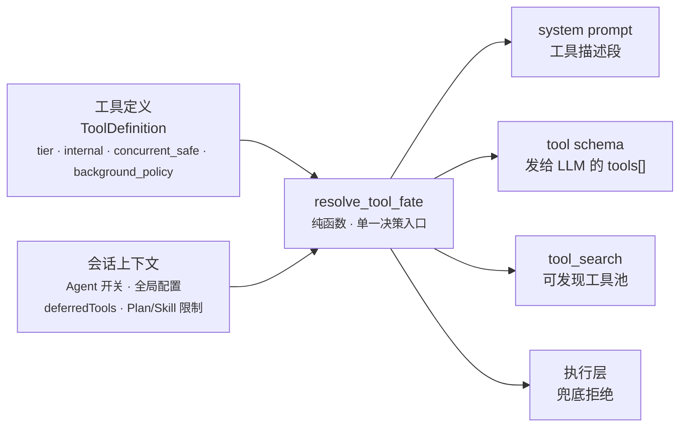
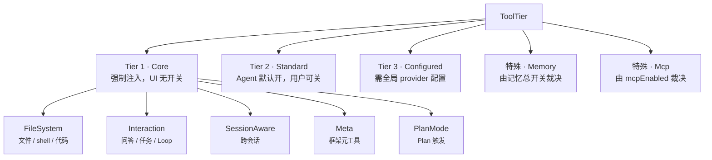
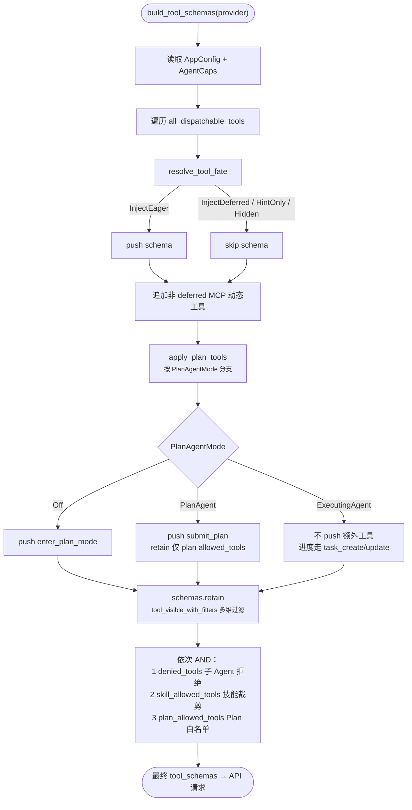
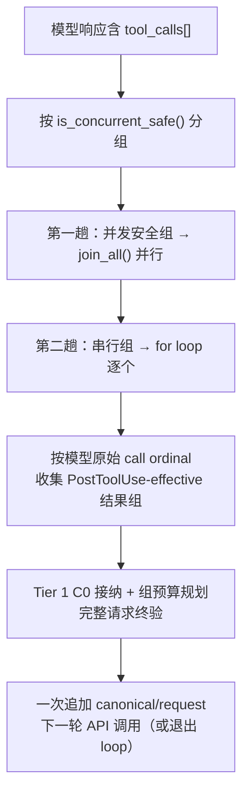
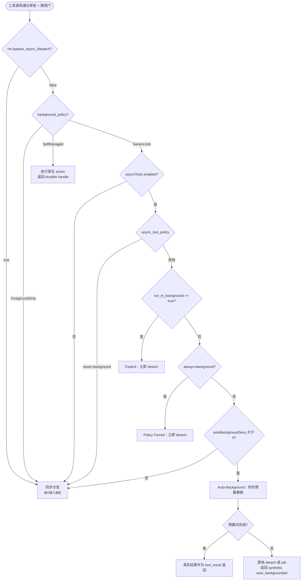
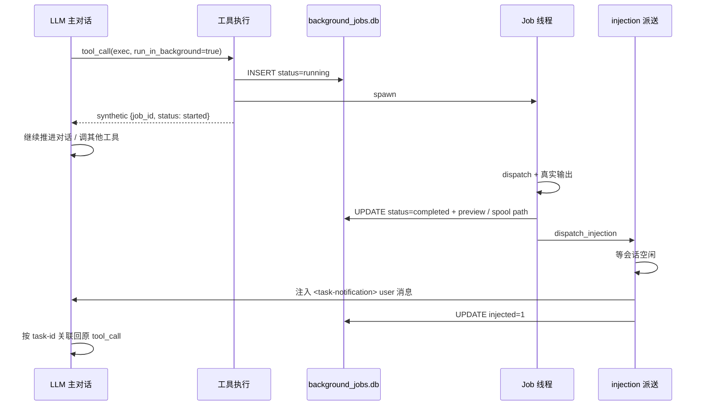
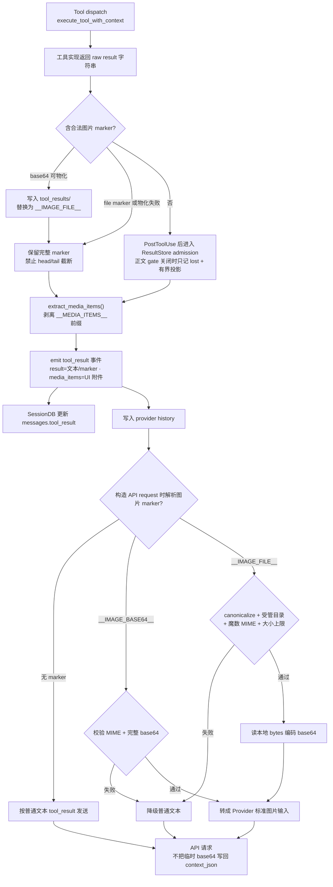
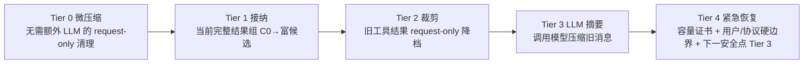

# 工具系统架构

> 返回 [文档索引](../../README.md)
>
> 更新时间：2026-08-10
>
> 关联源码：
> - 工具契约：[`crates/ha-core/src/tool_defs/`](../../../crates/ha-core/src/tool_defs/)（`types.rs` 定义 `ToolDefinition` / `ToolTier` / `BackgroundPolicy`，`metadata.rs` 派生 v2 元数据）
> - 注入决策：[`crates/ha-core/src/tools/dispatch.rs`](../../../crates/ha-core/src/tools/dispatch.rs)（`resolve_tool_fate`）
> - 工具清单：[`crates/ha-core/src/tools/definitions/`](../../../crates/ha-core/src/tools/definitions/) + [`crates/ha-core/src/tool_defs/extra_tools.rs`](../../../crates/ha-core/src/tool_defs/extra_tools.rs)
> - 执行与分发：[`crates/ha-core/src/tools/execution.rs`](../../../crates/ha-core/src/tools/execution.rs) · [`registry.rs`](../../../crates/ha-core/src/tools/registry.rs) · [`builtin_registry.rs`](../../../crates/ha-core/src/tools/builtin_registry.rs)
> - Schema 组装：[`crates/ha-core/src/agent/mod.rs`](../../../crates/ha-core/src/agent/mod.rs)（`build_tool_schemas`）
> - 深入子系统：审批引擎 [permission-system](../agent/permission-system.md) · 后台任务 [background-jobs](../agent/background-jobs.md) · Plan Mode [plan-mode](../agent/plan-mode.md)

---

## 这个子系统解决什么问题

Agent 的每一次"动手"都是一次工具调用：读文件、跑命令、搜网页、开浏览器、生成图片、派生子 Agent。工具系统要同时回答四个彼此独立的问题，而且答案会随会话状态实时变化：

1. **这一轮该把哪些工具的 schema 塞进 LLM 请求？** —— 模型只能调用最终留在 `tools[]` 数组里的工具。塞多了浪费上下文 token、稀释注意力；塞少了模型不知道自己有这个能力。
2. **这个工具现在能不能执行？** —— Agent 关掉了它、Plan Mode 禁掉了它、子 Agent 被拒绝了它，都要在执行前兜底拦住，不能靠"模型不会调"来保证。
3. **要不要先弹审批让用户拍板？** —— 读文件无害、`rm -rf` 危险，粒度天差地别。
4. **这次调用要不要甩到后台去？** —— 一条长跑命令不该把整个对话卡住。

这套系统的核心设计是：**把"工具是什么"和"工具此刻该怎么处理"彻底分开**。每个工具在定义时只声明少量稳定的静态属性（它属于哪一层、是否豁免审批、能否并发、后台语义），而所有随上下文变化的注入决策，全部由一个纯函数 `resolve_tool_fate` 集中派生。没有散落各处的 `deferred` / `always_load` bool，也没有"prompt 里描述了但 schema 里没发"这类不一致——system prompt、tool schema、`tool_search` 检索池、执行层兜底，四个消费点读的是同一个决策来源。



后面几节依次展开：先讲**分层模型**（工具是什么），再讲**注入决策**（该发哪些），然后是**执行流程**（怎么跑、并发、后台），最后是**权限与审批**（要不要拦）。

---

## 分层模型：4 层 + 2 特殊路径

工具的分层沿"**用户对它的控制粒度**"切分，而不是按内部 flag 组合切。每个工具在定义时声明一个 `ToolTier`（[`tool_defs/types.rs`](../../../crates/ha-core/src/tool_defs/types.rs)），这是它可见性 / 注入决策的唯一真相源。



### Tier 1 · Core（核心基础）

强制注入，UI 不显示开关。含 5 个子类，子类只决定注入路径分发，不影响"对用户是否可见"：

| 子类 | 职责 | 代表工具 |
|------|------|----------|
| `Core::FileSystem` | 文件 / shell / 语义代码智能 | `exec`, `process`, `read`, `write`, `edit`, `ls`, `grep`, `find`, `lsp`, `apply_patch` |
| `Core::Interaction` | 交互与控制面 | `ask_user_question`, `send_attachment`, `task_create/update/list`, `loop_status/reschedule/stop/record_progress` |
| `Core::SessionAware` | 跨会话感知与协调 | `sessions_create`, `sessions_list`, `session_status`, `sessions_search`, `sessions_history`, `sessions_send`, `peek_sessions`, `agents_list` |
| `Core::Meta` | 框架元工具 | `tool_search`, `job_status`, `schedule_wakeup`, `runtime_cancel`, `skill` |
| `Core::PlanMode` | Plan Mode 触发 | `enter_plan_mode`, `submit_plan` |

几处非显然行为：

- `Core::Meta` 里的工具并非全部无条件注入：`tool_search` 在存在内置 deferred 工具或任一有效 MCP server 时注入（后者还承担 lazy catalog 自举）；`job_status` 只有 `asyncTools.enabled` 时注入。
- `Core::PlanMode` 的 `enter_plan_mode` / `submit_plan` 在 dispatcher 里**永远返回 Hidden**，由 `apply_plan_tools` 按当前 `PlanAgentMode` 单独注入（详见后文 [Plan Mode](#plan-mode-工具限制)）。
- `schedule_wakeup` 是 agent 自我定时唤醒原语，详见 [自我定时唤醒](#自我定时唤醒schedule_wakeup)。

### Tier 2 · Standard（标准工具）

Agent 默认开启、用户可在 Agent 设置里关闭。每个工具在定义时声明 `default_for_main` / `default_for_others` 两个默认值——前者作用于硬编码主 agent（`agent_id == "ha-main"`，即 `agent_loader::DEFAULT_AGENT_ID`），后者作用于其他新建 agent。第三个字段 `default_deferred` 是一个兼容性推荐提示：标 `true` 表示"该工具默认适合放进 deferred 池"，但在 V2 加载模型下任何 Standard/Configured 工具都能被放入 deferred（详见 [延迟工具加载](#延迟工具加载deferred-tools)）。

| 工具 | main | others | default_deferred |
|---|:---:|:---:|:---:|
| `web_fetch` / `manage_cron` | ✓ | ✓ | false |
| `browser` / `image` / `pdf` / `get_weather` / `team` | ✓ | ✓ | true |
| `knowledge_recall` | ✓ | ✓ | true |
| `get_settings` / `update_settings` | ✓ | ✗ | false |
| `mac_control` | ✓ | ✗ | true |
| `list_settings_backups` / `restore_settings_backup` | ✓ | ✗ | true |
| `issue_report` | ✓ | ✗ | true |

设置类工具（`get_settings` / `update_settings` / 备份工具）是"主 agent 默认开、新 agent 默认关"的典型子类。完整清单以各定义文件为准（[`core_tools.rs`](../../../crates/ha-core/src/tools/definitions/core_tools.rs) / [`special_tools.rs`](../../../crates/ha-core/src/tools/definitions/special_tools.rs)），此处只列有代表性的默认值组合。

### Tier 3 · Configured（需要全局配置）

Agent 层有开关，但即使开了，全局 provider 没配也不真正注入；此时在系统提示词的 `# Unconfigured Capabilities` 段用 `config_hint` 引导用户去配置。

| 工具 | main | others | config_hint |
|---|:---:|:---:|---|
| `web_search` | ✓ | ✓ | Settings → Tools → Web Search |
| `image_generate` | ✓ | ✓ | Settings → Model Providers → Generation Models |
| `audio_generate` | ✓ | ✓ | Settings → Model Providers → Generation Models |
| `canvas` | ✓ | ✓ | Settings → Tools → Canvas |
| `design` | ✓ | ✓ | Settings → Tools → Design Space |
| `artifact` | ✓ | ✓ | Settings → Tools → Canvas |
| `send_notification` | ✓ | ✓ | Settings → Tools → Notifications |
| `subagent` | ✓ | ✓ | Settings → Agents |
| `acp_spawn` | ✓ | ✗ | Settings → Agents → ACP |

除 `acp_spawn`（`default_deferred=true`）外，上表工具都是 `default_deferred=false`。飞书业务 toolset 也是 Tier 3，共享一个"至少配了一个飞书账号"的全局门，见 [飞书业务 toolset](#飞书业务-toolset)。

### 特殊路径 1 · Memory

记忆工具（`save_memory`, `recall_memory`, `update_memory`, `delete_memory`, `memory_get`, `core_memory`, `update_core_memory`, `project_memory`）由多重开关共同裁决：产品级 `AppConfig.memory.enabled`、Core/Recall 子开关、agent 级 `memory.enabled`、session 的 use/contribute policy、以及 Incognito。读取类工具要求 `useMemories`，写入 / 提升类要求 `contributeToMemories`，即使权限判定是 `allow` 也绕不过这些 gate。`core_memory(scope=project)` / `project_memory` 还要求当前会话绑定有效 Project；无痕会话全部隐藏且执行层再次拒绝。UI 不给这些工具单独开关——记忆能力作为整体管理。详见 [memory](memory.md)。

### 特殊路径 2 · MCP

`agent.json` 的 `capabilities.mcpEnabled`（默认 `true`）统一控制 MCP：开启时注入 MCP 内置元工具（`mcp_resource` / `mcp_prompt`），并让动态 `mcp__<server>__<tool>` 进入 tool schema。关闭时 dispatcher 把这些工具一并 `Hidden`（不注入、不进 `tool_search` 池、不生成 `# Unconfigured Capabilities` 提示），同时 `build_tool_schemas` / `tool_search` 跳过整个 `mcp_tool_definitions()` 动态目录。`deferredTools.mode=recommended` 下动态 MCP 工具默认进入 deferred 发现池；`custom` / `disabled` 模式尊重单个 MCP server 的 `deferredTools=true` opt-in。详见 [mcp](../integration/mcp.md)。

---

## 工具定义

每个工具由一个 `ToolDefinition` 结构体描述（[`tool_defs/types.rs`](../../../crates/ha-core/src/tool_defs/types.rs)）。这个结构体刻意保持**小而稳定**：

```rust
pub struct ToolDefinition {
    pub name: String,
    pub description: String,
    pub parameters: Value,          // JSON Schema
    pub tier: ToolTier,             // 可见性 / 注入的单一真相源
    pub internal: bool,             // 与 tier 正交：是否豁免审批
    pub concurrent_safe: bool,      // 同轮可否并行
    pub background_policy: BackgroundPolicy,
}
```

两个关键的正交性：

- **`tier` 与 `internal` 正交**。`tier` 只管注入决策，`internal` 只管审批豁免。`exec` / `write` 是 Tier 1 Core 但 `internal=false`（会改系统、需用户确认）；`recall_memory` / `task_list` 也是 Tier 1 Core 但 `internal=true`（自治只读能力，永不弹审批）。
- **旧的 `deferred` / `always_load` bool 已彻底删除**，全部由 tier + 全局 `deferredTools` 配置派生：

```rust
impl ToolDefinition {
    pub fn is_internal(&self) -> bool;
    pub fn supports_deferred(&self) -> bool;  // 能否进 deferred 池
    pub fn is_always_load(&self) -> bool;     // = !supports_deferred()
    pub fn is_core(&self) -> bool;
    pub fn v2_metadata(&self) -> ToolMetadata; // sidecar 元数据
}
```

`supports_deferred()` 的规则：Core 中除 `Core::PlanMode` 与四个 bootstrap 工具（`tool_search` / `ask_user_question` / `runtime_cancel` / `skill`）外都可 deferred，Memory / Standard / Configured 一律可 deferred。所以"能力分层"不再等于"加载位置"——一个 Core 工具照样能被后移到 deferred 发现池。

### 后台执行语义（BackgroundPolicy）

`background_policy` 是工具后台行为的单一真相源，只有三种取值：

- **`ForegroundOnly`** —— 走普通 tool path，不接受通用后台包装。
- **`GenericJob`** —— 允许后台任务层 detach 整次调用；schema 自动注入 `run_in_background` / `job_timeout_secs` 两个可选参数，返回外层 `job_id`。`exec` / `web_search` / `image_generate` / `audio_generate` 属此类。
- **`SelfManaged { work_kind }`** —— 工具自身拥有 durable lifecycle 和原生 handle，必须直接返回各自的 run/thread/team handle，禁止再套一层后台 job。`work_kind` 取 `SubagentRun` / `WorkflowRun` / `AcpRun` / `AgentTeam`，对应 `subagent` / `workflow` / `acp_spawn` / `team`。

复合 `SelfManaged` 工具还通过 `invocation_semantics(args)` 把每个 action 描述成 `Dispatch` / `Wait` / `Observe` / `Control` / `Manage`——这是 schema、审计与测试契约，真正的状态机仍由各自 native store 执行。

### v2 元数据（sidecar）

`ToolDefinition` 本体保持精简；富元数据通过 [`tool_defs/metadata.rs`](../../../crates/ha-core/src/tool_defs/metadata.rs) 作为 sidecar 派生：`impl ToolDefinition { pub fn v2_metadata(&self) -> ToolMetadata }`。这样做有两个约束：

- **全工具覆盖**：所有内置工具、动态 MCP 工具都能拿到 v2 metadata，不要求每个定义点重复手填完整字段。
- **不改变执行语义**：metadata 服务于 `tool_search`、UI、workflow/review 规划；执行期的安全边界仍然是 `permission::engine`、`ToolExecContext::is_tool_visible`、Plan/Skill/KB 等 live gate。

`ToolMetadata` 当前包含的字段：

| 字段 | 作用 |
| --- | --- |
| `aliases` / `search_hints` | `tool_search` 检索别名和意图提示 |
| `effects` | 工具效果分类，如 `read_file_system`、`write_file_system`、`execute_process`、`network_access`、`external_service_write`、`task_write`、`knowledge_write`、`agent_delegation` |
| `risk` | `low` / `medium` / `high` / `strict`，用于检索摘要和后续策略 |
| `read_only` / `destructive` / `open_world` / `strict` | 行为特征；`strict=true` 表示该工具**可能**触发 strict 审批路径，不代表每次调用都 strict |
| `interrupt_behavior` | `immediate` / `graceful` / `long_running` / `human_blocked` |
| `permission` / `permission_matcher` | 粗粒度权限 subject + approval hint，便于 UI 和 planning 解释风险 |
| `input` / `path_extractor` | 从 JSON Schema 派生的参数提示、可用于路径归因的参数列表 |
| `validation` / `render` | strict schema / required 参数 alias；结果形态与主资源提示 |
| `search_text` | 拼好的检索语料，供 `tool_search` / 调试复用 |
| `auto_classifier_input` / `classifier_tags` | 面向 workflow/review 的分类输入 |

`to_api_metadata()` 会把这套 v2 语义随工具列表一起返回，因此 Tauri / HTTP 的工具列表与 `tool_search` 用同一套语义；其中 `default_deferred` 被渲染为对前端更直白的 `defer_capable` 字段。

### 并发安全标记

`concurrent_safe: bool` 决定工具能否在同一轮次内与其他工具并行执行——只读、无副作用的工具标 `true`，会改系统或有顺序依赖的标 `false`。这不是一张静态名单，而是每个工具定义时的字段；`tools::is_concurrent_safe(name)` 是唯一查询入口，由 `dispatch::all_dispatchable_tools()` 派生缓存。大致规律：

| 并发安全（可并行） | 串行执行 |
|---|---|
| `read` `ls` `grep` `find` `lsp` | `exec` `write` `edit` `apply_patch` `process` |
| `recall_memory` `memory_get` | `save_memory` `update_memory` `delete_memory` |
| `web_search` `web_fetch` | `browser` `subagent` `canvas` `image_generate` |
| `sessions_list` `session_status` `peek_sessions` | `sessions_create` `sessions_send` `manage_cron` `send_notification` |
| `ask_user_question` `task_list` `loop_status` | `task_create` `task_update` `submit_plan` |

---

## 分发注册表

工具执行的内置分发不是一个巨大的静态 `match`，而是一张运行时查表（[`tools/registry.rs`](../../../crates/ha-core/src/tools/registry.rs)）：`名字 → 执行 handler`。这样特征 crate 才能在装配期把自己的工具"接线"进来，而核心不必编译期依赖它们。

- [`builtin_registry.rs`](../../../crates/ha-core/src/tools/builtin_registry.rs) 汇编全部内置条目（含 `read_file` / `list_dir` 等历史别名）。**新增内置工具在此加条目**。
- **冻结语义**：`register_external_tools`（特征 crate 装配期注册）只能在冻结前调用；`init_runtime` 尾部 `freeze_now()` 主动冻结。冻结判定与注册队列消费在**同一把锁下**（`Mutex<Option<Vec>>` 的 `take()`）——杜绝"注册被静默吞掉却返回 Ok"。冻结后再注册返回 `Err`，重名在冻结时 panic（fail-loud）。
- **规范名随条目冻结**：别名归一的唯一入口是 `registry::canonical_name`，`execution.rs` 里的封装只是薄壳，禁止再硬编码别名清单（漏网别名会以"无 `ToolDefinition` 的名字"滑过可见性兜底）。deny / Skill / Plan allowlist 按"原名或规范名"双判：deny 规范名即封其全部别名；allowlist 写别名或规范名均命中。

分发顺序不变：查注册表 → `mcp__` 前缀走 MCP 子系统 → Unknown tool。注册表查表位于可见性兜底 / PreToolUse hook / 审批门**之后**，它只是查表，不是新的执行入口。

> 与 [`tools/definitions/registry.rs`](../../../crates/ha-core/src/tools/definitions/registry.rs) 不是一回事：后者是 `is_internal_tool` 等 ToolDefinition 元数据的缓存；这张表只管"名字 → handler"。

**外部注册者**是各特征 crate。所有壳（`src-tauri` 的 `main.rs`/`lib.rs`、`hope-agent` server 二进制、`ha-eval` adapters）在 `init_runtime` 前统一调 [`ha_server::wire_features()`](../../../crates/ha-server/src/lib.rs)，由它按固定顺序挨个调各 crate 的 `wire()`——新增特征 crate 只改这一处。当前接入的有 `ha-updater`（`app_update`）、`ha-weather`（`get_weather`）、`ha-acp`（`acp_spawn`）、`ha-mac`（`mac_control`）、`ha-design`（`design` / `canvas` / `artifact`）、`ha-browser`（`browser`）、`ha-mcp`（`mcp_resource` / `mcp_prompt`）、`ha-channel`（飞书业务 toolset）、`ha-knowledge`（`note_*` / `knowledge_recall`）、`ha-media`、`ha-vcs`、`ha-cron`、`ha-skills`、`ha-improve`、`ha-dash`、`ha-pet`、`ha-local-llm`，完整序列以 `wire_features()` 为准。

**外部注册契约**：注册 handler 必须同步提供 `ToolDefinition`（schema / 可见性元数据），否则可见性兜底对该工具 no-op——工具可执行但不受 `tools.allow/deny` 约束。`freeze_now` 对"有 definition 无 handler"和"有 handler 无 definition"两种失配都记 warn（前者症状是某特征 crate 没接进 `wire_features()`：schema 照常广告、dispatch 报 Unknown tool），校验遍历的是冻结后的全表（含外部注册项）。唯一豁免是 `workflow`：session-gated 注入、刻意不进 `all_dispatchable_tools`，但有独立 definition（`get_workflow_tool`）与专属可见性门。

---

## 内置工具清单

本节枚举当前内置工具。schema 源码：全表汇编在 [`tools/definitions/`](../../../crates/ha-core/src/tools/definitions/)，单工具构造器与共享类型在 [`tool_defs/`](../../../crates/ha-core/src/tool_defs/)。工具集持续增长，最终以定义文件为准。

标记速查：

- **always_load**：一定加载到 tool schema，不受 `deferredTools.toolNames` 影响
- **deferred**：`supports_deferred()=true`，**允许**被放进 deferred 池——只有 `deferredTools` 开启且命中时才真延迟，届时需经 `tool_search` 发现
- **internal**：`is_internal_tool()` 为真，**永不弹审批**（条件注入时仍受 Agent 权限过滤）
- **concurrent_safe**：同轮可与其他安全工具并行
- **GenericJob**：可用 `run_in_background: true` 把整轮调用 detach 成后台 job（见 [异步执行](#异步-tool-执行backgroundpolicy)）
- **SelfManaged**：调用即派发/管理 durable work，返回原生 handle；不接受 `run_in_background`
- **条件注入**：只有对应能力开关 / 全局配置 / 上下文满足时才进入 tool schema

### 1. Shell 执行与进程管理

| 工具 | 标记 | 说明 |
|------|------|------|
| `exec` | always_load, **GenericJob** | 执行 shell 命令，返回 stdout/stderr。参数：`command`(必填)、`cwd`、`timeout`(秒；模型默认省略，`0`=不限，正数上限 7200，受 `timeout_policy` 约束)、`env`、`run_in_background`(普通长跑命令的首选后台方式)、`job_timeout_secs`、`background` / `yield_ms`(legacy process-session 兼容面)、`pty`、`sandbox`(Docker 沙箱)。有独立的命令级审批流程。 |
| `process` | always_load | 管理 `exec` 创建的当前聊天后台会话。模型 schema 的 `action`：`list` / `poll` / `log`(offset/limit 分页) / `kill` / `clear` / `remove`，除 `list` 外均需 `session_id`；未实现的历史 `write` handler 只保留兼容、不向模型暴露。`kill` 只发 best-effort 终止请求（无 pid 时失败），须用 `poll` 确认 waiter 写入的真实终态。 |

### 2. 文件系统

Path-aware 工具统一用 `ToolExecContext` 解析默认路径：显式绝对路径原样保留；相对路径先落到当前 session 的 `working_dir`，没有时落 Agent home，再没有落进程当前目录。`exec` 的默认 cwd 同样优先 session `working_dir` / Agent home，但最后一层回退是用户 home（保持 shell 命令的历史行为）。

| 工具 | 标记 | 说明 |
|------|------|------|
| `read` | always_load, concurrent_safe | 读取文件。支持行号分页（`offset` / `limit`），自动识别图片并以 base64 返回。兼容 `file_path` 别名。 |
| `write` | always_load | 写入文件（覆盖/创建），自动建父目录。兼容 `file_path` 别名。 |
| `edit` | always_load | 精确字符串替换，`old_text` 须唯一匹配。兼容 `file_path` / `oldText` / `old_string` / `newText` / `new_string` 别名。 |
| `ls` | always_load, concurrent_safe | 列目录，排序返回（`/` 标目录、`@` 标符号链接）。支持 `~` 展开、`limit`(默认 500)。 |
| `grep` | always_load, concurrent_safe | 正则/字面量内容搜索，尊重 `.gitignore`。支持 `glob`、`ignore_case`、`literal`、`context`、`limit`(默认 100)。 |
| `find` | always_load, concurrent_safe | 按 glob 查找文件，尊重 `.gitignore`。`limit` 默认 1000。 |
| `lsp` | always_load, concurrent_safe | LSP 语义代码工具。`action`：`status` / `sync_file` / `diagnostics` / `definition` / `references` / `hover` / `implementation` / `document_symbols` / `workspace_symbols` / `call_hierarchy`。文件修改成功后 best-effort 同步 diagnostics；无痕会话禁用。详见 [lsp](../agent/lsp.md)。 |
| `apply_patch` | always_load | 用 `*** Begin Patch / *** End Patch` 格式批量创建/修改/删除/移动文件。支持 `Add File` / `Update File`(`@@` 上下文 + `-/+` 行) / `Delete File` / `Move to` hunk。 |

### 3. Web

| 工具 | 标记 | 说明 |
|------|------|------|
| `web_fetch` | default_deferred=false, concurrent_safe | V2 单 URL 安全读取：Direct HTTP + 可选隔离 Render，支持 HTML / JSON / XML / CSV / Markdown / PDF、CSS scope、`max_chars` + `max_tokens` 投影、不可变 snapshot cursor 与 freshness。结果统一为 untrusted envelope，来源写入 metadata sink。详见 [web-fetch](web-fetch.md)。 |
| `web_search` | 条件注入, concurrent_safe, **GenericJob** | 网络搜索（需在设置启用）。参数：`query`(必填)、`count`、`country`、`language`、`freshness`、`run_in_background`、`job_timeout_secs`。不同 provider（Bocha / Brave / SearXNG / Perplexity / Google / Tavily）支持的过滤参数不同。 |

### 4. 记忆系统

均为 internal（永不审批）。`core_memory` 及其兼容入口用本机 Markdown，其余在 SQLite + FTS5 + 向量检索后端上操作。契约详见 [memory](memory.md)。

| 工具 | 标记 | 说明 |
|------|------|------|
| `save_memory` | deferred, internal | 保存动态长期记忆。`type`：`user` / `feedback` / `project` / `reference`。默认 scope：项目会话为 Project，否则当前 Agent；Global 需当前 Agent 允许 shared。`pinned=true` 只提高动态召回优先级，不等于"提升为 Core"。 |
| `recall_memory` | deferred, internal, concurrent_safe | 关键词/语义检索。可按 `type` 过滤，`include_history=true` 同时搜历史对话消息。 |
| `memory_get` | deferred, internal, concurrent_safe | 按 ID 取单条记忆完整内容与元数据。 |
| `update_memory` | deferred, internal | 按 ID 更新 `content` 与 `tags`（tags 省略即清空）。 |
| `delete_memory` | deferred, internal | 按 ID 删除记忆。 |
| `core_memory` | deferred, internal | Global / Agent / Project 三层 Core Memory canonical 工具。支持 index get/append/replace、topic list/read/search/write/delete/rebuild、memory/claim 提升与 session reload；topic 更新带 raw-file BLAKE3 stale-write guard，Project scope 只从 live session 解析。 |
| `update_core_memory` | deferred, internal | `core_memory` 的兼容别名，更新 canonical `MEMORY.md`。写入立即落盘，但当前 session 的静态 snapshot 默认到 reload/compact/new session 才更新。 |
| `project_memory` | deferred, internal | `core_memory(scope=project)` 的兼容入口。已有主题 `write / delete` 须带 `expectedFileHash`，mutation 经项目级 OS 锁和原子写。仅项目会话 eligible。 |

### 5. 定时任务

| 工具 | 标记 | 说明 |
|------|------|------|
| `manage_cron` | deferred, internal | 管理 Cron/Scheduled Tasks。`action`：`create` / `list` / `get` / `delete` / `pause` / `resume` / `run_now`。调度类型：`at`(ISO8601 单次) / `every`(毫秒间隔，最小 60000，可选 `start_at`) / `cron`(cron 表达式 + 可选 `timezone`)。`prompt` 为触发时执行的 agent 指令（隔离会话、无历史）；`agent_id` 默认当前 agent。详见 [cron](../infra/cron.md)。 |

### 6. 浏览器控制

| 工具 | 标记 | 说明 |
|------|------|------|
| `browser` | deferred | 通过 Chrome DevTools Protocol 驱动浏览器。`action` 覆盖连接（`connect` / `launch` / `disconnect`）、页面管理、导航、快照（`take_snapshot` 返回元素 ref、`take_screenshot` 支持 `full_page`）、交互（click/fill/hover/drag/press_key/upload_file 等）、脚本（`evaluate` / `wait_for`）、对话框、视口、Profile 隔离、`save_pdf`。`new_page` 是默认入口：复用当前显式连接或自动托管启动，不会隐式接管随机 Chrome。托管启动以 `1440x960` 大窗口起步、关闭固定 viewport 仿真，让首次开页更接近真实浏览器；`resize` 只在需要固定 viewport 时用。详见 [browser](browser.md)。 |

### 6b. macOS 控制

`mac_control` 是原生 macOS 桌面控制能力（桌面 Tauri 注册 bridge，server/headless/HTTP 返回 `supported=false`）。它是单工具多 `action/op` 形态，因此执行层按 op 契约解释参数，而不是让共享字段互相串味。

`action` 覆盖：`status` / `permissions` / `diagnostics` / `snapshot` / `visual` / `elements` / `wait` / `apps` / `dock` / `spaces` / `windows` / `act` / `menu` / `clipboard` / `dialog`。几处非显然的执行层约定（详见 [mac](../infra/platform.md) 与源码 [`ha-mac/src/tool.rs`](../../../crates/ha-mac/src/tool.rs)）：

- 执行层在权限判断和审批**前**做 op 级 sanitize + preflight；无效参数直接失败、不弹审批；Provider 默认填的共享字段不能覆盖显式 op 意图。
- `act.click` 只接受 AX `target`，裸坐标必须用 `act.click_point`（`(0,0)` 是合法坐标，靠 op 区分意图）。`act.dry_run` 只解析 target、不产生副作用，`dryRunOp` 指明要预演的真实 op 并返回结构化 `preview`。
- `target.elementId` 最好和产生它的 `target.snapshotId` 一起传：mutation 用旧 snapshot 的 role/label/value/window/bounds 指纹在当前 AX 树重定位，过期 / 跨 App / 歧义时拒绝执行。
- 关键动作有受控 fallback（`AXPress` 失败回退中心点点击、`AXValue` 失败回退 pasteboard 替换、`menu.click` 走 `AXShowMenu → AXPress → CGEvent`），并尽量返回结构化 `verification`（`verified` / `failed` / `unverified`）。
- **只读 op**（不审批）：`status`、`permissions`、`diagnostics.summary/export`、`snapshot`、`elements.find`、`wait`、各 `list/frontmost/installed/search`、`act.dry_run`、`menu.list/popover`、`dialog.inspect/list` 等。
- **普通突变 op** 进审批；**高风险突变 op** 进 strict 审批且禁用 Allow Always：`apps.quit`、`windows.close`、`dialog.accept`、`act.perform_action axAction=AXConfirm`、命中危险关键词（delete / trash / reset / discard 等中英文）的菜单路径或按钮、index-only 的 `dock.select_menu`。
- 审批前捕获当前 frontmost App 和 focused window；审批通过 / 超时继续时，执行层在真正执行前 best-effort 恢复该 App 与原窗口，避免审批 UI 抢焦点后把 frontmost 依赖动作送到 Hope Agent 自己。

### 7. 多模态（输入/生成）

| 工具 | 标记 | 说明 |
|------|------|------|
| `image` | deferred, internal, concurrent_safe | 视觉输入附件。单图 shorthand `path` / `url`；多图走 `images:[{type,...}]`（type 可为 `file`/`url`/`clipboard`/`screenshot`）。图片作为下一轮 Provider 视觉输入；用 `task` / `question` 描述检查目标。 |
| `pdf` | deferred, internal, concurrent_safe | PDF 文本提取或视觉解析。`mode`：`auto`(默认，优先文本、扫描件回退 vision) / `text` / `vision`。支持 `path`/`url` 单文件或 `pdfs` 数组（默认 5、上限 10），`pages` 支持 `1-5,7,10-12` 语法。 |
| `image_generate` | 条件注入, **GenericJob** | 文生图 / 图生图。`action`：`generate`(默认) / `list`。参数随启用 provider 动态（`prompt`、`image`/`images`、`size`、`aspectRatio`、`resolution`、`n`、`model`、`run_in_background`、`job_timeout_secs`）。默认 `auto` 按优先级失败降级。图片落盘并附到消息。 |
| `audio_generate` | 条件注入, **GenericJob** | 文本转语音 / 音频生成，走统一媒体生成服务商体系。详见 [media-generation](../infra/media-generation.md)。 |

### 8. 会话与跨会话通信

查询工具为 internal，`sessions_create` / `sessions_send` 是可选审批的跨会话变更工具；查询工具只读且 concurrent_safe，两种写工具串行执行。跨会话写入从 `sessions.db` 读取来源的 live incognito 状态并 fail closed；目标资格统一走 `SessionMeta::is_regular_chat`，创建入口只生成普通会话，不能借此创建 Cron / IM / Subagent / Knowledge / Design 专属会话。两种写工具均先原子落 user message + `chat_turns` 再启动 `ChatSource::SessionTool`，`wait` 仅控制工具调用方是否等待，绝不改变目标 Agent 是否执行。

**跨对话消息的双向跳转**：消息准入事务从真实来源会话读取 ID、标题快照和侧聊归属，写入接收消息的 `attachments_meta.session_message`，并保留已有附件。接收端在消息上方显示来源对话入口；来源为侧聊时先打开其主对话，再恢复侧聊面板。成功准入后，工具经 `ToolExecContext.metadata_sink` 发布 `kind=session_message` 回执，包含目标会话、目标消息 ID 和轮次 ID；发送端独立显示“已将消息发送到「对话名」”，点击定位到目标消息，不并入通用工具组或“已处理”折叠区。回执表示消息已提交，不代表目标 Agent 已执行成功；原始调用、回复及失败信息仍可展开查看。两端复用现有会话导航和缺失目标提示，刷新后从持久化消息恢复；旧消息缺少来源或回执时不从正文猜测关联。跨对话收到的消息不作为用户亲自输入的编辑重发、快捷提示词或输入历史候选。

消息已落库后遭 Stop 取消时仍发布回执并保留目标消息跳转，目标轮次按 `Interrupted` / `UserStop` 收尾且不启动执行；落库前取消则没有回执。快捷聊天等桌面独立窗口通过 Tauri 定向事件把完整导航目标转交主窗口并聚焦；主窗口和 HTTP 页面仍使用本地导航。消息回执不算文件活动，不会触发空工作台自动展开。

| 工具 | 说明 |
|------|------|
| `agents_list` | 列出全部可用 Agent 及描述/能力，用于选 target agent。 |
| `sessions_create`（非 concurrent_safe） | 创建普通、持久、用户可见的会话。`project_id` 默认当前 Project；省略 `agent_id` 时，有 Project 就走统一的 Project 默认 Agent 解析链，否则继承当前 Agent。支持 `title`、首条 `message` 与内联 `attachments`。带消息/附件时先通过 preflight 并原子落 user message + turn，之后才发布新会话并启动 Agent；hook block 会保留可见会话、首条标题与 UI-only 拒绝事件。不带消息/附件时才创建空会话。权限/沙箱只继承目标 Agent / Project 默认，schema 不提供覆盖口。 |
| `sessions_list` | 列出会话（title / agent / model / 消息数）。可按 `agent_id` 过滤，`include_cron=true` 含 cron 会话。默认 limit 20、上限 100。 |
| `session_status` | 查单个会话的 agent / model / 消息数 / 时间戳。 |
| `sessions_search` | FTS 检索会话消息并返回命中附近上下文窗口。默认当前会话；`scope=all` 只搜全局可见的普通非无痕会话；`limit` 默认 8(上限 20)。压缩后回查具体信息优先用它。 |
| `sessions_history` | 分页读某会话历史消息。`limit` 默认 50(上限 200)，`before_id` 游标，`include_tools=false` 默认剔除 tool 细节降噪。 |
| `sessions_send`（非 concurrent_safe） | 向其他普通会话提交带可选内联附件的持久 user turn；来源/目标任一 incognito 或目标非普通会话即拒绝。目标 Agent 恒启动并返回 `turn_id`；`wait=false` 立即返回，`wait=true` 等回复（默认 60 秒、上限 300），等待超时后 turn 仍后台运行。附件只接收 utf8/base64 内联内容，不接收路径，防止绕过文件读取权限。 |
| `peek_sessions` | 跨会话感知窥探，返回其它会话的紧凑 markdown 列表（title / agent / kind / 相对时间 / goal/summary）。只读。 |

### 9. Agent 调用

| 工具 | 标记 | 说明 |
|------|------|------|
| `subagent` | 条件注入, **SelfManaged** | 调用并管理子 Agent。`action`：`spawn` / `send`(active 时 steer、terminal 时新 attempt) / `resume` / `steer`(兼容 alias) / `check`(可 `wait=true`) / `list` / `result` / `kill` / `kill_all` / `batch_spawn` / `wait_all` / `spawn_and_wait`(前台 30s 超时自动转后台)。返回稳定 `thread_id` 和本次 `run_id`。`timeout_secs` 省略用父 Agent 默认（产品默认 `0`=不超时），正数上限 1800。普通非 incognito child 的终态结果经 durable delivery 自动推送。详见 [subagent](../agent/subagent.md)。 |
| `team` | deferred, internal, **SelfManaged** | Agent Team 多成员协作。`action`：`list_templates` / `create` / `dissolve` / `add_member` / `remove_member` / `send_message` / `create_task` / `update_task` / `list_tasks` / `list_members` / `status` / `pause` / `resume`。成员底层复用 subagent 执行，各绑独立 Agent + 模型 + role，共享任务板和跨成员消息。详见 [agent-team](../agent/agent-team.md)。 |
| `acp_spawn` | 条件注入, **SelfManaged** | 调用外部 ACP Agent（Claude Code / Codex CLI / Gemini CLI 等）。`action`：`spawn` / `check` / `list` / `result` / `kill` / `kill_all` / `steer` / `backends`。参数：`backend`(必填)、`task`、`cwd`、`model`、`timeout_secs`(默认 `0`=不超时，正数上限 3600)、`label`。外部进程有独立工具集与上下文。 |

### 10. Plan Mode

均为 internal（不审批），根据 Plan 状态条件注入。详见 [plan-mode](../agent/plan-mode.md)。

| 工具 | 注入时机 | 说明 |
|------|---------|------|
| `enter_plan_mode` | Off / 非 Plan 会话 | 供模型主动建议进入 Plan Mode；弹 Yes/No 交用户拍板，从不自行转状态。参数：`reason`（一行说明）。 |
| `submit_plan` | Planning / Review | 提交最终计划，触发进入 Review。参数：`title`、`content`(markdown)。 |

### 11. 通用结构化问答

`ask_user_question`（always_load, internal, concurrent_safe）是任意对话内向用户发起结构化问答的**唯一入口**。参数：`questions[]`（每条含 `question_id`、`text`、`header` chip、`options`（每项可选 `recommended`、`description`、`preview` + `previewKind`）、`allow_custom`（运行时强制为 true）、`multi_select`、`template`、`timeout_secs`、`default_values`）、`context`。Pending 持久化到 session SQLite、App 重启后重放；IM 渠道按 `supports_buttons` 发原生按钮或 `1a`/`done`/`cancel` 文本 fallback。详见 [ask-user](../agent/ask-user.md)。

### 12. 会话级任务追踪

均为 internal，作用域为当前会话。任务持久化在 `sessions.db.tasks`，按 `session_id` 级联删除；每次变更经 EventBus 发 `task_updated` snapshot 刷新任务面板。**该任务列表是进度真相源，Plan 只表达设计契约、不替代 task。**

| 工具 | 说明 |
|------|------|
| `task_create` | 批量创建可追踪任务。`tasks[]` 每项含 `content`(祈使句) + 可选 `activeForm`。同批共享 `batch_id`；每个任务触发观察型 `TaskCreated` hook。 |
| `task_update` | 按 `id` 更新。`status`：`pending` / `in_progress` / `completed`。完成时触发 `TaskCompleted` hook 并调 `plan::maybe_complete_plan`(所有任务完成后可自动收束 Plan)。 |
| `task_list`（concurrent_safe） | 返回当前会话所有任务的 JSON。 |

存在未完成任务时，运行期生成短 reminder，要求模型开始前标 `in_progress`、完成后立即标 `completed`，且同时只保留一个 `in_progress`。该 reminder 进入每轮 `<hope_round_data source="task_and_hook_context">` user-data，不修改稳定 system 前缀。无 session context 时这些工具 fail closed，不创建全局任务。

### 12.1 Loop Runtime 控制

均为 internal Core Interaction，作用域为当前会话的 Loop 控制面。它们**不是** `manage_cron` 的替代入口：模型不能直接创建、删除或任意改 Cron job，只能通过 Loop store / run trace / 受控 Cron 方法表达 dynamic Loop 的运行决策。incognito session fail closed。

| 工具 | 说明 |
|------|------|
| `loop_status`（concurrent_safe） | 返回当前会话 Loop compact snapshot。可 `loopId` 精确/前缀查询。 |
| `loop_reschedule` | 仅 active dynamic Loop。`delaySecs` 钳在 60–3600 秒，写 `dynamicDecision` 到当前 run trace，并经 `CronDB::delay_next_run` 设下次触发。 |
| `loop_stop` | 将当前/指定 Loop 标 `completed` 或 `blocked` 并暂停底层 Cron job。 |
| `loop_record_progress` | 记录轻量 progress state / summary / metadata；不算强完成证据、不绕过 Goal final audit 或 Loop Progress Guard。 |

### 13. Canvas 画布

`canvas`（条件注入, internal）在沙箱预览面板创建/管理可视化项目。`action`：`create` / `update` / `show` / `hide` / `snapshot`(截图当前渲染供分析) / `eval_js` / `list` / `delete` / `versions` / `restore` / `export`。`content_type`：`html` / `markdown` / `code` / `svg` / `mermaid` / `chart`(Chart.js) / `slides`。Plan Mode 默认禁用（在 `PLAN_MODE_DENIED_TOOLS`）。持久化：[`ha-design/src/canvas_db.rs`](../../../crates/ha-design/src/canvas_db.rs)（`Versions` 表 + `restore` 走版本历史）。另有面向交付物的 `design` / `artifact` 工具，详见 [design-space](../infra/design-space.md)。

### 14. 桌面集成

| 工具 | 标记 | 说明 |
|------|------|------|
| `send_notification` | 条件注入, internal | 发系统原生桌面通知。参数：`title`、`body`(必填)。 |
| `send_attachment` | always_load, internal | 把生成文件以可下载卡片推送到桌面 UI。参数：`path`(必填，绝对路径，上限 20 MB)、`display_name`、`description`。自动复制到 `~/.hope-agent/attachments/{session_id}/`。IM 渠道会话不可用（由渠道插件的原生媒体发送代替）。 |
| `get_weather` | deferred, internal, concurrent_safe | 通过 Open-Meteo 获取天气（免 API key）。`location` 支持城市名或 `latitude,longitude`；`forecast_days` 1–16(默认 1)。 |

### 15. 元工具

| 工具 | 标记 | 说明 |
|------|------|------|
| `tool_search` | always_load, internal | 延迟工具发现与 lazy MCP catalog 自举（存在内置 deferred 工具或任一有效 MCP server 时启用）。检索动态 MCP 前先有界并发拉取缺失 catalog；可选 `mcp_server` 精确收窄并只预热目标服务，单 server 失败不阻断无筛选时的其它候选。`query`：`select:name1,name2` 精确选取或关键词模糊检索。`max_results` 默认 5、上限 20。返回紧凑摘要并激活匹配工具，完整 schema 在下一 Provider round 注入。 |
| `job_status` | always_load, internal | 后台任务的模型面状态查询（仅 `asyncTools.enabled` 时注入）。`action`：`status`(默认，单 `job_id`) / `list`(枚举本会话在途) / `wait`(短便利同步，clamp ≤ 10s，超时返回 `still_running`) / `cancel` / `result`。**长 fan-out 等齐的正道是等自动注入而非 `wait`**——普通 job 完成后靠 `<task-notification>` 自动注入，`job_status` 只用于用户追问或经过一段时间后的非阻塞快照，**禁止用"后台化后立即 poll"重建同步等待**。运行时深度机制详见 [background-jobs](../agent/background-jobs.md)。 |
| `runtime_cancel` | always_load, internal | 取消在途 runtime 任务（工具 job / subagent 等）的统一控制入口。 |
| `skill` | always_load, internal | 技能激活入口。详见 [skill-system](../agent/skill-system.md)。 |

---

## 延迟工具加载（Deferred Tools）

**核心问题**：工具越来越多，全部 eager 注入会把上下文 token 撑爆、稀释注意力。延迟加载让不常用工具的 schema 先不发给 LLM，只在系统提示词里留一行"目录"，模型需要时用 `tool_search` 按需发现、激活，schema 在下一轮才注入。关键约束是**只改加载位置、不改能力**：`Eligible = Eager ∪ Deferred`，`Callable = Eager ∪ Activated`，token 预算只能把工具后移到 Deferred，绝不隐藏能力。

### 三种模式

`deferredTools.mode` 取 `recommended | custom | disabled`（旧配置无 `mode` 时按兼容规则映射：关闭映射 `disabled`，列表等于已知推荐集映射 `recommended`，其余含显式空列表映射 `custom`，不静默覆盖用户选择）。

- **`recommended`**（默认）：固定一个小的 eager 热集合，其余 eligible 工具后移到 deferred inventory（不是 Hidden）。当前热集合为 `ask_user_question`、`runtime_cancel`、`skill`、`read`、`grep`、`exec`、`apply_patch` 以及知识库的 `note_read` / `note_search` / `note_create` / `note_patch`（`tool_search` 作为发现入口本身始终在场）。动态 MCP 工具在此模式下也默认进入 deferred 发现池。
- **`custom`**：读取 `enabled + toolNames`，只有显式列出且 `supports_deferred()` 为真的工具才 deferred；动态 MCP 按 server 的 `deferredTools=true` 逐个 opt-in。
- **`disabled`**：内置工具恢复全 eager；动态 MCP 仍尊重各 server 的 `deferredTools=true` 独立开关。

其它非显然行为：

- `tool_search` 成功激活最多增加一次 bounded grace round，保证被发现工具至少还有一轮可调用，不会无限扩展 tool loop。激活名持久化到 `session_tool_activation`（incognito 只存内存），但每轮仍与 Plan/Skill/KB/MCP/权限 live gate 取交集。
- Anthropic 官方端点和 OpenAI Responses GPT-5.4+ 优先用 Provider 原生 deferred/tool search；Codex、Chat Completions 和未知兼容端用同一语义的客户端回退。
- `browser`、`mac_control`、`manage_cron`、`app_update` 支持 action-scoped compact variants（如 `browser__snapshot`）。variant 只存在于模型 schema；进入并发分类、权限、Hook、审计、历史和执行前强制还原 canonical name，并由 variant 覆盖固定 `action`。

### 发现机制


`query` 支持两种形式：

- `select:name1,name2`：按名字精确挑选（大小写、空格、连字符容错），复合工具也可选 `browser__snapshot` 这类 variant。
- 关键词：对 `name` / `aliases` / `search_hints` / `description` / 参数名与描述 / `effects` / `risk` / `classifier_tags` 做加权 BM25 检索，返回并激活预算内 top N。

可选 `mcp_server` 是模型内部的精确 server name 筛选：设置后只连接并检索该服务的动态工具，内置工具和其它 MCP 服务不进入候选池；未设置时保持全局搜索。模型从系统提示里的 MCP 目录自行判断，不要求用户知道服务名，也不对应任何 GUI 设置。

`tool_search` 的候选池同样由 `resolve_tool_fate` 过滤：只含 `InjectEager` / `InjectDeferred` 工具，`Hidden` / `HintOnly` 不可发现。返回结果含 `metadata` / `tier` / `internal` / `concurrent_safe` / `background_policy` / `defer_capable` / `globally_configured` 等紧凑摘要；完整 `parameters` 不在 tool result 里重复，匹配工具通过 side output 激活、下一轮作为真实 Provider schema 出现。

### 配置

`AppConfig.deferred_tools`（`config.json` → `deferredTools`）：

| 字段 | 默认 | 含义 |
|------|------|------|
| `mode` | `recommended` | `recommended` / `custom` / `disabled` |
| `enabled` | `true` | 旧字段；无 `mode` 时用于迁移判断 |
| `toolNames` | 推荐集 | `custom` 模式的显式列表；旧列表等于已知推荐集会迁移为 `recommended` |

UI 入口：设置 → 工具 → 工具 Schema 加载策略（三档）。`ha-settings` 技能：`update_settings(category="deferred_tools", values={mode: "custom", enabled: true, toolNames: ["pdf"]})`。

---

## Schema 组装流程

每轮 LLM 请求前，[`AssistantAgent::build_tool_schemas(provider)`](../../../crates/ha-core/src/agent/mod.rs) 重新组装 `tools[]` 数组，结果直接进 Anthropic / OpenAI / Codex 的请求体。**模型只能调用最终留在数组里的工具。**



### 三个易混淆的"开关"

| 维度 | 控制谁 | 决策位置 |
|------|--------|----------|
| `supports_deferred()` | 工具是否**允许**进 deferred 池 | bootstrap / PlanMode 永不 deferred；其他 Core、Memory 和 Standard/Configured 可 deferred |
| `deferredTools.mode` + `toolNames` | 加载位置（eager / deferred） | `resolve_tool_fate` |
| `tools.allow` / `tools.deny` + provider 配置 | 非 Core 工具是否 eager / hint-only / hidden | `resolve_tool_fate` |

**规律**：加载位置 ≠ 权限或能力开关。recommended 只固定一小撮 bootstrap 与高频工具 eager，其余 eligible 能力后移 deferred；custom 保留旧显式列表语义；disabled 恢复全 eager。

### 与系统提示词、tool_search 的关系

两条系统提示词路径共享 `resolve_tool_fate`：

- [`system_prompt/sections.rs`](../../../crates/ha-core/src/system_prompt/sections.rs)：`build_tools_section` 把 `InjectEager` 工具的详细描述写入 `# Available Tools`；`build_deferred_tools_section` 把 `InjectDeferred` 工具 + deferred MCP server 写成 `# Additional Tools (use tool_search to discover)` 的一行目录。
- [`agent/mod.rs::build_full_system_prompt`](../../../crates/ha-core/src/agent/mod.rs)：`HintOnly` 累积到 `# Unconfigured Capabilities` 提示段（按工具名排序保证 prompt cache 命中），并把 `send_notification` / `image_generate` / `canvas` 三类工具的额外指引段拼到提示词末尾。

定位 prompt cache 失效时可用 debug log：`system_prompt::build` 只记录 installation-local keyed fingerprint，以及每个稳定 section 的 `index` / `label` / `chars` / keyed fingerprint，不记录正文。相邻 turn 的稳定 section 应保持不变；**显式 Skill 正文、动态 Recall/Profile/Awareness、工作目录顶层清单、typed mention** 等按回合内容已经移到 instruction/data lane。Skill 目录、Core Memory、项目/工作目录规则本来就是稳定配置，内容真实变化时仍应使前缀失效。Provider/model、prompt contract、稳定 system 或最终稳定 tool schema 变化才应改变 routing key。

### 冻结上下文资源工具

`read_context_resource` 只读取本轮 typed `@file` / `@plan` 在 provider I/O 前冻结的 opaque resource。`ctxref` 绑定 session、turn、principal 和不可变字节，不接受文件路径或 URL。它是用户已授予的同一冻结资源的 intrinsic continuation，不被 Skill / Plan ceiling 意外裁掉，但仍受 Agent `denied-tools`、`ToolScope` 与 turn / session / principal 绑定约束。调用恒经统一 permission engine 入口，只有当 `resource_ref` 完整命中当前绑定时才确定性 allow，handler 在解引用字节前再验 scope。它不能用来读取任意本地文件，也不能把 mention 扩权为写权限。

该工具 `concurrent_safe=false`，始终进入串行组。`auto/text` 对 UTF-8 原文和 DOCX/PPTX/XLSX 使用最多 64 KiB 的 iterator 文本页；长行以 `nextOffset + nextByteOffset` 保持 UTF-8 边界续读，Office 复用首轮的 bounded ZIP/XML extractor。`extractionTruncated=true` 表示 Office 抽取本身已到上限，即使当前页 `truncated=false` 也不代表文档 EOF，余下只能查看 exact Base64。`auto` 可把通过尺寸预检且完整 decode 的小图片作为 image marker 交给视觉模型；损坏、过大或超预算图片明确引导 `mode=base64`。PDF、legacy XLS 与 unsupported binary 的 `auto/text` fail-visible，`base64` 按 0-based byte offset 返回同一冻结资源的 exact 64 KiB 以内片段。

每次读取按 `ctx.context_resource_refs` 全量重建 256 MiB raw/Base64/direct-image/reference baseline，而不是只计算被选中的 handle。admission 为全 batch 预留 256 KiB continuation floor；首轮 materialization 在解压/投递前校验并锁住同一 turn ledger，提交实际 text/Office/PPT-media 总消费后才可交给 Provider。Provider/profile rebuild 对 initial consumption 取 `max`（幂等替换），continuation 成功结果才累加，失败不扣；工具从 baseline 中减去两者，再在任何解压、图片 decode 或结果 String/Base64 allocation 前预留本次 working + retained 峰值。refs clone 会让 rebuild 继续使用同一 ledger，新 turn 则创建新 Arc owner，结束后自然释放、没有进程全局账本。连续分页、重复图片读取也不能把 hard ceiling 重置成每个资源、每次调用各一份；Base64 页超过剩余额度时返回短错误并要求缩小 `limit`。

---

## Tool Loop 执行流程



每个工具执行都通过 `tokio::select!` 与 cancel flag 竞争，cancel 分支必须排在 dispatch 前；进入 executor 前还要再检查一次，使并发批次里等 semaphore 的调用在用户停止后不会补启动。

到达 `execute_tool_with_context` 后，工具按 `background_policy` 分流：

- `ForegroundOnly` / 同步分支：正常执行，结果直接写回。
- `GenericJob`：经过下文的"异步决策"三道闸；显式后台或自动后台化时**立即把 synthetic `{job_id, status:"started"}` 当作合法 tool_result 写回**，对话不阻塞继续推进，真实结果走异步注入回流。
- `SelfManaged`：直接执行其派发 action 并立即返回 native durable handle。

---

## 异步 Tool 执行（BackgroundPolicy）

**核心思想**：一条长跑命令不该把整个对话卡住。`GenericJob` 工具可以把整轮调用 detach 成后台 job，立即返回一个 synthetic 结果让 LLM 继续推进；真实输出完成后再通过会话注入回流，模型靠 `job_id` 关联回去。这条机制**完全不改** Anthropic / OpenAI 的 tool_use ↔ tool_result 配对协议，只是把"真实输出"和"配对响应"在时间上解耦。

> 本节讲工具系统这一侧的**接入契约**：谁能后台化、怎么决策、模型看到什么。后台任务的运行时全貌——`JobManager` 门面、`background_jobs` 表、状态机、并发配额、审批 park、完成合并窗口、重启重放、取消与保留——是独立子系统，详见 [background-jobs](../agent/background-jobs.md)。

### 三种进入后台的方式

`GenericJob` 之外，`SelfManaged`（`subagent` / `workflow` / `acp_spawn` / `team`）自带 durable lifecycle，调用即返回原生 handle，**再传 `run_in_background:true` 会被执行层拒绝**，避免生成一个无意义的外层 `job_id`。真正走通用后台 job 的只有 `GenericJob`，有三档触发：

| 档 | 触发 | 行为 |
|------|------|------|
| **Explicit** | `args.run_in_background = true` | 模型主动 opt-in，立即 detach |
| **Policy Forced** | Agent `capabilities.async_tool_policy = "always-background"` | 无视 args 立即 detach；完成仍靠 `<task-notification>` 自动注入 |
| **Auto-Background** | `model-decide` 策略 + `asyncTools.autoBackgroundSecs > 0`（默认 0，关闭） | 先同步跑，超预算再 detach，结果不丢 |



决策发生在通过可见性 / 审批 / Plan-mode 路径门**之后**。`bypass_async_dispatch=true` 的 ctx（递归再入路径）整段跳过，保证不会无限套娃——显式与自动后台都是把工具的 `execute_tool_with_context` 在新线程上**递归再入**完成实际工作，再入时设 `bypass_async_dispatch=true`（直奔 sync dispatch）+ `external_pre_approved=true`（外层已过通用审批门，内层不重复跑 engine gate）。

> **exec 是命令级审批的例外**：`exec` 被排除在外层引擎门之外、有自己的命令门。auto-background 档在 detach 前先同步跑完命令门再 spawn（审批等待不计入后台预算）；显式后台 exec 则立刻拿到 job id，命令门下放到后台 job 线程内跑，命中审批时把 job 行 park 为 `AwaitingApproval` 等用户异步决定。这条 park 机制的细节见 [background-jobs](../agent/background-jobs.md)。

### `job_timeout_secs`

`GenericJob` 工具 schema 自动注入的可选单次参数，只控制外层 async job 的最长运行时长。模型默认应省略，让用户/system 配置生效；`0` 或省略表示不加 per-call override。当 `asyncTools.maxJobSecs > 0` 时它只能比配置更短、不能放宽；当 `maxJobSecs = 0` 时正数是否生效还受 `timeout_policy.modelRuntimeOverrides` 控制。该字段在递归执行真实工具前会被剥离，不会传给工具本体。

### Synthetic 响应格式

模型在 tool_result 里看到的（任何 origin 通用）。这条响应刻意不要求 poll——没有可并行推进的工作时，模型应告知 job 已在后台运行并停轮，等 `<task-notification>` 自动注入：

```json
{
  "job_id": "job_4f9bd1...",
  "status": "started",
  "tool": "exec",
  "origin": "explicit",
  "hint": "The tool is running in the background. Continue with other work if possible; otherwise stop the turn and wait for the auto-injected `<task-notification>`. Do not immediately call `job_status` just to wait."
}
```

`origin = "auto_backgrounded"` 的 hint 换成强调"超过同步预算被自动后台化"的措辞，便于模型追溯发生了什么。

### 结果回流（注入）

job 终态后，结果注入回父会话。这条路复用与子 Agent 完成注入同一条管线（`subagent::injection::inject_and_run_parent`），因此天然继承会话空闲检测、重排队与重试语义：



注入消息用 XML 包裹便于模型解析：

```xml
<task-notification>
<task-id>job_4f9bd1...</task-id>
<tool-use-id>call_xxx</tool-use-id>
<tool>exec</tool>
<status>completed</status>
<output-file>~/.hope-agent/background_jobs/job_4f9bd1....txt</output-file>
<summary>Async tool "exec" completed; full output is saved in output-file.</summary>
</task-notification>
```

结果文件不可用时 completed 通知可带 `<output-preview>`；媒体结果可带 `<media-items-json>`；失败 / 超时 / 中断走 `<error>` 子标签。**大结果 spool**：超过 `asyncTools.inlineResultBytes`（默认 4096）的输出写到 `~/.hope-agent/background_jobs/{job_id}.txt`，DB 只存 head/tail 预览 + 路径，模型可用 `read` 工具拉全文。同会话短时间内完成的多个 job 会被合并窗口聚成一条 `<task-notification-batch>` 一轮注入，而非各计一轮——细节见 [background-jobs](../agent/background-jobs.md)。

### 配置

`AppConfig.async_tools`（`config.json` → `asyncTools`，[`ha-config-schema/src/config.rs`](../../../crates/ha-config-schema/src/config.rs)）：

| 字段 | 默认 | 含义 |
|------|------|------|
| `enabled` | `true` | 总开关，关闭后所有 async-capable 工具退化为纯同步，`job_status` 也不注入 |
| `autoBackgroundSecs` | `0` | Auto-Background 同步预算。`0` 关闭自动后台化，仅保留 Explicit / Policy 两档 |
| `maxJobSecs` | `0`（不限时） | 后台 job 单次尝试的硬上限；超时 → `timed_out`。`0` = async job 层不限时（具体工具仍可有自己的超时）。正数时 `job_timeout_secs` 只能收紧它 |
| `maxConcurrentJobs` | `clamp(逻辑核数−2, 4, 16)`（`0`=不限） | 显式后台路径并发上限；达上限时新作业**排队**（`Queued`），调度器 per-session 轮转提升 |
| `maxConcurrentJobsPerSession` | 硬件推导（约全局的 3/4，band `[3,12]`） | 每会话并发份额；同会话超此数即使全局有空位也排队，防单会话独占。`0`=无 per-session 限制 |
| `maxQueuedJobs` | `256`（读时钳 `[1, 4096]`） | 内存等待队列硬上限；每个排队 job 钉住 live `ToolExecContext` 故必须有界，超过则硬拒。`0` **不**表示无限 |
| `inlineResultBytes` | `4096` | 注入消息内联 preview 上限；超过时 spool 到磁盘并注入路径引用 |
| `outputTailBytes` | `8192`（读时钳 `[256, 1048576]`） | 后台 `exec` 运行时保留的输出尾环大小，供 `job_status` 看最新输出判"在跑/卡住" |
| `completionMergeWindowSecs` | `3`（`0`=关） | 同会话完成注入合并窗口，多 job 合并为一条 `<task-notification-batch>` |
| `retryEnabled` | `false` | 后台 job 瞬时失败自动重试的总开关（opt-in）。只有幂等工具（`web_search` / `web_fetch`）才可重试，代码级白名单 |
| `maxRetryAttempts` | `3`（硬上限 10） | retry-eligible job 的总尝试次数（含首次）；`1` = 关重试 |
| `retentionSecs` | 30 天（`0`=永不清理） | 终态行 + spool 文件 TTL，由 daily background loop 清扫 |
| `orphanGraceSecs` | 24h（`0`=关闭孤儿清扫） | 无 DB 行引用且 mtime 超过 grace 的 spool 文件被删（grace 防与新写入 race） |
| `jobStatusMaxWaitSecs` | `7200`（2h） | 隐藏 `job_status(block=true)` 兼容路径运行时上限；`maxJobSecs>0` 时由它取代 |
| `wakeupMaxDelaySecs` | `86400`（读时钳 `[10, 604800]`） | `schedule_wakeup` 自调度延迟上限，见 [自我定时唤醒](#自我定时唤醒schedule_wakeup) |
| `wakeupMaxPendingPerSession` | `5`（读时钳 `[1, 100]`） | 每会话待触发 `schedule_wakeup` 上限，超过是结构类拒绝（不排队） |

> **bounded-resource 旁钮的 `0` 语义**：只有 `maxConcurrentJobs` / `maxConcurrentJobsPerSession` 的 `0` 真表示"不限"；`maxQueuedJobs` / `outputTailBytes` / `wakeupMaxDelaySecs` 等的 `0` 是被钳到地板的内存/忙轮询护栏，绝非无限。`completionMergeWindowSecs` 的 `0`=关闭合并，不在此列。

`AppConfig.timeout_policy`（`config.json` → `timeoutPolicy`）只管模型显式传入的 **runtime timeout override**（`exec.timeout`、`job_timeout_secs`、subagent/ACP/cron 的 `timeout_secs`），不管短等待窗口和网络连接 timeout：

| 字段 | 默认 | 含义 |
|------|------|------|
| `modelRuntimeOverrides` | `warn` | `allow` = 直接接受；`warn` = 接受但写日志/metadata；`ignore_when_user_unlimited` = 当对应用户/system 预算为 `0`（不限）时忽略模型传入的正数、保持不限 |

`AgentConfig.capabilities.async_tool_policy`（`agent.json`）：

- `model-decide`（默认）：尊重 `args.run_in_background`，未指定时走 Auto-Background。
- `always-background`：所有 async-capable 工具一律 detach（适合 IM/GUI 不想被长任务卡住）；不表示模型要主动 poll，完成仍靠自动注入。
- `never-background`：禁用 async 路径（三档全不触发）。

**exec 收敛规则**：普通长跑 shell 命令统一交给 async job（`run_in_background` / `job_status` / `<task-notification>`）。`exec(background=true)` 与 `exec(yield_ms=...)` 只保留为 legacy process-session 兼容面（返回 `session_id`，用 `process` 管理）。async_tools 开启且 agent 非 `never-background` 时，执行入口把 `background/yield_ms` 兼容迁移为 `run_in_background=true`；否则保留 legacy process-session 行为。保留的 process session 退出时发 `process:completed` 并在父会话空闲时注入 `<process-notification>`。

---

## 自我定时唤醒（schedule_wakeup）

`schedule_wakeup` 是 agent 发起的**一次性**"N 秒后把我叫回当前会话续跑"原语，核心在 [`crate::wakeup`](../../../crates/ha-core/src/wakeup/)，工具壳在 `tools/schedule_wakeup.rs`。典型用途是等待 runtime 无法通知的外部状态（CI 跑批、远端队列、限流冷却）——agent 排一个 wakeup 后**直接结束回合**，而不是拿 `job_status` 忙轮询或把回合挂住。

**与 cron 是两套东西，刻意不复用入口**：cron 由用户配置、周期触发、可投递到别的会话并 fan-out 到 IM；wakeup 由 agent 自己发起、一次性、续的是发起会话自己的上下文。新增能力不要把二者合并到同一调度面。

### 触发链路

到点后 `wakeup::fire` 走**共享注入管线** `inject_and_run_parent`（与后台 job 完成注入同源），因此继承会话空闲门、取消与重试语义，最终起一个**新的 parent turn**。注入的 user 消息形如：

```xml
<wakeup>
A wakeup you scheduled earlier has fired. Continue the work you set this timer for. Your note to self:
<note>
（agent 当初写给自己的 note，XML 转义后原样带回）
</note>
</wakeup>
```

`build_wakeup_message` 对 note 做 `&` / `<` / `>` 转义；note 为空/全空白时整个 `<note>` 块省略。注入用专属 agent id `"wakeup"`，落库 `attachments_meta` 打的是**专属 `wakeup_trigger` 标记**（不是 `subagent_result`，否则前端会误渲染成"子 Agent 已完成"绿标并丢掉 note）；该 meta 内必须保留 `run_id`，注入去重按 `run_id` 匹配，丢了就会在唤醒回合被取消并重排队时追加重复 `<wakeup>` 行 + 多计一个回合。

### 边界与配额

- **仅顶层会话**：`subagent_depth > 0` 的 subagent run 直接拒绝；带 `parent_session_id` 的子/fork 会话同样拒绝。子会话是一次性 worker、没有后续用户可见回合、也不走 session-cleanup watcher，放行等于往一个无人观察的休眠子会话里投一个计费的幽灵回合。
- **延迟钳制**：`delay_secs` 必须是正整数（`<= 0` 直接报错），随后 clamp 到 `[10s, wakeup_max_delay_secs]`。`10s` 下限是**不可配的忙轮询护栏**；上界取 `async_tools.wakeup_max_delay_secs`（默认 24h），该值本身再被钳到 `[10s, 7d]`。钳制先在 `u64` 空间做再转 `i64`，所以超大值会钉到 7d 上限而非回绕成负数。
- **每会话 pending 上限**：`async_tools.wakeup_max_pending_per_session`（默认 5）。超限是**结构类拒绝**（不排队）——排队等于放任 agent 自调度一串计费回合。计数真相源是进程内 `ARMED_TIMERS`（同时覆盖持久化与无痕两类）。

### 持久化与跨进程模型

`~/.hope-agent/wakeups.db`（`paths::wakeups_db_path`）只是**耐久底账**，真正的定时器是进程本地 tokio 任务；DB 与 `background_jobs.db` 同类，是可重建/瞬态缓存，schema 探测失败即 DROP 重建（无迁移）。

- **落库尽力而为**：DB 缺失 / insert 失败时仍 arm 内存定时器（本会话可用、重启不保），只 `app_warn`。
- **投递即删行**：`on_injected` 回调删行而非翻 `fired` 标志——这是"重启不重投已送达 wakeup"的唯一耐久保证，顺带 GC 掉无历史价值的行。
- **父会话忙 → `Queued`**：注入携 `on_injected` 重排队进 `PENDING_INJECTIONS`，在前台回合结束时 flush、**本进程内**补投，不必等重启。
- **replay 是 Primary-only（红线）**：`wakeup::replay_pending()` 只在 `is_primary()` 分支调用——行是共享的，Secondary 一起重 arm 就会双投。replay 按 `fire_at ASC` 重 arm，逾期的立刻触发；并在 replay 侧复核每会话 pending 上限，超出 cap 的行直接删（会静默丢弃 agent 已排的 wakeup，改 cap 语义时留意）。
- **投递前重解析 agent**：持久化 wakeup 在 `fire` 时按 id 重读行取 `agent_id`，避免 Agent 生命周期改绑后仍把回合投给已进回收站的 Agent。

### 无痕与生命周期

- **incognito 只在内存**：`schedule` 收到 `ctx.incognito` 时完全不写行，只 arm 定时器——关闭即焚。
- **会话删除 / 焚毁**：`wakeup::purge_for_session` 由 [`session::cleanup_watcher`](session.md) 调用，abort 该会话全部在途定时器并删光对应行。
- **Agent 生命周期**：未触发的 wakeup 是 Agent 的"活引用"。[`agent_lifecycle`](../../../crates/ha-core/src/agent_lifecycle.rs) 经 `count_pending_for_agent` 阻止禁用仍有活路由的 Agent，改绑走 `reassign_pending_agent` + `update_armed_agent`。

### 工具面标记

`internal: true`（纯控制流原语、无外部副作用，故不弹审批）、`concurrent_safe: false`、`background_policy: ForegroundOnly`、`ToolTier::Core{Meta}`。metadata 里与 `manage_cron` 同组打 `Scheduling` + `RuntimeControl` 效果，别名 `schedule` / `reminder` / `wakeup`。

---

## 工具结果接纳与 ResultStore

普通文本工具结果的唯一接纳点在 **PostToolUse 之后、Provider adapter 之前**。执行层不再把 hook 前 raw 正文写进 `~/.hope-agent/tool_results/`，也不把绝对路径拼进模型/UI 结果；否则 hook rewrite/脱敏会被旧正文旁路。当前流程是：

1. 工具执行完成，只记录大小、状态和 installation-keyed 短指纹，不记录正文/路径；
2. PostToolUse 可改写 effective output；发生 rewrite 时丢弃 hook 前媒体引用，additional context 另作有界一次性请求数据，不进入 ResultStore/UI/readback；
3. 为每次 occurrence 写会话授权元数据，并为前台纯文本构造 C0≈2KiB、4/8/16KiB、可选 full-exact（≤64KiB）候选；
4. 当前完整工具组按模型 call ordinal 一次规划，canonical 只接纳最终协议合法投影；Tier 0/2 后续只改 request projection；
5. `tool_result_meta` / `tool_result_read` 只接受不透明 `result_id` + 当前 session/durable turn 授权，并受每页与每 turn 总预算约束。ID、hash 或路径本身从不是 bearer capability。

ResultStore 已有 object/occurrence/session-ref、加密正文、游标读取、hold/GC 的数据模型，但 `kernel_private_storage_available()` 当前固定为 `false`：同一 OS 用户下的后续 host/YOLO shell 仍可能读取普通文件和密钥，可逆的 `isolated` 设置不能证明长期私有边界。因此新普通文本正文只持久化 `availability=lost` 元数据，模型看到有界投影但**没有**磁盘路径、假 `result_id` readback 或 raw fallback。`toolResultDiskThreshold` 暂为兼容配置，不代表正文能力已开启；只有内核私有根与密钥对任何后续模型工具/子进程都不可达时才能开放 writer/readback。

分页工具必须与该边界协同：`read` 的完整 UTF-8 页（包含 continuation cursor）最多约 2KiB，作为 Tier 1 singleton exact C0；byte cursor 只跨过模型实际收到的字节。这样模型可以连续读完整个大文件，不会因为 head/tail 预览已经把 cursor 推到页尾而永久跳过中段。

---

## 视觉工具输出协议

视觉工具输出分两条通道，职责不能混用：

| 通道 | 协议 | 消费方 | 作用 |
| --- | --- | --- | --- |
| UI / IM 文件资产 | `__MEDIA_ITEMS__[...]` | 前端、HTTP 资源路由、IM channel worker | 展示图片/文件卡片、下载、转发（含 logical `url`、本地 `localPath`、MIME、大小、kind） |
| Provider 视觉输入 | `__IMAGE_BASE64__...` / `__IMAGE_FILE__...` | `agent/events.rs` → 各 Provider adapter | 发 API 前转成 Anthropic/OpenAI/Codex 的标准图片输入 |

### `__MEDIA_ITEMS__`

工具结果可用 `__MEDIA_ITEMS__` 前缀携带结构化附件元数据：

```text
__MEDIA_ITEMS__[{"url":"/api/attachments/<session>/<file>","localPath":"/abs/path","name":"...","mimeType":"image/png","sizeBytes":123,"kind":"image"}]
普通 tool_result 文本
```

`agent/events.rs::extract_media_items()` 把该前缀从 tool_result 文本里剥离、把 `media_items[]` 挂到 `tool_result` 流式事件上。Tauri 前端可用 `localPath`；HTTP/Web 模式的 EventBus 桥会去掉 `localPath` 并给 `/api/attachments/...` 补 token。`__MEDIA_ITEMS__` **只服务 UI / IM / 下载，不会让模型"看见图片"**——模型视觉输入必须走下面的图片 marker。

### `__IMAGE_BASE64__` 与 `__IMAGE_FILE__`

内联图片协议 `__IMAGE_BASE64__image/png__<base64>__`：工具执行层会优先把普通会话里的内联 marker 物化为 `__IMAGE_FILE__`，避免大 base64 长留在会话历史。文件引用图片协议 `__IMAGE_FILE__{"mime":"image/png","path":"..."}` 解决"图片原始文件要保存，但 Provider 不能直接读本地路径"：工具先把 bytes 存成受管文件、再把路径 marker 写入 tool_result，Provider 发送前由 Hope Agent 读取该路径、校验、编码 base64 再转成标准图片输入。

发 API 时的转换（`agent/events.rs`）：

- Anthropic：`{ type: "image", source: { type: "base64", media_type, data } }`
- OpenAI Chat：`{ type: "image_url", image_url: { url: "data:image/...;base64,..." } }`
- OpenAI Responses / Codex：`{ type: "input_image", image_url: "data:image/...;base64,..." }`

安全边界（`tools/image_markers.rs`）：

- 只允许 Hope Agent 受管媒体目录下的路径——受管子目录当前是 `attachments`、`tool_results`、`mac-control/snapshots`
- 路径必须 canonicalize 后仍在允许目录内，防 `../` 或 symlink 逃逸
- 文件 MIME 由魔数校验为图片，且与 marker 声明 MIME 一致；文件大小受上限保护
- 任意工具结果伪造的普通 `/Users/...` 路径不得被自动读取
- marker 一旦被截断、混入 `[...bytes omitted...]`、缺分隔符，必须降级为普通文本，不得生成 Provider 图片输入

图片 marker 是机器可解析载荷，因此媒体物化、Tier 1 接纳和 Tier 0/2 请求投影都不得制造“半截 marker”；要降档视觉结果时应保留类型化媒体引用，或移除图片载荷并留下有界文本说明，不能暴露未经授权的主机路径。

关键实现：

| 文件 | 职责 |
| --- | --- |
| [`ha-core/src/tools/image_markers.rs`](../../../crates/ha-core/src/tools/image_markers.rs) | 解析/校验两类 marker，文件路径安全检查，按需读取并编码 |
| [`ha-core/src/agent/events.rs`](../../../crates/ha-core/src/agent/events.rs) | 把 marker 转成各 Provider 标准图片输入；解析/编码失败时降级为文本说明，绝不把内部 marker 回灌模型 |
| [`ha-core/src/tools/execution.rs`](../../../crates/ha-core/src/tools/execution.rs) | 工具执行、内联图片物化、对 marker 做完整性保护；普通文本正文不在此落盘 |
| [`ha-core/src/context_compact/truncation.rs`](../../../crates/ha-core/src/context_compact/truncation.rs) | Tier 1 截断时保护图片 marker |
| [`ha-browser/src/tool/mod.rs`](../../../crates/ha-browser/src/tool/mod.rs) | browser 截图存为 session attachment，用 `__MEDIA_ITEMS__` + `__IMAGE_FILE__` 同时服务 UI 和模型视觉 |
| [`ha-mac/src/tool.rs`](../../../crates/ha-mac/src/tool.rs) | `visual.observe` 把受管截图包装为 `__IMAGE_FILE__` 供模型视觉定位 |

### 端到端流程图



---

## 上下文压缩

工具结果的上下文压缩采用 5 层渐进式策略，完整架构见 [context-compact](context-compact.md)。



---

## 工具与权限系统

工具能不能执行、要不要弹审批，由独立的**审批引擎**裁决——工具系统只负责把每次调用喂给它。权限系统的完整机制（决策优先级、YOLO / Smart / strict 门、保护路径、无人值守 fail-closed、scoped allowlist、IM 渠道审批）是独立子系统，详见 [permission-system](../agent/permission-system.md)。本节只讲工具这一侧如何接入。

### 唯一入口

`execute_tool_with_context` 从 `ToolExecContext` 构建判定上下文，调用 [`permission::engine::resolve_async`](../../../crates/ha-core/src/permission/engine.rs)，拿到三选一结论后执行 / 弹审批 / 拒绝：

```rust
pub enum Decision {
    Allow,                     // 直接执行
    Ask { reason: AskReason }, // 弹审批框
    Deny { reason: String },   // 拒绝并把原因回给模型
}
```

所有工具调用只经这一处判定，没有旁路——即使模型通过异常历史或延迟工具发现绕过了 schema 过滤，执行层仍会重新解析一次。

### 四个独立的控制维度

模型能否"看见"和能否"执行"一个工具，由四条彼此正交的维度决定，前两条决定 schema 可见性、后两条决定执行审批：

| 类别 | 维度 | 作用 | 配置位置 |
|------|------|------|----------|
| Schema 可见性 | Agent 工具开关（`FilterConfig`） | 经 `resolve_tool_fate` 统一决定 system prompt / schema / `tool_search` / 执行兜底 | Agent 设置 → 能力 → 工具 |
| Schema 可见性 | 子 Agent 工具拒绝（`SubagentConfig.denied_tools`） | 从实际发给 LLM 的 schema 中移除，模型完全不知其存在 | Agent 设置 → 子 Agent |
| 执行审批 | 会话权限模式（`SessionMode`） | 决定这一会话整体的审批姿态 | 输入框权限模式切换器 |
| 执行审批 | Agent 自定义审批（`enable_custom_tool_approval` + `custom_approval_tools`） | 在硬编码 edit-class 集合之外**追加**要审批的工具 | Agent 设置 → 能力 → 工具 → 工具审批 |

此外还有 **Plan Mode 路径限制** 和 **exec 命令级 allowlist** 两个特殊机制（下文）。

#### Agent 工具开关（FilterConfig）

`AgentConfig.capabilities.tools: FilterConfig { allow, deny }` 只控制**非 Core 内置工具**的开关覆盖（Core 工具不受影响，Memory / MCP 走各自 master switch）：

```
工具在 deny 中 → 关闭
工具在 allow 中 → 打开
其他 → 使用 ToolTier 的 default_for_main / default_for_others
```

设置面板的开关只记录用户对默认值的**覆盖**，不把默认开启的工具展开写进 `agent.json`。关键设计是统一过滤：如果只裁剪 prompt 或主 schema，模型仍可能通过 `tool_search` 发现被禁用工具；由 `resolve_tool_fate` 一处过滤，system prompt、schema、`tool_search`、执行层兜底四处一致，不会出现旁路。

#### 会话权限模式（SessionMode）

存在 `sessions.permission_mode` 列（默认 `default`），通过输入框的权限模式切换器（[`input/PermissionModeSwitcher.tsx`](../../../src/components/chat/input/PermissionModeSwitcher.tsx)）按会话切换——**per-session，不是进程全局**。Agent 可用 `capabilities.default_session_permission_mode` 设新会话默认。

```rust
pub enum SessionMode {
    Default,  // 硬编码 edit-class 审批 + Agent 自定义审批列表
    Smart,    // 交给 tool_call 的 _confidence 字段或独立 judge_model 判定
    Yolo,     // 本会话全部软审批静默放行（唯 Plan Mode 仍可拦）
}
```

**默认姿态不是"所有非内部工具都审批"**，而是只对硬编码的 edit-class 动作强制审批：`write` / `edit` / `apply_patch`、edit-command 的 `exec` 匹配、保护路径、危险命令。只有当 Agent 开了 `enable_custom_tool_approval` 且会话处于 `Default` 模式时，`custom_approval_tools` 里的工具才**额外**进审批门——Smart / YOLO 模式同时忽略这个开关和列表。各模式的完整决策优先级、strict 门与保护层见 [permission-system](../agent/permission-system.md)。

#### exec 的独立命令级审批

`exec` 被排除在通用引擎门之外（`needs_permission_engine` 对 `TOOL_EXEC` 返 false，除非 Plan Mode 的 `ask_tools` 命中），在 `tools/exec.rs` 里有自己的命令级审批：按命令前缀查 scoped allowlist（全局 `~/.hope-agent/permission/global-allowlist.json`、per-agent `~/.hope-agent/agents/{id}/allowlist.json`、per-project `~/.hope-agent/projects/{id}/allowlist.json`），命中放行、未命中弹审批；"始终允许"把命令前缀写进 allowlist。命令前缀由 `extract_command_prefix()` 取首个空格前的单词。exec 后台化时命令门的两条路径（auto-background detach 前同步跑、显式后台在 job 线程内 park）见 [background-jobs](../agent/background-jobs.md)。

### 特殊豁免

- **Internal 工具永不审批**：`ToolDefinition.internal = true`（`is_internal_tool()` 检查）。含 Plan Mode 工具、记忆 / Cron 工具、跨会话读取、任务追踪、`send_attachment`、`team` / `canvas` / `send_notification`、`skill`、元工具（`tool_search` / `job_status` / `runtime_cancel` / `get_settings` / `update_settings` / 备份工具）、多模态分析（`image` / `pdf` / `get_weather`）；`sessions_create` / `sessions_send` 刻意为非 internal，使 Agent 自定义审批开关真实生效。
  - 反过来，**不在 internal 列表**、因此会经审批门的：文件操作（`read` / `write` / `edit` / `apply_patch` / `ls` / `grep` / `find` / `lsp`）、`exec`（命令级独立审批）/ `process`、`web_fetch` / `web_search` / `browser`、`image_generate` / `subagent` / `acp_spawn`、MCP 元工具 `mcp_resource` / `mcp_prompt`（被 `Tier::Mcp` 整体管控，但仍走审批）。
- **SKILL.md 读取预授权**：`is_skill_read()` 检查——`read` 工具路径以 `/SKILL.md` 结尾时，所有模式下都跳过审批。

---

## Plan Mode 工具限制

Plan Mode 在权限层引入**两层独立限制**：工具可见性裁剪 + 路径级硬限制。详见 [plan-mode](../agent/plan-mode.md)。

### 常量（[`plan/constants.rs`](../../../crates/ha-core/src/plan/constants.rs)）

```rust
pub const PLAN_MODE_DENIED_TOOLS: &[&str] = &["write", "edit", "apply_patch", "canvas", "artifact"];
pub const PLAN_MODE_ASK_TOOLS: &[&str] = &["exec"];
pub const PLAN_MODE_PATH_AWARE_TOOLS: &[&str] = &["write", "edit"];
```

### 双 Agent 模式（`PlanAgentMode`）

chat 入口根据 `get_plan_state()` 动态修改 Agent 的工具集：

| 状态 | Agent 模式 | 工具集 |
|------|-----------|--------|
| Off / Completed | Off | Agent 配置的完整工具集 + 注入 `enter_plan_mode`（供模型建议进入 Plan Mode）；Completed 额外注入完成总结提示 |
| Planning / Review | PlanAgent | 白名单工具 + path-restricted `write`/`edit` + 注入 `submit_plan` |
| Executing | ExecutingAgent | 全量工具，进度走 task_create/task_update，不注入额外 plan 工具 |

Planning/Review 的白名单（`PlanAgentConfig::default_config().allowed_tools`）：`read`、`ls`、`grep`、`find`、`lsp`、`glob`、`web_search`、`web_fetch`、`exec`、`ask_user_question`、`submit_plan`、`write`、`edit`、`recall_memory`、`memory_get`、`subagent`。其中 `exec` 在 `ask_tools` 里，Planning 阶段始终弹审批。

### 路径级硬限制

Planning 阶段 `ToolExecContext.plan_mode_allow_paths` 非空（自动设为 `["plans"]`）时，执行层在审批门**之后**、实际执行**之前**对 `write` / `edit` / `apply_patch` 做路径检查（`is_plan_mode_path_allowed`）：

```
文件扩展名不是 .md → 拒绝
路径含 ".hope-agent/plans/" → 允许
路径以 plans_dir()（解析后的绝对路径）开头 → 允许
其他 → 拒绝
```

允许范围：项目本地 `<project>/.hope-agent/plans/*.md`、全局 `~/.hope-agent/plans/*.md`、`plansDirectory` 覆盖的目录下 `*.md`。这是**独立于审批的硬限制**，即使审批通过也会被拦。

### 子 Agent 安全继承

Planning/Review 状态下 spawn 的子 Agent 自动把 `PLAN_MODE_DENIED_TOOLS` 并入自己的 `denied_tools`（`subagent/spawn.rs`），防止子 Agent 绕过 Plan Mode 限制去改文件。

---

## 飞书业务 toolset

飞书除 IM 之外的核心业务 API（云文档 / 多维表格 / 云盘 / 知识库 / 审批 / 日历 / 联系人 / 招聘）做成 internal tools。本节记录工具系统契约，具体 API 适配在 [`ha-channel/src/tools/feishu`](../../../crates/ha-channel/src/tools/feishu/)。

- **凭据复用**：所有 `feishu_*` tool 共享 `tools::feishu::resolve_feishu_api`，从 `cached_config().channels.accounts` 找出已配置的飞书账号、按账号 ID 缓存 `FeishuAuth`——与 IM 渠道是否 `start_account` 解耦，**即使没运行 WS 网关，业务 tool 也能用**。token mutex 共享，7200s 内不双登。
- **多账号路由**：每个 tool schema 有可选 `account` 参数；零账号报错引导去 Settings → Channels，单账号自动选，多账号未指定则报错列出可选 ID。
- **Tier 与默认值**：全部 Tier 3 Configured，`default_for_main = false / default_for_others = false`（用户主动开），`default_deferred = true`（鼓励放进 deferred 池）。`is_globally_configured` 用 `n.starts_with("feishu_")` 通配——所有飞书 tool 共享一个全局门"至少配了一个飞书账号"。未配但 agent 已开 → `HintOnly`。
- **SSRF 豁免**：飞书域名（feishu.cn / larksuite.com / 自部署）按既有 `authorized_request` 惯例豁免 `security::ssrf::check_url`，每个 `api_<module>.rs` 顶部 doc 注明；新增非飞书出站 tool 仍必走 SSRF。
- **风险等级**：所有飞书业务 tool 标 **MEDIUM**（影响限于飞书租户内，不涉及本机文件 / 全局键位 / 凭据）。例外：审批 `feishu_approval_create_instance` / `feishu_approval_cancel_instance` 标 **HIGH**；联系人 `feishu_contact_*` 仍 MEDIUM 但 doc 须警示"读取员工个人信息"。

**已实现 tool**（按模块，持续增长，以 `tools::feishu::get_feishu_tools` 为准）：

| 模块 | tool |
|---|---|
| 云文档 docx | `feishu_docx_create` · `feishu_docx_get_blocks` · `feishu_docx_append_block` · `feishu_docx_update_block_text` |
| 多维表格 bitable | `feishu_bitable_list_records` · `feishu_bitable_search_records` · `feishu_bitable_create_record` · `feishu_bitable_batch_update_records` · `feishu_bitable_list_views` · `feishu_bitable_get_view` · `feishu_bitable_list_dashboards` |
| 云盘 drive | `feishu_drive_list_files` · `feishu_drive_upload_media`(走 protected-path 审批) · `feishu_drive_download_media`(走 protected-path 审批) |
| 知识库 wiki | `feishu_wiki_get_node` |
| 审批 approval | `feishu_approval_create_instance`(**HIGH**) · `feishu_approval_get_instance` · `feishu_approval_cancel_instance`(**HIGH**) · `feishu_approval_list_instances` · `feishu_approval_subscribe` |
| 日历 calendar | `feishu_calendar_list` · `feishu_calendar_create_event` · `feishu_calendar_list_events` · `feishu_calendar_update_event` · `feishu_calendar_delete_event` · `feishu_calendar_attendees_create` |
| 联系人 contact | `feishu_contact_get_user`(敏感) · `feishu_contact_batch_get_users`(敏感) · `feishu_contact_get_department` · `feishu_contact_search_users_by_department`(敏感) |
| 招聘 hire | `feishu_hire_list_jobs` · `feishu_hire_get_job` · `feishu_hire_list_talents`(敏感) · `feishu_hire_get_talent`(敏感) · `feishu_hire_list_applications` |

**测试基线**：每个 `api_<module>.rs` 用 [`wiremock`](https://crates.io/crates/wiremock) 启动 mock HTTP server，覆盖 happy path + 飞书 envelope 错误码（如 `99991672` 权限不足）+ HTTP 5xx；`execute_*` 单测验证参数缺失/类型错误的早期 `anyhow::Error` 路径。**配套技能** [`skills/feishu/SKILL.md`](../../../skills/feishu/SKILL.md)（`paths: ["飞书","feishu","lark"]` 条件激活）含常见工作流剧本 + scope 速查表 + 错误码翻译。

---

## 关键源文件索引

| 文件 | 职责 |
|------|------|
| [`ha-core/src/tool_defs/types.rs`](../../../crates/ha-core/src/tool_defs/types.rs) | `ToolDefinition` / `ToolTier` / `CoreSubclass` / `BackgroundPolicy` 定义（契约层） |
| [`ha-core/src/tool_defs/metadata.rs`](../../../crates/ha-core/src/tool_defs/metadata.rs) | v2 sidecar metadata：aliases/search_hints/effects/risk/input/render/permission/classifier |
| [`ha-core/src/tools/dispatch.rs`](../../../crates/ha-core/src/tools/dispatch.rs) | **注入决策单一入口**：`resolve_tool_fate()` / `all_dispatchable_tools()` / `is_globally_configured()` Tier 3 配置探针 |
| [`ha-core/src/tools/definitions/registry.rs`](../../../crates/ha-core/src/tools/definitions/registry.rs) | `is_internal_tool()` / `background_policy_for_tool()` / `is_concurrent_safe()` —— ToolDefinition 元数据缓存 |
| [`ha-core/src/tools/registry.rs`](../../../crates/ha-core/src/tools/registry.rs) · [`builtin_registry.rs`](../../../crates/ha-core/src/tools/builtin_registry.rs) | 执行分发注册表（名字 → handler）+ 冻结语义 + 全部内置条目 |
| [`ha-core/src/agent/mod.rs`](../../../crates/ha-core/src/agent/mod.rs) | `build_tool_schemas()` / `build_full_system_prompt()` 共享 `resolve_tool_fate` 单一注入决策；`tool_context_with_usage()` 构建 `ToolExecContext` |
| [`ha-core/src/system_prompt/sections.rs`](../../../crates/ha-core/src/system_prompt/sections.rs) | `build_tools_section()` / `build_deferred_tools_section()` 渲染 eager 描述段 / deferred 一行索引 |
| [`ha-core/src/tools/tool_search.rs`](../../../crates/ha-core/src/tools/tool_search.rs) | `tool_search`：按当前 Agent/Skill/Plan 限制过滤可发现工具 + v2 metadata 加权检索 |
| [`ha-core/src/tools/execution.rs`](../../../crates/ha-core/src/tools/execution.rs) | 工具执行入口、审批门接线（`resolve_async`）、Plan Mode 路径检查、图片 marker 物化；普通文本交 PostToolUse 接纳 |
| [`ha-core/src/tools/exec.rs`](../../../crates/ha-core/src/tools/exec.rs) | exec 独立命令级审批逻辑 |
| [`ha-core/src/permission/`](../../../crates/ha-core/src/permission/) | 审批引擎（`engine.rs` / `mode.rs` `SessionMode`+`SandboxMode` / `allowlist.rs` scoped allowlist），详见 [permission-system](../agent/permission-system.md) |
| [`ha-core/src/agent_config.rs`](../../../crates/ha-core/src/agent_config.rs) | `FilterConfig` · `CapabilitiesConfig`（`enable_custom_tool_approval` / `custom_approval_tools` / `mcp_enabled` / `async_tool_policy` / `default_session_permission_mode`）· `SubagentConfig.denied_tools` |
| [`ha-config-schema/src/config.rs`](../../../crates/ha-config-schema/src/config.rs) | `AsyncToolsConfig` / `DeferredToolsConfig` / `TimeoutPolicyConfig` wire 类型 |
| [`ha-core/src/async_jobs/`](../../../crates/ha-core/src/async_jobs/) | 异步 Tool 执行（`JobManager` 门面 / db / spawn / injection / wait），独立 `~/.hope-agent/background_jobs.db`，详见 [background-jobs](../agent/background-jobs.md) |
| [`ha-core/src/tools/job_status.rs`](../../../crates/ha-core/src/tools/job_status.rs) | `job_status` 工具（模型面 snapshot + 隐藏短 blocking 兼容路径） |
| [`ha-core/src/wakeup/`](../../../crates/ha-core/src/wakeup/) | `schedule_wakeup` 定时唤醒（`~/.hope-agent/wakeups.db` 耐久底账 + 进程本地定时器） |
| [`ha-base/src/paths.rs`](../../../crates/ha-base/src/paths.rs) | `background_jobs_db_path` / `background_jobs_dir` / `background_job_result_path` / `wakeups_db_path` / `attachments_dir` |
| [`ha-design/src/canvas_db.rs`](../../../crates/ha-design/src/canvas_db.rs) | canvas 版本持久化 |
| [`ha-channel/src/tools/feishu/`](../../../crates/ha-channel/src/tools/feishu/) | 飞书业务 toolset |
| [`src/components/chat/input/PermissionModeSwitcher.tsx`](../../../src/components/chat/input/PermissionModeSwitcher.tsx) · [`ApprovalDialog.tsx`](../../../src/components/chat/ApprovalDialog.tsx) | 会话权限模式切换 / 审批弹窗 UI |
| [`src/components/settings/agent-panel/tabs/CapabilitiesTab.tsx`](../../../src/components/settings/agent-panel/tabs/CapabilitiesTab.tsx) | Agent 能力配置 UI（工具注入 / 审批 / 技能） |
