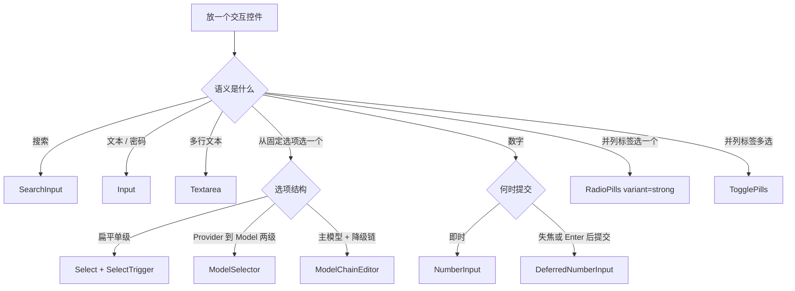
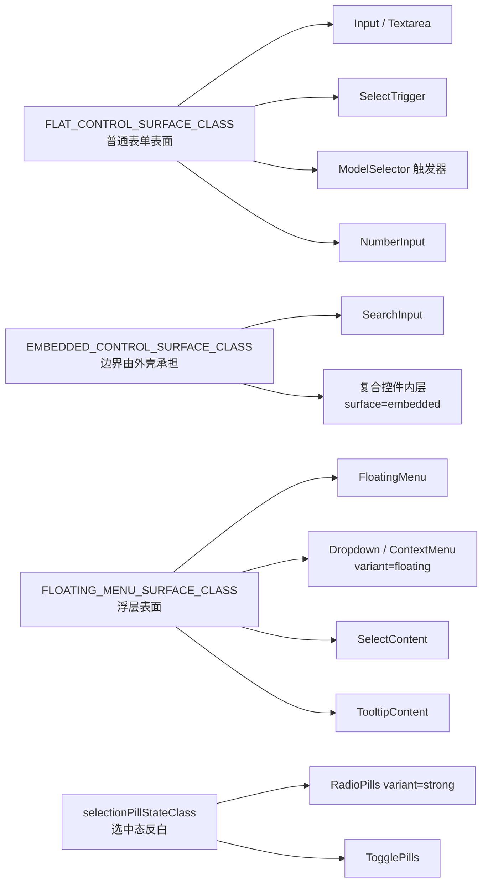
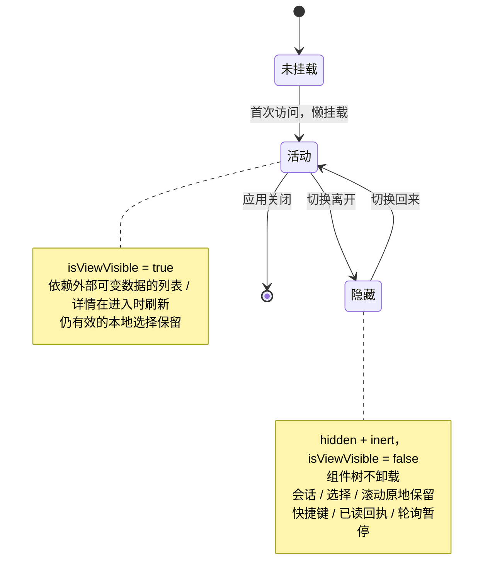
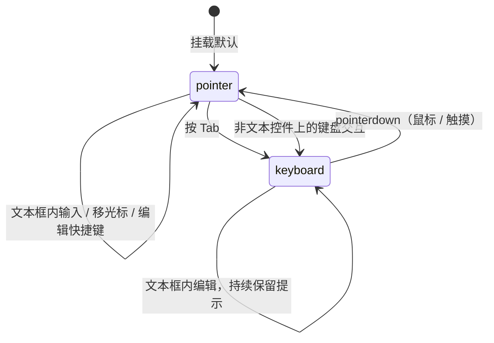

# UI 交互与表面设计系统

本文定义 Hope Agent 桌面前端的交互控件规范：空间级标题栏、表单控件、交互状态、焦点反馈、
菜单、悬浮弹层和 Tooltip。它是评审这些控件时对照的一份说明——遇到局部样式想「自己发明一套
表面」时，先来这里找对应的公共入口。

本文不涉及页面信息架构、排版或业务状态颜色；Dialog、Sheet 和通知有各自的模态协议，不在此列。
前端整体风格与目录规范见 [`src/AGENTS.md`](../../../src/AGENTS.md)。

## 核心思想

桌面应用的交互体验有一对天然张力：**鼠标操作时要克制、扁平、像原生应用**，可键盘、高对比度和
屏幕阅读器用户又需要**完整、可靠、随处一致的反馈**。如果每个业务组件各自用 Tailwind class 拼一套
输入框、各自决定 hover 加不加边框、各自处理焦点轮廓，结果必然是：视觉互相打架，状态语义彼此冒充
（hover 看起来像选中、选中看起来像链接），无障碍反馈时有时无。

这套设计系统用四条约束把这种发散收敛掉：

1. **语义 → 唯一公共入口**：先判断控件的语义（搜索？单选？数字？菜单？），再选对应的公共组件。
   业务侧不复制整套 class，表达不了新语义就扩展公共组件，而不是私自分叉。
2. **表面来自唯一 token**：背景、边框、阴影、圆角、基础动效由集中定义的表面常量提供。改一处，
   所有消费者一起变。
3. **状态正交**：hover、open、selected、checked、invalid、focus 各自用一种视觉手段表达，互不占用。
   尤其是——**普通交互状态只改背景，绝不用边框/阴影/轮廓变化**，那些留给焦点与系统无障碍反馈。
4. **输入方式与系统偏好感知**：鼠标操作不画焦点框，键盘操作画轻量焦点框，用户手动增强或系统开启
   高对比度时自动加重。`prefers-contrast` / `forced-colors` 永远压过产品色。

例外确实存在（工具栏 ghost 按钮、Tab、内嵌终端等），但它们必须在本文「登记的例外」里写清语义
和原因，不能靠局部样式悄悄绕过。

## 总原则

- **语义先行**：先根据搜索、选择、数字编辑、菜单或提示语义选择公共组件，再调整尺寸。
- **表面唯一**：背景、边框、阴影、圆角和基础动效来自公共 token，业务侧不得复制整套 class。
- **状态正交**：hover、open、selected、checked、invalid 和 focus 分别表达，不互相冒充。
- **输入方式感知**：pointer 不强调焦点，keyboard 保留轻量焦点，增强/高对比模式自动加重。
- **系统偏好优先**：`prefers-contrast` 和 `forced-colors` 优先于产品色与应用设置。
- **例外需登记**：确有不同语义的控件必须在本文登记，不能用局部样式静默分叉。

## 组件路由

「我要放一个交互控件」的第一步永远是问语义，而不是问视觉。下面这棵决策树是路由的入口，具体
组件的职责在随后的表里。



### 表单控件（静止态）

| 语义             | 唯一入口                      | 说明                                                                     |
| ---------------- | ----------------------------- | ------------------------------------------------------------------------ |
| 搜索             | `SearchInput`                 | 扁平无边框搜索表面；列表、面板和设置页搜索统一使用                       |
| 普通下拉         | `Select` + `SelectTrigger`    | Radix Select；选项使用 `SelectContent` / `SelectItem`                    |
| 分组模型选择     | `ModelSelector`               | Provider → Model 二级菜单；触发器复用扁平表面                            |
| 模型降级链       | `ModelChainEditor`            | 主模型和 fallback 的唯一编辑入口；内部复用 `ModelSelector`               |
| 即时数字输入     | `NumberInput`                 | 保留原生 number 语义和步进按钮，但统一外观                               |
| 延迟提交数字输入 | `DeferredNumberInput`         | 编辑草稿，失焦或 Enter 后提交，并做 min/max 钳制                         |
| 普通文本/密码    | `Input`                       | 普通编辑字段；不要因为视觉相似误用 `SearchInput`                         |
| 多行文本         | `Textarea`                    | 普通多行编辑字段                                                         |
| 强互斥分类标签   | `RadioPills variant="strong"` | 单选；支持图标、固定网格或自动换行；选中反白                             |
| 多选标签         | `TogglePills`                 | 多选；选中使用深色反白，未选中保留中性实色底，不使用边框、阴影或额外勾选 |

业务组件不得直接使用裸 `<select>`、裸 `<input type="number">`、`Input type="number"`
或重新引入 `NativeSelect`。公共入口表达不了新语义时，应先扩展公共组件。

### 浮层与提示

| 场景               | 统一入口                                 | 说明                                                  |
| ------------------ | ---------------------------------------- | ----------------------------------------------------- |
| 本地锚点菜单       | `FloatingMenu`                           | 工具栏菜单、状态详情、提及菜单、知识选择等            |
| Radix Dropdown     | `DropdownMenuContent variant="floating"` | Portal、碰撞检测和键盘导航                            |
| Radix Context Menu | `ContextMenuContent variant="floating"`  | 右键菜单及其子菜单                                    |
| 表单 Select        | `SelectContent`                          | 继承公共浮层表面与 Radix 动效                         |
| 分组模型选择       | `ModelSelector`                          | 触发器遵守表单标准；Provider/Model 子菜单遵守浮层标准 |
| 图标提示           | `IconTip`                                | 单个图标按钮的唯一提示入口                            |
| 通用 Tooltip       | `TooltipContent`                         | 截断说明或富提示；使用紧凑动效时长                    |
| 模态框/抽屉        | `Dialog` / `AlertDialog` / `Sheet`       | 独立模态协议，不套菜单布局                            |
| 通知               | Sonner 或专用状态条                      | 不伪装成菜单或 Tooltip                                |

## 控件表面

所有表面都从少数几个集中常量派生，业务侧只覆盖尺寸、宽度、密度和定位，绝不覆盖背景、边框、
阴影或圆角。下图是表面 token 与其消费者的对应关系。



### 普通表单控件

[`control-surface.ts`](../../../src/components/ui/control-surface.ts) 的 `FLAT_CONTROL_SURFACE_CLASS`
是唯一来源，它固定这些视觉：

- `rounded-lg` 圆角；
- `border border-border/60` + `bg-background/40` 静态表面；
- `shadow-none`，普通状态禁止恢复 `shadow-sm`；
- hover 仅提升背景到 `bg-muted/40`，边框保持静态；
- 禁用态使用统一 cursor 和 opacity；
- `forced-colors` 模式使用系统 `CanvasText` 边框。

`Input`、`Textarea`、`SelectTrigger`、`ModelSelector` 和 `NumberInput` 必须共享该 token。
业务侧只允许覆盖尺寸、宽度、排版密度、textarea 的 resize 行为和定位，不得覆盖基础背景、边框、
阴影或圆角。普通文本、密码、日期及多行输入的背景、边框、阴影、圆角一律来自该 token。

`Input` / `Textarea` 默认使用 `surface="default"`。**视觉边界由外壳承担的复合控件必须显式用
`surface="embedded"`**（对应 `EMBEDDED_CONTROL_SURFACE_CLASS`）：该变体从组件入口整体移除背景、
边框、圆角、阴影及 hover 表面，避免只覆盖静态 class 后仍泄漏 `hover:bg-*` 等状态。业务侧不得靠
零散 Tailwind class 模拟该变体。

### 搜索框

[`search-input.tsx`](../../../src/components/ui/search-input.tsx) 的 `SearchInput` 基于
`surface="embedded"` 构建一套独立的无边框搜索表面，不继承普通字段的静态或 hover 表面：

- 普通状态 `border-0`、`bg-muted/50`、`shadow-none`；
- hover 使用 `bg-muted/70`；
- placeholder 降低对比度，不与真实内容争抢注意力；
- WebKit 原生的 search cancel 按钮被隐藏，避免与业务清除按钮重复；
- `forced-colors` 恢复 1px `CanvasText` 系统边框，防止背景被强制调色板抹平后失去边界。

搜索图标和清除按钮由业务外壳定位；不得为了放图标重新复制一套输入框表面 class。

### 通用 hover 与选中反馈

这一节是「状态正交」原则最容易被违反的地方，核心只有一句：**普通交互状态只改背景色。**

- 普通容器、卡片、列表行、分段选择和工具按钮的 hover 只加深背景；禁止新增或加深
  `border` / `ring` / `shadow`，也禁止通过 `group-hover` / `peer-hover` 间接改变子元素边框；
- 控件原有的静态结构边框可以保留，但 hover、active、selected、checked 和 open 不得用边框变化
  表达状态；普通持久选中使用 `bg-secondary`，未选中 hover 使用 `bg-secondary/40`；
- 多选标签必须使用 `TogglePills`，以 `aria-pressed` 和 `bg-primary text-primary-foreground`
  深色反白表达选中，未选中使用 `bg-secondary text-secondary-foreground` 与页面底色分层，
  hover 使用 `bg-foreground/15` 保证明暗两种主题都有反馈；保留原图标，不另加勾选；
- 小型 checkbox / radio 的内部勾选标记可以使用 `bg-primary`，但选中时不叠加 primary 边框；
- 键盘焦点、`prefers-contrast` 与 `forced-colors` 的系统轮廓/边框属于可访问性反馈，不受上述视觉
  限制；错误、警告、拖拽落点等语义状态也按各自协议处理；
- 需要黑底反白的强互斥分类标签必须使用 `RadioPills variant="strong"`，不能复制 class，也不能把该
  样式扩散到普通列表、Tab、视图切换或多选筛选。

`RadioPills variant="strong"` 和 `TogglePills` 的选中反白是**同一套** `selectionPillStateClass`
（[`selection-pill-styles.ts`](../../../src/components/ui/selection-pill-styles.ts)）：选中即
`bg-primary text-primary-foreground`，未选中即 `bg-secondary text-secondary-foreground`。所以单选、
多选的选中态在视觉上天然一致，差别只在语义与可访问性属性（`role=radio` vs `aria-pressed`）。

### 列表条目

首页聊天会话列表是普通列表行状态的视觉基准：

- 未选中条目 hover 使用 `bg-secondary/40`；
- 持久选中条目使用 `bg-secondary`，文字保持正常 `text-foreground`；
- 普通选中禁止使用 `bg-primary/*`、`text-primary` 或硬编码蓝色，避免把「当前项」误读为信息提示、
  链接或主要操作；
- 文件树中没有持久选中语义的文件夹只应用 hover；当前打开的文件、空间、任务或运行记录按上述
  selected 标准显示；
- 错误、警告、未读、运行状态、危险操作和拖拽落点具有独立语义，可使用红、黄、绿或 primary 强调
  色，但这些颜色只在对应状态存在时出现，不替代普通 hover/selected。

新增知识空间、定时任务、产物、设置或其他 master-detail 列表时应直接复用这组状态类；若确需不同
视觉，必须在本文「登记的例外」中说明语义和原因。

### 模型与数字输入边界

设置页的全尺寸模型选择需要 Provider → Model 二级菜单，因此使用 `ModelSelector` 的 Radix
DropdownMenu，而不是普通 `Select`；弹出结构不同，但触发器仍遵守同一个表面 token。默认模型、
视觉模型、fallback 和 `ModelChainEditor` 都通过它继承统一外观。

`NumberInput` 继续使用原生 `<input type="number">`，保留 `min`、`max`、`step`、
ArrowUp/ArrowDown、移动端数字键盘提示和屏幕阅读器数值语义；业务侧不得隐藏步进按钮。需要草稿式
编辑（编辑期间不即时提交、失焦或 Enter 才提交并钳制到 min/max）时用 `DeferredNumberInput`。

一个 Radix Select 的隐藏坑：**`SelectItem` 不允许空字符串值**。继承/默认项要用内部哨兵值；完全
没有可用选项时用空的 Root value + `SelectValue` placeholder，并禁用触发器。

## 对话中的待发送消息与运行活动

这两类表面都是已有执行事实的**只读投影**：待发送消息以 `queued_turn_user_messages` 为真相源，运行活动以消息中的 tool call/result 与各运行单元的原生状态为真相源。组件不得为视觉便利另造终态、反写生命周期或把“工具调用成功”当成“目标运行已经结束”。

### 待发送消息条

- 输入框上方使用中性、紧凑的消息条；普通排队不是警告，不使用黄色告警卡。
- 用户可见动作统一叫“插入”，不显示内部的 `force_insert` / `steer`，也不使用“引导”。
- “插入”只在主回合正在运行且该行可绑定安全工具边界时出现。Tooltip 必须说明：等待当前工具批次全部完成后交给模型，不中断正在执行的工具；若没有后续边界则回复结束后发送。主回合已 idle 时不显示无效的“插入”，只让 FIFO 队首显示“立即发送”，保住关闭自动续发与崩溃恢复后的人工出口。
- 行状态与动作矩阵以 [Chat Engine 的持久队列契约](chat-engine.md#用户消息持久队列) 为准。默认只展开前 2 条；Channel owner 行只读；进行中的保存、插入与派发不可重复操作。
- 溢出动作走 `DropdownMenu`，编辑态复用 `Input` / `Button` / `IconTip`；保存使用统一的 saving/saved/failed 三态，失败保留草稿。按钮必须有可访问名称，状态变化用 `aria-live`，不靠颜色单独表达。

### 运行控制活动组

- 继续使用现有消息时间线和原始工具详情，只把同一 assistant message 内容序列中**相邻、同一语义动作**的控制调用折叠成一行摘要；assistant 文本、普通工具和不同动作会切断聚合，不做跨整段会话的伪总计。当前 `ToolCall` 不携带 provider API-round identity，因此 UI 不宣称按内部 round 拆组；若以后需要该边界，必须贯通流事件、持久化与历史恢复，不能用时间间隔推断。
- Subagent 的创建仍由实时 Agent chips 展示；查看、发送调整、关闭和恢复，以及 Job/Team/Workflow/Cron 的原生控制动作进入运行活动组。详情展开后仍能看到每个原始调用和失败原因。
- `model_fallback` 的 live stream 与持久化 `role=event` 共用同一个 `FallbackEvent` 解析契约；历史重载或展开“已处理”消息时继续渲染紧凑 `FallbackBanner`，禁止把原始事件 JSON 当 Markdown 气泡展示。完整错误只在 banner 详情中以可换行、有界高度的诊断文本出现。
- 完成回合的“已处理”摘要与详情必须位于同一个 `AnimatedCollapse` 生命周期中：展开/收起使用共享高度与透明度动效，并由折叠容器在正常文档流中推动其后的最终回复及后续内容整体位移；用户手动切换期间须暂挂消息列表的 follow-bottom 滚动钉住，禁止用滚动补偿抵消该布局动画，动画结束后再重新判定是否位于底部。`visible-when-open` 只允许在高度完成过渡并稳定为 `auto` 后释放 overflow，展开增长和收起阶段必须保持裁剪，避免详情穿出容器与后续消息重叠。收起开始即 `aria-hidden + inert`，退出动画结束后 `unmountOnExit` 销毁 Markdown、工具卡和事件提示子树。禁止为保留动画而把隐藏详情永久留在 DOM。
- “已处理”摘要触发器不设置视觉 hover 态：分隔线由外层静态承载，鼠标经过不改变背景或文字颜色；仍保留可点击光标、公共 `Button` 的键盘焦点协议和箭头展开动画。
- 底部操作条（复制 / 编辑 / 分叉 / 详情）以**一轮回复一条**为准：折叠只是呈现，展开“已处理”详情后其中的中间步骤消息一律不渲染自己的操作条（`MessageBubble` 的 `hideActionBar`），操作条只留在本轮最终回复气泡上；折叠详情里也不保留其占位高度。
- 状态至少区分“执行中”“请求已接受”“已完成”“被拒绝”“失败”。取消类调用返回成功只证明请求被接受；只有原生运行记录确认终态后才能显示“已关闭”。已经终态或没有可关闭目标时使用独立 no-op 文案，不冒充本次关闭成果。
- 能力驱动文案：普通 Subagent、Async Job 和 Process 没有暂停语义；Team/Workflow/Cron 只有在调用其真实 `pause/resume` 动作时才显示暂停或恢复。
- 聚合只改变呈现，不授予工具权限；所有 owner/session 校验仍在执行层完成。

## 浮层表面与动效

浮层（菜单、下拉、右键菜单、Tooltip）也共享唯一表面来源与唯一动效桥：

- 表面唯一来源：`FLOATING_MENU_SURFACE_CLASS`，即
  `rounded-floating`、`border-border-soft`、`bg-surface-floating/95`、`shadow-floating`、
  `backdrop-blur-xl`。
- Radix 动效桥唯一来源：`FLOATING_MENU_RADIX_MOTION_CLASS`（`.ha-radix-menu-motion`）。
- 标准菜单进入 220ms、退出 180ms；方向由锚点或 Radix `data-side` 决定。
- Tooltip 使用同一视觉体系，但采用 120ms / 100ms 的紧凑进入/退出时长。
- `default` 变体只用于明确需要高密度紧凑菜单的场景；产品级交互使用 `floating`。

（菜单与浮层的 220/180 集中在 [`motion.ts`](../../../src/components/ui/motion.ts) 的 `UI_MOTION` /
`UI_EASING` 里，`popoverEnter=220`、`popoverExit=180`，动效编排组件统一读取；Tooltip 的 120/100
则定义在 [`tooltip.tsx`](../../../src/components/ui/tooltip.tsx) 自身的 `--ha-presence-enter-duration` /
`--ha-presence-exit-duration` 变量里。业务侧都不硬编码。）

### 生命周期红线

浮层最常见的错误是「关闭时把它从 DOM 里摘掉」，这样退场动画根本没机会播放：

- 使用 `FloatingMenu` 时不得在父组件写 `open && <FloatingMenu ...>` 或关闭时直接 `return null`。
  组件应保持挂载，只通过 `open` 控制状态。
- 动态坐标浮层使用 `strategy="fixed"` + `portal` + `style={{ top, left }}`；关闭阶段保留最后一次有效
  坐标和内容，避免退场时读取 `null`。
- Portal-backed Radix 菜单不得在业务侧复制表面 class，应选择公共 `floating` 变体。
- 业务侧只覆盖尺寸、最大高度、内边距和定位方向，不覆盖背景、边框、阴影及基础动效。

## Tooltip 与可访问名称

Tooltip 是补充说明，不是可访问名称——这条边界要一直守住：

- `IconTip` 是图标按钮提示的唯一入口；不得同时保留原生 `title`，否则会显示双重提示。
- 截断文本、动态状态和禁用原因使用 `data-ha-title-tip`，由 `TooltipProvider` 的单例委托桥渲染。
- 交互控件必须有自身 `aria-label`；Tooltip 不是可访问名称的替代品。
- 生产 JSX 禁止原生悬停 `title`，仅 iframe 的无障碍标题例外。
- Tooltip 只承载补充说明，完成任务所必需的信息不能只在 hover 后出现。

## 空间级标题栏

知识空间、设计空间、产物库、仪表盘、Plan 和定时任务等一级工作区共用一条紧凑单行标题栏：

- 固定 `h-10`、`shrink-0`，标题、可选副标题和右侧操作不得撑出第二行；
- 侧边栏一级工作区本身是导航终点，首页**不显示返回主对话按钮**，工作区切换统一走主侧栏；只有进入
  项目、任务详情等二级页面后才显示返回上一级，且位于最左侧；
- 存在侧栏展开/收起时，一级页面把侧栏按钮放最左侧；二级页面把它紧跟返回按钮，不能散落到内容
  工具条；
- 标题使用紧凑字号；副标题与标题同行、允许截断，使用弱化前景色，不再占据独立行高；
- 右侧刷新、设置、创建等操作统一使用紧凑按钮，窄宽度下优先压缩或隐藏次要说明；
- 标题栏可保留固定结构分隔线，但 hover、selected、open 等状态不得改变该分隔线。

### 对话分栏工作台标题行

主聊天的 [`Docked Workbench`](../agent/docked-workbench.md) 也遵守单行 `h-10`，但同一行按下方真实分栏拆成 conversation header 与 workbench tabs 两段。两段边界必须与内容 resize separator 对齐；工作台关闭时 conversation 段自然占满，禁止为标签再增加第二条应用级标题栏。面板内部只保留 URL、Git、文件、Plan 等业务工具栏，不能再建立另一条顶层 chrome。

工作台分隔线及其它拖拽尺寸区域统一使用 `ResizeHandleGlow`：命中区可以放宽，但 idle 时不得显示视觉线；hover / keyboard focus / drag 时才显示 1 px 的低对比蓝色光晕，且不改变 border 宽度或布局。键盘可聚焦的 separator 必须提供方向键调整与当前值 ARIA。

分栏工作台使用两级 chrome 归属：重复面板名称、关闭、最大化和容器浮动属于 workbench frame，统一进入顶部标签行；文件路径 / 操作、PR 分支、Diff hunk、Plan 版本、Canvas 类型 / 刷新、Browser URL / 刷新等属于当前内容，保留一层内容工具栏。禁止因为“已有标签”而删除后者，也禁止把 frame controls 复制到每个内容工具栏。

### 主侧栏工作区生命周期

一级工作区不是「切走就卸载、切回再重建」，而是**首次访问才挂载、之后隐藏而不卸载**。这样切换
工作区是零成本的，会话、选择、项目、笔记、产物、滚动和布局状态都原地保留。



[`App.tsx`](../../../src/App.tsx) 的 `PERSISTENT_APP_VIEWS` 是主侧栏常驻工作区的清单：`chat`、
`calendar`、`dashboard`、`plans`、`knowledge`、`design`、`artifacts`。工作区首次访问时才懒挂载，
之后用 `PersistentViewSurface` 隐藏并设 `inert`，**不得因切换侧边栏卸载组件树**。与之相对的
`SETTINGS_APP_VIEWS`——`settings`、`skills`、`profile`、`agents`、`modelConfig`、`memory`、
`channels`——是配置流程页，不常驻。新增一级工作区时必须明确归入这两类之一，不得依赖渲染分支的
偶然挂载行为。

「常驻」不等于后台继续做全部可见面工作：视图组件必须接收 `isViewVisible`，快捷键、已读回执、
轮询、焦点和高成本渲染据此门控；依赖外部可变数据的列表 / 详情在 `false → true` 时刷新，同时保留
仍有效的本地选择。

**Portal 浮层的隐藏陷阱**：常驻工作区内的 Dialog / AlertDialog / Select / Menu / Popover / Tooltip
等 Portal 浮层默认会挂到 `document.body`，从而越过 `hidden` / `inert` 覆盖到另一个工作区。因此它们
必须跟随 [`portal-scope.tsx`](../../../src/components/ui/portal-scope.tsx)：挂到所属
`PersistentViewSurface`，并在 surface 不可见时卸载浮层内容，释放 modal focus / pointer lock。公共
UI Portal 已统一接线；业务组件若直接用 `createPortal`，也必须读取同一 scope，不得写死
`document.body`。

### 独立空间窗口

桌面版知识空间与设计空间还支持单实例独立窗口。[`spaceWindow.ts`](../../../src/lib/spaceWindow.ts)
统一维护每个空间固定的 window label、打开 / 聚焦 / 导航 / 收回事件和当前位置载荷，
[`SpaceDetachedWindow.tsx`](../../../src/SpaceDetachedWindow.tsx) 是独立 renderer 根；侧边栏右键、双击
与空间标题栏共用同一入口。几条平台与生命周期约束：

- macOS 动态窗口必须显式使用 overlay + hidden title，标题栏保持单行 `h-10`，用左内边距避开交通灯，
  **不得再加垂直 padding**；Windows / Linux 保持原生标题栏且不加 macOS 专用左边距。
- 动态 window label 必须登记进 Tauri capability，否则 renderer 内的 drag / close 等窗口 API 会被
  权限层拒绝。
- 独立窗口存在时，普通侧边栏点击只聚焦它；收回时把当前位置发回主窗口再关闭。
- 知识空间的弹出、收回和原生关闭必须先经过 `KnowledgeView.guardNavigation`，保存 / 丢弃 / 取消
  未决前不得销毁承载编辑器的窗口。

独立窗口与浮动面板的图标语义统一走 [`WindowModeIcon`](../../../src/components/common/WindowModeIcon.tsx)：
`detach` 用方框右上对角弹出箭头（`SquareArrowOutUpRight`），`reattach` 用方框左下对角收回箭头
（`SquareArrowDownLeft`）。侧边栏菜单、空间标题栏、对话内 Canvas / 文件 / Plan 面板及可浮动控制
面板均不得自行选择 `ExternalLink`、`PictureInPicture2` 或 `Panel*Close` 代替；普通网页外链仍使用
`ExternalLink`，不与窗口层级操作混用。

## 布局面板最大化动效

Canvas、文件浏览器、单文件预览、Plan、产物阅读器等从局部布局切换到应用内最大化时，统一使用
[`useFullscreenTransition`](../../../src/hooks/useFullscreenTransition.ts)。它的关键是不硬编码起止坐标，
而是**用切换前后真实的 `getBoundingClientRect()` 做 FLIP**：

- 尺寸变化时缩放原点固定为左上角，使矩形差值与 CSS transform 坐标系一致；
- 恢复方向会先 `flushSync` 到还原布局测得真实矩形，再瞬回全屏，然后反向播放——因此展开和恢复都
  平滑，窗口缩放后仍回到正确位置；
- 动画期间保持正文、iframe 和滚动节点挂载，禁止为了动效复制或替换内容树；
- 统一使用 `UI_MOTION.panelSurface`（300ms）与 `UI_EASING.emphasized`；
- 遵守 `prefers-reduced-motion: reduce`，此时直接切换布局，不播放动画；
- 共用 `RightPanelShell` 的面板通过 `fullscreenTransitionRef` 接入，业务组件不得再复制一套
  `Element.animate` / `flushSync` 编排。

当这些内容集成到 Docked Workbench 时是明确例外：内容组件不得再拥有私有最大化按钮，统一由 workbench frame 最大化整个标签容器；独立窗口或其它 standalone 宿主仍沿用上述 `useFullscreenTransition` 契约。

## 焦点可见性

焦点提示的目标是：鼠标用户看不到焦点框（光标已经足够表达焦点），键盘用户随处看到轻量焦点框，
需要时能整体加重。它由两条正交的轴决定，再叠加系统偏好。

### 状态模型

**第一条轴 `data-input-modality`（运行时探测）**——最近一次交互是鼠标还是键盘。它是一个状态机，
安装在 [`focus-visibility.ts`](../../../src/lib/focus-visibility.ts) 里，`installFocusVisibilityTracker`
用捕获阶段的 `pointerdown` / `keydown` 监听切换：



这里有个刻意设计的细节：**鼠标聚焦文本框后，在框内输入文字、移动光标或使用编辑快捷键（包括打开
搜索）不会切到 keyboard**——光标已经表达了焦点，此时突然画出焦点框反而是干扰。判定逻辑是
`shouldEnterKeyboardModality`：普通 `Tab` 算键盘导航；纯修饰键不切换；命中可编辑目标（文本类 input /
textarea / contenteditable / `role=textbox`）的其它按键不切换；其余按键切到 keyboard。候选菜单把 `Tab`
用作原地确认且不移动焦点时是唯一例外：菜单消费按键后显式恢复捕获阶段记录的输入方式，因此鼠标聚焦
后确认 File / Note / Skill 等候选不会凭空出现焦点框，而原本已用键盘导航的用户仍保持 keyboard。键盘
用户通过普通 Tab 进入文本框时本就已是 keyboard，所以编辑期间会持续保留焦点提示。

**第二条轴 `data-focus-indicators`（用户偏好）**——`auto` 或 `enhanced`。默认 `auto`，用户手动打开
增强后变 `enhanced`，此时所有输入方式都画增强轮廓。

**系统偏好优先**：`prefers-contrast: more` / `forced-colors: active` 无条件压过上面两轴，自动增强，
且 `forced-colors` 下用系统 `Highlight`，不用产品色覆盖用户的强制调色板。

最终画不画轮廓、画多重，就是这三者的组合：

| 输入方式 | 偏好 `auto` | 偏好 `enhanced` | 系统高对比 / forced-colors |
| -------- | ----------- | --------------- | -------------------------- |
| pointer  | 不画        | 增强轮廓        | 系统轮廓                   |
| keyboard | 轻量轮廓    | 增强轮廓        | 系统轮廓                   |

运行时只在 [`main.tsx`](../../../src/main.tsx) 安装一次，因此主窗口、Quick Chat 和分离窗口行为一致。
首屏偏好读取有 2 秒上限；后端无响应时回退 `auto`，不阻塞窗口挂载。

### 控件契约

- 原生交互元素和常用 ARIA role 的焦点样式由 [`index.css`](../../../src/index.css) 统一覆盖。组件不得
  自行添加 `focus:ring-*`、深色 `focus:border-*` 或另一套 outline。
- 全局焦点规则刻意保持为非分层 CSS，稳定压过 Tailwind 的 `focus:outline-none` 工具类。
- hover、active、selected、checked 和菜单当前项继续使用背景或颜色，不用焦点框表达。
- CodeMirror 等复合编辑器在外壳标记 `data-focus-scope`，内部实际焦点节点标记
  `data-focus-ring="none"`，保证只画一层轮廓。
- 菜单项和 option 在普通键盘模式使用背景高亮；非 ARIA 菜单项使用 `ha-focus-item`；增强/高对比
  模式增加 1px 内描边。
- 原生 `disabled` 和 `aria-disabled="true"` 控件不绘制焦点提示。

### 持久化与跨运行模式

`AppConfig.enhanced_focus_indicators` 是手动增强开关，默认关闭。桌面通过 Tauri 命令
`get_enhanced_focus_indicators` / `set_enhanced_focus_indicators` 读写，Web GUI 通过
`/api/config/enhanced-focus-indicators` 的 GET / POST 读写；两者都通过
`config:changed { category: "focus_indicator" }` 热更新现有窗口。对话式设置通过 `ha-settings` 的
`focus_indicator.enhancedFocusIndicators` 读取和修改，风险级别为 low。

## 登记的例外

以下控件确有不同语义，允许偏离通用规则，但边界写在这里，不能扩散：

**聊天 Typed Mention**——第一方 picker 产生的 File、Note、Skill、Agent、Plan、Plugin 和 Connector
mention 在输入框、乐观消息与历史消息中复用同一行内视觉：只显示对应语义色的图标与文字，图标继承
文字颜色；禁止背景、边框、圆角胶囊或阴影，并以正文 baseline 对齐。该视觉只由已验证 typed provenance
触发，手输或粘贴的同形正文保持普通文本，不能靠 token 外形自行获得 mention 样式或能力。Agent 的
图标位遵循配置头像 → emoji → 固定 Bot 图标的降级顺序；头像与 emoji 同样不额外包背景或边框。

**聊天输入框焦点边界**——输入区与 Send / Stop 工具栏上下紧邻，外扩 halo 会压到按钮。因此
`data-chat-composer` 保留全局 input-modality 判定，但把普通 / enhanced 焦点视觉统一画成输入区内部的
1px inset 线，不再叠加外扩 halo；系统高对比与 forced-colors 仍由系统规则优先。

**工具栏 ghost action**——聊天输入区的 `chat/input/ModelPicker`、权限入口，以及设计空间首页生成器
prompt dock 内的 `ModelSelector` 是工具栏 ghost 按钮，不是表单字段：它们保持无边框、紧凑按钮样式；
展开后的菜单仍遵守浮层协议。不得把工具栏按钮强行包成全宽表单选择器，也不得用该例外让设置页
字段绕过公共表面。

**Tab**——Tab 有独立的层级协议，不套普通列表选中背景。公共 `TabsList` 是 `bg-muted` 容器，
`TabsTrigger` 选中恢复 `bg-background`，靠轨道与选中面的明度差形成层级，不加阴影；公共选中面用
180ms FLIP 位移动效，并在 `prefers-reduced-motion` 下直接切换。不得改成与容器接近的半透明背景。
无外壳的线型 Tab（当前仅 Agent 编辑页）可用底部 primary 强调线。两类 Tab 都不得在 hover 时改变
边框；线型 Tab 的底线只在持久选中时出现。

**强互斥分类标签**——`RadioPills variant="strong"` 是它的唯一入口：选中项使用
`bg-primary text-primary-foreground`（深色主题下用对应反白 token），图标继承前景色；未选中使用
`bg-secondary text-secondary-foreground`，hover 使用 `bg-foreground/15`；选中前后均不得增加或改变
边框。它适用于设计空间产物类型、定时频率、导出格式/倍率、审批策略、Memory 学习模式和模型能力
分类等「从并列标签中确定一个值」的场景。页面导航、视图切换、权限等级继续使用普通 `bg-secondary`；
多选筛选继续使用普通选中背景或勾选标记，不能借强标签制造多个并列黑块。设计空间首页 recipe 模板卡
仍按普通卡片选中规则使用 `bg-secondary` 并用 `aria-pressed` 暴露状态，它**不是**强互斥分类标签。

**embedded 复合控件**——行内改名、标签输入、复合搜索和整页源码 / 指令编辑器的视觉边界由外壳承担，
内部 `Input` / `Textarea` 必须使用 `surface="embedded"`；典型入口包括 `SessionSearchBar`、
`AllowlistTagInput`、项目指令 / 自动记忆编辑器及各列表行内改名。不得在普通表单字段上复用该变体；
复合控件仍须保留清晰外壳和统一焦点协议。

**列宽拖拽手柄**——[`ResizeHandleGlow`](../../../src/components/ui/resize-handle-glow.tsx) 是唯一入口，
也是「hover 只加深背景、不动 border / ring / shadow」的唯一例外：它本身就是拖拽反馈，idle 完全透明，
hover / 键盘 focus / 拖拽中才显示 1px 强调色光晕（`--ha-markdown-link` + `--ha-resize-glow`，**禁止再写
死十六进制**）。它叠在 1px `border-border-soft` 结构线之上，**不得用「有手柄」当作省掉结构线的理由**；
该例外不扩散到任何非拖拽控件。

**内嵌终端**——由 xterm.js 管理 canvas、viewport 和输入层的第三方复合控件：允许导入上游
`xterm.css`，并在 `chat/terminal/terminal.css` 内用 `.hope-terminal` 作用域补齐内部层尺寸、主题
token 和滚动条适配。面板拖拽高度依赖运行时测量，可设置动态像素 `height`；拖拽期间也可临时设置
`document.body` 的 `cursor` / `user-select`，结束时必须清理。该例外不允许扩展到终端外的业务表面，
也不允许在作用域样式中硬编码亮色或暗色。

## 代码审查清单

- 搜索是否使用 `SearchInput`？
- 普通下拉是否使用 Radix `Select`，而不是裸 `<select>`？
- 模型选择是否复用 `ModelSelector` / `ModelChainEditor`？
- 数字字段是否使用 `NumberInput` 或 `DeferredNumberInput`？
- 普通 `Input` / `Textarea` 是否继承公共表面，而不是局部覆盖背景、边框、阴影或圆角？
- embedded 控件是否显式使用 `surface="embedded"`，并由外壳提供边界与焦点反馈？
- 是否出现局部 `shadow-sm`、深色边框或重复的表面 class？
- 浮层是否复用公共表面和动效，关闭时是否仍保持挂载？
- 图标提示是否只使用 `IconTip`，控件是否同时拥有 `aria-label`？
- 是否保留 disabled、placeholder、空选项、键盘导航和 `forced-colors` 行为？
- 复合控件是否只显示一层焦点反馈？
- 是否误把工具栏 ghost action 当成表单字段，或反过来？
- 强互斥分类标签是否复用 `RadioPills variant="strong"`，并避免用于 Tab、视图切换或多选？
- 容器型 Tab 是否使用 `bg-background` 区分选中面，并保持无阴影？
- 一级工作区标题栏是否保持 `h-10` 单行、未出现返回主对话按钮，并把侧栏开关放最左侧？二级页面的
  返回按钮是否只返回真实上一级？
- 常驻工作区内的 Portal 浮层是否跟随 `portal-scope`，而不是写死 `document.body`？
- hover / selected / open 是否只改变背景，没有引入 `hover:border-*`、`hover:ring-*`、
  `group-hover:border-*` 或状态阴影？
- 普通列表行是否使用 `hover:bg-secondary/40` 和 `bg-secondary`，并把语义强调色限制在错误、警告、
  未读或拖拽等真实状态？
- 应用内最大化是否复用 `useFullscreenTransition`，并同时覆盖展开与恢复？

建议审查时执行以下检查，前两条在业务组件中应无结果（原生 DOM 只能封装在公共 UI 组件内部），
`title=` 的结果应逐项确认是否为允许的 iframe 标题，而不是悬停提示：

```bash
rg -n 'NativeSelect|<select\b' src/components -g '*.tsx' -g '!**/*.test.tsx'
rg -n -U '<Input[^>]*type="number"|<input[^>]*type="number"' src/components -g '*.tsx' -g '!**/ui/number-input.tsx'
rg -n 'FLAT_CONTROL_SURFACE_CLASS' src/components/ui
rg -n 'title=' src/components -g '*.tsx'
pnpm exec vitest run src/components/ui/interaction-border-audit.test.ts
```

## 代码位置

**表面与控件**

- [`control-surface.ts`](../../../src/components/ui/control-surface.ts) —— `FLAT_CONTROL_SURFACE_CLASS` / `EMBEDDED_CONTROL_SURFACE_CLASS`
- [`search-input.tsx`](../../../src/components/ui/search-input.tsx)
- [`input.tsx`](../../../src/components/ui/input.tsx) · [`textarea.tsx`](../../../src/components/ui/textarea.tsx)
- [`radio-pills.tsx`](../../../src/components/ui/radio-pills.tsx) · [`toggle-pills.tsx`](../../../src/components/ui/toggle-pills.tsx) · [`selection-pill-styles.ts`](../../../src/components/ui/selection-pill-styles.ts)
- [`number-input.tsx`](../../../src/components/ui/number-input.tsx) · [`deferred-number-input.tsx`](../../../src/components/ui/deferred-number-input.tsx)
- [`select.tsx`](../../../src/components/ui/select.tsx) · [`model-selector.tsx`](../../../src/components/ui/model-selector.tsx) · [`model-chain-editor.tsx`](../../../src/components/ui/model-chain-editor.tsx)

**浮层与动效**

- [`floating-menu.tsx`](../../../src/components/ui/floating-menu.tsx) —— `FLOATING_MENU_SURFACE_CLASS` / `FLOATING_MENU_RADIX_MOTION_CLASS`
- [`animated-presence.tsx`](../../../src/components/ui/animated-presence.tsx) · [`motion.ts`](../../../src/components/ui/motion.ts)
- [`dropdown-menu.tsx`](../../../src/components/ui/dropdown-menu.tsx) · [`context-menu.tsx`](../../../src/components/ui/context-menu.tsx) · [`tooltip.tsx`](../../../src/components/ui/tooltip.tsx)
- [`portal-scope.tsx`](../../../src/components/ui/portal-scope.tsx)
- [`useFullscreenTransition.ts`](../../../src/hooks/useFullscreenTransition.ts) · [`RightPanelShell.tsx`](../../../src/components/chat/right-panel/RightPanelShell.tsx)

**焦点与工作区生命周期**

- [`focus-visibility.ts`](../../../src/lib/focus-visibility.ts) —— 输入方式状态机（`installFocusVisibilityTracker`）
- [`focus-indicator-preference.ts`](../../../src/lib/focus-indicator-preference.ts) · [`index.css`](../../../src/index.css)
- [`App.tsx`](../../../src/App.tsx) —— `PERSISTENT_APP_VIEWS` / `SETTINGS_APP_VIEWS`
- [`spaceWindow.ts`](../../../src/lib/spaceWindow.ts) · [`SpaceDetachedWindow.tsx`](../../../src/SpaceDetachedWindow.tsx) · [`WindowModeIcon.tsx`](../../../src/components/common/WindowModeIcon.tsx)

**审计测试**

- [`interaction-border-audit.test.ts`](../../../src/components/ui/interaction-border-audit.test.ts) · [`native-title-audit.test.ts`](../../../src/components/ui/native-title-audit.test.ts)
