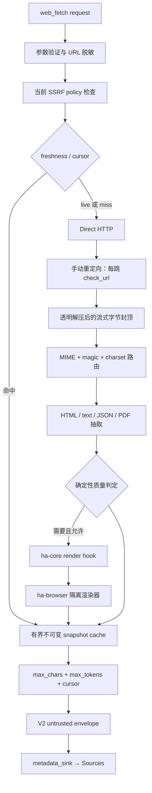

# Web Fetch v2

> 返回 [文档索引](../../README.md) | 关联：[工具系统](tool-system.md) · [浏览器自动化](browser.md) · [安全子系统](../infra/security.md) · [配置系统](../infra/config-system.md)

## 定位

`web_fetch` 是面向模型的单 URL、只读、幂等网页读取工具。V2 把“联网获取”“内容抽取”“模型输出投影”拆成三个边界，并用不可变 snapshot 连接它们：一次获取可以按字符或 token 预算多次续读，但续读不会再次访问可能已经变化的网页。

它不是浏览器自动化或站点爬虫：

- 只允许 HTTP / HTTPS GET，不接受 body、任意 header、Cookie 或 Authorization；
- 默认走 Direct HTTP，只有 `render=auto|always` 才可能启动隔离 Chromium；
- Render 不使用用户浏览器、扩展、登录态或持久 profile；
- 不绕过验证码、付费墙、登录或站点访问控制；
- 不展开 sitemap，不递归抓取链接，不创建另一套后台任务生命周期。

## 架构与依赖方向



依赖方向保持 `ha-core ← ha-browser`：

- `ha-core/src/tools/web_fetch.rs` 持有请求、snapshot、缓存、抽取、质量与 envelope 编排；
- `ha-base/security/http_redirect.rs` 提供共享的逐跳安全 GET；
- `ha-base/security/http_stream.rs` 提供解压后流式封顶读取；
- `ha-core/browser_hooks.rs` 只定义 Render wire 契约；
- `ha-browser::wire()` 注册具体隔离渲染器，核心层不反向依赖浏览器特征 crate。

同步 HTML / Readability / Markdown 与 PDF 抽取均经 `run_blocking` 离开 async worker。取消会中断并发槽、限速、退避、网络发送、响应流、阻塞结果等待和 Render 等待；Render 的事件任务用 abort-on-drop 守卫回收。

## 请求契约

| 字段 | 默认 | 约束与语义 |
|---|---|---|
| `url` | 必填 | 仅 HTTP / HTTPS，最多 8 KiB；拒绝 userinfo；fragment 在获取前移除 |
| `extract_mode` | `markdown` | `markdown \| text \| raw_html`；`raw_html` 只支持 HTML，仍处于不可信 envelope |
| `max_chars` | 配置值 | 当前投影的字符上限，不影响 snapshot 身份 |
| `max_tokens` | 无 | 保守 token 估算上限；与 `max_chars` 取更严格结果 |
| `cursor` | 无 | 上次响应的 `page.nextCursor`；续读时其他获取 / 抽取参数必须不变 |
| `selector` | 无 | CSS 根选择器，最长 1,024 字符 |
| `exclude_selectors` | `[]` | 最多 16 个 CSS 选择器；抽取前移除 |
| `render` | 配置值（初始 `never`） | `never \| auto \| always` |
| `freshness` | `prefer_cache` | `prefer_cache \| live \| cache_only` |

V1 的 `{url}`、`max_chars` 和 `extract_mode=markdown|text` 调用保持有效。`args.url` 仍是顶层单字符串，以保持 permission matcher、Hook 与审批摘要的既有形状。

不接受任意请求 header、Cookie、认证信息、方法、body、页面 action 或 JavaScript。需要登录态的操作属于 `browser` 工具，不属于 `web_fetch`。

## Direct 获取协议

1. 解析 URL，拒绝 userinfo / 非 HTTP(S)，移除 fragment。
2. 在读取缓存前，按调用当下的 `ssrf.webFetchPolicy` 与 `trustedHosts` 调用 `check_url`。
3. 使用按 proxy、User-Agent、timeout 指纹复用的 reqwest client；client 自身禁用自动 redirect。
4. `checked_get` 对初始 URL和每个 301 / 302 / 303 / 307 / 308 的 `Location` 异步调用 `check_url`，验证通过后才发送下一跳请求。
5. 每次实际发包前按该跳的目标 origin 获取独立 semaphore 并预约最小启动间隔；redirect 不继承初始 host 的额度，最终响应在 body 流读取完前持续占有目标 host 槽。同一 cache key 使用 singleflight 合并并发 miss。
6. 网络错误或 408 / 425 / 429 / 500 / 502 / 503 / 504 最多总计尝试两次；`Retry-After` 支持秒数和 HTTP-date，等待最多 5 秒。
7. reqwest 透明支持 gzip、brotli、deflate、zstd；`http_stream` 对解压后的字节流执行硬上限，不信任 `Content-Length`。

`Cache-Control: no-store`、`private` 或 `Set-Cookie` 会让响应不可复用；挑战页同样不进入 snapshot cache，也不签发 continuation。

## 内容路由与抽取

路由同时观察响应 `Content-Type` 与内容 magic。明确 magic 优先于错误 header：

| 类型 | 行为 |
|---|---|
| HTML / XHTML | CSS scope + 默认移除 `script/style/noscript/nav/svg/template` + 自定义 excludes；Readability 优先，失败回退基础正文；Markdown 用 `htmd` |
| JSON / `+json` | 可解析时 pretty-print；被字节截断时保留不完整文本并给 warning |
| Markdown / XML / CSV / RTF / 普通文本 | 按字符集解码后返回确定性文本 |
| PDF | 复用 PDF 字节级文本服务；被下载上限截断时直接报错；低文本量提示可能是扫描件 |
| 图片 | `image_content` typed error，不做 lossy UTF-8；提示改用图片能力 |
| ZIP / gzip 文件 / TAR / RAR / 7z | `archive_content` typed error |
| 其他二进制 | `unsupported_content_type` typed error |

字符集顺序是 BOM → HTTP `charset` → HTML meta → UTF-8。无法完全解码时返回可用文本并附 warning。HTML 链接以最终 URL 为 base 解析，只保留 HTTP(S)，最多 200 条，URL 与正文来源使用相同的敏感 query 脱敏规则。

## Render 升级

`render=never` 永不启动浏览器。`render=always` 必须成功调用隔离渲染器，否则返回 `render_unavailable`。`render=auto` 只在确定性信号命中时升级，例如：

- selector 在 Direct DOM 中不存在；
- HTML 体积明显大于可见正文，并包含 `#root`、`#app`、`__NEXT_DATA__`、script 或“enable javascript”等 SPA 信号。

验证码、Cloudflare challenge、“verify you are human”或 access denied 被识别为 challenge；Auto 不尝试绕过，而是返回 Direct 结果、低质量分和 warning。

隔离渲染器的边界：

- 每次调用启动新的 incognito/headless Chromium，不读取 Managed / Extension / 用户 profile；
- 全局仅一个 Render 槽，受独立 timeout、累计解码网络字节上限与 DOM byte cap 约束；累计预算覆盖主文档和全部获准子资源，超限立即停止 pending load；
- request interception 对每个 HTTP(S) 子请求重新执行当前 SSRF policy；所有 Chromium 网络连接还被强制经过进程内 loopback 安全代理，代理在实际连接边界单次解析目标、检查全部 DNS answer，并只连接该次获批的精确 IP，消除检查与 Chrome 二次解析之间的 DNS rebinding 窗口；
- loopback 安全代理按全局 `proxy=system|none|custom` 选择上游：Direct / SOCKS 连接使用获批 IP，HTTP(S) 上游代理收到的 destination 同样改写为获批 IP，同时保留原始 Host / TLS SNI；Chrome 禁止绕过 loopback 代理或自行 DNS fallback；
- 所有网络请求只允许 GET、HEAD、OPTIONS；页面脚本发出的 POST、PUT、PATCH、DELETE 等写方法在发包前中止；
- 只放行 Document、Stylesheet、Script、XHR、Fetch、Preflight；图片、媒体、字体、WebSocket 和其他非文本资源直接中止；
- response stage 对声明超过上限的资源直接中止，只由 main frame Document 更新最终 HTTP status；顶层响应的 `private` / `no-store` / `Set-Cookie` 会让 Render snapshot 不可复用；DOM 序列化前后再各做一次 UTF-8 byte cap；
- Chromium download behavior 固定为 deny，初始化脚本禁用 `window.open`，后台 fetch / sync、通知、push 与 Service Worker 特性关闭；
- 最终页面 URL再次执行 SSRF 检查；完成、失败、超时或取消后关闭浏览器并中止事件任务。

## Snapshot、缓存与 continuation

snapshot 保存完整但有下载上限的抽取结果；`max_chars` 与 `max_tokens` 只在响应投影阶段执行。因此小预算调用不会污染后续大预算调用。

请求签名包含：

- 保留 path / query 大小写的规范 URL（fragment 已移除）；
- extract mode、render mode、selector、exclude selectors；
- User-Agent、响应体上限、redirect cap、extractor 版本；
- 当前 SSRF policy 与 trusted hosts。

真实 URL 只参与内存中的哈希，不进入日志或 metadata。缓存命中之前仍先执行当前 URL policy；策略收紧不会被旧缓存绕过。

`freshness` 语义：

- `prefer_cache`：TTL 内优先复用，miss 后联网并回填；
- `live`：跳过读缓存，成功后刷新可复用 snapshot；
- `cache_only`：只读新鲜 snapshot，miss 返回 `cache_miss`，不联网。

cursor 形如 `wf2:<random snapshot UUID>:<char offset>:<signature prefix>`，最长存活 15 分钟。它只指向同一进程内的不可变 snapshot：参数 / URL 不匹配返回 `cursor_mismatch`，过期或进程重启返回 `cursor_expired`。分页按 Unicode 字符边界切割；逐段拼接与原 snapshot 完全一致。

`live` 刷新只更新签名指向的“最新 snapshot”，不会删除既有 snapshot ID；旧 cursor 在 continuation TTL 内仍可读取原不可变版本。旧版本只会因 continuation 过期或有界缓存容量淘汰而失效。

## 响应契约

所有成功和预期失败都序列化为：

```text
<untrusted_external_data source="web_fetch">
{ ...JSON... }
</untrusted_external_data>
```

JSON 中的 `<` 与 `&` 被转义，外部页面无法闭合 envelope 或伪装高权消息。成功响应 `version=2, ok=true`，主要字段为：

- `request`：脱敏 URL 与调用选项；
- `source`：最终 URL、HTTP 状态、MIME、charset、标题、获取时间、redirect、接收字节、内容 hash；
- `extraction`：extractor、Direct / Render、selector；
- `content` 与有界 `links`；
- `page`：offset、返回 / 总字符数、保守 token 估算、截断状态、`nextCursor`；
- `cache`：hit、snapshot ID、age、是否可复用；
- `transport.attempts`、`quality`、`timing`、`warnings`；
- V1 顶层兼容字段：`url/finalUrl/status/contentType/title/extractMode/extractor/cached/truncated/totalChars/tookMs`。

预期失败为 `version=2, ok=false, error={code,message,retryable,status,details}`。稳定错误族包括 URL / selector 参数错误、`blocked_url`、`cache_miss`、cursor 错误、HTTP status、网络 / body 读取、Render、PDF、图片 / archive / unsupported content 与取消。

正文不复制到副输出。`ToolExecContext.metadata_sink` 只发布脱敏的 `web_fetch_source`：URL、title、status、retrievedAt、snapshotId、fetchMode、cache hit / age、sourceHash、truncated、continuation 可用性和 warnings；工作台 Sources 由持久化的 `messages.tool_metadata` 聚合。

## 日志与凭据边界

- URL 拒绝 userinfo；返回 URL、redirect 和链接按敏感 query key 脱敏，但不 lower-case path / query。
- 通用工具日志不记录参数或输出正文，只记录大小与单向审计指纹；因此 URL、query 和页面正文不会进入该日志路径。
- 完成日志只包含 host、status、Direct / Render、cache hit 和字符数。
- HTTP 错误正文最多读取 4 KiB、只在不可信工具结果中返回 256 字符预览，绝不写日志。
- 不接受 Authorization、Cookie 或模型提供的任意 header，因此跨 origin redirect 没有凭据转发面。

## 配置

持久配置位于 `AppConfig.webFetch`。新写入在 Tauri、HTTP 与 `ha-settings` 三个边界都调用同一验证函数；旧配置在读取时防御性 clamp。`ssrfProtection` 是兼容字段，新写入只能为 `true`；实际策略只从 `security.ssrf` 高风险设置面调整。

| 字段 | 默认 | 写入范围 |
|---|---:|---:|
| `maxChars` | 50,000 | 1..=`maxCharsCap` |
| `maxCharsCap` | 200,000 | 1,000..=1,000,000 |
| `maxResponseBytes` | 2 MiB | 64 KiB..=20 MiB |
| `maxRedirects` | 5 | 0..=20 |
| `timeoutSeconds` | 30 | 1..=120 |
| `cacheTtlMinutes` | 15 | 0..=1,440；0 关闭普通缓存 |
| `userAgent` | 内置浏览器 UA | 最长 512 字符 |
| `defaultRenderMode` | `never` | `never \| auto \| always` |
| `maxOutputTokensCap` | 32,768 | 256..=131,072 |
| `renderTimeoutSeconds` | 30 | 1..=120 |
| `cacheMaxEntries` | 100 | 1..=1,000 |
| `maxConcurrentPerHost` | 2 | 1..=16 |
| `minHostDelayMs` | 0 | 0..=60,000 |

## 测试与演进边界

单元 / 契约测试覆盖 URL 脱敏、逐跳 SSRF、内容 magic、charset/BOM、Unicode 分页、token 投影、selector/exclude、untrusted 闭合攻击、配置验证、质量判定和 Render 资源 allowlist。

下列能力不应继续堆入 `web_fetch`：站点递归抓取应成为复用 `JobManager` 的独立 `web_crawl`；登录抓取继续由 `browser` 承担；外部抓取 SaaS、域绑定 credential profile 和 LLM 结构化抽取均需独立安全 / 成本设计。
