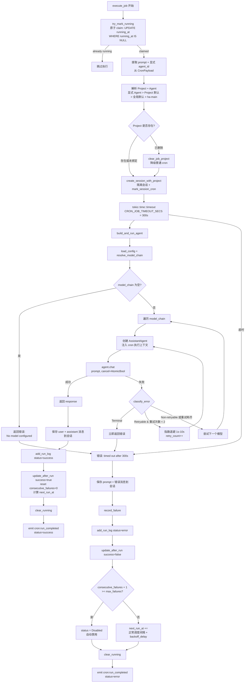
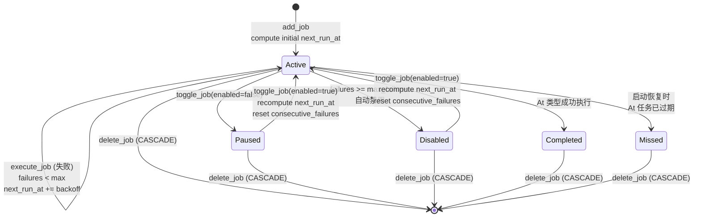

# Cron 定时任务架构
> 返回 [文档索引](../README.md) | 更新时间：2026-06-06

## 概述

Cron 系统提供定时调度能力，支持一次性（At）、固定间隔（Every）和 cron 表达式（Cron）三种调度模式。任务触发后在隔离会话中执行 Agent 对话，具备完整的 failover 模型链重试、任务级指数退避、连续失败自动禁用、启动恢复和日历视图。

任务可选绑定 Project（`project_id` / API `projectId`）。绑定后，每次执行创建的隔离会话会写入 `sessions.project_id`，因此 Project 指令、Project 记忆、Project 工作目录和工具 cwd 解析都与正常 Project 对话一致。未显式指定 `agent_id` 时，Agent 解析顺序为：任务 payload 显式 Agent > `project.default_agent_id` > 全局默认 > `ha-main`。如果任务关联的 Project 已被删除，执行器会清空该 job 的 `project_id` 并按普通 cron 继续执行，本次不计失败。

`Every` 调度在 2026-04-22 起补齐了持久化 `start_at`（首个计划触发时间）语义。这样日历展开不再从查询窗口起点“硬铺”，旧数据库里的 `Every` 任务也会在 `CronDB::open` 时自动按 `created_at + interval_ms` 回填 `start_at`，修复“4 月 22 日刚创建的喝水提醒在 4 月 1 日开始出现”的错位问题。

调度器运行在独立 OS 线程 + 独立 tokio runtime（2 worker threads）中，每 15 秒 tick 一次查询到期任务。任务 claim 使用原子 SQL UPDATE（`WHERE status='active' AND running_at IS NULL AND next_run_at <= now`）防止重复执行。

## 模块结构

| 文件 | 职责 |
|------|------|
| `cron/mod.rs` | 模块入口、re-exports |
| `cron/types.rs` | CronSchedule / CronPayload / CronJob / CronJobStatus / CronRunLog / NewCronJob / CalendarEvent |
| `cron/schedule.rs` | `compute_next_run` 三种调度计算、cron 表达式验证、`backoff_delay_ms` 指数退避、时间戳灵活解析 |
| `cron/scheduler.rs` | `start_scheduler` 后台调度循环 + 启动恢复 + 追赶执行 |
| `cron/executor.rs` | `execute_job` 任务执行 + `build_and_run_agent` 含 failover + `record_failure` + 事件发射 |
| `cron/delivery.rs` | `deliver_results` 把执行结果文本 fan-out 到 IM 渠道会话（每 target 10s 超时保护）；`deliver_injection_for_session`（G2）按会话反查 `cron_run_logs → job` 后,把**后台 job/subagent 完成的注入 turn** 同样下发到 `delivery_targets`——cron turn 里 spawn 的后台任务稍后完成时不再投递给无人 |
| `cron/cancel.rs` | 任务级 cancel token 注册 / 触发 / 清理，供 `stop_running_job` 等取消路径使用 |
| `cron/db.rs` | `CronDB` SQLite 持久化（CRUD、claim、running 标记、calendar 查询、启动恢复） |

## 数据模型

### CronSchedule（三种调度类型）

serde tag 区分，`rename_all = "camelCase"`：

| 类型 | 字段 | 说明 |
|------|------|------|
| `At` | `timestamp: String` | 一次性触发。支持 RFC 3339（`2026-04-05T10:00:00+08:00`）和紧凑时区偏移（`+0800`），通过 `parse_flexible_timestamp` + `normalize_tz_offset` 自动转换 |
| `Every` | `interval_ms: u64`, `start_at: Option<String>` | 固定间隔触发，每 N 毫秒。`start_at` 表示**首个计划触发时间**；`compute_next_run` 返回“严格晚于 `after` 的下一个锚定时间点” |
| `Cron` | `expression: String`, `timezone: Option<String>` | 标准 cron 表达式，通过 `cron` crate 的 `Schedule::from_str` 解析。`compute_next_cron` 调用 `schedule.after(after).next()` |

### CronPayload（任务载荷）

serde tag 区分，目前仅一种类型：

| 类型 | 字段 | 说明 |
|------|------|------|
| `AgentTurn` | `prompt: String`, `agent_id: Option<String>` | 以指定 prompt 调用 Agent 对话，`agent_id` 缺省为 `"ha-main"`（`DEFAULT_AGENT_ID`） |

### CronJobStatus（五态枚举）

| 状态 | 说明 |
|------|------|
| `Active` | 正常调度中 |
| `Paused` | 手动暂停 |
| `Disabled` | 连续失败超限自动禁用 |
| `Completed` | At 类型一次性任务成功完成 |
| `Missed` | At 类型任务过期未执行（启动恢复时标记） |

### CronJob（完整字段）

| 字段 | 类型 | 说明 |
|------|------|------|
| `id` | `String` | UUID v4 |
| `name` | `String` | 任务名称 |
| `description` | `Option<String>` | 任务描述 |
| `project_id` | `Option<String>` | 可选 Project 关联；执行时创建 Project 会话并注入 Project 上下文。Project 缺失时自愈清空并降级为普通 cron |
| `schedule` | `CronSchedule` | 调度配置（At / Every / Cron） |
| `payload` | `CronPayload` | 执行内容（AgentTurn） |
| `status` | `CronJobStatus` | 五态状态 |
| `next_run_at` | `Option<String>` | 下次执行时间（RFC 3339）。At 类型完成后为 None |
| `last_run_at` | `Option<String>` | 上次执行时间 |
| `running_at` | `Option<String>` | 正在执行标记。非 NULL 表示正在运行，用于原子 claim 和防重复。启动时 `clear_all_running()` 清除残留 |
| `consecutive_failures` | `u32` | 连续失败次数。成功后重置为 0 |
| `max_failures` | `u32` | 最大允许连续失败数（默认 5）。超过后自动 `status = Disabled` |
| `created_at` | `String` | 创建时间（RFC 3339） |
| `updated_at` | `String` | 最后更新时间 |
| `notify_on_complete` | `bool` | 完成后是否发送桌面通知（默认 `true`，`default_true` 函数） |
| `delivery_targets` | `Vec<CronDeliveryTarget>` | IM 渠道 fan-out 目标列表。空 = 仅落入隔离会话不发送；非空 = 任务收尾时把 final assistant 文本投递到列出的 IM 会话（每 target 10s 超时保护，详见 `cron/delivery.rs`） |

### CronDeliveryTarget（IM 渠道投递目标）

每条 `delivery_targets` 元素描述一个 IM 渠道会话的投递坐标，serde `rename_all = "camelCase"`：

| 字段 | 类型 | 说明 |
|------|------|------|
| `channel_id` | `String` | Channel 插件 id，例如 `"telegram"` / `"feishu"` / `"slack"` |
| `account_id` | `String` | 发送方 `ChannelAccountConfig.id`，决定用哪个账号发出 |
| `chat_id` | `String` | 目标 `ChannelConversation.chat_id`（群 / 私聊） |
| `thread_id` | `Option<String>` | 可选话题 / 线程 id（飞书 topic、Slack thread 等） |
| `label` | `Option<String>` | 缓存的人类可读标签，仅用于 UI 显示，不参与发送时寻址 |

### CronRunLog（执行日志）

| 字段 | 类型 | 说明 |
|------|------|------|
| `id` | `i64` | 自增主键 |
| `job_id` | `String` | 关联的任务 ID（CASCADE 删除） |
| `session_id` | `String` | 本次执行创建的隔离会话 ID |
| `status` | `String` | `"success"` / `"error"` / `"timeout"` |
| `started_at` | `String` | 开始时间（RFC 3339） |
| `finished_at` | `Option<String>` | 完成时间 |
| `duration_ms` | `Option<u64>` | 执行耗时（毫秒） |
| `result_preview` | `Option<String>` | 结果预览（截断至 500 字节） |
| `error` | `Option<String>` | 错误信息 |

### NewCronJob（创建输入）

| 字段 | 类型 | 说明 |
|------|------|------|
| `name` | `String` | 任务名称 |
| `description` | `Option<String>` | 描述 |
| `project_id` | `Option<String>` | 可选 Project 关联；`None` = 普通 cron。模型工具 `manage_cron create` 缺省继承当前会话 Project，显式 `null` / 空串表示不关联 |
| `schedule` | `CronSchedule` | 调度配置 |
| `payload` | `CronPayload` | 执行内容 |
| `max_failures` | `Option<u32>` | 最大失败数（默认 5） |
| `notify_on_complete` | `Option<bool>` | 通知开关（默认 true） |
| `delivery_targets` | `Option<Vec<CronDeliveryTarget>>` | IM 投递目标。`None` = 不下发（IM 会话内创建任务时由 `deliver_to_targets` 隐式推断当前会话）；`Some([])` = 显式关闭 fan-out；`Some([..])` = 投递到列出的 IM 会话 |

### CalendarEvent（日历视图）

| 字段 | 类型 | 说明 |
|------|------|------|
| `job_id` | `String` | 任务 ID |
| `job_name` | `String` | 任务名称 |
| `project_id` | `Option<String>` | 可选 Project 关联；API 暴露为 `projectId`，与对应 CronJob 一致 |
| `scheduled_at` | `String` | 计划执行时间 |
| `status` | `CronJobStatus` | 任务状态 |
| `run_log` | `Option<CronRunLog>` | 匹配的执行日志（+-2 分钟窗口匹配） |

### `manage_cron` 工具 Project 语义

- `action="list_projects"` 枚举可传给 `project_id` 的 Project；`include_archived=true` 时包含归档项目
- `create`：省略 `project_id` 时若当前会话在 Project 内，则自动继承该 Project；传 `project_id=null` 或空串表示显式不关联 Project
- `update`：省略 `project_id` 保持原值；传 Project id 切换关联；传 `null` 或空串清空关联
- 工具层会校验显式传入的 Project id 必须存在；执行层仍保留 Project 删除后的降级自愈兜底

## 调度机制


## 执行流程



## 调度计算：compute_next_run

三种 `CronSchedule` 类型的下次执行时间计算：

| 类型 | 算法 | 完成后行为 |
|------|------|------------|
| `At` | 若 `timestamp > after` 则返回 `timestamp`，否则 `None` | 成功后 `status = Completed`，`next_run_at = None` |
| `Every` | 基于 `start_at` 计算 `> after` 的下一个锚定时间点 | 固定相位；若执行耗时超过一个周期，会跳过错过的槽位而不是把后续触发整体漂移 |
| `Cron` | `CronExpression::from_str(expression).after(after).next()` | 每次执行后基于当前时间重算 |

**时间戳解析**：`parse_flexible_timestamp` 先尝试 RFC 3339，失败后通过 `normalize_tz_offset` 将紧凑偏移（如 `+0800`）转为标准格式（`+08:00`）再解析。

## 指数退避公式

```
backoff_delay_ms = base_ms * 2^min(consecutive_failures, 20)

其中：
  base_ms = 30,000 (30 秒)
  max_ms  = 3,600,000 (1 小时)
  delay   = min(base_ms * 2^failures, max_ms)
```

失败后 `next_run_at` 的计算：
- **At 类型**：`now + backoff_delay`（失败重试）
- **Every / Cron 类型**：`compute_next_run(schedule, now) + backoff_delay`（正常间隔 + 退避叠加）

退避序列：30s → 60s → 120s → 240s → 480s → 960s → ... → 1h（上限）

## Failover 策略

`build_and_run_agent` 复用 ChatEngine 的模型链重试逻辑：

| 错误分类 | 处理方式 |
|----------|----------|
| Terminal（ContextOverflow） | 立即返回错误，不尝试其他模型 |
| Retryable（RateLimit / Overloaded / Timeout） | 同模型重试最多 `MAX_RETRIES=2` 次，指数退避 `retry_delay_ms(attempt, 1000, 10000)` |
| Non-retryable（Auth / Billing / ModelNotFound / Unknown） | 跳过当前模型，尝试链中下一个 |

模型链构建：`resolve_model_chain(agent_model_config, store)` → primary + fallbacks（去重）。

## SQLite Schema

```sql
CREATE TABLE cron_jobs (
    id TEXT PRIMARY KEY,
    name TEXT NOT NULL,
    description TEXT,
    schedule_json TEXT NOT NULL,       -- CronSchedule JSON
    payload_json TEXT NOT NULL,        -- CronPayload JSON
    status TEXT NOT NULL DEFAULT 'active',
    next_run_at TEXT,
    last_run_at TEXT,
    running_at TEXT,                   -- 非 NULL = 正在执行（原子 claim）
    consecutive_failures INTEGER NOT NULL DEFAULT 0,
    max_failures INTEGER NOT NULL DEFAULT 5,
    notify_on_complete INTEGER NOT NULL DEFAULT 1,
    created_at TEXT NOT NULL,
    updated_at TEXT NOT NULL
);

-- 联合索引：调度器查询到期任务时使用
CREATE INDEX idx_cron_jobs_status_next
    ON cron_jobs(status, next_run_at);

CREATE TABLE cron_run_logs (
    id INTEGER PRIMARY KEY AUTOINCREMENT,
    job_id TEXT NOT NULL REFERENCES cron_jobs(id) ON DELETE CASCADE,  -- 级联删除
    session_id TEXT NOT NULL,
    status TEXT NOT NULL,           -- 'success' / 'error'
    started_at TEXT NOT NULL,
    finished_at TEXT,
    duration_ms INTEGER,
    result_preview TEXT,
    error TEXT,
    created_at TEXT NOT NULL DEFAULT (datetime('now'))
);

-- 复合索引：按任务查最近执行记录
CREATE INDEX idx_cron_runs_job
    ON cron_run_logs(job_id, started_at DESC);
```

**Schema 迁移**：`CronDB::open` 中检测 `running_at`、`notify_on_complete` 和 `delivery_targets_json` 列是否存在，不存在则 `ALTER TABLE ADD COLUMN`，兼容旧数据库。另有一条 JSON 级兼容迁移：对老版本 `schedule_json = {"type":"every","interval_ms":...}` 的任务，启动时自动写回 `start_at = created_at + interval_ms`。

## 前端事件

### cron:run_completed

Tauri 全局事件，任务执行完成后（无论成功或失败）发射。

| 字段 | 类型 | 说明 |
|------|------|------|
| `job_id` | `String` | 任务 ID |
| `job_name` | `String` | 任务名称 |
| `status` | `String` | `"success"` / `"error"` |
| `notify` | `bool` | 是否应显示桌面通知（由 `notify_on_complete` 控制） |

## 生命周期操作



**toggle 操作细节**：
- **启用**（`enabled=true`）：`status='active'`，`consecutive_failures=0` 重置，`compute_next_run` 重算下次执行时间
- **禁用**（`enabled=false`）：`status='paused'`，保留当前 `next_run_at` 和 `consecutive_failures`

**日历查询**：`get_calendar_events(start, end)` 展开所有任务在时间范围内的执行时间点。`Every` 任务从自己的 `start_at`（或旧任务回填出的锚点）开始展开，不再从月份查询起点硬铺。为避免高频任务日历错位，执行日志改为按 job 一次性批量读取，并按“离哪个计划时间最近”在 ±2 分钟窗口内唯一匹配；Every/Cron 单任务最多展开 10,000 个事件。

## 关键源文件索引

| 文件 | 职责 |
|------|------|
| `crates/ha-core/src/cron/mod.rs` | 模块入口、re-exports（CronDB / start_scheduler / execute_job_public / validate_cron_expression） |
| `crates/ha-core/src/cron/types.rs` | CronSchedule / CronPayload / CronJobStatus / CronJob / CronRunLog / NewCronJob / CalendarEvent 定义 |
| `crates/ha-core/src/cron/schedule.rs` | `compute_next_run`（三种类型）/ `validate_cron_expression` / `backoff_delay_ms`（指数退避）/ `parse_flexible_timestamp`（RFC 3339 + 紧凑偏移） |
| `crates/ha-core/src/cron/scheduler.rs` | `start_scheduler`：独立 OS 线程 + tokio runtime / 启动恢复（orphaned runs + stale markers + missed At + 追赶执行）/ 15s tick 循环 + tick_running 防重入 |
| `crates/ha-core/src/cron/executor.rs` | `execute_job`：创建隔离 session + 5min timeout + 成功/失败分支处理 / `build_and_run_agent`：模型链遍历 + failover 重试 / `record_failure` / `emit_cron_event` |
| `crates/ha-core/src/cron/db.rs` | `CronDB`：SQLite schema 初始化 + 迁移 / CRUD（add/update/delete/get/list）/ `get_due_jobs`（到期查询）/ `claim_job_for_execution`（原子 claim）/ `try_mark_running` / `clear_running` / `toggle_job`（启用/禁用）/ `update_after_run`（成功重置/失败退避/自动禁用）/ `get_calendar_events`（日历展开）/ `recover_orphaned_runs` + `clear_all_running` + `mark_missed_at_jobs`（启动恢复） |
