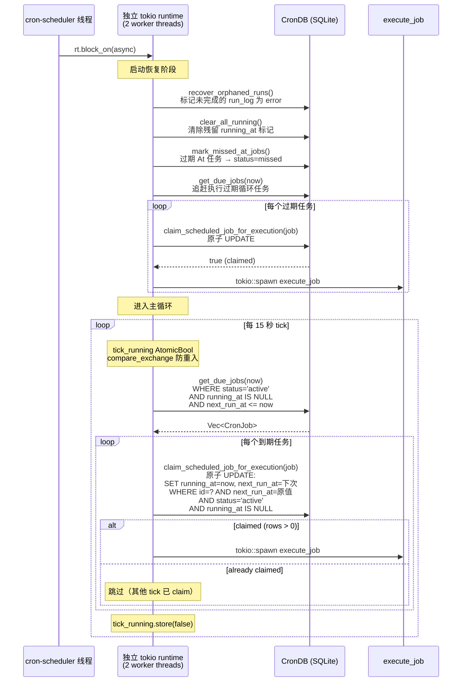
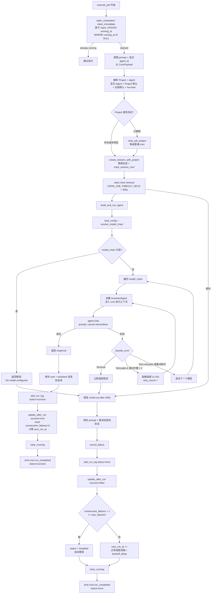
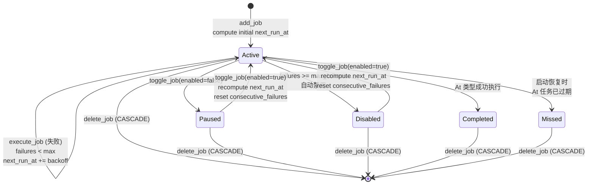

# Cron 定时任务架构
> 返回 [文档索引](../README.md) | 更新时间：2026-06-24

## 概述

Cron 系统提供定时调度能力，支持一次性（At）、固定间隔（Every）和 cron 表达式（Cron）三种调度模式。任务触发后在隔离会话中执行 Agent 对话，具备完整的 failover 模型链重试、任务级指数退避、连续失败自动禁用、启动恢复和日历视图。

任务可选绑定 Project（`project_id` / API `projectId`）。绑定后，每次执行创建的隔离会话会写入 `sessions.project_id`，因此 Project 指令、Project 记忆、Project 工作目录和工具 cwd 解析都与正常 Project 对话一致。未显式指定 `agent_id` 时，Agent 解析顺序为：任务 payload 显式 Agent > `project.default_agent_id` > 全局默认 > `ha-main`。如果任务关联的 Project 已被删除，执行器会清空该 job 的 `project_id` 并按普通 cron 继续执行，本次不计失败。

`Every` 调度在 2026-04-22 起补齐了持久化 `start_at`（首个计划触发时间）语义。这样日历展开不再从查询窗口起点“硬铺”，旧数据库里的 `Every` 任务也会在 `CronDB::open` 时自动按 `created_at + interval_ms` 回填 `start_at`，修复“4 月 22 日刚创建的喝水提醒在 4 月 1 日开始出现”的错位问题。

调度器运行在独立 OS 线程 + 独立 tokio runtime（2 worker threads）中，每 15 秒 tick 一次查询到期任务。任务 claim 使用原子 SQL UPDATE（`WHERE status='active' AND running_at IS NULL AND next_run_at <= now`）防止重复执行。

## 模块结构

| 文件 | 职责 |
|------|------|
| `cron/mod.rs` | 模块入口、re-exports |
| `cron/types.rs` | CronSchedule / CronPayload / CronJob / CronJobStatus / CronRunLog / NewCronJob / CalendarEvent |
| `cron/schedule.rs` | `compute_next_run` 三种调度计算、cron 表达式验证、`backoff_delay_ms` 指数退避、时间戳灵活解析 |
| `cron/scheduler.rs` | `start_scheduler` 后台调度循环 + 启动恢复 + 追赶执行 |
| `cron/executor.rs` | `execute_job` 任务执行 + `build_and_run_agent` 含 failover + `record_failure` + 事件发射 |
| `cron/delivery.rs` | `deliver_results` 把执行结果文本 fan-out 到 IM 渠道会话（每 target 10s 超时保护 + **投递前白名单校验**，详见「投递白名单与 delete 审批门控」）；`deliver_injection_for_session`（G2）按会话反查 `cron_run_logs → job` 后,把**后台 job/subagent 完成的注入 turn** 同样下发到 `delivery_targets`——cron turn 里 spawn 的后台任务稍后完成时不再投递给无人 |
| `cron/cancel.rs` | 任务级 cancel token 注册 / 触发 / 清理 + §9 claim↔register 窗口的 `PENDING_CANCELS` 占位，供 `cancel_running_job` 取消路径使用 |
| `cron/db.rs` | `CronDB` SQLite 持久化（CRUD、claim、running 标记、calendar 查询、启动恢复） |

## 数据模型

### CronSchedule（三种调度类型）

serde tag 区分，`rename_all = "camelCase"`：

| 类型 | 字段 | 说明 |
|------|------|------|
| `At` | `timestamp: String` | 一次性触发。支持 RFC 3339（`2026-04-05T10:00:00+08:00`）和紧凑时区偏移（`+0800`），通过 `parse_flexible_timestamp` + `normalize_tz_offset` 自动转换 |
| `Every` | `interval_ms: u64`, `start_at: Option<String>` | 固定间隔触发，每 N 毫秒。`start_at` 表示**首个计划触发时间**；`compute_next_run` 返回“严格晚于 `after` 的下一个锚定时间点” |
| `Cron` | `expression: String`, `timezone: Option<String>` | 标准 cron 表达式（`cron` crate `Schedule::from_str`）。**`timezone` 真正生效**（见下「时区语义」）：携带 IANA 名时按该时区墙钟解释、DST-aware；`None`/空回退 UTC |

#### 排程校验单一真相源（§6）

`schedule::validate_schedule(&CronSchedule)`（[`cron/schedule.rs`](../../crates/ha-core/src/cron/schedule.rs)）是「这条排程是否合法」的唯一裁决，三入口共用、绝不各自发散：

- **规则**：`At` timestamp 可 RFC3339 解析；`Every` `interval_ms ≥ MIN_EVERY_INTERVAL_MS`（`60000`，1 分钟地板——太小是「误造全功能 agent turn 跑飞循环」的经典坑）；`Cron` 表达式合法 + 非空 `timezone` 是已知 IANA 名（空 / 空白 = UTC，不校验）。
- **入口①持久化 chokepoint**：`CronDB::add_job` / `update_job` 入口即 `validate_schedule(&schedule)?`。这是红线——owner 平面 Tauri `cron_create_job`/`cron_update_job` + HTTP `create_job`/`update_job` 把**前端构造的 `CronSchedule` 直接喂** add/update，此前只校验 `Cron` expr+tz，于是 `At` 垃圾时间戳、`Every interval_ms=0`（永不触发的死任务）能从 owner 平面绕过持久化。现在全 variant 统一在 chokepoint 拒绝。
- **入口②模型工具路径**：`parse_schedule`（[`tools/cron.rs`](../../crates/ha-core/src/tools/cron.rs)）提取 + 归一化 JSON 字段（字段缺失给 field-specific 错误）后委托 `validate_schedule`，不再内联各自的值校验。
- `validate_cron_expression` / `validate_timezone` 仍是 expr / timezone 级原语，被 `validate_schedule` 复用（见下「时区语义」）。
- **`At` 时间戳用 `parse_flexible_timestamp` 校验**（与运行时 `compute_next_run` / `compute_occurrences` 同一 parser），故 RFC3339 与紧凑偏移 `+0800` 都接受——绝不把运行时能执行的时间戳判非法、让任务无法编辑。
- **遗留坏行的取舍**：`update_job` 校验的是**整条** schedule。若某行是 §6 之前经 owner 平面 API 绕过持久化的非法排程（`interval_ms=0` / 垃圾 `At`），则之后**仅改非排程字段（重命名 / 改 prompt / 改投递目标）也会因整条 schedule 重校验而被拒**。这是 chokepoint 红线的可接受代价——坏行本就从不正确触发，且恢复路径俱在：`toggle_job`（暂停 / 恢复）/ `delete_job` 刻意跳校验，GUI 重存会因前端 clamp 自动修复排程。**先修排程（或删任务）再改其它字段**。

### 时区语义（Cron）

`Cron` 的 `timezone` 是 IANA 名（`Asia/Shanghai` 等），决定 cron 表达式的时/分字段按哪个时区的墙钟解释：

- **计算**：`compute_next_cron`（[`cron/schedule.rs`](../../crates/ha-core/src/cron/schedule.rs)）把 `timezone` 经 `parse_timezone` 解析为 `chrono_tz::Tz`，`schedule.after(&after.with_timezone(&tz)).next()` 再 `.with_timezone(&Utc)` 落库（`cron` 0.13 的 `after<Z: TimeZone>` 泛型直接吃 `DateTime<Tz>`）。`None`/未知名回退 UTC——但创建期已校验（见下），故回退只对 legacy / 显式无时区行生效。
- **日历**：`compute_occurrences`（[`cron/db.rs`](../../crates/ha-core/src/cron/db.rs)）按**同一口径**展开（同样 `parse_timezone` + tz-aware 迭代），保证日历预览与实际触发一致。
- **校验单一真相源**：`schedule::parse_timezone` / `validate_timezone`（pub，经 `cron::validate_timezone` re-export）。`parse_schedule`（[`tools/cron.rs`](../../crates/ha-core/src/tools/cron.rs)）创建/更新期 trim + 校验，非法 IANA 名直接 `bail!`（不再静默回退 UTC——正是静默回退让旧 bug 隐形）。
- **前端**：`CronJobForm` 仅 `cron` 类型显示 IANA 选择器（`Intl.supportedValuesOf("timeZone")`），新任务默认填浏览器检测时区（`Intl.DateTimeFormat().resolvedOptions().timeZone`）；`buildSchedule` 下传该名，不再硬编码 `null`。`At`/`Every` 无时区字段（其时间戳已自带 offset、本就正确）。**编辑无时区 legacy 任务**时选择器默认填浏览器时区、保存即落地为该时区（修正语义；backfill 通常已先回填宿主时区，故仅在宿主检测失败时才有差异，且选择器始终可见、非静默）。
- **DST**：`cron` crate 在 `Tz` 上迭代对春进不存在时刻 / 秋退重复时刻优雅跳过、不 panic（`schedule.rs` 单测 `cron_dst_spring_forward_does_not_panic` / `cron_dst_fall_back_does_not_panic` 守）。
- **一次性 backfill（正确性，非兼容路径）**：`CronDB::open` 的 `backfill_cron_schedule_timezone` 把 `timezone` 为 null/空 的 Cron 行回填为**宿主检测时区**（`iana-time-zone::get_timezone`，本就是 chrono 传递依赖）并重算 `next_run_at`，使存量「静默 UTC」任务即刻校正为本地语义（幂等：已有有效时区跳过；宿主时区不可检测/非法则整体 no-op 不猜）。**破坏性提醒**：UTC+8 用户存量「每天 9 点」此前实际 17:00 触发，升级后回到 09:00。

### CronPayload（任务载荷）

serde tag 区分，目前仅一种类型：

| 类型 | 字段 | 说明 |
|------|------|------|
| `AgentTurn` | `prompt: String`, `agent_id: Option<String>` | 以指定 prompt 调用 Agent 对话，`agent_id` 缺省为 `"ha-main"`（`DEFAULT_AGENT_ID`） |

### CronJobStatus（五态枚举）

| 状态 | 说明 |
|------|------|
| `Active` | 正常调度中 |
| `Paused` | 手动暂停 |
| `Disabled` | 连续失败超限自动禁用 |
| `Completed` | At 类型一次性任务成功完成 |
| `Missed` | At 类型任务过期未执行（启动恢复时标记） |

### CronJob（完整字段）

| 字段 | 类型 | 说明 |
|------|------|------|
| `id` | `String` | UUID v4 |
| `name` | `String` | 任务名称 |
| `description` | `Option<String>` | 任务描述 |
| `project_id` | `Option<String>` | 可选 Project 关联；执行时创建 Project 会话并注入 Project 上下文。Project 缺失时自愈清空并降级为普通 cron |
| `schedule` | `CronSchedule` | 调度配置（At / Every / Cron） |
| `payload` | `CronPayload` | 执行内容（AgentTurn） |
| `status` | `CronJobStatus` | 五态状态 |
| `next_run_at` | `Option<String>` | 下次执行时间（RFC 3339）。At 类型完成后为 None |
| `last_run_at` | `Option<String>` | 上次执行时间 |
| `running_at` | `Option<String>` | 正在执行标记。非 NULL 表示正在运行，用于原子 claim 和防重复。启动时 `clear_all_running()` 清除残留 |
| `consecutive_failures` | `u32` | 连续失败次数。成功后重置为 0 |
| `max_failures` | `u32` | 最大允许连续失败数（默认 5）。超过后自动 `status = Disabled` |
| `created_at` | `String` | 创建时间（RFC 3339） |
| `updated_at` | `String` | 最后更新时间 |
| `notify_on_complete` | `bool` | 完成后是否发送桌面通知（默认 `true`，`default_true` 函数） |
| `delivery_targets` | `Vec<CronDeliveryTarget>` | IM 渠道 fan-out 目标列表。空 = 仅落入隔离会话不发送；非空 = 任务收尾时把 final assistant 文本投递到列出的 IM 会话（每 target 10s 超时保护，详见 `cron/delivery.rs`） |
| `prefix_delivery_with_name` | `bool` | §8 opt-in（默认 `false`）：成功投递加 `[Cron] {name}` 前缀。见「投递健壮性」 |

### CronDeliveryTarget（IM 渠道投递目标）

每条 `delivery_targets` 元素描述一个 IM 渠道会话的投递坐标，serde `rename_all = "camelCase"`：

| 字段 | 类型 | 说明 |
|------|------|------|
| `channel_id` | `String` | Channel 插件 id，例如 `"telegram"` / `"feishu"` / `"slack"` |
| `account_id` | `String` | 发送方 `ChannelAccountConfig.id`，决定用哪个账号发出 |
| `chat_id` | `String` | 目标 `ChannelConversation.chat_id`（群 / 私聊） |
| `thread_id` | `Option<String>` | 可选话题 / 线程 id（飞书 topic、Slack thread 等） |
| `label` | `Option<String>` | 缓存的人类可读标签，仅用于 UI 显示，不参与发送时寻址 |
| `stale` | `bool` | §8：发送账号已删除（投递期检测或删账号时 eager 标记）。投递时跳过 + GUI 标红；账号恢复则清回 |

### CronRunLog（执行日志）

| 字段 | 类型 | 说明 |
|------|------|------|
| `id` | `i64` | 自增主键 |
| `job_id` | `String` | 关联的任务 ID（CASCADE 删除） |
| `session_id` | `String` | 本次执行创建的隔离会话 ID |
| `status` | `String` | `"running"`（§9 在途）/ `"success"` / `"empty"`（§10 零输出）/ `"error"` / `"timeout"` / `"cancelled"` |
| `started_at` | `String` | 开始时间（RFC 3339） |
| `finished_at` | `Option<String>` | 完成时间。§9：在途 run_log 为 NULL，终态由 `finalize_run_log` 写入；`recover_orphaned_runs` 据此判定崩溃留痕 |
| `duration_ms` | `Option<u64>` | 执行耗时（毫秒） |
| `result_preview` | `Option<String>` | 结果预览（截断至 500 字节） |
| `error` | `Option<String>` | 错误信息 |
| `delivery_status` | `Option<String>` | §8：fan-out 结果——`None`=无目标 / `"delivered"` / `"partial"` / `"failed"`。见「投递健壮性」 |

### NewCronJob（创建输入）

| 字段 | 类型 | 说明 |
|------|------|------|
| `name` | `String` | 任务名称 |
| `description` | `Option<String>` | 描述 |
| `project_id` | `Option<String>` | 可选 Project 关联；`None` = 普通 cron。模型工具 `manage_cron create` 缺省继承当前会话 Project，显式 `null` / 空串表示不关联 |
| `schedule` | `CronSchedule` | 调度配置 |
| `payload` | `CronPayload` | 执行内容 |
| `max_failures` | `Option<u32>` | 最大失败数（默认 5） |
| `notify_on_complete` | `Option<bool>` | 通知开关（默认 true） |
| `delivery_targets` | `Option<Vec<CronDeliveryTarget>>` | IM 投递目标。`None` = 不下发（IM 会话内创建任务时由 `deliver_to_targets` 隐式推断当前会话）；`Some([])` = 显式关闭 fan-out；`Some([..])` = 投递到列出的 IM 会话 |

### CalendarEvent（日历视图）

| 字段 | 类型 | 说明 |
|------|------|------|
| `job_id` | `String` | 任务 ID |
| `job_name` | `String` | 任务名称 |
| `project_id` | `Option<String>` | 可选 Project 关联；API 暴露为 `projectId`，与对应 CronJob 一致 |
| `scheduled_at` | `String` | 计划执行时间 |
| `status` | `CronJobStatus` | 任务状态 |
| `run_log` | `Option<CronRunLog>` | 匹配的执行日志（§10 自适应窗口：`min(±2 分钟, 相邻 occurrence 间隔/2)`，对高频任务收窄避免错配） |

### `manage_cron` 工具 Project 语义

- `action="list_projects"` 枚举可传给 `project_id` 的 Project；`include_archived=true` 时包含归档项目
- `create`：省略 `project_id` 时若当前会话在 Project 内，则自动继承该 Project；传 `project_id=null` 或空串表示显式不关联 Project
- `update`：省略 `project_id` 保持原值；传 Project id 切换关联；传 `null` 或空串清空关联
- 工具层会校验显式传入的 Project id 必须存在；执行层仍保留 Project 删除后的降级自愈兜底

## 投递白名单与 delete 审批门控

cron 投递携 IM 账号身份、可周期触发、且 `manage_cron` 标 `internal:true`（走权限引擎直接 Allow、无审批），故对**被 prompt 注入的模型**是潜在数据外泄面。两道防线（来源：cron 优化 OQ5 / OQ6）：

**投递目标白名单**——`delivery_targets` 的 `(channel_id, account_id, chat_id, thread_id)` 必须命中 `channel_conversations`（与 `action=list_channel_targets` 同源：[`ChannelDB::conversation_exists`](../../crates/ha-core/src/channel/db.rs) = `get_session(...).is_some()`）：

- **创建/更新期**（[`tools/cron.rs`](../../crates/ha-core/src/tools/cron.rs) `validate_delivery_targets`）：模型**显式提供**的未命中目标直接 `bail!` 拒绝，引导其先调 `list_channel_targets` 发现合法坐标。从当前会话 IM 对话**推断**出的目标可信、不校验（构造自真实会话行）。`Some([])` 显式关闭 fan-out 不受影响。
- **投递期/运行时**（[`cron/delivery.rs`](../../crates/ha-core/src/cron/delivery.rs) `deliver_results`）：每个 target 投递前再查一次白名单，未命中 / channel_db 不可用 → **fail-closed 跳过 + `app_warn!("cron","delivery",...)`**（防御会话事后被删/接管）。`deliver_injection_for_session`（G2）委托 `deliver_results`，自动继承该 guard。投递目标已被白名单约束在「已记录的 IM 会话」（非任意 URL），故投递路径**不再叠加 SSRF 检查**——白名单即边界。

**delete 审批**——`manage_cron action=delete` 是唯一对接统一权限引擎 v2 的 action（其余 action 维持 internal 免审）。delete 分支单独以 `is_internal=false` 调一次 [`resolve_tool_permission`](../../crates/ha-core/src/tools/execution.rs)，引擎 [`check_cron_delete`](../../crates/ha-core/src/permission/engine.rs)（落在 `resolve_soft_approval_layer`，YOLO 短路与 AllowAlways 累加器之后）发**非 strict** `AskReason::CronDelete`：

- **Default** 弹标准审批；**Smart** 交 judge 模型自决；**YOLO / global-yolo** 免审；**无人值守**（cron 自身 turn 内调用、无 surface）按 `unattended_approval_action` **fail-closed**（默认 deny）。
- 非 strict（不进 `forbids_allow_always`）只约束 **timeout / unattended 轴**（超时不强制 deny、可按配置 proceed、Smart 可降级 judge）。**AllowAlways 刻意抑制**（红线）：`gate_cron_delete` 对该审批强制 `allow_always_forbidden=true`，前端 `barsAllowAlways` 同步禁用按钮——因为 `manage_cron` 的 allowlist matcher 只按 `action` 匹配、**不含 job `id`**（`stable_field_matchers`），一旦持久化便是「静默删除任意定时任务」的 id 无关常驻授权，且 `allows_tool_call` 在 `check_cron_delete` 之前命中会绕过本门。故每次 delete 都需逐次确认，永不留常驻 grant。`ApprovalReasonKind::CronDelete` 与前端 `ApprovalDialog.tsx` union / 12 语言 `approval.reasons.cron_delete` 文案同步。
- delete 成功落 `app_info!("cron","manage",...)` 审计；不做 creator 作用域隔离（模型需管理用户全部提醒）。

## 投递健壮性（§8）

[`deliver_results`](../../crates/ha-core/src/cron/delivery.rs) 在白名单（上节）之上叠加四项健壮性，返回 [`DeliveryReport`](../../crates/ha-core/src/cron/delivery.rs) 汇总「结果到底有没有到人」：

- **有界退避重投**：每个 target 的 send 超时 / 报错时按 `SEND_BACKOFF_BASE_MS=500ms` 指数退避重投，至多 `MAX_SEND_ATTEMPTS=3` 次。与 [`async_jobs::retry`](../../crates/ha-core/src/async_jobs/retry.rs)（计费工具、config-gated、默认关）不同——IM 投递不计费，故**默认开 + 固定小次数、非用户旋钮**。语义是 **at-least-once**：超时的 send 可能已落地，重投极少数情况会重复一条消息；但对周期任务而言「静默丢掉唯一一份结果」（IM 限流 / token 过期 / server 重启）是更坏的失败，故取此权衡。
- **`cron_run_logs.delivery_status`**（迁移列，nullable）：`DeliveryReport::run_log_status()` 派生——`None`=无投递目标（无可 fan-out，区别于「投了但没人收到」）/ `"delivered"`=全部到达 / `"partial"`=部分失败或跳过 / `"failed"`=有目标但无人收到。success 路 run log 先插入拿 id、fan-out 后经 `update_run_log_delivery_status` 回写；failure 路经 `record_failure` 的新增参数带入。GUI `CronJobDetail` run-log 列表展示。
- **失效目标可见（`CronDeliveryTarget.stale`）**：投递期账号已删 → 该 target 标 `stale` 经 [`apply_delivery_target_stale_flags`](../../crates/ha-core/src/cron/db.rs)（**单锁内 read-modify-write、按 `account_id` 翻转 stale**——绝不经 `update_job` 重校验整条 schedule（§6 chokepoint 对坏行的副作用见上「遗留坏行的取舍」），且**绝不用 claim 时快照整列覆盖**：cron 单次可跑至 2h，期间用户经 `update_job` 改了投递目标，写回必须读 DB 当前列、只改匹配 account 的 stale 位，保留用户的增删改）写回；账号又恢复（同 id）则投递成功时清回 `stale=false`。删账号入口 [`channel::accounts::remove_account`](../../crates/ha-core/src/channel/accounts.rs) 经 `mark_account_delivery_targets_stale`（幂等、返回触达 job 数、每 job 走同一原子方法）**eager 标记**，避免 UI 仍显示一个永远投不出去的目标。GUI `CronJobForm` 目标行标红。
- **删账号反向提醒**：`jobs_referencing_account(account_id)` → `Vec<CronAccountRef{job_id, job_name, target_count}>`，owner 平面 Tauri `cron_jobs_referencing_account` / HTTP `GET /api/cron/jobs-referencing-account/{account_id}`。前端 `ChannelPanel` 删除前先扫，命中则弹 `AlertDialog` 列出受影响任务，零命中沿用直接删。
- **per-job 成功前缀（`prefix_delivery_with_name`，opt-in 默认关）**：开启后成功投递加 `[Cron] {name}\n\n` 前缀（失败投递本就带 `⚠️ [Cron] {name} failed:`），便于区分投到同一群的多个任务。迁移列 + `manage_cron` schema 字段 + `CronJobForm` 开关（仅有投递目标时显示）。**job 级字段、非 `AppConfig`**，故不走设置三件套。

## 调度机制



### 并发配额：slot-before-claim（§4）

每个 cron 运行是一轮完整 agent turn（可再起 subagent / 工具），N 个任务同一时刻齐发会 spawn N 个并发 LLM turn，足以打满机器 / 触发供应商限流。`CronConfig.max_concurrent`（`AppConfig.cron`，默认 5，`0` = 不限）给调度器一个全局并发上限。

关键是**先抢 slot 再 claim**（slot-before-claim）。`claim_scheduled_job_for_execution` 的副作用是**推进 `next_run_at`**，所以若先 claim 再发现没空位跑，就白白跳过了一次执行。调度器（catch-up + 每 tick 共用 `dispatch_due_jobs`）改为：

1. 读 `cron.effective_max_concurrent()`（`None` = 不限）。
2. `count_running()`（`COUNT(running_at IS NOT NULL)`，是并发计数的单一真相源——覆盖 scheduled / catch-up / 手动 run-now 三条路径，因为三者都 set `running_at`）。
3. `available = max - running`（`available_slots` 纯函数，`saturating_sub` 防下溢；不限则 `None`）。
4. 逐个 claim，**至多 `available` 个**；到上限即 `break`，**剩余到期任务保持 `running_at=NULL` / `next_run_at` 不变**，下个 tick（15s 后）重试——不丢、不跳。

边界：
- **手动「立即运行」(`run now`) 绕过上限**（用户显式操作即时生效），但其 `running_at` 计入 `count_running`，故调度器不会在手动任务在跑时超额 spawn。
- `count_running()` 失败时**保守跳过本 pass**（fail closed），下个 tick 重试——poisoned lock 下 claim 本也会失败。
- 计数取 tick 起始快照；pass 内每成功 claim 本地 `available -= 1`，期间完成的任务释放的 slot 留到下个 tick 回收（保守、无害）。
- **泄漏 slot 的 panic 安全兜底（红线）**：因 `count_running` 现在是**全局**配额分母，一个泄漏的 `running_at` marker 会永久占一个 slot——若干次 panic 即可让 `available=0` 永真、整个调度器停摆到重启。故 `execute_claimed_job` 顶部挂一个 RAII `RunningMarkerGuard`：drop 时做 **owner-checked 清除**（`clear_running_if_owner` = `UPDATE … WHERE id=? AND running_at=?` 本次 claimed_at）。正常终态路径已 `clear_running`（running_at=NULL 不匹配 → no-op）；run_chat_engine 任意 await 点 panic 解栈时 guard 释放 slot；被后续 re-claim 的 marker（running_at=新时间戳 ≠ 旧 claimed_at）guard 不动——三种情况都对，happy path 零改动。进程崩溃（非 panic）仍由启动期 `clear_all_running` 兜底。

## 执行流程



## 运行身份与 KB 访问（`ChatSource::Cron`）

cron 执行通过 `run_chat_engine` 起一轮对话，其 `source` 是专属的 [`ChatSource::Cron`](../../crates/ha-core/src/chat_engine/stream_seq.rs)（早期复用 `Channel` 桶，已废弃）。这个 source 的语义定位是**「后台、非交互，但 owner-internal 的顶层会话」**：

| 维度 | Cron | 理由 |
|------|------|------|
| `holds_foreground_idle_guard` | ✅ | 后台 job / subagent 完成注入必须让位于在跑的 cron turn（R2 §5.4），否则注入打在活跃 turn 上 |
| `fires_user_lifecycle_hooks` | ✅ | cron 是合法顶层会话（无 subagent 级联风险），`SessionStart` 等照常触发 |
| `tracks_seq` | ✅ | cron 会话真实可持久化、用户可见；注册进 stream_seq 还顺带拿到「同会话第二条流被拒」的并发流守卫 |
| `broadcasts_to_user_ui` | ❌ | 后台 turn，不上主 `chat:stream_delta` bus；结果走 `delivery_targets` fan-out 到 IM |
| `active_counts` 桶 | 不计 | cron 不是 desktop/http/channel 交互会话，与 `Subagent` / `ParentInjection` 同属后台、不进状态条计数 |
| `kb_access_source` | `KbAccessSource::Cron` | **非 IM owner 桶**：见下 |

**KB 访问（D10 + WS8）**：`engine.rs::kb_access_source` 把 `ChatSource::Cron` 映射到 `KbAccessSource::Cron`。该桶 `is_im() == false`，故 `effective_kb_access` 的 `im_lineage_denied` 不触发，cron turn 走 owner 的 `max(session_attach, project_attach)` 路径 —— 与桌面 / HTTP owner turn 同权，`note_*` / `[[note]]` / `knowledge_recall` 在 cron 会话 attach / 所属 project 的 KB 上正常可用。早期 cron 背 `Channel` → `Im` → WS8 无 `channel_kb_context` 一律拒，导致**定时任务静默拿不到任何 KB**，本节即修复该缺陷。

红线：

- **incognito 仍归零** —— `effective_kb_access` 的 incognito 短路在 IM 门之前，cron 不豁免（cron 与 incognito 本就互斥，双保险）。
- **subagent 血缘不洗权限** —— cron 起的 subagent 继承 `origin_source = Cron`（executor 传 `origin_source: None`，引擎按 `source` 派生），`Cron` 非 IM 故子代理同样走 owner 路径、不被 WS8 拒；反之一个 IM origin 的链条即便中途 source 变也仍按 origin 判定。
- **owner KB 读 + `delivery_targets` 投递是两道独立门** —— cron 能读 KB（owner）与 cron 能投递到某 IM chat（§1 白名单 `channel_conversations`）各自裁决；「定时任务读 KB 再投递到用户自己配置的 IM 会话」是用户显式意图，投递边界由 §1 白名单守。

### 失败处理：可配 timeout / 分类 / 自动禁用通知（§5）

- **可配 per-run timeout**：`CronConfig.job_timeout_secs`（默认 300，`effective_job_timeout_secs()` 钳 `[30, 7200]`）。**`0` 不是无限**——一个真正卡死的运行（死循环、非 panic）只有靠超时才能释放并发槽，故钳到地板 30s。执行包在 `tokio::time::timeout` 里，超时即放弃、记一条 `timeout` 失败、释放 slot（叠加 §4 panic guard 兜底 panic 路径）。
- **失败分类**（`cron::failure::CronFailureClass`，纯函数 `classify(error)`）：`Timeout` / `Configuration`（no model / no agent 等重跑也不会好的配置问题）/ `Transient`（默认——未识别错误绝不误判成配置问题）。**只做诊断**：`run_log_status()` 让 timeout 在运行日志里显示 `timeout`（其余仍 `error`，不动既有过滤），`key()` 作为稳定 wire key 喂日志 + 前端本地化。**刻意不改禁用策略**（仍 `max_failures` 连续失败），避免误分类导致过早禁用。
- **自动禁用通知（红线）**：`update_after_run` 现返回 `bool`——失败把 `consecutive_failures` 推到 `max_failures` 翻 `disabled` 时返 `true`。`record_failure` 据此发**一次性** `emit_cron_disabled_event`：复用 `cron:run_completed` 通道但**强制 `notify=true`**（无视 job 的 `notify_on_complete`——任务静默死掉正是要暴露的失效）+ 带 `auto_disabled` / `consecutive_failures` / `failure_reason`。前端 `useChatSession` 监听到 `auto_disabled` 弹专属通知「任务 X 连续失败 N 次已禁用（原因）」。普通失败仍走原 `emit_cron_event`（受 `notify_on_complete` 控制）。

### At 一次性任务的补跑与终态（§7）

一次性 `At` 任务此前有两个失效：① 宕机期间错过触发时点的任务在重启时被 `mark_missed_at_jobs` **无条件**标 `missed`（哪怕只晚 1 秒、且在 catch-up 之前跑），从不补跑；② `claim` 时 `At` 的 `next_run_at` 被清成 NULL，若 claim 后崩溃，重启 `clear_all_running` 清掉 `running_at` 后该行成僵尸（`active` + `next_run_at=NULL`，`get_due_jobs` 与旧 `mark_missed`（都要求 `next_run_at IS NOT NULL`）均不选它，永不触发也永不终态）。

- **late-fire grace**：`mark_missed_at_jobs(grace_secs)`（grace = `CronConfig.effective_at_grace_secs()`，默认 300s，由调度器传入）现按 `cutoff = now - grace` 判定：`next_run_at < cutoff`（逾期超过 grace）→ `missed`；`next_run_at ∈ [cutoff, now]`（逾期在 grace 内）→ **保持 active**，紧随其后的 catch-up（`get_due_jobs` 取 `next_run_at <= now`）经 §4 `dispatch_due_jobs` slot-aware 补跑。`grace=0` ⇒ 严格（任何逾期即 missed，pre-§7 行为）。**grace 只在启动期 `mark_missed_at_jobs` 这一刻裁决**「是否 late-fire」——一旦判定 within-grace 保留为 active，后续若因并发上限抢不到 slot，会在之后的 tick 持续重试直到有空位，可能实际触发时已超过 grace（grace 管的是宕机时长、不是 slot 争用延迟；为抢不到 slot 而丢弃一个本应补跑的一次性任务更糟）。
- **僵尸终态**：同一 `mark_missed_at_jobs` 把 `next_run_at IS NULL` 的 active `At` 行一并标 `missed`——覆盖「claim 后崩溃」与「以过去时间戳创建」（`compute_next_run` 返 `None`）两种。**一次性任务可能崩溃前已产生副作用，故标 missed 不重跑**（side-effect 安全；用户决策）。
- **顺序红线**：调度器启动 `mark_missed_at_jobs` 必须在 catch-up **之前**——先把超 grace / 僵尸剔除，catch-up 才只补跑 grace 内的 `At`。

### 崩溃 / 取消 / 接管一致性（§9）

一组并发 / 恢复锐边：

- **取消不丢 / 取消不误判（C4）**：终态判定收敛到纯函数 `classify_cron_terminal(result, was_cancelled)`（可穷举单测）。关键 quirk——cron 跑引擎用 `abort_on_cancel=false`，**取消中断不抛 `Err` 而是返回 `Ok("")`**（引擎吞掉取消、收尾返回空串，见 `engine.rs` 的 `!abort_on_cancel && cancel` 两条收敛路径）。故决策表：`Ok` 空串 + `was_cancelled` → **Cancelled**（中断、不投空消息、不推进排程 / 不清失败计数）；非空 `Ok` → **Success**（含「取消在产出真实结果之后才到」——尊重已完成的工作，C4 本意）；`Err` + `was_cancelled` → Cancelled（防御，仅当未来有调用方翻 `abort_on_cancel=true`）；其它 `Err` → Failure。修正了旧版「`was_cancelled` 先判 → 成功瞬间被取消则结果被当 cancelled 丢弃」与「naïve result-first → 取消中断被当 success 投空消息」两个反向坑。
- **claim↔register 窗口（C7）**：`cancel::register` 提前到 claim 成功后、session 创建 / 任何 await **之前**（job.id 已知即注册），并由 RAII `CancelRegistrationGuard` 在所有退出路径（含 no-session 早退、panic）清理。`cancel.rs` 增 `PENDING_CANCELS`：`cancel()` 在 flag 未注册时（窗口内）落一个 pending 占位（`cancel_running_job` 已先验 `running_at.is_some()`，故占位只对真在飞的 run 成立、绝不误伤未来运行），`register()` drain 占位使 run 起跑即取消，`remove()` 清未消费占位防泄漏到下次运行。
- **跨进程取消（C5，取舍）**：cancel 注册表是**进程本地** static map，cron 调度仅在 Primary 进程跑。另一实例（Secondary / 远端客户端）对 Primary 在跑的 run 发取消会查无 flag——此时**回落到 per-run job-timeout**（§5，默认 5min）兜底释放。本期不引入持久化 `cancel_requested` 列（cron 单 Primary、取消多为同进程，跨进程属边缘场景）。
- **崩溃留痕 + 实时「运行中」（D2）**：run 起跑（session 创建后）即 `add_running_run_log` 插入 `status='running'` / `finished_at=NULL` 的**在途** run_log，终态经 `finalize_run_log` 单次 UPDATE 收尾（success/error/cancelled + 时长 + 投递结果）。这让 `recover_orphaned_runs`（启动期，`WHERE finished_at IS NULL`）**真正生效**——崩溃中途的 run 在下次启动被收为 `error`（此前 run_log 只在执行后落库，该函数对 cron 是死代码）。同进程 panic 由 `RunningMarkerGuard` 兜底 finalize 为 error。前端 run-log 列表渲染 `running` 态（蓝色 spinner）。no-session 早退因尚未开 run_log，仍 INSERT 一条完整失败行（`record_failure` 的 `run_log_id=None` 分支）。
- **Primary 崩溃可观测（C6）**：调度器每 tick UPSERT `cron_meta.scheduler_heartbeat`；启动时若上次心跳距今 ≥ `HEARTBEAT_STALE_WARN_SECS`（300s）则 `app_warn` 提示「调度器曾离线 ~Ns」。纯日志可观测——Primary 崩溃**非丢任务**（重启 catch-up 按 grace 补跑），故不做 Secondary 竞选接管。

### 可观测性 + 日历精度（§10）

low 债集中清理：

- **零输出不再掩盖（empty 终态）**：终态分类 `classify_cron_terminal` 新增 `Empty`——非取消的空 `Ok`（trim 后为空）记 run_log `status='empty'`、**跳过投递（不发空消息）**、`app_warn`，但仍按非失败推进排程（不 bump 失败计数）。`deliver_results` 另加空 Success 文本守卫覆盖 G2 注入路径。前端 run-log 渲染 `empty`（灰 `CircleSlash`）。
- **失败原因纳入通知（D4）**：`emit_cron_event` 增 `failure_reason`（timeout/configuration/transient 分类），error run 的 `cron:run_completed` 携带之；前端 `useChatSession` 普通错误通知体附原因（与 auto-disabled 通知同款 `cronReason` 文案）。
- **日历匹配自适应窗口**：`match_run_logs_to_occurrences` 的窗口由固定 ±2min 改为 `min(±2min, 最小相邻 occurrence 间隔/2)`，<4min 间隔任务不再因窗口跨两 occurrence 错配 / 丢日志。
- **`find_job_by_session` 确定性排序**：`ORDER BY id DESC`（自增主键 tiebreak）替代 `ORDER BY started_at DESC`，同秒多 run_log 时 G2 注入路由不再不确定。
- **`mark_missed_at_jobs` serde 假设加测试锁**：`schedule_json LIKE '%"type":"at"%'` 的 SQL 过滤保留（高效、startup-only），加单测 `at_schedule_serializes_with_type_at_tag` 锁定 serde tag 格式，防 rename 静默破坏「un-missing 所有逾期 At」。
- **`schedule_summary` <60s 显示真实秒数**；**`manage_cron` schema** update 语义精确化（传 `schedule_type` 才替换排程、须补齐该类型必填字段，否则保持原排程）。

**本期未做（延后）**：周期任务宕机错过槽位的 `skipped` run_log 记录——§9 的调度器心跳已覆盖「宕机多久」这一可观测信号，且 no-compensation 策略（catch-up 只跑一次、推进到下个未来 slot）已是现行为；逐 Cron-occurrence 计数错过槽数成本高、收益边际，故不在本期落地。

## 调度计算：compute_next_run

三种 `CronSchedule` 类型的下次执行时间计算：

| 类型 | 算法 | 完成后行为 |
|------|------|------------|
| `At` | 若 `timestamp > after` 则返回 `timestamp`，否则 `None` | 成功后 `status = Completed`，`next_run_at = None` |
| `Every` | 基于 `start_at` 计算 `> after` 的下一个锚定时间点 | 固定相位；若执行耗时超过一个周期，会跳过错过的槽位而不是把后续触发整体漂移 |
| `Cron` | `CronExpression::from_str(expression).after(after).next()` | 每次执行后基于当前时间重算 |

**时间戳解析**：`parse_flexible_timestamp` 先尝试 RFC 3339，失败后通过 `normalize_tz_offset` 将紧凑偏移（如 `+0800`）转为标准格式（`+08:00`）再解析。

## 指数退避公式

```
backoff_delay_ms = base_ms * 2^min(consecutive_failures, 20)

其中：
  base_ms = 30,000 (30 秒)
  max_ms  = 3,600,000 (1 小时)
  delay   = min(base_ms * 2^failures, max_ms)
```

失败后 `next_run_at` 的计算：
- **At 类型**：`now + backoff_delay`（失败重试）
- **Every / Cron 类型**：`compute_next_run(schedule, now) + backoff_delay`（正常间隔 + 退避叠加）

退避序列：30s → 60s → 120s → 240s → 480s → 960s → ... → 1h（上限）

## Failover 策略

`build_and_run_agent` 复用 ChatEngine 的模型链重试逻辑：

| 错误分类 | 处理方式 |
|----------|----------|
| Terminal（ContextOverflow） | 立即返回错误，不尝试其他模型 |
| Retryable（RateLimit / Overloaded / Timeout） | 同模型重试最多 `MAX_RETRIES=2` 次，指数退避 `retry_delay_ms(attempt, 1000, 10000)` |
| Non-retryable（Auth / Billing / ModelNotFound / Unknown） | 跳过当前模型，尝试链中下一个 |

模型链构建：`resolve_model_chain(agent_model_config, store)` → primary + fallbacks（去重）。

## SQLite Schema

```sql
CREATE TABLE cron_jobs (
    id TEXT PRIMARY KEY,
    name TEXT NOT NULL,
    description TEXT,
    schedule_json TEXT NOT NULL,       -- CronSchedule JSON
    payload_json TEXT NOT NULL,        -- CronPayload JSON
    status TEXT NOT NULL DEFAULT 'active',
    next_run_at TEXT,
    last_run_at TEXT,
    running_at TEXT,                   -- 非 NULL = 正在执行（原子 claim）
    consecutive_failures INTEGER NOT NULL DEFAULT 0,
    max_failures INTEGER NOT NULL DEFAULT 5,
    notify_on_complete INTEGER NOT NULL DEFAULT 1,
    created_at TEXT NOT NULL,
    updated_at TEXT NOT NULL
);

-- 联合索引：调度器查询到期任务时使用
CREATE INDEX idx_cron_jobs_status_next
    ON cron_jobs(status, next_run_at);

CREATE TABLE cron_run_logs (
    id INTEGER PRIMARY KEY AUTOINCREMENT,
    job_id TEXT NOT NULL REFERENCES cron_jobs(id) ON DELETE CASCADE,  -- 级联删除
    session_id TEXT NOT NULL,
    status TEXT NOT NULL,           -- 'success' / 'error'
    started_at TEXT NOT NULL,
    finished_at TEXT,
    duration_ms INTEGER,
    result_preview TEXT,
    error TEXT,
    created_at TEXT NOT NULL DEFAULT (datetime('now'))
);

-- 复合索引：按任务查最近执行记录
CREATE INDEX idx_cron_runs_job
    ON cron_run_logs(job_id, started_at DESC);
```

**Schema 迁移**：`CronDB::open` 中检测 `running_at`、`notify_on_complete`、`delivery_targets_json`、`prefix_delivery_with_name`（§8）列与 `cron_run_logs.delivery_status`（§8）列是否存在，不存在则 `ALTER TABLE ADD COLUMN`；并 `CREATE TABLE IF NOT EXISTS cron_meta`（§9 心跳 KV），兼容旧数据库。另有一条 JSON 级兼容迁移：对老版本 `schedule_json = {"type":"every","interval_ms":...}` 的任务，启动时自动写回 `start_at = created_at + interval_ms`。

## 前端事件

### cron:run_completed

Tauri 全局事件，任务执行完成后（无论成功或失败）发射。

| 字段 | 类型 | 说明 |
|------|------|------|
| `job_id` | `String` | 任务 ID |
| `job_name` | `String` | 任务名称 |
| `status` | `String` | `"success"` / `"error"` |
| `notify` | `bool` | 是否应显示桌面通知（由 `notify_on_complete` 控制） |

## 生命周期操作



**toggle 操作细节**：
- **启用**（`enabled=true`）：`status='active'`，`consecutive_failures=0` 重置，`compute_next_run` 重算下次执行时间
- **禁用**（`enabled=false`）：`status='paused'`，保留当前 `next_run_at` 和 `consecutive_failures`

**日历查询**：`get_calendar_events(start, end)` 展开所有任务在时间范围内的执行时间点。`Every` 任务从自己的 `start_at`（或旧任务回填出的锚点）开始展开，不再从月份查询起点硬铺。为避免高频任务日历错位，执行日志改为按 job 一次性批量读取，并按“离哪个计划时间最近”在**自适应窗口**内唯一匹配（§10：窗口 = `min(±2 分钟, 相邻 occurrence 间隔/2)`，故 <4min 间隔的任务不会因固定 ±2min 窗口跨两个 occurrence 而错配 / 丢日志）；Every/Cron 单任务最多展开 10,000 个事件。

## 关键源文件索引

| 文件 | 职责 |
|------|------|
| `crates/ha-core/src/cron/mod.rs` | 模块入口、re-exports（CronDB / start_scheduler / execute_job_public / validate_cron_expression） |
| `crates/ha-core/src/cron/types.rs` | CronSchedule / CronPayload / CronJobStatus / CronJob / CronRunLog / NewCronJob / CalendarEvent 定义 |
| `crates/ha-core/src/cron/schedule.rs` | `compute_next_run`（三种类型）/ `validate_cron_expression` / `backoff_delay_ms`（指数退避）/ `parse_flexible_timestamp`（RFC 3339 + 紧凑偏移） |
| `crates/ha-core/src/cron/scheduler.rs` | `start_scheduler`：独立 OS 线程 + tokio runtime / 启动恢复（orphaned runs + stale markers + missed At + 追赶执行）/ 15s tick 循环 + tick_running 防重入 |
| `crates/ha-core/src/cron/executor.rs` | `execute_job`：创建隔离 session + 5min timeout + 成功/失败分支处理 / `build_and_run_agent`：模型链遍历 + failover 重试 / `record_failure` / `emit_cron_event` |
| `crates/ha-core/src/cron/db.rs` | `CronDB`：SQLite schema 初始化 + 迁移 / CRUD（add/update/delete/get/list）/ `get_due_jobs`（到期查询）/ `claim_scheduled_job_for_execution` + `claim_immediate_job_for_execution`（原子 claim 双路径：定时 / 手动 run-now）/ `clear_running` + `clear_running_if_owner`（owner-checked 释放）/ `add_running_run_log` + `finalize_run_log`（§9 在途 run_log 生命周期）/ `toggle_job`（启用/禁用）/ `update_after_run`（成功重置/失败退避/自动禁用）/ `get_calendar_events`（日历展开）/ `recover_orphaned_runs` + `clear_all_running` + `mark_missed_at_jobs` + `record_scheduler_heartbeat`（启动恢复 + §9 心跳） |
