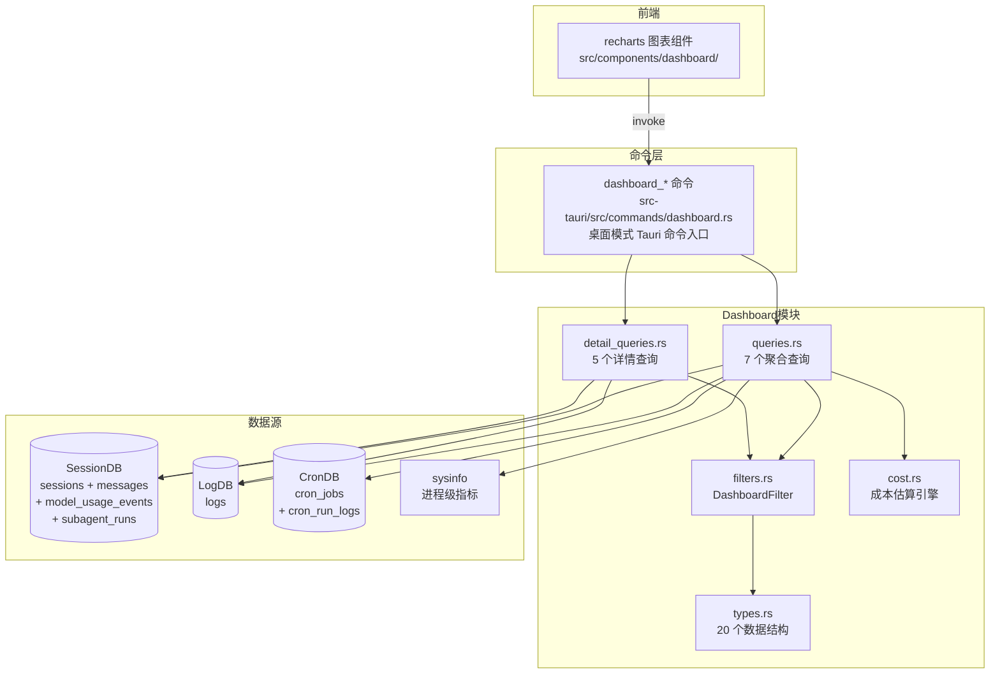
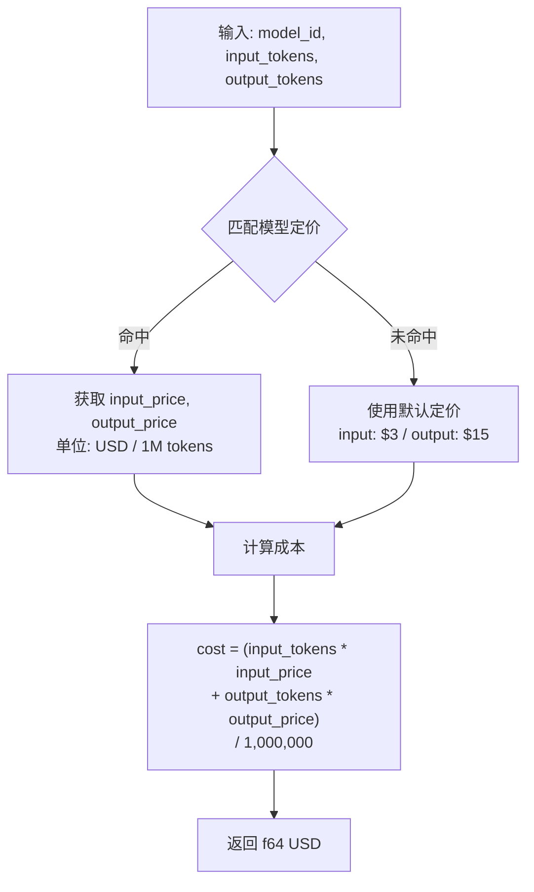
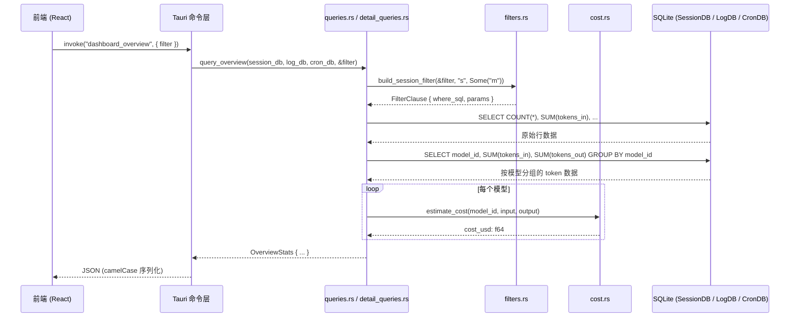

# Dashboard 数据大盘架构
> 返回 [文档索引](../README.md) | 更新时间：2026-07-15

## 概述

Dashboard 模块提供跨三个 SQLite 数据库（SessionDB、LogDB、CronDB）及 Plan 文件索引的聚合分析查询，为前端 recharts 图表提供标准化 JSON 数据。通用分析采用「筛选器 + 查询函数」管道；Goal / Workflow / Loop 控制面采用独立的只读聚合入口。

核心设计原则：
- **自动排除非用户数据**：所有 session 级查询自动注入 `is_cron = 0 AND parent_session_id IS NULL AND incognito = 0`，排除定时任务会话、子 Agent 会话和无痕会话；模型用量总账仅硬排无痕，会统计 cron / subagent / 后台维护等所有非无痕模型请求
- **模型用量总账**：Dashboard token / cost 总量来自 `session.db.model_usage_events`，覆盖 chat / side_query / summarize / embedding / STT / judge / web_search / image_generation / provider_test 等入口；Provider 原始 usage 返回多少记多少，未返回 token 时只记录调用次数与耗时
- **统一筛选**：所有查询接受同一个 `DashboardFilter` 结构体，支持时间范围 + Agent/Provider/Model/UsageKind 维度筛选
- **成本估算内联**：Token 统计查询自动附带基于硬编码定价表的 USD 成本估算
- **进程级系统指标**：通过 sysinfo crate 采集当前进程的 CPU/内存/磁盘 IO 实时快照

## 模块结构

| 文件 | 职责 |
|------|------|
| `mod.rs` | 模块入口，re-export 公开 API |
| `types.rs` | 全部数据结构定义（20+ 个 struct） |
| `queries.rs` | 7 个聚合查询函数 |
| `detail_queries.rs` | 5 个详情列表查询函数 |
| `filters.rs` | 筛选器构建（session / model_usage / log 三套） |
| `cost.rs` | 模型定价表与成本计算引擎 |
| `insights.rs` | 8 个深度洞察查询（同环比 / 趋势 / 热力图 / 健康度 / orchestrator） |
| `learning.rs` | Learning Tracker 4 个查询 + 9 个事件常量（埋点写入 `session.db.learning_events`） |
| `coding_improvement.rs` | Coding Improvement 全局 / 项目级学习聚合：workflow、eval、review、verification、proposal、retro 只读 rollup |
| `plan_stats.rs` | Plan 统计聚合：Dashboard "Plans" tab 数据源（详见下文） |
| `control_plane.rs` | “目标与执行”聚合：Goal / Workflow / Loop / Task / Plan 指标、P50、覆盖率和 attention 明细 |
| `local_models.rs` | 本地模型 Tab 专属聚合：按 `provider::local::known_local_backends` 反查"本地"provider name 列表后对 sessions / messages 表做 token / 调用次数 / TTFT / 错误率统计；前端 `LocalModelsSection` 消费 |

## 数据源架构



## 筛选器系统

### DashboardFilter

所有查询的统一入参，7 个可选维度：

| 字段 | 类型 | 说明 |
|------|------|------|
| `start_date` | `Option<String>` | 起始时间（ISO 8601 格式） |
| `end_date` | `Option<String>` | 结束时间（ISO 8601 格式） |
| `agent_id` | `Option<String>` | 按 Agent ID 筛选 |
| `provider_id` | `Option<String>` | 按 Provider ID 筛选 |
| `model_id` | `Option<String>` | 按模型 ID 筛选 |
| `usage_kind` | `Option<String>` | 按模型调用类型筛选（`chat` / `side_query` / `summarize` / `embedding` / `stt` / `judge` / `web_search` / `image_generation` / `provider_test`） |
| `operation` | `Option<String>` | 按 `model_usage_events.operation`（purpose 标签，见 [`automation-model.md`](automation-model.md) §2.5）精确匹配筛选。无下拉框，只能通过点击 Token 用量趋势 tab 的 operation 明细表下钻写入，与 `model_id` 的下钻方式一致 |

所有字段均为空字符串安全 -- 空字符串等价于 `None`，不会生成 WHERE 子句。

### build_session_filter

用于 session/message 关联查询，签名：

```rust
fn build_session_filter(
    filter: &DashboardFilter,
    session_alias: &str,       // 表别名，通常 "s"
    message_alias: Option<&str>, // 如有 JOIN messages 则传 "m"
) -> FilterClause
```

自动注入的硬编码条件：
- `{session_alias}.is_cron = 0` -- 排除定时任务会话
- `{session_alias}.parent_session_id IS NULL` -- 排除子 Agent 会话
- `{session_alias}.incognito = 0` -- 排除无痕会话

时间范围过滤逻辑：
- 当提供 `message_alias` 时，时间条件作用于 `{message_alias}.timestamp`
- 否则作用于 `{session_alias}.created_at`

### build_log_filter

用于 LogDB 查询，仅支持 `start_date`、`end_date`、`agent_id` 三个维度（日志表无 provider/model 字段）。

### build_model_usage_filter

用于 `model_usage_events` 查询，支持 `start_date`、`end_date`、`agent_id`、`provider_id`、`model_id`、`usage_kind`、`operation`。该过滤器不自动排除 cron / subagent，因为模型用量总量要覆盖所有非无痕模型请求；无痕会话在写入 `model_usage_events` 时 fail-closed 跳过。

### params_ref 辅助函数

将 `Vec<Box<dyn ToSql>>` 转换为 `Vec<&dyn ToSql>`，适配 rusqlite 的参数绑定 API。

## 聚合查询维度（7 个）

### 1. Overview 概览

**函数**：`query_overview(session_db, log_db, cron_db, filter) -> OverviewStats`

**数据源**：SessionDB + CronDB（跨库查询）

**返回字段**：

| 字段 | 类型 | 说明 |
|------|------|------|
| `total_sessions` | `u64` | 会话总数 |
| `total_messages` | `u64` | 消息总数 |
| `total_input_tokens` | `u64` | 输入 token 总量 |
| `total_output_tokens` | `u64` | 输出 token 总量 |
| `total_tool_calls` | `u64` | 工具调用总次数 |
| `total_errors` | `u64` | 错误消息总数 |
| `active_agents` | `u64` | 活跃 Agent 数（DISTINCT agent_id） |
| `active_cron_jobs` | `u64` | 活跃定时任务数 |
| `estimated_cost_usd` | `f64` | 估算总成本（按模型分组计算后汇总） |
| `avg_ttft_ms` | `Option<f64>` | 平均首 Token 响应时间 |

**实现要点**：`total_input_tokens`、`total_output_tokens`、`estimated_cost_usd`、`avg_ttft_ms` 取自 `model_usage_events`；成本估算通过 `GROUP BY u.model_id` 按模型分组计算后求和，而非用总 token 数一次性估算，确保多模型场景下定价准确。

### 2. Token 用量趋势

**函数**：`query_token_usage(session_db, filter) -> DashboardTokenData`

**返回结构**：

- `trend: Vec<TokenUsageTrend>` -- 按天聚合
  - `date` / `input_tokens` / `output_tokens` / `avg_ttft_ms`
- `by_model: Vec<TokenByModel>` -- 按模型分组，按总 token 降序
  - `model_id` / `provider_name` / `input_tokens` / `output_tokens` / `estimated_cost_usd` / `avg_ttft_ms`
- `by_kind: Vec<TokenByKind>` -- 按模型调用类型分组，按总 token 降序
  - `kind` / `call_count` / `input_tokens` / `output_tokens` / `cache_creation_input_tokens` / `cache_read_input_tokens` / `estimated_cost_usd` / `avg_duration_ms` / `avg_ttft_ms`
- `by_operation: Vec<TokenByOperation>` -- 按 `operation`（purpose 标签，见 [`automation-model.md`](automation-model.md) §2.5）分组，字段形状同 `TokenByKind` 再加 `operation`/`domain` 两列，按总 token 降序。~33 个精确标签，用作二级下钻表，`operation` 列原样等宽展示不翻译（同 `ErrorByCategory.category`/`ToolUsageStats` 明细行的既有惯例——代码内定义、还在增长的技术标签不值得背 12 语言翻译债）
- `by_domain: Vec<TokenByDomain>` -- 对 `by_operation` 结果按 `domain` 在内存里再做一次 rollup（不发第二次 SQL），`domain` 由 `operation_domain(operation)` 纯函数按第一个 `.` 切分派生（不是查表，新增 purpose 标签零代码改动就能正确分桶），~15-18 个，用作一级主图表；`domain` 走 `t("dashboard.operationDomain.${domain}", humanizeDomain(domain))` 翻译优先 + 人性化 fallback，零阻塞上线
- `total_cost_usd: f64` -- 所有模型成本之和

### 3. 工具使用统计

**函数**：`query_tool_usage(session_db, filter) -> Vec<ToolUsageStats>`

按 `tool_name` 分组，按调用次数降序排列：

| 字段 | 说明 |
|------|------|
| `tool_name` | 工具名称 |
| `call_count` | 调用次数 |
| `error_count` | 错误次数 |
| `avg_duration_ms` | 平均耗时（毫秒） |
| `total_duration_ms` | 总耗时（毫秒） |

过滤条件额外添加 `tool_name IS NOT NULL AND tool_name != ''`。

### 4. 会话趋势

**函数**：`query_sessions(session_db, filter) -> DashboardSessionData`

**返回结构**：

- `trend: Vec<SessionTrend>` -- 按天聚合
  - `date` / `session_count`（DISTINCT s.id）/ `message_count`
- `by_agent: Vec<SessionByAgent>` -- 按 Agent 分组，按会话数降序
  - `agent_id` / `session_count` / `message_count` / `total_tokens`

### 5. 错误趋势

**函数**：`query_errors(log_db, filter) -> DashboardErrorData`

**数据源**：LogDB（非 SessionDB）

**返回结构**：

- `trend: Vec<ErrorTrend>` -- 按天聚合 error/warn 数量
- `by_category: Vec<ErrorByCategory>` -- 仅 error 级别，按 category 分组降序
- `total_errors: u64` / `total_warnings: u64`

### 6. 自动化（兼容命令名：任务统计）

**函数**：`query_tasks(session_db, cron_db, filter) -> DashboardTaskData`

**数据源**：SessionDB（subagent_runs 表）+ CronDB（cron_jobs + cron_run_logs 表）

> 该旧接口从未读取 `tasks` 表。前端一级 Tab 已更名为“自动化”，但 `dashboard_tasks` 与 `/api/dashboard/tasks` 保留，避免破坏 Transport 和历史调用方。

**Cron 统计** (`CronJobStats`)：

| 字段 | 说明 |
|------|------|
| `total_jobs` / `active_jobs` | 任务总数 / 活跃任务数 |
| `total_runs` / `success_runs` / `failed_runs` | 运行总次数及成功/失败分布 |
| `avg_duration_ms` | 平均执行耗时 |

**子 Agent 统计** (`SubagentStats`)：

| 字段 | 说明 |
|------|------|
| `total_runs` / `completed` / `failed` / `killed` | 运行次数及状态分布 |
| `total_input_tokens` / `total_output_tokens` | Token 消耗 |
| `avg_duration_ms` | 平均执行耗时 |

### 7. 系统指标

**函数**：`query_system_metrics() -> SystemMetrics`

**数据源**：sysinfo crate（进程级采集，非数据库查询）

**采集流程**：两次 `refresh_processes_specifics` 间隔 200ms 以获取准确的 CPU 使用率增量。

**返回字段**：

| 字段 | 说明 |
|------|------|
| `process_cpu_percent` | 进程 CPU 使用率（多核可超 100%） |
| `cpu_count` | CPU 核心数 |
| `memory.rss_bytes` | 常驻内存（RSS） |
| `memory.virtual_bytes` | 虚拟内存 |
| `memory.system_total_bytes` | 系统总内存 |
| `memory.rss_percent` | RSS 占系统总内存百分比 |
| `disk_io.read_bytes` / `written_bytes` | 进程磁盘读写总量 |
| `process_uptime_secs` | 进程运行时间 |
| `pid` / `os_name` / `host_name` | 进程与系统信息 |
| `system_uptime_secs` | 系统运行时间 |

## 详情查询（5 个）

| 函数 | 返回类型 | 数据源 | 排序 | 限制 |
|------|----------|--------|------|------|
| `query_session_list` | `Vec<DashboardSessionItem>` | SessionDB | `updated_at DESC` | 100 |
| `query_message_list` | `Vec<DashboardMessageItem>` | SessionDB | `timestamp DESC` | 100 |
| `query_tool_call_list` | `Vec<DashboardToolCallItem>` | SessionDB | `timestamp DESC` | 100 |
| `query_error_list` | `Vec<DashboardErrorItem>` | LogDB | `timestamp DESC` | 100 |
| `query_agent_list` | `Vec<DashboardAgentItem>` | SessionDB | `sess_count DESC` | 无限制 |

**共同特征**：
- 所有详情查询均支持完整的 `DashboardFilter` 筛选
- 除 `query_agent_list` 外均有 `LIMIT 100` 硬编码限制
- `query_message_list` 的 content 字段通过 `SUBSTR(m.content, 1, 200)` 截取前 200 字符预览
- `query_error_list` 仅返回 `level IN ('error', 'warn')` 的日志条目

## Insights 聚合查询（insights.rs）

`insights.rs` 在 `queries.rs` 之上做更复杂的同环比 / 趋势 / 健康度聚合，对应前端 Dashboard Insights Tab 的高阶图表。所有查询同样消费 `DashboardFilter`，自动复用 `build_session_filter` 排除 cron / subagent 噪声。

| 函数 | 返回 | 说明 |
|------|------|------|
| `query_overview_with_delta` | `OverviewWithDelta` | 当前窗口与上一个等长窗口的对比，输出 sessions / messages / tool_calls / errors / cost / tokens 同环比百分比 |
| `query_cost_trend` | `CostTrend` | 按天聚合的成本曲线 + 累计费用 + 峰值日 + 日均，按模型分组明细 |
| `query_activity_heatmap` | `ActivityHeatmap` | 7×24 网格活跃度数据（周一到周日 × 0–23 时） |
| `query_hourly_distribution` | `HourlyDistribution` | 24 小时消息分布 + 峰值时段标记 |
| `query_top_sessions` | `Vec<TopSession>` | 按 token 消耗 / 工具调用排序的 Top N 会话清单 |
| `query_model_efficiency` | `Vec<ModelEfficiency>` | 每模型 tokens/msg、cost/1k、avg_ttft，用于横向对比性价比 |
| `query_health_score` | `HealthScore` | 四维加权健康度（成本控制 / 错误率 / 工具效率 / 响应速度），输出 0–100 总分 + 状态徽章 |
| `query_insights` | `InsightsBundle` | Orchestrator：一次调用并行返回上面 7 个查询结果，供前端单 invoke 拉齐 |

`query_insights` 是面向前端的统一入口，避免单 Tab 多次 invoke；其余 7 个查询在 Recap 模块复用为 `QuantitativeStats` 的数据源（详见 [recap.md](recap.md)）。

## Learning Tracker（learning.rs）

Learning Tracker 把 skill / memory / MCP 三类关键事件写入 `session.db` 的 `learning_events` 表，再由 `learning.rs` 提供时间窗口聚合查询，对应前端 Dashboard Learning Tab。

### 事件常量（9 个）

| 类别 | 常量 | 触发埋点 |
|------|------|----------|
| Skill 生命周期 | `EVT_SKILL_CREATED` / `EVT_SKILL_PATCHED` / `EVT_SKILL_ACTIVATED` / `EVT_SKILL_DISCARDED` / `EVT_SKILL_USED` | `skills::author` CRUD + skill 激活 / 丢弃，详见 [skill-system.md](skill-system.md) |
| 记忆召回 | `EVT_RECALL_HIT` / `EVT_RECALL_SUMMARY_USED` | `tool_recall_memory` 命中 + 召回摘要被注入 system prompt，详见 [memory.md](memory.md) |
| MCP 工具 | `EVT_MCP_TOOL_CALLED` / `EVT_MCP_TOOL_FAILED` | 每次 MCP 工具调用成功 / 失败，meta 含 `{ server, tool, durationMs, error? }` |

### 查询函数

| 函数 | 返回 | 说明 |
|------|------|------|
| `query_learning_overview(db, window_days)` | `LearningOverview` | 时间窗口内各类事件计数汇总（skills_created / patched / activated / discarded / used / recall_hits / recall_summary_used 等），支持 7 / 14 / 30 / 60 / 90 天窗口 |
| `query_skill_timeline(db, window_days)` | `Vec<TimelinePoint>` | 按天聚合 skill 事件曲线，区分 created / activated / used 三条 |
| `query_top_skills(db, window_days, limit)` | `Vec<SkillUsage>` | 时间窗口内被使用次数最多的 skill TopN，按 `EVT_SKILL_USED` 计数排序 |
| `query_recall_stats(db, window_days)` | `RecallStats` | 记忆召回命中率 + 召回摘要使用次数 |

### 数据源

- 写：`learning::emit(kind, session_id, ref_id, meta)` 单点入口（懒解析全局 SessionDB，无需 caller 透传 `db`），所有埋点经此写入 `session.db.learning_events` 表，schema 含 `(id, ts, kind, session_id, ref_id, meta_json)`
- 读：上述 4 个查询函数按 `kind IN (...)` + `ts >= now - window_days` 做窗口聚合
- 表归属在 `session.db` 而非独立库，避免新增 SQLite 文件；与 sessions / messages 共享连接池

## Coding Improvement Learning（coding_improvement.rs）

> 新增于 Phase 4.3。Dashboard Learning Tab 的全局 / 项目级 coding 学习视图；Tauri `dashboard_coding_improvement` / HTTP `POST /api/dashboard/learning/coding-improvement`。

该模块只读已有 durable control-plane 表，不触发 proposal generation、apply 或 promotion。

| 区块 | 来源 | 说明 |
|---|---|---|
| `overview` | `sessions` / `workflow_runs` / `coding_eval_runs` / `coding_eval_pack_runs` / `coding_strategy_effect_runs` / `review_findings` / `verification_steps` / `coding_workflow_retros` / `coding_improvement_proposals` | 汇总 workflow completion、case eval、pack pass rate、strategy verdict、tool-call missing、validation/scope delta、review blocker、verification failure、retro recommendation、proposal status 和 distillation candidates |
| `timeline` | 同上 | 按日聚合 completed/blocked/failed workflow、passed/failed eval、passed/failed pack、strategy verdict、validation/scope delta、proposal created/applied/promoted、retro recommendation |
| `byProject` | `project_id` + 可选 `projects.name` | 按项目展示 workflow/eval/pack 成功率、strategy regression、blocker、proposal 与待沉淀候选 |
| `topFailures` | `coding_improvement_proposals.payload_json` | 从 `eval_candidate` proposal 的 failure taxonomy 中聚合 top failure mode |
| `toolCallFailures` | `coding_eval_runs.metrics_json` | 聚合 agent 模式下没有产生 tool call 的 task-level eval run，作为 `missing_tool_call` failure mode |
| `proposalStatuses` | `coding_improvement_proposals.status` | proposal 状态分布 |
| `latestStrategyEffects` | `coding_strategy_effect_runs` | 最近 strategy effect run 的 verdict 与 pass/task/context/validation/scope/execution delta |
| `latestRetros` | `coding_workflow_retros` | 最近 terminal workflow retro summary 与 recommendation |

过滤契约：

- 复用 `DashboardFilter` 的时间 / agent / provider / model 维度。
- session 级数据排除 cron、subagent 和 incognito。
- sessionless eval / pack / strategy run 可进入全局聚合；一旦按 agent/provider/model 过滤，会自然被排除。
- Project name 只作显示增强；`projects` 表不存在或缺失行时仍按 `project_id` 聚合。

## General Domain Quality（Domain Eval owner API）

> 新增于 Phase 7.6，Phase 7.7 增加人工校准动作，Phase 7.10 增加隔离的 Smoke Run Center，Phase 7.11 增加 Domain Campaign Center，Phase 7.12 增加 External Campaign 与 Domain Leaderboard，Phase 7.13 增加 Campaign Learning Closure，Phase 7.14 增加 Domain Readiness Gate。Dashboard Learning Tab 的通用领域质量区块；前端直接调用 `evaluate_domain_readiness_gate`、`evaluate_domain_quality_gate`、`list_domain_eval_runs`、`list_domain_eval_tasks`、`list_domain_eval_fixture_runs`、`list_domain_eval_campaigns`、`get_domain_eval_campaign_leaderboard`、`generate_coding_improvement_proposals(sourceType="domain_eval_campaign")` 与 `record_domain_eval_calibration`，后端事实源见 [Domain Eval 与 Quality Gate 控制平面](domain-eval.md)。

该区块不属于 `dashboard::coding_improvement` 聚合，也不与 Release Gate / Continuous Benchmark Gate 合成总分。它只读 Domain Eval / Domain Quality / Domain Evidence 历史，用于回答“非编程长任务的通用质量是否有足够证据”。

| 展示项 | 来源 | 说明 |
|---|---|---|
| Readiness status | `evaluate_domain_readiness_gate` | 三态：`passed` / `failed` / `insufficient_data`；聚合 Quality Gate、Domain Campaign、Leaderboard 与 Campaign Learning Closure。 |
| Gate status | `evaluate_domain_quality_gate` | 三态：`passed` / `failed` / `insufficient_data`。 |
| Eval pass rate / average score | `domain_eval_runs` | 只统计通用领域 eval，不读取 `coding_eval_runs`。 |
| Quality blockers | `domain_quality_runs` / `domain_quality_checks` | blocked / failed / needs_user run 与 approval safety blocker。 |
| Domain coverage | `domain_eval_runs.domain` | 展示已覆盖领域数，首版内置 Research / Writing / Data Analysis / Meeting Prep / Knowledge Curation task。 |
| Attention checks | gate checks | 列出 failed / insufficient check，帮助用户知道缺的是 eval 样本、quality run、approval safety 还是领域覆盖。 |
| Recent domain eval runs | `list_domain_eval_runs` | 展示最近通用 eval run，辅助回溯质量判断。 |
| Calibration status | `list_domain_eval_tasks` / `record_domain_eval_calibration` | 展示已校准 task 数；用户可对最近 eval run 显式标记人工复核，写入 user/project calibration。 |
| Domain smoke runs | `list_domain_eval_fixture_runs` | 展示最近 trace/agent fixture smoke run，含 source type、执行模式、pass rate、失败数、eval/quality/workflow/turn trace badge 与错误信息；不计入 live gate。 |
| Domain campaigns | `list_domain_eval_campaigns` / `create_domain_eval_campaign` / `run_domain_eval_campaign` / `cancel_domain_eval_campaign` / `get_domain_eval_campaign_leaderboard` / `generate_coding_improvement_proposals` | 展示批量 domain eval campaign；用户可运行 deterministic trace pack 或选择 provider/model 运行 external agent campaign，取消 queued/running campaign、retry failed/interrupted/cancelled item，查看 item pass rate、平均分、check 数、fixture/eval run 关联和模型 leaderboard，并从失败 item 生成 `domain_eval_case` / `domain_guidance` 学习草稿。 |

红线：

- 通用领域质量门与 coding benchmark 分表、分路径、分 UI 区块展示。
- 无 domain eval 或 domain quality 历史时必须显示 `insufficient_data`，不能用 coding release gate 替代。
- Dashboard 默认只读历史，不触发连接器动作；写动作仅限用户显式点击「Mark reviewed」记录 `domain_eval_calibrations` 人工复核，在「Domain campaigns」中创建 / 运行 / 取消 / retry synthetic trace campaign，或把 failed / cancelled / interrupted campaign item 生成 draft-only learning proposal。`evaluate_domain_readiness_gate` 本身只读，不自动生成 proposal 或 retry campaign。`trace_fixture` / `agent` fixture runner 不直接挂在质量门按钮上；合成样本通过 `SessionKind::EvalFixture`、`sourceType=fixture_*`、`domain_eval_fixture_runs` 与 `domain_eval_campaigns/items` 隔离展示，避免污染真实质量判断。

## 目标与执行（control_plane.rs）

Tauri `dashboard_control_plane` 与 HTTP `POST /api/dashboard/control-plane` 接受独立的 `ControlPlaneDashboardFilter { startDate, endDate, agentId, projectId }`，一次返回 `summary / goals / workflows / loops / tasks / plans / attention`。Provider、Model、Usage Kind 不属于该控制面；项目筛选只影响本页，`__unassigned__` 是“未分配”的 Transport wire value。

指标按“结果 → 驱动 → 风险”组织，不构造伪漏斗：

- Goal 达成率：`accepted_v1 / accepted+cancelled+superseded+failed`；`needs_strict_evidence`、active、paused、blocked 不进分母，按 `COALESCE(closed_at, completed_at)` 落窗。
- Workflow 完成率：`completed / (completed+failed+blocked)`；cancelled 排除，按 `completed_at` 落窗。
- Loop 强推进率：`progressed / progressed+weak_progress+no_progress+blocked+failed`；weak progress 不算强推进，awaiting approval / 旧空分类排除。
- Goal required criteria 只读当前 revision、且 `goalLinkedEventSeq` 未落后于最新 `goal_linked` event 的 final audit；过期 audit 不统计。
- Task / Plan 使用 created-cohort 完成率，同时单列不受时间窗限制的 current backlog / activeNow。二者没有可靠 Goal / Workflow / Loop 外键，禁止按 session 猜测因果归因。
- 所有比例零分母返回 `null`；所有耗时用 P50。Task `tasks.completed_at` 与 Plan `sessions.plan_completed_at` 只从本版本开始积累，返回 `sampleCount / eligibleCount` 供 UI 明示精确覆盖率，旧数据不从 `updated_at` 伪造。
- `attention.total` 是当前全集去重数量，`items` 按更新时间倒序、severity 破同时间并截断 20；包含 Goal blocked/待关闭、Workflow awaiting approval/user/blocked、Loop blocked/连续无进展、Plan review。所有数据排除 incognito；Goal / Workflow / Loop / Task / attention 还统一排除 Cron 与 `parent_session_id` 子会话，避免后台自动化和子 Agent 膨胀用户主会话指标。无法确认所属 session 的 orphan Plan 仅留在 Plan 历史页，不进入大盘。

前端一级 Tab 位于“综合概览”之后，内部为“概览 / Goal / Workflow / Loop / Plan 与 Task”。attention 深链先切回所属 session，再打开 Workspace 对应 section；Workflow / Loop 同时定位具体 run / schedule，Plan review 打开 Plan 面板。旧 `initialTab="plans"` 映射到该页的“Plan 与 Task”。

## Plan 统计（plan_stats.rs，兼容）

> 新增于 2026-05-11。Dashboard "Plans" tab 的数据源；Tauri `dashboard_plan_stats` / HTTP `POST /api/dashboard/plan-stats`。

自 2026-07-15 起，前端不再把它作为独立一级 Tab；Plan 指标并入“目标与执行 → Plan 与 Task”。旧命令与 HTTP 路由继续兼容。独立 Plans 历史页仍负责正文、版本、`@plan` 引用和跳回会话，不与统计页合并。

| 维度 | 来源 | 备注 |
|---|---|---|
| `total` | `list_all_plans` 计数 | 所有磁盘上有 plan 文件的 session（含已 `/plan exit` 归档） |
| `stateDistribution` | live `PLAN_STORE` 优先，fallback `sessions.plan_mode` | 5 桶：planning / review / executing / completed / off-with-content |
| `completionRate` | `completed / total` | 仅看 state，不看 task 完成度 |
| `byAgent[]` | groupBy `agent_id`，top 10，按总数降序 | 同时给出 `completed` 子计数供完成率对比 |
| `byProject[]` | groupBy `project_id`（含 `null` 桶），top 10 | "无项目"桶用 `projectId: null` 标识 |
| `creationTrend[]` | 文件 ctime / mtime 按日聚合，最近 30 天 | 缺失日期填 0，保证 LineChart 连续 |
| `avgExecutionDurationSecs` | `(updated_at - executing_started_at)` 均值 | 仅对 `state = completed` 且 `executing_started_at` 非空 的样本计算；剔除 `>= 7 天` outlier，[`MAX_EXECUTION_DURATION_SECS`](../../crates/ha-core/src/dashboard/plan_stats.rs) |
| `sampledDurationCount` | 上一指标贡献的样本数 | 让 UI 能展示"n = 12"避免误以为是稳定均值 |

**性能**：纯内存聚合，复用 `list_all_plans` 的单次扫盘。预期 < 5000 plan 时 < 100ms。如果未来超过该量级，再引入 `plans` 事件表。

## 成本估算引擎

### 计算流程



### 模型定价表

匹配规则使用 `model_id.contains()` 子串匹配，按优先级从上到下首次命中。

| 厂商 | 模型 | Input ($/1M) | Output ($/1M) |
|------|------|-------------|---------------|
| **Anthropic** | claude-3-5-sonnet / claude-3.5-sonnet | 3.00 | 15.00 |
| | claude-3-5-haiku / claude-3.5-haiku | 0.80 | 4.00 |
| | claude-3-opus / claude-3.0-opus | 15.00 | 75.00 |
| | claude-3-sonnet | 3.00 | 15.00 |
| | claude-3-haiku / claude-haiku-3 | 0.25 | 1.25 |
| | claude-4 / claude-sonnet-4 | 3.00 | 15.00 |
| | claude-opus-4 | 15.00 | 75.00 |
| **OpenAI** | gpt-4o-mini | 0.15 | 0.60 |
| | gpt-4o | 2.50 | 10.00 |
| | gpt-4-turbo | 10.00 | 30.00 |
| | gpt-4 | 30.00 | 60.00 |
| | gpt-3.5 | 0.50 | 1.50 |
| | o1-mini | 3.00 | 12.00 |
| | o1 | 15.00 | 60.00 |
| | o4-mini | 1.10 | 4.40 |
| | o3-mini | 1.10 | 4.40 |
| | o3 | 10.00 | 40.00 |
| **Google** | gemini-2.5-pro | 1.25 | 10.00 |
| | gemini-2.5-flash | 0.15 | 0.60 |
| | gemini-2.0-flash | 0.10 | 0.40 |
| | gemini-1.5-pro | 1.25 | 5.00 |
| | gemini-1.5-flash | 0.075 | 0.30 |
| **xAI** | grok-4-fast / grok-4-1-fast | 0.20 | 0.50 |
| | grok-4.20 | 2.00 | 6.00 |
| | grok-4 | 3.00 | 15.00 |
| | grok-3-mini | 0.30 | 0.50 |
| | grok-3-fast | 5.00 | 25.00 |
| | grok-3 | 3.00 | 15.00 |
| | grok-code | 0.20 | 1.50 |
| **Mistral** | codestral | 0.30 | 0.90 |
| | devstral | 0.40 | 2.00 |
| | magistral | 0.50 | 1.50 |
| | pixtral | 2.00 | 6.00 |
| | mistral-large | 0.50 | 1.50 |
| | mistral-medium | 0.40 | 2.00 |
| | mistral-small | 0.10 | 0.30 |
| **DeepSeek** | deepseek-reasoner / DeepSeek-R1 | 0.55 | 2.19 |
| | deepseek / DeepSeek | 0.27 | 1.10 |
| **Qwen** | qwen-max / qwen3-max | 2.40 | 9.60 |
| | qwen-plus / qwq-plus | 0.80 | 2.00 |
| | qwen-turbo | 0.30 | 0.60 |
| | qwen (通配) | 0.30 | 0.60 |
| **Zhipu (GLM)** | glm-5-turbo | 1.20 | 4.00 |
| | glm-5 | 1.00 | 3.20 |
| | glm-4.7-flash | 0.07 | 0.40 |
| | glm-4.7 / glm-4-7 | 0.60 | 2.20 |
| | glm-4.6v | 0.30 | 0.90 |
| | glm-4.6 | 0.60 | 2.20 |
| | glm-4.5-flash | 0.00 | 0.00 |
| | glm-4.5 | 0.60 | 2.20 |
| **MiniMax** | MiniMax / minimax | 0.30 | 1.20 |
| **Meta** | Llama-4-Maverick | 0.27 | 0.85 |
| | Llama-4-Scout | 0.18 | 0.59 |
| | Llama-3.3-70B / llama-3.3-70b | 0.88 | 0.88 |
| **Groq** | mixtral | 0.24 | 0.24 |
| **(默认)** | 未匹配模型 | 3.00 | 15.00 |

## 查询流程



## 图表数据格式

前端通过 `invoke()` 获取的 JSON 数据遵循 camelCase 命名（`#[serde(rename_all = "camelCase")]`）。

### 趋势图数据（折线图 / 面积图）

```json
{
  "trend": [
    { "date": "2026-04-01", "inputTokens": 150000, "outputTokens": 45000, "avgTtftMs": 320.5 },
    { "date": "2026-04-02", "inputTokens": 180000, "outputTokens": 52000, "avgTtftMs": 295.1 }
  ]
}
```

### 分组数据（柱状图 / 饼图）

```json
{
  "byModel": [
    { "modelId": "claude-sonnet-4", "providerName": "anthropic", "inputTokens": 500000, "outputTokens": 150000, "estimatedCostUsd": 3.75, "avgTtftMs": 310.2 }
  ]
}
```

### 概览卡片数据

```json
{
  "totalSessions": 42,
  "totalMessages": 1280,
  "totalInputTokens": 2500000,
  "totalOutputTokens": 750000,
  "totalToolCalls": 890,
  "totalErrors": 12,
  "activeAgents": 3,
  "activeCronJobs": 5,
  "estimatedCostUsd": 12.35,
  "avgTtftMs": 305.7
}
```

## 关键源文件

| 文件 | 职责 |
|------|------|
| `crates/ha-core/src/dashboard/mod.rs` | 模块入口，re-export 公开 API |
| `crates/ha-core/src/dashboard/types.rs` | 20 个数据结构（Filter + Stats + Detail Items + SystemMetrics） |
| `crates/ha-core/src/dashboard/filters.rs` | build_session_filter / build_log_filter 筛选器构建 |
| `crates/ha-core/src/dashboard/queries.rs` | 7 个聚合查询（overview / token / tool / session / error / task / system） |
| `crates/ha-core/src/dashboard/detail_queries.rs` | 5 个详情列表查询（session / message / tool_call / error / agent） |
| `crates/ha-core/src/dashboard/cost.rs` | 模型定价表与成本计算公式 |
| `crates/ha-core/src/dashboard/insights.rs` | 8 个深度洞察查询（同环比 / 趋势 / 热力图 / 健康度 / orchestrator） |
| `crates/ha-core/src/dashboard/learning.rs` | Learning Tracker 4 个查询 + 9 个事件常量（`EVT_SKILL_*` / `EVT_RECALL_*` / `EVT_MCP_*`） + `emit` 写入 `session.db.learning_events` |
| `crates/ha-core/src/dashboard/coding_improvement.rs` | Coding Improvement 全局 / 项目级只读学习聚合 |
| `crates/ha-core/src/dashboard/control_plane.rs` | Goal / Workflow / Loop / Task / Plan 统一推进指标与 attention 聚合 |
| `src-tauri/src/commands/dashboard.rs` | - | Tauri 命令注册层（invoke 入口） |
| `src/components/dashboard/` | - | 前端 recharts 图表组件 |
