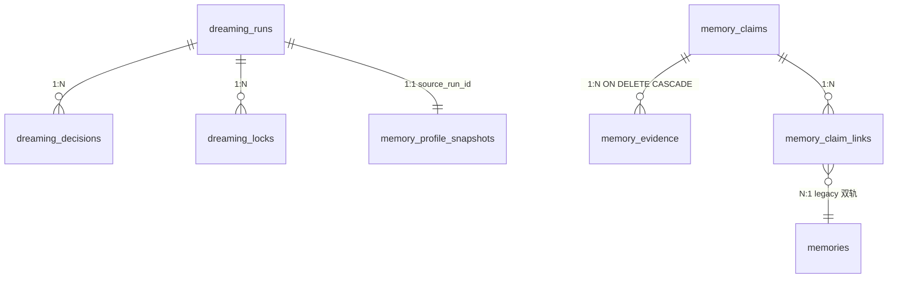
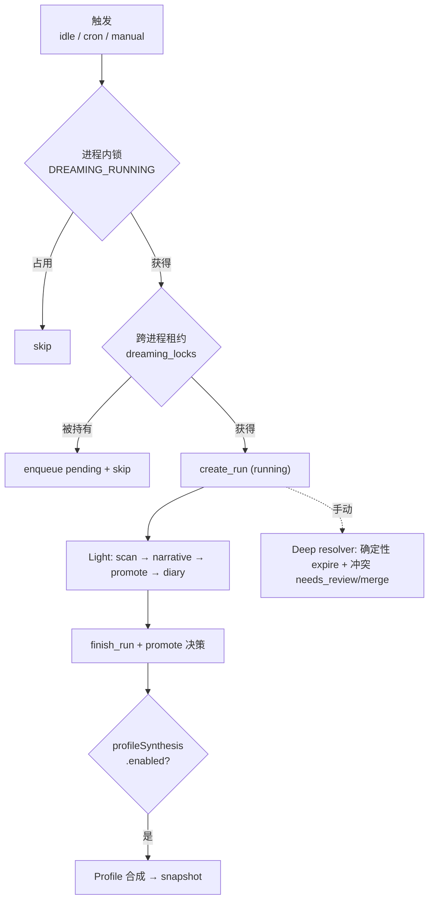

# Dreaming 子系统架构

## 概述

Dreaming 是 Hope Agent 的**离线记忆固化**子系统：在应用空闲、定时或手动触发时，于聊天热路径之外把对话痕迹整理成可审计、可追溯、可纠正的**长期心智**。它分两代能力共存：

- **Light（一代，固化）**：扫描近期 `memories`，用一次 LLM `side_query` 评分提名，把高价值条目 pin 起来并写一篇「Dream Diary」叙事。
- **结构化 claim 层（下一代）**：把记忆从平铺的 `memories` 列表升级为结构化 `memory_claims`（主谓宾三元组 + 证据 + 作用域 + 生命周期），叠加确定性过期 / 冲突 resolver、Memory Profile 合成、Context Pack 注入、以及面向用户的 **Lucid Review** 纠错闭环。

核心设计取向：**离线、可审计、用户掌控、不污染热路径**。所有 consolidation 异步进行，聊天侧只消费预先生成的注入素材；每个系统决策落 `dreaming_decisions` 审计行；用户随时可 approve / edit / reject / forget 任何 claim；无痕会话「关闭即焚」，永不进入任何长期存储。

> 本文是 Dreaming 子系统的单一真相源。记忆召回引擎、Embedding 配置、自动提取等记忆系统通用机制见 [`memory.md`](memory.md)；本文只覆盖 Dreaming 独有的固化 / claim / 注入 / 纠错 / 评测链路。Tauri 命令 ↔ HTTP 路由的完整对照见 [`api-reference.md`](api-reference.md)。

### 设计目标

- 把「记得一堆句子」升级为「维护一组带来源、带时效、带置信度的结构化事实」。
- 每条 active claim 都能追溯到至少一条证据；每个系统动作都有审计记录。
- 时效与冲突可治理：过期自动抑制、冲突进待审而非自动覆盖。
- 控制权归用户：整理结果可被用户纠正，纠正即权威（最高置信度）。

### 非目标（红线）

| 非目标 | 原因 |
|---|---|
| 自动硬删用户记忆 | 删除须显式确认；自动流程只做 `superseded` / `expired` / `archived` / `needs_review` 标记 |
| 阻塞聊天热路径 | 所有 consolidation 异步；聊天只消费预生成的 Context Pack |
| 一次性重写 memory backend | 旧 `memories` 表继续可用，claim 层以双轨增量引入 |
| 无痕会话进入长期记忆 | 「关闭即焚」：不入候选、不入证据、不入 profile、不入统计 |
| 模型自改 `memory.md` / 自改自己的 claim | `memory.md` 是用户 / Core Memory；claim 纠错是纯 owner 平面，无 agent 工具面 |
| evidence 原文直接成为指令 | 证据默认不进 system prompt；文件 / 工具输出须经提取 + sanitize 才能成为 claim |
| 跨 scope 污染 | Project A 的事实不进 Project B；Agent 间独立 |

## 数据模型

所有表与旧 `memories` 同住 `memory.db`（同一 SQLite 文件、同一事务边界，保证 claim + evidence 原子写入）。时间戳统一用**固定宽度 RFC3339 毫秒 + `Z`**（`crate::util::now_rfc3339`），使 `valid_until < now` 之类的字符串比较在词序上单调。

分三组：**Claim 三表**（事实 + 证据 + 双轨同步）、**运行与审计表**（dreaming 运行协调 + 决策日志）、**Profile 快照表**。

### Claim 三表

#### `memory_claims`（结构化事实，schema 见 `sqlite/backend.rs`）

| 列 | 类型 | 含义 |
|---|---|---|
| `id` | TEXT PK | UUID |
| `scope_type` / `scope_id` | TEXT | `global`（id 为 NULL）/ `agent` / `project` |
| `claim_type` | TEXT | `user_profile` / `preference` / `project_fact` / `standing_rule` / `reference` / `task_pattern` |
| `subject` / `predicate` / `object` | TEXT | 结构化三元组（如 `user` / `prefers` / `Chinese`）|
| `content` | TEXT | 人类可读陈述（保留来源语言）|
| `tags_json` | TEXT | JSON 数组 |
| `confidence` | REAL | [0,1]，由 `evidence_class` baseline 推导（默认 0.5）|
| `confidence_source` | TEXT | `derived` / `llm_adjusted` / `user_confirmed` |
| `salience` | REAL | [0,1] 长期价值度，决定注入优先级（默认 0.5）|
| `status` | TEXT | `active` / `superseded` / `expired` / `archived` / `needs_review` |
| `valid_from` / `valid_until` | TEXT | 可选生效区间（RFC3339）；**过期判定核心**见下 |
| `supersedes_claim_id` | TEXT | 指向被本 claim 替代的旧 claim |
| `source_run_id` | TEXT | 生成 / 更新本 claim 的 `dreaming_runs.id` |
| `embedding_signature` | TEXT | 向量签名；为 NULL 时该行从 vec0 KNN 脱落、降级 FTS-only |
| `created_at` / `updated_at` | TEXT | RFC3339 |

索引：`idx_memory_claims_scope(scope_type,scope_id)` / `_status` / `_type` / `_spo(subject,predicate)` / `_updated(updated_at DESC)`。

**effective-status（关键不变量）**：持久化 `status` 恒为底值；读取时由 `claims::write::effective_status(status, valid_until, now)` 派生——`status='active'` 且 `valid_until` 非空且 `valid_until < now`（词序比较）则视为 `expired`，不改存储行。**所有读路径**（list / search / pinned / Context Pack / Active Memory v2 / linked legacy 隐藏）统一走它，过期 claim 永不进 prompt。`is_injectable_status` 仅 `active` 为真。

**FTS5 / 向量旁车**：`memory_claims_fts(content, subject, object)` 外部内容索引，由触发器自动同步、首次从既有行 rebuild；`memory_claims_vec` 是 vec0 虚表，仅在配置 embedding 时懒创建，缺失容错。检索复用混合引擎（FTS5 + vec0 + RRF），但**独立存储**，与记忆主表互不串扰。

#### `memory_evidence`（来源证据）

每条 active claim ≥ 1 条证据（红线：active claim 必可追溯）。`FK(claim_id) → memory_claims ON DELETE CASCADE`，索引 `idx_memory_evidence_claim(claim_id)`。

- `evidence_class`（**闭包 6 值**，决定 confidence baseline，写入时未知值规整为 `assistant_inferred`）：

  | evidence_class | baseline |
  |---|---|
  | `manual_correction` | 1.00 |
  | `user_confirmed` | 0.95 |
  | `explicit_user_statement` | 0.85 |
  | `project_artifact_fact` | 0.75 |
  | `assistant_inferred` | 0.45（默认）|
  | `behavioral_pattern` | 0.35 |

  baseline 由 `claims::write::confidence_baseline` 单一来源给出（有确定性单测）；LLM 只输出标签、不直接定数值。
- `source_type`：`session_message` / `memory` / `file` / `tool_result` / `url` / `recap_facet` / `manual`，配 `source_id` / `session_id` / `message_id` / `file_path` / `url` 锚点。
- `quote`：短摘录（`QUOTE_MAX_CHARS=400` 码点、`logging::redact_sensitive` 脱敏）；`redaction_status ∈ redacted | raw_allowed | anchor_only`（`raw_allowed` 仅限用户自述）。`weight` 默认 1.0（用户纠错证据恒 1.0、最高优先级）。
- **证据不等于 prompt**：system prompt 默认只注入 claim 的 `content`，**不注入 evidence quote**；展开 quote 必经后端授权（见安全章）。

#### `memory_claim_links`（claim ↔ 旧 memory 双轨同步）

`PK(claim_id, memory_id)`，双 FK 级联，索引 `idx_memory_claim_links_memory(memory_id)`。`sync_mode` 三态决定旧记忆的注入是否受 claim 状态牵动：

- `managed`：claim 失活（superseded/expired/archived）时，关联的旧 memory 停止注入（由读时 hidden-set 覆盖）。
- `user_pinned`：用户手动 pin，**不**自动 unpin；claim 状态变化只生成 `needs_review`。
- `detached`：claim 状态永不影响该 memory（backfill 默认用它，保证「不改变现有注入」）。

### 运行与审计表

> 这组表把 Light 一代的进程内 `LAST_REPORT` 快照升级为**可跨进程协调、重启存活、可审计**的持久层。

- **`dreaming_runs`**：每轮运行元数据。`trigger`（`idle` / `cron` / `manual` / `user_correction`）、`phase`（`light` / `deep` / `profile` / `user`）、`status`（`running` / `completed` / `failed` / `skipped`）、`owner_instance_id` + `heartbeat_at` + `lease_expires_at`（跨进程租约）、计数（scanned / nominated / promoted / decision / duration_ms）、`diary_path`。索引 `_started(started_at DESC)` / `_status`。
- **`dreaming_locks`**：跨进程租约。`lock_key`（形如 `light:global`）单行持锁，`lease_expires_at < now` 视为可抢占。进程内另有 `AtomicBool DREAMING_RUNNING` 防同进程重入；二者叠加形成串行保护。
- **`dreaming_decisions`**：机器可读决策流，`FK(run_id) → dreaming_runs ON DELETE CASCADE`，索引 `_run(run_id)`。`decision_type` 按来源分族：Light 写 `promote`（target=memory）；Deep resolver 写 `expire` / `merge` / `needs_review`（target=claim）；Lucid Review 写用户纠错族（`approve` / `reject` / `edit` / `move_scope` / `pin` / `unpin` / `flag` / `forget` / `forget_permanent`，target=claim）。`before_json` / `after_json` 存状态快照供 diff 展示。
- **`dreaming_watermarks`**（`PK(scope_key, source_type)`）/ **`dreaming_pending_sources`**：扫描水位与高频源捕获队列，作为跨进程协调基础设施持久化；当前 Light 扫描走固定时间窗口，水位驱动的增量扫描为预留能力。

### `memory_profile_snapshots`（Profile 快照）

每个作用域一份可注入的 Markdown 档案摘要，按 `version` 单调分层（`UNIQUE(scope_type, scope_id, version)`，`scope_id` 用 `''` 而非 NULL 以避免 UNIQUE 把多个 NULL 视为不同值）。`source_run_id` 追溯生成运行。新版本优先注入；无快照或 Profile 合成未启用时，回退到 legacy `profile`-tagged 记忆渲染（避免「## User Profile」空白）。

### ER 概览

## Pipeline

### 触发与并发保护

| 触发 | 时机 | 默认 |
|---|---|---|
| **Idle** | 应用空闲达阈值（Guardian 心跳 60s 检测，Primary-only） | `idleTrigger.enabled=true`，`idleMinutes=30` |
| **Cron** | 6 字段 cron 表达式（监听 `config:changed` 重排） | `cronTrigger.enabled=false`，`cronExpr="0 0 3 * * *"` |
| **Manual** | Dashboard「Run now」/ owner 命令 | `manualEnabled=true` |

idle / cron 自动周期只跑 **Light 固化 + Profile 合成**（Profile 受 `profileSynthesis.enabled` 门控）；**Deep resolver 仅经手动 `dreaming_run_resolver` 触发**，不进自动周期。

两道串行锁：进程内 `AtomicBool DREAMING_RUNNING`（`try_claim` 失败即 skip）+ 跨进程 `dreaming_locks` 租约（被他进程持有则 skip，高频源可入 `dreaming_pending_sources` 队列）。Primary 启动时 `recover_stale_*` 把过期 `running` 行标 `failed`、删过期锁、回收超期 `claimed` 源；每日 retention 复跑并 GC。

### 三类可运行周期

Dreaming 以三个独立可运行的 cycle 落地（均写 durable run + decision）：

1. **Light 固化**（`pipeline.rs`）：
   - **Scanner**（`scanner.rs`，`spawn_blocking`）：取近 `scopeDays` 天未 pin 的 `memories`（超取后客户端过滤到 `candidateLimit`）；为每条挂证据指针，**incognito 会话 fail-closed 剔除**。
   - **Narrative**（`narrative.rs`，经 `crate::automation::run` 一次性 LLM 调用）：渲染候选 → 要求 JSON 信封 `{promotions:[{id,score,title,rationale}], diary}`；超时 `narrativeTimeoutSecs`；按 `promotion.minScore`（0.75）/ `maxPromote`（5）过滤排序。模型链解析（`resolve_dreaming_chain`，Deep Resolver 复用同一函数）：`modelOverride`（`ModelChain`）→ deprecated `narrativeModel`（`provider:model`，惰性解析）→ `function_models.automation` 全局默认链 → 聊天全局模型；真跨模型降级，详见 [模型 vs Agent 统一配置](automation-model.md)。
   - **Promotion**（`promotion.rs`，`spawn_blocking`）：对存活且未 pin 的记忆 `toggle_pin(true)`。
   - **Diary + Finalize**：写 `~/.hope-agent/memory/dreams/*.md`；`finish_run` + 每条 promotion 写 `promote` 决策。
2. **Deep Resolver**（`resolver.rs`，`dreaming_run_resolver`）：
   - **确定性过期**：扫所有 active claim，`valid_until < now` → `Expire` 决策（纯字符串比较，无 LLM）。
   - **保守冲突分析**：按 `(scope_type, scope_id, claim_type, subject, predicate)` 分组，只取 >1 成员且 ≥2 种不同归一化 object 的组（去重是 Light 的活），每轮最多 `MAX_RESOLVER_GROUPS=50` 组各发一次 `side_query`。LLM 回 `duplicates → Merge`（保留最高置信 + 最新者，存档另一方）/ `conflict → NeedsReview`（**绝不自动 supersede**）/ `independent → no_op`。
3. **Profile 合成**（`profile.rs`，`dreaming_run_profile`，受 `profileSynthesis.enabled` 门控、默认开）：按 scope 取 active claim、按 `confidence × salience` 排序取前 `maxLinesPerScope`（12，排除 `reference` 类）、规则式渲染 Markdown bullet。Idle/Cron 走规则式零 LLM；Manual 额外对每 scope 发一次 `side_query` 重写求流畅（只压缩重组、不创作）。写入 `memory_profile_snapshots`（version=MAX+1）。

## Claim 写路径与 Backfill

### 双写 + canonicalize（`claims::write` / `claims::store`）

自动提取（[`memory_extract.rs`](../../crates/ha-core/src/memory_extract.rs)，受 `extractClaims` 开关控制、**默认开**——claim 与 facts 同一次 side_query 抽取，无额外 LLM 调用）在写旧 `MemoryEntry` 的同时，把 `ClaimCandidate` 经 `write_candidate` 双写：

- **作用域固定为提取上下文的 `default_scope`**（会话 / 提取 API 参数），**不信任 LLM 的 scope hint**（防跨项目路由）。
- **规则式去重**：粗筛 `(scope_type, scope_id, claim_type, subject, predicate)` + Rust 侧 `normalize_object`（折叠空白 + 小写）精确比对；命中 active claim 则合并证据、更新 `updated_at`，否则建新 claim + ≥1 证据。
- `confidence` 由 `evidence_class` baseline 推导；`valid_until` 经 `normalize_valid_until` 规整（完整 RFC3339 / 裸日期 / 带时区都转 UTC+Z；无法解析 → `None`，绝不静默过期）。
- **重嵌时序**：内容变更后 `apply_claim_fields` 置 `embedding_signature=NULL`，随后 `reembed_claim`（须先 drop 写连接——`embed_and_index_claim` 内部再取写锁，writer Mutex 不可重入）。signature 清空使旧向量在自愈前从 KNN 脱落、降级 FTS-only（严格优于返回语义过时匹配）。

### Backfill（旧 memory → claim，`claims::backfill`）

把存量 `memories` 确定性映射为 claim（规则式、无 LLM），在不改变当前注入的前提下让老用户进入 claim 世界：

- 规则映射（`MemoryType → claim_type / subject / predicate / evidence_class`）。
- **低风险自动激活**：仅 pinned 的 `User` / `Feedback` → `active`，其余 → `needs_review`。
- **链接恒 `detached`**：claim 状态永不牵动旧 memory 注入（红线：backfill 不改现有 prompt）。
- `plan_backfill` 干跑（精确计数 + ≤200 行预览）/ `apply_backfill` 实跑（**重新扫描、不信任 plan 列表**，memory 已消失 / 已 link → skip，幂等）。

## 读 API 与注入

### 读 API（`claims::store`）

`list_claims`（scope / status / claim_type 过滤，limit 钳 [1,500]，按 `updated_at DESC`）、`search_claims`（FTS5 + 可选 vec0，RRF 融合，返 effective-active + scope 过滤）、`list_pinned_claims`（effective-active 且 `salience >= min_salience`，按 salience/confidence/updated 排序）、`get_claim`（claim + evidence + links）。状态过滤与 effective-status 对齐：`active` 过滤并入 `valid_until >= now`，`expired` 过滤匹配 `status='expired' OR (active AND valid_until<now)`。

### 系统提示注入（`dreaming::context_pack` / `sqlite::prompt` / `agent::active_memory` / `system_prompt::build`）

claim 与 profile 经三条路径进入系统提示，与 legacy 记忆共存于同一 `# Memory` 段、同一 `effective_memory_budget` 预算池：

1. **Pinned Claims（静态）**：`build_context_pack` 取高 salience（`>= PINNED_MIN_SALIENCE = 0.7`）的 active claim 渲染为 `## Pinned Memory`，由 `build_memory_section` 注入静态 prefix（query-independent，复用首个 cache breakpoint——Anthropic 4 断点已满，不另开块）；每行经 `sanitize_for_prompt` + 截断。
2. **单一来源 dedup**：`covered_by_active_claim_memory_ids`（`hidden_claim_linked` 的正向镜像）把被 active managed claim（salience ≥ 0.7、未过期）覆盖的 legacy memory 从 SQLite 段排除，避免同一事实双份注入。**三道豁免**：`user_pinned` link / `memories.pinned=1` / 非 managed link。**去重阈值与 Pinned 注入阈值对齐（同读 `PINNED_MIN_SALIENCE`）**——低于阈值的 claim 影子继续走 legacy 兜底，绝不丢事实。
3. **Profile 快照**：`render_snapshot_section` 逐行 `sanitize_for_prompt` + 预算裁剪注入 `## User Profile`；无快照回退 legacy profile 段。
4. **Relevant Claims（动态）**：query-dependent，**不进静态 prefix**（否则每轮作废 prompt cache），由 **Active Memory v2** 承担——`ActiveMemoryConfig.include_claims`（per-agent，默认关）开启后 `shortlist_claim_candidates` 按 Project→Agent→Global 调 `search_claims`（effective-active + scope 过滤），与记忆候选合并进召回 prompt（claim 带 `claim:<type>` 标签），LLM 仍选 1 句注入 `## Active Memory`（复用 v1 单条机制）。

预算优先级 **Core > Pinned >（Profile + legacy）**，共享 `total_chars`，不另开预算绕过 4 级体系。**Provider 注入合约**：系统提示在 `build.rs` 统一产出为单串、各段保留标题边界，provider adapter 在消费端按能力拆分（多 cache block / 单 system / 弱 cache 降级）。

## Lucid Review 用户纠错闭环

把整理结果的控制权交给用户。**纯 owner 平面**（Tauri 命令 / HTTP 路由，API key / 本机信任），**无 agent 工具面**——模型不能自改自己的记忆。GUI 走可复用的 `ClaimReviewActions`（Dashboard Needs Review 队列 + Settings `ClaimsBetaView` 详情共用）。唯一编排入口 `claims::review`：

- **`update_claim(ClaimUpdate)`**（PATCH 语义，逐字段可选）：`resolve_update`（纯函数、无 DB、穷举单测）从「当前行 vs 请求」diff 派生主 decision-type，优先级 **status > scope > pin > edit**：
  - status：`active`→`approve` / `archived`→`reject` / `expired`→`expire`（标记过时）/ `needs_review`→`flag`
  - scope：`move_scope`（global 清空 scope_id）
  - pin/unpin：salience 越过 / 退到 `PINNED_MIN_SALIENCE`（pin=0.95 / unpin=0.5）
  - edit：content / subject / predicate / object / tags
  - approve / edit 视为用户确认：置 `confidence_source=user_confirmed`，confidence 提到 0.95（若更低）
- **`forget_claim(claim_id, permanent, note)`**：`permanent=false`（默认）翻 `archived` + 停止 linked legacy 注入，**保留 evidence 作审计**；`permanent=true` 硬删 claim 图谱（claim + evidence + link + vec0）+ 仅其独管的 orphan memory，连 evidence 一起删。

底层原语在 `claims::store`：`claim_edit_state`（读 diff 基线）/ `apply_claim_fields`（**any→any 状态**，区别于 resolver 的 active-gated `set_claim_status`）/ `reembed_claim` / `add_correction_evidence` / `forget_claim`。

红线与副作用：

- **审计**：每个用户动作经 `dreaming::record_user_action` 落一条 `trigger=user_correction` / `phase=user` / `status=completed` 的运行 + 单 decision（`before_json` / `after_json` **完整字段快照**——对称且覆盖三元组 / tags / confidence，可重建整次变更），在 Dashboard 运行历史与流水线 run 并列。审计 best-effort：纠错已成功，审计写失败只 `app_warn!` 不回滚。
- **证据门**：`approve` / `edit` / `reject` / `expire` / `move_scope` 写一条 `weight=1.0`、`raw_allowed` 的纠错证据（approve 用 `user_confirmed`、其余 `manual_correction`）；`pin` / `unpin` / `flag` / `noop` 不写（非事实修正）。
- **事件**：`memory:claim_changed`（每次）+ `memory:review_required`（flag 时）经 EventBus 发出，Dashboard 据此实时刷新。

## 安全与隐私

### 无痕会话零泄漏（fail-closed）

红线：无痕会话内容禁止进入 claim / evidence / profile / 统计。短路点遍布全链：

- **提取**：`memory_extract` 的 `extract_after_turn` / `flush_before_compact` / 空闲提取入口先查 `is_session_incognito`，真则直接返回。
- **扫描 / 证据**：`scanner` 的证据构造 fail-closed——session 元数据缺失 / 已删 / `incognito=true` 都视为不可见，只挂 memory ref、不挂 session ref；`evidence.rs` 的 `evidence_quote` 双门（无 `message_id` 拒、session 不可见拒），即便 quote 已脱敏也永不展开。
- **注入**：incognito 会话整段记忆注入跳过、改注入显式「Incognito Session」指令；Context Pack / Active Memory 同被短路。
- **手动写入工具**：`save_memory` / `update_core_memory` 工具入口同样 fail-closed——`ToolExecContext.incognito` 为真直接拒，与提取路径对称。否则模型可在无痕会话里手动落库 / 改 `memory.md`，绕过「关闭即焚」。

### Scope 隔离

提取时 `resolve_extract_scope` 把会话归到 `Project{id}`（有项目）否则降到 `Agent{id}`（不跳 Global）；读注入时 Context Pack 按显式 scope 列表取并 union，**绝不让 Project A 的事实进 Project B 的 prompt**。

### 来源脱敏与 Prompt 注入防护

- **脱敏**：evidence quote 经 `logging::redact_sensitive`（`sk-*` / `-----BEGIN` / JWT 等）+ 码点截断（不按字节，保护多字节字符）。展开 quote 必经后端授权（验 session 非 incognito + message 存在），前端不可绕过。
- **Sanitize**：`sanitize_for_prompt` 检测 13 种注入模式（`ignore previous instructions` / `system prompt:` / `<|im_start|>` 等），命中替换为 `[Content filtered: ...]`，否则转义特殊分隔符；Pinned Claims 与 legacy 段逐行都过它。
- **证据不升格指令**：只有经提取（`COMBINED_EXTRACT_PROMPT` 验证）的 claim `content` 进 prompt；`file` / `tool_result` / `url` 证据原文不直接成为 standing instruction。

## 配置

`DreamingConfig` 持久化于 `AppConfig.dreaming`（camelCase），完整字段与默认：

| 字段 | 默认 | 含义 |
|---|---|---|
| `enabled` | `true` | 主开关，关闭则所有触发 no-op |
| `idleTrigger.{enabled, idleMinutes}` | `true` / `30` | 空闲触发 |
| `cronTrigger.{enabled, cronExpr}` | `false` / `"0 0 3 * * *"` | 定时触发（6 字段 cron）|
| `manualEnabled` | `true` | Dashboard「Run now」|
| `promotion.{minScore, maxPromote}` | `0.75` / `5` | Light 提名阈值 / 单轮上限 |
| `scopeDays` | `1` | 扫描窗口（天）|
| `candidateLimit` | `50` | 单轮候选上限 |
| `narrativeMaxTokens` | `2048` | narrative side_query token 预算 |
| `narrativeTimeoutSecs` | `60` | narrative 超时 |
| `modelOverride` | `null` | 专用模型链 `ModelChain`；null = 落 `function_models.automation` → 聊天全局模型。deprecated `narrativeModel`（`provider:model`）仍惰性兼容 |
| `profileSynthesis.{enabled, maxLinesPerScope}` | `true` / `12` | Profile 合成 / 每 scope 行数上限 |

GUI 在「设置 → 记忆 → Dreaming」（`DreamingPanel`，含 idle 倒计时与 cron 可视化编辑器）；`ha-settings` 技能可读写同一字段集（风险等级 MEDIUM，登记于 [`skills/ha-settings/SKILL.md`](../../skills/ha-settings/SKILL.md)），二者零偏差。`ActiveMemoryConfig.include_claims`（per-agent，默认关）是 Active Memory v2 的独立开关。

## API / UI 表面

owner 平面命令（Tauri ↔ HTTP 一一对应，**完整签名与语义见 [`api-reference.md`](api-reference.md)**，本表不重复）：

- **Claim 读 / 纠错**：`claim_list` / `claim_get` / `claim_update`（PATCH，`id` 走 path）/ `claim_forget`。
- **Backfill**：`memory_backfill_plan` / `memory_backfill_apply`。
- **运行**：`dreaming_run_now`（Light）/ `dreaming_run_resolver`（Deep）/ `dreaming_run_profile`（Profile）。
- **状态 / 只读**：`dreaming_list_runs` / `dreaming_get_run` / `dreaming_is_running` / `dreaming_last_report` / `dreaming_idle_status` / `dreaming_list_profile_snapshots` / `dreaming_list_diaries` / `dreaming_read_diary`（路径遍历防护）/ `dreaming_evidence_quote`（incognito 归零）。
- **配置**：`get_dreaming_config` / `save_dreaming_config`。

EventBus 事件：`dreaming:cycle_started` / `dreaming:cycle_complete`（payload 含 `runId` / `phase` / `trigger`）、`memory:claim_changed`、`memory:review_required`。

UI：

- **Dashboard → Dreaming Center**（`dashboard/dreaming/`）：运行历史（含 decision + evidence 展开）、Needs Review 队列（`NeedsReviewQueue` + 逐 claim `ClaimReviewActions`）、手动运行按钮（`dreaming_is_running` 时禁用）、idle 倒计时。
- **Settings → 记忆面板**（`settings/memory-panel/`）：`ClaimsBetaView`（claim 列表 + 详情 + backfill 计划 / 应用）、`ProfileSnapshotView`（每 scope 最新快照 + 手动合成）、`DreamingPanel`（全配置）。

## 确定性评测（Golden Fixtures）

Dreaming 靠离线 eval 守红线、不靠感觉。三层避免 LLM 非确定性让 CI 变脆：

| 层级 | 内容 | 默认 CI |
|---|---|---|
| Deterministic | scope 过滤 / 过期抑制 / 证据可追溯 / 冲突进待审 / legacy-sync 隐藏 / 证据 fail-closed | 是 |
| Golden LLM fixtures | claim 抽取 / profile 合成 / 冲突 rationale（固定模型或 mock）| 手动 / nightly |
| Human review set | 真实样本匿名后人工标注 precision/recall | release 前抽样 |

已落地 **deterministic 层**：

- [`memory/dreaming/eval.rs`](../../crates/ha-core/src/memory/dreaming/eval.rs)——fixture 类型 + `load_fixtures()` + `evaluate(backend, fixture)`，经**公共 API 跑真实读路径**（播种 → list / get / 注入候选 / evidence_quote 断言），不重写被测逻辑。
- [`tests/fixtures/dreaming/*.json`](../../crates/ha-core/tests/fixtures/dreaming/)——7 个 fixture：`user_preferences` / `project_scope_isolation` / `temporal_supersede` / `conflict_resolution` / `incognito_exclusion` / `source_evidence` / `legacy_sync`。每个限定**唯一 scope 命名空间**，故共享一个 DB 也互不串扰；`valid_until` 用 `past` / `future` token 解析为固定远端日期，使 CI 与时钟无关。
- [`tests/dreaming_eval.rs`](../../crates/ha-core/tests/dreaming_eval.rs)——集成测试（独立进程独占 claim store global），逐 fixture 跑 `evaluate` 并断言全部 check 通过。
- **契约**：改动 claim 读路径 / effective-status / hidden-set / scope 过滤 / evidence 授权等安全红线时，须在 fixtures 加 case 或保既有绿。

## 与现有子系统的关系

- **[`memory_extract`](../../crates/ha-core/src/memory_extract.rs)**：claim 双写的上游 hook，消费 `add_with_dedup` 三态补 link。
- **Active Memory / Context Pack**（见 [`memory.md`](memory.md)）：claim 注入的承载层；Active Memory v2 把候选扩展到结构化 claim。
- **[Recap](recap.md) / [Awareness](behavior-awareness.md)**：与 Dreaming 同为离线 / 动态注入子系统，各自独立 store，互不折叠。
- **[Side Query](side-query.md)**：Light narrative / Deep 冲突 / Profile 重写都走它，复用主对话 prefix 命中 cache。
- **Session / Evidence 生命周期**：incognito 会话证据永不写入；常规会话删除 / 压缩后 evidence 退化为 `anchor_only`（留锚点、清 quote），claim 仍可保留（≥1 证据锚点）。
- **Project 生命周期**：删除项目时级联清理该 scope 的 **claim 图谱**（claim + evidence + link + vec0 + profile snapshot），与 legacy memory 一并清（`claims::delete_claims_for_scope`）。FK 在 `memory.db` 上未开，故显式 teardown；避免删项目后孤儿 claim 残留在列表 / Lucid Review。

## 关键源文件

| 路径 | 职责 |
|---|---|
| [`memory/dreaming/pipeline.rs`](../../crates/ha-core/src/memory/dreaming/pipeline.rs) | Light 周期编排 |
| [`memory/dreaming/{scanner,narrative,promotion,scoring}.rs`](../../crates/ha-core/src/memory/dreaming/) | Light 各阶段（一代）|
| [`memory/dreaming/{triggers,cron_loop}.rs`](../../crates/ha-core/src/memory/dreaming/) | idle / cron / manual 触发 + 跨进程协调 |
| [`memory/dreaming/store.rs`](../../crates/ha-core/src/memory/dreaming/store.rs) | durable run / 决策日志 / profile 快照 / `record_user_action` |
| [`memory/dreaming/resolver.rs`](../../crates/ha-core/src/memory/dreaming/resolver.rs) | Deep 确定性过期 + 冲突分析 |
| [`memory/dreaming/profile.rs`](../../crates/ha-core/src/memory/dreaming/profile.rs) | Memory Profile 合成 |
| [`memory/dreaming/context_pack.rs`](../../crates/ha-core/src/memory/dreaming/context_pack.rs) | Pinned Claims 静态注入 |
| [`memory/dreaming/evidence.rs`](../../crates/ha-core/src/memory/dreaming/evidence.rs) | 证据 quote 授权读取（fail-closed）|
| [`memory/dreaming/{config,types,eval}.rs`](../../crates/ha-core/src/memory/dreaming/) | 配置 / 共享类型 / 确定性评测调度 |
| [`memory/claims/store.rs`](../../crates/ha-core/src/memory/claims/store.rs) | claim schema + 读 API + 纠错原语 + effective-status |
| [`memory/claims/write.rs`](../../crates/ha-core/src/memory/claims/write.rs) | 双写 + canonicalize + confidence baseline + 归一化 |
| [`memory/claims/backfill.rs`](../../crates/ha-core/src/memory/claims/backfill.rs) | 旧 memory → claim 回填（dry-run / apply）|
| [`memory/claims/review.rs`](../../crates/ha-core/src/memory/claims/review.rs) | Lucid Review：update_claim / forget_claim |
| [`memory/sqlite/{backend,trait_impl,prompt}.rs`](../../crates/ha-core/src/memory/sqlite/) | schema DDL / hidden-set / sanitize + 快照渲染 |
| [`agent/active_memory.rs`](../../crates/ha-core/src/agent/active_memory.rs) | Active Memory v2（claim 候选扩展）|
| [`src/components/dashboard/dreaming/`](../../src/components/dashboard/dreaming/) · [`settings/memory-panel/`](../../src/components/settings/memory-panel/) | Dashboard Dreaming Center + Settings 记忆面板 |
| [`tests/dreaming_eval.rs`](../../crates/ha-core/tests/dreaming_eval.rs) · [`tests/fixtures/dreaming/`](../../crates/ha-core/tests/fixtures/dreaming/) | 确定性评测 + 7 golden fixtures |
