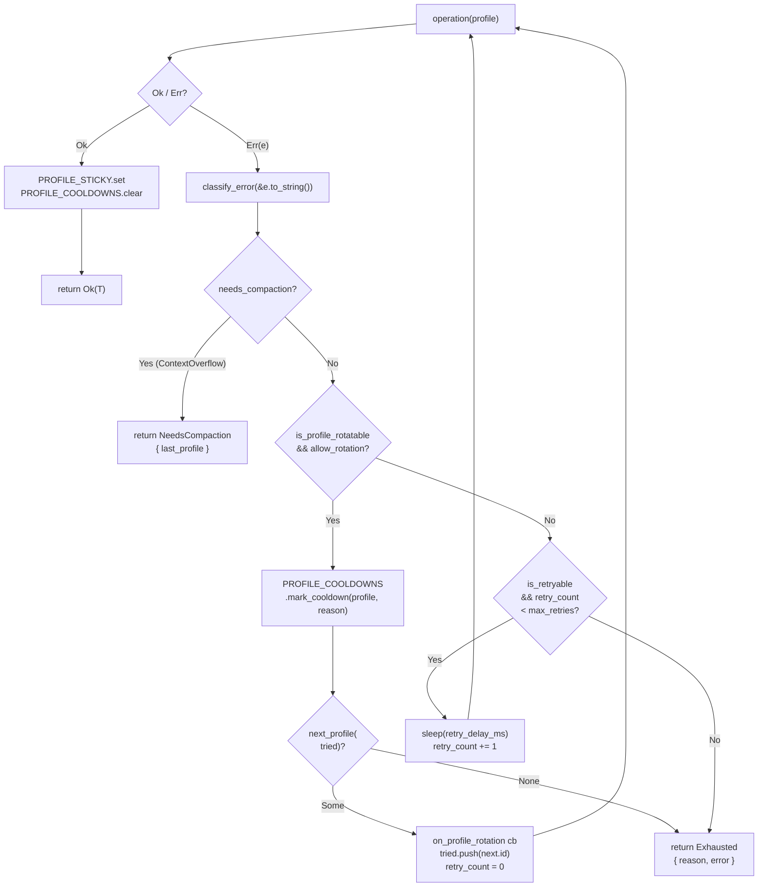

# Failover 系统

> 返回 [文档索引](../README.md) | 关联：[Provider 系统](provider-system.md) · [Chat Engine](chat-engine.md) · [Side Query](side-query.md)

LLM 调用统一的错误分类、同 Provider 多 Key 轮换、退避重试与 ContextOverflow 上交。所有"会发起 LLM 请求"的代码路径（主对话 / side_query / Tier 3 摘要）必须经过 [`failover::executor::execute_with_failover`](../../crates/ha-core/src/failover/executor.rs)，禁止自己手写重试或 profile 选择。

## 三档 Policy

`FailoverPolicy` 控制每个调用点的重试 / 轮换激进程度。三档预设由 `FailoverPolicy::chat_engine_default()` / `side_query_default()` / `summarize_default()` 暴露：

| Policy | `max_retries` | `allow_profile_rotation` | 退避基准 / 上限 | 调用方 |
|---|---|---|---|---|
| `chat_engine_default` | 2 | true | 1000 / 10000 ms | [`chat_engine::engine`](../../crates/ha-core/src/chat_engine/engine.rs) 主对话 |
| `side_query_default` | 1 | true | 1000 / 10000 ms | [`agent::side_query`](../../crates/ha-core/src/agent/side_query.rs) 一次性侧查询 |
| `summarize_default` | 2 | **false** | 1000 / 10000 ms | [`agent::context::summarize_direct`](../../crates/ha-core/src/agent/context.rs) Tier 3 摘要 |

为什么 summarize 关掉 profile 轮换：`DedicatedModelProvider` 已经绑定到一个具体 `provider:model`，用户正在等本轮主对话的回复——这时候为了换 key 多花几秒不如直接 fail 让上层降级到 side_query fallback / emergency compaction。

**Codex 强制不参与 profile 轮换**：executor 内部 `allow_rotation = policy.allow_profile_rotation && provider.api_type != ApiType::Codex`，即使 caller 传 `chat_engine_default()` 也会被强制 false。Codex 走 OAuth out-of-band，`effective_profiles()` 永远空，没有可轮换的目标。

## 错误分类（FailoverReason）

`classify_error(&str)` 把任意 API 错误消息（HTTP 状态码、Provider 厂商错误体、reqwest 传输错误）映射到 8 种语义类别。**全字符串小写匹配**，关键字命中即返回——没有 regex，热路径成本可忽略。

| Reason | 触发关键字（节选） | 行为 |
|---|---|---|
| `ContextOverflow` | `context length exceeded` / `context_length_exceeded` / `prompt is too long` / `token limit` / `input too long` / `request too large` / `max_tokens` + (`exceed` \| `too large`) | **抛出 `NeedsCompaction`**，不参与重试也不参与轮换 |
| `RateLimit` | `429` / `rate limit` / `rate_limit` / `too many requests` / `resource_exhausted` / `throttl` | 退避重试 + 触发 profile 轮换 |
| `Overloaded` | `503` / `overloaded` / `service unavailable` / `temporarily unavailable` / `server_error` / `502` / `521` / `522` / `524` / OpenAI 的 `An error occurred while processing your request...` | 退避重试 + 触发 profile 轮换 |
| `Timeout` | `timeout` / `timed out` / `ETIMEDOUT` / `ECONNRESET` / `ECONNREFUSED` / `ECONNABORTED` / `ENETUNREACH` / `connection reset` / `connection refused` / `connection error` / `network error` / `network unreachable` / `error sending request` / `error trying to connect` / `dns error` / `failed to lookup address information` / `tcp connect error` / `broken pipe` / `error decoding response body` / `error reading a body from connection` / `incomplete message` / `unexpected eof` / `connection closed before message completed` | 仅退避重试，**不**轮换 profile |
| `Auth` | `401` / `unauthorized` / `invalid api key` / `invalid_api_key` / `authentication` / `403` / `forbidden` / `permission denied` | 触发 profile 轮换；Codex 时直接 emit `codex_auth_expired` 让前端引导重授权 |
| `Billing` | `402` / `payment required` / `billing` / `quota` / `insufficient_quota` / `exceeded your current quota` | 触发 profile 轮换 |
| `ModelNotFound` | `404` / `model not found` / `model_not_found` / `does not exist` / `not_found_error` | **不**重试 / **不**轮换，直接跳下一个 fallback model |
| `Unknown` | 上面都不命中 | **不**重试 / **不**轮换，直接跳下一个 fallback model |

判定顺序见 `classify_error()` 实现：`ContextOverflow → RateLimit → Overloaded → Timeout → Auth → Billing → ModelNotFound → Unknown`。前置匹配优先于后置——例如 OpenAI 5xx 文案 "An error occurred while processing your request" 被映射到 `Overloaded` 而不是 `Unknown`，是为了享受 retry-with-backoff。

`Timeout` 故意不算 `is_profile_rotatable`：传输层错误换 key 也救不了，应该退避后重试同一 key（避免一阵抽风把所有 key 全打入 cooldown）。

`is_terminal()` 方法当前永远返回 `false`——历史上 `ContextOverflow` 是 terminal，现在升级为 `NeedsCompaction` 信号让 `chat_engine` 跑紧急压缩后重试，所以 terminal 概念事实上已经废弃。

## 决策流程



## 三种 Executor 出口

`execute_with_failover` 返回 `Result<T, ExecutorError>`，三种失败枚举：

| 出口 | 何时触发 | Caller 行为 |
|---|---|---|
| `Ok(T)` | 操作成功 | 无；executor 已自动 `PROFILE_STICKY.set` + `PROFILE_COOLDOWNS.clear` |
| `Exhausted { last_reason, last_error }` | 所有 retry / 所有 profile 都试过了 / 不可重试错误 | chat_engine 跳到 fallback chain 下一个 model；side_query / summarize 直接返回 |
| `NeedsCompaction { last_profile }` | 任意一次 attempt 命中 ContextOverflow | chat_engine 跑 `emergency_compact()` 后**写回 sticky 同 profile** 再调一次 executor；side_query / summarize 直接报错（无主对话上下文可压） |
| `NoProfileAvailable` | 当前未使用，保留供未来在 attempt 前置 cooldown 检查 | — |

### chat_engine 的 compaction-retry 闭环

`chat_engine::engine` 的双层循环（`for model_ref in fallback_chain { loop { ... } }`）专门为 `NeedsCompaction` 而设计。executor 内部之所以**不**自己跑压缩，是因为：

1. 压缩需要 `&mut AssistantAgent`，而 operation closure 已经借走了 agent
2. 压缩只对主对话有意义——side_query / summarize 没有可压缩的对话历史
3. 压缩完后必须用**同一个** profile 重试，否则前缀缓存失效

chat_engine 的处理是：拿到 `NeedsCompaction { last_profile }` → 重新构造 `compact_agent`（用 `last_profile`）→ `emergency_compact(history)` → `PROFILE_STICKY.set(provider_id, session_id, profile.id)` → `continue` 让 `select_profile` 下一轮命中 sticky → 同 key 再发一次。压缩后 token 数减少，缓存前缀**不变**（Anthropic 的压缩策略保留 `## CompactedContext` 之前的 cache breakpoint），重试零成本撞上。

`MAX_COMPACTION_RETRIES = 1`：连续两次 ContextOverflow（压缩完还溢出）认定该模型上下文窗口实在装不下，跳到 fallback chain 下一个模型。

## Profile 轮换：Cooldown + Sticky

同一个 `ProviderConfig.auth_profiles` 下挂多把 API Key 时，executor 用两个**进程级单例 LazyLock** 维护轮换状态。**只在内存**，重启进程清零——历史失败不应该惩罚下次启动。

### `PROFILE_COOLDOWNS`：失败 Key 的临时拉黑

每条 cooldown 记录是 `(profile_id, until: Instant)`。命中以下错误时按 reason 注入 cooldown：

| Reason | Cooldown 时长 |
|---|---|
| `Overloaded` | 30 秒 |
| `RateLimit` | 60 秒 |
| `Auth` | 300 秒（5 分钟） |
| `Billing` | 600 秒（10 分钟） |
| 其他 | 0（不入 cooldown） |

`profile_cooldown_secs() == 0` 直接 short-circuit，不写 map。`mark_cooldown` 在 map 长度 > 100 时机会性 prune 过期项，避免 unbounded growth。

`filter_available(&[AuthProfile])` 单次 lock 批量过滤——避免 N 次 lock 拉锯（一个 Provider 可能挂 10+ 把 key）。

成功调用时 `PROFILE_COOLDOWNS.clear(profile_id)` 立即解除——上一次 RateLimit 的过期时间不应该限制下一次成功后的下下次请求。

### `PROFILE_STICKY`：会话级 LRU 亲和

`(provider_id, session_id) → profile_id` 映射保证同会话连续多轮命中同一把 key——这对 prompt cache 至关重要：Anthropic 的 ephemeral cache 是 per-key 的，跨 key 等于全价重建。

实现是 per-provider `StickyShard { map: HashMap, order: VecDeque }`：

- `get` 命中后 `promote(session_id)` 把该 session 移到 VecDeque 末尾（最近使用）
- `set` 写入 map + promote；超过 `STICKY_MAX_SESSIONS_PER_PROVIDER = 500` 时 `pop_front()` 仅驱逐**单个**最旧 session

历史 bug：旧实现是 `if map.len() > 500 { map.clear() }`，每次撞顶把所有 stickiness 全擦——长跑进程上 prompt cache 命中率断崖式下跌。LRU 改造后 `test_sticky_map_lru_eviction_preserves_recent` / `test_sticky_map_lru_promotes_on_get` 两个回归测试守住语义。

### `select_profile` 优先级

```text
1. PROFILE_STICKY.get(provider_id, session_id)
   → 若 sticky profile 仍在 effective_profiles 且不在 cooldown，直接用
2. PROFILE_COOLDOWNS.filter_available(effective_profiles).first()
   → 第一个非 cooldown 的 enabled profile
3. None
   → Codex / OAuth Provider 走这条；executor 把 None 透传给 operation
```

`next_profile(provider, tried)` 在轮换时调用，从 available 列表里跳过 `tried` 已经试过的 ID。

## 退避重试：`retry_delay_ms`

指数退避 + 抖动，公式：

```text
delay = min(base_ms * 2^attempt, max_ms)
jitter = rand_in(-delay/10, delay/10)
return max(delay + jitter, 0)
```

三档默认 policy 都用 `base=1000ms` / `max=10000ms`，但实际 sleep 次数受 `max_retries` 约束：`chat_engine_default` / `summarize_default` `max_retries=2` 跑两次 sleep（实测约 `1s ±10%` 然后 `2s ±10%`），`side_query_default` `max_retries=1` 只跑一次（约 `1s ±10%`）。`max_ms=10000` 是给"caller 自定义高 `max_retries`"留的安全 clamp——`retry_delay_ms(10, 1000, 10000)` 才会触发这条上限，default policy 都到不了。`rand_simple()` 用 `SystemTime::now().subsec_nanos() XOR (thread_local_counter * 6364136223846793005)`，避免连续调用同纳秒位时全输出相同抖动值。

## EventBus 信号

profile 轮换由 caller 提供 `on_profile_rotation: Option<&Fn(from, to, reason)>` 回调消费——executor 不直接接触 EventBus / Tauri，保持 ha-core 零依赖。

`chat_engine` 的 callback 行为：

```text
1. app_info!("provider", "failover", "Rotating auth profile ...")
2. emit_stream_event { "type": "profile_rotation", provider_id, model_id, from_profile, to_profile, reason }
```

Codex Auth 失败由 chat_engine 在 `Exhausted { last_reason: Auth }` 出口额外补一条 `{ "type": "codex_auth_expired" }` 让前端弹"重新登录"按钮——OAuth profile 不在常规 profile 池子里，没有"轮换"的概念，必须人工介入。

## 调用方清单

| 调用点 | Policy | 说明 |
|---|---|---|
| [`chat_engine::engine`](../../crates/ha-core/src/chat_engine/engine.rs) | `chat_engine_default` | 主对话；外层套 `for model in fallback_chain` 实现 model fallback |
| [`agent::side_query`](../../crates/ha-core/src/agent/side_query.rs) | `side_query_default` | 通过 `AssistantAgent::with_failover_context(Arc<ProviderConfig>)` 注入；未注入时走 fast path（单次 direct call） |
| [`agent::context::summarize_direct`](../../crates/ha-core/src/agent/context.rs) | `summarize_default` | Tier 3 dedicated summarize 路径，`DedicatedModelProvider` 持有自己的 `Arc<ProviderConfig>` |

新增 LLM 调用点时**必须**走 executor，不要：

- 自己写 retry 循环（重复轮子，错误分类不一致）
- 自己 select profile（绕过 sticky / cooldown，命中 prompt cache 失败）
- 直接 `match err { ... }` 决策（错过 Provider 厂商错误体的关键字匹配）

## 单元测试覆盖

`failover/mod.rs` 测试覆盖：

- 7 类错误的 `classify_error` 命中
- `is_retryable` / `is_terminal` / `is_profile_rotatable` / `profile_cooldown_secs` 决策矩阵
- `retry_delay_ms` 抖动范围
- `ProfileCooldownTracker` 基本读写 + 0-duration short-circuit
- `ProfileStickyMap` LRU eviction 保留近期 / get 触发 promotion
- `select_profile` / `next_profile` 基本路径

`failover/executor.rs` 测试覆盖：

- 首次成功 → sticky 写入
- Auth 错误 → 轮换 → 二次成功 → sticky 指向新 profile
- RateLimit → 重试用尽 → Exhausted
- ContextOverflow → NeedsCompaction 携带 last_profile
- 关闭 rotation 后 Auth 立即 Exhausted
- 所有 profile Auth 全失败 → Exhausted
- ModelNotFound 不重试不轮换
- Codex 即使 caller 传 `allow_profile_rotation=true` 也不轮换
- Unknown 立即 Exhausted
- Timeout 重试后成功
- Billing 轮换两个 profile 后 Exhausted + 双方都进 cooldown
- Sticky 在后续调用上被命中

## 关键源文件

| 文件 | 职责 |
|---|---|
| [`crates/ha-core/src/failover/mod.rs`](../../crates/ha-core/src/failover/mod.rs) | `FailoverReason` 枚举 + `classify_error` + `retry_delay_ms` + `ProfileCooldownTracker` + `ProfileStickyMap` + `select_profile` / `next_profile` |
| [`crates/ha-core/src/failover/executor.rs`](../../crates/ha-core/src/failover/executor.rs) | `FailoverPolicy` 三档预设 + `ExecutorError` + `execute_with_failover<T, F, Fut>` 泛型执行器 |
| [`crates/ha-core/src/chat_engine/engine.rs`](../../crates/ha-core/src/chat_engine/engine.rs) | 主对话 fallback chain + compaction-retry 闭环 + `profile_rotation` / `codex_auth_expired` 事件 emit |
| [`crates/ha-core/src/agent/side_query.rs`](../../crates/ha-core/src/agent/side_query.rs) | side_query 接入 executor 的 fast/slow path 切换 |
| [`crates/ha-core/src/agent/context.rs`](../../crates/ha-core/src/agent/context.rs) | `summarize_direct()` 接入 executor 的 `summarize_default` policy |
| [`crates/ha-core/src/provider/types.rs`](../../crates/ha-core/src/provider/types.rs) | `AuthProfile.id / label / api_key / enabled` + `ProviderConfig.auth_profiles` + `effective_profiles()` |
