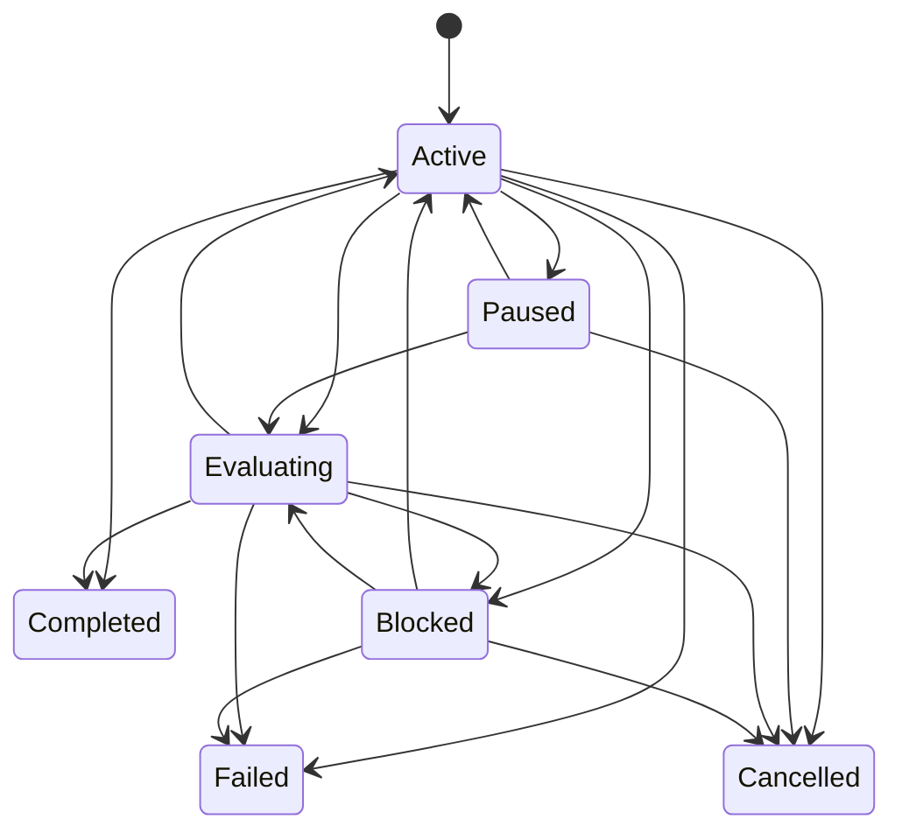

# Goal 控制平面

> 返回 [文档索引](../README.md) | 更新时间：2026-07-08

Goal 是长任务的顶层完成语义：**我要最终达成什么，完成标准是什么，哪些证据证明已经完成**。它位于 Execution Mode 与 Workflow 之上，适用于通用长任务；coding 只是当前最强的使用场景。

## 1. 定位

```text
Goal      = 最终目标、完成标准、预算、证据、最终审计
Mode      = 本会话/目标以多主动、多深入的策略推进
Workflow  = 一次具体、可恢复、可审批、可审计的执行 run
Task      = 用户可见的进度事实
Loop      = 定时、重复触发或条件继续
```

Goal 不直接执行工具，不替代 Workflow，也不表示重复调度。Workflow run 会绑定当前 active Goal，并在终态后把执行结果写回 Goal 证据链。

## 2. 模块边界

| 层 | 代码 | 责任 |
| --- | --- | --- |
| 核心模型 | `crates/ha-core/src/goal/mod.rs` | Goal/GoalEvent/GoalLink 类型、状态机、建表、CRUD、criteria parser、审计器、closure decision、Goal Watchdog 只读诊断。 |
| Agent Goal 工具 | `crates/ha-core/src/tools/goal.rs`、`tools/definitions/goal_tools.rs` | 模型侧 Goal Runtime：状态读取、checkpoint、通用证据、审计、完成请求、阻塞请求。 |
| Chat Engine 集成 | `crates/ha-core/src/chat_engine/engine.rs` | 成功回合后根据 active Goal 状态排自动 continuation wakeup。 |
| Workflow 集成 | `crates/ha-core/src/workflow/db.rs` | `workflow_runs.goal_id`、自动绑定 active Goal、终态后自动 link + audit。 |
| 斜杠命令 | `crates/ha-core/src/slash_commands/handlers/goal.rs` | `/goal` 文本控制面。 |
| Tauri owner API | `src-tauri/src/commands/goal.rs` | 桌面 owner 平面命令。 |
| HTTP owner API | `crates/ha-server/src/routes/goal.rs` | Server/Web owner 平面端点。 |
| GUI | `src/components/chat/workspace/useGoal.ts`、`WorkspacePanel.tsx`、`ChatInput.tsx` | Workspace 独立 Goal section、Goal detail、closure packet、输入框目标模式、composer 上方 active Goal 状态条、创建/更新/暂停/恢复/清除/评估/关闭取舍、证据摘要、Goal Watchdog amber 提示。 |
| 消息完成反馈 | `src/components/chat/message/MessageBubble.tsx` | 从 `goal_finish_request` 工具结果提取 `GoalCompletionReport`，在最终 assistant 总结下方、文件附件上方显示“目标已达成 + 耗时 + tokens”。 |

红线：

- Goal 逻辑必须在 `ha-core`；Tauri / HTTP 只做薄适配。
- Goal v3 有受限 agent 工具面；模型可以读取 Goal、记录 checkpoint/evidence、请求审计、请求完成或阻塞，但不能任意修改 objective/criteria/domain/budget。Goal 创建、更新、暂停、恢复、清除仍由 owner 平面或 `/goal` 控制。
- incognito session 禁止创建 durable Goal。
- 反向也必须成立：存在 open Goal 或 `completed` 但尚未记录 closure decision 的普通会话不能再切成 incognito，避免 durable Goal 证据链和“关闭即焚”语义并存。
- `label` 只用于展示；Goal 与 Workflow 的关系以 `goal_id` / `goal_links` 为准。
- Goal 更新必须走 owner 平面 `update_goal` 或 `/goal <objective>`；更新 objective、completion criteria 或 domain workflow 绑定后 `revision += 1`，清空旧 final audit / closure decision，并让 `blocked` / `evaluating` 回到 `active`，避免旧审计结论污染新目标。
- `goal_finish_request` 是唯一 agent-side 自动关闭入口：它会重跑/校验当前 revision 的 final audit，只有 `status=completed` 且 evidence 未 stale 时才写 `accepted_v1` closure decision。模型不能绕过 audit 直接关闭 Goal。
- Goal Watchdog 是 owner-plane 只读诊断；它不排 wakeup、不修改 Goal、不自动恢复、不批准权限，也不把 active workflow/task/background job 下的等待误报成 runner stuck。

## 2.1 Goal v3 Runtime Contract

Goal v3 对齐 Codex 级自主 Goal 心智：用户设定的是最终结果，模型负责持续推进、维护证据、稳定续跑，并在完成时给出简短清晰的收口。

系统提示在 `# Active Goal` 中注入：

- objective、revision、completion criteria、domain/template、required missing criteria、follow-up pool、budget warning/exhausted。
- Goal Runtime Contract：把 active Goal 当作当前 north star，长任务中不断推进，只有用户修改/暂停/清除/完成或真实阻塞才停止。
- 工具契约：`goal_status` / `goal_checkpoint` / `goal_record_evidence` / `goal_evaluate` / `goal_finish_request` / `goal_block_request`。
- `goal_evidence_incomplete` / `goal_blocked_by_evidence` 不是最终停机；它表示 audit 需要更多证据，runner 和模型应继续补证据。

Agent 工具面：

| 工具 | 能力 | 写入 |
| --- | --- | --- |
| `goal_status` | 读取 active Goal compact snapshot：objective、revision、criteria、audit、evidence、budget、tasks、workflow runs、latest events。 | 无。 |
| `goal_checkpoint` | 记录长任务 milestone/handoff/risk/blocked attempt。 | `goal_events(kind='goal_checkpoint')`。 |
| `goal_record_evidence` | 记录通用场景证据：source cited、claim checked、user decision、artifact reviewed、data quality checked、draft approved、meeting context 等。 | `goal_links(target_type='general')` + `goal_linked` event。 |
| `goal_evaluate` | 运行 deterministic final audit，返回 missing/blockers/nextEvidenceNeeded/report。 | `goal_evaluated`，并更新 `final_evidence_json`。 |
| `goal_finish_request` | 请求完成；内部必须校验 current audit pass，成功后写 `accepted_v1` closure，并返回 `GoalCompletionReport`。 | `goal_finish_requested`、`goal_closure_decided`。失败时写 `goal_finish_rejected`。 |
| `goal_block_request` | 请求阻塞；必须带 reason + attempted。重复同 fingerprint 3 次后才自动 block；若明确需要用户输入或外部状态，可立即 block。 | `goal_block_requested`，必要时 `goal_state_changed(to='blocked')`。 |

红线：

- incognito session 不注入 durable Goal 工具效果；工具执行层 fail-closed。
- `goal_finish_request` 不接受模型自评，必须依赖 `evaluate_goal` 规则审计和 current revision evidence。
- `goal_block_request` 不能作为“任务难”的退出口；没有真实用户/外部阻塞时必须经过重复 blocker fingerprint。
- `goal_record_evidence` 只能记录已观察/已产出/已收到的证据，不能伪造 coding diff、validation 或 connector 结果。
- `goal_record_evidence.metadata` 是小型结构化补充信息，执行层强制限制在 16KB 内；大文档、大工具输出和外部原文必须保存在对应 artifact/source 里，只把引用和摘要链到 Goal。

## 2.2 Goal Runner v3

Goal Runner 复用 `wakeup` 自调度与 parent-injection 管线，而不是在 chat engine 内递归重入：

1. `run_chat_engine` 在 assistant 最终消息写入 DB、stream lifecycle 完成、`ChatTurnStatus=Completed` 后调用 `maybe_schedule_goal_continuation`。
2. Runner 先运行一次 deterministic post-turn evaluator：写 `last_evaluator_result_json`，追加 `goal_runner_evaluated` timeline event，记录 `status`、`summary`、`missing`、`blockers`、`nextEvidenceNeeded`、`turnId`、`assistantMessageId`、`source`。这一步不直接把 Goal 改成 `completed` / `blocked`，避免把普通进行中的目标误染成终态；正式 closure 仍必须走 `goal_finish_request` / final audit。
3. 若存在 active Goal 且仍需推进，排一个 10 秒 wakeup。wakeup 会等前台空闲，通过共享注入管线发送 `<goal-continuation>` note，让模型开启下一轮。
4. continuation note 要求模型先调用 `goal_status`，再决定继续执行、`goal_finish_request` 或 `goal_block_request`；`goal_status` 会返回 `latestEvaluator`，让模型知道上一轮后置检查的结果和下一步证据需求。
5. 同一个 `turn_id` 只会排一次；同一 Goal revision 最多排 20 次，超过后写 `goal_auto_continue_halted`，避免无限自激活。
6. `paused` / `completed` / `failed` / `cancelled` / 真实 blocker / budget exhausted 不排续跑；用户中断的 turn 在 chat engine 层不会进入 runner，因为只有 `ChatTurnStatus::Completed` 才会调用 `maybe_schedule_goal_continuation`。
7. 若当前会话存在 active background job（`queued` / `running` / `cancelling` / `awaiting_approval`，包括后台工具、subagent projection、approval parked job），runner 只保留 post-turn evaluator 记录，写 `goal_auto_continue_waiting_background_jobs`，不额外排自激活；等待后台 job 完成注入或用户处理后再由下一轮继续，避免和长任务/审批互相踩踏。
8. `goal_evidence_incomplete` 和 `goal_blocked_by_evidence` 属于“继续补证据”的 open 状态，runner 可以继续排续跑。
9. Stop-rule 回归测试锁住核心边界：同一 turn 去重、暂停停止、turn budget exhausted 停止、subagent 不触发主 Goal、completed final audit 停止、不可恢复 blocked 停止、可恢复 evidence-blocked 继续；`goal_block_request` 工具级测试锁住“同 fingerprint 重复 3 次才 block”和“明确需要用户/外部状态立即 block”。

这个设计继承现有 wakeup 的稳定性：

- 空闲门控：不会插入正在运行的前台 turn。
- 重启恢复：非 incognito wakeup 可持久化并 replay。
- 会话删除/无痕焚毁：统一由 wakeup/session cleanup 清理。
- UI 体验：当前 turn 先完成、显示结果，再短延迟自动继续，避免用户看到同步递归导致的卡死。

V3.6 起，`goal_runner_persists_continuation_wakeup_for_restart_replay` 锁住 active Goal restart 的 durable 前半链：`maybe_schedule_goal_continuation` 成功后，`goal_auto_continue_scheduled` event 的 `wakeupId` 必须对应一条 pending wakeup row，row 内保留 `<goal-continuation>` note、session、agent 和 goal id。`goal_runner_waits_for_background_jobs_then_recovers_after_restart_replay` 进一步锁住等待后台任务 / 审批 parked job 的恢复边界：runner 在 `running` / `awaiting_approval` active background job 存在时只写 `goal_auto_continue_waiting_background_jobs`、不排 continuation；启动恢复经 `async_jobs::JobManager::replay_pending()` 把不可恢复 active job 标为 `interrupted` 后，下一轮可以重新排出 durable continuation wakeup。该组测试证明重启前状态足以被 `wakeup::replay_pending()` re-arm，且后台等待态不会永久卡住 Goal Runner；真实跨进程重启、真实注入和 GUI 长跑仍归 V3.6 strict proof route。

V3.6 的 Goal restart/resume 验收口径与 Workflow 一致，采用 durable conservative recovery：Goal 自身、completion criteria、evidence、pending wakeup、background job 等状态必须持久可读；重启后不允许静默完成或静默丢失，也不允许自动重跑无法证明幂等的外部动作。若被系统杀掉的后台命令无法透明续跑，可以记录 `interrupted` 并让 Goal Runner、final audit 或 watchdog 把目标维持在继续推进、阻塞待处理或等待审批的用户可行动状态。透明续跑 OS 进程和自动安全重试是后续增强，不作为 V3 关闭的必要条件。

### 2.2.1 Goal Watchdog

`SessionDB::list_goal_watchdog_findings(session_id, stale_secs)` 是 V3.6 高可用专项的只读诊断面，用于发现“Goal 按 runner 规则仍应继续，但最近没有活动”的状态。

判定流程：

1. 只检查当前 session 的 active / pending closure Goal；没有 Goal 返回空。
2. 先复用 `goal_runner_should_continue(snapshot)`，因此 `paused` / `completed` / `failed` / `cancelled` / 真实不可恢复 blocker / budget exhausted / accepted v1 都不会被标记。
3. 若 Goal 关联的 workflow run 处于 `awaiting_approval` / `running` / `awaiting_user` / `paused` / `recovering`，或有 `in_progress` task，或当前 session 有 active background job，则返回空；这些状态本身已经在 Workflow / Task / Background Job 面板可观察，不能重复报 Goal stuck。
4. 最近活动时间取 Goal `updated_at`、所有 Goal event `created_at`、关联 workflow run `updated_at`、session task `updated_at` 的最大值。
5. 最近活动超过 `stale_secs`（默认 300 秒）时返回一条 `GoalWatchdogFinding`：
   - `goal_no_recent_progress`：Goal 仍应继续但无新进展。
   - `goal_stale_evaluating`：Goal 处于 evaluating 且无新进展。

Tauri / HTTP / GUI 均暴露这个读模型。Workspace 的 Goal section 会用 amber “有目标需要确认”提示和“评估”动作暴露问题；该动作只是调用 `evaluate_goal`，不会自动续跑或修复。

## 2.3 Completion Report 与 GUI Footer

`GoalCompletionReport` 是 Goal v3 的完成收口结构：

| 字段 | 说明 |
| --- | --- |
| `goalId` / `sessionId` / `revision` / `objective` | 完成对象。 |
| `state` / `status` | Goal 状态与 audit 状态。 |
| `summary` | 模型传入或 final audit 生成的用户可读摘要。 |
| `usage` | `GoalBudgetSnapshot`：tokens、elapsed seconds、turns、warnings/exceeded。 |
| `evidenceCount` | 完成时 evidence 数量。 |
| `achieved` / `missing` / `blockers` | final audit 摘要数组。 |
| `followUpItems` | 非阻塞后续项。 |
| `remainingRisk` | 诚实残余风险。 |
| `generatedAt` | 报告生成时间。 |

GUI 从 `goal_finish_request` 的 tool result 解析 `GoalCompletionReport`，在最终 assistant 总结下方、文件附件上方渲染“已在 X 内达成目标 · Y tokens”。这条 completion note 是产品层生成的完成说明，而不是模型正文的一部分：精确 token usage 通常要等最终 assistant 消息落库后才可用，因此 GUI 会在 report 的 `tokensUsed` 为 0 时用最终消息的 `lastInputTokens + outputTokens` 兜底，避免模型猜测或输出 stale usage。

Goal budget / completion usage 由 `build_goal_budget_snapshot` 统一派生：只统计 Goal `created_at` 之后的 session messages，turn 数只按 user message 计数，token 数按每条消息 `tokens_in_last` 优先、缺失时回退 `tokens_in`，再加 `tokens_out`；`completed_at` 存在时用它固定 elapsed，否则用当前时间。V3.6 的 `goal_budget_usage_counts_post_goal_turns_and_last_round_tokens` 锁住这个口径，防止把 Goal 创建前的历史 token 算入当前目标，或把累计 input token 误当最后一轮 usage。

## 3. 数据模型

Goal 数据落在 `sessions.db`，跟随 session 级联删除。

### `goals`

| 字段 | 说明 |
| --- | --- |
| `id` | `goal_*` id。 |
| `session_id` | 所属 session。 |
| `objective` | 用户写下的最终目标。 |
| `completion_criteria` | 用户写下的完成标准，多行文本。 |
| `revision` | Goal 修订号，从 1 开始；objective / criteria / domain workflow 绑定变更时自增。 |
| `domain` | 可选通用任务领域，如 `research` / `writing` / `data_analysis`；为空表示自由目标。 |
| `workflow_template_id` / `workflow_template_version` | 可选 domain workflow template 绑定。绑定后 Workflow 创建器默认推荐该模板，Context Retrieval / Domain Quality 优先使用它。 |
| `workflow_task_type` | 可选 template task type，如 `technical_research` / `prd` / `metric_diagnostic`。 |
| `state` | `active` / `paused` / `evaluating` / `completed` / `failed` / `cancelled` / `blocked`。 |
| `mode_snapshot` | 创建 Goal 时的 session `execution_mode` 快照。 |
| `budget_token_limit` / `budget_time_limit_secs` / `budget_turn_limit` | 可选预算字段；`0`/空表示不设限，正数参与预算观测、告警和新 workflow hard stop。 |
| `final_summary` | 最近一次 final audit 摘要。 |
| `final_evidence_json` | 最近一次 audit 的结构化结果。 |
| `blocked_reason` | `blocked` 原因。 |
| `last_evaluator_result_json` | 最近 evaluator 原始结果。`goal_finish_request` / manual final audit 会与 `final_evidence_json` 同步；post-turn runner evaluator 只更新此字段并写 `goal_runner_evaluated`，不改变 final audit closure gate。 |
| `closure_decision` | 用户关闭取舍：`accepted_v1` / `needs_strict_evidence` / `cancelled` / `superseded`。为空表示尚未确认。 |
| `closure_reason` | 用户取舍说明。 |
| `closed_at` | 目标真正关闭的时间；`needs_strict_evidence` 不写 `closed_at`，因为目标仍需继续补证据。 |
| `follow_up_json` | goal-scoped 后续项池，记录 `id`、`text`、`created_at`、`source`。 |

同一个 session 同时只允许一个 open Goal：

```sql
UNIQUE(session_id) WHERE state IN ('active','paused','evaluating','blocked')
```

此外，`completed AND closure_decision IS NULL` 被视为“等待用户关闭取舍”的 pending Goal：它不进入上述唯一索引，但 `create_goal`、`get_active_goal` 和 incognito 切换守卫都会把它当成仍需处理的 durable Goal。

### `goal_events`

| 字段 | 说明 |
| --- | --- |
| `id` | 自增 row id。 |
| `goal_id` | 所属 Goal。 |
| `seq` | Goal 内单调序号。 |
| `kind` | `goal_created`、`goal_state_changed`、`goal_linked`、`goal_evaluated` 等。 |
| `payload_json` | 事件载荷，超过 64KB 会截断为 preview。 |
| `created_at` | 时间戳。 |

`goal_events` 维护 `(goal_id, seq)` 与 `(goal_id, kind, seq)` 索引；后者用于长时间线下快速查找最新 `goal_linked` marker，支撑 `audit_stale` 和 closure gate。

### `goal_links`

| 字段 | 说明 |
| --- | --- |
| `goal_id` | 所属 Goal。 |
| `target_type` | `workflow_run` / `validation` / `diff` / `file` / `artifact` / `diagnostic` / `review` / `worktree`；预留 `task`。 |
| `target_id` | 被关联对象 id。 |
| `relation` | `execution_run`、`repair_run`、`workflow_completed`、`workflow_failed`、`workflow_blocked`、`validation_passed`、`validation_failed`、`diff_snapshot`、`file_changed`、`artifact_created`、`diagnostic_result`、`review_passed`、`review_completed`、`review_finding`、`worktree_attached` 等。 |
| `metadata_json` | 关联时的状态、kind、origin、blocked reason、op key、summary、changed files、line delta、artifact path/hash、diagnostic severity/range、worktree path/state/base/dirty snapshot/handoff 时间等摘要。 |

`GoalSnapshot` 额外派生 GUI 友好字段，不单独落表：

| 字段 | 说明 |
| --- | --- |
| `audit_stale` | `final_evidence_json.goalRevision` 与当前 `revision` 不一致，或 final audit 记录的 `goalLinkedEventSeq` 之后出现新的 `goal_linked` 证据事件时为 true；旧库或旧 audit 没有 revision 也会被视作 stale。旧 audit 没有 seq 时回退用 `evaluatedAt` 比较。该判定直接查询 DB 最新 `goal_linked` marker，不依赖 snapshot 截断后的 timeline，避免长任务事件过多时漏判。 |
| `criteria_items` | 从 completion criteria 派生的结构化 item：`id`、`text`、`kind(required/optional/follow_up)`。 |
| `criteria` | 从 criteria item 派生出的逐条审计状态：`satisfied` / `missing` / `blocked`，并带 kind、reason、evidence ids。 |
| `evidence` | 从 `goal_links` + completed tasks 汇总出的结构化证据列表。 |
| `timeline` | goal events、workflow runs、关键 evidence 的合并时间线，供 Workspace 展开详情使用。 |
| `budget` | token/time/turn 使用量、ratio、warning/exhausted 状态和 exceeded kinds。 |

## 4. 状态机

`GoalState::can_transition_to()` 是状态转换单一真相源。



`completed` / `failed` / `cancelled` 是状态机终态；`blocked` 不是终态，用户可恢复或重新评估。

Goal closure 有两条受控路径：

- `goal_finish_request`：agent-side 自动完成入口。内部会重跑或校验当前 revision 的 final audit；只有 `status=completed`、revision 匹配且没有更新 evidence 导致 stale 时，才调用 closure path 写入 `accepted_v1`。成功返回 `GoalCompletionReport`，供模型做诚实收口参考，并供 GUI 渲染最终 completion note；最终 token usage 由 GUI 在消息 usage 落库后兜底补齐。
- `close_goal`：owner action，用于用户手动取舍、取消或替代目标。

Closure decision：

- `accepted_v1`：保留 / 进入 `completed`，写 `closed_at`，可把 audit 中的 follow-up 项落入 `follow_up_json`。后端只允许在当前 revision 的 final audit `status=completed` 且没有更新证据导致 stale 时接受，避免用户、API 或模型误把未审计的新证据链关闭。
- `needs_strict_evidence`：把 Goal 拉回 `blocked`，写 `blocked_reason` 与 `closure_decision`，不写 `closed_at`。
- `cancelled` / `superseded`：进入 `cancelled`，写 `closed_at` 与对应 decision；`clear_goal` 也走 `cancelled` closure decision，而不是只改 state。

模型不能任意调用 `close_goal` 或直接写状态；agent 只能通过 `goal_finish_request` 间接关闭。已经 sealed 的终态 Goal（`failed` / `cancelled` / `completed` 且已有 closure decision）不能再被后续 closure action 改回 open 状态。

## 5. Workflow 集成

`workflow_runs` 增加 `goal_id TEXT` 与 criteria 绑定快照：

- `create_workflow_run` 若显式传 `goal_id`，会校验它与 run 属于同一 session。
- 若不传 `goal_id`，后端会自动绑定当前 session 的 open Goal 或 pending closure Goal。
- `create_workflow_run` 可选 `goal_criterion_id` / API `goalCriterionId`；传入后会校验该 id 属于绑定 Goal 当前 revision，并把 `goal_criterion_id/text/kind/goal_revision` 写入 run。传了 criteria 但没有可绑定 Goal 时 fail-closed。
- 创建 run 后写 `goal_links(relation='execution_run' | 'repair_run')`。
- run 进入终态后写 `workflow_completed` / `workflow_failed` / `workflow_cancelled` / `workflow_blocked` link。
- workflow creation / terminal evidence metadata 带 `goalCriterion`，Goal audit 优先按 `criteria_items.id` 聚合；绑定到某条 criteria 的失败只阻塞该 criteria，未绑定失败仍按全局 blocker 处理。
- run 进入 `completed` / `failed` / `blocked` 后 best-effort 触发 `evaluate_goal`。
- `workflow.validate` op 结束后写 `validation_passed` / `validation_failed` evidence。
- `workflow.diff` op 结束后写 `diff_snapshot`，并为最多 50 个 changed file 写 `file_changed` evidence。
- `workflow.finish({ artifact | artifacts })` 结束后写 `artifact_created` evidence，记录产物 id/path/title/kind/hash 等摘要。
- `workflow.evidence.record(...)` 可写通用 `domain_evidence`，记录来源、用户决策、数据质量、引用审计等非 coding 证据，并保留 workflow run/op provenance。
- workflow 内 `workflow.tool({ name: "lsp", args: { action: "diagnostics" | "sync_file" } })` 结束后写 `diagnostic_result` evidence；error 级诊断是 hard blocker，后续 passing validation 或 clean diagnostics 可解除较早诊断 blocker。
- 绑定 `worktree_id` 的 workflow 创建后写 `worktree_attached` evidence；Managed Worktree 创建、反向绑定、归档、恢复、交接时会 best-effort 刷新同一 evidence metadata，记录 `state`、`pathExists`、`baseRef/baseSha`、`dirtySnapshot`、`handedOffAt` 等。
- Review Engine 完成后写 `review_passed` / `review_completed`；P0/P1 open finding 写 `review_finding`，finding 状态变更会刷新 link metadata。
- Smart Verification 完成后写 `validation_passed` / `validation_failed` / `validation_completed`；只有 `validation_passed` 是 strong completion evidence，`validation_completed` 只表示已完成验证选择。
- 创建新 workflow 前会检查绑定 Goal 的 budget；若 token/time/turn 任一正数上限已耗尽，拒绝创建新 run，并写一次 `budget_warning(level='exhausted')`。

这保证 Goal 不依赖聊天文本反扫，而是通过 durable workflow snapshot、task 和 validation evidence 做审计。

Loop schedule 同样可绑定 criteria：

- `create_loop_schedule` 可选 `goal_criterion_id` / API `goalCriterionId`；传入后校验并写入 `loop_schedules.goal_criterion_id/text/kind/goal_revision`。
- Loop 创建、trigger、run terminal evidence metadata 带 `goalCriterion`。
- `execution_strategy=workflow` 派生的 WorkflowRun 继承 Loop 的 `goal_criterion_id`，形成 `Goal -> Loop -> WorkflowRun -> evidence` 的连续链路。

## 6. Evaluator v2 与 Final Audit

Evaluator v2 是确定性规则门禁，输入为：

- Goal objective。
- completion criteria。
- Goal domain / workflow template / task type。
- linked workflow runs。
- session tasks。
- `goal_links` 中的 workflow / validation / diff / file / artifact / diagnostic / review / worktree evidence。
- workflow blocked/failed/cancelled 状态。
- budget snapshot。

输出写入 `final_evidence_json`：

| 字段 | 说明 |
| --- | --- |
| `status` | `completed` 或 `blocked`。不写 `partial`，避免 UI 和状态机语义漂移。 |
| `summary` | 审计摘要。 |
| `blockedReason` | `goal_evidence_incomplete` / `goal_blocked_by_evidence` / `goal_budget_exhausted`。 |
| `goalRevision` | 本次审计对应的 Goal revision。 |
| `goalLinkedEventSeq` | 本次 final audit 覆盖到的最后一个 `goal_linked` event seq；由 DB 聚合查询生成，不依赖 snapshot 事件数量；后续若出现更大的 `goal_linked` seq，snapshot 会派生 `audit_stale=true`。 |
| `evaluatedAt` | 本次 final audit 写入时间；作为旧 audit 没有 `goalLinkedEventSeq` 时的 fallback stale 基准。 |
| `auditStale` | 新写入的 audit 固定为 false；读取旧 audit 时由 snapshot 根据 revision 与后续 evidence link seq 派生 stale。 |
| `criteriaItems` | parser 派生出的 `required` / `optional` / `follow_up` 标准。 |
| `achieved` | 已达成项。 |
| `missing` | 缺少证据或未完成项。 |
| `optionalMissing` | 可选项缺口；不阻塞当前 Goal 关闭。 |
| `blockers` | 明确阻塞项。 |
| `criteriaStatus` | 逐条 completion criteria 的状态、原因和 evidence ids。 |
| `evidence` | workflow / validation / diff / file / artifact / diagnostic / review / worktree / task 证据。 |
| `nextEvidenceNeeded` | 下一步需要补的证据，如 final verification、repair workflow、criterion evidence、budget 扩容。 |
| `followUpItems` | 从 `follow_up` criteria 和已有 goal follow-up pool 汇总出的后续项；不阻塞当前 Goal。 |
| `closure` | 当前用户 closure decision、reason、closedAt，以及是否仍需用户确认。 |
| `budget` | 本次 audit 使用的预算快照。 |
| `ruleGate` | 规则门禁结果、hard blocker evidence ids、strong evidence ids、LLM auditor 跳过原因。 |
| `remainingRisk` | 剩余风险说明。 |

判定原则：

- 没有 workflow/task/evidence → `blocked`。
- `validation_failed` 只能被更新的 `validation_passed` 覆盖；workflow failed/blocked/cancelled 只能被更新的 `workflow_completed` 或 `validation_passed` 覆盖。
- diff/file 只能作为实现证据，不能单独完成 Goal；必须至少有 `workflow_completed`、`validation_passed` 或 `task_completed` 这类 strong evidence。
- `worktree_attached` 是执行环境证据，用于说明改动落点、隔离状态、path 是否存在和 handoff 状态；它是 positive contextual evidence，但不是 strong completion evidence，不能单独完成 Goal。
- `required` completion criteria 没有 strong supporting evidence → `blocked`。
- `optional` criteria 缺证据只进入 `optionalMissing`，不阻塞当前 Goal。
- `follow_up` criteria 缺证据进入 `followUpItems`，不阻塞当前 Goal。
- budget exhausted → `blocked`，且新 workflow create hard stop。
- 无 blocker、无 required missing 且有 strong evidence → `completed`。若用户尚未接受关闭，GUI / prompt 仍把它视作 pending closure，而不是彻底结束。

可选 LLM auditor 当前不启用；`ruleGate.llmAuditor.status='skipped'`，后续只能在 hard blocker 通过后补 rationale，不能覆盖规则结果。

## 7. Owner API 与事件

Tauri 与 HTTP 保持对齐：

| Tauri command | HTTP |
| --- | --- |
| `get_active_goal` | `GET /api/sessions/{sessionId}/goal` |
| `list_goal_watchdog_findings` | `GET /api/sessions/{sessionId}/goal/watchdog?staleSecs=300` |
| `create_goal` | `POST /api/sessions/{sessionId}/goal` |
| `get_goal` | `GET /api/goals/{goalId}` |
| `update_goal` | `PATCH /api/goals/{goalId}` |
| `pause_goal` | `POST /api/goals/{goalId}/pause` |
| `resume_goal` | `POST /api/goals/{goalId}/resume` |
| `clear_goal` | `POST /api/goals/{goalId}/clear` |
| `evaluate_goal` | `POST /api/goals/{goalId}/evaluate` |
| `close_goal` | `POST /api/goals/{goalId}/close` |
| `append_goal_follow_up` | `POST /api/goals/{goalId}/follow-ups` |

EventBus：

| 事件 | 来源 |
| --- | --- |
| `goal:created` | Goal 创建。 |
| `goal:updated` | Goal 状态或 audit 更新。 |
| `goal:event` | Goal event append。 |
| `goal:link_updated` | Goal link upsert。 |
| `goal:event(kind='budget_warning')` | 预算接近上限或耗尽时写入，payload 含 `kind` / `level` / `budget`。 |
| `goal:event(kind='goal_closure_decided')` | 用户接受 v1、要求严格证据、取消或替代目标。 |
| `goal:event(kind='goal_follow_up_added')` | 用户从输入框或 Workspace 把非阻塞后续项加入 durable follow-up pool。 |

前端 `useGoal` 监听 Goal 与 Workflow 事件，并做 250ms debounce refresh；每次刷新 active Goal 时会 best-effort 同步 `list_goal_watchdog_findings`，诊断读取失败只清空提示，不影响 Goal 主状态展示。

## 8. 用户入口

### Slash

```text
/goal <objective> --criteria <completion criteria>
/goal
/goal status
/goal pause
/goal resume
/goal evaluate
/goal accept
/goal strict
/goal clear
```

`/goal` / `/goal status` 返回简洁 markdown 状态卡，而不是内部命令帮助：显示 state、revision、required criteria 进度、耗时、tokens、turns、workflow/task/evidence 数、closure 状态、objective、逐条 required criteria 状态，以及 latest evaluator 的 status / reason / missing / blockers / next evidence。Slash history 中 `/goal ...` 的用户行以 Goal 模式气泡展示：保留原始 command metadata，但气泡正文不显示 `/goal` 前缀。

### GUI

Workspace 内有独立 Goal section；Goal 不再藏在 Workflow 区域里：

- 无 active Goal：可直接创建 objective + completion criteria，可选 domain workflow template 与 task type；默认“自由任务”。
- 有 active Goal：展示目标摘要、状态、domain/template/task type、workflow/task/evidence 指标，并支持编辑 objective / completion criteria / domain workflow 绑定；completion criteria 文本编辑器会即时预览 parser 派生出的 required / optional / follow-up item，后端 parser 仍是 durable 真相源。
- 点击 active Goal section 可展开 Goal detail，查看 criteria 覆盖、预算、下一步证据、结构化 evidence、timeline、workflow/task 摘要。
- 若存在 `worktree_attached` evidence，Goal detail 会显示 Worktrees 区块，直接展示改动落点、worktree state、path 是否存在、base、dirty snapshot 与 handoff / run 关联。
- 若存在 `domain_evidence`，Goal detail 会显示「领域证据」分组，展示 domain、evidence type、source URL/path/dataset、confidence、access scope、connector/account、redaction status、导出前复核提示与 workflow run/op provenance。
- audit 后展示 final summary、blocked reason、missing/blocker/achieved 摘要。
- 操作按钮：编辑、评估、暂停/恢复、清除。
- Goal detail 的「关闭取舍」区块显示 revision、required criteria 进度、follow-up 数量、audit stale 状态和 closure decision；用户可点击「接受 v1 关闭」或「要求严格证据」。`audit_stale=true` 或 final audit 未完成时，GUI 会禁用「接受 v1 关闭」，后端也会 fail-closed。
- 「接受 v1 关闭」会把 audit 中的 follow-up 项落入 durable follow-up pool，并记录 `closure_decision='accepted_v1'`。
- 「要求严格证据」会把 Goal 拉回 `blocked`，模型下一轮 prompt 会明确不能宣称目标已关闭。
- 「复制摘要」会生成当前 closure packet 的 Markdown review 摘要，包含 Goal 状态、revision、audit/closure 状态、criteria、已完成项、缺失项、阻塞项、下一步证据、follow-up pool 与最近 evidence。
- 「加入后续」会调用 `append_goal_follow_up`，按规范化文本去重后写入 durable follow-up pool；已经 sealed 的终态 Goal 拒绝追加，避免关闭后的目标被悄悄改写。
- 新建 workflow 默认绑定当前 active Goal；repair draft 会提示“同一 Goal 下的修复 run”。
- Workflow 创建器和 Loop 创建器在 active Goal 有拆分标准时展示「推进标准」选择器；默认「整个目标」，选择后写 `goalCriterionId`。
- Goal detail 的每条 criteria 会显示绑定 Workflow / Loop / explicit evidence 数量；Workflow run list/detail 与 Loop list 同步展示绑定 criteria。

输入框也有一等 Goal 入口：

- `+` 菜单 / toolbar 中的“目标”进入目标模式。
- 草稿新会话的首条目标消息不提前创建空会话：前端把 `initialGoal` 放进 chat start payload，后端在 auto-create session 后、prompt preflight 通过后、模型 turn 启动前创建 durable Goal。这样首个 assistant 回合已经能看到 Active Goal system section，历史里只显示一条普通 Goal badge 用户气泡，不显示 `/goal` 前缀，也不会先出现空白会话。
- 已有会话中，目标模式发送无 active Goal 时等价于 `/goal <objective>` 创建目标并 pass-through 启动正常模型 turn；有 active Goal 时会展示操作分段：更新当前目标、替代目标、追加必须项、追加可选项、追加后续项。
- “更新当前目标”沿用 `/goal <objective>` 的 owner 路径；“替代目标”先把旧目标记录为 `superseded` closure decision，再创建新目标；“追加必须/可选”把输入追加到 completion criteria；“追加后续”调用 `append_goal_follow_up` 写入 durable follow-up pool，不阻塞当前 Goal 关闭。
- 控制词只有在完整参数精确等于 `status` / `pause` / `resume` / `evaluate` / `clear` 等时才作为命令，较长文本一律按目标正文处理。
- 渲染用户消息时不显示 `/goal` 字符，而是在气泡内展示 Goal 模式标记。
- 输入框上方常驻展示当前 active Goal 摘要、状态、required criteria 进度 / revision 和编辑/评估/暂停/恢复/清除操作，用户不用打开 Workspace 也能掌握目标状态。
- 输入框的 Goal 编辑区同样展示 criteria 草稿预览，用户保存前即可看到哪些项会阻塞关闭、哪些只进入后续池。
- `/workflow status` / `/workflow runs` / `/workflow trace` 也会显示 active / linked Goal，命令面和 GUI 面保持同一条“目标 -> workflow run -> evidence”链路。

每轮主对话 system prompt 会注入当前 active Goal 的 state、revision、objective、domain、workflow template、task type、completion criteria、required missing、follow-up pool、blocked reason、latest audit 摘要、closure decision 和 Goal Runtime Contract。Goal 更新后，下一轮 prompt 重新构建即可让模型感知最新目标、旧 audit stale、领域约束与用户关闭取舍。成功回合后 Goal Runner 还会在目标仍需推进时自动排 continuation wakeup，让模型先 `goal_status` 再继续推进、完成或阻塞。

## 9. 非目标与后续边界

当前 Goal 控制面仍不包含：

- `/loop` 的定时、重复、轮询调度，详见 [Loop 控制平面](loop.md)。
- agent 工具面直接修改 objective / criteria / domain / budget。
- LLM side-query evaluator。
- follow-up pool 迁移到独立 task / backlog 的批量管理面。

Goal v2/v3 过程 roadmap 已归档到外部 Plans；已实现事实以本文为准。后续最值得补的是更严格的真实运行 evidence profile、follow-up pool 批量治理，以及与 Loop progress guard 的更深联动。

这些边界用于保证后续增强不推翻当前已实现契约：Goal 是终点和完成证据，不是执行引擎，也不是持续调度器。
