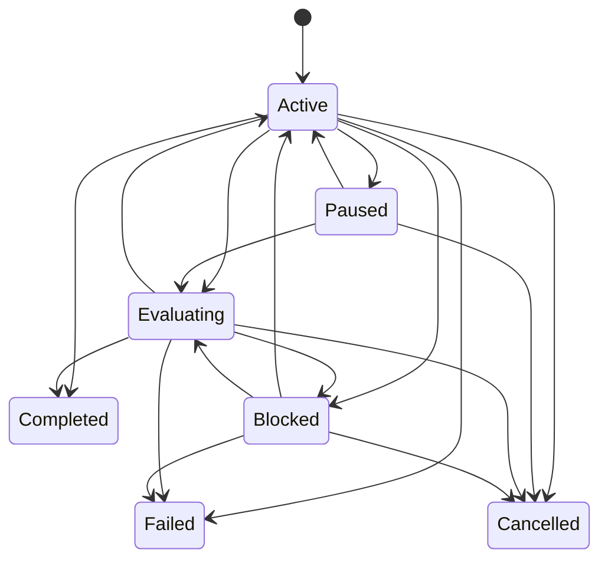

# Goal 控制平面

> 返回 [文档索引](../README.md) | 更新时间：2026-07-03

Goal 是长任务的顶层完成语义：**我要最终达成什么，完成标准是什么，哪些证据证明已经完成**。它位于 Execution Mode 与 Workflow 之上，适用于通用长任务；coding 只是当前最强的使用场景。

## 1. 定位

```text
Goal      = 最终目标、完成标准、预算、证据、最终审计
Mode      = 本会话/目标以多主动、多深入的策略推进
Workflow  = 一次具体、可恢复、可审批、可审计的执行 run
Task      = 用户可见的进度事实
Loop      = 定时、重复触发或条件继续
```

Goal 不直接执行工具，不替代 Workflow，也不表示重复调度。Workflow run 会绑定当前 active Goal，并在终态后把执行结果写回 Goal 证据链。

## 2. 模块边界

| 层 | 代码 | 责任 |
| --- | --- | --- |
| 核心模型 | `crates/ha-core/src/goal/mod.rs` | Goal/GoalEvent/GoalLink 类型、状态机、建表、CRUD、审计器。 |
| Workflow 集成 | `crates/ha-core/src/workflow/db.rs` | `workflow_runs.goal_id`、自动绑定 active Goal、终态后自动 link + audit。 |
| 斜杠命令 | `crates/ha-core/src/slash_commands/handlers/goal.rs` | `/goal` 文本控制面。 |
| Tauri owner API | `src-tauri/src/commands/goal.rs` | 桌面 owner 平面命令。 |
| HTTP owner API | `crates/ha-server/src/routes/goal.rs` | Server/Web owner 平面端点。 |
| GUI | `src/components/chat/workspace/useGoal.ts`、`WorkspacePanel.tsx`、`ChatInput.tsx` | Workflow Control Center 内 Goal strip、输入框目标模式、composer 上方 active Goal 状态条、创建/更新/暂停/恢复/清除/评估、证据摘要。 |

红线：

- Goal 逻辑必须在 `ha-core`；Tauri / HTTP 只做薄适配。
- 第一版没有 agent 工具面直接改 Goal；模型可建议，owner 平面落地。
- incognito session 禁止创建 durable Goal。
- 反向也必须成立：存在 open Goal 的普通会话不能再切成 incognito，避免 durable Goal 证据链和“关闭即焚”语义并存。
- `label` 只用于展示；Goal 与 Workflow 的关系以 `goal_id` / `goal_links` 为准。
- Goal 更新必须走 owner 平面 `update_goal` 或 `/goal <objective>`；更新 objective 或 completion criteria 后清空旧 final audit，并让 `blocked` / `evaluating` 回到 `active`，避免旧审计结论污染新目标。

## 3. 数据模型

Goal 数据落在 `sessions.db`，跟随 session 级联删除。

### `goals`

| 字段 | 说明 |
| --- | --- |
| `id` | `goal_*` id。 |
| `session_id` | 所属 session。 |
| `objective` | 用户写下的最终目标。 |
| `completion_criteria` | 用户写下的完成标准，多行文本。 |
| `state` | `active` / `paused` / `evaluating` / `completed` / `failed` / `cancelled` / `blocked`。 |
| `mode_snapshot` | 创建 Goal 时的 session `execution_mode` 快照。 |
| `budget_token_limit` / `budget_time_limit_secs` / `budget_turn_limit` | 可选预算字段；`0`/空表示不设限，正数参与预算观测、告警和新 workflow hard stop。 |
| `final_summary` | 最近一次 final audit 摘要。 |
| `final_evidence_json` | 最近一次 audit 的结构化结果。 |
| `blocked_reason` | `blocked` 原因。 |
| `last_evaluator_result_json` | 最近 evaluator 原始结果，第一版与 `final_evidence_json` 同步。 |

同一个 session 同时只允许一个 open Goal：

```sql
UNIQUE(session_id) WHERE state IN ('active','paused','evaluating','blocked')
```

### `goal_events`

| 字段 | 说明 |
| --- | --- |
| `id` | 自增 row id。 |
| `goal_id` | 所属 Goal。 |
| `seq` | Goal 内单调序号。 |
| `kind` | `goal_created`、`goal_state_changed`、`goal_linked`、`goal_evaluated` 等。 |
| `payload_json` | 事件载荷，超过 64KB 会截断为 preview。 |
| `created_at` | 时间戳。 |

### `goal_links`

| 字段 | 说明 |
| --- | --- |
| `goal_id` | 所属 Goal。 |
| `target_type` | `workflow_run` / `validation` / `diff` / `file` / `artifact` / `diagnostic` / `review`；预留 `task` / `worktree`。 |
| `target_id` | 被关联对象 id。 |
| `relation` | `execution_run`、`repair_run`、`workflow_completed`、`workflow_failed`、`workflow_blocked`、`validation_passed`、`validation_failed`、`diff_snapshot`、`file_changed`、`artifact_created`、`diagnostic_result`、`review_passed`、`review_completed`、`review_finding` 等。 |
| `metadata_json` | 关联时的状态、kind、origin、blocked reason、op key、summary、changed files、line delta、artifact path/hash、diagnostic severity/range 等摘要。 |

`GoalSnapshot` 额外派生 GUI 友好字段，不单独落表：

| 字段 | 说明 |
| --- | --- |
| `criteria` | 从 completion criteria 拆出的逐条审计状态：`satisfied` / `missing` / `blocked`，并带 evidence ids。 |
| `evidence` | 从 `goal_links` + completed tasks 汇总出的结构化证据列表。 |
| `timeline` | goal events、workflow runs、关键 evidence 的合并时间线，供 Workspace 展开详情使用。 |
| `budget` | token/time/turn 使用量、ratio、warning/exhausted 状态和 exceeded kinds。 |

## 4. 状态机

`GoalState::can_transition_to()` 是状态转换单一真相源。



`completed` / `failed` / `cancelled` 是终态。`blocked` 不是终态，用户可恢复或重新评估。

## 5. Workflow 集成

`workflow_runs` 增加 `goal_id TEXT`：

- `create_workflow_run` 若显式传 `goal_id`，会校验它与 run 属于同一 session。
- 若不传 `goal_id`，后端会自动绑定当前 session 的 open Goal。
- 创建 run 后写 `goal_links(relation='execution_run' | 'repair_run')`。
- run 进入终态后写 `workflow_completed` / `workflow_failed` / `workflow_cancelled` / `workflow_blocked` link。
- run 进入 `completed` / `failed` / `blocked` 后 best-effort 触发 `evaluate_goal`。
- `workflow.validate` op 结束后写 `validation_passed` / `validation_failed` evidence。
- `workflow.diff` op 结束后写 `diff_snapshot`，并为最多 50 个 changed file 写 `file_changed` evidence。
- `workflow.finish({ artifact | artifacts })` 结束后写 `artifact_created` evidence，记录产物 id/path/title/kind/hash 等摘要。
- workflow 内 `workflow.tool({ name: "lsp", args: { action: "diagnostics" | "sync_file" } })` 结束后写 `diagnostic_result` evidence；error 级诊断是 hard blocker，后续 passing validation 或 clean diagnostics 可解除较早诊断 blocker。
- Review Engine 完成后写 `review_passed` / `review_completed`；P0/P1 open finding 写 `review_finding`，finding 状态变更会刷新 link metadata。
- Smart Verification 完成后写 `validation_passed` / `validation_failed` / `validation_completed`；只有 `validation_passed` 是 strong completion evidence，`validation_completed` 只表示已完成验证选择。
- 创建新 workflow 前会检查绑定 Goal 的 budget；若 token/time/turn 任一正数上限已耗尽，拒绝创建新 run，并写一次 `budget_warning(level='exhausted')`。

这保证 Goal 不依赖聊天文本反扫，而是通过 durable workflow snapshot、task 和 validation evidence 做审计。

## 6. Evaluator v2 与 Final Audit

Evaluator v2 是确定性规则门禁，输入为：

- Goal objective。
- completion criteria。
- linked workflow runs。
- session tasks。
- `goal_links` 中的 workflow / validation / diff / file / artifact / diagnostic / review evidence。
- workflow blocked/failed/cancelled 状态。
- budget snapshot。

输出写入 `final_evidence_json`：

| 字段 | 说明 |
| --- | --- |
| `status` | `completed` 或 `blocked`。不写 `partial`，避免 UI 和状态机语义漂移。 |
| `summary` | 审计摘要。 |
| `blockedReason` | `goal_evidence_incomplete` / `goal_blocked_by_evidence` / `goal_budget_exhausted`。 |
| `achieved` | 已达成项。 |
| `missing` | 缺少证据或未完成项。 |
| `blockers` | 明确阻塞项。 |
| `criteriaStatus` | 逐条 completion criteria 的状态、原因和 evidence ids。 |
| `evidence` | workflow / validation / diff / file / artifact / diagnostic / review / task 证据。 |
| `nextEvidenceNeeded` | 下一步需要补的证据，如 final verification、repair workflow、criterion evidence、budget 扩容。 |
| `budget` | 本次 audit 使用的预算快照。 |
| `ruleGate` | 规则门禁结果、hard blocker evidence ids、strong evidence ids、LLM auditor 跳过原因。 |
| `remainingRisk` | 剩余风险说明。 |

判定原则：

- 没有 workflow/task/evidence → `blocked`。
- `validation_failed` 只能被更新的 `validation_passed` 覆盖；workflow failed/blocked/cancelled 只能被更新的 `workflow_completed` 或 `validation_passed` 覆盖。
- diff/file 只能作为实现证据，不能单独完成 Goal；必须至少有 `workflow_completed`、`validation_passed` 或 `task_completed` 这类 strong evidence。
- completion criteria 没有 strong supporting evidence → `blocked`。
- budget exhausted → `blocked`，且新 workflow create hard stop。
- 无 blocker、无 missing 且有 strong evidence → `completed`。

可选 LLM auditor 当前不启用；`ruleGate.llmAuditor.status='skipped'`，后续只能在 hard blocker 通过后补 rationale，不能覆盖规则结果。

## 7. Owner API 与事件

Tauri 与 HTTP 保持对齐：

| Tauri command | HTTP |
| --- | --- |
| `get_active_goal` | `GET /api/sessions/{sessionId}/goal` |
| `create_goal` | `POST /api/sessions/{sessionId}/goal` |
| `get_goal` | `GET /api/goals/{goalId}` |
| `update_goal` | `PATCH /api/goals/{goalId}` |
| `pause_goal` | `POST /api/goals/{goalId}/pause` |
| `resume_goal` | `POST /api/goals/{goalId}/resume` |
| `clear_goal` | `POST /api/goals/{goalId}/clear` |
| `evaluate_goal` | `POST /api/goals/{goalId}/evaluate` |

EventBus：

| 事件 | 来源 |
| --- | --- |
| `goal:created` | Goal 创建。 |
| `goal:updated` | Goal 状态或 audit 更新。 |
| `goal:event` | Goal event append。 |
| `goal:link_updated` | Goal link upsert。 |
| `goal:event(kind='budget_warning')` | 预算接近上限或耗尽时写入，payload 含 `kind` / `level` / `budget`。 |

前端 `useGoal` 监听 Goal 与 Workflow 事件，并做 250ms debounce refresh。

## 8. 用户入口

### Slash

```text
/goal <objective> --criteria <completion criteria>
/goal
/goal status
/goal pause
/goal resume
/goal evaluate
/goal clear
```

`/goal` 返回 markdown 状态卡，包含目标、完成标准、workflow 数、task 完成数、final audit 和 blocked reason。Slash history 中 `/goal ...` 的用户行以 Goal 模式气泡展示：保留原始 command metadata，但气泡正文不显示 `/goal` 前缀。

### GUI

Workspace / Workflow Control Center 内有 Goal strip：

- 无 active Goal：可直接创建 objective + completion criteria。
- 有 active Goal：展示目标摘要、状态、workflow/task/evidence 指标，并支持编辑 objective / completion criteria。
- 点击 active Goal strip 可展开 Goal detail，查看 criteria 覆盖、预算、下一步证据、结构化 evidence、timeline、workflow/task 摘要。
- audit 后展示 final summary、blocked reason、missing/blocker/achieved 摘要。
- 操作按钮：编辑、评估、暂停/恢复、清除。
- 新建 workflow 默认绑定当前 active Goal；repair draft 会提示“同一 Goal 下的修复 run”。

输入框也有一等 Goal 入口：

- `+` 菜单 / toolbar 中的“目标”进入目标模式。
- 目标模式发送时始终走 `/goal <objective>`；无 active Goal 时创建，有 active Goal 时更新同一个 Goal。控制词只有在完整参数精确等于 `status` / `pause` / `resume` / `evaluate` / `clear` 等时才作为命令，较长文本一律按目标正文处理。
- 渲染用户消息时不显示 `/goal` 字符，而是在气泡内展示 Goal 模式标记。
- 输入框上方常驻展示当前 active Goal 摘要、状态和编辑/评估/暂停/恢复/清除操作，用户不用打开 Workspace 也能掌握目标状态。
- `/workflow status` / `/workflow runs` / `/workflow trace` 也会显示 active / linked Goal，命令面和 GUI 面保持同一条“目标 -> workflow run -> evidence”链路。

每轮主对话 system prompt 会注入当前 active Goal 的 state、objective、completion criteria、blocked reason / latest audit 摘要。Goal 更新后，下一轮 prompt 重新构建即可让模型感知最新目标。

## 9. 非目标

当前 Goal 控制面仍不包含：

- `/loop` 的定时、重复、轮询调度，详见 [Loop 控制平面](loop.md)。
- agent 工具面直接修改 Goal。
- LLM side-query evaluator。
- 独立 Goal detail 全屏页面。
- Worktree 强类型证据接入。

这些后续仍在 `docs/roadmap/` 跟踪；实现稳定后再沉淀到对应 architecture 文档。
