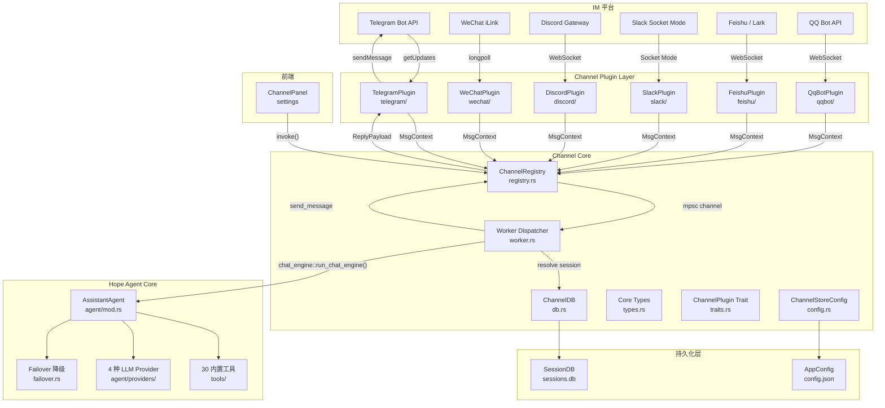
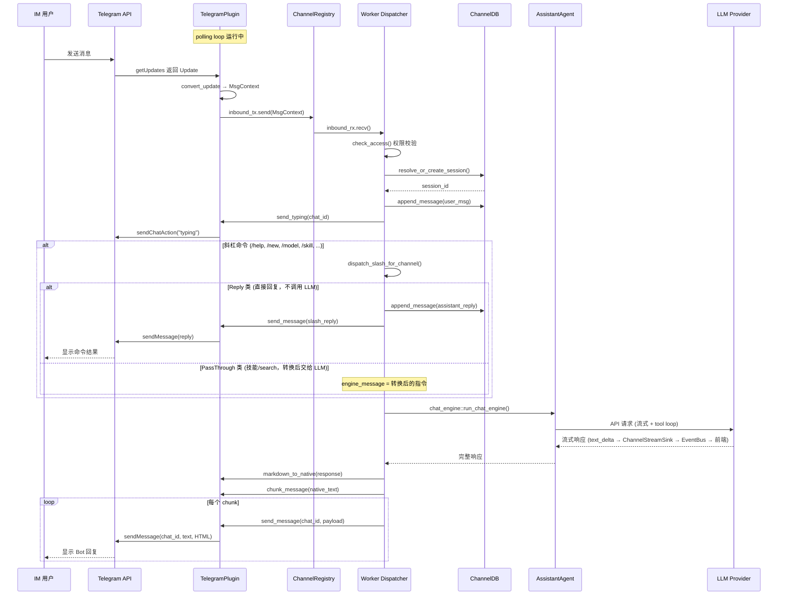
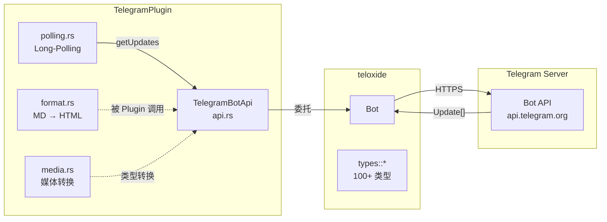

# IM Channel 系统架构文档

> 返回 [文档索引](../README.md)

> Hope Agent 多渠道即时通讯接入 — Rust 原生实现

## 目录

- [概述](#概述)
- [设计目标](#设计目标)
- [整体架构](#整体架构)
- [核心抽象层](#核心抽象层)
  - [ChannelId 枚举](#channelid-枚举)
  - [ChannelPlugin Trait](#channelplugin-trait)
  - [MsgContext（入站消息）](#msgcontext入站消息)
  - [ReplyPayload（出站消息）](#replypayload出站消息)
  - [ChannelCapabilities](#channelcapabilities)
  - [安全策略（SecurityConfig）](#安全策略securityconfig)
- [消息流转架构](#消息流转架构)
  - [入站流程](#入站流程)
  - [出站流程](#出站流程)
  - [完整时序图](#完整时序图)
  - [入站附件 deferred materialize 模式](#入站附件-deferred-materialize-模式)
- [模块拆分](#模块拆分)
- [Channel Registry（注册表）](#channel-registry注册表)
- [会话管理](#会话管理)
  - [channel_conversations 表](#channel_conversations-表)
  - [会话映射策略](#会话映射策略)
- [Project 绑定与 IM 禁用命令](#project-绑定与-im-禁用命令)
- [Worker 分发器](#worker-分发器)
- [Telegram 插件实现](#telegram-插件实现)
  - [架构](#telegram-架构)
  - [teloxide 封装层](#teloxide-封装层)
  - [Long-Polling 循环](#long-polling-循环)
  - [Markdown → Telegram HTML](#markdown--telegram-html)
  - [群组消息过滤](#群组消息过滤)
  - [媒体处理](#媒体处理)
- [工具审批交互](#工具审批交互)
- [配置格式](#配置格式)
  - [配置结构](#配置结构)
  - [Telegram 配置示例](#telegram-配置示例)
- [Tauri 命令 API](#tauri-命令-api)
- [前端设置面板](#前端设置面板)
- [扩展新渠道指南](#扩展新渠道指南)
- [安全设计](#安全设计)
- [文件清单](#文件清单)

---

## 概述

IM Channel 系统是 Hope Agent 的多渠道即时通讯接入层，允许用户通过 Telegram、Discord、Slack 等 IM 平台与 AI Agent 对话。系统基于 Rust 原生实现，充分利用 tokio 异步运行时获得优秀的性能和较低的资源开销。

### 核心特性

- **统一抽象**：12 个内置渠道 + 自定义扩展，共用一套 ChannelId / 配置格式 / 能力声明
- **Rust 原生**：基于 tokio 异步运行时，零 Node.js 依赖
- **插件化架构**：一个 `ChannelPlugin` trait 定义所有渠道行为，新增渠道只需实现该 trait
- **完整 Agent 能力**：复用 `AssistantAgent` 的全部工具（30+ 内置工具）和 Failover 降级策略
- **会话持久化**：Channel 消息映射到 SessionDB，桌面端可查看所有 IM 对话历史
- **安全控制**：DM Policy（open/allowlist/pairing）+ 群组白名单 + 用户白名单

### 渠道支持矩阵

#### 已实现渠道

| 渠道 | 传输方式 | 认证 | ChatType | 特色 |
|------|---------|------|----------|------|
| **Telegram** | Long-polling (teloxide) | Bot Token | DM, Group, Forum | 完整功能：Draft 流式、Edit/Delete、媒体、斜杠命令同步 |
| **WeChat** | HTTP 长轮询 (iLink) | QR 码登录 | DM | AES-128 媒体加密、Typing Indicator、会话过期暂停 |
| **Discord** | WebSocket Gateway | Bot Token | DM, Group, Forum, Channel | Application Commands 同步、RESUME 重连、原生媒体（multipart files[N]） |
| **Slack** | Socket Mode WebSocket | Bot Token + App Token | DM, Group, Channel | mrkdwn 格式、一次性 URL 重连 |
| **飞书 / Lark** | WebSocket 事件订阅 | App ID + App Secret | DM, Group | OAuth Token 自动刷新、多域名支持 (feishu/lark/私有部署)、原生媒体（im/v1/images + im/v1/files） |
| **QQ Bot** | WebSocket Gateway | App ID + Client Secret | DM, Group, Channel | RESUME 重连、QQBotAccessToken 认证 |

| **IRC** | TCP/TLS 直连 | Nick + NickServ | DM, Group | 原生 IRC 协议、PING/PONG 心跳、自动加入频道 |
| **Signal** | SSE + HTTP RPC (signal-cli) | 手机号 + 链接设备 | DM, Group | 实时推送、撤回/回复/Typing、需外部 signal-cli |
| **iMessage** | JSON-RPC over stdio (imsg CLI) | macOS 本地数据库 | DM, Group | macOS 限定、imsg CLI 进程管理 |
| **WhatsApp** | HTTP 轮询（外部桥接服务） | Bridge URL + Token | DM, Group | 同 WeChat iLink 架构、QR 登录、媒体支持 |
| **Google Chat** | Webhook + REST API | Service Account JWT | DM, Group | 嵌入式 Webhook 服务器、线程回复、需公网 URL |
| **LINE** | Webhook + REST API | Channel Token + Secret | DM, Group | HMAC-SHA256 签名验证、Reply/Push 双模式、需公网 URL |

所有 12 个渠道均已实现。`ChannelId` 枚举还支持 `Custom(String)` 用于扩展自定义渠道。各渠道的**出站附件支持现状**详见下方矩阵 —— 未支持的渠道由 dispatcher 自动降级为"贴下载链接"的纯文本兜底，不会丢消息但缺少富媒体预览。

### 出站附件能力支持矩阵

`supports_media: Vec<MediaType>` 决定 dispatcher 是否会把模型生成的图 / 音视频 / 文件以原生消息形式投递给该渠道。`Vec::new()` 时统一降级为"贴下载链接的纯文本兜底"（[`build_media_fallback_lines`](../../crates/ha-core/src/channel/worker/dispatcher.rs)）。

| 渠道 | 状态 | 已支持 MediaType | 上行 API | 备注 |
|------|------|------------------|---------|------|
| **Telegram** | ✅ 已实现 | Photo, Video, Audio, Document, Sticker, Voice, Animation | teloxide `send_photo` / `send_document` | 多类型最完整，复用 `InputFile` |
| **WeChat** | ✅ 已实现 | Photo, Video, Document, Voice | iLink `getUploadUrl` + AES-128-ECB CDN 上传 + `sendMessage` | 自建加密通道，单文件 100 MB 上限 |
| **Discord** | ✅ 已实现（本次新增） | Photo, Video, Audio, Document | `POST /channels/{id}/messages` multipart `payload_json` + `files[N]` | 单条 25 MiB 硬上限，超限退化链接 |
| **飞书 / Lark** | ✅ 已实现（本次新增） | Photo, Video, Audio, Document | 两步：`im/v1/images` 或 `im/v1/files` 上传换 key → `im/v1/messages` `msg_type=image\|file` | image/file 不带 caption，文本由 dispatcher 单发 |
| **Slack** | ✅ 已实现 | Photo, Video, Audio, Document, Sticker, Voice, Animation | `files.getUploadURLExternal` + `files.completeUploadExternal`（v2） | Slack v1 `files.upload` 已弃用；需要 bot token `files:write` |
| **QQ Bot** | ✅ c2c/group 条件实现 | Photo, Video, Audio, Voice, Animation | `POST /v2/{users|groups}/{openid}/files` 拿 `file_info` 再发 `media` 消息 | 需要 `server.publicBaseUrl=https://...`；channel/dms 端点仍走链接 |
| **Signal** | ✅ 已实现 | Photo, Video, Audio, Document, Sticker, Voice, Animation | signal-cli JSON-RPC `send.attachments` | 本地路径直传；URL / bytes 先物化到临时文件 |
| **iMessage** | ✅ 已实现 | Photo, Video, Audio, Document, Sticker, Voice, Animation | imsg JSON-RPC `send` + `file` 参数 | 本地路径直传；URL / bytes 先物化到临时文件；`imsg` 自行 stage 到 Messages 附件目录 |
| **WhatsApp** | ✅ 已实现 | Photo, Video, Audio, Document, Sticker, Voice, Animation | bridge `POST /api/media`，`media=data:<mime>;name=<filename>;base64,...` | 同时发送旧 `data` alias；bridge 负责上传到 Cloud API / whatsmeow / Baileys |
| **Google Chat** | ⏳ 认证模型阻塞 | — | `spaces.messages.create` + `attachment` 数组（先 `media.upload` 拿 `attachmentDataRef`） | 官方 `media.upload` 需要 user auth `chat.messages.create` / `chat.messages`；当前插件是 app-auth `chat.bot` |
| **LINE** | ✅ 条件实现 | Photo, Audio, Voice | Reply/Push API 的 `image` / `audio` message object | 需要 `server.publicBaseUrl=https://...`；video 还缺独立 `previewImageUrl` 缩略图，走链接 |
| **IRC** | ❌ 协议限制 | — | （IRC 纯文本协议） | 无原生二进制传输，永久走链接兜底；可选未来接 DCC SEND 但实用性低 |

补齐参考实现：Telegram 走 SDK 内置 `InputFile`（[telegram/media.rs](../../crates/ha-core/src/channel/telegram/media.rs)），Discord 走单 POST multipart（[discord/media.rs](../../crates/ha-core/src/channel/discord/media.rs)），飞书走"上传 → 引用 key 发消息"两步（[feishu/media.rs](../../crates/ha-core/src/channel/feishu/media.rs)），WeChat 走"获取 CDN 上传 URL → AES 加密上传 → 引用消息项"自建加密链路（[wechat/media.rs](../../crates/ha-core/src/channel/wechat/media.rs)）。新增渠道时按平台 API 形态选最接近的范本套用 — 大多数 IM 平台属于 Discord 或飞书两类。

---

## 设计目标

| 目标 | 说明 |
|------|------|
| **Rust 原生** | 所有核心逻辑在 Rust 后端实现，前端只负责配置界面 |
| **最小依赖** | 仅新增 `teloxide` + `tokio-util` 两个 crate |
| **插件可扩展** | 新增渠道只需实现 `ChannelPlugin` trait + 注册到 Registry |
| **复用已有架构** | 消息分发复用 `chat_engine::run_chat_engine()`（与 UI 聊天共享同一套 Agent 执行引擎），会话复用 `SessionDB` |
| **安全优先** | Bot Token 不出现在日志中，DM/群组分级权限控制 |

---

## 整体架构



---

## 核心抽象层

### ChannelId 枚举

统一的渠道 ID 枚举，覆盖所有内置渠道：

```rust
#[derive(Debug, Clone, PartialEq, Eq, Hash, Serialize, Deserialize)]
#[serde(rename_all = "lowercase")]
pub enum ChannelId {
    Telegram,       // ✅ 已实现
    WeChat,         // ✅ 已实现
    WhatsApp,       // ✅ 已实现
    Discord,        // ✅ 已实现
    Irc,            // ✅ 已实现
    GoogleChat,     // ✅ 已实现
    Slack,          // ✅ 已实现
    Signal,         // ✅ 已实现
    IMessage,       // ✅ 已实现
    Line,           // ✅ 已实现
    Feishu,         // ✅ 已实现（飞书/Lark）
    QqBot,          // ✅ 已实现（QQ 官方机器人）
    Custom(String), // 扩展渠道
}
```

使用 `serde(rename_all = "lowercase")` 确保 JSON 序列化兼容（`"telegram"`, `"discord"`, `"feishu"`, `"qqbot"` 等）。

### ChannelPlugin Trait

所有渠道插件实现的核心契约。trait 按职责分区组织，涵盖生命周期、出站、状态、安全、格式转换、凭据验证 6 个维度：

```rust
#[async_trait]
pub trait ChannelPlugin: Send + Sync + 'static {
    // 元数据
    fn meta(&self) -> ChannelMeta;
    fn capabilities(&self) -> ChannelCapabilities;

    // 生命周期
    async fn start_account(&self, account, inbound_tx, cancel) -> Result<()>;
    async fn stop_account(&self, account_id) -> Result<()>;

    // 出站
    async fn send_message(&self, account_id, chat_id, payload) -> Result<DeliveryResult>;
    async fn send_typing(&self, account_id, chat_id) -> Result<()>;
    async fn edit_message(...) -> Result<DeliveryResult>;   // default: not supported
    async fn delete_message(...) -> Result<()>;              // default: not supported

    // 状态
    async fn probe(&self, account) -> Result<ChannelHealth>;

    // 安全
    fn check_access(&self, account, msg) -> bool;

    // 格式转换
    fn markdown_to_native(&self, markdown) -> String;
    fn chunk_message(&self, text) -> Vec<String>;

    // 凭据验证
    async fn validate_credentials(&self, credentials) -> Result<String>;
}
```

### MsgContext（入站消息）

从任何渠道收到的消息统一转换为此结构：

```rust
pub struct MsgContext {
    pub channel_id: ChannelId,           // 来源渠道
    pub account_id: String,              // Bot 账户 ID
    pub sender_id: String,               // 发送者平台 ID
    pub sender_name: Option<String>,     // 发送者显示名
    pub sender_username: Option<String>, // 发送者用户名 (@username)
    pub chat_id: String,                 // 聊天/群组 ID
    pub chat_type: ChatType,             // Dm / Group / Forum / Channel
    pub chat_title: Option<String>,      // 群组标题
    pub thread_id: Option<String>,       // 论坛话题 ID
    pub message_id: String,              // 消息唯一 ID
    pub text: Option<String>,            // 文本内容
    pub media: Vec<InboundMedia>,        // 附件媒体
    pub reply_to_message_id: Option<String>, // 回复的消息 ID
    pub timestamp: DateTime<Utc>,        // 消息时间戳
    pub raw: serde_json::Value,          // 原始平台数据（调试用）
}
```

### ReplyPayload（出站消息）

Agent 回复统一通过此结构发送到渠道：

```rust
pub struct ReplyPayload {
    pub text: Option<String>,                    // 文本内容（已转为渠道原生格式）
    pub media: Vec<OutboundMedia>,               // 附件媒体
    pub reply_to_message_id: Option<String>,     // 引用回复的消息 ID
    pub parse_mode: Option<ParseMode>,           // Html / Markdown / Plain
    pub buttons: Vec<Vec<InlineButton>>,         // 内联键盘按钮
    pub thread_id: Option<String>,               // 论坛话题 ID
}
```

### ChannelCapabilities

渠道静态能力声明，前端可据此显示/隐藏功能选项：

```rust
pub struct ChannelCapabilities {
    pub chat_types: Vec<ChatType>,        // 支持的聊天类型
    pub supports_polls: bool,             // 投票
    pub supports_reactions: bool,         // 表情回应
    pub supports_edit: bool,              // 编辑消息
    pub supports_unsend: bool,            // 撤回消息
    pub supports_reply: bool,             // 引用回复
    pub supports_threads: bool,           // 线程/话题
    pub supports_media: Vec<MediaType>,   // 支持的媒体类型
    pub supports_typing: bool,            // 输入中指示器
    pub supports_buttons: bool,           // 交互按钮（审批等）
    pub max_message_length: Option<usize>,// 单条消息长度限制
}
```

### 安全策略（SecurityConfig）

每个渠道账户独立配置安全策略，采用 `dmPolicy` + `allowFrom` 组合模型：

```rust
pub struct SecurityConfig {
    pub dm_policy: DmPolicy,          // Open / Allowlist / Pairing
    pub group_allowlist: Vec<String>, // 允许的群组 ID 列表（空=全部允许）
    pub user_allowlist: Vec<String>,  // 允许的用户 ID 列表
    pub admin_ids: Vec<String>,       // 管理员 ID（始终允许）
}
```

**DM 策略说明：**

| 策略 | 行为 |
|------|------|
| `Open` | 任何人都可以私聊 Bot |
| `Allowlist` | 仅 `user_allowlist` + `admin_ids` 中的用户可以私聊 |
| `Pairing` | 配对模式（需要用户发起配对请求，预留未来实现） |

---

## 消息流转架构

### 入站流程

```
IM 平台 (Telegram/Discord/...)
    │
    ▼
Channel Plugin (polling/webhook)
    │ 将平台 Update 转换为 MsgContext
    ▼
mpsc::channel<MsgContext>  ← 所有渠道共享一个 inbound channel
    │
    ▼
Worker Dispatcher (worker.rs)
    ├── 1. 查找 ChannelAccountConfig
    ├── 2. check_access() 权限校验
    ├── 2c. mention/access gating 通过后调用 materialize_pending_media()
    │       └── 支持媒体的 11 个渠道（除纯文本 iMessage / IRC）共用 deferred 模式：
    │           plugin 在 webhook / gateway / polling 阶段只挂轻量 ref 到
    │           raw["_hopePendingMedia"]（同步、无 I/O），gating 通过后才走
    │           inbound_media_common::stream_to_disk 真正下载，详见「入站附件
    │           deferred materialize 模式」一节
    ├── 3. resolve_or_create_session() 查找/创建会话
    ├── 4. send_typing() 发送输入中指示器
    ├── 5. [斜杠命令预拦截] is_slash_command(user_text)?
    │       ├── YES → dispatch_slash_for_channel()
    │       │           ├── Reply 类 (help/status/clear/model/...) → command/result 落 event，直接回复，跳过 LLM，return
    │       │           └── PassThrough 类 (技能调用/search) → 替换为转换后指令，继续 ↓
    │       └── NO  → 继续 ↓
    ├── 5b. append_message(user_msg) 保存真实对话用户消息
    ├── 6. chat_engine::run_chat_engine() 共享聊天引擎
    │       ├── 构建 Agent（model chain + failover）
    │       ├── 恢复会话历史 (restore_agent_context)
    │       ├── AssistantAgent.chat() → 流式执行 → Tool Loop
    │       ├── 工具事件实时持久化 (persist_tool_event)
    │       ├── 流式事件推送前端 (ChannelStreamSink → EventBus → channel:stream_delta)
    │       ├── Context compaction (溢出时自动压缩)
    │       ├── 保存助手回复（含 token/duration/thinking 元数据）
    │       ├── 持久化对话上下文 (save_agent_context)
    │       └── 异步记忆提取 (memory extraction)
    ├── 8. markdown_to_native() 格式转换
    ├── 9. chunk_message() 分块（4096 字符限制）
    └── 10. send_message() 逐块发送
```

### 出站流程

```
Agent Response (Markdown)
    │
    ▼
markdown_to_native()
    │ Telegram: Markdown → HTML (<b>, <i>, <code>, <pre>, <a>)
    │ Discord:  保持原始 Markdown
    │ Slack:    Markdown → mrkdwn
    ▼
chunk_message()
    │ 按平台限制分块（Telegram: 4096 chars）
    │ 优先在段落边界(\n\n)分割
    │ 其次在行边界(\n)、句号(. )、空格处分割
    ▼
send_message() × N chunks
    │ 每个 chunk 作为独立消息发送
    │ reply_to（引用原消息）只挂在一次回复的第一条消息上：
    │   chunk 维度只 chunk 0 带；多轮 split 维度，流式渠道由
    │   stream task 在 round 0 收尾后清空 reply_to、deliver_split
    │   末轮按 finalized_rounds gate，保证整轮回复只引用一次
    │ 所有 chunk 带 thread_id（保持话题上下文）
    ▼
IM 平台 API
```

### 完整时序图



### 入站附件 deferred materialize 模式

所有支持媒体的 11 个渠道（除纯文本的 iMessage / IRC）共用同一套 deferred materialize 管道：plugin 在 webhook / gateway / polling 阶段**只解析**媒体引用，**不发起任何 I/O**，把轻量 ref 透传给 dispatcher；只有 mention + access gating 双双通过后，dispatcher 才调 `ChannelPlugin::materialize_pending_media()` 走真正的下载。这避免了三类问题：

1. **Webhook ack 超时**：飞书 / Google Chat / LINE / QQ Bot / WhatsApp 都要求 secs 级 ack，把下载塞进 webhook handler 会拖死返回
2. **群组流量浪费**：mention gating 关闭的群里非 @bot 的附件不应该消耗带宽 / 磁盘
3. **RSS 失控**：100 MB 文件不应该让进程 RSS 涨 100 MB+

#### 共用骨架：`channel/inbound_media_common.rs`

| API | 作用 |
|---|---|
| `embed_pending_refs<T: Serialize>(raw, refs)` | plugin 端把 `ParsedMediaRef<T>` 挂到 `MsgContext.raw["_hopePendingMedia"]`（envelope key 私有） |
| `take_pending_refs<T: DeserializeOwned>(msg) -> Vec<T>` | dispatcher 端在 `materialize_pending_media` 里取回并清除 ref |
| `stream_to_disk(builder, dest, cap_bytes)` | chunk-by-chunk 流式落盘 / Content-Length + mid-stream 双重 cap 检查 / 失败自动 `abort_partial_download` / 错误响应体读取上限 8 KiB |
| `inbound_temp_path(channel_id, stem, ext)` | `~/.hope-agent/channels/<id>/inbound-temp/<ts>-<safe-stem>.<ext>`，路径分隔符 / 冒号在文件名层兜底 |
| `ext_for(file_name, &media_type)` | 优先用 filename 后缀（ASCII alphanumeric ≤ 8 字符），fallback MediaType→默认扩展名 |
| `media_type_from_mime(mime, voice_for_ogg_opus)` | MIME → MediaType 统一分类，flag 控制 audio/ogg \| audio/opus 是否归 Voice |
| `INBOUND_DOWNLOAD_MAX_BYTES = 512 MiB` | 跨渠道统一 cap，平台 image / file / video 上限（30 / 100 / 200 MiB）的安全余量 |

每渠道的 `ParsedMediaRef` 是各自的 struct（auth header / 下载 URL / 解密 key 形态各不同），但都通过 `serde_json` 透传 `MsgContext.raw`。dispatcher 端不区分渠道，只调 `plugin.materialize_pending_media()` 即可。

#### 各渠道的差异点

| 渠道 | 协议入口 | Auth | 备注 |
|---|---|---|---|
| **Feishu** | `im/v1/messages/{id}/resources/{key}` (im_lark_only) | `Bearer <tenant_access_token>` | 共用骨架的参考实现 |
| **Telegram** | `/file/bot{TOKEN}/{file.path}`（Bot API） | URL 含 token | Bot::with_client 保留 proxy / timeout |
| **Slack** | `url_private` / `url_private_download`（files.slack.com） | `Bearer xoxb-...` | host 必须 `*.slack.com` 锁定，否则 LLM 拿到登录 HTML |
| **Discord** | CDN URL（公开签名） | 无需 auth | server-side 落盘以躲 24h CDN 失效 |
| **Google Chat** | `media.download` REST | OAuth2 access_token | 仅处理 `UPLOADED_CONTENT`；`DRIVE_FILE` 暂不支持 |
| **LINE** | `api-data.line.me/v2/bot/message/{id}/content` | `Bearer <channel access token>` | 与 push API 不同 host |
| **QQ Bot** | Tencent CDN（4 host 白名单） | URL 含 signature，无 header | `*.gtimg.cn` / `*.qpic.cn` / `*.qq.com` |
| **WhatsApp** | bridge 转发 attachments（向后兼容扩展） | bridge 内部 | `BridgeMessage.attachments` 字段 `#[serde(default)]`，老 bridge 仍可工作 |
| **WeChat** | encrypt CDN + AES-128-ECB | URL 含 `encrypt_query_param`，密钥来自 message item | 见下文 streaming 解密 |
| **Signal** | 不走 HTTP — signal-cli 已落盘 | — | `<data-dir>/attachments/<id>` 复制到 inbound-temp（**copy 不 move**，daemon 自己管 GC） |

#### WeChat AES streaming（commit 14）

WeChat 的特殊性是密文必须经 AES-128-ECB + PKCS#7 解密。旧实现 `response.bytes()` + `decrypt(&buf)` 在内存里同时持有密文 + 明文两份 buffer，100 MB 文件 → ≥ 200 MB 峰值 RSS。现实现改成磁盘缓冲二段法：

```
Stage 1  stream_to_disk(url → <ts>-<msg>.enc)        // 16 KiB read / 64 KiB write buffer
Stage 2  spawn_blocking → aes::Aes128 逐块解密        // 16 KiB read buffer，按 16B 块 decrypt
         .enc → <ts>-<msg>.<ext>                     //   末块在 carry 里留到 EOF 再去 PKCS#7
Stage 3  abort_partial_download(.enc)                // 强制删中间文件
```

ECB 块独立可流式；尾块在 EOF 前一直留在 `carry` 里，PKCS#7 unpad 只对真正的最后一块做。解密用纯 Rust `aes` crate（加密侧 `media::aes128_ecb_encrypt_pkcs7` 同源，MD5 走 `md-5`），与旧 OpenSSL `Crypter` + `pad(true)` 字节一致——换库的动机是去掉 `openssl` 依赖（详见下方「加密库」）。**RSS 与文件大小完全解耦**，1 MB / 100 MB / 1 GB 增量都是几十 KB 级别。中间文件失败会自动 cleanup（两段任一失败都先删 `.enc` 再删 `.<ext>`）。

> **加密库**：WeChat 媒体的 AES-128-ECB/PKCS#7 + MD5 用纯 Rust 的 `aes` + `md-5`，不再依赖 `openssl`。`openssl` 仅在 Linux 作为 target 依赖保留（`features = ["vendored"]`），用途是让 `native-tls` 的 `openssl-sys` 静态打包 OpenSSL，使 Docker / 裸 Linux 发布包运行时无需系统 libssl。Windows（SChannel）/ macOS（Security.framework）不再编译 `openssl-sys`，所以原先在 windows-2025 runner 上失败的 vendored-from-source OpenSSL 构建不再运行。

#### SSRF 策略

- **用户控制 URL** → 必经 `security::ssrf::check_url`：Slack（host pin 仅是补强）/ Discord（公开 CDN 但允许任意 origin 嵌入）/ QQ Bot / WhatsApp（bridge 转发的 URL 来自外部）
- **官方固定 host** → 跳过 SSRF 检查：Feishu / Google Chat / LINE / Telegram / WeChat（CDN URL 由平台签）
- 新接渠道**严禁自写 IP 校验**——共用入口 `stream_to_disk` 不内置 SSRF，调用前自行 check

---

## 模块拆分

```
crates/ha-core/src/channel/
├── mod.rs              模块根入口，re-export 公共类型
├── types.rs            核心数据类型（20+ struct/enum）
├── traits.rs           ChannelPlugin trait 定义 + chunk_text 辅助函数
├── config.rs           ChannelStoreConfig（配置存储）
├── db.rs               ChannelDB（channel_conversations 表操作）
├── registry.rs         ChannelRegistry（插件注册 + 账户生命周期）
├── worker/             入站消息分发器（MsgContext → Agent → Reply）
│   ├── mod.rs          worker 入口 + spawn_dispatcher
│   ├── dispatcher.rs   主分发循环（权限校验、agent_id 重算、媒体降级）
│   ├── approval.rs     工具审批 EventBus 监听 + 按钮/文本回执
│   ├── ask_user.rs     ask_user_question 工具的 IM 适配
│   ├── slash.rs        斜杠命令拦截 + dispatch_slash_for_channel
│   ├── streaming.rs    ChannelStreamSink（流式 text_delta 累积 + 推送）
│   ├── media.rs        媒体附件下载 / 出站附件 partition 与降级
│   └── tests.rs        worker 单元测试
├── ws.rs               共享 WebSocket 工具（WsConnection + 重连退避）
├── cancel.rs           流式取消注册表
├── process_manager.rs  外部子进程管理（Signal/iMessage 共享）
├── webhook_server.rs   嵌入式 Webhook HTTP 服务器（Google Chat/LINE 共享）
├── telegram/           Telegram（Long-polling, teloxide）
│   ├── mod.rs, api.rs, format.rs, media.rs, polling.rs
├── wechat/             WeChat（HTTP 长轮询, iLink 协议）
│   ├── mod.rs, api.rs, login.rs, media.rs, polling.rs
├── discord/            Discord（WebSocket Gateway）
│   ├── mod.rs, api.rs, format.rs, gateway.rs
├── slack/              Slack（Socket Mode WebSocket）
│   ├── mod.rs, api.rs, format.rs, socket.rs
├── feishu/             飞书/Lark（WebSocket 事件订阅 + OAuth）
│   ├── mod.rs, api.rs, auth.rs, format.rs, ws_event.rs
├── qqbot/              QQ Bot（WebSocket Gateway）
│   ├── mod.rs, api.rs, auth.rs, format.rs, gateway.rs
├── irc/                IRC（TCP/TLS 直连）
│   ├── mod.rs, client.rs, format.rs, protocol.rs
├── signal/             Signal（signal-cli daemon + SSE）
│   ├── mod.rs, client.rs, daemon.rs, format.rs
├── imessage/           iMessage（macOS, imsg CLI JSON-RPC）
│   ├── mod.rs, client.rs, format.rs
├── whatsapp/           WhatsApp（外部桥接服务轮询 + media bridge）
│   ├── mod.rs, api.rs, format.rs, polling.rs
├── googlechat/         Google Chat（Webhook + REST API）
│   ├── mod.rs, api.rs, auth.rs, format.rs, webhook.rs
└── line/               LINE（Webhook + REST API）
    ├── mod.rs, api.rs, format.rs, webhook.rs

src-tauri/src/commands/
└── channel.rs          12 个 Tauri 命令（CRUD + 生命周期 + 健康探针）

src/components/settings/
└── ChannelPanel.tsx    渠道设置面板（账户列表 + 添加/删除/启停）
```

---

## Channel Registry（注册表）

`ChannelRegistry` 是整个 Channel 系统的核心管理器：

```rust
pub struct ChannelRegistry {
    plugins: HashMap<ChannelId, Arc<dyn ChannelPlugin>>,   // 已注册的插件
    workers: Mutex<HashMap<String, ChannelWorkerHandle>>,  // 运行中的账户
    inbound_tx: mpsc::Sender<MsgContext>,                  // 入站消息发送端
}
```

### 生命周期管理

```
App 启动
    │
    ▼
ChannelRegistry::new(256)  ← 创建 registry + mpsc channel(256)
    │
    ▼
registry.register_plugin(TelegramPlugin::new())  ← 注册插件
    │
    ▼
spawn_dispatcher(registry, channel_db, inbound_rx)  ← 启动分发器
    │
    ▼
for account in enabled_accounts:
    registry.start_account(account)  ← 自动启动已启用的账户
        │
        ├── plugin.start_account(account, inbound_tx, cancel)
        │       └── 启动 polling loop / webhook server
        └── workers.insert(account_id, ChannelWorkerHandle)

App 运行中
    │
    ├── registry.start_account()   ← 启动新账户
    ├── registry.stop_account()    ← 停止账户
    ├── registry.restart_account() ← 重启（stop + start）
    ├── registry.health()          ← 查询运行状态
    └── registry.send_reply()      ← 发送消息

App 关闭
    │
    ▼
registry.stop_all()  ← 取消所有 CancellationToken
```

### ChannelWorkerHandle

每个运行中的账户由一个 `ChannelWorkerHandle` 跟踪：

```rust
pub struct ChannelWorkerHandle {
    pub account_id: String,
    pub channel_id: ChannelId,
    cancel: CancellationToken,          // tokio_util 取消令牌
    started_at: DateTime<Utc>,          // 启动时间（计算 uptime）
}
```

---

## 会话管理

### channel_conversations 表

新增 SQLite 表，将 IM 对话映射到 Hope Agent 会话：

```sql
CREATE TABLE channel_conversations (
    id INTEGER PRIMARY KEY AUTOINCREMENT,
    channel_id TEXT NOT NULL,          -- "telegram", "discord", ...
    account_id TEXT NOT NULL,          -- bot 账户 ID
    chat_id TEXT NOT NULL,             -- 平台聊天/群组 ID
    thread_id TEXT,                    -- 论坛话题 ID（可空）
    session_id TEXT NOT NULL,          -- FK → sessions.id
    sender_id TEXT,                    -- 主要发送者 ID
    sender_name TEXT,                  -- 主要发送者名称
    chat_type TEXT NOT NULL DEFAULT 'dm',
    created_at TEXT NOT NULL,
    updated_at TEXT NOT NULL,
    FOREIGN KEY (session_id) REFERENCES sessions(id) ON DELETE CASCADE,
    UNIQUE (channel_id, account_id, chat_id, thread_id, session_id)
);
```

### 会话映射策略

每个唯一的 `(channel_id, account_id, chat_id, thread_id)` 元组对应**最新的**一个会话（`updated_at DESC LIMIT 1` 查询）：

| 场景 | 映射 |
|------|------|
| 用户 A 私聊 Bot | `(telegram, bot1, user_a_id, NULL)` → session_1 |
| 用户 B 私聊 Bot | `(telegram, bot1, user_b_id, NULL)` → session_2 |
| 群组 G 中的消息 | `(telegram, bot1, group_g_id, NULL)` → session_3 |
| 群组 G 话题 T 中的消息 | `(telegram, bot1, group_g_id, topic_t_id)` → session_4 |

**`/new` 和 `/agent` 命令的会话重置：** UNIQUE 约束包含 `session_id`，因此同一对话可以有多行记录（每次 `/new` 新增一行）。`update_session()` 通过 `INSERT OR IGNORE ... SELECT` 复制频道元数据并指向新 session_id，旧 session 的历史记录保持不变、在桌面端仍可查看。

会话的 `context_json` 字段存储渠道元信息：

```json
{
  "channel": {
    "channelId": "telegram",
    "accountId": "tg-abc123",
    "chatId": "-1001234567890",
    "threadId": "42",
    "chatType": "forum",
    "senderName": "John"
  }
}
```

---

## Session 路由 + Project / IM 禁用命令

### Session 路由(无项目反向认领)

`Project.bound_channel` 反向认领模型已废弃(Phase A1)。IM 入站消息**不再自动归属项目** —— 创建出来的 session `project_id` 默认为 `NULL`,由用户在该 chat 内主动 `/project <id>` 显式归属。

- **入口**:[`channel/db.rs::resolve_or_create_session`](../../crates/ha-core/src/channel/db.rs) 不再查 `projects` 表,新会话以 `project_id = NULL` 创建。`/project <id>` 在 IM 模式下发 `AssignProject` action,被 channel slash dispatcher 翻译为 `SessionDB::set_session_project` UPDATE 当前 session 的 `project_id`,**不创建新 session**。
- **agent 解析**:统一入口 [`agent::resolver::resolve_default_agent_id_full`](../../crates/ha-core/src/agent/resolver.rs),7 级链:

  ```
  显式 → project.default_agent_id → topic.agent_id → group.agent_id
       → tg_channel.agent_id → channel_account.agent_id
       → AppConfig.default_agent_id → "ha-main"
  ```

  channel worker 的私有 5 级解析(topic > group > channel > account > global)已删除——单一 helper。`AgentSource` 标签覆盖每个层级,`/status` 末尾输出 Agent Source 命中位置。

### `channel_conversations` Attach 模型

**1:1 attach（双向）**:每个 (channel, account, chat, thread) 任意时刻只能 attach 到一个 session（`uq_channel_conv_chat`,`COALESCE(thread_id, '')` 避开 SQLite NULL ≠ NULL 切多行问题）;**且**每个 session 任意时刻只能被一个 IM chat attach（`uq_channel_conv_session`)。

新 chat 通过 `/session <id>` 或 handover 接管时,目标 session 上的旧 attach 被**物理 detach**(不再保留 observer),并通过 `channel:session_evicted` 事件向被踢的 chat 发"会话被另一个 endpoint 接管"系统消息。被踢的 chat 后续再发消息走 inbound `resolve_or_create_session` 自动新建 session。

- **列**:`source` (`inbound`|`attach`|`handover`) / `attached_at`
- **helpers**([`channel/db.rs`](../../crates/ha-core/src/channel/db.rs)):
  - `attach_session(...)` —— 先 `collect_evictees` + `delete_evictees` 把目标 session 上其他 chat 物理 detach,再 UPDATE/INSERT 当前 chat 到目标 session;最后 emit eviction 事件
  - `update_session(...)` —— `/new` `/agent` 在 IM 内换 session 用,语义同 `attach_session`,只是更轻量
  - `detach_session(...)` —— 删除 attach 行(`/session exit` 用);1:1 下不需要 promote next
  - `get_conversation_by_session(session_id)` —— 取 session 的唯一 attach 行(若有);live mirror / `relay` / `/status` / cron / approval / ask_user 均通过此 helper 查 session 的 IM 入口
- **events**:`channel:session_evicted { channelId, accountId, chatId, threadId, sessionId }` —— [`channel/worker/eviction_watcher.rs`](../../crates/ha-core/src/channel/worker/eviction_watcher.rs) 订阅后调对应 plugin 的 `send_message` 发硬编码英文带 emoji 的"this chat has been taken over by another endpoint"通知;`ChannelAccountConfig.notify_session_eviction`(默认 `true`) 可静音
- **migration**:`migrate()` 检测旧 schema(无 `source` 列或还有 `is_primary` 列)直接 DROP TABLE 重建;IM worker 在下一条入站消息时重新创建对应行(按 user feedback「破坏性改动直接 drop,不留兼容路径」)

### Startup back-online notice

每次进程冷启 / 升级 / launchd/systemd 自动拉起 / 崩溃恢复后,在 IM 端给最近活跃的对话发一条简短系统通知,让用户感知"服务回来了,可以继续发消息"。

- **实现**:[`channel/worker/startup_watcher.rs`](../../crates/ha-core/src/channel/worker/startup_watcher.rs) `spawn_startup_notifier(registry)`,由 [`app_init.rs::spawn_channel_listeners`](../../crates/ha-core/src/app_init.rs) 在三模式(desktop / server / acp)统一入口的末尾调一次。**不订阅 EventBus**,直接在 spawn 内 sleep 3s 等 `start_watchdog::spawn_loop` 完成首轮 `start_account`,再扫一次最近活跃对话,逐 chat 发送。
- **运行时门**(全部满足才发送):
  - `runtime_lock::is_primary()` —— 同机 desktop + server 双开时只让 Primary 进程发,Secondary skip
  - `AppConfig.startup_notification.enabled`(默认 `true`)—— 全局开关,GUI 在通知设置面板
  - `HOPE_AGENT_CRASH_COUNT >= crash_loop_threshold`(默认 `3`)—— guardian 传入的崩溃计数器满足时整批静音,避免 crash-loop 风暴
- **最近活跃对话查询**:[`ChannelDB::list_recent_active_conversations(window_secs, limit)`](../../crates/ha-core/src/channel/db.rs) JOIN `channel_conversations × sessions`,过滤 `incognito=0 && is_cron=0 && parent_session_id IS NULL`,按 `cc.updated_at DESC` 排序。**SQL 候选池与发送上限解耦**:SQL `LIMIT` 用内部常量 `CANDIDATE_HARD_CAP=500`(只是防御性大池子);真正的发送数上限 `cfg.global_max`(默认 30) 在 worker 应用层遍历时按 spawn 计数应用——cooldown / silenced / 缺账号 / 缺插件 这些 filter **不消耗** `global_max` 预算,所以前 30 条全在 cooldown 也不会饿死后面可发的 chat。每个 (channel, account, chat, thread) 在表中是唯一行(`uq_channel_conv_chat`),同一 bot 在 1 单聊 + N 群聊里各自都各收到一条。
- **账号 readiness 等待**:每个 send task 进入 JoinSet 后先 poll [`registry.health(account_id).is_running`](../../crates/ha-core/src/channel/registry.rs),最多等 `ACCOUNT_READY_WAIT_SECS=30`(2s 间隔)。覆盖 OAuth-y 慢握手(Lark / Slack)+ watchdog 首轮失败稍后恢复的场景。超时则当作发送失败(不写 `mark_notified`,下次重启可补发)。
- **去重**:per-chat sentinel [`startup_state.json`](../../crates/ha-core/src/channel/worker/startup_state.rs) 在 `~/.hope-agent/` 下记录 `last_notified[<ch>:<acc>:<chat>:<thread>] -> RFC3339`;30 min cooldown 内同一 chat 不重复(`cooldown_secs`)。复用 [`platform::write_secure_file`](../../crates/ha-core/src/platform/mod.rs)(tmp + fsync + 0600 + rename),prune 7 天前 entry 防文件膨胀。
- **per-account 静音**:`ChannelAccountConfig.notify_startup`(默认 `true`),与 `notify_session_eviction` 同款。GUI 在「Channels → 编辑账号」对话框。
- **文案**:硬编码英文带 emoji,与 `eviction_watcher` 一致(IM 服务器不带收件人 locale,backend 翻译会选错语言)。文本「📡 Hope Agent is back online. If you were waiting on a reply, send your last message again.」

### GUI ↔ IM live 流式镜像

**实现**([`chat_engine/im_mirror.rs`](../../crates/ha-core/src/chat_engine/im_mirror.rs)):desktop / HTTP 触发的 turn 在 `run_chat_engine` 起始调 `attach_im_live_mirror(session_id, source)`,查 `get_conversation_by_session(session_id)` 拿到 session 的 IM attach(1:1 后 0 或 1 个),拿对应 account 的 `im_reply_mode()` / `show_thinking()` + plugin `capabilities()`,spawn `spawn_channel_stream_task` 起 IM 流式预览任务,把 `ChannelStreamSink` 注册到 [`SinkRegistry`](../../crates/ha-core/src/chat_engine/sink_registry.rs)。引擎 `emit_stream_event` 末尾的 fan-out hook 在每帧把 streaming event 转发到 IM 流式预览任务,IM 用户实时看到 typewriter / per-round 边界 finalize / 媒体投递。

turn 收尾走 `finalize_im_live_mirror`:drop SinkHandle → 等 stream task 处理完 buffered 事件 → drain `RoundTextAccumulator` → 复用 dispatcher 的 [`deliver_split` / `deliver_final_only` / `deliver_preview_merged`](../../crates/ha-core/src/channel/worker/dispatcher.rs)(已解耦 `MsgContext`,接受 `chat_id / thread_id / reply_to_message_id: Option<&str>` 三参显式形态),按 `ImReplyMode`(`split / preview / final`)渲染——与 IM 入站 turn 完全对称。

**两个通道独立走自己的发送通路**:GUI 永远走 Tauri IPC stream / HTTP `chat:stream_delta` 广播,不受 `imReplyMode` 影响;`imReplyMode` 仅决定 IM 端的呈现形态(IM 入站 + GUI 镜像两侧共用同一份配置,行为对称)。

**错误 / 取消路径**:engine 走 Err 不调 finalize,`ImLiveMirrorState` Drop 自动卸载 sink(RAII),stream task 收到 channel-close 后 drain 自然结束,IM 端保留半截 preview——与 IM 入站 cancel 行为一致(半截 preview 本身就是 turn 中止的视觉信号)。

**source filter**:`Subagent / ParentInjection / Channel / Cron` 直接 no-op(IM 入站自己有完整流式管线;subagent / cron 不应外溢到 IM)。

**镜像消息加 user 引用前缀**([`chat_engine/quote.rs::build_user_quote_prefix`](../../crates/ha-core/src/chat_engine/quote.rs)):`finalize_im_live_mirror` 在调 `deliver_rounds` 之前,把触发该轮的 user 原文拼成 markdown blockquote,prepend 到传给 dispatcher 的 final response 文本。`attach_im_live_mirror` 入参带 `Option<LastUserSnapshot>`(owned `source / text / attachment_count`,引擎层从 `ChatSource::as_str()` / `message` / `attachments.len()` 直接构造),通过 `ImLiveMirrorState` 一直带到 finalize。契约:

- 按 `source` 决定是否注入。`desktop` / `http` → 注入;其它 source 在 attach 阶段就已被过滤,这里再次防御性 skip。
- 引用渲染规则:
  - 第一行加 `> 💬 ` 前缀,后续行加 `> ` 前缀,user 文本超过 240 字符按 `truncate_description` 截断 + `…`。
  - user 消息有附件时附加一行 `> [📎 N attachments]`(N 来自 `attach_im_live_mirror` 入参的 `attachment_count`)。
  - 引用块与 assistant 正文之间空一行。
- **不写回 `sessions.context_json` / `messages` 表**:引用只在镜像 chunk 拼接,assistant 消息持久化为干净版本,后续 turn 的 LLM 上下文不被引用块污染。
- **覆盖范围**:quote 加在 `deliver_rounds` 的 `response` 参数上,实际由 `deliver_split / deliver_final_only / deliver_preview_merged` 决定何时露出——`Final` 模式 + rounds 为空 / `Split` 末轮 fallback 兜底场景中,引用前缀直接出现;live 流式预览阶段(已发完的 round)无法回插。

mirror 与入站共享同一份 chunk 管道(`send_text_chunks` → `markdown_to_native` → `chunk_message`),三种 `ImReplyMode` 的路径覆盖详见本节末尾[消息分段(chunking)契约](#消息分段chunking契约)表。

> 历史:旧版 `attach_im_mirrors` / `finalize_im_mirrors` 走「turn 末尾一次性 send_message」,与 src-tauri `chat.rs` 的 `relay_to_channel` 还存在 double-send。live mirror 落地后完整接管 IM 投递,`relay_to_channel` 已删除。

### Attach catch-up:接管已有会话立刻看到上一轮

入口 [`channel/attach_sync.rs::deliver_attach_catchup`](../../crates/ha-core/src/channel/attach_sync.rs)。两条 attach 路径(IM `/session <id>` slash + GUI `/handover` HTTP / Tauri command)在 `attach_session` 成功 + `channel:primary_changed` emit 之后、回执「已接管」消息之前各调一次。

契约:

- **回填内容 = 最近一轮已完成的 assistant final text + 该轮 tool_result 媒体**(语义对应 `ImReplyMode::Final` 的 dispatcher 路径)。回填消息走 `plugin.markdown_to_native()` → `plugin.chunk_message()` → `plugin.send_message()`,不带 `reply_to_message_id`(没有 inbound 可回复);媒体走 `deliver_media_to_chat`(与 dispatcher 共用)。
- **跳过条件**:新会话 / 无 assistant 消息 / 最近一轮无 text 也无 media。
- **In-flight 提示**:`globals::get_channel_cancels()` 此刻仍持锁(意味着原触发端的 turn 还在跑)时,回填末尾追加一条「⏳ A reply is being generated and will arrive shortly.」系统提示。当前 in-flight turn 的真正 live 推送靠 GUI → IM mirror,不在 catch-up 范围。
- **best-effort**:catch-up 失败只 `app_warn!`,不影响 attach 成功本身。db helper(`attach_session`)保持纯净——catch-up 是消息层行为,在 worker / route 层完成。

### Slash 命令

| 命令 | 行为 | IM 行为 |
|---|---|---|
| `/sessions` | 用户对话 session picker(过滤 cron / subagent / incognito) | inline buttons,callback `slash:session <id>` |
| `/session [<id>\|exit]` | 无参显示 session info(含 IM attach 行,1:1);`<id>` attach;`exit` detach | attach 调 `attach_session(..., source="attach")`,踢掉旧 chat 并发驱逐通知;detach 调 `detach_session` |
| `/projects` | 列所有未归档项目 | inline buttons,callback `slash:project <id>` |
| `/project <name>` | 模糊匹配后切项目 | 发 `AssignProject` —— UPDATE `sessions.project_id`,**不创建新 session**;GUI 模式发 `EnterProject` 创建新 session 进入 |
| `/handover <ch:acc:chat[:thread]>` | GUI 把当前 session 推到 IM chat | 不下发菜单;实际入口 GUI Handover dialog,slash 给 power user / 脚本 |
| `/kb [on\|off]` | 知识空间访问 per-chat 确认(WS8)。无参 / `status` 报生效态;群聊 `on`/`off` 写 `kbAccessChats`;DM 仅报状态(账号级 opt-in 在桌面 Settings) | 群聊确认入口;**账号级 `kbAccessOptIn` 仍为 owner GUI-only**,`/kb` 只翻 per-chat 确认位,且需账号已 opt-in 才生效 |

`/status` 末尾追加 **Attached IM Channel** 段,显示该 session 的 IM attach 行(1:1,0 或 1 行) —— channel / chat 标识 + `attached_at`。

**知识空间访问(WS8)**:IM 默认零 KB 访问(D10)。放开走两层——账号级 `ChannelAccountConfig.settings.kbAccessOptIn`(桌面 Settings → 渠道,owner-only,默认关)开私聊;群聊还需 `kbAccessChats` 含该 chat(群内 `/kb on`)。判定 `crate::channel::im_kb_access_allowed`,账号查不到 / channel_id 不匹配 fail closed。即便开启,仍受 attach / incognito / 外部只读 cap 约束,且 IM-origin 子代理按 origin 账号判(不洗权限)。

### 按钮回调路由(7 渠道单一真相源)

支持按钮的 7 个渠道(Telegram / Feishu / Discord / Slack / QQ Bot / LINE / Google Chat)对**无参 slash 命令**会弹 `arg_options` picker([`channel/worker/slash.rs`](../../crates/ha-core/src/channel/worker/slash.rs)),按钮 `callback_data = "slash:cmd arg"`。

不支持按钮的 5 个渠道(WeChat / iMessage / IRC / Signal / WhatsApp)上,**`args_optional=false` + 有 `arg_options`** 的命令(`/thinking` / `/permission` / `/plan`)无参时会回一段 `Usage: /cmd <placeholder>` + 选项列表的文本提示,代替 handler 默认的 `Invalid X: \`\`` 错误,让用户能直接看到合法值并复制粘贴。`args_optional=true` 的命令(`/imreply` / `/sessions` / `/recap` / `/team` / `/awareness` / `/reason` 等)在这些渠道上保持原有 handler 路径不变 —— 它们的 handler 自带"无参 = 显示当前状态 / picker"分支。Skill 命令统一按 `args_optional=true` 处理(skill 默认无参可跑,不拦)。

**统一入口**:[`channel/worker/slash_callback.rs::inject_slash_callback`](../../crates/ha-core/src/channel/worker/slash_callback.rs) ——
签名 `(channel_id, account_id, chat_id, thread_id, sender_id, message_id, rest, inbound_tx, source)`。helper 内部用 `channel_db.get_chat_type` 查 `channel_conversations` (arg-picker 按钮永远在一条真实 inbound `/cmd` 之后,行已存在),缺行 fallback `Dm` (与 `ChatType::from_lowercase` 一致)。每个渠道在自己的 button-callback 入口先 `strip_prefix("slash:")`,再调 helper:

| 渠道 | callback 入口 | chat_id 拼法 |
|---|---|---|
| Telegram | [`polling.rs::inject_slash_callback_from_query`](../../crates/ha-core/src/channel/telegram/polling.rs) | `msg.chat.id.0` |
| Feishu | [`ws_event.rs::inject_slash_callback`](../../crates/ha-core/src/channel/feishu/ws_event.rs) (thin wrapper) | `context.open_chat_id` |
| Discord | [`gateway.rs::INTERACTION_CREATE` type=3](../../crates/ha-core/src/channel/discord/gateway.rs) | `d.channel_id` |
| Slack | [`socket.rs::handle_interactive_payload`](../../crates/ha-core/src/channel/slack/socket.rs) | `payload.channel.id` (含 thread_ts) |
| QQ Bot | [`gateway.rs::INTERACTION_CREATE`](../../crates/ha-core/src/channel/qqbot/gateway.rs) | `c2c:{openid}` / `group:{openid}` / `channel:{id}` (与 `convert_*_message` 一致) |
| LINE | [`webhook.rs::postback`](../../crates/ha-core/src/channel/line/webhook.rs) | group→`groupId` / room→`roomId` / DM→`userId` |
| Google Chat | [`webhook.rs::CARD_CLICKED`](../../crates/ha-core/src/channel/googlechat/webhook.rs) | `space.name` (含 message thread.name) |

**ack 协议**:Discord 用 type=6 DEFERRED_UPDATE_MESSAGE([`gateway.rs::ack_component_interaction`](../../crates/ha-core/src/channel/discord/gateway.rs)),QQ Bot 用 `PUT /interactions/{id}/responses` `code:0`([`QqBotApi::ack_interaction`](../../crates/ha-core/src/channel/qqbot/api.rs))——两者都是 fire-and-forget spawn,不阻塞 dispatcher。Slack / LINE / Google Chat 通过 webhook HTTP 200 响应自动 ack;Feishu / Telegram 通过各自原生路径 ack。

非 `slash:` 前缀的 callback (`approval:` / `ask_user:`) 走 [`worker::ask_user::try_dispatch_interactive_callback`](../../crates/ha-core/src/channel/worker/ask_user.rs) 老路径,不变。

### IM 渠道禁用命令

**入口**:[`slash_commands/registry.rs::IM_DISABLED_COMMANDS`](../../crates/ha-core/src/slash_commands/registry.rs)。

```rust
pub const IM_DISABLED_COMMANDS: &[&str] = &["agent", "handover"];
```

| 命令 | 禁用原因 |
|---|---|
| `/agent` | IM dispatcher 每条入站消息都从 channel-account / topic / group 配置重算 `agent_id`,不读 `sessions.agent_id`。允许 `/agent` 会让会话标签和实际运行 agent 永久漂移(`/agent` 切完后回复「Switched to X」,下一条入站消息又被 channel-account 配置拉回原 agent,幻觉切换)。改 IM agent 应去「设置 → IM Channel → account → Agent」或 topic/group override |
| `/handover` | GUI 端专用——把当前 chat 的 session 推给当前 chat 自己没有意义;IM 端等价操作是 `/session <id>` |

`/project` 不再禁用——Phase A1 删除项目反向认领后,IM 端 `/project` 改为"把当前 session 归该项目"语义,与任何唯一性约束都不冲突。

**双层防御**:

1. **同步阶段过滤** —— Discord / Telegram / Slack 同步前过 `IM_DISABLED_COMMANDS`
2. **handler 自检** —— 仅 `/agent` handler 仍按 `session.channel_info.is_some()` 拒绝执行;`/project` handler 改为按 channel_info 走 `EnterProject`(GUI) vs `AssignProject`(IM) 分支


---

## Worker 分发器

`worker.rs` 中的分发器是一个后台 tokio task，负责将入站消息路由到 Agent：

```rust
pub fn spawn_dispatcher(
    registry: Arc<ChannelRegistry>,
    channel_db: Arc<ChannelDB>,
    mut inbound_rx: mpsc::Receiver<MsgContext>,
) {
    tokio::spawn(async move {
        while let Some(msg) = inbound_rx.recv().await {
            // 每条消息在独立 task 中处理（并发）
            tokio::spawn(handle_inbound_message(registry, channel_db, msg));
        }
    });
}
```

**关键设计决策：**

- **并发处理**：每条入站消息在独立 `tokio::spawn` 中处理，不阻塞其他消息
- **斜杠命令拦截**：在调用 LLM 和写入 user turn 之前，`dispatch_slash_for_channel()` 检测以 `/` 开头的消息并转发给 `slash_commands::handlers::dispatch()`。`Reply` 类命令（`/help`、`/clear`、`/model`、`/status` 等）把原始 slash 与结果落为 `messages.role="event"`（command event 带 `displayAs="user"` 供 GUI 渲染成用户气泡），直接回复并跳过 LLM；`PassThrough` 类命令（技能调用、`/search`）将转换后的指令作为 `engine_message` 交给 LLM，并按真实对话 user turn 落库（详见 [斜杠命令系统](slash-commands.md)）
- **共享 ChatEngine**：调用 `chat_engine::run_chat_engine()` — 与 UI 聊天使用完全相同的 Agent 执行引擎，拥有相同的能力：流式输出、会话历史恢复、工具事件持久化、Failover 降级、Context compaction、Token 跟踪、异步记忆提取
- **EventSink 抽象**：UI 聊天在桌面通过 `ChannelSink`（Tauri Channel）推流，在 HTTP 模式通过 `chat:stream_delta` EventBus 推到 `/ws/events`；IM 聊天通过 `ChannelStreamSink`（EventBus）推流到前端 + 累积 text_delta 发送 `channel:stream_delta` 事件
- **每个渠道可绑定独立 Agent**：`ChannelAccountConfig.agent_id` 字段支持每个渠道账户绑定不同 Agent，未设置时回退到全局默认
- **Channel 上下文注入**：通过 `extra_system_context` 向 Agent 注入当前 IM 渠道信息（channel type、chat type、sender 等）
- **格式转换后发送**：先 `markdown_to_native()` 转格式，再 `chunk_message()` 分块，最后逐块发送
- **错误通知**：Agent 执行失败时，向渠道发送错误提示消息

### IM 回复模式：`ImReplyMode`（三态，所有渠道生效）

`chat_engine::run_chat_engine` 返回的 `response` 是**所有 round 的 assistant text 累积合并**（streaming_loop 每 round `collected_text.push_str(&outcome.text)`）——对桌面 / Web UI 没问题，因为它实时收 `text_delta` 事件、能识别 round 边界。但对 IM 渠道，如果直接拿这个合并字符串当一条消息发，用户看到的就是「我把头像发给你。已发。」这种 round-0 thinking-out-loud + 最终回答粘成一团的体验，更糟的是工具产出的媒体（图 / 文件）全堆在末尾——失去了模型实际表达的时序。

为此引入 `ImReplyMode`，**所有渠道（流式 + 非流式）共用一套语义**：

| Mode | 行为 | 适用 |
|------|------|------|
| `split`（默认） | 每 round 的 narration 与该 round 工具产生的媒体按时序作为独立消息发送（narration → 该 round media → 下一 round narration → ...）。**流式渠道每 round 都是真正的流式打字机**——stream task 在 `tool_call → text_delta` 边界把当前 preview finalize 掉、把该 round 媒体发完，再为下一 round 起一条全新 preview，每 round 用户都看到 typewriter；非流式渠道每条 narration 一次性。 | 所有 |
| `final` | 丢弃中间 round narration，只发最后 round 的 text + 末尾发所有媒体。不启用流式预览。 | 所有 |
| `preview` | 流式渠道用 stream preview transport（Telegram edit · Feishu cardkit · Telegram DM Draft）渲染合并文本——单条不断增长的消息，跨 tool round 的相邻 narration 之间插入一个 `\n`，媒体末尾发。非流式渠道无 preview 可用，自动降级等同 `final`。 | 仅流式有差异 |

#### 实现：`RoundTextAccumulator` + state machine

`ChannelStreamSink` 在 EventBus emit 之外维护一个 round 边界感知的累加器（[`chat_engine/types.rs`](../../crates/ha-core/src/chat_engine/types.rs)）：

```rust
pub struct RoundOutput {
    pub text: String,           // 该 round 的 narration（pre-tool）
    pub medias: Vec<MediaItem>, // 该 round 工具产生的媒体
}

pub struct RoundTextAccumulator {
    pub completed: Vec<RoundOutput>, // 已关闭的 round
    pub current: RoundOutput,        // in-flight round（最后 round 通常停在这里）
    in_tool_phase: bool,             // round 内已见过 tool_call?
}
```

事件处理（hot path 用 `event.contains(...)` cheap short-circuit，rarer-needle-first，规避全 JSON parse）：

- `text_delta` → `current.text.push_str`。如果 `in_tool_phase=true` 说明前一 round 已闭、新 round 开始，先翻页再累加。
- `tool_call`（round 边界） → `completed.push(take(current))`，`in_tool_phase=true`。**幂等**——同 round 多 `tool_call`（一次 LLM round 多 tool）只关一次。
- `tool_result` 携带 `media_items` → 解析后 `on_media(items)` 挂到 `completed.last_mut()`（即刚关闭的那 round）；防御性 fallback 到 `current`。

`run_chat_engine` 返回时 dispatcher 调 `RoundTextAccumulator::drain()` 拿一个时序排好的 `Vec<RoundOutput>`：`current` 非空时附在末尾作为「final round」，否则最后一个 `completed` 即 final。

#### Dispatcher 分发：mode → transport + delivery

dispatcher 在 spawn stream task **之前**算出 mode，从而决定 `preview_transport`：

```rust
let reply_mode = account.im_reply_mode();
let preview_transport = match reply_mode {
    // Preview 单一growing message；Split 每 round 一条 typewriter preview。
    ImReplyMode::Preview | ImReplyMode::Split => {
        select_stream_preview_transport(&msg.chat_type, &capabilities)
    }
    ImReplyMode::Final => None,  // Final 只发最终结果，无 preview
};
```

`run_chat_engine` 返回后 drain rounds，按 mode 调三选一：

- `deliver_split`：跳过 `stream_outcome.finalized_rounds` 已经在 stream task 里发掉的 round，再处理剩下的（流式渠道下通常只剩"还没 finalize"的最后 round；非流式渠道下是全部 round）。pre-final round `send_message(text)` + `deliver_media(round.medias)`；最后 round 走 `send_final_reply`（finalize 当前 preview handle + canonical chunk-or-card + 媒体 fan-out）。
- `deliver_final_only`：取 `rounds.last().text` + 合并所有 `medias`，一次 `send_final_reply`。
- `deliver_preview_merged`：用 `append_preview_round_text` 合并 drained rounds 的 `r.text`：同一 round 内 byte-exact `push_str`，跨 tool round 且边界两侧没有现成换行时插入一个 `\n`，再合并所有 `medias` 走 `send_final_reply`。round_texts state machine 是 sink 转给 stream task `accumulated` 的镜像，最终字符串必须跟用户在流式期间看到的最后一帧一致 —— 不能用 `engine_result.response`（不含 thinking blockquote、`/reason on` 时会被 final commit 抹掉），也不能无条件 `join("\n\n")`（show_thinking=false 时会比预览多插空行）。仅当 rounds 全空时回退 `engine_result.response`。

`deliver_media_to_chat` 是 `send_final_reply` / split-streaming 共用的媒体投递函数——`partition_media_by_channel` 后逐个 `send_message(media)`，不支持的 MIME 走 `build_media_fallback_lines` 转下载链接（每条间 50ms 节流，避开 Telegram / LINE 单聊速率限制）。

##### Split mode + 流式渠道：per-round preview 内联 finalize

stream task 是真正的"按 round 切"执行者。`spawn_channel_stream_task` 拿 `reply_mode` / `round_texts` / `capabilities` 三个新参数后：

- **常态 round 边界**：text_delta 抵达且 `in_tool_phase=true` → 调 `finalize_split_round` 把 accumulated 最后一次冲到当前 preview，再按 transport 关闭：
  - **Message** transport：上一条 `edit_message` 已写入 final text，仅 reset `preview_message_id=None`，下一 round 自然 `send_message` 起新消息
  - **Card** transport：`close_card_stream` 摘掉流式标记（卡片内容保持），reset `card_session=None`
  - **Draft** transport：草稿是"输入中"指示符不是真消息，`send_message` 把当前 round 文本作为正式消息发出去
- 然后从 `round_texts.completed[round_idx].medias` 取该 round 媒体，复用 `deliver_media_to_chat` 走原生发送 + 不支持 MIME 的 fallback 链路
- 最后递增 `finalized_rounds` 计数（`StreamPreviewOutcome` 字段，dispatcher 用来跳过已发的 round）
- **末段 round（model 以 tool_call 结束）**：stream end 时若 `in_tool_phase=true`，再 finalize 一次（最后 round 没有后续 narration），dispatcher 会看到 `finalized_rounds == rounds.len()` 而早返回
- **末段 round（model 以 narration 结束）**：preview 留开，dispatcher `send_final_reply` 接力 finalize 最后那条 preview

非流式渠道下 `preview_transport=None`，stream task 仅 drain events、`finalized_rounds=0`，`deliver_split` 走整段 round —— pre-final round 走 `send_text_chunks`、final round 走 `send_final_reply`，两条路都过 `markdown_to_native + chunk_message`。

#### 配置入口

- **GUI**：`Settings → Channels → 编辑账号 → IM Reply Mode` 下拉，三选项；选中 `preview` 而 channel 不支持流式预览时显示 hint「will degrade to Final」，但仍允许保存——避免阻塞用户。读 / 写 helper 在 [`src/components/settings/channel-panel/types.ts`](../../src/components/settings/channel-panel/types.ts) (`readImReplyMode` / `channelSupportsStreamPreview`)。
- **IM 内**：`/imreply [split|final|preview]` 斜杠命令（[`slash_commands/handlers/utility.rs`](../../crates/ha-core/src/slash_commands/handlers/utility.rs) `handle_imreply`）。任何 channel 都可设置；桌面 / web session 拒绝（无 channel_info）。无参打印当前 mode + 三态说明。
- **持久化**：`ChannelAccountConfig.settings.imReplyMode`，`im_reply_mode()` / `set_im_reply_mode()` helper（[`channel/types.rs`](../../crates/ha-core/src/channel/types.rs)）。账号级配置，跨重启持久。

#### 消息分段（chunking）契约

**统一管道**：所有 IM 出站文本（含入站回复、GUI mirror、catch-up、slash handler 直回、错误回复、media URL fallback）必须走 [`send_text_chunks`](../../crates/ha-core/src/channel/worker/dispatcher.rs)：`markdown_to_native(markdown)` → `chunk_message(native_text)` → 逐块 `plugin.send_message(chunk)`，第 0 块带 `reply_to_message_id`、最后一块挂 `buttons`（如有）。**禁止直接 `plugin.send_message(text=...)`** —— 新出站点必须复用 `send_text_chunks` 入口，否则长文本（model 在 tool 调用之间的解说、附件 URL 列表、`/recap` 输出等）会被平台拒绝 / 截断。

**三模式 × 路径覆盖**：

| 模式 | 路径 | 入口函数 | chunk 处理 |
|---|---|---|---|
| Final（任何渠道） | 末段定稿 | `send_final_reply` | ✓ Card 直写或 `send_text_chunks` |
| Preview（流式渠道） | 单一 growing message + 末段定稿 | preview transport（cardkit ~100k / Message edit / Draft）+ `send_final_reply` | ✓ oversize 时 fallback `send_text_chunks` |
| Preview（非流式） | 自动降级 = Final | 同 Final | ✓ |
| Split + 流式渠道 | per-round preview finalize | `finalize_split_round` → `preview_carried_full_text` 判定 → `send_text_chunks` fallback | ✓ |
| Split + 流式渠道 | 末段 round | `send_final_reply` | ✓ |
| Split + 非流式渠道 | pre-final round | `send_text_chunks` | ✓ |
| Split + 非流式渠道 | 末段 round | `send_final_reply` | ✓ |
| GUI mirror（任何模式） | 用户引用前缀 | `send_text_chunks` | ✓ |
| GUI mirror（任何模式） | turn 收尾 | 复用 `deliver_split / deliver_final_only / deliver_preview_merged` | ✓ |
| Attach catch-up | 历史 round 回填 | `send_text_chunks` | ✓ |
| Slash handler 直回 / engine 错误回复 / media URL fallback | 三种小路径 | `send_text_chunks` | ✓ |
| Eviction notice / catch-up in-flight 提示 / approval / ask_user / cron | 固定模板，文本受控 | `plugin.send_message` raw | — 输入恒短，不需 chunk |

**两个 byte 上限的语义区分**（不要混淆）：

- `capabilities.streaming_preview_max_bytes`（[`channel/types.rs`](../../crates/ha-core/src/channel/types.rs)）：流式 preview 阶段「这条 preview 还塞得下整段 native_text 吗？」的判定阈值。比平台真实上限留 ~25% headroom（Telegram 3200 / Slack 3200 / Discord 1500）防 in-flight delta 撞临界。`build_stream_preview_payload` / `preview_carried_full_text` 用它决定要不要 fallback chunk-send。
- `chunk_message` 内部 limit：chunk-send 一刀切多大，贴平台真实上限（Telegram 4096 / Slack 4000 / Discord 2000 / WhatsApp 65536 / IRC 512）。各渠道在 [`channel/<plugin>/mod.rs`](../../crates/ha-core/src/channel/) 里覆写；不覆写时默认走 `streaming_preview_max_bytes`（保守但安全）。
- **不要把两者改成同一个值** —— preview 阶段的 headroom 是为防 in-flight 累积撞临界，chunk-send 是定稿一次性切，可以贴满。
- `chunk_text` 默认实现按 UTF-8 byte 切（不是 char），`max_len` 单位 byte。`markdown_to_native` 在 chunk 之前执行，HTML / mrkdwn escape 膨胀后的 byte 数被 chunk 自身的 byte ceiling 兜底（4096 byte ≤ Telegram 4096 char 限制，CJK 还宽松得多）。新 plugin 加 native 渲染时不需要为 chunk size 单独考虑膨胀。

### Thinking 显示：`show_thinking` 与 `/reason`

LLM 在 `text_delta` 之外还会发出 `thinking_delta`（Anthropic thinking blocks / OpenAI reasoning summaries / Codex），桌面 UI 实时把它渲染成「思考中」展开块。**IM 路径默认丢弃** —— `extract_text_delta` 只匹配 `text_delta`，preview task 看不到 reasoning，发到 Telegram / 飞书 / etc 的消息里没有思考过程。`/reason on` 把这个关掉的开关打开，账号级独立持久。

#### 渲染契约：blockquote + `\n\n` 收尾

`RoundTextAccumulator` 增加 `thinking_active: bool` 状态位 + 一个新方法 `on_thinking(text) -> String`（[`chat_engine/types.rs`](../../crates/ha-core/src/chat_engine/types.rs)）：

- **首块 thinking_delta**：当 `thinking_active=false`，往 `current.text` 推 opener `> 💭 **Thinking**\n> `，置 `thinking_active=true`
- **续块**：如果 chunk 含 `\n`，整段 `text.replace('\n', "\n> ")` 后追加 —— 多行 reasoning 全部留在 blockquote 内
- **收尾**：`on_text` 或 `on_tool_call` 进入时若 `thinking_active=true`，先 push `\n\n` 关 quote 再处理本身（reset `thinking_active`）。`drain` 时也 reset，防跨 round 泄漏

`on_thinking` 返回**实际追加到 `current.text` 的切片**（首块=opener+quoted_chunk，后续=quoted_chunk）；`on_text` / `on_tool_call` 改返回 `bool` 标记是否刚关闭 blockquote。这两个返回值是 **sink 端 stream/round_texts 双侧同步的关键**，下面解释。

#### Sink 路由：EventBus 透传 + event_tx 合成

`ChannelStreamSink::send` 拿到 `thinking_delta` 事件时根据 `show_thinking` 字段二选一：

```rust
// show_thinking=true 路径
acc.on_thinking(text)  // 累加到 round_texts.current.text，返回追加切片
  → 合成 {"type":"text_delta","content":<追加切片>}
  → try_send 到 event_tx（preview task 用 extract_text_delta 接住，accumulated += <追加切片>）
  → 不 forward 原 thinking_delta event_tx（preview task 不认）
  → EventBus 仍 emit 原始 thinking_delta（桌面 UI 镜像渲染不变）

// show_thinking=false 路径
直接 return（既不进 acc，也不进 event_tx）
EventBus 仍透传原 thinking_delta（桌面 UI 不受 IM 这边设置影响）
```

**关键约束：stream task `accumulated` 必须跟 `round_texts.current.text` byte-exact 同步**，否则 split-streaming 在 `tool_call → text_delta` 边界 finalize_split_round 用 `accumulated` 渲染 preview 时，会跟 round_texts 不一致 —— 例如 round_texts 在 `on_text` 关闭 thinking 时推了 `\n\n` 但 sink 没把这段 `\n\n` 转给 preview task 的话，用户最终看到的是 `> 💭 Thinking\n> step 1Answer.`（引用块吃掉正文）。

**同步机制**：sink 的 `forward_thinking_close_separator()` —— `on_text` 或 `on_tool_call` 返回 `true`（刚关闭 blockquote）时，sink 合成一条 `{"type":"text_delta","content":"\n\n"}` **先于**原 text_delta / tool_call 事件投到 `event_tx`，preview task 顺序消费 → `accumulated` 就也带了 `\n\n`。

#### 与 ImReplyMode 三态的交互

show_thinking 跟 reply mode 正交，都在 round 文本层面工作：

- **Split**：每 round 的 `RoundOutput.text` 已自带 `> 💭 **Thinking**\n> ...\n\n<answer>`；split mode delivery 把 round.text 当 narration 发，thinking blockquote 自然带过去。流式渠道下 stream task 的 per-round preview 也能实时打字机显示 thinking
- **Final**：`deliver_final_only` 取 `rounds.last().text`，最后 round 若有 thinking 也带过去
- **Preview**：`deliver_preview_merged` 用 `append_preview_round_text` 合并所有 round.text（同 round 原样追加，跨 tool round 补一个 `\n`）——结果跟 stream `accumulated` 一致，避免 commit 时 thinking 块被 `engine_result.response` 抹掉

**默认 off**：保持升级前行为，老用户不会突然看到 reasoning 块挤到 IM 消息里。

#### 配置入口

- **GUI**：`Settings → Channels → 编辑账号` 里 IM Reply Mode 下方的 `Switch`（[`EditAccountDialog`](../../src/components/settings/channel-panel/EditAccountDialog.tsx)）。读 helper [`readShowThinking`](../../src/components/settings/channel-panel/types.ts)
- **IM 内**：`/reason [on|off]` 斜杠命令（[`slash_commands/handlers/utility.rs`](../../crates/ha-core/src/slash_commands/handlers/utility.rs) `handle_reason`）。`/reasoning` 是静默别名（dispatch 接受，菜单不展示，registry 仅注册 `reason`；reserved 集合走 `SILENT_BUILTIN_ALIASES`，详见 [slash-commands.md §IM 专用命令 vs 静默别名](slash-commands.md)）。桌面 / web session 拒绝
- **持久化**：`ChannelAccountConfig.settings.showThinking`（bool），`show_thinking()` / `set_show_thinking()` helper（[`channel/types.rs`](../../crates/ha-core/src/channel/types.rs)）

---

## Telegram 插件实现

### Telegram 架构



### teloxide 封装层

`api.rs` 在 teloxide 之上提供一层薄封装，隔离框架细节：

```rust
pub struct TelegramBotApi {
    bot: teloxide::Bot,
}

impl TelegramBotApi {
    pub fn new(token, proxy_url, api_root) -> Self;
    pub async fn get_me() -> Result<Me>;
    pub async fn send_text(chat_id, text, parse_mode, reply_to, thread_id) -> Result<Message>;
    pub async fn send_text_with_fallback(...) -> Result<Message>;  // HTML → 纯文本降级
    pub async fn send_typing(chat_id) -> Result<()>;
    pub async fn edit_message_text(...) -> Result<()>;
    pub async fn delete_message(...) -> Result<()>;
    pub async fn get_updates(offset, timeout, allowed_updates) -> Result<Vec<Update>>;
    pub async fn send_photo(...) -> Result<Message>;
    pub async fn send_document(...) -> Result<Message>;
}
```

**代理支持**：通过环境变量 `HTTPS_PROXY` 注入（teloxide 的 `Bot::new()` 内部调用 `client_from_env()`），支持 channel 级别和全局级别代理。

### Long-Polling 循环

```rust
pub async fn run_polling_loop(
    api, account_id, bot_id, bot_username, inbound_tx, cancel,
) {
    let mut offset: i32 = 0;
    loop {
        tokio::select! {
            _ = cancel.cancelled() => break,
            result = api.get_updates(offset, 30, &["message", "edited_message"]) => {
                match result {
                    Ok(updates) => {
                        for update in updates {
                            offset = update.id + 1;
                            if let Some(msg_ctx) = convert_update(&update, ...) {
                                inbound_tx.send(msg_ctx).await;
                            }
                        }
                    }
                    Err(e) => {
                        // 指数退避: 2s → 4s → 8s → 16s → 30s (max)
                        sleep(backoff).await;
                    }
                }
            }
        }
    }
}
```

**特性：**
- 30 秒长轮询超时
- `CancellationToken` 优雅关闭
- 指数退避错误重试（2^n 秒，最大 30 秒）
- 自动跳过 Bot 自己发送的消息
- 群组消息仅在被 @mention 或 /command 时处理

### Markdown → Telegram HTML

Telegram 支持有限的 HTML 子集，`format.rs` 提供转换：

| Markdown | Telegram HTML |
|----------|--------------|
| `**bold**` | `<b>bold</b>` |
| `*italic*` | `<i>italic</i>` |
| `` `code` `` | `<code>code</code>` |
| ```` ```lang\n...\n``` ```` | `<pre><code class="language-lang">...</code></pre>` |
| `[text](url)` | `<a href="url">text</a>` |
| `~~strike~~` | `<s>strike</s>` |
| `> quote` | `<blockquote>quote</blockquote>` |
| `## Heading` | `<b>Heading</b>` (降级为粗体) |

**降级策略**：如果 HTML 发送失败（解析错误），自动剥离所有 HTML 标签以纯文本重发。

### 群组消息过滤

在群组/超级群组中，Bot 仅响应以下情况的消息：

1. **回复 Bot 的消息** — `reply_to_message.from.id == bot_id`
2. **@mention Bot** — 消息文本包含 `@bot_username`
3. **/ 命令** — 消息以 `/` 开头
4. **mention entity** — Telegram entity 中包含 Bot 的 mention

私聊（DM）中所有消息都会被处理（受 DmPolicy 限制）。

### 媒体处理

| 方向 | 支持的类型 | 说明 |
|------|-----------|------|
| 入站 | Photo, Document, Audio, Video, Sticker, Voice, Animation | 从 `teloxide::types` 转为 `InboundMedia` |
| 出站 | Photo, Document | 从 `OutboundMedia` 转为 `InputFile`（URL/路径/字节） |

照片选择最高分辨率版本（Telegram 发送多个尺寸）。

---

## Discord 插件实现

### 连接协议

- **认证**：Bot Token（`credentials.token`），内部拼 `"Bot "` 前缀
- **传输**：WebSocket Gateway（`GET /gateway/bot` 获取 WSS URL）
- **Intents**：`GUILDS(1<<0) | GUILD_MESSAGES(1<<9) | DIRECT_MESSAGES(1<<12) | MESSAGE_CONTENT(1<<15)`
- **心跳**：按 HELLO 返回的 `heartbeat_interval` 毫秒定期发送
- **重连**：RESUME（携带 session_id + seq）→ 失败则重新 IDENTIFY，指数退避最多 50 次

### 斜杠命令同步

启动时调用 `PUT /applications/{app_id}/commands` 批量注册全局 Application Commands，复用 `all_commands()` + `description_en()`。

### 格式转换

Discord 原生支持 Markdown，`markdown_to_native()` 直接透传原文。

### 事件处理

| 事件 | 映射 |
|------|------|
| `MESSAGE_CREATE` | 解析为 `MsgContext`，跳过 bot 自身消息 |
| `INTERACTION_CREATE` (type=2) | 解析为斜杠命令 MsgContext |
| channel.type 0 → Group, 1 → Dm, 11 → Forum | |

### 出站附件

单条 `POST /channels/{channel_id}/messages` 走 `multipart/form-data`：

| Part | 内容 |
|------|------|
| `payload_json` | JSON 字符串：`{content?, message_reference?, components?, attachments: [{id, filename}]}` |
| `files[N]` | 二进制文件（与 `attachments[N].id` 对齐） |

| 方向 | 支持类型 | 说明 |
|------|---------|------|
| 出站 | Photo, Video, Audio, Document | dispatcher 已按 `partition_media_by_channel` 把 Animation 自动降级为 Photo |

- **大小上限**：`MAX_DISCORD_FILE_BYTES = 25 MiB`（[discord/media.rs](../../crates/ha-core/src/channel/discord/media.rs)），超限返回 Err 让 dispatcher 走"下载链接文本"兜底
- **caption 处理**：`payload.text` 与每个 `OutboundMedia.caption` 在 [`merge_captions`](../../crates/ha-core/src/channel/discord/media.rs) 里合成单段 Discord `content`，避免拆条
- **MIME 推断**：[channel/media_helpers.rs](../../crates/ha-core/src/channel/media_helpers.rs) 优先 URL Content-Type，回退按文件扩展名查内置表

---

## Slack 插件实现

### 连接协议

- **认证**：Bot Token (`xoxb-`) 用于 API 调用 + App Token (`xapp-`) 用于 Socket Mode
- **传输**：Socket Mode WebSocket（`POST apps.connections.open` 获取一次性 WSS URL）
- **重连**：断连后必须重新调用 `connections.open` 获取新 URL，不可复用

### 格式转换（mrkdwn）

| Markdown | Slack mrkdwn |
|----------|-------------|
| `**bold**` | `*bold*` |
| `~~strike~~` | `~strike~` |
| `[text](url)` | `<url\|text>` |
| 代码块/inline code/blockquote | 保持不变 |

### 事件处理

Socket Mode 信封格式：`{envelope_id, type, payload}`，收到后立即 ACK `{envelope_id}`。

| 事件类型 | 处理 |
|---------|------|
| `events_api` → `event.type = "message"` | 解析为 MsgContext |
| `events_api` → `event.type = "app_mention"` | MsgContext，was_mentioned=true |
| `slash_commands` | 解析为斜杠命令 MsgContext |

---

## 飞书 / Lark 插件实现

### 连接协议

- **认证**：`appId` + `appSecret` → `POST auth/v3/tenant_access_token/internal/` → `tenant_access_token`（2 小时 TTL，80% 时自动刷新）
- **域名**：`"feishu"` → `open.feishu.cn`，`"lark"` → `open.larksuite.com`，自定义 URL 用于私有部署
- **传输**：WebSocket 事件订阅（`POST /open-apis/callback/ws/endpoint` 获取 URL）

### 格式转换

飞书 text 消息类型不支持 Markdown，`markdown_to_native()` 剥离所有格式标记输出纯文本。

### 事件处理

| 事件 | 映射 |
|------|------|
| `im.message.receive_v1` | 解析为 MsgContext |
| `chat_type = "p2p"` → Dm, `"group"` → Group | |
| `mentions` 中含 bot `open_id` → was_mentioned=true | |

### API 消息格式

消息内容为 JSON 嵌套格式：`content: "{\"text\":\"hello\"}"`

### 出站附件

飞书的图片与文件走**两步流程**（先上传换 key，再发引用 key 的消息）：

| 步骤 | API |
|------|-----|
| 1. 图片上传 | `POST /open-apis/im/v1/images` (multipart `image_type=message` + `image=<bytes>`) → `image_key` |
| 1. 文件上传 | `POST /open-apis/im/v1/files` (multipart `file_type` + `file_name` + `file=<bytes>`) → `file_key` |
| 2. 发送图片 | `POST /open-apis/im/v1/messages?receive_id_type=chat_id` (`msg_type=image`, `content={"image_key": "..."}`) 或 `/messages/{id}/reply` |
| 2. 发送文件 | 同上，`msg_type=file`, `content={"file_key": "..."}` |

`MediaType` → 飞书 `file_type` 映射（[feishu/media.rs](../../crates/ha-core/src/channel/feishu/media.rs)）：

| MediaType | 走 API | file_type |
|-----------|--------|-----------|
| `Photo` | `upload_image` | — |
| `Video` / `Animation` | `upload_file` | `mp4` |
| `Audio` / `Voice` | `upload_file` | `opus` |
| `Document` (.pdf) | `upload_file` | `pdf` |
| `Document` (.doc/.docx) | `upload_file` | `doc` |
| `Document` (.xls/.xlsx) | `upload_file` | `xls` |
| `Document` (.ppt/.pptx) | `upload_file` | `ppt` |
| `Document` (其他扩展名) | `upload_file` | `stream` |

| 方向 | 支持类型 | 说明 |
|------|---------|------|
| 出站 | Photo, Video, Audio, Document | image / file 消息**不带 caption**；同轮的 `payload.text` 由 dispatcher 单独发为 text 消息 |

### 流式打字机：cardkit 卡片流式（无"已编辑"标记）

飞书的 `update_message` API 会在客户端给消息留下永久"已编辑"标记。为避免每条 LLM 流式回复都被打标，飞书插件在 `capabilities` 上声明 `supports_card_stream: true`，让 [`worker/streaming.rs`](../../crates/ha-core/src/channel/worker/streaming.rs) 选用 `StreamPreviewTransport::Card` 走 cardkit 路径。

**端点链路**（`base_url` 复用 [auth.rs:40-46](../../crates/ha-core/src/channel/feishu/auth.rs)，cn / intl 同形）：

| 步骤 | API |
|------|-----|
| 1. 创建卡片 | `POST /open-apis/cardkit/v1/cards`，body `{"type":"card_json","data":<schema 2.0 JSON 字符串>}`，response `{data: {card_id}}` |
| 2. 推到聊天 | `POST /open-apis/im/v1/messages?receive_id_type=chat_id`，`msg_type=interactive`，content `{"type":"card","data":{"card_id":"..."}}`，可带 `reply_to_message_id` |
| 3. 流式追加 | `PUT /open-apis/cardkit/v1/cards/{card_id}/elements/{element_id}/content`，body `{"content":"<完整文本>","sequence":<i64>}`，**sequence 必须严格单调递增** |
| 4. 关闭流式 | `PATCH /open-apis/cardkit/v1/cards/{card_id}/settings`，body `{"settings":"{\"config\":{\"streaming_mode\":false}}","sequence":<i64>}`（best-effort，10 分钟也会自动关） |

卡片 schema 2.0 主体见 [`api.rs::FeishuApi::build_streaming_card_body`](../../crates/ha-core/src/channel/feishu/api.rs)：单个 `markdown` 元素，`element_id="streaming_text"`（常量在 `api.rs::STREAMING_ELEMENT_ID`）。`config.streaming_mode=true` 让客户端显示打字机加载态。

**限制**：

- 单卡片 update 频率：10 calls/sec（hope-agent 1s/次远低于此）
- 单文本上限：100,000 字符
- 卡片有效期：14 天；流式模式 10 分钟自动关闭

**错误码 → `CardStreamError` 分类**（见 [api.rs::card_stream_error_from_code](../../crates/ha-core/src/channel/feishu/api.rs)）：`300317 SequenceOutOfOrder` / `200750 Expired` / `200850 TimedOut` / `300309 NotEnabled` / `300311 NoPermission` / 其它 `Other(code= msg)`。

**降级**：

- **创建期失败**（cardkit create 或 send_card_message 任一报错）：本轮丢弃 cardkit，把 `preview_transport` 写回 `Message`，本轮累计文本走旧 `send_message_preview`，后续轮按 Message 路径继续
- **中后期失败**（`update_card_element` 报任何错，含 sequence 冲突）：进入 `card_session.broken=true`，后续 interval tick **不再发预览**；`send_final_reply` 在收尾时识别 `PreviewHandle::Card { broken: true, .. }`，跳过 cardkit close，发一条新 text 消息（带 `reply_to_message_id`）作为完整交付
- **不做 sequence 重试**：300317 通常说明本地 sequence 与服务端不同步，直接 broken 比无谓重试更稳

### 按钮卡片：schema 2.0 内联（ask_user / approval）

ask_user / approval 按钮也走 schema 2.0，但**不**走 cardkit API——按钮卡片是一次性、不需要后续 update 元素，所以直接把 schema 2.0 卡片 JSON 字符串化塞进 `POST /open-apis/im/v1/messages` 的 `content` 字段（`msg_type=interactive`）。一次 API call 完成。

**端点**：复用 [`FeishuApi::send_interactive_card`](../../crates/ha-core/src/channel/feishu/api.rs)（同一个 helper 之前服务于 schema 1.0 卡片，现在 caller 切到 schema 2.0 卡片 JSON）。

**卡片骨架**：见 [`mod.rs::build_button_card_v2`](../../crates/ha-core/src/channel/feishu/mod.rs)。

```json
{
  "schema": "2.0",
  "config": {"streaming_mode": false},
  "body": {
    "elements": [
      {"tag": "markdown", "content": "<提示文本>"},
      {"tag": "column_set", "horizontal_align": "left", "columns": [
        {"tag": "column", "width": "auto", "elements": [{
          "tag": "button",
          "text": {"tag": "plain_text", "content": "✅ Allow Once"},
          "type": "primary",
          "behaviors": [{
            "type": "callback",
            "value": {"hope_callback": "approval:<request_id>:allow_once"}
          }]
        }]}
      ]}
    ]
  }
}
```

**回调路径**：用户点击按钮触发 `card.action.trigger` WS 事件；[`ws_event.rs::extract_hope_callback`](../../crates/ha-core/src/channel/feishu/ws_event.rs) 从 `event.action.value.hope_callback` 取出字符串，按前缀分两条路：

- `slash:<cmd> <arg>`（无参 slash 命令的 arg picker，如 `/think` / `/permission`）→ [`inject_slash_callback`](../../crates/ha-core/src/channel/feishu/ws_event.rs) 从 envelope（`context.open_chat_id` / `operator.open_id` / `context.open_message_id`）合成一条 `text="/cmd arg"` 的 inbound `MsgContext`，丢回 `inbound_tx`，让 worker 走正常 slash 分发——和 [`telegram/polling.rs::convert_callback_query`](../../crates/ha-core/src/channel/telegram/polling.rs) 一致的回环。`chat_type` 通过 [`ChannelDB::get_chat_type`](../../crates/ha-core/src/channel/db.rs) 用 chat_id 反查既有 `channel_conversations` 行恢复（picker 按钮总是先于真实 `/cmd` inbound 出现，行已存在）；查不到回退 `Dm`（与 [`ChatType::from_lowercase`](../../crates/ha-core/src/channel/types.rs) 默认一致），避免 DM 用户按钮点击被误判为 Group 后走 mention-gating 或 wildcard group agent 路由
- `approval:` / `ask_user:` → [`try_dispatch_interactive_callback`](../../crates/ha-core/src/channel/worker/ask_user.rs) 直接进 worker 内部的审批 / ask_user state machine

**关键约束**：
- `behaviors[callback].value` 必须是 object，且 key/value 都是 string——schema 2.0 callback value 不支持裸字符串
- 接收侧只解 object → `hope_callback` 单一路径，不再兼容 schema 1.0 的字符串 fallback。解不出时打 `app_warn!`，避免 silent drop

---

## QQ Bot 插件实现

### 连接协议

- **认证**：`appId` + `clientSecret` → `POST https://bots.qq.com/app/getAppAccessToken` → `access_token`（2 小时 TTL）
- **Auth Header**：`Authorization: QQBotAccessToken {token}`（非 Bearer）
- **传输**：WebSocket Gateway（`GET /gateway` → WSS URL），与 Discord 类似的 opcode 协议
- **Intents**：`PUBLIC_GUILD_MESSAGES(1<<30) | DIRECT_MESSAGE(1<<12) | GROUP_AND_C2C(1<<25)`

### chat_id 编码

QQ Bot 有多种消息端点，`chat_id` 使用前缀区分：
- `"c2c:{openid}"` → `POST /v2/c2c/users/{openid}/messages`
- `"group:{group_openid}"` → `POST /v2/groups/{group_openid}/messages`
- `"channel:{channel_id}"` → `POST /channels/{channel_id}/messages`
- `"dms:{guild_id}"` → `POST /dms/{guild_id}/messages`

### 事件处理

| 事件 | ChatType | was_mentioned |
|------|----------|--------------|
| `C2C_MESSAGE_CREATE` | Dm | false |
| `GROUP_AT_MESSAGE_CREATE` | Group | true |
| `AT_MESSAGE_CREATE` | Channel | true |
| `DIRECT_MESSAGE_CREATE` | Dm | true |

### 限制

不支持 edit/unsend（QQ Bot API 不提供消息编辑/撤回接口）。

---

## 工具审批交互

当 AI Agent 在 IM 渠道对话中调用需要审批的工具时，审批提示会直接发送到 IM 渠道内，而非仅在桌面 UI 显示。

### 架构

`channel/worker/approval.rs` 在应用启动时注册 EventBus 监听器，拦截 `approval_required` 事件：

1. 通过 `ApprovalRequest.session_id` 查询 `ChannelDB.get_conversation_by_session()` 反查渠道信息
2. 非渠道会话的审批事件跳过（由桌面 UI 处理）
3. 根据 `ChannelCapabilities.supports_buttons` 决定发送方式

### 按钮渠道（supports_buttons = true）

发送平台原生交互按钮（Allow Once / Always Allow / Deny），用户点击后通过各平台回调机制路由回 `submit_approval_response()`：

| 渠道 | 按钮格式 | 回调机制 |
|------|---------|---------|
| Telegram | InlineKeyboard | callback_query |
| Discord | Action Row + Button | INTERACTION_CREATE type=3 |
| Slack | Block Kit actions | Socket Mode `interactive` envelope |
| 飞书 | Interactive Card | `card.action.trigger` 事件 |
| QQ Bot | Markdown + Keyboard | INTERACTION_CREATE |
| LINE | Buttons Template | `postback` 事件 |
| Google Chat | Card v2 | CARD_CLICKED 事件 |

### 文本渠道（supports_buttons = false）

发送文本提示（"回复 1/2/3"），用户回复的数字消息在 `dispatcher.rs` 的消息处理最前端被 `try_handle_approval_reply()` 拦截。不匹配 "1"/"2"/"3" 的消息正常处理。

适用渠道：WeChat、Signal、iMessage、IRC、WhatsApp

### 自动审批

`ChannelAccountConfig.auto_approve_tools`（默认 `false`）可在渠道设置中开启。开启后该渠道的所有工具调用通过 `ToolExecContext.auto_approve_tools` 直接跳过审批门控，无需任何交互。

### Smart 模式判官说明

当会话处于 Smart 模式（`SessionMode::Smart`）且 `judge_model` 返回 `Ask` 时，`ApprovalReasonPayload { kind: SmartJudge, detail: rationale }` 会经 EventBus 事件 `approval_required` 一并落到 IM 端。`format_approval_text` / `format_text_approval` 在 command preview 后追加一行 `💭 Smart Judge: {rationale}`（UTF-8 安全截断到 280 字节，文本 fallback 路径置于 `Reply: 1 / 2 / 3` 数字列表前以避免破坏数字解析）。其它 `AskReason` kind 会渲染对应安全摘要；保护路径等敏感细节只展示命中类别，不回显具体路径。

### `/permission` 切换会话权限模式

IM 用户可在渠道内直接发 `/permission default | smart | yolo`，命令在 [`channel/worker/slash.rs`](../../crates/ha-core/src/channel/worker/slash.rs) `SetToolPermission` 分支调用 `SessionDB::update_session_permission_mode` 写入 `SessionMeta.permission_mode`，并 emit `permission:mode_changed` 事件供桌面端订阅。命令必传参；`arg_options` 在支持按钮的渠道（Telegram / Discord 等）让无参 `/permission` 直接弹出 `default / smart / yolo` 三个内联按钮。查看当前模式走 `/status`（输出包含 `Permission Mode` 行）。详情见 [permission-system.md](permission-system.md)。

### Prompt 注入：IM attach 状态

IM 入站消息触发的 turn 会继续通过 [`channel/worker/dispatcher.rs`](../../crates/ha-core/src/channel/worker/dispatcher.rs) 构造 `## IM Channel Context`，作为 `ChatEngineParams.extra_system_context` 注入本轮 prompt，包含 channel、chat type、chat id、sender 与 group/topic/channel 额外 system prompt。

除此之外，只要会话已绑定 IM chat，`build_system_prompt_with_session()` 会从 `SessionMeta.channel_info` 读取 `channel_conversations` join 结果，并在主 system prompt 中追加 `# IM Channel Attachment`。这个段落覆盖桌面 / HTTP 在同一 IM 绑定 session 里发起 turn 的场景：模型会知道回复可能被 GUI → IM mirror 发送到该 IM chat，因此需要注意 IM 受众与格式，但仍按普通任务正常执行。

安全边界：`sender_name`、chat id 等 IM metadata 可能来自外部平台，不能作为可信 system/user 指令。`# IM Channel Attachment` 用单行 JSON 渲染这些字段，并明确标注为 untrusted routing/audience context；模型只能把字段值当作数据使用。

**源码**：`crates/ha-core/src/channel/worker/approval.rs`

---

## 配置格式

### 配置结构

Channel 配置存储在 `~/.hope-agent/config.json` 的 `AppConfig.channels` 字段中：

```typescript
// TypeScript 等效类型
interface ChannelStoreConfig {
  accounts: ChannelAccountConfig[]
  defaultAgentId?: string    // 默认使用的 Agent（默认 "ha-main"）
  defaultModel?: ActiveModel // 默认模型（使用全局 activeModel 时为 null）
}

interface ChannelAccountConfig {
  id: string                 // 账户唯一 ID（自动生成）
  channelId: string          // "telegram" | "discord" | ...
  label: string              // 显示名称
  enabled: boolean           // 是否启用
  credentials: object        // 渠道特定凭据
  settings: object           // 渠道特定设置
  security: SecurityConfig   // 安全策略
  autoApproveTools: boolean  // 自动审批所有工具调用（默认 false）
}
```

### Telegram 配置示例

```json
{
  "channels": {
    "accounts": [
      {
        "id": "telegram-a1b2c3",
        "channelId": "telegram",
        "label": "@MyAssistantBot",
        "enabled": true,
        "credentials": {
          "token": "123456789:ABCdefGHIjklMNOpqrsTUVwxyz"
        },
        "settings": {
          "transport": "polling",
          "proxy": null,
          "apiRoot": null
        },
        "security": {
          "dmPolicy": "open",
          "groupAllowlist": [],
          "userAllowlist": [],
          "adminIds": ["123456789"]
        }
      }
    ],
    "defaultAgentId": "ha-main",
    "defaultModel": null
  }
}
```

### Discord 配置示例

```json
{
  "id": "discord-x1y2z3",
  "channelId": "discord",
  "label": "MyBot#1234",
  "credentials": { "token": "MTIzNDU2Nzg5MDEyMzQ1Njc4OQ.Xxxxxx.xxxx" },
  "settings": {},
  "security": { "dmPolicy": "open", "groupAllowlist": [], "userAllowlist": [], "adminIds": [] }
}
```

### Slack 配置示例

```json
{
  "id": "slack-a1b2c3",
  "channelId": "slack",
  "label": "MySlackBot",
  "credentials": { "botToken": "xoxb-xxx", "appToken": "xapp-xxx" },
  "settings": {},
  "security": { "dmPolicy": "open" }
}
```

### 飞书配置示例

```json
{
  "id": "feishu-f1g2h3",
  "channelId": "feishu",
  "label": "MyFeishuBot",
  "credentials": { "appId": "cli_xxx", "appSecret": "xxx", "domain": "feishu" },
  "settings": {},
  "security": { "dmPolicy": "open" }
}
```

### QQ Bot 配置示例

```json
{
  "id": "qqbot-q1r2s3",
  "channelId": "qqbot",
  "label": "QQ Bot (102xxx)",
  "credentials": { "appId": "102xxx", "clientSecret": "xxx" },
  "settings": {},
  "security": { "dmPolicy": "open" }
}
```

---

## Tauri 命令 API

| 命令 | 参数 | 返回值 | 说明 |
|------|------|--------|------|
| `channel_list_plugins` | - | `PluginInfo[]` | 列出所有已注册的 Channel 插件 |
| `channel_list_accounts` | - | `AccountConfig[]` | 列出所有配置的账户 |
| `channel_add_account` | channelId, label, credentials, settings, security | `string` (ID) | 添加新账户（自动启动） |
| `channel_update_account` | accountId, label?, enabled?, credentials?, settings?, security? | - | 更新账户配置 |
| `channel_remove_account` | accountId | - | 停止并删除账户 |
| `channel_start_account` | accountId | - | 启动指定账户 |
| `channel_stop_account` | accountId | - | 停止指定账户 |
| `channel_health` | accountId | `ChannelHealth` | 查询单个账户健康状态 |
| `channel_health_all` | - | `[string, ChannelHealth][]` | 查询所有运行中账户状态 |
| `channel_validate_credentials` | channelId, credentials | `string` (bot name) | 验证凭据有效性 |
| `channel_send_test_message` | accountId, chatId, text | `DeliveryResult` | 发送测试消息 |
| `channel_list_sessions` | channelId, accountId | `Conversation[]` | 列出渠道会话 |

---

## 前端设置面板

`ChannelPanel.tsx` 提供渠道管理界面：

### 账户列表

- 每个账户显示：状态指示灯（绿=运行/黄=启动中/灰=停止）、名称、渠道类型标签、uptime、bot name
- 操作：启用/禁用开关、启动/停止按钮、删除按钮
- 健康状态每 10 秒自动刷新

### 添加账户对话框

1. 选择渠道类型（两步式：先选渠道带 Logo，再配置）
2. 按渠道输入凭据：
   - Telegram / Discord：Bot Token
   - Slack：Bot Token (xoxb-) + App Token (xapp-)
   - 飞书：App ID + App Secret + 域名选择
   - QQ Bot：App ID + Client Secret
   - 微信：QR 码扫码登录
3. "测试连接" 按钮 → 调用 `channel_validate_credentials` → 显示 Bot 名称
4. 输入账户名称（测试成功后自动填充）
5. 选择 DM 策略（Open / Allowlist）
6. 保存 → 自动启动

---

## 扩展新渠道指南

添加一个新的 IM 渠道只需 5 步（当前已有 6 个参考实现：Telegram/WeChat/Discord/Slack/Feishu/QQ Bot）：

### 1. 创建渠道目录

以 WebSocket 渠道为例：
```
crates/ha-core/src/channel/{channel_name}/
├── mod.rs          // {Channel}Plugin: impl ChannelPlugin
├── api.rs          // REST API 封装（reqwest）
├── auth.rs         // 可选：OAuth Token 管理（如需 app_id+secret 认证）
├── format.rs       // Markdown 格式转换
└── gateway.rs      // WebSocket/Polling 连接（使用 ws.rs 共享工具）
```

### 2. 实现 ChannelPlugin trait

参考现有实现：
- **WebSocket 协议**：参考 `discord/gateway.rs` 或 `qqbot/gateway.rs`（opcode 协议）
- **Socket Mode**：参考 `slack/socket.rs`（一次性 URL + 信封 ACK）
- **HTTP 长轮询**：参考 `telegram/polling.rs`（getUpdates）或 `wechat/polling.rs`（iLink）
- **OAuth Token 管理**：参考 `feishu/auth.rs` 或 `qqbot/auth.rs`

### 3. 注册插件

在 `crates/ha-core/src/channel/mod.rs` 添加 `pub mod {channel_name};`

在 `crates/ha-core/src/lib.rs` 的 setup 中添加：
```rust
registry.register_plugin(Arc::new(channel::{channel_name}::{Channel}Plugin::new()));
```

### 4. 如需新增 ChannelId 枚举变体

在 `types.rs` 的 `ChannelId` 枚举中添加变体，并在 `Display` impl 中添加对应 arm。

### 5. 前端凭据表单

在 `ChannelPanel.tsx` 的 `AddAccountDialog` 中添加渠道特定的凭据输入字段。
在 `ChannelIcon.tsx` 中添加渠道图标。
在 `zh.json`/`en.json` 中添加翻译。

`ChannelPanel` 会自动从 `channel_list_plugins` 获取新渠道并在选择器中显示。

---

## 安全设计

### 凭据保护

- Bot Token 存储在 `~/.hope-agent/config.json` 中（与 API Key 相同的安全级别）
- Token 不出现在任何日志中（使用 `app_info!` 宏，不记录 credentials 字段）
- 前端使用 `type="password"` 输入框

### 访问控制层级

```
入站消息
    │
    ├── Layer 1: 群组消息过滤
    │   └── 仅处理 @mention / /command / reply-to-bot
    │
    ├── Layer 2: check_access() 策略引擎
    │   ├── DM: dmPolicy (open/allowlist/pairing)
    │   ├── Group: group_allowlist + user_allowlist
    │   └── Admin: admin_ids 始终通过
    │
    └── Layer 3: Agent 工具权限
        └── 复用 Hope Agent 的工具审批机制
```

### 隔离机制

- 每个渠道对话映射到独立的 SessionDB 会话
- 不同用户/群组的对话完全隔离
- CancellationToken 确保账户停止时所有后台任务优雅退出

---

## 文件清单

### 核心模块文件

| 文件路径 | 说明 |
|---------|------|
| `crates/ha-core/src/channel/mod.rs` | 模块根 |
| `crates/ha-core/src/channel/types.rs` | 核心数据类型（ChannelId 12+Custom 变体） |
| `crates/ha-core/src/channel/traits.rs` | ChannelPlugin trait + chunk_text |
| `crates/ha-core/src/channel/ws.rs` | 共享 WebSocket 工具（WsConnection + 退避） |
| `crates/ha-core/src/channel/config.rs` | 配置存储 |
| `crates/ha-core/src/channel/db.rs` | 会话映射 DB |
| `crates/ha-core/src/channel/registry.rs` | 插件注册表 |
| `crates/ha-core/src/channel/worker/` | 入站分发器目录（`mod.rs` / `dispatcher.rs` / `approval.rs` / `ask_user.rs` / `slash.rs` / `streaming.rs` / `media.rs` / `tests.rs`） |
| `crates/ha-core/src/channel/cancel.rs` | 流式取消注册表 |
| `crates/ha-core/src/channel/process_manager.rs` | 外部子进程管理（Signal/iMessage 共享） |
| `crates/ha-core/src/channel/webhook_server.rs` | 嵌入式 Webhook HTTP 服务器（axum, Google Chat/LINE 共享） |
| `crates/ha-core/src/chat_engine/` | 共享聊天执行引擎 |

### 渠道插件文件

| 渠道 | 文件 | 说明 |
|------|------|------|
| **Telegram** | `telegram/{mod,api,format,media,polling}.rs` | teloxide + Long-polling |
| **WeChat** | `wechat/{mod,api,login,media,polling}.rs` | iLink HTTP 长轮询 |
| **Discord** | `discord/{mod,api,format,gateway}.rs` | WebSocket Gateway + Application Commands |
| **Slack** | `slack/{mod,api,format,inbound_media,media,socket}.rs` | Socket Mode WebSocket |
| **飞书** | `feishu/{mod,api,auth,format,ws_event}.rs` | WebSocket + OAuth Token |
| **QQ Bot** | `qqbot/{mod,api,auth,format,gateway}.rs` | WebSocket Gateway + Token |
| **IRC** | `irc/{mod,client,format,protocol}.rs` | TCP/TLS 直连 + 原生 IRC 协议 |
| **Signal** | `signal/{mod,client,daemon,format,inbound_media,media}.rs` | signal-cli daemon + SSE |
| **iMessage** | `imessage/{mod,client,format,media}.rs` | imsg CLI JSON-RPC over stdio (macOS) |
| **WhatsApp** | `whatsapp/{mod,api,format,inbound_media,media,polling}.rs` | 外部桥接服务 HTTP 轮询 |
| **Google Chat** | `googlechat/{mod,api,auth,format,webhook}.rs` | Service Account JWT + Webhook |
| **LINE** | `line/{mod,api,format,webhook}.rs` | HMAC-SHA256 Webhook + REST API |

### 前端文件

| 文件路径 | 说明 |
|---------|------|
| `src/components/settings/ChannelPanel.tsx` | 渠道设置面板（12 渠道凭据表单） |
| `src/components/common/ChannelIcon.tsx` | 渠道图标（全部 12 渠道 + fallback） |
| `src-tauri/src/commands/channel.rs` | 12 个 Tauri 命令 |

### 依赖

| Crate | 版本 | 用途 |
|-------|------|------|
| `teloxide` | 0.17 | Telegram Bot API 框架 |
| `tokio-util` | 0.7 | `CancellationToken`（优雅关闭） |
| `tokio-tungstenite` | 0.24 | WebSocket 客户端（Discord/Slack/Feishu/QQ Bot） |
