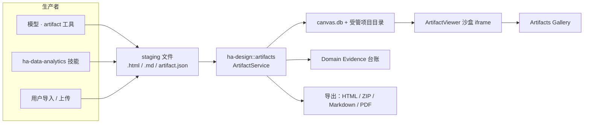
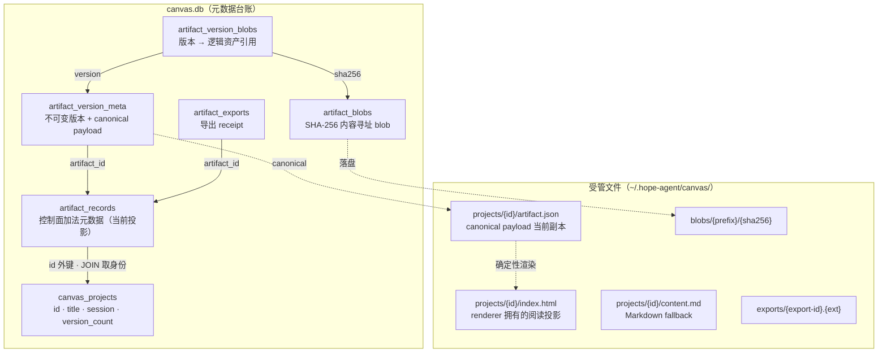
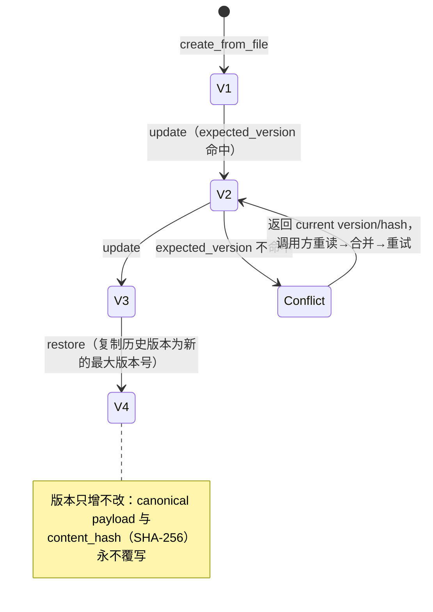
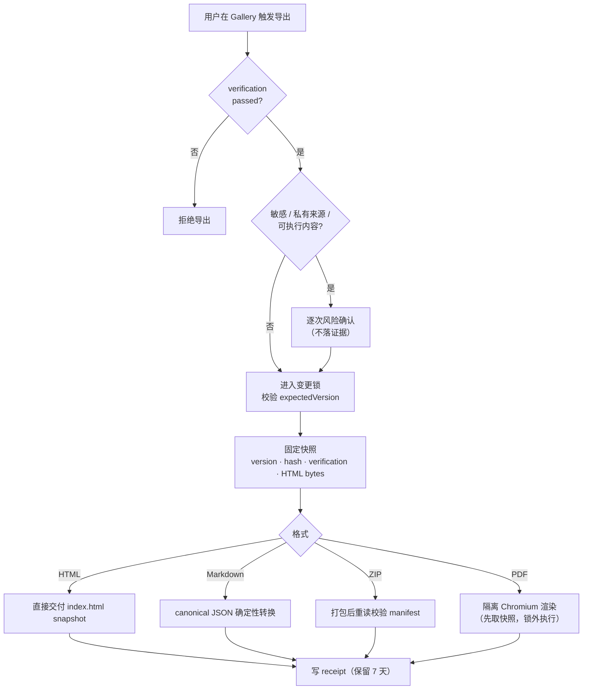

# Artifacts 本地优先产物平台

> 返回 [文档索引](../../README.md)
>
> 更新时间：2026-07-23

## 核心思想

Agent 会不断产出"值得留下来的东西"——一份数据分析报告、一个交互 Dashboard、一段说明文档。这些产物如果只是聊天流里的一段文本，就无法被引用、无法版本化、无法验证真伪、也无法交付给别人。Artifacts 要解决的正是这个问题：**把 Agent 生成的可交付页面变成有身份、有版本、有来源、可验证、可导出的一等公民。**

它建立在既有的 Canvas 存储之上。Canvas 原本负责项目目录、右侧 iframe 预览和一组兼容渲染工具；Artifacts 在其上补齐一层持久化控制面，负责**身份、不可变版本、来源追溯、证据、验证、导出、归档与 Gallery**。旧 Canvas 记录的 ID 原样成为 Artifact ID，`canvas.db` 与历史项目目录不搬家、不重写——新能力全部以"加法"方式叠加。

三个贯穿始终的设计取舍：

- **本地优先，但不等于全程本地计算。** "本地优先"指交付无需公网部署：用户把 HTML、ZIP、Markdown 或 PDF 保存到自己的设备即可。Artifact 与工作文件始终落在当前 runtime host——本地桌面是这台电脑，桌面远程／Web 是 Server 所在机器。但分析过程仍可能按当前 Provider、知识空间和连接器配置访问远端服务。
- **版本不可变。** 每次更新都产生新版本，旧版本永不覆写；更新必须携带 `expected_version`（乐观并发），restore 也是"复制历史内容→生成新版本"而非回退。这让来源、hash 和验证结果始终指向一个确定的快照。
- **确定性优先。** 结构化分析报告用 Rust 确定性渲染成正文无可执行脚本、无远程依赖的语义 HTML，保证离线、打印、审计三种场景结果一致；受管预览只附带 Hope 固定文本选区 bridge，只有 Freeform HTML 才允许作者提供的受限内联脚本。

## 系统边界



几条稳定的架构边界：

- 业务逻辑全部位于 `ha-design` crate 的 `artifacts` 模块（依赖 ha-core，零 Tauri 依赖）；Tauri 与 HTTP 只做薄壳与文件交付。
- 旧 `canvas` 工具与 `/api/canvas/*` 继续服务旧调用方；未登记的历史记录被惰性登记为 `kind=custom`、`privacy=local_private`、`producer={"type":"legacy_canvas"}`。
- Artifact 版本不可变：update 必须携带 `expected_version`，restore 生成新版本。
- 模型能调用的工具只有 create／update／show／list／versions／restore／verify。导出、脱敏复核、归档和删除只在**只对用户本人开放的 owner 控制面**（下文简称 owner 面）。
- Artifact 只保存 Domain Evidence 的 ID 与摘要；`domain_evidence_items` 才是证据本体。
- 所有持久化入口遇 incognito 一律拒绝。
- **导出**与**发布**是两个独立权限面：本版本只有本地导出，没有 LAN／Drive／WebDAV／Sites 等跨边界 Publisher。

## 当前支持的内容形态

Artifact 的生命周期是统一的，但内容不强制经过同一种中间表示。系统按 `payload_kind` 区分渲染路径：

| 输入 | `payload_kind` | 阅读器 | JavaScript | Markdown 导出 | 典型用途 |
| --- | --- | --- | --- | --- | --- |
| `artifact.json`（`hope.analysis-artifact.v1`） | `analysis` | Core 确定性分析报告 renderer | 正文无；固定预览桥 | 确定性生成 | 数据分析报告、KPI readout、数据表、分析型 explainer |
| `.md` | `freeform` | Core Markdown renderer | 正文无；固定预览桥 | 原文保留 | 普通报告、说明文档、低带宽交付 |
| `.html` / `.htm` | `freeform` | 导入 HTML + 强制离线 CSP | 可用内联脚本 | 不支持无损逆转换 | 交互 Dashboard、交互 explainer、自定义页面 |
| 历史 Canvas | `freeform` / legacy | 旧 Canvas renderer | 取决于类型 | 仅有显式 fallback 时支持 | HTML、Markdown、Code、SVG、Mermaid、Chart、Slides 兼容预览 |

这里的"交互 Dashboard"是**受限 Freeform HTML**，不是分析契约内置的 JS dashboard runtime：脚本可以操作包内 DOM 和内嵌数据，但强制注入的 CSP 禁止网络连接、远程脚本、iframe、object、embed、form 和外部导航。结构化 Analysis 报告的正文刻意保持静态；Hope 固定预览 bridge 不属于作者内容，也不改变 `capabilities.scripts=false` 的含义。

## 数据模型与存储

### 双表拆分：加法元数据 + JOIN 身份

Artifact 控制面并没有另起一套完整的记录表。`artifact_records` 只存**加法**的控制面元数据（kind、privacy、current_hash、producer、来源、证据、验证等），身份信息（title、session、agent、`version_count`）仍留在 `canvas_projects`。对外暴露的 `ArtifactRecord` 是二者 JOIN 出来的当前状态投影：



`ArtifactRecord` 投影的主要字段：

- 身份：`id`、`title`、`kind`、`content_type`；
- 归属：`session_id`、`project_id`、`agent_id`、`goal_id`；
- 生命周期：`lifecycle_state=active|archived`、`privacy`；
- 当前版本：`current_version`（来自 `canvas_projects.version_count`）、`current_hash`、`payload_kind`、`analysis_status`；
- 追溯：`source_summaries`、`evidence_summary`、`capabilities`、`verification`；
- 预览：`project_path`；
- 时间：`created_at`、`updated_at`。

`ArtifactKind` 当前接受 `report`、`dashboard`、`data_table`、`explainer`、`pr_walkthrough`、`diagram`、`slides` 和 `custom`，未知值规范化为 `custom`。

`privacy` 的持久化取值：

| 值 | 含义 |
| --- | --- |
| `local_private` | 默认，仅当前运行位置管理（本地桌面＝这台电脑，Web／桌面远程＝Server）。 |
| `shareable_snapshot` | 为未来分享准备的固定快照；当前本地导出并不等同发布。 |
| `sensitive` | 敏感产物；本地导出由 UI 逐次风险确认，未来 Publisher 必须过 Export Guard。 |
| `incognito` | schema 预留值，但 durable create／update 会直接拒绝，不进 DB、Gallery 或导出历史。 |

### 版本不可变与乐观并发

版本元数据在 `artifact_version_meta`：`(artifact_id, version_number)` 唯一，`parent_version` 记录谱系，`payload_json` 保存 canonical payload，`content_hash` 是 canonical bytes 的 SHA-256，producer／capabilities／sources／evidence／verification 按版本各存一份。



更新在 `BEGIN IMMEDIATE` 事务内**再次**比较 `expected_version`，所以 owner API 的预检并不是并发保护的唯一防线。冲突时返回当前 version／hash，调用者必须重新读取、合并后重试，没有 blind force。restore 从指定历史版本复制 canonical payload、产生新的最大版本号，不覆写旧行。

### SQLite 表与受管文件

`canvas_projects` / `canvas_versions` 保持不动，加法新增五张表：

| 表 | 职责 |
| --- | --- |
| `artifact_records` | 当前控制面元数据（与 `canvas_projects` 同 id、JOIN 取身份） |
| `artifact_version_meta` | 不可变版本元数据 + canonical payload |
| `artifact_exports` | 导出 receipt：hash、验证、受管路径、7 天过期 |
| `artifact_blobs` | SHA-256 内容寻址 blob |
| `artifact_version_blobs` | 版本 → 逻辑资产的引用 |

目录布局：

```text
~/.hope-agent/canvas/
├── canvas.db
├── projects/<artifact-id>/
│   ├── index.html       # renderer 拥有的当前阅读投影
│   ├── artifact.json    # canonical payload 的当前副本
│   └── content.md       # 可用时的 Markdown fallback
├── blobs/<sha-prefix>/<sha256>   # sha-prefix 取 hash 前两位
├── exports/<export-id>.<ext>
└── pdf-runtime/<export-id>/       # PDF 临时隔离 profile，结束后删除
```

`artifact.json` / `artifact_version_meta.payload_json` 是 analysis 版本的不可变真相源；`index.html` 是 renderer 拥有、可随时重建的投影。读取、show 或 restore 旧 Analysis Artifact 时，Core 可以原子重建当前预览（拿到新版响应式与可访问性修复），但**不得改动版本号、canonical hash、来源或 evidence**。一旦投影 bytes 变化，旧 verification 会被清空——避免把针对旧渲染的校验误当作对新页面仍然有效。

投影自愈与 Artifact／legacy Canvas 的文件变更共用 kernel 进程锁和数据根下的 OS advisory lock；Desktop、server、ACP 即使同时打开同一数据目录，也必须串行完成“读取 canonical 版本 → 清 verification → 原子替换投影”，旧读取不得覆盖另一进程刚提交的新版本。

所有受管文件写入都走 `platform::write_atomic`。创建、更新、恢复在 DB、项目文件与 blob 之间维护回滚快照，失败不会留下半提交的项目；删除后通过引用表做 blob GC。

## 文件式创建与更新

模型和 owner 入口都遵循同一个模式：**先在受控 workspace／staging 里生成文件，再由 `ArtifactService` 复制进 managed store。** 系统不与原文件保持活动链接——导入即快照。

输入约束：

- 只接受 `.html`、`.htm`、`.md`、`.json`；JSON 必须是有效的 `AnalysisArtifactV1`；
- 文件必须位于调用方允许的 workspace、agent home 或 owner 选择范围内，canonical path 仍需落在允许根目录内；
- 大小上限由 `filesystem.maxArtifactImportMb` 控制（默认 25 MiB，钳制在 1–100），且必须是 UTF-8 文本；读取前先查 metadata，再以 `limit + 1` 字节受限读取，二次防止竞态超限；
- 导入 HTML 拒绝 iframe／object／embed／form、外部导航与 redirect；
- Markdown 里的 raw HTML 当作文本处理，并拒绝外部导航链接；
- 导入后**强制注入离线 CSP**，不信任源文件自带的 CSP。

模型工具 `artifact` 的动作：

| action | 关键参数 | 行为 |
| --- | --- | --- |
| `create_from_file` | `file_path`、可选 title／kind／privacy | 复制、校验、创建 v1、打开 Canvas 预览 |
| `update_from_file` | `artifact_id`、`file_path`、`expected_version` | 乐观并发更新，成功后创建新版本 |
| `show` | `artifact_id` | 重建必要投影并触发 `canvas_show` |
| `list` | limit／offset／kind／lifecycle_state | 返回轻量 Artifact 记录 |
| `versions` | `artifact_id` | 返回版本谱系、hash、producer 与验证摘要 |
| `restore` | `artifact_id`、`version` | 从历史内容创建新版本并打开预览 |
| `verify` | `artifact_id` | 运行确定性离线与完整性检查 |

模型工具里的 `file_path` 始终解析为 runtime workspace 路径。owner 导入则同时接受 runtime-host 上的 `filePath`，或客户端经通用分块上传协议得到的 `uploadId`（`artifact_source` lease），两者严格互斥；start、complete 与导入 claim 都会重读 `maxArtifactImportMb`。成功导入消费该 lease，失败则保留至一小时后过期以便重试。

模型工具在 incognito 会话完全不可用（Artifact 当前是 durable 能力）。删除、导出与脱敏确认不暴露给模型。

## AnalysisArtifactV1

`hope.analysis-artifact.v1` 是 Hope 原生的数据分析交换契约，顶层字段包括：`question` / `audience` / `decision` / `status`、metric definitions、time range、filters、grain、bounded datasets、findings、recommendations、caveats、narrative blocks、charts、presentation tables、static fallbacks、canonical sources、data-quality 与 claim-validation 结果。

字段示例与 authoring 约束见 [`skills/ha-data-analytics/references/analysis-artifact-v1.md`](../../../skills/ha-data-analytics/references/analysis-artifact-v1.md)。Core 导入器至少会拒绝以下情况：

- schema 版本不匹配、`question` 为空，或 `status` 不是 `ready|partial|blocked`；
- 来源缺稳定 `id` 或缺 64 位十六进制 `sha256`，或出现重复 source id；
- dataset 缺 `id`／`rowCount`／bounded `rows`，内嵌超过 5000 行，`rows` 多于 `rowCount`，或引用未知来源；
- chart 缺 `sourceId`／`dataset`／`fallbackId` 绑定，或引用不存在的对象；
- data-quality 缺 `id`／`datasetId`／`check`／`method`／`status`／布尔 `blocking`，status 取值非法，或引用未知 dataset；
- claim validation 缺 `claim`／`metric`／`denominator`／`method`／`verdict`／非空 `sourceIds`，verdict 非法，或 `confidence` 越出 0–1；
- `status=ready` 却存在 `blocking=true && status=failed` 的质量检查。

`partial` 表示结论仍有使用价值但证据不完整，`blocked` 表示不能安全支撑目标决策。renderer 不会把这两类状态伪装成 ready。

## Hope Data Analytics producer

内置技能 `skills/ha-data-analytics/` 采用固定八阶段：

1. **context**：问题、受众、决策、口径、范围；
2. **sources**：附件、CSV／XLSX、项目文件、知识空间与当前已安装连接器；
3. **quality**：时效、缺失、重复、粒度、分母、join、样本、覆盖与异常值；
4. **analysis**：KPI readout、指标诊断、产品／业务决策等聚焦分析；
5. **visualization**：选图、绑定 dataset／source、生成 fallback；
6. **report**：产出完整 `AnalysisArtifactV1`；
7. **validation**：独立重算关键数字，核对口径、结论与 caveat；
8. **register**：经 `artifact` 工具创建、verify 并打开预览。

技能复用现有的 read／exec、Office XLSX、知识空间与连接器能力，不新增数据库／数仓产品面。缺少必要数据、Python 或连接器时必须输出 `partial/blocked`，不得由模型猜测补齐。

Artifact 注册时会从显式结构写入 scoped Domain Evidence：

| Artifact 信息 | Evidence relation |
| --- | --- |
| canonical source | `source_cited` |
| 确定性 data-quality 结果 | `data_quality_checked` |
| claim validation | `claim_checked` |
| Artifact 成功持久化 | `artifact_created` |
| 未来 Publisher 的 owner 发布复核 | `artifact_reviewed` |

自动记录失败不会伪造 evidence。用户批准、脱敏确认与可交付确认仍只走 owner 面的 Domain Quality／Export Guard 流程；这些证据服务的是真正的外部发布动作，不阻塞当前的本地文件导出。

## Analysis 确定性阅读器

`analysis_renderer.rs` 把 canonical JSON 渲染成正文无 JavaScript runtime、无远程依赖的语义 HTML；受管 `index.html` 只额外附带固定、精确 CSP hash 放行、由宿主 token 激活的文本选区 bridge。页面按三种阅读深度组织，让人可以按需下钻：

1. **30 秒决策层**：状态、问题、受众、决策、时间范围、首个结论 block 与排名靠前的发现；
2. **证据层**：静态 bar／SVG line 图、建议、限制、presentation tables 与指标口径；
3. **审计层**：质量检查、claim validation、方法 blocks、来源 hash 与 access scope。

渲染约束（都是为了确定性与可审计）：

- 图表只读已绑定 dataset；`type=line` 生成语义 SVG 折线，其他数值比较生成 HTML／CSS bar，不可绘制时展示 static fallback；
- `unit=percent` 只按显式语义处理，表格还需 `columnFormats.unit/scale`——禁止靠列名猜百分比；
- `tables[].columns/rows` 是优先的 presentation projection；显式空数组表示不展示，禁止回退到原始 dataset；
- finding、block、caveat 里的 Markdown raw HTML 都被当作文本，不能注入脚本；
- 中英文标签按问题／受众／决策内容里的 CJK 字符判定；
- 支持窄屏、深色、打印、`prefers-reduced-motion`，图表与表格始终附带语义文本；
- 文档根 `overflow-x:hidden`，宽表横向滚动局限在 `.table-scroll` 内，避免文档根产生残留水平滚动。

## 预览、Gallery 与滚动契约

`ArtifactViewer` 是 Gallery 与 `CanvasPanel` 共用的唯一 iframe 阅读器：

- `sandbox="allow-scripts"`，不授予 `allow-same-origin`、表单、弹窗或父窗口能力；
- `referrerPolicy="no-referrer"`；
- 本地桌面经 `convertFileSrc`，HTTP 经受保护的 `/api/canvas/projects/{id}/{path}`；用 opaque Artifact ID 解析投影，业务组件不拼受管路径；
- `refreshKey` 变化时 remount iframe（`key` 含 refreshKey），确保 reload／restore 用上新页面状态。
- 受管 projection 可以注入 app-authored 文本选区 bridge，但宿主只在后端**重新读取当前 `index.html`**并确认 bridge marker 与精确的 script-isolated CSP 同时存在后，才返回 `capabilities.selectionBridgeTrusted=true` 并激活它。`ArtifactViewer` 每次文档 load 用 version + 随机 token 关联当前导航，只接受当前 iframe `WindowProxy` 回传、finite rect 与不超过 20,000 字符的完整文本（超限不截断引用）。选区完成后自动显示「复制 / 引用到对话」，引用只进入当前主对话草稿，不自动发送；右键原生语义不被 bridge 接管。
- 静态 projection 的 CSP 只额外放行 bridge 精确脚本 hash，不开放任意作者脚本；历史 Hope 静态 projection 可幂等自愈。Freeform HTML、Slides 等可执行 projection 即使也包含 bridge，宿主仍 fail-closed 不激活，只保留 iframe 内原生选择／复制。随机 token 只用于关联一次导航，不能把同一 iframe 里的作者脚本认证成可信发送者。

顶层 `ArtifactsView` 当前提供：

- 带统一搜索图标与清空动作的标题客户端搜索，以及 kind／state 的服务端分页；
- 可折叠、可拖拽调宽的左侧产物列表与右侧属性面板，折叠状态与宽度都存本机 `localStorage`；
- kind、privacy、analysis／verification status、source type／access scope 与 payload kind 只经 i18n label 显示；未知后端值统一显示本地化"未知"，不直接暴露内部 snake_case；
- 当前版本、隐私、来源数量、analysis／verification 状态与 executable 标记；
- 统一 Viewer、来源／质量摘要、版本历史与 restore；
- Viewer 正文选区可复制或带到当前主对话；跨 Gallery → Chat 用一次性 nonce 投递到当前 composer，切换视图不会把 quote 直接发出；
- Viewer 支持带 FLIP 过渡的应用内最大化阅读：最大化时隐藏左右辅助面板、保留产物操作栏，可用恢复按钮或 `Escape` 平滑返回；系统开启"减少动态效果"时直接切换、不强制动画；
- verify，HTML／ZIP／Markdown／PDF 本地导出，archive 与 delete；Publisher review 入口当前不在 Gallery 展示。

首版没有源码编辑器、富文本编辑器或正文直改入口；内容由 Agent 生成新文件、经乐观并发 update 维护。

### iframe 面板布局不变量

iframe 的滚动由 iframe document 自己处理，外层只负责裁剪与尺寸。由此派生出几条容易踩坑的约束：

- 从 `ChatScreen` 自动打开 Canvas 时，`CanvasPanel` 不采用 `RightPanelShell` 的 zero-width mount 动画；
- iframe 已挂载后不允许再把祖先设成 `width:0`、`aria-hidden` 或 `inert`——否则 WebKit／WebView 的 hit testing 与 wheel routing 可能要到 remount 才恢复；
- `RightPanelShell`、面板 body、iframe wrapper 与 `ArtifactViewer` 的 flex 高度链必须保留 `min-h-0`；
- iframe wrapper 用 `overflow-hidden`，不叠加滚动 fade mask；正文纵向滚动在 iframe 内，宽表横向滚动在 `.table-scroll` 内；
- 手动切换、会话恢复、`canvas_show` 自动展开、最大化与重新附着都必须得到相同的可交互布局。

回归测试 `internalRightPanelOverlay.test.tsx` 覆盖了"自动展开时 shell 不为 `width:0`、不带 `aria-hidden`、不带 `inert`"这一组条件。

## Verification

`ArtifactService::verify` 对当前版本执行一组确定性检查，并把报告写回 record 与 version：

- `content_hash`：canonical payload 与 `current_hash` 一致；
- `managed_payload`：受管 `artifact.json` 与版本 payload 一致（legacy 除外）；
- `html_document`：`index.html` 是可读 HTML 文档；
- `content_security_policy`：存在显式 CSP；
- `offline_dependencies`：不含 HTTP(S) 资源、`@import`、`fetch`／`XMLHttpRequest`／`WebSocket`／`EventSource`／`sendBeacon` 等网络路径；
- `external_navigation`：不含外部导航／redirect；
- `forbidden_embeds`：不含 iframe／object／embed／form；
- `semantic_fallback`：含 h1／h2／main／article／p 等语义内容。

任一检查失败即令 verification 为 `failed`，并阻断所有导出。Analysis renderer 更新导致投影变化时，verification 会被清空、需要重新运行。

## 导出与交付

所有本地导出格式**只要求当前 Artifact verification 通过**，不要求填写接收者，也不创建 `artifact_reviewed` evidence。命中以下任一条件会在 UI 导出动作当下触发一次明确风险确认（该确认不落证据、也不伪装成外部发布授权）：`privacy=sensitive`；任一来源的 `accessScope=private|connector|sensitive`；或导出 HTML／ZIP 且 capability manifest 标记 `executableContent=true`。可执行能力同时识别新 Artifact 的 `executableContent` 与旧 Canvas 的 `scripts` manifest，避免兼容项目漏提示。

导出不是对可变 `index.html` 的无锁读取，整个流程被一把锁串起来保证一致性：



风险确认前，Gallery 会重新读取当前 Artifact：若版本已不同于用户正在阅读的版本，会先刷新 Viewer 与版本历史并终止本次动作，要求用户复查新内容后再导出，禁止静默导出尚未展示的版本。版本一致时才把它作为 `expectedVersion` 传给 Tauri／HTTP；Core 在 Artifact 与 legacy Canvas 共用的变更锁内再校验一次版本，不一致返回 conflict。同步格式随后固定 version、content hash、verification 与 HTML bytes，并在打包前再比一次当前 version／hash；ZIP 直接用这份 HTML byte snapshot。PDF 也先在同一把锁内取得并确认快照，**再释放锁**去执行耗时的 Chromium 渲染，避免长时间阻塞更新——即使渲染期间产生了新版本，receipt、文件名、内容与 verification 仍全部指向开始导出时的那个版本。

### HTML

直接交付当前受管 `index.html`。Analysis／Markdown 的作者内容是确定性静态页面，文件中只额外保留未获宿主激活时惰性的 Hope 选区 bridge；Freeform HTML 可能含作者内联脚本，因此 UI 只按作者内容显示 executable content 标记，App 也不会为它开启宿主选区浮层。HTML verifier 通过只表示"未发现已知远程依赖"，不表示接收者在普通浏览器里直接打开任意可执行 HTML 等同于 Hope 的 iframe 沙盒。

### Markdown

- Analysis 由 canonical JSON 确定性转换，含问题、口径、blocks、发现、建议、图表 fallback、表格、质量、claim 与来源；
- Markdown Artifact 原样导出；
- 没有作者 Markdown fallback 的 Freeform HTML 明确失败，不做伪无损逆转换。

### ZIP

当前 ZIP 的实际布局：

```text
artifact-<title>-v<version>.zip
├── index.html
├── artifact.json
├── manifest.json
├── report.md             # 有 Markdown fallback 时
├── verification.json
└── sources/README.md
```

`manifest.json` 保存 schema 版本、Artifact ID／version、title、kind、privacy、generator version，以及每个成员的 MIME、大小与 SHA-256。生成后立即重读 ZIP 并重算 manifest，不一致就不交付。ZIP 当前不自动内嵌 PDF，也不打包聊天原文、附件原件、工具结果或连接器原始内容。

### PDF

PDF 使用与 HTML 相同的页面和 print CSS，全程在隔离环境里跑：

1. `resolve_chrome_executable_for(..., "artifact_pdf")` 选择系统 Chrome，找不到时选 Hope 缓存的 Chromium runtime；
2. 创建独立的 `pdf-runtime/<export-id>` user-data-dir 与独立 CDP 端口；
3. 把已验证的 HTML byte snapshot 原子写进该隔离目录，headless 只打开这份 `file://.../artifact.html`，不再读取可能变化的当前项目文件；
4. 调 `Page.printToPDF`，A4（8.27×11.69 in）、纵向、打印背景；
5. 校验 `%PDF-` magic、非零页数与文本可提取性；
6. disconnect 并删除临时 profile。

系统 Chrome 与 Hope runtime 都不存在时，保存一条 failed receipt，并触发统一的 `browser:runtime_required` 安装提示；用户可在设置里安装"备用 Chromium runtime"。HTML／ZIP／Markdown 不受 PDF runtime 缺失影响；当前不实现另一套 Rust PDF 排版降级。

### Export receipt

受管导出记录 format／status、filename、MIME、size、SHA-256、verification、error、内部路径与过期时间。受管文件与 receipt 默认保留 7 天，`ArtifactService::open` 时清理过期记录与文件。

Tauri 先打开保存对话框，再由 Core 生成受管文件并原子复制到目标路径；HTTP 先创建 receipt，再经 `/api/artifact-exports/{exportId}/download` 流式下载同一文件。大文件不走 JSON／base64 IPC。

## 本地导出、Publisher Guard 与隐私

本版本的 HTML／ZIP／Markdown／PDF 都是 owner 把文件保存到自己的设备——属于本地文件生成，不是发送、共享或发布。因此 Core 的 `export` / `export_async` 不调用 Domain Export Guard，也不要求"预期接收者"；确定性 verification 仍是硬门禁。

Gallery 对下列任一条件只做**逐次本地风险确认**：

- `privacy=sensitive`；
- 任一来源 `accessScope=private|connector|sensitive`；
- 导出 HTML／ZIP 且 capability manifest 标记 `executableContent=true`。

真正的跨边界动作留给未来的 Publisher（LAN、Drive、WebDAV、Sites、邮件等）。Publisher adapter 必须在执行前调用 `ArtifactService::enforce_publish_guard`：对 `privacy=shareable_snapshot|sensitive`、来源 `accessScope=private|connector|sensitive`、或 `redistributable=false` 的内容，要求当前版本的 owner review 与 Domain Export Guard 双双通过。现有的 `review_for_export` / `export-review` API 作为这层未来适配的兼容底座保留，但当前 Gallery 不展示入口，本地 export 也不调用它。

无痕契约：

- incognito session 禁止 Canvas／Artifact 的 create、update、restore、delete 与 export；
- 已有 durable Artifact 的普通会话不能切换为 incognito；
- 普通会话删除时 Artifact 保留在 Gallery，但解除失效的 session 关联；
- purge 路径删除该会话关联的 durable Artifacts；
- 本版本没有内存态 incognito Artifact——在实现之前持久化入口保持拒绝。

## API、Transport 与事件

| Owner 动作 | HTTP | Tauri |
| --- | --- | --- |
| list／get | `GET /api/artifacts`、`GET /api/artifacts/{id}` | `list_artifacts`、`get_artifact` |
| import／update | `POST /api/artifacts/import` | `import_artifact` |
| versions／restore | `GET .../{id}/versions`、`POST .../{id}/restore` | `list_artifact_versions`、`restore_artifact` |
| verify | `POST .../{id}/verify` | `verify_artifact` |
| publisher review（预留） | `POST .../{id}/export-review` | `review_artifact_export` |
| export／download | `POST .../{id}/exports`、`GET /api/artifact-exports/{exportId}/download` | `export_artifact` + native save dialog |
| archive／delete | `POST .../{id}/archive`、`DELETE .../{id}` | `archive_artifact`、`delete_artifact` |

前端只经 `Transport` 与 `FileResourceAdapter` 抽象访问 HTTP 与 Tauri：打开文件在本地桌面交给系统默认应用，在桌面远程／Web 使用受保护的浏览器 URL。HTTP 侧的 Artifact ID 经字母数字／`-`／`_` 白名单；导出下载通过 canonical containment 限制在受管 exports 目录内，并带 attachment／no-referrer headers。

EventBus 当前发出：

- `artifact:created`、`artifact:updated`、`artifact:verified`；
- `artifact:export_running`、`artifact:export_ready`、`artifact:export_failed`；
- `artifact:archived`、`artifact:deleted`；
- 预览仍复用 `canvas_show` / `canvas_reload` / `canvas_deleted`。

## Canvas 兼容迁移

`ArtifactService::open` 惰性扫描 `canvas_projects`：

- 旧 ID 不变，Gallery 直接能看到历史项目；
- 当前 hash 与版本 metadata 按需回填；
- legacy Canvas 仍可经旧 API 更新，成功后同步 Artifact 投影；
- 一旦记录被 Artifact 控制面接管，旧 Canvas mutation 会被拒绝，必须走带 `expected_version` 的 Artifact update；
- `/api/canvas/*` 与 `canvas` 工具继续服务旧调用方，但身份、来源、导出或验证等新能力不再扩张 Canvas 控制面。

Canvas renderer 离线自包含：Markdown 在 Rust 里渲染，Mermaid／Chart 等 legacy 类型提供可读的 source／table fallback，不依赖任何外部脚本或 CDN；HTML snapshot bridge 明确提示改用 app 拥有的 capture path。

## 测试与回归面

后端测试覆盖：ready／blocked 的 `AnalysisArtifactV1` fixtures 与结构验证；expected-version 冲突、restore 新版本与 legacy backfill；原子写／事务失败回滚、blob 引用与 GC；HTML／CSP／远程依赖／forbidden embeds verifier；ZIP manifest 大小／hash 重算；本地导出只受 verification 约束、Publisher Guard 与 current-version owner review 保持独立；PDF receipt 与基础文件 QA；incognito fail-closed 与 session cleanup。

数据分析 fixtures 位于 `crates/ha-design/tests/fixtures/artifacts/`，含 `activation.csv`／`activation.xlsx` 与 `analysis-ready.json`／`analysis-blocked.json`；独立重算脚本 `fixture_recompute.py` 与 schema validator `validate_analysis_artifact.py` 则在 `skills/ha-data-analytics/scripts/`。前端通过 typecheck 与 panel／skill mention 单测覆盖 Gallery transport、`@数据分析` token 渲染、统一 Viewer、选区消息校验与自动展开 iframe 的交互状态。

## 当前限制与后续阶段

- Gallery 当前没有 project／agent／time 服务端筛选，也没有标题／主题／区块顺序编辑器。
- blob store 目前只覆盖 canonical payload，尚未实现通用多资产复制、内容寻址 manifest 与按单文件大小阈值自动切换 ZIP。
- 结构化 Analysis renderer 原生支持 bar／line 与语义 fallback，不是通用 Vega／Chart.js runtime；交互图表走 Freeform HTML。
- ZIP 当前不内嵌 PDF，PDF 需单独导出。
- 没有 `SlidePlanV1`、editable PPTX、layout audit 或 `PptxView` 这样的 Artifact adapter。
- 没有内存态 incognito Viewer，在此之前持久化入口保持拒绝。
- 没有 Publisher adapter；后续 LAN、企业存储或 Sites 必须各自提供严格审批、凭据、保留期、撤销与审计，不能复用普通 export 权限。

## 主要实现文件

| 文件 | 角色 |
| --- | --- |
| `crates/ha-design/src/artifacts/mod.rs` | 数据模型、迁移、service、验证、证据、导出与 PDF |
| `crates/ha-design/src/artifacts/analysis_renderer.rs` | Analysis 确定性离线阅读器 |
| `crates/ha-design/src/tool_artifact.rs` | 非破坏性模型工具 |
| `crates/ha-server/src/routes/artifacts.rs` | HTTP owner API 与流式下载 |
| `src-tauri/src/tauri_wrappers.rs` | Tauri owner API 与保存路径复制 |
| `src/lib/transport*.ts` | Tauri／HTTP 统一前端契约 |
| `src/components/artifacts/ArtifactsView.tsx` | Gallery、详情、复核与导出 UI |
| `src/components/artifacts/ArtifactViewer.tsx` | Gallery／Canvas 共享 iframe 阅读器 |
| `skills/ha-data-analytics/` | Hope 原生数据分析 producer |
