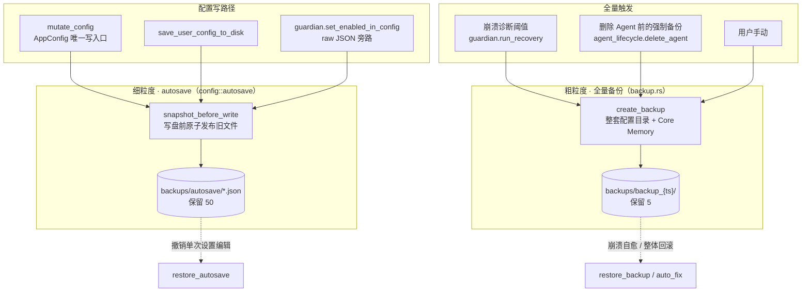
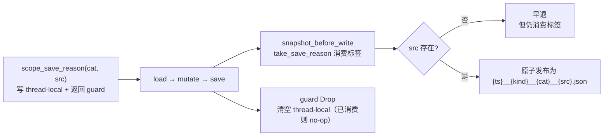
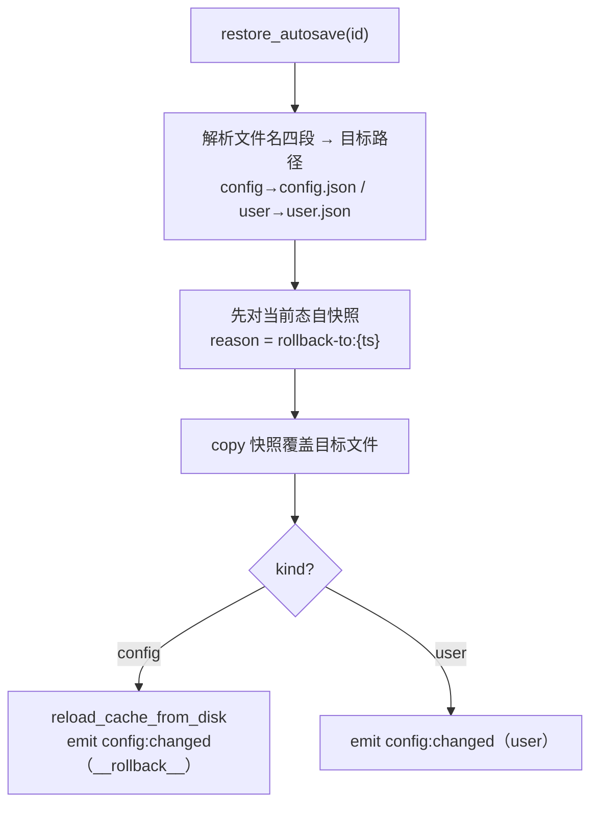

# 备份 / 自动快照（Backup / Autosave）

> 返回 [文档索引](../../README.md)
>
> 关联源码：
> - [`crates/ha-core/src/backup.rs`](../../../crates/ha-core/src/backup.rs) —— 全量备份 / 恢复、autosave 列举与回滚、历史备份凭据洗刷
> - [`crates/ha-core/src/config/autosave.rs`](../../../crates/ha-core/src/config/autosave.rs) —— 写前快照原语与 reason 标签
> - 调用方：[`config/persistence.rs`](../../../crates/ha-core/src/config/persistence.rs)、[`user_config.rs`](../../../crates/ha-core/src/user_config.rs)、[`guardian.rs`](../../../crates/ha-core/src/guardian.rs)、[`self_diagnosis.rs`](../../../crates/ha-core/src/self_diagnosis.rs)、[`agent_lifecycle.rs`](../../../crates/ha-core/src/agent_lifecycle.rs)、[`server_auth.rs`](../../../crates/ha-core/src/server_auth.rs)

## 核心思想

Backup / Autosave 是一张**配置安全网**。它不持有任何业务数据（会话、记忆、知识库都各有各的备份路径），只在配置写盘的关键路径上自动留痕，让两类事故可回滚：

- **一次手滑改坏配置**——比如把某项设置改错，事后想撤销；
- **崩溃循环导致配置损坏**——比如 `config.json` 写到一半进程崩溃、下次启动读不出来。

关键想法是用**两套预算独立、粒度不同的备份**分别覆盖这两类事故，而不是共用一套。**配置 autosave** 走细粒度：每次配置写盘前把旧文件流式完整复制到同目录临时文件，`fsync` 后再原子发布单文件快照（`config.json` 或 `user.json`），保留最近 50 份，专供撤销某一次设置编辑；复制过程保持常量内存，不为无界 JSON 再分配一份完整缓冲。**全量备份** 走粗粒度：在崩溃诊断命中阈值、删除 Agent 前或用户手动时，把整套配置目录连同 Core Memory 一起快照，保留最近 5 份，用于崩溃自愈与整体回滚。逐项对照见下节《两套备份的分工》。

两套都落在 `~/.hope-agent/backups/` 下，都以**「失败永不阻塞合法写」**为铁律实现：备份只是安全网，绝不能因为安全网破损而拦住用户的正常配置写。核心逻辑集中在 `ha-core`（零 Tauri 依赖），桌面 / server 只做薄壳转发。

> self-update 子系统另有一个完全独立的 [`ha-updater/src/backup.rs`](../../../crates/ha-updater/src/backup.rs)，负责把旧的可执行二进制存起来 / 保留 / 回滚，与本文的**配置**备份是两个互不相干的子系统。见 [自升级](self-update.md)。

## 两套备份的分工

| 维度 | 全量备份 | 配置 autosave |
|---|---|---|
| 入口 | `create_backup` | `snapshot_before_write` |
| 触发 | 崩溃诊断命中阈值 / 删除 Agent 前 / 用户手动 | `config.json` / `user.json` 写盘前 |
| 范围 | `config.json` + `user.json` + `memory.md` + `credentials/auth.json` + `agents/` + 全局 `memory/` + 各项目 `projects/{id}/memory/` | 单文件（`config.json` **或** `user.json`） |
| 粒度 | 整套配置目录 + Core Memory 快照 | 单次写盘前的旧文件 |
| 落盘 | `backups/backup_{时间戳}/`（目录） | `backups/autosave/{...}.json`（单文件） |
| 保留 | `MAX_BACKUPS = 5` | `MAX_AUTOSAVES = 50` |
| 列举 / 恢复 | `list_backups` / `restore_backup` | `list_autosaves` / `restore_autosave` |
| 用途 | 崩溃自愈、整体回滚、删 Agent 前留底 | 撤销某一次设置编辑 |

**为什么预算要分离**：若两套共用配额，一阵密集的设置编辑产生的 autosave 洪水会把用户上一次手动全量备份挤掉。分开算配额，二者互不干扰。因此 `self_diagnosis` 在 `config.json` 损坏时恢复走的是**全量备份目录**（`list_backups().first()` 取最新），而非 autosave——autosave 只服务撤销单次设置编辑，救不了整体损坏。

## 全量备份：create_backup / list_backups / restore_backup

### create_backup —— 快照一整套配置

`create_backup` 在 `backups/backup_{UTC 时间戳}/`（格式 `%Y-%m-%dT%H-%M-%S`）下逐项复制：

- 顶层文件 `config.json` / `user.json` / `memory.md`（存在才拷；流式写入同目录临时文件、`fsync` 后原子发布，故无大小上限的旧 `memory.md` 不会被整体读入内存）；
- `credentials/auth.json`（OAuth 凭据）；
- `agents/` 整目录递归复制（含各 Agent 的 Core Memory）；
- 全局 `memory/` 目录递归复制（全局 Core Memory）；
- 各项目**只**复制 `projects/{uuid}/memory/`——刻意跳过项目工作区，这样大体积的项目目录永远不会混进一份配置备份。

**单文件 / 子目录复制失败只 `app_warn` 继续**，不中断整次备份。末尾调 `rotate_backups_internal` 轮转，返回备份目录路径字符串。

### list_backups —— 倒序列举

扫 `backups_dir` 下 `backup_` 前缀的目录，按目录名**倒序**（时间戳前缀，故最新优先）返回 `BackupInfo` 列表，`created_at` 取自目录 `metadata.created()`。

### restore_backup —— 精确快照式恢复

按名定位备份目录，把其中内容复制回 `~/.hope-agent/` 根：

- 顶层文件与 `credentials/auth.json` 直接覆盖；
- `agents/` **先删后复制**——保证恢复结果是备份时的精确快照而非与现存目录合并；
- 全局 `memory/` 与各项目 `memory/` 经 `replace_dir_from_backup`**原子替换**（见下文安全一节）；
- 恢复完成后 `invalidate_all_session_snapshots()` 使运行中会话丢弃过期的内存态 Core Memory，并 emit `memory:core_changed`（`scopeType="all"`, `action="restore_backup"`）；
- 末尾调 [`config::reload_cache_from_disk`](config-system.md) 刷新内存配置快照，让恢复立即对运行中实例生效。

## 配置 autosave：snapshot_before_write

### 为什么这套原语住在 config 而不是 backup

写前快照是**配置写路径的安全网，必须无条件执行**。而 `hope-agent server setup` 与几个 server 入口会在 `init_runtime` **之前**（或完全绕过它）写 config——任何「装配期注册钩子」的做法都会在这些路径上静默失效。所以 autosave 原语（`snapshot_before_write` / `scope_save_reason` / `SaveReasonGuard`）落在 `config::autosave`，由 persistence **直调**；`backup.rs` 再把它们重导出，`crate::backup::scope_save_reason` 之类的既有调用路径保持不变。

### snapshot_before_write —— 唯一入口

`snapshot_before_write(src, kind)` 是配置 autosave 的**唯一入口**（`kind ∈ "config" | "user"`）：

1. 若 `src` 文件**不存在**（首次保存，无旧文件可拷）→ 早退，但**仍消费掉 reason 标签**（防止标签泄漏给下一次无关写）。
2. `src` 存在 → 经 `take_save_reason` 取出并清空 reason 标签，调用 `copy_secure_file_atomic` 把 `src` 流式复制到 credential-grade sibling temp，完成 `fsync` 后再原子发布进 `autosave_dir`（不会暴露半写入的最终 `.json`，也不会整体缓冲无界配置），文件名编码 `{timestamp}__{kind}__{category}__{source}.json`，末尾 `rotate_autosaves` 轮转。
3. **过程中任何错误只 `app_warn`，绝不向上传播**——合法写永远优先于快照成功。

### reason 标签机制（thread-local）

autosave 文件名里的 `category` / `source` 来自一个 thread-local 标签，用来记录「这次写盘是为什么」，生命周期由 RAII guard 管理：

- **`scope_save_reason(category, source)`**：设置 thread-local `NEXT_SAVE_REASON` 并返回 `SaveReasonGuard`。调用方**必须持有 guard 直到 save 完成**——guard `Drop` 时清空标签，保证即使 save 根本没发生也不污染后续写。
- **`take_save_reason`**：取出并清空标签（**消费一次**语义）；缺省返回 `unknown/unknown`。

典型用法：写入路径先 `let _guard = scope_save_reason(category, source);`，随后 `load → mutate → save`，save 内部对旧文件调 `snapshot_before_write`，由它 `take_save_reason` 拿到标签写进文件名。

### restore_autosave —— 可逆的单文件回滚

- **`list_autosaves`**：扫 `autosave_dir` 下 `.json`，按 `__` 解析四段（**非四段直接跳过**），按 `timestamp` 倒序（最新优先）。
- **`restore_autosave(id)`**：按 `id`（文件名 stem）定位快照，按 `kind` 解析目标路径。**覆盖前先对当前态自快照**（reason 标 `rollback-to:{ts}`，保证「回滚这个动作本身」也可逆——可以「撤销这次撤销」），再覆盖目标文件。`config` 走 `reload_cache_from_disk` 刷新内存并 emit `config:changed`（`category="__rollback__"`）；`user` 走 emit `config:changed`（`category="user"`）。

## 保留策略与轮转

两套各自独立轮转，**均依赖文件名 / 目录名字典序 == 时间序**（都以时间戳为前缀）：

- **`rotate_backups_internal(keep)`**：按目录名升序（最旧在前）排列全量备份，超 `keep` 删最旧。
- **`rotate_autosaves(keep)`**：按文件名升序排列 autosave `.json`，超 `keep` 删最旧。

辅助函数 `sanitize_slug` 把 `category` / `source` 段中非 `[A-Za-z0-9_-]` 的字符替换为 `-`，保证文件名安全；`copy_dir_recursive` 供 `agents/` / `memory/` 的备份与恢复复用。

> 改时间戳格式会破坏「字典序 == 时间序」的前提，进而破坏轮转对「最旧」的判定。

## 备份文件里的凭据洗刷

配置备份是普通的回滚数据，**可能被拷到别的机器**，因此其中不能残留敏感凭据。历史上 server Owner Token 曾以 `server.apiKey` 存在 `config.json` 里，凭据迁移到独立凭据库后，`scrub_legacy_server_tokens`（在 `backup.rs`）会**清扫所有历史备份**——遍历 `backups/autosave/*__config__*.json` 与每个 `backups/backup_*/config.json`，剥掉 `server.apiKey`，回写时用 `write_secure_file` 保持 0600 权限。解析与活动配置一样容忍 UTF-8 BOM；若文件已经损坏到无法解析，隔离目录会先强制为 0700，原始字节再以 0600 原子移入 `credentials/quarantine/legacy-config-backup-<id>.json.corrupt` 并告警，成功隔离后不再让一个不可用的回滚点阻断整次启动；隔离失败或并发检测到文件已变化则 fail closed、保留原文件并报错。它由凭据迁移路径（`server_auth::clear_legacy_config_token`）调用，且**拒绝跟随符号链接**：备份树是数据，不是改写树外任意文件的授权。

与之配套，`config::clear_legacy_server_token_without_backup` 在清除**活动** config 里的旧 token 时**刻意跳过 autosave**——否则会把带密的 config 拷进普通 autosave 树，等于把刚要清掉的密又留了一份。

## 核心数据结构

| 符号 | 定义位置 | 角色 |
|---|---|---|
| `BackupInfo` | `backup.rs` | 全量备份条目，序列化 camelCase，`{ name, path, created_at: u64 }`；`created_at` 取自目录 `metadata.created()` |
| `AutosaveEntry` | `backup.rs` | autosave 条目，序列化 camelCase，`{ id, timestamp, kind, category, source }`；`id` 是文件名 stem，其余四段从文件名 `splitn(4, "__")` 解析 |
| `SaveReason` | `config/autosave.rs` | 私有 struct，`{ category, source }`，描述「下一次 save 的原因」 |
| `SaveReasonGuard` | `config/autosave.rs` | RAII guard，`Drop` 时清空 thread-local `NEXT_SAVE_REASON`；经 `backup.rs` 重导出 |
| `MAX_BACKUPS` | `backup.rs` | `const usize = 5`，全量备份保留数 |
| `MAX_AUTOSAVES` | `config/autosave.rs` | `const usize = 50`，autosave 保留数 |

## 持久化路径

路径集中由 [`paths.rs`](../../../crates/ha-base/src/paths.rs) 提供（`backups_dir()` / `autosave_dir()`）：

| 路径 | 内容 |
|---|---|
| `~/.hope-agent/backups/` | 全量备份根 |
| `~/.hope-agent/backups/backup_{UTC %Y-%m-%dT%H-%M-%S}/` | 单次全量备份目录（`config.json` / `user.json` / `memory.md` / `credentials/auth.json` / `agents/` / `memory/` / `projects/{id}/memory/` 副本） |
| `~/.hope-agent/backups/autosave/` | 配置 autosave 根 |
| `~/.hope-agent/backups/autosave/{%Y-%m-%dT%H-%M-%S-%3f}__{kind}__{category}__{source}.json` | 单个 autosave 快照——**元数据全编码进文件名，无 sidecar 索引** |

autosave 文件名带毫秒（`%3f`），避免同一秒内多次写盘碰撞；全量备份目录按秒命名（不会高频触发故无需毫秒）。

## 调用方与集成点

| 调用方 | 行为 |
|---|---|
| `config::mutate_config`（[`config/persistence.rs`](../../../crates/ha-core/src/config/persistence.rs)） | **所有 `AppConfig` 写入的唯一入口**：取写锁 + `scope_save_reason(reason)` + `load → mutate → save`，save 内部对旧 `config.json` 调 `snapshot_before_write`。是 autosave 标签的主要来源 |
| `user_config::save_user_config_to_disk` | `user.json` 写盘前调 `snapshot_before_write(path, "user")` |
| `guardian::set_enabled_in_config`（[`guardian.rs`](../../../crates/ha-core/src/guardian.rs)） | `guardian.enabled` 是 `AppConfig` schema **之外**的 raw JSON 字段，刻意绕过 `mutate_config` 直接读写；但写前仍**手动** `scope_save_reason("guardian", "guardian")` + `snapshot_before_write`，守住 rollback 契约 |
| `guardian::run_recovery` | 崩溃恢复中 `crash_count` 命中诊断阈值时调 `create_backup()` 做全量备份，并 `crash_journal.set_last_backup` 记录 |
| `agent_lifecycle::delete_agent`（[`agent_lifecycle.rs`](../../../crates/ha-core/src/agent_lifecycle.rs)） | 删除 Agent **前的强制备份**：先 `create_backup()`，再校验备份里确有该 Agent 的 `agent.json` 与 `config.json`，验证通过才继续删除 |
| `self_diagnosis::try_restore_config_from_backup`（[`self_diagnosis.rs`](../../../crates/ha-core/src/self_diagnosis.rs)） | `config.json` 损坏时取 `list_backups().first()`（**最新全量备份**）经 `restore_backup` 恢复——**不用 autosave** |
| `server_auth::clear_legacy_config_token`（[`server_auth.rs`](../../../crates/ha-core/src/server_auth.rs)） | 凭据迁移时调 `scrub_legacy_server_tokens()` 清扫历史备份中的旧 Owner Token |

## 对外接口面（Tauri / HTTP / 工具）

桌面与 server 各暴露两组命令，分别对应全量备份（`crash/backups`）与配置 autosave（`settings/backups`）：

| 用途 | Tauri 命令 | HTTP 路由 |
|---|---|---|
| 列出全量备份 | `list_backups_cmd` | `GET /api/crash/backups` |
| 创建全量备份 | `create_backup_cmd` | `POST /api/crash/backups` |
| 恢复全量备份 | `restore_backup_cmd` | `POST /api/crash/backups/restore` |
| 列出 autosave | `list_settings_backups_cmd` | `GET /api/settings/backups` |
| 恢复 autosave | `restore_settings_backup_cmd` | `POST /api/settings/backups/restore` |

`list_settings_backups` / `restore_settings_backup` 同时以**工具**形式提供给模型（`ToolTier::Standard`、`internal`，`default_for_main: true` / `default_for_others: false` / `default_deferred: true`——主 Agent 默认加载、其它 Agent 不加载，开启延迟加载模式时是 `tool_search` 可发现的 deferred 候选），见 [工具系统](../core/tool-system.md)。`restore_settings_backup` 标注为 HIGH 风险，工具描述要求调用前必须向用户确认。命令对照详见 [api-reference.md](../system/api-reference.md)。

## 事件

| 事件 | 触发 |
|---|---|
| `config:changed` | `restore_autosave` 回滚后发出（`config` 回滚 `category="__rollback__"`，`user` 回滚 `category="user"`）；`restore_backup` 内经 `reload_cache_from_disk` 刷新内存快照 |
| `memory:core_changed` | `restore_backup` 恢复后发出（`scopeType="all"`, `action="restore_backup"`），使运行中会话丢弃过期的 Core Memory 内存态 |

## 安全 / 非显然行为

- **失败永不阻塞合法写**：`snapshot_before_write` 内部所有错误只 `app_warn` 不向上传播；`create_backup` 内单文件 / 子目录 copy 失败也只 warn 继续。安全网破损绝不能拦住用户的正常配置写。
- **两套备份各管一类事故**：`self_diagnosis` 恢复损坏 config 走的是**全量备份目录**（`list_backups().first()`）；autosave 只服务「撤销某次设置编辑」，救不了整体损坏。
- **reason 标签消费语义**：guard 必须持有到 save 完成；`take_save_reason` 取出即清空（消费一次）。`snapshot_before_write` 在 `src` 不存在 / 出错的早退路径也会消费掉 reason，防止泄漏给下一次无关写。
- **文件名结构是稳定契约**：autosave 文件名靠 `splitn(4, "__")` 解析，分隔符 `__` 不可改；`category` / `source` 经 `sanitize_slug` 兜底安全字符，但四段结构本身是契约。
- **回滚前自快照不可省**：`restore_autosave` 覆盖前先对当前态自快照，保证回滚动作本身也可逆——这一步是闭环可逆性的关键。
- **符号链接一律不跟随**：`copy_dir_recursive` 遇符号链接跳过并 warn；`create_backup` / `restore_backup` / `scrub_legacy_server_tokens` 的源与目标都先 `symlink_metadata` 校验，拒绝非目录 / 符号链接。备份树是数据，不能被篡改的链接诱导去读写树外文件。
- **Core Memory 恢复走原子替换**：`replace_dir_from_backup` 先把整份目录暂存到目标旁边，再原子 `rename` 就位、失败回滚——一份被篡改 / 半截失败的备份因此绝不会把当前可用的 Core Memory 目录删空。
- **备份里不留凭据**：`scrub_legacy_server_tokens` 清扫历史备份中的旧 `server.apiKey`；BOM 正常剥除，无法可靠解析的文件只有成功原子移入凭据隔离区后才退出普通备份枚举，隔离失败或并发变化均 fail closed；`clear_legacy_server_token_without_backup` 刻意跳过 autosave，避免把带密 config 拷进快照树。
- **guardian.enabled 刻意绕过 mutate_config**：它是 `AppConfig` schema 之外的 raw JSON 字段，走不了 `mutate_config`，故意直接读写；写前仍手动 `scope_save_reason` + `snapshot_before_write` 守住 rollback 契约。
- **预算分离有意为之**：`MAX_BACKUPS` / `MAX_AUTOSAVES` 各算各的，防一阵设置编辑的 autosave 洪水把用户上一次手动全量备份挤掉。
- **轮转依赖时间序前缀**：轮转判「最旧」靠文件名 / 目录名字典序 == 时间序，改时间戳格式会破坏这一前提。
- **与 updater 备份隔离**：[`ha-updater/src/backup.rs`](../../../crates/ha-updater/src/backup.rs) 负责旧二进制的存储 / 保留 / 回滚，与本配置备份子系统互不相干。

## 与相邻子系统的关系

| 子系统 | 关系 |
|---|---|
| [配置系统](config-system.md) | `mutate_config` 写盘前经 `snapshot_before_write` 落旧文件；`scope_save_reason` 提供 `(category, source)` 人类可读标签；回滚经 `reload_cache_from_disk` + `config:changed` 生效 |
| [记忆](../core/memory.md) | 全量备份含全局 / Agent / 项目 Core Memory；恢复后 `invalidate_all_session_snapshots` + `memory:core_changed` 让运行中会话刷新 |
| [可靠性 / 崩溃恢复](reliability.md) | `guardian::run_recovery` 崩溃阈值命中调 `create_backup`；`self_diagnosis::try_restore_config_from_backup` 用最新全量备份自愈损坏 config |
| [工具系统](../core/tool-system.md) | `list_settings_backups` / `restore_settings_backup` 作 `Standard` tier `internal` 工具，主 Agent 默认加载（`default_deferred: true`，延迟加载模式下为 `tool_search` 可发现的 deferred 候选） |
| [自升级](self-update.md) | 独立的 `ha-updater/src/backup.rs` 负责 binary 备份，与本子系统无关 |
| `ha-settings` 技能 | SKILL.md 登记 autosave 自动快照说明（保留 50）+ 两个 settings-backup 工具用法 + 「Rollback is built-in」指引 |

## 关键文件索引

| 文件 | 角色 |
|---|---|
| [`crates/ha-core/src/backup.rs`](../../../crates/ha-core/src/backup.rs) | `create_backup` / `restore_backup` / `list_backups` / `list_autosaves` / `restore_autosave` / `scrub_legacy_server_tokens` / 全量轮转 / 目录复制与原子替换 + `BackupInfo` / `AutosaveEntry` / `MAX_BACKUPS` |
| [`crates/ha-core/src/config/autosave.rs`](../../../crates/ha-core/src/config/autosave.rs) | `snapshot_before_write` / `scope_save_reason` / `take_save_reason` / `sanitize_slug` / autosave 轮转 + `SaveReason` / `SaveReasonGuard` / `MAX_AUTOSAVES` |
| [`crates/ha-core/src/config/persistence.rs`](../../../crates/ha-core/src/config/persistence.rs) | `mutate_config` —— autosave 标签主来源、`AppConfig` 写唯一入口；`clear_legacy_server_token_without_backup` 无备份清 token |
| [`crates/ha-core/src/user_config.rs`](../../../crates/ha-core/src/user_config.rs) | `save_user_config_to_disk` —— `user.json` 写前快照；主文件随后以 credential-grade 原子写发布，并按三态结果决定是否广播 |
| [`crates/ha-core/src/guardian.rs`](../../../crates/ha-core/src/guardian.rs) | `set_enabled_in_config` raw-JSON 旁路守 rollback 契约 + `run_recovery` 崩溃备份集成 |
| [`crates/ha-core/src/agent_lifecycle.rs`](../../../crates/ha-core/src/agent_lifecycle.rs) | `delete_agent` 删前强制备份 + 校验备份完整 |
| [`crates/ha-core/src/self_diagnosis.rs`](../../../crates/ha-core/src/self_diagnosis.rs) | `try_restore_config_from_backup` 损坏 config 自愈 |
| [`crates/ha-core/src/server_auth.rs`](../../../crates/ha-core/src/server_auth.rs) | 凭据迁移调 `scrub_legacy_server_tokens` 清扫历史备份 |
| [`crates/ha-base/src/paths.rs`](../../../crates/ha-base/src/paths.rs) | `backups_dir()` / `autosave_dir()` 路径来源 |
