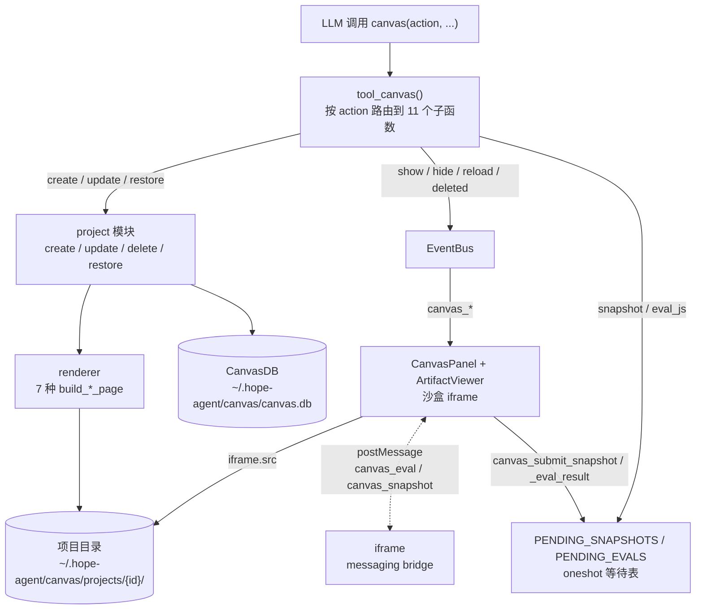
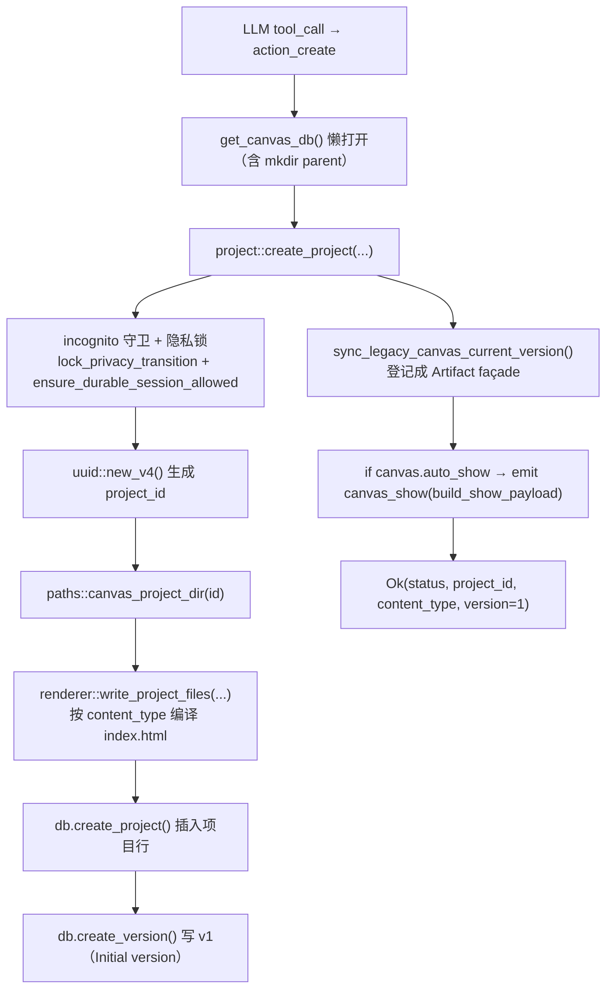
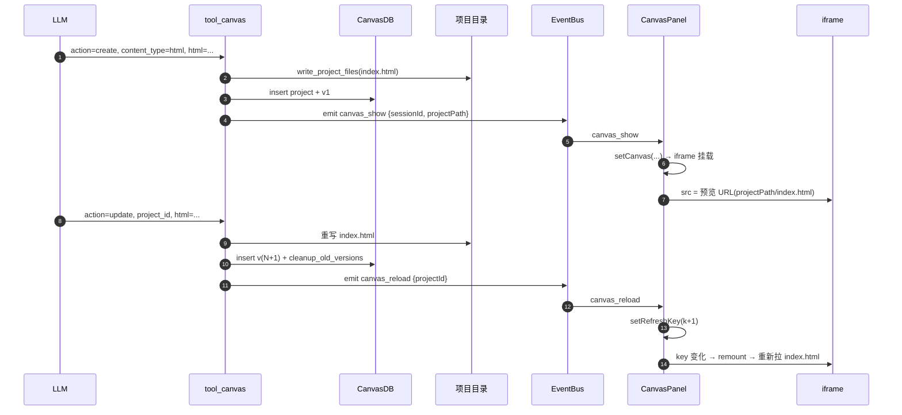
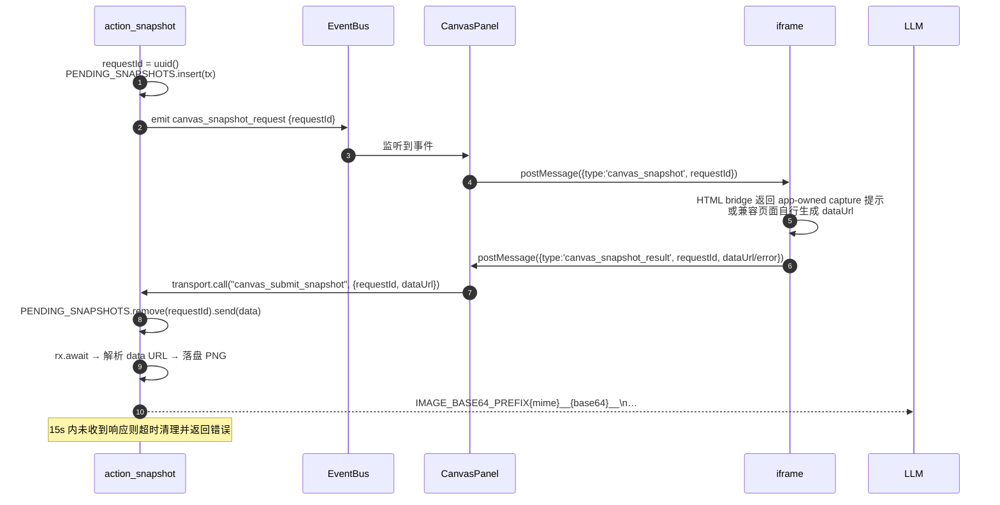

# Canvas 子系统架构文档

> 返回 [文档索引](../../README.md)
>
> 更新时间：2026-07-23

> **Canvas 与 Artifacts 的关系**：Canvas 现在是 [Artifacts 平台](artifacts.md) 的项目存储、渲染与预览层。Artifact 身份、不可变版本、证据链、Gallery 与交付契约都以 Artifacts 文档为准；本文只讲 Canvas 自己负责的那部分——项目怎么存、7 种内容怎么渲染成离线 HTML、iframe 怎么沙盒预览、snapshot / eval 双向通道怎么工作。长期管理、分析报告、验证与导出等新能力应进入 `ha_design::artifacts`，而不是继续扩张 Canvas 的动作集。

## 目录

- [核心思想](#核心思想)
- [系统架构总览](#系统架构总览)
- [核心概念](#核心概念)
- [数据模型与持久化](#数据模型与持久化)
- [工具入口与 11 个动作](#工具入口与-11-个动作)
- [内容类型与渲染管线](#内容类型与渲染管线)
- [事件流](#事件流)
- [Snapshot / Eval 双向通道](#snapshot--eval-双向通道)
- [前端 CanvasPanel 架构](#前端-canvaspanel-架构)
- [HTTP 路由与 Tauri 命令对照](#http-路由与-tauri-命令对照)
- [配置项](#配置项)
- [安全设计](#安全设计)
- [已知限制与边界](#已知限制与边界)
- [文件清单](#文件清单)

---

## 核心思想

Canvas 要解决的问题是：**让模型生成的可视化内容安全地出现在用户眼前，并且可以迭代、可以回溯**。模型写出一段 HTML、一张图表、一份 Markdown，用户希望在对话旁边直接看到渲染结果，而不是一堆代码块；同时这段内容不能碰到主应用的 DOM、cookie 或本地文件。

围绕这个目标，Canvas 有三个关键取舍：

1. **后端是文件生成器，前端只是阅读容器。** 所有 7 种内容类型（HTML / Markdown / Code / SVG / Mermaid / Chart / Slides）都由 Rust 端编译成一份**自包含、无远程依赖**的 `index.html`。前端不拼模板、不跑 Markdown 解析、不加载 CDN——它只负责把生成好的文件塞进一个沙盒 iframe。这样「怎么渲染」这件事只有一处实现，也不会因为前端环境不同而出现差异。

2. **项目 + 快照式版本。** 每个画布是一个磁盘目录加一行数据库记录；每次 `update` / `restore` 把当时的源码整份复制成一行版本快照。没有 diff、没有引用计数，回退就是从某一行重写文件。用存储冗余换实现简单，因为画布写入量低、并发受 LLM 串行 tool loop 天然限制。

3. **沙盒是硬边界。** iframe 只开 `allow-scripts`，画布脚本拿不到父窗口、同源 storage 或 cookie；想跟主应用通信只能走 postMessage。HTTP 模式下的静态文件托管再叠一层路径 canonicalize 校验，任何越界读取都会被挡在项目目录之外。

在这三点之上，还有两个让体验更连贯的细节：**事件带会话身份**（cron / 子 Agent / IM 渠道触发的画布不会窜进用户当前会话），以及 **Canvas 只服务兼容记录**（一旦某条记录被 Artifact 控制面接管，旧的 update / restore / delete 会被拒绝，必须走带 `expected_version` 的 Artifact API）。

## 系统架构总览



分层落点：业务逻辑（`tool_canvas/`、`canvas_db.rs`、`artifacts`）全在 **`ha-design`** 特征 crate，依赖 `ha-core` 但零 Tauri 依赖；桌面壳（`src-tauri`）与 HTTP 服务（`ha-server`）各自做薄壳适配；事件统一走 `ha-core::EventBus`，两个壳各自订阅、各自转发到自己的前端通道。分离窗口（detach）走 Tauri 的 `WebviewWindow`，仅桌面可用。

---

## 核心概念

| 概念 | 定义 | 生命周期 |
| --- | --- | --- |
| **Project** | 一个画布项目，由 UUID 标识，对应一个磁盘目录与一行 DB 记录 | `create` 创建 → `update` 累加版本 → `delete` 物理删除 |
| **Version** | 一次 `update` / `restore` 产生的快照，存源码（html / css / js / content） | 版本号永远递增；超过 `max_versions_per_project` 时按版本号倒序保留最新 N 条 |
| **Content Type** | 7 种渲染模式：`html` / `markdown` / `code` / `svg` / `mermaid` / `chart` / `slides` | `create` 时确定，后续 `update` 不能改 |
| **Project Path** | 项目目录绝对路径（`~/.hope-agent/canvas/projects/{id}/`），事件 payload 与 `CanvasProjectView` 都会附带 | 后端每次返回前现算，前端不缓存 |
| **Pending Request** | snapshot / eval_js 这两个动作「等待前端响应」的状态，用 `tokio::oneshot::channel` 表达 | 工具发起时插入等待表；前端回调或超时后移除 |

每个 project 都和**会话 / Agent** 弱绑定：

- `session_id` / `agent_id` 在 `create` 时从 `ToolExecContext` 取，写入 `canvas_projects` 表但**不设外键**。
- 前端 `list_canvas_projects_by_session` 在切会话时查这张表，自动恢复「该会话最近一次画布」。
- `ArtifactService` 会惰性把旧项目登记成受管 Artifact 并补齐 façade；受管 Artifact 的详细归属和隐私字段不写回旧 Canvas 表——两套元数据分属两个控制面。

---

## 数据模型与持久化

### 目录布局

```
~/.hope-agent/
└── canvas/
    ├── canvas.db                       # SQLite (WAL + foreign_keys=ON)
    └── projects/
        └── {project-uuid}/
            ├── index.html              # renderer 生成，每次 create/update/restore 全量重写
            ├── style.css               # 用户传入的 css，原样保留（可选）
            ├── script.js               # 用户传入的 js，原样保留（可选）
            ├── content.{ext}           # 非 html 类型的源：md / svg / json / mmd / {language}
            └── snapshot_YYYYMMDD_HHMMSS.png   # 每次 snapshot 动作落盘的 PNG
```

路径解析集中在 [`crates/ha-base/src/paths.rs`](../../../crates/ha-base/src/paths.rs)，四个入口：

- `canvas_dir()` → `~/.hope-agent/canvas/`
- `canvas_projects_dir()` → `…/canvas/projects/`
- `canvas_project_dir(id)` → `…/canvas/projects/{id}/`；**这一步本身就会校验 `id`**（1–128 字节、只允许 ASCII 字母数字与 `-` `_`），非法即 `bail!`
- `canvas_db_path()` → `…/canvas/canvas.db`

### SQLite 表结构

定义在 [`crates/ha-design/src/canvas_db.rs`](../../../crates/ha-design/src/canvas_db.rs) 的 `ensure_schema`：

```sql
CREATE TABLE canvas_projects (
    id TEXT PRIMARY KEY,                -- UUID v4
    title TEXT NOT NULL,
    content_type TEXT NOT NULL DEFAULT 'html',
    session_id TEXT,                    -- 弱引用，无 FK
    agent_id TEXT,                      -- 弱引用，无 FK
    created_at TEXT NOT NULL,           -- RFC3339
    updated_at TEXT NOT NULL,
    version_count INTEGER DEFAULT 1,    -- 当前最大 version_number，新增 update 时 +1
    metadata TEXT                       -- 预留 JSON 字段
);

CREATE TABLE canvas_versions (
    id INTEGER PRIMARY KEY AUTOINCREMENT,
    project_id TEXT NOT NULL REFERENCES canvas_projects(id) ON DELETE CASCADE,
    version_number INTEGER NOT NULL,
    message TEXT,                       -- 可选 commit 信息
    html TEXT, css TEXT, js TEXT,       -- 源码快照（4 列同存，便于 restore）
    content TEXT,                       -- 非 html 类型的纯文本快照
    created_at TEXT NOT NULL,
    UNIQUE(project_id, version_number)
);

CREATE INDEX idx_canvas_versions_project    ON canvas_versions(project_id, version_number DESC);
CREATE INDEX idx_canvas_projects_session    ON canvas_projects(session_id, updated_at DESC);
```

**设计要点：**

- **快照式版本。** 每次 update 把当前 html/css/js/content 全量复制成一行 `canvas_versions`，restore 直接从该行重写文件——无 diff 也无引用计数，拿存储换简单。
- **`version_count` 是逻辑游标。** 它等于该项目最大的 `version_number`，新版本号 = `version_count + 1`。prune 旧版本时不动这个值；即便某个历史版本号已被剪掉，restore 命中它也只会返回 `Version not found`，而不会错位。
- **`session_id` 弱引用 + owner cleanup。** 数据库没有 FK cascade。普通会话删除时由 cleanup watcher 解除关联、让 Artifact 继续留在 Gallery；purge 路径则删除该会话关联的 durable Artifact。
- **`ON DELETE CASCADE` 只作用于 `versions` → `projects`。** 删项目自动清版本表，避免脏行。

### 数据库串行化

`CanvasDB` 用一个进程内 `Mutex<rusqlite::Connection>` 串行所有 SQL；lock 被 poison 时返回错误向上传播，不静默恢复（`into_inner()` 回退只用于下文 snapshot / eval 的进程级等待表）。这是**单进程单连接**的简化选择：写量低、并发受限于 LLM tool loop 的串行节奏，没必要上连接池。连接开在 WAL 模式、`foreign_keys=ON`、`busy_timeout=5s`。

---

## 工具入口与 11 个动作

工具 schema 定义在 [`crates/ha-core/src/tool_defs/extra_tools.rs`](../../../crates/ha-core/src/tool_defs/extra_tools.rs) 的 `get_canvas_tool()`：`internal: true`（恒不需审批）、`background_policy: ForegroundOnly`（同步执行）、`default_deferred: false`（始终随核心工具集加载，是否对模型可见由 `canvas.enabled` 决定，见 [配置项](#配置项)）。入口函数 `tool_canvas` 按 `action` 字段路由到 11 个子函数。

| Action | 必填参数 | 写入 DB / 文件 | 触发事件 | 返回值 |
| --- | --- | --- | --- | --- |
| `create` | （可选）`content_type` | ✅ 项目行 + v1 版本 + 文件 | `canvas_show`（如 `auto_show=true`） | `{ project_id, title, content_type, version: 1 }` |
| `update` | `project_id` | ✅ 新版本 + 重写文件 + prune | `canvas_reload` | `{ project_id, version }` |
| `show` | `project_id` | — | `canvas_show` | `{ status: "shown" }` |
| `hide` | — | — | `canvas_hide`（空 payload） | `{ status: "hidden" }` |
| `list` | — | — | — | `{ count, projects: [...] }` |
| `delete` | `project_id` | ✅ 删项目（级联版本）+ rm 目录 | `canvas_deleted` | `{ status: "deleted" }` |
| `versions` | `project_id` | — | — | `{ versions: [{version_number, message, created_at}] }` |
| `restore` | `project_id`, `version_id` | ✅ 新版本（标注 `Restored from version N`）+ 重写文件 | `canvas_reload` | `{ restored_from_version, current_version }` |
| `snapshot` | `project_id` | ✅ 落盘 PNG | `canvas_snapshot_request`（带 `requestId`） | `IMAGE_BASE64_PREFIX{mime}__{base64}__\n…` |
| `eval_js` | `project_id`, `js` | — | `canvas_eval_request`（带 `requestId`） | `{ status: "ok", result }` 或 `{ status: "error", error }` |
| `export` | `project_id`, `format` | — | — | `{ format, path, content / content_length }` |

**关键不变量：**

- **content_type 不可变。** `update` / `restore` 根本不接受 `content_type` 参数，强制沿用 `create` 时存下的类型（`update_project` 用 `project.content_type` 而非请求值）。想换类型只能 `delete` + `create`。
- **restore 不是回退，是分叉。** 它从历史版本生成一个**新的** v(N+1)，原版本 1..N 都不动。这样 prune 永远只看 `version_number` 倒序数 N，不会因为一次 restore 把「曾经的最新版」挤出窗口。
- **snapshot 返回值走 `IMAGE_BASE64_PREFIX`**（与 browser 截图共用 marker）。工具执行层会在普通会话里把这个内联图片 marker 物化为受管文件，Provider 请求前再作为多模态 image 输入。
- **write / export 在 incognito 下 fail closed。** `create` / `update` / `delete` / `restore` / `export` 五个动作在无痕会话里直接 `bail!`——因为 Canvas 项目是 durable 的，无痕语义不允许落库。`show` / `hide` / `list` / `versions` / `snapshot` / `eval_js` 不受此限。
- **export 的 PNG 分支未实现。** schema 列了 `enum: ["html", "markdown", "png"]`，但 `action_export` 只处理 html / markdown，传 `png` 会报 `Unsupported export format`。

### 创建路径详解



`build_show_payload` 会把 `session_id` 嵌进事件里，前端据此过滤跨会话事件——cron 触发的 `canvas_show` 不会让用户当前会话弹出别人的画布。

---

## 内容类型与渲染管线

`renderer::write_project_files()` 负责落盘：先调 `render_project_page()` 按 `content_type` 分发到对应的 `build_*_page`，产出一份完整 HTML，再用 `platform::write_atomic` 写入 `index.html`。`render_project_page()` 自己不碰磁盘，Artifact 迁移旧版本时也复用它把分开存的 html/css/js 重新组装成页面。

| content_type | 渲染策略 | CSP / 脚本 | 用户提供字段 |
| --- | --- | --- | --- |
| `html` | 用户 HTML/CSS/JS 包进最小骨架 + messaging bridge | 允许 inline script + eval，禁网络 | `html` / `css` / `js` |
| `markdown` | `pulldown-cmark` 在 Rust 里生成语义 HTML；raw HTML 降为文本 | 正文静态；仅固定选区桥 | `content` |
| `code` | HTML 实体编码后放进 `<pre><code>`；当前不加载高亮 runtime | 正文静态；仅固定选区桥 | `content`, `language` |
| `svg` | 直接内嵌 SVG source | 正文静态；仅固定选区桥 | `content`（完整 SVG） |
| `mermaid` | 展示转义后的 Mermaid source，作为离线语义 fallback | 正文静态；仅固定选区桥 | `content`（Mermaid source） |
| `chart` | 解析 Chart config 的 title/labels/datasets，确定性生成 HTML table | 正文静态；仅固定选区桥 | `content`（Chart config JSON） |
| `slides` | 内联 SPA：`<section>` 列表，键盘/点击切页，右下角页码 | 允许内联脚本，禁网络 | `html`（多个 `<section>`）、`css` |

两套 CSP 常量决定作者脚本能力：`html` 与 `slides` 用「交互」CSP（`script-src 'unsafe-inline' 'unsafe-eval'`），其余五种用「静态」CSP，只按 SHA-256 精确放行 Hope 固定选区 bridge，仍禁止任意 inline script。两套都锁死 `connect-src 'none'`、`frame-src 'none'`、`object-src 'none'`、`form-action 'none'`、`base-uri 'none'`，图片只放行 `data:` / `blob:`——也就是说无论哪种类型，画布都无法发起网络请求。

### messaging bridge（仅 `html` 注入）

只有 `build_html_page` 会往页面里注入这段桥接脚本：

```javascript
window.addEventListener('message', function(event) {
  if (event.data && event.data.type === 'canvas_eval') {
    try { var result = eval(event.data.code);
      parent.postMessage({type:'canvas_eval_result', requestId, result: String(result)}, '*');
    } catch(e) { parent.postMessage({type:'canvas_eval_result', requestId, error: e.message}, '*'); }
  }
  if (event.data && event.data.type === 'canvas_snapshot') {
    parent.postMessage({type:'canvas_snapshot_result', requestId,
                        error:'Offline snapshot runtime unavailable; use the app-owned browser capture path.'}, '*');
  }
});
```

**这带来一个不对称行为**：`html` 的 `eval_js` 可以稳定工作；它的 `snapshot` 会立即返回一句「离线快照运行时不可用，请走 app-owned browser capture」的明确错误。而 `markdown` / `code` / `svg` / `mermaid` / `chart` / `slides` 没有这段 eval/snapshot 桥接，对它们调 eval / snapshot 会因为无人应答而**超时**（见下方[已知限制](#1-非-html-模板缺-messaging-bridge)）。所有当前 renderer 投影都另有独立、固定的文本选区 bridge；新的 Artifact PDF / 验证 / 导出不依赖旧 snapshot 通道。

### 源文件保留策略

除了生成 `index.html`，renderer 还会**原样**写出用户提供的源（如果有）：`css` → `style.css`、`js` → `script.js`、`content` → `content.{ext}`（扩展名按 content_type 派生：`markdown`→md、`svg`→svg、`chart`→json、`mermaid`→mmd、`code`→`{language}`、其余→txt）。

这些文件**不参与**渲染（index.html 已经把它们 inline 进去了），纯粹给 `export` 动作或人工排查用。版本表 `canvas_versions` 里存了同样的源码，二者刻意冗余。

---

## 事件流

所有 canvas 事件走 `EventBus`（`ha-core::globals::get_event_bus()`），桌面壳与 server 各自订阅、各自转发到自己的前端通道。

### 事件目录

| 事件名 | 触发场景 | Payload | 前端反应 |
| --- | --- | --- | --- |
| `canvas_show` | `create` 且 `auto_show=true` / `show` action / 桌面 `show_canvas_panel` | `{projectId, title, contentType, projectPath, sessionId}` | 渲染 iframe；`sessionId` 不匹配则丢弃 |
| `canvas_hide` | `hide` action | `{}` | 关闭 iframe（`setCanvas(null)`） |
| `canvas_reload` | `update` / `restore` action | `{projectId}` | 若与当前 canvas 同 ID，递增 `refreshKey` 触发 iframe remount |
| `canvas_deleted` | `delete` action | `{projectId}` | 若与当前 canvas 同 ID，关闭 |
| `canvas_snapshot_request` | `snapshot` action | `{projectId, requestId}` | 向 iframe `postMessage({type:'canvas_snapshot', requestId})` |
| `canvas_eval_request` | `eval_js` action | `{projectId, requestId, code}` | 向 iframe `postMessage({type:'canvas_eval', requestId, code})` |

### 跨会话事件过滤

`canvas_show` 是唯一带 `sessionId` 的事件（其余事件靠 `projectId` 过滤即可，`projectId` 已隐含 session 归属）。前端监听时：

```typescript
getTransport().listen("canvas_show", (raw) => {
  const data = parsePayload<CanvasShowPayload>(raw)
  // 丢弃其它会话（cron / IM / subagent 工具调用）
  if (data.sessionId && data.sessionId !== currentSessionIdRef.current) return
  setCanvas(toCanvasInfo(data, ...))
})
```

`currentSessionIdRef` 用 ref 存当前会话，避免每次切会话都重新订阅事件。**老 payload 兼容**：缺 `sessionId` 字段直接放行，保证历史数据与旧版本服务端事件仍能弹出。

### 历史会话恢复

后端只在模型**主动**调 canvas 工具时才发 `canvas_show`——切到一个老会话不会自动触发。所以前端在 `currentSessionId` 变化时主动调 `list_canvas_projects_by_session`，取**最新一条**项目（按 `updated_at DESC`）作为该会话的「上次画布」恢复显示；无项目则 `setCanvas(null)`。

### 完整时序：create → show → update → reload



---

## Snapshot / Eval 双向通道

snapshot 与 eval_js 是**对称的请求-响应**模式：工具发起请求 → 前端转发给 iframe → iframe 处理后 postMessage 回前端 → 前端调 `canvas_submit_*` 唤醒后端等待者。

### 后端注册等待者

`tool_canvas/mod.rs` 维护两个进程级等待表：

```rust
static PENDING_SNAPSHOTS: LazyLock<StdMutex<HashMap<String, oneshot::Sender<SnapshotData>>>>;
static PENDING_EVALS:     LazyLock<StdMutex<HashMap<String, oneshot::Sender<EvalResult>>>>;
```

`action_snapshot` / `action_eval_js` 的标准流程：

```rust
let request_id = Uuid::new_v4().to_string();
let rx = {
    let (tx, rx) = oneshot::channel();
    PENDING_SNAPSHOTS.lock().unwrap_or_else(|e| e.into_inner()).insert(request_id.clone(), tx);
    rx
};  // 注意：MutexGuard 在块结束时 drop，早于任何 .await
emit_canvas_event("canvas_snapshot_request", json!({projectId, requestId}));
match tokio::time::timeout(Duration::from_secs(15), rx).await {
    Ok(Ok(data)) => /* 解析 data URL，落盘 PNG，返回 IMAGE_BASE64_PREFIX… */,
    Ok(Err(_))   => /* channel 被 cancel */,
    Err(_)       => {
        PENDING_SNAPSHOTS.lock().unwrap_or_else(|e| e.into_inner()).remove(&request_id);  // 超时自清
        /* 返回 timeout error */
    }
}
```

**三个关键正确性细节：**

1. **MutexGuard 在 `.await` 之前 drop。** 用块表达式把 `lock()` 限在内层作用域，锁不跨越 `await` 点，避开 `Send` 边界与死锁。
2. **超时必须自清。** 超时后从等待表移除条目，否则前端迟到的响应会 `send` 进一个已经返回错误的等待者、复活一个已经结束的工具调用。
3. **poisoned 不崩溃。** `StdMutex` 在 panic 后会 poisoned，这里选择 `unwrap_or_else(|e| e.into_inner())` 继续用——画布是边缘功能，一次 panic 不该阻塞主对话。

### 前端转发

前端收到 `canvas_snapshot_request` / `canvas_eval_request` 后，若 iframe 未就绪（面板没打开或还没加载完），立刻回一个错误结果；否则把消息 `postMessage` 给 iframe：

```typescript
const handleSnapshotRequest = (requestId: string) => {
  const iframe = iframeRef.current
  if (!iframe?.contentWindow) {
    getTransport().call("canvas_submit_snapshot",
      { requestId, dataUrl: null, error: t("canvas.notReadyError") })
    return
  }
  iframe.contentWindow.postMessage({ type: "canvas_snapshot", requestId }, "*")
}
```

iframe 的 messaging bridge 处理后把结果 postMessage 回来，前端再转成一次 `canvas_submit_snapshot` / `canvas_submit_eval_result` 调用。后端入口从等待表取出对应的 `oneshot::Sender` 并 `send()`，`action_snapshot` 的 `rx.await` 随即唤醒。

### 时序



**超时常数**：snapshot 15s、eval_js 10s。`html` 的 snapshot bridge 会立即返回「请改用 app-owned browser capture」，所以超时主要用于兜底那些没有 bridge 的历史内容类型。

---

## 前端 CanvasPanel 架构

`CanvasPanel` 负责状态、事件与面板外壳；真正承载预览的 iframe 由 **`ArtifactViewer`** 提供——Gallery 与 Canvas 共用它，不再各维护一套 sandbox / URL 解析。

### 状态与事件

```typescript
interface CanvasInfo {
  projectId: string
  title: string
  contentType: string
  projectPath?: string  // 后端已 resolve 的绝对路径
}

const [canvas, setCanvas]         = useState<CanvasInfo | null>(null)
const [maximized, setMaximized]   = useState(false)   // 经 useFullscreenTransition 驱动
const [detached, setDetached]     = useState(false)
const [refreshKey, setRefreshKey] = useState(0)
```

`canvas == null` 或 `visible === false` 时组件直接返回 `null`（不占位）。可见时复用共享的 `RightPanelShell`，宽度由 `panelWidth`、主区保留宽度和视口上限共同约束。

### 三种视图状态

| 状态 | 渲染 | 控件 |
| --- | --- | --- |
| **inline**（默认） | 右侧面板，圆角卡片，含 iframe | refresh / pop-out / maximize / close |
| **maximized** | 遮盖整个视口 | refresh / pop-out / minimize / close |
| **detached**（仅 Tauri） | 主面板缩成占位条，iframe 由独立 `WebviewWindow` 承载 | reattach / close |

`maximized` 与 `detached` 是 transient UI 状态，**会话切换时强制清零**——避免「在 A 会话最大化 → 切到 B 会话 → 还停在最大化」的割裂感。实现走 React 的 render-phase prev-prop tracking（在渲染期比较 `prevSessionId`，而非在 effect 里 setState，从而不触 `react-hooks/set-state-in-effect` lint）。

### iframe 与 URL 解析

iframe 本体在 `ArtifactViewer`：

```html
<iframe
  key={`${artifactId}-${refreshKey}`}
  src={src}
  sandbox="allow-scripts"
  referrerPolicy="no-referrer"
/>
```

- `sandbox="allow-scripts"`：允许 JS 执行，但**没有** `allow-same-origin`——脚本碰不到主应用的 `localStorage`、cookie 或父窗口 DOM，想通信只能 postMessage。
- `key={artifactId-refreshKey}`：`canvas_reload` 递增 `refreshKey`，触发 React **完全 remount** iframe（而非只换 src），确保任何缓存的 JS 状态被清掉。
- `referrerPolicy="no-referrer"`：HTTP token 或本地项目 URL 不通过 Referer 外发。
- 文档 load 前，后端重读当前 projection 并核验 bridge marker 与精确的 script-isolated CSP；只有核验通过的 Markdown／Code／SVG／Mermaid／Chart 等静态页面才返回可信 capability。文档 load 后父层用 version + 随机 token 关联当前导航并激活固定选区 bridge，只接受当前 `contentWindow`、finite rect 与不超过 20,000 字符的完整文本。选区完成后自动显示复制/引用浮层，引用只入 composer 草稿，右键仍走原生菜单。HTML／Slides 等可执行页面不激活宿主 bridge，只保留原生选择／复制。

`src` 由 transport 的预览 URL 解析给出，两种模式不同：

- **Tauri**：走 `asset://localhost/{escaped-path}` 协议直读 `~/.hope-agent`。
- **HTTP 同源（Cookie）模式**：`resolveAssetUrl` 把磁盘路径 `…/canvas/projects/{id}/{rest}` 重写为同源 `/api/canvas/projects/{id}/{rest}`，iframe 自动携带 HttpOnly 会话 Cookie，URL 里不带凭据。
- **HTTP 跨源（API-Key）模式**：`resolveAssetUrl` 对可执行预览返回 `null`，改由 `artifactPreviewUrl` **临时铸一张绑定到该项目子树的短时资源票据**——绝不把可复用的静态资源票据塞进模型生成的文档 URL 里。

### 自动展开与滚动不变量

Canvas 既可能由用户从标题栏切换，也可能由 `canvas_show`、会话恢复或 Artifact 创建自动展开。WebKit/WebView 在 iframe 初次挂载于 `width:0`、`aria-hidden`、`inert` 的祖先中时，可能保留失效的 hit-testing / wheel-routing 状态，表现为正文不能滚动、关闭再打开才恢复。为此 Canvas 约束了一条契约：

- 共享 dock 传来的 `animateOnMount` 意图，`CanvasPanel` **不**转发给 `RightPanelShell`，iframe 不经历零宽入场帧；
- `RightPanelShell`、内部 body、iframe wrapper 和 `ArtifactViewer` 整条 flex 高度链必须保留 `min-h-0`；
- wrapper 用 `overflow-hidden`，纵向滚动由 iframe document 管理，不在 wrapper 上放永久 scroll fade；
- 自动展开、手动切换、最大化和 detached reattach 必须落到**相同**的可交互状态。

回归测试 `internalRightPanelOverlay.test.tsx` 会模拟共享 dock 请求 mount 动画，断言 Canvas shell 首帧不是 `width:0`、也没有 `aria-hidden` / `inert`。

### Tauri 窗口尺寸联动

桌面模式下，有画布占用右半屏时把主窗口最小宽度顶到 1280，无画布或已 detach 时恢复默认下限：

```typescript
useEffect(() => {
  if (!isTauriMode()) return
  const win = getCurrentWindow()
  if (canvas && !detached) {
    win.setMinSize(new LogicalSize(1280, MAIN_WINDOW_MIN_HEIGHT))   // 1280 × 520
  } else {
    win.setMinSize(new LogicalSize(MAIN_WINDOW_MIN_WIDTH, MAIN_WINDOW_MIN_HEIGHT))  // 840 × 520
  }
}, [canvas, detached])
```

高宽下限常量（`MAIN_WINDOW_MIN_WIDTH = 840`、`MAIN_WINDOW_MIN_HEIGHT = 520`）来自 `src/lib/mainWindowSize.ts`。

### Detach（独立窗口）

仅 Tauri 可用，`isTauriMode()` 为 false 时 pop-out 按钮不渲染。点击后：先关闭已有的 detached window，用 `artifactPreviewUrl` 取一份预览 URL，`new WebviewWindow("canvas-window", { url, ... })`，再监听 `tauri://created` / `tauri://error` / `tauri://destroyed` 三个生命周期事件维护 `detachedWindowRef`。当 `canvas` 变 null（会话切换 / `canvas_deleted` / 手动关闭）时，effect 自动 close 独立窗口。

### 与其他右侧面板的关系

`ChatScreen` 用 `renderedExclusiveRightPanel` 在 diff、pull-request、plan、files、canvas、browser、mac-control、team、workspace、background-jobs、preview 之间**只渲染一个**可见的右侧内容。`CanvasPanel` 为了保留会话恢复和 detached window 生命周期而长期挂载，但只有 selector 选中 `canvas` 时 `visible=true`。它还监听 `hope-agent:close-canvas` CustomEvent，供 Browser 自动打开等互斥场景强制关闭其持久状态。所有面板共用宽度、collapse、overlay 与主区保留宽度，唯 iframe 面板对入场动画有上述例外。

---

## HTTP 路由与 Tauri 命令对照

每个能力都同时暴露 Tauri IPC（桌面）与 HTTP（server）两套接口，业务逻辑统一在 `ha_design::tool_canvas` 的 `pub async` 函数里。

| 能力 | Tauri 命令 | HTTP 路由 | Transport key |
| --- | --- | --- | --- |
| 列出所有项目 | `list_canvas_projects` | `GET /api/canvas/projects` | `list_canvas_projects` |
| 取单个项目 | `get_canvas_project` | `GET /api/canvas/projects/{projectId}` | `get_canvas_project` |
| 删除项目 | `delete_canvas_project` | `DELETE /api/canvas/projects/{projectId}` | `delete_canvas_project` |
| 列出会话下的项目 | `list_canvas_projects_by_session` | `GET /api/canvas/by-session/{sessionId}` | `list_canvas_projects_by_session` |
| 显示画布面板 | `show_canvas_panel` | `POST /api/canvas/show`（server 模式 no-op） | `show_canvas_panel` |
| 提交 snapshot 结果 | `canvas_submit_snapshot` | `POST /api/canvas/snapshot/{requestId}` | `canvas_submit_snapshot` |
| 提交 eval 结果 | `canvas_submit_eval_result` | `POST /api/canvas/eval/{requestId}` | `canvas_submit_eval_result` |
| 读取配置 | `get_canvas_config` | `GET /api/config/canvas` | `get_canvas_config` |
| 写入配置 | `save_canvas_config` | `PUT /api/config/canvas` | `save_canvas_config` |
| **静态文件托管** | Tauri 用 `asset://` 协议直读 `~/.hope-agent` | `GET /api/canvas/projects/{projectId}/{*rest}` | （iframe 直接走 URL） |

注册位置：Tauri 在 [`src-tauri/src/lib.rs`](../../../src-tauri/src/lib.rs) 的 `invoke_handler!`（薄壳包装在 [`src-tauri/src/tauri_wrappers.rs`](../../../src-tauri/src/tauri_wrappers.rs)）；HTTP 在 [`crates/ha-server/src/lib.rs`](../../../crates/ha-server/src/lib.rs) 的 `build_router_with_cors`，处理逻辑在 [`routes/canvas.rs`](../../../crates/ha-server/src/routes/canvas.rs) 与 [`routes/config.rs`](../../../crates/ha-server/src/routes/config.rs)；Transport 映射在 [`src/lib/transport-http.ts`](../../../src/lib/transport-http.ts) 的 `COMMAND_MAP`。

### 静态文件路由的资产托管

HTTP 模式下 iframe 不能直接读磁盘，必须走 server 转发。`serve_canvas_project_file` 用 `tower_http::services::ServeFile` 实现，进门先过三道安全闸：

1. **`validate_canvas_project_id`** — 逐字节校验：只允许 ASCII 字母数字与 `-` `_`、长度 1–128，够紧到排除 `..`、`/`、`\` 与 shell 元字符；
2. **`validate_safe_rest_path`** — 拒绝 `..` 段、反斜杠等；
3. **`contained_canonical`** — `canonicalize()` 之后断言路径仍在项目目录子树内，挡住符号链接逃逸。

通过后附上响应头：`Cache-Control: public, max-age=60`（短期缓存，减轻 reload 风暴）、`Content-Disposition: inline`（iframe 渲染而非下载）、`Referrer-Policy: no-referrer`（防内部 URL / token 经 Referer 外发）。

---

## 配置项

`AppConfig.canvas` 的类型 `CanvasConfig` 定义在 **`crates/ha-config-schema/src/tools/canvas.rs`**（wire 类型统一下沉 `ha-config-schema`），由 `ha_design::tool_canvas` 再导出。承载它的 `pub canvas` 字段与 `AppConfig` 结构体一同定义在 [`crates/ha-config-schema/src/config.rs`](../../../crates/ha-config-schema/src/config.rs)；[`crates/ha-core/src/config/mod.rs`](../../../crates/ha-core/src/config/mod.rs) 只做再导出与 cache 入口，配置随主配置一起 cache。

| 字段 | 默认 | 含义 | 风险等级 |
| --- | --- | --- | --- |
| `enabled` | `true` | 供给门：为 `false` 时 canvas 与 artifact 两个工具都不再提供给模型 | LOW |
| `auto_show` | `true` | `create` 后是否自动 emit `canvas_show`（关闭后模型需显式 `show`） | LOW |
| `default_content_type` | `"html"` | 未传 `content_type` 时的兜底（**当前未消费**：`action_create` 直接 hard-code `unwrap_or("html")`） | LOW |
| `max_projects` | `100`（u32） | 预留容量上限（**当前未消费**，无自动 prune） | LOW |
| `max_versions_per_project` | `50`（i64） | 单项目保留的版本数，超出时按 `version_number DESC` 保留前 N | LOW |
| `panel_width` | `480`（u32） | 面板默认宽度 | LOW |

读写：

- **读**：`ha_core::config::cached_config().canvas`（运行期全部点都走这条，零 IO）。
- **写**：`save_canvas_config` 走 `mutate_config_async(("canvas", "design.tool_canvas"), …)`，与 [配置系统](config-system.md) 的读写红线一致——整个 load → mutate → persist 持全局 write lock、跑在 blocking pool 上，防 lost-update。

按 [AGENTS.md 设置约定](../../../AGENTS.md) 的要求，可调配置字段必须**同时**有 GUI 入口、`ha-settings` 工具分支与 SKILL.md 风险登记。Canvas 的 GUI 在 [`CanvasSettingsPanel.tsx`](../../../src/components/settings/CanvasSettingsPanel.tsx)，六个字段齐全。

---

## 安全设计

| 风险 | 缓解 |
| --- | --- |
| **画布脚本访问主应用 DOM / cookie** | iframe `sandbox="allow-scripts"`，没有 `allow-same-origin`；脚本碰不到主应用 `localStorage`、cookie 或父窗口 DOM |
| **路径穿越读到 `~/.hope-agent/credentials/auth.json`** | `canvas_project_dir` 自带 id 校验 + HTTP 路由 `validate_canvas_project_id` 白名单 + `validate_safe_rest_path` 拒 `..` + `contained_canonical` canonicalize 后再断言子树包含 |
| **HTTP 模式 token 泄漏** | 静态资源响应与 `ArtifactViewer` 都用 `Referrer-Policy: no-referrer`；跨源 API-Key 模式下预览走短时、绑定子树的资源票据，绝不复用静态票据；renderer 不加载 CDN |
| **`eval_js` 任意代码执行** | 仅在 sandbox iframe 内 `eval`，触不到主应用与 Tauri runtime；返回值 `String(result)` 强转字符串，避免通过返回值做 prototype 注入 |
| **SVG XSS（`<script>` / `onerror=`）** | `build_svg_page` 虽内嵌 SVG source，但静态 CSP 只放行固定选区 bridge 的精确 hash、仍拒绝作者脚本，且 `connect-src 'none'`；外层 iframe 继续 sandbox |
| **Markdown raw HTML** | `pulldown-cmark` 的 `Html` / `InlineHtml` event 被转成文本，不允许从 Markdown 注入可执行 DOM |
| **iframe 加载非项目目录资源** | iframe 同源是 `asset://localhost` 或 server 域，相对路径请求只能命中 `/api/canvas/projects/{id}/...`，路由层再验一遍 |
| **iframe 伪造文本选区消息** | 后端在每次读取时以当前 projection bytes 为准，只对带 bridge marker 与精确 script-isolated CSP 的页面签发可信 capability；宿主无 capability 即不发激活 token、不注册消息接收器。`WindowProxy`、协议版本、token、长度与有限坐标是导航／载荷完整性校验，不把同帧作者脚本升级为可信发送者。正文仍按不可信引用处理，只有用户点击浮层才进入草稿，绝不自动发送 |
| **OAuth / API key 泄漏进 canvas content** | 由模型自身输入约束 + 主应用日志脱敏（`logging::redact_sensitive`）防御；canvas 模板本身不主动写凭据 |

Artifact 的 import / verify 还会额外扫描远程资源、外部导航和禁止元素；完整规则见 [Artifacts 安全与验证](artifacts.md#verification)。

**仍然存在的执行边界：**

- `eval_js` 不限制 iframe 内代码的同步执行时长；10 秒只是后端等结果的超时，死循环仍可能占用 WebView CPU；
- Freeform HTML 即使通过离线 verifier 仍是可执行内容。Hope 的 iframe sandbox 与接收者在普通浏览器直接打开导出 HTML **不是同一个安全边界**。

---

## 已知限制与边界

### 1. 非 HTML 模板缺 messaging bridge

`markdown` / `code` / `svg` / `mermaid` / `chart` / `slides` 没有注入 HTML messaging bridge，结果：

- 对它们调 `eval_js` 会 10s 超时返回 `Eval timed out`；
- 对它们调 `snapshot` 会 15s 超时返回 `Snapshot timed out`。

`html` 可以稳定 eval；它的 snapshot bridge 会立即提示改用 app-owned browser capture，不再动态下载截图库。Artifact PDF 与离线导出不依赖此兼容通道。

### 2. 部分配置字段未消费

- `max_projects: 100` 在 `CanvasConfig` 里定义但**没有任何代码消费**——project 表理论上无限增长。需要后续接一个类似 versions 的 `cleanup_old_projects(keep)` 剪枝。
- `default_content_type: "html"` 同样未消费——`action_create` 直接 hard-code `unwrap_or("html")`。

### 3. `canvas.export` 的 PNG 格式未实现

schema 列了 `enum: ["html", "markdown", "png"]`，但 `action_export` 只 match `html` / `markdown`，传 `png` 报 `Unsupported export format`。要支持 PNG 需复用 snapshot 的链路。

### 4. 生命周期由 Artifact façade 接管

`canvas_projects.session_id` 仍是弱引用，但 cleanup watcher 会区分语义：普通删除解除 session 关联、让 Artifact 继续留在 Gallery；purge 才删除该会话关联的 durable Artifact。写入在 incognito 下从 Canvas / Artifact 两条入口都 fail closed，已有 durable Artifact 的会话也不能切换为 incognito。一旦某条记录被 Artifact 控制面接管，Canvas 侧的 `update` / `restore` / `delete` 会被 `ensure_legacy_canvas_mutation_allowed` 拒绝，必须改走带 `expected_version` 的 Artifact API。

### 5. 内嵌 web GUI 模式下分离窗口不可用

`isTauriMode()` 为 false 时 pop-out 按钮直接隐藏（`WebviewWindow` 是 Tauri 专属）。浏览器要「新开一份」只能新 tab 访问同源 `/api/canvas/projects/{id}/index.html`，复用 HttpOnly 会话。

---

## 文件清单

### 后端（ha-design）

| 文件 | 角色 |
| --- | --- |
| [`crates/ha-design/src/canvas_db.rs`](../../../crates/ha-design/src/canvas_db.rs) | SQLite schema + CRUD（`CanvasDB`、`CanvasProject`、`CanvasVersion`） |
| [`crates/ha-design/src/tool_canvas/mod.rs`](../../../crates/ha-design/src/tool_canvas/mod.rs) | 工具入口 `tool_canvas`、11 个 `action_*`、Pending 等待表、对外 API |
| [`crates/ha-design/src/tool_canvas/project.rs`](../../../crates/ha-design/src/tool_canvas/project.rs) | `create_project` / `update_project` / `delete_project` / `restore_version` 业务逻辑 + Artifact façade 同步 |
| [`crates/ha-design/src/tool_canvas/renderer.rs`](../../../crates/ha-design/src/tool_canvas/renderer.rs) | 7 种 `build_*_page` 模板 + `render_project_page` 分发 + `write_project_files` 落盘 |
| [`crates/ha-config-schema/src/tools/canvas.rs`](../../../crates/ha-config-schema/src/tools/canvas.rs) | `CanvasConfig` wire 类型与默认值 |
| [`crates/ha-config-schema/src/config.rs`](../../../crates/ha-config-schema/src/config.rs) | `AppConfig` 结构体与 `pub canvas` 字段定义 |
| [`crates/ha-core/src/tool_defs/extra_tools.rs`](../../../crates/ha-core/src/tool_defs/extra_tools.rs) | `get_canvas_tool()` 工具 schema 定义 |
| [`crates/ha-core/src/tools/dispatch.rs`](../../../crates/ha-core/src/tools/dispatch.rs) | 加入可派发工具目录 + `canvas.enabled` 供给门 |
| [`crates/ha-base/src/paths.rs`](../../../crates/ha-base/src/paths.rs) | `canvas_dir` / `canvas_projects_dir` / `canvas_project_dir` / `canvas_db_path` |
| [`crates/ha-core/src/config/mod.rs`](../../../crates/ha-core/src/config/mod.rs) | `AppConfig` 再导出与 cache 入口 |

### 后端（ha-server / src-tauri）

| 文件 | 角色 |
| --- | --- |
| [`crates/ha-server/src/routes/canvas.rs`](../../../crates/ha-server/src/routes/canvas.rs) | HTTP 路由处理器（含静态文件托管 + ID 校验单测） |
| [`crates/ha-server/src/lib.rs`](../../../crates/ha-server/src/lib.rs) | 路由注册（`build_router_with_cors` 内 canvas 段） |
| [`crates/ha-server/src/routes/config.rs`](../../../crates/ha-server/src/routes/config.rs) | `get_canvas_config` / `save_canvas_config` 配置路由 |
| [`src-tauri/src/tauri_wrappers.rs`](../../../src-tauri/src/tauri_wrappers.rs) | Tauri IPC 薄壳 |
| [`src-tauri/src/lib.rs`](../../../src-tauri/src/lib.rs) | `invoke_handler!` 注册（canvas 命令段） |

### 前端

| 文件 | 角色 |
| --- | --- |
| [`src/components/chat/CanvasPanel.tsx`](../../../src/components/chat/CanvasPanel.tsx) | Canvas 状态、事件、maximize / detach / refresh / close 与面板外壳 |
| [`src/components/artifacts/ArtifactViewer.tsx`](../../../src/components/artifacts/ArtifactViewer.tsx) | Canvas / Gallery 共用的 sandbox iframe、URL 解析与 `min-h-0` 布局契约 |
| [`src/components/chat/right-panel/RightPanelShell.tsx`](../../../src/components/chat/right-panel/RightPanelShell.tsx) | 共享宽度、collapse、overlay、resize 与非 iframe 面板入场动画 |
| [`src/components/settings/CanvasSettingsPanel.tsx`](../../../src/components/settings/CanvasSettingsPanel.tsx) | 设置 GUI（开关 + 限制 + 默认类型） |
| [`src/components/chat/ChatScreen.tsx`](../../../src/components/chat/ChatScreen.tsx) | `renderedExclusiveRightPanel` 选择器、共享宽度与面板挂载 |
| [`src/components/chat/internalRightPanelOverlay.test.tsx`](../../../src/components/chat/internalRightPanelOverlay.test.tsx) | overlay 与 Canvas 自动展开首帧可交互回归测试 |
| [`src/lib/transport-http.ts`](../../../src/lib/transport-http.ts) | HTTP 模式命令路径映射 + iframe URL 重写正则 |

### 相关参考文档

- [工具系统](../core/tool-system.md)：四维权限模型与 internal tool 概念
- [Artifacts 本地优先产物平台](artifacts.md)：身份、不可变版本、Data Analytics、Gallery、验证与导出
- [配置系统](config-system.md)：`cached_config` / `mutate_config` 读写契约
- [API 参考](../system/api-reference.md)：Canvas 段的事件、CRUD 与 IPC ↔ HTTP 对照
- [Transport 运行模式](../system/transport-modes.md)：预览 URL 在 Tauri / HTTP 下的差异
