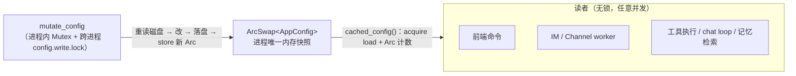
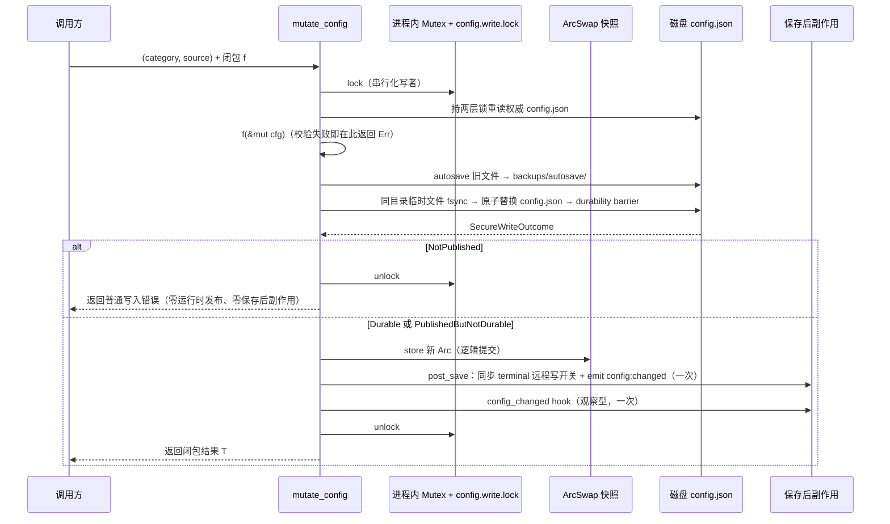
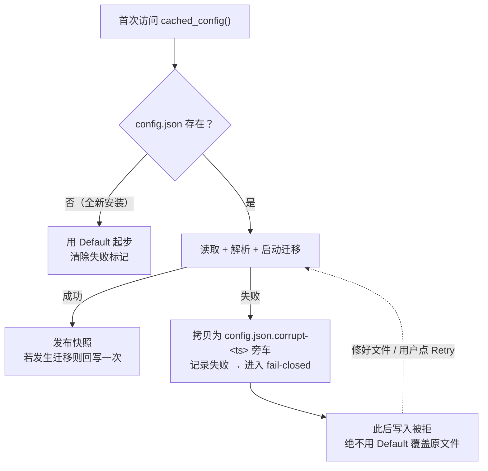

# 配置系统

> 返回 [文档索引](../../README.md) | 更新时间：2026-08-11 | 关联：[文件操作](../core/file-operations.md) · [Backup 备份](backup-autosave.md) · [Provider 系统](../core/provider-system.md)

应用配置 `AppConfig` 是整台应用的"设置总账"：面向用户的所有开关、Provider 列表、工具参数、记忆 / 知识 / 沙箱 / 服务器策略、UI 偏好，全部住在这一个结构里，持久化为 `~/.hope-agent/config.json`。本文讲清它怎么在桌面、Server 与 ACP 共享数据目录时被安全地读写，以及围绕读写的容错、事件、备份与恢复。

## 关联源码

- [`config/persistence.rs`](../../../crates/ha-core/src/config/persistence.rs) —— 读写 contract 的家：`cached_config` / `mutate_config` / 加载容错
- [`config/autosave.rs`](../../../crates/ha-core/src/config/autosave.rs) —— 写前快照原语
- [`config/mod.rs`](../../../crates/ha-core/src/config/mod.rs) —— 模块出口（wire 类型再导出自 `ha-config-schema`）
- [`settings_reset.rs`](../../../crates/ha-core/src/settings_reset.rs) —— 设置分区恢复默认
- [`i18n.rs`](../../../crates/ha-core/src/i18n.rs) —— 后端语言解析与系统文案本地化
- [`app_init.rs`](../../../crates/ha-core/src/app_init.rs) —— 装配期注册保存后副作用

## 核心思想

一台应用里为什么要为"读一份配置"专门立规矩？因为配置同时被两类完全不同的调用方触碰：

- **海量、并发、只读**的热路径——每次工具执行、每一轮聊天循环、每次记忆检索、每个 Channel worker，都要问一句"当前配置是什么"。这类访问必须近乎零成本，绝不能因为别人在改配置就被卡住。
- **零星、需要严谨**的写入——用户在设置页点保存、OAuth 登录落盘、cron 改一个字段。这类访问很少发生，但必须原子、可回滚、能通知别人"变了"。

把这两类需求塞进同一把普通的 `Mutex<AppConfig>` 会两头不讨好：读者被写锁拖慢，而一旦有人在别处再缓存一份配置副本，它就会和真身悄悄分叉。

配置系统的关键设计就是**读写分道，单一真相源**：

- 进程里只有**一份**权威的内存配置，用 `ArcSwap<AppConfig>` 持有。读者拿到的是某一时刻的不可变快照 `Arc<AppConfig>`。
- **读**永远无锁：一次原子 acquire load 加一次 `Arc` 引用计数自增，开销在纳秒级。
- **写**永远走唯一入口 `mutate_config`，由进程内写锁与 `config.write.lock` 操作系统排他锁共同串行化"读取权威磁盘快照 → 应用改动 → 落盘 → 原子换上新快照 → 广播变更"的全过程。

一切读走 `cached_config()`，一切写走 `mutate_config(...)`——没有第二条路。任何"在别处再存一份 config"或"手动克隆-改-存"的写法都会让真相源分叉，本文末尾的[反面样式](#反面样式)专门列出这些禁区。

## 读与写：两条不对称的路径

```rust
use ha_core::config::{cached_config, mutate_config};

// 读：拿一份不可变快照
let config = cached_config();             // Arc<AppConfig>
if config.canvas.enabled { /* ... */ }

// 写：唯一入口，闭包内改字段
mutate_config(("canvas", "settings-ui"), |cfg| {
    cfg.canvas.enabled = true;
    Ok(())
})?;
```

`mutate_config` 的闭包是 `FnOnce(&mut AppConfig) -> anyhow::Result<T>`：

- 返回 `Err(...)` 表示校验失败——闭包内直接拒绝，**不落盘、不发布**，错误原样透传给调用方。
- 返回 `Ok(T)` 里的 `T` 可以把 mutation 过程中算出的派生数据（比如新建对象的 ID）带回给调用方。

`reason: (category, source)` 是一个二元组，贯穿备份与事件：

- `category` —— 改的是哪个子系统，例如 `"canvas"` / `"media_gen.defaults"` / `"hooks"` / `"security.ssrf"` / `"filesystem"`（远程写闸门 `allowRemoteWrites`）。各子系统的完整字段、默认值、范围与硬上限见 [file-operations.md](../core/file-operations.md#大小配置与硬上限)。
- `source` —— 从哪触发，例如 `"settings-ui"` / `"http"` / `"oauth-finalize"` / `"cron"` / `"slash-channel"`。

这对字段有两个去处：作为 autosave 备份文件的 tag（备份面板据此显示"谁在何时改了什么"），以及作为 `config:changed` 事件的 payload（前端据此知道该刷新哪个面板）。

### 异步上下文用 `mutate_config_async`

`mutate_config` 是同步函数，它持锁期间会做真实的阻塞 IO（写前校验读、autosave 拷贝、临时文件写入与原子替换）。若在 async fn 里 inline 调用，它会把一个 tokio worker 钉死到 IO 完成；若 home 目录被杀软扫描或云同步拖慢，被钉住的 worker 越积越多，runtime 会饿死。**async 上下文必须改用 `mutate_config_async`**——它把整套克隆→改→存→发布搬到 tokio 的 blocking 线程池，只占用可消耗的辅助线程。这也是后端"阻塞 IO 红线"在配置写路径上的落点。

## 并发模型



- **读者从不阻塞**：`ArcSwap` 允许无限个并发 reader，读路径永不等待写路径。
- **写者互斥**：进程内 `Mutex<()>` 串行本进程写者，`config.write.lock` 再串行共享数据目录的桌面、Server 与 ACP。拿到两层锁后必须重读权威 `config.json`，并把锁持有到原子发布完成；禁止从进程缓存开始写事务，否则另一进程刚提交的字段会被旧快照覆盖。
- **快照原子性**：`store(Arc::new(new))` 是一次 release store。任何 `cached_config()` 调用要么看到旧快照、要么看到新快照，绝不会看到半更新状态。
- **持锁时间可控**：写锁只覆盖一次配置克隆 + 闭包执行 + 序列化 + 一次安全原子写 + 一次 Arc swap。磁盘 IO 虽是阻塞的，但写入频率极低（用户点保存），不会拖垮 runtime 的其它 worker。

### 为什么坚持单一真相源

如果进程在 `ArcSwap` 之外再缓存一份配置副本（例如把 `Mutex<AppConfig>` 塞进某个 `AppState`），两份就会分叉：用户在 UI 保存后，`ArcSwap` 快照和磁盘都更新了，但那份副本仍停在应用启动时的旧值。凡是读那份副本的代码路径就会一直服务陈旧配置，直到下次重启。

这种分叉的典型症状很隐蔽：用户在设置里启用了某个图像生成 Provider，但读旧副本的聊天路径始终没把 `image_generate` 工具注入到发给 LLM 的 `tools[]`，于是那次对话里工具根本没生效，症状却像模型自己没认出工具。把配置收敛到 `cached_config`（读）+ `mutate_config`（写）一套 contract，就是为了让"改配置立刻在全进程生效"成为结构性保证，而不是靠约定。

## 写路径流水线

一次 `mutate_config` 从加锁到解锁，串起备份、落盘、发布、副作用一条完整流水线：



几个要点：

- **autosave 在覆盖前**：写盘之前先把"旧"文件拷进 `backups/autosave/`，所以每一次设置改动都可回滚。快照失败只 warn，绝不阻塞用户写入。
- **磁盘发布也是原子的**：新 JSON 先完整序列化并写入同目录临时文件，`fsync` 后才替换目标；Unix 在 rename 后再 fsync 父目录，Windows 使用 `MoveFileExW(REPLACE_EXISTING | WRITE_THROUGH)`，路径上只能观察到完整旧文件或完整新文件，不会留下半个 UTF-8 字符或截断 JSON。
- **内存发布在磁盘路径发布后**：只有 `NotPublished` 会保持旧 ArcSwap；只要新文件已经成为路径上的可见版本，即使后置 durability barrier 报错，也必须 `store` 新快照，避免下一次 mutation 从旧缓存克隆并覆盖已落盘修改。
- **副作用经注入且恰好执行一次**：`post_save` 与 `config_changed` hook 不写死在 persistence 里，而是在装配期一次性注册（见[备份 / 回滚联动](#备份--回滚联动)）；未注册时（测试 / 纯 CLI）自动跳过。一次 `mutate_config` 的逻辑提交只发布一次 ArcSwap、调用一次 `post_save` 和一次 `config_changed`，不会因 durability 告警重放 mutation 或副作用。

### 三态落盘结果与逻辑提交

配置写使用 `platform::write_secure_file_outcome`，不能使用把发布后错误也压成普通 `io::Error` 的兼容入口。`SecureWriteOutcome` 的处理是配置一致性 contract，而不是诊断细节：

| 结果 | 磁盘事实 | 配置层行为 |
|---|---|---|
| `Durable` | 完整新文件已原子发布，durability barrier 成功 | 逻辑提交：发布 ArcSwap、清除 load-failure 状态，`post_save` 与本次 `ConfigChange` 各执行一次，返回 mutation 结果 |
| `PublishedButNotDurable(error)` | 完整新文件已原子发布，但发布后的 durability barrier 失败；典型为 Unix rename 成功后父目录 fsync 失败 | **仍按逻辑提交处理**，与 `Durable` 执行完全相同的 ArcSwap 和副作用各一次；另记录高等级 durability 告警，但不返回普通失败、不诱导调用方重跑已经执行过的闭包 |
| `NotPublished(error)` | 本次未替换目标路径 | 返回普通失败；不发布 ArcSwap、不清除 load-failure 状态，也不执行 `post_save` / 本次 `ConfigChange` |

这一区分防的是一个真实的分叉窗口：如果 rename 已成功却因父目录 fsync 报错而提前 `?` 返回，磁盘会是新配置、ArcSwap 仍是旧配置；下一次 mutation 随后从旧快照克隆，便会把第一次修改覆盖掉。安全副作用也会漏执行，例如关闭 `allowRemoteWrites` 后本应即时撤销的远程 shell。把 `PublishedButNotDurable` 认作逻辑提交，可以保持磁盘可见状态、进程快照与副作用一致，同时把断电持久性风险明确留在高等级日志中。

`UserConfig` 的 `user.json` 虽没有 ArcSwap，但包含 `remoteApiKey`，并承载 Enter 发送偏好等需要即时刷新客户端的设置，因此走同一 `write_secure_file_outcome`：文件以 credential-grade 权限原子发布；`Durable` 与 `PublishedButNotDurable` 都恰好广播一次 `config:changed { category: "user" }`，`NotPublished` 才返回失败且不广播。禁止退回 `std::fs::write`，否则既会重新引入截断窗口，也可能让凭据文件继承过宽的默认权限。

## 启动加载与容错

配置的**加载**同样藏着一条不能出错的红线：绝不能让一次读取失败把用户的真实配置换成空白默认值。



为什么这么谨慎：一个"读失败就用默认值兜底"的天真实现，会把任何瞬时故障（Windows 编辑器加的 UTF-8 BOM、杀软临时锁文件、写到一半被截断）都变成一份全新默认配置；紧接着下一次 `save_config`（比如 onboarding 完成的那次写入）就会把这份默认值**盖到**用户真实的 `config.json` 上，永久毁掉 Provider / MCP 服务器 / onboarding 状态，并让首启向导每次开机都重来。

所以现存文件加载失败时，系统会：(1) 在日志里高声报错；(2) 把不可读的文件拷成带时间戳的 `config.json.corrupt-<ts>` 旁车；(3) 进入 fail-closed 守卫，拒绝后续写入直到真实文件能重新读出来。用户可见的 Retry（`config_health`）会立即重读一次，瞬时的文件锁因此能自愈。

几个相关的容错行为：

- **容忍 BOM**：Windows 记事本保存时会在开头加 `U+FEFF`，解析前会先剥掉它，否则 `serde_json` 会拒绝整份文件。
- **启动迁移只回写一次**：老版本 `config.json` 缺少当前 Memory 运行时契约字段时，加载期会补齐并把迁移后的结果回写一次（回写前同样先 autosave）。回写失败不影响本次运行——内存里用的是已迁移的视图，下次启动再重试持久化。
- **隔离评测模式禁写**：模型评测服务器以 `HA_MODEL_EVAL_MODE=1` 运行时，所有配置写入被硬拒，committed 配置里也绝不允许持久化 Provider / 服务器凭据；API Key 只在内存中叠加、进程退出即焚。

## 事件通知

`save_config` 在磁盘写入 + `ArcSwap` 更新完成后，经 EventBus emit `config:changed` 事件：

- 走 `mutate_config` 的路径，payload 携带真实的 `category` + `source`；
- 直接调 `save_config` 的路径（无 mutation reason），payload 回退为 `{ category: "app" }`；
- `reload_cache_from_disk`（用于备份回滚等带外写盘后刷新缓存）发布 `{ category: "app", source: "reload" }`。

前端有大量界面订阅这个事件做热更新，"UI 保存 → 订阅者收到通知 → 面板热更新"这条链路因此闭合。代表性的订阅点包括语言切换（[`i18n/i18n.ts`](../../../src/i18n/i18n.ts)）、主题热切换（[`hooks/useTheme.ts`](../../../src/hooks/useTheme.ts)）、Dangerous Mode 状态（[`hooks/useDangerousModeStatus.ts`](../../../src/hooks/useDangerousModeStatus.ts)）、通知设置（[`lib/notifications.ts`](../../../src/lib/notifications.ts)），以及记忆、知识、设计、Sprite、本地模型等设置分区各自的刷新钩子。

## 备份 / 回滚联动

写盘前的 autosave 快照原语住在 [`config/autosave.rs`](../../../crates/ha-core/src/config/autosave.rs)，由 persistence **直接调用**。它必须**无条件**执行：`hope-agent server setup` 与两个 server 入口都在 `init_runtime` 之前（或完全绕过它）就会写 config，任何"装配期才注册"的钩子在这些路径上都会静默失效——因此写前快照不走注入，而是硬编码在写路径里。

- `mutate_config` 用 `scope_save_reason((category, source))` 给当次快照打标签，于是备份面板上看到的是 `theme/settings-ui`、`media_gen.defaults/settings-ui`、`active_model/slash-channel` 这样的人类可读标签，而不是一排 `unknown/unknown`。
- autosave 目录 `~/.hope-agent/backups/autosave/` 按文件数滚动保留，文件名含 `(timestamp, kind, category, source)`。
- 完整的备份 / 恢复 / autosave 列表逻辑在 [`backup.rs`](../../../crates/ha-core/src/backup.rs)（依赖 memory / event_bus），它把 `scope_save_reason` / `snapshot_before_write` 再导出，保持旧调用路径不变。详见 [backup-autosave.md](backup-autosave.md)。

**保存后的其余联动才走注入**：`post_save`（同步 terminal 远程写开关 + 广播 `config:changed`）与 `config_changed` hook 依赖全局单例与 hook 注册表，在装配期由 `app_init` 用一次性 `OnceLock` 注册，重复注册即 panic。这类联动在 `init_runtime` 之前本就没有订阅者（EventBus / terminal manager 未初始化、hook 注册表未加载），未注册即静默跳过，不影响这些早于装配期的写路径。其中"`allowRemoteWrites` 被关闭时立即撤销远程创建的 shell"是一条安全联动：发布一个 disabled 值必须**当场**吊销远程会话，而不仅仅是拒绝下一个 HTTP 请求。

## 语言偏好与后端 i18n

两个语言字段职责不同，不能混用：

- `AppConfig.language` 是**产品界面语言偏好**，`"auto"` 表示跟随系统 / 客户端。
- `UserConfig.language` 只用来告诉模型用户偏好的**回复语言**，不能拿它渲染系统通知。

后端统一通过 [`i18n`](../../../crates/ha-core/src/i18n.rs) 解析语言：

- `effective_ui_locale(&AppConfig)` —— 后端可见的 UI locale，优先 `AppConfig.language`，`auto` 回落宿主系统 locale，不支持的语言 fail-open 到英文。
- `effective_locale(subsystem_language, app_language)` —— 允许子系统可选覆盖（例如 recap），依次回退到 UI 语言、系统 locale。
- `localized_backend_message(...)` —— 后端直接发到外部通道的少量系统文案（例如 IM "已恢复在线" 提示、会话被其它入口接管提示）在 Rust 侧就地渲染。

渲染归属的边界：

- 发给前端 UI / 桌面通知的事件，优先推稳定的 `messageKey` + `messageArgs` + `fallback`，由前端 i18next 按客户端当前语言渲染。
- 后端绕过前端、直接发到 IM / webhook / 外部通道的文本，必须在 Rust 侧渲染；当前没有 per-recipient locale，统一用全局 `AppConfig.language`。
- **明确不在 Rust 侧渲染**的内容：模型输出、用户输入、工具 / Provider 的原始错误详情、日志、工具 schema / system prompt、LLM 结果正文。这些要么是用户 / 模型自己的语言，要么应保持原样透传。

## 设置分区恢复默认

设置页的"一键恢复默认"统一调用 [`settings_reset`](../../../crates/ha-core/src/settings_reset.rs)。两条铁律：默认值只来自当前版本 Rust 类型的 `Default` 实现（前端不得复制默认常量），恢复只重置"设置字段"而绝不删除用户创建的资源。所有 reset scope 都不会改动 `providers`、`active_model`、`fallback_models`、`temperature`、`reasoning_effort` 或 `function_models`（视觉 / 自动化模型覆盖）。

协议只有一套：Tauri 命令 `reset_settings_section({ scope, section? })` 与 HTTP `POST /api/config/reset-section` 都调用同一个 ha-core 服务，统一返回 `{ scope, section?, changed, reindexStarted, warningCodes }`。省略 `section` 是整页恢复；携带 `section` 时必须命中下方父子白名单，未知值在写入前拒绝。整页结果会省略 `section` 字段以兼容旧客户端。AppConfig 字段在一次 `mutate_config` 内提交，因此沿用 autosave、`config:changed` 与热重载契约；所有恢复请求经同一进程级锁串行化，UserConfig / Approval 等多文件操作会先保存旧快照，AppConfig 提交失败时回滚。Tauri 壳额外同步桌面专属副作用（关闭开机启动、重注册全局快捷键），Server 恢复成功后前端切回 embedded transport。

### 页面级 scope

| scope | 页面 | 资源保留边界 |
|---|---|---|
| `general` | 通用 | 保留个人资料、天气、onboarding 和代理地址；代理模式回到系统默认 |
| `tools` | 工具 | 保留 Search / 图片 / 音频 API Key、Base URL 和已部署 SearXNG（媒体生成 Provider 凭据随之保留） |
| `memory` | 记忆设置 | 保留 Embedding 模型库和外部 Provider 凭据；记忆 / Claim / Profile / 审核记录等数据不受影响 |
| `knowledge` | 知识设置 | 保留知识库、绑定和笔记；切块或 Embedding 签名变化时启动后台重建 |
| `design` | 设计 | 保留产物与 `last_model` 行为记忆 |
| `chat` | 聊天 | 保留会话和消息 |
| `cron` | 定时任务设置 | 保留任务与运行历史 |
| `plan` | Plan | 保留 Plan 文件及自定义目录 |
| `recap` | Recap | 保留历史报告 |
| `server` | Server | 保留远程地址、远程凭据、embedded Token 和公开地址；模式回到 embedded |
| `files` | 文件 | 保留 `allowRemoteWrites`，只恢复大小限制 |
| `sandbox` | 沙箱 | 将镜像、CPU / 内存 / PID 限制与加固选项恢复为默认值（不删除主机上已构建的镜像 / 容器） |
| `browser` | 浏览器 | 保留 Profile、扩展 ID 和运行时资源 |
| `acp` | ACP | 保留 Backend、环境变量和凭据 |
| `notifications` | 通知 | 保留 Agent 级覆盖 |
| `approval` | 审批 | 同时恢复全局策略、protected paths、dangerous commands、edit commands |
| `security` | 安全 | 关闭全局 YOLO，恢复 SSRF 策略，不改审批的其它策略 |
| `logs` | 日志 | 只恢复日志策略并立即热更新 logger |

明确**不提供** scope 的页面：全局模型、Provider、个人资料、Agent、团队、频道、技能、MCP、Hooks、语音、系统权限、健康、关于、更新历史、开发者工具。

> `sandbox` 与 `logs` 落在各自独立的配置文件里（不属于 `config.json`），因此它们的恢复是独立的文件读写，不经 `mutate_config` 那次 AppConfig 提交。

### 页签级 section

携带 `section` 时只恢复该页里的"安全配置字段"子集。下表是完整的父子白名单：

| 父 scope | 稳定 section |
|---|---|
| `general` | `appearance`, `system`, `network` |
| `tools` | `general`, `web_search`, `web_fetch`, `media_gen`, `canvas`, `async_tools`, `issue_reporting` |
| `chat` | `basic`, `awareness`, `context_compact` |
| `security` | `dangerous`, `ssrf` |
| `notifications` | `global`, `startup` |
| `memory` | `extract`, `recall_summary`, `budget`, `retrieval`, `dreaming` |
| `knowledge` | `compile`, `vision`, `note_tools`, `search`, `passive_recall`, `source_limits`, `media_retention`, `maintenance`, `sprite` |
| `approval` | `protected_paths`, `edit_commands`, `dangerous_commands` |

子区域恢复刻意收窄影响面：

- **不触发重建**。Memory / Knowledge 的 Embedding 选择和 Knowledge 切块参数不提供 section，因此从子区域恢复永远不会启动 reindex。只有整页恢复 `knowledge` 且切块 / Embedding 签名变化时才启动后台重建。
- **保留同意状态**。`memory.budget` 只恢复预算数值，保留 recall / deep-recall 的启用与用户同意字段。
- **前端行为**。整页、页签、区域按钮共享同一确认控件；成功只重挂载目标区域，失败不卸载当前草稿。Knowledge 的重建或桌面副作用若无法启动，以稳定 `warningCodes` 返回——已成功提交的默认设置不会被伪装成失败。

## 反面样式

以下写法会让配置真相源分叉或绕过安全网，**不应**出现：

```rust
// ❌ 手动克隆 → 本地改 → 单独调 save_config：没有写锁保护，两个并发请求会丢更新
let mut store = ha_core::config::load_config()?;
store.canvas.enabled = true;
ha_core::config::save_config(&store)?;
```

```rust
// ❌ 往 AppState 再塞一份 config 副本：它会和 cached_config 分叉，读它的路径永远陈旧
pub struct AppState {
    pub config: Mutex<AppConfig>,
    // ...
}
```

```rust
// ❌ 绕过 mutate_config 直接写磁盘：破坏 ArcSwap 发布 + autosave 备份 + 事件通知
std::fs::write("~/.hope-agent/config.json", ...);
```

新增任何 save 入口，模板永远是一句 `mutate_config`（async 上下文换 `mutate_config_async`）：

```rust
ha_core::config::mutate_config(("<category>", "<source>"), |store| {
    store.<field> = new_value;
    Ok(())
})?;
```
