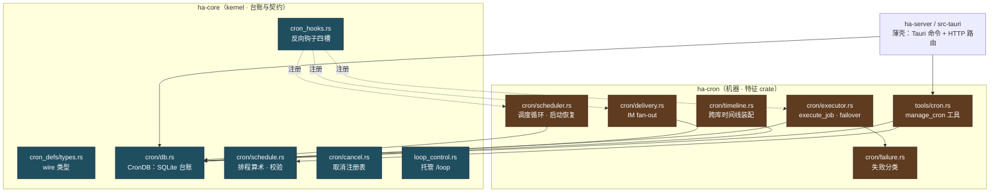
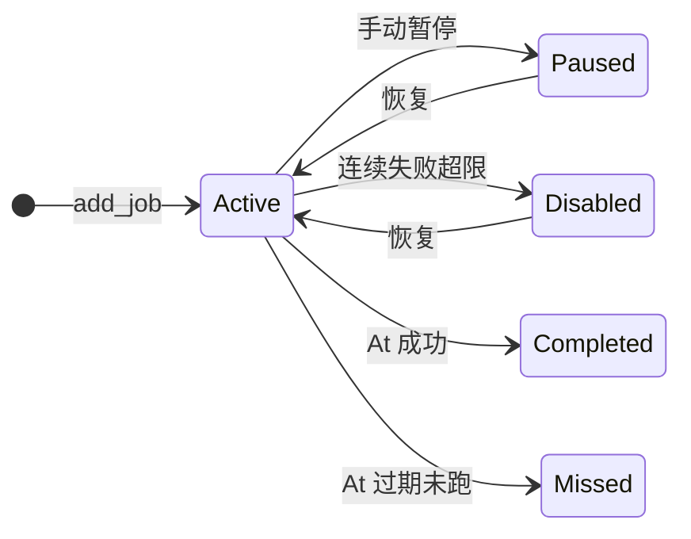
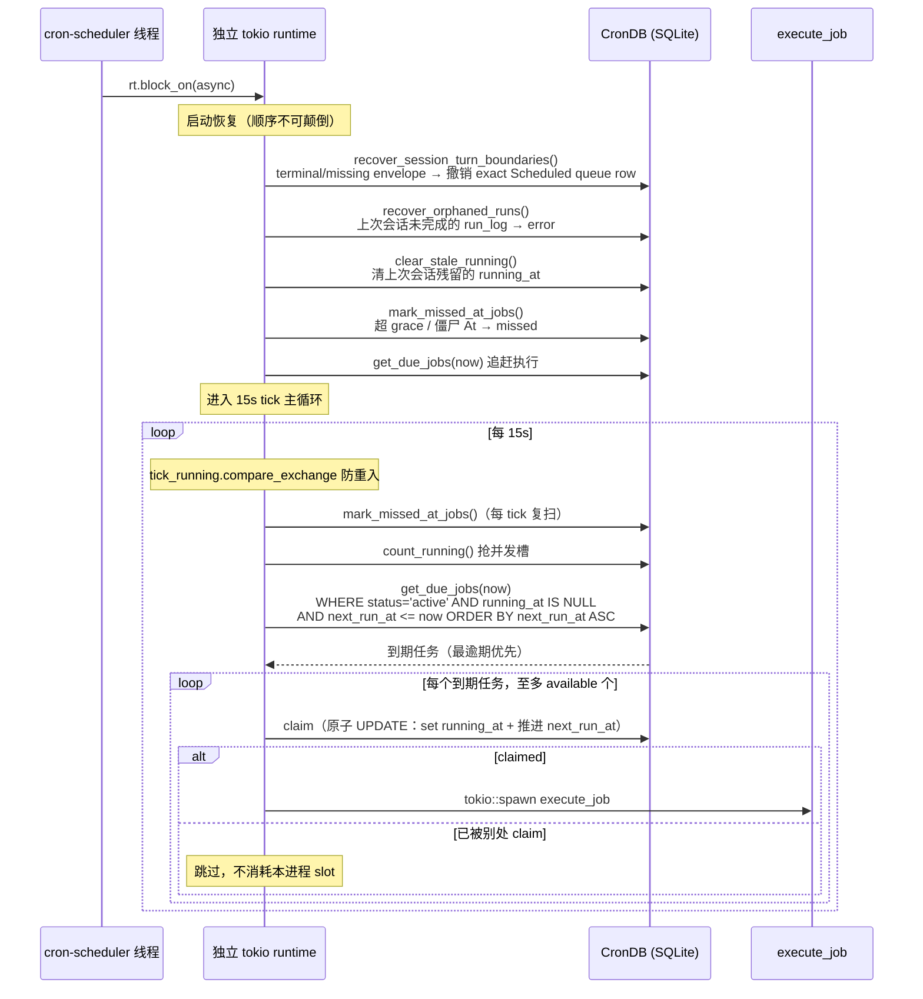
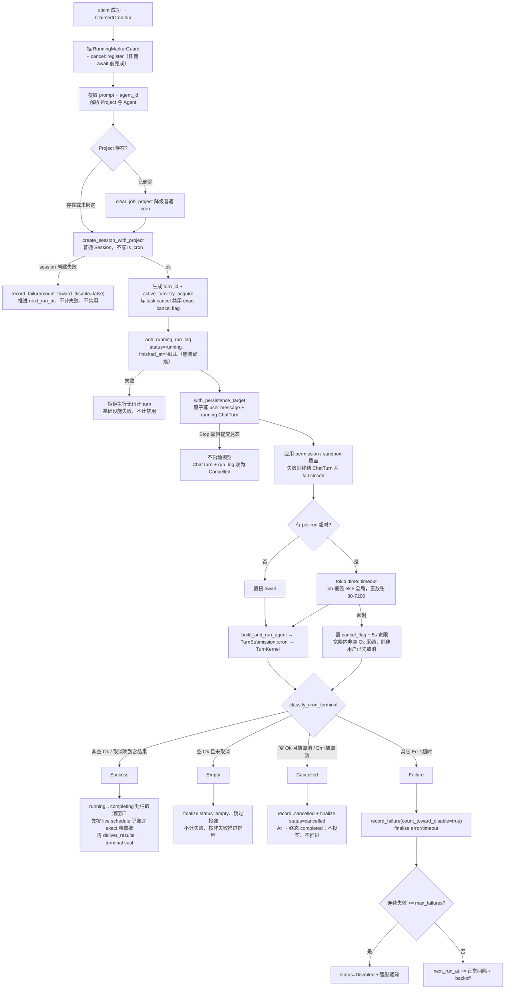
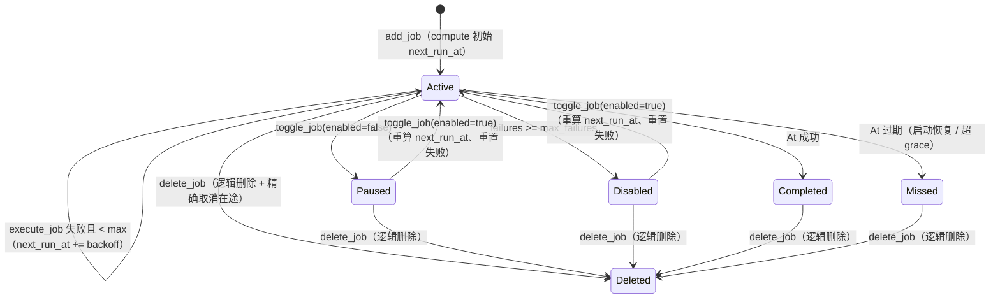

# Cron 定时任务架构

> 面向用户的操作说明见[《用户手册 9.4：定时任务》](../../user-guide/09-多Agent与定时任务.md#94-定时任务cron)。返回 [文档索引](../../README.md) | 更新时间：2026-08-15

## 这个子系统解决什么问题

用户想让 Agent「每天早上把日历汇总发到飞书」「磁盘超过 90% 就提醒」「三天后提醒续费」。这类需求的共同点是：**触发与执行在时间上解耦**——创建时用户在场，触发时用户往往不在。这带来三条硬约束：

1. **可靠**。App 可能重启、机器可能休眠、进程可能崩溃。到点该跑的任务不能因为「那一刻没人开着窗口」就永远丢失。
2. **上下文边界明确**。`AgentTurn` 每次触发都在独立普通会话运行；用户显式创建的 `SessionTurn` 则进入目标会话的同一 durable FIFO，按 live 会话上下文串行执行，不能越过当前 turn 或其它已排队输入。
3. **自治但安全**。触发时不能假设用户在场批准或停止，系统必须自己兜住并发、超时、连续失败、以及被 prompt 注入的模型试图越权外发数据的风险；用户随后打开运行会话时，仍可沿用普通对话的 Stop 与输入能力。

Cron 子系统就是围绕这三条约束建起来的。核心设计可以浓缩成几句话：

- **持久调度**：任务、下次触发时间、运行日志全部落 SQLite（`cron.db`），进程重启后从库里恢复，不依赖任何内存态。
- **调度只负责发起普通对话**：每个 `AgentTurn` occurrence 创建一个普通 Session，并以 durable ChatTurn 执行首轮 prompt；会话照常进入侧栏、搜索与未读，结果仍可通过 `delivery_targets` fan-out 到 IM 渠道。
- **先抢槽再认领（slot-before-claim）**：全局并发上限之下，调度器先确认有空位再原子 claim 任务，避免「认领了却因没空位而白白跳过一次触发」。
- **单 Primary 执行**：多实例部署时只有 Primary 进程跑调度，用 owner-token 把「本进程的在途运行」和「上次崩溃的残留」严格区分开。
- **失败闭合（fail-closed）**：无人值守下的审批、沙箱写入、投递白名单，出错一律往「更安全」的方向退，而不是往「继续裸跑」退。

三种触发模式覆盖了绝大多数需求：一次性（`At`）、固定间隔（`Every`）、cron 表达式（`Cron`，带 IANA 时区、DST 感知）。

---

## 模块结构与 crate 归属

Cron 横跨两个 crate，分工遵循全仓库的通用模式：**对 `cron.db` 的 SQL 台账、排程算术、wire 类型、纯谓词留在 kernel（`ha-core`）；调度/执行/投递这些「机器」搬到特征 crate（`ha-cron`）**。kernel 不能反过来依赖 `ha-cron`，所以 `ha-cron` 要驱动的东西（启动调度器、派发执行、取消、注入投递）通过 `cron_hooks` 的反向钩子暴露给 kernel 调用。



`cron_hooks` 的四个槽（`start_scheduler` / `spawn_job_execution` / `cancel_running_job` / `deliver_injection_for_session`）在 `ha-cron` 装配前，kernel 侧「cron 机器缺席」的语义逐项等同于未装配前的行为——调度不跑、取消返回未运行、注入不投递。

| 文件 | 归属 | 职责 |
|------|------|------|
| `cron_defs/types.rs` | kernel | 全部 wire 类型：`CronSchedule` / `CronPayload` / `CronJob` / `CronJobStatus` / `CronRunLog` / `NewCronJob` / `CalendarEvent` / `CronTimelineRow` 等 |
| `cron/db.rs` | kernel | `CronDB`：SQLite CRUD、原子 claim、running 标记、run_log 生命周期、日历查询、启动恢复、schema 迁移与回填 |
| `cron/schedule.rs` | kernel | `compute_next_run` 三种调度计算、`validate_schedule` 排程校验、时区解析、指数退避、灵活时间戳解析 |
| `cron/cancel.rs` | kernel | run-keyed 取消注册表（`register` / `cancel` / `remove` + claim↔register 窗口的 pending 占位） |
| `cron_hooks.rs` | kernel | cron 机器的反向钩子四槽 |
| `loop_control.rs` | kernel | 托管 `/loop`（复用 cron 调度，见 [loop](../agent/loop.md)） |
| `cron/scheduler.rs` | ha-cron | `start_scheduler`：独立 OS 线程 + tokio runtime、启动恢复、15s tick 循环 |
| `cron/executor.rs` | ha-cron | `execute_job`：普通 Session + durable ChatTurn、per-run 超时、成功/失败分支、failover、事件发射 |
| `cron/delivery.rs` | ha-cron | `deliver_results`：白名单复检 + 有界退避重投 + `DeliveryReport` |
| `cron/failure.rs` | ha-cron | `CronFailureClass`：纯函数失败分类（只做诊断，不改禁用策略） |
| `cron/timeline.rs` | ha-cron | `cron_run_timeline`：`cron.db` 与 `sessions.db` 两库 Rust 层装配 |
| `tools/cron.rs` | ha-cron | `manage_cron` 工具：模型侧创建/更新/删除/运行/列举 |

---

## 数据模型

### CronSchedule（三种调度类型）

serde 以 `type` 标签区分、字段 `camelCase`：

| 类型 | 字段 | 说明 |
|------|------|------|
| `At` | `timestamp: String` | 一次性触发。接受 RFC 3339（`2026-04-05T10:00:00+08:00`）和紧凑时区偏移（`+0800`），由 `parse_flexible_timestamp` + `normalize_tz_offset` 自动归一化 |
| `Every` | `interval_ms: u64`, `start_at: Option<String>` | 固定间隔，每 N 毫秒。`start_at` 是**首个计划触发时间**（相位锚点），`compute_next_run` 返回「严格晚于 `after` 的下一个锚定时间点」 |
| `Cron` | `expression: String`, `timezone: Option<String>` | 标准 cron 表达式（`cron` crate）。`timezone` 真正生效：带 IANA 名时按该时区墙钟解释、DST 感知；`None`/空回退 UTC（详见「时区语义」） |

`Every` 的 `start_at` 是相位的核心。没有它，日历展开只能从查询窗口起点「硬铺」，会出现「4 月 22 日刚建的喝水提醒在 4 月 1 日就冒出圆点」这类错位。旧库里缺 `start_at` 的 `Every` 行在 `CronDB::open` 时按 `created_at + interval_ms` 自动回填锚点。

### CronPayload（任务载荷）

serde 以 `type` 标签区分，有三种：

| 类型 | 字段 | 说明 |
|------|------|------|
| `AgentTurn` | `prompt: String`, `agent_id: Option<String>` | 普通定时任务：每次 occurrence 创建普通可交互 Session，以指定 prompt 创建并执行一个持久化 ChatTurn。`agent_id` 缺省解析到 `ha-main`（`DEFAULT_AGENT_ID`） |
| `SessionTurn` | `session_id`, `prompt` | 普通 Chat 标题栏创建的会话排程：不保存 Agent / Project / KB / cwd / permission / sandbox 的 Task 副本；每次触发从目标 Session 读取 live 配置，并把 occurrence 作为 backend-managed FIFO 行排入同一会话 |
| `SessionLoop` | `loop_id`, `session_id`, `prompt`, `agent_id?`, `goal_id?` | 托管 `/loop` 触发：复用 cron 的持久调度与恢复，但执行走**父会话注入管线**，因此保留对话上下文、Goal 关联、权限、Project/KB 访问与空闲门控。详见 [loop](../agent/loop.md) |

`CronPayloadType`（`AgentTurn` / `SessionTurn` / `SessionLoop`）是给不需要完整 payload 的摘要 DTO 用的稳定判别式，出现在 `CronTimelineRow` 与 `CalendarEvent` 里。

### CronJobStatus（五态）



| 状态 | 说明 |
|------|------|
| `Active` | 正常调度中 |
| `Paused` | 手动暂停 |
| `Disabled` | 连续失败超限自动禁用 |
| `Completed` | `At` 一次性任务成功完成 |
| `Missed` | `At` 任务过期未执行（启动恢复或超 grace 时标记） |

### CronJob（完整字段）

| 字段 | 类型 | 说明 |
|------|------|------|
| `id` | `String` | UUID |
| `revision` | `u64` | owner/config edit generation（初始 1）；纯 claim、排程推进、运行终态等 runtime bookkeeping 不递增 |
| `name` / `description` | `String` / `Option<String>` | 名称与描述 |
| `project_id` | `Option<String>` | 可选 Project 关联。执行时创建 Project 会话并注入 Project 上下文；Project 已删除时自愈清空、降级为普通 cron |
| `workspace_policy` | `CronWorkspacePolicy` | `project` 直接使用 Project 目录；`fresh` 每次运行创建并由普通 run chat 持有；`persistent` 由 Task 长期持有并按 occurrence 精确绑定，同时让每个运行会话持续保留该 Worktree 工作目录。`cleanup` 决定 Fresh 收尾后的去留（见「Fresh Worktree 的收尾清理」）。Worktree 准备失败不回退 Project |
| `schedule` | `CronSchedule` | 调度配置 |
| `payload` | `CronPayload` | 执行内容 |
| `status` | `CronJobStatus` | 五态状态 |
| `next_run_at` | `Option<String>` | 下次执行时间（RFC 3339）。`At` 完成后为 `None` |
| `last_run_at` | `Option<String>` | 上次执行时间 |
| `running_at` | `Option<String>` | 正在执行标记。非 NULL = 在跑，用于原子 claim 与防重复。配套的 `running_owner` 记录是哪个进程写的（见「启动清理的 owner 界」） |
| `consecutive_failures` | `u32` | 连续失败次数，成功后重置为 0 |
| `max_failures` | `u32` | 最大允许连续失败数（默认 5）。超过后自动 `Disabled`；`0` = 永不自动禁用 |
| `created_at` / `updated_at` | `String` | 时间戳 |
| `notify_on_complete` | `bool` | 完成后是否发桌面通知（默认 `true`） |
| `delivery_targets` | `Vec<CronDeliveryTarget>` | IM 渠道 fan-out 目标。空 = 仅保留普通运行会话、不向 IM 发送 |
| `prefix_delivery_with_name` | `bool` | opt-in（默认 `false`）：成功投递加 `[Cron] {name}` 前缀 |
| `job_timeout_secs` | `Option<u64>` | per-job 覆盖全局 per-run 超时预算。`None` = 用全局默认 |
| `permission_mode_override` | `Option<SessionMode>` | owner 专属：覆盖本任务运行会话的权限模式。`None` = 跟随 Agent 默认 |
| `sandbox_mode_override` | `Option<SandboxMode>` | owner 专属：覆盖本任务运行会话的沙箱模式。`None` = 跟随 Agent 默认 |

后三个覆盖字段是 job 级、不走设置三件套，且**只对面向用户本人的控制面（GUI + Tauri/HTTP）开放**——模型能调用的 `manage_cron` 工具恒把它们置 `None`，原因见「per-job 权限 / 沙箱覆盖」。

Owner `update` 必带 `expectedRevision`；`CronDB::update_job_cas` 在 SQLite `IMMEDIATE` 事务中读取 live runtime 字段并做 revision CAS，成功递增，冲突稳定返回 `cron_revision_conflict + currentJob`。表单保留本地草稿，由用户选择加载最新版本或以最新 revision 重试。pause/resume、Project 清除、投递目标 stale 变化等 owner/config mutation 同样递增；Loop disposition 与 claim/heartbeat/失败计数等 runtime 写不制造编辑冲突。

`ClaimedCronJob` 是一个执行租约：只有 DB 原子标记为 running 之后才构造，携带 `claimed_at`（claim 时刻）和 `immediate`（是否手动 run-now）。`immediate=true` 的运行与调度/禁用机制正交——只记 run_log + 投递，绝不动 status / schedule / 失败计数。

### CronDeliveryTarget（IM 渠道投递目标）

`camelCase`，描述一个 IM 渠道会话的投递坐标：

| 字段 | 类型 | 说明 |
|------|------|------|
| `channel_id` | `String` | Channel 插件 id，如 `"telegram"` / `"feishu"` / `"slack"` |
| `account_id` | `String` | 发送方 `ChannelAccountConfig.id`，决定用哪个账号发 |
| `chat_id` | `String` | 目标 `ChannelConversation.chat_id`（群/私聊） |
| `thread_id` | `Option<String>` | 可选话题/线程 id（飞书 topic、Slack thread 等） |
| `label` | `Option<String>` | 缓存的人类可读标签，仅 UI 显示，不参与寻址 |
| `stale` | `bool` | 发送账号已删除（投递期检测或删账号时 eager 标记）：投递时跳过 + GUI 标红；账号恢复则清回 |

### CronRunLog（执行日志）

| 字段 | 类型 | 说明 |
|------|------|------|
| `id` | `i64` | 自增主键 |
| `job_id` | `String` | 关联任务；Task 逻辑删除时保留，只有物理清库才触发外键 CASCADE |
| `session_id` | `String` | 本次执行关联的会话 ID；`AgentTurn` 指向新建的普通 Session，`SessionTurn` / `SessionLoop` 指向既有目标会话 |
| `turn_id` | `Option<String>` | `AgentTurn` / `SessionTurn` 对应的 exact 普通 ChatTurn；legacy / `SessionLoop` 可空 |
| `target_message_id` | `Option<i64>` | `SessionTurn` occurrence 的持久化消息锚点与 read-through 水位；旧数据及其它 payload 可空 |
| `status` | `String` | 自由文本状态（见下） |
| `started_at` | `String` | 开始时间 |
| `finished_at` | `Option<String>` | 完成时间。在途 run_log 为 NULL，终态由 `finalize_run_log` 写入；`recover_orphaned_runs` 据此判定崩溃留痕 |
| `duration_ms` | `Option<u64>` | 执行耗时 |
| `result_preview` | `Option<String>` | 结果预览（截断至 500 字节） |
| `error` | `Option<String>` | 错误信息 |
| `delivery_status` | `Option<String>` | fan-out 结果：`None`=无目标 / `delivered` / `partial` / `failed` |
| `worktree_id` / `workspace_status` / `workspace_snapshot` | `Option<…>` | 精确运行的 Worktree 身份、保管状态和终态 Git 快照；Project 模式也记录 `project` 状态但无 Worktree id |

`status` 的取值：`preparing` / `queued`（SessionTurn 入目标会话队列的模型前状态）/ `running`（在途）/ `cancelling` / `completing`（结算中）/ `success` / `empty`（零输出）/ `cancelled` / `error` / `timeout` / `no_session`（会话创建失败的基础设施错误字面量）。

#### run_log status 是自由文本列——新增状态的同步契约

`cron_run_logs.status` 没有 Rust enum 把关，每加一个新终态字符串都可能在三个下游被静默误分类。判定口径的单一裁决在 [`failure::CronFailureClass::run_log_status`](../../../crates/ha-cron/src/cron/failure.rs) 的文档注释里锁定。核心原则：**失败侧是排除名单（denylist）而非白名单**——「非成功终态的补集」一律计为失败。因此**新增失败状态是免费的**（自动落入失败分母），**新增非失败状态则必须改这三处**，否则会被当成失败、稀释成功率：

| # | 触点 | 三个非成功状态各自如何被特殊处理 |
|---|------|--------------------------------------|
| 1 | **Dashboard 聚合**（[`dashboard/insights.rs`](../../../crates/ha-dash/src/dashboard/insights.rs) 成功率 + [`dashboard/queries.rs`](../../../crates/ha-dash/src/dashboard/queries.rs) 的 `CronJobStats`） | 两处各有 `status NOT IN ('success','preparing','queued','running','cancelling','completing','empty','cancelled')` 的失败 denylist——`running`/`empty`/`cancelled` 靠出现在排除名单里才不进失败分母；`queries.rs` 另有 `SUM(CASE WHEN status != 'running' …)` 把在途 `running` 排除出 `total_runs`。新非失败状态不加进这两条 denylist 就会被当失败 |
| 2 | **前端渲染** | [`cronHelpers.ts`](../../../src/components/cron/cronHelpers.ts) 的 `runLogDotColor` / `runStatusDisplay`（`running`→蓝 / `empty`·`cancelled`→中性 muted / `success`→绿 / **默认分支一律红 `✕`**）供日历圆点与历史时间线共用；[`CronJobDetail.tsx`](../../../src/components/cron/CronJobDetail.tsx) 另有一套等价的 inline 分支，两份必须一起改；[`TaskSection.tsx`](../../../src/components/dashboard/TaskSection.tsx) 的圆环按 `successRuns + failedRuns` 这个已决分母算，随 #1 自动生效 |
| 3 | **通知分支**（[`useChatSession.ts`](../../../src/components/chat/hooks/useChatSession.ts) 监听 `cron:run_completed`） | `auto_disabled` 优先短路；其后按 `status` 分流：`success`→`cronSuccess` / `empty`→中性 `cronEmpty` / `cancelled`→中性 `cronCancelled` / **`else` 一律 `cronError`**。新非失败状态不加分支就会弹「任务失败」 |

### NewCronJob（创建输入）

| 字段 | 类型 | 说明 |
|------|------|------|
| `name` / `description` | `String` / `Option<String>` | 名称与描述 |
| `project_id` | `Option<String>` | `None` = 普通 cron。模型工具 `create` 缺省继承当前会话 Project，显式 `null`/空串表示不关联 |
| `workspace_policy` | `CronWorkspacePolicy` | Owner 控制面直接使用结构化字段；模型 `manage_cron` 通过 `workspace_mode` / `workspace_base_ref` 选择 Project / Fresh / Persistent 与 base ref |
| `schedule` / `payload` | `CronSchedule` / `CronPayload` | 调度与执行内容 |
| `max_failures` | `Option<u32>` | 默认 5 |
| `notify_on_complete` | `Option<bool>` | 默认 true |
| `delivery_targets` | `Option<Vec<CronDeliveryTarget>>` | `None` = 不下发（IM 会话内创建时隐式推断当前会话）/ `Some([])` = 显式关闭 fan-out / `Some([..])` = 投递到列出的会话 |
| `prefix_delivery_with_name` | `Option<bool>` | 成功投递前缀开关 |
| `job_timeout_secs` | `Option<u64>` | per-job 超时覆盖 |
| `permission_mode_override` / `sandbox_mode_override` | `Option<SessionMode>` / `Option<SandboxMode>` | per-job 权限/沙箱覆盖 |

### CalendarEvent 与 CronTimelineRow

**`CalendarEvent`**（日历视图一个时间点）：`job_id`、`job_name`、`payload_type`、`project_id?`（API 暴露为 `projectId`）、`scheduled_at`、`status`、`run_log?`。`run_log` 用**前向匹配**归属：每条 log 归到「不晚于其 `started_at` 的最近 occurrence」，辅以 60s 反向 skew 容差吸收时钟偏移，每条 log 只归一个 occurrence——这样密集/秒级排程也不丢圆点。

**`CronTimelineRow`**（跨任务运行时间线一行，见「运行历史、普通会话与未读」）：`run_log_id`、`session_id`、`turn_id?`、`target_message_id?`、`job_id`、`job_name`、`job_deleted`、`payload_type?`、`status`、`started_at`、`finished_at?`、`result_preview?`、`title?`、`unread_count`。**列表 key 与选中身份是 `run_log_id` 而非 `session_id`**——`SessionLoop` 与 `SessionTurn` 的多次运行可共享同一个会话，`session_id` 不唯一；`SessionTurn` history/open/read 必须按 `target_message_id` 精确定位并只接匹配 `turn_id` 的 live stream，锚点缺失时 fail-closed，既有 `AgentTurn` / `SessionLoop` 仍按原 session 语义展示。`job_deleted=true` 表示 Task 已逻辑删除但历史仍保留。`title` / archive / unread 均由装配层从 `sessions.db` 注入；普通 AgentTurn Session 的 Scheduled 未读只是同一普通 read watermark 的过滤投影。session 缺席时回退 `job_name` / `0`。

### `manage_cron` 工具与 Project 语义

模型侧 `manage_cron` 支持 `create` / `update` / `list` / `get` / `runs` / `delete` / `pause` / `resume` / `run_now` / `cancel_run` / `workspace_status` / `list_channel_targets` / `list_projects`。Project 与 Worktree 相关语义：

- `create` 的 `conversation_target` 缺省为 `new_session`；`current_session` 只从 `ToolExecContext.session_id` 取当前会话，`existing_session` 则要求模型先调 `sessions_list`，再把用户指定的 exact id 传入 `target_session_id`。两者均构造同一 `SessionTurn`，「安排当前会话」只是已有会话排程的快捷入口，不是独立执行类型。
- current / existing session target 不接受 `agent_id` / `project_id` / `workspace_mode` / `workspace_base_ref`；这些执行上下文恒从目标会话 live 读取。创建仍经共享 preflight，非 regular、incognito、已归档、Channel 绑定或缺失的目标会话均 fail closed。模型可按 job id 修改排程、prompt 等非上下文字段，但 target id 创建后不可变更。
- `list_projects` 枚举可传给 `project_id` 的 Project（`include_archived=true` 含归档）。
- `create`：省略 `project_id` 且当前会话在 Project 内则自动继承；传 `null`/空串显式不关联。
- `update`：省略保持原值；传 id 切换；传 `null`/空串清空。
- 工具层校验显式传入的 Project id 必须存在；执行层仍保留 Project 删除后的降级自愈兜底。
- `workspace_mode` 接受 `project` / `fresh_worktree` / `persistent_worktree`；创建时省略默认 `project`，更新时省略保持原策略。
- `workspace_base_ref` 只对 Worktree 模式有效；`null`/空串表示创建时解析 Project HEAD。Worktree 模式必须关联 Git Project，创建和更新都执行与 owner 控制面相同的 live preflight。
- **诊断面与 owner 面对齐**：`list` / `get` 带最近一次运行结果，`runs` 返回近几次 occurrence（状态 / 耗时 / 错误 / 结果摘要 / 投递结果，默认 5 条、上限 20 条，正文截断）。任务由模型创建，「上次为什么没跑成功」就该由模型能答；没有这条读路径它只能看见 `consecutive_failures` 一个数字。读路径复用 `visible_cron_run_logs`，同样排除已归档的运行会话。
- **`cancel_run` 与 `pause` 语义不合并**：前者只终止**正在执行的那一次** occurrence（省略 `run_log_id` 时按任务 live `running_at` 精确解析，显式传入的 id 优先——任务的 claim 会在两次调用之间推进，「取消正在跑的那个」不能误杀下一次），后者只停未来排程、不动在途运行。`cancel_run` 刻意不加审批门：Stop 语义可恢复，`delete` 才是那个不可逆、必须逐次确认的动作。
- `workspace_status` 返回任务的 workspace policy、现存受管 Worktree 及后端判定的安全动作；模型只读这些动作，不获得接管、归还、归档、恢复或丢弃 Worktree 的 owner 权限。
- Project、mode 或 base ref 的变更继续受 revision CAS、运行中锁与 Persistent 资源锁保护；模型不能用陈旧草稿或工具调用绕过。
- 模型仍不能设置 `permission_mode_override` / `sandbox_mode_override`；这两个字段不进工具 schema，且带 owner 覆盖的任务拒绝模型修改。
- 触发消息本身是 `role='user'` + `source='cron'` + `attachments_meta.cron_trigger` 的普通消息，只是渲染成居中系统气泡。**它必须被 `MessageList.isHumanTurnStart` 当作一轮的开始**（wakeup / loop 触发同理）：自主触发落在两轮之间、自成一轮，若归进上一轮就会被「已处理」折叠吞掉——而那条 prompt 正是解释下面这条回答的唯一线索。subagent / workflow 结果属于派生它们的那一轮，仍不算轮次开始。
- 模型成功创建任务后通过既有 `tool_metadata` 写入 `schedule_entity`；`MessageContent` 必须把它提升到工具折叠之外，`MessageList` 还必须在整轮「已处理」折叠时再次 hoist，不能只放在 `ToolCallBlock` 或 assistant prefix 内。聊天历史与实时流统一渲染可点击的任务卡片，卡片按 id 读取 live 状态并跳转 Scheduled 详情，不复制任务正文或另建投影表。

### 任务卡片与删除后的可复制历史

任务卡片按 id 读 `cron_get_job_snapshot`（`{ job, deleted }`，底层 `CronDB::get_job_snapshot`），**不是 live-only 的 `cron_get_job`**——删除只停未来排程、台账行保留，卡片因此在删除后仍能命名它所指的任务：

- 卡片状态三分：live（状态 / 下次运行 / 打开详情）、`deleted=true`（划线 + 已删除态 + 「复制为新任务」，不再轮询运行日志、不提供打开详情）、台账无行（只显示「任务不存在」，无可复制草稿）。
- 「复制为新任务」经 `cronNavigation` 的 `hope:cron-task-draft` 把保留的 `CronJob` 交给 Scheduled 面板，`CronJobForm` 以 `seedJob` **只初始化字段**：不带 id / revision，恒走 create，绝不把 tombstone 重新推回排程或 CAS 更新。删除的 Worktree 定制、投递目标等配置随草稿一并带出，用户改完再存。
- live 任务的最近一次运行为 `error` / `timeout` 时，卡片给「再次运行」；它与详情页 run-now 共用同一条 `cron_preflight` → `cron_run_now`（带 `expectedRevision`）链路，不新开执行入口。

### Fresh Worktree 的收尾清理

Fresh 每次运行造一个完整 checkout 且默认永不回收——日更任务一年就是 365 个工作树。`CronWorkspacePolicy.cleanup` 让任务自己声明去留，而不是把破坏性动作交给模型：

| 值 | 收尾行为 |
|---|---|
| `retain`（默认，即历史行为） | 永不自动删，只有 owner 显式归档 / 丢弃 |
| `discardIfClean` | 仅当收尾审计显示零 staged / unstaged / untracked / conflicted 且 `head_diverged=false` 才删——**不可能删掉运行产出** |
| `always` | 无条件删；只适合产出走投递、文件系统纯当沙箱的任务 |

- **只对 Fresh 有意义**：`normalized()` 把其它模式的 `cleanup` 归零，而 `validate_workspace_policy` 与模型工具**先报错再归一化**——「每次运行后清理」的任务不能因为改了 mode 就静默变成「全部保留」。
- **执行点在 `PreparedCronWorkspace::finalize`**：先等会话 idle、取审计快照、释放 custody，再决定是否 `discard_scheduled_run_worktree`。该方法在自己的事务里复查 owner / runtime custody / handoff / `state='active'` / 会话 idle，任一不满足即失败——**失败一律回落为保留 + 埋点**，待处理资源区仍是兜底。run log 的 `workspace_status` 记 `discarded`，审计的 `retained` 同步为 `false`。
- 被聊天接管、handoff 或仍有 runtime 占用的 Worktree 因此永远不会被自动清理掉。

### 任务列表的异常入口

「10 秒内找到最近一次失败及修复入口」是这个列表的验收线，因此列表行本身要能回答「哪出问题了、怎么修」：

- `cron_list_jobs` 的 `CronJobView` 带 `lastRun`（`CronDB::latest_run_summaries` 一次查询取每个任务的最近 occurrence，按自增 id 定序而非 `started_at`——同秒两次运行只有 id 是全序），列表因此不必逐行拉运行日志。
- 搜索匹配名称 + 描述 + 最近一次运行的错误 / 结果摘要（`cronSearchHaystack`）：按错误文案找任务是常见路径，而任务名里通常没有它。
- 唯一判定 `cronAttention`，按「漏掉的代价」排序：`autoDisabled`（`disabled` 只由连续失败触顶产生，用户暂停是 `paused`）＞ `runFailed` ＞ `missed` ＞ `deliveryStale` ＞ `failing`。状态筛选多一项「需要处理」直接过滤它。
- 行内直接给修复入口：自动禁用给「恢复」（`cron_toggle_job`），投递目标失效给「编辑」，其余打开运行历史。

### Owner 表单的对话目标

`CronJobForm` 的目标与模型工具的 `conversation_target` 同语义、同不可变性：

- 从聊天标题栏进入（`sessionTarget`）或编辑既有任务时目标锁定、不出选择器——目标创建后不可变。
- 从 Scheduled 面板新建时出「运行位置」选择：`new_session`（默认，每次新建会话）或已有会话；后者用 `CronSessionTargetPicker` 搜索任意普通会话（空查询列最近会话，查询走 `search_sessions_cmd types=["regular"]`），选中前后端各自把关——前端按 `is_regular_chat` 的镜像过滤 cron / 子会话 / IM / 无痕 / 已归档 / 非 regular kind，**真正的裁决仍是共享 preflight**。
- 选到已有会话即构造 `SessionTurn`，与模型侧一样不带 `project_id` / `workspace_policy` / 权限沙箱覆盖：执行上下文恒从目标会话 live 读。

---

## 调度机制

调度器跑在一个独立 OS 线程 + 独立 tokio runtime（2 worker threads）上，每 15 秒 tick 一次。`start_scheduler` 用 `std::thread::Builder::spawn` **立即返回**，启动恢复阶段在那个后台线程上跑。



任务 claim 是原子 SQL UPDATE：`SET running_at=now, next_run_at=<下次> WHERE id=? AND next_run_at=<原值> AND status='active' AND running_at IS NULL`。谓词命中 0 行即表示别的 tick 已抢先，天然防重复执行。

### 先抢槽再认领（slot-before-claim）

每个 cron 运行是一轮完整 agent turn，N 个任务同一时刻齐发就会 spawn N 个并发 LLM turn，足以打满机器或触发供应商限流。`CronConfig.max_concurrent`（默认 5，`0` = 不限）给调度器一个全局上限。

关键在于**认领会推进 `next_run_at`**——`claim` 的 UPDATE 同时 set `running_at` 并把 `next_run_at` 推到下一个 occurrence（一次性 `At` 则清成 NULL）。一旦 claim 成功，那个执行槽位就在 DB 里被消费掉了。所以顺序**绝不能对调**：

1. 读 `effective_max_concurrent()`（`None` = 不限）。
2. `count_running()`——`COUNT(running_at IS NOT NULL)`，是并发计数的**唯一依据**，覆盖 scheduled / catch-up / 手动 run-now 三条路径（三者都 set `running_at`）。
3. `available = max - running`（`saturating_sub` 防下溢）。
4. 逐个 claim，至多 `available` 个；到顶即 `break`，剩余到期任务保持 `running_at=NULL` / `next_run_at` 不变，下个 tick 重试。

反过来「先 claim 再看有没有空位、没空位就丢弃」= 静默跳过一次触发且无留痕。而「先抢槽后 claim」最坏只是把任务推迟一个 tick（15s）。

几个边界：

- **派发顺序不可颠倒**：`get_due_jobs` 带 `ORDER BY next_run_at ASC`。有了「至多 claim N 个、到顶 break」之后，裸 rowid 序在持续满槽时会让最逾期的任务每个 tick 都排在后面被跳过（饿死）；最逾期优先才对所有任务公平。
- **手动 run-now 绕过上限**（用户显式操作即时生效），但其 `running_at` 计入 `count_running`，故调度器不会在手动任务在跑时超额 spawn。
- **`count_running()` 失败保守跳过本 pass**（fail-closed），下个 tick 重试。
- **claim 输掉竞态不消耗 slot**：别处已 claim 的分支不减 `available`。
- **泄漏 slot 的 panic 兜底**：因为 `count_running` 是全局配额分母，一个泄漏的 `running_at` marker 会永久占一个 slot，若干次 panic 就能让 `available=0` 永真、整个调度器停摆到重启。故 `execute_claimed_job` 顶部挂一个 RAII 守卫，drop 时做 **owner-checked 清除**（`UPDATE … WHERE id=? AND running_at=?本次 claimed_at`）：正常终态已 `clear_running`（marker 已 NULL，守卫 no-op）；await 点 panic 解栈时守卫释放 slot；被后续 re-claim 的 marker（时间戳已变）守卫不动。进程崩溃（非 panic）仍由启动期 `clear_stale_running` 兜底。

### 启动清理的 owner 界

通用 run 清理前先做 `SessionTurn` 双库边界恢复：按 `queued_turn_user_messages.id` 有界分页读取 Scheduled 身份，只有 exact `run_log_id + request_id + session_id` 仍对应 live `SessionTurn` 且 task 的 `running_at` 仍持有该 occurrence 才保留；terminal、Task 已删或 Cron envelope 缺失的行按 `request_id + source_ref` 精确撤销。这会收敛 enqueue 已提交、但 Cron publication/cleanup 进程崩溃留下的永久 FIFO 孤儿，同时不触碰别的用户或 Channel 队列行。

两个启动清理谓词都带 owner 界：`clear_stale_running` 只清 `running_owner != CronDB::owner_token` 的行，`recover_orphaned_runs` 只收 `started_owner != owner_token` 的 run_log（`NULL` 视为「不是本进程」，覆盖旧库升上来与历史崩溃的行）。owner-token 是 `CronDB::open()` 时生成的一个 UUID。

这不是可有可无的优化。`start_scheduler` 立即返回后，启动恢复跑在后台线程上，而 `app_init` 下一行就起了其它 watcher，两者并发、调用序不构成 happens-before。若谓词不带界：

1. 某 watcher 在窗口内派出一个合法任务，写了 `running_at`；
2. 调度器线程的 `clear_stale_running()` 把它一并清成 NULL；
3. 该任务在数据层「不在跑」，周期 tick 重新 claim → **同一任务跑两遍、副作用重复**。

`recover_orphaned_runs` 同理会把本进程刚开的 run log 误标失败，污染 dashboard 成功率。

**为什么用 owner-token 而不是时间界**：靠「本进程后续 `Utc::now()` 必然晚于 `opened_at`」推 happens-before 并不严格成立——Rust 的 happens-before 不约束墙上时钟，系统时间被手动调整或 VM 校时后，本进程刚写的 `running_at` 仍可能落到 `opened_at` 之前而被误清。owner-token 与时钟完全解耦：`Arc<CronDB>::clone` 与 `spawn` 移交构成对 token 值的真实 happens-before，回拨也不会误清。回归测试 `startup_cleanup_spares_runs_started_by_this_process` 覆盖三个场景——上次会话遗留、时钟回拨（未来时间戳 + 陌生 owner）、本进程真实在途——按 job_id 精确断言前两者被清、第三者不动；时间界方案在时钟回拨场景会漏清。

### 全局配置（CronConfig）

三个旋钮同属一个 `CronConfig` struct（`AppConfig.cron`，定义在 [`ha-config-schema/src/config.rs`](../../../crates/ha-config-schema/src/config.rs)，经 `ha_core::config::CronConfig` re-export），MEDIUM 风险，配齐设置三件套：

| 字段 | 默认 | `0` 语义 / 钳值 | 作用 |
|------|------|----------------|------|
| `max_concurrent` | 5 | `0` = 真不限 | 调度器全局并发上限 |
| `job_timeout_secs` | 0 | `0` = 不加 cron 层超时；正数钳 `[30, 7200]` | 全局 per-run wall-clock 预算，可被 `CronJob.job_timeout_secs` 覆盖 |
| `at_grace_secs` | 300 | 仅上限钳 7 天；`0` = 严格不补跑（**不钳地板**） | `At` 一次性任务 late-fire 补跑窗口 |

`at_grace_secs` 的 `0` 是一个刻意的例外：其余 bounded-resource 旁钮的 `0` 一律钳到地板，但这里 `0` 保留「严格不补跑」语义，只钳上限。

三件套入口：GUI 是设置页「定时任务」分区 `CronSettingsPanel`（cron 面板头部齿轮深链进来，面板自身不再内嵌配置框）；技能是 [`tools/settings.rs`](../../../crates/ha-core/src/tools/settings.rs) 的 `"cron"` category；命令是 `get_cron_config` / `save_cron_config`（Tauri + HTTP `GET` / `PUT /api/config/cron`）。

两个坑：

- **`save_cron_config` 替换整个 `CronConfig`**——每次保存必须回传全三字段，只传其一会让其余两字段被 serde 默认重置。面板三个 commit 回调都汇入同一个 `persistCron`、固定带全三字段。
- **加载门**：面板在 `get_cron_config` 成功返回前把三个输入框 `disabled`，否则加载失败时组件的硬编码初值（5 / 0 / 300）会在用户随手一改时被整体写回、静默覆盖已有配置。

---

## 执行流程

`execute_job` 从原子 claim 到终态收尾的完整路径：



`AgentTurn` 不再调用 `mark_session_cron`，也不另建 Cron 会话状态机。`run_chat_engine` 获得上面已经持久化的 exact `turn_id`，stream journal 与 ChatTurn 终态沿用普通聊天的重连和崩溃恢复路径。Scheduled 的 `run_log.session_id` 只提供任务运行到普通会话的导航关系，不拥有另一份聊天正文。

用户在 scheduled turn 运行时打开该会话，看到的是普通 `ChatScreen`：首轮 `ChatSource::Cron` 通过主 stream bus 直播；Stop 按 exact active turn 取消，且与任务页取消共用同一个 occurrence fence，但不会留下阻挡未来排程的 session autonomy pause。此时发送消息默认进入 `queued_turn_user_messages`，当前 turn 释放后按 FIFO 发起普通人工 turn；若后端投影 `canForceInsert=true`，用户也可显式选择“插入”，在当前 turn 的下一个完整工具边界交付。队列、插入资格与停止后的收敛完全遵循 [Chat Engine 的忙时队列契约](../core/chat-engine.md)，Cron 不增加专用 queue / takeover API。`SessionTurn` 的 Scheduled 队列行固定为 `managedBy='scheduled'`、`sourceRef=runLogId`、`canForceInsert=false`，GUI 不得跳过该全局队头；Global Stop 会在同一 SessionDB 事务中把它 hold，只有 exact Continue receipt 成功消费后才恢复。

`SessionTurn` 在 Cron claim 前捕获目标会话的 Stop admission，并在 Scheduled queue 行插入事务中核验；旧请求不能在 Stop 后重新采样成“新一代”执行。目标会话缺失、归档、转成非普通会话或绑定 Channel 时，本 occurrence 终态化、exact marker 释放与 recurring Task 暂停在同一个 CronDB `IMMEDIATE` 事务中完成；修复或重绑后由用户显式恢复，避免每个 cadence 重复制造错误。

### 终态分类：一个隐藏的坑

终态判定收敛到纯函数 `classify_cron_terminal(result, was_cancelled)`（可穷举单测）。这里有个非显然的 quirk：cron 跑引擎时用 `abort_on_cancel=false`，**取消中断不抛 `Err` 而是返回 `Ok("")`**（引擎吞掉取消、收尾返回空串）。于是「被取消」和「正常跑完但没输出」长得一模一样，都是 `Ok("")`。决策表因此对 match 臂顺序敏感（cancel 必须排在 Empty 之前）：

| 引擎返回 | 是否被取消 | 终态 | 处理 |
|----------|-----------|------|------|
| `Ok("")` | 是 | **Cancelled** | 不投空消息、不推进排程、不清失败计数 |
| `Ok("")` | 否 | **Empty** | 记 `empty`、跳过投递、按非失败推进排程 |
| 非空 `Ok` | —— | **Success** | 含「取消在产出真实结果之后才到」——尊重已完成的工作 |
| `Err` | 是 | Cancelled | 防御分支（仅当未来有调用方翻 `abort_on_cancel=true`） |
| 其它 `Err` | —— | Failure | 计失败、退避/禁用 |

绝不能为「简化」改回「`Ok` 一律 Success」：`abort_on_cancel=false` 让取消长得和成功一样，那一改就是「每次取消都往 IM 投一条空消息 + 推进排程」。

---

## 调度计算：compute_next_run

| 类型 | 算法 | 完成后行为 |
|------|------|------------|
| `At` | `timestamp > after` 则返回 `timestamp`，否则 `None` | 成功后 `Completed`，`next_run_at = None` |
| `Every` | 基于 `start_at` 锚点算「严格 `> after` 的下一个锚定点」 | 固定相位；执行耗时超过一个周期时跳过错过的槽位，而非把后续触发整体漂移 |
| `Cron` | 时区感知迭代取「换算回 UTC 后严格 `> after`」的第一个 occurrence | 每次执行后基于当前时间重算 |

**时间戳解析**：`parse_flexible_timestamp` 先尝试 RFC 3339，失败后经 `normalize_tz_offset` 把紧凑偏移（`+0800`）转成标准格式（`+08:00`）再解析。运行时执行与创建期校验用的是同一个 parser——绝不把运行时能跑的时间戳判为非法、让任务无法编辑。

### 时区语义（Cron）

`Cron` 的 `timezone` 是 IANA 名（`Asia/Shanghai` 等），决定 cron 表达式的时/分字段按哪个时区的墙钟解释。计算与日历展开走**同一口径**（`parse_timezone` + tz-aware 迭代），保证日历预览与实际触发一致。校验只认 `parse_timezone` / `validate_timezone` 这一处——`parse_schedule` 在创建/更新期 trim + 校验，非法 IANA 名直接 `bail!`（不静默回退 UTC，正是静默回退让时区 bug 隐形）。

**DST 秋退是这里最锐的边**。`compute_next_cron` 两条返回路径都用 `.find(|dt| *dt > *after)` 而非裸 `.next()`：秋退当天有一段 ambiguous 墙钟窗口（如 01:30 出现两次），`cron` 的下一个本地 occurrence 换算回 UTC 可能**早于** `after`；裸 `.next()` 会把这个过去时刻写进 `next_run_at`，叠加 `get_due_jobs`（`next_run_at <= now`），该任务就会在约 30 分钟窗口内**每 tick 重复触发一整轮 turn + 投递**。`.find(> after)` 跳过任何非严格未来的 occurrence，与 `At`/`Every` 的 `> after` 契约一致。春进不存在时刻 / 秋退重复时刻由 `cron` crate 在 `Tz` 上优雅跳过、不 panic（单测守）。

运行时若遇到**非空但解析失败**的时区名（依赖漂移 / 旧二进制 / 篡改行），回退 UTC 前会 `app_warn`；空/缺省时区仍是静默的 UTC 默认（符合预期）。

**前端**：`CronJobForm` 仅 `cron` 类型显示 IANA 选择器，新任务默认填浏览器检测时区。编辑既有 cron 任务时选择器精确保留其存储时区——null/空（「Omit for UTC」故意创建的 UTC 任务）归一化显示为显式 `UTC`，**绝不回退浏览器时区**，否则一次无关编辑（改名/改投递目标）会在保存时把时区悄悄改写成浏览器时区、平移每次触发的墙钟。只有新建（或从非 cron 类型转 cron）才默认填浏览器时区。

### 一次性时区回填

`CronDB::open` 的 `backfill_cron_schedule_timezone` 把 `timezone` 为 null/空的 `Cron` 行回填为**宿主检测时区**（`iana-time-zone`）并重算 `next_run_at`，使存量「静默 UTC」任务即刻校正为本地语义。对 UTC+8 用户，存量「每天 9 点」此前实际按 UTC 在 17:00 触发，回填后回到 09:00——这是一次刻意的破坏性校正。

回填**真·一次性**，用 `cron_meta` 里的 sentinel `tz_backfill_done` 门控（跑过即短路、不再每次 open 全表扫描）。这个 sentinel 是红线而非性能优化：`None` 时区有**双重语义**——迁移前的 legacy 行 vs `parse_schedule`「Omit for UTC」故意创建的 UTC 任务。若每次启动都回填，会把升级后新建的故意-UTC 任务在下次重启静默改成宿主时区；sentinel 把回填收敛为「只迁移升级那一刻已存在的行」。宿主时区不可检测/非法时整体 no-op、**不写 sentinel**（下次启动重试，期间 legacy 行维持 UTC 解释）。

### 排程校验的唯一裁决

`schedule::validate_schedule` 是「这条排程是否合法」的唯一裁决，两条入口共用：

- **持久化 chokepoint**：`CronDB::add_job` / `update_job` 入口即校验。这是红线——面向用户本人的 Tauri/HTTP create/update 把前端构造的 `CronSchedule` 直接喂给 add/update，若不在此拦，`At` 垃圾时间戳、`Every interval_ms=0`（永不触发的死任务）就能不经校验直接落库。
- **模型工具路径**：`parse_schedule` 提取 + 归一化 JSON 字段后委托 `validate_schedule`，不再各自内联值校验。

校验规则：`At` timestamp 可被 flexible parser 解析；`Every` `interval_ms ∈ [MIN_EVERY_INTERVAL_MS=60000, i64::MAX]`——下限是 1 分钟地板（太小是「误造全功能 agent turn 跑飞循环」的经典坑），上限 `i64::MAX` ms 防溢出（超出会在 `as i64` 处回绕为负 → `compute_next_run` 返 `None` → 落成 `active` + `next_run_at=NULL` 的永不触发、永不回收僵尸，因为只有 `At` 会在 NULL next-run 时终态化）；`Cron` 表达式合法 + 非空 `timezone` 是已知 IANA 名（空/空白 = UTC，不校验）。

一个可接受的代价：`update_job` 校验的是**整条** schedule。若某行的排程本就非法（经 Tauri/HTTP 控制面直接写入 add/update），则之后仅改非排程字段（改名/改 prompt/改投递目标）也会因整条 schedule 重校验被拒。恢复路径俱在：暂停/恢复/删除刻意跳校验，GUI 重存会因前端 clamp 自动修复排程。先修排程（或删任务）再改其它字段。

### 指数退避

```
delay = min(30_000ms * 2^min(consecutive_failures, 20), 3_600_000ms)
```

即 base 30s、上限 1h：30s → 60s → 120s → 240s → … → 1h。失败后 `next_run_at` 的计算分两类：

- **`At` 类型不退避重试**：一次性 `At` 失败/超时即在 `update_after_run` 终态化为 `missed`（记失败计数但不再触发）。它的 agent turn 可能已产生副作用（发邮件/下单），重投会重复副作用。**仅基础设施失败例外**（turn 未起跑、无副作用），走 `reschedule_without_failure` 到 `now+60s` 重试。
- **`Every` / `Cron` 类型**：`compute_next_run(schedule, now) + backoff_delay`（正常间隔叠加退避），连续失败触顶 `max_failures` 自动禁用。

---

## 失败处理：超时、分类、自动禁用

### 可配 per-run 超时

`CronConfig.job_timeout_secs`（默认 `0` = 不加 cron 层超时；正数钳 `[30, 7200]`）。`CronJob.job_timeout_secs` 非空时优先，让一个合法的长任务声明自己的预算，而不必抬高全局对所有任务的上限。

正数执行包在 `tokio::time::timeout` 里：超时先置 `cancel_flag` 给 `CRON_TIMEOUT_CANCEL_GRACE_SECS`（5s）让引擎协作收尾（flush stream journal / ChatTurn、停止 spawn），而不是在任意 await 点被硬 drop。宽限期的处理由纯函数 `resolve_after_timeout_grace` 裁决：

- **引擎在宽限期内跑完并返回非空 Ok → 采纳为 Success**。否则踩线完成的真实产出会被丢、误投 timeout 失败，连续踩线 `max_failures` 次会静默禁用一个本能跑完的健康任务。
- **除非用户在超时触发前就已取消 → 宽限期产出丢弃、归 Cancelled**（用户既已喊停，停止后的产出无意义）。

否则记一条 `timeout` 失败、释放 slot（panic 路径叠加 RAII 守卫兜底）。脱钩的子代理 / async job 各有自己的预算与取消路径，不强行透传。

### 失败分类（只做诊断）

`CronFailureClass::classify(error)` 是纯函数，分三类：`Timeout` / `Configuration`（no model / no agent 等重跑也不会好的配置问题）/ `Transient`（默认——未识别错误绝不误判成配置问题）。它**只做诊断**：`run_log_status()` 让 timeout 在运行日志里显示 `timeout`（其余仍 `error`），`key()` 作为稳定 wire key 喂日志 + 前端本地化。**刻意不改禁用策略**（仍按 `max_failures` 连续失败），避免误分类导致过早禁用。

### 自动禁用及其通知

自动禁用触发靠三个守卫，缺一不可：

1. **`max_failures > 0`**：`0` = 不限 / 永不自动禁用，对齐 `max_concurrent` 的 `0`-语义。漏了这条则 `new_failures >= 0` 恒真，模型工具 / HTTP 传 `maxFailures=0`（GUI 的 `|| 5` 掩盖此路径）会在**首次失败**即禁用。
2. UPDATE 带 `AND status != 'disabled'`：只有 active→disabled 这一次转换返 `true`，故 run-now 重跑一个已禁用任务再失败不会重复通知/重复 bump。
3. 一次性 `At` 在此之前已被终态化 `missed` 早退，根本走不到自动禁用。

`update_after_run` 失败把 `consecutive_failures` 推到 `max_failures` 翻 `disabled` 时返 `true`，`record_failure` 据此发**一次性** `emit_cron_disabled_event`：复用 `cron:run_completed` 通道但**强制 `notify=true`**（无视 job 的 `notify_on_complete`——任务静默死掉正是要暴露的失效），携 `auto_disabled` / `consecutive_failures` / `failure_reason`。前端弹专属通知「任务 X 连续失败 N 次已禁用（原因）」。普通失败仍走原 `emit_cron_event`（受 `notify_on_complete` 控制）。

失败原因也进普通通知：`emit_cron_event` 的 `failure_reason`（timeout/configuration/transient）随 error run 携带，前端错误通知体附上原因。

### 基础设施失败不计入禁用

`record_failure` 有个 `count_toward_disable` 参数。session 创建、run_log 打开或 permission / sandbox 预检失败这类**模型引擎从未起跑**的基础设施错误走 `reschedule_without_failure`（推进 `next_run_at`、不 bump `consecutive_failures`、不自动禁用），只有真正的 run 失败才计入 `max_failures`。若 prompt + ChatTurn 已持久化，预检失败还必须把该 ChatTurn 收为 Failed，不能给普通会话留下永久 Running 的空壳。

---

## At 一次性任务的补跑与终态

一次性 `At` 任务有两个天然失效点，`mark_missed_at_jobs` 一并覆盖：

- **late-fire grace**：宕机期间错过触发时点的任务，重启时若无条件标 `missed`（哪怕只晚 1 秒）就永不补跑。改为按 `cutoff = now - grace` 判定：`next_run_at < cutoff`（逾期超 grace）→ `missed`；`next_run_at ∈ [cutoff, now]`（逾期在 grace 内）→ **保持 active**，紧随其后的 catch-up 经 slot-aware 派发补跑。`grace=0` ⇒ 严格（任何逾期即 missed）。
- **僵尸终态**：claim 时 `At` 的 `next_run_at` 被清成 NULL，若 claim 后崩溃，重启 `clear_stale_running` 清掉 `running_at` 后该行成僵尸（`active` + `next_run_at=NULL`，`get_due_jobs` 永不选它）。`mark_missed_at_jobs` 把 `next_run_at IS NULL` 的 active `At` 行一并标 `missed`——覆盖「claim 后崩溃」与「以过去时间戳创建」两种。一次性任务可能崩溃前已产生副作用，故标 missed 不重跑。

两个红线：

- **`running_at IS NULL` 守卫**：SQL 谓词是 `status='active' AND running_at IS NULL AND schedule_json LIKE '%"type":"at"%' AND (next_run_at IS NULL OR next_run_at < cutoff)`。少了 `running_at IS NULL`，正在执行中的 `At` 会被自己的每 tick 复扫误杀——claim 时 `At` 的 `next_run_at` 已清成 NULL、`status` 仍 `active`，任何跑够一个 tick（≥15s）的 `At` 都会落进 NULL 分支被标 `missed`。这个守卫不会漏掉真僵尸，因为启动恢复顺序是 `clear_stale_running`（把崩溃残留的 `running_at` 重置为 NULL）**先于** `mark_missed_at_jobs`，claim-后-崩溃的行照样匹配。
- **每 tick 复扫 + 顺序**：`mark_missed_at_jobs` 在启动恢复期与每个 tick（dispatch 之前）各跑一次。一个判定 within-grace 保留为 active 的 `At` 若因并发上限持续抢不到 slot，会被后续每 tick 用重算的 cutoff 重新评估——一旦累计逾期超 grace 就终态化，而不是永远停在 active 被无限重评。启动恢复完整顺序 `recover_session_turn_boundaries` → `recover_orphaned_runs` → `clear_stale_running` → `mark_missed_at_jobs` → catch-up，先后次序都关键、颠倒即出错：先收敛双库 custody 并把超 grace / 僵尸剔除，dispatch 才不会把孤儿队头或已 aging-out 的 `At` 当成可执行工作。

`toggle_job` resume 一个时间已过的 `At` 时同样终态化 `missed`，镜像 add/update 的处理（否则会写成 active + NULL next-run 僵尸）。

---

## 投递：白名单、健壮性、delete 审批

cron 投递携 IM 账号身份、可周期触发，且 `manage_cron` 标 `internal:true`（走权限引擎直接 Allow、无审批），因此对**被 prompt 注入的模型**是潜在数据外泄面。两道防线：

### 投递目标白名单

`delivery_targets` 的 `(channel_id, account_id, chat_id, thread_id)` 必须命中 `channel_conversations`（与 `list_channel_targets` 同源，即 `ChannelDB::conversation_exists`）：

- **创建/更新期**（`validate_delivery_targets`）：模型**显式提供**的未命中目标直接 `bail!` 拒绝，引导它先调 `list_channel_targets` 发现合法坐标。从当前会话 IM 对话**推断**出的目标可信、不校验（构造自真实会话行）。`Some([])` 显式关闭 fan-out 不受影响。
- **投递期/运行时**（`deliver_results`）：每个 target 投递前再查一次白名单，未命中 / channel_db 不可用 → **fail-closed 跳过 + `app_warn`**（防御会话事后被删/接管）。

投递目标既已被白名单约束在「已记录的 IM 会话」（非任意 URL），投递路径**不再叠加 SSRF 检查**——白名单即边界。

### 投递健壮性

`deliver_results` 在白名单之上叠加四项，返回 `DeliveryReport` 汇总「结果到底有没有到人」：

- **有界退避重投**：每个 target 的 send 超时（`SEND_TIMEOUT_SECS=10s`）/ 报错时按 `SEND_BACKOFF_BASE_MS=500ms` 指数退避重投，至多 `MAX_SEND_ATTEMPTS=3` 次。与计费工具的 async retry 不同——IM 投递不计费，故默认开、固定小次数、非用户旋钮。语义是 **at-least-once**：超时的 send 可能已落地，极少数情况会重复一条消息；但对周期任务而言「静默丢掉唯一一份结果」（限流 / token 过期 / server 重启）是更坏的失败。
- **`delivery_status` 派生**：`None`=无投递目标 / `delivered`=全部到达 / `partial`=部分失败或跳过 / `failed`=有目标但无人收到。统一经终态 `finalize_run_log` 的单次 UPDATE 写入。
- **失效目标可见（`stale`）**：投递期账号已删 → 该 target 标 `stale`，经 `apply_delivery_target_stale_flags` **单锁内 read-modify-write、按 `account_id` 翻转**写回。绝不经 `update_job` 重校验整条 schedule，也绝不用 claim 时快照整列覆盖——cron 单次可跑至 2h，期间用户可能改了投递目标，写回必须读 DB 当前列、只改匹配 account 的 stale 位。删账号入口经 `mark_account_delivery_targets_stale` **eager 标记**，避免 UI 仍显示一个永远投不出去的目标；账号恢复（同 id）则投递成功时清回。
- **per-job 成功前缀**（`prefix_delivery_with_name`，opt-in 默认关）：开启后成功投递加 `[Cron] {name}` 前缀（失败投递本就带 `⚠️ [Cron] {name} failed:`），便于区分投到同一群的多个任务。

删账号前的反向提醒不在这四项里，而是面向用户本人的控制面上的一次查询：`jobs_referencing_account(account_id)` 返回引用某账号的任务列表，通过 Tauri `cron_jobs_referencing_account` / HTTP `GET /api/cron/jobs-referencing-account/{accountId}` 暴露。前端 `ChannelPanel` 删除账号前先扫，命中则弹对话框列出受影响任务。

### per-job 权限 / 沙箱覆盖（owner 专属）

`CronJob.{permission_mode_override, sandbox_mode_override}` 让一个无人值守任务声明自己的权限强度与沙箱边界。`None` = 跟随 Agent 默认；非空时 executor 经 `update_session_{permission,sandbox}_mode` **回写会话行**（会话行是引擎/exec 读取权限与沙箱的唯一来源，不碰权限引擎、不改无人值守 fail-closed）。对 `AgentTurn`，这也是普通运行会话可见、可后续修改的初始配置，不在首轮结束后另做恢复。

**只对面向用户本人的控制面开放**：模型能调用的 `manage_cron` 工具恒把这两个字段置 `None`、不进 schema，`update` 拒改带 owner 覆盖的 job——否则被注入的模型可排一个 `permission=yolo` 的无人值守任务自我提权、降沙箱，或改写现有特权 job 的 prompt 重置提权（单测 + `update` 双锁）。

**写入/预检全 fail-closed**：

- 沙箱与权限 override 写入失败**均 fail-closed 终止本次运行**（模型未跑、ChatTurn 明确收为 Failed，与 `no_session` 同档、不计 `max_failures`）。沙箱写丢 = exec 读同一会话行 = 裸跑 host；权限写丢 = 按 Agent 默认跑，而 Agent 默认**可能比 override 更宽松**（owner 收紧场景，如通用 agent 是 yolo、但这个 cron 任务要求人值守）——静默回退即隐性提权，故两侧对称。
- Docker 预检读 `get_session_sandbox_mode`，读错回退到 **expected**（per-job override，否则 Agent 有效默认）而非 `Off`，避免读 blip 跳过应沙箱化任务的守卫。
- 有效沙箱 `enabled()` 则 `ensure_sandbox_available()`，失败记 `error`「sandbox unavailable」+ return、**绝不回落宿主机**；因 turn 未跑、无副作用，**不计入禁用**，否则瞬时 Docker 抖动或根本不调 exec 的任务会被误禁用。
- 前端 `CronJobForm` 选非 off 沙箱渲染 Docker 提示、`permission=yolo && sandbox=off` 渲染醒目警示。

### 意图感知 Smart（无人值守专属）

executor 经 `permission::task_intent`（session-keyed map + RAII guard）把 cron prompt 记为「意图」；`execution.rs` **仅在 Smart 会话**经 `evaluate_approval_surface`（覆盖 cron / cron 血缘 subagent / headless / acp 的统一判定）派生无人值守上下文并取意图，透传给 Smart 裁判——放行与意图一致的删除/外发、拒越界或疑似被注入的。strict 审批在裁判前已拦、永不放行；意图套 `<task_intent>` 信封结构隔离 + 「仅作范围参考、不自授权」声明，防意图自述「全部已授权」击穿；非 unattended / 非 Smart 会话与普通对话零变化（穷举单测锁）。外发仍叠 `delivery_targets` 白名单。已知限制：cron 血缘 subagent 与跨 turn 后台 job 的意图按会话 id 查不到，退化为保守的无意图无人值守框架（安全、不越权，仅可能过严）。详见 [permission-system](../agent/permission-system.md)。

### delete 审批门控

`manage_cron action=delete` 是唯一对接统一权限引擎的 action（其余维持 internal 免审）。delete 分支单独以 `is_internal=false` 调一次 `resolve_tool_permission`，引擎 `check_cron_delete` 发**非 strict** 的 `AskReason::CronDelete`：

- **Default** 弹标准审批；**Smart** 交 judge 自决；**YOLO / global-yolo** 免审；**无人值守**（cron 自身 turn 内调用）按 `unattended_approval_action` **fail-closed**（默认 deny），桌面开着窗口也一样——没人守着 3 点的那次运行。
- **无人值守的判定信号是 live turn，不是会话行（红线）**：运行会话已是普通会话（`is_cron=0`），`evaluate_approval_surface` 改看 `active_turn::current(session_id).source == ChatSource::Cron`（`session_runs_cron_turn`，legacy `is_cron` 仍兼容）。审批必然发生在该轮执行中故信号必在；用户之后在同一会话里自己发的 Desktop/HTTP 轮照常 Attended。**不得改用 `origin.kind='cron'`**——`SessionMeta.origin` 是 display-only，永不作为执行/权限输入。判定失效的连带后果不止弹框：`execution.rs` 的意图感知 Smart 完全依赖同一判定。
- 非 strict 只约束 timeout / unattended 轴（超时不强制 deny、可按配置 proceed、Smart 可降级 judge）。**AllowAlways 刻意抑制**（红线）：`gate_cron_delete` 强制 `allow_always_forbidden=true`，前端同步禁用「始终允许」按钮——因为 `manage_cron` 的 allowlist matcher 只按 `action` 匹配、**不含 job `id`**，一旦持久化便是「静默删除任意定时任务」的 id 无关常驻授权。故每次 delete 都需逐次确认，永不留常驻 grant。
- delete 成功落 `app_info!` 审计；不做 creator 作用域隔离（模型需管理用户全部提醒）。

`ApprovalReasonKind::CronDelete` 与前端 `ApprovalDialog.tsx` union / 全语言 `approval.reasons.cron_delete` 文案同步。

### 槽释放时序

scheduled run 在 `deliver_results` fan-out **之前**就 `clear_running` 释放并发槽——其 `next_run_at` 已被推进到未来/NULL，不会被重新 claim，于是一个挂死/限流的投递目标（最坏 `MAX_SEND_ATTEMPTS × SEND_TIMEOUT` 量级）不再占用一个 cap slot 阻塞其它到期任务。run-now（`immediate`）则**保槽穿过投递**：它不推进 `next_run_at`，提前清会让调度器在投递中途二次 claim 仍到期的任务，故 immediate 路径在投递后才 `clear_running`。

---

## 崩溃 / 取消 / 接管一致性

一组并发与恢复锐边：

- **两层持久留痕**：session 创建后先由 `add_running_run_log` 插入 `status='running'` / `finished_at=NULL` 的 Cron 审计行；打开失败就拒绝启动模型，不能执行一个无法审计的 occurrence。随后 user message + running ChatTurn 在一个 `sessions.db` 事务中提交，`run_chat_engine` 以同一个 `turn_id` 接管 stream journal 与终态。Cron run_log 由 `recover_orphaned_runs` / RAII 守卫收尾，ChatTurn 由普通 stream recovery 收尾；两者各守自己的台账。
- **claim↔register 窗口**：`cancel::register` 提前到 claim 成功后、任何 await 之前（job.id 已知即注册），由 RAII 守卫在所有退出路径清理。`cancel.rs` 的 `PENDING_CANCELS`：`cancel()` 在 flag 未注册时（窗口内）落一个 pending 占位（`cancel_running_job` 已先验 `running_at.is_some()`，故占位只对真在飞的 run 成立），`register()` drain 占位使 run 起跑即取消，`remove()` 清未消费占位防泄漏。
- **全路径 run-key**（红线）：`CANCELS` 的值是 `(claimed_at, flag)`，live-flag 分支与 pending 占位分支**同样按 `claimed_at` 比对**，`remove(job_id, claimed_at)` 亦 run-keyed。否则一个针对已结束 run A 的迟到取消（A 跑完、循环任务以同 job_id 重 claim 成 run B）会误翻 B 的 flag、取消用户从未针对的 B。回归测试 `live_flag_for_a_different_run_is_not_cancelled`。
- **Stop、单次取消与删运行中任务不空跑**：普通会话 Stop 按 exact `turn_id` 收敛。Scheduled 历史行的取消入口按 immutable `run_log_id` 读取保留的 `job_id/session_id/started_at/turn_id/status`，即使 Task 已逻辑删除仍可用；终态重复调用是 no-op。取消先在 CronDB 原子执行 `running → cancelling`，所以即使 exact ChatTurn 尚未提交，runner 与恢复流程也会消费这一 durable intent；`cancelling` 不能被迟到的 success/error 覆盖。模型终态后则以 `running → completing` 封住投递边界，先赢的取消收为 `cancelled`，completion 先赢后续 Stop 明确返回不可取消，绝不假报。exact Cron Stop 只收敛本 occurrence 与 exact ChatTurn，不创建 session-wide autonomy pause，未来排程无需用户另点 Continue。Task delete 在 Cron `BEGIN IMMEDIATE` 内按 live `running_at` 精确读取唯一 open envelope：`preparing/queued` 先撤销 exact queue custody并 terminalize；`running SessionTurn` 先尝试删除 dispatch row（删除赢则 message + ChatTurn 原子提交必 fail-closed），若 row 已被提交消费则 exact ChatTurn 必已可见，再于 tombstone 后走 durable Stop。AgentTurn / SessionTurn runner 还持续核验 exact open occurrence，因此 `deleted_at` 本身就是 durable cancel fence，删除进程即使在 tombstone 与 Stop 之间退出也不会让模型继续空跑。run_log 保留并写终态，投递边界重查 live job 后拒绝已删任务发送。
- **legacy / SessionLoop 取消边界**：两者历史行没有普通 ChatTurn 的 `turn_id`，且 Loop injection/workflow 并不消费通用 Cron flag；exact run API 明确返回 `code=cron_run_cancel_unsupported`、`cancelRequested=false`，UI 不展示 Stop，绝不假成功。在这种 occurrence 运行期间删 Task 也 fail-closed 拒绝，待其终态后再删，不能 tombstone 后放任不可停止的副作用继续。`running → cancelling → cancelled` 只服务有 exact `turn_id` 的 `AgentTurn` / `SessionTurn`；未来若支持 Loop 须接其 `run_id` 的 typed durable cancel。
- **Primary 崩溃可观测**：调度器每 tick UPSERT `cron_meta.scheduler_heartbeat`；启动时若上次心跳距今 ≥ `HEARTBEAT_STALE_WARN_SECS`（300s）则 `app_warn` 提示「调度器曾离线 ~Ns」。纯日志可观测——Primary 崩溃非丢任务（重启 catch-up 按 grace 补跑），故不做 Secondary 竞选接管。

### 单 Primary + run-now 正交

cron 是 Primary-only。run-now 也补上这道门，并与调度机制正交：

- **统一只读 Preflight**：`evaluate_cron_preflight` 只读 SQLite / 配置 / Git / 本机沙箱状态，不联网、不创建 Worktree、不写 DB；create/update owner 壳在临写前重跑并拒绝 blocker，warning 只由 GUI 二次确认。读取失败 fail-closed 为稳定 issue，不伪装成功。
- **`CronExecutionPreview` 必须说清「这次会发到哪」**：除 Agent / Project / Worktree / 权限 / 沙箱 / 模型外，还带 `conversation`（`newSession` 或 `existingSession` + live 读取的标题，读不到降级为 id）、`deliveryTargets`（逐条带 `problem`，问题归属到具体目标而不是只抛一条匿名 issue）、`scheduler`（`primary` / `runningTasks` / `maxConcurrent`）与 `taskRunning` + `taskRunningSince`。任务可绑定任意已有会话之后，「保存前看清目标会话」是这份报告最贵的一项——选错目标只有等它发出去才会被发现。
- **run-now 精确启动**：owner 三入口共用 `start_cron_run_now`，按 `expected_revision` 重跑 live preflight，再在 lifecycle gate 内原子 claim；只有 running lease 已落库才返回 `started`，否则返回带最新报告的 `rejected`。GUI 的预览/确认不能绕过 blocker；`SessionLoop` 仍由原 Loop owner 路径运行。
- **取消占位也带 `is_primary()` 门**：非 Primary 取消一个本进程没有 live flag 的 run（run 在 Primary 内存里）返回 false、不留永不排空的占位，回落 job-timeout。
- **`immediate` 与调度/禁用正交**：run-now 只记 run_log + 投递 + clear_running + emit，绝不动 status / schedule / consecutive_failures——run-now 一个 disabled 任务成功不复活成 active，run-now 失败不 bump 失败计数 / 不自动禁用你的计划任务，也不推进 next_run_at / 不终态化一次性 At。

### 编辑任务时的系统字段保护

`update_job` 把 `status` / `next_run_at` / `consecutive_failures` 当**系统管理字段**、从 live 行读取而非取 caller 快照：

- 编辑一个字段（改名/prompt/投递目标）不再按 `now` 重算 `next_run_at`、不再丢在途退避偏移——仅当**排程真的变了**且状态为 Active 才重算。
- 不再把系统在快照之后改的状态（如表单打开期间任务被自动禁用）复活回 active——`status` 取 live 值，只保留「Active 编成过去 `At` → `missed`」这一编辑驱动的合法转换，终态 / 暂停状态绝不复活。
- 成功分支 UPDATE 带 `AND status='active'` 守卫——用户 mid-run 暂停（toggle 不取消在途 run）的循环任务，该次运行成功完成时不再被静默改回 active。

代价是 `update_job` 锁内多读一次当前行。

### Empty 终态不掩盖失败

非取消的空 `Ok` 记 `status='empty'`、**跳过投递（不发空消息）**、`app_warn`。对 **recurring** 任务，Empty 走 `reschedule_without_failure`（推进排程但**不重置** `consecutive_failures`）——否则偶发空输出（模型只调工具没说话 / final text 被压缩吃掉）会把失败计数清零、让病态任务永不自动禁用。仅 **At-Empty** 终态化 `Completed`。通知面：empty emit `status="empty"`，前端弹中性 `cronEmpty`（「已完成，无输出」）而非成功 toast；且**仅一次性 `At` 弹**——循环任务的 empty 强制 `notify=false`（仍 emit 事件刷新 run-log / 日历，但不每轮弹 toast），否则「健康即静默」的监控类任务（如「仅磁盘 >90% 才输出」）每轮都弹一次「无输出」。

---

## 运行身份与 KB 访问（ChatSource::Cron）

cron 执行把 routing intent 封成 `TurnSubmission::cron`，经 `TurnKernel` 起一轮对话；kernel 封印的 `source` 是专属 `ChatSource::Cron`。语义定位是**「后台、非交互，但面向用户本人的顶层会话」**：

| 维度 | Cron | 理由 |
|------|------|------|
| `holds_foreground_idle_guard` | 是 | 后台 job / subagent 完成注入必须让位于在跑的 cron turn，否则注入打在活跃 turn 上 |
| `fires_user_lifecycle_hooks` | 是 | cron 是合法顶层会话（无 subagent 级联风险），`SessionStart` 等照常触发 |
| `tracks_seq` | 是 | 普通运行会话真实可持久化、用户可见；注册进 stream_seq 还顺带拿到「同会话第二条流被拒」的并发流守卫 |
| `broadcasts_to_user_ui` | 是 | 普通 Session 可在 scheduled turn 运行中打开，必须从主 `chat:stream_*` bus 直播并支持重连 |
| `active_counts` 桶 | 不计 | 触发仍是后台调度，不因会话可打开就计入全局前台状态条；会话内运行态由 durable ChatTurn / stream 投影 |
| `kb_access_source` | `KbAccessSource::Cron` | 非 IM owner 桶（见下） |

**KB 访问**：`engine.rs::kb_access_source` 把 `ChatSource::Cron` 映射到 `KbAccessSource::Cron`。该桶 `is_im() == false`，故 `effective_kb_access` 的 IM 血缘拒绝不触发，cron turn 走 owner 的 `max(session_attach, project_attach)` 路径——与桌面/HTTP owner turn 同权，`note_*` / `[[note]]` / `knowledge_recall` 在 cron 会话 attach / 所属 project 的 KB 上正常可用。

红线：

- **incognito 仍归零**：`effective_kb_access` 的 incognito 短路在 IM 门之前，cron 不豁免（cron 与 incognito 本就互斥，双保险）。
- **subagent 血缘不洗权限**：cron 起的 subagent 继承 `origin_source = Cron`，`Cron` 非 IM 故子代理同样走 owner 路径；反之一个 IM origin 的链条即便中途 source 变也仍按 origin 判定。
- **owner KB 读 + `delivery_targets` 投递是两道独立门**：cron 能读 KB（owner）与 cron 能投递到某 IM chat（白名单 `channel_conversations`）各自裁决。「定时任务读 KB 再投到用户自己配置的 IM 会话」是用户显式意图，投递边界由白名单守。

---

## SQLite Schema

`cron.db` 三张表。下面是**有效逻辑 schema**（base CREATE 之上叠加所有 `ALTER ADD COLUMN` 迁移列后的等价形态）：

```sql
CREATE TABLE cron_jobs (
    id TEXT PRIMARY KEY,
    name TEXT NOT NULL,
    description TEXT,
    schedule_json TEXT NOT NULL,                            -- CronSchedule JSON
    payload_json TEXT NOT NULL,                             -- CronPayload JSON
    status TEXT NOT NULL DEFAULT 'active',
    next_run_at TEXT,
    last_run_at TEXT,
    running_at TEXT,                                        -- 非 NULL = 正在执行（原子 claim）
    running_owner TEXT,                                     -- 写 running_at 的进程 owner-token（启动清理界）
    consecutive_failures INTEGER NOT NULL DEFAULT 0,
    max_failures INTEGER NOT NULL DEFAULT 5,
    project_id TEXT,                                        -- 可选 Project 关联
    workspace_policy_json TEXT NOT NULL DEFAULT '{"mode":"project"}',
    workspace_resource_locked INTEGER NOT NULL DEFAULT 0,  -- Persistent 跨库创建/持有围栏
    notify_on_complete INTEGER NOT NULL DEFAULT 1,
    delivery_targets_json TEXT NOT NULL DEFAULT '[]',       -- IM 投递目标
    prefix_delivery_with_name INTEGER NOT NULL DEFAULT 0,   -- 成功投递加 [Cron] 前缀
    job_timeout_secs INTEGER,                               -- per-job 超时覆盖（NULL = 全局默认）
    permission_mode_override TEXT,                          -- per-job 权限覆盖（NULL = Agent 默认）
    sandbox_mode_override TEXT,                             -- per-job 沙箱覆盖（NULL = Agent 默认）
    deleted_at TEXT,                                       -- NULL=live；非 NULL=逻辑删除时间
    revision INTEGER NOT NULL DEFAULT 1,                   -- owner/config edit generation
    created_at TEXT NOT NULL,
    updated_at TEXT NOT NULL
);

CREATE INDEX idx_cron_jobs_status_next ON cron_jobs(status, next_run_at);  -- 调度器查到期
CREATE INDEX idx_cron_jobs_project     ON cron_jobs(project_id);

CREATE TABLE cron_run_logs (
    id INTEGER PRIMARY KEY AUTOINCREMENT,
    job_id TEXT NOT NULL REFERENCES cron_jobs(id) ON DELETE CASCADE,  -- 逻辑删除不触发
    session_id TEXT NOT NULL,
    turn_id TEXT,                  -- standalone AgentTurn exact ChatTurn；legacy/Loop 为 NULL
    status TEXT NOT NULL,           -- running / success / empty / cancelled / timeout / error / no_session
    started_at TEXT NOT NULL,
    started_owner TEXT,             -- 起跑进程 owner-token（recover_orphaned_runs 界）
    finished_at TEXT,               -- 在途为 NULL，终态由 finalize_run_log 写入
    duration_ms INTEGER,
    result_preview TEXT,
    error TEXT,
    delivery_status TEXT,           -- NULL / delivered / partial / failed
    worktree_id TEXT,
    workspace_status TEXT,          -- project / running / retained / ready / attention / discarded
    workspace_snapshot_json TEXT,   -- base/head/branch/dirty/conflict 审计快照
    created_at TEXT NOT NULL DEFAULT (datetime('now'))
);

CREATE INDEX idx_cron_runs_job     ON cron_run_logs(job_id, started_at DESC);
CREATE INDEX idx_cron_runs_started ON cron_run_logs(started_at DESC);

-- KV 表：调度器心跳（scheduler_heartbeat）+ 时区一次性回填 sentinel（tz_backfill_done）
CREATE TABLE cron_meta (
    key TEXT PRIMARY KEY,
    value TEXT NOT NULL
);
```

`CronDB::open` 逐列 `SELECT … LIMIT 0` 探测是否存在、不存在则 `ALTER TABLE ADD COLUMN`，兼容旧库。另有两条 JSON 级迁移：`backfill_every_schedule_start_at`（给老 `Every` 行写回 `start_at = created_at + interval_ms`）与 `backfill_cron_schedule_timezone`（经 `tz_backfill_done` sentinel 门控的真·一次性时区回填，详见「一次性时区回填」）。

---

## 前端事件

### cron:run_completed

Tauri 全局事件，任务执行完成后（无论成功或失败）发射。

| 字段 | 类型 | 说明 |
|------|------|------|
| `job_id` / `job_name` | `String` | 任务 ID / 名称 |
| `status` | `String` | `success` / `error` / `empty`（零输出，**仅一次性 `At` 弹中性 `cronEmpty`**，循环任务不弹）/ `cancelled`（取消，弹 `cronCancelled`、非错误） |
| `notify` | `bool` | 是否显示桌面通知（success/error/cancelled 由 `notify_on_complete` 控制；empty 额外要求一次性 `At`；`auto_disabled` 强制 `true`） |
| `failure_reason` | `String?` | 失败原因分类 key（`timeout` / `configuration` / `transient`），error run 携带；其余为 `null` |
| `auto_disabled` | `bool?` | 仅 `emit_cron_disabled_event` 携带为 `true`：连续失败触顶被自动禁用（强制 `notify=true`） |
| `consecutive_failures` | `u32?` | 仅 `auto_disabled` 事件携带，用于禁用通知文案 |

### cron:unread_changed

兼容性失效事件：`cron_mark_all_read` 后发 `{ total: 0 }`。Scheduled 角标的真相仍由 `SessionDB::cron_unread_total()` 从普通 Session watermark 聚合；新的 Cron-origin Session 还会通过 `session:unread_changed(domain=regular)` 触发刷新，legacy `is_cron=1` 则使用 `domain=cron`。

---

## 运行历史、普通会话与未读

每个 `AgentTurn` occurrence 新建一个普通 Session（`is_cron=0`，标题=job 名）。它与手动创建的会话一样进入主侧栏、全局搜索、普通未读、Dock / tray 聚合；Scheduled 页面只是按 `cron_run_logs.session_id` 提供同一会话的运行历史入口。session 创建并提交首个 user message + ChatTurn 后发 `session:list_changed`，让已打开的客户端及时刷新侧栏。

`SessionLoop` 保持原语义：它不创建新的运行 Session，而是经父会话注入管线执行，所以多次 run 仍可共享同一个 `session_id`。本节的“新建普通 Session + 打开会话”只适用于 `AgentTurn`。

**时间线（跨库装配）**：`cron.db`（run logs + jobs）与 `sessions.db`（title + unread）是两个独立 SQLite、无法单条 SQL JOIN，故在 `cron::timeline::cron_run_timeline` 里 Rust 层拼装：

1. `CronDB::list_run_timeline(batch, offset)`——`cron_run_logs LEFT JOIN cron_jobs`，按 `started_at DESC, id DESC` 倒序取批次；逻辑删除保留原 `job_name` 并返回 `job_deleted=true`，仅物理遗留孤儿回退 `(deleted job)`。
2. `SessionDB::cron_session_read_state(session_ids)`——按批次 session id 取 `(title, Scheduled 未读标记 0/1, archived)`；过滤归档项后再按可见行做 offset/limit，防止归档造成短页或漏页。普通 Cron-origin Session 的 `unread_count` 直接投影普通会话的 `last_read_message_id`，legacy `is_cron=1` 继续兼容；缺失 session 回退 `title=job_name` / `0`。

返回 `CronTimelineRow`（其 `run_log_id` 是列表 key，因 `SessionLoop` 多次运行共享父会话）。运行既然就是普通会话，专用只读预览面板（`CronConversationsPanel` / `CronSessionViewer`）已删除：任务详情的运行历史直接“打开会话”，通过普通 chat focus 导航到同一个 Session，由普通 `ChatScreen` 提供输入框、实时 stream、Stop 与排队语义。读普通对话即推进同一个 read watermark，不另建 Scheduled 未读域。

普通 AgentTurn Session 的未读只由普通 read receipt 清除：主聊天或 Scheduled 只读预览成功加载并真实渲染消息后，均调用同一个 `mark_session_read` 推进 watermark。`cron_unread_total()` 只是过滤 `origin.kind=cron` 的普通 Session（并兼容 legacy `is_cron=1`），按会话数去重且排除 archived；`mark_all_cron_sessions_read()` 批量推进这两类 Session 的现有 watermark，不创建第二套 receipt。archive / restore / pin 也完全复用普通 Session 入口，其中 archive 会从 Scheduled 时间线与角标投影隐藏会话并清除 pin。

命令 / 路由：`cron_run_timeline` ↔ `GET /api/cron/timeline`、`cron_unread_total` ↔ `GET /api/cron/unread`、`cron_mark_all_read` ↔ `POST /api/cron/read-all`。

**删 Task 保留完整历史**：三处 owner delete 入口（Tauri `cron_delete_job` / HTTP `delete_job` / `manage_cron` delete）统一走 `cron::delete_job_and_legacy_sessions`。入口在 Cron writer fence 内把 `cron_jobs.deleted_at` 写为当前时间，并按 `running_at` 而非“最近时间戳”选择 exact open occurrence；因此跨进程 stage 不能在 pending 检查与 tombstone 之间穿越。任务随后从所有 live CRUD、claim、列表、日历、账号引用与投递中排除；`cron_run_logs`、普通 Session 和 legacy `is_cron=1` Session 全部保留。按 job id 的历史 API 与跨 job timeline 仍可读取 tombstone 历史，timeline 用 `jobDeleted` 显式标记。

**单对话永久删除**：用户从归档管理页、HTTP 或 `/clear` 永久删除运行会话时，统一经 `CronDB::delete_conversation_and_run_logs`。仍被 live `SessionTurn` / `SessionLoop` Task 引用的会话必须先删对应 Task；Cron writer fence 随后阻止新的 stage，SessionDB 在同一个 `BEGIN IMMEDIATE` 内检查 Scheduled Worktree、queue 与 running/cancelling Cron ChatTurn custody并删除 Session，只有成功后才在尚未提交的 Cron 事务内删除对应 run logs。任一 custody / workspace 检查失败都会让两边原样保留，不再出现“历史先丢、会话却因 custody 拒绝而仍在”的半删除。

---

## 生命周期操作



- **启用**（`toggle_job(enabled=true)`）：`status='active'`、`consecutive_failures=0`、`compute_next_run` 重算下次时间；resume 一个时间已过的 `At` 终态化 `missed`。
- **禁用**（`toggle_job(enabled=false)`）：`status='paused'`，保留当前 `next_run_at` 和 `consecutive_failures`，**不取消在途 run**。

**日历查询**：`get_calendar_events(start, end)` 展开所有任务在时间范围内的执行点。`Every` 从自己的 `start_at`（或回填锚点）开始展开，不从查询窗口硬铺。执行日志按 job 一次性批量读取，用**前向匹配**唯一归属（见 CalendarEvent）；单任务最多展开 10,000 个事件。

---

## Failover 策略

`build_and_run_agent_with_context` 只负责组装 cron 的 `TurnRequest`（含可选 model preference），然后一次性交给 `TurnKernel`；配置快照、模型链解析、provider lease 都在 kernel admission 内冻结，模型链遍历、错误分类、重试与模型轮换由共享 `ha-agent-runtime` + kernel failover contract 完成。cron 不解析模型链，也不内联任何重试循环。分类口径详见 [failover](../agent/failover.md)：

| 错误分类 | 处理方式 |
|----------|----------|
| ContextOverflow | 非 terminal——经上下文压缩后重试 |
| Retryable（RateLimit / Overloaded / Timeout） | 同模型指数退避重试若干次；当前 Key 耗尽后再轮换 Key / 模型 |
| Unknown | 谨慎重试若干次；仍失败则尝试链中下一个模型 |
| Non-retryable（Auth / Billing / ModelNotFound） | 不原地重试，直接轮换 Key / 模型 |

---

## 关键源文件索引

| 文件 | 职责 |
|------|------|
| `crates/ha-core/src/cron/mod.rs` | kernel 台账入口、re-exports（`CronDB` / cancel / `validate_cron_expression`·`validate_schedule`·`validate_timezone` / `resolve_agent_id_for_execution`）。`start_scheduler` / `execute_job_public` 在 ha-cron，kernel 侧经 `cron_hooks` 反向调用 |
| `crates/ha-core/src/cron_hooks.rs` | cron 机器的反向钩子四槽（start_scheduler / spawn_job_execution / cancel_running_job / deliver_injection_for_session） |
| `crates/ha-core/src/cron_defs/types.rs` | 全部 wire 类型定义 |
| `crates/ha-core/src/cron/schedule.rs` | `compute_next_run` / `validate_schedule` / `validate_cron_expression` / `parse_timezone` / `backoff_delay_ms` / `parse_flexible_timestamp` |
| `crates/ha-core/src/cron/cancel.rs` | run-keyed 取消注册表：`register` / `cancel`（内层 `cancel_with_pending`，占位分支带 `is_primary()` 门）/ `remove`，`CANCELS` 值为 `(claimed_at, flag)` + `PENDING_CANCELS` 占位 |
| `crates/ha-core/src/cron/db.rs` | `CronDB`：schema 初始化 + 迁移 / CRUD / `get_due_jobs` / `claim_scheduled_job_for_execution` + `claim_immediate_job_for_execution` / `clear_running` + `clear_running_if_owner` / `add_running_run_log` + `finalize_run_log` / `toggle_job` / `update_after_run` / `get_calendar_events` / `recover_orphaned_runs` + `clear_stale_running` + `mark_missed_at_jobs` + `record_scheduler_heartbeat` |
| `crates/ha-cron/src/cron/scheduler.rs` | `start_scheduler`：独立 OS 线程 + tokio runtime / 启动恢复 / 15s tick（每 tick 先 `mark_missed_at_jobs` 再 dispatch）+ tick_running 防重入 |
| `crates/ha-cron/src/cron/executor.rs` | `execute_job`：普通 Session + exact durable ChatTurn + 可配 per-run timeout + 成功/失败分支 / `build_and_run_agent` / `record_failure` / `emit_cron_event` |
| `crates/ha-cron/src/cron/delivery.rs` | `deliver_results`（白名单复检 + 有界退避重投 + `DeliveryReport`）/ `deliver_injection_for_session`（注入 turn 也下发 delivery_targets） |
| `crates/ha-cron/src/cron/failure.rs` | `CronFailureClass::{classify, run_log_status, key}`（诊断分类；`run_log_status` doc 锁定 dashboard 失败 denylist 口径） |
| `crates/ha-cron/src/cron/timeline.rs` | `cron_run_timeline` 跨库装配；`delete_job_and_legacy_sessions` 逻辑删除 Task 并保留完整运行历史与会话 |
| `crates/ha-cron/src/tools/cron.rs` | `manage_cron` 工具：`parse_schedule` / `validate_delivery_targets` + 各 action |
| `crates/ha-config-schema/src/config.rs` | `CronConfig` 定义、默认与钳值（`effective_*` / `clamp_cron_job_timeout_secs`） |
