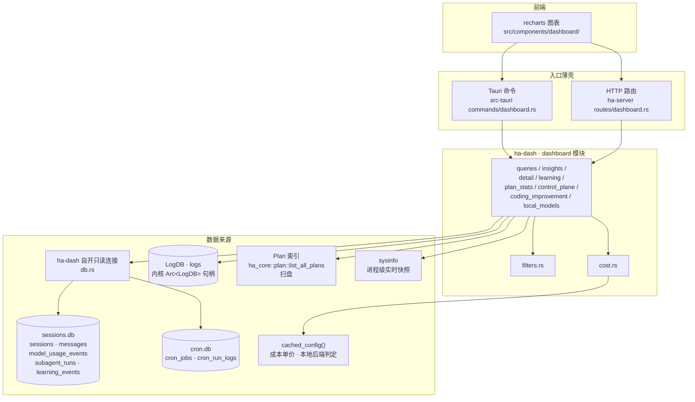
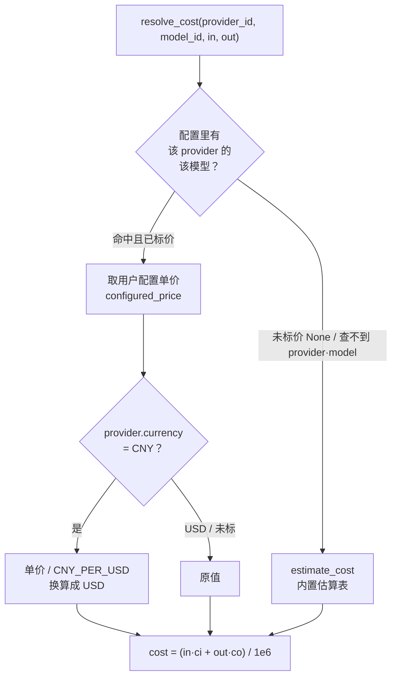
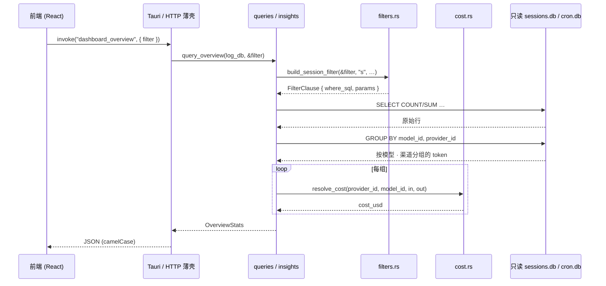

# Dashboard 数据大盘架构
> 返回 [文档索引](../../README.md) | 更新时间：2026-07-23

## 核心思想

Hope Agent 运行时把大量操作痕迹散落在几处存储里：会话与消息、模型用量总账、日志、定时任务运行记录、磁盘上的 Plan 文件。Dashboard 的职责，是把这些原始痕迹聚合成标准化的 JSON，喂给前端的 recharts 图表，让用户一眼看清「用了多少 token、花了多少钱、哪个模型跑得慢、错误集中在哪、自动化任务是否健康」。

它由几个互相独立的设计决定支撑：

- **纯只读报表视图**。大盘只做 `SELECT`，一条写都没有。它甚至不复用内核的读写连接，而是自开一批 `SQLITE_OPEN_READ_ONLY` 连接——连接句柄在类型系统之外物理上就写不了，把「大盘只读」这条约束落到实处。既然只读，看到的自然是数据库最近一次提交的快照，这对报表来说是正确语义，不是缺陷。
- **两种聚合风格并存**。通用分析（用量 / 会话 / 错误 / 工具 / 系统）走「一个统一筛选器 + 一组查询函数」的管道；目标与执行控制面（Goal / Workflow / Loop / Task / Plan）走另一套独立的只读聚合，指标按「结果 → 驱动 → 风险」组织，刻意不拼凑因果漏斗。
- **用量真相分两层**。token 与成本总账取自 `model_usage_events` 总账表，覆盖 chat / side_query / summarize / embedding / STT / judge / web_search / 生图 / provider_test 等**所有非无痕**模型请求（含 cron / subagent / 后台维护）；而会话级的图表（趋势、按 Agent 分组、热力图）则自动剔除定时任务、子 Agent 与无痕会话，只反映用户的主对话。
- **成本以用户配置为真相**。用户在设置里给某模型改了单价，大盘就按那个价算；查不到配置才回退到内置估算表。

## 模块地图

大盘代码住在特征 crate **ha-dash** 的 `dashboard/` 子模块下（同 crate 的 `recap/` 是深度复盘报告，见 [recap](recap.md)）。

| 文件 | 职责 |
|------|------|
| `dashboard/mod.rs` | 模块入口，re-export 公开 API |
| `dashboard/types.rs` | 大盘全部返回结构（Filter + Stats + 明细项 + SystemMetrics） |
| `dashboard/filters.rs` | 三套 WHERE 子句构建器（session / model_usage / log）+ 参数绑定辅助 |
| `dashboard/queries.rs` | 7 个通用聚合查询（overview / token / tool / session / error / task / system） |
| `dashboard/detail_queries.rs` | 5 个明细列表查询（session / message / tool_call / error / agent） |
| `dashboard/insights.rs` | 8 个深度洞察查询（同环比 / 成本趋势 / 热力图 / 时段分布 / Top 会话 / 模型性价比 / 健康度 / orchestrator） |
| `dashboard/cost.rs` | 成本结算：用户配置单价优先 + 内置估算表兜底 |
| `dashboard/learning.rs` | Learning Tracker 4 个只读聚合（消费侧；发布侧在内核 `learning_events`） |
| `dashboard/coding_improvement.rs` | Coding Improvement 全局 / 项目级学习聚合（只读 control-plane 表） |
| `dashboard/control_plane.rs` | Goal / Workflow / Loop / Task / Plan 统一推进指标与 attention 聚合 |
| `dashboard/plan_stats.rs` | Plan 统计聚合（状态分布 / 完成率 / 创建趋势 / 执行时长） |
| `dashboard/local_models.rs` | 本地模型 Tab：按已知本地后端反查 provider 名后对会话做 token / 调用 / TTFT / 错误率统计 |
| `db.rs`（crate 根） | 大盘专属的**只读** sessions.db + cron.db 连接对与测试注入口 |

入口薄壳：桌面 `src-tauri/src/commands/dashboard.rs`（Tauri 命令），HTTP `crates/ha-server/src/routes/dashboard.rs`（挂在 `/api/dashboard/*`）。前端图表组件在 `src/components/dashboard/`。

## 数据来源与连接模型

大盘的五个数据来源，接入方式并不统一——这是个容易踩的点：



要点：

- **sessions.db 与 cron.db 由 ha-dash 自己以只读方式打开**（`db.rs`）。连接是进程级全局、指向真实库路径、带 5 秒 `busy_timeout`；库是 WAL，读者不被写者阻塞，看到最近一次提交的快照。
- **LogDB 不走这条只读连接**，而是内核持有的 `Arc<LogDB>` 句柄，经命令 / 路由层的应用状态透传进来（`state.log_db`），查询时 `log_db.lock_conn()`。这条不对称是历史留存：日志库的读只在 error / 健康度两处用到。
- **Plan 指标不查 SQL**，而是调 `ha_core::plan::list_all_plans` 扫磁盘上的 plan 文件索引（`plan_stats.rs` 与 `control_plane.rs` 都用它）。
- **系统指标来自 sysinfo**，采集当前进程的 CPU / 内存 / 磁盘 IO，不碰任何数据库。
- **成本结算读 `cached_config()`**，本地模型判定同样读它——这也是为什么 `cost.rs` 依赖内核配置缓存。

> 一处 dev-only 分歧：`dev_clear_sessions` 只 unlink `sessions.db`、不重建。此后**首次**打开大盘，ha-dash 的只读连接会拿到 `SQLITE_CANTOPEN`、面板报错直到重启（内核那条老连接会继续写已 unlink 的 inode 并返回陈旧数据）。报错比返回陈旧数据更诚实，故不特殊处理。

## 两种排除策略

「哪些数据算进大盘」由两套不同的过滤规则决定，对应两类图表：

| 图表类别 | 过滤器 | 自动排除 |
|---|---|---|
| **会话级**（趋势 / 按 Agent / 热力图 / 明细列表 / 工具统计） | `build_session_filter` | `is_cron = 0` **且** `parent_session_id IS NULL` **且** `incognito = 0`——剔除定时任务、子 Agent、无痕会话，只留用户主对话 |
| **用量总账级**（token / 成本 / 模型性价比） | `build_model_usage_filter` | **只**排无痕。cron / subagent / 后台维护的模型请求照记——因为用量总账要反映真实开销与账单。无痕会话在写入 `model_usage_events` 时就 fail-closed 跳过，读侧无需再排 |

这个区分是刻意的：用户想知道「我这周聊了多少」时不该被后台自动化污染；但想知道「我这个月一共烧了多少钱」时，后台跑的每一个 token 都得算进去。

## 筛选器系统

### DashboardFilter

所有通用查询共用一个入参结构（`#[serde(rename_all = "camelCase")]`），7 个可选维度：

| 字段 | 说明 |
|------|------|
| `start_date` / `end_date` | 时间范围（RFC3339 / ISO 8601） |
| `agent_id` | 按 Agent 筛选 |
| `provider_id` | 按 Provider 筛选 |
| `model_id` | 按模型筛选 |
| `usage_kind` | 按模型调用类型筛选（映射到 `model_usage_events.kind`：`chat` / `side_query` / `summarize` / `embedding` / `stt` / `judge` / `web_search` / `image_generation` / `provider_test` …） |
| `operation` | 按 `model_usage_events.operation`（purpose 标签，见 [`automation-model`](../core/automation-model.md) §2.5）精确匹配。**无下拉框**，只能点击「Token 用量趋势」里 operation 明细表的行下钻写入，与 `model_id` 的下钻方式一致 |

所有字段均为空字符串安全——空串等价于 `None`，不生成 WHERE 子句。

### 三套子句构建器

| 构建器 | 用于 | 维度 | 备注 |
|---|---|---|---|
| `build_session_filter(filter, session_alias, message_alias)` | session / message 关联查询 | 强制注入三条会话排除条件 + 时间 / agent / provider / model | 有 `message_alias` 时还排除 `messages.is_side_snapshot = 1`，时间落在 `{m}.timestamp`；否则时间落 `{s}.created_at` |
| `build_model_usage_filter(filter, usage_alias)` | `model_usage_events` 总账 | 时间 / agent / provider / model / kind / operation | 不注入 cron / subagent 排除 |
| `build_log_filter(filter)` | LogDB `logs` 表 | 仅时间 + agent（日志表无 provider / model 字段） | |

`params_ref` 把 `Vec<Box<dyn ToSql>>` 转成 rusqlite 需要的 `Vec<&dyn ToSql>`。

侧聊创建时复制的历史消息只承担上下文作用，写入 `is_side_snapshot = 1`，不代表新的用户操作或模型调用；所有消息型聚合、明细、热力图和本地模型统计统一排除这些行。侧聊创建后新写入的消息保持默认值 `0`，照常进入 Dashboard；模型 Token 总账不复制，仍以 `model_usage_events` 为准。

## 通用聚合查询（queries.rs，7 个）

每个函数只取 `filter`（外加需要日志的两个取 `log_db`），内部自己打开只读连接。

### 1. Overview 概览 — `query_overview(log_db, filter)`

数据来源 **sessions.db + cron.db**。虽然入参带 `LogDB` 句柄（与命令层签名对称），当前实现并不查日志——`total_errors` 取自 `messages.is_error = 1` 的消息数。

| 字段 | 说明 |
|------|------|
| `total_sessions` / `total_messages` | 会话数 / 消息数 |
| `total_input_tokens` / `total_output_tokens` | 输入 / 输出 token（取自 `model_usage_events`） |
| `total_tool_calls` | 工具调用消息数 |
| `total_errors` | 错误消息数（`messages.is_error`） |
| `active_agents` | 活跃 Agent 数（`DISTINCT agent_id`） |
| `active_cron_jobs` | `cron_jobs.status = 'active'` 计数 |
| `estimated_cost_usd` | 估算总成本 |
| `avg_ttft_ms` | 平均首 Token 响应时间 |

**成本按模型分组算再汇总**：`GROUP BY u.model_id, u.provider_id` 后逐组 `resolve_cost` 求和，而非用总 token 一次估算——多模型 / 多渠道混用时单价才准。

### 2. Token 用量趋势 — `query_token_usage(filter)`

返回 `DashboardTokenData`，五个切面全部来自 `model_usage_events`：

- `trend`：按天聚合 `input_tokens` / `output_tokens` / `avg_ttft_ms`。
- `by_model`：按 `(model_id, provider_name, provider_id)` 分组、按总 token 降序。含 `provider_id`——同一模型可经多个 Provider 使用、单价不同，前端须用 `(provider_id, model_id)` 作行标识。
- `by_kind`：按 `kind` 分组。除 token 外还拆出 `cache_creation_input_tokens` / `cache_read_input_tokens` 以及 `context_input_tokens` / `fresh_input_tokens`（缺列时回退到 `input_tokens`），带 `call_count` / `avg_duration_ms` / `avg_ttft_ms`。
- `by_operation`：按 `operation`（purpose 标签）分组，字段与 `by_kind` 类似（token / cache / cost / duration / ttft），再加 `operation` / `domain` 两列，用作二级下钻表。`operation` 列原样等宽展示、不翻译（同 `ErrorByCategory.category`、`ToolUsageStats` 明细行的惯例——代码内定义、还在增长的技术标签不值得背多语言翻译债）。
- `by_domain`：对 `by_operation` 结果在内存里按 `domain` 再 rollup 一次（**不发第二次 SQL**），用作一级主图表。`domain` 由纯函数 `operation_domain(operation)` 按第一个 `.` 切分派生（`recap.facets` → `recap`，无点的 `session_title` → 自身）——不是查表，新增 purpose 标签零代码改动就能正确分桶；前端翻译走 `dashboard.operationDomain.${domain}` 优先 + 人性化 fallback，零阻塞上线。

`operation` 标签数以数十计、`domain` 是更小的粗粒度集合。二者的 token 总和恒等于 `by_kind` 总和（有单测锚定）。

### 3. 工具使用统计 — `query_tool_usage(filter)`

按 `tool_name` 分组、按 `call_count` 降序，字段 `tool_name` / `call_count` / `error_count` / `avg_duration_ms` / `total_duration_ms`；额外条件 `tool_name IS NOT NULL AND tool_name != ''`。

### 4. 会话趋势 — `query_sessions(filter)`

`DashboardSessionData`：`trend`（按天 `session_count` = `DISTINCT s.id` + `message_count`）+ `by_agent`（按 Agent 分组，含 `total_tokens`，按会话数降序）。

### 5. 错误趋势 — `query_errors(log_db, filter)`

数据来源 **LogDB**（不是 sessions.db）。`DashboardErrorData`：`trend`（按天 error / warn 数）+ `by_category`（仅 `level = 'error'`，按 category 降序）+ `total_errors` / `total_warnings`（`level IN ('error','warn')`）。

### 6. 自动化 — `query_tasks(filter)`

数据来源 **subagent_runs（sessions.db）+ cron_jobs / cron_run_logs（cron.db）**。

> 前端一级 Tab 已更名为「自动化」，但命令名 `dashboard_tasks` / `POST /api/dashboard/tasks` 保留以兼容 Transport 与历史调用方。该接口从不读 `tasks` 表。

`CronJobStats`：`total_jobs` / `active_jobs` / `total_runs` / `success_runs` / `failed_runs` / `avg_duration_ms`。运行口径有讲究——`total_runs` 只数**终态**（排除进行中的 `running`）；`success_runs` = `status = 'success'`；`failed_runs` = 非成功终态的补集（`NOT IN ('success','running','empty','cancelled')`），因此 `timeout`、基础设施类 `no_session` 乃至未来新增的失败标签都会计入，而不是靠一份易漏的 `IN ('error','timeout')` 白名单；`empty` / `cancelled` 既非成功也非失败，不进任何分母。

`SubagentStats`：`total_runs` / `completed` / `failed` / `killed` / `total_input_tokens` / `total_output_tokens` / `avg_duration_ms`。

### 7. 系统指标 — `query_system_metrics()`

来自 sysinfo，非数据库查询。**两次 `refresh_processes_specifics` 间隔 200ms** 以取得准确的 CPU 使用率增量。返回进程 CPU（多核可超 100%）、CPU 核数、内存（RSS / 虚拟 / 系统总量 / RSS 占比）、磁盘读写总量、进程与系统运行时长、PID / OS 名 / 主机名。

## 详情查询（detail_queries.rs，5 个）

面向可下钻的明细列表，均支持完整 `DashboardFilter`：

| 函数 | 返回类型 | 来源 | 排序 | 上限 |
|------|----------|------|------|------|
| `query_session_list(filter)` | `Vec<DashboardSessionItem>` | sessions.db | `updated_at DESC` | 100 |
| `query_message_list(filter)` | `Vec<DashboardMessageItem>` | sessions.db | `timestamp DESC` | 100 |
| `query_tool_call_list(filter)` | `Vec<DashboardToolCallItem>` | sessions.db | `timestamp DESC` | 100 |
| `query_error_list(log_db, filter)` | `Vec<DashboardErrorItem>` | LogDB | `timestamp DESC` | 100 |
| `query_agent_list(filter)` | `Vec<DashboardAgentItem>` | sessions.db | `sess_count DESC` | 无 |

`query_message_list` 用 `SUBSTR(m.content, 1, 200)` 只取前 200 字预览；`query_error_list` 仅返回 `level IN ('error','warn')`。

## Insights 深度洞察（insights.rs，8 个）

在 `queries.rs` 之上做更复杂的同环比 / 趋势 / 健康度聚合，对应 Insights Tab 的高阶图表，同样消费 `DashboardFilter` 并复用 `build_*_filter`。

| 函数 | 返回类型 | 说明 |
|------|----------|------|
| `query_overview_with_delta(log_db, filter)` | `OverviewStatsWithDelta` | 当前窗口 + 等长的上一窗口（把时间范围整体前移一个跨度）做对比 |
| `query_cost_trend(filter)` | `DashboardCostTrend` | 按天成本曲线 + 累计 + 峰值日 + 日均 |
| `query_activity_heatmap(filter)` | `DashboardHeatmap` | 7×24 网格活跃度（`strftime('%w')` 0=周日 × 0–23 时） |
| `query_hourly_distribution(filter)` | `DashboardHourlyDistribution` | 24 小时消息 / 会话分布 + 峰值时段（缺失小时补 0） |
| `query_top_sessions(filter, limit)` | `Vec<TopSession>` | 按总 token 降序的 Top N 会话（limit 钳在 1..=1000） |
| `query_model_efficiency(filter)` | `Vec<ModelEfficiency>` | 每模型 tokens/msg、cost/1k、avg_ttft，横向比性价比 |
| `query_health_score(log_db, filter)` | `HealthBreakdown` | 四维加权健康度（下详），输出 0–100 总分 + 状态徽章 |
| `query_insights(log_db, filter)` | `DashboardInsights` | Orchestrator：一次调用顺序聚合下面 6 项，供前端单 invoke 拉齐 |

`query_insights` 聚合的是 `health` / `cost_trend` / `heatmap` / `hourly` / `top_sessions`(N=10) / `model_efficiency` 六项——**不含** `overview_with_delta`（后者是独立命令 `dashboard_overview_delta`）。这 7 个洞察查询（含 `overview_with_delta`）也被 [Recap](recap.md) 复用为 `QuantitativeStats` 的数据源。

### 健康度的四个维度

`HealthBreakdown` 的总分是四个维度各占 25 分之和，每维都是「越健康得分越高」：

| 维度 | 计算 | 数据来源 |
|---|---|---|
| 日志错误率 | `errors / (errors+warn+info)`，越低越好 | LogDB |
| 工具错误率 | 工具调用的错误占比，越低越好 | 复用 `query_tool_usage` |
| Cron 成功率 | `success / (success+failed)`，只算已决终态（同上 `query_tasks` 口径），无样本记 100% | cron.db |
| 子 Agent 成功率 | `completed / total`，无样本记 100% | subagent_runs |

状态徽章按总分映射：`90–100` excellent、`75–89` good、`50–74` warning、`< 50` critical。

## 成本估算引擎（cost.rs）

结算入口 `resolve_cost(provider_id, model_id, input_tokens, output_tokens) -> f64`（USD），两级链：



- **用户配置优先**：按 `(provider_id, model_id)` 回查 Provider 配置单价——这是「用户实际付多少」的真相源。模板与 GUI 都存厂商价目页原价，Provider 声明 `currency = CNY` 时**只在这一处**按 `CNY_PER_USD` 换算成 USD 入账。
- **`Some(0.0)` 与 `None` 语义不同**：`Some(0.0)` 是「明确不按 token 计费」（本地模型、包月端点），如实记 $0、**不回退**；`None`（未标价）与查不到 provider/model 一样落到估算表。只标了一侧价（另一侧 `None`）仍视为已标价，缺的一侧按 0 计。
- **内置估算表兜底**：`estimate_cost` 按 `model_id.contains()` 子串匹配，**首次命中即返回**。因此更具体的臂必须排在通用族之前（`claude-opus-4-5`+ 是 $5/$25，须先于 `claude-opus-4` 的 $15/$75；`grok-4.5` 须先于 `grok-4`；`kimi-k2.7-code-highspeed` 须先于 `kimi-k2.7`；`gemini-*-flash-lite` 须先于同代 `-flash`；`qwen3.8-max` 须先于末尾的通用 `qwen` 臂）。人民币计价厂商（qwen、豆包方舟、腾讯混元 `hy3`）的臂统一写成 `¥价 / CNY_PER_USD`，与配置路径口径一致。未命中任何臂时默认 `$3 / $15`。
- **`contains` 区分大小写**：托管方常用 HuggingFace 式 id（`hf:zai-org/GLM-5.2`、`hf:Qwen/Qwen3.6-27B`），只写小写臂会让它们整片掉进默认价（实测约 40 倍高估）。新增臂时若该模型可能以大写形式出现，须同时给出大小写两种拼写——单测 `current_generation_models_are_not_billed_at_the_default` 已按真实模板 id 钉住这一点。
- **臂不得越界吞掉模板刻意留 `null` 的档位**：模板写 `null` 表示「厂商单价未知、走兜底」，若把通用臂放宽到覆盖它（如 `muse-spark` 覆盖 1.1、`ernie-5.0` 覆盖 `-thinking-preview`），等于把「不知道」变成一个确定的错数字。

### 估算表节选（示例，非全表）

> 定价随厂商调价与新模型上线持续变动，下表仅示意匹配机制与量级。**权威定价以 [`cost.rs`](../../../crates/ha-dash/src/dashboard/cost.rs) 的内联表及其单测为准**（单测 `estimator_matches_direct_provider_template_prices` / `specific_arms_win_over_their_generic_family` 会锁住关键条目）。

| 厂商 | 匹配子串（示例） | Input $/1M | Output $/1M |
|------|------|-------------|---------------|
| Anthropic | `claude-fable-5` / `claude-mythos-5` | 10.00 | 50.00 |
| | `claude-opus-5` | 5.00 | 25.00 |
| | `claude-sonnet-5` | 3.00 | 15.00 |
| | `claude-opus-4-5`…`4-8` | 5.00 | 25.00 |
| | `claude-opus-4`（4 / 4.1） | 15.00 | 75.00 |
| | `claude-haiku-4` | 1.00 | 5.00 |
| OpenAI | `gpt-5.6-terra` | 2.00 | 12.00 |
| | `gpt-5.6-luna` | 0.20 | 1.20 |
| | `gpt-5.6`（= Sol） | 5.00 | 30.00 |
| | `gpt-5.4` | 2.50 | 15.00 |
| | `gpt-4o` | 2.50 | 10.00 |
| | `o3` | 2.00 | 8.00 |
| Google | `gemini-3.5-pro` | 1.25 | 10.00 |
| | `gemini-3.7-flash` / `3.6-flash`（促销价） | 0.75 | 3.75 |
| | `gemini-3.5-flash` | 0.15 | 0.60 |
| xAI | `grok-4.6` / `grok-4.5` | 2.00 | 6.00 |
| | `grok-4` | 3.00 | 15.00 |
| DeepSeek（按高峰价保守估算） | `deepseek-v4-flash` / `-vision-exp` / `deepseek-chat` / `-reasoner` | 0.44 | 1.32 |
| | `deepseek-v4-pro` | 1.32 | 3.96 |
| Qwen（CNY 换算） | `qwen3.8-max` | ¥12 / CNY_PER_USD | ¥36 / CNY_PER_USD |
| | `qwen-max` / `qwen3-max` | ¥2.4 / CNY_PER_USD | ¥9.6 / CNY_PER_USD |
| 豆包方舟（CNY 换算） | `doubao-seed-2-1-pro` / `-evolving` | ¥6 / CNY_PER_USD | ¥30 / CNY_PER_USD |
| Zhipu (GLM) | `glm-5.3` / `glm-5.2` / `glm-5-2` | 1.40 | 4.40 |
| | `glm-5` | 1.00 | 3.20 |
| | `GLM-5.2` / `GLM-4.7-Flash`（HF 大小写） | 同上 | 同上 |
| Moonshot | `kimi-k2.6` / `kimi-k2-6` | 0.95 | 4.00 |
| （默认） | 未匹配 | 3.00 | 15.00 |

## Learning Tracker

Learning Tracker 把 skill / memory / MCP 三类关键事件写入 `sessions.db` 的 `learning_events` 表，再做时间窗口聚合，对应 Dashboard 的「Learning」标签页。

**发布与消费分层**：`emit` 与 9 个事件常量定义在内核 [`learning_events.rs`](../../../crates/ha-core/src/learning_events.rs)——生产者遍布内核 / skills / knowledge / ha-mcp 四层，发布面若留在 dashboard 会让它们全部反向依赖 ha-dash。`dashboard/learning.rs` 只做只读聚合，并把 `emit` / `EVT_*` 按原路径再导出，老调用点不受影响。DDL / INSERT / prune / 会话级联删除都在 `SessionDB`。详见 [backend-separation](../system/backend-separation.md)。

### 事件常量（9 个）

| 类别 | 常量 | 触发点 |
|------|------|----------|
| Skill 生命周期 | `EVT_SKILL_CREATED` / `_PATCHED` / `_ACTIVATED` / `_DISCARDED` / `_USED` | `skills::author` CRUD + 激活 / 丢弃，见 [skill-system](../agent/skill-system.md) |
| 记忆召回 | `EVT_RECALL_HIT` / `EVT_RECALL_SUMMARY_USED` | 召回命中 + 召回摘要进入动态 user-data，见 [memory](../core/memory.md) |
| MCP 工具 | `EVT_MCP_TOOL_CALLED` / `EVT_MCP_TOOL_FAILED` | 每次 MCP 工具成功 / 失败，meta 含 `{ server, tool, durationMs, error? }` |

### 查询函数（learning.rs，4 个）

| 函数 | 返回 | 说明 |
|------|------|------|
| `query_learning_overview(window_days)` | `LearningOverview` | 窗口内各类事件计数汇总。skill 创建按 meta 里的 `source` 拆成 `auto_created_skills`（`auto-review`）vs `user_created_skills`；`profile_memories` 例外——直接查记忆后端的 memories 表（不是每次抽取都发事件） |
| `query_skill_timeline(window_days)` | `Vec<TimelinePoint>` | skill 生命周期事件按 `ts` 升序，便于画曲线 |
| `query_top_skills(window_days, limit)` | `Vec<SkillUsage>` | 按 `EVT_SKILL_USED` 计数的 Top N |
| `query_recall_stats(window_days)` | `RecallStats` | 召回命中 vs 召回摘要使用次数 |

窗口按 `ts >= now - window_days` 裁剪（`window_days` 常用 7 / 14 / 30 / 60 / 90）。

`learning_events` 表 schema：`(id, ts, kind, session_id, ref_id, meta_json)`，归属 `sessions.db`（不另起 SQLite 文件，与 sessions / messages 共享连接池），按 `ts` 与 `(kind, ts)` 建索引。

## Coding Improvement Learning（coding_improvement.rs）

Dashboard「Learning」页的全局 / 项目级 coding 学习视图。Tauri `dashboard_coding_improvement` / HTTP `POST /api/dashboard/learning/coding-improvement`。它**只读**已有的 durable control-plane 表，不触发 proposal 生成、apply 或 promotion。

| 区块 | 来源表 | 说明 |
|---|---|---|
| `overview` | `sessions` / `workflow_runs` / `coding_eval_runs` / `coding_eval_pack_runs` / `coding_strategy_effect_runs` / `review_findings` / `verification_steps` / `coding_workflow_retros` / `coding_improvement_proposals` | 汇总 workflow 完成、case eval、pack pass rate、strategy verdict、tool-call 缺失、validation/scope delta、review blocker、verification failure、retro 建议、proposal 状态与蒸馏候选 |
| `timeline` | 同上 | 按日聚合上述各项 |
| `byProject` | `project_id` + 可选 `projects.name` | 按项目展示 workflow/eval/pack 成功率、strategy regression、blocker、proposal 与待沉淀候选 |
| `topFailures` | `coding_improvement_proposals.payload_json` | 从 `eval_candidate` proposal 的 failure taxonomy 聚合 top failure mode |
| `toolCallFailures` | `coding_eval_runs.metrics_json` | 聚合 agent 模式下没产生 tool call 的 task-level eval run，作为 `missing_tool_call` failure mode |
| `proposalStatuses` | `coding_improvement_proposals.status` | proposal 状态分布 |
| `latestStrategyEffects` | `coding_strategy_effect_runs` | 最近 strategy effect run 的 verdict 与各项 delta |
| `latestRetros` | `coding_workflow_retros` | 最近 terminal workflow retro 摘要与建议 |

过滤契约：复用 `DashboardFilter` 的时间 / agent / provider / model 维度；session 级数据排除 cron / subagent / incognito；无 session 归属的 eval / pack / strategy run 可进全局聚合，但一旦按 agent/provider/model 过滤就自然被排除；`projects.name` 只作显示增强，表缺失时仍按 `project_id` 聚合。

## General Domain Quality（通用领域质量）

Dashboard「Learning」页的通用领域质量区块，回答的是「非编程长任务的通用质量是否有足够证据」。前端直接调用一组 owner API（`evaluate_domain_readiness_gate` / `evaluate_domain_quality_gate` / `list_domain_eval_runs` / `list_domain_eval_tasks` / `list_domain_eval_fixture_runs` / `list_domain_eval_campaigns` / `get_domain_eval_campaign_leaderboard` / `generate_coding_improvement_proposals(sourceType="domain_eval_campaign")` / `record_domain_eval_calibration`），后端事实源见 [domain-eval](../agent/domain-eval.md)。

它**不**属于 `coding_improvement` 聚合，也**不**与 Release Gate / Continuous Benchmark Gate 合成总分——只读 Domain Eval / Quality / Evidence 历史。

| 展示项 | 来源 | 说明 |
|---|---|---|
| Readiness status | `evaluate_domain_readiness_gate` | `passed` / `failed` / `insufficient_data`；聚合 Quality Gate、Campaign、Leaderboard 与学习闭环 |
| Gate status | `evaluate_domain_quality_gate` | 三态同上 |
| Eval pass rate / avg score | `domain_eval_runs` | 只统计通用领域 eval，不读 `coding_eval_runs` |
| Quality blockers | `domain_quality_runs` / `domain_quality_checks` | blocked / failed / needs_user run 与 approval safety blocker |
| Domain coverage | `domain_eval_runs.domain` | 已覆盖领域数（内置 Research / Writing / Data Analysis / Meeting Prep / Knowledge Curation） |
| Attention checks | gate checks | 列出 failed / insufficient check，指明缺的是样本、quality run、approval safety 还是领域覆盖 |
| Recent domain eval runs | `list_domain_eval_runs` | 最近通用 eval run |
| Calibration status | `list_domain_eval_tasks` / `record_domain_eval_calibration` | 已校准 task 数；用户可对最近 run 标记人工复核 |
| Domain smoke runs | `list_domain_eval_fixture_runs` | 最近 trace/agent fixture smoke run（含 source type、执行模式、pass rate、badge 与错误信息）；不计入 live gate |
| Domain campaigns | `list/create/run/cancel_domain_eval_campaign` + leaderboard + `generate_coding_improvement_proposals` | 批量 domain eval campaign：跑 deterministic trace pack 或选 provider/model 跑 external agent campaign，取消 / retry，看 item pass rate 与模型 leaderboard，从失败 item 生成学习草稿 |

红线：

- 通用领域质量门与 coding benchmark **分表、分路径、分 UI 区块**。
- 无 domain eval / quality 历史时必须显示 `insufficient_data`，**不能用 coding release gate 替代**。
- Dashboard 默认只读、不触发连接器动作。写动作仅限用户显式点击：标记人工复核、创建 / 运行 / 取消 / retry 合成 trace campaign、从失败 item 生成 draft-only 学习 proposal。`evaluate_domain_readiness_gate` 本身只读，不自动生成 proposal 或 retry campaign。合成样本经 `SessionKind::EvalFixture` + `sourceType=fixture_*` + 独立表隔离展示，不污染真实质量判断。

## 目标与执行（control_plane.rs）

Tauri `dashboard_control_plane` / HTTP `POST /api/dashboard/control-plane` 接受独立的 `ControlPlaneDashboardFilter { startDate, endDate, agentId, projectId }`，一次返回 `summary / goals / workflows / loops / tasks / plans / attention`。Provider / Model / Usage Kind 不属于该控制面；项目筛选只影响本页，`__unassigned__`（`CONTROL_PLANE_UNASSIGNED_PROJECT`）是「未分配」的 Transport wire value。

指标按「**结果 → 驱动 → 风险**」组织，刻意不构造伪漏斗：

- **Goal 达成率**：`accepted_v1 / (accepted_v1 + cancelled + superseded + failed)`；`needs_strict_evidence`、active、paused、blocked 不进分母，按 `COALESCE(closed_at, completed_at)` 落窗。
- **Workflow 完成率**：`completed / (completed + failed + blocked)`；cancelled 排除，按 `completed_at` 落窗。
- **Loop 强推进率**：`progressed / (progressed + weak_progress + no_progress + blocked + failed)`；weak progress 不算强推进，awaiting approval / 旧空分类排除。
- **Goal required criteria** 只读当前 revision，且 `goalLinkedEventSeq` 未落后于最新 `goal_linked` event 的 final audit；过期 audit 不统计。
- **Task / Plan** 用 created-cohort 完成率，另单列不受时间窗限制的 current backlog / activeNow。二者没有可靠的 Goal / Workflow / Loop 外键，**禁止按 session 猜测因果归因**。
- 所有比例零分母返回 `null`；所有耗时用 **P50**。`tasks.completed_at` 与 `sessions.plan_completed_at` 只从本版本开始积累，返回 `sampleCount / eligibleCount` 供 UI 明示精确覆盖率，旧数据不从 `updated_at` 伪造。
- **attention**：`total` 是当前全集去重数量，`items` 按更新时间倒序、severity 破同时间并截断 20，涵盖 Goal blocked / 待关闭、Workflow awaiting approval / user / blocked、Loop blocked / 连续无进展、Plan review。所有数据排除 incognito；Goal / Workflow / Loop / Task / attention 还统一排除 Cron 与 `parent_session_id` 子会话，避免后台自动化膨胀用户主指标。无法确认所属 session 的 orphan Plan 只留在 Plan 历史页，不进大盘。

前端一级 Tab 位于「综合概览」之后，内部为「概览 / Goal / Workflow / Loop / Plan 与 Task」。attention 深链先切回所属 session，再打开 Workspace 对应 section；Workflow / Loop 同时定位具体 run / schedule，Plan review 打开 Plan 面板。

## Plan 统计（plan_stats.rs）

Dashboard「Plans」的数据源。Tauri `dashboard_plan_stats` / HTTP `POST /api/dashboard/plan-stats`。前端已不再把它作为独立一级 Tab，Plan 指标并入「目标与执行 → Plan 与 Task」；旧命令与路由继续兼容，独立 Plans 历史页仍负责正文、版本、`@plan` 引用与跳回会话。

数据来自 `ha_core::plan::list_all_plans` 的单次扫盘，纯内存聚合（Plan 总数实践中远低于 10⁴，故不建事件表；未来超量再考虑）。

| 维度 | 口径 |
|---|---|
| `total` | 所有磁盘上有 plan 文件的 session（含已 `/plan exit` 归档） |
| `stateDistribution` | 5 桶：`off`（有文件但 state=off，即归档）/ `planning` / `review` / `executing` / `completed` |
| `completionRate` | `completed / total`，仅看 state、不看 task 完成度 |
| `byAgent[]` | 按 `agent_id` 分组、Top 10、按总数降序，附 `completed` 子计数 |
| `byProject[]` | 按 `project_id`（含「无项目」桶 `None`）、Top 10 |
| `creationTrend[]` | 按 `created_at` 日聚合、最近 30 天、缺失日填 0 |
| `avgExecutionDurationSecs` | 仅对 `state = completed` 且有 `executing_started_at` 的样本算 `session_updated_at − executing_started_at` 均值；剔除 ≥ 7 天的 outlier（`MAX_EXECUTION_DURATION_SECS`） |
| `sampledDurationCount` | 上一指标的样本数，让 UI 能标「n=12」避免误读为稳定均值 |

> 执行时长刻意用 `session_updated_at` 而非 plan 文件 mtime：模型一批准计划就不再碰文件，文件 mtime 会低估甚至早于真实完成时间。

## 本地模型（local_models.rs）

Dashboard 本地模型 Tab。Tauri `dashboard_local_model_usage` / HTTP `POST /api/dashboard/local-model-usage`。

「某 provider 算不算本地」的唯一判据是 `provider::local::known_local_backends`——按 `(api_type, base_url)` 匹配 Ollama / LiteLLM / vLLM / LM Studio / SGLang，前端不用硬编码本地主机名端口。反查出本地 provider 的显示名后，对 sessions / messages 按 `provider_name IN (…)` 统计 token / 调用次数 / TTFT / 错误率（`LocalModelUsageRow` 比 `TokenByModel` 多一列 `error_count` 供 UI 标红不健康模型）。若用户尚未配置任何本地 provider，返回空 `local_provider_names` + 全 0，前端渲染引导态而非空图表。

## 查询流程



## 图表数据格式

前端收到的 JSON 一律 camelCase（`#[serde(rename_all = "camelCase")]`）。

趋势图（折线 / 面积）：

```json
{
  "trend": [
    { "date": "2026-04-01", "inputTokens": 150000, "outputTokens": 45000, "avgTtftMs": 320.5 },
    { "date": "2026-04-02", "inputTokens": 180000, "outputTokens": 52000, "avgTtftMs": 295.1 }
  ]
}
```

分组数据（柱 / 饼）：

```json
{
  "byModel": [
    { "modelId": "claude-sonnet-5", "providerName": "anthropic", "providerId": "anthropic-official",
      "inputTokens": 500000, "outputTokens": 150000, "estimatedCostUsd": 3.75, "avgTtftMs": 310.2 }
  ]
}
```

概览卡片：

```json
{
  "totalSessions": 42, "totalMessages": 1280,
  "totalInputTokens": 2500000, "totalOutputTokens": 750000,
  "totalToolCalls": 890, "totalErrors": 12,
  "activeAgents": 3, "activeCronJobs": 5,
  "estimatedCostUsd": 12.35, "avgTtftMs": 305.7
}
```

## 只读连接：为什么与代价

大盘不复用内核的 `SessionDB`，而在 `db.rs` 里自开 `SQLITE_OPEN_READ_ONLY` 连接，有两层理由：

- 内核的 `with_conn_internal` 是 `pub(crate)`、刻意不对特征 crate 暴露（核心库 schema 不做跨 crate 隐式 API）。若把七十多条只读聚合逐一包成内核的类型化方法，等于把几千行大盘 SQL 搬回内核，正好抵消拆分。
- 内核那个 `&Connection` 仍能执行写语句、只读全靠约定；这里的句柄**物理上写不了**，把「大盘只读」落到更硬的一层。sessions.db 是 WAL，读不被写阻塞、看到最近一次提交的快照——大盘本就是最终一致的报表视图。

代价：连接是进程级全局、指向真实库路径，因此所有用 fixture 的大盘测试必须先 `db::lock_dash_db()` 取串行锁，再 `point_at_test_db()` 把全局连接指向临时库，否则会「静默读到空表」——最难查的那种失败。

## 关键源文件

| 文件 | 职责 |
|------|------|
| [`crates/ha-dash/src/lib.rs`](../../../crates/ha-dash/src/lib.rs) | crate 入口与 `wire()`（facet 查询钩子 / `/recap` 分发钩子 / 保留期 startup task） |
| [`crates/ha-dash/src/db.rs`](../../../crates/ha-dash/src/db.rs) | 只读 sessions.db + cron.db 连接对与测试注入口 |
| `crates/ha-dash/src/dashboard/*.rs` | 上文各模块（filters / queries / detail_queries / insights / cost / learning / coding_improvement / control_plane / plan_stats / local_models / types） |
| [`crates/ha-core/src/learning_events.rs`](../../../crates/ha-core/src/learning_events.rs) | Learning 事件**发布面**：9 个常量 + `emit` 写 `sessions.db` 的 `learning_events` |
| `src-tauri/src/commands/dashboard.rs` | Tauri 命令注册层 |
| `crates/ha-server/src/routes/dashboard.rs` | HTTP 路由（`/api/dashboard/*`） |
| `src/components/dashboard/` | 前端 recharts 图表组件 |

命令与端点全表见 [api-reference](../system/api-reference.md)。
