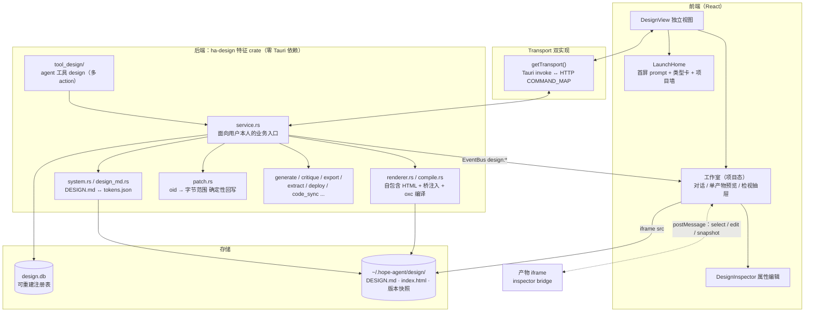
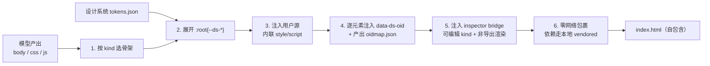
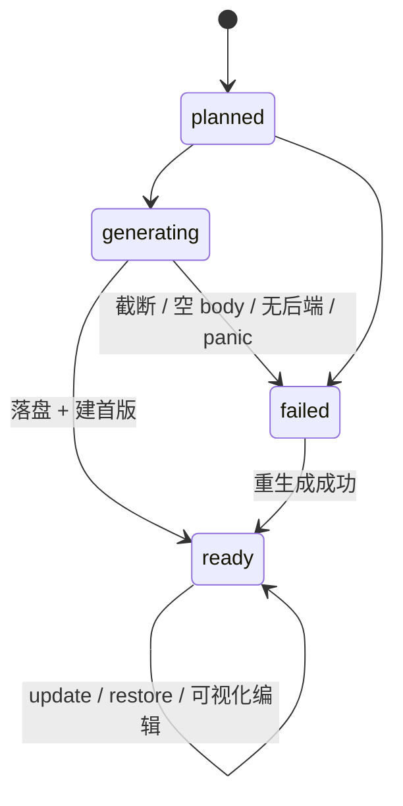
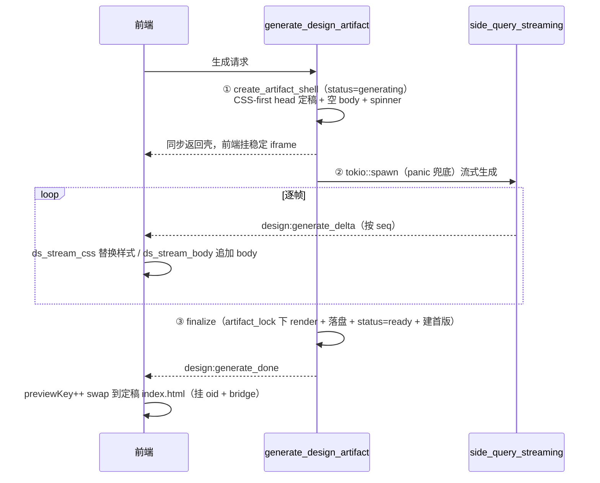
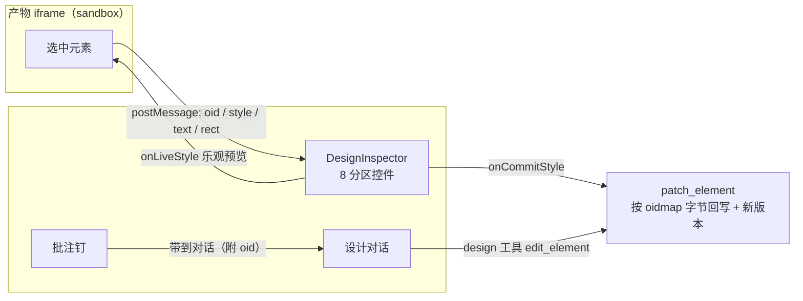
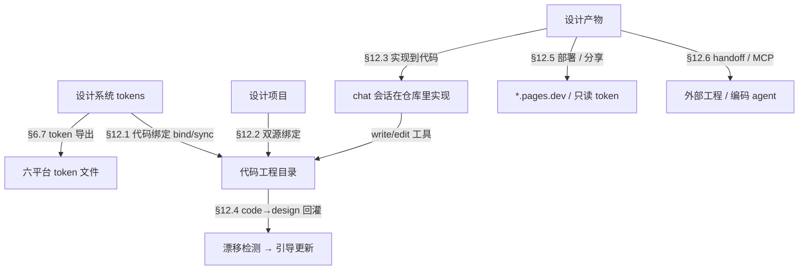
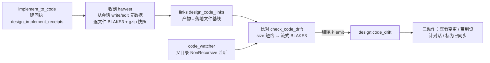

# 设计空间（Design Space）子系统架构文档

> 返回 [文档索引](../../README.md)

设计空间是 Hope Agent 里用户与模型协作的**设计工作台**。从一句话或一张参考图出发，产出**自包含、可交付的设计产物**——网页、移动原型、演示文稿、仪表盘、海报、文档、邮件、图像、动效、音频、交互组件——以一套可复用的**品牌设计系统**为底座，在沙盒面板里实时预览、可视化直接微调、版本管理、一键导出，并可沿**工程轴**把设计系统一路交付到代码。侧边栏入口紧贴「知识空间」下方。

产品名叫**设计空间**，代码里统一用标识 `design`：后端模块 `crates/ha-design/src/design/`、agent 工具 `design`、数据库 `design.db`、前端视图 `DesignView`、i18n 命名空间 `design`。

跨 PR 必守的红线摘要见 [AGENTS.md](../../../AGENTS.md)；子系统边界与数据流以本文与代码为准。

---

## 目录

1. [核心思想](#1-核心思想)
2. [四个能力支柱](#2-四个能力支柱)
3. [系统架构总览](#3-系统架构总览)
4. [核心概念与数据模型](#4-核心概念与数据模型)
5. [渲染管线：自包含 HTML](#5-渲染管线自包含-html)
6. [设计系统层：品牌契约与 Token 编译](#6-设计系统层品牌契约与-token-编译)
7. [可视化直接微调](#7-可视化直接微调)
8. [Agent 工具面（`design` 工具）](#8-agent-工具面design-工具)
9. [前端视图与工作台](#9-前端视图与工作台)
10. [导出与产物库](#10-导出与产物库)
11. [质量评审](#11-质量评审)
12. [工程轴：设计如何走到代码](#12-工程轴设计如何走到代码)
13. [与其他子系统的契约](#13-与其他子系统的契约)
14. [权限 · 安全 · 沙箱 · 无痕](#14-权限--安全--沙箱--无痕)
15. [配置](#15-配置)
16. [HTTP 路由与 Tauri 命令对照](#16-http-路由与-tauri-命令对照)
17. [文件与注册触点](#17-文件与注册触点)

---

## 1. 核心思想

### 1.1 它解决什么问题

模型很会写设计，但「让模型做设计」通常止步于一次性的代码片段：改一处要重发一整段，产物无法沉淀、无法可视化调整、无法交付给工程。设计空间把这件事升级成一个**有状态、可管理、可交付**的工作台——产物有身份、有版本、有设计系统约束，用户既能用自然语言让模型改，也能选中元素直接拖控件微调，还能一键导出或推给代码工程。

### 1.2 关键想法：产物即一份自包含 HTML

整个子系统建立在一个决定性选择上：**每个产物就是一份自包含的 HTML 文件**（CSS/JS 内联，依赖走本地 vendored 资产，默认零网络）。模型直接生成这份 HTML，前端 iframe 直接加载，启动即渲染。Rust 端只做「包裹骨架 + 注入设计系统 token + 注入编辑桥」，**绝不在浏览器里编译 React/JSX/Tailwind**。

这一个选择连带解决了三个老大难：

- **不白屏、启动快**——没有浏览器内打包器（`esbuild-wasm`）冷启动，没有运行时编译，没有白屏看门狗。
- **微调可靠**——产物是纯 HTML，渲染出来的 DOM 结构 ≈ 源码结构，于是「选中元素 → 改属性 → 回写源码」是一次**确定性的字节范围替换**，而不是从 DOM 反查一层 React、一层 Tailwind 的有损映射。
- **天然可交付**——自包含 HTML 可以直接导出、分享、diff、部署（一整站就是一个 `index.html`）。

### 1.3 三条工作台原则

| 原则 | 落地 |
| --- | --- |
| **浏览器零编译** | 产物是模型直出的自包含 HTML；iframe 直载。交互组件（React）的编译搬到**后端**（oxc 纯 Rust 进程内编译），iframe 只加载编译后的静态产物。 |
| **产物为中心、拒绝无限画布** | 主编辑面是**单产物聚焦预览**（一个稳定 iframe + 纯 CSS 缩放），多产物概览是**纯 CSS grid 缩略图墙**。没有自研的画布 transform / 平移 / 指针捕获逻辑，从架构上根除卡顿与指针泄漏类 bug。 |
| **文件即真相源** | 产物（`index.html` + 版本快照）与设计系统（`DESIGN.md` + `tokens.json`）都是磁盘上的真实文件；`design.db` 是**可从磁盘全量重建**的元数据注册表 / 索引。与[知识空间](../core/knowledge-base.md)、[项目](../core/project.md)的存储契约同源。 |

### 1.4 与 Canvas 的分工

[Canvas](canvas.md) 是对话内随手出图的轻量沙盒（易逝、允许 CDN 脚本），设计空间是可管理、可交付、可微调的成体系工作空间。二者独立共存：设计空间不复用 canvas 的表、工具或面板，只借鉴其已验证的**沙盒静态托管三闸**与 Tauri/HTTP 资源分流思路。

### 1.5 内置设计系统的两类来源与免责声明

内置设计系统分两类，都随 App 发行：

- **6 套原创原型语言**（极简现代 / 编辑杂志 / 科技暗色 / 温暖亲和 / 专业金融 / 大胆活力），覆盖常见气质光谱。
- **一批品牌风格参考**——对各品牌**公开视觉语言**的独立再诠释，仅供设计参考。渲染时 `build_system_md` 会对品牌参考系统自动附上一行免责声明（非官方、无隶属 / 授权，商标归各自所有者），原创系统不附。

产品名与代码标识**不引用任何外部参考实现的名称**；品牌产品名只作为**设计数据**出现在品牌参考系统里。

---

## 2. 四个能力支柱

四个方向共同构成设计空间的差异化，贯穿数据模型、工具面与 UI。

### 可视化直接微调

选中产物内任意元素 → 检视面板改文案 / 配色 / 间距 / 字号 / 尺寸 → 即时预览 + 回写源码。做扎实的关键在于产物是纯 HTML：渲染期为每个元素注入稳定的 `data-ds-oid`，`oid → 源码字节范围`一一对应，回写确定性、可撤销、带 stale-write 守卫。详见 [§7](#7-可视化直接微调)。

### 本地反向提取的品牌设计系统

一键从**截图 / 图片 / URL / 本地代码工程**反向提取品牌契约（`DESIGN.md` 9 段 + `tokens.json`），可视化管理、跨产物套用、跨会话/项目引用。因为 Hope Agent 是有文件系统与 exec 的本地桌面 Agent，「读本地工程反推设计系统」是纯云端产品做不到的能力。详见 [§6](#6-设计系统层品牌契约与-token-编译)。

### 一键导出与产物库

统一产物库（缩略图墙 + 版本对比 + 批量操作），一键导出 HTML / PDF / PPTX / PNG / MP4，保真优先。详见 [§10](#10-导出与产物库)。

### 与知识空间 / 项目 / 代码联动

设计产物可沉淀进[知识空间](../core/knowledge-base.md)（生成一条内嵌预览的笔记）；设计系统可作为可复用上下文注入 system prompt，像记忆 / 知识那样约束生成；设计项目可**绑定真实代码工程**，把设计一路推到实现落地。详见 [§12](#12-工程轴设计如何走到代码)、[§13](#13-与其他子系统的契约)。

---

## 3. 系统架构总览

### 3.1 分层



业务逻辑全部落在特征 crate `ha-design`（依赖 ha-core kernel，零 Tauri 依赖）；`src-tauri` 与 `ha-server` 只是薄壳，把 IPC / HTTP 请求转发到 `design::service`。每个能力同时实现 Tauri 与 HTTP 两套适配（见 [transport-modes](../system/transport-modes.md)）。

### 3.2 两个控制面（物理隔离）

设计空间的所有入口分两侧，彼此隔离：

- **面向用户本人的控制面（owner 侧）**：走 Tauri IPC / HTTP，入口在 `service.rs`。本机 / API key 即信任，负责 GUI 的项目/产物/系统 CRUD、可视化编辑回写、导出、部署、代码绑定——**刻意不经 agent 访问检查**。
- **模型能调用的工具（agent 侧）**：`design` 工具，模型侧的生成与操作全走它，受权限引擎和无痕 / 访问约束裁决。涉及外部工程写入或凭据的动作**只在 owner 侧**，不进模型 schema，防注入提权。

这条隔离与[知识空间](../core/knowledge-base.md)的两侧模型、canvas 的 owner 面同构。

---

## 4. 核心概念与数据模型

### 4.1 概念

| 概念 | 定义 | 生命周期 |
| --- | --- | --- |
| **设计项目** | 顶层容器，聚合一组产物，可选绑定一个默认设计系统、一个 Hope Agent 项目、一个代码工程 | 用户/模型创建 → 增删产物 → 删除时级联清目录 |
| **产物** | 单个可交付设计，有 `kind`（见 [§5.2](#52-产物形态kind)），对应磁盘一个目录 + 一份自包含 `index.html` | `create` → `update`（累加版本）→ `delete` |
| **产物版本** | 一次 update / restore / 可视化编辑产生的源码快照，带 `origin`（`ai` / `manual` / `restore`）与 `prompt_summary` | 递增；超上限时**里程碑感知淘汰**（见下） |
| **设计系统** | 可复用品牌契约：`DESIGN.md`（9 段，真相源）+ `tokens.json`（解析缓存） | 内置只读 / 用户创建 / 反向提取；套用到产物即注入 `:root` token |
| **设计模板（Recipe）** | 某产物形态的生成模板（frontmatter + 生成指令 + 预览），供模型 `list_recipes` / `get_recipe` 参考 | 内置随 App 发行 + 用户自建 |
| **oid 映射** | 渲染期为源码每个元素分配的稳定 `data-ds-oid → 源码字节范围`，可视化回写用 | 每次渲染重算，随版本落盘 |

**版本淘汰的里程碑感知**：超过 `max_versions_per_artifact` 时，`cleanup_old_versions` 优先删最旧的 `manual` 版本（可视化微调的自动保存），保留 `ai` / `restore` 里程碑与最新版本——防止重度手动微调把 AI 里程碑挤掉；只有 manual 淘尽仍超限才动最旧的 ai/restore。

### 4.2 存储布局（磁盘 = 内容真相源）

```
~/.hope-agent/design/
├── design.db                        # SQLite（WAL + foreign_keys）：可重建注册表 / 索引
├── systems/{system-id}/
│   ├── DESIGN.md                    # 品牌契约（9 段，真相源）
│   ├── tokens.json                  # DESIGN.md 解析出的 token（可重建缓存）
│   └── assets/                      # 可选：logo / 配图 / 字体引用
└── projects/{project-id}/
    ├── project.json                 # 项目元数据镜像
    └── artifacts/{artifact-id}/
        ├── artifact.json            # 产物元数据
        ├── index.html               # 当前渲染产物（自包含，真相源）
        ├── source/                  # 可编辑源（body.html / style.css / script.js / data.json）
        ├── oidmap.json              # 当前版本 oid → 源码坐标
        ├── versions/{n}/            # 版本快照（index.html + source/ + oidmap.json）
        └── exports/                 # 导出物（必须 gitignore；restore 会清）
```

内置设计系统与模板都硬编码在 Rust 里（`system.rs::builtins` 6 套原创原型、`brands.rs::BrandSeed` 品牌种子、`recipe.rs::builtin_recipes` 模板）；`ensure_builtins` 首次运行把它们的 DESIGN.md / tokens.json 懒 seed 到 managed 目录。用户 fork 出来的是独立副本，不覆盖内置。

路径解析集中在 [`paths.rs`](../../../crates/ha-base/src/paths.rs)：`design_dir` / `design_db_path` / `design_systems_dir` / `design_system_dir(id)` / `design_projects_dir` / `design_project_dir(id)` / `design_artifact_dir(pid, aid)`。

### 4.3 数据库表（`design.db`）

`design.db` 是元数据注册表——产物正文（`index.html` / `source/`）与设计系统正文（`DESIGN.md`）都在磁盘，`reindex` 能从磁盘全量重建 DB。核心 4 张表的形态：

```sql
CREATE TABLE design_projects (
    id TEXT PRIMARY KEY,               -- UUID v4
    title TEXT NOT NULL, description TEXT, color TEXT,
    default_system_id TEXT,            -- 弱引用默认设计系统
    default_model TEXT,                -- 项目对话初始模型（首页所选带入，弱引用 JSON）
    ha_project_id TEXT,                -- 代码工程绑定源之一：HA 项目（目录实时派生）
    code_dir TEXT,                     -- 代码工程绑定源之二：本机目录（canonical，与 ha_project_id 互斥）
    session_id TEXT, agent_id TEXT,    -- 弱引用来源（无 FK）
    last_opened_artifact_id TEXT,      -- MCP active-context 事实源（GUI 最近查看上报）
    last_opened_at TEXT,
    created_at TEXT NOT NULL, updated_at TEXT NOT NULL,
    metadata TEXT                      -- 预留 JSON（含 codeDrift 键，见 §12）
);

CREATE TABLE design_artifacts (
    id TEXT PRIMARY KEY,               -- UUID v4
    project_id TEXT NOT NULL REFERENCES design_projects(id) ON DELETE CASCADE,
    title TEXT NOT NULL,
    kind TEXT NOT NULL,                -- 见 §5.2（11 种）
    system_id TEXT,                    -- 可选：覆盖项目默认设计系统
    status TEXT NOT NULL DEFAULT 'ready', -- planned|generating|ready|failed
    viewport_w INTEGER, viewport_h INTEGER,
    current_version INTEGER DEFAULT 1,
    critique_score REAL,               -- 最近一次质量门总分（可空）
    thumbnail_path TEXT,
    position INTEGER,                  -- 页面墙排序（list ORDER BY position ASC）
    folder TEXT NOT NULL DEFAULT '',   -- 归属文件夹斜杠路径，空 = 根（path-based，无 folder id 树）
    created_at TEXT NOT NULL, updated_at TEXT NOT NULL,
    metadata TEXT
);

CREATE TABLE design_artifact_versions (
    id INTEGER PRIMARY KEY AUTOINCREMENT,
    artifact_id TEXT NOT NULL REFERENCES design_artifacts(id) ON DELETE CASCADE,
    version_number INTEGER NOT NULL,
    message TEXT, critique_score REAL,
    origin TEXT,                       -- ai | manual | restore（版本溯源）
    prompt_summary TEXT,               -- 生成 prompt 摘要
    created_at TEXT NOT NULL,
    UNIQUE(artifact_id, version_number)
);

CREATE TABLE design_systems (          -- DESIGN.md 的可重建索引
    id TEXT PRIMARY KEY,
    name TEXT NOT NULL, slug TEXT NOT NULL,
    source TEXT NOT NULL,              -- builtin | user | extracted | imported
    category TEXT,                     -- 分组类目（原创原型 / 开发者工具 / AI 产品 …）
    summary TEXT, thumbnail_path TEXT,
    created_at TEXT NOT NULL, updated_at TEXT NOT NULL
);
```

`design.db` 的完整表清单（11 张）——核心 4 张之外，各能力另有专表：

| 表 | 服务的能力 | 主键 / 关键列 |
| --- | --- | --- |
| `design_comments` | 元素锚定批注钉（[§7.2](#72-交互四通道)） | `oid` + `rel_x/rel_y` + `snippet` + `resolved` |
| `design_folders` | 空文件夹注册（有产物的从 `artifacts.folder` 派生） | `(project_id, path)` |
| `design_code_bindings` | 设计系统 → 代码工程 token 同步（[§12](#12-工程轴设计如何走到代码)） | `system_id` FK CASCADE + `target_dir` + `formats` |
| `design_shares` | 只读分享 token → 产物快照 | `token` PK + `artifact_id`（每产物唯一） |
| `design_deployments` | 部署历史（每次成功一行） | `artifact_id` + `provider` + `url` |
| `design_implement_receipts` | 「实现到代码」回执（[§12](#12-工程轴设计如何走到代码)） | `artifact_id` + `session_id` + `code_dir` + 收割游标 |
| `design_code_links` | 产物 ↔ 落地文件基线快照 | `receipt_id` FK CASCADE + `rel_path` + `blake3` + `content_gz` |

**设计要点：**

- 表是元数据注册表，正文在磁盘。索引可从磁盘重建，与[知识空间](../core/knowledge-base.md)「索引可重建、权限不落索引」的红线同源。
- `session_id` / `agent_id` / `ha_project_id` 均弱引用无 FK：删会话不级联删设计（保留跨会话复用价值），删 HA 项目由 owner 侧显式处理。
- 版本是快照式（非 diff）：换来存储简单与 restore 可靠；`current_version` 是逻辑游标，prune 旧版本不影响它。

---

## 5. 渲染管线：自包含 HTML

**核心分水岭：产物是模型直出的自包含 HTML，Rust 端只做「包裹 + token 注入 + 桥注入」，绝不做编译。** 前端 iframe 直接加载 `index.html`，启动即渲染。

### 5.1 编译入口

`renderer::build_artifact_html(kind, system_tokens, parts)` 分六步：



1. **骨架包裹**：按 `kind` 选骨架容器（`.ds-frame` / `.ds-slide` / `.ds-stage` 等）。
2. **Token 注入**：把 `tokens.json` 展开为 `:root { --ds-color-*, --ds-space-*, --ds-font-* … }`；产物 CSS 一律引用这些变量 → **换系统即换皮**，一致性由 token 锁定。`tokens_root_css` 是单一注入点，只放行 `--ds-*` 变量名，值滤除 `}` `{` `<` `;` 防注入逃逸。
3. **用户源注入**：body 结构 + 内联 `<style>` + 可选内联 `<script>`。
4. **oid 标注**：解析 body HTML，按源码 DOM 顺序为每个元素注入 `data-ds-oid="{n}"`，同时产出 `oidmap.json`（`oid → 源码字节范围`）。见 [§7](#7-可视化直接微调)。
5. **inspector bridge 注入**（仅可编辑 kind + 非导出渲染）：一段自包含脚本，负责选中高亮 / hover overlay / 文本就地编辑 / snapshot，全部经 `postMessage` 与父窗通信（无 same-origin）。
6. **零网络**：默认不引 CDN；需要图表等则走本地 vendored 库（内联或本地托管），守住沙箱零网络红线。

### 5.2 产物形态（kind）

`ArtifactKind`（`renderer.rs`）共 **11 种**。前 8 种是 HTML 骨架产物，后 3 种是特殊媒体/交互形态：

| kind | 语义 | 默认视口 | 骨架 / 特性 | 可 oid 微调 |
| --- | --- | --- | --- | --- |
| `web` | 网页 / 落地页 | 1440×自适应 | 标准文档流 | ✓ |
| `mobile` | 移动端原型 | 390×844 | 设备框 | ✓ |
| `deck` | 演示文稿 | 1280×720 (16:9) | 自带翻页器；兼容切换式与滚动堆叠式（见下） | ✓ |
| `dashboard` | 数据仪表盘 | 1440×自适应 | 网格容器 | ✓ |
| `poster` | 海报 / 社媒图 | 1080×1080 等预设 | 定尺容器 | ✓ |
| `document` | 文档 / 报告 | 820×自适应 | 目录 + 排版 | ✓ |
| `email` | 营销邮件 | 600 宽 | table 回退兼容 | ✓ |
| `motion` | 动效 | 1280×720 | `.ds-stage` 舞台容器 + 时钟 harness（视频导出用） | ✓ |
| `image` | 图像 | —— | 复用[媒体生成](media-generation.md)栈，栅格图，不走 HTML 骨架 | — |
| `audio` | 音频 | 640×自适应 | mp3 base64 内嵌 `<audio controls>`（纯静态、零网络） | — |
| `component` | 交互式 React | 1024×自适应 | 后端 oxc 编译（见 [§5.7](#57-交互组件后端编译)） | — |

`supports_oid_edit` = 除 `image` / `audio` / `component` 外全部——只有这三种编译/媒体产物的渲染结果 ≠ 源码结构，无法字节级回写。

**deck 的两种产出兼容**：翻页经 deck bridge `show()` = toggle `.active` + `scrollIntoView`，既支持切换式（一次一页），也支持滚动堆叠式（AI 产物 CSS 用同特异性规则把 `display:none` 盖成 `display:grid;min-height:100vh`，slide 堆成一长滚动页）。

**媒体形态的参数化生成入口**：产物类型卡点选 `image` / `audio` 时弹 `MediaGenerateDialog` 收集 prompt + 参数——image 走宽高比 / 分辨率，audio 走类型（语音 / 音乐 / 音效）/ 音色 / 时长；可选项由 `get_media_gen_overview`（sanitized、无凭据）按当前可用模型能力收窄，未显式选择就不下发、由后端落全局默认。无可用模型时对话框渲染空态引导（深链跳「模型配置 → 媒体生成模型」），不再让用户提交后才失败。

### 5.3 生成过程可见（状态机）



`status` 是产物行上的列，产物库按此渲染角标（`generating` 转圈 / `failed` 红色警示），经 `design:artifact_ready` / `design:reload` 触发的列表刷新增量更新——纯 DOM 卡片翻转，不涉及任何画布 transform。

### 5.4 事件目录

后端 emit 一批 `design:*` 事件，前端 `DesignView` 订阅；HTTP/WS 模式经 `WS /ws/events` 全量透传，两运行模式一致送达。payload 字段均 camelCase。主要事件：

| 事件 | 触发 | Payload | 前端反应 |
| --- | --- | --- | --- |
| `design:project_changed` | 项目增/删/改 | `{projectId}` | 刷新项目墙 |
| `design:artifact_generating` | 流式生成建壳 | `{projectId, artifactId}` | 无 active 产物时自动打开生成壳 |
| `design:artifact_ready` | 单产物创建完成 | `{projectId, artifactId, sessionId}` | 刷新产物库（增量插入） |
| `design:artifact_deleted` | delete | `{projectId, artifactId}` | 命中当前预览则清空并刷库 |
| `design:reload` | update / restore / 可视化编辑落盘 | `{artifactId}` | 同 ID remount iframe + 重取 bodyHash |
| `design:show` | `show` action | `{projectId, artifactId, sessionId}` | 聚焦该产物（必要时自动进项目） |
| `design:system_changed` | 设计系统增/删/改 / 反向提取 | `{systemId}` | 刷新系统选择器 |
| `design:critiqued` | `critique` | `{artifactId, overall}` | 更新评分列 |
| `design:code_drift` | code→design 漂移标记翻转 | `{projectId, artifactId, stale}` | 刷新 stale 徽标 + 横幅 |

生成流式另有 `design:generate_delta` / `design:generate_done` / `design:generate_error`（见 [§5.6](#56-真流式生成)）；此外还有 `artifact_renamed` / `artifact_moved` / `folders_changed` / `binding_changed` / `brand_pack_progress` / `ffmpeg_download_progress` 等 UI 增量刷新事件。

### 5.5 首屏 prompt → 生成

对齐同品类的核心交互：**首屏输入一句话即可直接生成**，不必先建项目再逐步填。

- **后端生成入口 `create_artifact_generating`**：body 为空且带 prompt 时——`image` 走 `image::generate_image_parts`（统一媒体生成栈 `media_gen::execute_image`）；**其余全部形态走 `generate::generate_design_parts`**（brief + kind recipe 指导 + 设计系统 DESIGN.md/token 接地 → 一次 side-query 生成自包含 `body/css/js`）。生成失败降级空壳（`app_warn` 不 `bail`），用户可在对话里继续细化。
- **模型调用统一走 `crate::automation`**（模型统一化 + 链级 failover）：所有 design 文本 side-task（生成 / 精修 / 提取 / 方向 / 组件 / critique）经单一入口 `design::run_design_task` → `automation::run`；真流式经 `automation::run_streaming`；**涉图路径（照着图做 / 首页传图 / 截图提取）走 `automation::run_vision*`**——真多模态，模型直接看原图，而非先描述成文字 brief。模型来源两层：GUI 显式选的 `model_override` 最优先（单模型、失败即报错不降级），缺省走统一 `function_models.automation` 链。design 与普通对话的视觉桥 `function_models.vision` **彻底解耦**，不自持独立的 critique / extract 视觉模型覆盖。选择器的「上次使用」记忆落 `DesignConfig.last_model`；首页所选模型随项目创建写入 `DesignProject.default_model` 作项目对话初始模型。
- **用量全入账**：design 每条模型入口都写 `model_usage_events`——文本 side-task 与涉图路径统一记 `KIND_SIDE_QUERY`（`operation` 标签如 `design.generate` / `design.extract_vision` / `design.stream` 可下钻），生图记 `KIND_IMAGE_GENERATION`、音频记 `KIND_AUDIO_GENERATION`（后二者无 token、只记调用次数 + 耗时）。owner 侧操作 session_id 留空但始终入账；incognito 无 design。
- **阻塞 IO 下放 blocking 池**：owner 壳（`commands/design.rs` / `routes/design.rs`）里对同步 `service::*`（SQLite / 文件 IO）的调用一律经 `run_blocking(...).await`，不 inline 直调阻塞 async worker；异步 `service` 入口本就 `.await`。
- **生成输出格式**：`<<<BODY>>> / <<<CSS>>> / <<<JS>>>` 分节定界符（抗大段 HTML 的引号/换行转义，比 JSON 稳）；截断检测据分节标记是否齐全判断，缺失即视作被截断走降级，不静默交付半截无样式产物。
- **参考图 → 匹配产物（真多模态）**：首页可传 ≤5 张参考图，逐张经 `extract::prepare_reference_image`（大小闸 + 魔数嗅探 + 降采样重编码）规整成视觉附件，与文字要求一起经 `run_vision_streaming` 上行——选中的视觉模型同时看全部原图流式生成。图内文字套 `<untrusted_external_data>` 信封当复刻素材、绝不作指令。传图瞬间当前模型不认图 → 自动切到可用视觉模型 + toast（删图不切回，模型选择粘性）；无任何视觉模型则拦截并提示去设置。这与 [§6.4](#64-反向提取) 的反向提取正交：这里图 → 可交付产物，那里图 → 设计系统 token。

### 5.6 真流式生成

owner/GUI 生成走**真 token 流式**——边生成边成形预览，而非等整份产出。核心目标是**无 FOUC**（不先闪一屏无样式内容）+ 稳定不重挂。



关键设计：

- **CSS-first 分节**：生成顺序改为 `<<<CSS>>> → <<<BODY>>> → <<<JS>>>`。CSS 段在 body 开始前即完整，预览可先把最终样式注入 iframe，再流式追加 body = 无裸奔无重排。
- **流式期 `editable=false`**：半流式 DOM 无法稳定算 oid、半截 `<script>` 会抛错，故壳页不标 oid / 不挂 bridge / body 内脚本不执行（`innerHTML` 天然不跑脚本）；oid 与 bridge 仅在定稿 `index.html` 生效。
- **流式原语**：`side_query_streaming`（`agent/side_query_stream.rs`）与 `side_query` 平行，复用 cache-safe prefix + failover，差别仅「一个丢 delta、一个转发 delta」；`on_text` 收当前 attempt 的累积文本，failover 重试时据新鲜快照幂等重渲染，不跨 attempt 拼接。
- **降级 / 韧性**：生成失败（截断 / 空 body / 无后端 / panic）经 `degrade_to_placeholder` 落干净占位页 + `status=failed`，emit `design:generate_error`；产物已删则静默。`delete_artifact` 与 `finalize` 同持 `artifact_lock` 互斥，不产孤儿目录；崩溃留下的 `generating` 孤儿由 `reconcile_orphaned_generating` 兜底翻 failed。非流式 `create_artifact_generating` 完整保留作 agent 工具面 + image / 无 brief / 无 runtime 的兜底。

### 5.7 交互组件：后端编译

`component` 形态要达到真交互（state / 事件 / hooks / mini-app），关键是**把编译搬到后端**，浏览器仍零编译：

- **`compile.rs`（oxc，纯 Rust、进程内、零外部二进制、零网络）**：LLM 产出的 JSX/TSX 源（classic runtime、全局 `React`、无 import/export）→ `Parser` → `SemanticBuilder` → `Transformer`（`JsxRuntime::Classic` → `React.createElement`）→ `Codegen` → 浏览器可执行 JS。
- **`build_component_html`**：内联 vendored React 18 production UMD（`include_str!`，锁 18 因 19 删了 UMD）+ 编译产物 + bootstrap → 静态 `index.html`；iframe 载已编译产物、`sandbox="allow-scripts"` opaque origin、零网络。
- **失败必降级不白屏**：编译 `Err` → `build_component_error_html`（静态错误页，产物仍可开、可重生），绝不 bail 阻断创建、绝不后端 panic。
- **能力边界**：编译产物 ≠ 源码，故 component **不支持 oid 字节级微调**（微调只归可 oid 的形态）；不走流式（阻塞 `create_artifact_generating`，编译一次 + 单次落盘）。

---

## 6. 设计系统层：品牌契约与 Token 编译

### 6.1 `DESIGN.md`：9 段规范 + Token 表

品牌契约是**单文件 Markdown**（`DESIGN.md`，实现见 `design_md.rs`），9 段 canonical schema（`design_md::SECTIONS`，双语标题，导出按此序）：

1. **主题与品牌**（Brand）
2. **色彩与角色**（Palette）
3. **字体排印**（Typography）
4. **间距与网格**（Spacing）
5. **布局与响应式**（Layout）
6. **组件样式**（Components）
7. **动效**（Motion）
8. **语气与文案**（Voice）
9. **禁忌与反模式**（Anti-patterns）

文档末尾附 **Token 表**（`## Tokens` markdown 表，`--ds-*` CSS 变量），机器可解析、可无损回灌，使每份 `DESIGN.md` 都是完整、可移植、可再导入的单文件。

### 6.2 Token 编译

`system::compile_tokens` 从 DESIGN.md 结构化区块解析出 CSS 自定义属性（`--ds-color-primary`、`--ds-space-4`、`--ds-font-sans`、`--ds-radius-md` …）。渲染时展开为 `:root { … }` 注入产物。产物 CSS 引用变量而非硬编码 → **套用/切换设计系统即换皮**，一致性由 token 锁定。token 另可导出为 6 种开发者格式（见 [§6.7](#67-多平台-token-导出)）。

### 6.3 内置设计系统

两类随 App 发行，都是完整 DESIGN.md + token，用户可 fork / 反向提取新建：

- **6 套原创原型语言**（`system.rs::builtins`）：极简现代（`minimal-modern`）、编辑杂志（`editorial`）、科技暗色（`tech-dark`）、温暖亲和（`warm-friendly`）、专业金融（`corporate`）、大胆活力（`bold-vibrant`）。
- **一批品牌风格参考**（`brands.rs` 的 `BrandSeed` 种子 → `system::expand` 展开为完整 token 契约）：覆盖开发者工具 / AI 产品 / SaaS / 设计框架 / 社交 / 媒体电商 / 大厂等类目。每个种子只声明签名色 / 字体 / 圆角 / 字号密度 / 气质，`expand` 按背景明暗自适应补齐语义色 / 中性色 / 阴影。品牌参考均为对公开视觉语言的独立再诠释，`build_system_md` 自动附免责声明。

**分组与选择**：`category` 落 `design_systems` 表随 `list_systems` 返回；原创系统类目为「原创原型」，用户自建 / 提取系统无类目、归「我的设计系统」。GUI 侧 `DesignSystemPicker`（Dialog + 搜索，规避菜单内输入焦点冲突）按 `category` 分组、按 name/summary/category 即时过滤，DesignView 头部与设置页「默认设计系统」共用。

### 6.4 反向提取

`design(action="extract_system", from, ...)` 三种源：

- `from=image`（截图 / 设计稿）→ 视觉模型直接看图（`automation::run_vision`）→ 生成 `DESIGN.md` + `tokens.json`。
- `from=url` → `security::ssrf::check_url` 后抓取页面 + 首屏截图 → 提取；另有确定性资产 harvest（logo / 配图，见 [§6.6](#66-设计系统套件视图)）。
- `from=codebase`（本地代码工程）→ 读工程的 CSS / tailwind config / design token 文件 / 现有 `DESIGN.md` → 归纳成 `DESIGN.md`。

**写入默认落 managed 目录**（用户可见可编辑），**后台自主维护绝不写外部工程**（对齐知识空间外部只读红线）。提取对话框对 `codebase` / `image` 提供文件选择器（桌面原生 picker 回真实路径，HTTP 留空手填服务器路径），`image` tab 另有视觉模型选择器。**提取成功自动应用**新系统：有打开产物则就地 restyle，否则设为项目默认。

**Figma 导入**（owner 侧专属）：`extract::from_figma(url, token)` 经 `check_url` 拉 Figma REST API——优先读已发布 color/text/effect styles，无则回退遍历文档采样 SOLID 填充色，汇成 material 后交同一 LLM 蒸馏成 9 段系统 + tokens。**凭据红线**：Figma 个人访问令牌只走 owner 侧、按次传入、绝不落盘、绝不进模型面（`design` 工具无 Figma action），与「凭据强制留 GUI」一致。

### 6.5 DESIGN.md 互通（导入 / 导出）

`DESIGN.md` 既是内部落盘格式，也是**跨工具互通格式**：

- **导入**（`import_design_md` / owner `POST …/systems/import`）：`design_md::extract_tokens` 从 `:root{}` / 表格 / 内联抽 `--ds-*` token（≥4 个即确定性直用、零 LLM 成本）；token 不足时用 LLM 从正文合成，但始终保留原 DESIGN.md 正文。source 记 `imported`。
- **导出**（`export_system` / owner `GET …/systems/{id}/design-md`）：`design_md::to_design_md` 输出正文 prose + 末尾 Token 表，可无损再导入。
- `from=codebase` 反向提取本就读工程内现有 `DESIGN.md`，与导入互补。

### 6.6 设计系统套件视图（Kit）

让抽象 token 表「看得见」——`design/kit.rs::build_kit_html(name, tokens)` 把一个系统渲染成自包含套件页在沙箱 iframe 里预览：色板 / 字体族 specimen / 字号阶 / 间距条 / 圆角 + 阴影 / 组件 showcase（button·input·card·badge），全部引用 `var(--ds-*)`——套件即系统真实视觉。token 注入复用 `renderer::tokens_root_css`（同一安全过滤），与产物同架构：浏览器零编译、零网络、`sandbox="allow-scripts"`。入口在 `DesignSystemPicker` 每行「预览套件」，浏览/换系统时可先看再选。

配套能力：

- **实时预览**：`TokenEditor` 双栏（左 token 编辑 / 右套件 iframe），kit 页含 `<style id="ds-live">` + `postMessage` 监听，编辑器 token 草稿变化防抖后把当前 `:root` 覆盖 post 进 iframe 活重染。
- **暗色 / 紧凑派生**：`design/theme.rs` 的 `derive_dark` / `derive_compact` 从单一 light token 集**确定性算**出变体（HSL 保色相调亮度，accent 类钳最低亮度保暗底可读；compact 缩放字号/间距/圆角），无需手写维护第二套 token。纯函数、零外部依赖、单测锁色相保持与尺寸缩放。
- **资产提取**：`from_url` 在 LLM 提取之外确定性 harvest logo / 配图——`parse_asset_candidates` 用 `scraper` 按优先链（apple-touch-icon > og:image > favicon > 带 "logo" 的 img 等）取候选、绝对化去重，`fetch_asset` 逐个经 `security::ssrf::check_url` 抓取（size-gate `[256B,6MB]`）、content-hash 去重、转 data-uri（自包含）。渲染到 kit 页时**仅放行 `data:image/`**。
- **反爬协作引导**：`from_url` 检测反爬（HTTP 403/429/503 + 挑战页特征，通用短语只在 `<title>` 内匹配防误伤正文）→ 引导用户改用「从截图提取」绕过抓取层。

### 6.7 多平台 Token 导出

把设计系统的 `--ds-*` tokens 一键导出成开发者可直接落地的**六种格式**（`design/token_export.rs::export_all`，纯函数、确定性、无网络、无副作用）：

| 格式 | 形态 |
| --- | --- |
| **CSS** | `:root { --ds-*: … }` |
| **SCSS** | `$ds-*: …;` |
| **TypeScript** | `export const tokens = { camelCase: "…" } as const` + 派生 `DesignTokens` 类型 |
| **Swift (iOS)** | `enum DesignTokens`（颜色 → `UIColor(ds:)`，尺寸 → `CGFloat` + 原值注释） |
| **Android XML** | `<color>`（`#rrggbbaa` → ARGB `#aarrggbb`）/ `<dimen>`（px→dp、rem/em→dp×16）/ `<item>` |
| **DTCG** | Design Tokens Community Group 标准 JSON（`$value`/`$type` 嵌套） |

类型推断 `classify(name, value)` 是纯启发式（颜色 / 尺寸 / 时长 / 字体族 / 字重 / 数值 / 其它，值优先、名称兜底）。**降级不产坏文件**：非 hex 颜色 / 无 Android 等价的视口单位降级为注释或字符串资源，绝不产出编译不过的文件；空 token 也产出合法骨架。两侧都可用：owner GUI 导出对话框（Tabs × 6 + 复制 + 下载）、agent `export_tokens[, format]`（缺省全部、`format` 取单个）。

### 6.8 设计变量可视化编辑

`DesignTokenEditor` 逐 token 可视化手调：owner `get_design_system_cmd` 载入某系统 tokens → 前端按前缀（color / space / font / radius…）分组、逐 token 编辑（颜色给取色器 + hex、其余给文本框，可可视化 ↔ 源码切换）。保存走 `save_design_system_cmd`：`user` / `extracted` 就地更新；**内置只读系统 → fork 为「我的」新副本**并自动设为项目默认。落盘 chokepoint `system::save_system` 用当前 tokens **重建 DESIGN.md 末尾 Token 表**（剥旧表 + 附新表、保留正文 prose），保证 `DESIGN.md`、`tokens.json`、导出/再导入三者一致。

---

## 7. 可视化直接微调

这是设计空间的招牌能力，也是纯 HTML 产物路线的直接红利。**产物是纯 HTML，渲染 DOM 与源码结构一一对应，回写是确定性的字节替换**，无需从 DOM 反查 React + Tailwind 的有损映射。

### 7.1 oid 映射（渲染期建立）

`renderer` 编译产物时遍历 body HTML 每个元素，注入 `data-ds-oid="{n}"`（源码文档顺序编号），同时产出 `oidmap.json`：`{ "12": { start: 3480, end: 3560, tag: "button", … } }`（源码字节范围），随版本落盘。

**渲染版本自愈**：inspector bridge 与 oid 注入是「编辑工具层」，会烧进 `index.html`。工具层升级后老产物的 `index.html` 仍是旧 bridge。故可编辑态 `index.html` 的 `<html>` 带 `data-ds-r="{RENDER_VERSION}"`（`renderer::RENDER_VERSION`，工具层变更时 +1）；打开产物时 `service::ensure_artifact_render_fresh` 检测版本落后即用当前 renderer 从磁盘源**静默重渲染**（内容不变、不新增版本、不动 source），前端据返回值 bump `previewKey` 重载。仅 `status=ready` 的可编辑 kind 执行、已最新即 no-op。

### 7.2 交互四通道



1. **对话改写**（自然语言）：让 AI 改，产出新版本，可要多个变体并排。
2. **就地直接编辑**：点选元素 → bridge 回传 `{oid, tag, computedStyle, textContent, rect}` → `DesignInspector` 显示 **8 分区控件**（文本 / 颜色 / 排版 / 间距圆角 / 布局 / 尺寸 / 描边 / 效果）。改控件时 bridge 即时把 inline style / 文本应用到 live DOM（零延迟乐观预览），交互结束 commit：owner 端 `patch_element(artifact_id, oid, patch)` 按 oidmap 定位字节范围确定性回写、生成新版本。文本双击 → contenteditable → commit 写回文本节点源码范围。前端有客户端 inverse-patch 撤销/重做栈（每次 commit 记 `{oid, before, after}`，`Cmd/Ctrl+Z`，切产物清栈）。
3. **批注钉**（`design_comments` 表）：批注模式点选元素落**元素锚定钉**（`oid` + 元素内相对坐标 `rel_x/rel_y` + snippet）；bridge 在 iframe 内渲染钉（坐标随锚元素、zoom 无关），设计变化后按 `oid`→snippet 前缀软着陆重锚（漂移不丢，脱锚回退角落堆叠），可拖钉手动重锚。批注可标记已解决 / 编辑 / 删除，可「带到对话」让 AI 就地精修新版本。未解决数量随 `openArtifact` / `refreshView` 免费带出（`count_open_comments` 走 `(artifact_id,resolved,id)` 索引），工具栏批注按钮据此渲染角标。
4. **正文文本选择**：Design 产物允许作者脚本在同一 sandbox iframe 内执行；作者脚本也能观察宿主发给该 iframe 的激活消息，因此 version + token 只能关联导航，不能认证真实 DOM Range。宿主当前 **fail-closed 不激活精确文本引用 bridge**，拖选／键盘选择只保留浏览器原生选择与复制。元素选择、批注、框选及其「带到对话」入口不受影响。以后若恢复正文引用，必须先把采集脚本放进作者脚本不可见的隔离执行域，不能只增强 postMessage 字段校验。

### 7.3 回写安全（沙箱消息不可信）

iframe → 磁盘写是首个不可信写通道。**权威净化在后端 `patch.rs`**，前端校验只作 UX、绝不当边界：

- **CSS 值函数白名单** `SAFE_CSS_FUNCTIONS`——`calc` / `var` / `color` / `gradient` / `transform` / `filter` 等合法函数放行；`url()` / `image-set()` / `expression()` 等可加载远程资源或执行的向量**整值拒绝**（守自包含零网络；黑名单永远列不全故用白名单）。加结构性字符 `< > " ; { }` 过滤 + 属性名限 `[a-z0-9-]`。
- **属性白名单** `ALLOWED_ATTRS = [href, src, alt]`——只放行这三个（绝不写 `onclick` / `onerror` / `style`）；`sanitize_attr_value` 拒 `javascript:` / `vbscript:` / `data:text/html`，`href` 拒任何 `data:`，`src` 仅放行 `data:image/*`，值经实体转义防击穿属性引号。
- **oid 主机侧校验**：经 oidmap `find_entry`，不在图即 `OidNotFound` 拒。
- **确定性命中 + stale-write 守卫**：`patch_element` 按字节范围唯一命中；命中 0 处或 `expected` hash 不符即拒绝，前端提示「源已更新，请重新选中」。
- **应用顺序**：text → re-annotate → attrs → re-annotate → styles。attrs 与 styles 同改一个 open tag，第一次改动后字节范围移位，必须 re-annotate 拿新 offset（值变结构不变，`annotate` 重赋同一 oid 序列，映射稳定）。

### 7.4 画框批注

「点选元素微调」之外的**自由区域标注**：用户在预览上框选或画笔圈出要改的区域，连同说明作为带红框的设计截图 + 范围约束指令带到对话让 AI 精修。

- **父层叠层、零沙箱依赖**：绘制层是浮在预览 iframe 之上的父层 `<canvas>`（`DesignDrawOverlay`）。iframe 跨源 + sandboxed，父层读不进去，故绘制只发生在父层。笔画/框一律归一化存 `0..1`（相对 canvas 矩形），与分辨率无关——这是可靠合成的关键不变量。
- **底图捕获走离屏栅格化**（不截活 iframe）：跨源 iframe 无法直接光栅化，复用 export 同款「自包含 HTML → 同源隐藏 iframe → html2canvas」，桌面 / server 通用无 Chrome 依赖；倍率钳到上限防超 WKWebView 静默出空白。合成把红框/红线画到底图再裁剪到包围盒。
- **坐标映射单一真相**：叠层 canvas 尺寸 = iframe 可视 footprint；`scrollX/Y`、`clientW/H` 经 `ds_viewport` 桥回传（父层跨源不可直接读滚动），滚轮经 `ds_scroll_by` 转发给 iframe。
- **高可用降级**：捕获失败（桥超时 / 栅格化异常 / 空产物）永不阻塞——静默降级为「区域 + 文字」纯文字标注；deck / motion 等多帧产物跳过底图（离屏 fresh render 只渲默认帧、与用户所看不符会误导）。

---

## 8. Agent 工具面（`design` 工具）

单一 `design` 工具（`internal: true`，`background_policy = ForegroundOnly`），按 `action` 路由，供模型自主创建/迭代设计。schema 里的 action 枚举（`tool_defs/extra_tools.rs`）与执行路由（`tool_design/mod.rs`）共 **22 个 action**：

| Action | 语义 |
| --- | --- |
| `list_recipes` / `get_recipe` | 浏览 / 读取产物模板指令（生成 grounding） |
| `list_systems` / `get_system` | 浏览 / 读取设计系统契约 |
| `extract_system` | 反向提取设计系统（默认落 managed，不写外部工程） |
| `import_design_md` / `export_system` | 互通格式导入 / 导出 DESIGN.md |
| `export_tokens` | 导出 token 为六种开发者格式（缺省全部、`format` 取单个） |
| `propose_directions` | 无设计系统时给 N 个方向选项 |
| `list_projects` / `list_artifacts` | 浏览项目与产物 |
| `get_artifact` | 读产物 + **oid 标注的当前源码**（`source.body` 每元素带 `data-ds-oid`、`source.css/js/bodyHash`）——编辑前先读，让模型「看得到再改」 |
| `create_artifact` | 生成产物（kind + system + html/css/js），渲染 + 预览 |
| `update_artifact` | **整段** body/css/js 重写（大改才用） |
| `edit_element` | **按 oid 就地精改一个元素**（style/text/attrs/remove），保留其它一切；复用确定性 `patch_element` + stale-write 守卫 |
| `restyle` | 用另一个设计系统就地换皮（source 不变、按新 token 重渲染、新版本快照；省 `system_id` 即清除） |
| `delete_artifact` / `versions` / `restore` | 删除 / 版本列表 / 恢复 |
| `critique` | 5 维质量门评审（见 [§11](#11-质量评审)） |
| `save_to_knowledge` | 沉淀产物为 KB 笔记 |
| `show` | 在 GUI 聚焦某产物（emit `design:show`） |

导出产物字节（HTML/PDF/PPTX/PNG…）、部署、代码绑定、Figma 导入等**只在 owner 侧**，不进 agent schema——防注入提权，模型不能自主往用户代码工程写文件或对外发布。

**关键不变量：**

- **kind 不可变**：`update` 沿用 `create` 时的 kind，换类型只能删建。
- **小改就地精改、勿整段重造**：改一处（色 / 文案 / 间距 / 属性 / 删元素）走 `edit_element(oid)`——`get_artifact` 先回 oid 标注源让模型定位，`patch_element` 确定性回写保留其它一切；`update_artifact` 只留给大改。工具描述明令「小改用 edit_element、绝不为小改整段重造、绝不 web_fetch/浏览产物读它」——因为看不到当前内容 → 抓产物失败 → 凭记忆整段重造，会把整页抹空。仅 `supports_oid_edit` 的 kind 可 `edit_element`。
- **批注带到对话即带 oid**：锚定批注「带到对话」的 quote 附 `oid` + 硬范围提示，让模型直接 `edit_element(oid)` 一把改到位。

---

## 9. 前端视图与工作台

蓝本参考 [`KnowledgeView.tsx`](../../../src/components/knowledge/KnowledgeView.tsx) 的 Header + 多栏可拖拽可折叠骨架，但更简单、更稳（无画布）。纯 `useState`（无 Redux），栏宽/折叠 localStorage 持久化，`getTransport().call("*_cmd")` 与后端交互，`tx.listen("design:*")` 增量刷新。

### 9.1 三层结构

- **首页 `LaunchHome`**（内联在 `DesignView.tsx` 里，不是独立文件）：顶部大输入框（prompt-first，一句话直达生成）+ 产物类型卡 + 最近项目**缩略图墙**（纯 CSS grid），支持模板快选、内联设计系统选择器、参考图（≤5 张，粘贴/拖拽/lightbox）、视觉模型 chip、可折叠 discovery brief（受众 / 语气 / 要点 / 参考，空简报 = 原 prompt 逐字不变）。
- **工作室（`DesignView` 项目态）**——左对话 / 中预览 / 右检视：
  - **左：AI 对话面板 `DesignChatPanel`**（可拖宽 320–640px、可折叠）——复用主对话 `useChatStream` + `ChatInput` + `MessageList`，会话是每项目独立的设计对话线程（见 [§9.4](#94-每项目-ai-对话线程)）。这是模型迭代产物的主入口。
  - **中：单产物聚焦预览**——一个稳定 iframe，顶部「已打开产物」标签条 + 缩放下拉（纯 CSS `transform: scale()`，无平移画布）。
  - **右：检视抽屉 `DesignInspector`**（选中元素时滑出）：属性 / 代码 / 设计系统 / 批注。
- **多产物概览走产物库墙**（`DesignFilesPanel`），标签条只承载「已打开的工作集」。**不做无限画布**。

### 9.2 页面组织（一个项目 = 一个应用，每个产物 = 一个页面）

- **标签开关 ≠ 删除**：标签上高频动作是**关闭**（仅从标签条移除，文件与 DB 行不动），**删除（永久）降级到右键菜单 + 产物库墙**（硬删整个产物目录、不可逆）。已打开集合每项目落 `localStorage`（`ha.design.openTabs.<projectId>`，纯视图状态，`design.db` 仍是全部产物真相源）；进项目精确恢复上次标签，关到空则尊重空态。
- **轻量页面操作**：双击标签就地改名（`rename_design_artifact_cmd`，仅改 title、不重渲染）、复制页面（`duplicate_design_artifact_cmd`，深拷贝 + 版本行，持 `artifact_lock` 且拒拷 `generating`）、库墙内拖动排序（`design_artifacts.position` 列）。
- **文件夹分组（path-based）**：文件夹 = 斜杠路径、非独立实体——`design_artifacts.folder`（空 = 根）存归属，无 folder id 树；空文件夹另落 `design_folders` 注册表。`list_folder_paths` 把「产物 folder ∪ 持久化空文件夹」连同全部祖先段并进 `BTreeSet`（去重 + 补全中间层）。移动 = 改 `folder`；改名/移动 = `rename_folder_prefix` 前缀替换；删文件夹 = 把子树产物退回根（不删产物）+ 删注册记录。SQL 红线：`LIKE` 模式经 `escape_like` + `ESCAPE '\'` 防文件夹名里的 `_`/`%` 误匹配兄弟；`substr` 起点用 `chars().count()`（SQLite `substr` 按字符计数）避免多字节名截断。

### 9.3 侧边栏入口与独立窗口

[`IconSidebar.tsx`](../../../src/components/common/IconSidebar.tsx) 的「设计空间」入口位于「知识空间」正下方。`DesignView` 属于 `PERSISTENT_APP_VIEWS`：首次访问才挂载，切去其他入口只隐藏并设 `inert` 不卸载，返回时保留项目、当前产物、已打开标签和布局。

桌面版支持三条等价弹出路径（右键图标「在独立窗口打开」/ 双击图标 / 工作区标题栏按钮），都走 [`spaceWindow.ts`](../../../src/lib/spaceWindow.ts) 的固定 label 单实例窗口，位置载荷 `{projectId, artifactId}`；已有窗口只导航/聚焦。独立窗口「收回主窗口」经 `SPACE_WINDOW_REATTACH_EVENT` 把位置交还主 `DesignView`。首页是一级落点不显示返回按钮，进入项目后才显示「返回项目列表」。

### 9.4 每项目 AI 对话线程

设计对话与知识空间侧边栏对话**同架构**：一个内嵌 chat 架在主对话栈上，scoped 到容器（知识空间 → KB + 锚笔记；设计空间 → 设计项目）。前端 `useDesignChat`（镜像 `useKnowledgeChat`）只管会话生命周期 + model/agent 状态，流式/发送交给面板里的 `useChatStream`。

- **会话身份 `SessionKind::Design`**（`session/types.rs`，字符串 `"design"`）——持久化但从主侧栏 / `/sessions` / 全局 FTS 隐藏（隐藏谓词 `kind NOT IN ('knowledge','design','eval_fixture')`，与 knowledge 同源）。**不是安全边界**。
- **锚定表 `design_chat_threads`**（sessions.db）：`session_id`（PK，FK sessions ON DELETE CASCADE）+ `project_id`（纯列，无跨库 FK——设计项目行在 design.db）+ `created_at`。方法在 `design/threads.rs`。设计项目删除时 `service::delete_project` 先收集并删这些隐藏会话（显式级联）。
- **提升分支**：`chat` 命令新会话且 `tool_scope == "design"` 时，`mark_session_as_design_thread`（先建 thread 行再翻 `kind`，best-effort）锚到项目。
- **工具面收窄 `ToolScope::Design`**（`tool_defs/scope.rs`，`is_design_scope_tool` 白名单 = `design` + `web_search`/`web_fetch`/`image_generate`/`audio_generate` + `recall_memory`/`memory_get`/`knowledge_recall` + 框架基础工具）——**纯 schema/可见性收窄，非安全边界**；`design` 工具仍受 `app_config.design.enabled` 门控、incognito fail-closed。
- **项目解析**：`design` 工具经 `service::get_or_create_session_project` → 优先 `threads::project_for_session` 命中锚定项目，未命中回落「按 session 查/建草稿」。
- **当前产物上下文**：面板每轮注入一条不可见 `<design_context>` quote（project_id + 打开的 artifact id/title/kind + 设计系统名），让「改这个 / 当前 / restyle 它」落到用户正看的产物；结构化、非 system 指令。
- **发现问卷 + 视觉风格卡**：设计 Agent 需求不清才问（不是进门必填的表单）——弹结构化发现问卷或 `direction-cards` 视觉风格卡（选项带调色板 + 字体样张 + 气质 + 参考），走**扩展后的 `ask_user_question`**（非 fork），答案仍走 `selected[]` / `custom_input`，风格卡色值/字体经 `sanitizeCssColor` / `sanitizeFontFamily`。契约见 [`ask-user.md`](../agent/ask-user.md)。

---

## 10. 导出与产物库

### 10.1 导出格式（强路优先、客户端回退）

PDF / PNG / 视频走「强路优先、客户端回退」两级（`design/render_native.rs`）：

- **强路 = 真实浏览器原生捕获**：复用现有 CDP 浏览器后端（`crate::browser`）在隔离页渲染产物 `index.html` →
  - **PDF** = `printToPDF`（矢量、文字可选可搜）
  - **PNG** = `captureScreenshot`（全保真，`backdrop-filter` / WebGL / 真实字体全捕获）
  - **视频 MP4** = 注入确定性时钟 harness → 逐帧 `__dsSeek` + 原生截图 → **ffmpeg** 编码 `libx264`
- **客户端回退**：无浏览器后端 / 无 ffmpeg / 失败时前端自动降级——PNG/PDF 走 `html2canvas + jsPDF`，视频走 WebCodecs（`designVideo.ts`），始终可导出。

| 格式 | 强路 | 客户端回退 |
| --- | --- | --- |
| **HTML** | 直接产出 `index.html`（自包含内联） | —— |
| **PNG** | `captureScreenshot`（全保真） | `html2canvas`（多页 deck 纵向拼图） |
| **PDF** | `printToPDF`（矢量可选文字） | `html2canvas + jsPDF`（位图） |
| **视频 MP4** | 逐帧真渲染 + ffmpeg（任意时长/分辨率） | WebCodecs 客户端逐帧编码 |
| **PPTX** | 前端整页栅格化 + 后端 `zip`+OOXML 组装 | （同左，无强路） |
| **ZIP / Markdown** | 后端打包 / `htmd` 转换 | —— |
| **代码交付包** | 后端 `export_handoff` 打包（见 [§12](#12-工程轴设计如何走到代码)） | —— |

**deck PDF 保真**：deck frame 加 `@media print`（`@page{size:1280px 720px}` 横版无边距、每张 slide 强制显示各占一页、隐藏 pager chrome），`render_native` 对 deck 传 `landscape + preferCSSPageSize`——否则裸 printToPDF 只印首张 active 幻灯片、Letter 竖版裁切。**图片导出格式/清晰度就地选**：导出菜单除快捷「PNG 图片」（走全保真强路）外，另有 PNG/JPEG × 1/2/3x 轻量弹窗，走客户端栅格化（native 只出默认 PNG）。

**保存出口统一走 `Transport.saveFileAs`**：所有导出字节不再各自 `downloadBlob`，而是经单一出口 `tx.saveFileAs(blob, filename)`——桌面走原生「保存到…」框（`defaultPath` 记忆上次导出目录）+ 存后 toast「在文件夹中显示」；HTTP 优先 `showSaveFilePicker`，不支持则回退浏览器下载。**远端绝不写服务器磁盘**（`save_exported_file` 无 HTTP 路由）。

### 10.2 产物库

统一缩略图墙（跨项目/项目内）+ 版本对比（并排 iframe / 缩略图 diff）+ 批量导出 + 分享入口。真实缩略图墙（`ArtifactThumb` / `ProjectThumb`）= 该产物 `index.html` 的静态设计预览——懒挂载（`IntersectionObserver`）+ `sandbox=""`（不跑 JS、零动画开销）+ `ResizeObserver` 等比缩放，复用产物 asset 服务，无独立缩略图存储管线。版本历史双栏（`DesignVersionHistoryModal`）左栏版本列表（溯源徽标 + 相对时间），右栏选中版本 srcdoc live 预览（读磁盘 `versions/{n}/index.html`）；恢复二次确认，恢复仍在后端生成**新**版本（原历史不动）。

### 10.3 导出引擎按需配置

强路依赖两个原生引擎（Chromium 渲染、ffmpeg 编码），二者都**不打进安装包**，首次需要时就位——目标是「各环境开箱即用，且永不因缺引擎而卡死」。前端导出前经统一 gate（`exportGate`）先探状态，再决定直接导出 / 引导下载 / 客户端回退。

- **两级 doctor 三态**：`ffmpeg::doctor()` 与 `render_native::browser_export_status()` 各返回 `{ ready, source, binary_path, can_auto_install }`。视频导出**同时**预检两引擎，避免下了 Chromium 才发现没 ffmpeg 的二次中断。
- **Chromium 就位**：系统浏览器优先（`platform::find_chrome_executable` 探测 Chrome / Edge / Brave / Chromium，多数环境已装即用）→ 缺失才从 Google 快照 CDN 按需下载到 `~/.hope-agent/browser/`。
- **ffmpeg 就位**（`crate::ffmpeg`）：`HA_FFMPEG_PATH` / PATH 优先 → 缺失才按需下载静态构建到 `~/.hope-agent/ffmpeg/`。唯一自动下载来源是随二进制编译的 [`ffmpeg-runtime-manifest.json`](../../../crates/ha-design/resources/ffmpeg-runtime-manifest.json)，逐平台固定 FFmpeg 版本/build、不可变 URL、精确字节数、SHA-256、来源证据与 GPLv3 证据；不存在 rolling `latest` 回退。下载走固定 redirect host 白名单、重试 + HTTP `Range` 续传 + 体积上限，先验长度和摘要，extract 只取目标二进制（跳过 ffplay/ffprobe），再检查 `-version` 中的版本、`--enable-gpl` / `--enable-version3` 与 `libx264` / `aac` 编码器。全部通过后才以完整供应链回执原子提升；失败保留并只允许回退到同平台上一份已验证版本。
- **失败即降级、绝不卡死**：任一引擎下载 / 解压 / 冒烟失败一律返回 `Err`，导出降级到「引导安装 + 客户端回退」，永不 panic、永不白屏。进度经 EventBus `design:ffmpeg_download_progress` / `browser:chromium_download_progress` 上报。

---

## 11. 质量评审

### 11.1 5 维 LLM 质量门（`critique`）

`design(action="critique", artifact_id | html)` 走 [side_query](../agent/side-query.md)（复用主 system prompt 前缀命中 cache，成本低）对产物做 5 维评审：**品牌契合（brand）/ 可访问性（accessibility）/ 视觉层次（hierarchy）/ 可用性（usability）/ 性能（performance）**，各 0–10 分，返回每维评分 + 具体可执行修复 + 总分（`overall` = 五维均值，`clamp10`）。可配 `auto_critique` 在 finalize 前自动跑。总分落 `critique_score`（版本级）。

### 11.2 反 AI-slop 确定性自查（`self_check`）

与 LLM 评审互补的**确定性、无 LLM** 质量闸（`design::selfcheck`，`design.self_check` 门控、默认开）。两类单产物信号：

- **thin**：剥掉 `<script>` / `<style>` / 注释后，元素开标签与可见文字都低于下限 = 近空壳。
- **placeholder**：命中高置信占位/填充标记（`lorem ipsum` / `your text here` / `#REPLACE_ME` 等）。

命中即在创建 / 生成定稿 / 编辑落版本时翻 `needs_review` 并把 `selfCheck` 键**合并**进 `metadata`；正文改好或关闭开关后清键回 `ready`（只回收自动标记，不覆盖其它 metadata）。另有 `near_identical`（去标签后可见文字的字符 5-gram shingle Jaccard；CJK 无词边界故用字符级）供多方向候选去雷同。**刻意从严**——阈值只抓近空壳 / 高置信占位，避免误标合法产物。相比 LLM 自判的质量闸，本闸 LLM-free、确定、可单测。

### 11.3 设计方向选择器（`propose_directions`）

brief 缺设计系统时，`propose_directions` 返回 N（默认 4）个方向选项（每个是一份 mini 设计系统预览：色板 + 字体 + 一个样例组件）。前端渲染为可选卡片，用户选定即作为该产物/项目的设计系统；也可「从截图/URL 导入」走 [§6.4](#64-反向提取) 反向提取。

---

## 12. 工程轴：设计如何走到代码

工程轴是设计空间的延伸边界：把设计系统与设计产物一路推到真实代码工程。它有几条正交的通道，共享同一批安全红线（外部写受门、凭据只 owner、SSRF 统一）。



### 12.1 设计系统 → 代码工程 token 同步

把设计系统**绑定**到一个代码工程目录，一键把多平台 token 文件写进去，让设计系统成为工程侧 token 的上游真相源。数据在 `design_code_bindings` 表（`system_id` FK CASCADE / `target_dir` / `subfolder` / `formats` / `last_synced_at`）；系统删除级联删绑定。

**写盘安全边界**：所有写盘经 `service::resolve_binding_write_dir`——`target_dir` 必 canonicalize（须存在且是目录）、`subfolder` 拒绝绝对路径 / `..` 段、拼接后再 canonicalize 校验仍 `starts_with(root)`（防 symlink 逃逸）；写用 `platform::write_atomic`（禁 `fs::write`）。token 文件名固定，另写 `DESIGN_TOKENS.md` 溯源清单。**owner 侧专属**——HTTP 侧受 `filesystem.allowRemoteWrites` 门（默认关），桌面 Tauri 不受限；`design` agent 工具无绑定 action。`unbind` 只删绑定记录、不删已写文件。

### 12.2 设计项目 ↔ 代码工程双源绑定

把设计项目绑到一个真实代码仓库，管「读授权 + 会话锚定 + 实现落地」（与 §12.1 的 token 写出方向正交）。**双源互斥二选一**：

- **本机目录源** `design_projects.code_dir`：canonical 绝对路径（绑定期 canonicalize + 存在性校验）。
- **HA 项目源** `design_projects.ha_project_id`：目录从该 HA 项目的 working_dir **实时派生**（显式 `working_dir` > lazy 默认 workspace），用户改 HA 项目工作目录自动跟随。

**解析单一入口 `service::resolve_code_dir(project)`**（code_dir > ha_project_id > None）；任一源失效（目录/HA 项目被删、HA 项目显式 working_dir 指向不存在路径）一律 **fail-safe 返 None、按未绑定处理**（绝不静默回落 lazy workspace 掩盖 stale），GUI 经 `stale` 标记标红。**互斥单一写入口** `service::set_project_code_binding`（双源同传 bail、canonicalize、db 层 verbatim 覆写非 COALESCE）；`create_project` / `update_project` 不碰这两列。

绑定生效四处：① 反向提取对话框 codebase 通道预填目录；② **agent 提取读根扩张**——`scoped_local_path` 的允许根从「会话工作目录 ∪ 附件」扩为「∪ 绑定仓库」，只读、fail-closed；③ **设计线程会话 working_dir 实时派生**——设计线程（`kind=Design`）无 project_id，其工作目录由 `session::effective_working_dir_for_meta` 经 `session_bound_code_dir` 实时派生，HA 项目 working_dir 变更/切换/解绑立即反映、绝不 stale，设计对话里的 agent 由此能用 `read`/`exec` 真读仓库（受既有权限引擎管辖）；④ token 同步目标目录预填。**绑定 = 用户显式授权读取该目录**，owner 侧专属，`design` agent 工具无绑定 action。

### 12.3 实现到代码

产物导出菜单「实现到代码…」把设计稿交给**正常 chat 会话**在绑定仓库里实现——落在自家 agent（权限引擎 / DiffPanel / Plan Mode / worktree 全复用，无需外部 CLI）：

- **后端只做三件事**（`service::implement_to_code`）：`build_implement_pack`（纯只读：产物源码分段截断 + 引用 token 表 + 未解决批注 + DESIGN.md 摘要 + 实现指令模板）+ 建会话（agent 取项目 `agent_id` 回退默认解析链；working_dir 写入失败整体 fail，绝不落错 cwd）+ 返回 `{session_id, prompt, code_dir}`。**不在后端发起 turn**。
- **前端接线**：切主对话 → ChatScreen 在目标会话就绪后把 pack 作首条消息发出（nonce + ref 双防重放）——流式 / 审批 / DiffPanel 全走既有路径。
- **红线**：写代码的每一笔都发生在 chat 会话的权限门之内（逐笔审批）；`design` 工具自身仍无任何仓库写动作；incognito 不可为实现目标。

### 12.4 code→design 回灌（漂移检测）

`implement_to_code` 落地后，代码侧的后续改动应让设计空间「知道」——否则 coding 与 design 交替时产物漂移。数据链路 **回执 → 收割 → 比对 → 三动作**：



- **收割语义自洽**：游标增量让实现会话自己的后续改动被吸收为基线，**只有会话之外的外部改动被判为漂移**。二进制探测与文件浏览器同口径（`filesystem::looks_binary_bytes`），非 UTF-8 源码不存快照、diff 出空占位。
- **比对**：逐 link 先比 size 短路，相同才流式 BLAKE3（有界内存、不整读大文件防 OOM）；缺失 = deleted → 原子写产物 `metadata.codeDrift` 单键（走 SQL `json_set`/`json_remove`，只动本键、不占 status 列、不 bump `updated_at`，消除与前台整列 metadata 写的丢键竞态），翻转才 emit。**读回红线：绝不跟随 symlink**——`resolve_linked_path` 判文件本体非 symlink + canonicalize 复验仍在 root 内（挡已登记路径被换成指向仓库外 `~/.ssh/id_rsa` 等 symlink 的越界读）。
- **实时监听 `code_watcher`**：只 watch 已收割落地文件的父目录集（`NonRecursive`）、按绝对路径集精确过滤（规避 node_modules 洪泛 / inotify 配额），debounce 后先收割后比对，`app_init` 启动挂载（Primary）。
- **三动作**：查看代码变更（内嵌既有 `DiffPanel`）/ 带到设计对话（quote pack 塞 composer 不自动发）/ 标为已同步（重置基线 + 清标）。**解绑/换绑清理**：绑定源真变时 `delete_receipts_for_project`（links 级联清），否则 watcher 仍按旧 links 读已撤销授权的目录。

### 12.5 部署与分享

- **只读分享**：`design_shares` 表（token PK + artifact_id FK CASCADE + 每产物唯一，幂等复用同一 token）；owner create/get/revoke（authed）；**公开无鉴权** `GET /api/design/share/{token}`（放 `health` 路由不进 `require_api_key`）→ token 白名单（≤128 纯字母数字）→ `render_share_html`（干净自包含快照、无 bridge/oid）→ `sandbox allow-scripts` 隔离到 opaque origin + no-referrer + nosniff；token = uuid v4（32 hex，不可猜）。桌面无公开 server 时降级为导出干净 HTML。

### 12.6 Figma MCP 安全往返

原有 PAT + REST 的设计系统导入保留为兼容回退；产物级往返走 Figma 远程 MCP 与其 OAuth，不在 Hope 保存 OAuth token。`figma_roundtrip` 固定为两段式 owner 操作：

1. `preview` 校验 namespaced 工具白名单、参数大小与凭据字段，计算本地产物哈希，写一份 10 分钟有效的一次性预览；同一产物只保留最新预览，新预览会淘汰尚未提交的旧预览；
2. `commit` 同时核对预览 id 与预期本地哈希，原子消费回执后才调用 MCP。写向只允许 `generate_figma_design` / `use_figma`，读向只允许 `get_design_context` / `get_screenshot`。

本地只持久化 `provider/tool/resource/node/direction/localHash/remoteVersion/remoteUrl` 等链接元数据，不保存 token、Cookie 或请求头。Figma 返回正文以 `<untrusted_external_data source="figma-mcp">` 包裹并按 BLAKE3 内容寻址存入 `external/imports/`；链接同时记录上下文哈希、产物相对路径，以及 Figma→Hope 对应的新版本号。Figma→Hope 只创建一个固定新版本，把同一份不可信信封挂入该版本既有的 `prompt_summary` 文本溯源，版本历史因此可读取与复制完整上下文，但绝不把外部文本直接解释为 HTML/JS。预览、提交与未决回执裁决共享按产物哈希命名的稳定 OS 排他锁；锁覆盖预览替换、回执复核、`.indeterminate` 标记、MCP 外部调用、链接落盘、标记移除与裁决，桌面和 HTTP 守护进程共享数据目录时也只有一个调用能越过外部副作用边界。它们还与产物及项目删除共享位于产物目录外的稳定生命周期锁：提交从最终产物与回执复核开始，跨 MCP 外部调用一直持锁到本地版本、链接和回执状态全部落盘；预览与裁决的旁路文件写入也在同一锁内并于持锁后复核产物身份。项目删除先用项目级生命周期锁关闭新产物准入，再按产物 ID 顺序持有全部既有产物锁直至数据库级联和目录移除完成；删除因此只能先完整完成、等待，或有界失败，不能在远端副作用进行中移除数据库行和目录。锁等待在 blocking 池中有界执行，不能用进程内 `OnceLock<Mutex>` 代替。外部调用一旦开始，错误或超时都视为投递结果不确定，回执保持已消费且禁止自动重放；远端与本地结果虽已落盘但最终标记移除失败时同样返回未决错误，禁止把残留阻断静默报告为成功。产品界面列出未决回执，用户核对 Figma 后必须对精确回执明确选择“已发生”或“未发生”；后端以回执 ID + 本地哈希做 CAS 校验，先把裁决原子写入 `external/reconciled/`，再移除 `.indeterminate` 标记，任一步失败均保持阻断，避免重复外部副作用。

### 12.7 确定性视觉回归与预览场景

- 固定视口为 `1440×900`、`768×1024`、`390×844`；真实浏览器逐视口截图，完成或失败都恢复原视口并关闭隔离页。`CdpBackend` 依赖全局活动目标，因此从读取原目标到关闭隔离页并恢复目标/视口的完整捕获流程必须持有浏览器进程级 CDP 操作锁，禁止与浏览器工具、实时帧或其他原生导出交错。
- 只有 CDP 网络与页面操作留在异步 worker；产物/清单读取、PNG 解码、像素比较和基线持久化统一经 `run_blocking`，大图或慢磁盘不得占住聊天、WebSocket 与 HTTP 共用的运行时线程。
- 截图按 BLAKE3 内容寻址存到 `quality/screenshots/{hash}.png`，`quality/manifest.json` 保存基线引用和接受时的产物哈希。接受基线是显式 owner 操作，并在写前校验 `expectedArtifactHash`；从持产物生命周期锁后的最终数据库身份与哈希复核开始，跨浏览器捕获一直持锁到截图和清单全部落盘，产物或项目删除不能让基线写入重建孤儿目录。
- 通过/失败只由像素差异（变化像素比、平均通道差）与静态 DOM/无障碍规则决定；视觉模型只能作为可选建议，不能覆盖确定性结果。
- `scenarios.json` 最多 12 个场景、4 个视口，单场景状态最多 8 KiB，route 仅允许本地产物路径。读取返回内容哈希，整文保存必须携带 `expectedHash` 并在跨进程锁内复核，陈旧写入失败关闭。保存与产物或项目删除还须共用位于产物目录外的稳定生命周期锁，并在持锁后重新确认 DB 产物仍存在；删除先完成时禁止 `write_atomic` 重建孤儿目录。前端始终只挂一个活动 iframe，场景切换通过 `ds_scenario` 消息投影，缺文件时回退默认场景。

### 12.8 组件清单与固定版本评审

- `components.manifest.json` 是已发布清单，`components.manifest.draft.json` 是未发布草稿；组件最多 1000 个，import path 必须为无 `..` 的相对路径，mode props 必须为有界 JSON object。绑定仓库扫描只读、不执行源码、拒 symlink，并跳过 `node_modules/.git/dist/target`。发布必须带上次读取的已发布 BLAKE3 哈希，陈旧写 fail closed。
- 固定版本评审授权只有 `viewer/commenter` 两种范围，最长 90 天，锚定 `artifactId + versionNumber`。Bearer 携带版本化的 `artifactId` 定位段和 256 位随机密钥，只在创建回执返回一次，磁盘仅保存完整 bearer 的 BLAKE3 哈希；公开鉴权先按定位段做一次产物主键查询，再只读该产物的一份评审存储，格式错误或随机未命中不得扫描全部产物。同一版本的每个 grant 都是独立评审空间，快照只返回该已认证 `grantId` 写入的评论，禁止凭版本号混入其他 bearer 的反馈。授权创建、撤销、快照读取与评论写入都先持有产物生命周期锁并重新确认数据库身份，直到对应评审存储操作结束，产物或项目删除不能让授权写入重建孤儿目录。支持过期、撤销和审计事件。
- 组件草稿读回 `hash`，保存与发布均须先持项目生命周期锁并重新确认数据库项目仍存在，再在共享清单 OS 锁内复核 `expectedDraftHash`；发布还复核 `expectedPublishedHash`。两个锁都持有到旁路文件写入结束，项目删除不能让清单写入重建孤儿目录。发布前先把提交正文原子同步为草稿，发布成功后再清草稿；若平台临时拒绝删除，只有确认残留草稿与发布正文逐字节一致才可返回成功，避免旧草稿重新遮住新版本。
- `review/store.json` 的创建、撤销与新增评论都是完整的读改写事务，事务期间持稳定 `review/store.lock` 上的 OS 级排他锁；桌面与 HTTP 守护进程共享数据目录时不得用进程内 mutex 代替，否则陈旧写会复活已撤销 grant 或丢评论。
- 评审 bearer 只走 `Authorization` header，禁止进入 URL。公开评审面只能读取固定版本快照或由 commenter 新增锚定评论，不能修改产物正文、创建新版本或取得 owner 权限；owner 仍是唯一可创建/撤销 grant 的主体。
- **Cloudflare Pages / Vercel 部署（opt-in）**：产物自包含故整站 = 单 `index.html` → 直传大幅简化。**安全红线**：① 所有出站 `guard()` 先过 `ssrf::check_url`（URL host 恒硬编码，`acct`/`name` 只进 path）；② API token **0600** 存 `credentials/*.json`（`platform::write_secure_file`），GUI 读经**脱敏**（回 `hasToken` + mask 哨兵、绝不回明文）——属凭据平面、GUI-only、不进 `ha-settings`；③ owner 命令显式触发，后台自主维护绝不部署。部署历史落 `design_deployments` 表。**部署就绪探测** `probe_deploy_ready`：`*.pages.dev` / `*.vercel.app` 边缘传播有延迟，探测目标是用户公网站点，用 `SsrfPolicy::Default`（放行公网、拦私网/环回/元数据）+ **`redirect::Policy::none()` 禁跟随跳转**——否则公网 URL 可 `302→169.254.169.254/内网` 把探测变成盲 SSRF 内网扫描。

### 12.6 对外分发面（handoff + MCP）

- **代码交付包**：`service::export_handoff(artifact_id)` 把产物打成面向工程的 ZIP——`index.html`（干净渲染）+ `source/` + `tokens/`（六平台代码）+ `HANDOFF.md`（形态 / 设计系统 / 本产物实际引用的 `var(--ds-*)` 清单，`referenced_tokens` 精确边界匹配避免 `--ds-color` 误命中 `--ds-color-primary`）。
- **HTTP 分发面**：外部编码 agent / 脚本复用本设计引擎的远程面就是完整的 `/api/design/*` HTTP 表面，在 server 模式下经 Bearer Token 全量可用。典型链：`extract_system` → `create/generate_artifact` → `critique` → `export`/`handoff` → `deploy` → `share`。
- **平台级 MCP**：本机外部 agent（Claude Code / Cursor）经标准 MCP 走 `hope-agent mcp` stdio server——共享 host 在 `ha-core/src/mcp_server/`（`ToolProvider` 注册表 + JSON-RPC 循环 + 写门），design 经 `design/mcp_provider.rs` 挂入为首个 provider（不做 design 专属 server）。写门：默认只读，`--allow-writes` 才暴露写工具集；**恒不暴露** `implement_to_code` / 代码绑定写 / `deploy` / `share` / `delete_*` / `save_to_knowledge` / `extract_system` / `export_*`——外部 agent 不得经 MCP 写用户代码仓库、对外发布或删除容器。协议见 [`mcp-server.md`](../integration/mcp-server.md)。

---

## 13. 与其他子系统的契约

- **[知识空间](../core/knowledge-base.md)**：`save_to_knowledge` 生成 KB 笔记内嵌产物预览链接 + 元数据 → 设计产物进第二大脑可检索；读取即 untrusted 信封约束不变。
- **[项目](../core/project.md)**：设计项目经双源代码绑定（`code_dir` / `ha_project_id`，见 [§12.2](#122-设计项目--代码工程双源绑定)）关联真实代码工程；`extract_system from=codebase` 的 agent 读根 = 会话工作目录 ∪ 附件 ∪ 绑定仓库（`scoped_local_path` fail-closed，非 `WorkspaceScope`——那是文件浏览器的作用域原语）。
- **[系统提示词](../core/prompt-system.md)**：会话可附着一个设计系统，`design` prompt 段以名称 + 气质摘要注入（预算受控、静态 prefix cache 友好），像[记忆](../core/memory.md)/知识那样约束生成；incognito 零注入。
- **[媒体生成](media-generation.md)**：`image` / `audio` kind 复用统一媒体生成栈（`media_gen::execute_image/execute_audio`），不重造。音频按 kind 分离的默认模型走 `media_gen.chains` 的 speech / music / sfx 三条功能默认链；voices 走 `media_gen/voices.rs`（elevenlabs 实时 + 按凭据指纹缓存、openai 系静态表）。
- **[side_query](../agent/side-query.md)**：质量门 / 反向提取 / 方向选择器的 LLM 评审走 side_query 降本。
- **[工具系统](../core/tool-system.md) / [权限](../agent/permission-system.md)**：`design` 工具 `internal`；涉及外部工程写入的 action owner 专属、不进 agent schema。
- **[会话](../core/session.md)无痕**：incognito 会话零设计注入、跳过自动沉淀、产物不进全局索引（对齐关闭即焚）。
- **[后台任务](../agent/background-jobs.md)**：`design` 工具本身是 `ForegroundOnly`；需后台化的独立作业走 `JobManager` 统一后台模型（不起平行 API）。

---

## 14. 权限 · 安全 · 沙箱 · 无痕

| 风险 | 缓解 |
| --- | --- |
| 产物脚本访问主应用 DOM / cookie | iframe `sandbox="allow-scripts"`（无 `allow-same-origin`），只能 postMessage |
| 路径穿越读凭据 | 静态托管三闸：`^[A-Za-z0-9_-]{1,128}$` id 白名单 + `validate_safe_rest_path`（拒 `..`/反斜杠）+ `contained_canonical`（canonicalize 后断言子树包含） |
| 沙箱消息伪造 → 恶意写盘 | 父窗数值净化 + CSS 函数白名单 + 属性白名单 + 破坏字符转义 + `expected` stale-write（见 [§7.3](#73-回写安全沙箱消息不可信)） |
| `extract_system from=url` / 部署 SSRF | 出站必过 `security::ssrf::check_url`，禁自写 IP 校验；部署就绪探测禁跟随跳转 |
| 后台自主维护写外部工程 | 一律拒（对齐知识空间外部只读红线），提取默认落 managed |
| code→design 回灌读越界 | 绝不跟随 symlink（`resolve_linked_path` 双重校验仍在 root 内） |
| 凭据泄漏进产物 / 导出 | 日志 `redact_sensitive`；部署/Figma 凭据 0600 存 credentials 且 GUI 读脱敏；产物/系统模板本身不写凭据 |
| incognito 泄漏 | 无痕会话零注入、不沉淀、产物不进全局索引 |
| HTTP 模式任意主机路径读 | 导出/预览按路径读须校验落在设计目录子树内，远端拒任意主机路径 |

写盘一律走 `crate::platform::write_atomic`（temp + fsync + rename，禁回退 `fs::write`）。

---

## 15. 配置

`AppConfig.design`（`DesignConfig`，定义在 [`crates/ha-config-schema/src/design.rs`](../../../crates/ha-config-schema/src/design.rs)）：

| 字段 | 默认 | 含义 | 风险 |
| --- | --- | --- | --- |
| `enabled` | `true` | 全局开关 | LOW |
| `auto_show` | `true` | `create_artifact` 后自动聚焦预览 | LOW |
| `default_system_id` | `null` | 新产物默认设计系统 | LOW |
| `auto_critique` | `false` | finalize 前自动跑质量门 | MEDIUM |
| `max_versions_per_artifact` | `50` | 单产物保留版本数 | LOW |
| `panel_width` | `480` | 面板默认宽度 | LOW |
| `self_check` | `true` | 反 AI-slop 自查 | LOW |
| `max_extract_image_mb` | `24` | 反向提取读图大小上限（MB），`0` = 不限 | LOW |
| `export_scale` | `2` | 导出栅格化倍率（清晰度），读时钳 `[1,4]` | LOW |
| `export_jpeg_quality` | `92` | PDF 导出 JPEG 质量（1–100），读时钳 `[40,100]` | LOW |
| `last_model` | `null` | 首页 / 涉图模型选择器的「上次使用」记忆——**行为记忆非设置项**（GUI 隐式更新，照 `default_system_id` 先例挂 config；弱引用，模型已删则回退默认链） |

设置三件套：GUI [`DesignSettingsPanel.tsx`](../../../src/components/settings/) + [`tools/settings.rs`](../../../crates/ha-core/src/tools/settings.rs) `design` category（含 `core_tools.rs` enum）+ [`skills/ha-settings/SKILL.md`](../../../skills/ha-settings/SKILL.md) 风险登记。读走 `cached_config()`，写走 `mutate_config(("design", source), …)`。

---

## 16. HTTP 路由与 Tauri 命令对照

每个能力同时暴露 Tauri IPC 与 HTTP，业务逻辑统一在 `ha_design::design::service`。详表随实现填入 [api-reference.md](../system/api-reference.md)。

| 能力 | Tauri 命令 | HTTP 路由 |
| --- | --- | --- |
| 列出项目 | `list_design_projects_cmd` | `GET /api/design/projects` |
| 项目 CRUD | `create/update/delete_design_project_cmd` | `POST/PUT/DELETE /api/design/projects[/{id}]` |
| 列/取/删产物 | `list/get/delete_design_artifact_cmd` | `GET/DELETE /api/design/projects/{pid}/artifacts[/{aid}]` |
| 建/流式生成产物 | `create/generate_design_artifact_cmd` | `POST /api/design/artifacts[/generate]`（generate 返 generating 壳、内容走 `design:generate_delta`） |
| 版本/恢复 | `design_artifact_versions/restore_cmd` | `GET/POST …/artifacts/{aid}/versions` |
| 可视化回写 | `design_patch_element_cmd` | `POST …/artifacts/{aid}/patch` |
| 设计系统 CRUD | `list/get/save/rename/delete_design_system_cmd` | `GET/POST/PATCH/DELETE …/systems[/{id}]`（`rename`=`PATCH {name}`，内置拒改） |
| 反向提取 / Figma 导入 | `design_extract_system_cmd` / `import_figma_system_cmd` | `POST …/systems/extract` · `POST …/systems/figma` |
| Token 导出 / handoff | `export_design_tokens_cmd` / `export_design_handoff_cmd` | `GET …/systems/{id}/tokens/export` · `GET …/artifacts/{aid}/handoff` |
| 代码绑定（系统级） | `bind/sync/list/unbind_design_code_*_cmd` | `POST/GET/DELETE …/bindings[/{id}][/sync]` |
| 项目代码绑定（双源） | `get/set_design_project_code_binding_cmd` | `GET/PUT …/projects/{id}/code-binding` |
| 实现到代码 | `implement_to_code_cmd` | `POST …/artifacts/{aid}/implement` |
| code→design 回灌 | `design_check_code_drift_cmd` / `design_code_drift_changes_cmd` / `design_code_drift_sync_cmd` | `POST …/projects/{pid}/code-drift/check` · `GET …/artifacts/{aid}/code-drift` · `POST …/artifacts/{aid}/code-drift/sync` |
| 导出 | `design_export_cmd` / `export_design_native_cmd` | `POST …/artifacts/{aid}/export` · `GET …/artifacts/{aid}/native` |
| 部署（CF/Vercel）+ 就绪探测 | `deploy_design_artifact[_vercel]_cmd` / `probe_design_deploy_cmd` | `POST …/artifacts/{aid}/deploy[/vercel]` · `POST /api/design/deploy/probe` |
| 分享 | `design_share_*_cmd` | `POST …/artifacts/{aid}/share`（authed）· `GET /api/design/share/{token}`（公开） |
| Figma MCP 往返 | `preview/commit/list_figma_roundtrip_*_cmd` | `POST …/figma-roundtrip/{preview,commit}` · `GET …/artifacts/{aid}/figma-roundtrip` |
| 视觉回归 / 场景 | `run/accept_design_visual_*_cmd` · `get/save_design_scenarios_cmd` | `POST …/artifacts/{aid}/visual-regression` · `POST …/visual-baseline` · `GET/PUT …/artifacts/{aid}/scenarios` |
| 组件清单 | `get/save/publish/scan_design_components_*_cmd` | `GET …/projects/{pid}/components` · `PUT …/components/draft` · `POST …/components/{publish,scan}` |
| 固定版本评审 | `create/list/revoke_design_review_space_cmd` | owner：`…/artifacts/{aid}/review-spaces`；评审者：`GET /api/design/review-space` · `POST …/comments`（review bearer） |
| 质量门 | `design_critique_cmd` | `POST …/artifacts/{aid}/critique` |
| 套件预览 / 文件夹 | `get_design_system_kit_cmd` / `*_design_folder_cmd` | `GET …/systems/{id}/kit` · `…/folders` |
| 静态托管 | （Tauri `asset://` 直读） | `GET …/projects/{pid}/artifacts/{aid}/{*rest}` |
| 配置读写 | `get/save_design_config_cmd` | `GET/PUT /api/config/design` |
| 最近查看上报 | `mark_design_artifact_opened_cmd` | `POST …/artifacts/{aid}/opened`（MCP active-context 事实源） |

固定版本评审授权只可绑定磁盘上确实存在的版本快照；授权校验与落盘、受保护版本读取与清理共用稳定的跨进程操作系统锁，防止桌面端与守护进程共享数据目录时产生检查后删除竞态。未过期且未撤销的授权会保护其版本不被版本上限清理，授权失效后恢复常规淘汰。每个 `commenter` 授权最多持久化 500 条评论（单条仍受 2,000 字符与 HTTP body 上限约束），防止公开凭据导致 `store.json` 无界增长。

---

## 17. 文件与注册触点

### 后端

| 文件 | 角色 |
| --- | --- |
| `crates/ha-design/src/design/{mod,service,db,renderer,system,patch,critique,export,recipe}.rs` | 核心：注册表 + 业务 + 渲染 + token 编译 + oid 回写 + 质量门 + 导出 + 模板 |
| `crates/ha-design/src/design/{generate,extract,compile,theme,kit,token_export}.rs` | 生成 / 反向提取 / oxc 组件编译 / 主题派生 / 套件页 / token 导出 |
| `crates/ha-design/src/design/{deploy,deploy_vercel}.rs` | Cloudflare Pages / Vercel 部署 |
| `crates/ha-design/src/design/{code_sync,code_watcher,threads}.rs` | code→design 回灌 + 文件监听 + 设计对话线程锚定 |
| `crates/ha-design/src/design/{design_md,brands,image,audio,selfcheck,render_native}.rs` | DESIGN.md 规范 / 品牌种子 / 图像 / 音频 / 反 slop 自查 / 原生导出 |
| `crates/ha-design/src/design/{figma_roundtrip,quality,scenarios,components_manifest,review_space}.rs` | Figma MCP 往返 / 视觉基线 / 场景清单 / 组件清单 / 固定版本评审 |
| `crates/ha-design/src/design/mcp_provider.rs` | design 的 MCP `ToolProvider`（平台 `hope-agent mcp` 首个 provider） |
| `crates/ha-design/src/tool_design/mod.rs` | `design` agent 工具（多 action 路由） |
| `crates/ha-design/src/ffmpeg.rs` | ffmpeg 按需就位 |
| `crates/ha-core/src/mcp_server/mod.rs` | 平台级 MCP server host（见 mcp-server.md） |
| `crates/ha-base/src/paths.rs` | `design_dir` / `design_*_dir` |
| `crates/ha-config-schema/src/design.rs` | `DesignConfig`（AppConfig.design wire 类型） |
| `crates/ha-core/src/tool_defs/extra_tools.rs` | `design` 工具 schema（action 枚举） |
| `crates/ha-server/src/routes/design.rs` | HTTP 薄壳 + 静态托管 |
| `src-tauri/src/commands/design.rs` | Tauri 薄壳 |
| `crates/ha-design/src/design/{system,brands,recipe}.rs` | 内置设计系统 / 品牌种子 / 模板的硬编码来源（`ensure_builtins` 懒 seed 到 managed 目录） |

### 前端

| 文件 | 角色 |
| --- | --- |
| `src/components/design/DesignView.tsx` | 独立视图外壳，内联首页 `LaunchHome` 与项目态工作室（无独立 Home / Studio 组件文件） |
| `src/components/design/DesignInspector.tsx` | 属性检视器（8 分区控件；live 预览 + commit 回写） |
| `src/components/design/chat/DesignChatPanel.tsx` | AI 对话面板（复用 `useChatStream`） |
| `src/components/settings/DesignSettingsPanel.tsx` | 设置 GUI |
| `src/App.tsx` | `view` 联合 + `lazy` + 渲染分支 + `onOpenDesign` prop |
| `src/components/common/IconSidebar.tsx` | 「知识空间」下方入口按钮 |
| `src/lib/transport-http.ts` | `COMMAND_MAP` 加 `*_cmd → path` |
| `src/components/design/{designViewport,inspectorFormat}.ts` | 预览视口预设 / 检视器数值显示格式化等前端逻辑（inspector bridge 脚本由后端 renderer 注入，不在前端） |
| `src/types/design.ts` | 类型定义 |
| `src/i18n/locales/*.json` | 顶层 `design` 命名空间 |
