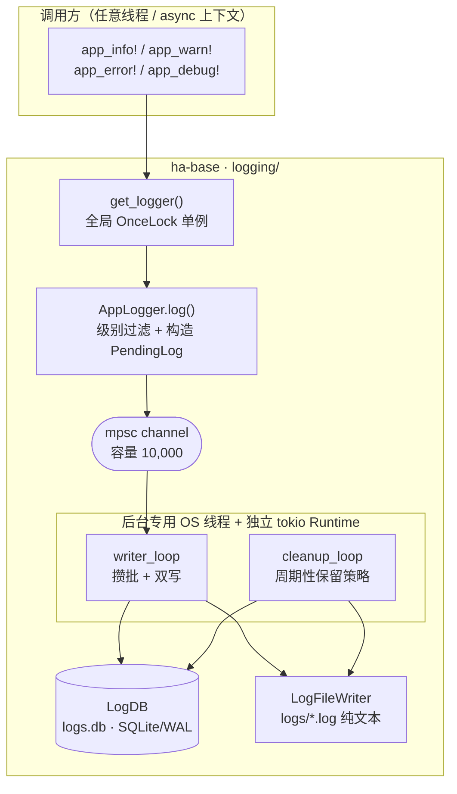
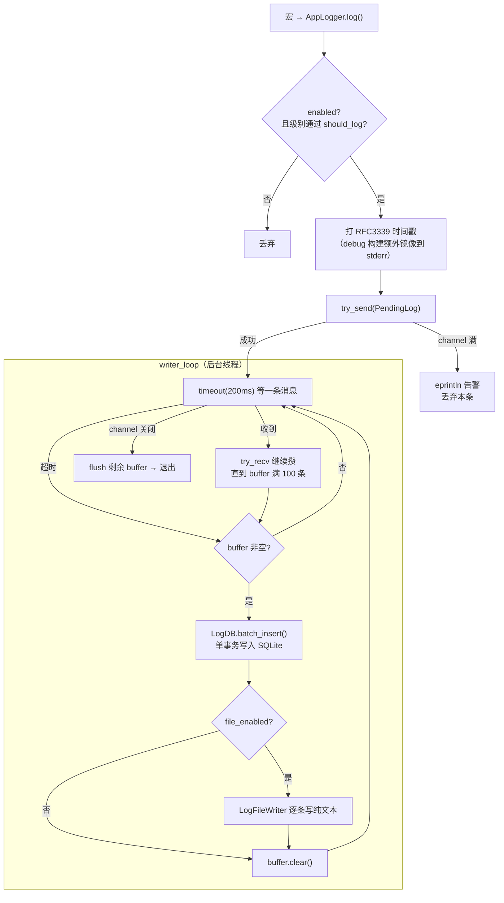
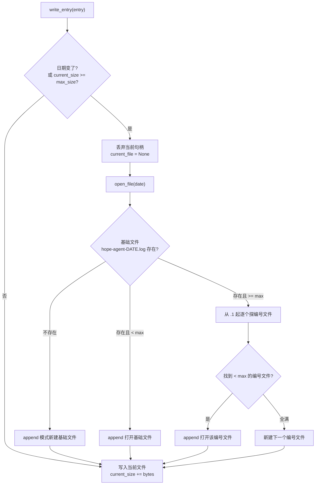

# 统一日志系统

> 返回 [文档索引](../../README.md) | 更新时间：2026-07-23

## 这个子系统解决什么

一个桌面 App 里到处都在"想记一行日志"：某次 Provider 请求的响应体、某个工具执行失败的 stderr、某个 cron 任务的调度决策。这些调用点分布在几十个模块、跑在各种线程与 async 上下文里，它们有三个共同诉求：

- **不能拖慢调用方**——写日志是旁路，绝不能让一次磁盘 I/O 卡住正在跑的对话或工具循环。
- **既要能被机器查，又要能被人和外部工具读**——GUI 要按级别/类别/会话分页检索，运维和 Agent 自检又想直接 `tail` 一个纯文本文件。
- **绝不泄密**——API Key、OAuth Token 一旦进日志，`details` 字段就成了模型读取 history 时的泄露通道。

统一日志系统就是这三条诉求的答案：**一个全局单例 `AppLogger`，把日志推进一条内存 channel 立刻返回；一个后台线程在旁边攒批、双写进 SQLite 和纯文本文件；所有可能带凭据的正文进日志前先过脱敏。** 这样调用方永远只做一次 `try_send`，重活全部搬到后台。

核心不变量：**项目内禁止直接用 `log` crate 的宏**（`log::info!` 等只打到 stderr，不进数据库也不进文件）。统一走 `app_info!` / `app_warn!` / `app_error!` / `app_debug!`。唯一例外是 AppLogger 尚未初始化的极早期启动路径——桌面薄壳在 `init_runtime` 装好 logger 之前先做数据目录初始化（`paths::ensure_dirs`）和 updater 临时目录重定向，这两步只能退回 `log` crate 打 stderr。

---

## 系统总览

日志系统全部落在 `ha-base` crate 的 `logging/` 模块里（基础设施层，零业务依赖），被所有上层 crate 共用。



三条职责被刻意分开：

| 组件 | 文件 | 职责 |
|------|------|------|
| 全局宏 + 单例入口 | `mod.rs` | 定义四个宏；re-export 全模块 |
| 数据结构 | `types.rs` | `LogEntry`、`LogFilter`、`LogConfig`、`LogStats`、`LogQueryResult`、`PendingLog` |
| 异步日志器 | `app_logger.rs` | `AppLogger`：channel 入口 + `writer_loop` + `cleanup_loop` |
| SQLite 管理器 | `db.rs` | `LogDB`：建表、批量写、分页查询、统计、清理 |
| 文件写入器 | `file_writer.rs` | `LogFileWriter`：按日期 + 大小双维度轮转 |
| 文件操作 & 脱敏 | `file_ops.rs` | 列出/读取/清理日志文件 + `redact_sensitive()` |
| 配置持久化 | `config.rs` | `log_config.json` 读写 + DB 路径 helper |

**全局单例为什么必须住在 `ha-base`**：宏展开成 `$crate::get_logger()`，`$crate` 解析到*定义宏的 crate*。宏在 `ha-base`，所以承载 logger 的全局 `OnceLock` 也必须在 `ha-base`——否则所有调用点编译不过。`get_logger()` 返回 `Option`：logger 未初始化时宏静默 no-op，这让极早期启动代码即便调用宏也不会 panic。

---

## 写入管线：为什么不阻塞、怎么攒批

这是整个子系统的心脏。一条日志从宏调用到落盘，中间是一条"生产者一次 try_send，消费者独占后台"的流水线。



四个关键设计取舍：

- **非阻塞**：`log()` 只做一次 `try_send()` 就返回。channel 容量 10,000；一旦被后台消费不及而填满，新日志被丢弃并 `eprintln` 一条告警——**宁可丢日志也绝不阻塞业务线程**。
- **独立线程 + 独立 Runtime**：后台写入用 `std::thread::spawn` 起一条 OS 线程，并在里面自建 `tokio::runtime::Runtime`。这是为了绕开一个启动期陷阱——桌面壳注册全局状态时 tokio reactor 可能尚未就绪，直接 `tokio::spawn` 会 panic。自带 Runtime 让日志器不依赖外部 reactor 的生命周期。
- **攒批刷写**：`writer_loop` 用 200ms 超时等第一条消息，收到后立刻 `try_recv` 把当下可取的消息一起攒进 buffer（上限 100 条），再一次性 `batch_insert`。这样把"每条一次事务"压成"每批一次事务"，SQLite I/O 次数骤降。超时（200ms 内没消息）也会把已攒的 buffer 刷掉，保证延迟有上界。
- **双写**：同一批 buffer 先进 SQLite（供结构化查询），再逐条写进纯文本文件（供 `tail`、外部工具、Agent 自检）。文件写入受 `file_enabled` 开关控制，可单独关闭。

**优雅关闭**：channel 关闭（发送端全部 drop）时 `writer_loop` 收到 `None`，把剩余 buffer flush 完再退出循环，不丢尾部日志。

---

## 日志宏与 `log()` 签名

四个宏签名完全一致，只有级别不同：

```rust
app_info!("category", "source", "message {} {}", arg1, arg2);
app_warn!("category", "source", "something went wrong: {}", err);
app_error!("category", "source", "fatal: {}", err);
app_debug!("category", "source", "verbose detail: {}", val);
```

每个宏展开为一次带保护的调用——logger 未初始化就什么都不做：

```rust
if let Some(logger) = $crate::get_logger() {
    logger.log("info", $cat, $src, &format!($($arg)+), None, None, None);
}
```

宏只填前四个参数，后三个可选参数默认 `None`；需要携带 `details` / `session_id` / `agent_id` 时直接调 `logger.log()`：

| 参数 | 类型 | 说明 |
|------|------|------|
| `level` | `&str` | `error` / `warn` / `info` / `debug` |
| `category` | `&str` | 模块类别（如 `agent`、`tool`、`channel`、`cron`），命名稳定便于 grep |
| `source` | `&str` | 更细的来源标识（如 `agent::run`、`anthropic`、`scheduler`） |
| `message` | `&str` | 日志正文 |
| `details` | `Option<String>` | 可选详情（如脱敏后的 API 请求/响应体） |
| `session_id` | `Option<String>` | 关联会话 ID |
| `agent_id` | `Option<String>` | 关联 Agent ID |

> 埋点纪律：核心业务路径必须埋点，且带最小复现上下文；`category` / `source` 命名保持稳定，好让排障时能按固定关键字检索。

---

## 数据结构与 SQLite Schema

### LogEntry

从数据库读出的一条完整日志：

| 字段 | 类型 | 说明 |
|------|------|------|
| `id` | `i64` | SQLite 自增主键 |
| `timestamp` | `String` | RFC 3339 UTC（`chrono::Utc::now().to_rfc3339()`） |
| `level` | `String` | `error` / `warn` / `info` / `debug` |
| `category` | `String` | 模块类别 |
| `source` | `String` | 来源标识 |
| `message` | `String` | 日志正文 |
| `details` | `Option<String>` | 可选附加详情 |
| `session_id` | `Option<String>` | 关联会话 ID |
| `agent_id` | `Option<String>` | 关联 Agent ID |

序列化为 `camelCase`；`details` / `session_id` / `agent_id` 为 `None` 时跳过序列化（`skip_serializing_if = "Option::is_none"`）。`PendingLog` 是同样字段但没有 `id` 的进 channel 版本（时间戳在 `log()` 里打好，进后台前就已固定）。

### Schema

数据库文件位于 `~/.hope-agent/logs.db`：

```sql
CREATE TABLE IF NOT EXISTS logs (
    id          INTEGER PRIMARY KEY AUTOINCREMENT,
    timestamp   TEXT NOT NULL,
    level       TEXT NOT NULL,
    category    TEXT NOT NULL,
    source      TEXT NOT NULL DEFAULT '',
    message     TEXT NOT NULL DEFAULT '',
    details     TEXT,
    session_id  TEXT,
    agent_id    TEXT
);

CREATE INDEX IF NOT EXISTS idx_logs_timestamp  ON logs(timestamp DESC);
CREATE INDEX IF NOT EXISTS idx_logs_level      ON logs(level);
CREATE INDEX IF NOT EXISTS idx_logs_category   ON logs(category);
CREATE INDEX IF NOT EXISTS idx_logs_session_id ON logs(session_id);
```

连接打开时设 `PRAGMA journal_mode=WAL`、`PRAGMA synchronous=NORMAL`、`busy_timeout=5s`——WAL 让读写并发（后台批写与 GUI 查询互不阻塞），`NORMAL` 在崩溃安全与性能间取平衡，busy timeout 兜住偶发锁竞争。

> `LogDB` 把 `Connection` 包在 `Mutex` 里且保持私有，只对外交出加锁后的 guard（`lock_conn()`）。刻意*不*把 dashboard 那类分析查询（错误率聚合、健康度分解）收敛成 `LogDB` 的方法——那些是业务层查询，塞进基础层是分层倒置。锁中毒统一容忍（`into_inner`）：中毒只意味着此前持锁线程 panic 过，但 rusqlite `Connection` 本身仍可用。

---

## 纯文本文件与轮转

除了 SQLite，同一批日志还逐条落进 `~/.hope-agent/logs/` 下的纯文本文件。`LogFileWriter` 按**日期**和**大小**两个维度自动轮转。



文件命名：

| 场景 | 文件名 |
|------|--------|
| 当日首个文件 | `hope-agent-2026-07-23.log` |
| 基础文件满后第 1 个溢出 | `hope-agent-2026-07-23.1.log` |
| 继续增长 | `hope-agent-2026-07-23.2.log`、`.3.log`…… |

默认单文件上限 10MB（`file_max_size_mb` 可配置），运行时经 `update_max_size()` 热更新——`writer_loop` 每批读一次配置里的 `file_max_size_mb` 并同步给 writer。

日志行格式：`[TIMESTAMP] LEVEL [CATEGORY] SOURCE — MESSAGE`，分隔符是 em-dash `—`（U+2014）。有 `details` 时再追加 ` | DETAILS`：

```
[2026-07-23T10:30:00Z] INFO [agent] agent::run — Starting chat session
[2026-07-23T10:30:01Z] ERROR [tool] tool::exec — Command failed | exit code: 1, stderr: ...
```

debug 构建下 `log()` 还会把每条镜像到 stderr（`[HH:MM:SS] LEVEL [category] source — message`，只截时分秒），方便控制台调试；release 构建不做此镜像。

---

## 脱敏 `redact_sensitive()`

任何可能带凭据的字符串进日志前都要先过 `redact_sensitive()`，把敏感值替换成 `[REDACTED]`。典型用法：Provider 适配器把 API 请求/响应体写进 `details` 前，先 `truncate_utf8` 截到 32KB，再 `redact_sensitive`；MCP OAuth 的 DCR/token 交换响应也同样处理。

**敏感 key 完整列表**（大小写 / 命名风格各算一条，逐一精确匹配）：

| Key | 说明 |
|-----|------|
| `api_key` / `apiKey` / `api-key` | API 密钥的三种命名风格 |
| `access_token` / `accessToken` | 访问令牌 |
| `refresh_token` / `refreshToken` | 刷新令牌 |
| `authorization` / `Authorization` | 授权头 |
| `x-api-key` | 自定义 API 密钥头 |
| `bearer` | Bearer 令牌 |
| `password` | 密码 |
| `secret` | 密钥 / 秘密 |
| `token` | 遗留 query 凭据（可能出现在导入的旧日志里） |

**两种匹配模式**，同一 key 多次出现会循环替换：

- **JSON 字符串值**——匹配 `"key":"value"` 或 `"key": "value"`，把引号内 value 换成 `[REDACTED]`：

  ```
  "api_key": "sk-ant-xxx..."  →  "api_key": "[REDACTED]"
  ```

- **URL 查询参数**——匹配 `?key=value` 或 `&key=value`，在 `&`、空格、引号、换行任一处截断：

  ```
  ?api_key=sk-xxx&other=1  →  ?api_key=[REDACTED]&other=1
  ```

> 这是纯文本模式匹配，不解析 JSON/URL 结构，胜在对任意字符串（包括截断后的半截 body）都能兜底。截断在脱敏之前发生，因此即便密钥恰好跨过 32KB 边界被切断，后一半仍会被脱敏。

---

## 查询、统计与导出

### LogFilter

```rust
pub struct LogFilter {
    pub levels: Option<Vec<String>>,      // 按级别过滤（如 ["error","warn"]）
    pub categories: Option<Vec<String>>,  // 按类别过滤
    pub keyword: Option<String>,          // message LIKE %keyword%
    pub session_id: Option<String>,       // 会话 ID 精确匹配
    pub start_time: Option<String>,       // 时间范围起始（RFC 3339）
    pub end_time: Option<String>,         // 时间范围结束（RFC 3339）
}
```

各条件为 `Some` 且非空时才拼进 `WHERE`，用 `AND` 连接；`levels` / `categories` 用参数化的 `IN (...)` 占位符，`keyword` 走 `LIKE`。结果恒按 `id DESC`（最新在前）。

### 查询方法（`LogDB`）

| 方法 | 说明 |
|------|------|
| `query(filter, page, page_size)` | 分页查询，返回 `LogQueryResult { logs, total }`（total 是同 filter 下的总命中数，与分页无关） |
| `export(filter)` | 全量导出：内部即 `query(filter, 1, u32::MAX)`，返回 `Vec<LogEntry>` |
| `get_stats()` | 返回 `LogStats`，无需传路径——DB 大小取自 `LogDB` 内部记录的文件路径 |

### LogStats

```rust
pub struct LogStats {
    pub total: u64,                         // 总条数
    pub by_level: HashMap<String, u64>,     // 按级别分组计数
    pub by_category: HashMap<String, u64>,  // 按类别分组计数
    pub db_size_bytes: u64,                 // logs.db 文件大小
}
```

---

## 保留策略与清理

日志无限增长会吃满磁盘。`AppLogger::cleanup_loop` 作为独立 tokio 任务常驻，用 `tokio::time::interval(6h)` 驱动。`interval` 的首个 tick 立即 fire——所以**进程启动后马上跑一次全量清理，之后每 6 小时再跑一次**。启动关键路径（`init_app_state`）里不再同步跑任何清理，VACUUM 的 I/O 成本不压在冷启动上；对能连跑数周不重启的 `hope-agent server` 守护进程，这条 6 小时节律保证保留上限持续被执行。

每一轮清理串行跑三步，整轮包在**一次** `spawn_blocking` 里（让 `Mutex` + `VACUUM` 共用同一条 blocking 线程，不抢占 `writer_loop` 的 async worker）：

| 清理目标 | 方法 | 行为 |
|----------|------|------|
| SQLite 按时间 | `cleanup_old(max_age_days)` | `cutoff = now - max_age_days`，删 `timestamp < cutoff` |
| 纯文本文件按时间 | `cleanup_old_log_files(max_age_days)` | 从文件名 `hope-agent-YYYY-MM-DD` 提取日期与 cutoff 比较后删除 |
| SQLite 按大小 | `cleanup_by_size(max_size_mb)` | DB 超阈值时按 `timestamp ASC` 一次删到 ~80% 阈值，再 `VACUUM` 真正收缩文件 |

`enabled=false` 时整轮跳过；`max_size_mb == 0` 时按大小清理直接返回（视为不限）。

> **为什么按大小清理必须 `VACUUM`**：WAL 模式下 `DELETE` 只是标记页面可复用，文件本身不缩。若只删不 VACUUM，删掉旧记录后 `logs.db` 的体积不会跟着下降，用户在 GUI 里看不到任何变化。`VACUUM` 不能在事务里跑，而 `batch_insert` 只开短命事务且同守一把 `Mutex`，因此持锁 VACUUM 是安全的。

其余手动清理入口：`clear(Some(before_date))` 删指定日期前的记录，`clear(None)` 清空整表。

---

## 配置 `LogConfig`

```rust
pub struct LogConfig {
    pub enabled: bool,           // 日志总开关（默认 true）
    pub level: String,           // 最低记录级别（默认 "info"）
    pub max_age_days: u32,       // 最大保留天数（默认 30）
    pub max_size_mb: u32,        // SQLite DB 最大大小（默认 100）
    pub file_enabled: bool,      // 纯文本文件输出开关（默认 true）
    pub file_max_size_mb: u32,   // 单个日志文件最大大小 MB（默认 10）
}
```

持久化于 `~/.hope-agent/log_config.json`。运行时经 `AppLogger.update_config()` 热更新——配置存在 `Arc<RwLock<LogConfig>>` 里，`log()` 和两个后台 loop 每次都读最新值，无需重启。

### 级别优先级

| 级别 | 优先级数值 |
|------|-----------|
| `error` | 0 |
| `warn` | 1 |
| `info` | 2（默认） |
| `debug` | 3 |

`should_log(entry_level, config_level)` 判定：`priority(entry) <= priority(config)` 才记录。配 `level: "warn"` 时只记 `error`(0) 与 `warn`(1)，丢掉 `info` / `debug`。未知级别优先级为 4，比 `debug`(3) 还宽松，因此在四个标准 config 档位下都不会被记录——只有当 config 级别本身也无法识别、同样落到 4 时才会命中。

---

## 前端集成

前端经 `src/lib/logger.ts` 把日志写回后端统一系统，同样走 `category` / `source` / `message` / `details` / `sessionId` 五件套。

- **恒批量**：`logger.error/warn/info/debug(...)` 只把条目推进内存 buffer，每 500ms 或积满 20 条 flush 一次，经 transport 调 `frontend_log_batch`（HTTP `POST /api/logs/frontend-batch`）。后端不可用时静默丢弃——刻意不重试、不报错，避免"记录日志失败"再触发日志的无限递归。（后端另有单条 `frontend_log` 命令，但前端 logger 一律走批量。）
- **控制台镜像**：仅 `error` / `warn` 额外 `console.error` / `console.warn`，方便开发时直接在 devtools 看到；`info` / `debug` 只入 buffer。
- **页面卸载前** 可调 `logger.flush()` 立即刷掉缓冲，避免丢尾。

### 日志相关命令面

前端两套 transport（Tauri invoke / HTTP）共享同一命令名，HTTP 端点如下（详见 [api-reference](../system/api-reference.md)）：

| 命令 | HTTP | 用途 |
|------|------|------|
| `query_logs_cmd` | `POST /api/logs/query` | 分页查询 |
| `export_logs_cmd` | `POST /api/logs/export` | 全量导出 |
| `get_log_stats_cmd` | `GET /api/logs/stats` | 统计 |
| `get_log_config_cmd` / `save_log_config_cmd` | `GET` / `PUT /api/logs/config` | 读 / 写配置 |
| `list_log_files_cmd` | `GET /api/logs/files` | 列出日志文件 |
| `read_log_file_cmd` | `GET /api/logs/file` | 读取某文件（支持 tail） |
| `get_log_file_path_cmd` | `GET /api/logs/file-path` | 当日文件路径 |
| `clear_logs_cmd` | `POST /api/logs/clear` | 清理 |
| `frontend_log` / `frontend_log_batch` | `POST /api/logs/frontend` / `.../frontend-batch` | 前端写入（单条 / 批量） |

### 文件操作（`file_ops.rs`）

| 操作 | 函数 | 说明 |
|------|------|------|
| 列出 | `list_log_files()` | 返回 `Vec<LogFileInfo>`（name + size_bytes + modified），按文件名倒序（日期命名天然按时间倒序） |
| 读取 | `read_log_file(filename, tail_lines)` | `tail_lines = Some(n)` 只返回最后 n 行；文件名做路径遍历防护 |
| 当日路径 | `current_log_file_path()` | 返回 `~/.hope-agent/logs/hope-agent-YYYY-MM-DD.log` |

**安全防护**：`read_log_file()` 拒绝含 `/`、`\`、`..` 的文件名，防路径遍历；正如前述，API 请求体进日志前必过 `redact_sensitive()` + 32KB 截断。

---

## 关键源文件

| 角色 | 路径 |
|------|------|
| 模块入口 + 宏 | `crates/ha-base/src/logging/mod.rs` |
| 全局单例注册 | `crates/ha-base/src/lib.rs`（`APP_LOGGER` / `LOG_DB` 的 `OnceLock` + `get_logger()`） |
| 初始化点 | `crates/ha-core/src/app_init.rs`（`LogDB::open` → `AppLogger::new` → 注册全局） |
| 数据结构 | `crates/ha-base/src/logging/types.rs` |
| 异步日志器 | `crates/ha-base/src/logging/app_logger.rs` |
| SQLite 管理器 | `crates/ha-base/src/logging/db.rs` |
| 文件写入器 | `crates/ha-base/src/logging/file_writer.rs` |
| 文件操作 & 脱敏 | `crates/ha-base/src/logging/file_ops.rs` |
| 配置持久化 | `crates/ha-base/src/logging/config.rs` |
| 路径定义 | `crates/ha-base/src/paths.rs`（`logs_db_path` / `logs_dir`） |
| 前端日志工具 | `src/lib/logger.ts` |
