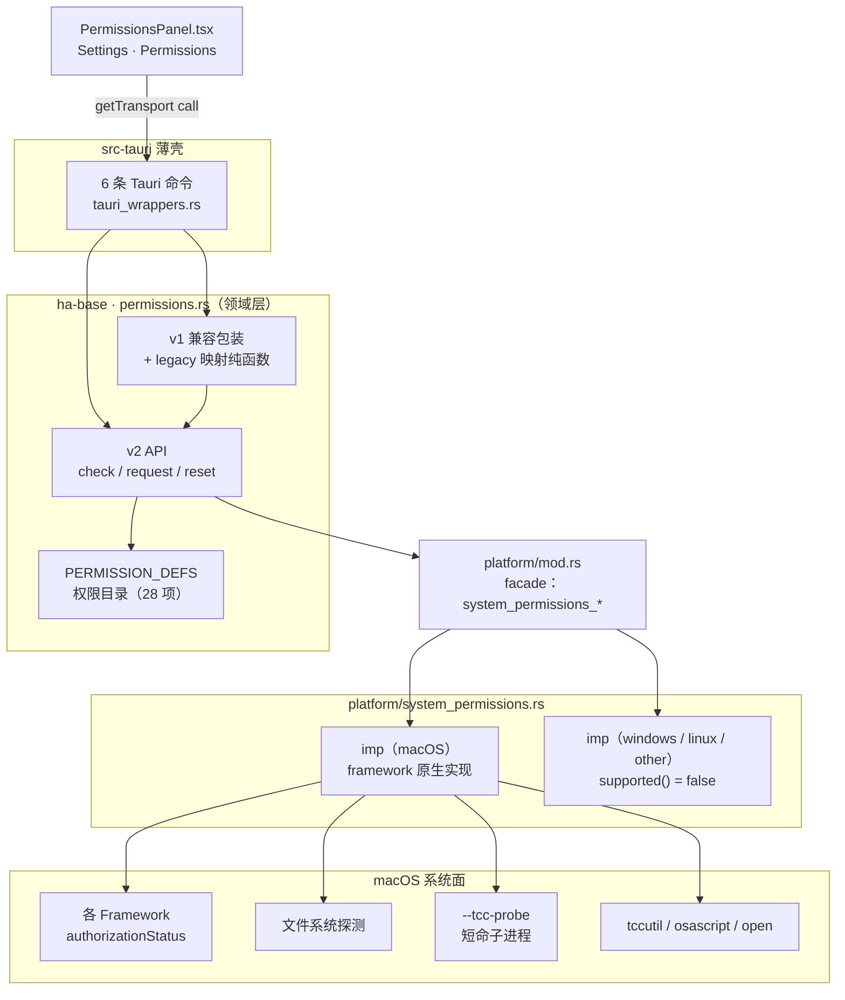
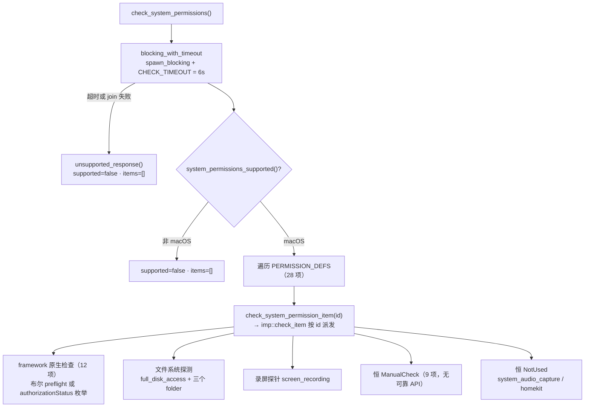
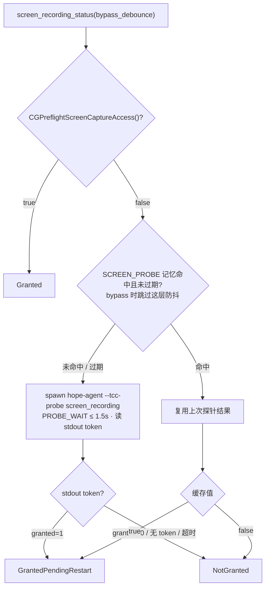

# 系统权限（macOS TCC）

> 返回 [文档索引](../../README.md) | 关联源码：[`crates/ha-base/src/permissions.rs`](../../../crates/ha-base/src/permissions.rs)（领域层）、[`crates/ha-base/src/platform/system_permissions.rs`](../../../crates/ha-base/src/platform/system_permissions.rs)（平台原生实现）、[`crates/ha-base/src/platform/mod.rs`](../../../crates/ha-base/src/platform/mod.rs)（facade）、Tauri 薄壳 [`src-tauri/src/tauri_wrappers.rs`](../../../src-tauri/src/tauri_wrappers.rs)、前端面板 [`src/components/settings/PermissionsPanel.tsx`](../../../src/components/settings/PermissionsPanel.tsx)

## 这个子系统解决什么问题

macOS 用 **TCC（Transparency, Consent, and Control）** 把「访问屏幕、麦克风、通讯录、文件夹……」这类敏感能力锁在系统级的用户同意之后。同意状态不归应用管——它由系统按「进程 + bundle 身份」持有，散落在十几套 framework 各自的 `authorizationStatus` API 里，还有一批能力根本没有可靠的查询接口。

本子系统就是站在这堆参差不齐的系统接口之上的一层**探测 + 引导**：它维护一张权限目录，向桌面 Settings → Permissions 面板回答两个问题——

1. **这项系统权限现在是什么状态？**（已授权 / 未授权 / 需重启 / 无法探测 / 本平台不适用……）
2. **用户点「请求」时该怎么把他引导到授权入口？**（弹系统原生框 / 跳系统设置 / 触发一次探测诱发弹窗）

关键设计取舍就三条边界，先讲清楚，后面所有行为都从这三条推出来：

- **只探测、只引导，绝不持有状态。** 同意状态是系统外部状态，本子系统不落任何库、不占任何配置字段、每次现查。唯一的例外是录屏「待重启」的一小段进程内内存记忆（随进程消亡，见后文），它是性能与语义的折中，不是持久化。
- **Tauri-only。** 能力只经 6 条 Tauri 命令暴露给桌面 Shell，没有 HTTP 路由、不进 `transport.ts` 的 `COMMAND_MAP`。HTTP / server 模式跑的是无头进程，没有系统托盘身份，TCC 这套概念根本不适用。
- **非 macOS 严禁伪造 `granted`。** Windows / Linux / 其它平台一律收敛到「不支持」，绝不假装已授权——这是有单测锁死的红线，宁可少一项能力也不能骗上层「你有权限」。

> 注意与 [`ha-mac`（macOS 桌面控制）](../core/macos-control.md) 区分：那是**上层**桌面控制能力的 readiness 编排，会复用本子系统的权限目录，但走独立命令与路由。本文只讲**底层** TCC 探测与引导，边界详见末章。

## 分层结构

代码分成三层，方向严格自上而下：领域层定义「是什么」，facade 做解耦，平台层实现「怎么查」。上层永远经 facade 调下层，绝不自己 `cfg` 钻进平台实现。

| 文件 | 职责 |
|---|---|
| [`permissions.rs`](../../../crates/ha-base/src/permissions.rs) | 领域层：权限目录 `PERMISSION_DEFS`、v2 / v1 两套 API、数据类型枚举、v1↔v2 映射纯函数、`blocking_with_timeout` 超时包装。**零平台代码**——一切原生调用经 facade 下沉 |
| [`platform/system_permissions.rs`](../../../crates/ha-base/src/platform/system_permissions.rs) | 平台原生实现层：按 `target_os` 分 `macos` / `windows` / `linux` / `other` 四套 `mod imp`。仅 macOS 给出 framework 原生实现，其余三套一律 `supported() = false`、检查/请求恒返回 `NotApplicable` |
| [`platform/mod.rs`](../../../crates/ha-base/src/platform/mod.rs) | facade（`pub(crate)`）：把领域层与平台 `imp` 解耦。导出 `system_permissions_supported` / `system_permissions_platform_name` / `check_system_permission_item` / `request_system_permission_item` / `system_permission_raw_probe` / `system_permission_supports_reset` / `reset_system_permission_item` 七个函数 |

## 权限目录：`PERMISSION_DEFS`

整个子系统的核心就是这张静态目录——一个编译进二进制的常量数组，每条是一项权限的静态元数据 `PermissionDef`。它决定了面板展示哪些项、每项怎么描述、点「请求」走哪种引导。**新增一项能力，就是往这张数组加一条**，同时把对应的平台层 `check_item` / `request_item` 分支补齐（否则该 id 会落到兜底分支返回 `NotApplicable`），并评估 v1 兼容映射是否要跟。

`PermissionDef` 有 7 个字段：

| 字段 | 含义 |
|---|---|
| `id` | 稳定字符串标识（如 `full_disk_access` / `automation_system_events` / `desktop_folder`）——是平台层 `match` 派发的 key，也是前端 i18n 与 reset 白名单的 key |
| `group` | 所属分组 `SystemPermissionGroup`（面板按组渲染） |
| `request_mode` | 请求时的引导方式 `SystemPermissionRequestMode`（**给前端的元数据**，平台层落地并不按它派发，见下） |
| `settings_pane` | 「系统设置」面板锚点，用于拼 `x-apple.systempreferences:` 深链 |
| `usage` | 面向 UI 的用途说明 |
| `note` | 面向 UI 的备注（可空） |
| `troubleshoot_note` | 请求后仍未授权时**替换** `note` 的排障文案（可空，当前只有 `screen_recording` 与 `input_monitoring` 两项有） |

`troubleshoot_note` 挂在 def 上、紧贴它描述的权限，而不是另开一张 id→文案的注册表——两张表容易一边漏挂而没人发现。前端用**独立** i18n key `permissionItems.<id>.troubleshootNote` 翻译它，绝不复用 `note` 的 key（那套译文语义完全不同）；同时响应里带一个 `troubleshoot=true` 标志，前端据此把这条排障文案「钉住」，避免下一次普通 re-check 把它冲掉。

### 目录全貌（28 项 / 5 组）

| 分组 `SystemPermissionGroup` | 项数 | 权限 id |
|---|---|---|
| `ControlCapture`（控制与采集） | 8 | `accessibility` · `screen_recording` · `system_audio_capture` · `input_monitoring` · `automation_system_events` · `automation_messages` · `app_management` · `developer_tools` |
| `FileAccess`（文件访问） | 6 | `full_disk_access` · `desktop_folder` · `documents_folder` · `downloads_folder` · `removable_volumes` · `network_volumes` |
| `PersonalData`（个人数据） | 9 | `location` · `contacts` · `calendar` · `reminders` · `photos` · `media_library` · `speech_recognition` · `focus_status` · `homekit` |
| `DeviceNetwork`（设备与网络） | 4 | `camera` · `microphone` · `bluetooth` · `local_network` |
| `SystemServices`（系统服务） | 1 | `notifications` |

## 状态与请求模式枚举

**`SystemPermissionStatus`（8 态）**——面板逐项渲染的核心信号：

| 状态 | 含义 |
|---|---|
| `Granted` | 已授权，可用 |
| `GrantedPendingRestart` | TCC 已授权，但**本进程要重启才能用**（专用于录屏，见下节）。**对一切能力门控等价于未授权**，只在给用户/模型的措辞上区分「重启生效」与「去授权」 |
| `NotGranted` | 明确未授权 |
| `NotDetermined` | 从未询问过（还能弹原生框） |
| `Restricted` | 被系统策略/家长控制限制，用户无法自行开启 |
| `ManualCheck` | 无可靠原生 API，需用户自查或走探测式判定 |
| `NotApplicable` | 本平台不适用 |
| `NotUsed` | 目录里定义了、但当前不实际使用 |

**`SystemPermissionRequestMode`（4 态）**：`NativePrompt`（弹系统原生授权框）/ `OpenSettings`（跳系统设置面板）/ `TriggerProbe`（触发一次探测以诱发同意弹窗）/ `None`（不主动请求）。它是目录给前端的**展示元数据**——平台层真正落地时按 `id` 派发，不按 `request_mode`（见请求一节）。

## 响应类型（v2）与 v1 兼容类型

**v2 响应**面向新面板，逐项承载状态 + 元数据：

- **`SystemPermissionItem`**（camelCase 序列化）：单项响应。它是 `PermissionDef` 的投影（`id`/`group`/`request_mode`/`settings_pane`/`usage`/`note`），再补两个**响应期计算**字段：
  - `status`：实时探测结果；
  - `troubleshoot`：`note` 是否已被排障文案替换（上一节）；
  - `resettable`：本平台/本构建能否重置该项 TCC 记录，由 `system_permission_supports_reset(id)` 现算。**它只驱动 UI 是否出重置按钮，不是安全边界**——真正执行重置时 `reset_system_permission` 会再过一遍同一份白名单。
- **`SystemPermissionsResponse`**：顶层响应 `{ platform, supported, items }`。`supported=false` 时 `items` 为空，前端据此隐藏整个面板或显示「本平台不适用」。

**v1 兼容类型**是早期前端契约，保留但内部全部委托 v2：

- **`PermissionStatus`**：v1 单项 `{ id, status: String }`，`status` 是旧字符串态（`granted` / `not_granted` / `unknown`）。
- **`AllPermissions`**：v1 聚合结构，**15 个固定字段**（`accessibility` / `screen_recording` / `automation` / `app_management` / `full_disk_access` / `location` / `contacts` / `calendar` / `reminders` / `photos` / `camera` / `microphone` / `local_network` / `bluetooth` / `files_and_folders`），`Default` 把全部字段置 `unknown`。它与 v2 的 28 项目录**不一一对应**（例如 `automation` 对应 v2 的 `automation_system_events`，`files_and_folders` 由三个 folder 项聚合），映射逻辑见 v1 兼容一节。

## 查询：`check_system_permissions`

桌面面板加载时调 v2 查询入口，遍历整张目录，逐项现查：

`imp::check_item` 按 id 把 28 项分成五类判定策略：

| 判定策略 | 覆盖的 id | 说明 |
|---|---|---|
| **framework 原生检查**（12 项） | `accessibility`（`AXIsProcessTrusted`）· `input_monitoring`（`CGPreflightListenEventAccess`）· `camera` / `microphone`（`AVCaptureDevice`）· `location`（`CLLocationManager`）· `contacts`（`CNContactStore`）· `calendar` / `reminders`（`EKEventStore`）· `photos`（`PHPhotoLibrary`）· `bluetooth`（`CBCentralManager`）· `speech_recognition`（`SFSpeechRecognizer`）· `notifications`（`UNUserNotificationCenter`） | 绝大多数查 framework 的 `authorizationStatus` 整数枚举，经 `map_standard_auth_status` / `map_speech_auth_status` / `map_notification_auth_status`（各家整数编码不同）映射成 `SystemPermissionStatus`。`accessibility` 与 `input_monitoring` 例外：它们返回布尔，经 `bool_status` 判定、不走这几个 `map_*` |
| **文件系统探测**（4 项） | `full_disk_access` · `desktop_folder` · `documents_folder` · `downloads_folder` | 无原生 API，靠能否访问受保护路径推断：FDA 读 `~/Library/Safari/Bookmarks.plist` / `~/Library/Messages/chat.db`，folder 三项 `read_dir ~/Desktop` 等。**成功 = `Granted`，失败 = `ManualCheck`（不是 `NotGranted`）**——探测失败可能有别的原因，不能武断判成未授权 |
| **录屏探针**（1 项） | `screen_recording` | preflight 为假时再经短命子进程判定是否「已授权待重启」，见下节 |
| **恒 `ManualCheck`**（9 项） | `automation_system_events` · `automation_messages` · `app_management` · `developer_tools` · `removable_volumes` · `network_volumes` · `media_library` · `focus_status` · `local_network` | 无可靠的 per-target / per-app / per-volume 状态 API，只能让用户去系统设置自查 |
| **恒 `NotUsed`**（2 项） | `system_audio_capture` · `homekit` | 目录里预留、当前不实际使用 |

其中两条最容易踩的特殊分支：

- **`notifications` 在非 bundle 进程会降级 `ManualCheck`。** `UNUserNotificationCenter.currentNotificationCenter()` 在裸调试二进制（`target/debug/hope-agent`，非 `.app`）里查询会抛 `NSException`，而 Rust 无法 catch。所以先用 `running_from_app_bundle()`（检查 exe 路径是否在 `.app` 内）判身份，不在 bundle 里就直接返回 `ManualCheck`、不碰原生查询。
- **automation 两项永远 `ManualCheck`。** Apple Events 的自动化同意是 per-target 的，没有可靠状态 API，`check_item` 恒回 `ManualCheck`；真正的授权动作发生在 request 路径（osascript 诱发弹窗 + 打开设置）。

### 6 秒预算是被 28 项串行共享的

整个查询经 `blocking_with_timeout` 挂 **6 秒 `CHECK_TIMEOUT`**：进 `spawn_blocking` 跑，超时（或 join 失败）就回 fallback，framework 偶发卡顿不阻塞 UI。**关键在于这 6 秒是 28 项串行共享的**，须同时容纳最慢的两项——录屏探针（≤1.5s）加 `notifications` 的 XPC 查询（≤2s）——再加约 26 个快项，留不足余量就会被击穿。超时 fallback 是 `unsupported_response()`，一旦超时，真 Mac 上整个面板会退化成「仅支持 macOS」页、`ha-mac` 也会误报 unsupported。**新增慢检查项必须重算这个预算。**

## 录屏「待重启」探针（`--tcc-probe`）

录屏是整个子系统里最反直觉的一项，值得单开一节。

**问题**：macOS 把录屏能力**固定在进程启动时建立的 WindowServer 连接上**。应用运行期间用户在系统设置里打开录屏开关，本进程 `CGPreflightScreenCaptureAccess()` 仍恒为假，直到重启。于是「刚授权、待重启」与「真没授权」在本进程看来完全一样。

**解法**：既然运行中的进程看不到实时状态，那就 spawn 一个**同一 exe 的短命子进程** `hope-agent --tcc-probe screen_recording`——新进程建立新的 WindowServer 连接，能看到实时 TCC 状态——据它的结果区分两态。

这条路径的每个细节几乎都是踩过的坑固化下来的契约：

- **判据是 stdout token，不是退出码。** 子进程打印一行 `hope-agent-tcc-probe:granted=1|0|unknown`（前缀常量 `permissions::TCC_PROBE_OUTPUT_PREFIX = "hope-agent-tcc-probe:granted="` 是 spawn 侧与答复侧的跨模块契约）。**不认这个 token 就一律当 `unknown`、绝不当已授权**——自升级回滚后磁盘上的旧二进制不认识 `--tcc-probe`，会落到别的分派路径，其退出码含义完全不同（例如 single-instance 转发即 exit 0），若信退出码就会凭空报告一项用户从没给过的权限。
- **`--tcc-probe` 分派必须早于 guardian / child 分派**（`src-tauri/src/main.rs`）：落到 guardian 会**每次探针拉起一个完整 GUI**，且 1.5s 超时 kill 只杀直接子进程、孙进程会成孤儿。探针分支也**不得初始化任何运行时状态**（无 `ensure_dirs` / `init_runtime` / 日志）。
- **答复侧 `raw_probe` 永不再走探针**（只调 preflight），否则子进程再 spawn 子进程会无限递归。
- **进程内记忆做单飞行 + 双时钟过期。** `SCREEN_PROBE`（一个 `Mutex<ScreenProbeState>`）持锁**跨越** spawn：面板的 `Promise.all` 会并发触发多次全目录检查，若不持锁会各 spawn 一个子进程。它刻意**不用 `TtlCache`**——不是 keyed 缓存，而是单权限状态，核心属性是「并发共享一次 spawn」。正负结果都会过期，但走**两套时钟**：
  - 负向 `PROBE_RETRY_TTL = 5s`——用户正在改这个状态，代价是开完开关后最多 5 秒盲窗；点「去授权」会带 `bypass_debounce` 绕过它。
  - 正向 `PROBE_POSITIVE_TTL = 30s`——预期下一步就是重启、复探收益低，所以更长；但**绝不可无限 sticky**：用户可以在运行期于系统设置里**关掉**开关，永久 sticky 会一直声称「已授权 · 重启生效」，而重启后其实没权限。
  - 重置路径另经 `forget_screen_probe_memory()` 立即失效，不等 TTL。
- **仅桌面**（`is_desktop()`）：其余运行模式的宿主二进制未必实现 `--tcc-probe` flag。

## 请求：`request_system_permission`

用户点某项「请求」按钮时调 v2 请求入口。它挂 **65 秒 `REQUEST_TIMEOUT`**（远大于查询超时，因为原生框要等用户操作），`find_def` 按 id 定位后下沉到 `imp::request_item`。

关键点：**`request_item` 按 `def.id` `match` 派发，不是按 `request_mode`**——`request_mode` 是目录给前端的展示元数据，平台层落地走 id-match 加一个 `_` 兜底分支。落地分三类行为：

| 行为 | 覆盖的 id |
|---|---|
| **触发原生授权框**：调 framework 的 `request*`，内部多含 60s `wait_for_prompt` 等用户决策。走 `requestable_status_or_open` 的十项（`camera` · `microphone` · `location` · `contacts` · `calendar` · `reminders` · `photos` · `bluetooth` · `speech_recognition` · `notifications`）先看状态：已非 `NotDetermined` 就跳过弹框、直接 `open_settings_pane`（macOS 每应用只弹一次原生框）。`accessibility` · `screen_recording` · `input_monitoring` 不做这道预检，恒直接调 `request*`，再按结果决定要不要 `open_settings_pane` | `accessibility` · `screen_recording` · `input_monitoring` · `camera` · `microphone` · `location` · `contacts` · `calendar` · `reminders` · `photos` · `bluetooth` · `speech_recognition` · `notifications` |
| **`trigger_automation_probe`**：`osascript` 触发一次 Apple Events 诱发「自动化」同意弹窗 → 打开设置 → re-check（因为 check 永远 `ManualCheck`，request 后也只能让用户自查确认） | `automation_system_events` · `automation_messages` |
| **`_` 兜底分支**：`open_settings_pane`（用 `open` 跳 `x-apple.systempreferences:` 深链）→ re-check | 其余全部 id（含目录里 `OpenSettings` 与 `None` 那批，如 `system_audio_capture`） |

两个非显然细节：

- **`accessibility` 的 request 才是「注册进列表」的动作。** 它走 `AXIsProcessTrustedWithOptions({kAXTrustedCheckOptionPrompt: YES})`——**这个调用本身才把应用登进「系统设置 → 隐私与安全性 → 辅助功能」列表**；若只 `open_settings_pane`，用户跳过去会发现列表里根本没有 Hope Agent 这一行、无从开启。但它**同步返回当前（仍为假的）信任状态**、弹窗异步等用户，且 macOS 每应用只弹一次，所以失败分支**照常再 `open_settings_pane`**——刻意双 UI，因为信这个同步 `false` 而什么都不做，就是「点了没反应」的死路。此外它跑在 tokio blocking 线程上，**须套 `objc2::rc::autoreleasepool`**，否则 autoreleased 字典无池可归、泄漏并打 runtime 警告。
- **`open_settings_pane` 的深链有一处特判**：`Notifications` 锚点跳 `x-apple.systempreferences:com.apple.preference.notifications`，其余锚点统一拼到 `...security?<pane>`。

## 重置 TCC 记录：`reset_system_permission`

由不同签名身份的旧构建留下的 TCC 记录，会让系统设置里的开关照旧可见、却对当前二进制恒拒——从本子系统看，它与「未授权」不可区分，用户唯一出路是删掉这条记录重新授权。此入口把这件事从终端命令搬进面板。

落地是 `tccutil reset <service> <bundle-id>`（**没有公开 API 能做重置，`tccutil` 是唯一受支持途径；涉及的三个服务不需要 sudo**），挂 **15 秒 `RESET_TIMEOUT`**，四条约束把它锁死：

- **服务名是编译期闭合白名单。** 只有三项可重置：`accessibility → Accessibility` / `screen_recording → ScreenCapture` / `input_monitoring → ListenEvent`。调用方只递权限 id，先 `find_def` 校验存在，再经白名单换服务名。**服务字符串永不来自模块外**，否则这个动作就退化成「抹掉任意 TCC 服务」。参数走 `Command::args`，不经 shell。
- **bundle id 运行时取 `NSBundle.mainBundle.bundleIdentifier`**，不硬编码、不读 `tauri.conf.json`。**`None` 是承重的**：裸开发二进制没有稳定 TCC 身份，此时 `supports_reset()=false`、`resettable=false`，UI 不出按钮、后端也拒绝——否则 `tccutil` 会去动某个别的 bundle。故**此功能在 `pnpm tauri dev` 下不可见，验证须用打包应用**。
- **重置录屏后必须 `forget_screen_probe_memory()`。** 探针的正向「待重启」结果本是进程内长期有效的（前提是授权在重启前不可逆），而重置恰好打破这个前提——不清记忆，面板会继续声称「已授权 · 重启生效」，其实授权已被抹掉。
- **owner / GUI-only（红线）。** 它不是配置字段，不进设置三件套；**刻意不给模型工具面、无 `ha-settings` category**——模型能重置 TCC 就等于能随时剥掉用户已授的系统权限、或反复制造授权弹窗，风险级与 Provider 凭据同级。

UI 侧只在 `not_granted` / `not_determined` / `restricted` 三态出重置按钮：**`granted` 不出**（等于给用户自毁按钮），**`granted_pending_restart` 也不出**——那种记录是健康的、只差重启，重置会白扔掉用户刚给的授权。走 `AlertDialog` 二次确认，成功后 re-check 拿到重置后的状态（通常 `NotGranted` / `NotDetermined`；若 re-check 也超时则回落 `NotGranted`）并提供重启入口（复用 `request_app_restart`，exit code 42 由 Guardian 接管；dev / 关闭 Guardian 时只退出不重启）。

## v1 兼容包装

`check_all_permissions` / `check_permission` / `request_permission` 是 v1 入口，**内部全部委托 v2** 再做 legacy 翻译，由几个纯函数承担：

- **`legacy_state_for_status`**：v2 状态 → v1 字符串态。这是所有门控的口径来源：

  | v2 `SystemPermissionStatus` | v1 字符串态 |
  |---|---|
  | `Granted` | `granted` |
  | `GrantedPendingRestart` · `NotGranted` · `NotDetermined` · `Restricted` | `not_granted` |
  | `ManualCheck` · `NotApplicable` · `NotUsed` | `unknown` |

  注意 `GrantedPendingRestart` 落到 `not_granted`——待重启对本进程就是不可用，任何能力门控都必须这样看它。
- **`legacy_request_id` / `legacy_status_for_id`**：v1 id ↔ v2 id 的双向映射（如 `automation` → `automation_system_events`）。
- **`legacy_files_and_folders`**：v1 的 `files_and_folders` 由 v2 的 `desktop_folder` / `documents_folder` / `downloads_folder` **三项聚合**——三项全 `Granted` → `granted`；任一为 `NotGranted` / `NotDetermined` / `Restricted` / `GrantedPendingRestart` → `not_granted`；否则 `unknown`。而 `legacy_request_id("files_and_folders")` 映射到 `desktop_folder` 去触发请求。

**新增权限项时须同步评估 v1 映射是否要更新**——15 字段的 `AllPermissions` 与 28 项目录不一一对应，加项未必要动 v1，但要判断一下。

## 持久化：什么都不落

本子系统**不落任何库、不占任何配置字段、不写 `~/.hope-agent`**：

- **无 DB 表**——TCC 状态实时查询。唯一的「记忆」是录屏探针的进程内内存（`SCREEN_PROBE`，随进程消亡），不落盘。
- **无 config 字段**——不进 `AppConfig` / `UserConfig`，每次面板加载现查。
- **TCC 同意状态由 macOS TCC 数据库按进程 + bundle 身份持有**，属系统外部状态，非本仓库管理。

> 易混淆提醒：`paths.rs::permission_dir()`（`~/.hope-agent/permission/`）持有的是**工具审批权限引擎**的列表（`protected_paths` / `dangerous_commands`，见 [permission-system](../agent/permission-system.md)），**与本子系统无关**——两者只是名字里都有「permission」。

## 对外接口面

### Tauri 命令（6 条，Desktop-only）

6 条命令经 `tauri_wrappers` 薄壳注册到 `invoke_handler`，**没有 HTTP 路由**：

| 命令 | 层 | 作用 |
|---|---|---|
| `check_system_permissions` | v2 | 查询全部 28 项，回 `SystemPermissionsResponse` |
| `request_system_permission` | v2 | 请求单项授权（按 `def.id` 派发），回 `SystemPermissionItem` |
| `reset_system_permission` | v2 | 重置单项 TCC 记录，失败回 `CmdError` |
| `check_all_permissions` | v1 | 兼容聚合查询，回 `AllPermissions` |
| `check_permission` | v1 | 兼容单项查询 |
| `request_permission` | v1 | 兼容单项请求 |

这 6 条登记在 [api-reference](../system/api-reference.md) §7.3 的 **Desktop-only** 表，计入合法的 Tauri-only 差集（脚本口径见该文末）。

### HTTP 路由 / 事件

**都没有**——不进 `build_router_with_cors`、不进 `transport.ts` 的 `COMMAND_MAP`，不 emit 任何 EventBus 事件。HTTP transport 对这 6 条命令没有对应实现。

### 前端面板

[`PermissionsPanel.tsx`](../../../src/components/settings/PermissionsPanel.tsx)（Settings → Permissions）经 `getTransport().call` 调 `check_system_permissions` / `request_system_permission` / `reset_system_permission`。因这几条仅 Tauri 实现，**HTTP transport 下无对应能力**——面板在 server 模式不可用。

## 安全红线速览

- **非 macOS 严禁伪造 `granted`**（单测 `non_macos_system_permissions_are_not_fake_granted` 锁死）：非 macOS 的 `imp::supported()=false`，`check_item` / `request_item` 返回 `NotApplicable`；`check_system_permissions` 在 `supported=false` 时回空 `items`；v1 包装回 `AllPermissions::default()`（全 `unknown`）。
- **Tauri-only 边界**：6 条命令仅在 src-tauri `invoke_handler` 注册，无 HTTP 路由、不进 `COMMAND_MAP`。
- **`GrantedPendingRestart` 对门控等价未授权**：`legacy_state_for_status` / `legacy_files_and_folders` 映射 `not_granted`，`ha-mac` 一切判定用 `== Granted`——**新增消费 `SystemPermissionStatus` 的分支须显式处理该变体**，只在文案层区分「重启生效」与「去授权」。
- **探针 token 不可退化为退出码**、`--tcc-probe` 分派须早于 guardian/child、答复侧 `raw_probe` 永不递归（见「录屏待重启探针」）。
- **重置是 owner / GUI-only，服务名白名单编译期闭合**（见「重置 TCC 记录」）：不给模型工具面、不进 `ha-settings`；重置录屏须同步清探针记忆；裸二进制（无 bundle id）一律拒绝。
- **探测式检测失败 = `ManualCheck` 而非 `NotGranted`**：FDA 与三个 folder 走文件系统探测，失败原因多样，不能武断判成未授权。
- **两层超时的次序**：`request_system_permission` 的 65s `REQUEST_TIMEOUT` 是外层，framework 回调内部 `wait_for_prompt` 是 60s 内层——**外层必须 > 内层**，否则外层先超时、内层白等。查询侧 6s `CHECK_TIMEOUT` 被 28 项串行共享（须容纳录屏探针 1.5s + notifications 2s），超时即整目录退化 `unsupported`。
- **`PERMISSION_DEFS` 是目录的唯一定义处**：新增项须同步 `platform` 层 `check_item` / `request_item` 的 `match` 分支，否则落 `NotApplicable`；并评估 v1 映射。

## 与相邻子系统的关系

| 子系统 | 关系 |
|---|---|
| [Platform 抽象层](platform.md) | facade 视角：`platform.md` 列了 `system_permissions_*` facade 与 `system_permissions.rs` 文件；本文是 TCC 领域视角，两文互链 |
| [ha-mac（macOS 桌面控制）](../core/macos-control.md) | **边界**：本文是底层 TCC 探测/引导，`ha-mac` 是上层桌面控制能力的 readiness 编排；它复用本目录的权限目录（响应里的 `systemPermissions` 字段），但走**独立命令 / HTTP 路由**。`PermissionsPanel` 在两文都出现 |
| [权限引擎（工具审批）](../agent/permission-system.md) | **同名不同物**：本子系统 ≠ 工具审批权限引擎；`~/.hope-agent/permission/` 属权限引擎，与 TCC 无关 |
| [API 参考](../system/api-reference.md) | §7.3 Desktop-only 表登记全部 6 条命令；新增/改命令须与此对齐 |

## 关键文件索引

| 文件 | 角色 |
|---|---|
| [`crates/ha-base/src/permissions.rs`](../../../crates/ha-base/src/permissions.rs) | 领域层：`PERMISSION_DEFS`（28 项）+ v2/v1 API + 枚举 + legacy 映射 + 超时包装 |
| [`crates/ha-base/src/platform/system_permissions.rs`](../../../crates/ha-base/src/platform/system_permissions.rs) | 平台层：四套 `imp`（macos / windows / linux / other），macOS framework 原生检查/请求/探测/重置 |
| [`crates/ha-base/src/platform/mod.rs`](../../../crates/ha-base/src/platform/mod.rs) | facade：`system_permissions_*`（`pub(crate)`，7 个函数） |
| [`src-tauri/src/tauri_wrappers.rs`](../../../src-tauri/src/tauri_wrappers.rs) | 6 条 Tauri 命令薄壳 |
| [`src-tauri/src/main.rs`](../../../src-tauri/src/main.rs) | `--tcc-probe` 进程模式分派（打印 token 后退出） |
| [`src/components/settings/PermissionsPanel.tsx`](../../../src/components/settings/PermissionsPanel.tsx) | Settings → Permissions 面板（Tauri-only，HTTP transport 无能力） |
