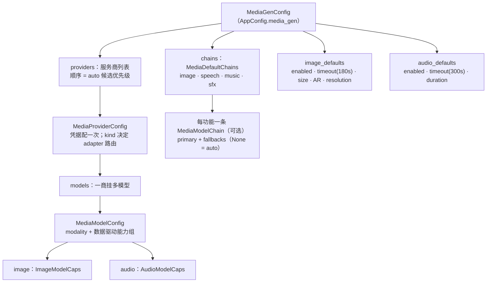
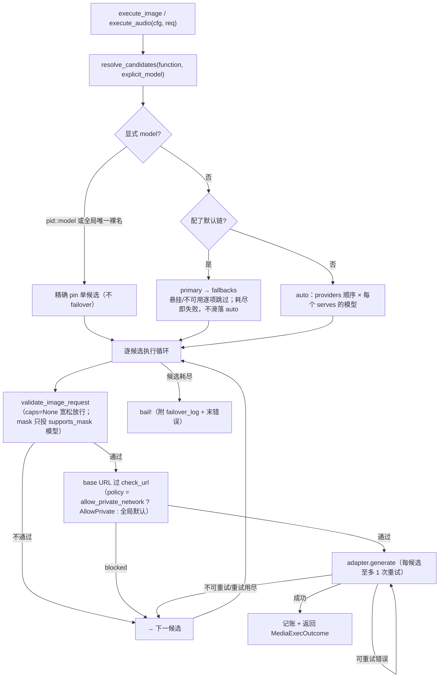
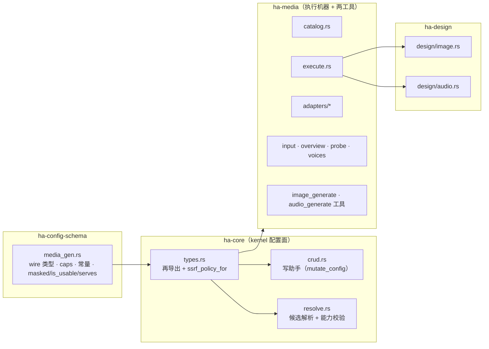

# 媒体生成子系统（Media Generation）

> 返回 [文档索引](../../README.md)
>
> 统一的图片 / 音频生成服务商体系（`video` 模态预留）：**服务商 → 多模型 → 功能默认链**三层，
> 镜像 [STT 子系统](../core/stt.md)的「独立 provider 列表」模式。
>
> 关联源码：wire 类型 [`ha-config-schema/src/media_gen.rs`](../../../crates/ha-config-schema/src/media_gen.rs)；
> kernel 配置面 [`ha-core/src/media_gen/`](../../../crates/ha-core/src/media_gen/)（`crud` / `resolve`）；
> 执行机器 [`ha-media/src/media_gen/`](../../../crates/ha-media/src/media_gen/)
> （`adapters` / `execute` / `catalog` / `probe` / `voices`），两工具在
> [`ha-media/src/image_generate/`](../../../crates/ha-media/src/image_generate/)、
> [`ha-media/src/audio_generate/`](../../../crates/ha-media/src/audio_generate/)。图/音生成唯一入口
> `execute_image` / `execute_audio`。

## 1. 核心思想

生成类服务商是一片碎片化的荒野：OpenAI 既能生图又能 TTS，ElevenLabs 只做语音，火山、混元、
SenseNova 各自对 OpenAI 的 images 请求体做「局部偏离」，Black Forest Labs / Replicate / Kling
则是提交任务再轮询的异步协议，返回信封更是 `data[].b64_json`、`data[].url`、顶层 `images_urls`
各行其是。要在一个助手里把这些都接上，天然有三个难题：

1. **凭据与模型的粒度错配**——同一个 OpenAI key 想同时驱动生图和语音，如果按「每 vendor 一个
   写死槽、每槽单模型」建模，key 就得配好几遍，新模型还得等发版。
2. **能力矩阵千差万别**——尺寸编码、支不支持宽高比、能生几张、能不能 img2img、能不能局部重绘
   （inpaint mask），逐家不同。把这些写死进 Rust trait，用户就无法自填新模型。
3. **失败要能优雅退让**——一次生成可能因为限流、参数不合、端点抽风而失败，需要在多个候选之间
   自动 failover，而这套 failover 逻辑一旦被聊天工具、设计空间各抄一份，就会各自漂移。

子系统的关键想法是把这三点统一收敛：

- **一个用户自管的媒体服务商列表**：凭据配一次，一个服务商挂多个模型，每个模型声明自己产什么
  模态、有什么能力。它刻意**独立于 LLM 的 `ProviderConfig`**——后者的 `ApiType` 是聊天协议
  枚举，而生成商的语义维度（模态、几何能力、音频子类、音色）与聊天协议不是一回事。
- **能力全数据化**：模型能力写在配置里（由内置模板 `catalog` 预填），trait 只剩一个 `generate`。
  用户能自填新模型、能力可在 GUI 里可视化和校验。
- **功能默认链 + auto 兜底**：为 image / speech / music / sfx 四个功能各配一条「primary + fallbacks」
  链，没配就按服务商顺序自动挑。
- **两个唯一入口**：候选解析只走 `resolve_candidates`，执行只走 `execute_image` / `execute_audio`。
  于是 failover、能力校验、用量记账、SSRF 防护都只有一处实现，四个调用点（聊天两工具 + 设计
  空间图 / 音产物）共用同一台机器。

后文先讲三层配置模型（§2）与 vendor 目录（§3），再讲运行时解析与执行这条主干（§4），然后是
代码布局（§5）、两个工具面与命令面（§6–§8）、可观测（§9）与关键设计取舍（§10）。

## 2. 三层配置模型

持久化配置 `AppConfig.media_gen`（类型 `MediaGenConfig`）就是「**服务商 → 模型 → 默认链**」三层，
外加两组全局默认参数。

### 服务商 `MediaProviderConfig`

| 字段 | 含义 |
| --- | --- |
| `id` | 稳定 UUID（新建时自动生成） |
| `name` | 用户自定义显示名 |
| `kind` | `MediaVendorKind`，决定走哪套 adapter |
| `base_url` | 端点覆盖；`None`/空串回落 vendor 默认 |
| `api_key` | 凭据 |
| `enabled` | 启用开关 |
| `models` | 该服务商挂的模型 |
| `default_voice` | 服务商级 TTS 默认音色 |
| `allow_private_network` | 放行内网/回环目标（自建端点用），改写出站 SSRF 策略 |
| `extra` | 服务商级额外参数，**按 secret 处理**（`masked()` 与设置读时脱敏） |

两个关键谓词：`masked()` 遮蔽 `api_key` 与 `extra` 每个值（保留首尾各 4 字符）；`is_usable()` =
`enabled` **且**有凭据——OpenAI-compatible 自建端点允许无 key，只要配了 `base_url` 就算「有凭据」。
`effective_base_url()` 在 `base_url` 为空时回落 `kind.default_base_url()`。

### 模型 `MediaModelConfig`

扁平 struct + 两个可选能力组（**不是 tagged enum**，为的是 serde 对前端友好、自填模型能优雅降级）：

- `id` / `name` / `modality`（`image` | `audio` | `video`）
- `image: Option<ImageModelCaps>`、`audio: Option<AudioModelCaps>`
- `extra: HashMap`——模型级额外参数，请求时合并到服务商级 `extra` 之上（模型胜出）

`ImageModelCaps` 把能力表达为数据：`max_n`、`supports_{size,aspect_ratio,resolution}` 三个开关，
配套 `sizes` / `aspect_ratios` / `resolutions` 合法值枚举（**空 = 不限**）；`supports_mask` 单独标出
「支持 inpaint 蒙版」；`edit: Option<ImageEditCaps>` 是 img2img 能力组（`max_n` / `max_input_images` /
三个 supports 开关）。`AudioModelCaps`：`kinds`（speech/music/sfx 的子集）、`supports_duration`、
`needs_voice`、`default_voice`、`min_duration_secs` / `max_duration_secs`。

**能力组为 `None` 的模型走宽松放行**：`serves()` 判 modality/kind 时把「无 caps」当作「什么都能」，
`validate_image_request()` 遇 `None` 直接通过。代价是坏参数会烧掉一次真实调用（provider 端自然报错、
计入 failover log），但换来自填模型不被闸门误杀——见 §10 决策 5。

### 功能默认链 `MediaDefaultChains`

image / speech / music / sfx 各一条 `Option<MediaModelChain>`（`None` = auto）。`MediaModelChain` =
`primary` + 有序 `fallbacks`，其中每一项是 `MediaModelRef`。

音频刻意按 kind 拆成三条独立链，而不是一条链加过滤：因为三类模型集几乎不相交（TTS 模型做不了
music），单链加过滤每次只剩一条、配置语义反而模糊（§10 决策 3）。`MediaModelRef` 的 `Display` 为
`"provider_id::model_id"`，与聊天侧 `ActiveModel` 的 `Display` 用同一 `::` 约定。

## 3. Vendor 目录与 wire 协议

`MediaVendorKind` 目前收录二十余种服务商。**adapter 路由是唯一真相源**：`adapters::image_adapter(kind)`
和 `adapters::audio_adapter(kind)` 决定某 vendor 能否走图/音——返回 `None` 即该 vendor 无对应模态的
wire 实现（正常情况下候选过滤会先把它挡掉）。下表按此路由列出模态：

| kind | 图 | 音 | 备注 |
| --- | :---: | :---: | --- |
| `openai` | ✅ | ✅ TTS | `/v1/images/generations\|edits` + `/v1/audio/speech`；gpt-image 系支持 mask inpaint |
| `openai-compatible` | ✅ | ✅ | 必填 `base_url`，复用 openai 两套 adapter，可无 key |
| `google` | ✅ | — | Gemini / Imagen；`thinking_level` 走模型级 `extra` |
| `fal` | ✅ | — | Fal.ai 托管扩散模型 |
| `minimax` | ✅ | ✅ TTS | 图像 + 语音双 adapter |
| `siliconflow` | ✅ | — | OpenAI-ish images 端点、自定义尺寸 |
| `zhipu` | ✅ | — | CogView |
| `tongyi` | ✅ | — | 通义万相（DashScope 异步任务 API） |
| `stepfun` | ✅ | ✅ TTS | 图走 OpenAI-compatible profile；语音走 `/v1/audio/speech` |
| `volcengine` | ✅ | — | 方舟 Doubao Seedream（profile 驱动） |
| `hunyuan` | ✅ | — | 腾讯混元 via TokenHub（profile） |
| `together` | ✅ | — | Together AI（profile） |
| `xai` | ✅ | ✅ TTS | Grok Imagine（profile）；语音走 `/v1/audio/speech` |
| `recraft` | ✅ | — | 唯一原生矢量（SVG）输出（profile） |
| `qianfan` | ✅ | — | 百度千帆（profile） |
| `sensenova` | ✅ | ✅ TTS | 图 profile（`images_urls` 信封）；语音走 `/v1/audio/speech` |
| `bfl` | ✅ | — | FLUX：`x-key` 鉴权，model 在 URL path，submit + poll，结果 URL 10 分钟过期 |
| `stability` | ✅ | ✅ Music/SFX | multipart-only；图同步、音频 202 + 轮询（间隔 ≥10s）；**无 TTS** |
| `replicate` | ✅ | — | prediction submit + `Prefer: wait` 快路径 + 轮询兜底；结果 1 小时后删除 |
| `kling` | ✅ | ✅ TTS/SFX | 全线异步任务；双区域域名；顶层 `code != 0` 即业务失败 |
| `iflytek` | ✅ | — | HMAC-SHA256 签名拼进 URL query；三段式自有 JSON；结果 base64 |
| `elevenlabs` | — | ✅ TTS/Music/SFX | voices 实时拉取 |
| `cartesia` | — | ✅ TTS | 见下 wire 差异表 |
| `deepgram` | — | ✅ TTS | 见下 |
| `fishaudio` | — | ✅ TTS | 见下 |
| `hume` | — | ✅ TTS | 见下 |
| `volcengine-tts` | — | ✅ TTS | 与 `volcengine`（图像）**不同 host、不同鉴权** |

> `stepfun` / `xai` / `sensenova` 的语音都借道共享的 OpenAI `/v1/audio/speech` adapter，故只要在这些
> 服务商上配一个 audio 模型就能做 TTS（能力数据化，adapter 层已支持）。

### OpenAI-compatible 家族（`adapters/image/openai_compat.rs`）

`stepfun` / `volcengine` / `hunyuan` / `together` / `xai` / `recraft` / `qianfan` / `sensenova`
这八家的请求体只是 OpenAI images 形状的**局部偏离**，故共用一个 profile 驱动的适配器，把偏离表达
为数据而非代码。新增同类厂商**只加 profile、不加文件**；一旦需要异步轮询、multipart、非 Bearer
鉴权或自定义结果信封，就必须另起适配器——把这些塞进 profile 会让它退化回一堆近似重复实现。

profile（`CompatProfile`）覆盖的偏离维度：

- `size` 编码：像素 `WxH`（`SizeStyle::Pixels`）/ 冒号 `W:H`（`Colon`）/ 拆成 `width`+`height`
  （`WidthHeight`）/ 不发（`Omit`）
- 有无 `n`、`response_format` 取哪个 token（`b64_json` / `base64` / `url` / 不发）
- 是否发 `aspect_ratio` · `resolution`
- 参考图字段名与是否数组、常量 body 字段、固定像素桶白名单、img2img 是否走独立 `edit_path`

结果解析统一兼容三种信封：`data[].b64_json`、`data[].url`、顶层 `images_urls`。各家已知易错点写进了
profile 注释：火山方舟无 `n`（多图靠 `sequential_image_generation`）且 `watermark` 默认为真（我们
显式关掉，否则每张图会被打上「AI 生成」）；Together 的 `response_format` 取值是 `base64` 而非
`b64_json`（尽管响应字段名仍叫 `b64_json`）；腾讯混元 size 用冒号分隔；SenseNova 只接受 20 个固定
像素桶且全局默认尺寸不在其中。

### 音频厂商的 wire 差异

| kind | 关键差异 |
| --- | --- |
| `cartesia` | `transcript` 而非 `input`；`voice` 是 `{mode,id}` 对象；`output_format` 是对象，mp3 容器要 `bit_rate`（`encoding` 是 PCM 编解码枚举，发 `"mp3"` 会失败）；必带 `Cartesia-Version` |
| `deepgram` | 参数全走 query string、body 只有 `{text}`；鉴权 scheme 词是 `Token` 不是 `Bearer`；**音色即 model id**，故只接受 `aura` 前缀的 voice（音色在 failover 链上只解析一次，否则上游厂商的音色名会被当 model 发出） |
| `fishaudio` | model 走 HTTP **header**；音色字段是 `reference_id`；语速在嵌套 `prosody` 下 |
| `hume` | **无 `model` 字段**（`version` 选代际，按 model id 精确匹配而非嗅探数字）；文本必须包在 `utterances[]` 里；`format` 是对象 |
| `minimax` | 响应是 JSON 且音频为 **hex** 编码（非 base64）；`voice_setting.voice_id` 必填 |

## 4. 运行时：解析 → 执行 → 记账

一次生成分两步：`resolve_candidates` 算出要试哪些「(服务商, 模型)」对，`execute_image` /
`execute_audio` 逐候选执行、失败退让。

### 解析优先级 `resolve_candidates(cfg, function, explicit_model)`

1. **显式 model**（工具 `model` 参数）：`"provider::model"` 精确 pin；裸 model id 须在全部可用服务商
   里全局唯一，撞名报错要求 `pid::mid` 形式。**pin = 不 failover**（用户显式指名就该只试它）。
   `"auto"` / 空串等价于「未指定」，落回链或 auto。
2. **已配置链**：`primary → fallbacks`，其中悬挂（provider/model 已删）、不可用（禁用/缺凭据）、
   或 modality/kind 对不上的引用逐项 `app_warn` 跳过；**若全部跳完则整体失败、绝不滑落 auto**——
   用户 pin 了链就不该悄悄用别的服务商扣费（§10 决策 4）。
3. **auto**：providers 顺序 × 每个 `serves(function)` 的模型（同一服务商多模型按声明序**全部**入候选）。
   `serves()` 只 gate modality/kind，**请求几何（n/size/AR）留给执行器逐候选校验**——所以同一服务商
   上第一个模型满足不了的请求（如 `n=4` 撞 `max_n=1`）仍能落到后面能胜任的模型，再 failover 到下个
   服务商。

### 执行循环 `execute_image` / `execute_audio`

对每个候选依次：宽松能力校验 → 取 image/audio adapter → base URL SSRF 门 → 循环 attempt（`0..=1`，
即至多 1 次重试）调 `adapter.generate`。错误经 `failover::classify_error` 分类，可重试且未到上限就
`retry_delay_ms(attempt, 2000, 10000)` 退避后重试，否则移到下一候选。**每次 attempt 都记账**
（成功与失败都记）：image 侧 `KIND_IMAGE_GENERATION`，metadata 含 `size` / `n` / `aspect_ratio` /
`resolution` / `is_edit` / `input_image_count` / `attempt`（成功再加 `output_image_count`）；audio 侧
`KIND_AUDIO_GENERATION`，metadata 含 `audio_kind` / `duration_seconds` / `voice_set` / `attempt`。
`provider_id` 记的是服务商 UUID，`provider_name` 记用户显示名。全部候选耗尽则 `bail!`，附上完整
`failover_log` 与末次错误。

### SSRF：三道执行层防御

出站 URL 一律经 `security::ssrf::check_url`，策略由服务商的 `allow_private_network` 决定
（`ssrf_policy_for`：放行内网选 `AllowPrivate`，否则用全局默认）。以下三道门缺一即失守：

1. **base URL**——执行器对每候选的 `effective_base_url()` 过一次 `check_url`。
2. **音频最终 URL**——audio adapter 对自己拼出的最终请求 URL 用同策略再检一次（图像 adapter 的
   子路径与 base 同 host，靠第一道即可）。
3. **厂商返回的结果资产 URL**——**必须**经 `adapters/fetch.rs::fetch_asset` 下载。这条最关键：很多
   vendor 返回的是 CDN 链接而非内联 base64，那个链接是**响应体里的服务端可控数据**，不是 base URL
   的子路径，执行器那一次 base 检查覆盖不到；恶意或被攻陷的端点可借此让我们去打内网或云元数据服务。
   **禁止在适配器里自写 `client.get(结果URL)`。**

`fetch_asset` 还堵住了重定向这条攻击面：初始 URL 过闸不代表落地地址安全，一个自动跟随重定向的
client 可能被 302 弹进回环/元数据。它因此把 client 建成 **`redirect::Policy::none()`**，用显式循环
逐跳跟随，**每一跳都重跑异步 `check_url`（含 DNS 解析级判定）** 才发起下一跳，跳数封顶 5。响应体
经 `read_bytes_capped` 流式限量读取（产物 128 MB / 参考图 10 MB），不设 Content-Length 的超大响应
也不会 OOM 本进程。之所以逐跳手动跟随而非用 reqwest 的重定向回调——回调是同步的，跑不了异步的
`check_url`。参考图加载（`input.rs::load_input_images`）复用同一条 `fetch_asset` 安全通路。

### voice 三层覆盖

音色按 **调用级 > 模型级 > 服务商级 > adapter 内置兜底** 逐层回落：

- 调用级：工具 `voice` 参数 / design `audioVoice`
- 模型级：`AudioModelCaps.default_voice`
- 服务商级：`MediaProviderConfig.default_voice`
- adapter 内置兜底：OpenAI 系 `alloy`、ElevenLabs `Rachel`

**没有全局 voice**——voice id 是 provider 语境的，跨 provider 的全局默认没有意义。

### 超时

`image_defaults.timeout_seconds`（默认 180）/ `audio_defaults.timeout_seconds`（默认 300），读侧
`effective_timeout_secs()` 把值 clamp 到 `[30, 900]`——**只在读时钳，不回写持久层**。下限防 mis-set
配置每调必挂，上限防卡死的 provider 把一个槽占满一小时。

## 5. 代码布局（三 crate 拆分）

业务机器迁到特征 crate，但对配置的 wire 类型、写路径与纯解析函数留在 kernel：

| 位置 | 文件 | 职责 |
| --- | --- | --- |
| `ha-config-schema` | `media_gen.rs` | §2 全部数据结构 + serde + `masked` / `is_usable` / `serves`。schema 层是纯数据，不读运行时状态 |
| `ha-core/src/media_gen` | `mod.rs` | 门面 re-exports |
| | `types.rs` | 从 schema 再导出 + `ssrf_policy_for`（要读运行时全局配置，故留在业务侧做自由函数） |
| | `crud.rs` | 写助手：`add`/`update`（masked-key 保护）/`delete`（清悬挂链）/`reorder`/`set_media_default_chain`（校验 modality+kind）/`update_defaults`；`mutate_config` 标签 `media_gen.*` |
| | `resolve.rs` | 候选解析单一入口 `resolve_candidates` + `validate_image_request` |
| `ha-media/src/media_gen` | `execute.rs` | 统一 failover 执行器 `execute_image` / `execute_audio`（全部消费方共用） |
| | `catalog.rs` | 内置模板 + 预设模型目录（`MediaProviderTemplate`）+ `OPENAI_TTS_VOICES`；GUI-only，经命令下发不进 config |
| | `input.rs` | 参考图加载（路径/URL/data-uri，SSRF-gated，≤5 张、坏项跳过） |
| | `overview.rs` | sanitized 可用性/能力视图（无凭据，供 design 对话框 + 工具设置提示） |
| | `probe.rs` | 测试连接探针（轻 GET，per-vendor 端点，audio 探针 = voices/models）；结果 JSON `{success,message,url,status,latencyMs,auth}` |
| | `voices.rs` | voice 目录（见下） |
| | `adapters/` | wire 协议实现（trait 只剩 `generate`；身份/默认模型/能力全数据化） |

`adapters/` 内：`fetch.rs`（`fetch_asset`，下载厂商结果 URL 的唯一入口，逐跳 SSRF）；`image/`（openai、
google、fal、minimax、siliconflow、zhipu、tongyi 各一，openai_compat 一个 profile 驱动八家，bfl / stability /
replicate / kling / iflytek 各异步轮询/multipart/签名）；`audio/`（openai、elevenlabs、cartesia、deepgram、
fishaudio、hume、minimax、volcengine_audio、stability_audio、kling_audio）。

**voice 目录**按 vendor 能力分派（`MediaVendorKind::supports_voice_listing()` 门控 UI「拉取音色」
按钮，目前覆盖 ElevenLabs / OpenAI / OpenAI-compatible / Cartesia / MiniMax）：ElevenLabs / Cartesia /
MiniMax 实时拉取；OpenAI 系返回静态表 `OPENAI_TTS_VOICES`（`/v1/audio/speech` 无 listing 端点）；
OpenAI-compatible 返回空表（自建端点音色我们枚举不了，UI 保留自由输入）。ElevenLabs 结果 10 分钟
缓存，缓存键带**凭据 BLAKE3 指纹**（非明文 key）+ provider UUID，多个 ElevenLabs 条目互不串味。

> `supports_voice_listing()`（在 `ha-config-schema`）与 `voices.rs` 的实际分派分支必须一致——声称有
> listing 却拉不到，UI 按钮就成了必然报错。Deepgram 刻意缺席：它的音色就是 model id，模型选择器
> 已经覆盖。

## 6. Agent 工具面

- **`image_generate`**（`BackgroundPolicy::GenericJob`）：args `action(generate|list)` / `prompt` /
  `image` / `images` / `size` / `aspectRatio` / `resolution` / `n` / `model`。schema 动态
  （`get_image_generate_tool_dynamic(&MediaGenConfig)`）：描述里列出链感知候选 + 数据 caps 汇总；
  注入门控 `image_defaults.enabled && has_capable_provider(Image)`——无可用 provider 就不注入。
- **`audio_generate`**（`BackgroundPolicy::GenericJob`）：args `action` / `prompt` /
  `kind(speech|music|sfx，默认 speech)` / `voice` / `durationSeconds` / `model`；kind 判定优先级
  **显式 kind > `[music]`/`[sfx]` prompt 前缀 > speech**。产物落会话附件，`__MEDIA_ITEMS__` 携
  `MediaItem { kind: File, mimeType: "audio/*" }`，复用现有 FileCard → FilePreviewPane 的
  `<audio controls>` 播放通路（`MediaKind` 只有 `Image` / `File` 两个变体，刻意不加 `Audio`）。
  **红线：生成有计费副作用，绝不进 `async_jobs::retry::is_retry_eligible`**（该白名单只放
  `web_search` / `web_fetch` 这类幂等只读工具）。ha-server 的媒体透传白名单已含 `audio_generate`。
- 两工具均入 `is_design_scope_tool` 白名单（设计空间对话可生成素材）。
- **design 工具 / `CreateArtifactInput`** 参数透传：`image_size` / `image_resolution` / `aspect_ratio`
  （image）、`audio_kind` / `audio_voice` / `audio_duration_secs`（audio）。

四个调用点全部走执行器，各自不再写 provider 循环：

| 消费方 | 入口 | operation |
| --- | --- | --- |
| 聊天 `image_generate` 工具 | `ha-media/src/image_generate/generate.rs` | `tool.image_generate` |
| 聊天 `audio_generate` 工具 | `ha-media/src/audio_generate/mod.rs` | `tool.audio_generate` |
| design `image` 产物 + inpaint | `ha-design/src/design/image.rs::generate_image_parts` | `design.image` |
| design `audio` 产物 | `ha-design/src/design/audio.rs::generate_audio_parts` | `design.audio` |

## 7. Owner 命令面（Tauri ↔ HTTP）

Provider CRUD 即时保存；工具面板只写链 + defaults——**分段接口，防两个面板各持整文档快照保存时互踩**。
完整表见 [api-reference.md](../system/api-reference.md)。

| 命令 | HTTP | 说明 |
| --- | --- | --- |
| `get_media_gen_config` | `GET /api/config/media-gen` | Tauri 未脱敏（本机信任域，对齐 `get_stt_providers`）；**HTTP masked** |
| `add/update/delete_media_provider` | `POST/PUT/DELETE /api/config/media-gen/providers[/{id}]` | update 走 masked-key 保护（掩码值不覆写真值） |
| `reorder_media_providers` | `PUT .../providers/reorder` | 顺序 = auto 优先级 |
| `set_media_default_chain` | `PUT .../chains/{function}` | function ∈ image/speech/music/sfx；`chain=null` 清回 auto |
| `update_media_gen_defaults` | `PUT .../defaults` | 两 defaults 整体保存 |
| `get_media_provider_templates` | `GET .../templates` | catalog（GUI-only） |
| `list_media_voices` | `GET .../voices?providerId=` | 按 vendor 能力分派 |
| `test_media_provider` | `POST .../test` | 保存前草稿（kind+key+baseUrl）或已存 provider（id） |
| `get_media_gen_overview` | `GET .../overview` | sanitized，无凭据 |

**悬挂链自愈**：删除服务商或替换模型列表会牵连默认链——`crud.rs` 的 `prune_dangling_chain_refs`
在同一次写里扫掉指向已消失 provider/model 的引用（primary 悬挂则第一个存活 fallback 顶上，全空
则该槽清回 auto）。禁用的 provider 会**保留**在链里（解析时运行期跳过），只有真正删掉的才剪。

## 8. 设置三件套 + 前端

- **GUI**：模型服务商设置页（`ModelConfigPanel`）的「媒体生成模型」Tab（`mediaModels`，组件
  `src/components/settings/media-gen/`：服务商卡列表 dnd 排序 + 模板添加对话框 + 模型/能力编辑 +
  测试连接 + voices 拉取）；工具设置页「媒体生成」Tab（`MediaGeneratePanel`：启用开关 + 四条链
  `ModelChainEditor` + 默认参数 + 超时）。工具面板与服务商面板刻意分开——单一 `MediaGenConfig`
  文档若被两面板各持快照保存会互踩。
- **`ha-settings`**：category `media_generation`（风险级 LOW）。读：providers 逐个 `masked()` +
  chains/defaults 原样。**写只放行 `chains` / `imageDefaults` / `audioDefaults` 三段**，payload 含
  `providers` 一律报错并指向 owner UI——凭据可写 = 模型能植入自己的 key / 外泄端点。链写入经
  `check_serves_function` 校验；`chains` 里显式 `null` 清该功能回 auto。
- **reset**：`settings_reset` 的 `media_gen` section（scope tools）只重置 chains + defaults，
  **providers（凭据）保留**。
- **深链**：`openMediaModelSettings()` 发 `settings:navigate` + `modelTab: "mediaModels"`（App 层
  监听须透传 `modelTab`）。设计空间的图/音生成对话框在无可用 provider 时渲染空态 + 该深链。

## 9. 记账与可观测

- **用量**：执行器内每 attempt 记 `KIND_IMAGE_GENERATION` / `KIND_AUDIO_GENERATION`（生成类无
  token，只记次数 + 耗时，禁字符估算冒充 token；无痕会话经 session_id 归零入账，遵全局契约）。
  `provider_id` 为服务商 UUID。
- **日志**：稳定 category `media_gen`，source `resolve` / `execute` / `load_input_images`；工具层
  沿用 `tool` / `image_generate`、`tool` / `audio_generate`；design 层 `design` / `image`、
  `design` / `audio`。
- **产物落盘**：新生成的图/音都经 `attachments::save_attachment_bytes(session_id, …)` 落**会话附件
  目录**。历史目录 `~/.hope-agent/image_generate/` 仍由 ha-server 的一个只读路由服务着——那里存的是
  早期版本写下的图，改名会断历史 `mediaUrls`，故保留。

## 10. 关键设计决策

| # | 决策 | 理由 |
| --- | --- | --- |
| 1 | 统一媒体服务商列表，而非图/音两套或并入 LLM `ProviderConfig` | 一个 OpenAI 条目同时挂生图 + TTS 模型（key 配一次）；`ApiType` 是聊天协议枚举，塞纯生成商语义混乱 |
| 2 | 能力全数据化（catalog 模板 → config），trait 只剩 `generate` | 用户可自填新模型不用等发版；能力矩阵可视化、可校验 |
| 3 | audio 默认链按 kind 拆三条 | 三 kind 模型集几乎不相交，单链 + 过滤每次只剩一条、配置语义反而模糊 |
| 4 | 链耗尽即失败，不滑落 auto | 用户显式 pin 的链滑到未选服务商 = 不可预测扣费 |
| 5 | caps=None 宽松放行 | 自填模型不被闸门误杀；代价是坏参数烧一次真实调用，可接受（provider 端自然报错、计入 log） |
| 6 | `supports_mask` 独立于 `edit` | 有些 vendor（OpenAI gpt-image 系）支持 mask inpaint 却无通用 img2img，数据化后两种能力各自显式表达；不支持 mask 的 vendor 收到蒙版会静默整图重生成，必须过滤 |
| 7 | video 只留 modality 枚举 | 让 config schema 不因未来接入而 churn；暂不做 adapter / 模板 / UI |
| 8 | 升级不做旧配置迁移 | 项目既定无迁移政策；升级后 providers 为空 → 工具门控自动收回 + 各处空态引导重配 |
