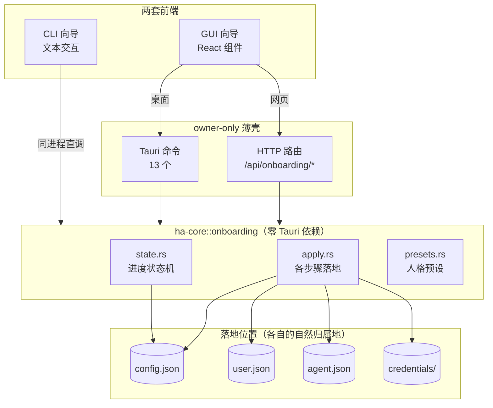
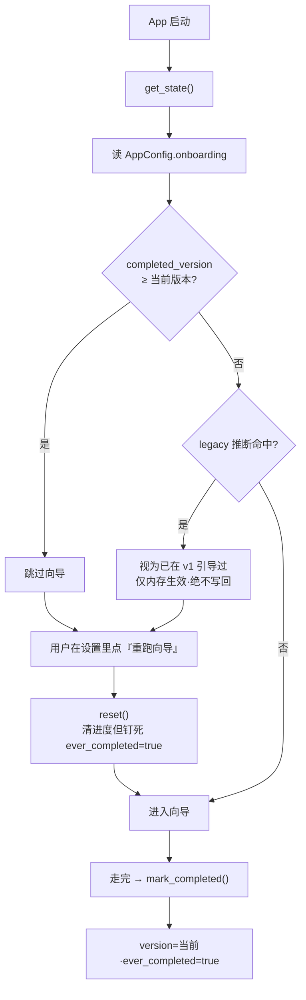
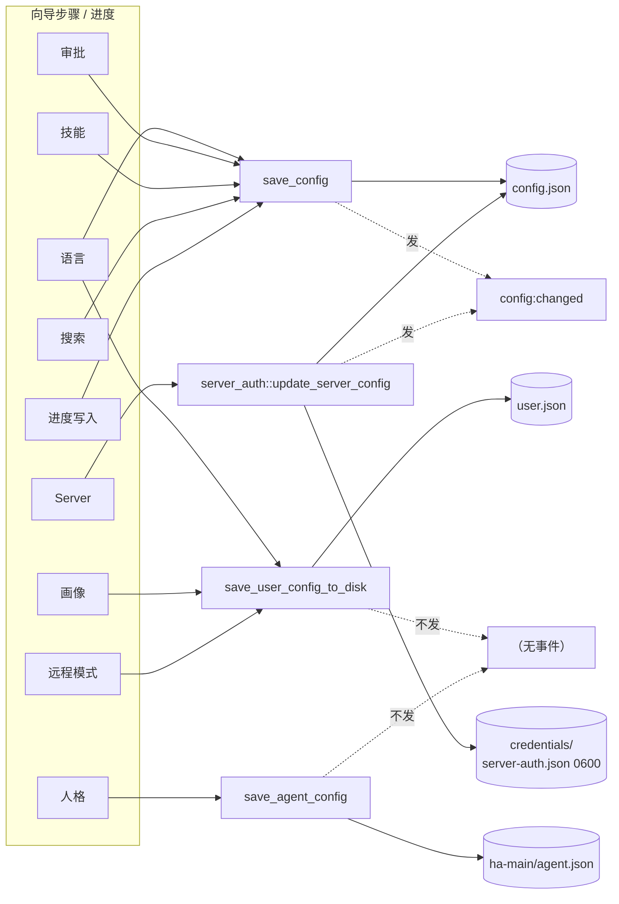

# 首次启动向导（Onboarding）

> 返回 [文档索引](../../README.md) ｜ 关联源码：核心 [`crates/ha-core/src/onboarding/`](../../../crates/ha-core/src/onboarding/)、Tauri 薄壳 [`src-tauri/src/commands/onboarding.rs`](../../../src-tauri/src/commands/onboarding.rs)、HTTP 薄壳 [`crates/ha-server/src/routes/onboarding.rs`](../../../crates/ha-server/src/routes/onboarding.rs)、GUI [`src/components/onboarding/`](../../../src/components/onboarding/)、CLI [`src-tauri/src/cli_onboarding/`](../../../src-tauri/src/cli_onboarding/)

## 核心思想

App 第一次运行时，用户既没有配置任何模型服务商，也没告诉过我们语言、身份、审批口味。首次启动向导就是把这段「从零到能用」的最小配置收敛成一条有序、可跳过、可中途退出续跑的流程：**语言 → 服务商 → 搜索 → 用户画像 → 人格 → 审批安全 → 技能 → Server → 渠道**。

它有两个不显然的设计取向，理解了这两点就理解了整个子系统：

1. **双前端、单核心。** 向导有两套完全独立的界面——桌面/网页共用的 React GUI，以及命令行下的 CLI 向导。但两者都写**同一份进度状态** `OnboardingState`、调用**同一组 `apply_*` 落地函数**。界面各自演化，配置语义永远一致。

2. **配置落到数据的自然归属地，而不是攒进一个 onboarding 配置块。** 语言写 `config.json` 和 `user.json`、画像写 `user.json`、人格写默认 Agent 的 `agent.json`、审批写权限配置、Server 令牌写凭据库……向导只是这些既有配置项的一个「有引导的入口」，它落地后和用户日后在设置里改的效果没有任何区别。唯一属于向导自己的持久化，是「走到哪一步、有没有走完」这份进度状态。

这条设计带来一个直接后果：向导没有自己的存储格式，也没有自己的一套写盘逻辑，它复用各配置项本来就有的读写路径。下面几节围绕这两点展开。

## 全景：谁调谁



桌面 GUI 走 Tauri IPC，网页 GUI 走 HTTP（同一个 axum 进程用静态文件回退托管前端），CLI 因为和 ha-core 编在同一个二进制里、直接调用核心函数。三条入口最终都汇到 `ha-core::onboarding` 的三个模块。

## 核心的三块逻辑

核心全在 [`crates/ha-core/src/onboarding/`](../../../crates/ha-core/src/onboarding/)，三个实现文件分工清晰，外加一个只做再导出的 `mod.rs` 胶水：

| 文件 | 管什么 |
|---|---|
| `state.rs` | **进度状态机**：读入口 `get_state`（内含 legacy 升级推断）、写入口 `save_draft` / `mark_completed` / `mark_skipped` / `reset`，以及纯函数 `infer_legacy_completed` |
| `apply.rs` | **各步骤落地**：`apply_language` / `apply_profile` / `apply_personality_preset` / `apply_safety` / `apply_skills` / `apply_web_search` / `apply_server` / `apply_remote_mode`，外加 `generate_api_key` 与 `merge_optional` 助手 |
| `presets.rs` | **人格预设**：`PersonalityPreset` 枚举（4 个变体）+ `personality_preset_by_id` string-id 解析 |

`mod.rs` 只做子系统根和公共 API 再导出，其中 `OnboardingState` 与 `CURRENT_ONBOARDING_VERSION` 本体定义在配置 schema（`crates/ha-config-schema/src/config.rs`），从这里再导出。

## 进度状态：`OnboardingState`

`OnboardingState` 是 `AppConfig.onboarding` 子对象，以 serde camelCase 序列化进 `config.json`。它是向导唯一属于自己的持久化数据：

| 字段 | 语义 |
|---|---|
| `completed_version` | 用户完成时的向导版本号（`0` = 从未完成）。判定「是否已引导」的唯一依据 |
| `completed_at` | 最近一次完成的 ISO 8601 时间戳 |
| `skipped_steps` | 用户在最近一次运行里主动跳过的步骤 key 集合（只作记录，不阻塞） |
| `draft` | 前端拥有的**不透明 JSON 草稿**——用户中途退出时前端写下当前输入，后端只原样存取、不解释结构 |
| `draft_step` | 退出时停留的步骤序号（0 起） |
| `ever_completed` | 粘性布尔锚：只要向导曾经完整走过一次就为 `true`，且 `reset()` 之后仍然保持 `true` |

### 是否弹向导：版本闸 + legacy 推断

判定「新用户该看到向导 / 老用户不该被打扰」的规则，全在 `get_state` 这一个读入口里。它的核心是一个版本比较，外加一层给老用户的兜底推断：



**版本闸。** `CURRENT_ONBOARDING_VERSION`（当前值 **1**）是「向导需不需要让存量用户重走」的分界。`completed_version >= CURRENT_ONBOARDING_VERSION` 即判已引导。这个常量的 bump 规则很克制：**只有新增了必填步骤、必须让老用户补做时才 bump**；新增可选步骤（比如给 v0.2 系列加的搜索服务商步）不 bump，存量用户不会被无端打断。前端有一份镜像常量（`src/components/onboarding/version.ts`），改 Rust 端必须同 commit 改前端。

**legacy 升级推断。** `infer_legacy_completed` 是一个纯函数，解决的抽象问题是：向导本身是后来才加的，比它更早的版本里已经把服务商配好、天天在用的用户，升级后不应该被当成「首次启动」重弹一遍向导。它的判据是四个条件同时成立：

```
completed_version == 0   // 从未在带向导的版本完成过
&& !ever_completed        // 也从未走过向导
&& 至少有一个 provider     // 但配置里已经有服务商
&& draft.is_none()        // 且没有留下半截草稿
```

直觉是：一个「有服务商、从没走过向导、也没留草稿」的用户，只可能是从没有向导的旧版本升级来的，应当直接视为已引导。

这里有个必须记住的约束：**推断出来的「已完成」只在 `get_state` 的内存读取里生效，绝不写回 config**。一次静默的配置改写会产生让人困惑的 autosave 快照。因此任何要观察 `completed_version` 的调用方都必须经 `get_state`，不能裸读 `cfg.onboarding`——否则会漏掉这层推断。

**`reset` 与推断的冲突点。** `reset()` 用于用户在设置里显式点「重跑向导」。它清掉进度，但**特意把 `ever_completed` 钉死为 `true`**。原因正是上面那条推断：一个有服务商的老用户点了重跑，如果 `ever_completed` 被清成 `false`，`infer_legacy_completed` 会立刻把他重新判成 legacy 直接跳过向导——重跑就失效了。`ever_completed` 这个粘性锚存在的唯一意义，就是让「显式重跑」能穿过 legacy 推断。

### 四个写入口

进度的四种写入全在 `state.rs`，都经 `load_config()` + `save_config()`，并用 `backup::scope_save_reason("onboarding", <step>)` 给 autosave 打标签：

| 写入口 | 行为 |
|---|---|
| `save_draft` | 写下前端草稿 JSON 和 `draft_step` |
| `mark_completed` | `completed_version` = 当前版本、盖 `completed_at`、清草稿、置 `ever_completed = true` |
| `mark_skipped` | 把某步骤 key 追加进 `skipped_steps`（去重） |
| `reset` | 清空进度让向导重新出现，但保留 `ever_completed = true`（见上） |

## 各步骤落到哪里

`apply.rs` 的每个 `apply_*` 都把对应步骤的结果写到那类数据本来该待的地方。**这也意味着写路径不止一条**——理解向导落地行为的关键，就是看清哪一步用哪个写盘器、会不会发 `config:changed` 事件。



| helper | 步骤 | 落地位置与写盘器 |
|---|---|---|
| `apply_language` | 语言 | 同时写 `config.language`（`save_config`）与 `user.language`（`save_user_config_to_disk`），兼容两条历史读路径 |
| `apply_profile` | 用户画像 | 经 `merge_optional` 写 `user.json` 的 name / timezone / ai_experience / response_style |
| `apply_personality_preset` | 人格 | `ensure_default_agent` 后读写默认 Agent（`ha-main`）的 `agent.json`，**只改 personality 段** |
| `apply_safety` | 审批安全 | 把 `approvals_enabled` 翻译成权限引擎语义（见下），`save_config` |
| `apply_skills` | 技能 | 整表覆盖 `config.disabled_skills`，`save_config` |
| `apply_web_search` | 搜索 | 先 `web_search::backfill_providers` 补全，再写 `config.web_search`（CLI 搜索步用；GUI 走既有设置面板） |
| `apply_server` | Server | **不走 `save_config`**：经 `server_auth::update_server_config`——令牌进凭据库、bind_addr 经 `mutate_config` 进 `config.server`（见下） |
| `apply_remote_mode` | 远程模式 | 写 `user.json` 的 `server_mode=remote` / `remote_server_url` / `remote_api_key`（仅 CLI mode 步接线） |
| `generate_api_key` | — | 产 `hope_<base64url(32 随机字节)>` 格式的 owner 令牌（GUI / CLI / 测试共用同一格式） |

所有 `apply_*` 与进度写入都自带 `onboarding/<step>` 的 autosave 备份标签（`<step>` 取值如 language / profile / safety / skills / search-provider / server / mode / draft / complete / skip / reset），可按步骤精细回滚。

### Server 步为什么特殊

`apply_server` 是唯一一条不用 `save_config` 的落地。它把 `ServerStepInput` 交给 `server_auth::update_server_config`，后者把数据一分为二：

- **owner 令牌**（`api_key`）落进凭据库 `~/.hope-agent/credentials/server-auth.json`（0600 权限），**不进 `config.json`**。传空串 `Some("")` 清除令牌，`None` 保持现状。
- **bind 地址**经 `mutate_config(("server", …))` 写进 `config.server`（写入时 `api_key` 已置空）。用 `mutate_config` 而非 `save_config`，因此它具备并发 lost-update 防护，且同样会发 `config:changed` 事件。

`update_server_config` 还会在把一个 loopback 监听改成对外公开监听、却没有令牌时 fail closed 拒绝，避免裸暴露。令牌与鉴权细节见 [Server / 后端分层](../system/backend-separation.md)。

### 审批步：诚实的「不要审批」就是 YOLO

`apply_safety` 把界面上一个「是否开启审批」的开关翻译成权限引擎语义，这里有一处容易踩的语义坑：

- **关闭审批（`approvals_enabled = false`）= 写 `global_yolo = true`。** 一个自然的实现是把「审批超时动作」设成 Proceed、再关掉超时，但那会让每个 Ask **永久挂死**：关掉超时等于超时永不触发，而 Proceed 分支只在超时触发时才读到——结果每个 Ask 都在等一个永不到来的超时。诚实实现「别问我」的方式是全局 YOLO：权限引擎直接返回 Allow，根本不发出 Ask，也就无从挂起。代价是它比朴素的「不要审批」更宽松（连受保护路径 / 危险命令的提示也一并绕过），CLI 向导文案对此有明确说明。
- **重新开启审批（`true`）= 必须同时清 `global_yolo = false`**，并顺手把超时动作从 Proceed 修回 Deny、把为 0 的超时秒数补成 300。**必须清 YOLO**：它可能是上一次「关闭审批」留下的，不清的话引擎会继续旁路所有审批门，用户永远等不到弹窗。

权限引擎与审批超时语义详见 [权限系统](../agent/permission-system.md)。

### `merge_optional`：偏向保数据

`apply_profile` 通过 `merge_optional` 写画像字段，规则是**`None` 与空串都当作「保留现值」**。这是因为向导的输入框把「用户没改过」的初始 React 状态也表示成 `""`，和「用户想清空」无法区分，于是一律偏向保数据。**结果是向导无法清空一个已有的画像字段**——真想清空得去设置的 Profile 面板，那里预填当前值、清空意图无歧义。这是有意设计，别改成「空串=清空」。

## 人格预设

`presets::PersonalityPreset` 枚举 4 个变体 `Default` / `Engineer` / `Creative` / `Companion`：

- `to_config()` 产出一份 `PersonalityConfig`，写进默认 Agent 的 personality 段。四个预设都**特意留空** `traits` / `principles` / `boundaries` / `quirks`，让设置里的结构化编辑器保持一张干净的可扩展白纸。`Default` 更是连 role / tone 等描述字段都不写——身份信息由 Agent 的 name / description / `agent.md` 模板承载，不该让向导往 personality 里写死英文字面量（否则会以英文注入系统提示词、并在非英语用户的设置界面里显得突兀）。
- `id()` 给出稳定 string id（`default` / `engineer` / `creative` / `companion`），是这套 id 的**单一来源**；`personality_preset_by_id(id)` 反查，未知 id 返 `None` 供调用方报干净的校验错。

`apply_personality_preset` 只写默认 Agent（`ha-main`）的 `agent.json`；用户日后自建的其它 Agent 独立管理。写之前必须 `ensure_default_agent`，否则模板尚未落盘、写入会失败。

## 两套前端的步骤流

核心是共享的，但两套前端**展示给用户的步骤序列并不相同**——它们各自决定走哪些步、以什么顺序，然后调用同一批 `apply_*`。别把「共享核心」误读成「步骤一模一样」。

### GUI：精简的本地流 + welcome 上的远程入口

前端在 `src/components/onboarding/types.ts` 里定义了一个 11 个 key 的 `OnboardingStepKey` 联合类型（welcome / mode / provider / search-provider / profile / personality / safety / skills / server / channels / summary），组件目录 `steps/` 里每个 key 都有对应组件。但真正驱动本地安装流程的有序列表 `ONBOARDING_STEPS` 只有 **6 步**：

```
welcome → provider → search-provider → profile → safety → channels
```

welcome 步承载语言 / 主题选择，以及**作为次要动作的远程连接入口**。其余几个 key（mode / personality / skills / server / summary）的组件仍在仓库里，但精简后的默认本地流不再逐一经过它们。每步的「下一步」由顶层 `index.tsx` 统一派发对应的 `apply_*` 命令（provider 与 search-provider 两步的持久化发生在各自面板内部保存时，向导只是透传）。

**远程模式在 GUI 里是 welcome 页上的一个次要动作**，不是一条独立步骤流。`stepsForMode("remote")` 只返回 `["welcome"]`：用户在 welcome 页填远端地址、连接成功后 `onRemoteConnected` 直接触发 `finish()` 收尾。远程连接的持久化走前端共享的 RemoteConnect 组件，不经 `apply_remote_mode`（那是 CLI 专用）。

### CLI：完整的 12 步本地流

CLI 向导（`hope-agent server setup`，加 `--reset` 重跑）走的是更完整的流程，`wizard.rs` 里本地路径标注 `LOCAL_TOTAL = 12`：

```
language → import-openclaw → mode →
  [本地: provider → search-provider → profile → personality →
         safety → skills → server → channels] → summary
```

CLI 各步骤模块在 `cli_onboarding/steps/`，选「远程」时在 mode 步（第 3 步）之后短路——此时这台机器只是指向别人的 server，本地没什么可配的，直接标记完成，用户看到的是 `[step/4]` 的短路径（`REMOTE_TOTAL = 4`）。这与 GUI `stepsForMode("remote")` 的早退是同一个意图，只是 CLI 把语言 / import-openclaw / mode 拆成了显式步骤。

### 谁调哪个核心 helper

无论步骤序列怎么排，两端最终调的是同一批核心函数：

| 步骤 | GUI 命令 | CLI 步骤 | 核心 helper |
|---|---|---|---|
| 语言 | `apply_onboarding_language` | `steps::language` | `apply_language` |
| 画像 | `apply_onboarding_profile` | `steps::profile` | `apply_profile` |
| 人格 | `apply_personality_preset_cmd` | `steps::personality` | `apply_personality_preset` |
| 审批 | `apply_onboarding_safety` | `steps::safety` | `apply_safety` |
| 技能 | `apply_onboarding_skills` | `steps::skills` | `apply_skills` |
| 服务商 | `<ProviderSetup>` 面板 | `steps::provider` | `provider::add_and_activate_provider` |
| 搜索 | `<WebSearchPanel>` 面板 | `steps::search_provider` | `apply_web_search` |
| Server | `apply_onboarding_server` | `steps::server` | `apply_server` |
| 远程 | welcome 页 RemoteConnect | `steps::mode` | `apply_remote_mode`（仅 CLI） |

注意 `apply_remote_mode` 与 `apply_web_search` **没有对应的 Tauri / HTTP onboarding 端点**——它们只被 CLI 调用。GUI 的远程连接靠 welcome 页早退处理，GUI 的搜索服务商配置走既有的 [设置端点](../core/provider-system.md)。

## 对外接口面

向导端点是 **owner-only**：无 session 参数，纯本机（Tauri IPC）/ HTTP Bearer 信任的面向用户本人的控制面薄壳（定位见 [后端分层](../system/backend-separation.md)）。HTTP 与 Tauri 共用同一 ha-core 核心，语义零偏差；错误统一在边界 stringify。

### Tauri 命令（13）

```
get_onboarding_state          save_onboarding_draft         mark_onboarding_completed
mark_onboarding_skipped       reset_onboarding              apply_onboarding_language
apply_onboarding_profile      apply_personality_preset_cmd  apply_onboarding_safety
apply_onboarding_skills       apply_onboarding_server       generate_api_key
list_local_ips
```

### HTTP 路由

`/api/onboarding/*` 与 `/api/server/*` 逐一映射到核心函数：

| 路由 | 对应核心 |
|---|---|
| `GET  /api/onboarding/state` | `get_state` |
| `POST /api/onboarding/draft` | `save_draft` |
| `POST /api/onboarding/complete` | `mark_completed` |
| `POST /api/onboarding/skip` | `mark_skipped` |
| `POST /api/onboarding/reset` | `reset` |
| `POST /api/onboarding/language` | `apply_language` |
| `POST /api/onboarding/profile` | `apply_profile` |
| `POST /api/onboarding/personality-preset` | `apply_personality_preset` |
| `POST /api/onboarding/safety` | `apply_safety` |
| `POST /api/onboarding/skills` | `apply_skills` |
| `POST /api/onboarding/server` | `apply_server` |
| `POST /api/server/generate-api-key` | `apply::generate_api_key`（核心 helper） |
| `GET  /api/server/local-ips` | `banner::local_ipv4_addresses`（ha-server 薄壳 helper，最多返 3 个非回环 IPv4，供 Summary 页 / 启动横幅显示「同一局域网」URL） |

Tauri ↔ HTTP 对齐的登记见 [api-reference.md](../system/api-reference.md)（First-run onboarding wizard 表，13 条）。

## 持久化与事件

### 落到哪

| 位置 | 写入内容 |
|---|---|
| `~/.hope-agent/config.json` | `AppConfig.onboarding`（`OnboardingState`）＋ `apply_language` 的 `config.language` ＋ `apply_safety` 的 `permission.*` ＋ `apply_skills` 的 `disabled_skills` ＋ `apply_web_search` 的 `web_search` ＋ `apply_server` 的 `server.bind_addr`（不含令牌） |
| `~/.hope-agent/credentials/server-auth.json`（0600） | `apply_server` 的 owner 令牌——经 `server_auth`，**不进 `config.json`** |
| `~/.hope-agent/user.json` | `apply_language` 的 `user.language` ＋ `apply_profile` 的 name/timezone/ai_experience/response_style ＋ `apply_remote_mode` 的 server_mode/remote_server_url/remote_api_key |
| `agents/ha-main/agent.json` | `apply_personality_preset` 写入的 personality 段 |

### 谁发 `config:changed`

前端靠 `config:changed` 事件刷新缓存的配置快照，但**只有经 `save_config` / `mutate_config` 落盘的写入才发这个事件**：

- **发事件**：`apply_language` / `apply_safety` / `apply_skills` / `apply_web_search`（`save_config`）、`apply_server`（`mutate_config`），以及进度写入（`save_config`）。
- **不发事件**：`apply_profile` / `apply_remote_mode` 写 `user.json`（`save_user_config_to_disk`）、`apply_personality_preset` 写 `agent.json`（`save_agent_config`）——这三条不经 config 写盘器，因此**不发 `config:changed`**。依赖该事件刷新缓存的前端，对「资料 / 远程模式 / 人格预设」三类更新不会自动收到通知，须各自走 user-config / agent 侧的刷新路径。

## 容易踩的坑

这些是读代码看不出、但改动时会栽跟头的非显然行为，集中列在这里：

- **观察 `completed_version` 必须经 `get_state`。** 裸读 `cfg.onboarding` 会漏掉 legacy 升级推断，把老用户误判成首次启动。而推断出的「已完成」**永不写回 config**，只在内存读取时生效。
- **`reset()` 必须保住 `ever_completed = true`。** 否则有服务商的用户显式重跑向导时，会被 `infer_legacy_completed` 当成 legacy 直接跳过——重跑与推断的冲突点就在这里。
- **关闭审批 = 全局 YOLO**，不是「关超时 + Proceed」（那会让每个 Ask 永久挂死）；重新开启审批必须同时清 `global_yolo = false`，否则引擎继续旁路审批。
- **`apply_server` 不走 `save_config`。** 令牌进凭据库、bind_addr 经 `mutate_config` 进 config，`config.json` 里没有令牌。别照搬「都走 save_config」的假设。
- **写路径不止一条，也不全发事件。** config 类（`save_config` / `mutate_config`）发 `config:changed`；user.json 与 agent.json 类不发。改这里别假设每条 apply 都会通知前端（详见 [配置系统](config-system.md)）。
- **`merge_optional` 把 None 与空串都当「保留现值」**，向导清不掉画像字段（清空只能去设置的 Profile 面板）。
- **`apply_personality_preset` 只碰默认 Agent 的 `agent.json`，写前必 `ensure_default_agent`**（模板未落盘时写入会失败）；只改 personality 段，不动其它。
- **`draft` 是前端拥有的不透明 JSON**，后端原样存取、不解释结构。
- **`CURRENT_ONBOARDING_VERSION` 仅在必填步骤新增、需存量用户重走时才 bump**（可选步骤新增不 bump）；前端 `version.ts` 有镜像常量，须同 commit 改。
- **向导里的服务商写入仍受 [Provider 写入 contract](../core/provider-system.md) 约束**：必须走 `provider/crud.rs` helper（如 `add_and_activate_provider`），禁止绕过自写 `providers.push` / `active_model`。
- **ACP stdio 模式下未完成向导会 hard-fail：** ACP 用 stdio 当协议通道、无法在此弹交互，若 `completed_version` 落后于当前版本，会打印错误、退出码 `2`，并提示用户去 `hope-agent server setup` 或桌面 App 完成首启配置。

## 与相邻子系统的关系

| 子系统 | 关系 |
|---|---|
| [配置系统](config-system.md) | 进度落 `AppConfig.onboarding`；多数 apply 走 `load_config` + `save_config`，Server 步走 `mutate_config` + 凭据库 |
| [后端分层](../system/backend-separation.md) | onboarding 列为面向用户本人的控制面薄壳；Server 令牌鉴权逻辑在此 |
| [CLI](../system/cli.md) | CLI 向导编排在 `cli_onboarding/wizard.rs` + `steps/`；`server setup` / `--reset`、`login` 复用 OAuth |
| [启动序列](../system/process-model.md) | 含 CLI 向导入口与 ACP 未引导 hard-fail（退出码 2）节点 |
| [Provider 系统](../core/provider-system.md) | 服务商写入禁绕 `crud.rs`，含 onboarding 路径；GUI 搜索服务商走既有设置端点 |
| [权限系统](../agent/permission-system.md) | `apply_safety` 把 `approvals_enabled` 翻译为 `global_yolo` + 审批超时语义 |
| [API Reference](../system/api-reference.md) | First-run onboarding wizard 表登记 13 条 Tauri ↔ HTTP 对齐 |

## 关键文件索引

| 文件 | 角色 |
|---|---|
| [`crates/ha-core/src/onboarding/state.rs`](../../../crates/ha-core/src/onboarding/state.rs) | 进度状态机 + `get_state` 读入口 + `infer_legacy_completed` |
| [`crates/ha-core/src/onboarding/apply.rs`](../../../crates/ha-core/src/onboarding/apply.rs) | 各步骤落地 + `merge_optional` + `generate_api_key` |
| [`crates/ha-core/src/onboarding/presets.rs`](../../../crates/ha-core/src/onboarding/presets.rs) | 4 个 `PersonalityPreset` + `personality_preset_by_id` |
| [`crates/ha-config-schema/src/config.rs`](../../../crates/ha-config-schema/src/config.rs) | `OnboardingState` 与 `CURRENT_ONBOARDING_VERSION` 本体定义 |
| [`src-tauri/src/commands/onboarding.rs`](../../../src-tauri/src/commands/onboarding.rs) | 13 个 Tauri 命令（owner-only 薄壳） |
| [`crates/ha-server/src/routes/onboarding.rs`](../../../crates/ha-server/src/routes/onboarding.rs) | `/api/onboarding/*` + `/api/server/*` HTTP 路由 |
| [`src/components/onboarding/types.ts`](../../../src/components/onboarding/types.ts) | 前端步骤定义（`ONBOARDING_STEPS` 6 步 + `stepsForMode` 远程短路） |
| [`src/components/onboarding/index.tsx`](../../../src/components/onboarding/index.tsx) | GUI 向导编排：每步派发对应 apply 命令 |
| [`src/components/onboarding/useOnboarding.ts`](../../../src/components/onboarding/useOnboarding.ts) | GUI 向导状态 hook |
| [`src-tauri/src/cli_onboarding/wizard.rs`](../../../src-tauri/src/cli_onboarding/wizard.rs) | CLI 向导编排（12 步本地流） |
| [`src-tauri/src/cli_onboarding/steps/`](../../../src-tauri/src/cli_onboarding/steps/) | CLI 各步骤模块 |
