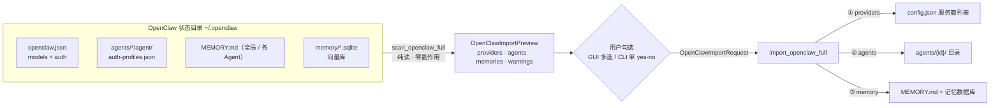
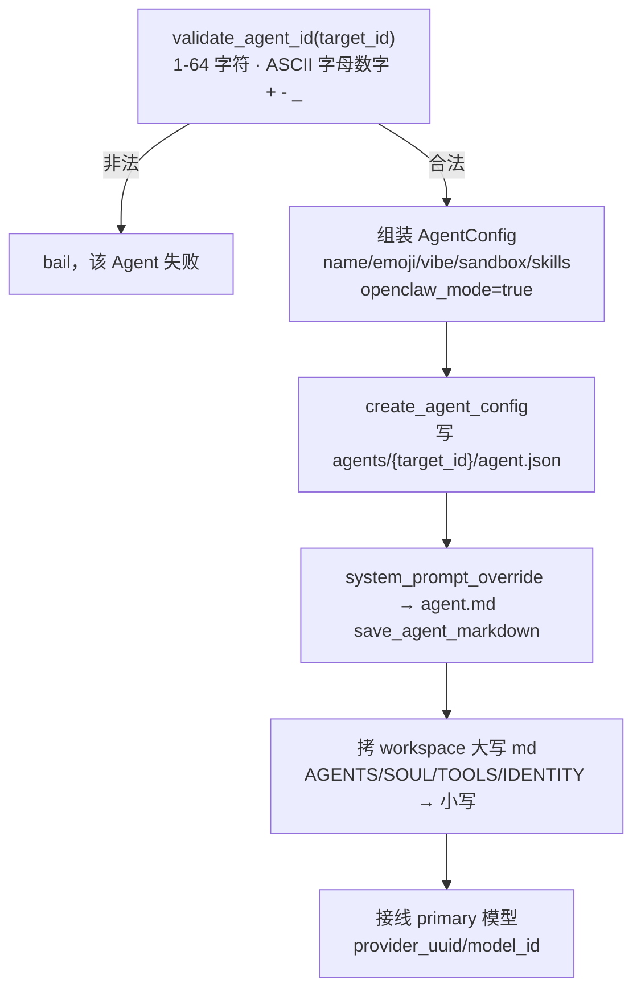
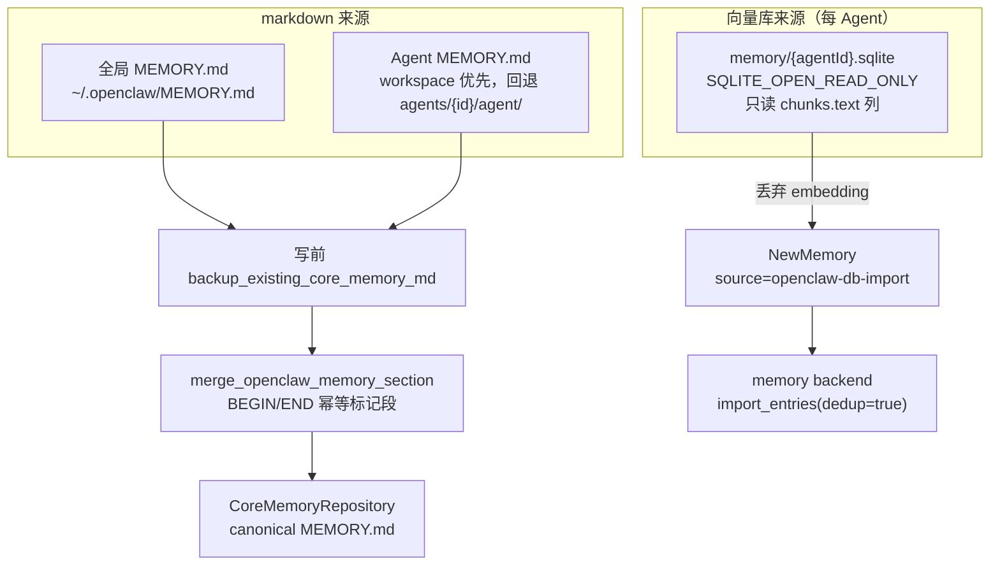
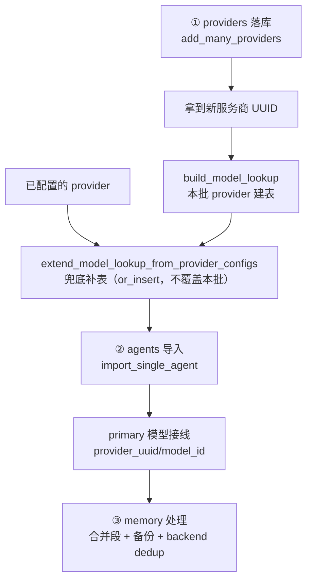

# OpenClaw 导入

> 返回 [文档索引](../../README.md) | 关联源码：[`crates/ha-core/src/openclaw_import/`](../../../crates/ha-core/src/openclaw_import/)、Tauri 命令在 [`src-tauri/src/commands/agent_mgmt.rs`](../../../src-tauri/src/commands/agent_mgmt.rs)、HTTP 路由在 [`crates/ha-server/src/routes/agents.rs`](../../../crates/ha-server/src/routes/agents.rs)、前端 `OpenClawImportDialog` 在 [`src/components/settings/`](../../../src/components/settings/)、CLI 接入在 onboarding 步骤（见 [`cli.md`](../system/cli.md)）

## 这个子系统解决什么问题

OpenClaw（前身 clawdbot）是另一款本地 AI 助手，很多用户在迁移到 Hope Agent 时希望把已有的 **服务商 / Agent / 记忆** 一次性搬过来，而不是逐项手工重配。OpenClaw 导入就是这条搬家通道。

关键设计取向只有一句话：**一次性迁移，不是持续同步**。它扫一次源目录、导一次，导完两边就各走各的——不监听源目录变化、不做增量回写、不建立双向链接。这让整个子系统可以彻底无状态：没有 watcher、没有 diff、没有游标，每次扫描都是从磁盘重新读一遍。

围绕这个取向，导入被拆成三段互相独立的动作：

- **扫描预览**（`scan_openclaw_full`）——把源目录里的服务商、Agent、记忆库存一次性读出来，返回一份 `OpenClawImportPreview`。**纯读、零副作用**，可以随便重复调用。
- **用户勾选**（`OpenClawImportRequest`）——预览摆在用户面前，由用户决定导哪些服务商、哪些 Agent、要不要带记忆。子系统本身不替用户做取舍。
- **应用导入**（`import_openclaw_full`）——按勾选载荷落库，顺序硬约束 **服务商 → Agent → 记忆**（原因见下文「导入顺序」）。

业务逻辑全在 `crates/ha-core/src/openclaw_import/`（零 Tauri 依赖），Tauri 命令与 HTTP 路由只是薄壳转发。

**两套入口能力不对等**：桌面 GUI 是多选粒度（逐服务商、逐 Agent、逐类记忆分别勾选），CLI onboarding 只给一个 yes/no（全导或全不导，详见 [`cli.md`](../system/cli.md)）。

**迁移范围**：记忆同时覆盖 markdown 条目与 SQLite 向量库的 chunk 文本，但**向量本身（embedding）一律丢弃**——OpenClaw 与 Hope Agent 的 embedding 模型 / 维度 / 签名契约不同，向量无法复用，只能拿文本重新入库（见「安全红线」）。

## 模块结构

| 模块 | 职责 |
|---|---|
| `mod.rs` | 子系统根：四个公开入口（`scan_openclaw_full` / `import_openclaw_full` + legacy shim `scan_openclaw_agents` / `import_openclaw_agents`）、记忆写入编排（合并段 `merge_openclaw_memory_section`、写前备份 `backup_existing_core_memory_md`、核心 repository 落盘）、顶层 UI 数据结构（`OpenClawImportPreview` / `OpenClawImportRequest` / `OpenClawImportSummary` / `MemoryPreview`） |
| `paths.rs` | 路径与目录发现：状态目录解析 `resolve_openclaw_state_dir`、配置文件解析 `resolve_openclaw_config_path`、默认工作区 `default_workspace`、每 Agent 目录 `agent_dir` / `auth_profiles_path`、`expand_tilde` |
| `providers.rs` | 服务商映射核心：`build_providers` / `collect_credentials` / `map_api_type`；预览与待写入结构（`ProviderPreview` / `ProviderProfilePreview` / `ResolvedProvider` / `CredentialKind`）；OpenClaw 配置反序列化（`OpenClawConfigRoot` / `AuthProfilesFile` / `AuthCredentialEntry` / `SecretRef`） |
| `agents.rs` | Agent 映射：`build_previews` / `import_single_agent` / `build_model_lookup` / `extend_model_lookup_from_provider_configs`；OpenClaw agent 反序列化（`OpenClawAgent` / `OpenClawAgentModel`）与预览 / 请求 / 结果（`OpenClawAgentPreview` / `ImportAgentRequest` / `ImportResult` / `ProviderForModel`） |
| `memory.rs` | 记忆解析：`parse_openclaw_memory_md`（MEMORY.md → `NewMemory`）、`parse_openclaw_sqlite_memory_db`（向量库 chunk 文本，只读）、路径发现与条目计数 |

## 状态目录与配置发现

`resolve_openclaw_state_dir`（在 `paths.rs`，经 `mod.rs` re-export 供测试 / 诊断调用）是「OpenClaw 装在哪」的唯一裁决，按四级优先级回退：

1. 环境变量 `OPENCLAW_STATE_DIR`（测试与高级用户覆盖，支持 `~` 展开）
2. `~/.openclaw/`——**当且仅当**目录里存在 `openclaw.json` 或 `clawdbot.json`
3. `~/.clawdbot/`（改名前的旧路径）——同样须含上述任一配置文件
4. 兜底：即使什么都不存在，也返回 canonical 的 `~/.openclaw/`

第 4 级是关键设计：即便 OpenClaw 根本没装，`resolve_*` 也**不报错**，而是返回一个确定的路径。真正的「未检测到」判定推迟到读配置那一步——`read_root_config` 读不到配置文件时返回 `Ok(None)`，`scan_openclaw_full` 据此返回 `state_dir_present=false` 的空预览（依旧零副作用）。这样调用方拿到的是一份结构完整、可直接渲染「未检测到 OpenClaw」分支的预览，而不是一串错误字符串。

配置文件本身由 `resolve_openclaw_config_path` 解析：优先 `openclaw.json`，仅当它不存在时才回退旧名 `clawdbot.json`。反序列化成 `OpenClawConfigRoot`，只有 `models` 与 `auth` 两块。

> legacy shim `scan_openclaw_agents` 是唯一例外：目录不存在时它不返回空预览，而是直接 `bail`（因为旧接口约定返回的是纯 agent 列表，没有 `state_dir_present` 这个信号位可用）。

## Provider 映射

`build_providers` 是服务商映射的核心：输入 raw `OpenClawConfigRoot` 加上收集到的凭据，输出 `(ProviderPreview, ResolvedProvider)` 列表——预览给 UI 看，`ResolvedProvider` 是待落库的成品。

### API 类型映射

`map_api_type`（`pub`，单测覆盖）把 OpenClaw 的 `ModelApi` 字符串翻成 Hope Agent 的 [`ApiType`](../core/provider-system.md)。Hope Agent 只有四种 `ApiType`（`Anthropic` / `OpenaiChat` / `OpenaiResponses` / `Codex`），凡不能精确对应的一律落到 `OpenaiChat`（OpenAI Chat-Completions 方言，兼容大多数自建网关）并附带一条警告：

| OpenClaw `api` | → Hope Agent `ApiType` | 警告 |
|---|---|---|
| `anthropic-messages` | `Anthropic` | 无 |
| `openai-responses` / `azure-openai-responses` | `OpenaiResponses` | 无 |
| `openai-codex-responses` | `OpenaiResponses` | 有（见下方红线） |
| `openai-completions` | `OpenaiChat` | 无 |
| `ollama` | `OpenaiChat` | 有（自动开私网） |
| `github-copilot` / `google-generative-ai` / `bedrock-converse-stream` | `OpenaiChat` | 有（协议不同，可能需手动调整） |
| 空串 / 其他未识别 | `OpenaiChat` | 有（已默认到兼容路径） |

**关键红线**：`openai-codex-responses` 必须映射成 `OpenaiResponses`，**绝不能**映射成 `ApiType::Codex`——后者是 Hope Agent 内置的 OAuth-only 服务商，映射过去会让用户从 OpenClaw 带来的外部 API key 直接失效。

### 成本、私网与模型字段

- **成本归一化**：OpenClaw 与 Hope Agent 的成本口径都是「每百万 token 美元」。个别旧配置误存成「每 token」，`normalize_costs` 用启发式补救——当 input 与 output **都** > 0 且 **都** < 0.01 时判为 per-token，× 1e6 拉回 per-million。源里**没给** cost 的模型保留 `None`（表示「未标价」而非「免费」，让大盘回退到估算表）。
- **私网放行**：`base_url` 命中私网特征（`localhost` / `127.0.0.1` / `0.0.0.0`）时自动置 `allow_private_network=true`，Ollama 等本地后端才能连通。
- **模型缺省**：模型未标 `contextWindow` / `maxTokens` 时分别缺省为 200000 / 8192；`input` 只保留 `text` / `image`，为空时兜底为 `text`。

### Provider 写入 contract

服务商落库经 [`provider/crud.rs`](../../../crates/ha-core/src/provider/crud.rs) 的 `add_many_providers`，`source="openclaw-import"`——它内部走 `mutate_config(("providers.add", …))`，遵守 [provider 写入 contract](../core/provider-system.md)，绝不直接 `providers.push`。

## 凭据收集与导入策略

`collect_credentials` 遍历状态目录下**每一个** `agents/*/agent/auth-profiles.json`（不限于本次要导的 Agent，因为某服务商的凭据可能落在任意 Agent 的 profile 里），按 `(provider, profileId)` 联合去重——同一凭据出现在多个 Agent 目录时收拢成一条，优先保留**第一条含可用明文密钥**的（`api_key` 带非空 `key`，或 `token` 带非空 `token`）。

每份凭据按 `CredentialKind` 分类，决定是否写进新 `ProviderConfig` 的 `auth_profiles`：

| keyRef 类型 | 处理 | `will_import` |
|---|---|---|
| `api_key` / `token`（明文） | 直接导入 | ✓ |
| `env` keyRef | 经 `std::env::var` 解析；解析到非空值才导入 | 视解析结果 |
| `OAuth` | **永不导入**，强制用户在 Hope Agent 重新登录 | ✗ |
| `exec` keyRef | **出于安全拒绝**（不执行外部命令取密钥） | ✗ |
| `file` keyRef | **不支持**（Hope Agent 导入不读外部文件密钥） | ✗ |
| 未知 type | 跳过并 push 警告 | ✗ |

OAuth / exec / file 三类都会在 `ProviderProfilePreview.note` 给出提示，要求用户导入后手动粘贴 key 或重新登录。

此外，OpenClaw 顶层 `models.providers[k].apiKey`（如果是明文字符串）会被当成一份**额外的默认 profile**（label 形如 `{key} default`，`ApiKeyPlain`，`will_import=true`）拼到该服务商的 profile 列表里——OpenClaw 把「服务商级默认 key」和「每 Agent profile key」视为等价，导入沿用这一语义。

## Agent 导入

`build_previews` 把 `agents.list` 转成 `OpenClawAgentPreview` 列表，用 `agent_loader::list_agent_ids` 标 `already_exists`——已存在**不阻止**导入，但前端 / CLI 默认过滤掉，避免误覆盖。

`import_single_agent` 写单个 Agent，步骤如下：

几个要点：

1. **`target_id` 校验**走 `crate::paths::validate_agent_id`——须为 1–64 个字符、只含 ASCII 字母数字与 `-` / `_`，否则 `bail`。这是所有面向用户本人的读写删路径共用的 fail-closed 闸门，不依赖前端校验。
2. **写 agent.json** 经 `agent_loader::create_agent_config`（不是普通的 `save_agent_config`）——`create_*` 是「显式创建」路径，允许复用同一进程内早前删除过的 id，适配「删了再导入」的场景。落盘位置 `~/.hope-agent/agents/{target_id}/agent.json`。
3. **`system_prompt_override`** 若存在，经 `save_agent_markdown` 写成该 Agent 的 `agent.md`。
4. **拷贝 workspace markdown**：把 Agent workspace 下的大写文件名映射成小写拷入新 Agent 目录——`AGENTS.md→agents.md`、`SOUL.md→soul.md`、`TOOLS.md→tools.md`、`IDENTITY.md→identity.md`。空文件跳过。
5. **接线 primary 模型**：从 `model_id → provider` 查找表把 primary 模型 id 解析成 Hope Agent 的 `{provider_uuid}/{model_id}` 格式挂上；查不到则留空并 push 警告。
6. **`openclaw_mode=true`** 写进 agent.json，让 [`system_prompt`](../core/prompt-system.md)::build 走四文件 markdown prompt 模式。

**workspace 是哪个目录**：Agent 若在 `agent.workspace` 显式指定（支持 `~` 展开）就用它，否则回退到状态目录下的默认 `~/.openclaw/workspace/`——不是固定的 `agents/{id}/workspace/`。

### 模型查找表：防止部分导入重复服务商

primary 模型接线依赖一张 `model_id → provider_uuid` 查找表，分两步建：

- `build_model_lookup` 先用**本批刚导入**的服务商建表（同一 model id 撞多个 provider 时，先导入者胜）。
- `extend_model_lookup_from_provider_configs` 再用**已配置**的服务商兜底补充（`or_insert`，不覆盖本批条目）。

第二步的意义：用户若早前已经配过同一服务商，Agent 的模型接线应当**复用现有服务商**，而不是又新建一份重复的——这让「先导服务商、隔一会儿再导 Agent」这类分步操作不会产生重复服务商。

**工具开关不导入**：OpenClaw 的 tools allow/deny 设置**不迁移**，仅 push 一条警告，让用户回 Hope Agent 手动核对工具开关。

## Memory 导入

记忆由 caller（`import_openclaw_full`）在 Agent 之后统一处理，有两条来源、两条落地路径：

**markdown 走「合并进原文」而非「逐条插库」**。导入路径把 MEMORY.md 的**整段原文**经 `CoreMemoryRepository` 合并进 Hope Agent 的 canonical `MEMORY.md`（合并 + 备份细节见下）。`parse_openclaw_memory_md`（bullet 或段落各成一条、跳过 heading、`source="import"`）**只**用于预览计数（`estimate_entries`），不参与实际 markdown 落盘。

**SQLite 向量库走「只导文本、丢向量」**。`parse_openclaw_sqlite_memory_db` 以 `SQLITE_OPEN_READ_ONLY` 打开 `~/.openclaw/memory/{agentId}.sqlite`，**只读 `chunks` 表的 `text` 列**（按 `updated_at ASC, id ASC` 排序、跳过空白行），逐行封成 `NewMemory`（`source="openclaw-db-import"`），最后经 memory backend 的 `import_entries(dedup=true)` 落库。**embedding 一律丢弃**——model / dimension / signature 契约与 Hope Agent 不同，无法复用，只能拿文本重嵌。SQLite 只有每 Agent 一份，全局记忆没有向量库对应物。

**记忆入选逻辑**里有一处非显然的兼容处理：待导的 Agent 记忆集合 = 用户显式勾的 `import_agent_memories` ∪ 任何 `import_files` 里夹带了 `memory.md` 的 Agent（`is_memory_markdown_file`）——后者容忍旧版 / 陈旧前端载荷把 `memory.md` 混进 Agent 文件清单。但 Agent 导入失败时会跳过它的记忆并 warn。

### 核心 MEMORY.md 合并

无论全局还是 Agent 记忆，markdown 都经统一的 `CoreMemoryRepository` 写入，并遵守同一套安全约束：

- **幂等标记段**：`merge_openclaw_memory_section` 把导入内容包进 `<!-- BEGIN OPENCLAW MEMORY IMPORT -->` / `<!-- END OPENCLAW MEMORY IMPORT -->` 之间。重复导入只替换标记段内内容，不会无限堆叠。
- **写前备份**：合并前先 `backup_existing_core_memory_md`，把现有 `MEMORY.md` 复制到 `~/.hope-agent/backups/openclaw-memory-import/<UTC 时间戳>/<相对路径>`。
- **绝不裸覆盖**用户现有 `MEMORY.md`——只在标记段内增补。
- **空内容不写**：`trim` 后为空则直接返回，不写盘、不计数。

## 导入顺序（硬约束）

`import_openclaw_full` 的顺序固定为 **服务商 → Agent → 记忆**，不可重排：

依赖链很直接：Agent 的 primary 模型接线需要**本批服务商的 UUID**，所以服务商必须先落库；记忆不依赖前两者，排最后。

## 数据结构参考

### 预览侧（scan 返回）

- **`OpenClawImportPreview`** — `scan_openclaw_full` 的完整返回：`state_dir` 路径、`state_dir_present` 标记、`providers` / `agents` / `memories` 三类库存、`warnings`。
- **`ProviderPreview`** — 单服务商预览：`source_key` / `suggested_name` / `api_type` / `base_url` / `model_count` / `profiles` / `name_conflicts_existing`（与现有 config 重名）/ `api_type_warning`。
- **`ProviderProfilePreview`** — 单凭据 profile 预览：`source_profile_id` / `label` / `credential_kind` / `email` / `will_import`（OAuth / file / exec 恒 false）/ `note`。
- **`CredentialKind`** — 凭据分类枚举：`ApiKeyPlain` / `ApiKeyEnvRef` / `OAuth` / `Token` / `Missing`。
- **`OpenClawAgentPreview`** — 单 Agent 预览：`id` / `name` / `emoji` / `theme` / `avatar` / `model_info` / `has_system_prompt` / `sandbox` / `skill_names` / `available_files`（workspace markdown 清单）/ `already_exists`（经 `agent_loader::list_agent_ids` 标记）。
- **`MemoryPreview`** — 记忆清单：`global_md_present` + `agent_md_counts`（每 Agent 的可导入条目估算，**合并** markdown 估算条目数与 SQLite chunk 行数，仅列出计数 > 0 的 Agent）。

### 请求侧（用户勾选）

- **`OpenClawImportRequest`** — 顶层勾选载荷：`import_provider_keys`（选中的 `ProviderPreview.source_key`）/ `import_agents`（逐 Agent 的 `ImportAgentRequest` 列表）/ `import_global_memory` / `import_agent_memories`（按 `target_id` 选的 Agent 记忆）。
- **`ImportAgentRequest`** — 单 Agent 导入参数：`source_id` / `target_id` / `name` / `emoji` / `vibe` / `sandbox` / `import_files`。

### 结果侧（import 返回）

- **`OpenClawImportSummary`** — 导入汇总：`providers_added`（新服务商的 UUID 列表）/ `agents`（逐 `ImportResult`）/ `memories_added` 计数 / `warnings`。
- **`ImportResult`** — 单 Agent 结果：`source_id` / `imported_id` / `name` / `success` / `error`。

### 内部「待写入」结构

- **`ResolvedProvider`** — `build_providers` 算出的待落库服务商：`source_key` + 完整 `ProviderConfig` + `model_ids`（供 Agent 模型接线查找）。
- **`ProviderForModel`** — 查找表条目，`model_id → provider_uuid`，给 Agent 的 primary 模型接线用。

### OpenClaw 源反序列化（deserialize-only）

- **`OpenClawConfigRoot`** — `openclaw.json` 根：`models`（含 `providers`）+ `auth`。
- **`AuthProfilesFile` / `AuthCredentialEntry` / `SecretRef`** — 每 Agent `auth-profiles.json` 凭据结构；凭据 `type` 字段兼容旧别名 `mode`；`SecretRef`（`{source, id}`）表达 `env` / `file` / `exec` 三种 keyRef 引用。
- **`OpenClawAgent`** — `agents.list` 单条：`id` / `name` / `workspace` / `system_prompt_override` / `model` / `identity` / `skills` / `tools` / `sandbox` / `params` 等。
- **`OpenClawAgentModel`** — 自定义 `Deserialize`，兼容 `model` 既可是裸字符串、也可是 `{ primary }` 对象（空串归一为 `None`）。

## 去重与冲突处理

| 冲突 | 处理 |
|---|---|
| 服务商名与现有 config 重名 | 加 `" (Imported)"` / `" (Imported N)"` 后缀，`name_conflicts_existing=true` |
| Agent `target_id` 已存在 | `already_exists=true`，不阻止导入但前端 / CLI 默认过滤 |
| source Agent 找不到 | 该 Agent 失败（`ImportResult.success=false` + `error`），整体继续 |
| 同一 model id 出现在多个服务商 | 经查找表仲裁（本批先导入者胜），已配服务商兜底防部分导入重复 |
| 同一凭据出现在多个 Agent 目录 | `collect_credentials` 按 `(provider, profileId)` 去重，保留首条可用明文 |
| 记忆重复 | 交给 backend `import_entries(dedup=true)`，重复跳过转 warning |

## 对外接口面

| 平面 | 入口 |
|---|---|
| Tauri 命令 | `scan_openclaw_agents`（legacy）/ `import_openclaw_agents`（legacy）/ `scan_openclaw_full` / `import_openclaw_full` |
| HTTP 路由 | `GET /api/agents/openclaw/scan`（legacy）/ `POST /api/agents/openclaw/import`（legacy）/ `GET /api/agents/openclaw/scan-full` / `POST /api/agents/openclaw/import-full` |
| 前端 | `OpenClawImportDialog`（多选粒度勾选） |
| CLI | onboarding 步骤「import-openclaw」（单条 yes/no 全导或全不导；排在 mode 步骤**之前**，故不受 remote 模式短路影响，详见 [`cli.md`](../system/cli.md)） |

四条 Tauri ↔ HTTP 对齐行登记在 [`api-reference.md`](../system/api-reference.md)。

**legacy shim**（`scan_openclaw_agents` / `import_openclaw_agents`）只覆盖 Agent——`scan` 仅返回 full scan 的 agents 部分，`import` 仅导 agents（不含服务商 / 记忆），为旧入口保留兼容。

## 事件

导入完成后的事件由 full-import 薄壳（Tauri 命令 `import_openclaw_full` 与 HTTP 路由 `import_openclaw_full`）**显式**发出，legacy agents-only shim 不发：

| 事件 | 触发条件 |
|---|---|
| `agents:changed` | 至少成功导入 1 个 Agent（`{kind:"imported", count}`），让前端刷新 Agent 列表 |
| `config:changed` | 至少新增 1 个服务商（`{category:"providers", source:"openclaw-import"}`），提示前端刷新 config |

此外服务商写入本身走 `mutate_config`，会经 config 系统触发 autosave 与其自有的变更通知（见 [config 写入 contract](config-system.md)）；薄壳发的 `config:changed` 是给 UI 的额外刷新信号。

## 持久化

### 读取源（OpenClaw）

| 路径 | 内容 |
|---|---|
| `~/.openclaw/openclaw.json`（旧 `~/.clawdbot/clawdbot.json` 回退） | 主配置：`models` + `auth` |
| `~/.openclaw/agents/{agentId}/agent/auth-profiles.json` | 每 Agent 凭据 |
| `~/.openclaw/agents/{agentId}/agent/MEMORY.md`（含小写 `memory.md`） | Agent 记忆 markdown（**回退项**，workspace 无 MEMORY 时才用） |
| Agent workspace（`agent.workspace` 覆盖或默认 `~/.openclaw/workspace/`）下 `MEMORY.md` / `memory.md` | Agent 记忆 markdown（**优先**） |
| `~/.openclaw/MEMORY.md` | 全局记忆 |
| `~/.openclaw/memory/{agentId}.sqlite` | 向量库，仅读 `chunks.text` 列，`SQLITE_OPEN_READ_ONLY`，丢弃 embedding |
| Agent workspace 下 `AGENTS.md` / `SOUL.md` / `TOOLS.md` / `IDENTITY.md` | Agent markdown，大写 → 小写映射拷贝 |

### 写入目标（Hope Agent）

| 目标 | 经手 |
|---|---|
| 服务商列表 → `config.json` | `provider::add_many_providers`（`source="openclaw-import"`） |
| `~/.hope-agent/agents/{target_id}/agent.json` | `agent_loader::create_agent_config` |
| 对应 `.md`（`system_prompt_override → agent.md`、workspace 大写 md → 小写） | `agent_loader::save_agent_markdown` |
| 全局记忆 → `memory/MEMORY.md` | 统一 repository + 合并段 + 写前备份 |
| Agent 记忆 → `agents/{id}/memory/MEMORY.md` | 统一 repository + 合并段 + 写前备份 |
| SQLite chunk 文本 → 记忆数据库 | memory backend `import_entries(dedup=true)`（`source="openclaw-db-import"`） |
| `~/.hope-agent/backups/openclaw-memory-import/<UTC 时间戳>/<相对路径>` | `backup_existing_core_memory_md` |

`AgentConfig.openclaw_mode=true` 写入 agent.json，影响 [`system_prompt`](../core/prompt-system.md)::build 走四文件 markdown prompt 模式。

**环境变量**：`OPENCLAW_STATE_DIR` 覆盖状态目录（测试 / 高级用户，支持 `~` 展开）；`env` keyRef 经 `std::env::var` 解析。

## 安全 / 红线

- **OAuth 永不导入**（`will_import=false`），强制用户在 Hope Agent 重新登录；`map_api_type` 把 `openai-codex-responses` 映射成 `OpenaiResponses` 而**非** `ApiType::Codex`（后者 OAuth-only），否则外部 API key 失效。
- **exec keyRef 拒绝**（不执行外部命令取密钥）；**file keyRef 不支持**——二者都要求用户导入后手动粘贴 key。
- **导入顺序硬约束** 服务商 → Agent → 记忆：Agent primary 模型接线依赖本批服务商 UUID，`extend_model_lookup_from_provider_configs` 用已配服务商兜底防部分导入重复。
- **MEMORY.md 写入必须经** `merge_openclaw_memory_section`（BEGIN/END 幂等标记段）+ `CoreMemoryRepository` + 写前 `backup_existing_core_memory_md`，**绝不裸覆盖**用户现有 `MEMORY.md`；空内容不写。
- **SQLite 向量库只导 chunk 文本、丢弃 embedding**（model / dimension / signature 契约不同），只读打开；workspace 下的 `MEMORY.md` 是**记忆**而非 Agent markdown，拷 workspace 文件时经 `is_memory_markdown_file` 跳过，不能当 Agent `.md` 处理。
- **`target_id` 校验**：`crate::paths::validate_agent_id`——1–64 字符、仅 ASCII 字母数字与 `-` / `_`，否则 `bail`；source Agent 找不到则该 Agent 失败但整体继续。
- **服务商名冲突** 加 `" (Imported)"` / `" (Imported N)"` 后缀，`name_conflicts_existing=true`；Agent `already_exists` 不阻止导入但默认过滤。
- **记忆 dedup 交给 backend** `import_entries(dedup=true)`，`skipped_duplicate` / `failed` / `errors` 转 warnings；backend 未初始化则跳过记忆导入并 warn。
- **私网 base_url** 自动置 `allow_private_network=true`；成本疑似 per-token（input 与 output 都 > 0 且 < 0.01）× 1e6 归一化 per-million，未标价保 `None`。
- **工具 allow/deny 不导入**，仅 push 警告让用户手动核对 Hope Agent 工具开关。

## 已知限制

- **legacy agents-only 入口**（`scan_openclaw_agents` / `import_openclaw_agents`）只迁 Agent，不含服务商 / 记忆，为旧入口兼容保留。
- **OAuth 重登**：OAuth 服务商导入后需用户在 Hope Agent 重新登录。
- **file / exec keyRef 手填**：这两类 keyRef 不自动解析，需用户导入后手动粘贴 key。
- **一次性、无回写**：导入后源目录变更不会同步，需重跑导入。

## 跨子系统

| 子系统 | 关系 |
|---|---|
| [Provider](../core/provider-system.md) | 服务商写入经 `add_many_providers`；`ApiType` 映射；私网 / 成本归一化 |
| [Agent 解析链](../core/agent-config.md) | Agent 经 `agent_loader::create_agent_config` 落库；`openclaw_mode` 影响 prompt 构建 |
| [Memory](../core/memory.md) | 记忆经 backend `import_entries(dedup=true)`；丢弃 embedding |
| [Prompt System](../core/prompt-system.md) | `openclaw_mode=true` 走四文件 markdown prompt 模式 |
| [Config](config-system.md) | 服务商写入经 `mutate_config` + autosave（`source="openclaw-import"`） |
| [CLI](../system/cli.md) | onboarding 步骤「import-openclaw」单 yes/no；排在 mode 步骤之前，remote 短路只跳后续 provider / server 等步骤、不跳本步 |

## 关键文件索引

| 文件 | 角色 |
|---|---|
| [`crates/ha-core/src/openclaw_import/mod.rs`](../../../crates/ha-core/src/openclaw_import/mod.rs) | 子系统根 + 四入口 + 记忆写入编排（合并段 / 备份 / repository）+ 顶层数据结构 |
| [`crates/ha-core/src/openclaw_import/paths.rs`](../../../crates/ha-core/src/openclaw_import/paths.rs) | 状态目录 / 配置 / workspace / Agent 目录解析 |
| [`crates/ha-core/src/openclaw_import/providers.rs`](../../../crates/ha-core/src/openclaw_import/providers.rs) | 服务商映射 + 凭据收集 + `map_api_type` + 反序列化结构 |
| [`crates/ha-core/src/openclaw_import/agents.rs`](../../../crates/ha-core/src/openclaw_import/agents.rs) | Agent 映射 + 单 Agent 导入 + 模型查找表 |
| [`crates/ha-core/src/openclaw_import/memory.rs`](../../../crates/ha-core/src/openclaw_import/memory.rs) | MEMORY.md 解析 + SQLite chunk 文本只读导入 |
