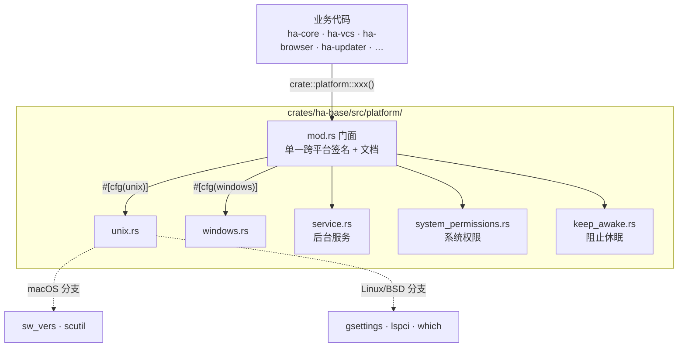
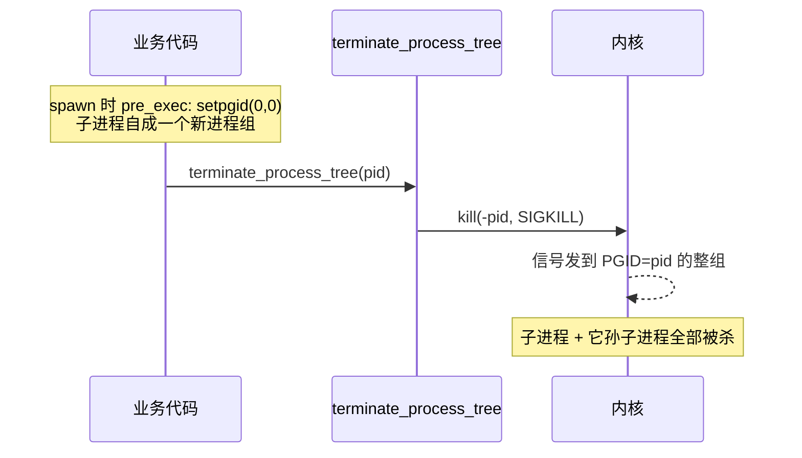
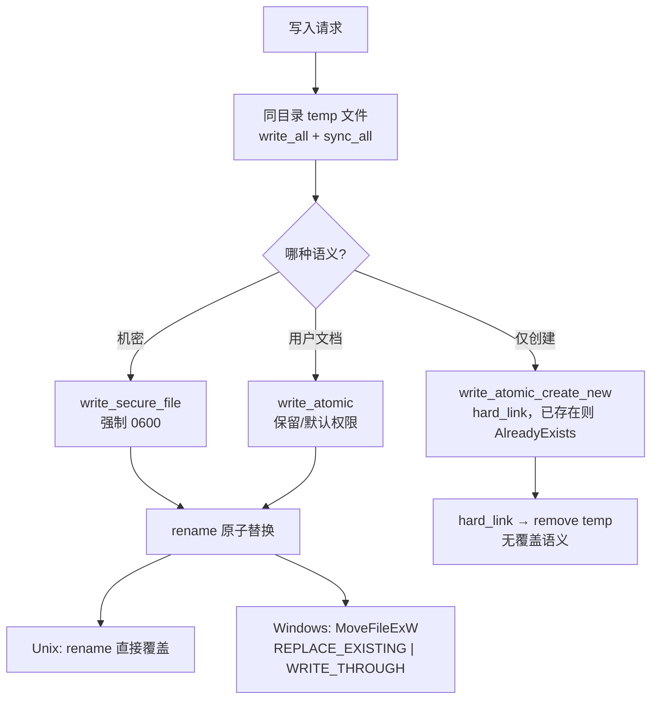

# 跨平台抽象层（Platform）

> 返回 [文档索引](../../README.md) | 关联：[安全子系统](security.md) · [MCP 客户端](../integration/mcp.md) · [进程与并发模型](../system/process-model.md)

## 这个子系统解决什么问题

同一段业务逻辑，在 macOS、Linux、Windows 上底层做法往往完全不同：杀进程树、原子写文件、探测系统代理、隐藏控制台窗口……如果任由这些差异散落到业务代码里，就会长出成百上千个 `#[cfg(target_os = "…")]` 分支——每加一个平台就得回去补一遍，漏一处就是一类只在某个 OS 上复现的诡异回归。

`platform/` 把所有"在不同 OS 上行为不同"的原语收敛成**一个门面**：门面对外只暴露**一套跨平台签名**，编译期按 `#[cfg]` 把调用 route 到对应实现。业务代码只写 `crate::platform::xxx()`，永远不知道、也不需要知道背后是哪个 impl 在跑。它落在最底层的基础设施 crate `ha-base`（零 Tauri 依赖），因为几乎每个上层 crate 都要用到它。

核心想法一句话：**平台差异是实现细节，不是业务代码要操心的事**——把差异关进一个盒子，盒子外面所有人看到的都是同一副面孔。

## 门面结构

```
crates/ha-base/src/platform/
├── mod.rs                  门面：每个原语一个 pub fn，一份跨平台 doc，按 cfg 分发
├── unix.rs                 Unix 实现（macOS + Linux + BSD 共享）
├── windows.rs              Windows 实现
├── service.rs              子领域：用户级后台服务（launchd / systemd / Task Scheduler）
├── system_permissions.rs   子领域：系统权限（macOS TCC）
└── keep_awake.rs           子领域：阻止系统休眠
```



较大的 OS 领域（后台服务、系统权限、休眠）拆成子模块，各自在内部按 `#[cfg]` 分平台，对外仍从门面统一进入。`unix.rs` 内部再按 `#[cfg(target_os = "macos")]` 细分 macOS 与其他 Unix——macOS 的 `sw_vers` / `scutil` 和 Linux 的 `gsettings` / `lspci` / `which` 都在这个文件里走不同分支。落在别处的原生工具各归各的子模块：CoreLocation 转派 `weather_location_macos`，`caffeinate` 在 `keep_awake`，`systemd` / `systemctl` 在 `service`，TCC 在 `system_permissions`。

## 硬规则

- **新增跨平台原语一律放 `platform/`**，不要在业务代码里散落 `#[cfg(target_os = "…")]` / `#[cfg(unix)]` / `#[cfg(windows)]`。
- **优先 `#[cfg(unix)]` / `#[cfg(windows)]`，而不是 `target_os = "linux"`**——macOS + Linux + 各 BSD 共享 Unix 路径，少写一次 cfg 就少一类回归。真正只在某个 OS 生效的分支（如 macOS 的 `sw_vers`）才在 impl 内部收窄。
- **调用方一律走 `crate::platform::xxx()` 单一入口**（或历史兼容 wrapper，如 `service_install.rs`）。
- **签名跨平台严格对齐**：返回值类型、参数顺序保持一致，让调用方完全感知不到是哪个 impl 在执行。连 Unix 上的 no-op（如 `hide_console`）也保留 `&mut` 签名，只为镜像 Windows 版。

## 能力清单

门面 `mod.rs` 暴露的原语按用途分组如下。同名函数在两端语义相同、签名一致，差别只在实现。

### 进程生命周期

| 入口 | Unix | Windows |
|---|---|---|
| `terminate_process_tree(pid)` | `kill(-pid, SIGKILL)` 把信号发到整个**进程组**——要求子进程 spawn 时已 `setpgid(0,0)`（见下文） | `taskkill /F /T /PID` 沿 job tree 强杀 |
| `send_graceful_stop(pid)` | `kill(pid, SIGTERM)`——注意是 **pid 不是 -pid**，只停单个进程、不动整组 | `taskkill /PID`（无 `/F`，发 WM_CLOSE / CTRL_BREAK） |
| `pid_alive(pid) -> bool` | `sysinfo` 查该 pid 是否仍存活（Linux 读 `/proc`，macOS `proc_pidinfo`，Windows `Process32First`）。用于识别持有者崩溃后残留的锁文件——误判只会导致"多一次手工清理"，无破坏性 | 同左 |

### 进程创建与控制台

| 入口 | Unix | Windows |
|---|---|---|
| `default_shell_command(cmdline)` → `std::process::Command` | `sh -c "<cmdline>"` | `cmd /C <cmdline>`，用 `raw_arg` 跳过 std 自动加引号、保留 `/C` 后整段命令的原始语义；并带 `CREATE_NO_WINDOW` |
| `default_shell_command_tokio(cmdline)` | 同上，返回 `tokio::process::Command` | 同上，异步版 |
| `hide_console(&mut Command)` | no-op（Unix 无控制台窗口概念） | 设 `CREATE_NO_WINDOW`（0x0800_0000），抑制 spawn 控制台子进程时一闪而过的 `cmd`/`conhost` 窗口，管道输出不受影响 |
| `hide_console_tokio(&mut tokio::process::Command)` | no-op | 同上，异步 spawn 站点用 |

### 原子与安全落盘

写机密和写用户文档共用同一套"同目录 temp → fsync → 原子发布"骨架（Unix `rename`、Windows `MoveFileExW`），差别只在权限语义、发布原语与 durability barrier。配置持久化还必须区分"尚未发布"和"已经发布但 durability barrier 失败"，不能把两者压成同一个 `io::Error`。

| 入口 | 语义 |
|---|---|
| `write_secure_file_outcome(path, bytes) -> SecureWriteOutcome` | **机密专用、结果可判阶段**：写完强制 0600（Unix `chmod` 二次收紧，不受 umask 影响；Windows 依赖用户目录的 NTFS DACL 继承），返回 `Durable` / `PublishedButNotDurable` / `NotPublished`。配置等不能安全重试已发布 mutation 的调用方必须走此入口 |
| `write_secure_file(path, bytes)` | 兼容入口，沿用 `io::Result<()>`；只有 `Durable` 返回 `Ok(())`，其余两态都映射为 `Err`。调用方若需要判断文件是否已经替换，禁止使用这个兼容入口 |
| `ensure_credential_directory(path)` | 应用拥有的凭据叶目录：拒绝符号链接/非目录；Unix 通过不跟随链接的目录句柄收紧至 `0700`；Windows 拒绝重解析点，依赖继承 DACL，不声明专属 ACL 或完整祖先路径竞争防御 |
| `copy_secure_file_atomic(source, target)` | **机密流式快照**：把无界 source 复制到 target 的 credential-grade sibling temp，`fsync` 后原子替换；保持常量内存并清理失败 temp。用于 config/user autosave |
| `write_atomic(path, bytes)` | **用户文档专用**（知识库笔记等）：目标已存在则**保留其现有权限**，否则用常规默认（Unix 0644）。不强制 0600 |
| `write_atomic_create_new(path, bytes)` | 原子**创建**，目标已存在则返回 `AlreadyExists`。两端都用 `hard_link` 做 no-clobber 发布（`std::fs::rename` 在 Windows 会替换已存在目标，不能用） |
| `move_file_atomic(source, target)` | **同文件系统、跨目录 no-clobber 移动**：目标已存在即失败；Unix 成功前 fsync 两侧父目录。用于把含凭据的损坏备份原子移入 quarantine |
| `open_file_beneath(root, relative)` | 从已授权绝对 root 安全打开一个 regular file 并返回同一读取 handle；逐组件拒 symlink/reparse 与 `..`，路径竞态只允许 fail closed。Unix 用 rooted `openat`，Windows 持有禁 delete-share 的 drive/UNC→root→relative-parent handle 链 |
| `remove_file_beneath(root, relative)` | `open_file_beneath` 的删除对偶：只移除 root 下精确 final directory entry，不跟随 symlink/reparse ancestor；用于 backend-owned ledger cleanup，禁止业务层先 canonicalize 再裸 `remove_file` |
| `publish_atomic_file(src, dst, overwrite)` | 把已写好的兄弟 staging 文件发布到 `dst`，不再二次缓冲。Windows `overwrite=true` 走 `MoveFileExW(REPLACE_EXISTING|WRITE_THROUGH)` |
| `publish_dir_atomic(src, dst)` | 发布整个已备好的兄弟目录，要求同父且 `dst` 不存在。Unix 用 `renamex_np(RENAME_EXCL)` / `renameat2(RENAME_NOREPLACE)` 做原子 no-clobber |
| `is_cross_device_rename(err) -> bool` | 判断 rename 失败是否因跨文件系统（Unix `EXDEV`=18，Windows `ERROR_NOT_SAME_DEVICE`=17）。新 Rust 也认 `ErrorKind::CrossesDevices` |
| `atomic_replace_binary(target, source)` | 热替换正在运行的可执行文件（自升级用）。见下文原理 |

### 单实例锁

| 入口 | Unix | Windows |
|---|---|---|
| `try_acquire_exclusive_lock(path) -> io::Result<Option<File>>` | 在 `O_CLOEXEC` 打开的文件上 `flock(LOCK_EX\|LOCK_NB)`，`fork` 子进程不继承锁 fd；`Ok(None)` 表示已被他人持有 | `share_mode(FILE_SHARE_READ)` + `FILE_FLAG_NO_INHERIT_HANDLE` 做内核级独占（仅挡其他**写者**，放行同进程只读诊断），`ERROR_SHARING_VIOLATION` 映射为 `Ok(None)` |

进程退出（正常、panic、SIGKILL、断电）时 OS 自动释放锁，无需清理。用于选举全局唯一 Primary。

### 系统探测

| 入口 | 说明 |
|---|---|
| `detect_system_proxy() -> Option<String>` | 进程级 `OnceLock` 缓存。Unix：先 env（`HTTPS_PROXY`/`HTTP_PROXY`/`ALL_PROXY` 及小写）→ macOS `scutil --proxy` → GNOME `gsettings` → KDE `kreadconfig6`/`kreadconfig5`。Windows：读注册表 `Internet Settings` 的 `ProxyEnable`+`ProxyServer`，解析 `http=…;https=…` 协议列表（优先 https），返回如 `"http://127.0.0.1:1082"` |
| `current_location() -> Option<(f64,f64)>` | macOS 走 CoreLocation；其他平台返回 `None`，业务层降级到 IP 定位 |
| `os_version_string() -> String` | macOS 优先 `sw_vers -productVersion` → `"macOS 14.2.1"`，失败回落 sysinfo；Windows 用 sysinfo `long_os_version()`+`kernel_version()` → `"Windows 11 (26100)"`；永不失败，最坏回落到占位串（Unix `unknown` / Windows `Windows (unknown build)`） |
| `detect_dedicated_gpu() -> Option<DetectedGpu>` | 两端都**先试 `nvidia-smi`** 拿权威 VRAM；失败时 macOS 返回 `None`（统一内存由 RAM 兜底），Linux 解析 `lspci -mm` 的 VGA/3D 行只回名字、VRAM 留空，Windows 回落 PowerShell `Win32_VideoController` |
| `find_chrome_executable() -> Option<PathBuf>` | macOS 探测 `.app` bundle（Chrome / Chromium / Edge / Brave），Linux `which` 常见 binary 名；Windows 用 `%ProgramFiles%` / `%ProgramFiles(x86)%` / `%LOCALAPPDATA%` × 各浏览器安装子路径 |
| `chrome_already_running() -> bool` | Unix `pgrep -f`，Windows `tasklist /FI`；探测器缺失或报错一律 `false`（调用方当提示不当门禁） |
| `pdfium_library_candidates() -> &[&str]` | PDF 渲染 fallback 的动态库候选：macOS Homebrew/`/usr/local` dylib、其他 Unix `.so`、Windows `pdfium.dll` |

> `find_chrome_executable` 在 Unix 上会**主动**逐个探测已知浏览器路径，作为 `chromiumoxide` 自带 `which` 查找的安全网——后者可能漏掉非默认安装位置。

### WSL（仅 Windows 有真实实现）

| 入口 | 说明 |
|---|---|
| `wsl_status() -> WslStatus` | 探测 `wsl.exe --status`（runtime 是否可用）与 `--exec true`（默认发行版能否执行命令）；非 Windows 恒 `{false,false}` |
| `wsl_command() -> Option<tokio::process::Command>` | 构建隐藏窗口的 `wsl.exe` 命令；非 Windows 返回 `None` |
| `path_to_wsl(path) -> io::Result<Option<String>>` | 把 Windows 路径经 `wslpath` 转成 WSL 内 Linux 路径，并 `readlink -f` 解析 Linux 侧 symlink（供调用方套用 mount 黑名单前先规范化）；非 Windows 返回 `Ok(None)` |

### 系统权限 / 后台服务 / 休眠 / 加固

| 入口 | 说明 |
|---|---|
| `system_permissions_*`（`check_item` / `request_item` / `raw_probe` / `supports_reset` / `reset_item` / `supported` / `platform_name`，均 `pub(crate)`） | 支撑权限目录：macOS 走 TCC / framework 原生检查与授权触发，`reset_item` 用 `tccutil`（仅打包 app）；非 macOS 明确 unsupported |
| `service::{install_service, uninstall_service, service_status, stop_server, legacy_service_uses_cli_api_key, rewrite_service_without_cli_api_key}` | 用户级后台服务：macOS 写 LaunchAgent plist 经 `launchctl`；Linux 写 user systemd unit 经 `systemctl --user`；Windows 经 Task Scheduler 建/删/查 per-user 登录任务。`stop_server` 读 `server.pid` 后 Unix `kill -TERM`、Windows 走 `send_graceful_stop` |
| `keep_awake::apply(enabled)` | 阻止系统 idle 休眠。见下文原理 |
| `prevent_process_dumping() -> io::Result<()>` | Linux `prctl(PR_SET_DUMPABLE, 0)` 阻止同 UID 进程 attach/dump 本进程（真实模型评测服务在内存中持有 Provider 凭据时的加固）；非 Linux no-op |
| `redirect_updater_tmpdir_if_cross_volume() -> UpdaterTmpdir` | macOS 桌面更新器跨卷 `EXDEV` 规避。见下文原理 |

## 原理详解

### 进程组 kill：为什么必须 `setpgid`

`terminate_process_tree` 在 Unix 上发的是 `kill(-pid, SIGKILL)`。`kill(2)` 看到**负数** pid 时把信号发到对应的**进程组**（PGID），从而一次带走子进程 spawn 出来的整棵树。



**陷阱**：子进程默认继承父进程的 PGID。如果 spawn 时没调 `setpgid(0,0)` 把它挪进新组，那么 `kill(-pid)` 里的 `pid` 就落回父进程所在的组——等于**把自己也杀了**。所以凡是创建长跑子进程、且指望被进程树 kill 收尾的入口（`tools/exec.rs`、`hooks/runner/command.rs` 用 `process_group(0)`，`acp_control/runtime_stdio.rs` 在 `pre_exec` 里 `setpgid`），都必须在 spawn 站点建立独立进程组。新增此类路径必须沿用同一约定。

`send_graceful_stop` 反过来只对单个 pid 发 SIGTERM、**不带组**，专门给"我自己 supervise 的 child、组级停由我另外控制"的场景。

### 原子落盘：三种语义为什么分家



三者共享"temp + fsync + 原子发布"骨架，保证任何时刻路径上要么是完整旧文件、要么是完整新文件，**永不出现半截文件**。分家的原因是权限与覆盖语义不同：

- **`write_secure_file`** 服务机密。Unix 在 rename 前额外 `set_permissions(0o600)` 一次——`OpenOptions::mode(0o600)` 的初始位会被 umask 干扰，这一步等于"无论 umask 多宽都强制 0600"。
- **`write_atomic`** 服务用户文档（知识库笔记）。它读目标现有权限并沿用，新文件才落 0644——一篇被用户手动 `chmod 600` 的笔记，重写后不会被悄悄放宽。
- **`write_atomic_create_new`** 要"创建但绝不覆盖"。`std::fs::rename` 在 Windows 会替换已存在目标，达不到 no-clobber，所以两端都改用 `hard_link`：它要么给已 fsync 的 temp inode 加一个目标名，要么因该名已存在而失败（Windows 上把 `ERROR_FILE_EXISTS`/`ERROR_ALREADY_EXISTS` 归一成 `AlreadyExists`）。

`SecureWriteOutcome` 钉住发布边界，调用方必须按以下语义处理：

- **`Durable`**：完整 temp 已 fsync、目标路径已被原子替换，平台要求的发布后 durability barrier 也成功；调用方可以把它当作完整持久化成功。
- **`PublishedButNotDurable(error)`**：目标路径已经指向完整新文件，但发布后的 durability barrier 失败。Unix 的典型情形是 `rename` 成功而父目录 `fsync` 失败；此时不能回滚成"未执行"，也不能向上返回普通失败诱导调用方重跑有副作用的 mutation。
- **`NotPublished(error)`**：失败发生在发布前或原子发布本身失败，目标路径没有被本次调用替换；只有这一态可按普通未提交失败处理。

Unix 在 `rename` 后 fsync 父目录，因此能把后置 barrier 失败精确表达为 `PublishedButNotDurable`。Windows 不再采用"先删目标、再 rename"的两步方案，而是对 sibling temp 单次调用 `MoveFileExW(REPLACE_EXISTING | WRITE_THROUGH)`；调用成功为 `Durable`，写 temp 或该发布调用失败均为 `NotPublished`，当前没有发布后才失败的独立步骤。

### 二进制热替换：Unix 换 inode，Windows 挪一边

`atomic_replace_binary` 要在**进程还在跑**的情况下把 `hope-agent` 换成新下载的版本，供自升级用。两端策略截然不同：

- **Unix 宽容**：`rename(2)` 改的是目录项、不动底层 inode。正在执行旧镜像的进程通过打开的 inode 继续跑到退出为止；新镜像对未来的 `exec(2)`（片刻后 `systemctl --user restart` / `launchctl kickstart -k` 会做）可见。跨卷 `EXDEV` 时回落"复制到目标目录兄弟 temp → fsync → rename"，保住 swap 本身的原子性。换前 `chmod 0755` 保证即使解压时丢了可执行位也能跑。
- **Windows 严格**：正在执行的镜像被独占句柄锁住，不能 `DeleteFile` 或就地覆盖，但**可以 rename**。于是快路径直接 `MoveFileExW(REPLACE_EXISTING|WRITE_THROUGH)` 覆盖；若目标在用（`ERROR_SHARING_VIOLATION`/`ERROR_ACCESS_DENIED`），改走"把在用镜像挪到 `.old` → 新镜像移入正位 → `.old` 标记 `DELAY_UNTIL_REBOOT` 下次开机删"。中途发布失败会把 `.old` 回滚，绝不给用户留一个既无 `.old` 又无正位 binary 的空洞。

### 隐藏控制台窗口（Windows `CREATE_NO_WINDOW`）

Windows 上用 `Command` spawn 一个**控制台子系统**程序（`git` / `docker` / `node` / `cmd` / `hostname` …）时，即使把 stdout/stderr 重定向走，系统仍会为它**短暂闪出一个 `cmd`/`conhost` 窗口**。在每轮对话都跑 git/hostname 探测的桌面 GUI 上，表现为"发消息时黑窗一闪、还抢输入焦点"。`CREATE_NO_WINDOW` 让子进程不分配控制台窗口，但保留管道，捕获输出照常。

约定：**任何在 Windows 上可能创建进程、且在正常使用路径上会跑的 `Command`，都必须经 `hide_console` / `hide_console_tokio`**（或本就带 flag 的 `default_shell_command*` / 内部 `run_hidden`）。`hide_console` 对**找不到程序而返回 `Err` 的调用是零成本 no-op**，所以判定**就低不就高**——只要程序名有可能在某些 Windows 环境解析出真进程，就加。

**真正无需加**的只有两类：

1. 被非 Windows cfg（`#[cfg(unix)]` / `#[cfg(target_os="macos")]`）包住、根本不在 Windows 编译的站点（unix 专属的 `sh` / `pgrep` / `scutil` / `sw_vers` / `launchctl`）。
2. 程序名是 macOS/Linux 独有、Windows 任何常见环境都不会有的 binary（`scutil` / `osascript` / `gsettings` / `defaults` …，`Command::new` 直接 `Err`）。

> ⚠️ 不要把 `uname` / `date` / `hostname` 当成"Windows 上不存在"——**Git-for-Windows / MSYS2 / Cygwin / scoop coreutils 都带 `uname.exe` / `date.exe` / `hostname.exe`**（`hostname` 更是 System32 自带）。默认原生 PATH 通常解析不到 `uname`/`date`（落 fallback），但只要应用从 Git Bash 启动、或 PATH 上有 `Git\usr\bin`/MSYS2，就会真 spawn 闪窗。这类"可能解析"的站点（`system_prompt/helpers.rs` 的 `hostname`/`uname`/`date`，每轮系统提示构建都跑）一律加——加了没坏处，不加就是偶发闪窗。

**例外（有意不加）**：

- `guardian.rs` 重启自身 binary——前台 `hope-agent server start` 时子进程需继承父控制台输出，加 flag 会吞掉用户期望看到的日志；桌面 GUI 是 `windows_subsystem=windows` 本就无控制台，与闪窗无关。
- `tools/exec.rs` 的 PTY 路径走 `portable-pty` 的 ConPTY，伪控制台不弹可见窗口，且 `CommandBuilder` 不暴露 `creation_flags` 钩子。

### 系统代理缓存

`detect_system_proxy` 两端都用 `OnceLock<Option<String>>` 进程级缓存。`provider/proxy.rs` / `docker/proxy.rs` 等每次构建 reqwest client 都会调一次，winreg / `scutil` / `gsettings` / `kreadconfig` 都不该在 hot path 上重复探测。

代价：用户运行时改了系统代理，需重启 Hope Agent 才生效。这是有意取舍——系统代理变更属罕见配置事件，比每次重读系统配置划算。

### `os_version_string` 的 macOS 兜底

`sysinfo::long_os_version()` 在 macOS 上给出的字符串不统一（`"MacOS"` / `"Mac OS X"` / `"macOS"` 之类都可能出现），且常落后真实小版本号。所以 macOS 分支**优先** `sw_vers -productVersion` 拿权威小版本，失败才 fallback 到 sysinfo。Linux 直接 sysinfo，发行版差异由它自己处理。

### keep_awake：断电也不会永久卡住唤醒

`keep_awake::apply(enabled)` 让主机在用户开启对应设置时不进入 idle 休眠，且**幂等**——已在目标状态时是廉价 no-op，可在启动和每次配置变更时无脑调。关键设计是**每种后端都绑到本进程生命周期**，崩溃或硬退出绝不会把 assertion 永久留住（否则主机再也睡不着）：

- **macOS**：`caffeinate -i -w <pid>` 持一个 idle-sleep 电源 assertion，本进程 pid 一死它自退。`-i` 只抑制**系统** idle 休眠，显示器仍可睡。
- **Linux/BSD**：`systemd-inhibit --what=sleep:idle … tail --pid=<pid> -f /dev/null` 持 logind inhibitor 锁，被包裹的 `tail` 在本进程 pid 死时退出、释放锁。缺 `systemd-inhibit` 的主机 no-op（记日志）。
- **Windows**：专用线程调 `SetThreadExecutionState(ES_CONTINUOUS|ES_SYSTEM_REQUIRED)`。该 flag 进程绑定（退出自动清除）且线程亲和，所以 park 住线程、release 时清除并返回。

### macOS 更新器跨卷 `EXDEV` 规避

`tauri-plugin-updater` 把新 `.app` 暂存到默认 temp 目录，再 `rename(2)` 把当前 bundle 挪到备份、把新 bundle 移入正位。当 app 与 temp 目录**不在同一卷**（外接盘 / 副卷）时，第一次 rename 就返回 `EXDEV`（"Cross-device link"）导致更新中止——该插件在 macOS 上把非 `PermissionDenied` 的 rename 错误一律当致命，没有同卷重试。

`redirect_updater_tmpdir_if_cross_volume` 在启动时抢先：当 bundle 所在卷与 temp 卷不同，把 `tempfile` crate 的默认 temp 目录指到 bundle 自己卷上的目录，让插件两次 rename 都留在同卷内。它**只覆盖 `tempfile` 的进程内默认，不动 `$TMPDIR`**，所以子进程（exec / hooks / MCP，会继承甚至白名单 `$TMPDIR`）仍用系统 temp。桌面从 `src-tauri/src/lib.rs` 启动时调用一次；对开机卷上的常见情形（同卷）是 no-op。

## 调用方采样

| 入口 | 主要 caller |
|---|---|
| `terminate_process_tree` | `tools/exec.rs`（超时/取消强杀）、`tools/process.rs`（强杀工具子进程）、`hooks/runner/command.rs`、`async_jobs/mod.rs`、`runtime_tasks.rs` |
| `send_graceful_stop` | `channel/process_manager.rs`（IM 渠道进程优雅退出，ha-channel）、`acp_control/runtime_stdio.rs`（ACP runtime 关闭，ha-acp）、`platform/service.rs`（`stop_server` 的 Windows 分支） |
| `pid_alive` | `browser/singleton_lock.rs`（识别残留 SingletonLock，ha-browser）、`async_jobs/mod.rs`、`workflow/db.rs` |
| `detect_system_proxy` | `provider/proxy.rs`（LLM 出站代理）、`docker/proxy.rs`（Docker 容器代理注入，ha-vcs） |
| `current_location` | `ha-weather`（天气自动定位：系统精确定位失败后降级 IP 定位） |
| `os_version_string` | `agent/errors.rs`（错误报告 / 诊断上下文） |
| `pdfium_library_candidates` | `file_extract.rs`（PDF 渲染 fallback 动态库查找） |
| `system_permissions_*` | `permissions.rs`（系统权限目录的 OS 原生检查 / 请求入口，ha-base） |
| `service::{…}` | `service_install.rs`（保持历史 public API，CLI / updater / Tauri 从该 wrapper 进入系统服务管理，ha-base） |
| `default_shell_command_tokio` | `tools/exec.rs`（工具 shell 命令执行） |
| `hide_console` / `hide_console_tokio` | 所有在 Windows 会真实建进程的 `Command`：git 探测（`filesystem/git.rs` / `session/environment.rs` / `plan/git.rs`）、`hostname`/`uname`/`date`（`system_prompt/helpers.rs`）、docker（ha-vcs 经 `docker_command()` 统一）、MCP stdio（`transport.rs`，ha-mcp）、ACP backend（ha-acp）、IM sidecar（`channel/process_manager.rs`）、Chrome（`browser/spawn.rs`）、`gh` / ollama / skill 安装 / hooks shell / 自升级冷烟自检 等 |
| `write_secure_file_outcome` / `write_secure_file` | 前者供主 LLM OAuth 与配置持久化（`config/persistence.rs`、`user_config.rs`）区分已发布与未发布；后者供只接受完整 durable success 的兼容调用方。覆盖 MCP OAuth 凭据（`credentials.rs`，ha-mcp）、Server 鉴权（`server_auth.rs`）、外部 Memory Provider 凭据、备份、issue 上报、权限 allowlist、浏览器扩展 broker（ha-browser）、IM 渠道启动状态（ha-channel）、设计部署凭据（ha-design）。OAuth 同步验证凭据目录，异步调用经阻塞池 |
| `write_atomic` | 用户文档：知识库笔记（`knowledge/source.rs`，ha-knowledge）、设计产物 / 头像（ha-design / ha-server）、agent 生命周期文件等 |
| `atomic_replace_binary` / `is_cross_device_rename` | `ha-updater`（自升级二进制热替换）；`is_cross_device_rename` 另用于 `channel/worker/media.rs` |
| `try_acquire_exclusive_lock` | `runtime_lock.rs`（全局单实例守门：桌面 / `server` / `acp` 三模式共用一把锁，ha-base）、Memory 核心仓库、`git_control.rs`（ha-vcs）、Pet store（ha-pet） |
| `find_chrome_executable` | `browser/spawn.rs` / `browser/user_attach.rs`（ha-browser）、`design/render_native.rs`（ha-design） |
| `chrome_already_running` | Browser「接管用户 Chrome」设置路径，弹"将另起独立 Chrome"确认 |
| `detect_dedicated_gpu` | `local_llm`（选模型预算：优先 dGPU VRAM 的 60%，探测失败回落系统内存 60%，`RECOMMENDATION_BUDGET_PERCENT=60`，ha-local-llm） |
| `keep_awake::apply` | `app_init.rs`（`spawn_keep_awake_listener`，仅 Primary 进程驱动） |
| `prevent_process_dumping` | `hope-agent` server 二进制启动（真实模型评测服务持凭据加固） |
| `wsl_status` / `wsl_command` / `path_to_wsl` | `sandbox.rs`（Windows 上经 WSL 执行沙箱命令，ha-vcs） |
| `redirect_updater_tmpdir_if_cross_volume` | `src-tauri/src/lib.rs`（桌面启动时一次性调用） |

## 已知缺口（技术债）

- **主 LLM OAuth 旧缺口已关闭（2026-08-31）**：`save_token` 已迁至安全目录与分阶段原子写，不能再当作未实现事项重复立项；Windows 权限边界仍见下一项。
- **Windows 显式 DACL**：`write_secure_file_outcome` / `write_secure_file` 在 Windows 仅依赖用户 profile 目录的 NTFS DACL 继承（`~/.hope-agent/` 默认只 owner + SYSTEM/Administrators 可读），**当前实现不会清除继承 ACE，也不会显式重建一份 owner-only DACL**。同进程的低权限子进程理论上能读凭据。当前威胁模型可接受（本机 trust）；需要"零本地信任"姿态时再加显式 DACL pass，结果三态与调用签名无需改变。
- **`detect_system_proxy` 运行时不刷新**：进程级缓存意味着运行时改系统代理需重启应用。若未来加"代理变更感知"，应给所有平台加同一个缓存失效机制，保持入口语义跨平台一致。

## 关键源文件

| 文件 | 职责 |
|---|---|
| [`crates/ha-base/src/platform/mod.rs`](../../../crates/ha-base/src/platform/mod.rs) | 门面：每个原语的 `pub fn` 入口 + 跨平台 doc，编译期按 `#[cfg(unix)]` / `#[cfg(windows)]` route 到对应 impl；`detect_dedicated_gpu` 的 nvidia-smi 前置层与 macOS 更新器跨卷逻辑也在此 |
| [`crates/ha-base/src/platform/unix.rs`](../../../crates/ha-base/src/platform/unix.rs) | Unix 实现：`libc::kill` / `sh -c` / `write_replace`（0600·mode 保留、rename 后父目录 fsync、三态 outcome）/ `sw_vers` 兜底 / `flock` / `renameat2`·`renamex_np` / `lspci` / `which` |
| [`crates/ha-base/src/platform/windows.rs`](../../../crates/ha-base/src/platform/windows.rs) | Windows 实现：`taskkill` / `cmd /C raw_arg` + `CREATE_NO_WINDOW` / NTFS DACL 继承 / winreg 读 Internet Settings + `OnceLock` 缓存 / `MoveFileExW(REPLACE_EXISTING | WRITE_THROUGH)` 原子替换与二进制热替换 / WSL / `%ProgramFiles%` 扫浏览器 |
| [`crates/ha-base/src/platform/service.rs`](../../../crates/ha-base/src/platform/service.rs) | 用户级后台服务：macOS LaunchAgent / Linux user systemd / Windows Task Scheduler；[`service_install.rs`](../../../crates/ha-base/src/service_install.rs) 只保留兼容 wrapper |
| [`crates/ha-base/src/platform/system_permissions.rs`](../../../crates/ha-base/src/platform/system_permissions.rs) | 系统权限 OS 实现：macOS TCC / framework 检查与 prompt、`tccutil` 重置；非 macOS 明确 unsupported |
| [`crates/ha-base/src/platform/keep_awake.rs`](../../../crates/ha-base/src/platform/keep_awake.rs) | 阻止系统休眠：`caffeinate` / `systemd-inhibit` / `SetThreadExecutionState`，均绑进程生命周期 |
| [`crates/ha-base/src/runtime_lock.rs`](../../../crates/ha-base/src/runtime_lock.rs) | 全局单实例守门，`try_acquire_exclusive_lock` 的主消费者 |
| [`crates/ha-core/tests/platform_contracts.rs`](../../../crates/ha-core/tests/platform_contracts.rs) | 跨平台原语契约测试：原子写 / create-new / 独占锁 / 二进制热替换 / 跨设备错误识别 |
