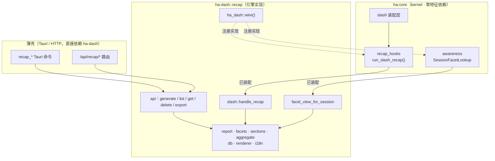
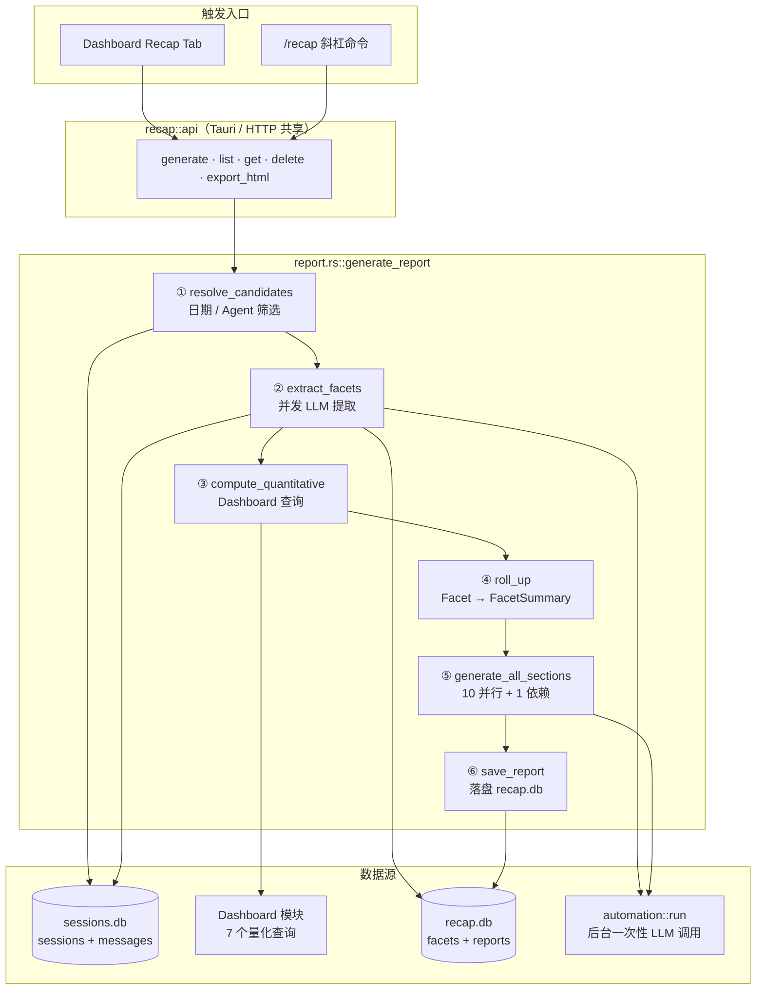
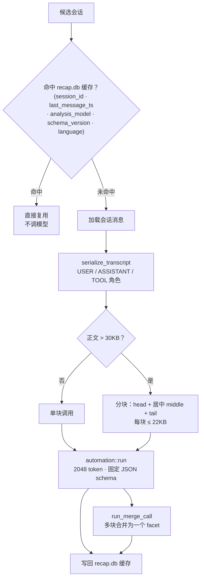
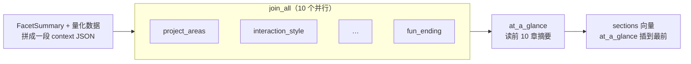
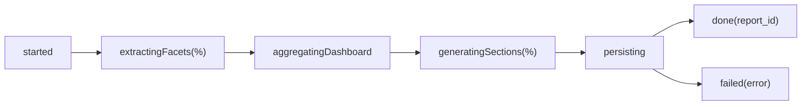

# Recap 深度复盘架构

> 返回 [文档索引](../../README.md) | 更新时间：2026-07-23

## 核心思想

大多数「使用报告」只会给你一堆数字——多少个会话、花了多少钱、调了几次工具。数字能说明「发生了多少」，却答不出「你到底在做什么、哪些顺、哪些卡、下一步该怎么改进」。这些答案藏在对话正文里，只有语言模型读得懂。

Recap 的做法是把两条线拧成一份报告：

- **量化线**：直接复用 Dashboard 的现成查询，拿到 KPI、健康度、成本趋势、活跃热力图等硬指标。
- **语义线**：对每个会话跑一次 LLM，抽取结构化「facet」——底层目标、成果、满意度、六类摩擦、亮点、反复出现的用户指令。

两条线汇聚后，再让模型生成十来个教练式章节（你在做什么、什么最有效、卡在哪、成本怎么省……），最后配一段开篇总览。整份报告可以在 Dashboard 里看，也可以导出成一个自包含的 HTML 文件分享。

围绕这个目标，有四条贯穿全模块的设计取舍：

- **缓存优先**：逐会话的 LLM 提取是整条管线最贵的一步。facet 按 `(session_id, last_message_ts, analysis_model, schema_version, language)` 缓存到独立数据库；会话没新消息、模型没换、语言没变，就直接复用旧结果，绝不重跑模型。
- **独立数据库**：facet 与报告落在 `~/.hope-agent/recap/recap.db`，和承载热路径读写的 `sessions.db` 物理隔离，报告生成期的大量落盘都进 recap.db，不占用主对话的 `sessions.db` 写连接。
- **模型解耦**：分析用哪个模型与主对话 Agent 完全独立配置，走后台自动化调用链解析（详见 [模型 vs Agent 统一配置](../core/automation-model.md)）。
- **归属特征 crate**：整套引擎住在 `ha-dash`，kernel（`ha-core`）只留两根反向调用的接线，保持「零特征依赖」。

## 系统边界与归属

Recap 引擎在 `ha-dash`，但有两条入口天然从 kernel 侧发起：聊天里的 `/recap` 斜杠命令由 kernel 的 slash 装配层分发，行为感知（behavior awareness）需要读会话 facet 做候选富化。kernel 不能反向依赖任何特征 crate，于是这两处各留一根 trampoline，实现由 `ha_dash::wire()` 在启动时注册进 kernel 的 `OnceLock`。



两根 trampoline 的**未装配语义**都是「安全降级」，不会把命令文本误当普通消息喂给模型：

| 接线 | kernel 侧符号 | ha-dash 实现 | 未装配时 |
|------|--------------|-------------|---------|
| `/recap` 分发 | `recap_hooks::run_slash_recap` | `slash::handle_recap` | 返回 `Err("recap is not available in this build")` |
| 会话 facet 查询 | `awareness::register_session_facet_lookup` | `facet_view_for_session` | 返回 `None`，调用方回退既有 preview |

行为感知只读 facet 的四个字段，经 kernel 里的窄视图 `SessionFacetView`（`brief_summary` / `underlying_goal` / `outcome` / `goal_categories`）回传，不把 `SessionFacet` 本体拖进 kernel。这条查询是尽力而为的富化：它走 `get_latest_facet` 拿最近一行，**刻意忽略缓存有效性检查**，永不触发新的 LLM 提取；打不开库或查不到就返回 `None`。

`ha_dash::wire()` 还把 facet 保留期清理注册为 `PrimaryOnly` 启动任务——多进程部署下只有 Primary 扫这张表，避免 desktop 与 server 各扫一遍。

### 模块结构

```
crates/ha-dash/src/recap/
├── mod.rs        # 模块入口；facet 保留期循环 + awareness facet 查询实现
├── api.rs        # 命令 API（Tauri / HTTP 共享），进程级 RecapDb 单例
├── report.rs     # 生成编排：RecapContext + generate_report
├── facets.rs     # 候选筛选 + 逐会话 LLM facet 提取（含分块 / 合并）
├── aggregate.rs  # Facet → FacetSummary（直方图 / Top-N）
├── sections.rs   # 10+1 个 AI 章节生成
├── i18n.rs       # 输出语言解析 + 章节标题 / 报告名本地化
├── db.rs         # SQLite 持久化（session_facets / recap_reports）
├── renderer.rs   # HTML 导出（内联 CSS，零 JS）
├── types.rs      # 类型定义与 JSON schema
└── slash.rs      # /recap 的实际 handler

crates/ha-core/src/recap_hooks.rs   # kernel 侧 /recap 分发 trampoline
```

## 生成管线总览

一份报告经过六步，全部在 `report.rs::generate_report` 里顺序编排：先抽 facet，再拉量化数据，汇总后生成章节，落盘。整条管线通过一个回调把 `RecapProgress` 事件打上 EventBus，前端凭同一个 `report_id` 订阅、实时渲染进度。



每一次 LLM 调用都走统一的后台自动化入口 `ha_core::automation::run(ModelTaskSpec)`——facet 提取、分块合并、章节生成、开篇总览各是一次独立调用，共用同一条解析出来的模型链，逐调用做真跨模型降级。

`RecapContext::from_globals` 从进程级 `OnceLock` 单例取齐依赖（`sessions.db` / 日志 DB / cron DB / recap DB），解析一次模型链与输出语言，此后贯穿整份报告。量化查询是同步的 SQLite IO，第③步放到 `spawn_blocking` 线程上跑，不阻塞异步运行时；这些查询走大盘自己的只读连接（部分指标读的是日志 DB），不与主对话争 `sessions.db`。

## Facet 提取

这是整条管线唯一的重活，也是缓存最吃紧的地方。

### 候选会话筛选（resolve_candidates）

先按模式确定时间窗，再从 `sessions.db` 列出会话并过滤：

- **窗口**：会话的 `updated_at` 落在 `[start, end]` 内。
  - `Incremental`：起点是上一份报告的 `range_end`（无历史报告则回退 `default_range_days`，默认 30 天），终点是当前时刻。
  - `Full { filters }`：起止取自调用方给的 `RecapFilters`。
- **门槛**：`message_count >= 2`，剔除空壳会话。
- **排序 + 上限**：按 `last_message_ts` 降序，截断到 `max_sessions_per_report`（默认 500）。

### 提取流程



并发度由 `facet_concurrency`（默认 4）控制，用 `futures` 的 `buffer_unordered()` 限流——借用式而非 `'static` 的 future，让每个提取任务能共享外层函数借用的模型链。单个会话提取失败只记 `warn` 并跳过，不中断整份报告。

对话序列化（`serialize_transcript`）与截断预算：

| 环节 | 规则 |
|------|------|
| 角色标注 | `USER` / `ASSISTANT` / `TOOL`；`TextBlock` 归 `ASSISTANT`，`ThinkingBlock` 与 `Event` 跳过 |
| 单条正文截断 | 每条消息内容 `truncate_utf8` 到 4KB |
| 工具结果截断 | `TOOL_RESULT` 单独截到 2KB（大输出常常淹没整段对话） |
| 分块阈值 | 全文 ≤ 30KB 单块直发；超过则分块 |
| 分块策略 | 保头 + 保尾（各 ≤ 22KB），中段只取一片居中切片；切点一律回退到 UTF-8 字符边界 |
| 每次调用预算 | 2048 token，要求模型只返回固定形状的 JSON，无解释、无代码围栏 |

提取提示词固定要求一个 JSON 对象（`underlyingGoal` / `goalCategories` / `outcome` / `userSatisfaction` / `agentHelpfulness` / `sessionType` / `frictionCounts` / `frictionDetail` / `primarySuccess` / `briefSummary` / `userInstructions`）。解析走容错路径：剥掉可能的代码围栏，逐字段安全取值，缺字段落默认值，`outcome` 未知值归 `unclear`。

### 缓存策略

缓存键：`(session_id, last_message_ts, analysis_model, schema_version, language)`——命中才复用，任一维度变化即失效重提取。

| 变化维度 | 触发原因 |
|----------|---------|
| `last_message_ts` | 会话新增消息 → 对话内容变了 |
| `analysis_model` | 换了分析模型 → 提取质量口径变了 |
| `language` | 换了输出语言 → 自然语言字段按语言独立缓存，互不覆盖 |
| `schema_version` | facet schema 升级（当前 `RECAP_SCHEMA_VERSION = 1`） |

保留期由 `cache_retention_days`（默认 180 天）控制。后台任务在启动时清一次、之后每 24 小时清一次过期 facet；`cache_retention_days = 0` 时整个循环不启动，避免一个全关的配置还留个空转的定时器。

## Facet 汇总（aggregate）

`roll_up` 把 `Vec<SessionFacet>` 压成一份紧凑的 `FacetSummary`，同时喂给 AI 章节的上下文和 HTML 渲染器：

| 维度 | 输出 |
|------|------|
| 目标分类 | Top 8 目标直方图 |
| 成果分布 | 5 级 `Outcome` 计数 |
| 会话类型 | 类型分布直方图（Top 8） |
| 摩擦来源 | 六类摩擦累加后取 Top 8 |
| 满意度 | 1–5 评分桶（按分值升序） |
| 重复指令 | 归一化小写后出现 **≥ 2 次**的指令 Top 8 |
| 亮点 / 摩擦示例 | 各最多 12 条原文 |

## AI 章节生成（sections）

十个分析章节彼此独立，全部并行生成；第十一个「一览」是总结，需要读前十章的输出，所以最后单独串行。



一个非显然的排序细节：`at_a_glance` 虽然**最后生成**，却被**插到返回向量的第 0 位**，作为整份报告的开篇总览；其余章节按固定展示顺序排在其后。

| 序号 | key | 说明 | Token 预算 |
|------|-----|------|-----------|
| 1 | `project_areas` | Top 3–5 项目领域及会话占比 | 1500 |
| 2 | `interaction_style` | 用户交互风格（节奏 / 自主度 / 模式） | 1500 |
| 3 | `what_works` | 3 个出色的工作流 / 成果 | 1500 |
| 4 | `friction_analysis` | 3 类摩擦点及示例 | 1500 |
| 5 | `agent_tool_optimization` | Agent / 工具配置建议（2–4 条） | 1500 |
| 6 | `memory_skill_recommendations` | 记忆条目 + 技能推荐 | 1500 |
| 7 | `cost_optimization` | 成本优化策略 | 1500 |
| 8 | `suggestions` | 推荐尝试的 Hope Agent 功能 | 1500 |
| 9 | `on_the_horizon` | 未来可探索的高阶工作流 | 1500 |
| 10 | `fun_ending` | 回忆亮点（含 1 个 emoji） | 1500 |
| 11 | `at_a_glance` | 开篇总览，依赖前 10 章输出 | 1200 |

每个并行章节的 LLM 上下文是同一段 `context JSON`：`FacetSummary` 全量直方图 + Dashboard 量化数据的摘要（成本趋势取近 14 个点、Top 会话取前 5、热力图只给峰值等）。单个章节失败时用占位文本 `_Section unavailable._` 兜底，不让一处报错拖垮整份报告。

## 量化数据（QuantitativeStats）

第③步复用 Dashboard 的七个查询，直接组装成 `QuantitativeStats`——不重造统计逻辑：

| 查询 | 数据 |
|------|------|
| `query_overview_with_delta` | 同环比 KPI（会话 / 消息 / 工具调用 / 错误 / 成本 / Token） |
| `query_health_score` | 四维加权健康度 0–100 |
| `query_cost_trend` | 日度费用累计 + 峰值 / 日均 |
| `query_activity_heatmap` | 7×24 活跃度网格 |
| `query_hourly_distribution` | 0–23 时消息分布 + 峰值时段 |
| `query_top_sessions` | 按 Token 消耗的 Top 10 会话 |
| `query_model_efficiency` | 每模型 tokens/msg、cost/1k、TTFT |

## 输出语言（i18n）

一份报告的语言要前后一致：facet 的自然语言字段、章节正文、章节标题、报告名，得是同一种语言，且导出的 HTML 与 Dashboard 视图看到的一致。

**语言解析**（`effective_recap_locale` → `i18n::effective_locale`）逐级回落，空 / `"auto"` 落到下一级：

```
config.recap.language（显式）
  → AppConfig.language（界面语言）
    → 系统 locale（detect_system_locale）
```

结果经大小写不敏感归一化到 12 种支持语言（`SUPPORTED_LOCALES = [zh, zh-TW, en, ja, ko, es, pt, ru, ar, tr, vi, ms]`，英文固定在索引 2）；不支持的显式偏好落英文，避免发出「用英文写」却实际混语的自相矛盾指令。

该 locale 一路透传，各处的处理刻意不同：

- **facet 提取**（`facet_language_directive`）：自然语言字段（`underlyingGoal` / `frictionDetail` / `primarySuccess` / `briefSummary` / `userInstructions`）用目标语言；`outcome` / `sessionType` / `goalCategories` 等枚举与全部 JSON key 保持英文，稳住聚合直方图。
- **章节正文**（`section_language_directive`）：正文 / 标题 / 列表标签用目标语言；代码标识符 / 模型名 / 路径 / 斜杠命令（如 `/remember`）保持原样。
- **章节标题 / 报告名**（`localized_section_title` / `report_title`）：后端 12 语言翻译表，写入持久化报告作为**语言快照**——旧报告不回溯改写。`SUPPORTED_LOCALES` 定义列序，`locale_index` 与每行标题表严格对齐，单测逐列锚定防止错位。

设置入口：「设置 → 复盘」语言选择器（GUI）+ `ha-settings` 的 `recap.language`（默认跟随界面语言）。

## 持久化（db）

独立文件 `~/.hope-agent/recap/recap.db`（WAL 模式，5 秒 busy timeout），facet 与报告都落在这里，和 `sessions.db` 分开。进程内经 `api::recap_db()` 的 `OnceLock` 复用同一把连接，首次访问才建表。

### session_facets

| 列 | 类型 | 说明 |
|------|------|------|
| `session_id` | TEXT | 会话 ID（复合主键之一） |
| `language` | TEXT | 输出语言 code（复合主键之一；默认 `''`） |
| `last_message_ts` | TEXT | 最后消息时间戳（缓存键） |
| `message_count` | INTEGER | 消息数 |
| `analysis_model` | TEXT | 分析模型（缓存键） |
| `facet_json` | TEXT | SessionFacet JSON |
| `created_at` | TEXT | 创建时间（保留期清理依据） |
| `schema_version` | INTEGER | Schema 版本（当前 1） |

主键 `(session_id, language)`；索引 `idx_facets_ts` on `last_message_ts`。`language` 列是纯可重建缓存的增量演进：缺该列的旧表在开库时直接 `DROP` 重建，不做数据迁移。`get_latest_facet`（awareness 富化用）按 `last_message_ts DESC, created_at DESC` 取最近一行，保证多语言并存时选择确定。

### recap_reports

| 列 | 类型 | 说明 |
|------|------|------|
| `id` | TEXT PK | 报告 ID（UUID v4） |
| `title` | TEXT | 报告标题（语言快照） |
| `range_start` / `range_end` | TEXT | 时间范围 |
| `filters_json` | TEXT | 筛选条件 JSON |
| `report_json` | TEXT | 完整 RecapReport JSON |
| `html_path` | TEXT | 导出 HTML 路径（未导出为 NULL） |
| `session_count` | INTEGER | 涵盖会话数 |
| `generated_at` | TEXT | 生成时间 |
| `analysis_model` | TEXT | 分析模型标签 |
| `schema_version` | INTEGER | Schema 版本（当前 1） |

索引 `idx_reports_generated` on `generated_at DESC`。导出的 HTML 默认落在 `~/.hope-agent/reports/`。

## 核心类型

### GenerateMode

```rust
enum GenerateMode {
    Incremental,                        // 从上次报告 range_end 起，无历史则回退 default_range_days
    Full { filters: RecapFilters },     // 完整筛选（日期 / Agent / Provider / Model / …）
}
```

`RecapFilters` 复用 Dashboard 的 `DashboardFilter` 形状。

### SessionFacet

逐会话 LLM 提取结果：

| 字段 | 类型 | 说明 |
|------|------|------|
| `session_id` | `String` | 会话 ID |
| `underlying_goal` | `String` | 用户底层目标 |
| `goal_categories` | `Vec<String>` | 目标分类标签 |
| `outcome` | `Outcome` | `fully_achieved` / `mostly_achieved` / `partial` / `failed` / `unclear` |
| `user_satisfaction` | `Option<u8>` | 用户满意度 1–5 |
| `agent_helpfulness` | `Option<u8>` | Agent 帮助度 1–5 |
| `session_type` | `String` | coding / research / writing / ops / qa / other |
| `friction_counts` | `FrictionCounts` | 六维摩擦计数 |
| `friction_detail` | `Vec<String>` | 摩擦点明细 |
| `primary_success` | `Option<String>` | 亮点摘要 |
| `brief_summary` | `String` | 会话简要摘要 |
| `user_instructions` | `Vec<String>` | 反复提及的风格 / 流程指令 |

### FrictionCounts

六维摩擦分类：`tool_errors`（工具执行失败）/ `misunderstanding`（模型误解意图）/ `repetition`（重复操作）/ `user_correction`（用户纠正）/ `stuck`（模型卡住）/ `other`（其他）。

### RecapReport

完整报告结构：

| 字段 | 类型 | 说明 |
|------|------|------|
| `meta` | `ReportMeta` | 报告 ID、标题、时间范围、locale、筛选、会话数、模型标签、schema 版本 |
| `quantitative` | `QuantitativeStats` | Dashboard 七项量化指标 |
| `facet_summary` | `FacetSummary` | Facet 汇总直方图 |
| `sections` | `Vec<AiSection>` | 11 个 AI 生成章节（`at_a_glance` 在最前） |

### RecapProgress

流式进度事件，前端凭 `report_id` 订阅实时展示：

| Phase | 载荷 | 说明 |
|-------|------|------|
| `started` | `report_id`, `total_sessions` | 报告生成开始 |
| `extractingFacets` | `completed`, `total` | Facet 提取中 |
| `aggregatingDashboard` | — | Dashboard 量化查询中 |
| `generatingSections` | `completed`, `total` | AI 章节生成中 |
| `persisting` | — | 落盘 recap.db |
| `done` | `report_id` | 完成 |
| `failed` | `report_id`, `message` | 失败（`/recap` 后台路径出错时发出） |

## API

命令层 `recap::api` 只吃可序列化输入、只吐可序列化结果，Tauri 与 HTTP 共用同一套实现：

| 函数 | 说明 |
|------|------|
| `generate(mode)` | 生成报告，异步流式推送进度事件 |
| `list_reports(limit)` | 列出报告摘要 |
| `get_report(id)` | 获取完整报告 |
| `delete_report(id)` | 删除报告 |
| `export_html(id, output_path?)` | 导出独立 HTML；空路径落 `~/.hope-agent/reports/` |

### Tauri 命令

| 命令 | 参数 |
|------|------|
| `recap_generate` | `mode: GenerateMode` |
| `recap_list_reports` | `limit: Option<u32>` |
| `recap_get_report` | `id: String` |
| `recap_delete_report` | `id: String` |
| `recap_export_html` | `id: String, output_path: Option<String>` |

### HTTP 路由

| 方法 | 路径 | 说明 |
|------|------|------|
| POST | `/api/recap/generate` | 生成报告 |
| POST | `/api/recap/reports` | 列出报告（body `{ limit }`） |
| GET | `/api/recap/reports/{id}` | 获取报告 |
| DELETE | `/api/recap/reports/{id}` | 删除报告 |
| POST | `/api/recap/reports/{id}/export` | 导出 HTML（body `{ output_path }`） |
| GET | `/api/config/recap` | 读取 Recap 配置 |
| PUT | `/api/config/recap` | 保存 Recap 配置 |

Tauri 命令与 HTTP 端点的增删须同步 [api-reference](../system/api-reference.md)。

## 配置

`config.json` → `recap` 字段：

```rust
pub struct RecapConfig {
    pub analysis_agent: Option<String>,      // deprecated——见下方解析优先级
    pub model_override: Option<ModelChain>,  // 分析模型链覆盖
    pub language: Option<String>,            // 输出语言（None / "auto" = 跟随界面语言）
    pub default_range_days: u32,             // 无历史报告时的默认范围（默认 30）
    pub max_sessions_per_report: u32,        // 单次报告最大会话数（默认 500）
    pub facet_concurrency: u8,               // Facet 提取并发度（默认 4）
    pub cache_retention_days: u32,           // 缓存保留天数（默认 180，0 = 禁用清理）
}
```

**分析模型解析优先级**（`resolve_recap_chain`，报告开始时解析一次）：

```
config.recap.model_override（ModelChain）
  → deprecated config.recap.analysis_agent（惰性解析成等价 ModelChain：读该 Agent 的 model.primary / fallbacks）
    → function_models.automation 全局默认链
      → 聊天全局 active_model / fallback_models
```

解析结果是一条 `Arc<Vec<ActiveModel>>`，贯穿本次报告的每一次独立 LLM 调用（facet 提取 + 章节生成）；每次调用各自经 `automation::run` 走真跨模型降级（构造失败或调用失败都 `continue` 下一候选），不共享单个 Agent 的失败状态。报告里记的 `analysis_model` 标签命名的是**整条链**（形如 `主模型 (+N fallbacks)`）——因为每个事实都可能实际由某个后备产出，只标 `chain[0]` 会声称一份链本身不保证的确定性。详见 [模型 vs Agent 统一配置](../core/automation-model.md)。

## HTML 导出（renderer）

`render_html` 生成一个自包含 HTML 文件，零外部依赖、单文件可直接分享：CSS 全内联，图表用纯 CSS/HTML div 绘制（无 SVG、无 JS）。

- **双主题**：默认深色，`@media (prefers-color-scheme: light)` 覆盖浅色，全用 CSS 变量。
- **KPI 网格**：Sessions / Messages / Tool calls / Errors / Cost / In-tokens / Out-tokens / Avg TTFT。
- **健康度**：分数 /100 + 状态徽章（excellent / good / warning / critical）。
- **AI 章节**：内置极简 Markdown 渲染（粗体 / 斜体 / 行内代码 / 列表 / 标题）。
- **Facet 分布**：目标直方图 / Outcome 分布 / 摩擦分布柱状图。
- **活跃热力图**：7×24 网格，颜色深浅映射活跃度。
- **文档语言**：`<html lang>` 跟随报告 locale，阿拉伯语补 `dir="rtl"`；方向相关样式用逻辑属性（`padding-inline-*` / `text-align: end`）。固定 chrome 文案（Generated / Sessions 等）暂仍英文。

## 前端集成

### RecapTab（`src/components/dashboard/recap/RecapTab.tsx`）

Dashboard 的 Tab 之一：

- **报告历史**：下拉选择器加载历史报告。
- **生成控制**：Incremental / 7d / 30d / 90d 范围选择。
- **实时进度**：监听 `recap_progress` 事件，展示阶段名 + 进度条。
- **报告渲染**：KPI 网格 + 健康度 + AI 章节（Markdown）+ Facet 分布图。
- **导出 / 删除**：HTML 导出、确认删除。

### 进度事件流

前端经 Transport 层（Tauri Channel / WebSocket）订阅 `recap_progress`：



## 触发方式

| 方式 | 入口 | 行为 |
|------|------|------|
| Dashboard UI | Recap Tab 按钮 | Incremental 或 Full（按日期范围） |
| 斜杠命令 | `/recap` | Incremental（默认）；`--range=<N>d` 转 Full；`--agent=<id>` 只作 Agent 过滤器，须与 `--range` 同用才生效，单独给无效；`--full` 只跳转到 Dashboard Recap Tab |
| HTML 导出 | `recap_export_html` / `POST …/export` | 基于已有报告 |

`/recap`（非 `--full`）在后台 spawn 生成，立即返回一个 `RecapCard { report_id }` 占位卡；前端订阅同一 `report_id` 的 `recap_progress` 事件，渲染流式卡片。

## 已知限制

- Cron 定时自动生成尚未接入（`RecapContext` 持有 cron DB 句柄，但量化查询当前未消费）。
- `hope-agent recap --export` CLI 子命令尚未实现。
- HTML 导出的 Markdown 渲染器为极简实现（不支持表格、引用块等）。
- 单次报告最多 500 个会话（可配置）。
