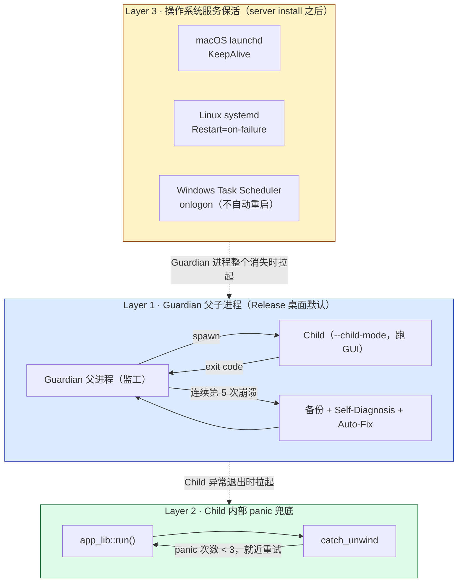
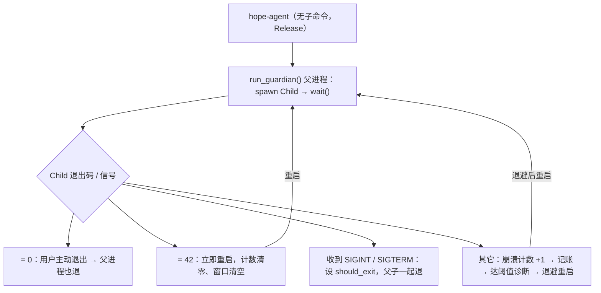
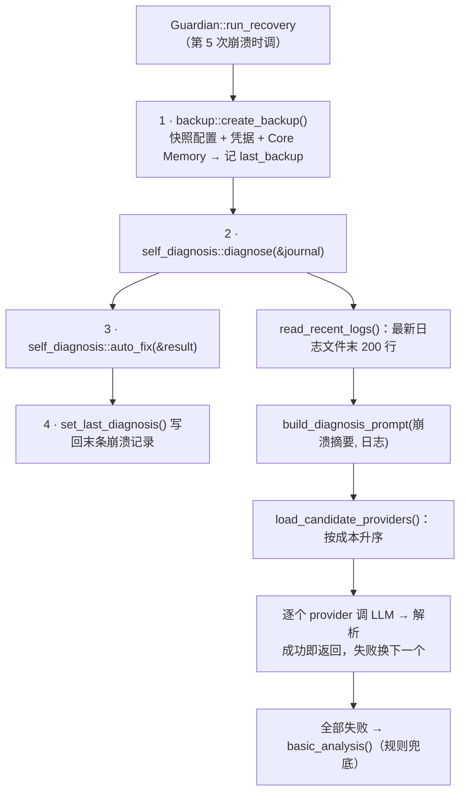

# 可靠性与崩溃自愈

> 返回 [文档索引](../../README.md) | 更新时间：2026-08-21 | 关联源码：[`guardian.rs`](../../../crates/ha-core/src/guardian.rs)、[`crash_journal.rs`](../../../crates/ha-base/src/crash_journal.rs)、[`self_diagnosis.rs`](../../../crates/ha-core/src/self_diagnosis.rs)、[`toolchain_doctor.rs`](../../../crates/ha-core/src/toolchain_doctor.rs)、[`backup.rs`](../../../crates/ha-core/src/backup.rs)、[`platform/service.rs`](../../../crates/ha-base/src/platform/service.rs)、[`src-tauri/src/main.rs`](../../../src-tauri/src/main.rs)

## 核心思想

Hope Agent 的目标场景不是"打开点两下就关"的桌面工具，而是**长跑**——NAS 上的守护进程、家用服务器上的 IM bot、7×24 挂着接消息的 agent。长跑意味着：迟早会崩，而且崩的时候多半没人盯着屏幕。所以可靠性不能只做到"崩了自动重启"，还要回答一个更难的问题——**如果它反复崩，怎么在无人值守下自己爬出坑？**

答案是两条正交的设计：

1. **三层保活，冗余而非串联**。进程被拉起的责任由三层各自独立承担——Guardian 父子进程、Child 内部 panic 兜底、操作系统服务管理器。任意一层失效，下一层仍能把进程拉回来。它们不是"A 调用 B 调用 C"的调用链，而是"A 挂了 B 顶上"的冗余网。
2. **崩溃到阈值就自诊断，而不是无脑重启**。单纯的指数退避无限重启，遇到"配置写坏了导致每次启动都崩"这类问题只会永远打转。所以连续崩溃到达阈值时，Guardian 会先做一次**配置备份**，再拉一个便宜的 LLM 读崩溃日志给出**诊断**，最后按诊断结论跑**保守的自动修复**（只动配置和明确损坏的本地缓存，绝不碰用户数据）。

这两条之下还有一层——进程活着但**某个子系统**卡住了（IM 长连接断了、MCP server 不响应、cron 漏跑）。这些不该拖垮整个进程，各子系统自带就地自愈，最坏也只波及自己。

本文按"先总览、再逐层原理、再子系统"的顺序讲透这套机制。并发模型、Primary/Secondary 选举、各运行模式的后台任务差异详见 [process-model](../system/process-model.md) 与 [backend-separation](../system/backend-separation.md)。

**代码落点**：Guardian、Self-Diagnosis、Backup 是核心业务，进 `ha-core`；Crash Journal 的数据结构与系统服务安装（launchd/systemd/Task Scheduler）属基础设施，进 `ha-base`（`ha_core::service_install` 是转发到 `ha-base` 里 `platform/service.rs` 的兼容薄壳）。

---

## 1. 三层保活总览



| 层级 | 触发条件 | 看护对象 | 响应节奏 | 适用模式 |
|------|----------|----------|----------|----------|
| **L1 · Guardian 父子** | Child 非 0 / 非 42 退出 | Tauri GUI Child | 指数退避 1s → 3s → 9s → 15s → 30s | 桌面 Release（`guardian.enabled=true`，默认开） |
| **L2 · Child panic 兜底** | Tauri main 内 Rust unwinding panic | `app_lib::run()` | 固定 1s，就近重试 | 桌面所有构建（含 Dev） |
| **L3 · 操作系统服务保活** | Guardian 或 server 进程整体消失 | 整个 hope-agent 进程 | 由 OS 决定（launchd 即时；systemd `RestartSec=3`） | `hope-agent server install` 之后 |

**互斥规则**：`hope-agent server` 已被 launchd / systemd 守护，**不要再给它套 Guardian**——两层重启语义会打架（详见 [process-model §Guardian 父子模式](../system/process-model.md#guardian-父子模式release-gui)）。`hope-agent acp` 的生命周期由 IDE 控制，同样绕开 Guardian。

---

## 2. Layer 1 · Guardian 父子进程

### 2.1 启动模型

[`main.rs`](../../../src-tauri/src/main.rs) 按 argv 分派各运行模式。Release 桌面**无子命令**启动时进入 `run_guardian()`：父进程用 `Command` 再 spawn 一份**自身可执行文件**、附加 `--child-mode` 作为 Child 去跑 Tauri GUI，自己只当监工——循环 `spawn → wait → 看退出码 → 决定是否重启`。环境变量 `HOPE_AGENT_CHILD` 与 `--child-mode` 等价，同样把本进程标记成 Child。



**跳过 Guardian 的三种情形**（都直接进 `run_child()`）：

1. argv 里带 `--child-mode`、或环境变量 `HOPE_AGENT_CHILD` 已设——本进程**已经是 Child**
2. Debug 构建（`cfg!(debug_assertions)`）——开发期省去父子来回 spawn，方便 IDE 断点
3. `guardian.enabled = false`——用户在「设置 → 崩溃历史」里手动关掉

### 2.2 退出码协议

Child 用退出码向 Guardian 传语义。这是父子之间除信号外**唯一的信道**，扩充要谨慎。

| 退出码 | 来源 | Guardian 响应 |
|--------|------|---------------|
| `0` | Tauri 正常 quit / 用户菜单退出 | 父进程也退，崩溃计数不变 |
| `42`（`EXIT_CODE_RESTART`） | Child 主动 `exit(42)`——如 Self-Diagnosis 跑完 auto-fix 想立即重启、`/restart` 命令、热配置切换 | 立即重启，崩溃计数清零、上次崩溃时间清空 |
| 其它非零 | 崩溃 / 内部 abort / 未捕获 panic 透出 | 计数 +1，写崩溃日志，达阈值跑诊断，指数退避后重启 |

**"哑死区"陷阱**：Rust `std::process::exit(N)` 在 Unix 只保留 N 的低 8 位（exit status 是 `u8`）。因此 `exit(256)` 实际等于 `exit(0)`、`exit(298)` 等于 `exit(42)`——后者会被 Guardian 误判成"请求重启"。当前代码不主动构造这种大数字退出码，但要记住这条限制：**业务路径别用 ≥256 或 ≤0 的退出码**。

### 2.3 信号处理

Unix 和 Windows 走不同实现，因为 Windows 没有 POSIX 信号。

**Unix**：用 `signal_hook` 把 `SIGTERM` / `SIGINT` 注册成"设一个 `AtomicBool` 标志位"。主循环在每次 loop 顶部、以及 `child.wait()` 返回后都检查这个标志；命中即 `exit(0)`，不再 spawn 新 Child。

**Windows**：起一条迷你线程跑 `current_thread` tokio runtime，接 `ctrl_c()` + `ctrl_break()`，捕获后同样设标志位。这覆盖两种关停：

- 交互式 shell 里 `Ctrl+C` → 走 `ctrl_c`
- `sc stop` / Windows Service Control Manager 关停 → 给进程组发 `CTRL_BREAK_EVENT`

> 没在 Windows 上沿用 `signal-hook`（它依赖 POSIX 抽象，在 Windows 上要么没接、要么语义不一致）。Tokio 的 windows signal 是当前 Rust 生态里最稳的方案。

### 2.4 退避与放弃

`GuardianConfig` 的默认值目前没有 GUI 调参入口，是纯代码常量：

| 字段 | 默认 | 含义 |
|------|------|------|
| `max_crashes` | `8` | 连续崩溃达此值整体放弃，父进程 `exit(1)` |
| `diagnosis_threshold` | `5` | **恰好第 5 次**崩溃当次触发备份 + Self-Diagnosis |
| `crash_window_secs` | `600` | 距上次崩溃超过 10 分钟仍无新崩溃，崩溃计数清零 |
| `backoff_delays` | `[1, 3, 9, 15, 30]` | 第 N 次崩溃延迟 `backoff_delays[N-1]` 秒后重启；下标越界时钳到末位 30s |

**诊断只跑一次**：判断条件是 `crash_count == diagnosis_threshold`（相等，不是 `>=`）。第 6、7 次崩溃只退避重启，不会重复烧 LLM 配额——除非崩溃窗口超时把计数清零、后续又重新累积到 5。

**计数清零的两条路径**：

- 距上次崩溃超过 `crash_window_secs` 仍无新崩溃 → 主循环顶部清零（窗口外那次"上次崩"不算进这一轮）
- 收到 `exit(42)` → 立即重启时清零

### 2.5 恢复标记传递

崩溃恢复重启时，父进程在 spawn Child 前通过环境变量传两个标记（仅当崩溃计数 > 0 时才传——首次启动和 `exit(42)` 清零后的重启都不带）：

| 环境变量 | 含义 |
|----------|------|
| `HOPE_AGENT_RECOVERED=1` | 这次启动是从崩溃中恢复的（既非首启也非用户重启） |
| `HOPE_AGENT_CRASH_COUNT=N` | 当前是本轮第几次连续崩溃 |

Child 启动后用 `get_crash_recovery_info` 命令读这两个变量回显给前端，UI 据此弹"上次异常退出，已恢复"banner。这条路径同时对 Tauri 命令和 HTTP（`GET /api/crash/recovery-info`）暴露，`recovered=true` 时还会附带崩溃日志末条的诊断结论。

---

## 3. Layer 2 · Child 内部 panic 兜底

Guardian 解决"子进程整体异常退出"。但有些 panic 在 Tauri 内部能被 `catch_unwind` 兜住——比如某条 IPC 命令处理函数 panic、但运行时状态还干净——这时**就近重试**比让父进程重启（重新初始化所有 OnceLock、重开所有 DB）划算得多。

`run_child()` 的骨架：

```rust
fn run_child() {
    let mut crash_count: u32 = 0;
    loop {
        let result = std::panic::catch_unwind(|| {
            app_lib::run();          // Tauri Builder + .run()
        });
        match result {
            Ok(_) => std::process::exit(0),        // 用户正常退出
            Err(_) => {
                crash_count += 1;
                if crash_count >= MAX_CHILD_PANICS { // 3
                    std::process::exit(1);           // 升级交给 Guardian
                }
                std::thread::sleep(Duration::from_secs(1));
                // 回到 loop，再跑一次 app_lib::run()
            }
        }
    }
}
```

| 参数 | 值 | 说明 |
|------|----|------|
| `MAX_CHILD_PANICS` | `3` | 连续 panic 达 3 次就放弃就近重试 |
| 重试间隔 | 固定 1s（不退避） | 假设 panic 恢复期短，无需指数退避 |

**触达条件相当窄**——`catch_unwind` 只能捕**unwinding** panic。碰到 abort（`panic = "abort"` 编译选项、或原生 `abort()` / 段错误）会被 OS 直接收尾，跳过 L2 直奔 L1。Hope Agent 当前用默认 `panic = "unwind"`，所以 L2 在大多数 Rust 逻辑 panic 场景生效。

**与 Layer 1 的关系是串联兜底，不是平行**：L2 先吃 panic，连吃 3 次吃不下了才 `exit(1)`——这落到 Guardian 的"非 0 非 42"分支，L1 的崩溃计数开始累积。L2 是近端小修，L1 是远端重启。

---

## 4. Layer 3 · 操作系统服务保活

`hope-agent server install` 把进程登记给操作系统的服务管理器，让 OS 帮忙拉起。这层与 Guardian **冗余**：即使 Guardian 自己被 `kill -9`、或机器重启后桌面没启动，OS 仍会按规则把 server 拉回来。三平台的安装/卸载/状态查询统一走 [`platform/service.rs`](../../../crates/ha-base/src/platform/service.rs)。

一条贯穿三平台的安全约定：**Owner Token 绝不进入服务定义的 argv**——命令行参数对同机其它进程可见。服务定义里只放非敏感参数（可执行路径、bind 地址），Owner Token 从 0600 凭据文件读取。安装/启动前会扫一遍服务定义：一旦发现 `--api-key <token>` 明文，就把 token 迁进凭据库、重写掉定义里的明文再继续。

### 4.1 macOS · launchd LaunchAgent

写 plist 到 `~/Library/LaunchAgents/ai.hopeagent.server.plist`，关键键值：

| Key | Value | 含义 |
|-----|-------|------|
| `Label` | `ai.hopeagent.server` | 服务标识，`launchctl` 靠它定位 |
| `ProgramArguments` | `[可执行路径, "server", "--bind", 地址]` | 只含非敏感参数（值都过 XML 转义防注入） |
| `KeepAlive` | `true` | **进程消失自动拉起**——核心保活键 |
| `RunAtLoad` | `true` | 用户登录、LaunchAgent domain 加载时自动启动 |
| `StandardOutPath` / `StandardErrorPath` | `~/.hope-agent/logs/server.{stdout,stderr}.log` | 标准流落盘，方便事后排查 |

**安装/卸载/状态**：写 plist → `launchctl load` 加载并启动；卸载走 `launchctl unload` + 删文件；状态查询走 `launchctl list <label>`。**同族标签清理**：安装时若发现 `com.hopeagent.server` 这个 label 的 plist 还在，先 unload 它再删文件，避免"两个 LaunchAgent 抢同一端口"。

### 4.2 Linux · systemd user unit

写 unit 到 `~/.config/systemd/user/hope-agent.service`：

```ini
[Unit]
Description=Hope Agent Server
After=network.target

[Service]
ExecStart="/path/to/hope-agent" server --bind "127.0.0.1:8420"
Restart=on-failure
RestartSec=3
StandardOutput=append:/home/.../logs/server.stdout.log
StandardError=append:/home/.../logs/server.stderr.log

[Install]
WantedBy=default.target
```

| 键值 | 含义 |
|------|------|
| `Restart=on-failure` | 仅在非零退出或被信号杀时重启；`exit(0)` 不重启 |
| `RestartSec=3` | 重启延迟 3 秒，避免崩溃循环打满 CPU |
| `WantedBy=default.target` | `systemctl --user enable` 后随用户会话启动 |

**ExecStart 转义**：可执行路径和 bind 地址都过 `systemd_escape_arg`——双引号包裹 + 反斜杠转义 + `$` → `$$`，防止 systemd 的 `$VAR` / `${VAR}` 展开把环境变量值塞进命令行。

**用户级 + 自动 linger**：用 `systemctl --user` 不需要 root，跟着用户会话起停。安装时会**自动尝试** `loginctl enable-linger <当前用户>`，让服务在用户登出后继续跑、并在机器开机时自动拉起。这一步是 best-effort——部分发行版需要 polkit 授权或 sudo，失败不阻断安装，只在安装输出里提示手动补跑 `sudo loginctl enable-linger <user>`。

### 4.3 Windows · Task Scheduler

不是真正的 Windows Service。真 Service 需在二进制里实现 SCM 协议（`StartServiceCtrlDispatcher`），Hope Agent 没做这部分。`server install` 在 Windows 上走 `schtasks /Create /SC ONLOGON`（任务名 "Hope Agent"）：用户登录时拉起进程，**崩溃后不会自动重启**（Task Scheduler 没有等价 `KeepAlive` 的开关），且**不跨越"重启后尚未登录"这段窗口**。

完整 Windows 部署细节见 [windows-development](../../platform/windows-development.md)。

### 4.4 与 Guardian 的边界

| 部署形态 | L1 Guardian | L3 OS 服务 | 备注 |
|----------|:-----------:|:----------:|------|
| 桌面 GUI 直接打开 | ✓ | ✗ | 父子 + L2 兜底 |
| `hope-agent server start`（前台） | ✗ | ✗ | 用户手动启动，崩了不会自动拉起 |
| `hope-agent server install` 后由 OS 拉起 | ✗ | ✓ | launchd / systemd 接手，**绝不再叠 Guardian** |
| 同机：桌面 + 已安装 server | ✓（仅桌面 child） | ✓（仅 server） | 两条独立链路 + Primary/Secondary 选举 |

---

## 5. Crash Journal

崩溃归档落 `~/.hope-agent/crash_journal.json`，**由 Guardian 父进程负责写**——Child 已经死了写不了，只能靠还活着的父进程落盘。诊断结果也由父进程在备份 + 诊断完成后回写到"最新一条"记录上。数据结构定义在 [`crash_journal.rs`](../../../crates/ha-base/src/crash_journal.rs)。

### 5.1 文件结构

```jsonc
{
  "crashes": [
    {
      "timestamp": "2026-04-25T13:42:11.523Z",   // RFC 3339 UTC
      "exit_code": 1,                              // 段错误被信号打死时的实际落盘形态（见 §5.3）
      "signal": null,                              // code() 取不到信号号，落 null；仅退出码本身 > 128 时才会解出信号名
      "crash_count_session": 3,                    // 本轮连续崩溃次数
      "diagnosis_run": true,                       // 这次崩溃是否触发了 self-diagnosis
      "diagnosis_result": {
        "cause": "SIGSEGV in libsqlite3",
        "severity": "critical",                    // low | medium | high | critical | unknown
        "user_actionable": false,
        "recommendations": ["..."],
        "auto_fix_applied": ["Reset compact config to defaults"],
        "provider_used": "Anthropic"               // null = 走了 basic_analysis fallback
      }
    }
  ],
  "total_crashes": 47,                             // 累计计数
  "last_backup": "2026-04-25T13:42:14.812Z"        // 最近一次诊断触发的备份时间
}
```

关键不变量：

| 不变量 | 说明 |
|--------|------|
| `crashes` 最多保留 50 条（`MAX_ENTRIES`），溢出从**头部** drain | 只留近期崩溃，旧的滚掉 |
| `total_crashes` **单调递增**，不因 trim 而减少 | 作为"这台机器长期是否稳"的软指标 |
| 文件读不到 / 解析失败 → 返回空 journal，不报错 | 防"日志文件本身坏掉拖死 Guardian 主循环" |
| `diagnosis_result` 总是写到 `crashes` 的**最后一条** | `set_last_diagnosis` 只改末条 |
| 用户"清空"只重置 `crashes` + `total_crashes`，保留文件本身 | `clear()` 语义 |

### 5.2 读写路径

| 时机 | 谁 | 操作 |
|------|----|------|
| Child 异常退出，崩溃计数 +1 | Guardian 父进程 | `add_crash(exit_code, count)` → save |
| 崩溃计数达到 `diagnosis_threshold`（默认 5） | Guardian 父进程 | 跑 `run_recovery`，写 `last_backup` + `set_last_diagnosis` |
| 用户在「设置 → 崩溃历史」查看 | Tauri / HTTP 命令 | `get_crash_history` 读全文返回 |
| 用户点"清空" | 同上 | `clear_crash_history` → `clear()` |
| Child 启动后想知道"是否刚从崩溃中恢复" | Tauri / HTTP 命令 | `get_crash_recovery_info` 读 `HOPE_AGENT_RECOVERED` env + journal 末条诊断 |

### 5.3 退出码与信号推断（一个非显然的坑）

`signal_name_from_exit_code` 维护一张小映射，把大于 128 的退出码按 shell 惯例（`128 + 信号号`）解码成人类可读的信号名，落盘时一并记进 `signal` 字段：

| exit_code | signal | 含义 |
|-----------|--------|------|
| 130 | SIGINT | Ctrl+C（一般不进崩溃路径，父进程信号 handler 先消化） |
| 134 | SIGABRT | `abort()` / `panic = "abort"` / glibc 检测到堆损坏 |
| 137 | SIGKILL | 被 `kill -9` 或 OOM killer 杀（无 graceful 机会） |
| 139 | SIGSEGV | 段错误——通常是 unsafe 代码或原生库 bug |
| 143 | SIGTERM | 普通终止信号 |

映射表还覆盖 SIGHUP / SIGQUIT / SIGILL / SIGTRAP / SIGBUS / SIGFPE 等；未列出的信号号落盘为 `SIG{n}`（如 `SIG31`）；退出码 ≤ 128 时 `signal` 为 `null`。

**这里有个必须知道的实现细节**：Guardian 拿退出码用的是 `ExitStatus::code().unwrap_or(1)`。而在 Unix 上，**被信号直接杀死的子进程 `code()` 返回 `None`**（`128 + N` 是 shell 给 `$?` 赋的值，Rust 的 `code()` 并不这么做）。于是——**Child 被 SIGSEGV / SIGKILL 直接打死时，Guardian 记录的是 `exit_code = 1`、`signal = null`**，而不是 139 / SIGSEGV。上面的 `128 + N` 解码只在退出码本身确实 > 128 时才会命中（例如子进程主动以 shell 风格的编码退出）。排查段错误时不能只盯 `signal` 字段，`exit_code = 1` 的连续崩溃同样可能是原生崩溃。

**Windows**：没有 POSIX 信号语义，崩溃通常以 NTSTATUS 透出（如 `0xC0000005` 访问违规），但 `wait()` 取到的是低位整数。当前不做映射，`signal` 恒为 `null`，UI 只显示原始退出码。

### 5.4 容量与隐私

- **50 条上限是硬编码**：够追溯近期崩溃趋势，没必要让用户调
- **`total_crashes` 永远递增**：50 条窗口看不出"是否经常崩"，累计计数能
- **不含敏感数据**：journal 只存退出码 / 信号 / 时间戳 / LLM 诊断结论。诊断文本由 LLM 生成，理论上不回填日志原文，但要意识到 LLM 可能把日志片段引用进 `cause` 字段（见 [§6.2](#62-prompt-模板)）

---

## 6. Self-Diagnosis

连续第 5 次崩溃（`diagnosis_threshold`）触发，**仅这一次**——后续崩溃只退避重启，不重复烧 LLM 配额。源码在 [`self_diagnosis.rs`](../../../crates/ha-core/src/self_diagnosis.rs)。

### 6.1 调用链



整个 `run_recovery` **同步阻塞**：Guardian 在这段时间不重启 Child，等诊断出结果。每个 provider 的 HTTP 请求有 30 秒超时，逐个尝试——最坏情况下总耗时随候选 provider 数量线性增长，而不是固定 30 秒。诊断本身的 LLM 调用也会入用量总账（记为 `provider_test` 类、`source = self_diagnosis`），不会成为账外成本。

### 6.2 Prompt 模板

LLM 拿到的输入大致是：

````
You are diagnosing why the Hope Agent desktop app (Tauri 2 + Rust + React) keeps crashing.

## Recent Crash History
Total crashes recorded: 7
- 2026-04-25T13:42:11Z | exit_code=139 | signal=SIGSEGV | session_crash_count=1
- ...（最多最近 10 条）

## Recent Log Output (last lines before crash)
```
（最新修改的 .log 文件末 200 行）
```

## Task
分析崩溃模式与日志，识别：根因 / 属配置问题·代码 bug·系统级问题 / 用户能否自行修复

## Response Format
Respond ONLY with a JSON object:
{
  "cause": "...",
  "severity": "low|medium|high|critical",
  "user_actionable": true/false,
  "recommendations": ["...", "..."]
}
````

**关键设计**：

- **不让 LLM 调工具，纯文本分析**。原因：诊断时 LLM provider 凭据本身可能就是问题所在（API key 失效），不能假设工具栈完整可用
- `max_tokens = 1024`，成本受控
- prompt 直接把日志片段喂给 LLM——这正是 [§5.4](#54-容量与隐私)"理论上不回填日志原文"要留保守余地的原因：LLM 可能把片段引用进 `cause` / `recommendation` 当作证据

### 6.3 Provider 选择

`load_candidate_providers` 的逻辑：

1. **直接读 `~/.hope-agent/config.json` 解析 `providers` 数组，绕过 `config::load_config()` 等高层 API**。原因：诊断时整个进程可能就是因为 config schema 演进出了问题，绕开高层解析能降低"诊断本身也崩"的概率
2. 过滤条件：`enabled && 有 api_key && api_type != Codex && 有模型`
3. **Codex 不参与**：Codex 走 OAuth + token refresh，Guardian 的同步上下文里跑 OAuth 太复杂，且 refresh 失败会引入更多变量
4. **按成本升序排，优先用最便宜的模型诊断**——但成本键有讲究：完全未标价的模型（`cost_input` / `cost_output` 都缺）排**最后**（记为最大值），不会因为"看起来是 0"被误当便宜货优先选中；跨币种比较先归一（¥2.4 实际远便宜于 $2.4，按汇率折算再比）
5. 全部失败 → `basic_analysis()`（见 [§6.5](#65-basic_analysis-兜底)）

支持的 API 类型：

- `Anthropic` → `POST /v1/messages`，`x-api-key` + `anthropic-version: 2023-06-01`
- `OpenaiChat` / `OpenaiResponses` → `POST /v1/chat/completions`，`Authorization: Bearer`
- `Codex` → 直接返回错误，不发请求（且早已在第 2 步被过滤掉）

### 6.4 响应解析

`parse_diagnosis_response` 允许 LLM 不严格守约：

- 截取第一个 `{` 到最后一个 `}`——容忍 markdown code fence 包裹
- 用 `serde_json` 严格解析成 `DiagnosisResult`；成功即返回，并盖上 `provider_used = <provider 名>`
- 解析失败**不报错也不 retry**，而是把 LLM 原始输出前 500 字符塞进 `cause`，`severity = "unknown"`、`user_actionable = false`、`recommendations = ["Review the full diagnosis output for details."]`

**为什么容错而不 retry**：LLM 偶尔不守 JSON 格式不是 Guardian 该硬扛的问题；返回一个"看起来不结构化但能给用户看"的结果，比反复 retry 更稳。

### 6.5 basic_analysis 兜底

所有 LLM provider 都失败 / 没配置 / 全是 Codex → `basic_analysis()` 走规则匹配，只看**最近 5 条**崩溃记录：

| 模式 | 触发条件 | severity | recommendations 方向 |
|------|----------|----------|---------------------|
| Segfault | 任一条 `exit_code == 139` 或 `signal == SIGSEGV` | critical | 疑似代码 bug，更新 app，报 issue |
| OOM | 任一条 `exit_code == 137` 或 `signal == SIGKILL` | high | 关掉其它程序，检查压缩设置 |
| Abort | 任一条 `exit_code == 134` 或 `signal == SIGABRT` | high | 内部断言失败，试着重置配置 |
| 同码重复 | 最近这批（最多 5 条、且不止一条）退出码全相同 | high | 排查是哪个配置 / 插件在稳定触发 |
| 其它（混合） | 上述都不命中 | medium | 间歇性崩溃，查系统日志 |

诊断结果的 `provider_used = None` 就表示走了这条兜底而非真实 LLM——前端可据此区分诊断质量。

> 呼应 [§5.3](#53-退出码与信号推断一个非显然的坑) 的坑：段错误命中依赖 `exit_code == 139` 或 `signal == SIGSEGV`，而被信号直接杀死时二者都可能不成立（退出码落成 1）。`basic_analysis` 因此在"同码重复"这条更通用的规则上仍能把稳定崩溃识别为 high。

---

## 7. Auto-Fix 与备份

诊断给出 `cause` 后，`auto_fix(&result)` 按 cause 关键词做**保守的就地修复**。"保守"有三条硬标准：

1. **可逆**：每次写盘前，备份阶段已经落了快照
2. **幂等**：同一种损坏检测多次跑，结果一致
3. **只动配置和明确损坏的本地缓存**：绝不碰会话、记忆、技能等用户数据

### 7.1 当前覆盖的修复场景

| 触发条件 | 检测 | 动作 |
|----------|------|------|
| `config.json` 损坏（**任何 cause 都查**） | `serde_json` 解析失败 | ① 先试 `try_restore_config_from_backup()` 从最近一份崩溃备份恢复；② 失败则重置为最小骨架 `{providers: [], activeModel: null, fallbackModels: []}` |
| cause 含 `database` / `sqlite` / `SQLite` | `PRAGMA integrity_check ≠ "ok"`，或连接打不开 | 删 `logs.db`（启动时会重建空表） |
| cause 含 `context` / `compact` / `overflow` | config.json 里有 `compact` 字段 | 把 `config.compact` 重置为 `{}`（所有压缩参数回默认） |

其中"从备份恢复"用的是 `backup::list_backups()` 的**首个（最近一份）崩溃备份**，通过 `restore_backup` 整体回滚（它会连带刷新内存里的配置缓存和会话快照）。

**当前不会自动修、需要用户介入的常见场景**：

- API key 过期 / 配额耗尽
- 模型名拼错（provider 返回 ModelNotFound）
- 系统级崩溃（OOM / 原生库里的 SIGSEGV）
- 磁盘满
- 网络不通导致 provider 访问失败

应用过的修复条目写进 `result.auto_fix_applied`，最终落在崩溃日志末条供前端展示。

### 7.2 与备份的关系

`run_recovery` 的顺序固定——**先备份，再诊断，再 auto_fix**：备份先落，诊断和修复才有回滚兜底。

```
run_recovery:
  1. backup::create_backup()        → 落备份目录，记 last_backup
  2. self_diagnosis::diagnose()     → 给出 cause + recommendations
  3. self_diagnosis::auto_fix()     → 按 cause 关键词做保守修复
  4. set_last_diagnosis()           → 把结果写回刚加的那条崩溃记录
```

**两套备份不要混淆**（详见 [config-system](config-system.md)）：

| | 触发时机 | 路径 | 保留份数 |
|---|---------|------|----------|
| **崩溃备份**（`backup::create_backup`） | 崩溃达阈值时调一次 | `~/.hope-agent/backups/backup_<时间戳>/` | 5（`MAX_BACKUPS`，在 `backup.rs`） |
| **配置 autosave**（`snapshot_before_write`） | 每次 `mutate_config` 写前 | `~/.hope-agent/backups/autosave/` | 50（`MAX_AUTOSAVES`，在 `config/autosave.rs`） |

崩溃备份不是"整个数据目录"的快照，而是**配置与关键状态的选择性快照**——具体拷这些：

- 顶层文件 `config.json`、`user.json`、`memory.md`
- `credentials/auth.json`
- `agents/`（递归，含各 agent 的 Core Memory）
- 全局 Core Memory 目录 `memory/`
- 各项目的 Core Memory `projects/<id>/memory/`（**只拷 memory 子目录，跳过项目工作区**）

它**不含任何 SQLite 数据库、不含项目工作目录、也不含崩溃日志本身**。用途是"诊断时改坏了能整体回滚配置与记忆"。备份/恢复过程会跳过 symlink、校验源是真目录，恢复时先把整份内容 stage 到临时目录再原子替换——一份被篡改或半途失败的备份因此无法抹掉当前正在用的 Core Memory。

autosave 则是**单文件细粒度**快照，用于"模型改了某项设置我想撤销"。auto_fix 的"恢复 config"走的是**崩溃备份**目录，不是 autosave。

### 7.3 安全边界

- **不碰用户数据**：会话 / 记忆 / 技能等 SQLite 数据库、附件目录从不进 auto_fix 视野（auto_fix 唯一会删的库是明确损坏的 `logs.db`，那是可重建缓存）
- **不改 provider 列表**：即便 cause 含 "auth" / "billing"，也不动 `providers`——api_key 是用户秘密，Guardian 不该尝试"修复"
- **不负责重启**：auto_fix 只修磁盘状态，何时重启由 Guardian 主循环决定。若希望修完立即重试，可让 Child 判断 `HOPE_AGENT_RECOVERED` 后主动 `exit(42)`

---

## 8. 子系统级 watchdog

Guardian 管"整个进程崩了"。再往下一档是"进程活着、但**某个子系统**挂了"——一条 IM 长连接断了、MCP server 不响应了、cron tick 漏了、外部 LLM 请求超时了。这些不该拖垮整个进程，但必须能自愈，否则用户得手动重启服务才能恢复。

### 8.1 MCP 子系统

MCP server 是用户/第三方提供的进程，质量参差，是最需要防守的一块（详见 [mcp](../integration/mcp.md)）。

**重连 watchdog**（[`ha-mcp/src/watchdog.rs`](../../../crates/ha-mcp/src/watchdog.rs)）——**每进程一个** watchdog 循环任务（从 `McpManager::init_global` 建立，不是每个 server 一个），每 15 秒 tick 一次，扫描所有启用的 server：

- **健康探测靠廉价的 `is_closed`**：不做主动网络 ping（会给每个 server 加稳定流量收益却低）；发现某个自以为 `Ready` 的 server 其底层服务已退出，就先断开、下一 tick 走失败重连
- **失败态指数退避重连**：`Failed` 状态到达 `retry_at` 才重连，退避窗口按连续失败次数翻倍（有上限钳制防溢出）
- **熔断器**：连续失败超过阈值时把 `retry_at` 大幅推后、让日志噪声平息；用户仍可在 GUI 手动点重连
- 需要重新授权的失败态不会被无脑重连烧配额

**传输层硬上限**（[`ha-mcp/src/transport.rs`](../../../crates/ha-mcp/src/transport.rs)）——防恶意/失控的 WebSocket peer 把 tokio 任务饿死：

- 单条 WebSocket 消息 4 MiB、每 frame 1 MiB 上限（`tungstenite` 默认 64 / 16 MiB 对 JSON-RPC 太宽松）
- 单次 `poll` 里连续丢弃的非数据 frame（ping/pong/坏 JSON）上限 64，到点主动 yield——防恶意 peer 用垃圾 frame 洪水饿死调度器

### 8.2 IM Channel keepalive

各 IM 渠道各有重连策略，共享一套约定（详见 [im-channel](../integration/im-channel.md)）：

- 每账户一条 worker tokio 任务，独立失败不影响其它账户
- 长轮询 / 长连接渠道（Telegram getUpdates、IRC、WhatsApp 等）断连后按各自退避重连，**不升级到 Guardian 层**
- worker 任务 panic 只杀自己，不杀进程；下次"启用账户"或下次 Primary 重新选举时重新 spawn
- 入站 dispatcher 是 EventBus 单订阅者，断了下次启动 spawn 时自动接上

### 8.3 Cron 调度器

Cron 调度器（[`ha-cron/src/cron/scheduler.rs`](../../../crates/ha-cron/src/cron/scheduler.rs)）跑在**独立 OS 线程 + 独立 tokio runtime（2 worker）**上，每 15 秒 tick。它对多进程并存有完整的正确性防护：

- **Primary-only**：调度器只在 Primary 进程启动（在 `start_background_tasks` 的 `if primary` 分支里拉起）；三个 run-now 入口（Tauri 命令 / HTTP 路由 / `manage_cron` 工具）在执行前也各自 `runtime_lock::is_primary()` 把关，非 Primary 直接拒绝而非假成功。桌面与 `hope-agent server` 同机并存时，只有 Primary 那侧真正 tick
- **数据层兜底**：即便有并发，`claim_scheduled_job_for_execution` 是原子 SQL 抢锁——多 tick 撞同一 job 只有一个抢到；启动清理（`clear_stale_running` / `recover_orphaned_runs`）按 **owner token 边界**判定遗留标记，与墙上时钟解耦，clock rollback 也不会误清本进程的运行标记
- **slot-before-claim 并发闸**：先按 `count_running()`（并发计数的唯一真相源，读失败即 fail-closed 跳过本 pass）抢槽再 claim；超出并发上限的到期 job 保持"到期"、下 tick 重试，绝不静默丢一次触发
- **tick 重叠保护**：`tick_running` 原子标志保证上一 tick 的 claim/dispatch 未返回时跳过本 tick（只防调度循环自重叠，不管 job 执行——job 各跑各的 spawned task，并发由上面的槽位上限兜底）
- **执行失败 → 任务级退避**，连续失败达阈值自动禁用**该任务**（不是禁用整个调度器）；`CronFailureClass` 只做诊断、刻意不改禁用策略，防误分类过早禁用
- **调度器线程 panic** → 其 tokio runtime 内的任务自杀、独立 OS 线程随之退出；下次进程重启（Guardian / launchd）会重新拉起整套

时区、DST、心跳存活、`At` 任务补跑窗口等细节见 [cron](cron.md)。

### 8.4 tokio 任务 panic 不杀进程

通用约定（[process-model §Layer C](../system/process-model.md#layer-c--长驻-tokio-任务复用主-runtime)）：

- tokio 任务 panic 只杀这一个 task，不杀 runtime、不杀进程
- 但**默认日志会静默吃掉 panic**——所以业务路径必须用 `match` + `app_warn!` 主动记录，而非 `unwrap()`
- 长跑循环（dreaming idle、async_jobs 保留清理、每日 ask_user 清理等）spawn 时**不套外部 supervisor**，假设 tick 间隔够长、单次 panic 概率小；哪个循环挂了下次进程重启自动恢复

**已知取舍**：单条 tokio 任务 panic 后没有"自动 respawn"，需要人为重启进程。Guardian 感知不到这种"软挂"，只能靠用户发现"为什么 cron 不跑了"。为单任务做 supervisor 框架性价比低，这是有意识的取舍。

### 8.5 LLM 调用失败 → Failover

[`failover/executor.rs`](../../../crates/ha-core/src/failover/executor.rs) 是最高频的"自愈"——按错误分类决定 retry / 切 profile / 切模型 / 上交（详见 [failover](../agent/failover.md)）。这层和 Guardian 完全正交：

- 单次 chat 请求失败 → failover 决策 → 不影响进程
- 一整个 chat session 失败 → 错误返回前端 → 不影响进程
- 进程崩 → Guardian 接手 → 重启后所有未完成 chat 视为"中断"，前端拿不到结果但不会数据损坏

### 8.6 runtime_tasks · 统一取消入口

[`runtime_tasks.rs`](../../../crates/ha-core/src/runtime_tasks.rs) 把"取消一个跑着的后台任务"收口成单一入口 `cancel_runtime_task(kind, id)`，覆盖 4 种 `RuntimeTaskKind`：

| kind | 含义 | id 语义 |
|------|------|---------|
| `AsyncJob` | async-capable 工具 detach 出去的 job | `background_jobs.db` 里的 `job_id` |
| `Subagent` | sub-agent / team member 子会话运行 | subagent runs 表的 `run_id` |
| `Process` | `exec` process-session 后台会话 | process registry 的 `session_id` |
| `Cron` | 正在执行中的某次 cron tick | cron 任务的 `id` |

调用方包括前端「取消」按钮、`runtime_cancel` 工具（[`tools/runtime_cancel.rs`](../../../crates/ha-core/src/tools/runtime_cancel.rs)）和后端清理路径。取消是 **best-effort**——已经终态的任务不再二次写入；正在跑的任务通过各子模块自有的 cancel token / kill 信号收尾。把 4 类后台任务的取消收口到一处：前端不用为每种类型记一套 invoke 名，模型也只需学一个工具就能管全部后台工作。会话级停止（`cancel_runtime_tasks_for_session`）会先给每个来源加超时快照，某个卡住的读不会阻塞其它来源被捕获和取消。

---

## 9. 前端 / API surface

「设置 → 崩溃历史」面板（[`CrashHistoryPanel.tsx`](../../../src/components/settings/CrashHistoryPanel.tsx)）是用户唯一的可视化入口：

- 列出近期崩溃条目（severity 用色块标）+ 点开看 cause / recommendations / auto_fix_applied
- 列出可用全量备份，可选"恢复" → 回滚 + 自动重启
- "Guardian 启用" Switch（关掉后下次启动跳过 Guardian，等同 `guardian.enabled = false`）
- "清空崩溃历史"按钮 → 重置 journal

### 9.1 后端命令对照

| 用途 | Tauri 命令 | HTTP 端点 |
|------|-----------|-----------|
| 读启动恢复信息 | `get_crash_recovery_info` | `GET /api/crash/recovery-info` |
| 读完整 crash journal | `get_crash_history` | `GET /api/crash/history` |
| 清空 crash journal | `clear_crash_history` | `DELETE /api/crash/history` |
| 列出全量备份 | `list_backups_cmd` | `GET /api/crash/backups` |
| 手动创建备份 | `create_backup_cmd` | `POST /api/crash/backups` |
| 恢复某个备份 | `restore_backup_cmd` | `POST /api/crash/backups/restore` |
| 列出 autosave 快照 | `list_settings_backups_cmd` | `GET /api/settings/backups` |
| 恢复 autosave | `restore_settings_backup_cmd` | `POST /api/settings/backups/restore` |
| 读 Guardian 开关 | `get_guardian_enabled` | `GET /api/crash/guardian` |
| 写 Guardian 开关 | `set_guardian_enabled` | `PUT /api/crash/guardian` |
| 请求 Child 重启（透传 `exit(42)`） | `request_app_restart` | `POST /api/system/restart` |

### 9.2 配置入口

`guardian.enabled` **不在 `AppConfig` 主体里**，是 `config.json` 里的独立顶级键——`{"guardian": {"enabled": true}}`。原因：

- Guardian 在**父进程**读它，时机在 `init_runtime` **之前**，没有 `cached_config` 的 ArcSwap 可用
- 父进程刻意不依赖 ha-core 的完整初始化，避免循环

因此读写走 `guardian::get_enabled_from_config` / `set_enabled_in_config` 直接操作 raw JSON：读时 best-effort（任何错误都退回默认 `true`），写时手动调 `snapshot_before_write` 保留 autosave 兜底。**绕过 `mutate_config()` 是有意为之**——这个字段独立于 `AppConfig` schema，直接读写 raw JSON 更稳。它也因此不进 `ha-settings`（模型不能改 Guardian 开关）。

### 9.3 只读工具链诊断

「设置 → 关于 → 工具链诊断」、Tauri `get_toolchain_doctor_report`、HTTP `GET /api/system/toolchain-doctor` 与 `hope-agent doctor --json` 共用 [`toolchain_doctor.rs`](../../../crates/ha-core/src/toolchain_doctor.rs) 的固定探针。它检查操作系统、Docker、Chrome/Chromium、FFmpeg、GitHub CLI、Ollama、Python、LSP 与可选 Office/PDF 工具，并按单项返回 `detected / supported / degraded / blocked`。

该入口是诊断面，不是维护器：命令不经 shell，参数固定，单探针 4 秒超时，stdout/stderr 各最多读取 8 KiB；返回前清理 ANSI 与控制字符、执行凭据脱敏，只暴露版本、二进制来源类别、Docker daemon/context/socket 所有权类别和稳定诊断码，**不返回真实路径、context 名、socket 路径或子进程原始输出**。任何入口都不得借此安装/升级软件、启动 daemon、切换 Docker context 或修改系统配置。

---

## 10. 排查指引

| 症状 | 先看哪里 |
|------|----------|
| App 反复一闪而过 | `~/.hope-agent/crash_journal.json`——看末条 `diagnosis_result.cause`；注意 `signal` 可能为 null 而 `exit_code=1` 也可能是原生崩溃（见 [§5.3](#53-退出码与信号推断一个非显然的坑)） |
| 崩溃计数已到 8、App 不再启动 | 父 Guardian 已放弃退出。手动启 Child（双击图标进 child 模式会绕开 Guardian，或终端跑 `hope-agent --child-mode`）；用「设置 → 崩溃历史」清空 journal 后重启 |
| 关掉 Guardian 后想再开 | `config.json` 加 `{"guardian": {"enabled": true}}`，或 GUI 切换 |
| `server install` 后 `launchctl list \| grep hopeagent` 看不到 | macOS 13+ 需在「系统设置 → 登录项 → 在后台允许」勾选 |
| systemd 服务跑了但很快自杀 | `Restart=on-failure` + systemd 默认重启限流（默认 10 秒内 5 次）会让它进 `failed`。`journalctl --user -u hope-agent.service` 看真实退出码 |
| 诊断结果总是 `severity: "unknown"` | LLM provider 全失败 → 走了 `basic_analysis`。看 `provider_used` 字段，空 = 兜底。常见原因：所有 provider 都是 Codex（不参与）/ API key 都失效 / 网络不通 |
| auto_fix 没修我的问题 | 覆盖范围窄（[§7.1](#71-当前覆盖的修复场景)）。看 `recommendations`——`user_actionable=true` 就按建议手动操作；否则多半是原生库 / OOM，需更深入排查 |
| 想验证 Guardian 工作正常 | 让 Child 主动 panic：临时加一处 `panic!("test")`，观察 `crash_journal.json` 累积；测完记得恢复 |

---

## 11. 关联文档

- [进程与并发模型](../system/process-model.md)——四层进程清单；Guardian 父子的并发上下文、退出路径、Primary/Secondary 选举
- [前后端分离架构](../system/backend-separation.md)——Guardian 在 main.rs 入口分发中的位置、系统服务安装流程、启动初始化时序
- [配置系统](config-system.md)——`mutate_config` 写锁串行 + autosave 快照，与崩溃备份的区别
- [Failover 系统](../agent/failover.md)——LLM 调用失败的就地自愈，与 Guardian 进程级保活互补
- [MCP 客户端](../integration/mcp.md)——MCP server watchdog 重连策略与传输层上限
- [IM 渠道系统](../integration/im-channel.md)——各 channel worker 的独立失败隔离与重连
- [Cron 调度](cron.md)——任务级失败退避、Primary-only 执行、调度器自身的 panic 恢复
- [日志系统](logging.md)——`app_warn!` / `app_error!` 约定（业务路径必须主动记录而非 `unwrap()`）
- `runtime_lock`（[`ha-base/src/runtime_lock.rs`](../../../crates/ha-base/src/runtime_lock.rs)）——Primary/Secondary 选举 + advisory lock，决定哪个进程承担 cron / channel 等单实例后台任务
- `runtime_tasks`（[`ha-core/src/runtime_tasks.rs`](../../../crates/ha-core/src/runtime_tasks.rs)）——4 类后台任务统一取消入口，前端 / `runtime_cancel` 工具共享同一 dispatch
