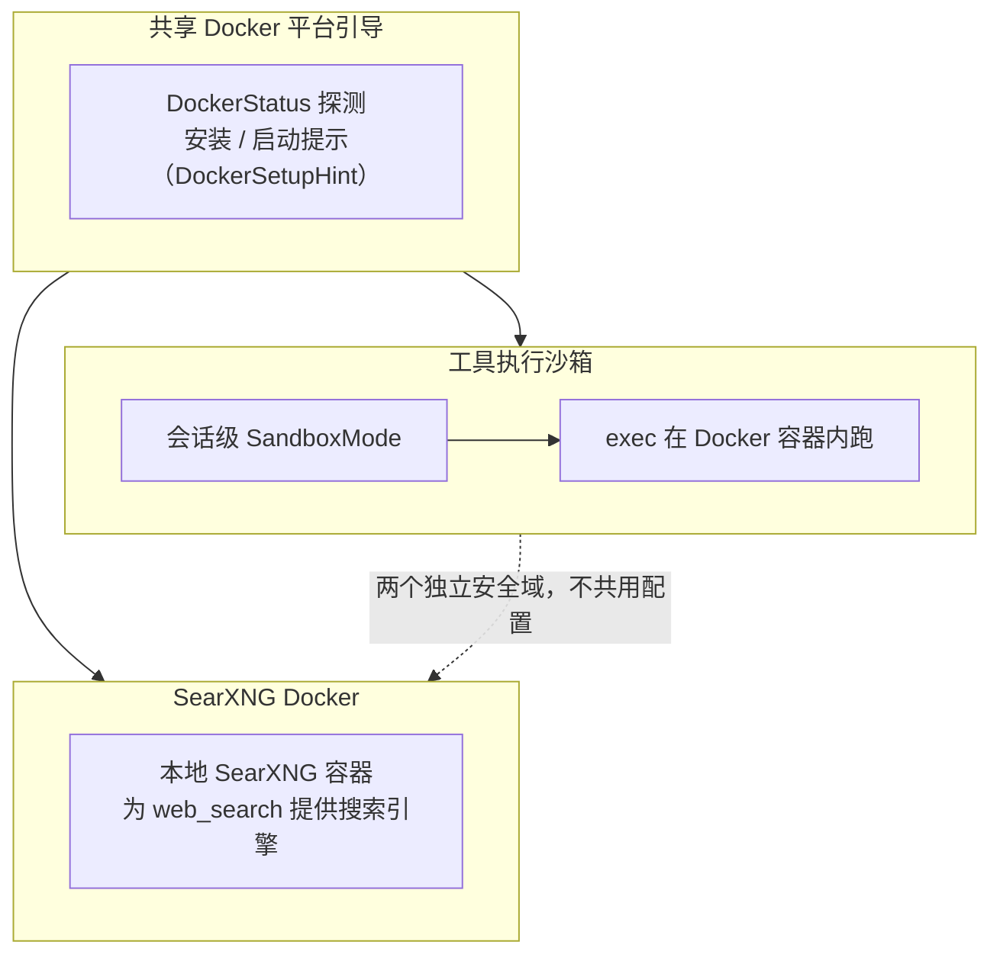
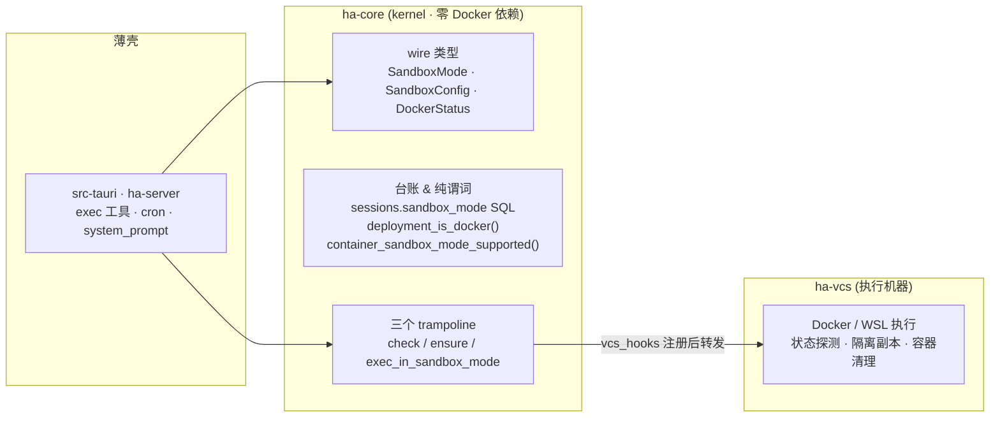
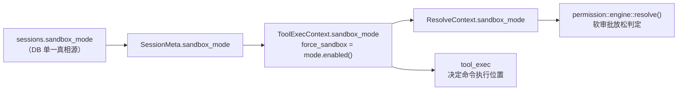
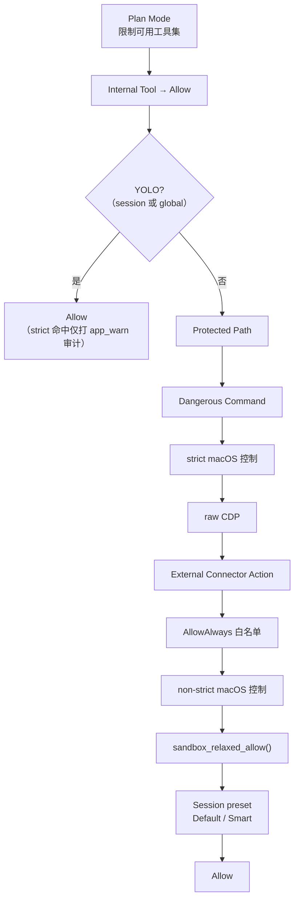
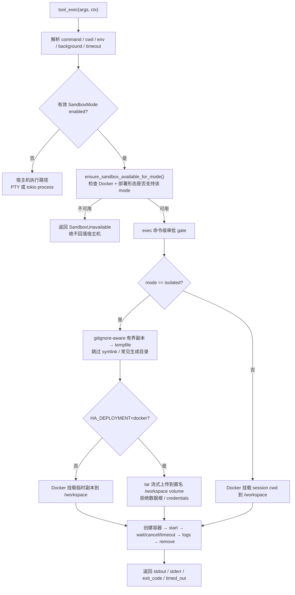
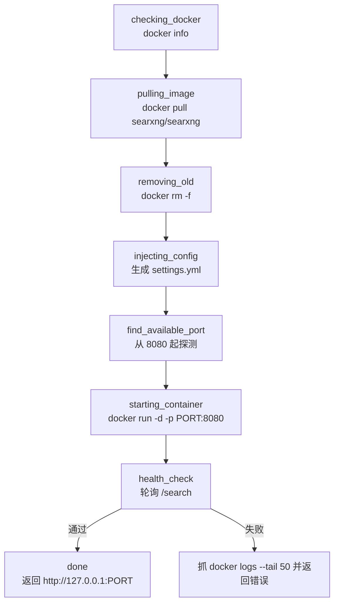

# Sandbox 架构

> 返回 [文档索引](../../README.md) | 更新时间：2026-07-23 | 关联：[权限/审批系统](../agent/permission-system.md) · [工具系统](../core/tool-system.md) · [配置系统](config-system.md) · [API 参考](../system/api-reference.md)

## 这个子系统解决什么问题

模型会调 `exec` 跑任意 shell 命令。默认情况下这些命令直接落在用户的真实机器上，能读能写能联网。多数时候这没问题——用户就是想让 agent 在自己的工作区里干活。但有两类需求它满足不了：

- **想放开手让模型跑，又不想每条命令都点确认**——但这不能靠「关掉审批」来实现，否则危险命令也一起放行了。
- **想让模型在一个隔离环境里试跑**——碰不到宿主文件系统、拿不到 secret、开不了网络、逃不出容器。

Sandbox 子系统用 **Docker 容器** 回答这两个需求，同时守住一条硬边界：**沙箱改变的是命令在哪里执行，绝不改变什么该被审批**。把命令关进容器不等于给它开绿灯——受保护路径、危险命令、Docker socket、host escape 这些 strict 判定，在任何沙箱模式下都照样拦。沙箱唯一被允许放松的，是那些原本就「安全但啰嗦」的软审批（在真实工作区里跑常规编辑命令），而且只在能证明目标落在工作区内时才放。

关键心智模型：**沙箱是权限引擎的一个输入，不是权限引擎的旁路。** 它排在所有 strict 门之后，只能把已经安全的东西再省一次确认。

### 两条能力，一套 Docker 引导

子系统里其实住着两条相互独立的能力，它们共享同一套 Docker 探测与安装提示，但**不是同一个安全域**：



| | 工具执行沙箱 | SearXNG Docker |
|---|---|---|
| 服务对象 | `exec` 工具 | `web_search` 工具 |
| 配置 | `SandboxConfig`（`sandbox.json`） | `settings.yml` + `~/.hope-agent/searxng/` |
| 谁触发 | 模型跑命令时 | 用户在 Web Search 设置页部署 |
| 本文重点 | 本文主体 | 「SearXNG Docker 子系统」一节 |

本文先讲透工具执行沙箱的原理、模式设计、权限语义与执行链路，最后单独讲 SearXNG。

## 五种模式：一条从「透明」到「自治」的谱

会话级的 `SandboxMode` 有五个取值，本质是一条谱：从「什么都不变」到「容器隔离」，再到「容器内最大自治」。理解它们的差异，关键看三件事——**命令在哪跑、文件写去哪、审批放不放松**。

| 模式 | 命令执行位置 | 文件写入落到哪 | 审批 |
|------|----------|--------------|------|
| `off` | 宿主机 | 真实宿主文件系统 | 正常 |
| `standard` | Docker，挂载当前 cwd 到 `/workspace` | 挂载目录 → 真实工作区 | 不放松（只换执行位置） |
| `isolated` | Docker + 临时工作区副本 | 只落临时副本，执行后删除 | 不放松 |
| `workspace` | Docker，挂载当前 cwd 到 `/workspace` | 挂载目录 → 真实工作区 | 放松工作区内 `exec` 编辑命令 |
| `trusted` | Docker，挂载当前 cwd 到 `/workspace` | 同 `workspace` | 同 `workspace`，语义上是容器内最大自治 |

几个容易踩的边界，都源自「文件写去哪」这一列：

- **`standard` 是最保守的 Docker 模式**：它对应旧的「Docker 沙箱」开关（`capabilities.sandbox = true`），只把执行位置搬进容器，审批一点不动。
- **`isolated` 的副本是「用完即弃」的**：命令在临时副本里跑，结束后副本被删。因此它**故意不放松**编辑命令审批——否则命令会显示「成功」，可文件改动其实被静默丢弃了。当前也没有自动写回流程；要把结果应用回真实工作区，仍须走后续文件工具 / patch 流程并各自审批。
- **`write` / `edit` / `apply_patch` 永远在宿主机跑**：这几个直接文件工具不会因为沙箱模式而改写进容器或副本。所以任何模式都不放松它们的编辑审批——沙箱只管 `exec`。
- **`workspace` / `trusted` 放松前必须证明目标在工作区内**：见下文「权限引擎集成」。

`relaxes_soft_approvals()` 就是这条谱的开关：只有 `workspace` / `trusted` 返回 true。

## 分层：kernel 台账 + 特征 crate 机器

沙箱的代码分成两半：

- **kernel（`ha-core`）持有「静态的东西」**：wire 类型（`SandboxMode` / `SandboxConfig` / `DockerStatus`）、配置持久化、对 `sessions.sandbox_mode` 的 SQL 读写、以及纯谓词（`deployment_is_docker()` / `container_sandbox_mode_supported()`）。kernel 零 Docker 依赖。
- **特征 crate（`ha-vcs`）持有「会动的机器」**：真正跟 Docker / WSL 打交道的执行、状态探测、隔离副本、容器清理。

两半用三个 **trampoline** 缝合。kernel 里 `check_sandbox_available` / `ensure_sandbox_available` / `exec_in_sandbox_mode` 是薄壳函数，运行时经 `ha_core::vcs_hooks` 找到 `ha-vcs` 注册的实现并转发。



这个设计有一个**故意的 fail-closed 语义**：如果进程没调 `ha_vcs::wire()`（trampoline 没接线），`ensure` 和 `exec` 直接返 `Err`——与「Docker 不可用」完全同一语义，调用方绝不回落宿主机执行。`check` 则返回一个「未安装 / 未运行」的占位状态并 warn 一次（`app_warn!("sandbox", "wire", …)`，用 `OnceLock` 去重），运维 grep 这条日志就能立刻定位到「机器没接线」，比追 UI 提示快得多。

## 数据流：模式从哪来，到哪去

一次带沙箱的工具调用，模式值走这样一条链：



要点：

- **DB 是真相源**：会话行里的 `sandbox_mode` 说了算。构造 `ToolExecContext` 时优先读 session meta 的值，只有拿不到 session（如草稿态）才回落 Agent 的有效默认值。
- **一个值，两处消费**：同一个 `sandbox_mode` 既进权限引擎（决定审批放不放松），又进 `tool_exec`（决定命令去容器还是宿主机）。
- **Agent 默认 ≠ 会话状态**：Agent 配置只决定「新会话开出来时的初始值」；会话建好后，一切以 `sessions.sandbox_mode` 为准，改 Agent 默认不影响已存在的会话。

## 权限引擎集成

`ResolveContext` 带一个字段 `sandbox_mode: SandboxMode`，它**只**在软审批放松判定里被用到。沙箱在整条决策链里排在所有 strict 门之后：



链上每个门的语义是「命中则 Ask / Deny，否则继续往下」。`sandbox_relaxed_allow()` 卡在 AllowAlways 之后、Session preset 之前——这意味着它**能省的只有普通编辑类软审批，越不过任何前面的 strict 门**。

这条优先级用一句话概括就是：

> **Plan > Internal > YOLO > Protected / Dangerous / Strict > AllowAlways > Sandbox soft allow > Session preset > fallback**

### `sandbox_relaxed_allow()` 到底放松什么

它只在很窄的条件下返回 true：

| 条件 | 结果 |
|------|------|
| `sandbox_mode` 不是 `workspace` / `trusted` | false |
| `tool_name == "exec"`、命中编辑命令、有效 `cwd` 在 workspace 内、且命令里可识别的目标路径都在 workspace 内 | true |
| 其它 | false |

「目标路径在 workspace 内」是最容易被忽视的一环。放松前必须 canonicalize 有效 `cwd` 并确认它在 `default_path` 的 canonical workspace 内；命令里可识别的目标（绝对路径、相对路径、`/workspace/...` 容器路径、重定向目标、常见文件命令的裸操作数）也都要解析进 workspace。**任何动态展开或无法证明安全的越界目标，一律 fail-closed 继续走审批。**

### 沙箱绝不放松的场景

无论什么模式，下面这些都碰不到软放松（软放松只对 `exec` 生效，浏览器 / 连接器等动作根本进不了这条放松分支）：

- Plan Mode 的 `PlanModeAsk`
- 受保护路径（Protected Path）
- 危险命令（Dangerous Command）
- 浏览器 raw CDP（`BrowserRawCdp`）
- macOS 高危控制动作
- 浏览器对真实 Chrome 的高风险操作
- 外部连接器动作（External Connector Action）
- AllowAlways 禁止项
- 任何 `AskReason::forbids_allow_always()` 为 true 的 strict 原因

### 与 YOLO 的关系

- session / global YOLO 排在沙箱之前。YOLO 已开时，沙箱只决定执行位置，不再额外增减审批。
- YOLO 命中 protected / dangerous / mac / browser 等 strict 项时，仍打 `app_warn!` 审计日志（放行但留痕）。

## exec 执行链路

`exec` 先算出「有效沙箱模式」，再据此路由：

```text
if ctx.sandbox_mode.enabled():
    effective = ctx.sandbox_mode          # 会话模式优先
elif ctx.force_sandbox 或 args.sandbox == true:
    effective = standard                  # legacy 单命令请求，回落 standard
else:
    effective = off
```

然后进入执行流程：



### Docker 容器属性

- 镜像来自 `SandboxConfig.image`，缺失时自动 pull。
- `cmd = ["sh", "-c", command]`，`working_dir = "/workspace"`。
- Unix 平台以当前用户 `uid:gid` 运行，减少 bind mount 权限问题。
- Hope 自身若以 root 运行，容器仍固定使用数值非 root 身份 `65534:65534`。root-owned bind 工作区在已通过挂载校验后临时移交所有权；改权前先把每个相对路径的原 UID/GID 与 dev/inode/type 原子、持久化写入 0600 恢复日志，容器清理后恢复并删除日志。进程被杀或断电时，下次交接必须先在同一锁内幂等恢复旧日志，恢复失败则保留日志并 fail closed，禁止把 `65534:65534` 误记成新的原始状态。新交接先拒绝硬链接数大于 1 的普通文件、带 setuid/setgid 位的条目，以及 Linux `security.capability` 扩展属性，避免改权连带授权工作区外 inode，或让 `fchown` 不可逆地清掉既有特殊权限；每次改权再从已验证根目录句柄逐级 `openat(O_NOFOLLOW)`，复核 dev/inode/type/owner、特殊权限位与硬链接计数，并在同一句柄上再次确认没有文件能力后才执行 `fchown`，路径、inode 或能力属性在扫描后变化即 fail closed。符号链接不参与改权；其所有者不控制 Unix 路径遍历或目标访问。恢复也使用相同的句柄绑定：先证明普通文件的全部硬链接名称都位于工作区内，再按 dev/inode 去重恢复一次；容器内部新建的同 inode 名称因此可正常收口，而任何工作区外链接都会保留日志并 fail closed。恢复时，日志中仍可识别的 inode 恢复原所有者，容器新建且仍属 `65534:65534` 的 inode 恢复工作区根所有者。该遍历不套用隔离副本的条目上限。跨进程 OS 锁覆盖恢复、交接、容器执行和再次恢复的整个区间，并故意全局串行化以阻止父目录 / 子目录两个重叠工作区并发改权。正常完成、失败、超时或取消路径都必须在返回调用方前经 `run_blocking` 等待恢复结束，禁止在异步 worker 上同步遍历；`Drop` 仅作 panic 等异常路径的非阻塞恢复线程兜底，并继续持锁到恢复结束。
- bind mount 前执行 `validate_bind_mount()`（见「Docker 安全边界」）。
- stdout/stderr 通过 Docker logs 收集。
- 正常完成、超时、取消、启动失败——都尝试清理容器（否则会残留泄漏 name / 匿名 volume）。

### Windows / WSL 回退

Windows 原生 Docker daemon 不可达时，如果默认 WSL 发行版内的**本地 Unix Socket** daemon 可用，就以 `wsl.exe --exec docker --host <已校验的 unix endpoint> run` 启动同等配置的容器。这条路径有几层加固：

- **不会隐式采用 `ssh://` / `tcp://` 远程 Docker Context**——只认经校验的本地 `unix://` socket。
- 宿主工作目录先经 `wslpath` 与 WSL 侧 `readlink -f` 转成 canonical Linux 路径，再次跑敏感挂载校验（`validate_wsl_bind_mount`）。
- 容器用当前 WSL 用户的数值 UID:GID。
- 清 `DOCKER_CONTEXT` / `DOCKER_HOST` / `DOCKER_TLS_VERIFY` / `DOCKER_CERT_PATH`，防 WSLENV 导出的变量覆盖已校验的本地 endpoint。
- 超时或取消时先终止 Docker CLI，再按随机容器名重试 `docker rm --force` 并确认清理结果。

### 容器化部署：只允许 `isolated`

当 Hope Agent 自身跑在容器里（`HA_DEPLOYMENT=docker`）时，容器里的路径不是真实宿主文件系统，bind 模式没有意义。因此 `ensure_sandbox_available_for_mode()` 只放行 `isolated`——`standard` / `workspace` / `trusted` 在预检与执行层**双重 fail closed**，禁止把父容器路径误交给宿主 daemon。

`isolated` 在容器部署下走 Archive API：有界副本打成 tar，经 `upload_to_container` 流式上传到匿名 `/workspace` volume，容器删除时带 `v=true` 一并清掉匿名 volume。上传源经 `validate_container_isolated_source` 把关——**数据根、其任一祖先、或 credentials 目录都不能作为上传源**（它们含凭据和数据库）。

### isolated 副本准备

- 复制发生在 `spawn_blocking` 中，避免同步 `std::fs` 递归阻塞 tokio runtime。
- 遍历用 `ignore::WalkBuilder`，`hidden(false)`——dotfile 不会仅因隐藏而被跳过，是否复制由 ignore 规则和硬编码兜底决定。
- **gitignore 边界随 cwd 是否在 Git repo 内而变**：在 repo 内时读父级 `.gitignore` 并尊重 `.ignore` / `.git/info/exclude` / git global ignore（`parents / git_global / git_exclude / require_git` 全开）；不在 repo 内时只读 cwd 树内的 `.gitignore` / `.ignore`，避免父目录或全局规则意外影响隔离副本。
- 复制与 tar 归档共享取消 token 和本次准备阶段 deadline；目录遍历逐条检查，单文件复制每 **64 KiB** 在读取前、读取后写入前再次检查，取消 / 超时不会被最长 512 MiB 的整文件复制拖到结束后才生效。遍历认定的普通文件必须再次从已授权的工作区根句柄逐级安全打开：Unix 逐级 `openat(O_NOFOLLOW)`，Windows 持有目录句柄链并拒绝 reparse point；容量统计、类型复核与复制都使用最终打开的同一文件句柄，禁止按遍历所得路径重新打开，条目在遍历后被替换时 fail closed。
- 上限：最多复制 **512 MiB / 50,000 个文件或目录**（`ISOLATED_COPY_MAX_BYTES` / `ISOLATED_COPY_MAX_ENTRIES`）；超过后返回明确错误，建议改用 `workspace` mode 或收窄 cwd。
- 跳过 symlink、特殊文件，以及这些常见 VCS / 依赖 / 构建缓存目录（`ISOLATED_COPY_EXCLUDED_DIRS`）：

  `.git` · `.hg` · `.svn` · `node_modules` · `target` · `dist` · `build` · `.next` · `.turbo` · `.cache` · `coverage` · `.pytest_cache` · `__pycache__`

### 后台执行

- 普通长跑沙箱 exec 走 `async_jobs`：`run_in_background=true` 由 `JobManager` 持有后台生命周期，stdout/stderr 进 job `output_tail`，结果经 `job_status` / `<task-notification>` 返回。
- legacy process 兼容面仍在：只有 async_tools 关闭 / agent `never-background` 等保留场景，`exec(background=true)` / `yield_ms` 才 spawn tokio task 调 `exec_in_sandbox_mode()`，结果写回 process registry，用户通过 `process(action="poll")` 查询，退出时发 `process:completed` / `<process-notification>`。
- 显式 async job 的审批 park 仍由 `async_jobs::approval_bridge` 负责；沙箱只改变实际命令执行位置。

## Docker 安全边界

容器不是天生安全的——一个能挂载 `/var/run/docker.sock` 的容器等于逃出沙箱。这一节的三道限制是执行层的硬防御。

### Bind mount 黑名单

`validate_bind_mount()` 会拒绝根文件系统和一批系统 / Docker 关键路径。命中判定包含路径自身及其任意子路径（`BLOCKED_MOUNT_PATHS`）：

| 路径 | 原因 |
|------|------|
| `/`（及无父目录的路径） | 禁止挂载根文件系统（单独判定） |
| `/etc` | 系统配置 |
| `/proc` | procfs |
| `/sys` | sysfs |
| `/dev` | 设备 |
| `/boot` | boot 文件 |
| `/root` | root home |
| `/var/run/docker.sock` | Docker socket escape |
| `/var/run/docker` | Docker socket/daemon 目录 |
| `/private/var/run/docker.sock` | macOS Docker socket |
| `/run/docker.sock` | Docker socket |
| `/run/docker` | Docker socket/daemon 目录 |

WSL 路径走独立的 `validate_wsl_bind_mount`，套同一份黑名单，另外拒绝非 canonical 路径（含 `//`、`.`、`..` 分量）与暴露 rootless docker socket 的挂载。

### 环境变量过滤

传给 `exec` 的 `env` 会过滤敏感 key。规则是 key upper-case 后**包含**下列任一片段（`SENSITIVE_ENV_PATTERNS`）：

```text
API_KEY, API_SECRET, TOKEN, SECRET, PASSWORD, PASSWD, CREDENTIAL,
PRIVATE_KEY, ACCESS_KEY, AWS_SECRET, AWS_ACCESS, AWS_SESSION,
OPENAI_API, ANTHROPIC_API, AZURE_, GH_TOKEN, GITHUB_TOKEN,
GITLAB_TOKEN, DATABASE_URL, REDIS_URL, MONGO_URI
```

始终放行的白名单（`SAFE_ENV_ALLOWLIST`，优先于上面的模式匹配）：

```text
PATH, HOME, USER, LANG, LC_ALL, LC_CTYPE, TERM, SHELL, TMPDIR,
TZ, HOSTNAME, COLUMNS, LINES
```

过滤只作用于模型传入的 `args.env`——宿主机登录 shell 的整个环境不会透传进 Docker 路径。

### 网络与 rootfs

- 默认 `network_mode = "none"`（无网络）。用户在 Sandbox 设置页可改成 `bridge` / `host` 换取更大网络能力，但这**不改变权限引擎的 strict 规则**。
- 默认 `read_only = true`，root filesystem 只读；用 tmpfs 提供可写临时区：`/tmp:size=64M` · `/var/tmp:size=32M` · `/run:size=16M`。
- 工作目录 `/workspace`（bind mount 或隔离副本 mount）仍可写。

## Docker 状态探测与引导

沙箱选择器、Agent 设置页、Sandbox 设置页、SearXNG 面板复用同一套 Docker 状态与安装 / 启动提示（`DockerSetupHint`）。状态 wire 类型：

```rust
pub struct DockerStatus {
    pub installed: bool,
    pub running: bool,
    pub host_os: String,
    pub backend: Option<DockerBackend>,          // native | wsl
    pub wsl_installed: Option<bool>,
    pub wsl_distribution_installed: Option<bool>,
    pub wsl_docker_installed: Option<bool>,
    pub connection_error: Option<DockerConnectionErrorKind>,
    pub containerized: bool,
    pub isolated_mode_only: bool,
}
```

探测逻辑：

1. 跑宿主 `docker --version` 判断原生 CLI；用 `bollard::Docker::connect_with_local_defaults().ping()` 判断原生 daemon 是否在跑。daemon 可达时不额外要求 CLI（执行路径本身用 Docker API）。连接失败归类为 `socket_missing` / `permission_denied` / `daemon_unreachable` / `client_error`——**原始错误绝不进 API 或日志**，避免凭据化的 `DOCKER_HOST` 泄漏。
2. Windows 在原生 daemon 不可达时继续探测：`wsl.exe --status`、默认发行版能否执行命令、发行版内 `docker --version`，并只对当前 Context 中经校验的 `unix://` endpoint、`/var/run/docker.sock` 与当前 UID 的 rootless socket 执行显式 `docker --host <endpoint> info`。远程 Context 不参与自动 fallback。原生 daemon 优先且健康时不会为丰富状态去唤醒已停止的 WSL VM（此时三个 WSL 探测字段为 `None`）；原生不可达但 WSL 本地 daemon 可用时 `backend=wsl`。
3. **仅装 WSL 不等于 Docker 可用**：默认发行版内还须装 Docker-compatible CLI/Engine 且 daemon 在跑，否则执行继续 fail-closed。
4. `host_os()` 返回 `macos` / `windows` / `linux` / `unknown`。
5. `containerized` 来自 `HA_DEPLOYMENT=docker`；此时 `isolated_mode_only=true`，UI 提示仅支持隔离模式。

`connection_error` 的四个分类由 IO error kind 映射而来，用于把 daemon dead 的技术错误翻译成人类可读的修复提示（socket 缺失 → 提示挂载；`permission_denied` → 提示对齐 socket GID）。

### 平台安装入口

| `hostOs` | 主入口 | 替代方案 |
|----------|--------|----------|
| `macos` | Docker Desktop | OrbStack、Colima、Rancher Desktop |
| `windows`（无可用 WSL 发行版） | Docker Desktop + WSL2 | Rancher Desktop、Docker Engine on WSL |
| `windows`（默认 WSL 发行版可用、未装 Engine） | Docker Engine on WSL | Docker Desktop + WSL2、Rancher Desktop |
| `linux` | Docker Engine | Docker Desktop for Linux、Rancher Desktop |
| `unknown` | Docker Desktop | OrbStack、Colima、Rancher Desktop、Linux dockerd |

交互规则：

- Docker 未安装：展示平台主入口 + 替代方案。
- Windows 已有默认 WSL 发行版但未装 Engine：优先展示 WSL 内 Engine 安装入口，不强制装 Docker Desktop。
- Docker 已安装但 daemon 未运行：展示启动提示和「重新检测」，不把安装入口当主按钮。
- server 模式下显示的是**服务器宿主机**平台，不是浏览器客户端平台。
- 选择非 `off` 时仍允许发送聊天；只有真正执行沙箱工具时才 fail-closed。

## UI 流程

### 新会话（草稿态）

新会话还没有 session row，前端处于草稿态，行为与 `permissionMode` 草稿态一致：

1. `useChatStream` 按当前 Agent 读 `get_agent_config`。
2. 用户没手动改过 sandbox mode 时，前端显示 Agent 的有效默认值。
3. 首条消息发送时：
   - 用户手动改过 → `ChatStartArgs.sandboxMode` 随请求传给后端。
   - 用户没改过 → 不传，让后端 `create_session_full()` 用 Agent default 初始化。

这样避免前端异步读默认值时覆盖用户的手动选择。

### 已有会话

通过 `PermissionModeSwitcher` 弹层内的沙箱分区（复用 `SandboxModeSwitcher` 选项列表）切换：

1. 前端立即更新本地状态。
2. 调 `set_sandbox_mode` 持久化。
3. 后端广播 `sandbox:mode_changed`，其它窗口或 HTTP event stream 同步会话 meta。
4. 只影响后续工具调用，不重跑已完成工具。

### 设置页分工

- **Agent → Capabilities 里的「Sandbox」** 是一个 Select（`off` / `standard` / `isolated` / `workspace` / `trusted`）。保存时同时写 `capabilities.defaultSandboxMode = mode` 和 `capabilities.sandbox = mode !== "off"`，让旧代码读到尽量等价的行为。选非 `off` 且 Docker 不可用时显示 `DockerSetupHint`。Agent 配置不是 `AppConfig` category，不进 `ha-settings` 三件套，走既有的 `get_agent_config` / `save_agent_config_cmd` 保存路径。
- **Sandbox 设置页** 只配置 `SandboxConfig`（image、memory/cpu/pids、只读 rootfs、cap drop、no-new-privileges、network mode），**不设置会话模式**——会话模式在聊天输入区和 Agent 默认配置里设。

## 数据模型

### `SandboxMode`

Rust 定义在 `permission/mode.rs`，snake_case 序列化，wire 值必须稳定：

| Rust | JSON / DB | 语义 |
|------|-----------|------|
| `Off` | `"off"` | 宿主机执行，审批不变 |
| `Standard` | `"standard"` | Docker 执行，审批不放松 |
| `Isolated` | `"isolated"` | Docker + 临时工作区副本 |
| `Workspace` | `"workspace"` | Docker 直接挂载当前工作区 |
| `Trusted` | `"trusted"` | 容器内 exec 最大自治，strict 仍审批 |

`parse_or_default()` 对未知值 fail-soft 到 `Off`，防旧版本或手写 DB 值 panic。`enabled()` = 非 `Off`；`relaxes_soft_approvals()` = `Workspace | Trusted`。

### Agent 配置

`CapabilitiesConfig`（`agent_config.rs`）里与沙箱相关的两个字段：

```rust
pub sandbox: bool,                              // legacy 开关
pub default_sandbox_mode: Option<SandboxMode>,  // 新字段，优先级最高
```

有效默认值由 `effective_default_sandbox_mode()` 计算：

```rust
default_sandbox_mode.unwrap_or_else(|| {
    if sandbox { SandboxMode::Standard } else { SandboxMode::Off }
})
```

- `default_sandbox_mode = Some(...)` 优先。
- `sandbox: bool` 是旧字段，不删，只在新字段缺失时参与映射。
- 设置页保存时两个字段一起写，保证 rollback / 旧代码读到等价行为。

### Session DB

`sessions` 表的列由迁移添加：

```sql
ALTER TABLE sessions ADD COLUMN sandbox_mode TEXT NOT NULL DEFAULT 'off';
```

迁移逻辑：新列默认 `off`，然后遍历已有 session 的 `agent_id`，加载对应 Agent；若该 Agent 的 `effective_default_sandbox_mode()` 非 `off`，就回填到那批 session——让旧 `capabilities.sandbox=true` 的行为在升级后保持。

读写 API：

| 函数 | 说明 |
|------|------|
| `SessionDB::update_session_sandbox_mode(session_id, mode)` | 写当前会话模式 |
| `SessionDB::get_session_sandbox_mode(session_id)` | 窄读当前会话模式 |
| `SessionDB::create_session_full(...)` | 新会话按 Agent effective default 初始化 `sandbox_mode` |
| `SESSION_META_SELECT` | 把 `SessionMeta.sandbox_mode` 带给前端 |

> **定时任务 per-job 沙箱覆盖**：`CronJob.sandbox_mode_override`（仅面向用户本人的控制面可设，详见 [cron.md](cron.md)）非空时，cron executor 经 `update_session_sandbox_mode` 写入该 cron 隔离会话（写入失败即 fail-closed 终止本次运行，绝不裸跑）；有效模式从会话行读取（读错时回退到 per-job override / Agent 默认，而非 `Off`）。**Docker 缺失同样 fail-closed**：有效模式 `enabled()` 但 `ensure_sandbox_available()` 失败时，cron 运行失败并记录原因、绝不回落宿主机（与交互会话同口径）；但**不计入 `max_failures` 自动禁用**（turn 未跑、无副作用，等同 infra 失败，避免瞬时 Docker 抖动或不调 exec 的任务被误禁用）。

### Docker 执行配置

`SandboxConfig` 持久化在 `~/.hope-agent/sandbox.json`：

| 字段 | 默认 | 说明 |
|------|------|------|
| `image` | 内置 Debian Bookworm slim manifest digest | 执行沙箱镜像；必须使用 `name@sha256:<64 位摘要>`，可变 tag 被拒绝 |
| `memory_limit` | 512 MB | 容器内存限制，`None` 表示不设 |
| `cpu_limit` | `1.0` | `nano_cpus` 限制 |
| `read_only` | `true` | root filesystem 只读 |
| `network_mode` | `"none"` | 默认无网络 |
| `cap_drop_all` | `true` | drop all Linux capabilities |
| `no_new_privileges` | `true` | `security_opt=no-new-privileges` |
| `pids_limit` | `256` | 容器内进程数限制 |
| `tmpfs` | `/tmp` 64M、`/var/tmp` 32M、`/run` 16M | rootfs 只读时的临时写入区 |

读写：Tauri `get_sandbox_config` / `set_sandbox_config`；HTTP `GET /api/config/sandbox` / `PUT /api/config/sandbox`。

#### 镜像供应链与 hardened image 取舍

默认引用由 [`sandbox-image-manifest.json`](../../../crates/ha-core/resources/sandbox-image-manifest.json) 唯一给出：

```text
debian:bookworm-20260803-slim@sha256:abd67ffcfa541b485a3dff59865ab629aa048a6c613e639d36e7456b0b229241
```

这是 Docker Official Image 的多架构 OCI index；manifest 同时钉住 `linux/amd64` 子 manifest `sha256:362e6422…` 与 `linux/arm64/v8` 子 manifest `sha256:817e6cf9…`，并保存上游证据与发布时间。旧默认值 `debian:bookworm-slim` 只在读取既有配置时迁到上述 digest；其它可变 tag 不自动“猜测”摘要，保存和执行都 fail closed。Bollard 拉取时把完整 `name[:tag]@digest` 放进 `fromImage`，拉取结束再按完整引用 inspect，禁止把 `sha256` 误拆成 tag。

| 方案 | 优点 | 与当前命令模型的冲突 | 决策 |
|---|---|---|---|
| Debian Bookworm slim + 运行时硬化 | 多架构、保留 `sh`，归档导入和开发命令兼容；官方镜像证据完整 | 基础用户态比极简 hardened image 更大，digest 冻结后必须主动刷新安全补丁 | **当前采用**；内容用 digest 固定，隔离靠非 root、只读 rootfs、network none、cap-drop、no-new-privileges、tmpfs 与资源上限叠加 |
| 无 shell / 极简 hardened image | 包和解释器更少，默认攻击面更窄 | Hope 当前明确执行 `sh -c`，且开发任务需要动态工具；直接替换会让正常任务系统性失败 | 不直接替换；只有专用、保留所需 shell/工具且许可证、双架构 digest、回滚证据齐全的开发变体通过兼容矩阵后才可另立 manifest |

digest 提供可复现性，不自动获得安全更新。维护时按月检查上游 Debian slim；高危修复走紧急刷新。更新必须把 index 与 amd64/arm64 子 digest、发布时间和上游证据一起改入 manifest，并保留前一 digest 作为显式审计回滚值；禁止恢复裸 tag 自动 fallback。回归用纯构造测试钉住只读根、无网络、drop all capabilities、no-new-privileges、PID/CPU/内存与 tmpfs；Docker 部署仍由预检与执行两层只接受 `isolated`，归档/cancel/cleanup 边界不因镜像更新放宽。

## API / Transport 契约

新 invoke 同时实现 Tauri + HTTP 两套适配（见 [`transport.ts`](../../../src/lib/transport.ts)）。

### Chat start 带沙箱模式

Tauri `chat` 和 HTTP `POST /api/chat` 都接受 `sandboxMode`（Rust body 字段 `sandbox_mode: Option<SandboxMode>`，serde camelCase 对外 `sandboxMode`）：

```json
{ "sandboxMode": "workspace" }
```

后端：先解析 / 创建 session → 若带 `sandbox_mode` 则 `update_session_sandbox_mode()` → 构造来源专用 submission 进入 TurnKernel；runtime 只消费 kernel 已裁决的 sandbox/session context。

### 更新会话模式

| Surface | API |
|---------|-----|
| Tauri | `set_sandbox_mode({ sessionId, mode })` |
| HTTP | `POST /api/chat/sandbox-mode`，body `{ "sessionId": "...", "mode": "workspace" }`，返回 `{ "ok": true }` |

### Sandbox config

| Surface | API |
|---------|-----|
| Tauri | `get_sandbox_config` / `set_sandbox_config` |
| HTTP | `GET /api/config/sandbox` / `PUT /api/config/sandbox`（body 包一层 `{ "config": { ... } }`） |

### Docker status

| Surface | API | 返回 |
|---------|-----|------|
| Tauri | `check_sandbox_available` | `DockerStatus` |
| HTTP | `GET /api/config/sandbox/status` | `DockerStatus` |

## Prompt 集成

`system_prompt` 的 `build_sandbox_mode_section()` 在当前 session sandbox mode 非 `off` 时注入 `# Sandbox Mode` 段，让模型理解自己处在哪种沙箱语义下。这一段会：

- 说明当前 mode 及其一句话行为，并告知 `exec` 会按 session policy 自动路由到 Docker sandbox，无需再传 `sandbox=true`。
- 附上当前 `SandboxConfig` 快照（image、network mode、rootfs 读写、capability policy、no-new-privileges、PID limit、tmpfs），但不把默认配置写成永远成立的环境保证。
- 简列各模式差异，避免模型只看到 mode 字符串却不知语义。
- 明确安全边界：**沙箱不是权限绕过**——protected path / dangerous command / secret / Docker socket / host escape / raw CDP / privileged / macOS 高危控制等仍会审批或拒绝。
- 明确持久化边界：`write` / `edit` / `apply_patch` 是 host-side durable 文件工具，不会因沙箱模式自动进容器；`isolated` 里命令创建的文件默认不持久化。
- 按当前 network mode 提醒网络可用性；需要特殊宿主权限时说明限制，不要尝试绕过沙箱。

注意：prompt 里的模式优先来自当前 `sessions.sandbox_mode`，没有 session id 时才回落 Agent effective default；**执行层始终以 `ToolExecContext.sandbox_mode` 为准，prompt 只是行为提示、不是安全边界。**

## SearXNG Docker 子系统

SearXNG Docker 是 Web Search 的本地搜索引擎部署能力，源码在 `crates/ha-vcs/src/docker/`。它复用 Docker 平台引导，但**不是工具执行沙箱**——它服务 `web_search`，配置和状态独立于 `SandboxConfig`。

### 模块结构

| 文件 | 职责 |
|------|------|
| `mod.rs` | 常量、`DEPLOYING`、`DEPLOY_PROGRESS`、`STATUS_LOCK` |
| `status.rs` | `SearxngDockerStatus` 聚合状态，5 秒 TTL 缓存 |
| `deploy.rs` | 部署流水线 |
| `lifecycle.rs` | start / stop / remove |
| `helpers.rs` | Docker CLI、端口探测、配置生成、健康检查、搜索测试 |
| `proxy.rs` | 代理解析和容器内代理地址重写 |

### 常量

| 常量 | 值 | 说明 |
|------|----|------|
| `CONTAINER_NAME` | `hope-agent-searxng` | 容器名 |
| `IMAGE` | `searxng/searxng` | Docker Hub 镜像 |
| `DEFAULT_HOST_PORT` | `8080` | 默认宿主机端口 |
| `SEARXNG_DIR_NAME` | `searxng` | 配置目录 `~/.hope-agent/searxng/` |
| `STATUS_CACHE_TTL_SECS` | `5` | 状态缓存秒数 |

### 状态结构（`SearxngDockerStatus`）

| 字段 | 说明 |
|------|------|
| `docker_installed` | Docker CLI 是否存在 |
| `docker_not_running` | CLI 存在但 daemon 不运行 |
| `host_os` | 后端宿主机平台 |
| `container_exists` | SearXNG 容器是否存在 |
| `container_running` | 容器是否运行 |
| `port` | 绑定端口 |
| `health_ok` | `/search` 健康检查是否通过 |
| `deploying` | 是否部署中 |
| `deploy_step` | 当前部署步骤 |
| `deploy_logs` | 最近部署日志 |
| `search_ok` | 真实搜索是否返回结果（不只是 200 OK） |
| `search_result_count` | 测试搜索结果数 |
| `unresponsive_engines` | 搜索测试中失败的引擎 |

### 部署流程



并发控制：

- `DEPLOYING: AtomicBool` 防止并发 deploy/start/stop/remove。
- `DEPLOY_PROGRESS` 保存当前步骤和最近 100 行日志（超过则从头 drain），供晚加入的 UI 直接拿快照，无需回放 EventBus。
- 状态查询用 `STATUS_LOCK` + 5 秒 TTL，避免高频轮询反复执行搜索测试。

### 配置注入

部署时生成 `~/.hope-agent/searxng/settings.yml` 并以只读 volume 注入：

```yaml
use_default_settings: true
server:
  secret_key: "<随机或复用>"
  limiter: false
search:
  formats:
    - html
    - json
```

代理开启时额外写：

```yaml
outgoing:
  proxies:
    all://:
      - http://host.docker.internal:<proxy-port>
  request_timeout: 10.0
```

关键点：

- `secret_key` 首次随机生成，后续从旧文件复用。
- `limiter=false`——本地部署不做 SearXNG 限速。
- 必须启用 JSON 格式，供 `web_search` 调用。
- SearXNG 不可靠读取标准环境变量代理，所以必须写 `outgoing.proxies`。

### 网络边界

| 层面 | 策略 |
|------|------|
| 端口映射 | 发布 `PORT -> 8080`（`-p PORT:8080`，Docker 默认绑所有网卡 `0.0.0.0`；服务器部署下局域网可达，端口探测只在 `127.0.0.1` 上做，别据此以为发布也限回环） |
| 配置挂载 | `settings.yml` 只读挂载 |
| 健康检查 / 搜索测试 | 用 `reqwest::Client::no_proxy()` 直连本地 |
| 代理地址 | 容器内把 `localhost` / `127.0.0.1` 重写成 `host.docker.internal` |
| 端口冲突 | 从 8080 起最多尝试 10 个端口 |

## 安全不变量（绝不能破坏的边界）

这些是子系统的地基，改任何一条前先想清楚它守的是什么：

1. 非 `off` 的执行沙箱**不得静默回落宿主机**——Docker 不可用即返回 `SandboxUnavailable`。
2. `standard` 不放松审批，只改变执行位置。
3. `isolated` 不放松 `exec` 编辑命令或宿主文件工具审批（除非将来隔离 diff 写回 / 文件工具隔离 backend 落地）。
4. `workspace` / `trusted` 放松 `exec` 编辑命令前必须 canonicalize 并确认有效 `cwd` 在 workspace 内；可识别的绝对路径、相对路径、`/workspace/...` 容器路径、重定向目标、常见文件命令裸操作数都要过 workspace 边界检查，动态展开目标 fail-closed 继续审批。
5. `workspace` / `trusted` 不放松直接宿主文件工具审批（除非文件工具有真正的 sandbox backend 或执行前 fail-closed Docker guard）。
6. protected path / dangerous command / raw CDP / macOS 高危控制等 strict 项必须在 sandbox soft allow 之前判定。
7. Docker socket、根目录、系统目录不得 bind mount。
8. 敏感 env 不得传入容器。
9. server 模式 Docker 引导必须反映服务器宿主机，不是浏览器客户端。
10. `SandboxConfig` 是执行沙箱配置；SearXNG Docker 的配置和状态不得混用。
11. `ha-settings` 不写 Agent 默认 sandbox mode；Agent 配置走 Agent 设置保存路径。
12. 容器化部署只允许 archive-backed `isolated`；父容器数据根、其祖先与 credentials 不得复制进沙箱，非 isolated mode 双层 fail closed。

## 关键行为与边界一览

不读代码看不出、但会影响判断的非显然行为：

| 场景 | 行为 |
|------|------|
| `standard` + 直接编辑工具 / 编辑命令 | 仍 Ask（只换执行位置） |
| `isolated` + 直接文件工具 / exec 编辑命令 | 仍 Ask（副本用完即弃，放松会静默丢改动） |
| `workspace` + exec 编辑命令，cwd 与目标都在 workspace 内 | Allow |
| `workspace` + exec 编辑命令，cwd 越界 或 目标越界 / 动态展开 | 仍 Ask |
| `trusted` + protected path | 仍 Ask（strict 越不过沙箱） |
| Docker 不可用 + 沙箱 exec | `SandboxUnavailable`，绝不进宿主执行 |
| Docker socket 权限不足 | 状态返回 `permission_denied`，不误报「未安装」 |
| 容器部署 + `isolated` | archive 上传匿名 volume，执行后随容器删除 |
| 容器部署 + 非 `isolated` | 预检与执行层均 `SandboxUnavailable` |
| 容器部署 + cwd 为数据根 / 其祖先 / credentials | 拒绝复制，不创建子容器 |
| Windows 原生 daemon 挂、WSL 本地 daemon 可用 | `backend=wsl`，沙箱经 `wsl.exe` 执行 |
| Agent 默认值缺失 | 回退 `defaultSandboxMode ?? (sandbox ? standard : off)` |

## 后续扩展

- **隔离 diff 写回**：`isolated` 执行后比较临时副本与真实 workspace，生成可审阅 patch，用户确认后应用。
- **per-tool 沙箱执行**：把 `write` / `edit` / `apply_patch` 抽象成可切换 backend，让 `isolated` 真正对文件工具操作隔离副本。
- **Podman 兼容探测**：当前以 Docker-compatible CLI/daemon 为准；Podman 只有提供 Docker 兼容 socket/CLI 时才视为可用。
- **更细的网络策略**：把 `SandboxConfig.network_mode` 与 SSRF policy / tool 需求联动，但不让模型自行开网络。
- **容器镜像预热**：用户选非 `off` 后提示预拉镜像，避免首次 exec 变慢。
