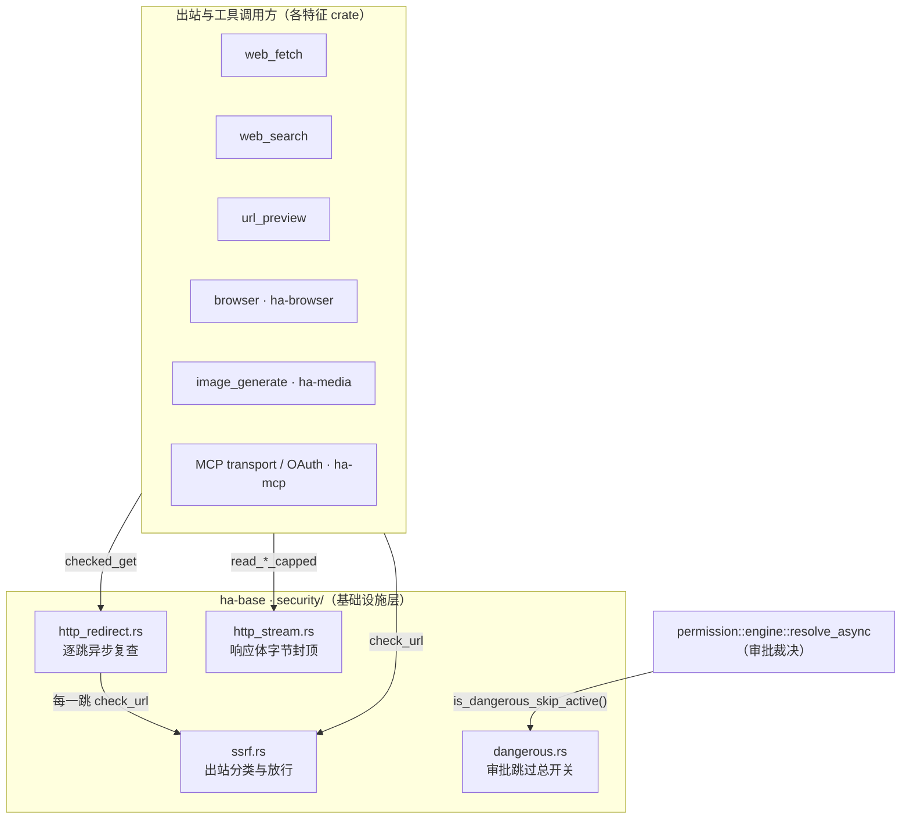
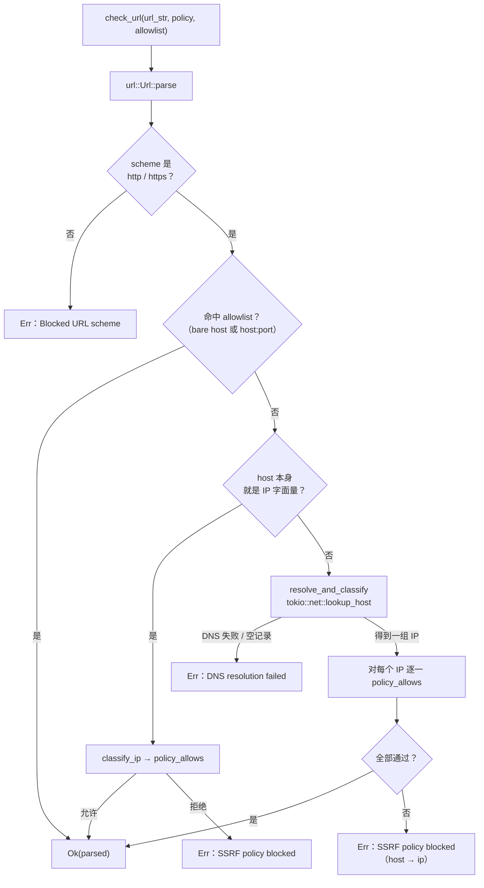
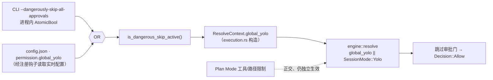

# 安全子系统

> 返回 [文档索引](../../README.md) | 关联：[MCP 客户端](../integration/mcp.md) · [工具系统](../core/tool-system.md) · [配置系统](config-system.md) · [权限系统](../agent/permission-system.md)

## 这个子系统解决什么问题

一个能上网、能读写文件、能调用工具的本地 AI 助手，天然带着两类风险：

- **模型被诱导发起危险的出站请求**——比如访问云厂商元数据端点偷取临时凭据、探测内网设备、用非 HTTP 协议触发历史 SSRF 漏洞。这类攻击的载体是"一段看似正常的 URL"，防线必须落在**每一个出站入口**。
- **审批门控被绕过或被撑爆**——审批是人对模型行为的最后一道闸；而恶意上游只要持续推送响应体，就能不经审批把进程内存吃光。

`security/` 这个模块把这些**横跨所有子系统**的安全约定收拢到一处，让任何工具、任何 Provider、任何后台任务都走同一套判定，而不是各自造轮子、语义各不相同。它住在最底层的基础设施 crate [`ha-base`](../../../crates/ha-base/src/security/)（零业务依赖），因此上层每个特征 crate 都能直接调用。

四根支柱：

| 模块 | 职责 | 抵御的威胁 |
|---|---|---|
| [`ssrf.rs`](../../../crates/ha-base/src/security/ssrf.rs) | 出站 HTTP/WS 的目标 host 分类 + 三档放行策略 + 可信主机白名单 | 内网探测、云元数据窃取、DNS rebinding、非法 scheme |
| [`http_redirect.rs`](../../../crates/ha-base/src/security/http_redirect.rs) | 禁用 client 自动跳转，在每个 HTTP redirect 之前异步复查完整 URL | 普通 hostname redirect 绕过同步回调的 DNS 检查缺口 |
| [`dangerous.rs`](../../../crates/ha-base/src/security/dangerous.rs) | 进程级跳过所有工具审批的"核弹按钮"（YOLO） | 误开、误绕过审批而无迹可查 |
| [`http_stream.rs`](../../../crates/ha-base/src/security/http_stream.rs) | 出站响应体的解压后字节封顶读取 + 截断 / 接收量信息 | 压缩炸弹或恶意上游撑爆进程内存 |

除此之外，本子系统还承载两条**跨子系统红线**：凭据不落日志（redaction）、凭据文件安全落盘。



**硬规则**：所有出站 HTTP / WebSocket 入口**必须**走 `security::ssrf::check_url`。需要跟随 HTTP redirect 的新入口优先使用 `security::http_redirect::checked_get`：client 关闭自动 redirect，由业务层在发送每一跳之前异步调用 `check_url`。`check_host_blocking_sync` 只保留给无法改成手动跳转的既有同步回调，不能被描述成与完整 DNS 检查等价。新出站入口严禁自写 IP 校验——重复实现必然带来不一致的语义，而不一致就是漏洞。

**唯一的例外是 LLM Provider 出站**：`ProviderConfig.allow_private_network` 只是一个 UI 标记，后端不做拦截。原因很实际——用户的本地 Ollama / vLLM 自部署常年住在 `192.168.*` / `10.*`，如果对 Provider 也套 SSRF 策略，最常见的本地部署反而被误伤。这条例外在下文"调用方对照"里会再点明。

---

## 一、SSRF 出站防护

### 核心思想

一次出站请求能否放行，取决于**目标最终落到哪个 IP，以及当前策略允许命中哪些 IP 类别**。所以流程固定是三步：把 host 解析/分类成一个 `HostKind`，再拿当前 `SsrfPolicy` 去问"这类地址准不准出"。真正的难点全在细节：hostname 要防 DNS rebinding，云元数据要先于一切拦掉，IPv6 要防各种映射绕过。

### 三档策略

`SsrfPolicy` 是一个三值枚举，`Default` 为默认值。它决定一次出站允许命中哪些 IP 类别：

| Policy | Loopback | Private | LinkLocal | Metadata | Unspecified/Broadcast | Public |
|---|---|---|---|---|---|---|
| `Strict` | ❌ | ❌ | ❌ | ❌ | ❌ | ✅ |
| `Default` | ✅ | ❌ | ❌ | ❌ | ❌ | ✅ |
| `AllowPrivate` | ✅ | ✅ | ❌ | ❌ | ❌ | ✅ |

读这张表的关键：

- **Metadata / Unspecified / Broadcast / LinkLocal 在任何策略下都拒**——这四类没有合法的对外业务场景，其中云元数据端点更是 SSRF 攻击的头号目标（一次成功访问就能拿到实例的临时 IAM 凭据）。
- **Loopback 从 `Default` 起放行**：为了让本地 SearXNG、本地 MCP server 这类"自己跑在 127.0.0.1"的服务能工作。
- **Private 只在 `AllowPrivate` 放行**：为了局域网设备（局域网里的 Stable Diffusion、网关 API 等），这是用户显式抬高信任才解锁的档位。

### Host 分类（`classify_ip`）

`classify_ip` 把一个 `IpAddr` 归入七类 `HostKind` 之一：

| `HostKind` | IPv4 判定 | IPv6 判定 |
|---|---|---|
| `Metadata` | `169.254.169.254`（AWS/GCP/Azure IMDS）· `169.254.170.2`（ECS Task Metadata）· `100.100.100.200`（阿里云） | `fd00:ec2::254`（EC2 IMDSv6）+ IPv4-mapped 回退 |
| `Unspecified` | `0.0.0.0`，或首字节为 `0`（整个 `0.x.y.z`） | `::` |
| `Loopback` | `127.0.0.0/8` | `::1` |
| `Broadcast` | `255.255.255.255` | — |
| `LinkLocal` | `169.254.0.0/16`（扣除 metadata 段） | `fe80::/10`（首段 `& 0xffc0 == 0xfe80`） |
| `Private` | `10.0.0.0/8` · `172.16.0.0/12` · `192.168.0.0/16` | `fc00::/7`（首段 `& 0xfe00 == 0xfc00`，ULA） |
| `Public` | 以上都不命中 | 以上都不命中 |

三处不读代码看不出的分类细节，恰恰是防绕过的关键：

- **Metadata 先于一切**：`is_metadata_ip` 在 `classify_ip` 第一行调用，命中即返回 `Metadata`。否则 `169.254.169.254` 会先被"169.254 段是 LinkLocal"这条规则抢走分类——虽然两类都拒，但错误分类会让日志误导、也让"metadata 硬黑名单"这层意图落空。
- **IPv4-mapped IPv6 双重防御**：`::ffff:169.254.169.254` 这种把 v4 地址塞进 v6 字面量的写法，会先经 `to_ipv4_mapped()` 转回 v4 再分类。`is_metadata_ip` 内部和 `classify_ip` 的 v6 分支都做了这一步——纵深防御，攻击者无法用 v6 语法偷渡一个本该被 v4 检查拦掉的地址。
- **`0.x.y.z` 一律当 Unspecified**：标准只把 `0.0.0.0` 定义为 unspecified，但 Linux 内核把整个 `0.0.0.0/8` 当作"本机"投递。为了不依赖底层路由的具体实现，整段 `0.x.y.z` 都拒。

分类之后，`policy_allows(policy, kind)` 就是上面那张三档表的代码化：Metadata/Unspecified/Broadcast/LinkLocal 恒 false，Public 恒 true，Loopback 看是否 `Default`/`AllowPrivate`，Private 只看是否 `AllowPrivate`。

### Per-tool override 与配置形态

策略并非全局一把梭。`SsrfConfig` 持久化在 `AppConfig.ssrf`——字段 `AppConfig.ssrf` 声明在 [`ha-config-schema/src/config.rs`](../../../crates/ha-config-schema/src/config.rs)，`SsrfConfig` 结构体本体在 [`ha-base/security/ssrf.rs`](../../../crates/ha-base/src/security/ssrf.rs)——由一个兜底策略 + 一组 per-tool override + 一份白名单组成：

```rust
pub struct SsrfConfig {
    pub default_policy: SsrfPolicy,          // 兜底
    pub trusted_hosts: Vec<String>,          // 用户白名单
    pub browser_policy: Option<SsrfPolicy>,
    pub web_fetch_policy: Option<SsrfPolicy>,
    pub image_generate_policy: Option<SsrfPolicy>,
    pub url_preview_policy: Option<SsrfPolicy>,
}
```

四个 per-tool 字段为 `None` 时继承 `default_policy`，由 `SsrfConfig::browser()` / `web_fetch()` / `image_generate()` / `url_preview()` 这组 helper 解析出 effective policy。**新增需要 SSRF 保护的工具时优先加一个 per-tool override，而不是去动 `default_policy`**——后者牵一发动全身，会改变所有未显式覆盖的工具的安全姿态。

### `trusted_hosts` 白名单

`trusted_hosts` 在策略检查**之前**生效：命中即放行，策略完全跳过。这是给用户"我知道这个内网地址是安全的"留的口子。两种语法：

| 语法 | 示例 | 匹配范围 |
|---|---|---|
| 精确 host:port | `127.0.0.1:11434` | 仅这一对 host:port |
| 精确 host（无端口） | `ollama.local` | 任意端口的 `ollama.local` |
| 单层通配 | `*.trusted.example` | `api.trusted.example` / `deep.nested.trusted.example` / 以及 apex `trusted.example` 自身 |

匹配大小写不敏感，只支持单层 `*.` 前缀（不支持 `foo.*`，也不支持多层 `**`）。`check_url` 会同时拿 bare host 和 `host:port` 两种形态各查一次 allowlist（`is_in_allowlist` 本身每次只比对一个 host），所以带端口的条目**端口必须对齐**：`127.0.0.1:11434` 命中 `127.0.0.1:11434`，但不命中裸 `127.0.0.1`。

### 主入口 `check_url`（异步）

`check_url(url_str, policy, allowlist) -> Result<url::Url>` 是最完整的一条检查路径，也是绝大多数出站入口该调的那个：



两个设计要点值得记住：

- **DNS rebinding 防御——每个解析出的 IP 都要过策略**。一个 hostname 可以同时返回多条记录（A + AAAA，甚至攻击者投毒出的"公网 + 内网"混合）。如果只检查第一条，攻击者就能用"首条公网、次条 `169.254.169.254`"偷渡。`check_url` 要求**每一条**都通过策略才放行。
- **只放行 http/https**。`file://` / `gopher://` / `dict://` 这些历史上被反复用于 SSRF 的高危 scheme 一律拒。

### HTTP redirect：优先 `checked_get`，同步回调仅作兼容

reqwest 的 `redirect::Policy::custom` 回调是同步上下文，没法 `.await` 去做 DNS。`check_host_blocking_sync(host, policy, allowlist) -> bool` 只拿得到 host 字符串，能力受限：

1. 命中 `allowlist` → 返回 `false`（不阻断）
2. host 是 `localhost` 或 `*.localhost` → 按 Loopback 分类判策略
3. host 是 IP 字面量 → `classify_ip` 后判策略
4. **未知 hostname → 返回 `false` 放行**——它无法在同步上下文里 resolve；如果 client 自动 follow，单靠这个回调并不存在可靠的“下一跳业务代码再检查”保证

因此新代码不应把同步回调当完整 SSRF 边界。`http_redirect::checked_get` 要求调用方构造 `Policy::none()` client，自行解析相对 `Location`、限制跳数 / loop，并在下一次 `send()` 前对完整目标异步 `check_url`。`web_fetch`、远程 PDF 与 `url_preview` 已走这条共享原语。

`check_host_blocking_sync` 的返回值语义和 `check_url` **相反**：`true = 应该 block，false = 放行`。它只用于仍受 reqwest 同步 callback 形状限制的兼容入口；迁移这些入口时应改用手动逐跳协议。

### 出站入口调用方对照

所有出站入口都必须落在这套策略下。新增出站时同步更新此表：

| 调用点 | 策略解析 | 位置 |
|---|---|---|
| `web_fetch` | `ssrf_cfg.web_fetch()`；安全检查先于 cache / cursor；新配置禁止关闭 `ssrfProtection`，legacy false 只在读取兼容时防御性降级；Direct、远程 PDF 逐跳走 `http_redirect::checked_get`，Render 的每个 HTTP(S) 子请求再查同一 policy | [`tools/web_fetch.rs`](../../../crates/ha-core/src/tools/web_fetch.rs) · [`web_fetch_renderer.rs`](../../../crates/ha-browser/src/browser/web_fetch_renderer.rs) |
| `browser` 高层 URL 操作（`navigate.go` / `tabs.new` / `profile.connect` / `control.evaluate` 里的字面量 URL） | `ssrf_cfg.browser()`；`raw_cdp` 不做 payload SSRF 扫描，风险交给统一 tool 审批 | [`tool/mod.rs` `check_url_via_ssrf`](../../../crates/ha-browser/src/tool/mod.rs) · [`browser/mod.rs` `validate_cdp_endpoint_url`](../../../crates/ha-browser/src/browser/mod.rs) |
| `browser` Chrome for Testing 运行时下载 | `ssrf_cfg.browser()`，manifest 只允许固定 Google Storage host 且禁 redirect；精确长度 + SHA-256 通过后才解包，再叠 zip-slip 与启动冒烟 | [`browser/runtime.rs`](../../../crates/ha-browser/src/browser/runtime.rs) |
| `image_generate` 输入/产物图片下载 | `ssrf_cfg.image_generate()`，逐跳 SSRF 经 `adapters::fetch` 统一走同一条安全通路，封顶 10 MB | [`ha-media media_gen/input.rs`](../../../crates/ha-media/src/media_gen/input.rs) |
| `url_preview`（页面 head / favicon） | `ssrf_cfg.url_preview()`，每次重定向逐跳复查 | [`url_preview.rs`](../../../crates/ha-core/src/url_preview.rs) |
| `web_search`（各 provider + SearXNG） | `ssrf_cfg.default_policy`（无 per-tool override），统一经 helper `check_search_url` | [`tools/web_search/helpers.rs`](../../../crates/ha-core/src/tools/web_search/helpers.rs) |
| MCP transport（Streamable HTTP / SSE / WebSocket） | 按 MCP server 的 `trust_level`：Trusted 继承 `default_policy`，Untrusted 强制 `Strict`（连 loopback 都拦）；ws/wss 先 rewrite 成 http/https 再分类，三入口统一经 `ssrf_gate_url` | [`ha-mcp transport.rs`](../../../crates/ha-mcp/src/transport.rs) |
| MCP OAuth（discovery / DCR / token / refresh） | 固定 `SsrfPolicy::Default`，出站前叠 `provider::apply_proxy` | [`ha-mcp oauth.rs`](../../../crates/ha-mcp/src/oauth.rs) |

**LLM Provider 出站不在此表内**——如前所述，`ProviderConfig.allow_private_network` 只做配置 round-trip，不影响后端拦截。若将来要给 Provider 加强制策略，应在 [`provider/`](../../../crates/ha-core/src/provider/) 内部统一插桩，而不是散落到各个 Provider adapter。

---

## 二、出站响应体封顶（`http_stream`）

### 为什么必须封顶

`Content-Length` 不可信——它可能撒谎，也可能因为 chunked encoding 干脆缺失。恶意或抽风的上游可以持续推字节，把进程内存吃光。而 reqwest 的 `bytes()` / `text()` 这类便利方法**没有内置上限**，调用即裸奔。

`read_bytes_capped_with_info(resp, max_bytes)` 用流式方式把 `reqwest::Response` 读进 `Vec<u8>`，一旦超过 `max_bytes` 立即 `truncate` 并停止，返回 `{bytes,truncated,received_bytes}`，把“截断是否致命”交给调用方。兼容入口 `read_bytes_capped` 只返回 bytes，`read_text_capped` 是 lossy UTF-8 包装。workspace reqwest 启用 gzip / brotli / deflate / zstd 解码，因此 cap 约束的是**透明解压后的 body**。

### 各调用方与上限

这些封顶值是散落在各调用点的常量（没有单一配置来源），按各自业务的合理上限选取。代表性调用方：

| 调用方 | 上限 | 位置 |
|---|---|---|
| `web_search` JSON 响应（各 provider + SearXNG） | 1 MB（`JSON_RESPONSE_BYTE_CAP`） | [`tools/web_search/helpers.rs`](../../../crates/ha-core/src/tools/web_search/helpers.rs) |
| `web_search` HTML 抓取（DuckDuckGo scrape 路径） | 1.5 MB（`HTML_RESPONSE_BYTE_CAP`） | 同上 |
| `image_generate` 图片下载 | 10 MB（`MAX_IMAGE_DOWNLOAD_BYTES`，覆盖 4K 大图） | [`ha-media media_gen/input.rs`](../../../crates/ha-media/src/media_gen/input.rs) |
| `url_preview` 页面 head / favicon | 各 64 KB（`PREVIEW_MAX_BYTES` / `FAVICON_MAX_BYTES`，够读 `<head>`） | [`url_preview.rs`](../../../crates/ha-core/src/url_preview.rs) |
| `web_fetch` Direct body | 配置默认 2 MiB、写入范围 64 KiB–20 MiB；错误页预览读取 4 KiB | [`tools/web_fetch.rs`](../../../crates/ha-core/src/tools/web_fetch.rs) |
| Pet 精灵图导入（URL 路径） | 20 MB（`MAX_SPRITE_BYTES`） | [`ha-pet import.rs`](../../../crates/ha-pet/src/import.rs) |
| IM Channel 媒体物化（URL 路径） | 调用方传入的 `max_bytes`，渠道层后续再叠自己的硬上限 | [`ha-channel media_helpers.rs`](../../../crates/ha-channel/src/channel/media_helpers.rs) |

**新增"会从外部下载内容"的工具时，默认走 `read_*_capped`**，不要直接用 `resp.text()` / `resp.bytes()`。封顶值按业务合理上限取——JSON API 给 1 MB 已远超合理 payload，图片给 10 MB 覆盖大图。

---

## 三、Dangerous Mode（YOLO）

### 核心思想

这是一个**进程级、跳过所有工具审批门控**的核弹按钮。它的存在是为了两个正当场景：一次性脚本/CI 环境里不想被审批弹窗打断，以及高信任本地环境里用户主动长开。危险也正在于此——一旦激活，模型的每一个工具调用都不再需要人点头。所以它的设计处处体现"宁可更严、绝不误放行"和"必留审计痕迹"。

### 两个来源，OR 合并

激活状态由两个**互相独立**的来源以 OR 合并，任一为 true 即激活：

| 来源 | 持久化 | 设置入口 | 典型场景 |
|---|---|---|---|
| CLI flag `--dangerously-skip-all-approvals` | 进程内 `AtomicBool`，重启即清零，永不落盘 | 在 `main.rs` 启动早期经 `set_cli_flag` 置位 | 一次性脚本 / CI |
| `AppConfig.permission.global_yolo` | 持久化到 `config.json` | Settings UI / `update_settings(category="security")`，写 `skipAllApprovals` 子字段映射到 `permission.global_yolo` | 高信任本地环境长开 |

唯一判定入口是 [`is_dangerous_skip_active()`](../../../crates/ha-base/src/security/dangerous.rs)，业务代码禁止自己去读 `cfg.permission.global_yolo` 而绕开 CLI flag 那一路。



### 配置来源为什么要经"注册钩子"

`dangerous.rs` 住在最底层的 `ha-base`，而 `AppConfig` 这种配置类型住在上层——`ha-base` 不能反向依赖它。所以配置来源是**在启动时由上层注册进来的一个函数指针**（`register_config_flag_source`），运行时每次都读实时配置。这带来两个非显然但重要的安全性质：

- **未注册即 fail-closed**：钩子没被注册时，配置来源一律视为"未开启"（返回 `false`）。漏注册只会让权限**更严**，绝不会意外放行。CLI 来源不经此钩子，始终直接生效。
- **重复注册视为致命错误**：`register_config_flag_source` 返回 `Err` 表示已有来源被注册过，调用方（`init_runtime`）必须 panic 而非忽略。若静默吞掉冲突，任何更早的注册都会永久顶替掉正确来源，而初始化却仍报告成功——控制全局审批跳过的开关被悄悄换掉，是不可接受的失败模式。

### 与审批引擎的交互

审批裁决的收口是 [`permission::engine::resolve_async`](../../../crates/ha-core/src/permission/engine.rs)：它先跑同步的 `resolve` 拿到决策，再按需接 smart-judge 的 LLM 复裁（完整优先级与 `SessionMode` 三档 `Default` / `Smart` / `Yolo` 语义见 [permission-system](../agent/permission-system.md)）。[`tools/execution.rs::resolve_tool_permission`](../../../crates/ha-core/src/tools/execution.rs) 是构造 `ResolveContext` 并调 `resolve_async` 的唯一入口：它把 `is_dangerous_skip_active()` 的结果喂进 `ResolveContext.global_yolo`，**YOLO bypass 落在同步 `resolve` 里**——它见 `ctx.global_yolo || session_mode == Yolo` 即整体跳过审批门，返回 `Allow`。

跳过时对**高危门**并非悄无声息：YOLO 分支会重跑一组高危检查——保护路径、危险命令、macOS 控制、浏览器 `control.evaluate`、raw CDP、真实 Chrome 访问、下载动作、外部连接器动作——每命中一项就强制 emit 一条审计告警：

```text
[WARN] permission / yolo_bypass / YOLO mode bypassed approval for tool 'bash' (dangerous command 'rm -rf')
```

括号里的 detail 精确到被绕过的那一项高危原因。但审计只覆盖上面这组高危检查：普通 edit 类工具的写审批、agent 的 custom-approval 列表、smart-judge 判为 ask 的调用都被 YOLO 静默放行，**不刷任何 warn**——它们根本没进那组检查。另有两种情况也没有告警：某次调用本来就不需要审批，就没有"被绕过的门"；internal tool 在进入 YOLO 分支之前就已早退放行（它们每轮多次调用，刷屏无意义）。审计 log 是唯一的回溯依据——重启清掉 CLI flag 之后，无法靠"上次启动开了什么"反查执行历史。

`active_source()` 供日志区分来源，**CLI 优先标注**（"CLI flag"）——因为 CLI 来源不可在运行时清除、最容易让用户困惑（在 Settings 里明明关掉了却仍在跳过审批，那必然是 CLI 还开着）。

### 与 Plan Mode 正交

Dangerous Mode 只跳**审批门控**，**不**改变 Plan Mode 的工具白名单 / 路径白名单 / `apply_patch` 限制——后者是 [`plan/`](../../../crates/ha-core/src/plan/) 在执行层的独立 enforcement。换言之：YOLO 让 `write` 不再弹审批，但 Plan Mode 仍然不允许 `write` 进入；**二者的交集才是实际可执行集**。

这种正交的代价，是新增审批旁路时两个开关都得单独验证；收益则是——Plan Mode 这种"约束模型行为"的能力，不会被某个全局开关一瞬间瓦解。

### `DangerousModeStatus` 查询接口

```rust
pub struct DangerousModeStatus {
    pub cli_flag: bool,    // CLI 当前是否激活
    pub config_flag: bool, // config.json 当前是否激活
    pub active: bool,      // OR 合并结果
}

pub fn status() -> DangerousModeStatus;
```

前端 Settings UI 用它区分"是配置开着还是 CLI 开着"，并对 CLI 激活态显示只读警告（UI 上无法 toggle off，因为那个开关不在配置里）。

---

## 四、凭据与日志红线

这几条不属于某个具体函数，而是所有子系统都要守的跨切面约束：

- **凭据绝不进日志**。任何日志路径（`app_*!` / `tracing` / panic backtrace / 请求响应体落盘）在写出前都必须经 [`logging::redact_sensitive`](../../../crates/ha-base/src/logging/file_ops.rs) 脱敏；错误/正文预览还会额外做长度截断，避免把大段响应体连同其中的密钥一起写进磁盘。API Key / OAuth Token 绝不能出现在任何日志中——一旦模型能读到含密钥的历史，日志就成了泄漏通道。
- **凭据文件的落盘位置与清理**。核心 LLM 的 OAuth token 落在 `~/.hope-agent/credentials/auth.json`，MCP server 的凭据落在 `~/.hope-agent/credentials/mcp/{server_id}.json`。登出 / 删除 server 时**必须**调用对应的 `clear_token()` / `mcp::credentials::clear()` 清除。
- **凭据原子保存**。主 LLM OAuth 与 MCP 均使用[平台安全写原语](platform.md)；OAuth 使用 `write_secure_file_outcome` 区分是否已经发布，并在 Unix 收紧凭据目录和文件权限。Windows 仍依赖继承 DACL，不宣称专属 ACL 或加密。
- **CSP 不放行外部脚本域名**。`tauri.conf.json` 的 CSP 是一段限制性策略（并非放开）：`script-src` 与 `default-src` 锁定在 `'self'` 和 IPC 通道，`object-src 'none'`、`base-uri 'self'`、`form-action 'self'`。任何需要远端资源的地方都请走后端代理，不要往 CSP 里加外部脚本/框架来源。

---

## 测试覆盖

`security/ssrf.rs` 的单测把安全语义钉死在回归上：

- `classify_ipv4` / `classify_ipv6` 全分类矩阵（含 Metadata 段优先于 LinkLocal）
- IPv4-mapped IPv6 回退（`::ffff:169.254.169.254` 命中 Metadata、`::ffff:127.0.0.1` 命中 Loopback）
- `policy_decision_matrix`：三档 × 各 HostKind 的决策矩阵
- `allowlist_exact_and_wildcard`：精确 / 通配 / 大小写不敏感 / 端口对齐 / apex 匹配
- `check_url_*`：字面量 metadata 拒、private 在 Default 拒、loopback 在 Default 放、loopback 在 Strict 拒、private 在 AllowPrivate 放、`file://` scheme 拒、allowlist 绕过 Strict
- `redirect_callback_behavior`：`check_host_blocking_sync` 对 loopback / localhost / metadata / public / allowlist 的决策
- `redirect_target_is_checked_before_it_is_contacted`：初始 loopback 仅按精确 host:port allowlist 放行，redirect 到另一 loopback 端口时在连接目标前被 Strict policy 拒绝

`security/dangerous.rs` 当前没有独立单测——CLI flag + 实时配置读取带副作用，难以纯函数化；其审批旁路语义由 [`tools/execution.rs`](../../../crates/ha-core/src/tools/execution.rs) 的集成测试覆盖。

## 关键源文件

| 文件 | 职责 |
|---|---|
| [`ha-base/src/security/mod.rs`](../../../crates/ha-base/src/security/mod.rs) | 三个子模块的 `pub mod` 导出 |
| [`ha-base/src/security/ssrf.rs`](../../../crates/ha-base/src/security/ssrf.rs) | `SsrfPolicy` / `HostKind` / `SsrfConfig` / `classify_ip` / `is_metadata_ip` / `is_in_allowlist` / `policy_allows` / `check_url` / `check_host_blocking_sync` / `resolve_and_classify` |
| [`ha-base/src/security/http_redirect.rs`](../../../crates/ha-base/src/security/http_redirect.rs) | `checked_get` / `RedirectHop`：手动逐跳、安全检查先于下一次发送 |
| [`ha-base/src/security/dangerous.rs`](../../../crates/ha-base/src/security/dangerous.rs) | `set_cli_flag` / `cli_flag_active` / `register_config_flag_source` / `is_dangerous_skip_active` / `active_source` / `status` |
| [`ha-base/src/security/http_stream.rs`](../../../crates/ha-base/src/security/http_stream.rs) | `CappedBody` / `read_bytes_capped_with_info` / `read_bytes_capped` / `read_text_capped` |
| [`ha-config-schema/src/config.rs`](../../../crates/ha-config-schema/src/config.rs) | `AppConfig.ssrf: SsrfConfig` + `AppConfig.permission: PermissionGlobalConfig` 字段定义（`permission.rs` 内含 `global_yolo`） |
| [`ha-core/src/tools/execution.rs`](../../../crates/ha-core/src/tools/execution.rs) | `resolve_tool_permission` 构造 `ResolveContext`，把 `is_dangerous_skip_active()` 喂进 `global_yolo`，调 `permission::engine::resolve_async`；YOLO bypass 落在其同步核心 `resolve` |
| [`ha-base/src/logging/file_ops.rs`](../../../crates/ha-base/src/logging/file_ops.rs) | `redact_sensitive` 脱敏函数 |
