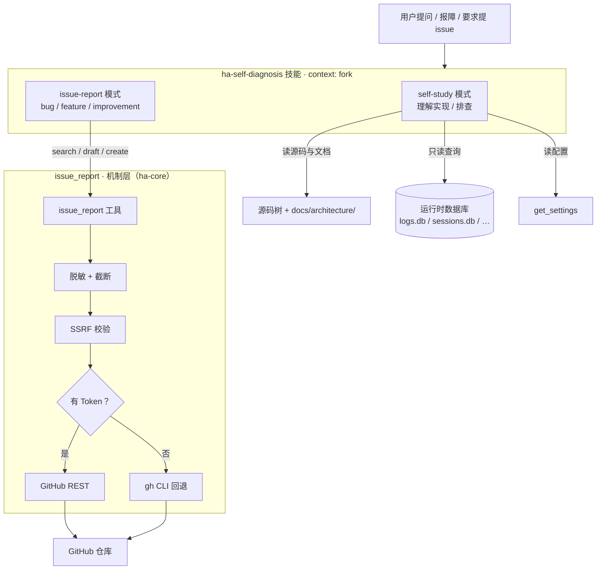
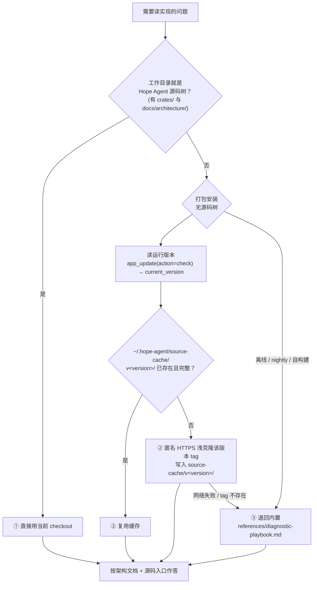
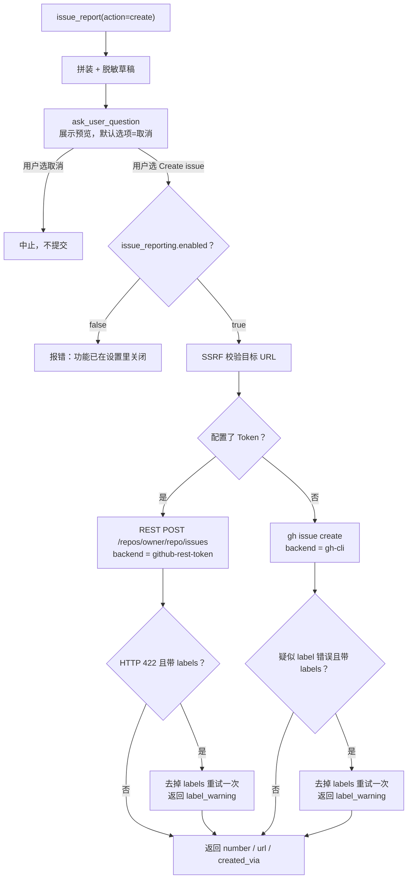
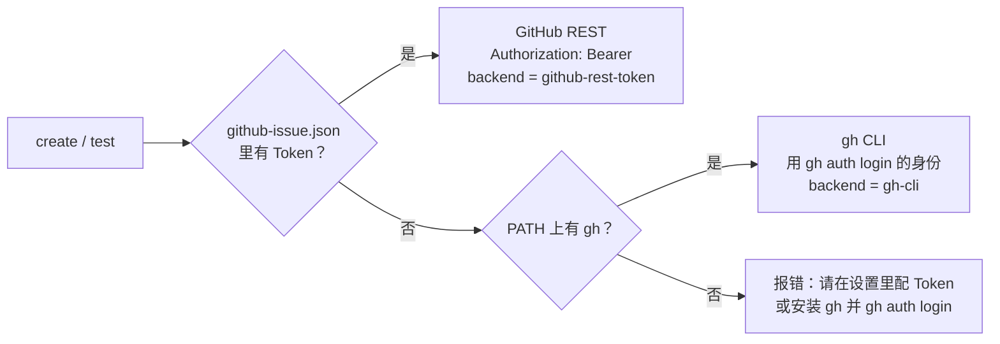

# 自我诊断与问题上报

> 返回 [文档索引](../../README.md) | 更新时间：2026-07-23

## 这个子系统解决什么

用户在用一个桌面 App 时，常会撞上两类需求：一类是"这东西内部是怎么工作的、为什么这里会失败"，另一类是"我想把这个 bug / 需求 / 改进反馈给作者"。传统做法是让用户自己去翻源码、翻文档，或者跳出应用去开一个 issue tracker，手动填模板、贴日志、还得记得把日志里的密钥擦干净。

Hope Agent 把这两件事收进对话里：**直接问助手"你自己是怎么实现的"或"帮我提个 issue"，它就地完成。** 支撑它的是两个部件，职责刻意分开：

- **`ha-self-diagnosis` 技能**——工作流大脑。它决定去读哪份架构文档、哪个源码入口、哪个运行时数据库，怎么把发现组织成回答，或者怎么把一次故障整理成一份合格的 issue 草稿。
- **`issue_report` 核心工具**——机制层。它负责真正跟 GitHub 打交道：查重、生成草稿、创建 issue，以及所有出站前的脱敏与安全校验。

一条关键边界：**这套能力只在用户 / 对话触发时运行，不跑后台健康扫描、不自动开 issue。** 诊断是被动的、由人发起的；创建 issue 永远要用户在工具内二次确认。

---

## 系统总览



技能负责"判断与编排"，工具负责"执行与安全"。技能跑在 `context: fork` 子上下文里——源码阅读、日志查询、诊断片段都留在分叉里，不会把父对话撑大。

---

## `ha-self-diagnosis` 技能：工作流大脑

技能定义在 `skills/ha-self-diagnosis/SKILL.md`，属编译期内嵌的内置技能。关键元数据：

| 字段 | 值 | 含义 |
| --- | --- | --- |
| `context` | `fork` | 在分叉子上下文里运行，诊断噪音不污染父对话 |
| `effort` | `high` | 允许多轮深入阅读源码与数据 |
| `allowed-tools` | `read` / `grep` / `find` / `ls` / `exec` / `get_settings` / `app_update` / `issue_report` / `ask_user_question` / `sessions_*` / `session_status` | 只读式诊断 + 上报所需的最小工具集 |

它从用户请求里选**恰好一个**主模式。

### self-study 模式：理解实现与排查

回答"某功能在哪实现、某子系统做什么、某个区域怎么排障"这类问题。它的第一步是**解析出一个可信的源码根**，按优先级取第一个可用的：



几处非显然但重要的约束：

- **永远 checkout 版本 tag，绝不 `main`**——`main` 带着未发布代码，跟用户手里的二进制对不上，读它会得出错误结论。
- 克隆是**只读**的：只用 `read` / `grep` / `find`，绝不 `cargo build` / `pnpm install` / 跑仓库脚本。缓存按版本分目录（`~/.hope-agent/source-cache/v<version>/`），旧目录可安全删除。
- `docs/architecture/` 随克隆一起到达（它就在仓库里），所以文档与源码总是同版本同步。
- **不为纯运行时诊断去克隆**：日志 / 会话 / 崩溃日志已经能解释"为什么失败了"，只有 self-study 真的要读实现时才克隆。

排查的数据来源按顺序使用：

1. **实时源码与文档**——上面解析出的源码根。
2. **`~/.hope-agent/` 下的本地运行时数据**——先看 `logs.db` 与 `sessions.db`，再按子系统看 `memory.db`、`knowledge/index.db`、`cron.db`、`background_jobs.db`、`local_model_jobs.db`、`recap/recap.db`、`design/design.db`（旧的 `canvas/canvas.db` 已是遗留库，一般为空），以及非 DB 状态 `crash_journal.json` / `config.json`。
3. **`get_settings`** 交叉核对配置与运行时行为。
4. **技能内置参考**——`references/diagnostic-playbook.md`（其"Subsystem Reference"逐个子系统列出对应的架构文档、入口模块、数据库、稳定日志 category）与 `references/issue-template.md`。

**只读硬约束**：查 SQLite 一律 `sqlite3 -readonly` 或 Python `mode=ro` URI，只跑 `SELECT` / `.schema` / `.tables`。

### issue-report 模式：把故障或诉求整理成 issue

用于用户要求提交 issue、提需求、记录改进或报 bug。**不要求真有 bug**——用户明确提出的需求或改进本身就是合法的上报任务。工作流：

1. 把 `kind` 归类为 `bug` / `feature` / `improvement`。
2. 收集上下文（bug 收版本 / 平台 / 运行模式 / 报错 / 复现步骤；feature 收用户故事 / 动机 / 期望行为 / 验收标准；improvement 收当前摩擦 / 建议行为 / 取舍 / 验收标准）。
3. 若设置项 `duplicateCheckEnabled` 为真，先 `issue_report(action="search")` 查重。
4. `issue_report(action="draft")` 生成草稿；若用户尚未明确要求提交，先把草稿摘要给用户看。
5. `issue_report(action="create")` 只在用户要求提交或批准草稿后调用——**工具自身还会在真正提交前再问一次确认**。

---

## `issue_report` 工具：机制层

工具入口在 `crates/ha-core/src/tools/issue_report.rs`，业务逻辑在 `crates/ha-core/src/issue_reporting.rs`。三个动作：

| action | 是否需要 Token | 是否弹确认 | 做什么 |
| --- | --- | --- | --- |
| `search` | 否 | 否 | 在配置仓库里搜**开着的** issue（默认 10 条） |
| `draft` | 否 | 否 | 生成一份脱敏后的草稿，不接触 GitHub |
| `create` | 否（可回退 gh） | **是** | 用户在工具内确认后，用 Token 或 `gh` CLI 提交 |

`issue_kind` 只有 `bug` / `feature` / `improvement` 三种，缺省为 `bug`。

**草稿的正文是拼出来的**：以 `body` 为基底，若带了 `duplicateIssueUrls` 追加一段 `## Possible duplicates checked`，若带了 `evidence` 追加一段 `## Diagnostic evidence`，整体再交给脱敏与截断。

### create 的确认与执行



几处关键行为：

- **确认无法被调用方越过**：即便技能已经把草稿展示给用户，`create` 仍会自己弹一次 `ask_user_question`，且默认选中"取消"。这是红线。
- **`enabled` 是执行期闸门**：设置里关掉后，即使模型硬调 `create` 也会被拒。
- **标签容错**：GitHub 若因标签不存在而拒绝（REST 返回 422 / gh 报 label 错误），工具会**自动去掉标签重试一次**，成功后在结果里带一条 `label_warning` 说明标签被丢弃——issue 照样建成，不会因为一个坏标签整体失败。

---

## 凭据与后端

`issue_report` 有两条出站后端，按"是否配置了 Token"择一：



- **Token 是可选的，且不进 `config.json`**。若配置，它单独落在 `~/.hope-agent/credentials/github-issue.json`（形如 `{"token": "…"}`），写入必经 `platform::write_secure_file`（0600 权限）；清空 Token 即删文件。路径由 `ha_base::paths::github_issue_credential_path()` 给出。
- **无 Token 时回退用户已登录的 `gh` CLI**：沿用 `gh auth login` 的身份，Hope Agent 既不读取也不持久化那份凭据。`create` / `test` 缺 Token 又没有 `gh` 时报错引导用户二选一。
- **`search` 择路相同但更宽松**：有 Token 走 REST、无 Token 有 `gh` 走 `gh`，两者都没有时回退匿名 GitHub REST 搜索（公开仓库搜索无需鉴权），不会报错。查重每次几乎都会触发 `search`，因此它在无凭据环境下照常可用。
- `test_connection` 会如实报出用的是哪条后端（`github-rest-token` 或 `gh-cli`）。
- **GitHub Enterprise**：`apiBaseUrl` 非默认时，REST 走该 base，`gh` 参数自动带上从 base 解析出的主机名（`host/owner/repo`）。

---

## 脱敏与安全边界

所有可能出站或落到 issue 正文的文本，都先过 `sanitize_issue_text`：

```
输入 → logging::redact_sensitive（通用脱敏）
     → Authorization / Bearer 头置换为 [REDACTED]
     → 常见密钥形态正则置换（sk-/pat-、github_pat_、gh[pousr]_、AIza…、xox[abp]-）
     → 超长按 UTF-8 边界截断
```

各处的上限（按 UTF-8 字节截断，非字符；单一来源在 `issue_reporting.rs` 常量）：

| 内容 | 上限 | 来源 |
| --- | --- | --- |
| Issue 标题 | 256 字节，且压成单行 | `sanitize_issue_title` |
| Issue 正文 / 证据 | `maxEvidenceChars`（默认 24000 字节） | `IssueReportingConfig.max_evidence_chars` |
| GitHub 错误回显 | 2000 字节 | `MAX_GITHUB_ERROR_CHARS` |

其余安全边界：

- **出站必过 SSRF**：`search` / `create` / `test` 的每个目标 URL 都先经 `security::ssrf::check_url`（策略 `Default` + 配置的 `trusted_hosts`）。新入口严禁自写 IP 校验。
- **仓库名校验**：`owner` / `repo` 必须非空、≤100 字符、只含 `A-Za-z0-9-_.`，挡掉路径注入。
- **创建永远要用户确认**——见上文，红线。
- **上报 Token 绝不回显**：不进聊天、不进日志、不进 issue 正文。连 GitHub 返回的错误体也先脱敏再展示。

---

## 配置

`AppConfig.issue_reporting`（wire 类型 `IssueReportingConfig`，定义在 `crates/ha-config-schema/src/issue_reporting.rs`）：

| 字段（camelCase） | 默认值 | 说明 |
| --- | --- | --- |
| `enabled` | `true` | 总开关；关闭后 `create` 被执行期拒绝 |
| `owner` | `shiwenwen` | 目标仓库 owner |
| `repo` | `hope-agent` | 目标仓库名 |
| `apiBaseUrl` | `https://api.github.com` | 支持 GitHub Enterprise |
| `labelsByKind.bug` | `["bug"]` | bug 的默认标签 |
| `labelsByKind.feature` | `["enhancement"]` | feature 的默认标签 |
| `labelsByKind.improvement` | `["improvement"]` | improvement 的默认标签 |
| `maxEvidenceChars` | `24000` | 正文脱敏后的截断上限 |
| `duplicateCheckEnabled` | `true` | 是否在上报前建议查重 |

默认目标仓库即 `shiwenwen/hope-agent`。

**设置三件套齐全**：面向用户的 GUI 入口是 `src/components/settings/IssueReportingPanel.tsx`；模型侧走 `get_settings` / `update_settings` 的 `issue_reporting` category（风险级 `medium`）。注意分工——**配置项（owner / repo / labels 等）可经 `update_settings` 写，但 Token 只能在 GUI 里改**：设置工具对 Token 只暴露一个 `hasToken` 布尔，读不到明文、也写不了。

**四条 transport 命令**（Tauri 命令 ↔ HTTP 端点一一对应）：

| 用途 | Tauri 命令 | HTTP 端点 |
| --- | --- | --- |
| 读配置 + Token 状态 | `get_issue_reporting_config` | `GET /api/config/issue-reporting` |
| 存配置 | `save_issue_reporting_config` | `PUT /api/config/issue-reporting` |
| 存 / 清 Token | `save_issue_reporting_token` | `PUT /api/config/issue-reporting/token` |
| 测试连通性 | `test_issue_reporting_connection` | `POST /api/config/issue-reporting/test` |

---

## 关联文档

- 技能机制与内置嵌入：[skill-system](../agent/skill-system.md)
- 工具定义、可见性与调度：[tool-system](../core/tool-system.md)
- 审批唯一入口与 `ask_user_question`：[permission-system](../agent/permission-system.md) / [ask-user](../agent/ask-user.md)
- 脱敏与 SSRF 出站门：[logging](logging.md) / [security](security.md)
- 逐子系统排障索引：`skills/ha-self-diagnosis/references/diagnostic-playbook.md`
- 命令 / 端点全表：[api-reference](../system/api-reference.md)
