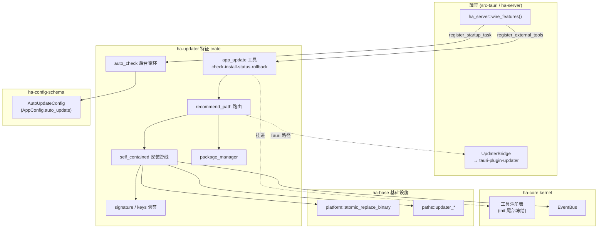
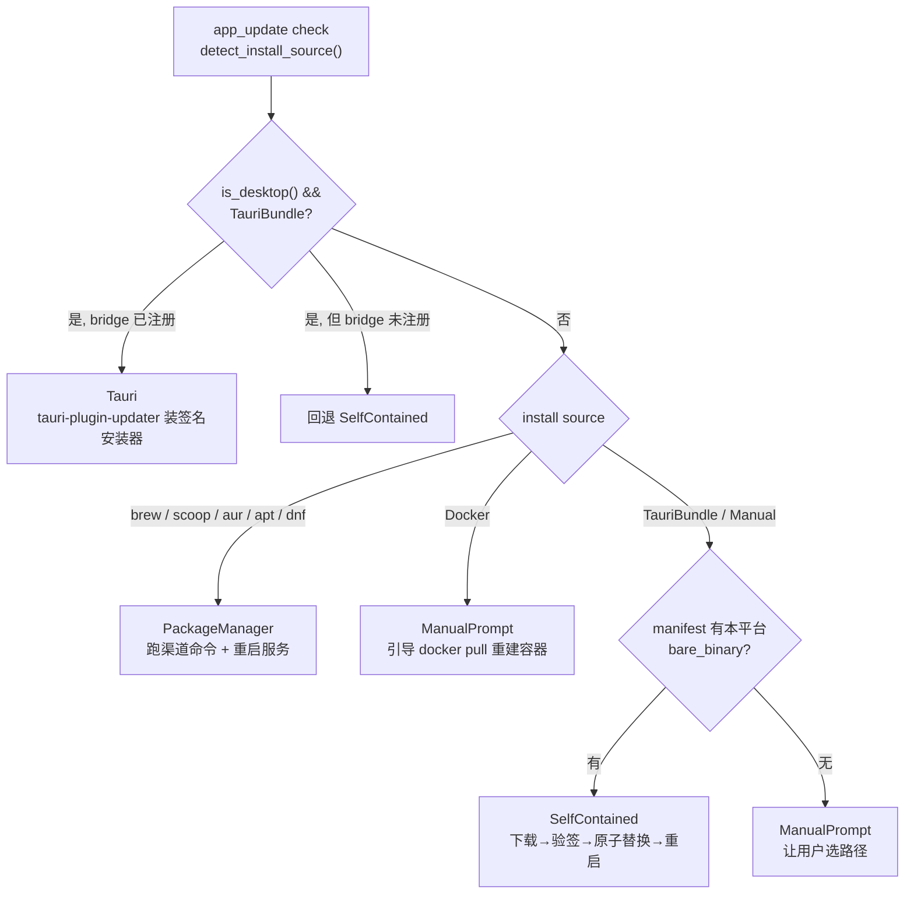
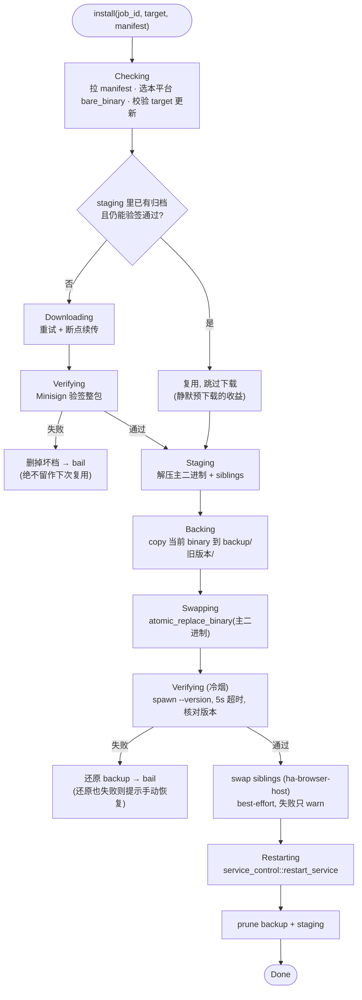
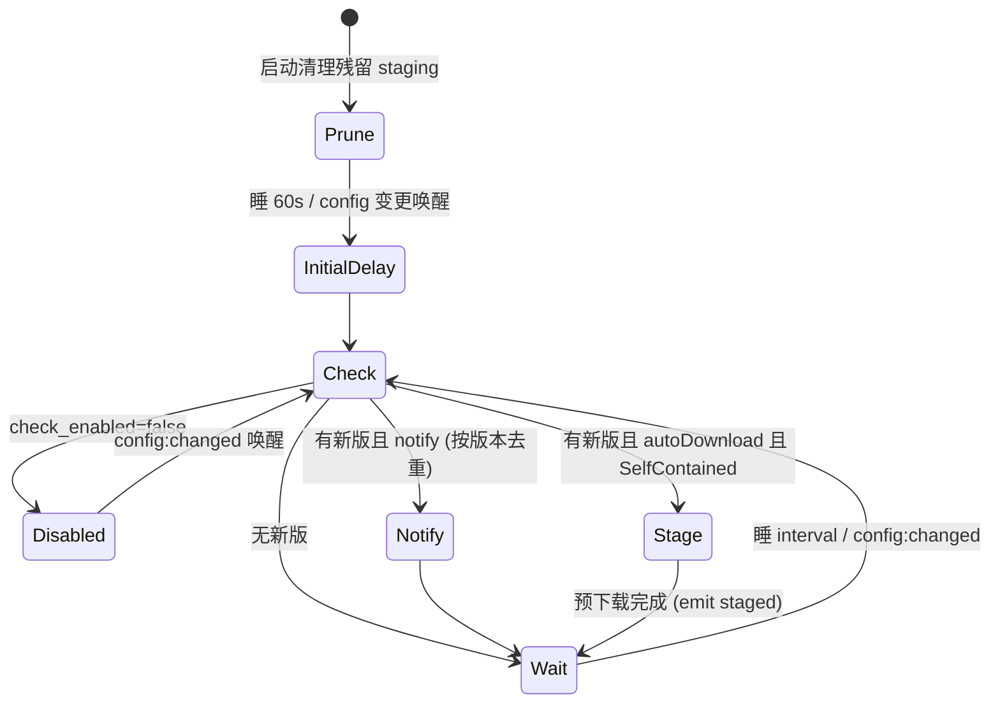
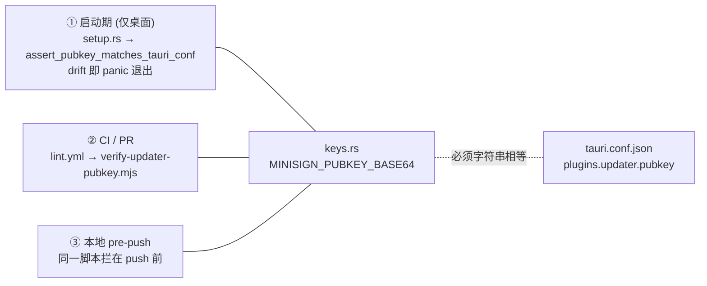
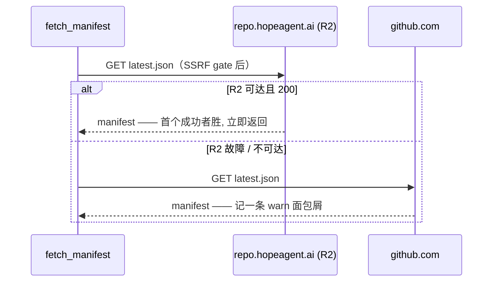

# 自升级（Self-Update）

> 关联源码：[`crates/ha-updater/src/`](../../../crates/ha-updater/src) · [`crates/ha-updater/src/tool.rs`](../../../crates/ha-updater/src/tool.rs) · [`crates/ha-core/src/tool_defs/update_tools.rs`](../../../crates/ha-core/src/tool_defs/update_tools.rs) · [`crates/ha-base/src/platform/`](../../../crates/ha-base/src/platform) · [`src-tauri/src/commands/update_bridge.rs`](../../../src-tauri/src/commands/update_bridge.rs) · [`skills/ha-self-update/SKILL.md`](../../../skills/ha-self-update/SKILL.md)

## 核心思想

Hope Agent 是一份 binary、三种形态（桌面 GUI / `hope-agent server` 守护进程 / `hope-agent acp`），却经由许多渠道装到用户机器上：DMG / MSI / NSIS / AppImage / Homebrew cask / Scoop / AUR / 自建 apt+dnf 源 / Docker 镜像 / 手工丢一个可执行文件。「怎么升级」在每种组合里都不一样——桌面装包要走签名安装器，brew 装的要跑 `brew upgrade`，容器里换 binary 下次 `docker pull` 就被冲掉。

自升级子系统把这些差异收进**一个模型可调用的工具 `app_update`**，让模型在任意形态下按对话指令走完「检查 → 确认 → 下载 → 校验 → 替换 → 重启」，遇到自己解不了的情况就用 `ask_user_question` 把选择权交回用户。

设计上有三条贯穿始终的红线，理解它们就理解了整个子系统为什么这样运转：

1. **单一签名信任根**：任何下载到本地的产物，在覆盖任何文件之前**必须**通过 Minisign 验签，且桌面路径与 headless 路径用的是**同一把编译进二进制的 pubkey**。没有「相信 manifest 里的 SHA」这种捷径。
2. **原子替换**：换 binary 只走 `platform::atomic_replace_binary`，禁止 `fs::write` 直接覆盖运行中的可执行文件（中途崩溃会留半截文件）。换完还要冷烟自检，跑不起来就自动还原旧 binary。
3. **用户永远拍板**：`install` / `rollback` 一定弹结构化确认对话框；后台自动流程只做「检查 + 静默预下载」，**绝不**擅自替换或重启。

## 装配与边界

自升级住在**独立特征 crate `ha-updater`**里（依赖 ha-core，零 Tauri 依赖）。业务「机器」都在这个 crate，但它对 ha-core / ha-base 有几处必须对上的接线：



**装配契约**：`app_update` 的 `ToolDefinition`（schema）留在 ha-core（`tool_defs/update_tools.rs`），但真正的 handler 在 ha-updater。二者靠 `wire()` 拼起来：

- 每个会调 `ha_core::init_runtime` 的二进制**必须先调 [`ha_server::wire_features()`](../../../crates/ha-server/src/lib.rs)**——这是所有壳共用的 composition root，依次调用各特征 crate 的 `wire()`（`ha_updater::wire()` 排在首位）。生产调用点在桌面壳的 `main.rs` / `lib.rs`（mobile entry 兜底）、`hope-agent` server binary、`ha-eval` 的 adapter，另外 `server_smoke` 集成测试也复用同一份。
- `ha_updater::wire()` 做两件事：把 `app_update` 分发条目经 `register_external_tools` 挂进工具注册表；把 `auto_check::spawn_auto_update_loop` 登记为 `PrimaryOnly` 启动任务。二者都带 `std::sync::Once`，幂等。
- **漏接的症状是 fail-loud**：注册表在 init 尾部冻结，晚了直接 panic。若 `wire()` 完全没跑，schema 照常广告、dispatch 报 Unknown tool——启动期 `freeze_now` 对「有 definition 无 handler」记一条 `registry_freeze` warn（见 [tool-system](../core/tool-system.md)）。
- 配置类型 `AutoUpdateConfig` 定义在 [`ha-config-schema`](../../../crates/ha-config-schema/src/updater.rs)（`AppConfig.auto_update`），`ha_updater::config` 原地再导出；`ha-settings` 的读写分支留在 ha-core（只碰 config，不碰 updater 行为）。

## 三档升级路径

`ha_updater::recommend_path` 按「运行形态 + 安装来源」路由。安装来源由 [`source_detector`](../../../crates/ha-updater/src/source_detector.rs) 探测：它读 `current_exe()` 的路径匹配各渠道的已知布局（brew Caskroom / Scoop apps / AppImage / `/usr/bin` 下用 `dpkg`/`rpm`/`pacman` 反查归属……），`HA_DEPLOYMENT=docker` 环境变量则短路一切路径启发式。识别不出就归 `Manual`——**误判永远只会退到更保险的路径**。



| 路径 | 触发条件 | 实现层 |
| --- | --- | --- |
| `Tauri` | `is_desktop() && InstallSource::TauriBundle` 且 bridge 已注册 | `src-tauri/src/commands/update_bridge.rs` 调 `tauri-plugin-updater`；bridge 未注册（如从 bundle 里裸起 `hope-agent server`）时回退 `SelfContained` |
| `PackageManager` | install source ∈ {brew, scoop, aur, apt, dnf} | [`package_manager::upgrade`](../../../crates/ha-updater/src/package_manager.rs) 执行渠道命令；命令模板固定，无 shell 拼接 |
| `SelfContained` | 装法不可识别 / 无渠道可驱动，且 manifest 提供本平台 bare-binary 归档 | [`self_contained::install`](../../../crates/ha-updater/src/self_contained.rs)：下载 → Minisign 验签 → 原子替换 → 冷烟自检 → 重启 |
| `ManualPrompt`（Docker） | `InstallSource::Docker` | `app_update` 工具用 Docker 专属 `ask_user_question` 文案引导 `docker pull ghcr.io/.../hope-agent:vX.Y.Z` 后重建容器——**永远**走 prompt 而非 binary swap（容器内换 binary 下次 `docker pull` 就被覆盖） |
| `ManualPrompt`（其它） | 其它三档都不适用 | `app_update` 工具调 `ask_user_question` 让用户选：打开 releases 页 / 强试 self_contained / 中止 |

工具层 (`app_update install`) 接受 `prefer_path: "auto" | "package_manager" | "self_contained"` 显式覆盖 `auto` 路由；某条路径失败后，用户可通过兜底 prompt 里的选项重新指定。

## 一次自升级的完整生命周期

`SelfContained` 是最核心也最完整的一条路径——它从零把新 binary 拉下来、验签、替换、验活。理解它就理解了整个替换机制（`Tauri` 路径把这套交给 `tauri-plugin-updater`，`PackageManager` 交给系统包管理器）。



几个关键设计点：

- **staging 复用是静默预下载的收益点**。下载→验签→解压被抽成 `download_and_extract`；若 `staging/<version>/` 里已经有归档**且仍能通过签名校验**，就跳过下载直接解压。后台循环预下载的那份归档因此真正省掉 install 时的网络往返；反之校验失败的归档立即删除，绝不留作「复用」。
- **备份在替换之前**：`backup::store` 先把当前 binary 复制进 `backup/<old_version>/`，替换失败或冷烟不过时才有得还原。
- **冷烟自检卡在替换之后、重启之前**：新 binary 连 `--version` 都跑不起来（架构错 / 截断 / 缺共享库），就用最近的 backup 原子还原并 `bail!`——否则重启会把服务停在一个死镜像上。版本比对只比 `major.minor.patch` 核心，避免 `0.8.1` 被 `0.8.10` 的子串误配，也避免 `+build` / `-rc` 后缀触发假回滚。
- **sibling 替换是 best-effort**：归档里 `extra_binaries` 声明的附带可执行文件（目前只有浏览器 native host `ha-browser-host`）在冷烟通过后逐个替换到主二进制同目录；单个失败只 `app_warn` 不阻断、不回滚主升级。host 是薄帧转发桥，broker 连接期只硬校验 `PROTOCOL_VERSION`（`hostVersion` 上报但不 enforce），版本偏斜可降级容忍。
- **重启只调一次 `restart_service`**：它在每个平台上都是原子 kill+restart。当自升级跑在 daemon 自身进程里时，另发 SIGTERM 会触发本进程信号处理器的 `exit(0)`，而 systemd 的 `Restart=on-failure` 不会在干净退出后把服务拉回来——服务会带着新 binary 停着。所以刻意不额外 `stop_if_running`。

## 后台自动检查 + 静默预下载（`auto_update`）

配置单一真相源是 [`AutoUpdateConfig`](../../../crates/ha-config-schema/src/updater.rs)（camelCase，全部默认开）：

| 字段 | 含义 | 默认 |
| --- | --- | --- |
| `checkEnabled` | 是否周期后台检查 | `true` |
| `checkIntervalHours` | 检查间隔小时数，钳到 `[0.5, 168]` | `0.5`（半小时） |
| `autoDownload` | 命中新版时静默预下载 + 验签到 staging | `true` |
| `notify` | 向用户提示「可更新」/「已就绪」 | `true` |

桌面与 headless **共享同一份配置**，但走两条链路：

**headless / server**（`hope-agent server`）：[`auto_check::spawn_auto_update_loop`](../../../crates/ha-updater/src/auto_check.rs) 作为 `PrimaryOnly` 启动任务 spawn，`!is_desktop()` 才真正起循环（桌面用 JS 链路，避免双检查）。循环复用 dreaming cron loop 的形态：启动先清理残留 staging，冷启动后延迟 60s 起跑，每轮重读 `cached_config().auto_update`，并订阅 `config:changed` 事件在用户改配置时立即重排。



命中新版时 emit `app_update:available`（按版本去重，避免每轮重弹同一 banner）；`autoDownload && recommended_path == SelfContained` 时调 `self_contained::stage_only` 静默下载 + 验签到 staging（**不 swap**），emit `app_update:staged`。**循环永不自行替换 binary**——实际安装始终走用户确认的 `app_update install`。

**桌面**：[`desktopUpdater.ts`](../../../src/lib/desktopUpdater.ts) 走 `@tauri-apps/plugin-updater`，但读同一份 `auto_update` 配置驱动周期检查。命中后 `autoDownload` 时后台 `update.download()` 预下载（plugin-updater 的 `Update` 支持 download / install 分离）。这里有几处 UI 契约容易踩：

- 下载状态必须按具体 `Update` resource 身份跟踪（下载字节存在 resource 内，不能按版本串借用）；同一 release 的并发检查复用已有 resource；该缓存独立于 `notify`，关通知也不得每轮重复下载。
- 用户在静默下载中点安装时，UI 先 replay 已下载字节再订阅后续 chunk，不能一直显示 0%；响应没有 `Content-Length` 时进度条显示 indeterminate，而非伪造 0%。
- 安装成功后 resource 已被插件消费，完成状态须全局共享给所有更新 UI，后续同版本安装只进入重启流程。

GUI 入口在「设置 → 关于 → 自动更新」，命令 `get_auto_update_config` / `set_auto_update_config`（Tauri + HTTP `GET|PUT /api/config/auto-update`，写时钳 interval）。`ha-settings` 技能侧 `auto_update` 为 **HIGH** 风险（联网 + 重启 + 换 binary），写前须二次确认。

**桌面重启选择前置**：发现新版后 UI 提供两选项——「更新并重启」（装完自动 `relaunch()`）与「仅更新（稍后重启）」（装完停在「已就绪」态等用户显式点重启）。**绝不无条件自动重启**，避免打断进行中的对话。

## Web / 远程桌面统一服务端更新

[`remote_update`](../../../crates/ha-updater/src/remote_update.rs) 给 HTTP owner 平面提供与本机桌面 bundle updater **相互独立**的服务端更新目标：

| 前端形态         | 本机桌面更新 | 所连接服务端更新            |
| ---------------- | ------------ | --------------------------- |
| Web              | —            | 提醒、确认、进度、重启恢复  |
| Tauri + embedded | 有           | —（同一进程，避免重复展示） |
| Tauri + remote   | 有           | 提醒、确认、进度、重启恢复  |

- 状态写入 `~/.hope-agent/updater/remote-update-state.json`。WebSocket 事件只作低延迟提示；首次连接、重连或 lag 后，前端必重读 `GET /api/app-update/status`，不能把 EventBus 当真相源。
- `prepare` 会重新拉 manifest，并创建 5 分钟有效、绑定当前 `serverInstanceId` 的一次性 plan。`confirm` 只接受 `planId`；客户端不能提交下载 URL、命令、安装路径或 package-manager 参数。服务端版本变化、进程重启、plan 复用或过期均 fail closed。
- `prepare` / `confirm` 即使位于 Bearer 保护路由内，仍要求 Server Owner Token **确实启用**；危险逃生模式下的无鉴权 HTTP 服务不得远程触发自更新。
- Docker 在推荐层和执行层双重拒绝容器内 binary swap，仅返回拉取新镜像并重建容器的说明。其它 `ManualPrompt` 也只展示指引，不提供一键执行。
- SelfContained 在调用 service restart 前持久化 `awaiting_restart`。服务管理器拒绝重启时立即记为 `failed`；新进程启动后若运行版本等于 job 目标版本，将任务协调为 `succeeded`；否则记为 `failed/restart_failed`，保留恢复线索。
- 前端用公共 `/api/health` 的 `version` 验证重启结果。Tauri remote 只恢复 HTTP/WS 连接，不 relaunch 本机应用；由同一 server 提供静态资源的同源 Web 在目标版本上线后 reload，`index.html` 使用 `Cache-Control: no-cache`，哈希 asset 使用 immutable cache。
- Tauri 首屏前从本地 `UserConfig` 恢复已保存的 remote transport；远端不可用时留在 embedded IPC，让用户仍可进入设置修复连接。

## 下载健壮性（重试 + 断点续传）

[`download::download_to`](../../../crates/ha-updater/src/download.rs) 只负责取字节（验签是调用方的事），但取得够稳：

- 最多 `MAX_ATTEMPTS = 3` 次，指数退避 1s / 2s。
- retry 前读 `dest` 已写字节，带 `Range: bytes=<n>-` 续传：服务端回 `206` 续写、回 `200` 说明忽略了 range 就 truncate 重来、回 `416` 说明范围越界就删档重来。
- 只有网络 / IO / 5xx 才重试；SSRF 拒绝 / 4xx / 超 `MAX_DOWNLOAD_BYTES`（256 MiB 上限，防篡改 manifest 指向巨型 blob 塞满 home）直接 bail。
- 完成后比对总字节（从 `Content-Length` 或 206 的 `Content-Range` 得），拦短读——否则截断的包会以更难懂的「验签失败」冒出来。
- 每 5% 或每 1s（先到者）throttle 一次 `app_update:progress`，避免刷爆 EventBus。

出站 URL 一律先过 `security::ssrf::check_url`（`Default` 策略拦私网 / link-local / metadata IP，但放行 loopback 以支持本地镜像与测试 wiremock）；代理经 `apply_proxy_for_url` 解析，让企业 / 系统代理后的用户也能到达发布服务器。

## 签名信任根（单一 Minisign Pubkey）

整个信任根就一把 key：[`ha-updater/src/keys.rs::MINISIGN_PUBKEY_BASE64`](../../../crates/ha-updater/src/keys.rs)，以「pubkey 文件整体再 base64」的形式内嵌，与 `tauri-plugin-updater` 从 `tauri.conf.json` 读的形状一致。这把 key 必须与 `src-tauri/tauri.conf.json#plugins.updater.pubkey` **字符串相等**——否则桌面 `tauri-plugin-updater` 和 headless `signature::verify_bytes` 会用不同 pubkey，其中一边会静默坏掉。三重防线保证它俩不漂移：



私钥（`TAURI_SIGNING_PRIVATE_KEY` + `TAURI_SIGNING_PRIVATE_KEY_PASSWORD`）只存 GitHub Secrets，release.yml 调 `pnpm tauri signer sign` 用同一私钥同时签桌面 installer 和 bare-binary archive。私钥严禁入仓。

> `endpoints` 是同类的「双处必须一致」契约，但校验脚本不同（`verify-updater-endpoints.mjs`），且没有启动期 panic——端点写错只会拉不到 manifest，不会用错密钥验签。详见下面「Manifest 端点链」。

## 发布产物（latest.json 扩展）

单次 release 由 [`release.yml`](../../../.github/workflows/release.yml) 产出两套产物，最终汇总到同一个 `latest.json`：

- **桌面 installer**：`tauri-action` 输出 DMG / MSI / NSIS / AppImage + 各自 `.sig`，写入 `latest.json#platforms.<plat>.{url, signature}`（沿用 tauri-action 原生格式，我们不改写）。
- **裸 binary archive**：每个平台 build job 末尾把 `hope-agent[.exe]` 与浏览器 native messaging 桥 `ha-browser-host[.exe]`（由 `beforeBuildCommand` 的 `prepare:browser-host` 构建到同一 target 目录）一起打 `tar.gz`（Unix）/ `zip`（Windows），用同一私钥签，上传 `.tar.gz` + `.sig` 到 release。附带 host 让 bare-binary 部署也能装扩展后端的 native host。
- **manifest 合并**：`patch-manifest` job（`needs: build`）下载所有 `bare-binary-*` artifact 与 release 上的 `latest.json`，跑 `scripts/patch-latest-json.mjs` 注入 `bare_binary.platforms.<plat>.{url, signature, archive, binary_path, extra_binaries}` 后重新上传。

manifest 结构（[`ha_updater::manifest::Manifest`](../../../crates/ha-updater/src/manifest.rs)）：

```json
{
  "version": "0.2.1",
  "notes": "...",
  "pub_date": "...",
  "platforms": {
    "darwin-aarch64": { "url": "...", "signature": "..." }
  },
  "bare_binary": {
    "platforms": {
      "linux-x86_64": {
        "url": "...",
        "signature": "...",
        "archive": "tar_gz",
        "binary_path": "hope-agent",
        "extra_binaries": ["ha-browser-host"]
      }
    }
  }
}
```

- `bare_binary` 与 `extra_binaries` 都是 `#[serde(default)]`：旧 manifest 缺字段时解析为空——无 bare_binary 即退回包管理器路径或提示用户，无 siblings 即不 swap。
- 平台 key 与 tauri-action 一致：`{darwin,linux,windows}-{x86_64,aarch64}`，由 `manifest::current_platform_key` 在运行时返回当前平台串。
- **回滚只还原主二进制**：sibling 从不进 backup，`app_update rollback` 后主 binary 退回、sibling 保持新版并 `app_warn` 记录偏斜——回到匹配版本只能靠下次升级。`ha-browser-host` 版本随 `sync-version.mjs` 与整个产品同步 bump，令 `hostVersion` 能真实区分新旧。

## Manifest 端点链（R2 镜像优先，GitHub 兜底）

端点列表在两处，**必须逐项逐序相等**：`src-tauri/tauri.conf.json#plugins.updater.endpoints`（桌面读）与 [`manifest.rs::UPDATE_MANIFEST_URLS`](../../../crates/ha-updater/src/manifest.rs)（headless / CLI）。当前顺序：

1. `https://repo.hopeagent.ai/download/latest.json` —— Cloudflare R2 镜像
2. `https://github.com/shiwenwen/hope-agent/releases/latest/download/latest.json` —— GitHub



**镜像排第一不是延迟优化，是可达性**：有一部分用户根本访问不了 `github.com`，对他们而言 manifest 拉不到就等于自动更新整条链断掉——里面的安装包 URL 连被读到的机会都没有。GitHub 排第二，保证 Cloudflare / R2 整体故障时其余用户仍能更新。

**两条约束**：

- **首个成功者胜**，与 `tauri-plugin-updater` 自身行为一致——刻意不做「比较版本取新者」，否则桌面与 headless 两条路径会对「当前是哪个版本」产生分歧。代价是**一份 stale-but-200 的镜像 manifest 会报「已是最新」而不会 fallback**。这条残留风险由三件事兜住：镜像 manifest 的短 `Cache-Control`、镜像 workflow 只在全部 URL 回抓校验通过后才写 manifest（所以 stale 的那份必然描述一个真实且已完整镜像的版本，绝不会是残缺版本）、以及该 workflow 失败即报错。
- **两处漂移会被拦**：`scripts/verify-updater-endpoints.mjs` 在 CI（`lint.yml`）与 `pre-push` 双处校验，且同时校验镜像 endpoint 域名与 [`mirror-release-r2.yml`](../../../.github/workflows/mirror-release-r2.yml) 的 `PUBLIC_BASE` 一致——否则所有客户端会去问一个没有发布任何东西的主机。

**镜像不削弱签名信任根**：manifest 自身不签名，但里面的 `signature` 要用编译进二进制的 pubkey 验（见上节）。所以被污染的镜像**无法通过自动更新把恶意二进制装进去**，最坏只能拒绝服务或谎报版本。镜像 workflow 因此原样复制 `signature`、**绝不重算**。

**这条保证只覆盖 updater 路径**。`verify_bytes` 的调用点只有 [`self_contained.rs`](../../../crates/ha-updater/src/self_contained.rs)；README 上的手动下载链接指向同一个镜像，但那些安装包由系统安装、不经这道验签——与从 GitHub 手动下载的情况相同。对外描述镜像安全性时不要把范围写成「安装包一律验签」。

**「谎报版本」正常运维就能踩到**：`download/latest.json` 是全局共享的可变对象，一旦给**非当前稳定版**写它（手动回填旧 tag、或发布 prerelease，两者都会触发镜像 workflow），配合上面「首个成功者胜」，全体客户端会被告知那个旧版本才是最新，从而看不到真正的新版。因此镜像 workflow 只在该 tag 恰好是 GitHub 认定的 latest release 且非 prerelease 时才写可变面（`PROMOTE` 门控），其余情况只写自己的不可变 `download/<tag>/` 前缀。镜像的 bucket 布局与发布顺序见 [release-process §1.10](../../release-process.md#110-r2-安装包镜像自动同步)。

## 跨平台 binary swap

换 binary 的统一入口是 [`platform::atomic_replace_binary`](../../../crates/ha-base/src/platform/mod.rs)（Unix / Windows 各一实现，暴露在 ha-base，ha-core 与 ha-updater 都经 `ha_core::platform::…` 走它）。成功后 `target` 一定指向一个可用的可执行文件；失败后也保证 `target` 仍有效（原件，或 Windows 上从 aside 还原）。

| 平台 | 机制 |
| --- | --- |
| Unix | `set_permissions(source, 0o755)` → `rename(source, target)`。`rename(2)` 只改 dirent 不动 inode，正在运行的进程继续读旧 inode，新 `exec(2)` 才加载新 image。跨卷（`EXDEV`）时回退：在 target 目录建 sibling tempfile → `copy` → `fsync`（确保 rename 前落盘）→ `rename`，保住同样的原子性。 |
| Windows | 快路径先 `MoveFileExW(source → target, REPLACE_EXISTING \| WRITE_THROUGH)`；若因 binary 在用返回 `ERROR_SHARING_VIOLATION`(32)/`ERROR_ACCESS_DENIED`(5)，则 `MoveFileExW(target → target.old)` 把在用 binary 让位，再原子发布新 image，最后 `MoveFileExW(target.old, NULL, DELAY_UNTIL_REBOOT)` 调度旧 image 重启时清理。发布失败会把 aside 还原回 target，不留断片。 |

**不允许 `fs::write` 直接覆盖运行中的 binary**——即使 Unix 上能 work，崩溃中途会留半截文件。

### macOS 桌面 updater 的 EXDEV 守卫

上面的 `atomic_replace_binary` 只覆盖 **headless `SelfContained`** 路径。**桌面 `Tauri`** 路径的 swap 由 `tauri-plugin-updater` 自己做：它用 `tempfile::Builder` 把新 `.app` 解压进默认临时目录，再 `std::fs::rename` 把旧 bundle 移到备份、新 bundle 移到安装位置。当应用运行在与临时目录不同的卷（外置 / 独立数据卷等）时，**第一步 rename 就返回 `EXDEV`**（"Cross-device link (os error 18)"）导致更新中断——插件把任何非 `PermissionDenied` 的 rename 错误都当致命错误（`EXDEV` **不会**触发 AppleScript / copy 兜底），且 macOS 路径不像 Linux AppImage 路径那样有「多候选目录 + 同 `dev()` 校验」兜底。

防御在启动早期 `src-tauri/src/lib.rs::run()` 顶部调用 [`platform::redirect_updater_tmpdir_if_cross_volume`](../../../crates/ha-base/src/platform/mod.rs)：macOS 上若 `.app` 所在卷（比 `dev()`）≠ 默认临时目录卷，则在 `.app` 父目录下建 `.hope-agent-updater-tmp`、**复核该目录 `dev()` 确实落在 bundle 卷**后，用 `tempfile::env::override_temp_dir` 把 **`tempfile` 库的进程内默认临时目录**改到那里，使插件两次 rename 都留在同卷内。返回三态 `UpdaterTmpdir`：

- `Redirected(path)`：已改到 bundle 卷。
- `Unchanged`：同卷 / 非 bundle / 非 macOS，no-op。
- `CrossVolumeUnfixable`：跨卷但无法在同卷建临时目录（只读挂载如 DMG、或父目录不可写）；此时无能为力，`run()` 落一条 warn 面包屑提示用户装到 `/Applications`。

**为何用 `tempfile` 覆盖而非改 `$TMPDIR` 环境变量**：`override_temp_dir` 只改 `tempfile` 库在**本进程**内的默认目录（插件正是用 `tempfile::Builder` 暂存，故生效），**不动 `$TMPDIR`**——因此 `exec` / hooks / MCP 等**子进程**（会继承、甚至显式 whitelist `$TMPDIR`）仍用每用户系统临时目录，不会把临时文件写到应用旁边。`override_temp_dir` set-once + 线程安全，故 `run()` panic-restart 重入无害。**为何 startup 设而非包在某次更新外**：桌面更新两个入口都独立驱动插件 Rust install——GUI「检查更新」菜单走 JS（`desktopUpdater.ts`）、`app_update` 工具走 `update_bridge`；只包一个 call site 会漏掉另一个。普通装在引导卷（= 临时目录同卷）一律 no-op，进程内 temp 改道的代价只由罕见跨卷用户承担。

## Service restart 契约

binary 换好后 [`service_control::restart_service`](../../../crates/ha-updater/src/service_control.rs) 按平台重启用户级服务：

| 平台 | 命令 |
| --- | --- |
| macOS | `launchctl kickstart -k gui/$UID/ai.hopeagent.server` |
| Linux | `systemctl --user restart hope-agent.service` |
| Windows | `schtasks /End /TN "Hope Agent"` 然后 `/Run /TN "Hope Agent"`（计划任务没有内建 restart 动词） |

成功约 1-2s 不可用窗口。已注册 service 时由 OS 重启；未注册时（用户从终端 `hope-agent server start`）返回 best-effort 提示让用户手动重启。

**桌面 GUI 进程的「重启」是用户手动操作**——`update_bridge.rs` 刻意不调 `app.restart()`，避免升级中切断用户正在打的字。前端安装完成后的按钮路径调 `@tauri-apps/plugin-process` 的 `relaunch()`，它映射到 `AppHandle::request_restart()`：Tauri 先发 `RunEvent::Exit` 给插件，`tauri-plugin-single-instance` 在这个事件里释放 mutex / socket，随后才由 Tauri 拉起新进程。

## Backup / rollback

升级前 [`backup::store`](../../../crates/ha-updater/src/backup.rs) 把当前 binary 复制到 `~/.hope-agent/updater/backup/<old_version>/hope-agent[.exe]`。保留最近 **2 个**版本（按目录 mtime 排序），多的自动 prune——够「升级失败后降级」，又不至于让几 MB 的 binary 常年堆成 GB。

`app_update rollback` 取 `backup::most_recent`（按 mtime 排序）→ 调 `atomic_replace_binary` 还原 → restart service，同样需 Yes/No 确认。

staging 与 backup 是两棵独立的树：[`staging::prune`](../../../crates/ha-updater/src/staging.rs) 在启动时、每次重新 stage 前、install 成功后调用，清掉非目标版本或早于 7 天的 staging 子目录（best-effort，仅 log 不 fail），**永不触及 backup 树**。它也刻意保留「另一个版本但仍新鲜」的 staging 目录——那可能是并发的手动 `install` 正在下载的档，中途删掉会抛困惑的 IO 错，等它 stale 才在后续 pass 清。

## 用户审批契约与异步跟踪

`app_update install` / `app_update rollback` **永远**通过 [`tools::ask_user_question::execute`](../../../crates/ha-core/src/tools/ask_user_question.rs) 弹结构化 Yes/No 确认。确认逻辑在工具内部实现，而不是借 `permission::engine` 的通用审批，原因有三：

1. `AskReason` enum 没有 `SystemUpdate` 变体，挪用现有 `EditTool` / `DangerousCommand` 语义不对；
2. 确认对话框要承载完整升级 plan（current → target / 升级路径 / 服务中断提示 / release notes 摘要），通用审批 dialog 装不下这些字段；
3. `ask_user_question` 自带 pending 持久化 + replay，用户重启 App 也能续上。

确认收到 Yes 后，工具 spawn 一个**独立 OS thread**（`std::thread::spawn` 内建 current-thread runtime）跑 install pipeline，主线程立刻返回 `{job_id, status: "started", ...}` 给模型。刻意不走 `async_jobs`，避免 tool dispatch 二次劫持这条带 binary swap 的管线（工具本身是 `BackgroundPolicy::GenericJob`，模型仍可对整个工具调用叠 `run_in_background`）。

**为什么不走 `background_jobs.db`**：install 一旦开始就不能被外部 cancel 中断（中途断电留下 staging 半成品，重启后用户重跑即可，不需要持久化进度）。所以进度只记在 in-memory tracker（`Mutex<HashMap>` 单例），模型查 `app_update(action="status", job_id=...)`，终态时填 `outcome` / `error`；进程重启后 tracker 清空，查不到的 job 回 `unknown`。tracker 里的完成/失败条目过 24h 自动 prune。

### 两套 `phase` 别混淆

| 来源 | 取值 | 谁看得到 |
| --- | --- | --- |
| **tracker 持久化 phase** | `starting`（建键） / `running`（`update_phase` 唯一调用点） / `done`（`finalize_ok`） / `failed`（`finalize_failed`） / `unknown`（查不到 job） | `action=status` 返回的粗粒度值 |
| **细粒度 phase**（`self_contained::Phase`） | `checking` / `downloading` / `verifying` / `staging` / `backing` / `swapping` / `restarting` / `done` | 只经 `emit_phase` 推到 EventBus，**从不写进 tracker** |

若想让 status 工具也反映细粒度阶段，需在 `emit_phase` 旁同步调 `update_phase`（当前未做）。

进度事件通过 EventBus 推到 UI：

| 事件 | 何时 | 载荷要点 |
| --- | --- | --- |
| `app_update:progress` | 下载中（每 5% 或 1s 节流）+ 阶段切换 | 下载帧含 `phase`(downloading/downloaded) / `percent` / `written` / `total`；阶段帧 `label: "lifecycle"`，`phase` 为细粒度值 |
| `app_update:completed` | 终态一次性 | `status` + `outcome` 或 `error` |
| `app_update:available` | 后台检查发现新版（去重后） | `currentVersion` / `version` / `notes` / `pubDate` / `recommendedPath` |
| `app_update:staged` | 静默预下载完成 | `version` |

## 桌面 ↔ headless 协调（双进程并发）

用户可能桌面 GUI 在跑，同时 `hope-agent server` 跑 daemon，两者共享同一 binary 文件。当前实现：桌面走 `Tauri` 路径（`tauri-plugin-updater` 独立处理 dmg / installer / AppImage 替换语义），daemon 独立检查后走 `SelfContained` 替换 binary 再 restart。**跨进程互斥锁未接入**——双进程并发升级会有竞态（实际场景罕见，两端通常不会同时触发）；需要时再加 advisory file lock。

## 失败路径 → 兜底 `ask_user_question`

工具内部失败处理参考 [`tool.rs::prompt_manual_install`](../../../crates/ha-updater/src/tool.rs) 模板。Skill [`ha-self-update`](../../../skills/ha-self-update/SKILL.md) 的「When things fail」章节列了每种错误关键字的兜底方案——模型按该决策树触发兜底 prompt，而不是自己 retry（乱试可能弄坏安装）。

## 有意不做的部分

- 双进程零停机 socket handoff。
- **全自动无人值守安装**（不经任何用户审批就 swap + restart）——后台只做检查 + 静默预下载，实际安装 / 重启仍需用户确认。
- Beta / nightly channel 切换（manifest 只有 stable）。
- 跨架构迁移（Intel mac → Apple silicon 自动切换 platform_target）。
- 升级前事务性快照配置 db（升级不改 user data，rollback 只需 binary）。
- 按 tag 精确 pin 安装：manifest 只描述最新 tag，`target_version` 与它不一致时工具直接拒绝并提示手动下载，而不是静默装成最新。

## 测试矩阵

- 单元：每个 sub-module 内部 `#[cfg(test)] mod tests`（keys / manifest / signature / source_detector / backup / self_contained / lib 路由 / tool 确认解析等）。
- 集成：[`tests/updater_e2e.rs`](../../../crates/ha-updater/tests/updater_e2e.rs) 用 wiremock 测 manifest fetch + binary swap round-trip。
- 手动端到端：见本文「三档升级路径」——每个 path × 每个平台至少跑一次 release 验证。
