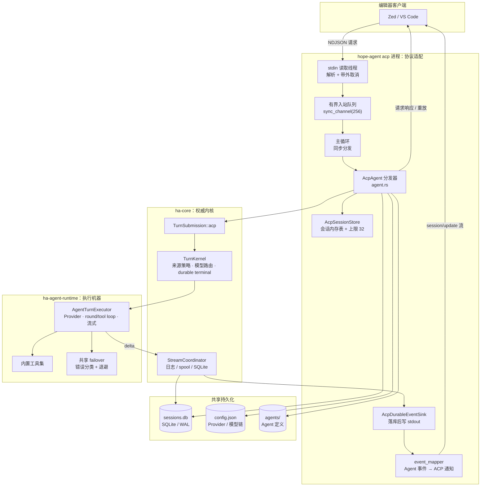
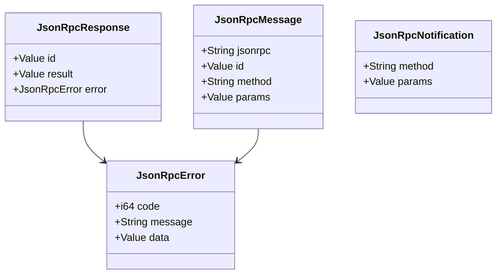
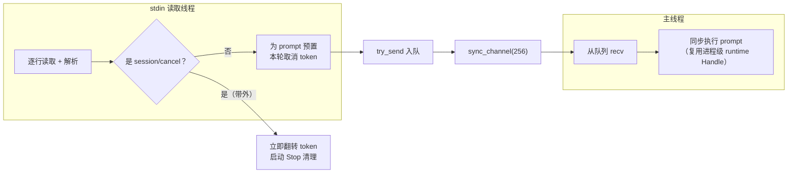
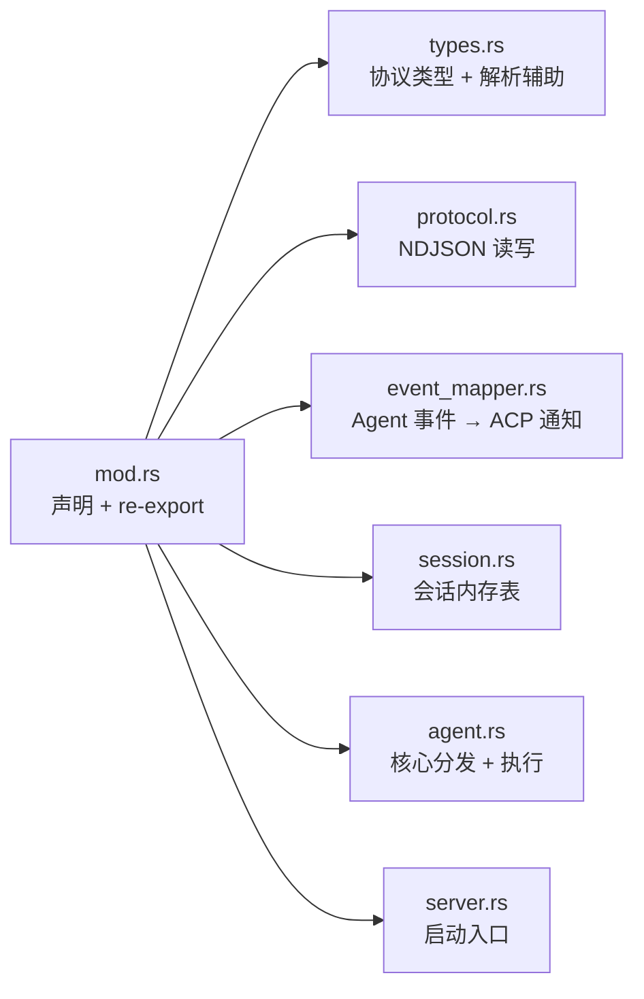
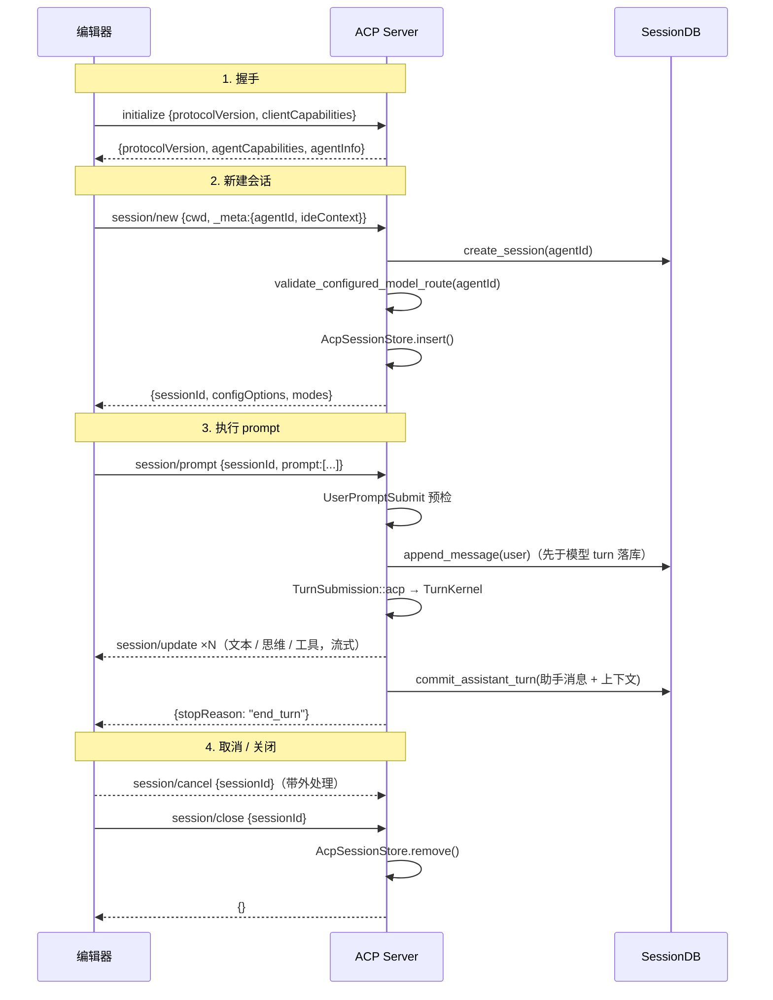
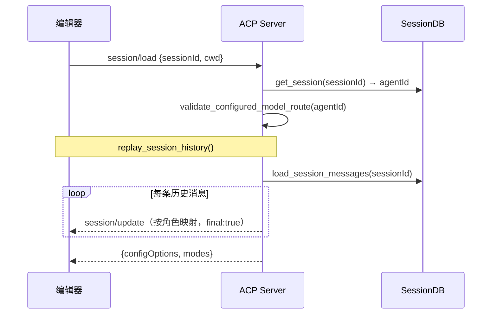
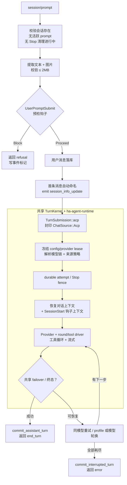
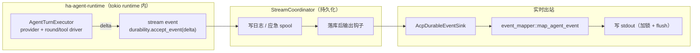
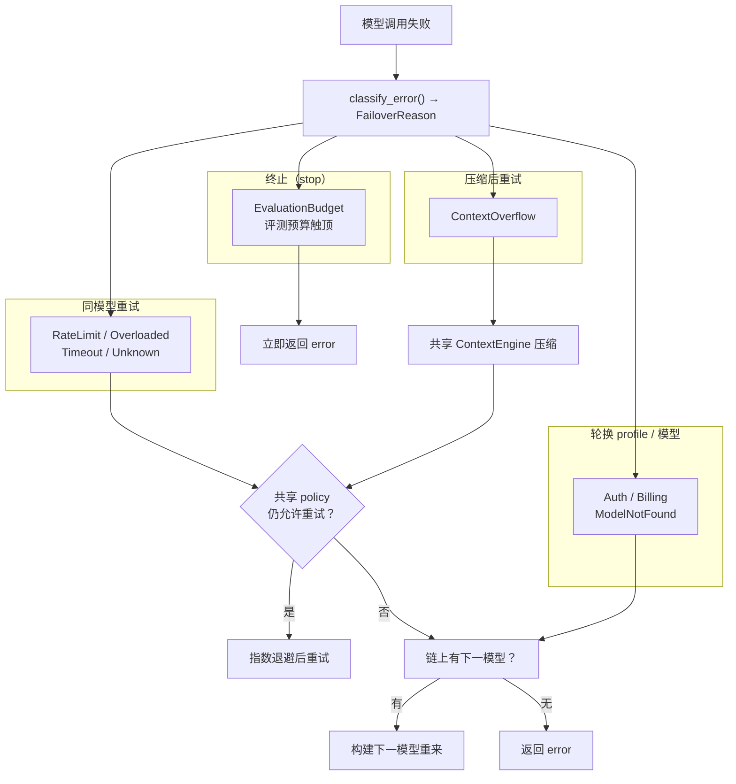
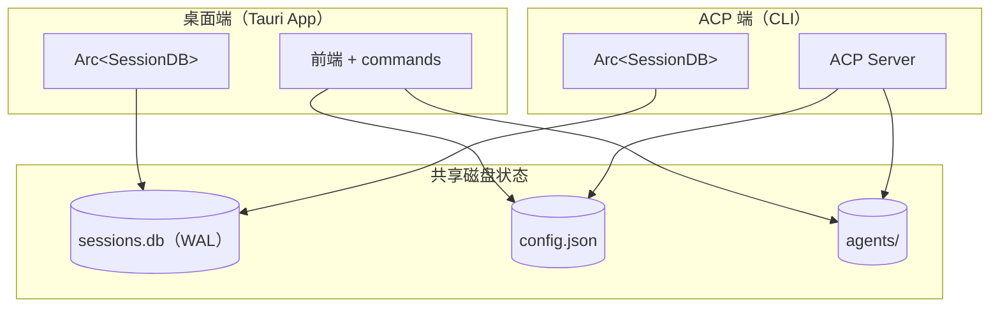

# ACP（Agent Client Protocol）

> 返回 [文档索引](../../README.md)

**关联源码**

- `crates/ha-acp/src/acp/` —— Hope Agent 作为 ACP **服务端**（`hope-agent acp` 模式）
- `crates/ha-acp/src/acp_control/` —— Hope Agent 作为 ACP **客户端**（`acp_spawn` 工具驱动外部 agent）
- `crates/ha-acp/src/lib.rs` —— 特征 crate 装配入口 `wire()`
- `src-tauri/src/main.rs::run_acp_server` —— `acp` 子命令入口
- `crates/ha-core/src/chat_engine/turn_kernel.rs` · `crates/ha-core/src/chat_engine/durability.rs` · `crates/ha-agent-runtime/` · `crates/ha-core/src/session/ide_context.rs`

---

## 概述

ACP（Agent Client Protocol）是一套让代码编辑器（Zed、VS Code 等）直接和 AI Agent 对话的标准协议，谱系上和 LSP（Language Server Protocol）一脉相承：编辑器 fork 一个子进程，双方用 stdio 上的 JSON-RPC 消息通信。

Hope Agent 用纯 Rust 实现了原生的 ACP 服务端。核心想法只有一句：**ACP 只做协议适配，请求在同一进程内进入共享 `TurnKernel → ha-agent-runtime`，中间不隔任何进程桥接层，也不复制 Agent loop**。这带来几个直接后果：

- **零进程桥接**：不经 Node.js 中间进程，一个二进制就是 ACP server，请求直接封成 `TurnSubmission::acp`。
- **会话互通**：ACP 端与桌面端共享同一份 `sessions.db`（SQLite，WAL 模式）。在 Zed 里创建的会话，桌面 App 能看到并继续；反之亦然。
- **完整 Failover**：复用桌面端的模型链降级逻辑——同模型限频重试 + 跨模型降级，一套代码两处受益。
- **完整工具能力**：编辑器端能调用 Hope Agent 的全部内置工具（exec / read / write / browser 等，清单见 [tool-system.md](../core/tool-system.md)）。
- **可恢复的流式**：每个 turn 走和主对话相同的持久化机制，编辑器断线或进程崩溃后，已发出的字节可从落库的日志恢复。

### 两个相反的方向

`ha-acp` 这个 crate 名下其实装了两套方向相反的能力，别混淆：

| 方向 | 模块 | 角色 | 谁连谁 |
|------|------|------|--------|
| **服务端** | `acp/` | Hope Agent 被编辑器连接 | Zed/VS Code → `hope-agent acp` |
| **客户端（控制面）** | `acp_control/` | Hope Agent 反过来去启动、控制外部 ACP agent | Agent 调 `acp_spawn` → Claude Code / Codex / Gemini CLI 子进程 |

本文讲的是**服务端**方向（占篇幅主体）。客户端控制面只在文末[控制面](#acp-控制面反向)简述并给出入口，它是 `acp_spawn` 工具的实现，走独立的注册表 / 健康探测 / 会话管理，HTTP 侧还有 `/api/acp/*` 一组端点（见 [api-reference](../system/api-reference.md)）。

---

## 整体架构（服务端）



两条出站路径要分清：**请求的响应**和会话重放由分发器经 `NdJsonTransport` 直接写 stdout；**turn 内的流式增量**先经持久化协调器落日志，再由 `AcpDurableEventSink` 写 stdout。后者是刻意的——字节只在被日志或应急 spool 确认之后才发给编辑器，保证「编辑器看到的」永远是「能恢复的」。

---

## 协议层

### 传输：stdio 上的 NDJSON

ACP 用 **NDJSON**（Newline-Delimited JSON）：每条消息是一行 JSON，以 `\n` 结尾。选它而非 HTTP，是为了避开 `Content-Length` 头的分帧解析；选 stdio 而非 TCP/WebSocket，是因为编辑器管理子进程只需 fork + pipe，无端口、无握手。消息编码遵循 **JSON-RPC 2.0**。

```
编辑器 (Client)                    ACP Server
   |--- Request  (有 id) ---------->|   期待一条对应的 Response
   |<-- Response (同 id) -----------|
   |<-- Notification (无 id) -------|   流式推送，可连发多条
   |--- Notification (无 id) ------>|   如 session/cancel
```

### JSON-RPC 消息类型



`JsonRpcMessage` 是入站（请求或通知），`JsonRpcResponse` / `JsonRpcNotification` 是出站。判定规则很简单：**入站消息有 `id` 就是请求（必须回一条同 id 的响应），没有 `id` 就是通知（不回响应）**。

握手默认协商整数协议版本 `1`；显式请求字符串版本 `"0.2"` 时才进入短期兼容路径。所有 `session/update` 都经同一个版本感知封装：v1 把更新放在 `params.update`，0.2 兼容路径使用旧的 `params.sessionUpdate`，不能由各发送点自行拼装。

### 错误码

标准 JSON-RPC 2.0 错误码，定义在 `types.rs`：

| 错误码 | 常量 | 含义 |
|--------|------|------|
| -32700 | `ERROR_PARSE` | JSON 解析失败 |
| -32600 | `ERROR_INVALID_REQUEST` | 无效请求（未初始化、prompt 已在跑等） |
| -32601 | `ERROR_METHOD_NOT_FOUND` | 方法不存在 |
| -32602 | `ERROR_INVALID_PARAMS` | 参数错误 |
| -32603 | `ERROR_INTERNAL` | 内部服务器错误 |

---

## 传输与并发模型

ACP 的 prompt 执行是**同步**的：一个 `session/prompt` 会阻塞式地跑完整个模型 turn（含工具循环）才返回。这带来一个真实矛盾——**取消也是一条走同一个 stdin 流的通知**。如果只有一个同步主循环，那么在 prompt 跑完前，主循环根本读不到 `session/cancel`，取消就永远等不到。

解决办法是把「读」和「跑」拆到两条线上：



几个关键设计：

- **取消走带外路径**：读取线程一识别出 `session/cancel`，立刻在自己的线程上翻转该会话的取消标志并触发 Stop 清理，**根本不入队**。这样即便主循环正卡在一个慢 prompt 里，取消也能第一时间生效，不被背压饿死。
- **入站队列有界**（容量 256）：普通请求进队列，主循环逐条取。队列写满就把连接标记为过载并关闭——客户端无法在一个同步 prompt 后面无限堆积请求。
- **prompt 先武装再发布**：读取线程在把 prompt 推入队列**之前**就为它准备好本轮的取消 token。因为一个快 prompt 可能在 `try_send` 返回前就已被主循环取走并跑完，武装晚了会「复活」一个已经完成的 turn。若入队失败，回滚只撤销本次尝试武装的那一代 token。
- **单会话单活跃 prompt**：同一会话若已有 prompt 在跑，新的 `session/prompt` 直接被 `ERROR_INVALID_REQUEST`（"A prompt is already active"）拒掉，在入队前就拦下。
- **进程级 runtime 承载 turn 与后处理**：主循环本身仍同步读取 stdio，但外层 `run_acp_server` 持有一条进程级 multi-thread tokio runtime，并把 `Handle` 注入 `AcpAgent`；每个 `session/prompt` 通过该 Handle 进入 `TurnKernel`。同一 runtime 也跑最小后台任务集（IM 审批监听、ask_user 清理、async_jobs 重放、MCP `init_global`），刻意不起 cron / dreaming / 渠道自启 / MCP 看门狗。它必须活到 ACP server 退出，不能退回函数级 current-thread runtime，否则 turn 返回后新 spawn 的 Memory Extract、idle extraction、标题等任务会被直接取消。

---

## 模块拆分

服务端实现集中在 `crates/ha-acp/src/acp/` 目录：



| 模块 | 职责 |
|------|------|
| `types.rs` | JSON-RPC 2.0 基础类型 + ACP 全量请求/响应/通知 DTO + prompt 内容块解析 + 工具类型推断 |
| `protocol.rs` | `NdJsonTransport`：逐行读 stdin、写响应/通知到 stdout 并 flush |
| `event_mapper.rs` | 把 Agent 内部事件（JSON 字符串）映射成 ACP `session/update` 通知 |
| `session.rs` | `AcpSessionStore`：活跃会话的内存 HashMap，上限 32、淘汰空闲会话 |
| `agent.rs` | `AcpAgent`：方法分发、会话生命周期、prompt 预检/落库、typed turn 提交、取消状态机、历史重放与 ACP event sink |
| `server.rs` | `start()` 启动包装 |
| `mod.rs` | 模块声明与公共导出 |

> `agent.rs` 是协议适配主体；模型路由、failover、tool loop、durable terminal 不在这里实现，统一属于 TurnKernel 与 `ha-agent-runtime`。其余协议文件都很薄。
>
> crate 里另有 `lib.rs`（`wire()` 装配）、`tool.rs`（`acp_spawn` 工具）和整个 `acp_control/` 子目录——那些属于[控制面](#acp-控制面反向)方向。

---

## 会话生命周期

一次典型的编辑器会话从握手到关闭：



握手时服务端声明能力，并**主动 warning 一句**：ACP 目前没有把审批转发给编辑器的通道，需要审批的工具会被 fail-closed 自动拒绝（详见[安全与限制](#安全与限制)），让操作者一眼知道无人值守编辑需要切 YOLO / per-agent auto-approve。

用户消息**先落库、再启动模型 turn**：模型 turn 绝不能在触发它的用户消息还没持久化时就开始，否则一次成功的助手提交会留下无法恢复的单边记录。

### 会话加载与历史重放

`session/load` 从库里把一个已存在会话拉回来，并把历史消息回放成 ACP 通知，让编辑器重建对话视图：



历史消息按 `MessageRole` 映射（`ThinkingBlock` 和纯 `Event` 不回放）：

| MessageRole | ACP 通知 |
|-------------|----------|
| `User` | `user_message_chunk` |
| `Assistant` / `TextBlock` | `agent_message_chunk` |
| `Tool` | `tool_call` + `tool_call_update`（有结果时；结果超 8192 字节截断） |
| `Event` / `ThinkingBlock` | 跳过 |

---

## Prompt 执行流程

`session/prompt` 是整个协议最重的一条。它把内容块拆成文本 + 图片，过预检钩子，落库用户消息，然后提交 ACP typed turn；从准入开始，模型路由、执行与终态都由共享内核/运行时接管：



要点：

- **预检钩子**：`do_prompt` 在跑模型前先过 `user_prompt_preflight_cancellable`，即 `UserPromptSubmit` 钩子的阻断点。钩子放行则用它返回的 `effective_prompt` 跑 turn（与其它用户消息入口的预检口径一致）；钩子阻断则回 `refusal` 并写一条仅 UI 可见的事件标记（不进 LLM 上下文）。ACP 不注册真正的 `active_turn`，这个 `turn_id` 只为给钩子一个 `prompt_id`。
- **SessionStart 钩子**：`TurnSubmission::acp` 的 source policy 开启 user lifecycle hooks；共享 runtime 在恢复上下文时执行一次 SessionStart，并把 additionalContext 按 untrusted data 注入。ACP 不再维护一份独立钩子或 failover 循环。
- **失败也走持久化协议**：provider/构建失败不会留下一个悬空的 `running` run，而是经 `commit_interrupted_turn` 收敛成 `Failed` 终态，并写一条错误事件，让下次启动能恢复已显示的前缀。

停止原因（返回给编辑器的 `stopReason`）有四种：`end_turn`（正常完成）、`cancelled`（被取消 / Stop）、`refusal`（预检阻断）、`error`（全模型失败）。

---

## 事件流与持久化

turn 内的每个增量（文本、思维、工具调用、工具结果、usage）都要既**落库可恢复**又**实时到编辑器**。ACP 复用主对话的持久化协调器 `StreamCoordinator`，把这两件事串成一条单向流：



关键在于**顺序**：模型回调把 delta 交给协调器 `accept_event`，协调器先写日志/spool，**之后**才由输出钩子驱动 `AcpDurableEventSink` 把事件映射成 ACP 通知写到 stdout。直接从模型回调写 stdout 会让字节在日志确认之前就暴露给编辑器——那样一旦崩溃，编辑器看到的内容就无从恢复。

turn 结束时：正常完成 `flush(FinalEnd)` + `commit_assistant_turn`；被取消走 `finalize_acp_user_stop`（`flush(Stop)` + 重建历史 + 提交中断 turn）；全模型失败走 `flush(Failure)` + `commit_interrupted_turn`。三条路径都先 `reconcile_spool_to_sqlite`，绝不在还有字节只存在于 spool 时就终结 run。持久化机制细节见 [chat-engine](../core/chat-engine.md)。

### 事件映射

`event_mapper::map_agent_event` 把 Agent 内部事件字符串翻译成 ACP `session/update`：

| Agent 事件 | ACP 通知 | 映射逻辑 |
|-----------|---------|---------|
| `text_delta` | `agent_message_chunk` | `content` → `content.text` |
| `thinking_delta` | `agent_thought_chunk` | `content` → `content.text` |
| `tool_call` | `tool_call` | `name` → `title`，状态 `in_progress`，`kind` 由 `infer_tool_kind()` 推断，`arguments` 解析进 `rawInput` |
| `tool_result` | `tool_call_update` | 结果包成 `content[]`；`is_error` → `failed` 否则 `completed`；超 8192 字节截断 |
| `usage` | `usage_update` | `used = input + output tokens`；`size = 0`（此层不知上下文窗口大小） |

工具分类 `infer_tool_kind()` 按工具名子串匹配（首个命中即返回）：

| 工具名含 | kind |
|---------|------|
| `read` | `read` |
| `write` / `edit` | `edit` |
| `delete` / `remove` | `delete` |
| `search` / `find` | `search` |
| `exec` / `run` / `bash` | `execute` |
| `fetch` / `http` | `fetch` |
| 其它 | `other` |

---

## Failover 降级策略

ACP **没有本地 failover 循环**。`agent.rs::run_agent_chat` 只是同步协议壳：组装 `TurnRequest`、封成 `TurnSubmission::acp`、`block_on(TurnKernel::submit)`，然后把 durable `TurnTerminal` 映射为 ACP `stopReason`。模型链解析、错误分类、profile 轮换、同模型退避与跨模型降级与 Desktop / HTTP / Channel 完全共用：



分类语义的单一来源仍是 `failover::FailoverReason`（见 [failover](../agent/failover.md)）：

| FailoverReason | 触发 | 共享 runtime 走向 |
|----------------|------|---------|
| `EvaluationBudget` | 受保护评测触顶 | **终止**，直接返回 |
| `RateLimit` (429) / `Overloaded` (503) / `Timeout` / `Unknown` | 限频 / 过载 / 超时 / 不明 | 按共享 policy 同模型退避，耗尽后轮换 profile / 模型 |
| `Auth` (401) / `Billing` (402) / `ModelNotFound` (404) | 认证 / 计费 / 模型不存在 | **跳下一模型** |
| `ContextOverflow` | 上下文溢出 | 先走共享上下文压缩策略；仍不可恢复时按统一策略终止或轮换 |

重试次数、退避基数/上限与 profile sticky/cooldown 均读取共享 `FailoverPolicy`，ACP 不声明独立常量。Codex（OAuth）不参与 provider profile 轮换，这同样由共享 executor 按 `api_type` 强制执行，caller 无法覆盖。

---

## 取消与 Stop 语义

取消是 ACP 最微妙的一块，因为「一条带外通知要精确地中止一个正在同步执行的 turn，还不能误伤上一轮或下一轮」。核心是每个会话一个 `AcpCancelState`，它管理一枚**每轮独立**的 `AtomicBool` 取消 token：

- **每轮换新 token**：`prepare_prompt` 为新一轮武装一枚全新 token。一个迟到的旧 future 即便还在 unwinding，也不会被下一轮复活——因为它们持有的是不同的 token。
- **带外触发**：`session/cancel` 由 stdin 读取线程直接处理，翻转 token 并启动 Stop 清理线程，不经主循环队列。
- **共享协作取消**：ACP token 随 `TurnRequest` 进入共享 runtime；Provider 请求、round/tool checkpoint 与 durable finalize 都观察同一 token。带外线程只负责尽早翻转 token 并触发全局 Stop 收敛，不实现第二套 chat race。
- **线性化点**：`claim_non_cancelled_completion` / `claim_non_cancelled_persistence` 是「非取消终态」与「取消」之间的定序点。完成 claim 作为 ACP 专用的 `TurnCompletionClaim` 随准入能力进入共享 runtime，成功路径在原子 assistant/context/turn/run 事务**之前**执行，Provider 耗尽等失败路径在进入 failed-terminal convergence、提交失败终态**之前**执行：取消先赢则 runtime 一律改走 `UserStop` finalizer，终态先赢则 reader 看见该 prompt generation 已解除武装、不得再启动 Stop 清理。禁止把任一种终态的 claim 放在 `TurnKernel::submit` 返回以后——那时带外 cleanup 可能已经写入 durable session pause，造成“本轮已经终结、下一轮却意外暂停”。
- **Stop gate**：Stop 清理进行中时，替换性的新 prompt 会被识别（`stop_cleanup_active`）并回 `cancelled`，不让它冒充并发活跃。

被取消的 turn 不是简单丢弃：`finalize_acp_user_stop` 会 flush 已产出的字节、重建历史、以 `UserStop` 标记提交中断 turn，保证已发给编辑器的内容落库可恢复。

---

## 数据共享架构

ACP 端与桌面 App 是**两个进程共享同一份磁盘状态**。SQLite 的 WAL 模式让两边能同时读写 `sessions.db` 而不互相阻塞。



| 数据 | 位置 | 读/写 |
|------|------|-------|
| 会话 & 消息 | `sessions.db` | 桌面端 ↔ ACP |
| 对话上下文 | `sessions.context_json` 列 | 桌面端 ↔ ACP |
| IDE / ACP 当前上下文 | `session_ide_context` 表 | ACP / 桌面端写 → Review / Context Retrieval 读 |
| Provider 配置 | `config.json` | 桌面端写 → ACP 读 |
| Agent 定义 | `agents/{id}/` | 桌面端写 → ACP 读 |
| 模型降级链 | `config.json` 的 `fallbackModels` | 桌面端写 → ACP 读 |

### IDE 上下文快照

`session/new`、`session/load`、`session/prompt` 都可以在 `_meta.ideContext`（或 `_meta.ide_context`）里携带一份「编辑器现在在看什么」的快照。服务端 best-effort 解析成 `SessionIdeContext` 写入 `session_ide_context` 表。字段（`crates/ha-core/src/session/ide_context.rs`）：

- `source`
- `currentFile`
- `selection { path?, startLine?, endLine?, text? }`
- `openTabs[]`（写入前 sanitize，最多保留 24 个）
- `activeDiagnostic { path?, line?, severity?, message? }`
- `activeSymbol { name?, kind?, path?, line? }`

写入失败只记 warning、绝不让 prompt 失败；无痕会话不持久化。这份快照只是面向用户本人的信号，供 Review Engine 与 Context Retrieval 消费，**不会升为 system 指令，也不是权限边界**（详见 [context-retrieval](../agent/context-retrieval.md)）。它只同步「当前在看什么」，不等同于完整的双向 RPC（编辑器 fs / 编辑操作能力尚不支持）。

---

## 安全与限制

### 安全措施

- **Prompt 大小限制**：`MAX_PROMPT_BYTES = 2MB`，超出即拒，防 DoS。
- **会话上限**：`AcpSessionStore` 上限 32。插入时淘汰**最旧的空闲会话**（非活跃 prompt、按 `last_activity_at`）；若全部在跑则报错拒绝，绝不打断活跃 turn。
- **入站队列上限**：256 条；写满即关闭连接，防止请求在同步 prompt 后无限堆积。
- **工具结果截断**：流式与重放中工具结果均限 8192 字节（`truncate_utf8` 安全截断 + `...(truncated)`）。
- **审批 fail-closed（红线）**：ACP 没有向编辑器转发审批的 `session/request_permission` 通道。`permission::evaluate_approval_surface` 在 ACP 模式、且客户端未声明 permission capability 时返回 `Unattended(AcpNoPermissionCapability)`，由 `permission.unattended_approval_action`（默认 deny）落地为拒绝，而不是让 prompt 悬挂到超时。客户端一旦经 `set_acp_permission_capable(true)` 声明能力，surface 立即回到 `Attended`。这条红线有独立集成测试兜底（用独立 test binary 才能把 `RUNTIME_ROLE` 干净设成 `"acp"`，见 `crates/ha-acp/tests/approval_fail_closed.rs`）。

### 当前限制

| 限制 | 说明 |
|------|------|
| 同步 prompt 执行 | 每会话同一时刻只跑一个 prompt；执行期间该会话新 prompt 被拒。取消已由独立读取线程带外处理，不受阻塞 |
| 无编辑器回调 | 不支持 `fs/readTextFile`、编辑器写文件等 Client 能力（需双向 RPC） |
| 无审批转发 | 需审批的工具一律 fail-closed 自动拒绝；无人值守编辑需 YOLO / per-agent auto-approve |
| 配置项暂为回显 | `session/setConfigOption` 目前只校验会话并回显选项，`reasoning_effort` 的值尚未落地生效 |

---

## API 参考

### 启动命令

```bash
hope-agent acp                              # 基本启动
hope-agent acp --verbose                    # 详细日志（写 stderr）
hope-agent acp --agent-id coder             # 指定 Agent（默认 ha-main）
hope-agent acp -v -a my-agent               # 组合
hope-agent acp --dangerously-skip-all-approvals   # 跳过所有审批（危险，仅本次启动）
hope-agent acp --version                    # 版本
hope-agent acp --help                       # 帮助
```

启动会先检查 onboarding：未配置 provider 时直接 `exit(2)` 并提示去 `hope-agent server setup` 或桌面 App 完成首次配置——ACP stdio 本身就是协议通道，无法在此交互提问。

### 方法列表

| 方法 | 类型 | 方向 | 说明 |
|------|------|------|------|
| `initialize` | Request | Client→Server | 握手 + 能力协商 |
| `authenticate` | Request | Client→Server | 认证（当前直接通过） |
| `session/new` | Request | Client→Server | 创建新会话 |
| `session/load` | Request | Client→Server | 加载已有会话 + 历史重放 |
| `session/prompt` | Request | Client→Server | 执行 prompt（阻塞至完成） |
| `session/list` | Request | Client→Server | 列出会话（排除 cron / 子会话，取前 100） |
| `session/setMode` | Request | Client→Server | 切换 Agent 路由（新 turn 在准入时重新解析） |
| `session/setConfigOption` | Request | Client→Server | 设置配置项（如 reasoning_effort） |
| `session/close` | Request | Client→Server | 关闭会话 |
| `session/cancel` | Notification | Client→Server | 取消进行中的 prompt（带外处理） |
| `session/update` | Notification | Server→Client | 流式事件推送 |

### session/update 子类型

| sessionUpdate | 说明 | 触发场景 |
|--------------|------|---------|
| `agent_message_chunk` | Agent 文本输出（流式） | LLM 生成文本 |
| `agent_thought_chunk` | Agent 思维过程（流式） | 推理模型思考 |
| `tool_call` | 工具调用开始 | Agent 调用工具 |
| `tool_call_update` | 工具执行结果 | 工具执行完毕 |
| `usage_update` | Token 用量更新 | API 返回 usage |
| `session_info_update` | 会话信息变更（标题） | 首条消息自动命名 |
| `user_message_chunk` | 用户消息（仅重放） | loadSession 历史 |

（`types.rs::SessionUpdate` 还定义了 `available_commands_update` / `current_mode_update` / `config_option_update` 三种通知类型，当前主链路未主动发送。）

### 能力声明

握手时服务端返回的 `agentCapabilities`（默认协议版本 `1`；`agentInfo.name = "hope-agent-acp"`）：

```json
{
  "agentCapabilities": {
    "loadSession": true,
    "promptCapabilities": {
      "image": true,
      "audio": false,
      "embeddedContext": true
    },
    "sessionCapabilities": {
      "list": {},
      "resume": {},
      "close": {}
    }
  }
}
```

### 模式与配置项

- **Modes = Agents**：`build_modes` 把全部可用 Agent 列为可选模式，`currentModeId` 是当前会话的 Agent。`session/setMode` 更新内存路由；下一次 prompt 的 TurnKernel admission 按目标 agentId 重新解析人设、技能、模型与行为配置。
- **配置项**：目前只暴露一个 `reasoning_effort`（low / medium / high，默认 medium）。

---

## 设计取舍：原生实现而非桥接

ACP 服务端刻意选择**纯 Rust 原生协议适配、进程内提交共享 TurnKernel**，而不是在 Hope Agent 外面再套一层进程去翻译协议，也不是在 `ha-acp` 内复制一套 Agent loop。桥接层会引入额外冷启动/内存和独立会话存储；本地私有 loop 则会制造第二份准入、降级、工具与终态语义。当前实现同时消掉这两类分叉：

1. **会话无缝切换**：ACP 端与桌面端共享 `sessions.db`，同一个会话在 Zed 与桌面 App 之间自由续接。
2. **零额外部署**：同一个二进制既是桌面 App、又是 `hope-agent acp`、又是 `hope-agent server`，无需另装运行时或配置桥接。
3. **能力与降级复用**：编辑器端拿到的是 Hope Agent 的全部内置工具与完整 failover，不是桥接层能力的子集。
4. **可恢复流式**：turn 走和主对话相同的持久化协调器，断线/崩溃后已产出的字节能从落库日志恢复。

---

## ACP 控制面（反向）

前面讲的都是 Hope Agent **作为服务端**被编辑器连接。`acp_control/` 是相反方向：让 Hope Agent 的 Agent **作为客户端**去启动并控制外部 ACP 兼容 agent（Claude Code、Codex CLI、Gemini CLI 等）作为子进程。

- **入口工具 `acp_spawn`**（`crates/ha-acp/src/tool.rs`）：actions 包括 `spawn` / `check` / `list` / `result` / `kill` / `kill_all` / `steer` / `backends`。
- **运行时管理**：注册表（`registry`）、健康探测（`health`）、会话管理（`session_manager`）、stdio runtime（`runtime_stdio`）。全局 `AcpSessionManager` 在 `wire()` 注册的 init 任务里按 `acp_control.enabled` 创建；backend 自动发现是 Primary-only 启动任务。
- **HTTP 侧**：`/api/acp/backends`、`/api/acp/refresh`、`/api/acp/runs`、`/api/acp/runs/{runId}/kill` 一组端点，详见 [api-reference](../system/api-reference.md)。

两个方向共用 `ha-acp` crate，但代码、状态、生命周期完全独立。

控制面按 backend 声明的协议版本生成 wire shape：v1 的 `session/prompt` 使用
`{"type":"text","text":"…"}` 内容块，并从 `params.update` 读取
`session/update`；显式固定为 0.2 的兼容 backend 才继续使用旧形状。v1 的
`usage_update.used` / `size` 分别表示当前上下文占用与上下文窗口，并不等于
输入 / 输出 token 拆分；控制面把 `used` 作为既有计数口径的总量兜底，同时
向事件投影保留 `contextUsed` / `contextSize`。若 backend 在
`PromptResponse.usage` 扩展中返回精确的 `inputTokens` / `outputTokens`，终态
落库优先采用该拆分。

自动发现不得覆盖显式配置的后端 ID：只要 ID 已出现在配置中，无论该项被禁用、二进制不可解析，还是因缺少可信 `distribution` 描述而拒绝注册，都要从自动发现候选中排除。这样旧配置的关闭式失败（fail-closed）拒绝不会被第二轮扫描猜成 ACP v1 并重新启用。

stdio runtime 只有在 `initialize` 协议版本一致且 `session/new` / `session/load` 成功后才把子进程登记为活跃会话。此前任一步骤失败都必须在返回错误前终止并回收刚启动的子进程；命令同时启用 `kill_on_drop` 作为意外提前返回的兜底，禁止协议不兼容或初始化超时留下无人持有的 adapter 进程。

---

## 文件索引

```
crates/ha-acp/src/
├── lib.rs                    # 特征 crate 装配 wire()：注册 acp_spawn、
│                             #   创建 AcpSessionManager、backend 自动发现、
│                             #   system prompt 的 ACP binary 解析器
├── tool.rs                   # acp_spawn 工具 adapter
├── acp/                      # ── 服务端方向 ──
│   ├── mod.rs                #   声明 + re-export
│   ├── types.rs              #   JSON-RPC 2.0 + ACP 全量类型
│   ├── protocol.rs           #   NdJsonTransport（stdio 读写）
│   ├── event_mapper.rs       #   Agent 事件 → ACP 通知
│   ├── session.rs            #   AcpSessionStore（内存表 + 淘汰）
│   ├── agent.rs              #   AcpAgent 协议适配（分发 / typed submit / 取消 / 重放）
│   └── server.rs             #   start() 启动入口
├── acp_control/              # ── 客户端控制面方向 ──
│   ├── mod.rs · config.rs · types.rs
│   ├── registry.rs · health.rs
│   ├── session_manager.rs · runtime_stdio.rs · events.rs
└── tests/
    └── approval_fail_closed.rs   # 审批 fail-closed 红线的集成测试

src-tauri/src/main.rs         # acp 子命令入口 run_acp_server（onboarding 门 +
                              #   init_runtime("acp") + 最小后台任务集）
```
