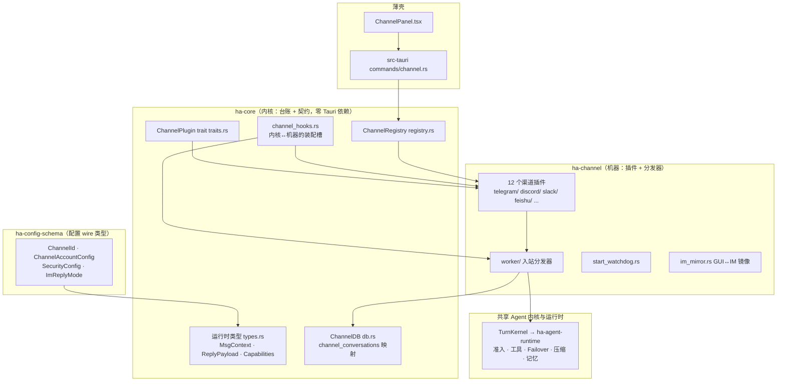
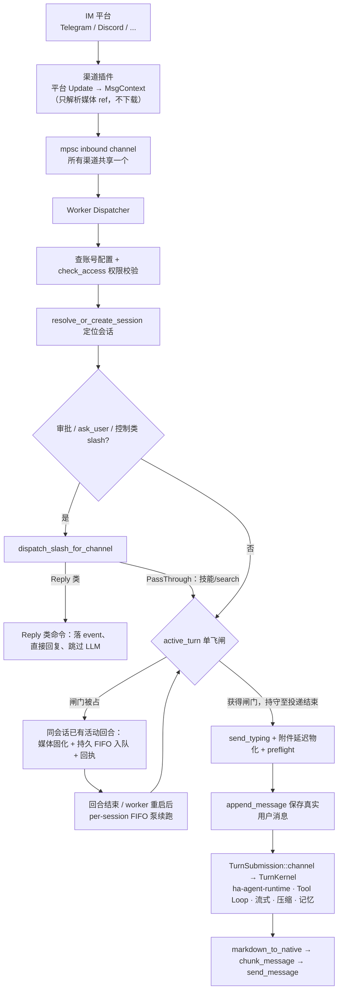
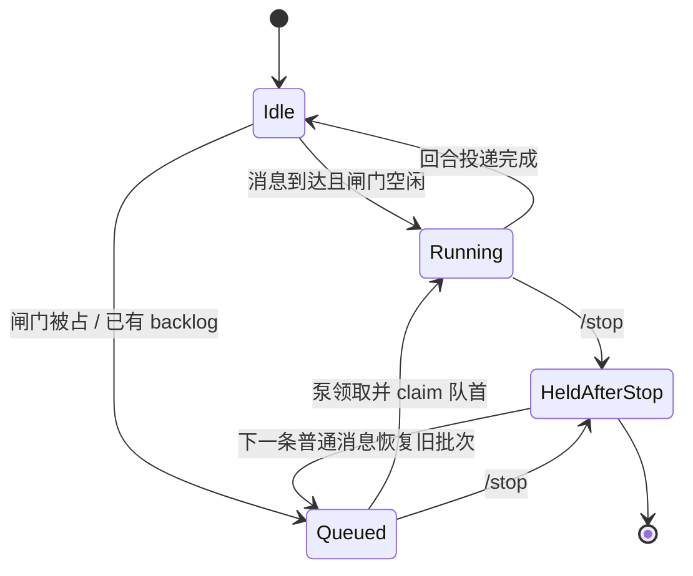
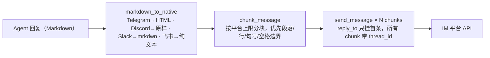
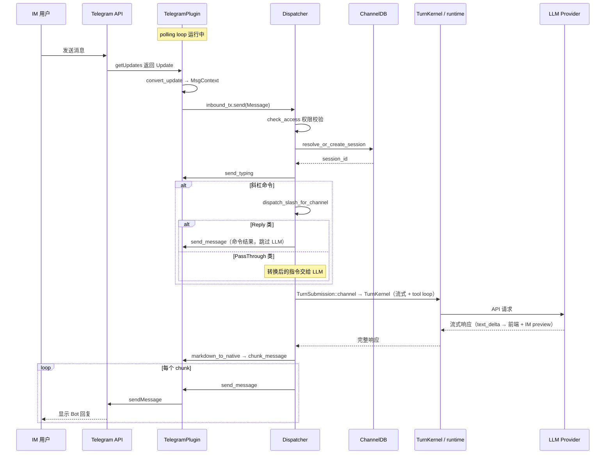
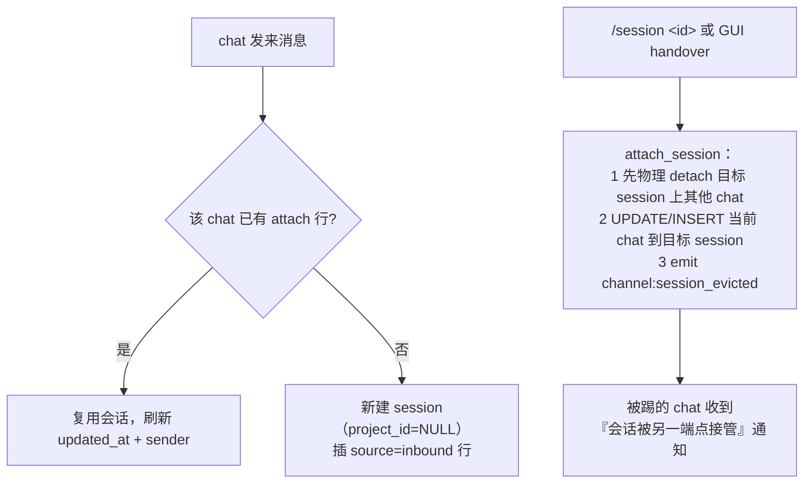
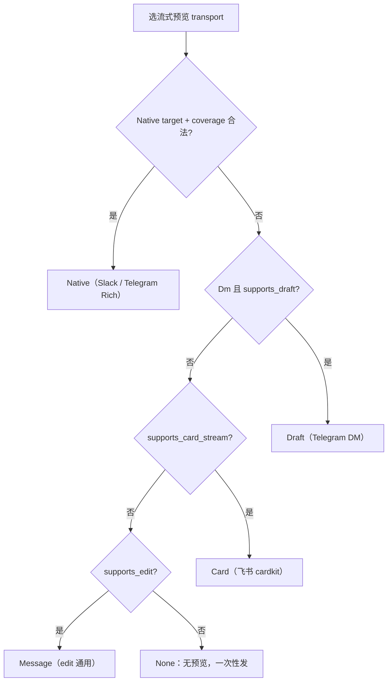
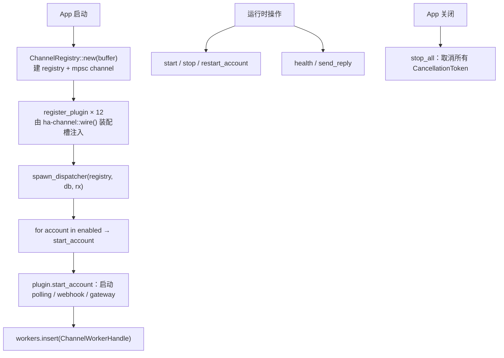
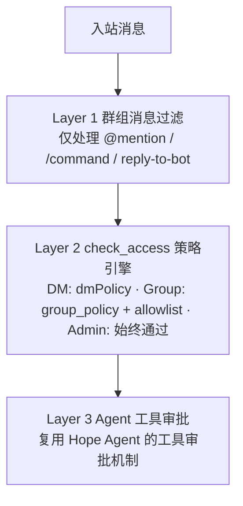

# IM Channel 系统

> 返回 [文档索引](../../README.md) | 更新时间：2026-08-10

把 Hope Agent 接到 Telegram、Discord、Slack、飞书、微信等即时通讯平台，让用户在手机上直接和 Agent 对话。全部用 Rust 原生实现，不依赖任何 Node.js 桥接。

**核心源码入口**

| 位置 | 职责 |
|---|---|
| [`crates/ha-config-schema/src/channel.rs`](../../../crates/ha-config-schema/src/channel.rs) | 配置 wire 类型：`ChannelId` / `ChannelAccountConfig` / `SecurityConfig` / `ImReplyMode` |
| [`crates/ha-core/src/channel/`](../../../crates/ha-core/src/channel/) | 内核侧的台账与契约：运行时类型、`ChannelPlugin` trait、会话映射 DB、注册表 |
| [`crates/ha-core/src/channel_hooks.rs`](../../../crates/ha-core/src/channel_hooks.rs) | 内核 → 特征 crate 的唯一回调面（装配槽） |
| [`crates/ha-channel/src/channel/`](../../../crates/ha-channel/src/channel/) | 「机器」：12 个渠道插件实现、入站分发器、启动 watchdog |
| [`src-tauri/src/commands/channel.rs`](../../../src-tauri/src/commands/channel.rs) | 桌面端 Tauri 命令 |
| [`src/components/settings/channel-panel/`](../../../src/components/settings/channel-panel/) | 渠道设置面板 |

---

## 目录

- [核心思想](#核心思想)
- [整体架构](#整体架构)
- [渠道支持矩阵](#渠道支持矩阵)
- [核心抽象层](#核心抽象层)
- [消息流转](#消息流转)
- [会话映射与 1:1 Attach](#会话映射与-11-attach)
- [Agent 复用与 Worker 分发](#agent-复用与-worker-分发)
- [回复呈现：ImReplyMode 与流式预览](#回复呈现imreplymode-与流式预览)
- [各渠道实现要点](#各渠道实现要点)
- [工具审批交互](#工具审批交互)
- [生命周期与启动韧性](#生命周期与启动韧性)
- [配置与 API](#配置与-api)
- [安全设计](#安全设计)
- [扩展新渠道](#扩展新渠道)
- [参考清单](#参考清单)

---

## 核心思想

一个 IM 接入层要解决的核心矛盾是：**十几个平台的协议千差万别，而它们背后要接的是同一个 Agent**。Telegram 是长轮询、Discord 是 WebSocket Gateway、Slack 是 Socket Mode、飞书是事件订阅、微信是自建加密长轮询——如果每个平台都各写一套「收消息 → 跑 Agent → 发回复」的循环，代码会迅速失控，而且新增一个平台意味着从零重写整条链路。

Hope Agent 的做法是把所有差异收进**一个 trait**：

- **入站方向**，每个平台把自己的原始 update 归一化成一个统一的 `MsgContext`（谁在哪个 chat 里说了什么、带了什么附件）。
- **出站方向**，Agent 的回复统一表达成 `ReplyPayload`（文本 + 媒体 + 按钮 + 回复引用），由插件负责翻译成平台原生格式并投递。
- **中间**，一个共享分发器把 `MsgContext` 变成 `TurnSubmission::channel`，交给**与桌面聊天完全相同的** `TurnKernel → ha-agent-runtime`——同一套准入、工具、Failover、上下文压缩和记忆提取。IM 用户拿到的不是一个阉割版助手，而是完整的 Agent。

这样一来，「协议差异」被隔离在插件里，「Agent 能力」被复用而非复制，新增渠道退化成「实现一个 trait」。整个子系统围绕这条主线展开，本文其余部分都在讲这条主线上的关键机制。

围绕这条主线，还有四个必须处理好的现实问题，它们各自对应本文后面的一个章节：

1. **一个 chat 对应哪个会话？** 平台的 chat 是长期存在的，而 Hope Agent 的会话可以被切换、接管、重置——需要一张映射表和一套 1:1 attach 规则。
2. **同一个 chat 短时间连发多条怎么办？** 模型回合是有状态的，不能并发跑同一会话——需要单飞闸门和持久 FIFO 队列。
3. **Agent 的回复怎么呈现才自然？** 模型的输出是「解说 + 工具 + 解说 + 媒体」的时序，直接拼成一坨发出去体验很差——需要 `ImReplyMode` 三态和流式预览。
4. **网络没就绪、凭据失效、平台限流怎么办？** 需要启动重试 watchdog、送达判定、错误分类告警。

---

## 整体架构

系统横跨三层 crate。理解这个分层是理解代码组织的钥匙：**契约与台账留在内核，业务机器搬到特征 crate**。



**为什么这样分。** 内核（`ha-core`）不依赖任何 Tauri/平台 SDK，它只持有「渠道系统长什么样」的定义：消息类型、trait 契约、会话映射表的 SQL、注册表结构。真正干活的机器——各平台插件、入站分发循环、启动重试——搬进独立的 `ha-channel` crate。两层之间不允许互相直接 `use`，只能通过 [`channel_hooks.rs`](../../../crates/ha-core/src/channel_hooks.rs) 的 16 个装配槽通信：`ha-channel` 在启动时调 `wire()`，把插件安装函数、分发器、镜像回调等注册进内核持有的槽位。这样内核可以调用机器（例如「有审批被驱逐了，去 IM 端撤窗」），而无需在编译期依赖它。

跨 crate 划界的判断准则见 [backend-separation](../system/backend-separation.md)。一个稳定的规律：**对 `sessions.db` 的 SQL 台账、wire 类型、纯谓词恒留内核；有副作用的「机器」进特征 crate**——所以 `channel_conversations` 表的读写在内核 `channel/db.rs`，而下载附件、跑轮询循环的代码在 `ha-channel`。

---

## 渠道支持矩阵

12 个内置渠道已全部实现，`ChannelId` 还留了一个 `Custom(String)` 变体用于扩展。

| 渠道 | 传输方式 | 认证 | ChatType | 特色 |
|------|---------|------|----------|------|
| **Telegram** | Long-polling（teloxide） | Bot Token | DM / Group / Forum | Bot API Rich Draft / Rich Message、结构化 blocks、富媒体、编辑/删除、斜杠命令同步 |
| **Discord** | WebSocket Gateway | Bot Token | DM / Group / Forum / Channel | Application Commands 同步、RESUME 重连、原生媒体 multipart |
| **Slack** | Socket Mode WebSocket | Bot Token + App Token | DM / Group / Channel | 原生 reply stream、dense 任务/计划进度、Slack Connect、一次性 URL 重连 |
| **飞书 / Lark** | WebSocket 事件订阅 | App ID + App Secret | DM / Group | OAuth Token 自动刷新、多域名、cardkit 卡片流式 |
| **QQ Bot** | WebSocket Gateway | App ID + Client Secret | DM / Group / Channel | RESUME 重连、`QQBotAccessToken` 认证 |
| **微信 / WeChat** | HTTP 长轮询（iLink） | 扫码登录 | DM | AES-128 媒体加密、输入指示、发送业务码 fail-closed |
| **WhatsApp** | HTTP 轮询（外部桥接） | Bridge URL + Token | DM / Group | Bridge 身份/版本/能力发现、Baileys 安全门禁、媒体支持 |
| **Signal** | SSE + HTTP RPC（signal-cli） | 手机号 + 链接设备 | DM / Group | 实时推送、撤回/回复/输入指示、需外部 signal-cli |
| **iMessage** | JSON-RPC over stdio（imsg CLI） | macOS 本地数据库 | DM / Group | macOS 限定、imsg 子进程管理 |
| **IRC** | TCP/TLS 直连 | Nick + NickServ | DM / Group | 原生 IRC 协议、PING/PONG 心跳、自动加入频道 |
| **Google Chat** | Webhook + REST API | Service Account JWT | DM / Group | 嵌入式 Webhook 服务器、线程回复、需公网 URL |
| **LINE** | Webhook + REST API | Channel Token + Secret | DM / Group | HMAC-SHA256、Webhook 防重放、编辑/撤回事件、单聊 Loading |

### 出站附件能力

`ChannelCapabilities.supports_media: Vec<MediaType>` 决定 dispatcher 是否会把模型生成的图/音视频/文件以**原生消息**投递给该渠道。声明为空时统一降级为「贴下载链接的纯文本兜底」（`build_media_fallback_lines`），不会丢消息但缺少富媒体预览。

| 渠道 | 已支持的原生媒体 | 上行方式 |
|------|------------------|---------|
| **Telegram** | Photo / Video / Audio / Document / Sticker / Voice / Animation | teloxide `send_photo` / `send_document`，复用 `InputFile` |
| **Signal / iMessage / WhatsApp** | 全 7 类 | 本地路径直传；URL / bytes 先物化到临时文件 |
| **Slack** | 全 7 类 | `files.getUploadURLExternal` + `completeUploadExternal`（v2，需 `files:write`） |
| **微信** | Photo / Video / Document / Voice | 获取 CDN 上传 URL → AES-128-ECB 加密上传 → 引用消息项，单文件 100 MB |
| **Discord** | Photo / Video / Audio / Document | 单 POST multipart，单条 25 MiB 硬上限，超限退化链接 |
| **飞书** | Photo / Video / Audio / Document | 两步：`im/v1/images` 或 `im/v1/files` 换 key → `im/v1/messages`；image/file 不带 caption |
| **QQ Bot** | Photo / Video / Audio / Voice / Animation（c2c/group 条件） | 上传拿 `file_info` 再发 `media` 消息；需 `server.publicBaseUrl`，channel/dms 端点仍走链接 |
| **LINE** | Photo / Audio / Voice（条件） | Reply/Push 的 `image` / `audio` message object；需 `server.publicBaseUrl` |
| **Google Chat** | —（认证模型阻塞） | 官方 `media.upload` 需要 user auth，当前是 app-auth |
| **IRC** | —（协议限制） | 纯文本协议无二进制传输，永久走链接兜底 |

新增渠道时按平台 API 形态挑最接近的范本套用：多数平台不是「SDK 内置上传」（如 Telegram）就是「先上传换 key 再发消息」（如 Discord / 飞书）。

---

## 核心抽象层

### ChannelId

统一的渠道 ID 枚举，`#[serde(rename_all = "lowercase")]` 保证 JSON 序列化为 `"telegram"` / `"feishu"` / `"qqbot"` 等稳定字符串；`Custom(String)` 通过 `#[serde(untagged)]` 承接扩展渠道。它定义在 `ha-config-schema`，内核 `channel/types.rs` 再导出，既有 import 路径不变。

```rust
pub enum ChannelId {
    Telegram, WeChat, WhatsApp, Discord, Irc, GoogleChat,
    Slack, Signal, IMessage, Line, Feishu, QqBot,
    Custom(String),   // 扩展渠道
}
```

`from_storage_str(s)` 从 SQLite / EventBus 拿到的字符串形态反解回枚举——`eviction_watcher` 与 `startup_watcher` 都走它。

### ChannelPlugin trait

所有渠道插件实现的核心契约（[`traits.rs`](../../../crates/ha-core/src/channel/traits.rs)），按职责分区：

```rust
#[async_trait]
pub trait ChannelPlugin: Send + Sync + 'static {
    // 元数据
    fn meta(&self) -> ChannelMeta;
    fn capabilities(&self) -> ChannelCapabilities;

    // 生命周期
    async fn start_account(&self, account, inbound_tx, cancel) -> Result<()>;
    async fn stop_account(&self, account_id) -> Result<()>;

    // 出站
    async fn send_message(&self, account_id, chat_id, payload) -> Result<DeliveryResult>;
    async fn send_typing(&self, account_id, chat_id) -> Result<()>;
    fn supports_reply_buttons(&self, account_id, chat_id) -> bool;
    fn validate_reply_buttons(&self, buttons) -> Result<(), ReplyStreamError>;
    async fn open_reply_stream(&self, target, first)
        -> Result<Box<dyn ChannelReplyStream>, ReplyStreamError>;
    async fn send_rich_reply(&self, target, reply)
        -> Result<RichReplyReceipt, ReplyStreamError>;
    async fn send_draft(...) -> Result<()>;                 // 默认 not supported
    async fn edit_message(...) -> Result<DeliveryResult>;   // 默认 not supported
    async fn delete_message(...) -> Result<()>;             // 默认 not supported

    // 卡片流式（4 个方法默认全返回 Err，仅飞书覆写）
    async fn create_card_stream(...) -> Result<CardStreamHandle>;
    async fn send_card_message(...) -> Result<DeliveryResult>;
    async fn update_card_element(...) -> Result<(), CardStreamError>;
    async fn close_card_stream(...) -> Result<()>;

    // 状态 / 安全
    async fn probe(&self, account) -> Result<ChannelHealth>;
    fn check_access(&self, account, msg) -> bool;

    // 格式转换
    fn markdown_to_native(&self, markdown) -> String;
    fn chunk_message(&self, text) -> Vec<String>;           // 默认按平台 preview 预算切

    // 凭据 / 入站附件
    async fn validate_credentials(&self, credentials) -> Result<String>;
    async fn validate_account_config(...) -> Result<()>;
    async fn materialize_pending_media(...) -> Result<Vec<InboundMedia>>;  // 延迟物化，见下
    async fn sync_commands(&self, account) -> Result<()>;   // 默认 no-op，斜杠命令同步
}
```

大量方法带**默认实现**，让「只支持文本」的渠道不必手写一堆 `Err`。`open_reply_stream` / `send_rich_reply` 默认返回 typed `Unsupported`，旧插件会继续走 Draft / Card / Message；卡片流式 4 个方法也默认返回 `Err`，新 cardkit 风格渠道只需覆写 trait 并声明 capability，不得给分发器另开平台分支。

`supports_reply_buttons(account, chat)` 是 target-aware 能力门，默认回落静态 `supports_buttons`；QQ Bot 这类 endpoint 能力不同的插件必须覆写。`validate_reply_buttons` 是首个终态 mutation 前的无副作用 compiler/preflight：空按钮默认通过，非空默认 `Unsupported`。实现按钮的 adapter 必须让 validator 与 serializer 共用同一套 row / element / payload / URL 限制，并在 raw `send_message` 入口重复校验，禁止 `.take()` 式静默截断。

### ChannelReplyStream 原生流式契约

Slack / Telegram 的原生流是 provider 侧有状态资源。插件持有 stream / message / draft ID、序列号与 API client，worker 只操作跨平台生命周期：

```rust
#[async_trait]
pub trait ChannelReplyStream: Send {
    async fn push(&mut self, frame: &ReplyStreamFrame) -> Result<(), ReplyStreamError>;
    async fn commit(self: Box<Self>, final_reply: &RichReply)
        -> Result<RichReplyReceipt, ReplyStreamError>;
    async fn fail(self: Box<Self>, error_text: &str) -> Result<(), ReplyStreamError>;
    async fn abort(self: Box<Self>, reason: ReplyAbortReason) -> Result<(), ReplyStreamError>;
}
```

生命周期固定为 `open(first) → push* → commit | fail | abort`：

- `open_reply_stream(..., first)` 返回 `Ok` 即确认首帧已接收，后续 revision 严格递增，不能再 push 首帧。`Append` 只消费未 ACK 的 `markdown_delta`；`Snapshot` 只消费完整 `markdown_snapshot`，公共层不裁剪它。
- `commit` / `fail` / `abort` 消费 handle，成功、模型错误、取消和 detach 竞争同一个 terminal owner；终态必须落在同一 provider identity，不能 abort 后另发一条 legacy 错误。外层有界等待超时只能 detach 清理接力，不能 hard-abort 已接受的 provider future。
- `RichReply { markdown, media, buttons }` 是 canonical final。成功 receipt 的 `consumed_media` 必须是原附件序列的连续前缀 `[0..N)`；worker 只把后缀交给 legacy media lane。越界、重复、空洞或空 message id 都是终态 contract violation，禁止猜测后补发。
- `ReplyStreamErrorKind` 只按送达语义分类。`Unsupported / InvalidTarget / InvalidContent / Rejected / RateLimited` 仅在 adapter 能证明零 mutation 时允许降级；`Transient` 也只准表示 provider mutation 之前的本地失败。timeout、断连、5xx、响应不可解析或未知状态一律 `Ambiguous`，禁止重试和换 transport 补发。
- `ReplyStreamTarget` / frame / rich reply / receipt 都是进程内契约，不进 DB / IPC / 日志。任务与计划只投影 opaque ID、短标题和粗粒度状态，严禁 tool arguments/result、路径、凭据、原始 provider error 或 chain-of-thought。

### MsgContext（入站消息）

任何渠道收到的消息都归一化成这个结构：

```rust
pub struct MsgContext {
    pub channel_id: ChannelId,
    pub account_id: String,               // Bot 账户 ID
    pub sender_id: String,                // 发送者平台 ID
    pub sender_name: Option<String>,
    pub sender_username: Option<String>,  // @username
    pub sender_tenant_id: Option<String>, // workspace / tenant（Slack Connect）
    pub chat_id: String,                  // 聊天/群组 ID
    pub chat_type: ChatType,              // Dm / Group / Forum / Channel
    pub chat_title: Option<String>,
    pub thread_id: Option<String>,        // 论坛话题 ID
    pub message_id: String,
    pub text: Option<String>,
    pub media: Vec<InboundMedia>,         // 附件（延迟物化前只是轻量 ref）
    pub reply_to_message_id: Option<String>,
    pub timestamp: DateTime<Utc>,
    pub was_mentioned: bool,              // 本条是否 @bot 或回复 bot
    pub raw: serde_json::Value,           // 原始平台数据（调试用）
}
```

`was_mentioned` 是群组 mention gating 的输入：群里只有被 @ 或回复 bot 的消息才会触发 Agent，其余消息直接忽略。

`MsgContext` 只是 `InboundEvent` 枚举里的一个变体。分发器实际收到的是 `InboundEvent`：

```rust
pub enum InboundEvent {
    Message(MsgContext),          // 唯一触发完整 Agent 回合的变体
    Reaction(ReactionEvent),      // 表情回应
    MessageEdited(EditedMessageEvent),
    MessageRecalled(RecalledMessageEvent),
    Membership(MembershipEvent),  // 成员进出
    ReadReceipt(ReadReceiptEvent),// 已读回执
}
```

只有 `Message` 会跑 Agent；其余带外信号目前只记日志，业务处理（同步编辑、撤回、欢迎模板）留待后续。非 `Message` 变体共享一个 `EventCommon` 信封，其 `raw` 用 `Arc` 包裹，避免「一次已读回执带 100 个 message_id」时深拷贝原始 payload。

### ReplyPayload（出站消息）

Agent 回复统一表达为：

```rust
pub struct ReplyPayload {
    pub text: Option<String>,                // 已转为渠道原生格式的文本
    pub media: Vec<OutboundMedia>,
    pub reply_to_message_id: Option<String>, // 引用回复
    pub parse_mode: Option<ParseMode>,       // Html / Markdown / Plain
    pub buttons: Vec<Vec<InlineButton>>,     // 内联按钮（审批等）
    pub thread_id: Option<String>,           // 论坛话题
    pub draft_id: Option<i64>,               // Draft transport 用，须非零
}
```

`draft_id` 是 [Draft 流式预览](#流式预览-transport)的载体：整个回合复用同一个值，客户端把连续同 ID 的草稿渲染成动画式增长的单条消息。

### ChannelCapabilities

渠道静态能力声明，前端据此显示/隐藏功能，分发器据此选流式预览方式：

```rust
pub struct ChannelCapabilities {
    pub chat_types: Vec<ChatType>,
    pub supports_polls: bool,
    pub supports_reactions: bool,
    pub supports_draft: bool,          // Telegram DM 草稿式流式
    pub supports_edit: bool,
    pub supports_unsend: bool,
    pub supports_reply: bool,
    pub supports_threads: bool,
    pub supports_media: Vec<MediaType>,
    pub supports_typing: bool,
    pub supports_buttons: bool,        // 交互按钮（审批 / picker）
    pub streaming_preview_max_bytes: Option<usize>,  // 流式 preview byte 预算
    pub supports_card_stream: bool,    // cardkit 卡片流式（仅飞书）
    pub native_reply: Option<NativeReplyCapabilities>, // 原生流 / rich final
}

pub struct NativeReplyCapabilities {
    pub preview_chat_types: Vec<ChatType>,
    pub final_chat_types: Vec<ChatType>,
    pub update_mode: ReplyStreamUpdateMode, // Append | Snapshot
    pub preview_persistence: ReplyStreamPreviewPersistence, // Persistent | Ephemeral
    pub requires_reply_anchor: bool,
    pub requires_recipient_user_id: bool,
    pub requires_recipient_tenant_id: bool,
    pub supports_task_updates: bool,
    pub supports_plan_updates: bool,
    pub supports_blocks: bool,
    pub embedded_media_types: Vec<MediaType>,
    pub max_embedded_media_items: Option<u16>,
    pub refresh_after_secs: Option<u64>,
    pub max_delta_chars: Option<u32>,
}
```

除 `chat_types` 外全部字段带 `#[serde(default)]`，新增字段不会打破既有插件的反序列化。

**注意没有 `max_message_length` 字段**——单条消息长度被拆成两个独立语义，别混淆：

- `streaming_preview_max_bytes`：流式预览阶段「这条不断增长的 preview 还塞得下整段文本吗」的判定阈值，比平台真实上限留约 25% headroom，防止 in-flight delta 撞临界（Telegram 3200 / Slack 3200 / Discord 1500 / IRC 512）。
- `chunk_message`：定稿时一刀切多大，各插件覆写成平台真实上限（Telegram 4096 / Slack 4000 / Discord 2000 / WhatsApp 65536 / IRC 512），不覆写时回落到 `streaming_preview_max_bytes`（保守但安全）。

两者详见[消息分段契约](#消息分段契约)。

`native_reply` 与三个 legacy capability 共同参与 transport 选择。preview 必须同时命中 `preview_chat_types` 与 `final_chat_types`，并在联网前满足全部 `requires_*` 坐标；`final_chat_types` 还独立控制无 stream 时的 `send_rich_reply`。`Persistent` preview 任一 ACK 都可能已成持久内容，open 后不得换 lane；`Ephemeral` preview 可自然过期，但它的独立 commit 若为 `Ambiguous` 仍不能补发。`max_embedded_media_items=None` 表示**未声明预算**，不是无限；Native 只拿连续可嵌入前缀，剩余附件保序留给 legacy lane。

### SecurityConfig

每个渠道账户独立配置访问策略，采用 `dmPolicy` + allowlist 组合，并叠一层分组/频道级配置：

```rust
pub struct SecurityConfig {
    pub dm_policy: DmPolicy,          // Open / Allowlist / Pairing
    pub group_allowlist: Vec<String>, // 旧版群组白名单（按 chat_id，兼容保留）
    pub user_allowlist: Vec<String>,
    pub admin_ids: Vec<String>,       // 管理员始终允许

    // 分层的群 / 频道配置
    pub group_policy: GroupPolicy,    // Open / Allowlist / Disabled
    pub groups: HashMap<String, TelegramGroupConfig>,   // key=chat_id，"*"=通配默认
    pub channels: HashMap<String, TelegramChannelConfig>,
}
```

DM 策略：

| 策略 | 行为 |
|------|------|
| `Open` | 任何人都可私聊 Bot |
| `Allowlist` | 仅 `user_allowlist` + `admin_ids` 可私聊 |
| `Pairing` | 配对模式（需用户发起配对请求，预留未来实现） |

群组策略 `GroupPolicy`：`Open`（只受 mention gating 约束）/ `Allowlist`（仅 `groups` 里显式列出的群）/ `Disabled`（完全屏蔽群消息）。`groups` / `channels` 支持 per-chat 覆盖（是否要求 mention、是否启用、发送者白名单、绑定 Agent 等），key 为 `"*"` 时作为通配默认。

---

## 消息流转

### 入站流程



插件在 webhook / gateway / polling 阶段**只把平台 update 解析成 `MsgContext`**，附件此时仍是轻量引用（不发起任何下载）。所有渠道共享一个 `mpsc` 入站通道，汇入 dispatcher。

### 单飞、FIFO 与停止

模型回合是有状态的，**同一会话不能并发跑两个回合**。这带来三个必须协调的问题：

**单飞闸门。** 每个 session 的模型回合由 `active_turn` 严格单飞。全局层面则有一个 `MAX_CONCURRENT_INBOUND = 20` 的信号量（owned permit）限制在飞消息总数——它管全局并发，不管同会话互斥。控制类消息（审批回复、`ask_user` 回复、Reply-only 斜杠命令）先走控制面，不进普通消息队列。

**持久 FIFO 队列。** 普通消息只有在该会话没有任何 Channel backlog 时才尝试直接获取闸门；否则先下载/固化附件、写入持久队列（`queued_turn_user_messages`），保证新到的 webhook 不会插到已被泵接管的队首之前。request id 由 channel/account/chat/thread/平台 message-id 稳定哈希得到，重复 webhook 与崩溃重放靠 `messages.queue_request_id` 收敛去重。回合结束或 worker 重启后，per-session 泵按 FIFO 顺序领取共享并发 permit、逐条续跑。



**安全边界插入。** 当同会话正有一个 Channel 回合在跑，队首消息不是干等到回合彻底结束，而是可以在当前回合的一个完整 `tool_result` 边界处插入——引擎保证至少再调用模型一轮来回应它（即便边界恰好落在配置的最后一轮，也会补一个终轮）。这有两条硬约束：

- **同源才能插入。** 只有正在执行的 **Channel 回合**能接收 Channel 队首。桌面 / HTTP 回合在开始时就固定了权限、KB 访问、审批上下文，IM 消息不得借用这些上下文——必须等它收尾后由泵启动一个独立的、最小权限的 Channel 回合。
- **每条插入消息只属于它自己的发送者。** 即便同为 Channel 回合，也要把插入消息的 sender/chat allowlist 作为 `<untrusted_external_data source="im_channel_origin">` 元数据随该条 user content 一起发送，禁止把群聊中后续发送者误归给原 sender，也禁止透传原始 `raw` webhook。

**统一停止。** 桌面、HTTP、IM `/stop` 进入同一个 session-stop 编排：同步取消 active/preflight token、拒绝待审批、撤销 `ask_user`、取消 session 私有 runtime，并把该 session 所有排队/等待/插入/派发中的 Channel 行转为 `held_after_stop`。这些行不会被启动恢复或泵自动消费，直到下一条普通 IM 消息主动恢复旧批次并排在其后。`/stop` 本身是控制面输入，会在审批/`ask_user` 文本回复解析**之前**被识别，绝不被当作某个自由输入问题的答案。

**毒行处理。** worker 重启会扫描未提交的队列行。当路由已被别的 chat 1:1 接管、账号/插件已删除、权限策略收紧或路由信封损坏时，fail closed 丢弃该行并在会话留一条可见错误，不让毒行永久阻塞 FIFO。

### 出站流程



### 完整时序



### 入站附件的延迟物化

10 个需要把入站附件从平台取回的渠道（Telegram / Discord / Slack / 飞书 / QQ Bot / LINE / Google Chat / WhatsApp / 微信 / Signal）共用同一套**延迟物化**管道。核心想法：**插件在收消息阶段只解析媒体引用，真正的取回推迟到 mention + 权限双双通过之后**才由 dispatcher 触发。（iMessage / IRC 不在此列：前者由本地 imsg CLI 直接给出文件，后者是纯文本协议。）

这避免三类问题：

1. **Webhook ack 超时**：飞书 / Google Chat / LINE / QQ Bot / WhatsApp 都要求秒级 ack，把下载塞进 webhook handler 会拖死返回。
2. **群组流量浪费**：mention gating 关闭的群里，非 @bot 的附件不该消耗带宽和磁盘。
3. **RSS 失控**：一个 100 MB 文件不该让进程内存涨 100 MB。

共用骨架在 [`channel/inbound_media_common.rs`](../../../crates/ha-channel/src/channel/inbound_media_common.rs)：

| API | 作用 |
|---|---|
| `embed_pending_refs` / `take_pending_refs` | 插件把媒体 ref 挂到 `MsgContext.raw` 的私有 envelope key，dispatcher 端取回并清除 |
| `stream_to_disk(builder, dest, cap_bytes)` | chunk-by-chunk 流式落盘 + Content-Length 与 mid-stream 双重 cap 检查 + 失败自动清理 |
| `inbound_temp_path(...)` | `~/.hope-agent/channels/<id>/inbound-temp/<ts>-<safe-stem>.<ext>`，文件名层做路径分隔符兜底 |
| `ext_for` / `media_type_from_mime` | filename 后缀优先 / MIME → MediaType 统一分类 |
| `INBOUND_DOWNLOAD_MAX_BYTES = 512 MiB` | 跨渠道统一上限，是平台 image/file/video 各自上限的安全余量 |

每个渠道的 `ParsedMediaRef` 是各自的结构（auth header、下载 URL、解密 key 形态都不同），但都靠 `serde_json` 透传 `MsgContext.raw`；dispatcher 端不区分渠道，只调 `plugin.materialize_pending_media()`。

各渠道差异集中在「从哪下、怎么鉴权」：

| 渠道 | 下载入口 | Auth |
|---|---|---|
| 飞书 | `im/v1/messages/{id}/resources/{key}` | `Bearer <tenant_access_token>`（骨架参考实现） |
| Telegram | Bot API `/file/bot{TOKEN}/{path}` | token 在 URL path |
| Slack | `url_private`（files.slack.com） | `Bearer xoxb-...`，host 必须锁 `*.slack.com`，否则拿到登录 HTML |
| Discord | CDN 公开签名 URL | 无需 auth，server-side 落盘躲 24h CDN 失效 |
| Google Chat | `media.download` REST | OAuth2 access_token，仅处理 `UPLOADED_CONTENT` |
| LINE | `api-data.line.me/.../content` | `Bearer <channel access token>`（与 push 不同 host） |
| QQ Bot | Tencent CDN（4 host 白名单） | URL 含 signature，无 header |
| WhatsApp | bridge 转发 attachments | bridge 内部；老 bridge 无该字段仍可工作 |
| 微信 | encrypt CDN + AES-128-ECB | URL 含加密参数，密钥来自消息项 |
| Signal | 不走 HTTP，signal-cli 已落盘 | 从 daemon 的 attachments 目录**复制**（非移动，GC 归 daemon） |

**SSRF 策略：** 用户可控的 URL（Slack / Discord / QQ Bot / WhatsApp bridge）必经 `security::ssrf::check_url`；官方固定 host（飞书 / Google Chat / LINE / Telegram / 微信 CDN）跳过。共用入口 `stream_to_disk` 不内置 SSRF，调用前自行 check——新接渠道严禁自写 IP 校验。

**微信的流式解密。** 微信媒体密文必须经 AES-128-ECB + PKCS#7 解密。为避免同时在内存里持有密文和明文两份 buffer（100 MB 文件峰值超 200 MB RSS），实现改成磁盘缓冲二段法：先 `stream_to_disk` 把密文落到 `.enc`，再 `spawn_blocking` 逐 16 字节块解密写出，末块留在 carry 里到 EOF 才做 PKCS#7 unpad，最后强制删除中间文件。ECB 块相互独立所以可流式，**RSS 与文件大小完全解耦**。解密用纯 Rust `aes` + `md-5` crate（不再依赖 `openssl`）；`openssl` 仅在 Linux 作为 target 依赖保留（`vendored`），用途是让 `native-tls` 静态打包 OpenSSL，使 Docker / 裸 Linux 发布包运行时无需系统 libssl。

---

## 会话映射与 1:1 Attach

### channel_conversations 表

一张 SQLite 表把 IM 对话映射到 Hope Agent 会话（存于 `sessions.db`）：

```sql
CREATE TABLE channel_conversations (
    id INTEGER PRIMARY KEY AUTOINCREMENT,
    channel_id TEXT NOT NULL,          -- "telegram", "discord", ...
    account_id TEXT NOT NULL,          -- bot 账户 ID
    chat_id TEXT NOT NULL,             -- 平台聊天/群组 ID
    thread_id TEXT,                    -- 论坛话题 ID（可空）
    session_id TEXT NOT NULL,          -- FK → sessions.id
    sender_id TEXT,
    sender_name TEXT,
    chat_type TEXT NOT NULL DEFAULT 'dm',
    source TEXT NOT NULL DEFAULT 'inbound',  -- inbound | attach | handover
    attached_at TEXT,
    created_at TEXT NOT NULL,
    updated_at TEXT NOT NULL,
    FOREIGN KEY (session_id) REFERENCES sessions(id) ON DELETE CASCADE
);

-- 一个 chat 同一时刻只 attach 到一个 session。thread_id 需 COALESCE，
-- 因为 SQLite 默认 NULL ≠ NULL，否则无话题的 chat 会有多行。
CREATE UNIQUE INDEX uq_channel_conv_chat
    ON channel_conversations(channel_id, account_id, chat_id, COALESCE(thread_id, ''));
-- 反方向也 1:1：一个 session 同一时刻只被一个 chat attach。
CREATE UNIQUE INDEX uq_channel_conv_session
    ON channel_conversations(session_id);
CREATE INDEX idx_channel_conv_lookup
    ON channel_conversations(channel_id, account_id, chat_id);
```

会话的 `context_json` 字段冗余存一份渠道元信息，供桌面端展示：

```json
{ "channel": { "channelId": "telegram", "accountId": "tg-abc123",
  "chatId": "-1001234567890", "threadId": "42", "chatType": "forum", "senderName": "John" } }
```

**Schema 迁移是破坏性的**：`migrate()` 检测到旧结构（缺 `source` 列，或残留旧的多 attach `is_primary` 列）就直接 `DROP TABLE` 重建。旧映射不保留——IM worker 在下一条入站消息时按 `resolve_or_create_session` 重新建行。

### 1:1 Attach 模型

这是理解会话映射的关键：**双向 1:1**。

- 每个 `(channel, account, chat, thread)` 任意时刻只能 attach 到一个 session（`uq_channel_conv_chat`）。
- **且**每个 session 任意时刻只能被一个 IM chat attach（`uq_channel_conv_session`）。

入站消息通过 `resolve_or_create_session` 用精确元组查行：命中就复用会话、刷新时间戳；未命中就新建会话（`project_id` 默认 `NULL`）并插一行 `source="inbound"`。



当一个新 chat 通过 `/session <id>` 或 handover 接管某 session 时，`attach_session` 先把该 session 上原有的 attach **物理 detach**（不再保留 observer），再把当前 chat 指向它，最后 emit `channel:session_evicted` 事件通知被踢的 chat。被踢的 chat 之后再发消息，会走 `resolve_or_create_session` 自动新建会话。

DB helper（[`channel/db.rs`](../../../crates/ha-core/src/channel/db.rs)）：

| helper | 用途 |
|---|---|
| `attach_session` | `/session <id>` / handover：先驱逐目标 session 上其他 chat，再绑当前 chat，emit eviction |
| `update_session` | `/new` / `/agent` 在 IM 内换 session，语义同 attach 但更轻量 |
| `detach_session` | `/session exit`：删 attach 行（1:1 下无需 promote next） |
| `get_conversation_by_session` | 取 session 的唯一 attach 行；live mirror / `/status` / cron / approval / ask_user 都经它反查 IM 入口 |
| `list_recent_active_conversations` | 冷启后「back online」通知的候选池 |

### Session 路由（无项目反向认领）

IM 入站消息**不再自动归属项目**。会话以 `project_id = NULL` 创建，由用户在 chat 内主动 `/project <id>` 显式归属——它发 `AssignProject` action，被翻译为 `SessionDB::set_session_project` 更新当前 session 的 `project_id`，**不创建新 session**（对比 GUI 模式的 `/project` 是 `EnterProject`，会创建新 session 进入）。

Agent 解析走统一入口 [`agent::resolver::resolve_default_agent_id_full`](../../../crates/ha-core/src/agent/resolver.rs) 的 7 级链，首个非空胜出：


`/status` 末尾会输出命中的 Agent Source 层级，以及该 session 的 **Attached IM Channel** 段（1:1，0 或 1 行）。

### 斜杠命令

| 命令 | 行为 | IM 侧特性 |
|---|---|---|
| `/sessions` | session picker（过滤 cron / subagent / incognito） | 支持按钮的渠道弹 inline buttons |
| `/session [<id>\|exit]` | 无参显示 session info；`<id>` attach；`exit` detach | attach 会踢掉旧 chat 并发驱逐通知 |
| `/projects` · `/project <name>` | 列项目 / 模糊匹配切项目 | IM 侧 `/project` 是 AssignProject，不建新 session |
| `/handover <ch:acc:chat[:thread]>` | GUI 把当前 session 推到 IM chat | IM 侧禁用（等价操作是 `/session <id>`） |
| `/stop` | 停止当前 session 前台回合 | 走共享 stop 编排；是控制面输入，不被当作答案 |
| `/kb [on\|off]` | 知识空间访问 per-chat 确认 | 群聊确认入口；账号级 opt-in 仍是桌面 GUI-only |
| `/imreply [split\|final\|preview]` | 切回复呈现模式 | 见[回复呈现](#回复呈现imreplymode-与流式预览) |
| `/reason [on\|off]` | 是否把思考内容发进 IM | 默认关 |
| `/permission [default\|smart\|yolo]` | 切会话权限模式 | 见[工具审批](#工具审批交互) |

**IM 禁用命令**（[`slash_defs/registry.rs`](../../../crates/ha-core/src/slash_defs/registry.rs) `IM_DISABLED_COMMANDS = ["agent", "handover", "pet"]`）：

- `/agent` 被禁，因为 IM dispatcher 每条入站消息都从 channel-account / topic / group 配置**重算** `agent_id`，不读 `sessions.agent_id`。允许 `/agent` 会造成「切完回复 Switched to X，下一条消息又被配置拉回原 agent」的幻觉切换。改 IM agent 应去设置面板或 topic/group 覆盖。
- `/handover` 是 GUI 专用——把当前 chat 的 session 推给当前 chat 自己没有意义。
- `/pet` 是桌面宠物专属命令，IM 端没有宠物界面，在这里无意义，一并禁用。

防御分两层：同步阶段过滤（Discord / Telegram / Slack 注册命令前先过滤名单）+ handler 自检（`/agent` handler 按 `channel_info.is_some()` 拒绝执行）。

### 按钮回调路由

7 个支持按钮的渠道（Telegram / Discord / Slack / 飞书 / QQ Bot / LINE / Google Chat）对**无参 slash 命令**会弹一个 `arg_options` picker，按钮 `callback_data = "slash:cmd arg"`。用户点击后，各渠道在自己的 callback 入口 `strip_prefix("slash:")`，再统一调 [`slash_callback.rs::inject_slash_callback`](../../../crates/ha-channel/src/channel/worker/slash_callback.rs)——它把点击合成一条 `text="/cmd arg"` 的 inbound `MsgContext` 丢回 `inbound_tx`，走正常 slash 分发回环。chat_type 通过 `ChannelDB::get_chat_type` 反查既有行恢复（picker 按钮总在真实 `/cmd` 之后出现），查不到回退 `Dm`。

5 个不支持按钮的渠道（微信 / iMessage / IRC / Signal / WhatsApp）上，需参数的命令无参时回一段 `Usage: /cmd <placeholder>` + 选项列表的文本提示，代替原始的 `Invalid X` 错误，方便用户复制粘贴合法值。

`approval:` / `ask_user:` 前缀的 callback 不走这条路，而是进 worker 内部的审批 / ask_user 状态机（[`ask_user.rs::try_dispatch_interactive_callback`](../../../crates/ha-channel/src/channel/worker/ask_user.rs)）。

### Attach catch-up：接管即刻看到上一轮

两条 attach 路径（IM `/session <id>` 与 GUI / HTTP handover）都必须先调用 `prepare_attach_catchup` 按物理 target 预留 provider lane，再且只能消费 `AttachCatchupReservation::attach` 发布 binding。该 typestate 转换在同一个 `SessionDB` connection 临界区内依次采样 active generation、固定 `messages.id` 水位线并提交 durable attach；attach 失败只 Drop reservation，不产生 provider mutation，普通 `attach_session` 不能构造后续投递所需的 `AttachedCatchupReservation`。IM `/session` await catch-up 后才发命令确认，保证确认不越过 snapshot；GUI / HTTP handover 把持有 lane 的工作交给进程生命周期 executor 后立即返回，慢 provider 不阻塞界面或 request，也不因 request runtime 消失而丢投递。

[`attach_sync.rs`](../../../crates/ha-channel/src/channel/attach_sync.rs) 在 DB 临界区内、发布新 binding 前采样 `active_before` 并固定 `messages.id` 水位线与其内最近完成轮次，attach 成功后再采样 `active_after`：

- 无 active turn 时，只回填水位线以内的 assistant final text + 同轮 tool_result media（`Final` 语义、无 `reply_to`）。active 采样之后才启动的回合，在查询 IM binding 时会被同一个 DB mutex 挡到 attach 提交之后，因而走普通 live mirror 并排在 catch-up lane 后面；不存在 `W → attach` 间完整结束后静默漏投或被 static/live 双发的窗口。
- Desktop / HTTP 或 ParentInjection 正在执行时，不重放半截 snapshot，而是为该 exact turn/run generation 注册 `LateMirror`。若水位线前的 A 在第二次采样前结束（包括 A→B），仍按 A 的 exact `turn_id` / `run_id` anchor 补齐终态，B 留给正常 engine mirror；handover notice / user quote 在同一 provider prelude 先发，随后承接剩余 delta，终态读取在下一条 user 行前截断，不能混入后续回合。
- catch-up 仍是 best-effort 消息层行为；失败只 warn，不回滚已经成功的 attach。

### GUI ↔ IM 实时镜像

一个绑定了 IM chat 的会话，如果用户从桌面/HTTP 发起回合，回复应该**同时**实时流到 IM 端。这由 [`im_mirror.rs`](../../../crates/ha-channel/src/im_mirror.rs) 实现：

- `ha-agent-runtime` 的共享 engine 在 kernel admission 之后经 `channel_hooks::attach_live_mirror` 调到 `ha-channel::attach_im_live_mirror(session_id, source, generation, last_user)`；后者用 `get_conversation_by_session` 拿到 session 的 IM attach（1:1 后 0 或 1 个），起一个 IM 流式预览任务并把 sink 注册进 runtime。每帧 streaming event fan-out 到该任务，IM 用户实时看到打字机 / 逐轮边界 / 媒体投递。
- 回合收尾走 `finalize_im_live_mirror`，复用 dispatcher 的 `deliver_split / deliver_final_only / deliver_preview_merged`，按账号的 `ImReplyMode` 渲染——与 IM 入站回合完全对称。
- **两条通道各走各的发送通路**：GUI 永远走 Tauri IPC / HTTP 广播，不受 `imReplyMode` 影响；`imReplyMode` 只决定 IM 端呈现。
- 自动 attach 只接 Desktop / HTTP 主回合；Channel / Cron / Subagent 不外溢。`ParentInjection` 是显式例外，由 [`inject_and_run_parent`](../../../crates/ha-core/src/subagent/injection.rs) 自驱动 attach，并在同一 future 内 await terminal——它运行在短命 current-thread runtime，不能把 finalize 随手 `spawn` 出去。

**Provider mutation lane。** [`worker/provider_lane.rs`](../../../crates/ha-channel/src/channel/worker/provider_lane.rs) 按 `(account_id, chat_id, thread_id)` 同步预留 FIFO，顺序取决于 pipeline / catch-up 创建时刻，而非 Tokio task 首次 poll。IM inbound、GUI/HTTP mirror、LateMirror、catch-up、eviction 与 startup notice 共用这条 lane；stream task 与外层 terminal delivery 都释放后，下一代才可写。取消的排队节点仍保留为传递屏障，不能让后来者越过在途 predecessor；不同物理 target 仍并行。

实际 provider future 交给进程生命周期 executor。每个**新** mutation 在前序完成后用 `spawn_blocking` live-check 当前 attach，失效则不 poll；已经拿到 Native/Card handle 的 abort/close 是旧目标上的 lane-only cleanup，不再被新 attach 拦掉。caller 在排队期消失时不启动新的可见 mutation；若 mutation 已经开始并返回 handle，executor 会先清理 handle 再释放 lane。

**Generation 与 handover fence。** GUI/HTTP delta 热路径只检查 exact turn/stream generation 与 `(session, attach_id, generation)` 进程内 claim，不碰 SQLite，保证 GUI 首 token 不被 IM 阻塞。同 generation 的不同 attach claim 可以并存，防旧 attach 在异步 DB lookup 后反向淘汰新 claim；真正的 provider boundary 再以 live DB attach fail-closed。claim 是 `Active → Completed` 状态机：发生过 provider terminal/ambiguous mutation 后保留 5 分钟、至多 4096 条的 tombstone，挡住「普通 mirror 已完成并 Drop，LateMirror 随后重抢同 generation」的双发；零 mutation、attach moved 与允许同 receipt 重排的 ParentInjection `Confirmed` abort 才 release。终态同步撤 sink 后交给后台 future，成功、错误、取消和 external terminal 只消费该 generation 一次，下一轮 delta 不会串进旧 mirror。

user quote 不是拼进 assistant final 的前缀，而是在 provider prelude 中发送的**独立消息 identity**：首行 `> 💬 `、超 240 字符截断，有附件补 `> [📎 N attachments]`。它不写 `messages` / `context_json`，也不阻塞 GUI delta；quote 自身失败进入 `DeliveryReport`，但不会把 assistant final 误判成已 mutation。只有 account unavailable 或 attach 已变化这类零 provider mutation 的 prelude blocked 才禁止后续 IM 写。

**ParentInjection no-replay 与重绑。** 初始 attach、运行中 LateMirror 和 handover rebind 由 core 的单一 coordinator 原子交接 terminal ownership；新的 binding 先取得 generation claim、退役旧 handle、arm 同一份 no-replay receipt，再安装 mirror，终态不能从两者之间穿过。仅普通 subagent result / async_jobs 显式声明可被 5 秒 Primary sweep 重新发现；其它 workflow / wakeup / group / process-local 来源在 Secondary 必须降为 GUI-only，不能假装 handoff 后丢掉唯一副本。desktop/server Primary 是唯一 `LocalOwner`；Secondary 在查账号/attach 前返回 `DeferredToPrimary`，ACP/test/MCP/eval 不安装 listener、不 claim startup replay，也不做 IM mutation。

所有 transport 都显式收尾：已打开 Native/Message/Card preview 后，engine error、用户取消或 attach 移走不能只 Drop handle，也不能另发一条 fresh fallback。外层最多等待 3 秒，超时后让进程 executor 接力原 identity；只有明确 `Confirmed` 的取消才可在当前进程重排同一 receipt，`Unsafe`/timeout/ambiguous 保留 no-replay fence，防重启后重复回投。

### 冷启后的 back online 通知

进程冷启 / 升级 / 崩溃恢复后，在 IM 端给最近活跃的对话发一条简短系统通知，让用户知道「服务回来了」。实现在 [`worker/startup_watcher.rs`](../../../crates/ha-channel/src/channel/worker/startup_watcher.rs)，由 app 启动流程统一调一次（不订阅 EventBus，spawn 内 sleep 等 watchdog 首轮 `start_account` 完成再扫）。发送门（全部满足才发）：

- `runtime_lock::is_primary()`——同机双开时只让 Primary 进程发；
- `AppConfig.startup_notification.enabled`（默认开，GUI 通知面板可关）；
- 崩溃计数未达 `crash_loop_threshold`（默认 3）——crash-loop 时整批静音，避免风暴。

候选池 SQL 用内部硬上限 500（防御性大池子），真正的发送上限是 `global_max`（默认 30），且 cooldown / 静音 / 缺账号 / 缺插件这些过滤**不消耗**发送预算，所以前 30 条全在 cooldown 也不会饿死后面能发的 chat。每个 chat 用 per-chat sentinel（`~/.hope-agent/` 下的 `startup_state.json`，30 min cooldown，7 天 prune）去重。文案硬编码英文带 emoji（IM 服务器不带收件人 locale，后端翻译会选错语言），per-account 可用 `notify_startup`（默认开）静音。

---

## Agent 复用与 Worker 分发

`worker/dispatcher.rs` 是一个后台 tokio task，把入站消息路由到 Agent。它跑在**专用线程自建的 tokio runtime** 上——因为它在 `init_app_state()` 期启动，那时 Tauri 的 async runtime 还没就绪。

```rust
const MAX_CONCURRENT_INBOUND: usize = 20;

pub fn spawn_dispatcher(registry, channel_db, mut inbound_rx: mpsc::Receiver<InboundEvent>) {
    std::thread::Builder::new().name("channel-dispatcher".into()).spawn(move || {
        let rt = tokio::runtime::Runtime::new()?;
        rt.block_on(async move {
            turn_queue::recover_all();                // 重启后恢复未提交队列
            while let Some(event) = inbound_rx.recv().await {
                match event {
                    InboundEvent::Message(msg) => {
                        let permit = acquire_channel_dispatch_permit().await;  // 全局并发上限
                        tokio::spawn(async move {
                            let _permit = permit;      // 持有至 task 结束
                            handle_inbound_message(&registry, &channel_db, msg).await;
                        });
                    }
                    // 其余变体仅 log
                    InboundEvent::Reaction(ev) => log_reaction(&ev),
                    InboundEvent::MessageEdited(ev) => log_message_edited(&ev),
                    // ...
                }
            }
        });
    });
}
```

关键设计：

- **只有 `Message` 触发完整回合**，每条在独立 task 中处理，不阻塞其他；全局并发由 `MAX_CONCURRENT_INBOUND = 20` 的 owned permit 钳住。
- **斜杠命令在调 LLM 前拦截**：`dispatch_slash_for_channel()` 经 `slash_hooks::dispatch()` 跳板转发给装配层 handler（IM 渠道**不得**直接 `use crate::slash_commands::…`，见 [backend-separation](../system/backend-separation.md)）。`Reply` 类命令（`/help` / `/clear` / `/model` / `/status`）把原始 slash 与结果落成 `messages.role="event"`（带 `displayAs="user"` 供 GUI 渲染成用户气泡），直接回复并跳过 LLM；`PassThrough` 类命令（技能调用、`/search`）把转换后的指令交给 LLM 并按真实 user turn 落库。详见 [slash-commands](slash-commands.md)。
- **共享同一 TurnKernel 与 runtime**：Channel 只提交 typed routing intent；来源策略、模型解析、provider lease、durable terminal 与 UI 聊天共用同一个 kernel，流式、历史恢复、工具事件持久化、Failover、上下文压缩、Token 跟踪、异步记忆提取共用 `ha-agent-runtime`。
- **每账户可绑独立 Agent**（`ChannelAccountConfig.agent_id`），未设时回退全局默认。
- **注入 Channel 上下文**：固定的 IM 行为契约与 owner 配置的 channel policy 进入 `RunInstructionContext`；channel、chat type、chat id、sender、title 等外部元数据进入独立的 untrusted run-data block。两者都按回合发送，不修改稳定 system 前缀。
- **技能 ceiling 随队列保存**：IM 的 `/skill` 先解析为显式 Skill activation；`allowed-tools` ceiling 由产生转换后用户消息的同一次解析冻结并一起写入 turn queue，claim / retry 后原样恢复，禁止展开后再读 catalog。它只收窄 schema、`tool_search` 与执行层，不能被后续 Skill 或并发配置变化放宽；真正工具调用仍由模型决定并经过统一权限引擎。

**Prompt 注入的安全边界。** 入站回合的固定 `## IM Channel Context` 是受信运行契约；只要会话绑定了 IM chat，`build_im_channel_attachment_data()` 还会生成 `IM Channel Attachment` 数据段——覆盖「桌面/HTTP 在同一 IM 绑定 session 里发起回合」的场景，让模型知道回复可能被 GUI→IM 镜像发到该 chat，需注意受众与格式。`sender_name`、chat id 等 IM metadata 可能来自外部平台，用单行 JSON 渲染并明确标注为 untrusted routing/audience context，模型只能把它们当数据、不能当指令。

---

## 回复呈现：ImReplyMode 与流式预览

`TurnKernel` 返回的 `AgentTurnOutput.response` 是**所有 round 的 assistant text 累积合并**。对桌面/Web UI 没问题，因为它们实时收 `text_delta` 事件、能识别 round 边界。但对 IM，如果直接拿这个合并串当一条消息发，用户看到的是「我把头像发给你。已发。」这种「round-0 边想边说 + 最终答案」粘成一团的体验，更糟的是工具产出的媒体全堆在末尾——模型实际表达的时序丢失了。

为此引入 `ImReplyMode`，**所有渠道（流式 + 非流式）共用一套语义**，默认 `Split`：

| Mode | 行为 |
|------|------|
| `Split`（默认） | Legacy transport 按 round 投递解说与媒体；Native 在整个 turn 只开一条 stream，用安全的 task / plan 状态表达工具阶段，最终只 commit 一次。非流式渠道每条解说一次性发。 |
| `Final` | 丢弃中间 round 解说，只发最后 round 的 text + 末尾发所有媒体。无流式预览。 |
| `Preview` | 流式渠道用预览 transport 渲染合并文本——单条不断增长的消息，跨 tool round 补一个 `\n`，媒体末尾发。非流式渠道无预览可用，自动降级等同 `Final`。 |

### RoundTextAccumulator：按 round 切分

`ChannelStreamSink` 在 EventBus emit 之外维护一个 round 边界感知的累加器（[`chat_engine/types.rs`](../../../crates/ha-core/src/chat_engine/types.rs)）：

```rust
pub struct RoundOutput { pub text: String, pub medias: Vec<MediaItem> }
pub struct RoundTextAccumulator {
    pub completed: Vec<RoundOutput>,  // 已关闭的 round
    pub current: RoundOutput,         // in-flight round
    in_tool_phase: bool,              // 本 round 已见过 tool_call?
}
```

事件处理走 `event.contains(...)` 的廉价短路（rarer-needle-first，规避全 JSON parse）：

- `text_delta` → `current.text.push_str`；若 `in_tool_phase=true` 说明前 round 已闭、新 round 开始，先翻页再累加。
- `tool_call`（round 边界） → `completed.push(take(current))`，`in_tool_phase=true`；**幂等**——一次 LLM round 多 tool 只关一次。
- `tool_result` 携带 media → 挂到刚关闭的那 round。

引擎返回时 dispatcher 调 `drain()` 拿一个时序排好的 `Vec<RoundOutput>`。

### 流式预览 Transport

「这个 chat 用哪种方式渲染流式预览」由 [`streaming.rs::select_stream_preview_transport`](../../../crates/ha-channel/src/channel/worker/streaming.rs) 唯一裁决。它同时检查真实 target、capability 与输入历史覆盖，四级择优、首个命中即返回：

| 优先级 | Transport | 命中条件 | 机制 | 代价 |
|---|---|---|---|---|
| 1 | `Native` | preview + final chat type 都命中，`requires_*` 坐标齐全；Append 另要求完整历史 | `open_reply_stream → push* → commit/fail/abort` | 平台原生流与 rich final；终态 exactly-once |
| 2 | `Draft` | `Dm` **且** `supports_draft` | 反复 `send_draft` 复用同一 `draft_id` | 不留「已编辑」；**草稿不是真消息** |
| 3 | `Card` | `supports_card_stream` | cardkit 原地改单个元素 | 宿主消息不被 edit |
| 4 | `Message` | `supports_edit` | 首条 `send_message` + 后续 `edit_message` | 通用，但宿主消息常有「已编辑」标记 |
| — | `None` | 四者皆不满足 | 不渲染预览 | dispatcher 走 standalone final |

Native 不能只看 `ChatType`：真实 reply anchor、recipient user / tenant 等必需坐标缺一就在联网前落到 legacy。Slack Append 需要完整 turn 起点，LateMirror 的 tail-only 历史不能冒充完整 append cursor；Snapshot adapter 不依赖旧 delta 重建，可接管当前完整快照。Draft 的 DM 限制同样是平台约束，Telegram 群聊/论坛会继续落到下一级。



新增 Native 或 Card adapter 只扩展 `ChannelPlugin` 默认方法并声明 capability，**不得改 selector 写平台 match**。`CardStreamError` 保留平台诊断分类，但已可见 Card 的 worker 决策不靠错误文案猜送达状态。

### 逐级降级：内容不丢是最后一道闸

降级只允许发生在**能证明 provider 尚未接收持久内容**的边界。`preview_persistence=Ephemeral` 的临时预览可以停止刷新并等待自然过期，但它不放宽独立 final commit 的送达判定。

- **Draft → Message**（运行期改写）：`send_draft` 报错时经 `should_fallback_from_draft_error` 判定是否属于「这个渠道/chat 根本不支持草稿」（错误串命中一组收窄的白名单），命中才把 transport 就地改写为 `Message` 并用同 payload 重发；不命中只当瞬时错误 warn，保持 `Draft`——网络抖动不该让整条回合永久掉出草稿路径。
- **Native → legacy**：只在 `open` 尚未成功且 typed error 证明零送达时允许。open 成功后，push / commit / fail / abort 的失败都留在原 identity；`Ambiguous` 禁止补文本、媒体或按钮。
- **Card → Message**：仅 `create_card_stream` 失败可降级，因为卡片尚未挂到 chat。`send_card_message` 已是首个可见 mutation；其 error / `success=false`、后续 update error、最终快照超 100,000 字符都置 `unsafe_to_continue`，停止后续文本/媒体/按钮。只有最终 update ACK 后才 close；未确认 update 不追加 close，等待平台 TTL 自动关。
- **Message 原位定稿**：首次 send 必须 ACK success 且给出非空 message id；每次 edit 只在 ACK 后推进快照。最终文本不一致时继续写同一个 id，edit error / `success=false` / 缺 id 都不得 fresh send。
- **任意 legacy → chunk-send**：只在尚无可见载体、预览因预算未创建时可用。纯函数 `preview_carried_full_text` 判定是否安全跳过 fallback：

  | Transport | 判为「预览已承载全文」 |
  |---|---|
  | 任意 | `accumulated` 为空时短路 `true`（无内容可丢） |
  | `Message` | message id 存在、native 文本未超预算，且最后 ACK 快照与完整文本一致 |
  | `Card` | 卡片会话存在且未 broken **且**字符数 `<= CARD_ELEMENT_MAX_CHARS` |
  | `Draft` | 非空文本恒 `false`——草稿是输入中指示符，永远需要一次真正的 `send_message` |

### 消息分段契约

出站分两条公共管道：

- **Native lane**：canonical Markdown revision 直接走 `open/push/commit`，无 active stream 的 rich final 走 `send_rich_reply`。adapter 自管 char/block/节流限制，不能先过 `markdown_to_native + chunk_message`，否则会破坏 Append cursor 与跨 delta Markdown 状态。
- **Legacy lane**：未命中 Native 或 Native 在首个 mutation 前明确拒绝的文本，走 [`send_text_chunks`](../../../crates/ha-channel/src/channel/worker/dispatcher.rs)：`markdown_to_native` → `chunk_message` → 逐块 `send_message`，首块带 reply anchor，末块挂 buttons。GUI mirror、catch-up、slash、错误与 URL fallback 也走它；受控的短系统/交互旁路除外。

**送达判定不是 HTTP 成功判定**：final、split round 与媒体 fan-out 汇总到 `DeliveryReport { attempted, succeeded, failures, unsafe_to_continue }`。只有 `DeliveryResult.success=true` 是 ACK；`success=false` 不证明零 mutation。媒体一旦尝试后未获明确成功，停止后续附件、fallback 与 buttons，不能改发链接；按钮也必须在首个终态 mutation 前完整预检。模型回复已落会话、IM 投递不完整时，dispatcher 记 `delivery_failed` 并追加会话可见错误事件。无 provider idempotency key 的 timeout 不自动重试，避免双发。

`chunk_text` 默认按 UTF-8 byte 切（不是 char），`markdown_to_native` 在 chunk 之前执行，HTML/mrkdwn escape 膨胀后的 byte 数被 chunk 自身的 byte ceiling 兜底——新 plugin 加 native 渲染时不必为膨胀单独考虑。微信 `sendMessage` 是个特例：它必须解析 HTTP 200 的 JSON，只有 `ret`（兼容 `errcode`）为 `0` 才算成功，非零码或非 JSON body 作为 delivery error 上返；其它 iLink POST 保持各自的 response decoder，不套全局 JSON validator。

### Thinking 显示：`/reason`

LLM 除 `text_delta` 外还会发 `thinking_delta`（Anthropic thinking blocks / OpenAI reasoning summaries）。桌面 UI 实时渲染成「思考中」展开块，但 **IM 路径默认丢弃**——发到 IM 的消息里没有思考过程。`/reason on` 打开这个开关（账号级持久）。默认 off，因为思考过程通常是给桌面调试看的，塞进 IM 回复只会淹没答案本身。

打开后，`RoundTextAccumulator` 用 `on_thinking(text)` 把思考内容渲染成 blockquote（首块推 `> 💭 **Thinking**\n> ` opener，多行 reasoning 全部留在引用块内），`on_text` / `on_tool_call` 进入时先 push `\n\n` 关引用再处理正文。关键约束是 **stream task 的 `accumulated` 必须跟 `round_texts.current.text` byte-exact 同步**，否则 split-streaming finalize 时渲染的 preview 会跟 round_texts 不一致（例如引用块吃掉正文）。同步靠 sink 的 `forward_thinking_close_separator()`：关闭 blockquote 时合成一条 `{"type":"text_delta","content":"\n\n"}` 先于原事件投给 preview task，让两侧都带上那个 `\n\n`。

show_thinking 与 reply mode 正交，都在 round 文本层面工作，三态都能正确带上思考块。`/reasoning` 是 `/reason` 的静默别名（dispatch 接受、菜单不展示）。

---

## 各渠道实现要点

12 个插件共享 [`worker/`](../../../crates/ha-channel/src/channel/worker/) 分发器、[`ws.rs`](../../../crates/ha-channel/src/channel/ws.rs)（WebSocket + 重连退避）、[`webhook_server.rs`](../../../crates/ha-channel/src/channel/webhook_server.rs)（嵌入式 axum，Google Chat / LINE 共用）、[`process_manager.rs`](../../../crates/ha-channel/src/channel/process_manager.rs)（Signal / iMessage 的外部子进程）。以下只记各渠道的关键差异。

### Telegram

功能最全的参考实现。`api.rs` 在 teloxide 之上薄封装，隔离框架细节。**出站选路有两层，勿混用**：

- `settings.proxy` 是 HTTP/SOCKS forward proxy（账号级优先，否则回退全局 custom proxy）。Bot SDK、`sendMessageDraft` 与媒体下载复用同一个 client，timeout / TLS / proxy / 禁 redirect 语义一致。
- `settings.apiRoot` 是 Bot API 反代/自托管 server 根地址。空值用官方 `https://api.telegram.org`；非空值联网前 trim + URL shape 校验并过 `security::ssrf::check_url`，只允许 HTTP(S)、拒 URL credentials/query/fragment，非法值 fail closed 绝不静默回退官方。反代必须同时转发 `{apiRoot}/bot<TOKEN>/<method>` 与 `{apiRoot}/file/bot<TOKEN>/<path>`，只转前者会「文字正常、入站媒体失败」。

Bot API 的 token 天然在 URL path，所有 Telegram request error 进 watchdog/UI/日志前须按当前 token 精确脱敏。

**Rich Draft / Rich Message**（`native.rs` + `rich.rs`）把公共 `ChannelReplyStream` 映射到 `sendRichMessageDraft` / `sendRichMessage`：

- DM 用稳定非零 `draft_id` 做 `Snapshot` 临时预览，20 秒续期；abort 不发网络请求，草稿自然过期，持久 final 独立发送。Group / Forum 只用 rich final，所有 segment 保留 thread，reply anchor 只挂首段。
- canonical Markdown 先编译为受控 IR，再渲染 typed blocks 或安全 HTML；每个 `InputRichMessage` 的 `blocks/html/markdown` 三选一。官方 endpoint 用 Rich blocks，自定义 `apiRoot` 保守走 Rich HTML；原始 HTML 只作文本 escape，不允许模型透传 Telegram JSON。
- final 在 block 边界 lossless 分段；前段一旦成功，后段失败升级为 `Ambiguous`，禁止全文走 legacy 重发。Photo / Video / Audio / Voice / Animation 仅在确认支持 blocks 时提供连续前缀给 Native，Document / Sticker、超预算或自定义 endpoint 的媒体保序留给 legacy。
- 按钮在首个 mutation 前校验 action 二选一、URL scheme/credentials、callback 1–64 bytes 与非空 row。timeout、断连、5xx、不可解析/缺 result 均为 `Ambiguous`；明确 NACK/4xx 才是零送达。旧 `sendMessageDraft` 仅作 Native 预检失败后的 legacy lane，两套草稿不能并行。

**群组消息过滤**：群里仅响应 ① 回复 bot 的消息、② @mention bot、③ `/` 命令、④ mention entity 命中 bot。私聊全处理（受 DmPolicy 约束）。

**Markdown → Telegram HTML**（`format.rs`）：`**bold**`→`<b>`、`` `code` ``→`<code>`、代码块→`<pre><code class="language-…">`、`[text](url)`→`<a>`、`## Heading`→`<b>` 降级。HTML 发送失败时自动剥标签以纯文本重发。

**Long-polling**：30 秒长轮询超时、`CancellationToken` 优雅关闭、指数退避（2^n 秒，最大 30s）、跳过 bot 自身消息。

### Discord

- **认证**：Bot Token（内部拼 `"Bot "` 前缀）；**传输**：WebSocket Gateway（`GET /gateway/bot` 拿 WSS URL）。
- **Intents**：`GUILDS | GUILD_MESSAGES | DIRECT_MESSAGES | MESSAGE_CONTENT`。
- **心跳**：按 HELLO 的 `heartbeat_interval` 定期发；**重连**：RESUME（带 session_id + seq）失败则重新 IDENTIFY，指数退避最多 50 次。
- **斜杠命令同步**：启动 `PUT /applications/{app_id}/commands` 批量注册全局 Application Commands。
- **格式**：原生 Markdown，`markdown_to_native` 透传。
- **出站附件**：单条 `POST .../messages` multipart，`payload_json` 带 `attachments:[{id,filename}]`，`files[N]` 对齐 id。25 MiB 硬上限，超限走链接兜底。`payload.text` 与各 media caption 在 `merge_captions` 合成单段 `content` 避免拆条。
- **隐藏频道混淆**：账号级 `discordChannelObfuscation` 默认关闭；开启后 `IDENTIFY.capabilities` 带 `1<<15`。缓存识别 `CHANNEL_OBFUSCATED (1<<17)`，隐藏频道及其子线程不进入消息处理；完整 `CHANNEL_UPDATE` 会原位恢复记录。
- **文件请求**：账号级 `discordFileRequests` 默认关闭。开启后 `ask_user` 的受限文件题编译为 Button → Modal → Label → File Upload（组件类型 `19`）；提交的 `resolved.attachments` 只转成延迟媒体引用，仍须通过账号权限、精确会话绑定、实际字节类型、10 MiB 上限与会话附件目录校验。

### Slack

- **认证**：Bot Token（`xoxb-`）调 API + App Token（`xapp-`）走 Socket Mode；**传输**：`POST apps.connections.open` 拿一次性 WSS URL，断连后必须重新 open、不可复用。
- **原生流**：`chat.startStream → appendStream* → stopStream` 映射 whole-turn `ChannelReplyStream`，`split` 也不按 tool round 重开。Append 只发送上次 ACK 后的新 Markdown，单 chunk 最多 12,000 Unicode 字符；dense `task_update` / `plan_update` 只含脱敏的标题与状态，按钮只在 stop 的 terminal blocks 出现。第一批不在 stream 内上传文件，stop ACK 后复用既有 v2 upload lane。
- **target / Slack Connect**：start 必须锚真实用户 `thread_ts`（现有 thread 优先，否则 inbound message id），并携同一入站事件的 recipient user + tenant pair。GUI attach 没有持久 tenant / 真 anchor 时联网前回落 legacy，不造 bot 消息冒充锚点。
- **送达错误**：timeout、断连、非 JSON/缺 `ok`、`internal_error` / `fatal_error` 都是 `Ambiguous`，不重试、不改发 `chat.postMessage`；明确 `deprecated_endpoint` / `method_deprecated` / `enterprise_is_restricted` 证明 stream 未执行，映射 `Unsupported` 后可安全降级。429 只在平台明确未接受时按 `Retry-After` 有界重试。
- **Legacy mrkdwn**：只有 `chat.postMessage` / `chat.update` 兼容路径做 `**bold**`→`*bold*`、`~~strike~~`→`~strike~`、`[text](url)`→`<url|text>`；Native `markdown_text` 保留 canonical Markdown。
- **事件**：Socket Mode 信封 `{envelope_id, type, payload}`，收到立即 ACK。`event.type=message` / `app_mention`（后者 was_mentioned=true）/ `slash_commands`。

### 飞书 / Lark

- **认证**：`appId` + `appSecret` → `tenant_access_token`（2 小时 TTL，80% 时自动刷新）；**域名**：`feishu`→`open.feishu.cn`、`lark`→`open.larksuite.com`，自定义 URL 用于私有部署；**传输**：WebSocket 事件订阅。
- **格式**：飞书 text 消息不支持 Markdown，`markdown_to_native` 剥标记输出纯文本。
- **出站附件两步**：`im/v1/images` 或 `im/v1/files` 上传换 key → `im/v1/messages`（`msg_type=image|file`）。image/file 消息**不带 caption**，同轮 `payload.text` 由 dispatcher 单独发。`MediaType` → `file_type` 映射：Video/Animation→`mp4`、Audio/Voice→`opus`、Document 按扩展名→`pdf`/`doc`/`xls`/`ppt`/`stream`。

**cardkit 卡片流式（无「已编辑」标记）** 是飞书独有的流式预览。飞书 `update_message` 会给消息留永久「已编辑」标记，为避免每条流式回复都被打标，飞书声明 `supports_card_stream: true` 走 cardkit：

| 步骤 | API |
|------|-----|
| 创建卡片 | `POST /cardkit/v1/cards`，`{"type":"card_json","data":<schema 2.0>}` → `card_id` |
| 推到聊天 | `POST /im/v1/messages`，`msg_type=interactive`，可带 `reply_to_message_id` |
| 流式追加 | `PUT /cardkit/v1/cards/{id}/elements/{element_id}/content`，`sequence` **必须严格单调递增** |
| 关闭流式 | `PATCH /cardkit/v1/cards/{id}/settings` 关 `streaming_mode`（best-effort，10 分钟也会自动关） |

限制：单卡片 10 calls/sec、单文本 100,000 字符、卡片 14 天有效、流式 10 分钟自动关。错误码映射 `CardStreamError`：`300317`→SequenceOutOfOrder、`200750`→Expired、`200850`→TimedOut、`300309`→NotEnabled、`300311`→NoPermission。**不做 sequence 重试**。仅 create 失败可降级；send 已把卡片挂到 chat，此后任何未确认 update / 超限都 fail-closed，且不追加 close mutation，等待 TTL 自动关。

ask_user / approval 的**按钮卡片**也走 schema 2.0，但**不**走 cardkit API——按钮卡片一次性、不需后续 update，直接把卡片 JSON 塞进 `im/v1/messages` 的 `content`（`msg_type=interactive`）一次发完。回调走 `card.action.trigger` WS 事件，从 `event.action.value.hope_callback` 取字符串按前缀分流（`slash:` 回环 / `approval:` `ask_user:` 进状态机）。

### QQ Bot

- **认证**：`appId` + `clientSecret` → `access_token`（2h TTL）；**Auth Header**：`QQBotAccessToken {token}`（非 Bearer）；**传输**：WebSocket Gateway，与 Discord 类似的 opcode 协议；**Intents**：`PUBLIC_GUILD_MESSAGES | DIRECT_MESSAGE | GROUP_AND_C2C`。
- **chat_id 编码**：多端点用前缀区分——`c2c:{openid}` / `group:{group_openid}` / `channel:{channel_id}` / `dms:{guild_id}`。
- **事件**：`C2C_MESSAGE_CREATE`→Dm、`GROUP_AT_MESSAGE_CREATE`→Group、`AT_MESSAGE_CREATE`→Channel、`DIRECT_MESSAGE_CREATE`→Dm。
- **限制**：不支持 edit/unsend（API 不提供）。

### WhatsApp Bridge

WhatsApp 仍通过用户自部署的 HTTP Bridge 接入。`GET /api/health` 的兼容响应至少包含 `connected`，新版 Bridge 应额外返回 `accountName`、`implementation`、`version` 与 `capabilities`。

- `implementation` 支持 `bridgeImplementation` / `library` / `engine` 兼容别名，`version` 支持 `bridgeVersion` / `libraryVersion`。
- 一旦 Bridge 标识为 Baileys，启动、凭据校验与健康探测都会强制版本不低于 `6.7.22` 或 `7.0.0-rc12`；缺失、不可解析或更旧版本 fail-closed。依据是 [GHSA-qvv5-jq5g-4cgg](https://github.com/WhiskeySockets/Baileys/security/advisories/GHSA-qvv5-jq5g-4cgg)。未声明实现的旧 Bridge 暂保兼容，但启动时明确告警为“安全版本无法核验”。
- Bridge 的版本和能力会映射为账号级 `AccountCapabilitySnapshot`，只接受 `edit`、`unsend`、`buttons`、`stable-user-ids` 白名单；它只用于诊断，不会把 Bridge 自报能力直接升级成执行权限。每次实际发送前重新读取 health 并执行 Baileys 安全下限，运行中降级同样 fail-closed。
- `/api/send` 与 `/api/media` 若返回 `success=false`，即使 HTTP 为 2xx 也按投递失败处理。Bridge URL 进入日志前移除 userinfo、query 和 fragment，避免凭据随 URL 泄漏。

### Signal、iMessage 与 Google Chat

- **Signal**：对解析后的 `signal-cli` 二进制执行 3 秒、无凭据参数的 `--version` 探测，输出只提取长度受限的版本 token。未知或低于当前观测基线 `0.14.0` 只告警、不阻断消息；账号健康页展示白名单能力快照。
- **iMessage**：`imsgProtocolV1` 默认开启。reader 就绪后依次协商 `initialize` / `status`，保存版本与能力；旧版本仅在方法不存在或参数不支持时回退 legacy。`-32001` / `-32004` 与超时后的未知投递均禁止自动重放；`watch.overflow` 通过 `messages.after` 有界补追、GUID/rowid 去重和 cursor 重订阅，任一补追分页或重订阅瞬时失败都保持降级态，并以有上限的指数退避从已确认 cursor 持续恢复；重复 overflow 合并且不得阻塞 RPC reader。子进程退出后受控重启但不重发 mutation。重启后的子进程在 `initialize` / `status` / `watch.subscribe` 全部恢复前保持降级态，并以有上限的指数退避持续重试；每代子进程拥有独立取消令牌，退出或停止时取消旧恢复任务，禁止跨代竞态。
- **Google Chat**：`googleChatStandardMarkdown` 默认开启，仅消息创建 body 发送 `markupSyntax=MARKUP_SYNTAX_MARKDOWN`；编辑仍走旧语法，因为该字段是 create-only。标准 Markdown mention 只接受结构化 `users/...` 标识并跳过行内代码、缩进代码及围栏代码；围栏与缩进判定会先剥离引用块 / 列表容器前缀，容器内的 `<users/...>` 同样不能被编译。原始 HTML/mention 字符串不能穿透。

Microsoft Teams 当前不属于内建渠道：只有达到至少 3 个有效设计伙伴且连续 4 周周活不低于 20，或存在明确企业合同后，才进入隔离 connector/plugin PoC；不因生态可用性提前引入 Entra、租户同意和公网 webhook 维护面。

### LINE

LINE Webhook 在验签后执行三层入口保护：

1. `mode=standby` 事件不进入 Hope Agent，避免与当前接管会话的 LINE Module 抢答。
2. `webhookEventId` 进入账户级有界去重表，平台重投不会再次触发 Agent turn。
3. `messageEdited` 按原消息 ID + `timestamp` 保留最新事件，乱序或相同时间戳重投会丢弃；事件映射到 `InboundEvent::MessageEdited`，只走 out-of-band 日志，不会把编辑文本当成第二条用户指令。`unsend` 同理映射为 `MessageRecalled`。

单聊生成前的 `send_typing` 使用官方 `POST /v2/bot/chat/loading/start`，展示 60 秒 Loading Animation；请求自身限时 10 秒，群组/多人会话不调用，失败仅记 debug，不影响主回复。协议字段以 [LINE Messaging API](https://developers.line.biz/en/reference/messaging-api/) 为准。

---

## 工具审批交互

当 Agent 在 IM 对话里调用需要审批的工具时，审批提示直接发到 IM 内，而非只在桌面 UI 显示。`worker/approval.rs` 在启动时注册 EventBus 监听器拦截 `approval_required`：用 `session_id` 反查渠道信息，非渠道会话跳过（交桌面 UI），再按 `supports_buttons` 决定发送方式。

**按钮渠道**（`supports_buttons = true`）发平台原生交互按钮（Allow Once / Always Allow / Deny），点击后各平台回调路由回 `submit_approval_response()`：

| 渠道 | 按钮格式 | 回调机制 |
|------|---------|---------|
| Telegram | InlineKeyboard | callback_query |
| Discord | Action Row + Button | INTERACTION_CREATE type=3 |
| Slack | Block Kit actions | Socket Mode interactive 信封 |
| 飞书 | Interactive Card | `card.action.trigger` |
| QQ Bot | Markdown + Keyboard | INTERACTION_CREATE |
| LINE | Buttons Template | `postback` |
| Google Chat | Card v2 | CARD_CLICKED |

**文本渠道**（微信 / Signal / iMessage / IRC / WhatsApp）发文本提示，回复在 dispatcher 最前端被 `try_handle_approval_reply()` 拦截，接受大量中英文别名（做词边界匹配，避免 `yesterday` 命中 `yes`）：

- **允许一次**：`1` `y` `yes` `ok` `allow` `approve` `好` `同意` `允许` `可以` `行`
- **始终允许**：`2` `always` `总是` `始终`（strict 原因会隐藏此项）
- **拒绝**：`3` `n` `no` `deny` `stop` `cancel` `不` `拒绝` `取消`

同一 chat 多条待审批时提示带 `#<tag>` 短标签，可定向指定（如 `yes#abc123`），裸回复作用于最近一条。命中别名的消息被消费不进对话；用户在待审批期间发无关消息，按 `permission.im_approval_hint_throttle_secs`（默认 60s）节流 nudge。

### 多端审批一致性

一条审批可能同时挂在 IM 与桌面/Web，决议与应答必须跨端一致、来源可信：

- **来源 fail-closed**：approval 与 ask_user 都捕获 `InteractiveAttachIdentity`（attach row id + session/channel/account/chat/thread），prompt 发送、文本消费和按钮 submit 前复验同一 identity，**缺源直接拒**。同群不同 topic 按完整 route 隔离；handover 后旧 chat 的回复会被消费并提示去当前问题所在 chat，不能变成普通模型消息。
- **任一端决议即撤窗**：所有决议路径 emit `approval:resolved`，listener 收到后清掉本端待审批残留（杜绝旧 prompt 劫持后续消息），前端按 `requestId` 撤窗。
- **chat 接管拒决残留**：`eviction_watcher` 在 notify 门前只 take + deny「带 IM identity 且该 identity 已失效」的旧审批 / ask_user。无 identity 的请求留给原 owner/timeout；延迟旧 eviction 不能误拒 replacement attach 新建的交互。

### 自动审批与绕过审计

`ChannelAccountConfig.auto_approve_tools`（默认 `false`）可在渠道设置开启，开启后该渠道所有工具调用直接跳过审批门。但这是 opt-in 信任，不该让危险调用静默溜过：auto-approve 跳过引擎门时，若被跳过的调用本会命中 strict 原因（`forbids_allow_always`：危险命令 / 保护路径 / 高危 macOS 控制 / Plan-ask），执行层会跑一次 no-enforce 探测并 `app_warn('permission','auto_approve_bypass')`。**纯审计、不拦截**——但 strict 调用静默通过必须能被排障/审计 grep 到。

### Smart 模式判官 与 /permission

会话处于 Smart 模式且 `judge_model` 返回 `Ask` 时，`ApprovalReasonPayload { kind: SmartJudge, detail: rationale }` 经 `approval_required` 落到 IM 端，`format_approval_text` 在命令预览后追加一行 `💭 Smart Judge: {rationale}`（UTF-8 安全截断到 280 字节）。其它 `AskReason` kind 渲染对应安全摘要；保护路径等敏感细节只展示命中类别、不回显具体路径。

IM 用户可直接发 `/permission default | smart | yolo` 切会话权限模式——写 `SessionMeta.permission_mode` 并 emit `permission:mode_changed` 供桌面订阅。命令必传参，支持按钮的渠道上无参会弹三个内联按钮。查看当前模式走 `/status`。详见 [permission-system](../agent/permission-system.md)。

### 知识空间访问

IM 默认零 KB 访问。放开走两层：账号级 `settings.kbAccessOptIn`（桌面 Settings，owner-only，默认关）开私聊；群聊还需 `kbAccessChats` 含该 chat（群内 `/kb on`）。判定唯一入口 `knowledge::im_kb_access_allowed`（它是 KB 闸门本身、随 `effective_kb_access` 住在 `knowledge::access`；内核 `channel::` 原路径再导出保 owner `/kb` 调用点），账号查不到或 channel_id 不匹配 fail closed。即便开启，仍受 attach / incognito / 外部只读 cap 约束，IM-origin 子代理按 origin 账号判权（不洗权限）。

---

## 生命周期与启动韧性

### 注册表生命周期

`ChannelRegistry` 是整个系统的核心管理器：

```rust
pub struct ChannelRegistry {
    plugins: HashMap<ChannelId, Arc<dyn ChannelPlugin>>,   // 已注册插件
    workers: Mutex<HashMap<String, ChannelWorkerHandle>>,  // 运行中账户
    inbound_tx: mpsc::Sender<InboundEvent>,                // 入站事件发送端
}
```



每个运行中账户由一个 `ChannelWorkerHandle { account_id, channel_id, cancel: CancellationToken, started_at }` 跟踪（`uptime_secs()` 由 `started_at` 算出）。停止靠取消 `CancellationToken` 让所有后台任务优雅退出。12 个插件的注册不在 app 启动代码里，而是由 `ha-channel::wire()` 通过 `channel_hooks` 的 `install_plugins` 槽注入——内核只持有 `ChannelRegistry`，不 import 任何插件实现。

自动启动只由 desktop/server Primary（`ImDeliveryOwnership::LocalOwner`）执行：启动期先收敛 interrupted source、恢复普通 delivery claim 并立即扫一次 durable ParentInjection，再并发启动全部 enabled account。每个账号成功后发精确的 `delivery_surface_state_changed(account_id)`，只打开同账号与 unknown gate，不等待其它慢账号。listener 另有 5 秒 durable handoff sweep，使用 `MissedTickBehavior::Skip` + 进程内 single-flight；一次 SQLite walk 超过周期时不会叠加下一轮。Secondary 与 ACP/test/MCP/eval 均不自动启账号、不安装 listener、不做 startup replay。

### 启动失败重试 watchdog

渠道的启动握手（Telegram `getMe` / Slack `auth.test` / 飞书 WS endpoint discovery）若只尝试一次，开机时 VPN / 系统代理 / Wi-Fi 尚未就绪就会让首次失败的渠道一直死着，直到用户手动重启。[`start_watchdog.rs`](../../../crates/ha-channel/src/channel/start_watchdog.rs) 在内存维护一张「启动失败待重试」表，按退避计划重投，直到握手成功或用户显式介入。

公开 API 四个，失败日志只由 `register_failure` 一处产出，boot / add / update 三条调用点共用同一格式：

| API | 作用 |
|---|---|
| `register_failure(account, error)` | 打失败日志 + 入队/刷新重试条目（失败日志的唯一来源） |
| `cancel_pending(account_id)` | 丢弃条目——**用户意图永远胜过 watchdog** |
| `mark_success(account_id)` | 丢弃条目 + 打恢复日志（带累计重试次数） |
| `spawn_loop(registry)` | init 期起一次重试任务，靠 `LOOP_SPAWNED` 幂等 |

**退避计划**复用 [`failover::retry_delay_ms`](../../../crates/ha-core/src/failover/mod.rs)（base 30s / max 300s）：30s → 60s → 120s → 240s → 封顶 300s，带同款 ±10% jitter。jitter 在这里同样必要——一次共享 VPN/代理抖动会让所有渠道同一瞬间失败，无 jitter 的固定延迟会把它们的重试对齐成同步脉冲。sweep 每 15s 检查一次（`SWEEP_INTERVAL`，只是检查粒度，真正的重试间隔由退避计划决定）。

每次重试前重新读 `cached_config()` 取账号——用户可能在失败与重试之间改了凭据/禁用/删除账号。账号查不到或 `enabled=false` 就出队；`health().is_running` 已为 true 也出队（别人已经把它起起来了）。

「**用户操作永远胜过 watchdog**」的落地手段是把出队挂在 registry 生命周期方法上，而不是靠 watchdog 自己判断：`start_account()` 成功后调 `mark_success`，`stop_account()` 进函数第一件事就是 `cancel_pending`（用户明确停掉的账号绝不会被 watchdog 又拉起来），`restart_account = stop + start` 自动继承这对语义。`mark_success` / `cancel_pending` 先读无锁的 `PENDING_COUNT`，为 0 时直接返回，不为「从未失败」的常见情况付一次 mutex 代价。

### 失败分类与桌面告警

`classify_channel_error` 把各渠道传输层形态各异的原始错误链小写化后按**子串**匹配成一行面向用户的提示（用子串而非类型枚举，因为每个平台报错形态都不同）。**顺序有意义：更具体的信号排在更宽泛的前面。**

| 匹配信号（按判定顺序） | 提示语义 |
|---|---|
| `certificate` / `tls handshake` / `self-signed` | TLS/证书错误——代理可能中间人拦截 HTTPS，或系统 CA 配置有误 |
| `401` / `unauthorized` / `invalid token` | auth/token 被拒——检查凭据是否正确/已吊销 |
| `403` / `forbidden` | bot 可能被封或缺权限 |
| `404` / `not found` | endpoint 不存在——检查 apiRoot / base URL |
| `connection refused` | 代理/本地服务未启动或端口错误 |
| `dns` / `name resolution` | DNS 解析失败——大概率没网或 DNS 代理挂了 |
| `proxy` | 代理错误——检查代理 URL 是否可达 |
| `timed out` / `timeout` | 请求超时——网络慢、丢包或代理尚未起来 |
| `error sending request` / `connect` | 网络不可达——检查 VPN/代理 |
| （兜底） | unknown——看完整错误链 |

分类结果驱动**桌面告警**：`needs_user_action(hint)` 对 `auth/` 或 `forbidden` 前缀返回 true——这两类 watchdog 自己修不好，只有用户能重新提供凭据或解封。命中时 emit 一次 `channel:auth_failed`，前端 `useDesktopAlerts` 弹带冷却窗口的系统通知。`PendingEntry.auth_alerted` 保证同一段 pending 序列**只告警一次**——即便前几次失败是可自愈的网络原因，只要 auth/forbidden 第一次浮现就告警，之后整段保持安静；标志位随条目移除（成功/取消）消失，下一段失败序列重新获得一次告警额度。

---

## 配置与 API

### 配置结构

Channel 配置存在 `~/.hope-agent/config.json` 的 `AppConfig.channels`（与 API Key 同级安全）。账号的增删改走配置系统的 `mutate_config_async(("channels.<op>", …))`，在闭包内做去重校验 + 写、闭包外做 registry 生命周期。

```typescript
interface ChannelStoreConfig {
  accounts: ChannelAccountConfig[]
  defaultAgentId?: string    // 兼容保留；运行时默认走 AppConfig.default_agent_id
  defaultModel?: ActiveModel // null 时用全局 activeModel
}

interface ChannelAccountConfig {
  id: string                     // 自动生成
  channelId: string              // "telegram" | "discord" | ...
  label: string
  enabled: boolean
  agentId?: string               // 绑定 Agent，未设回退全局默认
  credentials: object            // 渠道特定凭据
  settings: object               // imReplyMode / showThinking / proxy / apiRoot / kbAccessOptIn ...
  security: SecurityConfig
  autoApproveTools: boolean      // 默认 false
  notifySessionEviction: boolean // 默认 true
  notifyStartup: boolean         // 默认 true
}
```

Telegram 示例：

```json
{
  "channels": {
    "accounts": [{
      "id": "telegram-a1b2c3",
      "channelId": "telegram",
      "label": "@MyAssistantBot",
      "enabled": true,
      "credentials": { "token": "123456789:ABCdef..." },
      "settings": { "transport": "polling", "proxy": null, "apiRoot": null },
      "security": { "dmPolicy": "open", "groupAllowlist": [], "userAllowlist": [], "adminIds": ["123456789"] }
    }],
    "defaultAgentId": "ha-main",
    "defaultModel": null
  }
}
```

其它渠道凭据字段：Discord/Telegram `token`；Slack `botToken` + `appToken`；飞书 `appId` + `appSecret` + `domain`；QQ Bot `appId` + `clientSecret`。

### Tauri 命令

| 命令 | 参数 | 返回 | 说明 |
|------|------|------|------|
| `channel_list_plugins` | - | `PluginInfo[]` | 列已注册插件 |
| `channel_list_accounts` | - | `AccountConfig[]` | 列所有账户 |
| `channel_add_account` | channelId, label, agentId?, credentials, settings, security | `string`(ID) | 添加并自动启动 |
| `channel_update_account` | accountId, label?, enabled?, agentId?, autoApproveTools?, notifySessionEviction?, notifyStartup?, credentials?, settings?, security? | - | 更新配置 |
| `channel_remove_account` | accountId | - | 停止并删除 |
| `channel_set_auto_transcribe_voice` | accountId, enabled | - | 切语音转写开关（不重启监听器） |
| `channel_start_account` / `channel_stop_account` | accountId | - | 启停账户 |
| `channel_sync_commands` | accountId? | `usize` | 同步斜杠命令到平台 |
| `channel_health` | accountId | `ChannelHealth` | 单账户健康 |
| `channel_health_all` | - | `[string, ChannelHealth][]` | 所有运行账户健康 |
| `channel_validate_credentials` | channelId, credentials | `string`(bot name) | 验证凭据 |
| `channel_send_test_message` | accountId, chatId, text | `DeliveryResult` | 发测试消息 |
| `channel_list_sessions` | channelId, accountId | `Conversation[]` | 列渠道会话 |
| `channel_wechat_start_login` | accountId? | `WeChatLoginStart` | 微信扫码登录开始 |
| `channel_wechat_wait_login` | sessionKey, timeoutMs? | `WeChatLoginWait` | 等待扫码完成 |
| `channel_handover_session` | sessionId, channelId, accountId, chatId, threadId?, chatType? | - | GUI 把会话推给 IM chat |

Tauri 命令改动须同步 [api-reference](../system/api-reference.md)。

### 前端设置面板

`ChannelPanel.tsx` 提供渠道管理界面。账户列表显示状态灯（绿=运行/黄=启动中/灰=停止）、名称、渠道标签、uptime、bot name，健康每 10 秒刷新。添加账户对话框两步式（先选渠道带 Logo，再配凭据），按渠道输入凭据后「测试连接」调 `channel_validate_credentials` 回显 bot 名称，最后选 DM 策略、保存自动启动。`ChannelPanel` 会自动从 `channel_list_plugins` 拉新渠道并显示在选择器里。

---

## 安全设计

**凭据保护**：Bot Token 存 `~/.hope-agent/config.json`（与 API Key 同级），不出现在任何日志（用 `app_info!` 系列，不记 credentials 字段），前端 `type="password"` 输入。Telegram token 在 URL path 的特殊性使得所有 request error 进日志前须精确脱敏。

**访问控制三层**：



**隔离**：每个渠道对话映射到独立 SessionDB 会话，不同用户/群组完全隔离；`CancellationToken` 确保账户停止时所有后台任务优雅退出。

**注入即 untrusted**：`sender_name` / chat id / 附件转录等外部数据进 prompt 时套 untrusted 信封、只当数据不当指令；入站附件下载对用户可控 URL 强制走 SSRF 门。

---

## 扩展新渠道

添加一个新渠道基本就是「实现一个 trait + 接线」：

**1. 建目录**（以 WebSocket 渠道为例）：

```
crates/ha-channel/src/channel/{name}/
├── mod.rs       // {Channel}Plugin: impl ChannelPlugin
├── api.rs       // REST API 封装（reqwest）
├── auth.rs      // 可选：OAuth Token 管理
├── format.rs    // Markdown 格式转换
└── gateway.rs   // WebSocket/Polling 连接（用 ws.rs 共享工具）
```

**2. 实现 `ChannelPlugin`**，挑最接近的范本参考：WebSocket opcode 协议看 `discord/gateway.rs` 或 `qqbot/gateway.rs`；Socket Mode 看 `slack/socket.rs`；HTTP 长轮询看 `telegram/polling.rs` 或 `wechat/polling.rs`；OAuth Token 看 `feishu/auth.rs`；出站附件按平台 API 形态挑 Telegram（SDK 内置）/ Discord（单 POST）/ 飞书（两步上传）之一。要接 cardkit 式流式，只覆写那 4 个卡片方法并翻 `supports_card_stream`，别动分发器。

**3. 注册插件**：在 `channel/mod.rs` 加 `pub mod {name};`，在 [`ha-channel/src/lib.rs`](../../../crates/ha-channel/src/lib.rs) 的 `install_plugins` 里加一行 `registry.register_plugin(Arc::new(...))`。插件注册在特征 crate 的 `wire()`，通过 `channel_hooks` 装配槽装入，内核不 import 插件实现。

**4. 如需新 `ChannelId` 变体**：在 `ha-config-schema/src/channel.rs` 加变体并在 `Display` impl 加对应 arm。

**5. 前端**：在 `ChannelPanel.tsx` 加凭据表单、`ChannelIcon.tsx` 加图标、`zh.json`/`en.json` 加翻译。

---

## 参考清单

### 内核侧（台账 + 契约，`crates/ha-core/src/channel/`）

| 文件 | 说明 |
|---|---|
| `types.rs` | 运行时类型（`MsgContext` / `ReplyPayload` / `ChannelCapabilities` / `InboundEvent` 等）；配置类类型转发 `ha-config-schema` |
| `traits.rs` | `ChannelPlugin` / `ChannelReplyStream` 契约 + `chunk_text` 辅助 |
| `db.rs` | `ChannelDB`：`channel_conversations` 映射、1:1 attach 与 eviction |
| `registry.rs` | `ChannelRegistry`：插件持有 + 账户生命周期 |
| `config.rs` | `ChannelStoreConfig` 存储 |
| `cancel.rs` | 流式取消注册表 |

配置 wire 类型（`ChannelId` / `ChannelAccountConfig` / `SecurityConfig` / `ImReplyMode`）在 [`ha-config-schema/src/channel.rs`](../../../crates/ha-config-schema/src/channel.rs)；内核 ↔ 机器回调面在 [`channel_hooks.rs`](../../../crates/ha-core/src/channel_hooks.rs)（16 个装配槽）。

### 机器侧（`crates/ha-channel/src/`）

| 目录/文件 | 说明 |
|---|---|
| `lib.rs` | `wire()`：装配 channel_hooks + 注册 35 个飞书业务工具 |
| `im_mirror.rs` | 主对话 GUI↔IM 实时镜像 |
| `channel/accounts.rs` | 账号 CRUD + 生命周期（auto-start / restart-on-change） |
| `channel/attach_sync.rs` | chat 接管后的 catch-up 回填 |
| `channel/start_watchdog.rs` | 启动失败退避重试 |
| `channel/worker/` | 入站分发器与 provider FIFO（`dispatcher` / `streaming` / `pipeline` / `provider_lane` / `approval` / `ask_user` / `turn_queue` / watchers 等） |
| `channel/inbound_media_common.rs` | 入站附件延迟物化共用骨架 |
| `channel/ws.rs` · `webhook_server.rs` · `process_manager.rs` | 共享 WebSocket / 嵌入式 Webhook / 外部子进程 |

### 渠道插件

| 渠道 | 文件 |
|------|------|
| Telegram | `telegram/{mod,api,native,rich,format,media,inbound_media,polling}.rs` |
| 微信 | `wechat/{mod,api,login,media,inbound_media,polling}.rs` |
| Discord | `discord/{mod,api,format,media,inbound_media,gateway}.rs` |
| Slack | `slack/{mod,api,format,media,inbound_media,socket}.rs` |
| 飞书 | `feishu/{mod,api,auth,format,media,inbound_media,ws_event}.rs` |
| QQ Bot | `qqbot/{mod,api,auth,format,inbound_media,gateway}.rs` |
| IRC | `irc/{mod,client,format,protocol}.rs` |
| Signal | `signal/{mod,client,daemon,format,media,inbound_media}.rs` |
| iMessage | `imessage/{mod,client,format,media}.rs` |
| WhatsApp | `whatsapp/{mod,api,format,media,inbound_media,polling}.rs` |
| Google Chat | `googlechat/{mod,api,auth,format,inbound_media,webhook}.rs` |
| LINE | `line/{mod,api,format,inbound_media,webhook}.rs` |

### 前端与薄壳

| 文件 | 说明 |
|---|---|
| `src/components/settings/channel-panel/` | 渠道设置面板（12 渠道凭据表单，`index.tsx` + 各凭据子组件） |
| `src/components/common/ChannelIcon.tsx` | 渠道图标（12 渠道 + fallback） |
| `src-tauri/src/commands/channel.rs` | 17 个 Tauri 命令 |

### 关键依赖

| Crate | 版本 | 用途 |
|-------|------|------|
| `teloxide` | 0.17 | Telegram Bot API 框架 |
| `tokio-tungstenite` | 0.29 | WebSocket 客户端（Discord / Slack / 飞书 / QQ Bot） |
| `tokio-util` | 0.7 | `CancellationToken`（优雅关闭） |
| `aes` + `md-5` | 0.8 / 0.10 | 微信媒体 AES-128-ECB 解密（替代 openssl） |

Discord / Slack / 飞书 / QQ Bot 不引各自的 SDK，而是复用 `tokio-tungstenite` + 共享的 `ws.rs` 直接对接各平台的 WebSocket 协议——所以新增一个 WebSocket 渠道通常不需要引入新依赖。
