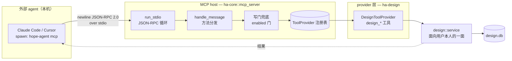
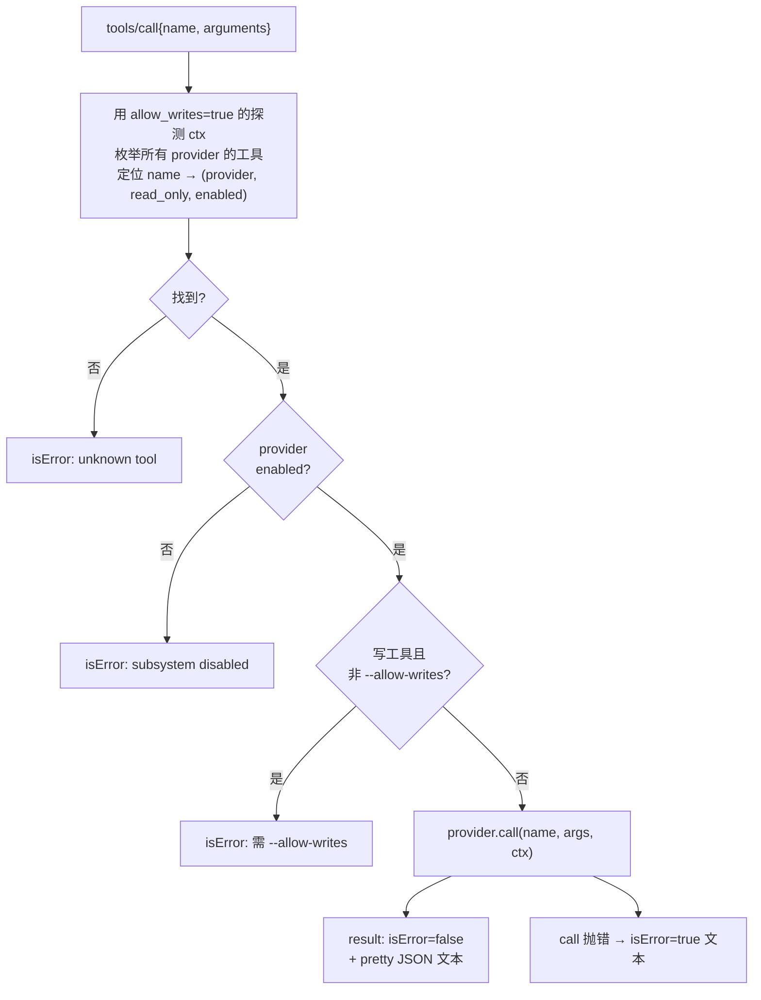
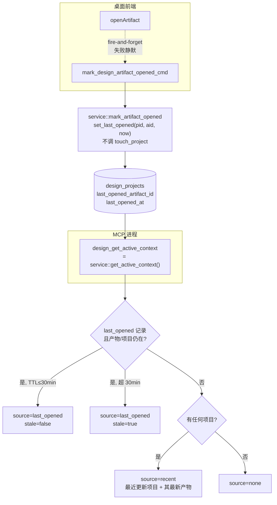

# 平台级 MCP Server（`hope-agent mcp`）

> 返回 [文档索引](../../README.md)

## 这是什么

Hope Agent 平时是一个桌面应用，也可以**反过来当一台 MCP server**：把自己的子系统能力经标准 MCP 协议暴露出去，让本机上的其它编码 agent（Claude Code、Cursor 等）像调用外部工具一样读写 Hope Agent。命令行入口就是一句 `hope-agent mcp`。

要和 [`mcp.md`](mcp.md) 分清楚：那篇讲的是我们**当客户端**——连别人的 MCP server；本篇讲的是我们**当 server**——别人连我们。MCP 规范里 "host" 特指客户端一侧的宿主应用，所以 server 侧模块命名为 `mcp_server` 而非 `mcp_host`，避免与规范术语打架。

**核心想法**是一层可复用的地基，而不是给某个子系统单独写一台 server：

- 一个**共享的 stdio 协议循环**负责 JSON-RPC 的收发、方法分发、写门兜底；
- 一张 **`ToolProvider` 注册表**——每个子系统实现一个 provider，把自己的工具挂进同一台 host；
- **设计空间（design）是目前唯一的 provider**，把「Hope Agent as MCP server」这件事从想法变成能跑的东西。将来 memory / knowledge 等子系统要暴露，也是往这张注册表里挂一个新 provider，而不是各起一台 server。

因为这层地基被刻意做成平台级的通用件，所以它的很多约束（被动 Secondary、写门双保险、无会话语义）都是「地基该有的样子」，而不是 design 一家的偏好。

### 关联源码

| 位置 | 职责 |
| --- | --- |
| `crates/ha-core/src/mcp_server/mod.rs` | 协议循环 + `ToolProvider` 契约 + 写门兜底（host 本体） |
| `crates/ha-design/src/design/mcp_provider.rs` | design provider：薄包 `design::service`，注册读/写工具 |
| `crates/ha-design/src/design/service.rs` | `get_active_context` / `mark_artifact_opened` 等被调用的逻辑（面向用户本人、本机信任的那一面，与 agent 门控面相对） |
| `crates/ha-design/src/design/db.rs` | `design_projects.last_opened_*` 列 + `set_last_opened` / `last_opened` |
| `crates/ha-base/src/runtime_lock.rs` | `acquire_or_secondary_for` + `PASSIVE_SECONDARY_ROLES` |
| `src-tauri/src/main.rs`、`crates/ha-server/src/bin/hope-agent.rs` | 两个 bin 的 `hope-agent mcp` 子命令接线 |

---

## 1. 整体形态



一次会话的形态：IDE 把 `hope-agent mcp` 作为一个 stdio 子进程拉起，双方在这条管道上按行发 JSON-RPC 消息。host 循环读一行、分发一次、写一行回去，直到 stdin EOF。整条链路**本机信任、无 token**——进程由本机用户自己 spawn，等同于面向用户本人的控制面，因此没有鉴权环节。

两个二进制都接了这个子命令：桌面壳 `src-tauri/src/main.rs` 的 `run_mcp`，与守护进程 `crates/ha-server/src/bin/hope-agent.rs`，共用同一套 `ha_core::mcp_server::run_stdio` + `DesignToolProvider`。

---

## 2. 运行契约与红线

这几条是地基级约束，改任何一条都可能让桌面 App 或后台生成静默出问题。

### 2.1 被动 Secondary：永不争 Primary

Hope Agent 用一把 `runtime.lock` 选举 Primary/Secondary，只有 Primary 跑 cron、wakeup replay、watchers、孤儿恢复这些「全进程只该有一个」的后台工作，且 tier 在进程启动时**只定一次**。

平台 mcp 进程走 `init_runtime("mcp")` → `runtime_lock::acquire_or_secondary_for("mcp")`。`"mcp"` 在 `PASSIVE_SECONDARY_ROLES` 白名单里，于是它**根本不参与选举、直接落 Secondary**。

为什么必须如此：IDE 注册的 `hope-agent mcp` 会长驻数小时、跨若干次桌面重启。如果放任它去抢锁，它很可能先于桌面拿到 `runtime.lock`，从此这个进程一辈子是 Primary——却从不跑任何 Primary-only 工作，导致真正在用的桌面 App 被挤成 Secondary，cron / wakeup / watchers / 孤儿恢复全线静默停摆。被动 Secondary 严格更安全：桌面在场时它恒 Primary；纯 mcp 部署也毫无损失，因为 mcp 本就不起任何后台服务。

### 2.2 不做子系统专属 server

把 Hope Agent 暴露成 MCP server 是**平台议题**，不是 design 的私事。design 只是挂在共享 host 上的一个 provider，**不自起 server**。更早的 `hope-agent knowledge-mcp` 目前仍是一条独立子命令，未并入共享循环；它未来若并入，对外的 `serverInfo` 与 CLI 形态不变。

### 2.3 写门双保险

**默认只读**，只有 `--allow-writes` 才暴露写工具。这道门有两层，即使 provider 忘了裁剪也拦得住：

1. **provider 层**：`tools()` 拿到 `ctx.allow_writes`，自行决定要不要把写工具放进列表；
2. **host 层兜底**：`tools/list` 与 `tools/call` 都会再查一次 `read_only` 标志——只读模式下写工具既不列出、被直接调用也一律拒。

host 兜底是安全边界，provider 的自裁剪只是配合；两层任意一层生效都足以挡住写。

### 2.4 multi_thread runtime（切勿「优化」回 current_thread）

`run_stdio` 建的是 **multi_thread（2 worker）**的 tokio runtime，进程级常驻。原因藏在 provider 的写工具里：像 design 的生成工具会在内部 `tokio::spawn` 一个后台任务，然后立即返回一个 generating 壳。current_thread runtime 在 `block_on` 返回后就不再驱动已 spawn 的任务，那个后台生成会当场僵死。所以这里是 multi_thread，模块文档与单测都把它钉死——看着像「用不着两条线程」的优化点，其实碰不得。

### 2.5 无会话轴 → 无 incognito

MCP 面直接调 `service`，请求里没有 `session_id`，因此**没有 incognito 语义**可言。这一面的唯一写门就是 `--allow-writes`；design 子系统里那些依赖会话作用域的能力（尤其以会话为读根的路径解析）在 MCP 面全部不可达（见 §5 的「恒不暴露」）。

---

## 3. 协议层

newline-delimited JSON-RPC 2.0 over stdio，`PROTOCOL_VERSION = "2025-03-26"`（与 `knowledge::agent_mcp` 同一版本号）。每行一条消息，host 逐行处理。

### 3.1 支持的方法

| method | 有 `id` | 行为 |
| --- | --- | --- |
| `initialize` | 是 | 返 `protocolVersion` + `serverInfo{name:"hope-agent", version}` + capabilities；`instructions` = 固定开场白拼接每个 enabled provider 的 `instructions()` |
| `ping` | 是 | 返 `{}` |
| `notifications/initialized` | 否 | 通知，无响应 |
| `tools/list` | 是 | 遍历 enabled provider，按写门裁剪后列出工具 |
| `tools/call` | 是 | 名字精确分发 + enabled 门 + host 写门 + `isError` 封装 |
| `resources/list` | 是 | 恒空 `[]` |
| `prompts/list` | 是 | 恒空 `[]` |

`initialize` 声明的 capabilities 是 `tools.listChanged=false`、`resources={}`、`prompts={}`——即只做工具、不做资源与 prompt。

### 3.2 两类错误：JSON-RPC error vs 工具 isError

这是最容易看错的一处。**协议级错误**才走标准 JSON-RPC `error` 对象，**工具级错误**一律封成正常 `result` 里的 `isError:true` 文本回给 client——后者不会让 client 认为「协议出错」，只是「这次工具调用失败了」。

| 情况 | 返回形态 | code / 标志 |
| --- | --- | --- |
| stdin 那行 JSON 解析失败 | JSON-RPC error | `-32700`（parse error，仅出现在 `run_stdio` 解析层） |
| 请求缺 `method` | JSON-RPC error | `-32600`（invalid request） |
| 未知 method | JSON-RPC error | `-32601`（method not found） |
| 未知工具名 | tool result | `isError:true` |
| 写门拒（只读模式调写工具） | tool result | `isError:true`，文本含 `--allow-writes` |
| provider 被禁用（`enabled()==false`） | tool result | `isError:true` |
| 工具执行本身报错 | tool result | `isError:true`，文本为错误信息 |

### 3.3 一次 `tools/call` 的判定



关键细节：分发时先用一个 `allow_writes=true` 的**探测 ctx** 把所有工具枚举一遍，这样无论当前是不是只读模式，都能先查出这个名字属于哪个 provider、是不是写工具；拿到 `(provider, read_only)` 之后**再**套用真实写门。这样只读模式下调用写工具，得到的是「这是写工具，请加 `--allow-writes`」的明确提示，而不是「查无此工具」的误导。

---

## 4. `ToolProvider` 契约

每个想上 host 的子系统实现这一个 trait。签名刻意做成**同步 + `block_on`**，不引入 `async-trait`；异步的 service 调用在 provider 内部用 `ctx.runtime.block_on` 执行。

```rust
pub struct McpCtx<'rt> {
    pub allow_writes: bool,
    pub runtime: &'rt tokio::runtime::Runtime,  // multi_thread、进程级常驻
}

pub struct ToolDef {
    pub name: &'static str,      // 前缀约定 <provider>_，如 design_list_projects
    pub description: String,
    pub input_schema: Value,
    pub read_only: bool,         // false = 写工具，需 --allow-writes
}

pub trait ToolProvider: Send + Sync {
    fn name(&self) -> &'static str;
    fn enabled(&self) -> bool { true }                 // 配置门；false → 双面 fail-closed
    fn instructions(&self) -> Option<&'static str> { None }
    fn tools(&self, ctx: &McpCtx) -> Vec<ToolDef>;     // 自行按 ctx.allow_writes 裁剪写工具
    fn call(&self, name: &str, args: Value, ctx: &McpCtx) -> Result<Value>;
}
```

- **`enabled()`** 是配置门（design 查 `cached_config().design.enabled`），且**双面 fail-closed**：禁用时 `tools/list` 不列该 provider 的工具，`tools/call` 也直接拒。
- **`instructions()`** 会被拼进 `initialize` 的 `instructions` 字段，告诉外部 agent 该怎么用这套工具。
- **工具名前缀** `<provider>_` 是约定，让不同 provider 的工具在同一台 host 上不撞名。

---

## 5. design provider

design 的 provider 全部**薄包 `crate::design::service`**（面向用户本人、本机信任的那一面），与 HTTP / Tauri 三个入口平级复用同一套逻辑、零新业务。`enabled()` 读 `cached_config().design.enabled`。

### 5.1 读集（恒可见）

| 工具 | 作用 | 值得注意 |
| --- | --- | --- |
| `design_list_projects` | 列所有设计项目（最近更新在前） | |
| `design_list_artifacts` | 列项目内产物 | `projectId` 必填；**不走** `get_or_create`——无会话，避免误建草稿项目 |
| `design_get_artifact` | 读单个产物：元数据 + oid 标注源码 + open comments | 组合 `get_artifact_view` + `get_artifact_source_for_agent`（oid 源码）+ `list_comments`；`status=="generating"` 且 `updated_at` 落后 >600s 时附 `maybeOrphaned` 提示 |
| `design_get_active_context` | 用户此刻在设计空间看什么（见 §6） | |
| `design_list_systems` | 列设计系统（内置 + 用户 + 提取所得） | |
| `design_get_system` | 读单个系统：DESIGN.md 契约 + tokens | 可选 `tokenFormat` 过滤到某平台导出（css/scss/ts/swift/android/dtcg） |
| `design_list_comments` | 列画布批注 | `openOnly` 只留未解决 |
| `design_list_versions` | 列产物版本历史 | |

### 5.2 写集（`--allow-writes` 才注册）

| 工具 | 作用 | 值得注意 |
| --- | --- | --- |
| `design_generate_artifact` | 从 brief 生成新产物 | 静态 HTML 形态立即返 generating 壳、需轮询 `design_get_artifact` 至 `status!="generating"`；image/audio/component 同步阻塞到完成 |
| `design_update_artifact` | 整体替换产物 body/css/js（生成新版本） | `origin:"ai"`；可选 `expectedBodyHash` |
| `design_edit_element` | 按 oid 精改单个元素（改 style/text/attrs 或删除） | `expectedBodyHash` 在 **schema 层强制必填**；`text_node`（仅桌面可视化编辑用）不暴露 |
| `design_restyle` | 换设计系统重渲染（不改源码） | 省略 `systemId` 即清除系统 |
| `design_restore_version` | 恢复旧版本（非破坏，从快照建新版本） | |
| `design_add_comment` | 加画布批注（可锚到 oid） | |
| `design_resolve_comment` | 标批注已解决 / 重开 | |

`design_edit_element` 的 `expectedBodyHash` 之所以从「可选」收紧成「必填」：跨进程之间没有共享的 `artifact_lock`，schema 层强制先读 hash 再改是主动防陈旧写的收紧，patch 层锁内的重校验仍作最终兜底。

### 5.3 恒不暴露（红线，provider 根本不定义即不可达）

MCP 面把外部 agent 挡在一批高危动作之外——不是靠写门，而是 provider **压根不注册**这些工具：

| 类别 | 被排除的能力 | 为什么 |
| --- | --- | --- |
| 写用户代码 | `implement_to_code`、代码绑定写 | 外部 agent 不得经 MCP 触碰用户代码仓库 |
| 对外发布 | `deploy*`、`share` | 不得对外发布 |
| 删除容器 | `delete_project`、`delete_artifact` | 不得删除项目 / 产物 |
| 落地知识库 | `save_to_knowledge` | |
| 提取系统 | `extract_system` | 其 `scoped_local_path` 以会话为读根，MCP 无会话，无法安全界定读根 |
| 导出下载 | `export_*` | 会写 Downloads 目录 |

---

## 6. active-context：无状态进程怎么知道「用户在看什么」

`design_get_active_context` 想回答一个直觉问题：外部 agent 接手时，用户此刻在设计空间里正看着哪个项目、哪个产物？难点是 MCP 是个**全新的无状态进程、没有 GUI 会话**，它自己并不知道桌面前端此刻打开了什么。答案是让前端把「最近打开」这一事实**落到服务端**，MCP 再从那里读。



要点：

- **两列存事实**：`design_projects` 加了 `last_opened_artifact_id` + `last_opened_at`（幂等 ALTER）。它们**不进** `PROJECT_COLUMNS` / DTO / mapper，只由专用方法 `set_last_opened` / `last_opened` 读写——因为这纯是一点 UI 痕迹，`design.db` 是可重建缓存，丢了就走 fallback，不值得污染主投影。
- **浏览 ≠ 编辑**：前端 `openArtifact` 后台 fire-and-forget 上报，`mark_artifact_opened` 只更新这两列，**刻意不调 `touch_project`**——否则单纯浏览就会抬高 `updated_at`，扰动「最近项目」排序这个不变量。
- **三级 fallback**（`get_active_context`）：先取 `last_opened` 记录，产物与项目都还在才采纳，并按 30 分钟 TTL 判 `stale`（超时仍返回，只是标记不新鲜，交给 client 决定）；记录缺失或指向已删对象则回退到「最近更新的项目 + 其最新产物」，`source="recent"`；连一个项目都没有则 `source="none"`。这里「最新产物」取 `updated_at DESC` 的那个（用户多半正在改的），而非产物墙 `position ASC` 排第一的。
- **载荷内容**：项目 + 产物摘要（含 `body_hash` / open comment 数，**不内联源码**，源码另调 `design_get_artifact`）+ 未解决批注正文 + `CodeBindingInfo` + 该项目最近设计对话的 session id。

---

## 7. 已知风险与限制

- **跨进程写并发**：桌面与 MCP 可能同开 `design.db`，而 `artifact_lock` 只在进程内。`design_edit_element` 靠 schema 强制 `expectedBodyHash` + patch 层锁内重校验来缓解；这一暴露面与既有的 knowledge-mcp 同级。若要更强的保证，方向是加一把目录级的 advisory file lock。
- **generating 孤儿**：MCP 进程若被杀，会留下一个卡在 `generating` 的壳。自愈只发生在桌面产物墙的 `list_all_artifacts` 对账（600s grace）；MCP 侧则由 `design_get_artifact` 附 `maybeOrphaned` 提醒 client 别死等。
- **GUI 无实时刷新**：MCP 进程 emit 的 `design:reload` / `design:code_drift` 事件跨不到桌面进程，用户重新打开产物即见新内容。

---

## 延伸阅读

- [`mcp.md`](mcp.md)：我们**当客户端**连别人的 MCP server（`ha-mcp` crate）
- [`design-space.md`](../infra/design-space.md)：design 子系统本体，含平台级「Hope Agent as MCP server」的定位，以及面向用户本人与面向 agent 两套入口的区分
- [`knowledge-base.md`](../core/knowledge-base.md)：更早的 `hope-agent knowledge-mcp` 所暴露的知识空间
