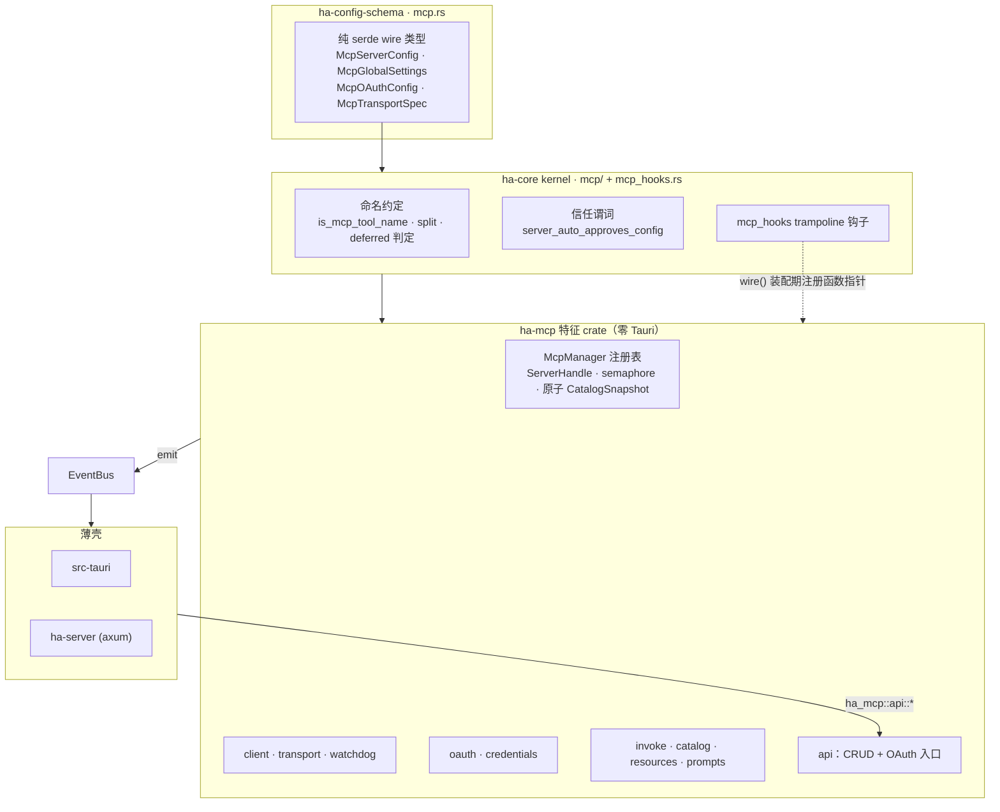
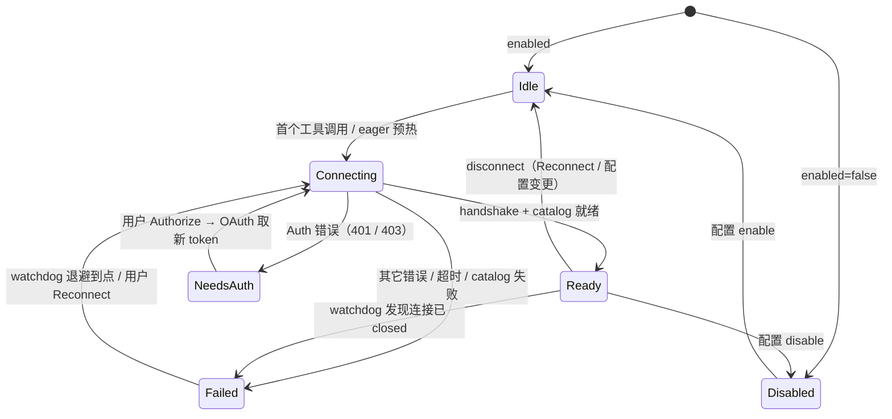
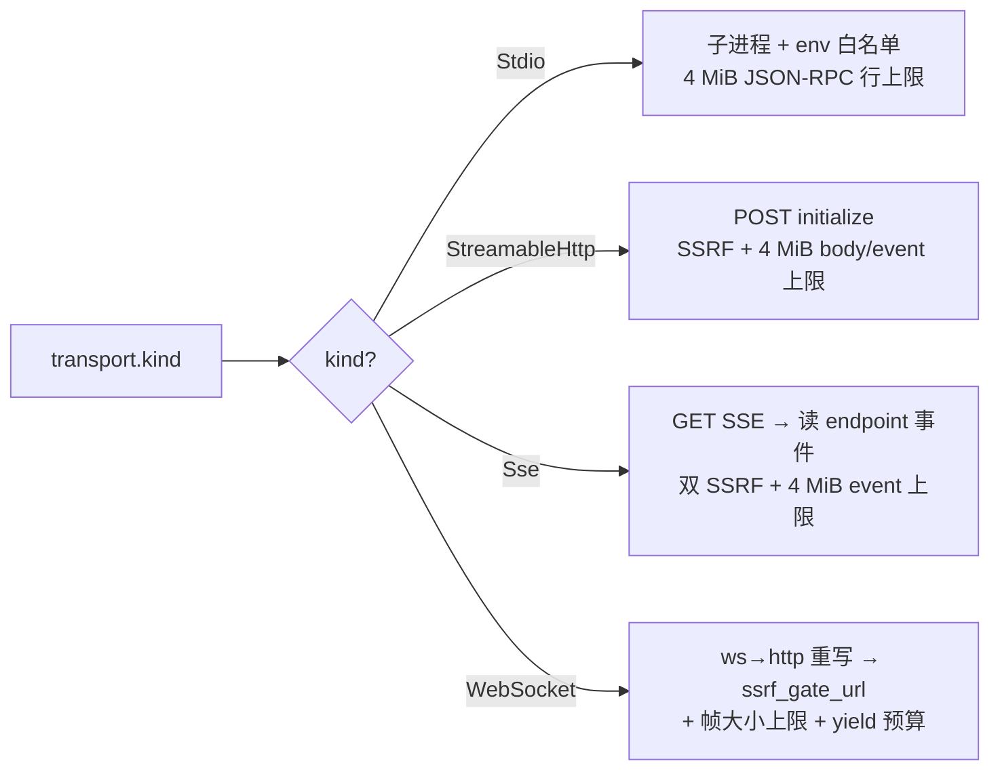
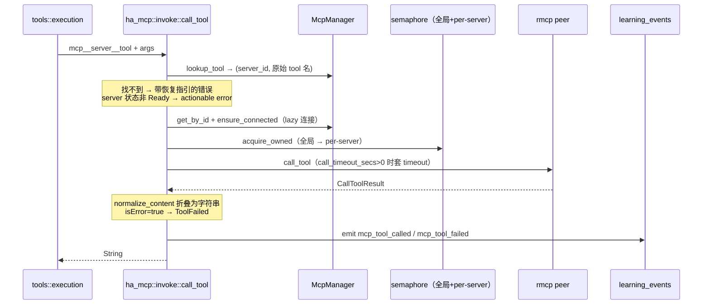
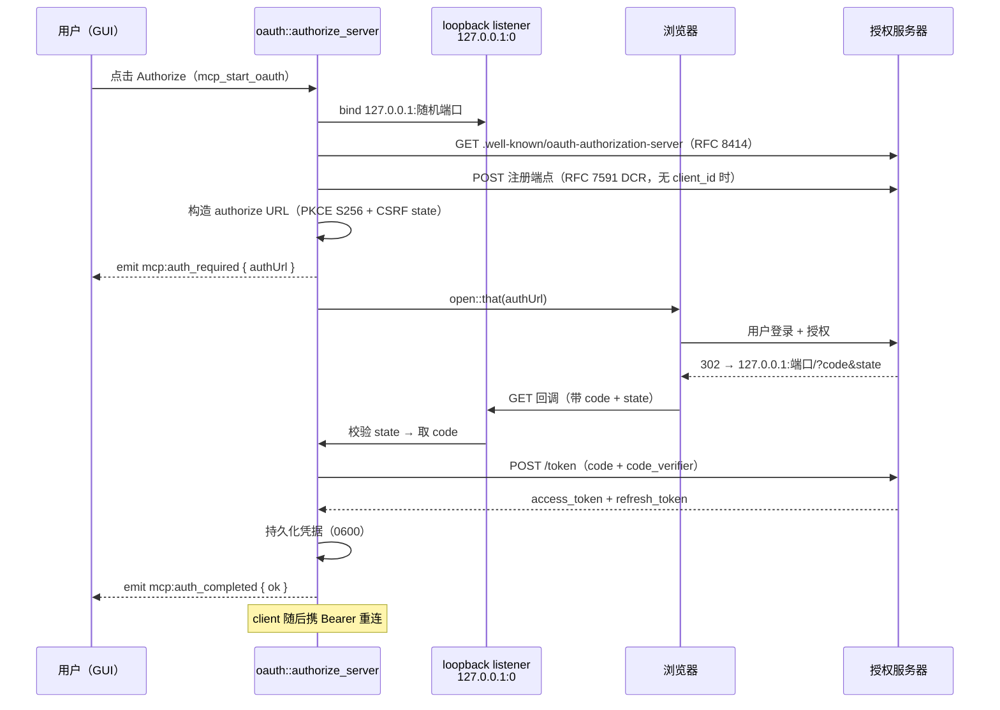

# MCP 客户端架构

> 返回 [文档索引](../../README.md) | 更新时间：2026-08-11

Hope Agent 的 [Model Context Protocol](https://modelcontextprotocol.io/) **客户端**：把任意外部 MCP Server 暴露的 tools / resources / prompts 接入主对话循环，让模型能像调用内置工具一样调用远端能力。

方向相反的另一半——Hope Agent **自己当** MCP Server、把内部子系统暴露给外部 agent——见 [`mcp-server.md`](mcp-server.md)。

## 关联源码

| 面 | 位置 |
|---|---|
| 特征 crate 运行时 | `crates/ha-mcp/src/`（装配入口 `lib.rs::wire()`） |
| kernel 面（命名约定 / 信任谓词 / trampoline） | `crates/ha-core/src/mcp/` + `crates/ha-core/src/mcp_hooks.rs` |
| 配置 wire 类型（纯 serde） | `crates/ha-config-schema/src/mcp.rs` |
| 凭据落盘 | `crates/ha-base/src/platform/mod.rs`（`write_secure_file`）+ `crates/ha-base/src/paths.rs` |
| HTTP 路由 | `crates/ha-server/src/lib.rs` + `crates/ha-server/src/routes/mcp.rs` |
| 前端 | `src/components/settings/mcp-panel/` + `src/lib/mcp.ts` |

---

## 目录

- [核心思想](#核心思想)
- [设计目标](#设计目标)
- [架构分层](#架构分层)
- [模块拆分](#模块拆分)
- [生命周期与状态机](#生命周期与状态机)
- [传输层](#传输层)
- [工具注入主对话循环](#工具注入主对话循环)
- [Resources 与 Prompts](#resources-与-prompts)
- [OAuth 2.1 + PKCE](#oauth-21--pkce)
- [凭据存储](#凭据存储)
- [安全模型](#安全模型)
- [Dashboard Learning 埋点](#dashboard-learning-埋点)
- [GUI 与前后端通信](#gui-与前后端通信)
- [事件总线](#事件总线)
- [配置 schema](#配置-schema)
- [故障排查](#故障排查)
- [与 openclaw · claude-code 的差异](#与-openclaw--claude-code-的差异)

---

## 核心思想

MCP 客户端要解决的问题很直接：**外部世界的能力千差万别，主对话循环却只认一种工具接口。** 一个 MCP Server 可能是本地起的 Python 子进程、一台云端 HTTP 服务、甚至一个 WebSocket 长连接；它暴露的工具数量、schema 形状、鉴权方式各不相同。客户端的职责就是把这些差异全部吸收在自己这一层，对上游只呈现一件事——一批名字叫 `mcp__<server>__<tool>` 的普通工具。

围绕这个目标，整个子系统的骨架由四个想法撑起来：

- **一切归一化到"内置工具"**。远端工具的 schema 被清洗成 provider 能接受的形状、名字被压进 64 字符命名空间、返回内容被折叠成一段字符串。走到 tool loop 时，它和 `read_file` 没有本质区别。
- **连接是有状态、可自愈的资源**。每个 server 是一台小状态机（Idle → Connecting → Ready / NeedsAuth / Failed），由后台 watchdog 用指数退避 + 熔断照看，而不是每次调用现连现断。
- **默认不信任**。stdio server 本质是任意二进制、网络 server 的 URL 可能指向内网。所以出站 URL 全程过 SSRF 门、工具调用默认过审批门、子进程只继承白名单环境变量——放宽任何一道都要用户显式声明 `Trusted`。
- **零 Tauri、一套代码三处跑**。全部业务逻辑在纯 Rust 特征 crate 里，桌面 GUI、HTTP 守护进程、ACP stdio 三种运行模式共用同一条代码路径。

覆盖范围一览：

- **四种 transport**：stdio、Streamable HTTP、legacy SSE、WebSocket
- **完整 OAuth 2.1 + PKCE**：discovery（RFC 8414）、动态客户端注册（RFC 7591）、loopback 回调（RFC 8252）、自动刷新
- **凭据安全**：`0600` 原子写、无 TOCTOU、删除 server 自动清理
- **被动数据**：`mcp_resource` / `mcp_prompt` 两个内部工具按需拉取 resources / prompts
- **审计留痕**：连接 / 断开 / 失败 / 工具调用全程埋点，且每次工具调用落 `learning_events` 供 Dashboard 聚合

---

## 设计目标

| 目标 | 具体表现 |
|---|---|
| **零 Tauri 依赖** | 运行时全在特征 crate `crates/ha-mcp/`，不 `use tauri::*`；Tauri 壳和 axum server 只通过 `ha_mcp::api::*` 和 `EventBus` 与它对话。命名约定 / 信任谓词 / trampoline 留在 kernel（`crates/ha-core/src/mcp/`） |
| **最小握手延迟** | 默认 lazy connect：首次 `tool_search` / `mcp_resource` / `mcp_prompt` 才并发拉取缺失 catalog；`eager=true` 在子系统初始化后立即异步预热，首个 provider 请求等待其完成，watchdog 只负责后续恢复 |
| **可恢复性** | watchdog 指数退避 + 连续失败熔断；401 分流到 `NeedsAuth` 等用户授权；用户可随时手动 Reconnect 立即绕过退避 |
| **成本意识** | 全局 `deferredTools.mode=recommended`（默认）把所有动态 MCP 工具放进 `tool_search` 按需发现池；`custom` / `disabled` 模式才按 server 的 `deferredTools=true` 逐个 opt-in，避免几十上百个工具塞满每轮请求 |
| **审计留痕** | 全程 `app_*!` 宏，`category=mcp`、`source=<server>:<event>`，双写 SQLite + 文本日志 |

---

## 架构分层

MCP 客户端横跨三层 crate。核心模式是：**业务"机器"（连接、握手、OAuth、重连）迁到特征 crate `ha-mcp`，但命名约定、信任判定这类跨层共享的纯谓词留在 kernel。** kernel 与特征 crate 之间用一组函数指针（trampoline）解耦——kernel 只知道"有 MCP 这个能力"，具体实现由 `ha-mcp` 在进程启动的 `wire()` 阶段注册进来。



**未接线即"MCP 未启用"**：任何调 `ha_core::init_runtime` 的二进制必须先调 `ha_mcp::wire()`。若某进程没接线，kernel 侧的 trampoline 会 fail-explicit——`tool_definitions()` 返空 Vec、`call_tool()` 报错、`reconcile` 记一条 `app_warn` 后 `Ok(())`。这保证配置写路径不会因为某个壳没装 MCP 而硬失败。

trampoline 是一组钩子（`McpHooks`）：`init_subsystem` / `spawn_watchdog` / `tool_definitions` / `ensure_tool_catalogs` / `has_pending_catalogs` / `tool_server_config` / `call_tool` / `system_prompt_snippet` / `reconcile_from_config`。

---

## 模块拆分

```
crates/ha-mcp/src/
  lib.rs         公共 API 再导出；wire() 装配；locate_server() id-or-name fallback
  config.rs      wire 类型再导出（定义在 ha-config-schema）+ 占位符展开 + validate_server_config
  registry.rs    McpManager（全局 OnceLock）· ServerHandle · ServerState · 原子 CatalogSnapshot
  client.rs      ensure_connected / connect_now / refresh_catalog / disconnect / stderr tailer
  transport.rs   四种 transport 工厂 + 共享 helper（ssrf_gate_url / authorized_headers / classify_network_error）
  watchdog.rs    健康检查 + 指数退避 + 熔断
  catalog.rs     rmcp Tool → ToolDefinition 转换 + inputSchema 归一化 + system_prompt 段
  invoke.rs      call_tool 分发 + 并发闸 + 结果归一化 + emit_learning 埋点
  resources.rs   list/read_resource + mcp_resource 工具 handler
  prompts.rs     list/get_prompt + mcp_prompt 工具 handler
  oauth.rs       OAuth 2.1 + PKCE 全流程 + 独立 reqwest client
  credentials.rs McpCredentials 持久化（load/save/clear/needs_refresh/ensure_dir）
  events.rs      EventBus 事件常量 + emit 助手
  errors.rs      McpError 分类
  api.rs         Tauri / HTTP 共享 CRUD + OAuth trigger 入口
```

命名约定只在 kernel 里定义一处（`crates/ha-core/src/mcp/catalog.rs`）：`is_mcp_tool_name` / `split_mcp_tool_name` / deferred 判定被 kernel 分发和 `ha-mcp` 运行时两侧共用，特征侧只是把它们再导出，没有自己的一套前缀判定。

几条约定：

- 模块内不 `use tauri::*`
- 配置读走 `cached_config().mcp_servers`，写走 `mutate_config(("mcp.<op>", "<source>"), |cfg| { ... })`
- id-or-name 的 fallback 解析集中在 `ha_mcp::locate_server(name_or_id)`（封装 `McpManager::locate`），已知确切 key 时才走 `McpManager::{get_by_id, get_by_name}`

---

## 生命周期与状态机

每个 server 在 `McpManager` 里是一台独立状态机。真正的连接动作永远经 `client::connect_now()` 进入 `Connecting`——无论触发者是 watchdog、用户手动 Reconnect，还是 OAuth 拿到新 token 之后的自动重连。`Idle` 只在初始态和 `disconnect()` 之后出现。



各状态携带的数据（`registry::ServerState`）：

- **`Ready { tools, resources, prompts }`**：三份 catalog 快照（`Vec<rmcp::model::{Tool, Resource, Prompt}>`）。`list_resources` / `list_prompts` 直接读快照，不再往返网络。
- **`NeedsAuth { auth_url }`**：`auth_url` **恒为空字符串**——它只是"该按授权按钮了"的信号；真实一次性 PKCE URL 由用户点击时 `oauth::authorize_server` 动态生成并经事件推送。
- **`Failed { reason, retry_at }`**：`retry_at` 是 watchdog 下一次可重试的 unix 时刻。

**为什么 Auth 错误单独一条分支？** 401/403 的正确恢复动作是"用户点 Authorize"而非"watchdog 傻重试"。把 server 留在 `NeedsAuth` 而不是 `Failed`，可以避免拿着一个已坏的 token 疯狂刷新。

**启动策略**：默认 lazy connect 以省冷启时间，但动态工具名本身依赖 `tools/list`，不能靠“首次动态调用”自举。因此 `tool_search` 在检索前通过 MCP hook 对尚无 catalog 的 server 做至多 4 路并发发现；传入 `mcp_server` 时只连接并检索该精确服务，未传时保持全量发现。Provider 原生工具搜索不能扩展 `mcp_server` 入参，因此只要当前 turn 存在有效 MCP server，就固定保留 Hope 本地 `tool_search`；没有有效 MCP server 时仍优先使用 Provider 原生搜索。`mcp_resource` / `mcp_prompt` 也会先确保目标 server 已连接。整批发现由进程级异步锁保证只有一个 active worker，前台等待上限固定为 30s（等锁也计入），不随 server 数量线性增长；超时时已发布 catalog 立即可用，唯一未完成 worker 脱离前台继续后台发现。`eager=true` 的 server 在子系统初始化后立即异步 `ensure_connected`，不等待 watchdog 首个 15s tick；首个 provider 请求在组装 schema 前等待同一个进程级 `OnceCell` 启动屏障。无论本轮连接成功或失败，该屏障都只完成一次，普通聊天后续轮次不再同步重试不可达 server；配置热更新只触发后台 warm-up，Primary 的持续恢复交给 watchdog，ACP 仍可由 `tool_search` 显式重试。

**Catalog 发布**：动态工具反查索引、Provider Schema 列表、已完成 catalog 的 server 集合属于同一代 `CatalogSnapshot`，经 manager 级更新锁串行合并后一次 `ArcSwap` 发布。禁止分别写 `tool_index` / schema cache：多 server 同时 refresh 的 read-modify-write 会丢掉另一 server，分步发布还会制造“Schema 已见但不可 dispatch”窗口。零工具 server 也记为 cataloged，避免系统提示持续把它误报为“尚未发现”；连接重试仍由 live `ServerState` + backoff 决定。

**健康检查 + 指数退避**：watchdog 固定每 `TICK_INTERVAL_SECS`（15s）tick 一次，对每个 `Ready` server 检查 `RunningService::is_closed()`——**刻意不发网络 `ping`**（主动探测只增稳态流量、收益甚微，靠 `is_closed` + 真实工具调用冒泡的失败来发现回归）。发现 closed 即断开、翻 `Failed` 触发退避。重连间隔 `min(backoff_initial × 2^n, backoff_max)`，其中 `n = 连续失败数 - 1`，位移封顶 6（默认即 `min(5s × 2^n, 300s)`）。`health_check_interval_secs` 是历史字段，当前 watchdog 不读取。

**熔断**：连续失败达到 `consecutiveFailureCircuitBreaker`（默认 10）后，`retry_at` 被推到 `now + autoReconnectAfterCircuitSecs`（默认 1800s = 30min）以压制日志噪声；用户手动 Reconnect 随时绕过。

**断开 / 关闭**：`client::disconnect(handle)` 取出 `RunningService` 后 `running.cancel().await`。stdio transport 的 `BoundedChildOutput` 持有 `kill_on_drop=true` 的子进程句柄；transport 被取消 / 丢弃时由 Tokio 终止子进程，本模块不另发 SIGTERM/SIGKILL。

**并发上限**（两层独立 semaphore，`invoke::call_tool` 依次 `acquire_owned`）：

- 全局：`McpGlobalSettings.max_concurrent_calls`（默认 8）
- 每 server：`McpServerConfig.max_concurrent_calls`（默认 4）

**Catalog 累计上限**：单个 server 的 tools / resources / prompts 每类同时受 `CATALOG_ENTRIES_PER_KIND_CAP`（512 项）和 `CATALOG_BYTES_PER_KIND_CAP`（16 MiB 序列化体积）约束，任一达到即停止翻页并记 warn。字节计数经无分配 `serde_json::to_writer` 计数 writer 完成，避免为测量再造一份大 JSON；resources / prompts 只有明确的 JSON-RPC `METHOD_NOT_FOUND` 可降为空目录，传输、超时、畸形请求或响应超限都必须让连接失败，禁止在 dead peer 上发布 `Ready`。

---

## 传输层

四种 transport 在 `transport.rs` 里并列实现，共享三个 helper：`ssrf_gate_url` / `authorized_headers` / `classify_network_error`。网络型 transport（除 stdio 外）出站前一律过 SSRF 门。



### stdio

- `build_stdio_client` 直接启动 `kill_on_drop` 子进程并用 rmcp 的有界 `JsonRpcMessageCodec` 接线；命令**不过 shell**，args 作为独立 argv 传入
- 子进程只继承 9 个白名单 env（`HOME` / `USER` / `PATH` / `LANG` / `LC_ALL` / `TZ` / `TMPDIR` / `TEMP` / `TMP`）+ `cfg.env` 显式声明，支持 `${VAR}` 占位符展开
- stderr 独立 tailer → `app_warn!` 输出：单行截断 4 KiB、每 10s 最多 100 行、超出汇总为一条 `[suppressed N lines over 10s]`

### Streamable HTTP

- spec 首选的远程协议（spec date 2025-03-26）：直接 POST `initialize`，session 走 `Mcp-Session-Id` 响应头
- 出站前 `ssrf_gate_url`——`Trusted` 用 `default_policy`、`Untrusted` 用 `Strict`
- `authorized_headers` 注入 user headers + OAuth Bearer（当 `cfg.oauth` 存在、磁盘有凭据、且用户未显式设 `Authorization` 时）
- handshake 401/403/unauthorized/invalid_token → `McpError::Auth` → `NeedsAuth`

### SSE（legacy HTTP+SSE，spec date 2024-11-05）

Streamable HTTP 和 SSE 是**两套 wire 协议，不能互相路由**：Streamable HTTP client 直接 POST `initialize`，而 legacy SSE server 没有 session 会回 `400 session_id is required`。所以 `Sse` 走独立的手写握手：

- `build_sse_client`：GET SSE URL → 读到 `endpoint` 事件拿 session 化的 POST URL → 之后 client→server 走 POST 到该 URL、server→client 走 SSE `message` 帧
- **SSRF 两道门**：① GET URL 出站前 `ssrf_gate_url`；② server 返回的 `endpoint` 是 server-controlled 的，首次 POST 前经 `resolve_sse_endpoint`（相对路径按 base 解析）后**再过一次** `ssrf_gate_url`。第二道校验拦的是恶意 server 把 POST 引到内网的路径，省不得
- 整个握手在 `connect_timeout_secs` 内完成；server 不发 `endpoint` 就超时（`Timeout`），不会挂死
- **代理绕行（本地 MCP）**：reqwest 会抓系统/环境代理但**不遵守 OS bypass 列表**（macOS `ExceptionsList` / `ExcludeSimpleHostnames`），导致"开代理连云端 LLM"时本地 MCP（`http://localhost:PORT`）被代理劫持 → 503。Streamable HTTP 与 legacy SSE 都经 `build_mcp_http_client`，按 `host_bypasses_proxy(host)`（`localhost` / `*.localhost` + IPv4 loopback/private/link-local + IPv6 loopback/ULA/link-local）对本地目标 `.no_proxy()`，远程目标仍走代理；前者由 `BoundedMcpHttpClient` 实现 rmcp 的 client trait，避免使用 rmcp 内置的无上限 reqwest adapter。

### WebSocket

- 基于 `tokio-tungstenite` 0.29，用 `WsJsonRpcTransport<S>` adapter 桥接到 rmcp 的 `IntoTransport for (Si, St)`
- 手写 `Sink + Stream` impl：`SinkExt::with` + `filter_map` 的 async closure future 是 `!Unpin`，违反 rmcp 的 Sink+Stream `Unpin` bound，手写绕过
- **scheme 重写**：ws→http / wss→https 供 SSRF 分类（`security::ssrf` 只认 http/https）
- **帧大小硬上限**：`max_message_size=4 MiB`、`max_frame_size=1 MiB`（tungstenite 默认 64/16 MiB 对 JSON-RPC 过宽松）
- **`poll_next` yield 预算**：连续丢弃 64 帧（ping/pong/close/malformed）后 `wake_by_ref() + Pending`，防恶意 server 用无效帧洪水饿死调度器

### 入站消息上限

四种 transport 都在 serde / SSE event 物化前执行 `MAX_INBOUND_MESSAGE_BYTES=4 MiB` 硬上限：stdio 用 `JsonRpcMessageCodec::new_with_max_length` 限单行；Streamable HTTP 在读取 JSON body 时同时检查 `Content-Length` 与流式累计字节，SSE 字节流在空行边界重置逐 event 预算；WebSocket 复用同一常量限制 message。超限会终止当前 transport / 请求并进入现有失败与退避路径。Catalog 的 512 项上限负责**条目数 / 翻页数**，本上限负责**单页或单项的字节体积**，两层缺一不可。

### 共享 helper

- `ssrf_gate_url(cfg, url)` — 按 `trust_level` 选 policy，`check_url` 失败 → `McpError::Blocked`
- `authorized_headers(cfg)` — 构造请求头，OAuth Bearer 注入 + 用户显式 `Authorization` 优先
- `classify_network_error(cfg_name, verb, err)` — substring 匹配 401/403/unauthorized 归 `Auth`，其余归 `Transport`

---

## 工具注入主对话循环

### 命名空间

- **格式**：`mcp__<server>__<tool>`（与 openclaw / claude-code 对齐，方便迁移配置）
- **Server name 校验**：`^[a-z0-9_-]{1,32}$`，全配置唯一，不可改名（改名要删了重加，避免旧引用失效）
- **Tool name 归一化**：每个非 `[A-Za-z0-9_]` 字符**替换为 `_`**（连字符也不例外）；工具名部分按实际 server name 动态使用 `64 - len("mcp__<server>__")` 的剩余预算，32 字符 server 最少仍有 25 字符，较短 server 不再无谓截断。归一化可能撞名（`foo-bar` 与 `foo.bar` 都变 `foo_bar`），后续碰撞补 `_2`、`_3` 后缀且仍守 64 上限

### Schema 转换（`catalog::rmcp_tool_to_definition`）

`inputSchema` 经 `normalize_input_schema` 清洗，吸收野生 server 的各种畸形 schema：

- `null` / 非 object → 合成 `{ "type":"object", "properties":{} }`
- object 缺 `type` → 注入 `type:"object"`
- 顶层 `anyOf` / `oneOf` of object variants → 合并各分支 `properties`（`required` 取**交集**），因为部分 provider 拒绝根级 union；**嵌套 union 原样保留**
- 始终保证 `properties` 存在（部分 server 只回 `{"type":"object"}`，Anthropic 会拒）

其它转换：

- `description` 前缀 `[<server>] ` 方便模型归因；server 未给描述则回退 `MCP tool from server '<name>'`
- 统一 `tier = Mcp`、`internal = false`、`concurrent_safe = false`；是否注入由 per-agent `capabilities.mcpEnabled` 门控
- **`background_policy` 映射**（读 rmcp `execution.taskSupport`，spec date 2025-11-25）：`Required` / `Optional` → `GenericJob`（让 tool loop 的"同步预算超时自动后台化"分支可触发）；`Forbidden` / 缺省 → `ForegroundOnly`
- `deferredTools=true` 的 server，其工具不 eager 注入，改由 `tool_search` 发现

### 分发路径

kernel 的 `tools::execution` 先查内置注册表，MCP 是其后的逃逸口（`mcp__` 前缀不进注册表）：

```rust
if let Some(tool) = super::registry::lookup(name) {
    // 内置工具
} else if crate::mcp::catalog::is_mcp_tool_name(name) {
    crate::mcp::invoke::call_tool(name, args, dispatch_ctx).await  // kernel trampoline → ha-mcp
}
```

`invoke::call_tool` 的执行链——工具级审批和沙箱在进入本层**之前**已由 kernel execution 的通用包装完成：



**结果归一化（`normalize_content`）** 把异构的 `Vec<Content>` 折成一段字符串，形状贴近内置文本工具的输出：

| 内容类型 | 折叠为 |
|---|---|
| `text` | 原文逐段拼接（段间空行） |
| `image` | 占位行 `[image mime=… size_b64=…]`（当前不落盘、不走图片持久化路径） |
| `audio` | 占位行 `[audio mime=… size_b64=…]` |
| 内嵌 `resource` | `[resource uri=…]\n<正文>`；blob 正文显示为 `[blob base64 size=…]` |
| `resource_link` | `[resource_link uri=…]` |

`call_timeout_secs > 0` 时单次调用外套 `tokio::time::timeout`，`0` 表示不加 call-level timeout。超时或 `isError=true` 会让 per-server 失败计数 +1，喂给 watchdog 升级；一次干净调用则把计数清零。

### 与现有过滤体系整合

MCP 工具的可见性叠了几层闸：

- **Agent 级总开关**：`agent.json` 的 `capabilities.mcpEnabled=false` 时，MCP 元工具和所有动态 `mcp__<server>__<tool>` 都不注入、也不进 `tool_search`
- **全局 / server 级启用条件**：动态 MCP 工具只有在 `mcpGlobal.enabled && server.enabled && !mcpGlobal.deniedServers.contains(server.name)` 时进入 live registry；任一条件转 false 会从 schema cache / `tool_search` / 执行反查表同步移除
- **Server 级工具过滤**：`allowedTools` / `deniedTools` 按**原始** tool name（命名空间前缀之前）配置，catalog refresh 和配置热更新都会立刻用已有 catalog 重建该 server 的 schema cache 与反查表
- **Server 级 deferred**：全局 Recommended 模式下所有动态 MCP 工具都按需发现；Custom / Disabled 模式下，`deferredTools=true` 才把该 server 的动态工具放进 `tool_search`
- **上下文级收紧**：`denied_tools` / `skill_allowed_tools` / `plan_mode_allowed_tools` 经 `tool_defs::tool_visible_with_filters` 生效

`capabilities.tools.allow/deny` 只覆盖非 Core 内置工具的开关，**不再**通过 `mcp__<server>__<tool>` 全限定名过滤动态 MCP 工具。

---

## Resources 与 Prompts

Resources 和 Prompts 是 MCP server 暴露的**被动数据**（不是工具调用）：客户端要主动 `list` 发现、`read` / `get` 拉取。它们经两个内部工具暴露给模型。

### Resources（`resources.rs`）

- `list_resources(server)` 读 `Ready` 状态里的 resources 快照，不触发网络往返
- `read_resource(server, uri)` 经 `handle.peer().read_resource(...)` 调远端 `resources/read`
- 归一化 `TextResourceContents` / `BlobResourceContents` → `{ uri, mimeType, text | blobBase64 }`
- **blob 零分配验证**：`maybe_reencode` 用纯 charset 扫描判断是否已是合规 base64，避免为大 blob 走完整 `BASE64.decode` 分配临时缓冲
- 内部工具 `mcp_resource(action=list|read, server, uri?)`

**缓存边界**：当前只把 tools/resources/prompts catalog 保存在对应 server live connection 的 `Ready` generation；server 配置、凭据相关配置、enable/deny 或重连会替换该 generation。`resources/read` 正文不跨调用/Turn 缓存，每次都走 live handle、权限与实际远程请求；尚未协商 validator 的远端 `ttlMs` / `cacheScope` hint 不会被擅自解释成跨账号或跨 Turn 的正文缓存许可。这个保守实现避免把 catalog cache、资源正文和 prompt cache 混成一个授权边界。

### Prompts（`prompts.rs`）

- `list_prompts(server)` 读快照；`get_prompt(server, name, arguments)` 调 `prompts/get` RPC
- `arguments` 里非字符串的值会**显式报错**而非静默 drop
- 归一化 `PromptMessageContent` 的四个 variant（Text / Image / Resource / ResourceLink）为 `{ role, text }`
- 内部工具 `mcp_prompt(action=list|get, server, name?, arguments?)`

### 回合能力目录与类型化 `@connector`

`catalog::system_prompt_snippet()` 保留了兼容命名，但产物已经是当前回合的 capability data：列出有效配置的 server 名，并说明目标工具缺席时可用 `tool_search` 做 lazy discovery，同时指向 `mcp_resource` / `mcp_prompt`。它只经 config cache 同步读取、不 await 运行时锁；结果进入 user-data lane，不进入稳定 system 前缀。无有效 MCP server 时整段省略。

Composer 的统一 `@` 菜单通过 `mention_hooks` 获取 namespaced capability。当前 `ha-mcp::wire()` 注册的 provider namespace 是 `mcp`：picker 返回的稳定 target id 由 kernel 组合为 `mcp::<server-id>`，live resolution 后给模型的 untrusted capability metadata 使用 `namespace: mcp:<server-id>`。这里的双冒号是 provider 与 target 的 registry 分隔符，不能写成并不存在的 `connector::<server>` namespace。列表只读本地配置，不发起连接、OAuth、catalog refresh 或远程请求；展示字段有长度上限且不包含凭据。用户选择后，`IncomingTurnWire` 记录精确 source anchor，后端在回合开始时重新核对 principal Agent 的 `mcp_enabled`、全局开关，以及 server 的 enabled / deny / 配置合法性，解析为有界引用数据。

`@connector` 的语义只是告诉模型“用户明确指到了这个已配置连接器”。它不会自动连接、授权、披露数据或调用工具，也不会因为 mention 绕过 `resolve_tool_fate`、permission / disclosure、server allow/deny、实时 auth 与执行层检查。模型结合完整请求自行决定是否调用现有 MCP 工具；普通文本、粘贴出的同形 token 和外部内容里的 `@connector` 都不会产生 binding。这个 provider 接口同样供后续 Plugin / Connector 扩展注册，要求 namespace 唯一、元数据有界、解析时重新鉴权。

当前实现状态必须与通用 wire 能力分开理解：

| Mention kind | 当前内置 provider | 当前产品行为 |
| --- | --- | --- |
| Connector | `ha-mcp` / `mcp` | **已实现** picker、typed binding 与 live resolution；选中后仍由模型决定是否发现/调用 MCP tool/resource/prompt |
| Plugin | 无 | kernel/UI/wire 已保留 `MentionKind::Plugin` 与 provider 扩展面，但仓库当前没有内置 Plugin mention provider，也没有因此产生的 picker row、安装或调用语义；显式 typed target 找不到已注册 provider 时只会解析为 `unavailable` |

因此，“支持 Plugin”目前只表示第三方特征可通过 sealed `MentionProvider` contract 接入，不表示产品已经具备 `@plugin` 的具体数据源。新增 provider 只能发布有界、不敏感的本地 discovery metadata；它不能借 mention 注册新 authority、拼接 system prompt、安装能力或绕过后续 live 执行检查。

---

## OAuth 2.1 + PKCE

`oauth.rs` 是独立实现，不复用 `rmcp::auth_client`（rmcp 自带 reqwest 0.13，与 ha-mcp 的 reqwest 0.12 trait 冲突）。



### 关键安全细节

- **SSRF 固定 `Default` policy**：所有 OAuth 出站 URL（discovery / registration / token / refresh）都过 `check_url(url, SsrfPolicy::Default, &trusted_hosts)`。OAuth server 必然公网，`Strict` 会误伤，但 metadata IP 仍被拒
- **proxy-aware**：`oauth::http_client()` 经 `provider::apply_proxy` 包装，与 weather / web_fetch / LLM providers 一致（否则企业代理后 OAuth 静默失败）
- **PKCE S256**：48 字节 CSPRNG → base64url verifier → SHA-256 → base64url challenge，`code_challenge_method=S256`。discovery 返回的 `code_challenge_methods_supported` 不含 `S256` 时**拒绝**（防降级到 `plain`）
- **CSRF state**：32 字节 CSPRNG → base64url；回调对不匹配的 state 返 `CallbackOutcome::Ignored`（不报错，兼容浏览器 prefetch）
- **per-read 5s timeout**：回调 listener 的 `stream.read` 套 `tokio::time::timeout`，防恶意 localhost 客户端一字节一字节 dribble 卡死 listener
- **shared cancellation**：listener 的 spawned task 用 `tokio::select! { _ = tx.closed() => …, res = accept => … }`，orchestrator 超时（600s）立即释放 loopback 端口
- **token refresh 前置**：每次构造 HTTP / WS client 前 `refresh_if_stale`——`expires_at - now < 60s` 即刷新
- **凭据脱敏**：所有 token 端点错误响应在日志中经 `redact_sensitive`；raw token 永不入日志

### 失败分类

| 错误 | 表现 | 恢复路径 |
|---|---|---|
| Discovery 非 2xx | `McpError::Auth("discovery <status> at <url>")` | 重新配置 server URL |
| DCR 失败 | `McpError::Auth("DCR <status>: <redacted>")` | 查 server 是否支持 RFC 7591 / 预配置 `client_id` |
| state 不匹配 | `CallbackOutcome::Ignored` + warn | 兼容行为，不终止 |
| 用户未在 600s 内完成授权 | `McpError::Auth("user did not complete authorization…")` | 点 Authorize 重试 |
| refresh 失败 | `McpError::Auth` → `NeedsAuth` | GUI 弹 toast 提示重新授权 |

### 调用方式

- Tauri：`invoke('mcp_start_oauth', { id })` → 后台 spawn `oauth::authorize_server`
- HTTP：`POST /api/mcp/servers/{id}/oauth/start`
- 退出登录：`mcp_sign_out(id)` / `POST /api/mcp/servers/{id}/oauth/sign-out` → `credentials::clear` + disconnect

---

## 凭据存储

`credentials.rs` + `platform::write_secure_file` 配合。

### 文件布局

```
~/.hope-agent/credentials/
├── auth.json                 # Provider OAuth（Claude / Codex），与 MCP 无关
└── mcp/
    ├── <server-id-1>.json     # Unix 0600
    ├── <server-id-2>.json
    └── ...
```

凭据文件名用 server 的**不变 UUID**（不用 name），改名不丢凭据。

### 原子写流程（`write_secure_file`）

Unix：

1. `create_dir_all(parent)` 确保父目录
2. `OpenOptions::new().create_new(true).mode(0o600).open(tmp)` 写同目录临时文件
3. `write_all() + sync_all()`
4. 再 `set_permissions(tmp, 0o600)` 防 umask 干扰
5. `rename(tmp, target)` 原子替换

Windows：继承 `~/.hope-agent/` 的 DACL，依赖用户 profile 目录默认的"仅 owner + SYSTEM/Administrators 可读"（更强的 ACL 处理留待后续）。

### load / save / clear 语义

- `load(server_id)`：文件不存在（`ErrorKind::NotFound`）→ `Ok(None)`（"尚未授权"的正常路径）；合法 → `Ok(Some(..))`；仅 I/O / parse 失败抛 `Err`。**单 syscall，无 exists-then-open 的 TOCTOU 窗口**，与并发的 refresh 写者无竞态
- `clear(server_id)`：同样把 `NotFound` 当 `Ok(())`
- `save(server_id, &creds)`：直接走 `write_secure_file`，内部已 `create_dir_all`

### 数据字段（`McpCredentials`）

```rust
struct McpCredentials {
    client_id: String,               // DCR 分配或用户预配置
    client_secret: Option<String>,   // 公共 PKCE 客户端为 None
    access_token: String,
    refresh_token: Option<String>,
    expires_at: i64,                 // unix 秒；0 = 不主动刷新
    token_endpoint: String,          // discovery 时解析，refresh 复用
    authorization_endpoint: String,  // 保留供 GUI re-auth
    granted_scopes: Vec<String>,     // server 实际授予（可能异于所求）
    issued_at: i64,
}
```

`needs_refresh()`：`expires_at == 0` 恒 false；否则 `expires_at - now < 60s` 即需刷新（60s 安全边际避开 server 时钟偏移）。

---

## 安全模型

### SSRF

按 "出站 HTTP 必须走 `security::ssrf::check_url`" 硬规则：

| 出站点 | Policy | 备注 |
|---|---|---|
| HTTP / SSE / WS transport handshake | `Trusted` → `default_policy`；`Untrusted` → `Strict` | 失败 → `McpError::Blocked` |
| SSE server 返回的 `endpoint` URL | 同上 | server-controlled，首次 POST 前 `resolve_sse_endpoint` + **再过一次** `check_url` 拦住引向内网的 endpoint |
| WebSocket handshake | 同上 | ws→http / wss→https 重写后再 check |
| OAuth discovery / DCR / token / refresh | **固定 `Default`** | OAuth server 必然公网，`Strict` 误伤；metadata IP 仍拒 |
| stdio transport | 不涉网络 | 跳过 SSRF |

所有 URL 先过 `${VAR}` 占位符展开再 check，防绕过。

### 进程沙盒（stdio）

stdio server 是任意二进制、潜在命令执行入口：

- **默认 `trust_level=Untrusted`**：工具调用 100% 走审批门；`auto_approve=true` 只在 `Trusted` 下生效（双重闸）。保存期 `validate_server_config` 直接拒绝 `Untrusted + auto_approve` 组合，执行层 `server_auto_approves_config` 是第二道防线
- **env 白名单**：子进程只继承 9 个白名单 env + `cfg.env` 显式声明
- **`trust_acknowledged_at`**：记录用户在 Add Server 对话框上确认信任声明的时间戳（ISO 8601 字符串，字段可为空）；当前 GUI 尚未落地显式确认弹窗，屏障靠 `trust_level` 下拉 + `auto_approve` 互斥约束
- **deny list**：`mcp_global.denied_servers: Vec<String>` 可按名黑名单（企业部署可预置）

### 审批

- MCP 工具 `internal=false` → 默认走现有工具审批门
- `cfg.auto_approve=true` 可跳过普通工具审批（仅 `trust_level=Trusted` 生效）；Plan Mode 的 `ask_tools` 仍优先，不被该开关绕过
- Dangerous Mode（`--dangerously-skip-all-approvals`）与 `auto_approve` 正交，都会放行
- IM 渠道场景的 `ChannelAccountConfig.auto_approve_tools=true` 亦跳门控

### redirect 处理

三种网络 transport 对 HTTP 30x 的处理各不相同，核心诉求一致——**别让一个 redirect 把已过 SSRF 的请求弹到内网**：

- **HTTP / SSE**：二者共用的 `build_mcp_http_client` 设置 `redirect::Policy::none()`，**不跟 redirect**。SSRF 只校验 pre-redirect URL（legacy SSE 还会校验 server 返回的 endpoint）；而 reqwest 的 redirect 回调是同步的、跑不了需要异步 DNS 解析的 `check_url`，故拿到 3xx 直接报错
- **WebSocket**：`connect_async` 不跟 HTTP redirect——RFC 6455 要求 101 Switching Protocols，3xx 直接算握手失败，所以单次 SSRF 覆盖了全部 dial-out

---

## Dashboard Learning 埋点

`invoke::emit_learning` 在每次 MCP 工具调用完成后发一条 `learning_events` 记录，供 Dashboard Learning Tab 聚合。事件常量定义在 kernel 的 `learning_events.rs`。

### 事件类型

- `EVT_MCP_TOOL_CALLED`（成功）
- `EVT_MCP_TOOL_FAILED`（失败 / 超时 / `isError=true` / 协议错误）

### Payload 约定

| 字段 | 类型 | 说明 |
|---|---|---|
| `session_id` | `Option<&str>` | 从 `ToolExecContext.session_id` 取 |
| `ref_id` | `Some(&str)` | 命名空间名 `mcp__<server>__<tool>` |
| `meta` | JSON | 见下 |

成功 meta：`{ "server": "notion", "tool": "search_pages", "durationMs": 1234 }`

失败 meta：`{ "server": "notion", "tool": "search_pages", "durationMs": 5678, "error": "timeout after 120s" }`

成功路径故意**不含** `error` 字段（而非 `"error": null`），让消费方不用特判 null 哨兵。

### emit 语义

- 经 `learning_events::emit` 的 `spawn_blocking` 路径写 SessionDB，不阻塞调用方
- 无 session（如 cron 触发）事件仍落盘，`session_id=NULL`
- Dashboard Learning Tab 按 `ref_id` 前缀 `mcp__` 过滤，展示 Top-N server / tool / 平均 duration / 失败率

---

## GUI 与前后端通信

### 设置面板

`src/components/settings/mcp-panel/McpServersPanel.tsx` 采用双栏列表 + 编辑视图结构：

- **左栏**：已配置 server 列表——`status` 圆点（绿=Ready / 黄=Connecting/NeedsAuth / 红=Failed / 灰=Disabled）、transport 徽章、`toolCount` 标记
- **右栏编辑页**（`McpServerEditDialog`）：Name（唯一性校验）/ enabled / trust level / transport 下拉切 4 种（动态渲染对应字段）/ 工具白黑名单（连接后自动拉 `tools/list`）/ **测试连接** 按钮（`mcp_test_connection`）/ 高级项（`timeout` / `auto_approve` / `project_paths` / `deferredTools`）
- **OAuth 子流程**：状态 `NeedsAuth` → 显示 **Authorize** → 调 `mcp_start_oauth(id)`；成功后自动显示 **Sign out**
- **从 JSON 导入**（`McpImportDialog`）：粘贴 `claude_desktop_config.json` 的 `mcpServers` 对象一键导入，逐条独立校验，同名的进 `skipped` 列表

### 前端 API（Tauri 命令 ↔ HTTP 路由）

新增 invoke 在 `src/lib/mcp.ts` + `src/lib/transport-http.ts` 提供两套适配：

| 前端 API | Tauri 命令 | HTTP 路径 | 方法 |
|---|---|---|---|
| `listServers()` | `mcp_list_servers` | `/api/mcp/servers` | GET |
| `addServer(cfg)` | `mcp_add_server` | `/api/mcp/servers` | POST |
| `updateServer(id, patch)` | `mcp_update_server` | `/api/mcp/servers/{id}` | PUT |
| `removeServer(id)` | `mcp_remove_server` | `/api/mcp/servers/{id}` | DELETE |
| `reorderServers(ids)` | `mcp_reorder_servers` | `/api/mcp/servers/reorder` | POST |
| `getServerStatus(id)` | `mcp_get_server_status` | `/api/mcp/servers/{id}/status` | GET |
| `testConnection(id)` | `mcp_test_connection` | `/api/mcp/servers/{id}/test` | POST |
| `reconnectServer(id)` | `mcp_reconnect_server` | `/api/mcp/servers/{id}/reconnect` | POST |
| `startOauth(id)` | `mcp_start_oauth` | `/api/mcp/servers/{id}/oauth/start` | POST |
| `signOut(id)` | `mcp_sign_out` | `/api/mcp/servers/{id}/oauth/sign-out` | POST |
| `listServerTools(id)` | `mcp_list_tools` | `/api/mcp/servers/{id}/tools` | GET |
| `getRecentLogs(id, limit)` | `mcp_get_recent_logs` | `/api/mcp/servers/{id}/logs` | GET |
| `importClaudeDesktopConfig(json)` | `mcp_import_claude_desktop_config` | `/api/mcp/import/claude-desktop` | POST |
| `getGlobalSettings()` | `mcp_get_global_settings` | `/api/mcp/global` | GET |
| `updateGlobalSettings(settings)` | `mcp_update_global_settings` | `/api/mcp/global` | PUT |

> 命令 / 路由增删须同步 [api-reference](../system/api-reference.md)。

### 事件订阅 + debounce

`McpServersPanel` 订阅 4 条事件；`refresh` 被 trailing-edge debounce（150ms）包装，避免多 server eager-connect 期间十几次 `listServers` IPC：

- `SERVERS_CHANGED` / `SERVER_STATUS_CHANGED` → `scheduleRefresh()`
- `AUTH_REQUIRED` → `toast.info(authUrl)`
- `AUTH_COMPLETED` → `toast.success | toast.error`（不叠加 refresh，交给 `SERVER_STATUS_CHANGED` 触发）

### 工具调用展示

`src/components/chat/message/ToolCallBlock.tsx` 识别 `mcp__` 前缀、拆出 `<server>` 作标题；server 的自定义 `icon` 在此生效，缺省用 `Plug` 图标。结果里的 image / resource_link 复用现有 rendering。

---

## 事件总线

MCP 子系统 emit 的事件（`events.rs`）。**已发布事件名即跨进程契约，新类型用新名、不复用旧名。**

| 事件名 | 触发点 | Payload |
|---|---|---|
| `mcp:server_status_changed` | `set_state` 之后 | `{ id, name, state, reason? }` |
| `mcp:catalog_refreshed` | `refresh_catalog` 完成 | `{ id, name, tools, resources, prompts }`（计数） |
| `mcp:auth_required` | authorize URL 生成后 | `{ id, name, authUrl }` |
| `mcp:auth_completed` | OAuth 全流程结束 | `{ id, name, ok, error? }` |
| `mcp:servers_changed` | CRUD 写入完成 | `{}`（触发前端重拉列表） |
| `mcp:server_log` | stderr / 生命周期日志 | `{ id, name, level, line }` |

- **Tauri 桥**：`src-tauri/src/setup.rs` 订阅 `EventBus` 后转 `app_handle.emit(name, payload)`
- **HTTP 桥**：`crates/ha-server/src/ws/events.rs` 转 `/ws/events` 文本帧

---

## 配置 schema

`AppConfig` 上的两个字段（落 `~/.hope-agent/config.json`，全局 scope）：

```rust
#[serde(default)]
pub mcp_servers: Vec<McpServerConfig>,   // 每台 server 一条
#[serde(default)]
pub mcp_global: McpGlobalSettings,        // 全局开关、并发、退避、熔断
```

### `McpServerConfig`

| 字段 | 类型 | 说明 |
|---|---|---|
| `id` | `String` | UUID v4，不变，用作凭据文件名 |
| `name` | `String` | `^[a-z0-9_-]{1,32}$`，全配置唯一，`mcp__<name>__<tool>` 命名空间前缀 |
| `enabled` | `bool`（默认 true） | `false` 不连接、工具不可见 |
| `transport` | `McpTransportSpec` | tagged union：`Stdio` / `StreamableHttp` / `Sse` / `WebSocket` |
| `env` | `BTreeMap<String,String>` | stdio 子进程 env / 头占位；支持 `${ENV}` |
| `headers` | `BTreeMap<String,String>` | HTTP/SSE/WS 请求头；`Authorization` 优先于 OAuth 注入；日志脱敏 |
| `oauth` | `Option<McpOAuthConfig>` | OAuth 配置（仅网络 transport 有意义） |
| `allowed_tools` / `denied_tools` | `Vec<String>` | 工具白 / 黑名单（针对**原始** tool name，deny 优先） |
| `connect_timeout_secs` | `u64`（默认 30） | handshake + 首轮 tools/resources/prompts catalog 上限 |
| `call_timeout_secs` | `u64`（默认 0） | 单 tool call 上限；`0` = 不加 call-level timeout |
| `health_check_interval_secs` | `u64`（默认 60） | 历史字段，当前 watchdog 不读取 |
| `max_concurrent_calls` | `u32`（默认 4） | per-server semaphore |
| `auto_approve` | `bool`（默认 false） | 跳过工具审批（仅 `Trusted` 生效） |
| `trust_level` | `Untrusted` / `Trusted`（默认 Untrusted） | 影响 SSRF policy 和 `auto_approve` 门控 |
| `eager` | `bool`（默认 false） | app 启动时预热连接；默认 lazy |
| `deferred_tools` | `bool`（默认 false） | Custom / Disabled 模式下，`true` 时该 server 动态工具不 eager 注入，改由 `tool_search` 发现；Recommended 模式无论此值为何都 deferred |
| `project_paths` | `Vec<String>` | 意图：仅当会话 project root 命中其一时激活；空 = 全局。当前不参与 live registry / 执行层过滤 |
| `description` / `icon` | `Option<String>` | GUI 展示；`description` 亦混入 `tool_search` 索引 |
| `created_at` / `updated_at` | `i64` | timestamp |
| `trust_acknowledged_at` | `Option<String>` | 用户确认信任声明的 ISO 8601 时间戳 |

### `McpOAuthConfig`

```rust
pub struct McpOAuthConfig {
    pub client_id: Option<String>,               // None → 触发 DCR
    pub client_secret: Option<String>,           // 公共 PKCE 客户端为 None
    pub authorization_endpoint: Option<String>,  // None → discovery
    pub token_endpoint: Option<String>,          // None → discovery
    pub scopes: Vec<String>,                     // 空 = server default
    pub extra_params: BTreeMap<String, String>,  // authorize 额外 query（如 audience）
}
```

### `McpGlobalSettings`

| 字段 | 默认 | 说明 |
|---|---|---|
| `enabled` | `true` | 全局 kill switch；转 `false` 会从 live registry 移除所有 server 并清空动态工具 cache / 反查表 |
| `max_concurrent_calls` | `8` | 全局 semaphore |
| `backoff_initial_secs` | `5` | 失败后首次重连退避；每次失败翻倍直到上限 |
| `backoff_max_secs` | `300` | 退避上限 |
| `consecutive_failure_circuit_breaker` | `10` | 连续失败达该值触发熔断；`0` 关闭熔断（无限重试） |
| `auto_reconnect_after_circuit_secs` | `1800` | 熔断后多久系统自动再试；用户点 Reconnect 立即绕过 |
| `denied_servers` | `[]` | 按 name 黑名单（企业预设）；热更新会移除对应 server 和其动态工具 |

> 校验（保存期）：`name` 匹配正则且列表内唯一、`id` 为 UUID v4、网络 transport URL 非空 / stdio `command` 非空、`Untrusted + auto_approve` 组合被拒。

### Scope 分层

最终 server 列表设计为 **全局** ∪ **项目**（`projects/{id}/mcp.json`）∪ **临时**（CLI flag，进程内不持久化），同名优先级 **临时 > 项目 > 全局**。**当前实现只含全局源**，项目 + 临时是未来扩展的预留结构。

### 配置读写 contract

- **读** `cached_config().mcp_servers` / `.mcp_global`（`Arc<AppConfig>` 快照）
- **写** `mutate_config(("mcp.<op>", "settings_panel"), |cfg| { … })`，`op` ∈ `add` / `update` / `remove` / `reorder` / `global` / `import`
- 写入后调 `McpManager::reconcile`：新增有效 server → Idle 等 lazy/eager 连接；禁用 / deny / 删除 → 断开并移除；Ready server 的 `allowedTools` / `deniedTools` 等过滤变化 → 用已有 catalog 立即重建 schema cache 和反查表
- `mcp_global` 类目热更走的是同一条 reconcile 路径，而非在 dispatch 时直接读 `cached_config().mcp_global`
- 详见 [config-system](../infra/config-system.md)

---

## 故障排查

### 症状矩阵

| 现象 | 可能原因 | 排查 |
|---|---|---|
| Server 常亮红灯（Failed） | handshake 超时 / 命令找不到 / env 缺失 | Settings → MCP → 查看日志（`mcp_get_recent_logs`）；stdio 看 stderr tailer；HTTP 看 SSRF 策略 |
| 连上但工具 0 个 | 黑 / 白名单把工具全过滤 / server 未实现 `tools/list` | 清空 `allowed_tools` / `denied_tools`；`mcp_list_tools(id)` 看原始 catalog |
| 401/403 → NeedsAuth | Bearer 过期 / scope 不匹配 / server 限 IP | 点 **Authorize** 重跑 OAuth；必要时 **Sign out** 后重新授权 |
| `Blocked: SSRF policy…` | URL 指向私网或 metadata IP | ① 把 host 加进 `ssrf.trusted_hosts`；② server `trust_level` 改 `Trusted`；③ 确认 URL 确实公网 |
| `refresh_token invalid` | refresh token 过期 / server 轮换失败 | 自动 Sign out + NeedsAuth；重新授权（`remove_server` 会兜底清孤儿凭据） |
| 子进程僵尸 | stdio server crash 未清理 | 退出应用；子进程终止由 rmcp `TokioChildProcess` 负责，残留可手动 kill |
| 浏览器不自动打开 | `open::that` 失败 | 查 `mcp:auth_required` 事件里的 `authUrl` 手动复制 |
| WebSocket 断流不重连 | watchdog 只查 `is_closed()`（无网络 ping），WS 长连接断流未必翻 closed | 已知限制，可手动 Reconnect |

### 日志聚合入口

- 桌面：Settings → MCP → 单 server "查看日志"（`mcp_get_recent_logs` 取最近若干行 `category=mcp` + `source=<name>:*`）
- HTTP：`GET /api/mcp/servers/{id}/logs?limit=200`
- 全局：`app_*!("mcp", "<server>:<event>", …)`，双写 SQLite + 文本日志

### Learning 聚合

Dashboard Learning Tab → 选时间窗口 → 按 `ref_id` 前缀 `mcp__` 过滤，展示每个 server 的调用次数、成功率、p50 / p95 duration、Top failing tools。

---

## 与 openclaw · claude-code 的差异

| 维度 | hope-agent | openclaw | claude-code |
|---|---|---|---|
| SDK | `rmcp` 1.5（Rust） | `@modelcontextprotocol/sdk`（TS） | 同 openclaw |
| Transport | stdio / HTTP / SSE / WebSocket（4） | stdio / Streamable HTTP（2） | stdio / SSE / HTTP / WebSocket（4） |
| 工具命名 | `mcp__<server>__<tool>` | 同 | 同 |
| Scope 分层 | 全局（项目 / 临时预留） | 单层 | project / user / local（3 层） |
| OAuth | 本实现（PKCE + DCR + loopback） | 无 | 有（含 Cross-App Access） |
| 凭据 | 文件 0600 + 原子写 | — | 系统 keychain |
| SSRF | 全路径硬约束 | 无 | 有限（部分路径） |
| 审批集成 | 复用现有工具审批门 | — | 有 |
| Learning / 遥测 | `learning_events` 表 | — | 云端遥测 |
| 进程 env | 白名单 9 个 + 显式 | 继承 | 继承 |
| 自动重连 | 指数退避 + 熔断 | 无 | 有 |
| Schema 扁平化 | 顶层 union 合并 | 有 | 有 |
| WebSocket 帧上限 | 1 MiB frame / 4 MiB message | — | — |
| `taskSupport` | 识别并映射到 `GenericJob` | — | — |

**核心区分**：一套原生 Rust 实现 + 零 Tauri 依赖，桌面 + HTTP + ACP 三种运行模式跑同一代码路径；OAuth 凭据走文件 + `0600`（不依赖系统 keychain，跨平台统一）；SSRF 全路径硬约束把内网攻击面收在客户端一层；Dashboard Learning 埋点让用户能看到"哪个 MCP server 用得最多、失败率最高"。
