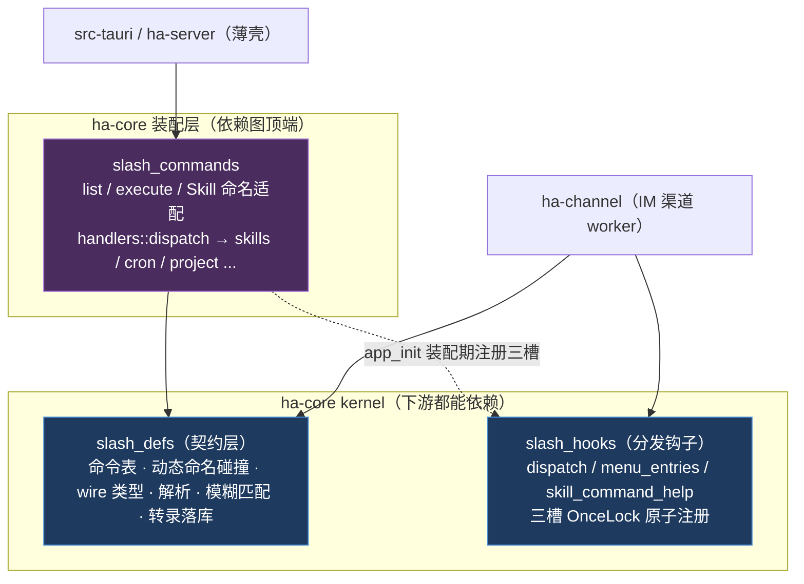
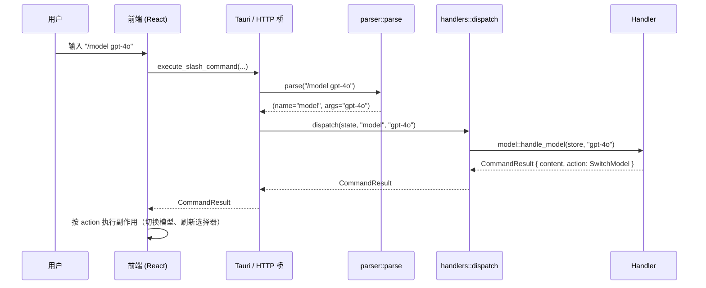
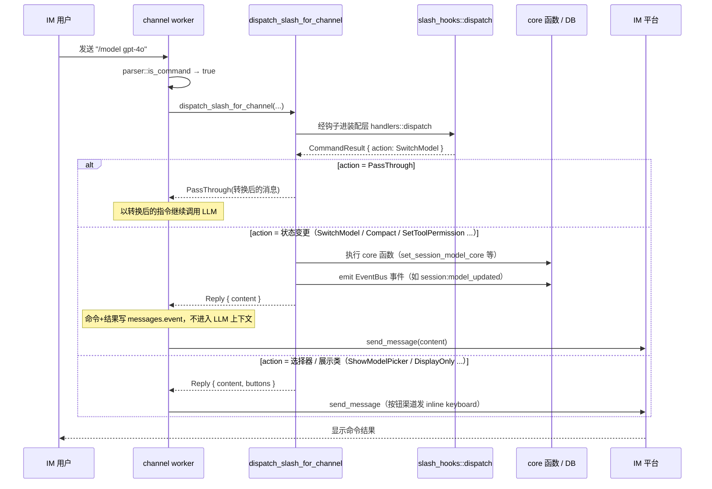
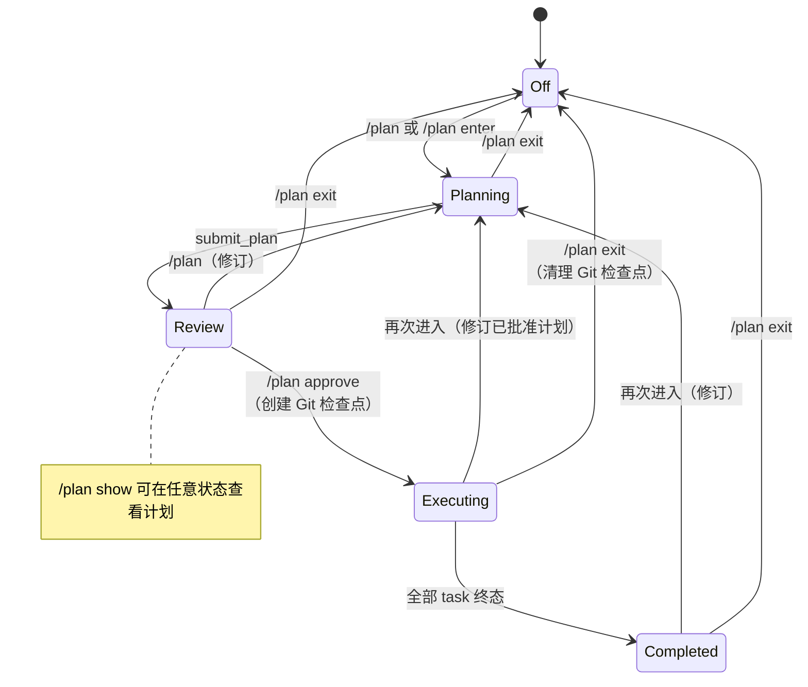

# 斜杠命令系统 (Slash Commands)

> 返回 [文档索引](../../README.md) | 更新时间：2026-08-10

斜杠命令是 Hope Agent 的**控制面语言**：在聊天输入框或任意 IM 渠道（Telegram、Discord 等）里键入 `/` 前缀，就能不经过大模型直接切换模型、进入计划模式、导出会话、查看上下文占用、管理项目与会话——这些操作要么与模型对话无关，要么需要在对话之外即时生效。系统内置约 40 条命令，另有一批**动态技能命令**在运行时从技能目录合并进来；命令按类别分组，支持参数、模糊匹配和固定选项提示。

## 核心思想

一条 `/foo bar` 文本要走完全程，需要回答三个问题：

1. **它是不是命令？** —— 纯文本解析，`/` 开头且首字符是字母才算命令，否则原样交给模型。
2. **它要做什么？** —— 派发到对应 handler，产出一个 channel-无关的 `CommandResult`：一段展示文本 `content` + 一个可选的副作用 `action`。
3. **谁来执行副作用？** —— `action` 是一个枚举，桌面前端、Telegram、Discord 各自按自己的语境去落地它（弹卡片 / 发 inline 按钮 / 写数据库 / 转发给模型）。

关键设计是**把「命令是什么」与「命令怎么执行」彻底解耦**。handler 只返回意图（`CommandAction`），不关心自己跑在桌面还是 IM 里；每个前端拿到同一个枚举，翻译成自己能渲染的形态。这样同一套命令逻辑在桌面、HTTP、ACP、十余个 IM 渠道之间零重复。

## 关联源码

| 位置 | 职责 |
|---|---|
| [`slash_defs/`](../../../crates/ha-core/src/slash_defs/) | 契约层：命令表、wire 类型、解析、模糊匹配、转录落库 |
| [`slash_defs/registry.rs`](../../../crates/ha-core/src/slash_defs/registry.rs) | 全部内置命令定义 + `IM_DISABLED_COMMANDS` |
| [`slash_defs/types.rs`](../../../crates/ha-core/src/slash_defs/types.rs) | `SlashCommandDef` / `CommandResult` / `CommandAction` |
| [`slash_hooks.rs`](../../../crates/ha-core/src/slash_hooks.rs) | 分发钩子（kernel / IM → 装配层的唯一回调面） |
| [`slash_commands/mod.rs`](../../../crates/ha-core/src/slash_commands/mod.rs) | 装配层入口：`list` / `execute` / 技能命名冲突解析 |
| [`slash_commands/handlers/`](../../../crates/ha-core/src/slash_commands/handlers/) | 各类命令处理器（按类别拆成十余个子文件） |
| [`channel/worker/slash.rs`](../../../crates/ha-channel/src/channel/worker/slash.rs) | IM 渠道分发：无参短路矩阵 + action → IM 渲染 |

---

## 三层架构

代码分三层——**契约层 → 分发钩子 → 装配层**，其目的是让独立的 IM 渠道 crate（`ha-channel`）能执行 slash 命令，又不与依赖图顶端的装配层成环。

**为什么这样分：**装配层的 handler 逐个调用 skills、channel、cron、dashboard、coding-improvement 等特征模块，因此它天然位于依赖图**顶端**（与 `app_init`、`globals` 同列）。而 IM 渠道要用的绝大多数东西——命令表、wire 类型、解析、把命令写进转录——都是**契约物**而非分发能力，这些下沉到契约层后渠道直接引用即可；只有真正的「执行一条命令」经分发钩子回调上去。IM 渠道于是**只依赖前两层**，永远不 `use` 装配层，拆 crate 时不会形成反向环。

分发钩子是一组用 `OnceLock` 在启动时**原子注册**的函数指针（`dispatch` / `menu_entries` / `skill_command_help`）。注册方唯一，是 ha-core 自己的 `app_init`。未注册时的降级语义是刻意设计的：

- `dispatch` 未装配 → 返回 `Err`。无装配的进程里根本没有 handler，让 IM worker 走它既有的错误分支，**绝不**把命令文本当普通消息喂给模型。
- `menu_entries` 未装配 → **回落内置命令表**（经同一套过滤并按 100 条上限截断），而非空表。IM 侧的菜单同步是 `setMyCommands` 这类**覆盖写**，空表会把平台上已注册的命令整批抹掉——降级不该产生破坏性远端副作用。
- `skill_command_help` 未装配 → `None`，等价于「这不是技能命令」，调用方本就有该分支。

装配层通过 `pub use` 把契约层子模块再导出，因此 `slash_commands::{types,parser,registry,fuzzy}::…` 这些历史路径依然可用。详见 [backend-separation](../system/backend-separation.md)。

---

## 一条命令的两条分发路径

无论从哪个入口进来，命令最终都汇入同一个 `handlers::dispatch(session_id, agent_id, command, args)`，产出同一个 `CommandResult`；区别只在**谁来解读 `action`**。

### 路径 A —— 桌面 / Web 前端

### 路径 B —— IM 渠道

IM worker 先做**无参短路**（下文「固定选项的交互」），再进 `dispatch`，然后把返回的 `action` 翻译成 IM 能表达的形态：写数据库、发文字、或回投给模型。

**转录落库：**控制类命令（非 `PassThrough`、非新会话）会往 `messages` 表写两条 `event` 行——一条是命令本身（前端渲染成用户气泡样式，靠 `displayAs: user` 元数据），一条是结果（`kind: result` 的事件卡片）。二者都不进入 LLM 上下文。落库入口 `append_slash_history_events` 在契约层，IM 渠道直接调用，不必经装配层。

### 前后端通信入口

同一套命令经**双 transport** 暴露：

| Tauri 命令 | HTTP 端点 | 功能 |
|---|---|---|
| `list_slash_commands` | `GET /api/slash-commands` | 列出所有可用命令（含动态技能命令），供 UI 菜单渲染 |
| `execute_slash_command` | `POST /api/slash-commands/execute` | 执行命令，返回 `CommandResult` |
| `is_slash_command` | `POST /api/slash-commands/is-slash` | 快速判断文本是否为斜杠命令 |

### 解析规则

解析器 [`parser::parse`](../../../crates/ha-core/src/slash_defs/parser.rs) 极简且稳定：trim 后必须以 `/` 开头，在第一个空白处切分成命令名与参数；**命令名统一小写，参数原样保留大小写**。`is_command` 额外要求 `/` 后第一个字符是 ASCII 字母——于是 `/123`、`//`、日期或路径都不会被误判成命令。

---

## 命令分类

### Session —— 会话管理

| 命令 | 参数 | 说明 | 副作用 (Action) |
|---|---|---|---|
| `/new` | 无 | 创建新会话 | `NewSession` |
| `/fork` | 无 | 复制当前已落库的完整 transcript，创建分支并切换到新会话；命令本身不写入两侧 transcript | `ForkSession` |
| `/side` | `[问题]` 可选 | 从当前稳定历史创建侧聊且不切走主会话；有参数时在侧聊中立即发送首问。GUI 专用，IM 菜单隐藏且执行拒绝 | `OpenSideChat` |
| `/clear` | 无 | 删除当前会话所有消息 | `SessionCleared` |
| `/compact` | 无 | 压缩当前会话上下文（触发渐进式压缩） | `Compact` |
| `/stop` | 无 | 停止当前会话主动回合。IM 与 GUI / HTTP 共用同一 session-stop 编排，仅交互入口不同；在 IM 中优先于审批 / 结构化问答回复解析 | `StopStream` |
| `/rename` | `<title>` 必需 | 重命名当前会话标题 | `DisplayOnly` |
| `/plan` | `[enter\|exit\|show\|approve]` | 进入 / 管理计划模式（详见下文） | 多种 |
| `/project` | `[name]` 可选 | 无参：弹项目选择器；有参：模糊匹配项目名。桌面进入该项目并新建会话，**IM 渠道**则把当前 chat 的 session 直接归到该项目 | `ShowProjectPicker` / `EnterProject` / `AssignProject` |
| `/projects` | 无 | 列出所有未归档项目（≡ `/project` 无参，独立条目方便记忆） | `ShowProjectPicker` |
| `/sessions` | `[query]` 可选 | 弹会话选择器（用户对话 session，过滤 cron / subagent / incognito）。带参时模糊匹配标题 + 消息内容 FTS 高亮片段；最近活跃排序 | `ShowSessionPicker` |
| `/session` | `[<id>\|exit]` 可选 | **桌面**：无参 / `<id>` 切换会话；**IM**：无参显示当前 attach 状态、`<id>` 把当前 chat 物理 attach 到目标 session（旧 chat 收 `channel:session_evicted`）、`exit` detach | `EnterSession` / `AttachToSession` / `DetachFromSession` |
| `/handover` | `[channel:account:chat[:thread]]` 可选 | **GUI 专用**：把当前 session push 到指定 IM chat（1:1 attach，目标 chat 旧 session 被驱逐）。无参弹 Handover 选择器；IM 渠道既不展示菜单也拒绝执行 | `HandoverToChannel` |
| `/goal` | `[status\|pause\|resume\|evaluate\|clear]` 或 `<objective> --criteria <criteria>` | 创建 / 更新 / 查看 / 暂停 / 恢复 / 审计 / 清除当前会话 active Goal；创建 / 更新后把目标作为普通模型 turn 继续执行（详见下文） | `DisplayOnly` / `PassThrough` |

### Model —— 模型控制

| 命令 | 参数 | 说明 | 副作用 (Action) |
|---|---|---|---|
| `/model` | `[name]` 可选 | 无参：弹模型选择器（标记当前活跃模型）；有参：模糊匹配切换模型 | 无参 `ShowModelPicker` / 有参 `SwitchModel` |
| `/models` | 无 | 列出所有可用模型（≡ `/model` 无参） | `ShowModelPicker` |
| `/thinking` | `<level>` 必需 | 设置推理思考强度。`/think` 是静默别名（仅 dispatch 接受，菜单不展示） | `SetEffort` |

**`/model` 模糊匹配优先级**：精确 ID → 精确名称 → 前缀匹配 → 包含匹配；歧义时列出全部候选。

**`/thinking` 可选值**：`off` / `none`（关闭）、`low`、`medium`、`high`、`xhigh`。`none` 与 `off` 等价。

### Memory —— 记忆管理

| 命令 | 参数 | 说明 | 副作用 (Action) |
|---|---|---|---|
| `/remember` | `<text>` 必需 | 保存一条记忆（Global 作用域，User 类型） | `DisplayOnly` |
| `/forget` | `<query>` 必需 | 搜索并删除最匹配的一条记忆 | `DisplayOnly` |
| `/memories` | 无 | 列出记忆（最多 20 条），显示类型、ID 和内容预览 | `DisplayOnly` |

### Agent —— Agent 管理

| 命令 | 参数 | 说明 | 副作用 (Action) |
|---|---|---|---|
| `/agent` | `<name>` 必需 | 模糊匹配切换 Agent（自动创建新会话）。**IM 渠道禁用**（原因见下文「IM 渠道禁用清单」） | `SwitchAgent` |
| `/agents` | 无 | 列出所有可用 Agent（含 emoji、名称、描述） | `DisplayOnly` |
| `/team` | `[create\|status\|pause\|resume\|dissolve]` 可选 | Agent Team 管理：无参 = `status`；`create` 实例化模板；`pause` / `resume` 暂停 / 恢复运行中 team；`dissolve` 解散并清理子会话 | `DisplayOnly` |

### Utility —— 实用工具

| 命令 | 参数 | 说明 | 副作用 (Action) |
|---|---|---|---|
| `/help` | 无 | 显示所有命令列表（按类别分组） | `DisplayOnly` |
| `/status` | 无 | 显示当前会话状态（Agent、模型、会话 ID、消息数） | `DisplayOnly` |
| `/export` | `[md\|json\|html] [full\|tools\|thinking]` 可选 | 导出当前会话。默认 Markdown；`full` 含思考 + 工具、`tools` 只含工具调用、`thinking` 只含思考 | `ExportFile` |
| `/usage` | 无 | 显示当前会话 Token 用量（输入 / 输出 / 总数 / 轮数） | `DisplayOnly` |
| `/permission` | `<mode>` 必需 | 设置工具权限模式 | `SetToolPermission` |
| `/search` | `<query>` 必需 | 把搜索请求作为普通指令传给模型 | `PassThrough` |
| `/prompts` | 无 | 查看当前 Agent 的完整 system prompt | `ViewSystemPrompt` |
| `/context` | 无 | 查看上下文窗口占用明细（分类 token 占比、压缩状态） | `ShowContextBreakdown` |
| `/pet` | `[on\|off\|toggle\|status]` | 桌面唤醒 / 收起宠物；HTTP / ACP 仅 status；**IM 禁用**（硬键入会返回友好提示） | `DisplayOnly` |
| `/workflow` | `[on\|off\|ultracode\|status\|runs\|trace\|approve\|pause\|resume\|cancel] [run_id]` | 开关当前会话 Workflow Mode，并查看 / 控制 durable workflow runs（详见下文） | `DisplayOnly` / `SetWorkflowMode` |
| `/review` | `[run\|status\|resolved\|dismissed\|false_positive\|open] [id]` | 对当前会话工作区未提交改动运行本地 Review Engine；可查看 run / finding 并更新 finding 状态 | `DisplayOnly` |
| `/loop` | 无参 / `<duration> <prompt>` / `<prompt> every <duration>` / `<prompt>` / `[every\|until\|status\|pause\|resume\|stop]` | 创建或控制当前会话 durable loop；无参创建维护型 Loop 并读取可选 `loop.md`，无间隔的 prompt-only 写法创建自定节奏 Loop，创建型命令后端立即触发第一轮（详见 [loop](../agent/loop.md)） | `DisplayOnly` |
| `/mode` | `[off\|guarded\|deep\|autonomous\|status]` | 查看 / 设置当前会话 Execution Mode，下一轮作为 trusted run instruction 影响长任务策略（不改稳定 system） | `DisplayOnly` |
| `/recap` | `[--full\|--range=7d\|--range=30d]` | 生成深度复盘报告（后台流式），`--full` 跳转 Dashboard | `RecapCard` / `OpenDashboardTab` |
| `/awareness` | `[on\|off\|mode <x>\|status]` | 控制行为感知的全局开关与模式（详见下文） | `DisplayOnly` |
| `/imreply` | `[split\|final\|preview]` 可选 | **IM 专用**：设置当前 channel-account 回复模式（每 round 拆分 / 仅最终 / 流式合并预览）。详见 [im-channel](im-channel.md) | `DisplayOnly` |
| `/reason` | `[on\|off]` 可选 | **IM 专用**：开关 thinking_delta 在 IM 消息里渲染为 markdown 引用块（默认 off）。`/reasoning` 是静默别名。详见 [im-channel](im-channel.md) | `DisplayOnly` |
| `/kb` | `[on\|off]` 可选 | **IM 专用**：群聊内 per-chat 确认 / 关闭当前 chat 的 KB 访问（需账号级 `kbAccessOptIn` 已在桌面设置开启）；DM 仅报状态。详见 [knowledge-base](../core/knowledge-base.md) | `DisplayOnly` |

**`/permission` 可选值**（对齐 [`permission/mode.rs`](../../../crates/ha-core/src/permission/mode.rs) 的三档 `SessionMode`）：

| 值 | 说明 |
|---|---|
| `default` | 标准审批：保护路径 / 危险命令永远弹窗，其余按 AllowAlways / Smart preset |
| `smart` | 放行工具自报「高置信度」的调用，必要时跑 judge model 二次确认（详见 [permission-system](../agent/permission-system.md)） |
| `yolo` | 跳过所有审批（仍受 Plan Mode、保护路径硬闸约束） |

### Skill —— 动态技能命令

技能命令不在注册表里硬编码，而是运行时从技能目录动态加载，经 `list_slash_commands` 合并返回。技能名经 `normalize_skill_command_name()` 规范化为命令名。

**命名冲突处理**——[`resolve_skill_command_names`](../../../crates/ha-core/src/slash_commands/mod.rs) 是 listing 与 dispatch 共用的冲突感知解析器，保证「菜单显示什么，键入就能触发什么」：

- 技能 canonical 名与内置命令冲突 → 追加 `_skill` 后缀（skill `new` → `/new_skill`）
- 仍与其他已分配名冲突 → 再追加 `_2` / `_3` / … 直到唯一
- 冲突的 **alias** 直接丢弃（alias 是补充入口，不允许压过已占用名）
- **内置命令永远优先**：用户键入 `/new` 时内置 `new` 先命中，同名 skill 本身不可达——要触发自家 skill，用菜单里显示的 `/new_skill`

桌面/Web 送入模型的 typed `SlashCommandAst` 也按同一碰撞表验证 `(typed_name, skill target_id)` 唯一配对；不能把 `/new_skill`、共享 alias 或任意无害命令文本重新绑定到另一个 Skill。纯碰撞算法位于 `slash_defs::resolve_dynamic_command_names`，`slash_commands::resolve_skill_command_names` 只把结果映射回 live `SkillEntry`，因此 chat engine 不会反向依赖装配层。

**分发路径**（由 SKILL.md frontmatter 决定，见 `handlers::handle_skill_command`）：

| 条件 | 分发路径 | CommandAction |
|---|---|---|
| `context: fork` | 经 `skills_hooks::spawn_skill_fork` 启子 Agent；Skill 正文与用户参数作为 child user task，结果通过 EventBus injection 回投主对话 | `SkillFork { run_id, skill_name }` |
| `command-dispatch: tool` + `command-tool: <name>` | 后端按 Skill 明示契约直接执行指定工具（零 LLM 往返）；仍经过统一 permission resolver，输出截断 4096 字节后展示 | `DisplayOnly` |
| `command-dispatch: prompt` 或带 `command-prompt-template` | 模板展开 `$ARGUMENTS`；模板无该占位符时把参数尾附为 `User input:` 段；Skill 激活信息结构化携带 | `PassThrough { message, skill_activation }` |
| 默认（无模板无 fork） | 内联 SKILL.md 全文与 `$ARGUMENTS`，明确作为用户请求扩展发送；不伪装成 system role | `PassThrough { message, skill_activation }` |

桌面/Web 对技能 `PassThrough` 发送原始 `/skillname args` 与 typed slash binding：用户气泡与 canonical request 都保留原命令，Chat Engine 不信任前端回传的展开正文。公共 handler 和 engine 共用 kernel `resolve_skill_slash_dispatch()`，从同一 frozen `SkillEntry` 得出 fork/direct-tool/template/inline 语义；`command-dispatch: prompt` 及默认带模板的 Skill 保持后端模板展开，只有无模板 inline 才读取 SKILL.md。IM 端由产生展开指令的同一次可信解析冻结 `allowed-tools` ceiling，并随消息一起持久化到队列，禁止在展开后重新读取 catalog（否则并发禁用/修改会形成 TOCTOU 权限宽化）。inline 与 fork materializer 都会把当次读到的 SKILL.md 控制性 frontmatter 与该 catalog snapshot 核对，阻断“新正文 + 旧 ceiling/requirements/Agent”竞态；fork 读取失败不得以 description/generic task 继续创建 child，模板正文与 ceiling 则天然取自同一 entry snapshot。共用 slash handler 的 SKILL.md materialization 失败会直接返回可见错误，不再降级为路径指针进入 IM Provider；桌面/Web 另外在 turn 入口重做 canonical args、dispatch 与 requirements live recheck，任一失败都在 Provider I/O 前终止 turn，不允许退化成原始 slash 文本加 unrestricted 工具。Skill 能引导模型，但真实工具调用仍由模型决定；ceiling 在 schema、`tool_search` 和执行层做不可放宽的交集。详见 [技能系统](../agent/skill-system.md)。

---

## `/plan` 子命令详解

计划模式是一个**五态状态机**（`Off` / `Planning` / `Review` / `Executing` / `Completed`，**没有 Paused**——长时间挂起就 `/plan exit`，需要时再进入）。合法转换由 [`PlanModeState::is_valid_transition`](../../../crates/ha-core/src/plan/types.rs) 裁决，防止并发写把 `Completed` 翻回 `Executing` 重跑，或不经 `Review` 检查点直接进 `Executing`。

| 子命令 | 说明 | 前置状态 | Action |
|---|---|---|---|
| `/plan` 或 `/plan enter` | 进入计划模式 | 任意 | `EnterPlanMode` |
| `/plan show` | 显示当前计划内容 | 任意 | `ShowPlan` |
| `/plan approve` | 批准计划，开始执行（创建 Git 检查点） | Review | `ApprovePlan` |
| `/plan exit` | 退出计划模式，清理 Git 检查点 | 任意 | `ExitPlanMode` |

详见 [plan-mode](../agent/plan-mode.md)。

---

## `/context` 上下文窗口明细

`/context` 计算当前会话的上下文窗口占用，按类别拆出 token 数与占比，供用户判断是否需要 `/compact`。桌面端返回结构化 `ShowContextBreakdown { breakdown }`，由 [`ContextBreakdownCard`](../../../src/components/chat/context-view/ContextBreakdownCard.tsx) 渲染为分段条形图 + 分类明细 + 一键 Compact / System Prompt 按钮；IM 渠道降级为 `content` 字段的 Unicode 条形图 + 分类列表。

**数据来源优先级**：各分类 token 来自 Provider request builder 同步生成的 `RoundTokenManifest`；已知模型使用版本化本地 tokenizer，未知模型使用 Unicode/JSON/modality 感知 fallback。Provider 回报 usage 后 `context_input_tokens` 是总量权威值，分类 breakdown 仍保留本地预测，不按比例伪造。完整优先级与上下界契约见 [Token Accounting](../core/token-accounting.md)。

**分类维度**：

| 类别 | 含义 |
|---|---|
| System prompt | 稳定系统前缀，扣除下面 memory / skills / tool-descriptions 三段后的基座 |
| Tool schemas | 发给 API 的 JSON 工具 schema（按当前 Provider 形状构建，含本会话已激活的 deferred 工具） |
| Tool descriptions | system prompt 内的工具说明段（`# Available Tools`） |
| Memory | 注入的静态记忆段之和：Agent Core + Global Core + 项目索引 + legacy 静态块 |
| Skills | 稳定 system 中的 Skill metadata / 使用说明目录；不含本轮按 typed `/skill` / `@skill` 加载的完整 `SKILL.md` 正文 |
| Dynamic prompt | 稳定前缀之后的每轮动态上下文：受信运行/编码/任务合同，以及 user-data Recall、流程、笔记、任务 snapshot/Hook 输出 |
| Messages | 会话历史（user / assistant + tool_use / tool_result） |
| Reserved output | 预留输出 budget，常量 `16_384`，对齐 `run_compaction` |
| Free space | `context_window − 上述总和`，饱和到 0 |

> 动态召回（Recall）刻意归入 **Dynamic prompt** 而非 Memory，两类不重叠——Memory 只统计固定 prefix 里的静态记忆。

**压缩状态**：读取 Agent 的最近 Tier 2+ 压缩时间戳与 `CompactConfig.cache_ttl_secs`，算出「距上次压缩」与「下次允许压缩倒计时」，在 cache TTL 未过期时禁用「Compact now」按钮（与 `run_compaction` 的节流策略一致）。

**入口**：聊天输入框 `/context`；右上角「会话状态」弹层的「View context」按钮（调 `execute_slash_command` 后把 action 交给 `ChatScreen.handleCommandAction`）；IM 渠道（bot menu 经 `description_en()` 自动同步）。

---

## `/workflow` 与 `/mode` 子命令详解

`/workflow` 首先是当前会话的 **Workflow Mode 开关**：开启后模型会看到 `workflow` 控制工具，并在任何适合动态编排的任务里自行判断是否创建 durable workflow run。它不是 coding-only，也不要求先进入 coding 模式。除此之外，`/workflow` 还是 workflow run 的轻量命令面，适合在聊天里快速查看长任务状态；完整创建 / 预览 / 审批与控制中心 UI 走 [workflow](../agent/workflow.md) 的 owner API / Workspace 面板。

| 用法 | 行为 |
|---|---|
| `/workflow` / `/workflow status` | 展示当前 Workflow Mode、模型是否可自主创建 run，以及最近 run 摘要 |
| `/workflow on` | 开启 Workflow Mode；模型后续可在调研、文档、数据、编码、运营等通用任务中按需调 `workflow_run` |
| `/workflow ultracode` | 开启更强的 Workflow Mode；模型更倾向用多阶段、并行审查、交叉验证的 workflow 处理实质任务 |
| `/workflow off` | 关闭 Workflow Mode；后续不向模型暴露 `workflow_run` |
| `/workflow runs` / `list` | 列出当前 session 最近 12 条 run，标注 active 数、短 id、state、kind、execution mode、更新时间、op 摘要 |
| `/workflow trace [run_id]` | 展示某条 run 的状态、script hash、budget、blocked reason、最近 ops / events；不传 id 时优先 active，否则最近一条 |
| `/workflow approve [run_id]` | 把 `awaiting_approval` run 转 `running`；完整 owner API 会额外 kick primary runtime |
| `/workflow pause [run_id]` | 把 `running` run 标 `paused`；runtime 在下一次状态检查点停止 |
| `/workflow resume [run_id]` | 把 `paused` run 转回 `running`；完整 owner API 会额外 kick primary runtime |
| `/workflow cancel [run_id]` | 把 draft / live run 标 `cancelled`；真正的 child job / subagent 取消由 owner API 的 cancel 路径兜底 |

`run_id` 支持唯一短前缀。未传 id 时状态转换命令按目标状态选唯一 run；存在多个候选则要求用户传更长 id，避免误操作。

`/mode` 是会话级 **Execution Mode** 控制面，写入 `sessions.execution_mode`：

| 用法 | 行为 |
|---|---|
| `/mode` / `/mode status` | 显示当前 mode 和可选值 |
| `/mode off` | 清除额外执行策略段，后续 prompt 不注入 `# Execution Mode` |
| `/mode guarded` | 注入 Guarded 策略：普通长任务走观察、计划、编辑、定向验证、一次修复 |
| `/mode deep` | 注入 Deep 策略：更重侦察、风险判断和验证，最多两次定向修复 |
| `/mode autonomous` | 注入 Autonomous 策略：在权限和安全边界内持续推进，但不绕过审批 / sandbox / hooks |

两者都是 `DisplayOnly`——命令结果作为 event 消息显示，不进入 LLM 上下文。`/mode` 改的是后续 turn 的 prompt 策略；它不是 `/loop`，不负责定时、轮询或自动重触发。

---

## `/goal` 子命令详解

`/goal` 是当前会话 active Goal 的轻量控制面；完整状态、证据指标和操作按钮在 [goal](../agent/goal.md) 的 Workspace Goal section 中展示。

| 用法 | 行为 |
|---|---|
| `/goal <objective> --criteria <criteria>` | 创建或更新 active Goal。无 active Goal 时创建；已有时更新目标与完成标准，清空旧 final audit，`blocked` / `evaluating` 回到 `active`。创建 / 更新后把目标作为普通模型 turn 继续执行（`PassThrough`） |
| `/goal` / `/goal status` | 展示 active Goal 的目标、完成标准、workflow 数、task 完成数、final audit 与 blocked reason |
| `/goal pause` | 将 active Goal 置为 `paused` |
| `/goal resume` | 将 `paused` / `blocked` Goal 恢复为 `active` |
| `/goal evaluate` / `/goal audit` | 基于 linked workflow runs、tasks、validation ops 运行保守 final audit |
| `/goal clear` | 将 active Goal 置为 `cancelled` 并移出 active 查询 |

`/goal` 是通用长任务语义，不限定 coding。无痕会话拒绝创建 durable Goal。桌面输入框的「目标模式」是这一命令面的 GUI 包装：用户气泡保留 Goal 标记，但不显示 `/goal` 前缀。

---

## `/awareness` 子命令详解

行为感知的全局控制命令。修改 `config.json` 的 `awareness` 字段，全局生效；会话级覆盖通过输入栏的眼睛图标或 API 设置。

| 子命令 | 说明 |
|---|---|
| （无参） | 显示当前状态（enabled / mode / max_sessions / lookback / 活跃会话数等） |
| `on` / `enable` | 全局启用 |
| `off` / `disable` | 全局禁用（硬闸，忽略所有会话级覆盖） |
| `mode off` | 设置模式为 Off（等同 disable） |
| `mode structured` | 结构化模式（零 LLM 成本，默认） |
| `mode llm` / `llm_digest` / `digest` | LLM 摘要模式（额外 side_query 开销） |
| `status` | 等同无参，显示详细运行时状态 |

详见 [behavior-awareness](../agent/behavior-awareness.md)。

---

## `/project` 子命令详解

`/project` 在桌面端把当前对话从「散会话」切到「项目下的会话」。命令处理器 [`handlers/project.rs`](../../../crates/ha-core/src/slash_commands/handlers/project.rs)。

| 用法 | 行为 | Action |
|---|---|---|
| `/project` | 列出全部未归档项目，桌面弹「项目选择器」（markdown 列表：名称 / emoji / 会话数 / 描述），继续键入 `/project <name>` 进入；sidebar 项目树本就可视，也可直接点 | `ShowProjectPicker { projects }` |
| `/project <name>` | 模糊匹配（精确名 → 精确 id → 前缀 → 包含；歧义 / 无果直接报错） | 桌面 / HTTP：`EnterProject`；IM：`AssignProject` |

**前端处理**（[ChatScreen.tsx](../../../src/components/chat/ChatScreen.tsx) `handleCommandAction`）：

- `ShowProjectPicker`：渲染为 event 气泡 markdown 列表，附 `> /project <项目名>` 提示框
- `EnterProject`：在该项目下**新建会话**（agent 走 7 级解析链，详见 AGENTS.md「Agent 解析链」），并关掉 `draftIncognito`（项目与无痕互斥）

**IM 渠道**：`/project` 不在禁用清单里。handler 检测到 `session.channel_info.is_some()` 后切分支：发 `AssignProject`，channel 侧调 `SessionDB::set_session_project` **UPDATE 现有 `sessions.project_id`，不创建新 session**。IM 入站消息不再自动归项目（反向认领已删除），归属完全由 IM 内 `/project` 显式触发。

---

## IM 渠道禁用清单

部分桌面专属命令在 IM 渠道里既不显示菜单也不响应执行。入口 [`IM_DISABLED_COMMANDS`](../../../crates/ha-core/src/slash_defs/registry.rs)，当前为 `["agent", "handover", "pet"]`。

| 命令 | 禁用原因 |
|---|---|
| `/agent` | IM dispatcher 每条入站消息经 [`agent::resolver::resolve_default_agent_id_full`](../../../crates/ha-core/src/agent/resolver.rs) 从 channel-account / topic / group 配置**重算** agent，不读 `sessions.agent_id`。若允许 `/agent`，切完回复「Switched to X」，下一轮入站又被 channel 配置拉回原 agent——会话标签与实际运行 agent 永久漂移，是幻觉切换。改 IM agent 应去「设置 → IM Channel → account → Agent」或 topic / group override |
| `/handover` | 「把当前 session 推到 IM chat」是 GUI 专属语义；在 IM 内部触发只会把 chat 自己的 session 推回自己，无意义。IM 端切会话用 `/session <id>`（attach）或 `/sessions`（选择） |
| `/pet` | 桌面宠物窗口只有 Tauri primary 才拥有。handler 仍自检 `session.channel_info`：硬键入时返回「宠物在桌面 App 控制、IM 中不可用」的友好提示，而非报错 |

禁用一条命令靠两层配合：命令名进 `IM_DISABLED_COMMANDS`，菜单同步阶段就不再下发；handler 内再自检 `session.channel_info`，兜底处理用户绕过菜单直接硬键入的情况。

---

## IM 专用命令 vs 静默别名

部分命令的语义只在 IM session 上下文里成立，handler 入口自检 `session.channel_info`，桌面 / Web session 直接报错「only works inside an IM channel session」：

| 命令 | 写入位置 | 备注 |
|---|---|---|
| `/imreply [split\|final\|preview]` | `ChannelAccountConfig.settings.imReplyMode` | 详见 [im-channel §IM 回复模式](im-channel.md) |
| `/reason [on\|off]` | `ChannelAccountConfig.settings.showThinking` | 详见 [im-channel §Thinking 显示](im-channel.md) |
| `/kb [on\|off]` | `ChannelAccountConfig.settings.kbAccessChats` | 群内 per-chat 确认 KB 访问，需账号级 `kbAccessOptIn` 开启；查不到 / 不匹配 fail closed。详见 [knowledge-base](../core/knowledge-base.md) |

> **`/kb` 的写入受群管理员约束**（非显然）：当 channel-account 配了 `admin_ids`，`/kb on|off` 这类**写**操作被限制为管理员，防止随机群成员自行确认所在群的 KB 访问；无参 / `status` 这类**读**永远放行。无 admins 配置时 per-chat 开关保持开放（仍受 owner-only 的账号级 opt-in 约束）。

**静默 dispatch 别名**：`handlers::dispatch` 的 match arm 接受多个名字（如 `"thinking" | "think"`、`"reason" | "reasoning"`），但只有 canonical name 进注册表与 IM 菜单。`/think` 是 `/thinking` 的别名，`/reasoning` 是 `/reason` 的别名——两者都能触发，但菜单只展示 canonical，避免视觉冗余。

**别名 reserved 契约**：所有静默别名都登记在 [`slash_defs`](../../../crates/ha-core/src/slash_defs/mod.rs) 的 `SILENT_BUILTIN_ALIASES`（当前 = `["reasoning", "think"]`）里；`builtin_command_names()` 把别名一并塞进保留集，`resolve_skill_command_names` 用它判断 skill 是否需要 `_skill` 后缀。别名不在这份保留集里，同名 skill 就拿不到 `_skill` 后缀，键入时会先被 dispatch 里别名的 match arm 命中——它排在 `_ => handle_skill_command` 之前，于是技能本身永远触发不到。

---

## 固定选项的交互（arg_options）

部分命令定义了 `arg_options`——预设的可选参数列表。不同端有不同交互：

### 桌面 UI

`SlashCommandMenu` 对带 `arg_options` 的命令渲染可展开子菜单：键入 `/<cmd>` 回车或点击 → 展开选项；方向键导航、回车执行；Esc / 左箭头返回。仍可手动输入参数（如 `/thinking high`）跳过子菜单。

### IM 渠道（按 `supports_buttons` 分流）

入口 [`dispatch_slash_for_channel`](../../../crates/ha-channel/src/channel/worker/slash.rs) 在**无参**时按「支持按钮 × 参数是否可选」矩阵短路：

**支持按钮的渠道**（Telegram / Feishu / Discord / Slack / QQ Bot / LINE / Google Chat）—— inline keyboard：

- 无参命令（如 `/thinking`）→ 返回选项按钮，每个选项一行
- 按钮 `callback_data` 格式 `slash:<command> <option>`（如 `slash:thinking high`）
- 用户点击 → 各渠道的 button-callback 入口 → 统一 helper `inject_slash_callback` 把 `slash:cmd arg` 翻成 inbound `/cmd arg` 消息 → 正常执行

**不支持按钮的渠道**（WeChat / iMessage / IRC / Signal / WhatsApp）—— 文本 Usage 提示：

- `args_optional=false` + 有 `arg_options`（如 `/thinking` / `/permission` / `/plan`）：回 `Usage: /<cmd> <placeholder>` + `Options:` 列表（`render_options_help_text`），用户复制选项作为下一条消息。代替 handler 默认的 `Invalid X: ...` 错误
- `args_optional=true` 命令（`/imreply` / `/sessions` / `/recap` / `/team` / `/awareness` / `/reason` 等）：fall-through 到 handler 自带的「无参 = 显示当前状态 / picker」分支，**不**插入 Usage 提示，避免覆盖 handler 的自定义无参语义
- skill 命令：统一按 `args_optional=true` 处理（skill 默认无参可跑）

**`/model` 无参的特殊处理**：返回可用模型的 inline keyboard（每行最多 2 个，当前活跃模型标 `✓`），`callback_data` 格式 `slash:model <model_name>`，最多 20 个；不支持按钮的渠道降级为文本列表 + 「用 `/model <name>` 切换」提示。

### 有 arg_options 的命令

| 命令 | 选项 |
|---|---|
| `/thinking` | `off`, `low`, `medium`, `high`, `xhigh` |
| `/plan` | `enter`, `exit`, `show`, `approve` |
| `/permission` | `default`, `smart`, `yolo` |
| `/pet` | `on`, `off`, `toggle`, `status` |
| `/workflow` | `on`, `off`, `ultracode`, `status`, `runs`, `trace`, `approve`, `pause`, `resume`, `cancel` |
| `/review` | `run`, `status`, `resolved`, `dismissed`, `false_positive`, `open` |
| `/loop` | `every`, `until`, `status`, `pause`, `resume`, `stop`（另含几条示例参数） |
| `/mode` | `off`, `guarded`, `deep`, `autonomous`, `status` |
| `/awareness` | `on`, `off`, `mode structured`, `mode llm`, `mode off`, `status` |
| `/team` | `create`, `status`, `pause`, `resume`, `dissolve` |
| `/recap` | `--full`, `--range=7d`, `--range=30d` |
| `/imreply` | `split`, `final`, `preview` |
| `/reason` | `on`, `off` |
| `/kb` | `on`, `off` |

---

## IM 渠道菜单同步时机

Telegram（`setMyCommands`）和 Discord（Application Commands API）的命令菜单需主动推送，下面三个时机覆盖全部场景：

1. **`start_account` 首次拉起**——`telegram/mod.rs::sync_commands_to_menu` / `discord/mod.rs::sync_commands_to_discord` 在认证成功后立即同步一次
2. **EventBus 自动 re-sync**——`app_init::spawn_channel_menu_resync_listener` 订阅以下事件，命中后 **2s 防抖**触发 `ChannelRegistry::sync_commands_for_all`：
   - `skills:catalog_changed`：[`bump_skill_version`](../../../crates/ha-core/src/skills/types.rs) 在每次 skill 增删 / 启停后 emit
   - `config:changed` 且 `category` 命中技能相关类别（`skills` / `extra_skills_dirs` / `disabled_skills` / `skill_env` / `skill_env_check` / `skills.auto_review`）
   - EventBus 掉帧（Lagged）时也强制一次 re-sync，确保菜单最终与最新命令集一致
3. **手动触发**——`channel_sync_commands(account_id?)` Tauri 命令 / `POST /api/channel/sync-commands`，可针对单 account 或全量 running，给设置页「同步命令」按钮 + 运维兜底

`ChannelPlugin` trait 的 `async fn sync_commands` 默认 no-op，只有 Telegram / Discord override（IRC / WhatsApp / iMessage 等没有 slash 菜单概念，默认实现即可）。

**菜单内容**经统一入口 [`im_menu_entries`](../../../crates/ha-core/src/slash_commands/mod.rs)，与 GUI / `/help` 完全一致：

- `registry::all_commands()` 内置命令，过滤 `IM_DISABLED_COMMANDS`
- 用户可调用的 skill 命令（命名冲突走 `_skill` / `_N` 后缀）
- **100 条硬上限**（`IM_MENU_HARD_CAP`）：Telegram 与 Discord 全局命令均上限 100，超出尾部截断（仍可硬键入触发，只是不进菜单）并 `app_warn!`

> **失败语义**：单个 account 同步失败是 warn 级（如 Bot token 过期、网络暂断），不影响其它 account；菜单保留旧版本直到下次成功。

---

## CommandAction 类型一览

`CommandResult.action` 告诉执行端要做什么副作用。下表覆盖 [`CommandAction`](../../../crates/ha-core/src/slash_defs/types.rs) 全部变体（✅ 正常支持 / ⚡ IM 降级或替换 / 🚫 命令 IM 禁用不会到达）：

| Action | 触发命令 | 桌面行为 | IM 渠道行为 | EventBus 事件 |
|---|---|---|---|---|
| `NewSession` | `/new` | 切到新建会话 | ✅ 更新 channel → 新 session 映射 | — |
| `ForkSession` | `/fork` | 刷新会话列表并切到新分支 | ✅ 创建分支后更新 channel → 新 session 映射；映射失败时保留分支并返回可手动 `/session` 接管的短 ID | — |
| `OpenSideChat` | `/side [问题]` | 保持主会话不变，在右侧打开父会话范围内的侧聊；可附带首问 | 🚫 IM 禁用 | — |
| `SessionCleared` | `/clear` | 消息已清空 | ✅ DB 已清理 + 回复确认 | `slash:session_cleared` |
| `SwitchModel` | `/model <name>` | 切换活跃模型 | ✅ `set_session_model_core` 把模型钉到当前 session（不改全局 active_model） | `session:model_updated` |
| `ShowModelPicker` | `/model` / `/models`（无参） | 渲染模型选择卡片 | ✅ 支持按钮渠道发 inline keyboard，其余发文本列表 | — |
| `SetEffort` | `/thinking <level>`（别名 `/think`） | 设推理强度 | ✅ `set_reasoning_effort_core` + 写会话 | `slash:effort_changed` |
| `SwitchAgent` | `/agent <name>` | 切 Agent 并新建会话 | 🚫 IM 禁用 | — |
| `PassThrough` | `/search`、`/goal`（创建）、技能命令 | 作为普通 user turn 送模型 | ✅ 以转换后的指令送模型；原始 slash 作为可见 user turn 落库 | — |
| `DisplayOnly` | `/help`、`/status`、`/usage`、`/workflow`、`/mode` 等 | 仅展示 content | ✅ command / result 落 `event`，直接回复，不进 LLM | — |
| `SetWorkflowMode` | `/workflow on\|off\|ultracode` | 设 Workflow Mode | ✅ 回复 content | — |
| `SetToolPermission` | `/permission <mode>` | 设工具权限模式 | ✅ 写 `sessions` 权限模式 + 回复 | `permission:mode_changed` |
| `ExportFile` | `/export` | 下载导出文件 | ✅ 写入 `~/.hope-agent/exports/` 并回复路径 | — |
| `StopStream` | `/stop` | 停止流式输出 | ✅ 共用 GUI / HTTP 的 session-stop 编排（无 DB 时回落 `ChannelCancelRegistry`） | — |
| `Compact` | `/compact` | 触发上下文压缩 | ✅ `compact_context_now_core` 执行压缩 | — |
| `ViewSystemPrompt` | `/prompts` | 打开 system prompt 查看器 | ✅ 构建完整 system prompt 作为回复 | — |
| `ShowContextBreakdown` | `/context` | 分段条形图 + 明细卡片 | ⚡ 降级为 Unicode 条形 + 分类列表 markdown | — |
| `SkillFork` | 技能命令（`context: fork`） | 显示「子 Agent 后台运行」指示 | ✅ 启子 Agent，完成后结果作为 user message 注入 | — |
| `RecapCard` | `/recap [--range=Nd]` | 渲染流式复盘卡片 | ⚡ 降级提示文本（IM 不订阅 `recap_progress`） | `recap_progress` |
| `OpenDashboardTab` | `/recap --full` | 切到指定 Dashboard Tab | ⚡ 降级提示文本（IM 无 Dashboard UI） | — |
| `EnterPlanMode` | `/plan` | 进入计划模式 | ✅ DB 已持久化 + 回复确认 | `slash:plan_changed` |
| `ExitPlanMode` | `/plan exit` | 退出并清理 Git 检查点 | ✅ DB 已持久化 | `slash:plan_changed` |
| `ApprovePlan` | `/plan approve` | 批准并创建 Git 检查点 | ✅ DB 已持久化 | `slash:plan_changed` |
| `ShowPlan` | `/plan show` | 面板显示计划 | ✅ plan 内容作为回复 | `slash:plan_changed` |
| `ShowProjectPicker` | `/project`（无参）/ `/projects` | 渲染项目选择器 | ✅ 支持按钮渠道渲染 inline buttons（一项目一行） | — |
| `EnterProject` | `/project <name>` | 进入项目并**新建会话** | ⚡ IM 改用 `AssignProject`，不会到达 | — |
| `AssignProject` | `/project <name>`（IM） | 桌面回退为 `EnterProject` | ✅ `SessionDB::set_session_project` UPDATE `project_id`，不建新 session | — |
| `ShowSessionPicker` | `/sessions [query]` | 渲染会话选择器 | ✅ 支持按钮渠道渲染 inline buttons | — |
| `EnterSession` | `/session <id>` | 切换桌面活跃会话 | ⚡ IM 等价 `AttachToSession`，不会到达 | — |
| `AttachToSession` | `/session <id>`（IM） | 桌面回退为 `EnterSession` | ✅ 写 `channel_conversations` + 回放最近一轮 catch-up | — |
| `DetachFromSession` | `/session exit` | 桌面 no-op | ✅ 删 `channel_conversations` 行 | — |
| `HandoverToChannel` | `/handover <ch:acc:chat[:thread]>` | push 到指定 IM chat（目标旧 session 驱逐） | 🚫 IM 禁用 | — |

> EventBus 事件主要由 IM / channel 执行路径 emit，让桌面 UI 在共享状态被 IM 改动后同步刷新（模型选择器、effort 指示器、消息列表等）；桌面自身经返回的 `action` 直接落地。桌面模式经 Tauri `handle.emit()` 转发到 WebView，HTTP 模式经 WebSocket 推送，前端在 `ChatScreen.tsx` 统一监听。

---

## 命令快速参考表

| 命令 | 分类 | 参数 | 需要活跃会话 | 说明 |
|---|---|---|---|---|
| `/new` | Session | 无 | 否 | 开始新对话 |
| `/fork` | Session | 无 | 是 | 从当前已完成历史创建分支并切换；不复制 Goal / Loop / Workflow 等运行态 |
| `/side` | Session | `[问题]` | 是 | 创建侧聊且不中断主对话；可立即发送首问，IM 禁用 |
| `/clear` | Session | 无 | 是 | 清空当前对话 |
| `/compact` | Session | 无 | 否 | 压缩上下文 |
| `/stop` | Session | 无 | 否 | 停止当前回复 |
| `/rename` | Session | `<title>` | 是 | 重命名对话 |
| `/plan` | Session | `[enter\|exit\|show\|approve]` | 是 | 计划模式 |
| `/project` | Session | `[name]` | 否 | 进入 / 选择项目（IM 改走 `AssignProject`） |
| `/projects` | Session | 无 | 否 | 列出所有项目（≡ `/project` 无参） |
| `/sessions` | Session | `[query]` | 否 | 弹会话选择器（可选搜索） |
| `/session` | Session | `[<id>\|exit]` | 否 | 显示 / 切换 / 退出会话（IM：attach / detach） |
| `/handover` | Session | `[ch:acc:chat[:thread]]` | 是 | 把当前 session 推到 IM chat（**GUI 专用**） |
| `/goal` | Session | `[status\|pause\|resume\|evaluate\|clear]` 或 `<objective>` | 是 | 创建 / 更新 / 控制 active Goal |
| `/model` | Model | `[name]` | 否 | 切换 / 列出模型 |
| `/models` | Model | 无 | 否 | 列出所有可用模型 |
| `/thinking` | Model | `<level>` | 否 | 设置思考强度（`/think` 静默别名） |
| `/remember` | Memory | `<text>` | 否 | 保存记忆 |
| `/forget` | Memory | `<query>` | 否 | 删除记忆 |
| `/memories` | Memory | 无 | 否 | 列出记忆 |
| `/agent` | Agent | `<name>` | 否 | 切换 Agent（IM 禁用） |
| `/agents` | Agent | 无 | 否 | 列出 Agent |
| `/team` | Agent | `[子命令]` | 否 | Agent Team 管理 |
| `/help` | Utility | 无 | 否 | 显示所有命令 |
| `/status` | Utility | 无 | 否 | 会话状态 |
| `/export` | Utility | `[md\|json\|html] [full\|tools\|thinking]` | 是 | 导出会话（Markdown / JSON / HTML） |
| `/usage` | Utility | 无 | 是 | Token 用量 |
| `/permission` | Utility | `<mode>` | 否 | 工具权限模式 |
| `/search` | Utility | `<query>` | 否 | 搜索网络 |
| `/prompts` | Utility | 无 | 否 | 查看系统提示词 |
| `/context` | Utility | 无 | 是 | 上下文窗口占用明细 |
| `/pet` | Utility | `[on\|off\|toggle\|status]` | 是（桌面） | 控制或查看桌面宠物（IM 禁用） |
| `/workflow` | Utility | `[on\|off\|ultracode\|status\|runs\|trace\|approve\|pause\|resume\|cancel] [run_id]` | 是 | 开关 Workflow Mode 并查看 / 控制 runs |
| `/review` | Utility | `[run\|status\|resolved\|dismissed\|false_positive\|open] [id]` | 是 | 运行 / 查看本地代码审查 |
| `/loop` | Utility | 无参 / `<prompt>` / `[every\|until\|status\|pause\|resume\|stop]` | 是 | 创建 / 查看 / 控制 durable loop |
| `/mode` | Utility | `[off\|guarded\|deep\|autonomous\|status]` | 是 | 查看 / 设置 Execution Mode |
| `/recap` | Utility | `[--full\|--range=Nd]` | 否 | 生成深度复盘报告 |
| `/awareness` | Utility | `[on\|off\|mode <x>\|status]` | 否 | 行为感知开关 |
| `/imreply` | Utility | `[split\|final\|preview]` | 是（IM） | 设置 IM 回复模式（**IM 专用**） |
| `/reason` | Utility | `[on\|off]` | 是（IM） | IM 输出是否含模型 thinking（**IM 专用**） |
| `/kb` | Utility | `[on\|off]` | 是（IM） | 群聊 per-chat 确认 KB 访问（**IM 专用**） |
