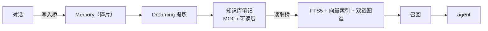

# Knowledge Base（知识空间）

> 返回 [文档索引](../README.md) | 更新时间：2026-07-02

本文是知识空间子系统的**单一真相源**：定位、设计取舍、数据模型、鉴权、工具面、检索、前端、自主维护与安全红线。实现细节引用代码路径而非复制，以代码为准。对外功能名「知识空间 / Knowledge Space」，代码内部保持中性——模块 `knowledge/`、工具 `note_*`、作用域 `for_knowledge`（D5）。

## 概述

知识空间是与聊天、Dashboard 平级的**独立一级功能**——一个本地优先、AI 原生的个人知识管理（PKM）子系统。它把 Hope Agent 从「聊天助手」推进到「第二大脑」：用户手写 / 编辑 / 管理 `.md` 笔记，agent 作为**第一公民**读写同一批笔记、检索知识网络、并把后台沉淀的碎片记忆提炼成结构化笔记。

三条产品原则贯穿全系统：

- **真实 `.md` 是唯一真相源**：笔记就是磁盘上的标准 Markdown 文件，永不锁定、永不破坏性转写；SQLite 索引只是可重建缓存，删了能从 `.md` 全量重建。用户可随时用 Obsidian / Logseq 打开同一文件夹，零锁定。Raw Source（资料舱）是独立输入层，存 Hope 管理目录，不混入 notes root。
- **AI 原生，不是事后插件**：别人手动织链，这里 agent 既能读知识库又能写知识库（CRUD / 链接 / 图谱 / 检索 / 自主维护），区别于 Obsidian / Logseq「AI 是插件」的形态。
- **默认 deny + 显式 attach**：知识库不像记忆那样全局可见——工作 vault / 私人 vault / IM 会话彼此隔离，访问唯一经 `effective_kb_access`（D10）。

### Knowledge Compiler 范式

知识空间的长期方向不是把笔记做成一个“可上传文件的 RAG 面板”，而是把它做成可审计的个人 Wiki 编译系统：**raw sources → compile proposals → reviewed Markdown notes → schema/evidence lint → agent-readable wiki**。这个分层来自 Karpathy LLM Wiki 的 raw/wiki 思路，并吸收了 KarpathyWiki Obsidian 插件、Farzapedia、GBrain/ex-brain 等实践：原始资料保留 provenance，模型只产待审 diff，长期知识沉淀到稳定 `.md`，再由图谱、检索、外部 agent access 和维护提案持续使用。

对产品实现的约束是：资料舱 source 与笔记 store 物理隔离；编译和归档只生成 Review Diff proposal；Evidence 可回跳到 source；外部 agent 默认只读；音频、视频、OCR、长网页刷新等输入都必须先落 raw source 文本快照，再走同一条可审阅链路。

### 第四种知识 Scope

知识库（KB）是 Hope Agent 在已有三层知识容器之外平行的第四个：

| 容器 | 真相源 | 谁写 | 谁读 | 用户可见度 |
|---|---|---|---|---|
| Memory | `memory.db` 原子条目 | 自动抽取 + `save_memory` | 注入 system prompt | 低（后台） |
| Dreaming 日记 | `~/.hope-agent/memory/dreams/*.md` | AI 自省 | 用户翻看 | 中 |
| Project | `working_dir` 真实文件 | 用户 / agent | `read` 工具 | 高 |
| **知识空间（KB）** | **真实 `.md` 文件** | **用户手写 + agent 工具** | **agent 工具 + 按需召回** | **最高（一级导航）** |

**和 AI 的双向桥**（区别于纯手动 PKM 的核心）：

读取桥三通道：① 用户消息 `[[note]]` 确定性注入；② agent 主动调 `note_search` / `knowledge_recall`；③ 被动「相关笔记标题」提示（默认开，但仍只在 KB 已授权可访问时生效）。三者都套 `<untrusted_external_data>` 信封，永不提升为 system 指令（#7）。

## 设计取舍（决策账本 D1–D20）

> 每条记录**结论 + 理由**。D 编号在全文用作契约锚点。

| # | 决策点 | 结论 | 理由 |
|---|---|---|---|
| D1 | 笔记与记忆的关系 | 独立笔记系统，但与 AI 双向打通——agent 能读能写，记忆可提炼成笔记「可读层」 | 要「完整大功能 + AI 紧密联合」，既非纯手动，也不把笔记降级为大号 memory |
| D2 | 存储真相源 | 真实 `.md` 文件 + SQLite 旁路索引 | 贴合「文件即真实文件」；可与 Obsidian 互通；索引可重建；检索复用 memory 基建 |
| D3 | 容器概念 | 独立「知识库」容器（不复用 Project） | 用户要一级功能 + 独立心智模型 |
| D4 | MVP | 双链地基：Wikilink 解析 + Backlinks | 最小可用、最快出效果，是图谱 / 嵌入 / 召回的地基 |
| D5 | 对外命名 | 功能名「知识空间」；代码内部中性（`knowledge/` / `note_*` / `for_knowledge`） | 「知识库」在中文被 RAG / 客服语义占领易误读；代码标识符 / 展示名 / 营销 slogan 三层解耦 |
| D6 | 外部目录绑定 | 内部 `notes/` 完整读写 + 外部 vault 绑定（默认只读，opt-in 放开写） | 外部绑定是最大获客杠杆（「点亮现成 vault」）；写外部的 lost-update 风险用 opt-in 隔离 |
| D7 | 召回形态 | 笔记检索是**独立通道**，绝不折进 `recall_memory`；要一次拿记忆 + 笔记则加薄编排工具分查两 store 再 store-aware 合并 | 记忆 = 一句话事实、笔记 = 整篇文档，性质 / 排序不可比，混排污染成熟 memory 路径 |
| D8 | 文档优先 vs 大纲优先 | **文档优先打底**（对齐 Obsidian），`Note{title, body, frontmatter}`；原生大纲作**只读可选层** | 文档优先与大纲优先数据模型从根不同，无法一套原生兼容两者；文档优先覆盖最广、最轻 |
| D9 | 存储分家 | KB registry + 访问绑定落 `sessions.db`（真相源）；`index.db` 只存可重建缓存 | KB 是一级关系实体（列表 / 归档 / 绑定 / 权限），删索引后必须能全量重建 |
| D10 | 访问作用域 | 默认 deny + 显式 attach；incognito 零访问；IM 默认禁用（账号级 opt-in）；唯一入口 `effective_kb_access(ctx)`，**带 source + origin_source**、取调用链最严 cap | KB 不能像 memory 全局可见，否则工作 / 私人 / IM 互相泄漏；子 Agent 不能借 `source` 洗回权限 |
| D11 | 外部 root 可写性 | 外部绑定 root **默认彻底只读**（AI / GUI 皆拒）；KB 级 `allow_external_writes` opt-in 后解锁 | 「点亮老 vault」不等于「托管老 vault」；写冲突 / 原子写 / 三方 rename 噪声靠 opt-in 隔离 |
| D12 | 检索粒度 | **chunk 级**：`note` 只存文件级元数据，正文检索下沉到 `note_chunk`（FTS + vec 都建 chunk 上，命中再聚合回 note） | 整篇一个 embedding 在长文 / 纪要上失效（超上限 + 定位不到段）；`content_hash` 支持按 chunk 增量重嵌 |
| D13 | 编辑器选型 | **CodeMirror 6 强 source editor** + 实时预览；**不引入 Tiptap / Milkdown WYSIWYG**，以 CM6 live-preview 模式逼近所见即所得 | 核心是「真实 `.md` + wikilink + 字符 offset + AI patch + diff + 互通」，要源文档稳定可控；ProseMirror 往返序列化破坏这些契约 |
| D14 | 坐标系契约 | 持久 offset = **Unicode 码点偏移**（索引内部）；跨端定位主字段 = `line`（1-based）+ `col`（0-based 码点列，tab=1），相对**原始完整文件**；`note_patch` **不用坐标**走 `old/new` 文本匹配 | 三套坐标（UTF-8 字节 / 码点 / UTF-16）+ CRLF + tab 全是错位源，必须钉死；LLM 产不准坐标且坐标随上文漂移 |
| D15 | Raw Source / 编译输入层 | 资料舱 source 是 Hope 管理的原始输入快照，metadata + source chunk 落 `sessions.db`，文件落 `~/.hope-agent/knowledge/{kb}/sources/`；默认不写外部 vault，但外部 KB 可在 `allow_external_writes` opt-in 后把**文本快照副本**镜像到 `raw/` 或 `sources/`；source 不混进 note_chunk、不进入 agent prompt | Karpathy LLM Wiki 的 raw/wiki 分层需要先把「原始资料」和「编译后的笔记」物理分开；source 管理与编译审阅解耦，导入 / 查看 / 删除不直接写笔记，长期知识写入统一进入 Review Diff；外部镜像只服务用户 vault 互通，不能成为真相源 |
| D16 | Knowledge Compile Review | Compile run/proposal 是 owner-plane 审阅队列：run + proposal 落 `sessions.db`，fingerprint 幂等；LLM 只产 proposal，**approve 前不写 `.md`**；apply 统一走 `service::note_save` / 当前磁盘 BLAKE3 stale guard / 外部 root 写 opt-in | 把 Karpathy LLM Wiki 的「raw -> wiki」落到产品里时，必须先有人审 diff；既避免 LLM 静默污染笔记，也让崩溃重启后待审变更不丢 |
| D17 | Schema Profile / Evidence Index | 每个 KB 有 `knowledge_schema_profiles` 默认 profile（页面类型 + 必需章节）；compiled note 必含默认章节与 claim 级 `source_id` evidence；source refs / compiled claims 解析成可重建 `knowledge_evidence_refs` + `knowledge_evidence_claims` 派生索引；owner UI 可从 note source refs 打开 raw source、从 source 反查引用它的 compiled claims，并在维护面板查看覆盖率 / stale / missing refs | 编译层要给 agent 读的是稳定 schema，而不是任意 Markdown；Evidence index 让审计链可查询、可批量治理、可评分，同时不改变 `.md` 笔记唯一真相源 |
| D18 | Query Filing | 知识对话回答可通过 owner-plane `kb_query_file_cmd` 生成归档 proposal，支持新建笔记 / 更新当前笔记 / 追加 MOC / 追加 Open Questions；approve 前不写盘，普通聊天来源必须显式确认，产物写 `source: conversation` 与 session/message 溯源 | 把探索式问答沉淀成长期 Wiki，但仍保持 Review Diff、人类确认、可追踪来源和 incognito fail-closed |
| D19 | Agent Access API | 外部 agent 走稳定 owner-plane `knowledge::agent_api`：`search/read/expand/sources/compile.propose`；默认检索 wiki note 层并用 `kind` 区分 `compiled_note` / `note`，raw source 只在显式 `includeSources` / `sources` 调用中以 `kind:"source"` 暴露；compile 只产 Review Diff proposal | 让 Claude Code / Codex / Cursor 能把知识空间当长期 wiki 读取，同时不把 source 混进 note 检索、不绕过 Review Diff 和外部 root 写保护 |
| D20 | Agent Access 产品化 | `hope-agent knowledge-mcp` 提供 stdio MCP server；默认只暴露 read-only knowledge tools，`--allow-proposals` 才暴露 compile proposal；HTTP 增加 `server.knowledgeAgentReadToken` / `HA_KNOWLEDGE_AGENT_READ_TOKEN` scoped read token，仅允许 `/api/knowledge/agent/{search,read,expand,sources}` | 外部 MCP host 应能零胶水读取知识空间，但默认不获得 owner 管理权限；只读 token 让 server 部署可把长期 wiki 暴露给外部 agent 而不交出全局 API key |

## 两类存储（D9）

- **真相源**：`KnowledgeRegistry`（[`knowledge/registry.rs`](../../crates/ha-core/src/knowledge/registry.rs)）—— `knowledge_bases` + `knowledge_schema_profiles` + `session_knowledge_bases` + `project_knowledge_bases` + `knowledge_sources` / `knowledge_source_chunks` + `knowledge_compile_runs` / `knowledge_compile_proposals` + `kb_maintenance_proposals` + `kb_graph_layout`（图谱布局，按 `rel_path` 键）落 `sessions.db`，包 `Arc<SessionDB>` 复用连接（仿 `ProjectDB` / `ChannelDB`），均 `ON DELETE CASCADE` 随 KB 删。
- **可重建缓存**：`IndexDb`（[`knowledge/db.rs`](../../crates/ha-core/src/knowledge/db.rs)）—— `note` / `note_chunk` / `note_link` / `note_tag` + FTS5（`note_chunk_fts`）+ sqlite-vec（`note_vec`）落 `~/.hope-agent/knowledge/index.db`。删了能从 `.md` 文件全量重建（连 `rel_path` 都是缓存）。连接模型仿 memory backend：1 写连接 + 4 读连接池 + WAL + sqlite-vec auto-extension。

笔记 = 真实 `.md` 文件（唯一真相源）。内部 KB（`root_dir=NULL`）落 `~/.hope-agent/knowledge/{id}/notes/`（lazy ensure），可写；外部绑定 vault（`root_dir` 非空）**默认只读**，KB 级 `allow_external_writes` opt-in（owner GUI）后解锁编辑器 / AI 写入（D11）。`resolve_kb_dir` 返回 `KbRoot{dir, is_external, read_only}`——`read_only = is_external && !allow_external_writes`，`WorkspaceScope::for_knowledge` 取 `read_only`；写冲突沿用 stale-write guard（比磁盘 raw BLAKE3，冲突中止）。**后台自主维护 `scheduler.rs` 按 `is_external` 跳过所有外部 root，无视 opt-in**——只 GUI / agent 按需写外部。

## 数据模型

真相源类型在 [`knowledge/types.rs`](../../crates/ha-core/src/knowledge/types.rs)；完整 DDL 见 `registry.rs`（sessions.db）与 `db.rs`（index.db），以代码为准。下表只列角色与关键字段。

**`KnowledgeBase`（真相源，`sessions.db`）**：`id`（UUID）/ `name` / `emoji` / `root_dir`（`NULL`=默认内部目录，非空=外部绑定）/ `archived` / `allow_external_writes`（外部写 opt-in）/ `external_raw_sync`（`disabled|raw|sources`，仅外部 KB + 外部写 opt-in 时生效）/ `created_at` / `updated_at`。`name / emoji / root_dir / external_raw_sync` 无法从 `.md` 重建，故必须随真相源持久化（D9）。

**访问绑定（真相源，`sessions.db`，D10）**：`session_knowledge_bases(session_id, kb_id, access)` + `project_knowledge_bases(project_id, kb_id, access)`，`access ∈ read | write`，项目内 session 继承 project attach。

**`Note`（缓存行，真相在文件）**：`id`（自增）/ `kb_id` / `rel_path`（相对 root，缓存）/ `title`（frontmatter `title` > 首个 H1 > 文件名）/ `frontmatter_json` / `mtime` / `size` / `content_hash`。`content_hash` = **整篇文件 BLAKE3 over raw 字节**（不归一化换行，保留 CRLF，对齐 D14），仅作返给调用方的「最近索引 token」做乐观并发对照；**非写入判定源**——写入判定一律以磁盘当前 raw BLAKE3 为准。正文检索全下沉到 `note_chunk`，Note 行不直接挂 fts / embedding。

**`NoteChunk`（chunk 级检索单元，`index.db`，D12）**：`id`（= fts / vec rowid）/ `note_id` / `chunk_index` / `heading_path`（命中定位 + `#heading` 锚定）/ `body`（已剥 frontmatter / 归一化，仅供 FTS external-content，**不**用于坐标）/ `start|end_offset`（码点偏移）/ `start|end_line|col`（跨端 UI 定位主字段）/ `content_hash`（按 chunk 增量重嵌）/ `embedding_signature`（识别需重嵌的 chunk）。**向量单存 `note_vec`**（sqlite-vec vec0，rowid = chunk id），行内不再存 embedding BLOB。

**`NoteLink`（双链边）**：`src_note_id` / `target_ref`（`[[ ]]` 原文目标）/ `target_note_id`（`NULL`=悬空链接）/ `link_type`（`wiki` / `embed` / `md`）/ `anchor`（heading slug 或 `^block-id`）/ `alias` / `raw_text` / `src_start|end_line|col`（链接在源文件位置，反链精确跳转）/ `src_heading_path`。**反向链接** = `WHERE target_note_id = ?`，一个索引即可，无需独立表。

**`KnowledgeSource`（真相源，`sessions.db`，D15）**：`id` / `kb_id` / `kind(markdown|text|pdf|docx|audio_transcript|video_transcript|image_ocr|browser_snapshot|url_snapshot)` / `title` / `origin_uri` / `stored_path` / `external_raw_path`（可选，外部 vault 文本快照镜像的相对路径）/ `content_hash` / `extracted_text_hash` / `status` / `compiled_at` / `created_at` / `updated_at` / `size` / `version_of_source_id` / `version_index` / `superseded_by_source_id` / `superseded_at` / `assets?`。Raw 文件的真相源统一存在 `~/.hope-agent/knowledge/{kb_id}/sources/{uuid}.md|txt`；外部 KB 若 `external_raw_sync=raw|sources` 且 `allow_external_writes=true`，导入/refresh 时会 best-effort 把同一份**文本快照副本**写到外部 root 的 `raw/{source_id}.md|txt` 或 `sources/{source_id}.md|txt`，并把相对路径记入 `external_raw_path`。该镜像不是真相源，不参与检索 / 编译 / agent 访问，失败只 warn 不阻断内部导入；source 删除时在当前外部写 opt-in 仍开启的情况下 best-effort 删除对应镜像。PDF / DOCX 导入时 owner API 只接收用户选择的文件字节（`dataBase64`）或已经落入会话附件目录的文件，后端落临时文件提取文本，再保存带元数据头的 Markdown 文本快照；音频 / 视频导入走 STT desktop active + fallback 链，生成带 source 文件名或 URL、MIME、原始大小、转录 provider/model、语言、时长、分段时间戳的 `audio_transcript` / `video_transcript` Markdown 快照；图片导入走支持 vision 的 analysis agent，生成 `image_ocr` Markdown 快照（OCR 文本、结构化描述、表格、低置信读数），没有视觉模型时该 import item 明确失败。远程媒体 URL 只支持 `audio_transcript` / `video_transcript` / `image_ocr`，复用 SSRF-gated fetch + redirect/final URL 复检，下载 bytes 上限同本地二进制导入。IM / 聊天附件归档走 `sessionId + path` owner 命令，后端只接受 canonical path 位于该 session attachments dir 内的文件，再复用同一套文档抽取 / STT / OCR / 文本 snapshot 流程，HTTP 不允许任意主机路径读取。`browser_snapshot` 只能由 owner-plane 浏览器采集入口生成，从当前受控浏览器 tab 的 DOM/选区读取 Reader 风格文本快照，保留 URL provenance，不重新发起后端 fetch。写入前用提取正文的 `extracted_text_hash` 做 exact dedup，且只对当前版本去重；命中同 KB 既有当前 source 时直接返回已有 row，不重复写资料舱。URL / Browser source 支持 owner-plane 手动 refresh：若提取正文 hash 未变则 no-op；若变化则创建新的 immutable source row（`version_index + 1`），旧 row 写 `superseded_by_source_id`，主列表只展示未 superseded 的当前版本，旧版本仍可通过 version history 打开和 diff。原始二进制默认不持久化；若 `AppConfig.knowledge_media_retention.enabled` 开启，音频 / 视频 / 图片 source 额外把原件保留到 Hope 管理目录并在 `assets` 返回 metadata，文件名仍由后端按 `assets/{source_id}/original.ext` / `thumbnail.jpg` 生成，不信任用户传入路径。

**`KnowledgeSourceAsset`（可选原始媒体留存，`sessions.db`）**：`knowledge_source_assets(id,kb_id,source_id,asset_kind,stored_path,file_name,mime_type,size,width,height,created_at)`，`asset_kind ∈ original | thumbnail`，FK 级联 source / KB 删除。文件存在 `~/.hope-agent/knowledge/{kb_id}/sources/assets/{source_id}/...`，不写外部 vault。`KnowledgeMediaRetentionConfig` 默认 `enabled=false`，`maxTotalBytes=2GiB`、`maxSourceBytes=100MiB`、`thumbnailMaxEdgePx=512`、`pruneWhenOverQuota=true`，读写时钳值（总量 10MiB..100GiB，单 source 1MiB..2GiB，缩略图边长 128..2048）。留存是 best-effort：超单 source、总配额不足且无法清理、或 asset 写盘失败时，只跳过原始媒体留存，文本 raw source 仍正常落库。超总量时可按最早 source asset 组删除 metadata + 文件释放空间。图片缩略图由 `image` crate 生成 JPEG；解码失败时保留原图但不生成缩略图。

**`KnowledgeSourceChunk`（source 独立 chunk 索引，`sessions.db`，D15）**：`source_id` / `chunk_index` / `body` / `start_offset` / `end_offset` / `content_hash`。只服务资料舱与后续编译器输入，不参与 `note_search` / `knowledge_recall` 的笔记排序，也不混入 `note_chunk`。

**`KnowledgeSourceImportRun` / `KnowledgeSourceImportItem`（导入流水线，`sessions.db`）**：run 记录一批 owner-plane source import 的 `running|completed|completed_with_errors|failed` 状态，并可通过 `background_job_id` 关联 `async_jobs::JobManager` 中的 owner-plane lifecycle 投影；item 记录每个输入的 `pending|running|imported|duplicate|failed`、位置、label、kind、source_id / duplicate_of_source_id、错误与时间戳。batch import owner 命令只创建 run/item 并返回 `running` run，实际导入后台执行；重启时未完成 run/item fail-closed 标记为 failed，避免永久 running。失败 item 保留脱敏后的 `input_json` 仅用于 retry；含 `dataBase64` 的二进制输入写库前移除 payload 并标 `payloadRedacted=true`，因此二进制失败项不能直接重试，需用户重新选择文件。API 响应不回显原始 input，避免把大 base64 重新送回前端。run/item 只描述资料舱导入事实，不参与 agent 访问裁决；background job 投影 `session_id=NULL`、`injected=true`，不向任何聊天会话注入结果。

**`KnowledgeSourceSimilarityDismissal`（相似治理记忆，`sessions.db`）**：`knowledge_source_similarity_dismissals(kb_id,fingerprint,reason,dismissed_at)` 记录 owner 对相似 / 重复 source 分组的忽略或已解决决策。相似分组本身仍是计算视图：同 KB 走确定性 shingle/Jaccard；跨 KB 只提示 `extracted_text_hash` exact duplicate；查询时过滤已 dismiss fingerprint。Resolve 动作只允许删除当前 KB 内属于该分组的 source，绝不跨 KB 删除；删除仍复用 `delete_source` 的文件 / asset / external raw 清理路径。

**`KnowledgeEvidenceRef` / `KnowledgeEvidenceClaim`（Evidence 派生索引，`sessions.db`，D17）**：`knowledge_evidence_refs(kb_id,rel_path,source_id)` 记录某笔记解析出的 source refs、引用段落 `cited_in_json`、note schema type、`note_last_compiled_at`、该 source 支撑的 claim 数；`knowledge_evidence_claims(kb_id,rel_path,source_id,claim_index)` 记录 `Compiled Truth` 中**明确行内引用该 source**的 claim 文本和 section。两表由 `schema.rs::replace_note_evidence_index` 从 `.md` frontmatter / Evidence / `Compiled Truth` 派生，随 note reindex / rename / delete 更新，可由 owner 入口整 KB rebuild；删表不丢数据，只需从 `.md` 重建。覆盖率以 compiled note 总数、claim 总数、claim-level evidence 命中数、stale/missing ref 数计算；source 反查 claims 只读该索引并实时 hydrate source 的 missing / superseded / stale 状态。

**坐标系契约（D14）**：三套坐标不可混——Rust UTF-8 字节 / Unicode 码点 / JS·CM6 UTF-16。持久 offset = 码点偏移（索引内部）；跨端定位走 `line`（1-based）+ `col`（0-based 码点列，tab 记 1 码点不展开），按 `\n` 分行、`\r\n` 视作单个行终止符、**不改写原文件换行**。`note_chunk` 与 `note_link` 的坐标都相对**原始完整文件**（含 frontmatter / CRLF），不是相对剥离后的 `body`。CM6 内部 UTF-16，跳转 / 命中定位一律走 line/col，前端做 UTF-16↔码点转换。

## 模块地图（`crates/ha-core/src/knowledge/`）

| 文件 | 职责 |
|---|---|
| `types.rs` | `KnowledgeBase` / `Note` / `NoteChunk` / `NoteLink` / `KbAccess` / 搜索结果 / 图谱布局 / Raw Source / Schema Profile + Evidence index / Compile Run + Proposal 类型 |
| `registry.rs` | KB CRUD + 访问绑定（真相源）+ `resolve_kb_dir`（内部 lazy ensure / 外部只读标记）+ Schema Profile 表 + Evidence 派生索引表 + Raw Source 表 + Compile run/proposal 表 + 维护提案表 + 图谱布局表 |
| `db.rs` | index.db 后端：note/chunk/link/tag 写入（单事务重索引）+ FTS/vec 查询 + 反链 + 重解析 + `list_broken_links` / `list_orphan_notes`（维护面板）+ `all_resolved_links`（图谱边）+ `block_backlinks`（块级反链：`note_link.anchor = '^id' COLLATE NOCASE`） |
| `parser.rs` | pulldown-cmark 扫 heading / code + **叶块 span**（paragraph / item / heading），正则扫 `[[ ]]` / `#tag` + **Obsidian `^block-id` 块锚**（跳过 code），D14 坐标（`PosMap` 码点 offset + line / col，相对原始全文）+ 手写 frontmatter→JSON。`ParsedBlock{block_id,start,end,text}`：行尾 `^id`（`[A-Za-z0-9-]+`）附到所在叶块（独占行的 `^id` 附到上一块），`text` 剥锚，首个 id 胜出，**不落表**（transclusion 重解析、块反链查 `note_link.anchor`），`line_block_anchor` 供写工具复用 |
| `chunker.rs` | 按 heading 分段 + 大小封顶（D12），产出 chunk（D14 坐标 + BLAKE3 content_hash + overlap）。参数 `ChunkConfig{max_chars, overlap_chars}`（默认 1500 / 80，`clamped()` 钳 `[200,8000]` / `[0,max/2]`） |
| `resolver.rs` | `[[ref]]` → note_id 确定性规则（路径式 > 唯一 basename > 最短路径再字典序，NFC + 大小写不敏感，**不用 mtime**） |
| `rename.rs` | note / folder 改名移动 + **入站 `[[ ]]` 链接改写**：`rename_note` / `rename_dir` 复用给 owner 平面 + agent 工具；纯文本变换 `rewrite_content`（re-parse 跳 code、按 D14 码点 offset splice、保留 `#anchor` / `\|alias` / `![[ ]]`，路径式→新路径、basename→新 stem，歧义退回路径式） |
| `index.rs` | 索引器：文件 → parse → chunk → embed → IndexDb；KB reconcile（mtime 增量 + prune）；全局 `IndexDb` |
| `watcher.rs` | `notify` 生产级 watcher（debounce 800ms，仅 `.md` 事件，per-KB 线程，外部 vault 实时同步，D6） |
| `access.rs` | `effective_kb_access(KnowledgeAccessContext)`（D10）：incognito short-circuit → IM 全链归零（除非 origin 账号 / 群聊 opt-in，`im_lineage_denied`）→ `max(session, project)` → 滤 archived → 外部 `read_only` root cap read（opt-in 可写则不 cap） |
| `search.rs` | chunk 级 FTS + vec → RRF → MMR → 聚合回 note；`similar_notes` 向量 KNN。算法复用 memory，独立 store（D7） |
| `schema.rs` | Schema Profile / required sections / source refs lint；从 `.md` 解析 Evidence refs 与 claim-level `source_id`，维护 `knowledge_evidence_refs` / `knowledge_evidence_claims` 派生索引；提供 coverage score、source→compiled claims 反查与 rebuild owner 入口 |
| `graph.rs` | 链接图谱构建（纯变换）：`build_kb_graph`（节点=笔记+度数，边=去重 resolved 链接，丢自环）/ `ego_subgraph`（N 跳无向邻域）/ `cap_nodes`（按度数截断标 `truncated`）；owner 图与 `note_graph` 工具共用 |
| `service.rs` | owner 平面操作（GUI / HTTP）：list / read / save / delete / rename / backlinks / search / broken_links / orphans / graph / note_read_ref / ai_rewrite / 维护配置，不经 `effective_kb_access`。`note_rename` / `rename_dir` 委托 `rename::*`（移动文件 + 改写入站 `[[ ]]`，返回 `RenameOutcome{newRel, filesChanged, linksRewritten}`）；外部 root 只读拒写。`note_read_ref` 经 resolver 解析 `[[ ]]` ref 再读，按 ref 的 `#anchor` 切片（`slice_by_anchor`：`^id`→块文本、heading→该标题到下一同 / 更高级标题段，未命中降级整篇） |
| `source.rs` | Raw Source / 资料舱（D15 + 导入流水线）：文本 / Markdown / PDF / DOCX / 音频转录 / 视频转录 / 图片 OCR / URL / 浏览器快照导入，远程媒体 URL 下载归档，会话附件归档白名单，STT failover 转录，vision analysis agent OCR，SSRF-gated URL fetch，HTML→Markdown 可读快照，受控浏览器 tab DOM/选区采集，`extracted_text_hash` exact dedup，外部 vault raw/source 文本快照镜像（尊重外部写 opt-in + 记录 `external_raw_path`），URL / Browser refresh + source version chain + bounded diff，批量 import run / item 状态、后台化执行、失败重试、相似 source 分组、跨 KB exact duplicate 提示、dismiss / resolve 治理，可选原始媒体留存 + 图片缩略图 + quota prune，Hope 管理目录写盘，source chunk 切分，list/read/asset/refresh/versions/diff/reextract/delete/sync-external-raw owner 面 |
| `compile.rs` | Knowledge Compiler（D16）：读取 source + 相关笔记，经 `AppConfig.knowledge_compile.agent_id` 指定的资料整理 Agent（未设则继承全局默认 Agent）发起 side_query 生成结构化 Markdown，转成 `CreateNote` / `PatchNote` / `SetFrontmatter` / `AppendLink` / `CreateMoc` proposal；approve 才 apply，写盘仍走 `service::note_save` 与 stale-write guard |
| `schema.rs` | Schema Profile / Evidence（D17）：默认 profile backfill、笔记 `sources` / `source_id` 解析、source ref 跳转数据、`missing_evidence` / `stale_source` / `schema_violation` / `conflicting_claim` / `unfiled_open_question` lint issues |
| `agent_api.rs` | 外部 agent 稳定门面（D19）：`knowledge.search/read/expand/sources/compile.propose` 共用同一套 ha-core 类型；默认 notes-first，source 显式隔离；HTTP / Tauri 只是薄壳 |
| `agent_mcp.rs` | stdio MCP server（D20）：`initialize` / `tools/list` / `tools/call` 薄包装 `agent_api`；默认只读工具集，`--allow-proposals` 才暴露 compile proposal |
| `inject.rs` | 读取桥①：用户消息 `[[note]]` 确定性注入（`untrusted_external_data` 信封，受 `effective_kb_access` 约束，#7） |
| `embedding.rs` / `reembed.rs` | 知识空间独立 embedding selector + 后台重嵌 job（见「检索与索引」） |
| `maintenance/` | Layer 2 自主维护（见「自主维护」） |
| `mod.rs` | `blake3_hex`（D14 hash 契约：BLAKE3 over raw bytes）+ `delete_kb_cascade`（registry 事务 + index prune + 内部目录 rm-rf，外部 root 永不删） |

`agent/related_notes.rs`（在 `knowledge/` 之外）承载读取桥③ 被动相关笔记，见「检索与索引」。

## 两个鉴权平面（D10）—— 物理隔离

| 平面 | 在哪层 | 主体 / 鉴权 |
|---|---|---|
| **Owner / 管理** | HTTP 端点 / Tauri 命令（`service.rs`） | owner（桌面本机信任 / HTTP API key = owner-equivalent），看自己**所有** KB，**不经 attach** |
| **Agent / session** | ha-core 工具执行（`note_*`，进程内） | turn 内 agent；`effective_kb_access(ctx)`（session + source + 全链 cap + incognito） |

KB 文件预览端点 `/api/knowledge/{kb_id}/files/*` = 纯 owner 平面，**无 session 参数、无 fallback**，与 `/api/sessions/{id}/files/*` 不互相放宽。`note_*` 工具读笔记不经 HTTP 端点（ha-core 内返回内容）。

**source-aware**：`ChatSource{Desktop|Http|Channel|Subagent|ParentInjection|Cron}`（不在 `ToolExecContext` 上）经 `kb_access_source` / `configure_agent` 映射成 `KbAccessSource` 透传到 `AssistantAgent.chat_source` → `ToolExecContext.chat_source`。IM（`Channel`）→ KB 访问默认归零（即便 project attach）；`Cron` 映射到 `KbAccessSource::Cron`（`is_im()==false`），故 cron 不触发 IM 归零，走 owner 的 `max(session, project)` 路径（`note_*` / `[[note]]` / `knowledge_recall` 正常可用）；incognito 由 `is_session_incognito(session_id)` short-circuit。**血缘 origin 真接线**：`ChatEngineParams.origin_source`（顶层 `None`→origin=source）→ `configure_agent(kb_origin)` → `agent.origin_chat_source` → `ToolExecContext.origin_chat_source`；`subagent` 工具 spawn 时把父轮 `ctx.origin_chat_source.or(chat_source)` 经 `SpawnParams.origin_source` 透传给子 `ChatEngineParams.origin_source`，`effective_kb_access` 的 cap 查 `source.is_im() || origin_source.is_im()`，故 IM-origin 子代理被归零。**双重防线**：即便不接线，子代理子会话也无 attach / 无 project_id（`create_session_with_parent` 不继承）→ 天然空集；origin cap 是面向未来（若子代理改为继承 project）的纵深防御。系统发起的 spawn（plan / team / hooks / fork skill）`origin_source=None`，靠会话隔离。

**IM opt-in**：IM 默认归零的红线可按账号放开。IM 身份经 `ChannelKbContext{channel_id, account_id, chat_id, is_group}` 真接线透传：dispatcher 填顶层 IM turn 身份 → `ChatEngineParams.channel_kb_context` → `configure_agent` → `agent.channel_kb_context` → `ToolExecContext.channel_kb_context` → `KnowledgeAccessContext::resolve`（在此调 `channel::im_kb_access_allowed` 读 config 算出 `im_access_allowed` bool，`effective_kb_access` 只消费这个纯 bool，故短路规则单测无需全局）。判定：账号级 `settings.kbAccessOptIn`（owner GUI-only，默认关）；DM 只需账号 opt-in；群聊还需 `settings.kbAccessChats` 含该 chat（群内 `/kb on` 写入）；账号查不到 / channel_id 不匹配 → fail closed。`subagent` 工具把父轮 `ctx.channel_kb_context` 经 `SpawnParams.origin_channel_kb_context` 透传给子轮，故 **IM-origin 子代理按 origin 账号 / 群聊判 opt-in，不洗权限**。`access.rs` 短路单测覆盖：opt-in 关归零 / DM 放行 / 群聊未确认归零 / IM-origin subagent 无 opt-in 归零 / opt-in 放行 / incognito 压过 opt-in。

## 工具面（Layer 1，`tools/note.rs`）

agent 在对话中直接调用，覆盖 CRUD / 链接图谱 / 检索 / 元数据 / AI 高阶。均 `internal=false`（过权限引擎 + plan-mode），`kb` 过 `effective_kb_access`：写需 write + 内部 root + 全链允许 + 非 incognito；读 `kb?` 省略时只搜可访问集合（跨 KB 同名返 disambiguation）。

**CRUD / 链接**：`note_create / read / update / patch / append / delete / search / link / backlinks / by_tag / tags`。`note_rename` / `note_move`（别名共用 handler）移动 `.md` + **改写入站 `[[ ]]`**（`knowledge::rename_note`）。`note_set_frontmatter({kb, path, props})` 合并写 YAML frontmatter（`null` 值删键）——`parser::merge_frontmatter` 逐行非破坏性编辑：只重写命中的顶层键、其余行（含嵌套 map / 块标量）原样保留、键序不变、类型保真（reserved / 数字串自动加引号），全删则丢整个 frontmatter 围栏。`note_backlinks` 可选 `block` 参数 → `db::block_backlinks`（`^` / 空白塌成空 id 直接拒）。

**图谱 / 完整性**：`note_graph({kb?, note?, depth?})` 复用 `graph::build_kb_graph`——给 `note` → `ego_subgraph`（depth 1–3，默认 1，跨可访问集合 resolve 出 kb），不给 → 全 KB 图 `cap_nodes(200)`（`truncated` 标截断），输出 `{kbId, nodeCount, edgeCount, truncated, nodes, edges}`。`note_broken_links` / `note_orphans`（`kb` 必填）复用 `db::list_broken_links` / `list_orphan_notes`。

**智能检索（纯检索无 LLM）**：`note_similar`（`search::similar_notes` 向量 KNN，aggregate 到 note 排除自身；无 embedder 时返空 + 提示开 embedding）/ `note_related`（融合 backlinks ∪ resolved 出链 ∪ 同标签 ∪ 向量近邻，按命中信号加权、带 `reasons`）/ `note_suggest_links`（`strip_links_and_code` 去码块 / inline code / 已有 `[[ ]]` 后 `contains_word` 词界匹配其它 note 的 title / basename，排除已链接，cap 5000 候选 / 25 建议）。三者复用 `read_resolved_note`。

**AI 高阶（side_query 驱动 + 写）**：经 `run_kb_side_query`（`recap::report::build_analysis_agent` + `side_query`，与 recall-summary / dreaming 同源，与主对话 agent 解耦）。`note_distill`（`source` 笔记或 `text` 原文 → JSON 数组 `parse_distilled` → 建 2–8 篇原子笔记，`slugify` + `unique_rel_path` 防覆盖）/ `note_moc`（按 `topic`（hybrid search）/ `tag`（notes_by_tag）聚合 → 生成 MOC markdown → 写 `MOCs/<slug>.md` 标 `moc: true`；重写只刷新自己生成的 MOC，撞用户笔记退回 `unique_rel_path` 不覆盖）/ `session_to_note`（`session` 或当前会话 → `load_session_messages` 拼转录 → 生成结构化笔记；**无痕会话源直接拒**守「关闭即焚」）。均 `require_write` + `writable_scope`（外部 root 拒，且在 LLM 调用前 fail-fast）。

**块级引用写入（D14 / 三闸门）**：`note_assign_block({kb, path, block_text, block_id?, expected_file_hash?})` 给目标块加 Obsidian `^id`。`resolve_anchor_placement`：`block_text` 唯一命中（同 `note_patch` 0 / 多次拒）后**解析整个叶块**——段落多行时把 `^id` 落到该块最后一行末尾（不截块），列表项 / 标题按单行块；**幂等**检测覆盖整块（块尾或块下独占行已有 `^id` 直接回该 ref，不写第二个）；**拒 frontmatter / 代码围栏命中**。id 缺省由 `blake3(block_text)` 取 6/8/12/16 hex 防撞确定性生成（无 RNG），显式 id 校验 `[A-Za-z0-9-]+` + 防重（`collect_block_ids` 原始行扫覆盖未解析锚）。返回的引用走 `stable_block_ref`：basename 经 resolver **唯一回指本笔记**才用 basename，否则用路径式 `[[folder/Note#^id]]`（防 basename 撞车被 resolver 解析到别篇）。

**合并检索 `knowledge_recall`（D7 store-aware）**：一次查 memory + 笔记两 store，返回 `{memories: {count, hits}, notes: {count, hits}}` **两段独立排序、绝不归一化混排**。**薄编排器**：分别调 memory backend `search` + `knowledge::search::search_notes`，**绝不折进 / 改动 `recall_memory`**。KB 段经 `accessible_kbs`（`effective_kb_access`，空集 / incognito / IM 未 opt-in 时为空）；memory 段在 incognito 会话整体跳过。`Standard{default_deferred:true}`——`recall_memory` / `note_search` 已各自 eager 覆盖单 store，本工具经 `tool_search` 发现。

**stale-write guard（强契约）**：`expected_file_hash` 比**磁盘当前 raw BLAKE3**（不比 `note.content_hash` 索引缓存）。`note_patch` 走 `old/new` 文本唯一命中（0 / 多次都拒，仿 `edit`，D14 坐标不做 patch 寻址）。

## 检索与索引

**写入数据流**（内部 KB / owner 保存 / 工具）：写盘 → `index::reindex_note`（parse → chunk → embed → `replace_note_index` 单事务，FTS 触发器同步、vec 手动同步）→ `reresolve_kb_links`（全 KB 重解析，broken↔resolved 翻转）→ emit `knowledge:changed`。外部 vault：bind / 启动 / 打开 `reindex_kb`（mtime 增量 + prune）+ `notify` watcher 实时 reconcile。

**检索管线**：`search_notes` → chunk FTS5（BM25）+ vec0 KNN（signature 过滤）→ 加权 RRF → 聚合 best-chunk 回 note → MMR。向量单存 `note_vec`。融合 / 重排参数现可配（见下「排序配置」，默认 text 0.4 / vec 0.6 / RRF-k 60 / MMR-λ 0.7 / 候选 ×3）。`note_similar` 是纯向量 KNN（无融合）、`note_related` 用自有融合——`knowledge_search` 配置只作用于 `search_notes`。

**Embedding 配置（D7，独立 selector）**：知识空间的向量化**不寄生记忆**——有自己完整的配置生命周期，记忆没配 / 关了都不影响知识空间向量检索（关了只降级 FTS-only，不回退到 `memory_embedding`）。

- **配置三层**（与 memory 对称，共享底层）：`AppConfig.embedding_models`（共享命名模型库 provider / apiKey / model / dims，memory 与 knowledge 同一份）+ `AppConfig.knowledge_embedding: EmbeddingSelection`（知识空间独立选择器 `enabled` / `model_config_id` / `active_signature` / `last_reembedded_signature`）+ 运行时 `resolve_memory_embedding_config(&knowledge_embedding, &embedding_models)` 解析成 provider（纯函数）。
- **helper**（[`knowledge/embedding.rs`](../../crates/ha-core/src/knowledge/embedding.rs)）：`knowledge_active_embedding_signature`（索引 + 检索热路径签名源，**不读** `memory::active_embedding_signature`）/ `set_knowledge_embedding_default`（验证 provider → 写 selection → 装 index embedder → spawn reembed）/ `disable_knowledge_embedding` / `apply_knowledge_embedding_from_config`（热重载）。复用 memory 的 `create_embedding_provider` 工厂、`EmbeddingProvider` trait、`signature()`、RRF / MMR 算法。**不复用** memory 的 `embedding_cache`——知识索引经 `IndexDb` 持有的裸 `EmbeddingProvider` 直接 embed，该缓存表是 memory SQLite backend 内部的（`embedding.rs` 注释明载）。
- **重建**（[`knowledge/reembed.rs`](../../crates/ha-core/src/knowledge/reembed.rs)）：切模型 → 装新 embedder（维度变则 `note_vec` DROP 重建）→ spawn `LocalModelJobKind::KnowledgeReembed`，遍历所有 KB `reindex_kb(full=true)` 重 embed 全部 chunk，进度 KB-granular，完成写 `last_reembedded_signature`。复用 memory 的 `local_model_jobs` 框架（取消 / 单实例 / 进度 / retry）。
- **分块配置（D12，高级）**：`AppConfig.knowledge_chunk: ChunkConfig`（`clamped()` 钳 `[200,8000]` / `[0,max/2]`）。owner 命令 `knowledge_chunk_{get,set}_cmd` / HTTP `GET|POST /api/knowledge/chunk`；`service::set_chunk_config` 写 config + 触发全 KB 重切（向量开→重嵌、关→FTS-only re-chunk；**不 stamp signature**，chunk 改动不是模型覆盖事件）。
- **排序配置（`search.rs::KnowledgeSearchConfig`）**：`AppConfig.knowledge_search`——`text_weight`(0.4) / `vector_weight`(0.6) 融合权重（比值决定关键词↔语义平衡，两者皆 0 时 `clamped()` 回默认防全零打平）、`rrf_k`(60, `[1,1000]`) 融合平滑、`mmr_lambda`(0.7, `[0,1]`) 相关↔多样、`candidate_multiplier`(3, `[1,10]`) MMR 前候选池 = `limit×`。`search_notes` 每次读 `cached_config().knowledge_search.clamped()`。**纯查询期、无 reindex 副作用 → 与 chunk/embedding 不同，是正常 MEDIUM 设置**：owner 命令 `knowledge_search_config_{get,set}_cmd` / HTTP `GET|POST /api/knowledge/search-config`（`service::{get,set}_search_config`），**同时进 `ha-settings`**（`knowledge_search` category，MEDIUM）。GUI 在「设置 → 知识空间 → 高级 · 检索排序」,每项带详细说明 + **一键「恢复默认」**（发默认值持久化，改错可一键复原）。
- **共享库交叉保护**：`save_embedding_model_config` / `delete_embedding_model_config` / Ollama 删模型清理都对 memory **与** knowledge 的 active model 双向守门（改 / 删 active model 一律拒；删 Ollama active 重置对应 selection + 清对应 embedder）。
- **owner 平面 + GUI-only**：命令 `knowledge_embedding_{get,set_default,disable}_cmd` / HTTP `GET /api/knowledge/embedding`、`POST /api/knowledge/embedding/{set-default,disable}`。与 `memory_embedding` 一致**不进 `ha-settings`**（模型选择 + reembed 副作用，类比 `active_model` 的 GUI-only 豁免）。

**读取桥③ —— 被动相关笔记**（[`agent/related_notes.rs`](../../crates/ha-core/src/agent/related_notes.rs)，D7，默认开）：`AppConfig.knowledge_passive_recall`。每个用户轮在 `tokio::join!` 里与 awareness / active_memory 并发跑 `refresh_related_notes_suffix`：incognito short-circuit → 读 clamp 后 config → 从 agent 线接的 `chat_source / origin_chat_source / channel_kb_context` 重建 `KnowledgeAccessContext` → `effective_kb_access` 拿可访问 KB → `user_text + access 指纹 + 展示配置` TtlCache（默认 120s，防止 KB detach / IM opt-in 变化后复用旧授权结果）→ `spawn_blocking` 内 `search::search_notes` 取 top-N → 渲染「## Related Notes」**只给标题**（`show_snippet` 可开一行摘要）套 `<untrusted_external_data>` 信封。**无 LLM 调用**（比 active_memory 廉价），且没有 KB 授权时不注入任何内容。结果写 `agent.related_notes_suffix` slot，四 Provider adapter 注入：**Anthropic 走 plain system block（无 `cache_control`——4 个 breakpoint 已被 prefix / awareness / active_memory / last-tool 占满，加第 5 个会 400）**；OpenAI* / Codex 加独立 system message。红线：注入即 untrusted / incognito 零被动召回 / IM 未 opt-in 零访问（access 链同 `note_*`）/ 只给标题（正文走通道①②）。

## 写盘 / 坐标 / 解析 / 布局契约

AGENTS.md 只列这些为单行红线，细节在此。

- **写盘原子化**：所有笔记写经底层 `project_write_text` → [`crate::platform::write_atomic`](../../crates/ha-core/src/platform/mod.rs)（同目录 temp → fsync → 原子 rename，跨平台 rename / 权限处理集中在 `platform/`，与 `write_secure_file` 共用 `write_replace` 核心），崩溃 / 断电不留截断文件，外部库尤其受益。新文件落 0644 / 改写保留原权限（Unix），Windows 走 remove-dest 再 rename。**禁止回退到 `fs::write` 直写笔记**。
- **stale-write guard 真相源**：`expected_file_hash` 比**磁盘当前 raw BLAKE3**（`mod.rs::blake3_hex`，over raw bytes，不归一化换行），**不比 `note.content_hash`**（索引缓存）。`note_patch` 走 `old/new` 唯一文本命中（0 / 多次都拒）。
- **坐标系契约（D14）**：持久 offset = 码点偏移；跨端定位 = `line`（1-based）+ `col`（0-based 码点列，tab=1），相对原始全文（含 frontmatter / 原 CRLF），`PosMap` 算；`note_patch` 不用坐标寻址。
- **resolve 确定性（#8）**：`resolver::resolve` 路径式 > 唯一 basename > 最短路径再字典序，NFC + 大小写不敏感、**不用 mtime**；任何 note add / delete 后 `reresolve_kb_links` 全 KB 重解析（broken ↔ resolved 翻转）。
- **chunk 参数（D12，GUI-only）**：`AppConfig.knowledge_chunk: ChunkConfig`（`max_chars` / `overlap_chars`，server 端 `clamped()` 钳 `[200,8000]` / `[0,max/2]`）；owner 命令 `knowledge_chunk_{get,set}_cmd`，set 触发全 KB 重切（向量开 → 重嵌、关 → FTS-only，不 stamp signature）。与 `knowledge_embedding` 同因重 reindex 副作用 **不进 `ha-settings`**。
- **embedding 独立 selector（D7）**：知识空间有自己的 `AppConfig.knowledge_embedding`（独立 enable / model / signature / reembed），与 `memory_embedding` 物理隔离、**不寄生不回退**；共享 `embedding_models` 命名库 + `create_embedding_provider` 工厂；切模型走 `knowledge_embedding_{get,set_default,disable}`（后台 `KnowledgeReembed` 全 KB reindex）。GUI-only 同上。
- **图谱布局持久化（Batch J）**：拖节点钉住（`fx/fy`）整体存 `sessions.db.kb_graph_layout`（按 `rel_path` 键不用 index.db id——id 随重建漂移；D9 真相源，`ON DELETE CASCADE` 随 KB 删）。owner 平面 `kb_graph_layout_{get,save}_cmd`（save body `{positions:[{relPath,x,y}]}` 整体替换、空数组 = 重置），不经 `effective_kb_access`、无 agent 工具。

## 会话感知注入与来源

**会话侧 KB 访问单一入口**：`Agent::resolve_kb_access()`（[`agent/mod.rs`](../../crates/ha-core/src/agent/mod.rs)）是 agent 侧「本会话能碰哪些 KB」的唯一同步入口——复刻 `chat_source / origin_chat_source / channel_kb_context` + WS8 fail-closed（未线接 source 但 IM-bound 会话重分类为 IM）+ project_id 查询 + `effective_kb_access`，返回 `HashMap<kb_id, KbAccess>`（与 `note.rs::access_map` 同集；incognito / IM-opt-in / archived / external-cap 全应用）。`refresh_related_notes_suffix`（桥③）、no-KB 工具门控、`# Knowledge Bases` 系统提示段三处共用它，**不得各自重写解析链**。结果**按回合 memoize**（`AssistantAgent.kb_access_cache`，在 `reset_chat_flags` 回合起点 + `set_session_id` 重绑时失效），故一回合内 ~5 次调用塌成单次 SQLite 解析。**只服务 schema/prompt/召回——绝不据此 gate 工具执行**（执行边界 `note.rs::access_map` 始终 live，回合中途撤权仍即时拦截真实读写）。

**无 KB 不注入笔记工具**：`tools::is_kb_scoped_tool`（`note_*` + `session_to_note`，**不含 `knowledge_recall`**——跨 store，无 KB 仍可查 memory）在 `build_tool_schemas`（主组装点）+ `tool_search`（防经发现复活）后置过滤——`resolve_kb_access()` 为空则从 eager schema 剔除。**纯 UX / 省 token，非安全边界**：执行层仍由 `note.rs::access_map` → `effective_kb_access` 兜底，故门控必须与执行同一 `resolve` 路径（否则要么出幽灵工具恒报错、要么有权时被错隐）。`note_*` 是 `Core{Interaction}`，**tier 不变**（保留权限引擎 / plan-mode 语义）。

**系统提示「# Knowledge Bases」段**：`build_full_system_prompt` 末尾按 `build_attached_knowledge_section()` 追加**静态段**（像 MCP snippet，仅 attach/detach 变动 → cache-safe），逐库列 `display_label`（emoji+名）+ 读/写（取自 `resolve_kb_access` 的 `KbAccess`，非裸 `allow_external_writes`）+ 外部标记，库名转义防注入（折叠换行 / 中和反引号）。`resolve_kb_access()` 为空（含 incognito / IM 未 opt-in）则整段省略——**绝不广告 `note_*` 会拒的库**。

**检索结果来源（多库可辨）**：`NoteSearchHit` 增 `kb_name` / `kb_emoji`，`search::enrich_kb_names`（[`search.rs`](../../crates/ha-core/src/knowledge/search.rs)）经 registry（D9 真相源，index.db 只存 `kb_id`，缺失回退 `kb_id`）在 `search_notes` / `similar_notes` 收尾**按 distinct kb_id 一次性填充**（防 N+1）。三处暴露来源：桥① 信封加 `kb="名"`（owner 名转义，`source` 仍留机读 `kb_id/rel`）；桥③ 相关笔记**仅多库时**每行补 ` · 库名`（单库省——已在系统提示段命名）；前端 `KnowledgeResultCard`（[`message/KnowledgeResultCard.tsx`](../../src/components/chat/message/KnowledgeResultCard.tsx)）把 `note_search` / `note_similar` / `knowledge_recall` 结果**按知识空间分组**渲染（emoji+名表头 = 来源），recall 的 memory / notes 仍**两段独立不混排**（D7）。`note_related` / `note_by_tag` 是单库作用域、来源隐含，不改。

**工作台「知识空间」段**：`WorkspacePanel` 新增段（[`workspace/useSessionKnowledge.ts`](../../src/components/chat/workspace/useSessionKnowledge.ts)）——① 本会话挂载库（owner 平面 `list_session_kbs_cmd`，`knowledge:changed` 刷新，**incognito 派生为空不调命令**）；② 笔记活动 live-tail（`note_*` 工具无 `tool_metadata`，故扫 messages 的 `tool.name` 聚合写/读笔记 + 检索计数，仅覆盖已载窗口，与 files/urls 的 live tail 同理）。

## 侧边栏 AI 对话面板

知识空间右栏「反向链接 ↔ AI 对话」分段切换（`RightPanelTabs`），让用户**结合当前文档对话、让 AI 跨笔记检索并编写 / 改写笔记**，无需切到主对话。

**会话模型**：对话 = `kind='knowledge'` 的普通会话（[`SessionKind`](../../crates/ha-core/src/session/types.rs)，`sessions.kind` 列 + 一次性 migration），消息照常落 `messages` 表，但**从主会话列表 / `/sessions` picker / 全局 Cmd+F FTS 隐藏**（`list_sessions_paged_inner` 无条件 `kind!='knowledge'`、`search_messages` 全局路径 + `Regular` 过滤、`is_regular_chat()`）。锚定信息落 `knowledge_chat_threads(session_id PK, kb_id, anchor_note_path, created_at)`（[`registry.rs`](../../crates/ha-core/src/knowledge/registry.rs)，sessions.db 真相源 D9，随 session / KB 级联删）。一篇笔记可有多条对话；打开笔记默认加载该文档**最近一次**对话（`kb_chat_thread_get_cmd` → `latest_thread_session_for_note`），无则空草稿；历史对话列表（`kb_chat_threads_list_cmd`，KB 范围、`updated_at` 倒序、可选 FTS over 线程消息）可切换 + 搜索。

**懒创建（无空会话、无闭包竞态）**：「新建对话」只把面板清成草稿（`currentSessionId=null`）。首条消息走主对话 `chat` 命令的 **auto-create 分支**——前端带 `toolScope:"knowledge"` + 单条 draft `kbAttachments`(write，= 当前活动 KB) + `kbAnchorNote`(当前笔记)，后端建会话 + 应用 draft attach 后调 [`service::mark_session_as_kb_thread`](../../crates/ha-core/src/knowledge/service.rs) 设 `kind=Knowledge` + 写 thread 行。复用既有 auto-create / `session_created` 流程，无需独立 create 命令、无 setState→send 的闭包竞态。

**工具精简（`ToolScope`，与 source/D10 正交）**：`ChatEngineParams.tool_scope: Option<ToolScope>`（[`tools/mod.rs`](../../crates/ha-core/src/tools/mod.rs)）；`Knowledge` 在 `build_tool_schemas` 收尾 + `build_full_system_prompt` 的 eager/hints 块按 `is_knowledge_scope_tool` 白名单 `retain`（全 `note_*` + `knowledge_recall` + `recall_memory`/`save_memory`/`update_memory`/`memory_get` + 框架基础 `skill`/`tool_search`/`ask_user_question`/`runtime_cancel`/`job_status`），去掉 exec / browser / image / subagent / cron / channel / web / 原始 fs 等。**纯 schema/prompt 可见性收窄，绝不动 KB 访问**——source 仍 Desktop/Http，访问仍由 `effective_kb_access` 单点裁决。`configure_agent` 透传 → `agent.set_tool_scope`。

**当前文档上下文（cache-safe）**：每轮经 `useChatStream` 新增的 `getExtraAttachments` 回调把当前打开笔记作为 `source:"quote"` 附件注入用户消息（截断 ~4000 字符 + 提示用 `note_read` 取全文），**绝不进 system 静态前缀**（避免击穿 prompt cache）；与「锚定笔记」解耦——续聊旧对话时 AI 看到的「当前文档」永远是编辑器里打开的那篇。

**前端复用**：[`chat/KnowledgeChatPanel.tsx`](../../src/components/knowledge/chat/KnowledgeChatPanel.tsx) 复用主对话 `useChatStream`（新增 `toolScope`/`getExtraAttachments`/`draftKbAnchorNote` 三个**可选** prop，主对话 / QuickChat 不传 = 行为不变）+ `MessageList`/`ChatInput`(`enableNoteMention` 开 `[[note]]` 补全)/`ApprovalDialog`；[`chat/useKnowledgeChat.ts`](../../src/components/knowledge/chat/useKnowledgeChat.ts) 管 thread 生命周期 + 模型 / Agent 态（镜像 `useQuickChatSession`）。面板在 links 模式仍**保持挂载**（隐藏），故「加入对话」的命令式 ref（`addQuote` / `insertToken`）随时可用；`active` prop 控制是否真正加载。**桌面走 per-call 通道实时流式**；HTTP 无 reattach，靠 turn 完成后 reload 线程消息对账。

**Query Filing（D18）**：知识对话中已落库的 assistant 消息显示「归档」入口，打开 [`KnowledgeQueryFilingDialog.tsx`](../../src/components/knowledge/chat/KnowledgeQueryFilingDialog.tsx)：用户选择 filing mode（新建笔记 / 更新当前笔记 / MOC / Open Questions）、标题与目标路径后调用 owner 命令 `kb_query_file_cmd` 生成 `CompileProposal`，用 [`KnowledgeCompilePanel.tsx`](../../src/components/knowledge/KnowledgeCompilePanel.tsx) 的 `ProposalDiff` 预览，确认后复用 `kb_compile_proposal_approve_cmd`。后端入口 [`compile::query_file`](../../crates/ha-core/src/knowledge/compile.rs) 只产 proposal：incognito 直接拒绝；非 `kind='knowledge'` 会话必须传 `confirmConversationSource=true`；新建笔记 frontmatter 写 `type: conversation_note`、`source: conversation`、`conversation_session_id`、`conversation_message_id`，追加块写 session/message/timestamp。真正写盘仍由 compile proposal apply 管线处理 stale-write guard、外部 root 写保护和 `knowledge:changed` 事件。

## 外部 Agent API（D19–D20）

外部 agent 稳定门面在 [`knowledge/agent_api.rs`](../../crates/ha-core/src/knowledge/agent_api.rs)，Tauri 命令 `knowledge_agent_{search,read,expand,sources,compile_propose}_cmd`、HTTP `/api/knowledge/agent/*` 与 MCP stdio server [`knowledge/agent_mcp.rs`](../../crates/ha-core/src/knowledge/agent_mcp.rs) 共用同一套 ha-core 类型。

- `knowledge.search`：notes-first，返回 `KnowledgeAgentSearchResult{notes,sources,truncated}`。默认只查 wiki note 层（`kind:"compiled_note" | "note"`），`includeSources=true` 时必须同时传 `kbId`，raw source 作为 `kind:"source"` 独立段返回，不混进 note 排名。
- `knowledge.read`：`path` / `reference` 二选一，返回全文、tags、outgoing links、backlinks、source refs，并用 `kind:"compiled_note" | "note"` 标明是否有 evidence/source 标记。
- `knowledge.expand`：读取一篇 note，再用其标题 + 正文摘要在同 KB 找 related notes，供 Claude Code / Codex / Cursor 逐跳扩展上下文。
- `knowledge.sources`：只显式服务 raw source，返回 `KnowledgeAgentSourcesResult{sources,truncated}`。list/search 默认返回 metadata + snippet；只有 `sourceId + includeContent=true` 才返回 source 全文，避免外部 agent 一次性误取整批 raw material。
- `knowledge.compile.propose`：启动正常 compile run，产出 Compile Review Diff proposals；它不直接 apply `.md` 写入。后续批准仍走 `compile_proposal_approve` → `service::note_save` → stale-write guard / 外部 root read-only 闸。

MCP 出口：`hope-agent knowledge-mcp` 是 stdio MCP server，默认只暴露 `knowledge_search` / `knowledge_read` / `knowledge_expand` / `knowledge_sources` 四个只读工具；`--allow-proposals` 才暴露 `knowledge_compile_propose`。协议层只做 JSON-RPC / MCP tool 包装，实际行为仍调用 `knowledge::agent_api`。

HTTP 鉴权：全局 `server.apiKey` 仍是 owner token，可访问所有受保护 API；`server.knowledgeAgentReadToken` 或环境变量 `HA_KNOWLEDGE_AGENT_READ_TOKEN` 是 scoped read token，只能访问 `POST /api/knowledge/agent/{search,read,expand,sources}`。该 token 对 `/api/knowledge/agent/compile/propose` 与普通 owner 管理端点返回 403。若只设置 read token 而不设置 owner API key，受保护 HTTP API 仍会要求鉴权，但 read token 不会升级为 owner。

安全边界：HTTP owner token 与 Tauri owner 命令仍属 owner 平面，agent/session 平面仍只走 `note_*` 工具与 `effective_kb_access`。Raw Source 继续不进入 `note_search` / `knowledge_recall` / system prompt，source 与 compiled note 的隔离靠独立存储、独立返回段和显式调用三层保证。MCP 默认只读、HTTP scoped token、Review Diff proposal 和外部 root read-only/stale-write guard 是四层独立防线。

**选区针对性编辑（替代旧 `AiRewriteDialog`，已删）两路并存**：
- **加入对话**：编辑器选区 → 输入框上方可删除 quote chip（`useChatStream.pendingQuotes`）→ 进对话由 AI 用 `note_patch`/`note_update` 改写。note 工具结果带 `FileChangeMetadata`（[`note.rs::emit_note_diff`](../../crates/ha-core/src/tools/note.rs)，`language:"markdown"`，复用 `diff_util`）→ `ToolCallBlock` 内联 diff。落盘 emit `knowledge:changed` → 编辑器**重载当前笔记**（仅当 hash 变 + 非 dirty + 非 draft）。**脏态 + 磁盘 hash 变**（自身改写 / 外部 vault watcher 改了同一篇）不再静默跳过，而是弹**外部修改冲突横幅**（`externalConflict` slot，[`KnowledgeView.tsx`](../../src/components/knowledge/KnowledgeView.tsx)）：「重新加载」覆盖编辑器为磁盘版、「保留我的改动」把 `baseHash` rebase 到磁盘当前 hash 使下次保存能过 stale-write guard 覆盖外部版；切换 / 关闭笔记或保存成功即清。底层兜底仍是 stale-write guard（盲存必拒），横幅只是把冲突提前暴露给用户。
- **快捷改写**（[`chat/QuickRewriteBar.tsx`](../../src/components/knowledge/chat/QuickRewriteBar.tsx)）：选区旁浮动条，一次性、不进对话历史，走重做后的 `kb_ai_rewrite_cmd`（接 `model_override`，默认跟随对话 / 全局 active 模型、可单独选）→ `UnifiedDiffView` 预览 → 应用（splice 编辑器，用户再正常保存）。每次结果经 `kb_rewrite_log_cmd` 落 `learning_events`（`kind="kb_quick_rewrite"`，记 instruction / model / 字数 / accepted）做统计。

**与主站会话列表的能力差异（为何不复用 `ChatSidebar`）**：知识对话是 `kind='knowledge'` 的会话，被主站列表无条件过滤隐藏（`list_sessions_paged_inner`），且数据形态是锚定到笔记的 `KbChatThread`（含 `anchorNotePath`）而非 `SessionMeta`——两套数据源、两个场景，故 [`KnowledgeConversationHistory`](../../src/components/knowledge/chat/KnowledgeConversationHistory.tsx) 是独立轻量列表（定位「编辑辅助」而非持久会话管理）。当前能力对照：

| 能力 | 知识对话列表 | 主站会话列表 |
| --- | --- | --- |
| FTS 搜索 | ✅（单 KB 内消息） | ✅（全局） |
| 列表分页 / 无限滚动 | ✅（`limit`/`offset`，滚动到底加载） | ✅ |
| 单 thread 内消息分页 | ✅ | ✅ |
| 删除 / 重命名 / 置顶 | ❌ | ✅ |
| agent 过滤 / 多选 | ❌ | ❌（多选两边都无） |

分页契约：`kb_chat_threads_list_cmd(kbId, query?, limit?, offset?)` → `registry::list_chat_threads`，`limit` 默认 50 钳 `1..=200`、`offset` 翻页；**FTS 走 `IN` 子查询**使 `LIMIT` 作用于命中集（不是取全量再 Rust 切片）。前端 [`useKnowledgeChat`](../../src/components/knowledge/chat/useKnowledgeChat.ts) `THREADS_PAGE=30`，`reloadThreads` 取首页 + 重置游标、`loadMoreThreads` 按 `sessionId` dedup 追加（offset 式翻页期间线程重排会重复，dedup 吸收、偶发跳过可接受，重载即复位）。**删除 / 重命名 / 置顶尚未做**——需要时补 owner 命令 + 列表行内操作。

## 首次运行默认空间

`service::ensure_default_knowledge_base()`（[`service.rs`](../../crates/ha-core/src/knowledge/service.rs)，`app_init` 在 logger 就绪后调用，所有运行模式共用）让新装实例开箱即有一个可用空间:
- **幂等**靠 `<root>/.default-kb-seeded` sentinel——**只种一次**,用户之后删掉不会被重建;已有 ≥1 个 KB 的老用户只补 sentinel、不加冗余空间。
- 创建一个**内部 KB**（`root_dir=None`,名称 / 欢迎笔记按 `AppConfig.language` 本地化,`auto` 时回退嗅探 `LANG`/`LC_ALL`/`LANGUAGE`,`normalize_seed_locale` 纯函数 + 单测),并 best-effort 写一篇 `Welcome.md`（失败仅 warn,空间仍可用）。
- **只创建、不自动挂载**——遵守 D10 默认 deny,用户在 composer / 项目设置里显式 attach 才对 agent 可见。全程 best-effort,任何失败 log 后返回,不阻断启动。

## 块级引用与大纲（深度网络）

**块级引用（仅 Obsidian `^block-id`）**：`parser` 扫块产 `ParsedBlock`，**不落表**——transclusion 切片 `service::note_read_ref` → 私有 `service::slice_by_anchor` 重解析、块反链 `db::block_backlinks` 查 `note_link.anchor`。`![[Note#^id]]` 切块、`![[Note#Heading]]` 切标题段（前端 transclusion 传**全 ref**，anchor 未命中降级整篇）；`[[ ]]` 提及注入按 Obsidian 语义仍**整篇**（切片只对 `![[ ]]`）。写入走 `note_assign_block`（见工具面）。**Logseq `((uuid))` / `id::` 不做**——大纲优先模型与文档优先底座冲突（D8），`logseq/` 已在忽略列表。

**原生大纲只读视图（D8 可选层）**：`NoteEditorMode` 第 5 模式 `outline`，`outline.ts::buildOutline` 纯派生标题树（不改 `.md`）→ `OutlineView` 可折叠只读渲染，点标题经 `onOutlineJump` 切回 `source` 再 `setRevealTarget`。**红线：只读、永不替代 CM6 底座 / 不破坏性转写**。

## 精灵 / 灵感模式（`sprite/`）

知识空间专属的**主动型**陪伴助手：用户在笔记上工作时，精灵主动在对话面板冒出一个**瞬态气泡**——写作建议 / 反馈 / 关联 / 提醒 / 情绪价值。默认全关（`AppConfig.sprite.enabled`）。

**架构（与 dreaming/maintenance 的关键差异）**：精灵反应的是「用户当前正在编辑的那篇文档」，而当前文档**只有前端知道**。因此精灵**不是**后台 app-idle 轮询循环，而是 **前端多触发源 → `kb_sprite_observe_cmd`（owner 命令，fire-and-forget spawn）→ `sprite::observe_and_maybe_speak`（节流 + side_query + emit）→ `sprite:suggestion` EventBus 事件 → 前端 `SpriteBubble`**。只复用 dreaming/maintenance 的 `SPRITE_RUNNING` 串行锁 + `side_query` 范式，**无 cron loop / idle ticker / app_init 接线**。

**触发（前端 `useKnowledgeSprite`，仅在 AI 对话面板打开 `active` 时挂）**：5 个触发源，各由 `SpriteConfig.triggers.*` 独立开关（默认开，**唯 `periodic` 默认关**——最耗 token），全部 POST 同一个 `kb_sprite_observe_cmd`、由后端统一节流去重：
- **editIdle**：`editorRevision`（`NoteEditor.onChange` 真编辑才 bump，非外部载入）debounce `idleEditSecs`(默认 6)，自上次观测 `changed ≥ minChangeChars`(默认 40) 才发；
- **noteOpen**：打开笔记 `idleEditSecs` 后对当前内容发一次（无需编辑），**同时把 diff 基线设为载入内容**——故首次 editIdle 能正确触发（修早期「第一次空闲只建基线绝不触发」的 bug）；
- **conversation**：对话 turn 完成（`conversationRevision` 由面板 loading→idle bump）后发；
- **periodic**（默认关）：写作连续不停时每 `periodicSecs`(默认 120) 发（不等空闲）；
- **paste**：单次插入 ≥ `paste_min_chars`(默认 180) 立即发。

**开关在对话栏 + 设置面板两处**：面板顶 ✨ 按钮 + `SpriteSection` 都直接翻 `SpriteConfig.enabled`（乐观更新 + `sprite_config_set_cmd` + 监听 `config:changed` 回流）。

**节流（后端三层，闸在 LLM 之前）**：`SPRITE_RUNNING` CAS 串行锁（同一时刻仅一次观测，跨 side_query 持锁）+ 每 key（`session_id` 否则 `note_path`）`cooldown_secs`(默认 30) + 文档 hash 去重（同文档不重复调用）+ `max_per_session_per_hour`(默认 12，硬上限保底，故多触发源全开也不会超量)。任一不过直接 `Skipped`（带 `app_debug!` 原因日志便于诊断），不发 LLM。

**上下文融合（`context::build_instruction`，各 `senses.*` 开关）**：内置英文 persona（**两档** `PERSONA_PROACTIVE` / `PERSONA_RESTRAINED`，由 `SpriteConfig.proactive` 选，默认主动档；**不外露自由文本配置**）+ 当前文档(截断) + 最近编辑 + 对话上下文(前端送最近 6 条) + 记忆召回(`active_memory::shortlist_candidates`，scope = Agent + 可选 Global) + 跨会话感知(`awareness::collect::collect_entries`)，各段 `truncate_utf8` 预算裁剪。整条指令为英文、要求模型用文档语言作答。`build_analysis_agent` 的 `side_query`（**不复用主对话 cache**，bounded）→ 解析 `{category,text}`，`none`/空 = 沉默不发。`category ∈ writing|review|encourage|remind|connect`。

**incognito 零精灵（两道关卡）**：后端 `observe_and_maybe_speak` 首行 `is_session_incognito` 短路（零召回 / 零 side_query / 零 emit）；前端 incognito 同样不触发（知识会话本就非 incognito，防御性）。

**呈现**：`SpriteBubble` 渲染于 `MessageList` 与 composer 之间（**整体紫色 + 模糊光晕呼吸的扩散效果** + Agent 头像 + 分类角标），**瞬态、不进对话历史**；「回应」把建议塞进输入框顺势聊；新建议替换旧、发消息清空。前端按 `notePath`(+`sessionId`) 过滤 `sprite:suggestion`。**施法光效**：后端在 side_query 调用前后 emit `sprite:casting {active}`（仅在通过节流闸门、真正发起 LLM 调用时），前端同样按 `notePath`(+`sessionId`) 过滤后驱动标题栏猫咪图标的「施法」态光环（比启用态更快更亮的品红涟漪 + 脉冲），LLM 返回即熄；前端兜底 30s 自动清除以防「结束」事件丢失。

**配置**：`SpriteConfig`(`config.rs`，`clamped()` 钳值，**无 persona 字段**) 挂 `AppConfig.sprite`；设置三件套 = `SpriteSection` GUI（设置 → 知识空间，**只放调参不放 enabled**；保存时 merge 最新 `enabled` 防覆盖对话栏开关）+ `tools/settings.rs` 的 `sprite` 分支（MEDIUM）+ `ha-settings/SKILL.md`。owner 命令 `sprite_config_{get,set}_cmd`（GUI + 对话栏开关）+ `kb_sprite_observe_cmd`（触发），**均非 agent 工具**。

## 自主维护（Layer 2，`knowledge/maintenance/`）

模块 [`knowledge/maintenance/`](../../crates/ha-core/src/knowledge/maintenance/)（零 Tauri），镜像 `memory/dreaming`：后台周期扫描每个**内部** KB（外部只读 root 跳过），产出**维护提案**进 draft 审阅队列；用户在维护面板确认前绝不动笔记。**默认全关**（`AppConfig.knowledge_maintenance`）。

- **调度**（`scheduler.rs`）：`MAINTENANCE_RUNNING` AtomicBool 串行锁 + `try_claim`；idle 触发复用 dreaming 活动时钟（`check_idle_trigger`，app_init 60s ticker 与 dreaming 同 loop）；`spawn_maintenance_cron_loop`（`LOOP_SPAWNED` once 守卫，app_init **primary-gated** 调一次，听 `config:changed` 重排）。`run_cycle` 遍历 `registry.list(false)`、跳外部、调 `generators::generate`、`registry.insert_proposal` 落库（`INSERT OR IGNORE` + 唯一 `(kb_id, fingerprint, status)` 去重），`auto_approve` 时即时 `approve_proposal`，但 **compile 类 `source_compile` 强制忽略 auto-approve**，末尾 emit `knowledge:changed{op:maintenance}` + `knowledge:maintenance_complete` + learning event。
- **持久化**（`kb_maintenance_proposals` 表，落 `sessions.db` 真相源 D9，`ON DELETE CASCADE`）：`insert_proposal` / `list_proposals` / `get_proposal` / `set_proposal_status` / `count_pending_proposals` / `prune_proposals`。`row_to_proposal` 对未知 kind / status / 坏 action JSON 跳过（前向兼容）。URL / Browser source refresh 生成新版本后，若已有 compiled notes 通过 frontmatter / Evidence 引用旧版本 source，会即时排入 `source_compile` draft proposal；proposal detail 列受影响笔记，approve 后只启动新版 source 的 compile run，仍走 Review Diff，不直接写笔记。
- **12 类生成器**（`generators.rs`）：确定性的（`source_compile` 未编译 / source 更新后重编译建议、`for_agent_summary` 补 `For Agent`、`open_questions_moc` 汇总开放问题、`auto_link` 未建链提及、`orphan_rescue` 同标签救援、`frontmatter_fill` 补 title、`dedup_merge` 标题 Jaccard 或同 hash、`knowledge_gap` 高频悬空目标建桩）跑在**一个 `spawn_blocking`**；LLM 的（`auto_tag` / `moc_upkeep` / `memory_to_note` / `source_conflict`）走 `build_analysis_agent` + `side_query`（带 `llm_timeout_secs`）。`source_conflict` 只把疑似矛盾写成 `Open Questions` 待复核项，永不自动改事实段。每任务 `PER_TASK_CAP` + 整轮 `max_proposals_per_cycle` 双封顶。
- **落地**（`apply.rs`，owner 平面）：`ProposalAction` 六形（`AppendLink` / `SetFrontmatter` / `CreateNote` / `PatchNote` / `CompileSources` / `MergeNotes`）。笔记写入复用 `service::note_read / note_save / note_delete` + `parser::merge_frontmatter`，写前重读磁盘 hash 做 stale-write guard，幂等。`CompileSources` 只调用正常 `compile_start` 产出 Compile Review Diff，不直接写 `.md`；若 compile run 失败则维护提案标 Failed。owner 已批准故**绕 D10**（等同 GUI 编辑），但仍由外部 root 防线兜底。
- **owner 命令**：run / status / list / pending-count / approve / reject / reject-all + config get / set（`service::{get,set}_maintenance_config`，set 经 `mutate_config` emit `config:changed` 唤醒 cron loop）。Tauri + HTTP `/api/knowledge/maintenance/*` + transport 双适配。
- **设置三件套**：`AppConfig.knowledge_maintenance: MaintenanceConfig`（默认全关）；GUI「设置 → 知识空间 → 自主维护」（[`KnowledgeMaintenanceSection`](../../src/components/settings/KnowledgeMaintenanceSection.tsx)，三态保存）；ha-settings `knowledge_maintenance` **HIGH 风险**（auto_approve = 审批策略 + 自主写用户库，技能须二次确认）+ SKILL.md 登记。审阅队列复用 [`KnowledgeMaintenanceButton`](../../src/components/knowledge/KnowledgeMaintenanceButton.tsx)（与失效链接 / 孤岛同面板，每条提案 ✓应用 / ✗忽略 + 一键全忽略 + Scan）。

## 前端（D13）

一级导航「知识空间」Tab（[`KnowledgeView.tsx`](../../src/components/knowledge/KnowledgeView.tsx)）：KB 列表 + 笔记树 + **CodeMirror 6 编辑器**（[`NoteEditor.tsx`](../../src/components/knowledge/NoteEditor.tsx)）+ Backlinks / 出链 / 标签面板 + 搜索 + 图谱视图。所有 invoke 走 transport 双适配（`call()` 泛型路径 + `transport-http.ts` COMMAND_MAP）。

**编辑器 5 模式**：`source` / `preview` / `split` / `live` / `outline`。预览复用 streamdown。外部 root 编辑器 `readOnly`（真正闸门是后端 `resolve_writable`）。`updateListener` 用 `applyingExternalRef` 区分程序化灌值 vs 用户编辑（否则打开笔记就被标脏）。

- **live-preview 模式（D13 视觉编辑评估落地）**：[`cm/livePreviewExtensions.ts::noteLiveDecorations`](../../src/components/knowledge/cm/livePreviewExtensions.ts)（`StateField`）遍历 markdown 语法树**就地隐藏语法符号**——ATX 标题 `#` + 空格（按级放大）、`**粗体**` / `*斜体*` / `~~删除线~~`、行内码反引号、无序列表标记替换为 `•` widget、引用 `>`；**光标 / 选区所在行还原 raw**（Obsidian 同款）；跳过代码块 / 图片子树 + `previewExtensions` 的图片 / 数学 span（避免重叠 replace）；>100KB 整体跳过。经 `liveComp` Compartment 按 `mode` 切换不重建编辑器。**这是 D13 的结论**：不引入 Milkdown / Tiptap（ProseMirror 往返序列化破坏 `.md` 唯一真相 / D14 offset / `note_patch` old-new / stale-write hash），改以 CM6 live 模式逼近所见即所得——与 Obsidian 自身（同为 CM6）一致、底层永远纯 `.md`。
- **源码内联预览**：`cm/previewExtensions.ts::notePreviewWidgets`（`StateField` 提供 `Decoration.replace`——块级数学 `$$…$$` 跨行，StateField 源豁免 CM6 跨行替换禁令）就地渲染图片（http(s) / data URI）与 KaTeX（`$…$` 走 pandoc 式规则避开散文金额；懒加载 `katex` 离线 CSP 安全）；选区 / 光标触及该 span 即撤销装饰还原原文；经 markdown 语法树跳过代码上下文；>100KB 整体跳过。
- **wikilink hover card**：`cm/wikilinkExtensions.ts::wikilinkHover`（`hoverTooltip` 300ms）悬停 `[[ref]]` 异步取目标标题 + 首段；走共享 [`noteRefFetch.ts`](../../src/components/knowledge/noteRefFetch.ts)（`${kbId}::ref` 缓存，hover 与嵌入共用一次请求）+ `transclusionParse.ts::noteExcerpt`。
- **heading outline 弹层**：纯函数 [`outline.ts::parseHeadings`](../../src/components/knowledge/outline.ts) → [`HeadingOutline`](../../src/components/knowledge/HeadingOutline.tsx) 弹层，点小节 `setRevealTarget({line})` 精确跳转。仅 `mode ∉ {preview, outline}` 显示。
- **AI 改写（owner 平面）**：选区改写已收敛到对话面板的快捷改写浮动条（`chat/QuickRewriteBar.tsx`，详见前文「选区针对性编辑」），走 `kb_ai_rewrite_cmd`（`service::ai_rewrite` 走 `build_analysis_agent` + side_query，**不落盘**）→ `UnifiedDiffView` diff → 「应用」`replaceRange` splice 回编辑器。旧标题栏 `AiRewriteDialog` 已删。
- **选中引用到聊天**：标题栏 `MessageSquareQuote` 按钮构造 `[[relPath]]`（路径式 token）；有选区时复用 `parseHeadings` + offset→行定位最近上方标题追加 `[[relPath#Heading]]`。载荷 `KnowledgeMentionInsert{token, attachKbId}` 经 App `pendingChatInsert`（与 PlansView 共用通道）→ [`ChatScreen`](../../src/components/chat/ChatScreen.tsx) 消费：**非 incognito 时自动 attach 该 KB（read）**——已有 session 走 `attach_session_kb_cmd`、新会话 stage 进 `draftKbAttachments`（首发烘进 `chat` 载荷），否则 `effective_kb_access` 默认 deny 会让注入静默失效；**incognito 会话跳过 attach，token 照插**。后端零改动。
- **源码-预览同步滚动**：split 模式按滚动比例双向联动 `view.scrollDOM` ↔ 预览 div，一帧锁防回声。

**精确跳转**：反链点击 → `openNote(kb, srcRelPath, {line, col})`；搜索命中 → `openNote(kb, relPath, {line})`。`openNote` 设 `revealTarget`（每次新对象身份，重复点同位置也重触发）→ `NoteEditor` reveal effect（声明在 value-sync effect 之后）`scrollIntoView` + `EditorSelection.cursor` 滚到行 / 列。

**笔记交互**：新建走 Notion 式草稿态（标题框 + 空白正文，保存时命名回退链=标题框 → 首个 H1 → 弹窗）；全局 ⌘S / Ctrl+S；右键菜单（重命名 / 在文件夹中打开〔桌面专属 `supportsLocalFileOps` 闸门，复用 `reveal_in_folder`〕/ 删除）；header 文件名点击 inline 改名。**未保存保护**：切换笔记 / 空间 / 新建 / 返回，以及改名 / 移动当前脏笔记时先弹「保存 / 丢弃 / 取消」（`guardNavigation` 通用导航 + `guardEdit` 仅影响打开的脏笔记时拦截）；`openKbId` 跟踪笔记归属 + `handleSave` 闸门 + 协调 effect 防活动空间被换走后存错 KB。

**文件夹 = 真实目录**：索引只存 `.md`，空目录另走 `kb_list_dirs_cmd`（读盘 walk）补进 `buildNoteTree(notes, dirs)`；「新建文件夹」= `kb_mkdir_cmd`（不开草稿）；重命名 / 移动 / 拖拽 = `kb_rename_dir_cmd`（单次 fs rename 整目录 + `reindex_kb` 重对账）；删除 = `kb_delete_dir_cmd`（rm -rf + prune）。笔记拖拽 = `kb_note_rename_cmd`。

**空间（KB）管理**：KB 列表右键 编辑（名 + emoji，清空 emoji 发空串触发后端清 NULL；外部 KB 可开 `allow_external_writes` 并选择 source 文本快照镜像目录 `disabled|raw|sources`，点「Sync now」会先保存设置再把已有 source/version 文本快照同步到外部 root）/ 归档·取消归档 / 删除；「显示归档」开关切 `list_kbs_cmd` 的 `includeArchived`。

**图谱视图**：标题栏 `Waypoints` 图标切 `graphMode`（per-KB 开关，与 per-note 的 source / split / preview 正交；开 note 自动退出）。中央 + 右侧整片换成 [`KnowledgeGraphView`](../../src/components/knowledge/KnowledgeGraphView.tsx)（`key={activeKbId}` 换 KB remount）——`react-force-graph-2d`（canvas 力导，纯 npm / 离线 / 无 CDN，**CSP 安全**）画 `kb_graph_cmd` 的 nodes + edges：节点按度数定大小、孤岛染琥珀、当前笔记描粉环、缩放够大才显标题、点节点 `onOpenNote`；`truncated` 时顶部提示。

- **拖拽固定 + 布局持久化**：拖节点 `onNodeDragEnd` 设 `fx/fy` 钉住（描翠绿环），debounce 600ms 经 `kb_graph_layout_save_cmd` 把**所有钉住节点**整体存到 `sessions.db.kb_graph_layout`（按 `rel_path` 键——index.db id 会随重建漂移，故不能用 id；落真相源 D9 而非可重建缓存）；开图时 `kb_graph_layout_get_cmd` 取回首建注入 `fx/fy`。「重置布局」按钮（有钉住节点才显）清全部 `fx/fy` + 存空数组持久化（重排机制见下述 `setFetched(layout:[])`）。**架构（点笔记不重排 + 不在 render 读 ref）**：`data` 只依赖 `[graph, layout]`（**不含 activePath**）——节点对象跨「点开笔记」稳定，force 引擎守住位置不整图重排，且 `data` useMemo 不读任何 ref（守 `react-hooks/refs`）；每次构建按 saved layout 给 pinned 节点种 `fx/fy`（布局必恢复）。当前笔记环走 `activePathRef`（canvas 绘制回调读，非 render）+ `activePath` 变化 `resumeAnimation()` 重绘。`nodesRef` / `graphKeyRef` 只在事件 / timeout 读写。重置走 `setFetched(layout:[])` 让 `data` 重建清空 `fx/fy`（不可变原则）。`zoomToFit` 每图一次且空图 settle 不消耗（`didFitRef` + `data.nodes.length` 守卫）；debounce save fire 时校验 `graphKeyRef.current === forKey` 跳过被刷新打断的陈旧保存。**已知 LOW**：删除 / 重命名笔记会留孤儿布局行（按 `rel_path` 键，`ON DELETE CASCADE` 只在删 KB 触发）——无害（加载时无匹配节点即忽略，下次 save-all 清除），但重命名笔记的钉固定位会丢、需重钉。

**笔记嵌入 transclusion**：预览 / 分屏的预览栏在有 `kbId` 时换 [`NoteTransclusionView`](../../src/components/knowledge/NoteTransclusionView.tsx)。纯函数 [`transclusionParse.ts`](../../src/components/knowledge/transclusionParse.ts)（`parseEmbedSegments` 跳代码围栏切出整行 `![[ref]]` 块、`stripFrontmatter`）把正文切成 markdown 段与 embed 段；embed **传完整 ref（含 anchor）** 经 `kb_note_read_ref_cmd`（owner resolver 单源）取目标——服务端按 anchor 切片；剥 frontmatter 后**递归**渲染，深度上限 4 + 循环检测 + broken / loading 占位。**循环检测 key = `relPath` + anchor**（`embedAnchor` 取）：whole 自嵌 `![[A]]` 判环，但 anchored 自嵌 `![[A#^p1]]` / `![[A#Heading]]`（切片是不同块 / 段）正常渲染，真递归仍判环。embed 结果按 `${kbId}::ref`（含 anchor）模块级缓存，随 `knowledge:changed` 整表失效。

**重建索引 UI**：三处入口——① 笔记树工具栏 🔄（重建当前空间，内联 spin + `N/M`）；② 三层右键「重建索引」：空间（`reindex_kb_cmd` → 进度 job）/ 文件夹（`reindex_dir_cmd` 同步 + toast）/ 笔记（`reindex_note_cmd` 同步 + toast）；③ header 右上「重建任务」图标（[`KnowledgeJobsButton.tsx`](../../src/components/knowledge/KnowledgeJobsButton.tsx)，悬浮面板列所有 `knowledge_reembed` 任务，scoped 到 knowledge kind，逐任务取消 / 重试 / 清除）。索引是 app 侧可重建缓存，故三层重建即使在只读外部 vault 上也可用（不受 `readOnly` 闸门约束）。

**资料舱（Raw Source，D15）+ 导入流水线 + 编译审阅（D16）+ Evidence（D17）**：左栏「Notes / Sources」切换，Sources 面板由 [`KnowledgeSourcesPanel`](../../src/components/knowledge/KnowledgeSourcesPanel.tsx) 承载：导入 URL 快照（网页 / 音频转录 / 视频转录 / 图片 OCR，远程媒体经 SSRF-gated download 后默认只保留文本快照）、粘贴文本、批量选择 `.md/.txt/.pdf/.docx`、音频、视频、图片文件（文本类走 `content`，PDF / DOCX / 音频 / 视频 / 图片走 `dataBase64`；后端主链路只保存提取后的文本快照，不读任意主机路径；导入历史写库前对二进制 `dataBase64` 脱敏）、聊天 / IM 附件卡片一键归档到目标 KB（后端只接受该 session attachments dir 内的 canonical 文件，再复用文档抽取 / STT / OCR / 文本 snapshot 流程）、采集当前受控 Browser tab（`auto` 优先选区，否则采集 Reader 风格正文；`selection` 无选区 fail closed；`page` 强制整页正文）、批量 import run 历史 / item 详情 / 失败重试（batch import 返回 `running` run，真实导入经 `async_jobs::JobManager` 后台推进，前端轮询 run detail；仅保留 payload 的文本 / URL 项可直接 retry，二进制失败项需重新选择文件）、exact duplicate 跳过、相似 source 分组治理（同 KB shingle/Jaccard、跨 KB exact duplicate 提示、按 fingerprint dismiss、保留一个 source 并删除当前 KB 内重复项）、列表展示标题 / 大小 / source kind / version / chunk 数 / 导入时间 / 编译状态 / URL 标记 / 已留存媒体标记和缩略图 / 外部 raw 镜像相对路径、只读查看、留存原件打开/下载、URL / Browser 手动 refresh（变更生成新 version，no-op 不新建；若旧笔记引用旧 version，立即排入 `source_compile` 维护建议）、version history、source diff 预览、手动 re-extract（从已保存快照重建 chunk / hash）、删除确认、多选编译；source 详情面板同时展示从 Evidence index 反查到的 compiled claims、所在笔记、stale/missing 状态，方便用户从 raw source 回看它支撑了哪些长期结论。编译 Review Diff 由 [`KnowledgeCompilePanel`](../../src/components/knowledge/KnowledgeCompilePanel.tsx) 承载：列 `knowledge_compile_runs` 状态、轮询 running run、列 proposal、复用 `UnifiedDiffView` 展示 before/after、逐条 approve / reject。右侧 Links 面板的 [`NoteSourceReferences`](../../src/components/knowledge/NoteSourceReferences.tsx) 通过 `kb_note_source_refs_cmd` 优先读 Evidence index（空索引时按需从当前 `.md` 解析并回填），显示来源卡片、stale/missing/superseded 状态，点击打开 raw source 快照；若引用旧版本 source，`schema.rs` 以 `superseded_by_source_id` / current version 判 stale，避免新版资料出现后旧笔记无提示。owner 命令 `kb_source_import/import_browser/import_session_attachment/import_batch/import_runs_list/import_run_detail/import_retry_failed/similarity_groups/similarity_dismiss/similarity_resolve/sync_external_raw/list/read/source_asset_link/refresh/versions/diff/reextract/delete_cmd` + `knowledge_media_retention_config_get/set_cmd` + `kb_compile_start/status/runs_list/proposals_list/proposal_approve/proposal_reject/run_cancel_cmd` + `kb_schema_profile/schema_issues/note_source_refs/evidence_coverage/evidence_source_claims/evidence_rebuild_cmd`，HTTP 对齐 `/api/knowledge/{kb}/sources...`、`/api/knowledge/{kb}/sources/browser`、`/api/knowledge/{kb}/sources/session-attachment`、`/api/knowledge/{kb}/sources/batch`、`/api/knowledge/{kb}/sources/import-runs...`、`/api/knowledge/{kb}/sources/similar`、`/api/knowledge/{kb}/sources/similar/dismiss|resolve`、`/api/knowledge/{kb}/sources/sync-external-raw`、`/api/knowledge/{kb}/sources/{source}/assets/{original|thumbnail}[/link]`、`/api/knowledge/{kb}/sources/{source}/refresh|versions|diff|reextract`、`/api/knowledge/media-retention/config`、`/compile-runs...`、`/compile-proposals...`、`/schema-profile`、`/schema-issues`、`/note/source-refs`、`/evidence/coverage`、`/evidence/sources/{source}/claims`、`/evidence/rebuild`。**不暴露 agent 工具**；source 不注入 prompt，compile proposal approve 前不写笔记。

**维护面板**：标题栏听诊器图标（[`KnowledgeMaintenanceButton`](../../src/components/knowledge/KnowledgeMaintenanceButton.tsx)，悬浮面板）列当前空间的**失效链接**（点击跳源笔记到链接行 + 显示悬空 `[[target]]`）+ **孤岛笔记** + **维护提案审阅队列**（每条 ✓应用 / ✗忽略 + 一键全忽略 + Scan）+ **Evidence coverage**（compiled note 覆盖率、claim-level evidence 命中数、missing/stale refs，一键 rebuild 派生索引）；有失效链接 / schema / evidence 问题时图标脉冲；听 `knowledge:changed` 刷新。rename / 移动后若改写了入站链接，toast 提示「已更新 N 处引用」。

**KB 绑定 UI（D10）**：会话级走聊天输入区 `KnowledgePicker`（popover，`list_session_kbs_cmd` + `attach/detach_session_kb_cmd`）；**项目级**走 `ProjectDialog` 编辑态的 [`ProjectKnowledgeSection`](../../src/components/chat/project/ProjectKnowledgeSection.tsx)（`list_project_kbs_cmd` + `attach/detach_project_kb_cmd`，每 KB 开关 + 读写切换，外部 vault 钳 read）。两者都是 owner 平面命令；`effective_kb_access` 取 `max(session, project)`。

**向量模型徽章**：知识空间视图标题栏 [`KnowledgeEmbeddingBadge`](../../src/components/knowledge/KnowledgeEmbeddingBadge.tsx) 显示当前 active embedding 模型名 / 「未开启」，点击跳「设置 → 知识空间」（[`KnowledgePanel`](../../src/components/settings/KnowledgePanel.tsx)：开关 + 模型选择复用 `EmbeddingActivationDialog` + 重建进度卡 + 折叠「高级 · 分块」区）；靠 `config:changed` 重载保持新鲜。

**弹窗交互**：所有带输入的弹窗包 `<form onSubmit>`、主按钮 `type="submit"`、取消 `type="button"`，回车确定性触发主操作（shadcn `Button` 默认 `type=submit`，无 form 时回车会落到 Radix `Close` ✕ 误触取消）。

## 与 Obsidian / Logseq 兼容性

目标是「**文件级 + 主流语法子集 + 非破坏性共存**」，不是功能完全等价。Obsidian（文档优先）与 Logseq（大纲优先）彼此都不完全兼容，「同时与两者 100% 兼容」物理上不成立；能做到且最有价值的是：**用户能用同一文件夹，既用 Hope Agent 知识空间、又用 Obsidian / Logseq 打开，互不破坏。**

| 特性 | Obsidian | Logseq | Hope Agent KB |
|---|---|---|---|
| 标准 `.md` 文件 | ✅ | ✅（也支持 org） | ✅ 真相源，不转写 |
| `[[wikilink]]` / 别名 | ✅（`\|`） | ✅ | ✅ |
| `[[link#heading]]` | ✅ | ✅ | ✅ |
| `#tag` | ✅ | ✅（tag≈page） | ✅ |
| YAML frontmatter | ✅ | ✅（也用 `key:: value`） | ✅ 读写 frontmatter |
| `![[嵌入]]` transclusion | ✅ | ✅ | ✅（含 `#^block` / `#heading` 切片） |
| 块引用 | `^block-id` | `((block-uuid))` + `id::` | ✅ 仅 Obsidian `^block-id`（读 + 写）；Logseq `((uuid))` 不做（D8） |
| 大纲（每行即 block） | ✗（文档优先） | ✅（大纲优先） | ⚠️ 文档优先 + 只读大纲视图（D8） |
| Callout `> [!note]` | ✅ | 部分 | ✅ 原样保留 |
| 配置目录 | `.obsidian/` | `logseq/` | 忽略不碰 |

**关键架构分叉（D8）**：以文档优先为基座（对齐 Obsidian），对 Logseq 做文件级 + 公共语法子集互通；深度大纲语义（block 树、`((block-ref))`）刻意不做——大纲优先模型与文档优先底座冲突。

## 安全红线

- **访问默认 deny + 显式 attach**；incognito 零访问 / 零写 / 零被动召回；IM 默认禁用，按账号 `kbAccessOptIn`（群聊加 per-chat `/kb` 确认）放开；外部 root 默认只读，`allow_external_writes` opt-in 解锁、后台维护永不写外部。
- **作用域闭合** `WorkspaceScope::for_knowledge`（canonicalize + starts_with，外部 root `read_only=true` 拒一切写，桌面也拒）；HTTP 写叠加 `allow_remote_writes`。
- **`index.db` 含明文 chunk 片段**（敏感度等同 `.md`，随数据目录权限走），**绝不存 API Key / Token / 凭据**。
- **注入即非可信**：`[[note]]` 注入与被动召回套 `<untrusted_external_data>` 信封 + 来源 + 截断，永不提升为 system 指令。
- **两鉴权平面物理隔离**：owner 平面（HTTP / Tauri）不经 `effective_kb_access` 看全部 KB；agent 平面（`note_*`）必过 `effective_kb_access`。KB 文件预览端点纯 owner、无 session 参数 / 无 fallback。`/api/knowledge/agent/*` 也是 owner 平面，必须由 Bearer API key 保护；MCP / 外部集成不得绕过 `agent_api.rs` 另开读写路径。
- **Raw Source 隔离**：资料舱 source 是 owner-plane 输入快照，不注入 system prompt、不进入 `note_search` / `knowledge_recall`；内部 `stored_path` 始终是 Hope 管理目录里的真相源。外部 vault raw 镜像只是用户 opt-in 的文本快照副本：只对外部 KB 生效，必须同时开启 `allow_external_writes` 与 `external_raw_sync=raw|sources`，只写 `raw/{sourceId}.md|txt` 或 `sources/{sourceId}.md|txt`，使用原子写、相对路径逃逸校验和 canonical root containment；不镜像原始音视频 / 图片资产，不参与检索 / 编译 / agent 访问，失败不阻断内部 source 导入。URL 导入和 refresh 必须过 `security::ssrf::check_url`，重定向 host 也走同步拦截，最终 URL 再复检；远程媒体 URL 下载沿用同一 SSRF 策略并受二进制大小上限约束。聊天 / IM 附件归档只读 `sessionId` 对应 attachments 目录内的 canonical 文件，HTTP owner 端点不得放行任意主机路径。浏览器采集只读当前受控 tab 的 DOM / selection，不通过后端重新 fetch URL，避免登录态内容丢失或 SSRF 语义混淆；浏览器 refresh 默认要求当前 tab URL 与原 source URL（忽略 fragment）匹配。音频 / 视频 / 图片导入默认只保留转录或 OCR 后的 Markdown 文本快照；原始媒体留存必须经 `knowledge_media_retention.enabled` 用户 opt-in，文件只写 Hope 内部 `sources/assets/`，受单 source / 总量 quota 和 oldest-prune 约束，写入失败只跳过留存不影响文本 source。普通 source import 写入前以当前版本的 `extracted_text_hash` 做 exact dedup，重复 item 在 import run 中标记为 `duplicate`；refresh 不做全局 dedup，正文变化时必须留下新的 version row，正文未变则 no-op。普通 source import 不允许伪造 `browser_snapshot`。
- **Compile Review 隔离**：编译运行在 owner 平面，agent 无 `source_*` / `compile_*` 工具；LLM 输出只落 proposal，approve 前不写 `.md`。approve 时仍走 `WorkspaceScope::for_knowledge`、外部 root read-only cap、当前磁盘 raw BLAKE3 stale-write guard；失败 proposal 标 `failed` 并保留错误供用户复核。
- **Schema / Evidence 只读**：`schema.rs` 只读 note/source registry 生成 profile、source refs、lint issues、coverage score 和 source→claim 反查；`knowledge_evidence_refs` / `knowledge_evidence_claims` 是从 `.md` 派生的可重建索引，不是真相源，不注入 prompt、不 gate agent 执行、不绕过 `note_save` 写入链。

## 未来迭代计划

当前 Knowledge Compiler 的文字 / 文件 / 网页 / 音视频 / 图片资料闭环已经完成：资料舱、编译审阅、Evidence index、查询归档、维护、外部 agent、PDF / DOCX / 多文件、浏览器采集、URL / Browser source refresh + 版本化、Source 变更驱动编译建议、STT 转录、图片 OCR、远程媒体 URL 归档、IM / 聊天附件归档、原始媒体可选留存与缩略图、外部 vault raw/source 文本快照同步、批量导入后台化、相似资料治理与去重治理都落在同一条 raw source → Review Diff → `.md` note 链路上。后续计划只记录方向，不代表当前版本必须实现。

当前路线的 7 个后续阶段已全部固化为架构契约。后续若继续增强，优先评估 embedding 级 source 相似度、跨设备资料同步和更细的 evidence 覆盖率评分，但这些不再属于本轮基础闭环的剩余阶段。

## 关联文档

- [Project 系统](project.md)——「文件即真实文件」哲学、`working_dir` 解析链、`WorkspaceScope` 三入口
- [记忆系统](memory.md)——FTS5 + vec 混合检索、Dreaming、Embedding 基建（知识空间复用）
- [文件操作统一](file-operations.md)——文件预览面板、preview-by-path 鉴权
- [配置系统](config-system.md)——`cached_config` / `mutate_config` 写契约
- [Side Query](side-query.md)——AI 提炼笔记的低成本推理入口
- [API 参考](api-reference.md)——知识空间 Tauri ↔ HTTP 接口对齐
