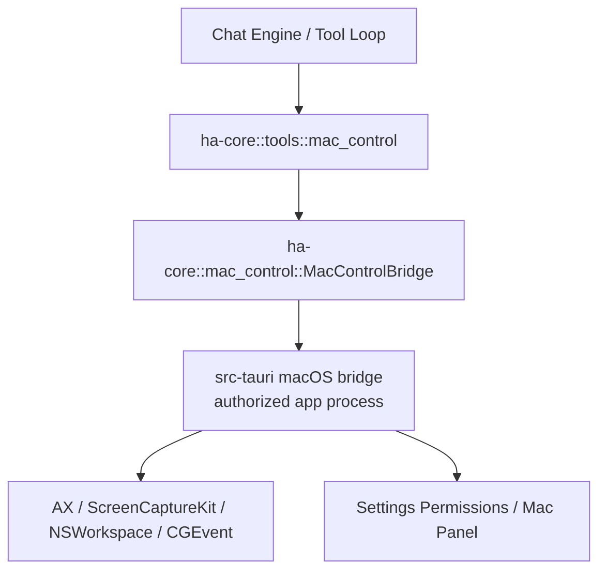

# macOS 控制子系统

> 返回 [文档索引](../README.md)
>
> 状态：Phase 2C read-only wait / target query 落地中

本文定义 Hope Agent 原生 macOS 控制能力的目标架构。目标不是依赖 Peekaboo，而是吸收它的工程经验：**先看屏幕与 AX 树，再按稳定元素行动；优先使用 Accessibility 原生 action，必要时才回落到合成键鼠事件**。

## 目标

macOS 桌面版应提供一套一等的本机 GUI 自动化能力，让 Agent 能在用户授权后完成跨 App 工作流：

- 读取当前桌面、显示器、前台 App、窗口列表和 UI 元素树
- 截图并把元素引用、坐标、可用 action 绑定到同一个 snapshot
- 按元素 ID、文本查询、菜单路径或坐标执行点击、输入、滚动、快捷键、拖拽
- 激活、启动、隐藏、退出 App，聚焦、移动、缩放、最小化、关闭窗口
- 发现和点击菜单栏、菜单项、系统 dialog
- 在聊天右侧实时镜像 Agent 正在看的 macOS 画面
- 全程接入现有 `permission::engine`、Plan Mode、Agent tool allow/deny、EventBus、日志与 Transport 契约

非目标：

- 不复用 Peekaboo 的 agent loop、Provider、MCP runtime 或 CLI 进程
- 不让 `node`、`zsh`、`Terminal`、临时 dev binary 成为长期授权主体
- 不把 macOS 控制能力暴露给 headless server 模式作为假可用能力
- 不用纯坐标点击作为主路径
- 不绕过用户审批去执行输入、点击、菜单、窗口关闭、App 退出等突变操作

## 核心判断

Hope Agent 是签名的 macOS `.app`，这是我们做本机控制的关键优势。Screen Recording / Accessibility / Automation 等 TCC 权限应尽量归属到 **Hope Agent app bundle**，而不是外部 CLI 或脚本解释器。真正调用 AX、ScreenCaptureKit、CGEvent 的进程必须是获得授权的进程。

因此架构采用：



- `ha-core` 持有工具 schema、类型、权限分类、结果模型、EventBus 事件和 bridge trait
- `src-tauri` 在 `setup.rs` 注册 macOS bridge 实现
- 桌面运行模式通过 bridge 真实执行；server / ACP / 非 macOS 没有 bridge 时返回 `unsupported`
- 前端权限页和实时面板走 Transport 调用 Tauri/HTTP 对齐接口；HTTP server 模式返回同形状的不可用状态

这和 `updater::UpdaterBridge` 的方向一致：核心层定义契约，Tauri 壳注入平台实现，避免 `ha-core` 依赖 Tauri。

## 模块布局

建议文件结构：

```text
crates/ha-core/src/mac_control/
  mod.rs              # 公共类型、Bridge trait、OnceLock 注册入口
  types.rs            # Status / Snapshot / Element / Action / Result
  permissions.rs      # 所需系统权限与 readiness 计算
  risk.rs             # tool args -> MacControlRisk 分类
  snapshot_cache.rs   # snapshot 元数据结构；真实图片可由 bridge 存盘

crates/ha-core/src/tools/mac_control.rs
  # builtin tool dispatch；所有 action 进入单一入口

src-tauri/src/macos_control.rs
  # Phase 1 注册 bridge；后续可拆成 src-tauri/src/macos_control/：
  # bridge.rs / screen.rs / ax.rs / input.rs / apps.rs / windows.rs / menu.rs / dialog.rs

src/components/chat/MacControlPanel.tsx
src/components/settings/PermissionsPanel.tsx
```

如果 Rust/`objc2` 绑定在 ScreenCaptureKit 或 AX 边界上成本过高，第二阶段可把 `src-tauri/src/macos_control/*` 替换为签名 Swift helper。对 `ha-core` 来说仍是同一个 bridge，工具表面不变。

## 权限模型

macOS 控制的最小可用权限分三层：

| 层级 | 权限 | 用途 | 是否 MVP 必需 |
| --- | --- | --- | --- |
| 看屏幕 | Screen Recording | 截图、实时面板、视觉定位 | 是 |
| 读/控 UI | Accessibility | 读取 AX 树、AXPress、AXSetValue、窗口和菜单控制 | 是 |
| App 自动化 | Automation: System Events / per-app | Apple Events fallback、部分菜单/系统流程 | 可选 |
| 输入监听 | Input Monitoring | 未来录制用户操作、全局热键学习 | 非 MVP |
| 系统音频 | System Audio Capture | 未来音频理解 | 非 MVP |

现有权限页已经重构为 `check_system_permissions` / `request_system_permission`，并把 `accessibility`、`screen_recording`、`input_monitoring`、`automation_system_events` 等放在 `control_capture` 组。macOS 控制功能应复用这套 catalog，并在设置页增加一个 readiness 区块：

- `Ready`：Screen Recording + Accessibility 已授权
- `Limited`：只缺 Automation / Input Monitoring 等可选项
- `Blocked`：缺 Screen Recording 或 Accessibility
- `Unsupported`：非 macOS、HTTP/server mode、没有 bridge、未运行在 `.app` 授权主体里

工具执行时也要做运行时防御：

- `snapshot` 读取 AX 树需要 Accessibility；`includeScreenshot=true` 额外需要 Screen Recording。截图失败时返回 AX snapshot + warning，不把整个只读结果打掉
- `mac_control_capture_frame` 只读镜像帧只需要 Screen Recording；HTTP/server mode 仍返回 `supported=false`
- `act` / `windows` / `menu` 需要 Accessibility
- Apple Events fallback 需要对应 Automation consent
- `server` / `acp` 模式没有已注册 bridge 时，工具返回结构化 `unsupported`，不伪装成功

## Tool 表面

新增 builtin tool：`mac_control`。

工具分层建议：

- `ToolTier::Standard`
- `default_for_main=true`
- `default_for_others=false`
- `default_deferred=true`
- `internal=false`
- `concurrent_safe=false`
- `async_capable=false`

原因：

- 这是用户可关闭的桌面能力，不属于 Core
- 默认只给主 Agent，避免 subagent 意外操作电脑
- schema 较大且风险高，适合 deferred tool loading
- 所有突变操作必须进入审批系统
- 同一轮内多个 GUI 操作不可并行，避免焦点和坐标竞争

### 8-action 表面

保持和 `browser` 子系统类似的高层动作表面，降低模型负担：

```text
status      # bridge / platform / permission readiness / frontmost app
permissions # macOS 控制相关权限状态与请求提示
apps        # list | frontmost | activate | launch | hide | unhide | quit
windows     # list | focus | move | resize | minimize | close | fullscreen
snapshot    # screenshot + AX tree + element refs
act         # click | double_click | right_click | hover | type | set_value | press | hotkey | scroll | drag
menu        # list | click
wait        # wait_for_app | wait_for_window | wait_for_element | wait_until_gone
```

`snapshot` 是 loop 的核心入口。Agent 标准流程应是：

```text
status -> snapshot -> act/menu/windows -> snapshot -> 必要时继续
```

### Snapshot 模型

`snapshot` 返回一份短生命周期引用表：

```jsonc
{
  "snapshotId": "macsnap_01J...",
  "createdAt": "2026-05-17T...",
  "frontmostApp": {
    "pid": 1234,
    "bundleId": "com.apple.finder",
    "name": "Finder"
  },
  "displays": [
    {
      "id": 1,
      "framePoints": { "x": 0, "y": 0, "width": 1512, "height": 982 },
      "scale": 2
    }
  ],
  "windows": [
    {
      "id": "win_1",
      "appPid": 1234,
      "title": "Downloads",
      "focused": true,
      "boundsPoints": { "x": 80, "y": 90, "width": 900, "height": 680 }
    }
  ],
  "elements": [
    {
      "id": "el_7",
      "windowId": "win_1",
      "role": "AXButton",
      "label": "Open",
      "value": null,
      "enabled": true,
      "focused": false,
      "boundsPoints": { "x": 824, "y": 710, "width": 70, "height": 28 },
      "actions": ["AXPress"]
    }
  ],
  "screenshot": {
    "mediaId": "macsnap_01J.jpg",
    "path": "~/.hope-agent/mac-control/snapshots/macsnap_01J.jpg",
    "widthPx": 3024,
    "heightPx": 1964
  }
}
```

约束：

- `element.id` 只保证在当前 snapshot 或短 TTL 内有效
- 结果必须同时说明坐标空间：AX / CGWindow 使用 point，截图使用 pixel，桥接层负责 scale 转换
- 元素树默认截断，优先返回可交互元素、文本框、菜单项、按钮、链接、表格行、dialog 控件
- 大截图落盘并通过 EventBus 给右侧镜像面板；工具结果只返回 `screenshot` 摘要，不把 base64 塞进上下文
- snapshot 文件落在 `~/.hope-agent/mac-control/snapshots/`，Phase 2B 按数量 LRU 清理，默认最多保留 100 个 JPEG

### Target 解析

突变 action 支持四类 target：

```jsonc
{
  "elementId": "el_7",
  "snapshotId": "macsnap_01J...",
  "query": { "text": "Open", "role": "AXButton", "app": "Finder" },
  "point": { "displayId": 1, "x": 812, "y": 724 }
}
```

优先级：

1. `elementId + snapshotId`
2. `query` 在最新 AX 树中查找
3. `point`

`elementId` 失败时做一次 stale-ref 自恢复：

1. 用旧 snapshot 记录的 `role + label + value + window title + bounds`
2. 刷新 AX 树
3. 精确匹配或高置信模糊匹配
4. 重试一次

返回文本要明确标注是否发生过 auto-recovery，避免模型误判环境稳定性。

## 动作执行策略

动作优先级必须是 action-first：

1. AX 原生 action：`AXPress`、`AXConfirm`、`AXCancel`、`AXShowMenu`
2. AX attribute 设置：`AXValue`、`AXFocused`、`AXPosition`、`AXSize`
3. AppKit / NSWorkspace：启动、激活、隐藏、frontmost app
4. 菜单栏 AX 遍历和菜单项 `AXPress`
5. CGEvent fallback：鼠标移动、点击、拖拽、滚动、键盘、快捷键
6. Apple Events fallback：仅用于明确需要 System Events / per-app Automation 的流程

禁止一开始就猜坐标。只有当 AX action 不存在、目标是 canvas/自绘 UI、或用户明确要求坐标动作时，才使用 CGEvent。

### 输入文本

文本输入采用三档：

1. 对 AX text field 直接 `AXSetValue`
2. 聚焦目标后用 pasteboard 粘贴长文本，操作前后恢复剪贴板
3. 短文本用 key events fallback

默认不读取或泄露用户剪贴板内容。需要临时使用 pasteboard 时，工具结果只报告是否恢复成功，不把旧剪贴板内容写日志。

### 菜单

`menu.list` 返回当前前台 App 的菜单树，可按 `maxDepth` 截断。`menu.click` 支持路径：

```jsonc
{ "action": "menu", "op": "click", "app": "Finder", "path": ["File", "New Finder Window"] }
```

危险菜单项，如 `Delete`、`Move to Trash`、`Empty Trash`、`Erase`、`Reset`、`Quit`、`Force Quit`、`Remove`，进入高风险审批。

## 审批与安全

`mac_control` 不是普通工具。需要扩展 `permission::engine` 的 tool-specific 风险分类，而不是只靠 Agent 自定义审批列表。

新增内部分类：

```rust
pub enum MacControlRisk {
    ReadOnly,        // status, permissions, snapshot, wait, list
    FocusOnly,       // activate app, focus window, hover
    Input,           // type, set_value, hotkey, press
    Pointer,         // click, drag, scroll
    WindowMutation,  // move, resize, minimize, close, fullscreen
    AppMutation,     // launch, quit, hide, unhide
    Dangerous,       // destructive menu/hotkey/dialog/app/window action
}
```

Default 模式：

| 风险 | 决策 |
| --- | --- |
| `ReadOnly` | Allow |
| `FocusOnly` | Ask，允许 AllowAlways |
| `Input` / `Pointer` / `WindowMutation` / `AppMutation` | Ask，允许按 action/app/project/session scope 记住 |
| `Dangerous` | Ask，`forbids_allow_always=true` |

Smart 模式：

- `ReadOnly` 直接 Allow
- `FocusOnly` 可被 `_confidence=high` 或 judge_model 放行
- `Input` / `Pointer` / `WindowMutation` / `AppMutation` 默认仍有 edit-layer floor，除非后续单独做桌面专用 AllowAlways
- `Dangerous` 永远 Ask

Yolo 模式：

- 遵循现有语义，除 Plan Mode 外全部 Allow
- `Dangerous` 仍写 `app_warn!` 审计日志

Plan Mode：

- 默认不把 `mac_control` 加入 planning agent 工具白名单
- 执行期如果 plan 明确包含桌面操作，后续可在 approve plan 时把具体 `mac_control` action 加入执行 allowlist
- Planning / Review 中途进入兜底要拒绝突变 action，避免模型在计划尚未批准时操作电脑

审批弹窗需要展示：

- action 类型和风险等级
- 目标 App / 窗口 / 元素 label
- 旧 snapshot 缩略图上的目标框
- 文本输入预览，长文本折叠
- hotkey / menu path
- AllowAlways 按钮是否可用及作用域

## 配置

Phase 1 不新增 `AppConfig.mac_control`，避免为未落地的截图 / AX / 输入能力提前暴露配置面。后续从 Phase 2 开始再按实际能力增加：

```jsonc
{
  "macControl": {
    "enabled": true,
    "panelAutoOpen": true,
    "snapshotTtlSecs": 300,
    "snapshotMaxFiles": 100,
    "maxElements": 600,
    "includeOffscreenWindows": false,
    "allowCgEventFallback": true,
    "dangerousMenuPatterns": [
      "delete",
      "move to trash",
      "empty trash",
      "erase",
      "format",
      "reset",
      "force quit"
    ]
  }
}
```

设置 UI：

- Settings → Permissions：顶部展示 Mac Control readiness
- Settings → Tools 或单独 Mac Control panel：后续再提供启用开关、snapshot retention、CGEvent fallback、危险菜单 pattern
- Agent 设置：通过既有 `capabilities.tools.allow/deny` 控制 `mac_control`

配置写入必须走 `mutate_config(("mac_control.<op>", source), ...)`。

## EventBus 与前端

新增事件：

| 事件 | 说明 |
| --- | --- |
| `mac_control:frame` | snapshot 或 action 后的最新截图帧，供右侧面板显示 |
| `mac_control:status_changed` | bridge / permission readiness 变化 |
| `mac_control:action` | 操作审计摘要，不含敏感输入全文 |

右侧 `MacControlPanel` 行为参考 `BrowserPanel`：

- 第一次 `mac_control:frame` 到来自动打开
- 与 PlanPanel / DiffPanel / CanvasPanel / BrowserPanel 互斥
- 用户手动关闭后本轮保持关闭
- 打开期间 1s 兜底轮询 `mac_control_capture_frame`

Transport 对齐：

- Phase 1 Tauri / HTTP: `mac_control_status`, `mac_control_permissions`
- Phase 2A Tauri / HTTP: `mac_control_snapshot`（HTTP/server 仍返回 `supported=false`）
- Phase 2B+ Tauri / HTTP: `mac_control_capture_frame` 等截图与实时面板接口
- HTTP: 同名 REST endpoint，server/headless 返回 `supported=false` 或 `501` 风格的结构化错误
- 前端永远不直接调用原生 AX，只通过 Transport

## Tool 结果与日志

工具结果要可读、短、结构化：

- `status` 返回 readiness、缺失权限、下一步建议
- `snapshot` 返回元素摘要、图片引用、被截断数量
- `wait` 返回是否命中、尝试次数、命中的 app/window/element 和最后一份 snapshot
- `act` 返回实际执行路径：`AXPress` / `AXSetValue` / `CGEventFallback`
- `menu` 返回菜单路径匹配结果
- 失败返回可恢复原因：缺权限、App 不存在、元素 stale、目标不可见、窗口不在当前 Space、AX action 不支持

日志原则：

- 不记录完整截图 base64
- 不记录用户剪贴板内容
- 文本输入日志默认截断到 128 字符并脱敏
- 审批日志记录 action/app/window/element label/risk，不记录密码字段值
- snapshot 文件按 LRU 清理，删除失败只 warn

## 实现阶段

### Phase 0：架构与权限就绪

- 新增本文档并挂到文档索引
- 确认最新 main 的权限页 v2 已包含控制类权限
- 在方案中约定 bridge trait 和 `mac_control` tool 表面

### Phase 1：Bridge 骨架与状态

- 新增 `ha-core::mac_control` 类型和 `MacControlBridge` trait
- `src-tauri` 注册 bridge，实现 `status` / `permissions`
- 新增 `mac_control` tool，仅支持 `status` / `permissions`
- 新增 HTTP/Tauri 对齐命令
- 设置页 `PermissionsPanel` 顶部显示 Mac Control readiness

验证：

- `cargo check -p ha-core`
- `pnpm typecheck`

### Phase 2：Snapshot

Phase 2A 先落地后端只读切片：

- `mac_control(action=snapshot)` 返回前台 App、窗口和 Accessibility 元素摘要
- Tauri bridge 直接在已授权 `.app` 进程内读取 AX 树
- HTTP/server transport 仍返回 `supported=false`，不复用桌面 bridge
- 截图、显示器列表、snapshot cache、EventBus frame 和右侧面板留给 Phase 2B

Phase 2B 再补齐完整 snapshot：

- 实现 primary-display 截图镜像（当前走 xcap/CoreGraphics；ScreenCaptureKit / 多显示器完整帧留后续）
- 实现 AX 树采集、元素筛选、ID 分配、snapshot cache
- `snapshot` action 返回图片引用和元素表
- EventBus 发 `mac_control:frame`
- 右侧 `MacControlPanel` 显示最新帧

Phase 2C 铺只读 target 查询和等待能力：

- `mac_control(action=wait)` 轮询只读 AX snapshot，直到 app/window/element query 命中或超时
- target query 支持 `appName`、`bundleId`、`windowTitle`、`elementId`、`text`、`role`、`enabled`、`focused`
- `wait` 不截图、不执行点击/输入、不触发审批；它只为后续 `act` 的 target 解析和 stale recovery 打基础
- 命中时返回匹配列表和当次 snapshot；未命中时返回最后一次 snapshot 方便模型解释阻塞点

验证场景：

- Finder / System Settings / Notes / Safari 非网页区域
- 多显示器坐标
- Retina 1x/2x 缩放
- 屏幕录制未授权的错误路径
- 等待前台 App / 窗口标题 / 按钮文本出现和超时路径

### Phase 3：安全动作 MVP

- `apps.list/frontmost/activate/launch`
- `windows.list/focus/move/resize/minimize`
- `act.click/type/set_value/hotkey/scroll`
- `menu.list/click`
- 集成 `permission::engine` 风险分类和审批弹窗 payload
- stale-ref 一次自恢复

验证场景：

- 打开 Notes，新建笔记并输入文本
- Finder 创建窗口、切换视图、选择文件但不删除
- System Settings 搜索并打开指定页面
- 菜单项点击路径

### Phase 4：高阶动作与稳定性

- dialog inspect/accept/dismiss
- drag/drop、right click、double click
- close window / quit app / dangerous menu patterns
- Apple Events fallback
- wait_until_gone 和更强的 target ranking
- snapshot LRU 清理和错误统计

### Phase 5：产品化

- 完整 i18n
- notarized app bundle 下的权限回归测试
- 若需要，把 bridge 实现迁移到签名 Swift helper
- 增加 `ha-mac-control` skill，教模型标准 loop 和阻塞场景
- 文档补充到 `api-reference.md`、`tool-system.md`、`permission-system.md`

## 测试矩阵

单元测试：

- tool schema JSON
- `MacControlRisk` 分类
- dangerous menu pattern 匹配
- target query ranking
- point/pixel scale 转换
- snapshot LRU

集成测试：

- `cargo check -p ha-core`
- `cargo check -p src-tauri` 或 `cargo check --workspace` 在 macOS 本机自查
- `pnpm typecheck`
- 权限未授权、半授权、全授权三种状态
- `.app` bundle 与 bare debug binary 两种宿主

手工 QA：

- 首次授权引导
- App 重启后权限仍生效
- 多显示器、不同 scale、窗口跨屏
- Mission Control / Space 不同导致目标不可见
- 系统 dialog / 文件选择器 / 菜单栏 popover
- 输入密码字段时不泄露文本

## 风险与边界

- TCC 权限按进程和 bundle 身份绑定，开发期 bare binary 与正式 `.app` 的权限不是一回事
- AX 树对 Electron、SwiftUI、自绘 canvas、游戏等 App 质量不稳定，需要截图和坐标 fallback
- CGEvent fallback 依赖当前焦点和坐标，必须在 action 之后重新 snapshot 校验
- Mission Control / Spaces 对后台窗口控制有系统限制，不保证跨 Space 操作稳定
- ScreenCaptureKit API 和权限行为随 macOS 版本变化，需要在 release notes 标清最低支持版本
- server/headless 模式不应承诺本地桌面控制；除非未来有一个签名、已授权、常驻的本机 helper

## 与 Peekaboo 的关系

Peekaboo 可以作为公开实现参考，尤其是 snapshot-first、AX action-first、stale ref recovery、菜单/窗口/多屏处理和权限 UX。但 Hope Agent 的实现应保持自有边界：

- 不调用 Peekaboo CLI
- 不依赖它的 MCP server
- 不复用它的 agent loop
- 可以在 MIT License 允许范围内参考算法和实现细节；若直接移植代码片段，必须保留版权与许可证声明

## 决策摘要

1. 公共工具名用 `mac_control`，内部子系统命名 `mac_control`
2. `ha-core` 定义 bridge trait，`src-tauri` 注册 macOS 实现
3. 桌面 `.app` 是授权主体，server/headless 明确 unsupported
4. 能力先 `status/snapshot`，再逐步开放 `act/menu/windows/apps`
5. Default 模式下突变 GUI 操作必须审批；危险菜单/关闭/删除类操作禁止 AllowAlways
6. 先做 Rust bridge MVP；若 ScreenCaptureKit / AX 绑定成本过高，再迁移到签名 Swift helper
