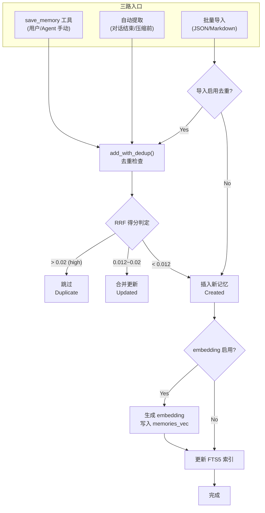
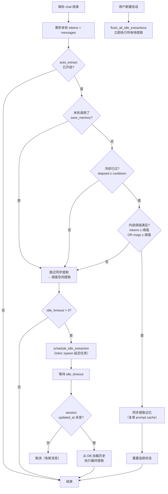
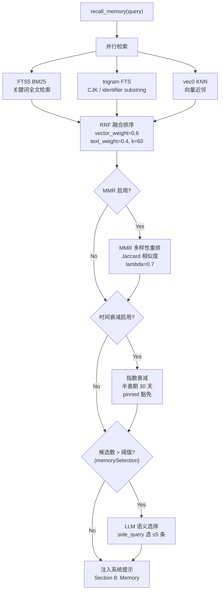
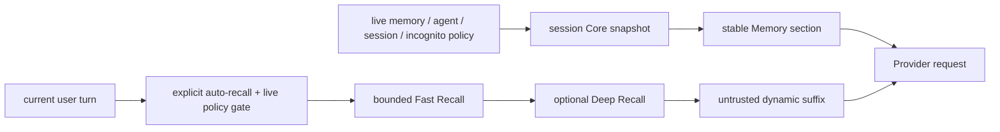

# 记忆系统架构
> 返回 [文档索引](../README.md) | 更新时间：2026-07-13

## 概述

记忆系统由两条互补的数据路径组成：Global / Agent / Project 三级作用域的 Markdown Core Memory 负责短小、稳定、可人工维护的“始终记住”；SQLite + FTS5 + trigram + sqlite-vec、Claims、Profile、Procedure 和 Graph 负责长期积累与“相关时想起”。动态记忆可由用户手动保存、Agent 自动提取或文件导入，但默认不再批量常驻 system prompt。

## Memory UX v2 最终运行时契约

### 用户心智与不可破坏的不变量

普通界面只向用户解释三个概念，底层的 Claims、Evidence、Profile、Procedure、Graph、FTS、向量检索和 Dreaming 仍完整保留在高级能力中：

| 用户概念 | 运行时对象 | Prompt 位置 | 主要存储 |
|---|---|---|---|
| 始终记住 | Core Memory | 会话级稳定前缀 | `MEMORY.md` + `topics/*.md` |
| 相关时想起 | Dynamic Recall | 当前 turn 的动态后缀 | SQLite / Claims / Profile / Procedure / Graph |
| 从对话中学习 | Learning Pipeline | 不直接注入 | memories / claims / pending candidates / evidence |

`pinned` 只表示动态召回优先级，不再天然表示静态注入；只有用户明确维护或提升到 Core Memory 的内容才进入稳定前缀。`Profile Snapshot` 是动态候选源，不是默认人格块。运行时必须满足：

```text
MemoryVisible(turn)
  = EligibleCoreSnapshot(session, turn)
  + EligibleDynamicRecall(turn)
  + ExplicitConversationMemory(turn)

Incognito
  => CoreSnapshot = empty
  && DynamicRecall = empty
  && Learning = disabled

PendingOrNeedsReview => 不得进入任何 agent prompt / recall 路径
```

Snapshot 只冻结内容，不冻结权限。Memory master switch、Agent memory switch、Global sharing、Incognito、Project 绑定和 session policy 每轮重新裁决；撤销资格后，下一轮必须移除对应层。Owner 管理面不因 Agent memory off 而关闭，用户仍能查看、导出、删除和修复本地资产。

### 配置真相源与默认值

产品级配置统一由 `AppConfig.memory: MemoryRuntimeConfig` 承载，使用、Core、自动动态召回、深度召回和学习是正交开关，不得再从某个旧 Active Memory 字段推断整个 Memory 的启停状态：

```json
{
  "memory": {
    "configVersion": 2,
    "enabled": true,
    "core": {
      "enabled": true,
      "totalTokens": 1600,
      "globalTokens": 350,
      "agentTokens": 450,
      "projectTokens": 650,
      "protocolTokens": 150,
      "topicReadMaxTokens": 800
    },
    "recall": {
      "enabled": false,
      "userConfigured": false,
      "mode": "fast",
      "maxTokens": 800,
      "maxSelected": 5,
      "candidateLimit": 24,
      "timeoutMs": 100,
      "includeClaims": true,
      "includeProfile": true,
      "includeProcedures": true,
      "includeGraph": true
    },
    "deepRecall": {
      "enabled": false,
      "timeoutMs": 4500,
      "cacheTtlSecs": 60,
      "maxChars": 220,
      "budgetTokens": 512
    },
    "learning": {
      "mode": "smart",
      "promoteCoreAutomatically": false
    },
    "rollout": {
      "enabled": true,
      "dynamicRecall": true,
      "coreRepository": true,
      "shadowPlan": false
    },
    "compatibility": {
      "legacyStaticMemory": false
    }
  }
}
```

- `memory.enabled=false` 关闭 Agent 平面的 Core、动态召回、学习和 Memory tools，但保留 owner 管理面。
- `core.enabled=false` 只停止 Core 注入与 Agent Core 工具，不删除 Markdown 文件。
- `recall.enabled=false`（默认）停止全局自动动态召回；一个 minor 兼容窗口内，显式开启的旧 Agent Active Memory 仍只为该 Agent 构成 opt-in。Core 仍自动使用，`recall_memory` / `memory_get` 等 Memory tools 仍可由模型按需调用。
- `recall.userConfigured` 是自动召回同意的持久化真相源；只有 owner GUI / HTTP 明确切换 `recall.enabled` 时才置为 `true`，预算或其它 Memory 设置保存不得伪造同意。
- `deepRecall.enabled=false` 只保证不发生额外 LLM rerank；它不能绕过 `recall.enabled` 单独启动动态召回。用户显式开启自动召回后，确定性 Fast Recall 才成为默认执行模式。
- `learning.mode=manual` 只停止自动提取；用户显式保存仍可用。
- `promoteCoreAutomatically=false` 是安全不变量：自动流程只能建立提升建议，不能静默改写用户维护的 Core。

`memory.configVersion=2` 是本次自动召回 opt-in 契约。线上升级在首次成功读取旧配置后执行一次版本化迁移并立即持久化完整结构：写前进入 config autosave，正文通过安全原子替换写回；持久化失败不丢弃已解析配置，当前进程继续使用迁移后的内存视图并在下次启动重试。

迁移裁决如下：

| 旧磁盘状态 | V2 结果 |
|---|---|
| 无 `memory` 字段 | 从旧 Extract / Budget 迁移；只有 `memorySelection.enabled=true` 才视为既有主动召回同意 |
| 未版本化且 `recall.enabled=false` | 保持关闭，即使旧 Deep 字段仍为 true 也不得反向打开 |
| 未版本化且 `recall.enabled=true`，无其它同意证据 | 视为旧版错误默认值，迁移为关闭 |
| 未版本化且存在 `userConfigured=true`、`memorySelection.enabled=true`、Deep enabled 或 mode=deep | 保留既有选择并写入 `userConfigured=true` |
| `configVersion>=2` | 原样保留，不重复猜测或迁移 |

旧 Fast-only 用户在同意标记出现前无法与错误默认值可靠区分，因此采用隐私 / Token 成本优先的 fail-closed 策略：一次性迁移为关闭，但能力、数据与工具全部保留，用户可在 GUI 重新开启。V2 简单开关与仍可见的旧高级字段双向镜像一个 minor，且保留旧模型、阈值等专家参数。`rollout.enabled=false` 是完整 V1 回滚；`compatibility.legacyStaticMemory=true` 只恢复旧 SQLite / Profile / Pinned 静态段，不改变 V2 Core 文件和底层资产。

`core.hardMaxTokens` 仅作为旧配置反序列化 / 旧版本读取的兼容镜像保留，Memory UI 不展示，也不得再压低用户唯一可见的 `totalTokens`。保存时保证兼容镜像 `>= totalTokens`；用户预算允许在 `[128, 16384]` 内显式调整。`2400` 是推荐区间上界而非权限或模型能力硬限制，超过时只警告稳定 Prompt、cache write 和 TTFT 成本。

Core 的本轮有效预算由 `CoreMemoryBudgetStatus` 统一解析：

```text
modelSafetyLimit = clamp(contextWindow / 10, 256, 16384)
effectiveTokens  = min(totalTokens, modelSafetyLimit, 16384)
```

`16384` 只是一道防止 raw config / owner API 数量级错误的宽松 emergency guard。模型上下文未知时只应用 emergency guard；具体聊天模型已知时最多使用其窗口的 10%。临时裁剪绝不回写用户配置。Settings 通过 Tauri `get_memory_core_budget_status` / HTTP `GET /api/config/memory-core-budget-status` 展示全局默认模型的「配置值 / 有效值」；session 模型覆盖与 failover 的真实有效值进入 `StaticMemoryContextManifest` 和 `/context`，不得拿全局模型状态冒充当前会话。

### CoreMemoryRepository、渐进式文件与大小写迁移

三个 scope 共用 `CoreMemoryRepository`，canonical 索引文件名统一为大写 `MEMORY.md`：

```text
~/.hope-agent/memory/MEMORY.md
~/.hope-agent/agents/{agentId}/memory/MEMORY.md
~/.hope-agent/projects/{projectId}/memory/MEMORY.md
```

细节正文位于各自的 `topics/*.md`，只由 `core_memory` / `project_memory` 按需读取；主题正文变化不会改变静态前缀，只有索引内容变化才会合理 bust cache。索引仍受 200 行 / 25KB 文件安全上限约束，但真正进入 Prompt 的大小由 token budget 决定。三层先获得各自预算，未使用额度进入共享池，再按 Project > Agent > Global 分配；裁剪必须以完整 Markdown 条目为边界，并使用保守 token 上界。

Memory Budget 普通 UI 只暴露 `totalTokens`，提供精简 `1000` / 平衡 `1600` / 丰富 `2400` 三档和自定义输入；Global / Agent / Project / protocol / topic-read 分配收在高级区。修改稳定 Core 预算或内容会合理产生一次新 stable-prefix fingerprint，之后继续稳定命中；Fast/Deep Recall 仍位于动态 suffix，不得因本轮召回破坏已有 Core 前缀缓存。

旧 Global `~/.hope-agent/memory.md` 和 Agent `~/.hope-agent/agents/{id}/memory.md` 只在兼容窗口作为同步镜像。所有 loader、tool、owner API、import、backup 和 restore 都必须经 repository，禁止自行拼路径或做 case-only rename。迁移使用全局 OS 独占锁、原子写、回读 BLAKE3 校验和 `~/.hope-agent/memory/migrations/core-memory-v2.json` manifest：

| 磁盘状态 | 处理 |
|---|---|
| 只有小写 | 备份并迁移到大写，建立镜像与同步快照 |
| 只有大写 | 以大写为 canonical，并在兼容期补齐镜像 |
| 两边相同 | 记录同步 revision |
| 仅一边相对 manifest 变化 | 把该边视为旧/新版本的合法写入，同步另一边 |
| 两边都变化且不同 | 标记 `conflict`，停止自动覆盖，等待 owner 选择 canonical / legacy / merged |

冲突态只允许使用 manifest 对应的最后同步快照；快照缺失时两边都不得进入 Prompt。canonical 大写写成功后即为本次提交点；mirror 或 manifest 失败只能标记 stale 并在后续修复，禁止反向覆盖已成功的新内容。兼容窗口结束后停止双写，但 lowercase fallback 与迁移备份至少再保留一个 minor。

### 会话快照、Prompt 与 Token Cache

`CoreMemorySnapshot` 是会话语义状态，不是可随意淘汰的性能缓存。首个 turn 捕获 eligible 的 Global / Agent / Project 索引、hash、迁移状态和 token；同一进程内普通 API round 和后续 turn 复用同一快照。以下事件才使其失效：显式 `core_memory.reload`、Tier 3 compaction、session 清理、会话的 Agent / Project / Global-sharing 资格变化、owner 全量 restore 或进程重启。

用户在当前会话写 Core 时，文件立即持久化，工具结果在当前 conversation 明示成功，但现有静态快照默认保持不变；reload、compact 或新会话后才进入固定前缀。这样后台学习、Dreaming、Profile 更新和其他会话的 Core 写入都不会改变当前会话的 stable fingerprint。

Prompt 每轮可以重新构造，但构造结果必须按固定顺序和 canonical 序列化保持字节稳定：

```text
stable prefix: identity / safety / agent & project rules / CoreMemorySnapshot
dynamic suffix: permission / explicitly-enabled Fast-or-Deep Recall / Procedure / Knowledge / reminders
history: conversation messages
```

动态召回不得重新拼回 stable system string。Provider adapter 只负责把同一上层 stable/dynamic 语义渲染成 Anthropic block、OpenAI item 或 Codex wire shape；failover 重新渲染，不能串用 Provider 格式。Prompt Cache 只减少重复计算、费用和 TTFT，不减少上下文窗口占用；`/context` 必须同时显示实际 context input 与 cache read，不能用 cache hit 掩盖过大的输入。

### Dynamic Recall 与可选 Deep Recall

V2 的 `MemoryRecallPlanner` 是自动动态召回的唯一产品编排入口。默认配置为 `recall.enabled=false` 且旧 Agent Active Memory 未启用：每个 user turn 只使用会话固定的 Core 快照，不查询 SQLite memory、claim、Profile、Procedure 或 Graph；模型仍可根据任务需要自主调用 `recall_memory` / `memory_get`，因此关闭自动召回不会删除记忆检索能力。

用户显式开启全局自动召回后，每个非空 user turn 先经过零 LLM 的硬策略 gate；一个 minor 兼容窗口内，旧 `ActiveMemoryConfig.enabled=true` 也只为所属 Agent 构成显式 opt-in，不扩散成全局同意。该 gate 只裁决 Incognito、global / Agent / session memory policy、有效 recall opt-in、空输入和预算，不维护任何语言相关的“寒暄 / 感谢 / 继续”短语表，也不尝试猜测某句话是否“值得召回”。通过 gate 后，并行读取当前 scope 内的 legacy memory、effective-active claims、按 profile / procedure intent 展开的 Profile、Procedure 和 Graph 辅助候选，再执行：

1. 淘汰过期、superseded、archived、`needs_review`、跨 scope 和缺少最低检索证据的候选。
2. 按检索证据、Project > Agent > Global、intent、confidence、salience、用户显式优先级进行确定性排序。
3. 对 memory / claim / profile 投影做 canonical-content 去重；稳定 tie-break 不依赖 HashMap 或异步完成顺序。
4. 最多保留 24 个候选、选择 5 条、渲染不超过 800 token，并包在 `<untrusted_external_data>` 中。
5. timeout、busy、embedding/外部 provider 失败均 fail-soft，只丢当前增强层，不阻断主回答。

自动动态召回默认关闭。用户显式开启后，Fast Recall 是默认模式且不调用额外 LLM；检索证据不足或没有候选时注入 0 条。Deep Recall 默认关闭；开启后只对已经完成实时资格过滤的 Fast shortlist 做一次 bounded side query，用于 rerank / distill，默认 timeout 4.5s、TTL 60s、摘要 220 字符、预算 512 token。无效响应、超时或模型失败回退到原 Fast Top-K；有效的空选择表示模型确认无需注入，绝不能回退为全量静态记忆。

### 学习、Scope 路由与会话控制

学习模式只决定新资产如何产生，不决定是否使用已有记忆：

| 模式 | 自动提取 | 写入动态库 | Review | 自动改 Core |
|---|---:|---:|---:|---:|
| `smart` | 是 | 确定 scope 的普通候选可写入 | 冲突、敏感、scope 不确定 | 否，只提议 |
| `review_first` | 是 | 批准后 | 所有自动 memory / claim 候选 | 否 |
| `manual` | 否 | 仅显式保存 | 视显式操作 | 仅显式操作 |

自动 scope 路由为：项目会话的 project fact → Project；非项目的 Agent 习惯/用户偏好 → Agent；非项目的 project-like fact → `pending_memory_candidates`，绝不能回退成 Agent “项目记忆”。Review-first、scope 缺失/不确定、敏感、冲突和 Core promotion proposal 共用 pending inbox；pending 内容在批准前不参与普通召回、Profile 合成或 Prompt。

`session_memory_policy` 为每个会话独立保存两个 `inherit | allow | deny` 值：

- `useMemories=deny`：不加载 Core、不做动态召回，也不开放读取类 Memory 工具；不删除已有资产。
- `contributeToMemories=deny`：跳过自动提取、Dreaming source 和 Profile synthesis；不影响读取已有记忆。
- Incognito 强制两者为 deny，session override 不得放宽。
- 找不到 session 或 policy DB 时 fail closed；`allow` 仍不能绕过 global / Agent / scope / permission gate。

### 统一工具、观测与验收边界

`core_memory` 是三层 Core 的 canonical 工具，覆盖 index get/append/replace、topic list/read/search/write/delete/rebuild、dynamic memory/claim promotion 和 session reload。`update_core_memory` 与 `project_memory` 只是兼容入口；权限、实时 scope、stale-write、审计和 hook 仍以 canonical action 裁决，Project scope 只能从 live session 解析，模型不能传任意 project id。

每轮 `MemoryContextManifest` 接入 `RoundTokenManifest`，只记录 session hash、Provider/model/round、学习与 session policy、Core snapshot fingerprint、各 scope token 与迁移状态、recall mode/intent/skip reason、候选/选中计数、延迟、stable/dynamic fingerprint 和 scope rejection counts；绝不记录记忆原文、用户 query、embedding 或 evidence quote。`/context`、回答下方 Memory Trace 和诊断 UI 必须消费同一份事实，不得各自重建近似结果。

默认验收边界为：Core 推荐目标 ≤1,600 token、普通推荐区间上界 2,400、用户可配置 emergency guard 16,384；动态召回 ≤5 条 / ≤800 token；默认配置下 `hi` 不查询动态库，显式开启自动召回后无检索证据的 `hi` 仍注入 0 条；Fast Recall P95 目标 ≤100ms；默认普通回合不产生额外记忆 LLM；同一 session 普通回合 stable fingerprint 不变；热缓存 stable read ratio 目标 ≥80%；scope leakage、Review 未批准内容可见和因记忆导致的主回答 hard failure 均为 0。

## 最终设计定位：Memory OS

下一代记忆系统不是单一“向量库”或“聊天摘要”功能，而是一套本地优先的 **Memory OS**：它把用户能看懂的记忆体验、可审计的结构化事实、跨源召回、离线固化、外部 provider 同步和高可用治理放在同一套边界内。调研 OpenClaw、Hermes Agent、Mem0、Zep / Graphiti、Letta / LangMem、Supermemory 与 ChatGPT Memory 后，本系统保留 Hope Agent 的本地 SQLite / claim / evidence 作为默认真相源，吸收竞品的 Active recall、Dreaming consolidation、temporal graph、provider adapter、profile / RAG 统一心智和普通用户管理体验，但不把用户最终纠错权交给自动化或外部服务。

六层职责如下：

| 层 | 职责 | 当前落点 |
|---|---|---|
| UI | 让普通用户看见、修改、忘记和解释“AI 记住了什么” | Memory Center、Answer Memory Chips、Review Inbox、Health / Backup / Import |
| Policy | 统一处理 scope、隐私、置信度、salience、时效和用户控制 | incognito / memory off fail-closed、Project > Agent > Global、Lucid Review |
| Retrieval | 统一跨源候选预算和可观测 trace | `used_memory_refs`、`retrieval_planner`、`source_fusion_v2` |
| Stores | 保存不同类型的长期资产 | Core Memory、legacy memories、claims、evidence、profiles、episodes、procedures、graph projection |
| Consolidation | 在聊天热路径外整理和治理长期记忆 | 自动提取、dedup、Dreaming、Profile synthesis、graph-first Deep Resolver |
| Providers | 可选连接外部记忆生态 | Mem0、Zep / Graphiti、Supermemory、Honcho、Hindsight、OpenViking、Custom Hope Sync v1 |

关键设计决策：

- **本地真相源优先**：本地 core memory、legacy memory、claim、evidence 和审计日志始终可独立工作；外部 provider 只是 additive sync，不得替代本地 safety policy，也不得让远端失败阻断本地读写、召回、Dreaming 或用户纠错。
- **普通用户简单，高级用户可调**：默认界面只暴露“自动学习 / 先审核 / 仅手动 / 关闭”“待确认”“本次用了什么记忆”“忘记 / 修改 / 只在项目中使用”等自然动作；高级配置折叠在 Active Memory、Retrieval Planner、Embedding、Hybrid Search、Dreaming、Provider、Backup / Health 和诊断报告里。
- **用户纠错权高于自动治理**：Deep Resolver 可以做确定性过期、graph-first 近重复合并和高置信冲突入 Review Inbox，但自动流程永不 destructively supersede 用户事实；manual correction / user confirmed evidence 拥有最高权重。
- **召回可解释但不反向改写 prompt**：Retrieval Planner 负责 `used_memory_refs` 和 trace 的 canonical dedup、排序、预算与诊断；已经注入或被选中的 ref 不得被它重排或丢弃，candidate 也不得反向改变已构造完成的 prompt。
- **隐私与作用域 fail-closed**：incognito、memory off、IM / Knowledge opt-in、scope 隔离和 provider 出站策略优先于所有智能召回；不确定时宁可跳过记忆，也不跨边界泄漏。
- **可恢复、可迁移、可诊断**：备份 bundle、structured restore、Health、repair、snapshot、审计分页、诊断复制和真实规模 benchmark 都是记忆资产长期可用性的组成部分，不是 UI 附属功能。

## 数据模型

### MemoryEntry

| 字段 | 类型 | 说明 |
|------|------|------|
| `id` | `i64` | 自增主键 |
| `memory_type` | `MemoryType` | 记忆类型：`User`（用户信息）/ `Feedback`（偏好与反馈）/ `Project`（项目上下文）/ `Reference`（参考资料） |
| `scope` | `MemoryScope` | 作用域：`Global`（全局共享）/ `Agent { id }`（特定 Agent 私有）/ `Project { id }`（特定项目共享） |
| `content` | `String` | 记忆内容文本 |
| `tags` | `Vec<String>` | 标签列表，JSON 序列化存储 |
| `source` | `String` | 来源：`"user"`（手动保存）/ `"auto"`（Agent 自动提取）/ `"import"`（批量导入） |
| `source_session_id` | `Option<String>` | 来源会话 ID |
| `pinned` | `bool` | 是否置顶；V2 中只提高动态召回优先级并豁免时间衰减，只有 legacy static rollback 才把它视为静态注入优先级 |
| `attachment_path` | `Option<String>` | 附件文件绝对路径（存储于 `~/.hope-agent/memory_attachments/`） |
| `attachment_mime` | `Option<String>` | 附件 MIME 类型（如 `image/jpeg`、`audio/mpeg`） |
| `created_at` | `String` | 创建时间 |
| `updated_at` | `String` | 更新时间 |
| `relevance_score` | `Option<f32>` | 检索时填充的相关性得分，不持久化 |

## 存储后端

### SQLite 表结构

**主表 `memories`**：

```sql
CREATE TABLE memories (
    id INTEGER PRIMARY KEY AUTOINCREMENT,
    memory_type TEXT NOT NULL DEFAULT 'user',
    scope_type TEXT NOT NULL DEFAULT 'global',
    scope_agent_id TEXT,
    scope_project_id TEXT,           -- 项目作用域 ID（scope_type='project' 时使用）
    content TEXT NOT NULL,
    tags TEXT NOT NULL DEFAULT '[]',
    source TEXT NOT NULL DEFAULT 'user',
    source_session_id TEXT,
    embedding BLOB,
    pinned INTEGER NOT NULL DEFAULT 0,
    attachment_path TEXT,             -- 附件文件绝对路径
    attachment_mime TEXT,             -- 附件 MIME 类型
    created_at TEXT NOT NULL,
    updated_at TEXT NOT NULL
);
```

**索引**：
- `idx_memories_pinned` — `(pinned DESC, updated_at DESC)`，置顶记忆优先
- `idx_memories_scope` — `(scope_type, scope_agent_id)`，按作用域过滤
- `idx_memories_scope_project` — `(scope_type, scope_project_id)`，按项目作用域过滤
- `idx_memories_type` — `(memory_type)`，按类型过滤
- `idx_memories_updated` — `(updated_at DESC)`，按更新时间排序

**FTS5 全文索引 `memories_fts`**：

```sql
CREATE VIRTUAL TABLE memories_fts USING fts5(
    content, tags,
    content='memories',
    content_rowid='id',
    tokenize='unicode61'
);
```

通过 `AFTER INSERT / UPDATE / DELETE` 触发器自动与主表保持同步。

**可重建字面索引 `memories_literal_fts`**：

使用 FTS5 `tokenize='trigram'` 索引 `content / tags / source / source_session_id`，覆盖中文连续片段和代码标识符中段。它是从 `memories` 可重建的 shadow index，不是真相源；首次打开旧数据库会补建并 backfill，Health 会检查缺行，`rebuild_fts` 会与主 unicode61 FTS 一起重建。Structured claim 使用同构的 `memory_claims_literal_fts`，由 `rebuild_claim_fts` 维护。

**向量表 `memories_vec`**：

使用 sqlite-vec 扩展创建的 `vec0` 虚拟表，存储 `float[N]` 维度的 embedding 向量，支持 ANN（近似最近邻）检索。维度 N 由当前 embedding 提供者决定。

**Embedding 缓存表 `embedding_cache`**：

```sql
CREATE TABLE embedding_cache (
    hash TEXT NOT NULL,
    provider TEXT NOT NULL,
    model TEXT NOT NULL,
    embedding BLOB NOT NULL,
    dimensions INTEGER NOT NULL,
    created_at TEXT NOT NULL DEFAULT (datetime('now')),
    PRIMARY KEY (hash, provider, model)
);
```

按内容哈希 + 提供者 + 模型名做联合主键，避免重复计算。超过 `max_entries`（默认 10000）时自动清理最旧条目。

### 并发模型

- **1 个写连接**（`Mutex<Connection>`）：独占写入，同时作为读连接的 fallback
- **4 个读连接**（`Vec<Mutex<Connection>>`，`READ_POOL_SIZE = 4`）：并发只读查询
- **WAL 模式**：读写互不阻塞
- **Round-robin + fallback**：读请求通过 `AtomicUsize` 轮询分配到读连接池，锁竞争时退化到写连接

### 异步 IO 与锁顺序红线

- `MemoryBackend` / claims / Dreaming store 都是同步 rusqlite API；任何 async chat、tool、Tauri command、HTTP handler 或后台调度器调用它们时，必须经 `crate::blocking::run_blocking` / `spawn_blocking`。配置文件、`MEMORY.md`、Dream Diary、Provider credential/ledger 和本地 embedding provider 构建同样属于 blocking IO。
- embedding cache 复用 memory backend 的 reader/writer。`add` / `update` 必须先生成 embedding、完成 cache 读写，再获取 memory writer；`search` / `search_claims` 必须先生成 query embedding，再获取查询 reader。禁止在持有 writer 时重入 cache writer，也禁止持有 reader 时再申请 cache reader，否则会形成确定性 writer 自锁或 4-reader 池耗尽死锁。
- 主聊天每轮只加载一次 agent memory/capability 配置快照；system prompt 与 `static_memory_refs` 必须从同一批 session/project/memory/profile/context-pack 数据一次构建，禁止为 trace 再跑一遍完整读取。静态 prompt 构建与动态召回并发执行，Stop 可取消等待。
- Active Memory / Procedure / graph trace / passive Knowledge recall / LLM memory selection 的本地候选读取共用有界 blocking 检索槽位。槽位由底层 blocking closure 持有，因此上层 timeout 后未结束的 embedding / SQLite 请求仍占槽；新请求拿不到槽立即以 `retrieval_busy` 或无选择增强降级，不能无限堆积不可取消的 `spawn_blocking` 任务。
- 检索增强是 fail-soft：Active shortlist 与 Procedure/Knowledge 最多等待 2s，graph trace 最多等待 750ms；超时只丢当前增强层并写 Retrieval Planner trace，不得阻断主回答。Active Memory 的 LLM 仍受 agent `timeoutMs` 控制。
- 自动/idle/压缩前提取共享进程级有界 semaphore（按 CPU 计算，范围 2–4）；同步摘要读取、scope 解析、dedup、embedding、claim 双写全部在 blocking pool。自动提取 LLM 总超时 60s，压缩前 flush 30s；超时不改变既有 side-query 用量记账口径。
- Dreaming 的 lease、run/pending/decision/profile store 与 diary 文件都必须隔离到 blocking pool；正常周期返回前必须显式 `await LeaseGuard::release()`，确保 SQLite lease 已删除后才释放进程内 `DREAMING_RUNNING` guard。`Drop` 投递的 blocking release 只用于 panic / cancellation 异常兜底，不能作为正常完成路径。

### 三级作用域与项目隔离

记忆支持三种作用域，优先级从高到低：

| 作用域 | 枚举值 | SQL 列 | 可见范围 |
|--------|--------|--------|---------|
| **Project** | `Project { id }` | `scope_type='project'`, `scope_project_id='{id}'` | 该项目下所有会话 |
| **Agent** | `Agent { id }` | `scope_type='agent'`, `scope_agent_id='{id}'` | 使用该 Agent 的所有会话 |
| **Global** | `Global` | `scope_type='global'` | 所有会话 |

**隔离保证**：
- `recall_memory` / `save_memory` 工具通过 `scope_where(agent_id)` 查询，**有意排除 Project scope**，防止项目记忆在无关会话中泄漏
- 项目记忆仅通过显式 `MemoryScope::Project { id }` 或 `load_prompt_candidates_with_project()` 访问
- `save_memory` 工具支持 `scope="project"` 参数，从当前会话的 `session.project_id` 自动解析项目 ID

**MemoryBackend trait 扩展**（`memory/traits.rs`）：
- `load_prompt_candidates_with_project(agent_id, project_id, shared)` — 加载候选时按 Project → Agent → Global 优先级排序
- `build_prompt_summary_with_project(agent_id, project_id, shared, budget)` — 格式化 prompt 时项目记忆最先保留
- `health()` — owner-only 只读健康诊断，覆盖 SQLite quick_check、索引缺口、embedding 覆盖、claim graph 孤儿行和 Dreaming stale state
- `repair(action)` — owner-only 保守修复入口；实现必须显式 opt-in，且不得让 agent 工具面直接调用

## 三路创建

### 创建流程总览



### 1. save_memory 工具 → `add_with_dedup()`

用户或 Agent 通过 `save_memory` 工具显式保存动态记忆，支持 `scope` 参数指定作用域（`"global"` / `"agent"` / `"project"`）。省略 `scope` 时，项目会话默认写入 Project scope，V2 非项目会话默认写当前 Agent；只有完整 V1 rollback 保持旧 Global 默认。`scope="project"` 时从当前会话的 live `session.project_id` 解析，无项目上下文则返回错误；Global 还要求当前 Agent 允许 shared。写入前先检查 session contribute policy，再执行去重：

| RRF 得分范围 | 行为 |
|-------------|------|
| `> threshold_high`（默认 0.02） | **跳过** — 判定为重复，返回 `Duplicate { existing_id, score }` |
| `threshold_merge..threshold_high`（默认 0.012..0.02） | **合并** — 更新已有记忆的内容，返回 `Updated { id }` |
| `< threshold_merge` | **插入** — 创建新记忆，返回 `Created { id }` |

### 2. 自动提取

Agent 在以下时机自动提取记忆：

- **Tier 3 压缩前**（`flush_before_compact = true`）：在 LLM 摘要压缩对话历史之前，先提取有价值的记忆
- **阈值触发**：对话过程中，当冷却时间已过且内容阈值满足时，在 assistant 最终消息落库后后台调度提取

自动提取特性：
- 阈值触发的提取通过后台任务执行，不阻塞聊天流结束与前端 loading 状态
- **内容感知作用域**：项目会话的 project fact 写 `MemoryScope::Project`；User / Feedback 及非项目 Reference 默认写当前 Agent；非项目会话提取出的 Project fact 进入 `pending_memory_candidates(reason=project_scope_missing)`，绝不能伪装成 Agent 记忆
- **冷却 + 阈值双层触发**（自上次提取以来，两个条件需同时满足）：
  - 冷却保护：时间间隔 ≥ `extract_time_threshold_secs`（默认 300 秒 = 5 分钟）
  - 内容触发（任一满足）：Token 累积 ≥ `extract_token_threshold`（默认 8000）或 消息条数 ≥ `extract_message_threshold`（默认 10 条）
- **互斥保护**：检测到当前轮次已调用 `save_memory` / `update_core_memory` 工具时，跳过自动提取
- **空闲超时兜底**：当阈值提取因门控未满足而跳过时，调度延迟任务（默认 30 分钟）。会话空闲超时后从 DB 加载历史执行最终提取。新建会话时立即 flush 所有待提取的空闲会话

Settings 的“从对话中学习”是面向普通用户的 V2 控制面，canonical 值为 `memory.learning.mode`；兼容窗口内保存时镜像旧 `memoryExtract` 字段：

- `自动学习`：`memory.learning.mode=smart`，旧字段镜像为 `autoExtract=true`、`flushBeforeCompact=true`、`reviewFirst=false`。
- `先审核`：`memory.learning.mode=review_first`；所有自动 memory / claim 先进入 pending/Review，批准前对所有 Prompt 和 recall 路径不可见。旧字段镜像为 `autoExtract=true`、`flushBeforeCompact=true`、`reviewFirst=true`。
- `仅手动`：`memory.learning.mode=manual`，旧 `autoExtract` / `flushBeforeCompact` 同时关闭；显式 `save_memory` / owner 操作仍可写入。
- `关闭` 是独立的 `memory.enabled=false` master switch，不是第四种 learning mode。兼容窗口会镜像 `memoryExtract.enabled=false`；Agent 平面的 Core、动态召回、Memory tools、自动/idle/压缩前提取和 used-memory trace 全部归零。关闭动作走二次确认，Memory Overview 置顶显示“长期记忆已暂停”横幅。Owner 平面的查看、导出、删除、导入、备份恢复和手动管理仍可用，且必须解释这些操作不会自动重新启用 Agent 使用记忆。

Agent 模式只写入 per-agent `autoExtract` + `flushBeforeCompact` override，避免继承全局压缩前提取而绕过“仅手动”；`enabled` / `reviewFirst` / `extractClaims` 仍是全局结构化记忆策略，不做 per-agent 假覆盖。

记忆学习模式的加载、全局保存、Agent override 保存和重置失败都必须在同一设置卡片内显示动作级错误；错误 detail 必须复用共享诊断脱敏链并做单行 bounded 截断。保存 / 重置使用乐观 UI 时，失败必须回滚到前一份本地状态，不能只写 logger，也不能让用户看到“已切换”但实际后端未保存。



### 3. 导入

支持三类批量导入入口：

- **JSON 格式**：`NewMemory` 数组、`{ memories/items/entries: [...] }` 包装对象，或单条 content-like 对象；`content/text/memory/fact` 均可作为正文来源。
- **Markdown 格式**：Hope Agent 自有 section 导出格式；兼容常见 `MEMORY.md` / `USER.md` 风格的 bullet、编号列表、blockquote、段落和内联 `Preference:` / `Project:` / `Reference:` 分类前缀。
- **Auto 格式**：先识别 JSON（含代码块围栏），失败且可解析出 Markdown 条目时回退 Markdown；用于“从其他 AI 导入”的粘贴入口。

导入时可选启用去重（`dedup` 参数），返回 `ImportResult { created, skipped_duplicate, failed, errors }`；dedup 的中等相似命中会更新已有 row，当前仍计入 `created`，因此 preview 的“预计导入”= 新建 + 可能合并。

Owner 平面提供只读 `memory_import_preview` / `POST /api/memory/import/preview`：复用同一解析链，但只返回 `candidateCount`、type / scope 分布、bounded samples、dedup 预估和 issues，不写数据库。前端导入入口必须先 preview，AI 粘贴入口和文件导入入口都会展示候选数量、可导入 / 不可导入状态、预计导入 / 可能重复 / 可能合并、类型 / scope 分布和 bounded samples；sample 级别必须显示具体 scope label + id（如 `Project: hope` / `Agent: default`）、预计导入 / 可能合并 / 可能重复，并在可用时展示匹配到的已有记忆短预览。样例区为窗口化展示：0 条 sample 要有空态提示，被截断时要提示当前展示数 / 总 sample 数。preview invalid / 0 条时仍进入 preview-first 诊断界面并可复制诊断，但不得执行 apply；真正写入仍走 `memory_import` / `POST /api/memory/import`，且只允许当前 preview `valid=true` 时进入写路径。Dedup 预估使用当前 `DedupConfig` + `find_similar` 只读计算，属于用户提示，不替代 apply 阶段 `import_entries` 的最终结果；复制诊断需区分 `Duplicate estimate ready`、`not checked`、`unavailable`（由 `dedupChecked` + `dedup_preview_failed` issue 派生），避免把未检查和估算失败混成同一状态；复制失败必须显示“复制导入预览诊断失败”这类动作级文案并保留脱敏后的 clipboard / permission 错误细节，不能退回泛化 `Copy failed`。apply 完成后 UI 必须展示真实 `created / skipped / failed` 结果，并保留首条错误和 preview 估算作为说明；首条错误必须带本地化前缀但只保留脱敏、单行规整并 bounded 截断后的错误细节，方便普通用户理解“这是失败项”且高级用户仍可排障；若 dedup 估算不可用，完成反馈也要保留该 preview 状态，避免用户误以为导入前已完成重复风险评估；若出现失败项，用 warning 反馈而非纯成功提示。AI 粘贴和文件导入 preview 均提供复制诊断 Markdown，内容只来自当前 preview payload（valid、format、计数、包含的 sample 数、dedup 状态 / 估算、issues、bounded samples、已有记忆短预览），不额外读取 memory store 或隐藏推理。从其他 AI 导入弹窗加载导入提示词失败或复制提示词失败时，错误区必须显示本地化动作上下文并保留脱敏后的错误细节；空错误显示无细节版本，不改变 prompt 生成、preview、parse、apply 或 dedup 链路。AI 粘贴和文件导入的 preview / apply IPC 异常也必须区分“预览失败”和“导入失败”，保留脱敏后的错误细节但不得用 `String(error)` 作为无上下文主文案。所有普通导入错误 detail 进入 UI / toast 前必须清理 token、Authorization、api_key、password、passphrase、OpenAI-style key 和 Google API key，并做单行规整与长度上限截断。

## 混合检索引擎

### 检索流水线总览



### 多路并行检索

1. **FTS5 BM25 关键词检索**：基于 `memories_fts` 表的全文匹配，返回按 BM25 得分排序的结果
2. **vec0 ANN 向量检索**：基于 `memories_vec` 表的近似最近邻检索，需要 embedding 提供者已配置
3. **trigram FTS 字面检索**：当主 FTS 无命中且 query 至少 3 个字符时，查询可重建 shadow index，覆盖 CJK 连续片段和代码标识符中段；只有 query 短于 3 字符或 shadow index 不可用时才退回 bounded `LIKE`

多路检索并行执行，结果通过 RRF 算法融合。

查询期硬边界：调用方 `limit=0` 直接返回空；非零 `limit` 最大 200，单路候选最大 600，防止 owner/API 异常参数放大内存和排序开销。主 FTS / trigram FTS 必须由虚拟表先产出 bounded rowid，再 JOIN 真相表做 scope / status / type / source 过滤；claim 路径用有意的 `CROSS JOIN` 固定虚拟表为驱动表，禁止让 SQLite 从 broad status index 开始逐行探测 FTS。这个连接顺序是 5 万条规模 p95 红线，不是样式选择。

### RRF 融合排序

```
rrf_score = vector_weight / (k + rank_vec)
          + text_weight / (k + rank_fts)
          + (text_weight * 0.5) / (k + rank_literal)
```

- `vector_weight`：向量检索权重（默认 0.6）
- `text_weight`：关键词检索权重（默认 0.4）
- `k`：RRF 常数（默认 60），k 越大各排名权重越均匀

当主 FTS 或 trigram 只返回不超过最终 `limit` 的稀疏精确结果时，`adaptive_lexical_rrf_weights` 会给该词法臂增加由 text/vector 配置共同派生的 precision boost，保证默认 `vector_weight=0.6` 不会把唯一精确标识符或中文片段挤出 Top-K；广泛词法命中仍保持用户配置的原始权重，不把混合检索退化成纯关键词检索。legacy memory 与 claim 必须共用这一函数。

vec0 路径先做不带业务过滤的 bounded KNN overfetch（默认候选的 8 倍，最多 2000），再 JOIN 真相表校验当前 embedding signature、scope 和其它过滤。稀有 scope / filter 在 overfetch 窗口中不足 `min(8, limit)` 时，才退回旧的 prefiltered `rowid IN (...)` 正确性路径；快速路径不得以延迟优化为由削弱 scope 隔离、effective-active 或 signature 安全。

### 可选 MMR 多样性重排

启用后（默认开启），对 RRF 融合结果进行 MMR（Maximal Marginal Relevance）重排，减少返回结果中的冗余：

- 使用 **Jaccard 系数**计算文本间相似度
- `lambda` 参数控制相关性与多样性的权衡：0 = 最大多样性，1 = 最大相关性（默认 0.7）

### 可选时间衰减

启用后（默认关闭），对检索得分施加指数时间衰减：

- 半衰期：`half_life_days`（默认 30 天），超过半衰期后得分减半
- **pinned 记忆豁免**：置顶记忆不受时间衰减影响，始终保持原始得分

### 真实规模回归

`pnpm memory:benchmark` 运行 release-mode、隔离数据目录的确定性基准，默认各写入 50,000 条 legacy memory 与 50,000 条 structured claim，并建立 8 维可判定向量；不会读取或改写用户真实配置/数据库。它覆盖唯一英文 key、中文中段、公共词和纯语义同义词四类 query，同时报告 Recall/Precision@10、p50/p95、建库耗时和数据库大小。质量门禁始终开启；设置 `HA_MEMORY_BENCH_ENFORCE=1` 后，八类 p95 还必须全部不高于 250ms。

2026-07-10 Apple Silicon 最终收尾参考结果（50k + 50k、每类 24 query、约 156MB）：legacy 四类 p95 为 11.359 / 11.379 / 13.928 / 15.045ms，claim 四类 p95 为 9.679 / 10.791 / 12.511 / 8.826ms；英文精确、中文片段 Recall@10 与语义 Precision@10 均为 100%。同轮 100,000 candidate 的 Planner source fusion 为 97.558ms。该基准曾确定性捕获 claim 普通 JOIN 导致的 17.6s p95，因此不得用纯小样本测试替代。

## Embedding 配置模型

> **重要变更**：旧版基于 `embedding.providerType=Auto` 自动优先级机制已全部移除。当前是**多模型显式配置 + 用户选活跃模型**，由两组独立配置驱动：
> - `AppConfig.embedding_models: Vec<EmbeddingModelConfig>` — 用户已配置的多个 embedding 模型
> - `AppConfig.memory_embedding: EmbeddingSelection { enabled, model_config_id, active_signature, last_reembedded_signature }` — 当前给"记忆"用哪个模型

### EmbeddingModelConfig

每条配置一个独立的 embedding 模型实例。字段精简为：

| 字段 | 类型 | 说明 |
|---|---|---|
| `id` | `String` | 模型配置 id（被 `memory_embedding.model_config_id` 引用） |
| `name` | `String` | 显示名 |
| `provider_type` | `EmbeddingProviderType` | `Local` / `OpenaiCompatible` / `Google` |
| `api_model` / `api_dimensions` / `api_base_url` / `api_key` | … | 各 provider 自身配置 |
| `source` | `Option<String>` | 创建自哪个模板预设（GUI 一键安装路径用于回溯） |

`provider_type` 枚举只剩 3 类（不再有 `Auto`）：

| 类型 | 说明 | 示例 |
|---|---|---|
| `Local` (fastembed) | 本地 ONNX 模型，零 API 成本 | bge-small-en / multilingual-e5-small |
| `OpenaiCompatible` | OpenAI `/v1/embeddings` 兼容 | OpenAI / Jina / Cohere / SiliconFlow / Voyage / Mistral / Ollama 等 |
| `Google` | Google Gemini Embedding API（独立格式） | gemini-embedding-001 |

> Voyage / Mistral 单独 ProviderType 已**不存在**——它们都是 `OpenaiCompatible` 类型下的预设模板（`source`）。

### EmbeddingSelection

```rust
pub struct EmbeddingSelection {
    pub enabled: bool,                            // 总开关
    pub model_config_id: Option<String>,          // 引用 embedding_models[].id
    pub active_signature: Option<String>,         // 当前活跃模型的 signature
    pub last_reembedded_signature: Option<String>,// 上次完成重嵌入的 signature（驱动 needsReembed 指示）
}
```

`set_memory_embedding_default(id)` 是切换活跃模型的单一入口：

1. 写 `memory_embedding.model_config_id`
2. 调用 `prune_embedding_cache_to_signature(new_signature)` 清理 `embedding_cache`（防止旧 signature 命中）
3. 标记 `needsReembed` 指示器（前端弹"模型变了，要不要重建向量"）

### 模板选择器（commit ae804aca / 52b27de4）

`embedding_model_templates()` 返回内建预设模板列表（来源：[`memory/embedding/config.rs`](../../crates/ha-core/src/memory/embedding/config.rs)），覆盖：

| 模板 | provider_type | 默认模型 | 维度 |
|---|---|---|---|
| OpenAI | OpenaiCompatible | text-embedding-3-small | 1536 |
| Google Gemini | Google | gemini-embedding-001 | 768 |
| Jina AI | OpenaiCompatible | jina-embeddings-v3 | 1024 |
| Cohere | OpenaiCompatible | embed-multilingual-v3.0 | 1024 |
| SiliconFlow | OpenaiCompatible | BAAI/bge-m3 | 1024 |
| Voyage AI | OpenaiCompatible | voyage-3 | 1024 |
| Mistral | OpenaiCompatible | mistral-embed | 1024 |
| Ollama | OpenaiCompatible | nomic-embed-text | 768 |

Settings → "embedding quick card"（commit f64cab52）作为快速入口，首次使用引导用户挑模板（commit 52b27de4 `prompt before embedding model setup`）。

### 本地模型

`local_embedding_models()` 返回内建本地候选：

| 模型 ID | 名称 | 维度 | 大小 | 最低内存 | 语言 |
|---|---|---|---|---|---|
| `multilingual-e5-small` | Multilingual E5 Small | 384d | 90MB | 8GB | 多语言 |
| `bge-small-zh-v1.5` | BGE Small Chinese v1.5 | 384d | 33MB | 4GB | 中文 |
| `bge-small-en-v1.5` | BGE Small English v1.5 | 384d | 33MB | 4GB | 英文 |
| `bge-large-en-v1.5` | BGE Large English v1.5 | 1024d | 335MB | 16GB | 英文 |

下载/加载经 `local_embedding.rs` 走 `local_model_jobs.rs` 后台任务体系（详见 [本地模型加载](local-model-loading.md)）。

### 多模态支持

- **Gemini** 支持图片和音频的 embedding（通过 `embed_multimodal()` 接口）
- 其他提供者 fallback 为文本描述的 embedding（使用 `label` 字段）
- 支持的图片格式：jpg, jpeg, png, webp, gif, heic, heif
- 支持的音频格式：mp3, wav, ogg, opus, m4a, aac, flac
- 最大文件大小：`max_file_bytes`（默认 10MB）

## Legacy LLM 语义选择兼容层

旧 `memorySelection` 会在候选超过 `threshold` 时通过 `side_query` 选择最多 `max_selected` 个 id。V2 读取和保存旧字段，但产品语义统一映射到 `deepRecall`：先由 Fast Recall 完成实时 scope 过滤、确定性排序与预算，再对 bounded shortlist 做可选 LLM rerank。V2 失败回退必须保留 Fast Top-K，禁止沿用旧实现的“全量静态注入”回退。只有 `rollout.enabled=false` 的完整 V1 回滚才执行旧选择和静态替换链。

## 无痕会话（Incognito）联动

`sessions.incognito = 1` 时，记忆系统全部被动行为短路。详细行为见 [Session 系统 §无痕会话](session.md#无痕会话incognito)。

| 路径 | incognito=1 行为 |
|---|---|
| `format_prompt_summary()` 注入 SQLite 记忆 | 跳过整段 |
| `refresh_active_memory_suffix()` Active Memory | `agent/mod.rs` 入口短路（清空 suffix 不调 side_query） |
| `memory_extract` 自动提取（inline / idle / flush-before-compact 三触发） | 全部跳过 |
| Awareness suffix（跨会话） | 入口短路（不参与候选采集，不向 peer 置脏位） |
| Dreaming scanner | 候选过滤掉无痕 session 的 source_session_id |

**关闭即焚的记忆侧防御**：`update_session_incognito` 在 `project_id IS NOT NULL` 或 `channel_info IS NOT NULL` 时直接 `Err`——避免无痕态把项目记忆 / IM 记忆强行隔离的状态裂缝。

> 无痕会话在记忆侧 fail-closed：不注入 Memory / Active Memory / Awareness，不自动提取；`save_memory` / `update_core_memory` 等写入路径拒绝落盘。`recall_memory` / `memory_get` 这类读取工具也由执行层按无痕状态归零，避免模型主动绕过无痕边界。

## Legacy 回滚模式的 Memory Budget 4 级优先级

`effective_memory_budget(agent, global)` 是 system prompt 注入预算的单一入口，按以下优先级消费总字符预算：

1. **Guidelines**（最高，不可裁剪）— Memory 工具使用指南静态文本
2. **Agent MEMORY.md** — canonical `~/.hope-agent/agents/{id}/memory/MEMORY.md` 截断到 `MAX_FILE_CHARS`
3. **Global MEMORY.md** — canonical `~/.hope-agent/memory/MEMORY.md` 截断到 `MAX_FILE_CHARS`
4. **SQLite 记忆**（最易被裁）— `format_prompt_summary` 输出，按 `Project > Agent > Global > pinned 优先`

前端所有记忆相关 owner UI / 复制诊断 / 支持报告错误 detail 的脱敏必须走 [`src/lib/diagnosticRedaction.ts`](../../src/lib/diagnosticRedaction.ts)；memory-panel 内部可通过 `sanitizeMemoryDiagnosticText` 薄包装复用，但不得新增散落的正则副本。该单点负责 token / Authorization / api_key / api-key / apiKey / access_token / accessToken / password / passphrase / OpenAI-style key / Google API key 的脱敏、单行规整和 bounded 截断，并保留原始 `:` / `=` 形状，确保普通用户可读、高级用户可排障且不会泄露凭据。

Core Memory 编辑器的 Global / Agent / Project `MEMORY.md` 加载和保存失败必须显示本地化动作标题，并把底层 owner IPC / 文件读写错误放入本地化 detail；detail 必须先做 token / Authorization / api_key / password / passphrase 脱敏、单行规整和 bounded 截断，空错误不展示 detail。初次加载失败不得渲染空编辑框伪装成“核心记忆为空”，必须在编辑器内显示 inline warning + retry；已有内容刷新失败时可保留旧内容，但必须显示降级 warning。Agent 配置页的独立 Core Memory 管理入口遵守同一契约，并且切换 Agent 时必须先清掉上一位 Agent 的本地草稿 / confirmed 内容，避免新 Agent 读取失败时残留旧 Agent 记忆。该反馈只解释 owner UI 失败，不改变 Core Memory repository 真相源、注入优先级、token 预算、`core_memory` / `update_core_memory` 工具语义或 incognito / memory-off 守卫。

Memory Budget 配置页加载 / 保存失败必须显示本地化动作标题，并把底层 owner IPC / 配置读写错误放入本地化 detail；detail 必须先做 token / Authorization / api_key / password / passphrase 脱敏、单行规整和 bounded 截断，空错误不展示 detail。加载失败时不得把 fallback 默认预算输入渲染成真实配置，必须显示 inline warning + retry；成功重试后再展示后端确认的预算输入。该反馈只解释 owner UI 失败，不改变 `effective_memory_budget` 优先级、预算裁剪、Agent override 语义、prompt 注入或工具返回完整原文的约束。

> **重要约束**：`recall_memory` / `memory_get` 工具返回**完整原文**，预算仅约束 system prompt 注入路径。模型在工具调用里看到的内容不被预算裁。

## Recall Summary 召回摘要

> 源：[`memory/recall_summary.rs`](../../crates/ha-core/src/memory/recall_summary.rs)

混合检索可能一次返回十几条相关记忆原文，全部塞进 system prompt 既费 token 又冗长。Recall Summary 在召回命中数较多时再走一次 bounded side_query，把那批记忆**压成一段 ≤400 字符的洞察段落**再注入。

### 触发条件

- 命中数 ≥ `min_hits`（默认 3）
- 总字符量 > 预算（避免短结果做无意义压缩）
- opt-in：`AppConfig.recall_summary.enabled` 为 true（默认关，顶层字段，不在 `memorySelection` 下）。设置页 [`memory-panel/RecallSummarySection.tsx`](../../src/components/settings/memory-panel/RecallSummarySection.tsx) 是这个开关的第一个 GUI 入口

### 模型解析与失败回退

经 [`crate::automation::run`](automation-model.md)（purpose `recall_summary`）执行——`recall_summary.model_override`（`ModelChain`）非空则用它，否则落 `function_models.automation` → 聊天全局默认模型，带真正的跨模型降级重试。调用失败 / 超时 / 输出无效 → 回退为原始命中列表的拼接（不丢记忆）。

### 与 LLM 语义选择的区别

| 路径 | 输入 | 输出 |
|---|---|---|
| LLM 语义选择 | 候选 ≤5 条 id | id 数组（哪几条最相关）—— 还是逐条注入 |
| Recall Summary | 已选定的命中记忆全文 | 单段 ≤400 字符的合成摘要 —— 注入一段 |

两个路径独立 opt-in，可以叠加用：先选最相关 5 条，再压成一段。

## 反省式记忆（COMBINED_EXTRACT_PROMPT）

主动记忆提取除了"事实抽取"还要做"用户画像更新"。两件事如果分两次 side_query 跑，token 翻倍 + 时序复杂。`COMBINED_EXTRACT_PROMPT` 让一次 side_query 同时返回 facts + profile：

```jsonc
// LLM 返回结构（伪 JSON）
{
  "facts":   [{ "type": "...", "content": "..." }, ...],
  "profile": { "summary": "...", "preferences": [...] }
}
```

- `facts` 走原 add_with_dedup 流程入库
- `profile` 渲染成 system prompt 的独立 `## User Profile` 段（不用 "About You"——"You" 在 LLM system prompt 里默认指 assistant，会引发角色混淆）
- 配置：`enable_reflection`（默认 true）；关闭时回退到只抽 facts

## Dreaming 离线固化

> **下一代 Dreaming 的完整架构**（结构化 claim 层 / Deep resolver / Memory Profile / Context Pack 注入 / Lucid Review 纠错 / 确定性评测）见 [`dreaming.md`](dreaming.md)——单一真相源。本节只覆盖与记忆召回直接相关的一代 Light 固化机制。

> 源：[`memory/dreaming/`](../../crates/ha-core/src/memory/dreaming/)（含 `config.rs` / `narrative.rs` / `pipeline.rs` / `promotion.rs` / `scanner.rs` / `scoring.rs` / `triggers.rs` 7 个文件）

主对话热路径的自动提取（`memory_extract.rs`）只看最近一段对话，对全库的"哪些记忆值得 pin / 哪些可以归档"无概念。Dreaming 是**离线 LLM 评估器**，扫候选记忆 + 让 LLM 打分 + 自动 pin 高分项 + 写"梦境日记"留给用户审阅。

### 三种触发

| 触发 | 来源 | 用途 |
|---|---|---|
| `idle` | 进程空闲一段时间后 | 后台机会主义 |
| `cron` | 用户定时任务 | 计划性夜间巡查 |
| `manual` | UI 手动点 / 工具调用 | 立即跑一次 |

### 流程

1. **Scanner** 扫 `memories` 表选候选（按时间衰减、近期访问、tags 等组合规则）
2. **Scoring** bounded side_query 让小模型对候选打分（重要性 / 时效性 / 关联度）
3. **Promotion** 按打分阈值决定：高分 → `pinned = 1`；低分 → 标 archive 或保留
4. **Narrative** 把本轮评估结果渲染为 markdown diary，落 `~/.hope-agent/memory/dreams/{date}.md`

### 并发保护

`DREAMING_RUNNING: AtomicBool` + RAII guard 确保同进程任意时刻最多一轮 dreaming：

```rust
struct DreamGuard;
impl Drop for DreamGuard {
    fn drop(&mut self) {
        DREAMING_RUNNING.store(false, Ordering::Release);
    }
}
```

无法 acquire guard 时直接 skip 本轮，不阻塞 scheduler。

### 默认开启 + 触发器

`dreaming.enabled` 默认 **true**。三种触发器：

- **Idle**（默认开，30 分钟阈值）：`app_init.rs` 起 60s ticker，闲置达阈值就跑一次。
- **Cron**（默认关，`0 0 3 * * *` 6 字段）：[`memory/dreaming/cron_loop.rs`](../../crates/ha-core/src/memory/dreaming/cron_loop.rs) 监听 `config:changed { category: "dreaming" }`，按 cron 表达式 `tokio::time::sleep_until` 后调 `manual_run(Cron)`。配置变化即唤醒重排（`Notify`）。
- **Manual**：Dashboard "Run now" 按钮 + ha-settings skill。

### GUI 入口

- **Settings → Memory → Dreaming Tab**（[`src/components/settings/memory-panel/DreamingPanel.tsx`](../../src/components/settings/memory-panel/DreamingPanel.tsx)）：所有配置项 + 状态条（最近一次 cycle + idle 倒计时）。状态条订阅 `dreaming:cycle_complete` 事件 + `dreaming_last_report` / `dreaming_idle_status` invoke。Cron 表达式复用 [`CronExpressionBuilder`](../../src/components/cron/CronExpressionBuilder.tsx)（hourly / daily / weekly / monthly / custom 5 档）。`get_dreaming_config` / `save_dreaming_config` 失败必须显示本地化动作标题并保留底层 owner IPC / 配置读写错误 detail；detail 必须先做 token / Authorization / api_key / password / passphrase 脱敏、单行规整和 bounded 截断；加载失败不能渲染空白面板，保存失败不能只显示短暂 failed 状态。保存失败后的回读 / 回滚 `get_dreaming_config` 也必须显示独立动作级错误，避免 UI 停留在未保存的本地乐观配置上却被用户误认为后端状态已更新。`get_available_models` / `dreaming_last_report` / `dreaming_idle_status` 这类辅助读取失败不阻断配置页，但必须在模型选择器或状态条内展示脱敏后的 detail，不能伪装成“无可选模型”“没有周期”或“没有 idle 倒计时”。
- **Dashboard → Dreaming Tab**：仅运行历史 + 手动触发，与 Settings 职责分离。Diary 列表 / diary 内容 / run history / run detail / evidence quote 加载失败必须在对应区域显示本地化动作标题和底层 owner IPC / SQLite / 文件错误 detail；手动 Run now / Deep Resolver 失败必须用动作级 toast 保留 detail；Deep Resolver preflight 加载失败必须在预检卡片显示动作级 detail，成功时展示 active claim、过期候选、冲突候选组、LLM group cap 和阻塞原因，且 preflight 不得调用 LLM / 不得写 claim / 不得创建 run；Needs Review 队列加载失败必须在队列内显示 detail，且不得清空已有队列伪装成“没有待审核”；共享 `ClaimReviewActions` 的 approve / mark-outdated / pin / unpin / edit / move scope / reject / forget 失败必须按具体动作显示本地化标题和 detail。上述 Dashboard detail 必须先做 token / Authorization / api_key / password / passphrase 脱敏、单行规整和 bounded 截断；不得把这些异常伪装成“无运行记录”“无日记”“来源不可用”或泛化“操作失败”。
- **ha-settings skill**：仍可在对话里改，与 GUI 通过 `config:changed` 双向同步。
- **Profile Snapshot owner 反馈**：Settings → Memory → Profile 的手动合成和 evidence source 打开失败必须显示本地化动作标题，并把底层 owner IPC / 文件打开 / 浏览器打开 / Dreaming 合成异常放入本地化 detail；detail 必须先做 token / Authorization / api_key / password / passphrase 脱敏、单行规整和 bounded 截断，空错误不展示 detail。该反馈只解释 UI 操作失败，不改变 profile synthesis、Profile Snapshot 注入、claim provenance 或 evidence source 定位语义。
- **记忆作用域定位反馈**：Memory Overview / Review Inbox / Profile 等 owner UI 从记忆 scope 跳到 Agent 配置或项目面板时，目标配置加载失败不得停留在无限 loading、静默清掉 focus 或只写 logger。Agent 列表读取失败不得伪装成“没有自定义 Agent”，必须显示可重试错误态并保留脱敏后的 owner detail；新建 Agent 失败不得裸显 `String(error)`；默认 Agent 选择器读取失败不得静默停用或伪装成 `ha-main`，必须显示可重试错误态，保存默认 Agent 失败必须回滚到后端确认值并显示本地化动作标题和脱敏 detail。Agent 配置页必须展示可恢复错误态（重试 / 返回列表）并用本地化 toast 保留脱敏后的 owner IPC / 文件 / permission detail；保存 / 删除 Agent 失败也必须显示本地化动作标题和脱敏 detail，避免 per-agent memory 高级参数、Core Memory、Graph / Procedure / Budget 等变更只把按钮染红而无法排障。Project 面板 focus 必须等项目列表完成加载后再判定缺失，列表读取失败要显示动作级错误和脱敏 detail，目标项目不存在要显示“项目已不可用”类提示。该反馈只解释 scope focus / Agent owner UI 失败，不改变 Agent 配置保存语义、per-agent memory 参数、Project 数据模型、prompt 注入、召回或 scope 隔离。
- **记忆来源会话定位反馈**：Review Inbox evidence、Profile Snapshot evidence、Answer Memory Chips 等 owner UI 通过 `requestChatFocus` 跳回来源会话 / 消息时，必须先验证来源会话可读；会话缺失显示“来源会话已不可用”类提示，读取失败显示“打开来源会话失败”并保留脱敏后的 owner IPC / SQLite / permission detail；带 message id 的来源必须验证 around-window 中包含目标消息，消息缺失时显示“来源消息已不可用”并可退回打开会话本身，不能把缺失消息伪装成成功定位。该反馈只解释 provenance 定位失败，不改变会话存储、消息分页、Memory evidence、claim 审计、prompt 注入或召回排序。
- **知识来源笔记定位反馈**：Answer Memory Chips / Workspace memory diagnostics 跳到 Knowledge note source 时，`kb_note_read` 失败必须显示“无法打开知识笔记”类动作标题，并保留脱敏后的 owner IPC / 文件 / permission detail；KB 缺失与 note 缺失可继续区分提示。若 note 可打开但 block id / heading / line 等精确定位解析不到，必须显示“已打开笔记，但无法找到精确来源位置”类提示，不能把定位失败伪装成已精确跳转。该反馈只解释 Knowledge provenance 定位，不改变 KB 访问裁决、note 真相源、Knowledge recall、prompt 注入或权限边界。
- **知识证据来源引用反馈**：Knowledge note 的 source refs 侧栏与 raw source 详情里的 compiled-claim 反查都属于记忆/知识 provenance 的 owner 读面。`kb_note_source_refs_cmd` 失败不得把来源区隐藏成“无来源”，必须显示可重试的 inline warning 和脱敏后的 owner 错误 detail；点击 raw source 后 `kb_source_read_cmd` 失败必须显示动作级 toast 和脱敏 detail；`kb_evidence_source_claims_cmd` 失败不得伪装成“没有笔记结论引用此资料”，必须显示详情区降级 warning 和脱敏 detail。该反馈只解释 Evidence index / source snapshot 读面失败，不改变 Knowledge recall、Evidence index 可重建语义、note 真相源、prompt 注入或权限边界。
- **知识资料舱读面反馈**：Raw Source inbox 的 source list / import run / similar group 三路 owner 读取失败必须显示可重试 warning 和脱敏 detail；source list 失败不得伪装成“没有资料”，导入历史 / 相似分组读取失败不得静默伪装成空。该反馈只解释 Knowledge owner UI 读面失败，不改变 Knowledge recall、source registry、import job、similarity grouping、prompt 注入或权限边界。
- **知识资料舱操作反馈**：Raw Source 导入、打开导入运行详情、重试失败项、隐藏相似建议、处理重复资料失败必须显示本地化动作标题和脱敏 detail，避免来源治理链路在文件 / IPC / SQLite / permission 异常时只给泛化失败。该反馈只解释 Knowledge owner UI 操作失败，不改变 Knowledge recall、import pipeline、similarity resolve 边界、source registry、prompt 注入或权限边界。
- **知识资料生命周期操作反馈**：Raw Source 删除、re-extract、URL / Browser refresh 失败必须显示本地化动作标题和脱敏 detail，避免 source 删除边界、快照重提取、SSRF / same-url guard 或浏览器采集失败时只给泛化失败。该反馈只解释 Knowledge owner UI 生命周期操作失败，不改变 Knowledge recall、source version chain、re-extract 真相源、refresh 语义、prompt 注入或权限边界。
- **知识资料版本审计反馈**：Raw Source version history 与 diff 加载失败必须显示本地化动作标题和脱敏 detail，避免资料更新/refresh 审计链路在 SQLite / 文件 / permission 异常时只给泛化失败。该反馈只解释 Knowledge owner UI 读面失败，不改变 Knowledge recall、source version chain、diff 计算、prompt 注入或权限边界。
- **知识资料原件资产反馈**：Raw Source 已留存原始媒体 / 文件的打开和下载失败必须显示本地化动作标题和脱敏 detail，避免 owner 文件打开、远端下载链接或浏览器拦截失败时按钮静默无响应。该反馈只解释 Knowledge owner UI 资产访问失败，不改变 Knowledge recall、原始媒体留存存储、quota prune、source registry、prompt 注入或权限边界。
- **知识资料编译审阅反馈**：source-to-note compile run / proposal 读面、启动编译、取消运行、应用 / 忽略 proposal 失败必须显示本地化动作标题和脱敏 detail；run / proposal 内联 error 也必须脱敏后展示，避免 LLM / SQLite / stale-write / permission 异常把 secret 直接暴露或只给泛化失败。该反馈只解释 Knowledge owner UI 编译审阅失败，不改变 Knowledge recall、compile proposal approve 前不写笔记、stale-write guard、Evidence index、prompt 注入或权限边界。
- **知识对话归档反馈**：Knowledge chat 的 Query Filing 生成 proposal、应用归档、忽略归档失败必须显示本地化动作标题和脱敏 detail，避免对话答案沉淀为长期笔记时在 LLM / SQLite / stale-write / permission 异常下只给泛化失败。该反馈只解释 Knowledge owner UI 归档失败，不改变 Knowledge recall、query filing 只产 proposal、approve 前不写笔记、incognito 拒绝、Evidence index、prompt 注入或权限边界。
- **知识快捷改写反馈**：Knowledge note 选区 Quick Rewrite 生成失败必须显示本地化动作标题和脱敏 detail，避免 LLM provider / model / permission 异常下只给“改写失败”；模型选择器加载失败必须显示 inline warning 和脱敏 detail，不得静默空下拉，但生成仍可用并回退后端默认模型。该反馈只解释 Knowledge owner UI 改写失败，不改变 Knowledge recall、Quick Rewrite 不进对话历史、不自动写盘、diff 预览后由用户应用、prompt 注入或权限边界。
- **知识维护反馈**：Knowledge Maintenance 的扫描、Evidence rebuild、应用 / 忽略维护建议、全部忽略失败必须显示本地化动作标题和脱敏 detail，避免知识空间修复入口在 SQLite / 文件 / stale-write / permission 异常下只给泛化失败或静默失败。该反馈只解释 Knowledge owner UI 维护失败，不改变 Knowledge recall、维护提案生成、source_compile 审阅边界、Evidence 派生索引、prompt 注入或权限边界。
- **知识重建任务反馈**：Knowledge Rebuild tasks 面板加载任务列表失败必须显示 inline warning 和脱敏 detail；取消 / 重试 / 清除任务失败必须显示本地化动作标题和脱敏 detail；job error 内联展示也必须脱敏。该反馈只解释 Knowledge owner UI 重建任务失败，不改变 Knowledge recall、KnowledgeReembed job 状态机、reindex / re-embed 执行、索引可重建缓存、prompt 注入或权限边界。
- **知识向量状态反馈**：Knowledge title-bar embedding badge 读取 `knowledge_embedding_get_cmd` 失败时必须显示“状态不可用”而不是“向量检索未开启”，tooltip 保留脱敏 detail，点击仍进入 Knowledge 设置页。该反馈只解释 Knowledge owner UI 状态读取失败，不改变 Knowledge recall、embedding 配置、reindex / re-embed、prompt 注入或权限边界。
- **知识主编辑器基础操作反馈**：Knowledge View 的空间 / 笔记 / 文件夹 / tag 加载、搜索、保存、新建、重命名 / 移动 / 删除、reindex、reveal、空间设置 / 归档 / 删除和外部 raw snapshot 同步失败必须显示本地化动作标题和脱敏 detail；不得只写日志、落空列表、裸显 `String(error)` 或把远端写入关闭混成普通失败。该反馈只解释 Knowledge owner UI 操作失败，不改变 Knowledge recall、note 真相源、stale-write guard、外部 root 写保护、索引可重建缓存、prompt 注入或权限边界。
- **知识精灵反馈**：Knowledge Sprite / Inspiration mode 的配置加载失败必须在对话栏 tooltip 显示不可用与脱敏 detail；开关保存失败必须回滚乐观 enabled 状态并显示本地化动作标题 + 脱敏 detail；observe 触发失败必须节流提示，避免把后端 / IPC / permission 异常伪装成“精灵选择沉默”。该反馈只解释 Knowledge owner UI / observe 失败，不改变 Knowledge recall、Sprite 节流、side_query、incognito 零精灵、prompt 注入或权限边界。
- **知识图谱反馈**：Knowledge Graph 读取 `kb_graph_cmd` / `kb_graph_layout_get_cmd` 失败必须显示 inline error 和脱敏 detail，不得伪装成空图；拖拽固定布局保存失败、重置布局保存失败必须显示本地化 toast 和脱敏 detail。该反馈只解释 Knowledge owner UI 图谱 / layout 持久化失败，不改变 Knowledge recall、图谱构建、layout 真相源、prompt 注入或权限边界。
- **知识笔记嵌入反馈**：Knowledge note preview 的 `![[ref]]` 嵌入读取失败必须区别于真实悬空引用；`kb_note_read_ref_cmd` 返回 `null` 才显示 broken ref，transport / owner IPC / 文件 / permission 异常必须显示本地化“无法加载嵌入笔记”和脱敏 detail，并从缓存移除以便重试。该反馈只解释 Knowledge owner UI 嵌入读取失败，不改变 Knowledge recall、note resolver、anchor 切片、深度 / 循环守卫、prompt 注入或权限边界。
- **知识对话读面反馈**：Knowledge Chat 的 Agent / 模型 / 当前 Agent 配置 / 当前 thread / 历史 thread / 分页读取失败必须显示本地化 warning 和脱敏 detail；历史读取失败不得显示成“没有历史对话”，当前对话读取失败不得只清空消息，分页失败不得只写日志，Agent 配置读取失败不得静默降级成全局模型 / reasoning effort 而无提示。该反馈只解释 Knowledge owner UI 对话壳读取失败，不改变 Knowledge recall、knowledge session、streaming、KB attach、prompt 注入或 agent 工具面。
- **知识挂载状态反馈**：Workspace「知识空间」段读取本会话挂载库（`list_session_kbs_cmd`）失败时必须显示“无法读取已挂载知识空间”类 inline warning 和脱敏 detail，不得显示成“未挂载知识空间”；composer `KnowledgePicker` 打开时加载全部知识空间失败和读取本会话挂载状态失败也必须分别提示，不得把 owner IPC / SQLite / permission 异常伪装成空列表或全 off 状态。Project 设置里的 `ProjectKnowledgeSection` 读取全部知识空间或项目挂载（`list_kbs_cmd` / `list_project_kbs_cmd`）失败时也必须显示项目级 warning，`attach_project_kb_cmd` / `detach_project_kb_cmd` 失败必须显示动作级 toast + 脱敏 detail，不得只写日志。Knowledge View「引用到聊天」对已有 session 自动 `attach_session_kb_cmd` 失败时，token 仍可插入，但必须显示“知识空间自动挂载失败”类 toast + 脱敏 detail，提示助手可能无法读取该笔记。该反馈只解释 owner UI attach 状态读取 / 更新失败，不改变 D10 KB 访问裁决、session/project attach 真相源、Knowledge recall、prompt 注入或 agent 工具面。
- **知识笔记候选反馈**：ChatInput 的 `[[note]]` 菜单和 `@` 菜单 Knowledge notes 段读取 `list_referenceable_notes_cmd` 失败时必须显示“无法加载知识笔记候选”类 warning 和脱敏 detail，不得把候选读取异常伪装成“没有可引用的笔记 / 未挂载知识空间”。该反馈只解释 composer 候选读面失败，不改变 `[[note]]` send-time resolver、D10 访问裁决、Knowledge recall、prompt 注入或 agent 工具面。

## Legacy Active Memory 与 V2 Deep Recall 兼容

> 源：[`agent/active_memory.rs`](../../crates/ha-core/src/agent/active_memory.rs)

旧 `ActiveMemoryConfig.enabled` 是 per-agent 的 LLM 主动召回入口。V2 保留其反序列化、Agent override 和 rollback 执行链：全局自动动态召回默认关闭；但已显式开启的旧 per-agent 配置在一个 minor 的兼容窗口内继续只为该 Agent 启用 Fast + Deep Recall，不能在配置迁移时扩大为其它 Agent 的全局同意。普通用户仍优先使用 `memory.recall.enabled` 全局控制；Deep Recall 默认关闭，开启会增加 token 和发送延迟，失败时只回退 Fast Top-K。关闭 Deep Recall 不会恢复 SQLite / Profile / Pinned 的默认静态注入。

### 调用时机与预算

- V1 rollback 在每轮 user turn 进入时调用 `refresh_active_memory_suffix(user_text)`，不是流式中途调用。
- V2 只在 Fast shortlist 已存在且 Deep Recall 被显式启用时运行 bounded `side_query`；主请求最多等待配置的 timeout，失败 / 超时不让主对话报错。
- 命中结果始终作为 dynamic suffix；兼容 metadata 仍可使用 `active_memory` 名称。

### 三级 scope 候选

V1 按 Project → Agent → Global 取候选并交给 side query。V2 的候选顺序和去重由 `MemoryRecallPlanner` 统一处理，旧 Memory Budget 只在 rollback static formatter 中生效。

### 15s TTL 缓存

V1 同一会话在 15s 内复用结果。V2 Deep Recall 使用 `deepRecall.cacheTtlSecs`（默认 60s），缓存按 session 与候选上下文隔离；Incognito 不得复用跨会话缓存。

### 独立 cache block 注入

无论 V1/V2，召回结果都必须位于稳定 Core 快照之后的**独立动态 cache block / item**；变化只能使动态后缀失效，不能改变 stable fingerprint。

### 与 Reflection 的关系

Fast/Deep Recall 都是只读路径，不写记忆、不主动提取；写入只由显式 Memory tools 或 Learning Pipeline 完成。

Memory Center 的“自动召回相关记忆”主开关控制所有 Agent 的默认 Fast Recall，默认关闭；说明必须明确关闭时仍会自动使用 Core，且模型仍可按需调用记忆工具。“深度召回”作为次级开关并明确显示额外延迟/token 成本，仅在主开关开启时可用。读取或保存配置失败必须显示动作级本地化错误、脱敏 detail 和 retry，不得把失败状态渲染成关闭或默认值。旧“回答时使用记忆”入口在一个 minor 的兼容窗口内作为 per-Agent 显式 override，只能为该 Agent 开启 Fast + Deep Recall，不能同时改全局开关、其它 Agent、Incognito/IM opt-in 或 Prompt 预算。

### 旧 Active Memory claim 扩展

> 完整设计见 [`dreaming.md`](dreaming.md) 的「系统提示注入」节。

`ActiveMemoryConfig.include_claims`（per-agent，默认关）是旧链的候选扩展。V2 全局 `memory.recall.includeClaims` 默认开启，并把 effective-active claim 与其它来源统一交给 Fast planner；完整 V1 rollback 才继续用 `shortlist_claim_candidates` + 单句 `## Active Memory` 机制。

- **过期 claim 不回灌**：候选经 `search_claims` 的 effective-active 过滤，已过期 / superseded 的 claim 不会经此回到 prompt（effective-active 红线）。
- **字面量召回兜底**：`search_claims` 与 legacy memory search 一样在 FTS / vec0 之外有 bounded literal fallback，匹配 claim `content` / `subject` / `predicate` / `object` / `tags_json` 等字段；它继续复用 effective-active + scope filter，低权重并入 RRF，避免中文短词或 `snake_case` 中段因 tokenizer / FTS 行缺失而完全不可召回。
- **incognito 归零**：`refresh_active_memory_suffix` 开头 short-circuit，压过一切 claim 候选源。
- 这是 Context Pack「Relevant Claims（动态）」的实际承载——query-dependent 召回走动态 suffix（非静态 prefix），不打爆 prompt cache。

## Retrieval Planner 与跨源排序

Retrieval Planner 是统一的可观测读路径与跨源候选预算器；P5 Procedure Memory 可在 per-agent `memory.procedureMemory.enabled` 打开时，把高置信用户保存流程注入为 bounded 动态软提示。Planner 不替代各来源已有的检索、prompt 构造、预算裁剪或权限裁决：已经进入 prompt 的 `role=injected / selected` ref 必须原样保留，只有 `candidate / considered` 集合参与 `source_fusion_v2` 排序与裁剪。最终 assistant message 的 `attachments_meta` 会同时写入：

- `active_memory`：兼容旧 UI 的 Active Memory recall trace。
- `used_memory_refs`：本轮实际注入或被召回层考虑过的来源 refs，供 Answer Memory Chips 定位和纠错。
- `retrieval_planner`：本轮各 retrieval layer 的状态账本。

`used_memory_refs` 在写入 assistant metadata 前会经过 Retrieval Planner 的可解释预算裁剪：

- 先按 canonical identity `kind/id` 跨 layer 去重，同一来源实体只保留综合证据最强的一条，避免 Active / Graph / Experience 重复占预算。
- query 由本地轻量分类器识别为 `general / profile / procedure / episode / relationship / knowledge`；分类只影响候选排序，不调用 LLM、不接外网，也不是权限边界。
- 候选综合 scope rank（Project > Agent > Global）、query intent 与 origin 的匹配度、来源内原始 rank，以及 score / confidence / salience；稳定 tie-break 使用 origin/kind/id，避免 HashMap 或异步完成顺序造成结果漂移。
- per-origin cap 防止单一来源淹没其它来源；实际进入上下文的 `role=injected / selected` 无条件保留，不受候选 cap 影响。

Planner 内部在 identity 去重、role rank 和 layer `candidateCount` 上把 `candidate / considered` 当作同义候选；`retrieval_planner.layers[]` 的 `refCount / candidateCount` 按裁剪后的 refs 重算；被裁掉的候选数记录在 `droppedCount`。trace 额外写 `rankingVersion=source_fusion_v2`、`intent`、`maxTraceRefs`、`maxCandidatesPerOrigin`，供 Answer Memory Chips 与 Workspace 诊断解释预算。`droppedCount` 和排序元数据只用于 UI / 复制诊断 / 排障，不改变 prompt 注入文本。

per-agent `memory.retrievalPlanner` 配置提供三项高级旋钮：`intentAware` 默认 `true`；`maxTraceRefs` 默认 24、读取钳到 `[8,64]`；`maxCandidatesPerOrigin` 默认 4、读取钳到 `[1,16]`。关闭 intent-aware 后仍保留 scope、来源内 rank、质量信号、canonical dedup 和稳定 tie-break，不退回输入顺序。

Knowledge 来源的 `used_memory_refs` 可以额外携带 `path`、`line`、`col`、`headingPath`、`blockId` 定位元数据；Related Notes 渲染器会把实际进入 bounded payload 的 note heading 与起始行传给 assistant metadata。前端历史净化、fingerprint、Answer Memory Chips 和复制诊断必须保留并展示这些字段（例如 `Project > Decisions · ^block-id · L42`），用于来源定位和支持排障。Knowledge focus 会先按 `blockId` 在当前 note 内容中解析 Obsidian `^block-id`（跳过 fenced code，独立锚点归属上一块），找不到再回退 `line/col`，最后用 `headingPath` 定位 heading；source 模式用 CM6 reveal 行号，preview 模式在预览面板内高亮并滚动到对应 Markdown source block，outline 模式仍切到 source 以保证定位上下文可见。该定位只服务 UI 跳转与诊断，不作为权限边界，也不改变 Knowledge passive recall 的检索 / 注入结果。

Answer Memory Chips 展示和复制诊断会通过同一个 `memorySourceLabel` / `memoryScopeLabel` 前端 formatter，把 raw scope（`global` / `agent[:<id>]` / `project[:<id>]` / `session[:<id>]`）格式化为用户可读标签，复用 Memory Center / Dashboard 的 scope 本地化基线；未知 scope 原样回退，便于高级用户排障。该格式化只发生在前端展示层，不改变排序、注入、权限或写路径。

前端恢复历史消息时会先做运行时净化：`used_memory_refs` 只接受 string `kind/id`，可选字符串 / 数值字段不合法时丢弃；`retrieval_planner.layers` 只接受 string `layer/status`，坏 layer 被过滤，缺失数值按安全默认值处理。脏 `attachments_meta` 不能拖垮聊天历史渲染。

`retrieval_planner` 的 layer 状态统一为：

| 状态 | 语义 |
|---|---|
| `used` | 该层产生了本轮可解释上下文来源 |
| `empty` | 该层正常运行，但无命中 / 无候选 / LLM 返回 NONE |
| `skipped` | 该层因 timeout、side_query error、缺会话上下文等降级跳过 |
| `disabled` | 该层被配置或安全策略关闭，例如 incognito / feature disabled |

当前覆盖层：

- `context_pack`：legacy / V1 rollback 的 Pinned claim 静态 Context Pack；V2 默认 disabled。
- `static_memory`：legacy / V1 rollback 的 `# Memory` SQLite 静态段；V2 默认 disabled。
- `profile`：V2 的 Profile 动态候选或 legacy / V1 rollback 的 Profile Snapshot 静态段。
- `active_memory`：V2 自动动态召回 trace（默认 disabled；显式开启后 Fast 为本地确定性检索，只有 Deep 开启时才运行 bounded side-query）；名称为兼容既有诊断协议而保留。
- `graph`：围绕本轮 query 命中的 active claim，展开同 scope active 邻接 claim；仅作为 `role=candidate` trace，不注入 prompt。
- `experience`：Episode / Procedure 候选；高置信 Procedure 可标记为 `role=injected`，表示已进入软流程提示。
- `knowledge`：Knowledge passive related notes。

每个 layer 可携带 `refCount`、`injectedCount`、`selectedCount`、`candidateCount`、`latencyMs`、`cached`、`skippedReason`。Answer Memory Chips 展开区会展示这些 layer 状态，普通用户看到“为什么出现这些上下文”，高级用户能诊断召回是否超时、无候选、被无痕关闭或知识库未授权；展开区可复制当前可见诊断为 Markdown，便于用户自查或发给支持，不额外读取隐藏数据。Answer Memory Chips 自身的诊断复制失败必须显示“复制记忆诊断失败”这类动作级 toast，并把 clipboard / permission 错误放入本地化 detail，detail 必须先做 token / Authorization / api_key / password / passphrase 脱敏、单行规整和 bounded 截断，不能静默。Workspace 面板会从当前会话消息聚合跨 turn 记忆诊断，展示 trace turn 数、实际入上下文 refs、候选 refs、layer 状态、降级原因、最近轮次趋势和 origin 来源对比，并提供不含 memory preview / id 的复制报告；复制失败必须显示“复制记忆诊断失败”这类动作级标题并把 clipboard / permission 错误放入 detail，detail 必须先做 token / Authorization / api_key / password / passphrase 脱敏、单行规整和 bounded 截断，不能退回泛化 `Copy failed`。Workspace 来源 URL 打开失败也必须显示“打开来源失败”并保留脱敏后的浏览器 / permission detail，不能让来源按钮像无响应。它只消费 `used_memory_refs` / `retrieval_planner` 元数据和当前会话聚合出的来源摘要，不重新读取 memory store，不改变 prompt、召回、权限或无痕边界。前端把 `candidate` 与兼容 role `considered` 统一解释为“被考虑过但未进入回答上下文”，对应纠错动作为“不再推荐候选”，避免混合版本 trace 把候选误报成已使用记忆。

`skipped` 只表示该 layer 未执行，不等同于能力降级：`unified_dynamic_recall` 是正常路由，由真正执行的统一召回 layer 决定顶层状态；global / Agent / session policy，或 `recall.enabled=false` 且不存在有效 per-Agent 兼容 opt-in，均属于明确禁用，在没有实际 Core refs 时不展示召回卡片。只有超时、检索失败、配置读取异常等故障才汇总为 `degraded` / `partial`。UI 对正常跳过显示“已跳过”，不能用告警色或“已降级”误导用户。旧消息中的 `non_contextual_turn` 只为历史诊断兼容保留，当前 gate 不再产生该原因。

Graph layer 红线：agent trace 只接收 active 邻接 claim；owner 面 `claim_graph` 可展示 `needs_review` 用于人工审计，但 agent 侧 graph candidate 必须过滤 `needs_review` / archived / superseded / expired、去掉中心 claim 和重复邻居，并继承 incognito / memory off / agent memory disabled / scope 隔离。Owner Entity Context 加载 `claim_graph` 失败时，UI 必须区分“无相关实体上下文”和“实体上下文不可用”，并保留脱敏后的 owner 查询错误 detail；不得把 SQLite / permission / IPC 异常伪装成空图。该层目前不进入 prompt、不新增 agent 工具、不触发 side query 或外部网络，也不参与 Deep Resolver 裁决；未来若升级为真正 graph retrieval，必须先接入预算、review 和确定性回归。

Graph trace 可由 per-agent `memory.graphMemory` 调节：默认 `enabled=true`、`maxCenters=3`、`maxEdges=6`，读取时钳制到 centers `[1,8]`、edges `[1,20]`。这个配置只控制 Retrieval Planner / Answer Memory Chips 的图谱候选可见性和开销，不改变 claim 写路径、Context Pack、Active Memory、Procedure soft guidance 或 prompt 预算。

Experience / Graph 这类本地检索层在 `used` 和正常 `empty` 状态都写 `latencyMs`，用于区分“无候选”和“检索慢但无候选”。这些耗时只进入诊断元数据，不进入模型上下文，也不参与排序或预算。

本地 retrieval worker 异常时，Experience / Graph layer 必须写 `status=skipped` + `skippedReason=retrieval_error` + `latencyMs`，并返回空 refs / 空 suffix；不得把异常伪装成 `empty`，也不得因为诊断失败而注入任何上下文。

Answer Memory Chips 的纠错入口只走 owner 平面：`claim` 来源的“别再用”调用 `claim_forget(permanent=false)`，保持 Lucid Review archive / evidence / decision log 语义；legacy `memory` 来源的“别再用”先走内联二次确认，再调用 `memory_delete`，删除事件进入 durable `memory_history`，不新增 agent 工具面，也不改变 prompt 读路径。Answer Memory Chips 的 claim archive / legacy delete / quick edit load / quick edit save 失败 toast 必须保留动作标题，本地化标注错误细节；detail 必须先做 token / Authorization / api_key / password / passphrase 脱敏、单行规整和 bounded 截断；空错误不展示 description，不得把 raw exception 直接作为无标签 description。

**红线**：`retrieval_planner` 元数据本身不进入模型上下文，不作为安全边界，不替代 `effective_kb_access` / incognito / memory budget 的原有裁决。Source fusion 不得重排或丢弃已注入 / 已选择 ref，也不得让 candidate 反向改变已经构造完成的 prompt。Procedure Memory 的 prompt block 只来自 active、同 scope 优先级召回、高于 `minConfidence` 的用户保存 / 提升流程；内容进入 prompt 前必须过 `sanitize_for_prompt`，并声明为 soft guidance 而非硬规则。Episode 仍只做 trace，不自动注入。Procedure 的 add / promote / update / archive / restore / backup restore 必须进入 durable `memory_experience_history`，因为 active Procedure 已可能影响回答上下文。

## 内存向量重建（后台任务）

> 源：[`memory/reembed_job.rs`](../../crates/ha-core/src/memory/reembed_job.rs)（commit `af377a7b` / `6d89bfb7` / `2a055ef1` / `de0797ad`）

切换活跃 embedding 模型后，存量记忆的向量按旧维度/旧 signature 算的，需要按新模型批量重建。`start_memory_reembed_job(model_config_id, mode)` 包装成 `LocalModelJobKind::MemoryReembed` 走统一后台任务体系（详见 [本地模型加载](local-model-loading.md)），UI 看到的就是与模型下载同体系的进度条 + 取消按钮。

前端 Embedding / re-embed 失败反馈不得把 `String(error)` 直接作为 toast 标题或卡片错误主文案；Embedding 模型配置页的加载 / 保存 / 测试 / 切换默认记忆模型 / 删除失败，记忆设置里的向量设置加载、切换默认模型、关闭向量搜索、启动 / 重试 / 取消 MemoryReembed、本地 Embedding 助手刷新 / 启动 / 取消失败时，标题必须本地化，底层错误只放在 detail / description 中。向量设置加载失败不得被解释为“无模型 / 向量搜索关闭”，必须在 Embedding 设置区显示脱敏后的降级提示。本地 Embedding 助手首次刷新失败时不得停留在“正在检测”空转态，必须显示刷新失败错误与重试入口；重试成功后必须清除旧刷新错误并展示真实候选模型，避免把 owner IPC / Ollama 检测失败伪装成无限加载。Embedding 模型配置页、MemoryReembed、本地 Embedding 助手和 Temporal Decay 调参的 detail 必须先做 token / Authorization / api_key / OpenAI-style key / Google API key 脱敏、单行规整和 bounded 截断，避免连接测试、provider 错误、重建 job 错误或高级调参错误把凭据带到 toast / 卡片错误区。本地 Embedding 助手的任务日志读取失败不得只写 console，也不得把安装 / 重建任务本身标为失败；应在进度日志区追加本地化降级提示并保留脱敏后的错误 detail。当 Ollama 无法自动安装、需要打开外部下载页时，owner `open_url` 与浏览器 fallback 都失败也必须在本地助手错误区显示本地化动作标题和脱敏 detail，不能让“Download Ollama”按钮表现得像无响应。Temporal Decay 加载失败必须显示 inline 降级提示，保存失败必须 toast 并回滚本地乐观状态，不得吞掉异常。该规则只影响 owner UI 反馈，不改变模型配置 CRUD、模型选择、job spawn、取消语义、SQLite 写入、`last_reembedded_signature`、Temporal Decay 排序算法或重建进度事件。

### 双模式

| 模式 | 行为 | 中途搜索可用？ |
|---|---|---|
| `KeepExisting` | 原行原地覆写 `embedding` 字段，按 batch 推进 | ✅ 旧向量仍可用，搜索不中断 |
| `DeleteAll` | 启动时先 `clear_all_embeddings()` 全清空再开始填充 | ❌ 重建期间纯 FTS5 / 不命中 vec0 |

`DeleteAll` 适用：模型升级 + 维度变化 + 不能容忍新旧混存的场景（部分失败后留下"半旧半新"风险）。`KeepExisting` 是默认。

### 并发互斥

**Invariant：任何时刻最多一个 `MemoryReembed` 在非终态**。新 spawn 前先把已有 active 的 reembed 调 `cancel_job` 收尾，让之前的 runner 在下一个 batch boundary 退出，SQLite write 连接 mutex 串行化重叠。

### Phase key（与前端 i18n 同步）

```rust
pub const PHASE_REEMBED_KEEP:  &str = "reembed-keep";
pub const PHASE_REEMBED_FRESH: &str = "reembed-fresh";
```

前端 [`src/types/local-model-jobs.ts::PHASE_KEY`](../../src/types/local-model-jobs.ts) 必须保持同名，drift 会让本地化 phase label 默默降级为原始字符串。

### needsReembed 指示器清除

成功完成时写 `last_reembedded_signature = current_model.signature()`，前端按 `last_reembedded_signature == active_model.signature()` 判定是否还需要重建（红点消失）。

## 系统提示注入

V2 默认只把 eligible 的 `CoreMemorySnapshot` 和紧凑 Memory 工具协议放入稳定 Section 8；SQLite memories、Profile Snapshot、Pinned Claims、Episode、Procedure 和 Graph 都不再默认进入该静态段。当前 turn 的 Fast/Deep Recall 与按需 Procedure/Knowledge 内容作为稳定前缀之后的动态 suffix 注入。完整顺序与 Provider cache block 见 [Prompt System](prompt-system.md)。



完整 V1 rollback 或 `compatibility.legacyStaticMemory=true` 时，旧 `format_prompt_summary()`、Profile block 和 `build_context_pack()` 才可恢复。该兼容链按 Project > Agent > Global、Pinned 优先并受 `effective_memory_budget` 裁剪；Context Pack 仅取 `salience >= PINNED_MIN_SALIENCE` 的 active claim，且 `covered_by_active_claim_memory_ids` 必须使用同一阈值，避免 legacy 与 claim 两边都被错误隐藏。任何旧静态内容仍须经 `sanitize_for_prompt`，并且不会改变 V2 默认“长期数据库只动态召回”的产品契约。

## 用户纠错闭环（Lucid Review）

> 完整设计见 [`dreaming.md`](dreaming.md) 的「Lucid Review 用户纠错闭环」节。

用户对结构化 claim 的 approve / edit / reject / mark-outdated / move-scope / pin / forget 纠错——**纯 owner 平面、无 agent 工具面**（模型不能自改自己的记忆），唯一入口 `claims::review`。每个动作落 `trigger=user_correction` 审计（before/after 完整字段快照）+ 发 `memory:claim_changed` 实时刷新 Dashboard；approve / edit 把 claim 提到 `user_confirmed`（confidence 0.95）。

Memory Overview 首页待审核卡片通过 `claim_list(status=needs_review, limit=100)` 读取 Review Inbox 数量和预览。加载失败时不得清空已有 `pendingClaims` 或把初次失败伪装成 `0` / “No claims need review”；UI 必须显示动作级“加载待审核队列失败”提示、保留脱敏后的 owner IPC / SQLite / permission 错误 detail，并提供重试。该反馈只解释 owner 读面失败，不改变 `claim_list`、Review Inbox 状态机、Lucid Review 审计、prompt 注入、召回或 agent 工具面边界。

Memory Overview 的“了解我什么 / 项目记忆”洞察区并发读取 profile claims、project claims 和 profile snapshots。任一子源失败时仍可展示其它已加载洞察，但 UI 必须显示区域级部分降级提示，列出不可用来源、保留首个脱敏后的 owner IPC / SQLite / permission 错误 detail，并提供重试；不得把 owner 查询异常伪装成“没有个人画像 / 没有项目记忆”。该反馈只解释 owner 读面降级，不改变 `claim_list`、`dreaming_list_profile_snapshots`、Profile Snapshot 合成、Lucid Review 状态机、prompt 注入、召回或 agent 工具面边界。

Review Inbox 的 owner 读面包含 `claim_schema_metadata` / scope name lookup / `claim_list` / `claim_get` / `claim_conflicts` / `claim_conflict_summaries` / `claim_review_summaries` / `claim_evidence_summaries` / `claim_conflict_details`：`claim_schema_metadata` 加载失败时筛选器可继续使用默认 schema fail-soft，但必须在筛选区显示动作级降级提示并保留脱敏后的 owner IPC / SQLite / permission 错误 detail，不能只写 logger 或让高级用户把缺失的 Claim type / confidence source / evidence class / evidence source 选项误认为完整配置。scope name lookup（`list_agents` / `list_projects_cmd`）失败时仍可用 raw `agent:<id>` / `project:<id>` fallback，但必须在筛选区显示动作级降级提示并保留脱敏后的 owner 错误 detail，不能让用户把 raw id 误认为完整可读标签。`claim_list` / `claim_list_page` 主列表加载失败时必须显示动作级“加载结构化记忆列表失败”提示并保留脱敏后的 owner IPC / SQLite / permission 错误 detail；初次失败不得落到“没有记忆 / 没有搜索结果”空态，加载更多失败则保留已加载行并展示同一错误提示，避免用户把查询异常误读成真实空结果。active-claim conflict index、`claim_conflict_summaries`、`claim_review_summaries`、`claim_evidence_summaries` 加载失败时主列表可继续显示 claim rows，但必须显示列表级“详情可能不完整”提示并保留脱敏后的 owner 错误 detail；不得把缺失的冲突分桶、冲突 preview、review risk chips 或 evidence/trust chips 伪装成“没有冲突 / 没有风险 / 没有证据”。`claim_list(query)` 对 claim 本体字段走列表级字面匹配 + `memory_claims_fts`，对 evidence 元数据 / quote 走 `memory_evidence_fts` 专用 FTS，并保留 bounded LIKE fallback，避免大库 evidence 搜索只靠扫描；query 存在且用户未显式选择排序时，owner 列表按 claim 字段命中、claim/evidence FTS BM25 rank、evidence literal 命中、salience、confidence、updated_at 和 id 做稳定 relevance 排序；显式 `created_*` / `confidence_*` / `salience_*` 排序优先于 relevance。前端在搜索行内同时展示命中来源 chips 和排序信号 chips：最佳匹配展示 salience / confidence / updated_at tie-breaker，显式高级排序展示当前 sort 字段及 updated_at tie-breaker，帮助高级用户解释“同样命中时为什么这一条排在前面”；复制 evidence Markdown 时也会在当前搜索态附带同一份 query / match / rank diagnostics，方便用户或支持人员复现当时列表上下文。`claim_get` 详情打开失败必须显示动作级标题并保留脱敏后的 owner 查询错误 detail；返回空时必须提示目标结构化记忆已不存在，不能退回“选择一条记忆”的泛化空态。Review History 加载 / 加载更多失败必须显示动作级标题并保留脱敏后的 owner 查询错误 detail，不能清空后只显示“没有纠错历史”；fallback run fan-out 中单个 `dreaming_get_run` 失败时允许展示其余已加载历史，但必须保留首个脱敏后的错误 detail，避免用户把部分历史误认为完整；“导出全部”前置分页读取失败必须按 Review History 加载失败展示 owner detail，不能误报为 clipboard 复制失败。打开 evidence 文件 / URL 来源失败，以及复制证据详情、claim deep-link、单条 review decision、当前/全部 review history 失败时，必须保留文件 / 浏览器 / clipboard / permission 错误 detail，detail 必须先做 token / Authorization / api_key / password / passphrase 脱敏、单行规整和 bounded 截断，不能只显示动作标题。冲突查询只按同 scope + claim type + subject + predicate 且 object 不同查 effective-active / `needs_review` 候选，用于 UI 解释、列表风险分组和冲突处理前的证据对比；`claim_conflicts` 加载失败时必须在详情冲突区显示“冲突候选不可用”并保留脱敏后的 owner 查询错误 detail，不得只隐藏整个冲突区让用户误以为没有候选；`claim_conflict_details` 有 bounded limit（默认 5，最大 25）用于 evidence matrix；冲突 evidence diff / matrix 加载失败时，UI 必须在不可用提示下保留脱敏后的 owner 查询错误 detail，避免把 query / permission / store 异常误读成“没有证据”。前端在读侧从 status / confidence / salience / scope / validity / claim type / conflict summary 派生 `primary review reason + risk signals`（冲突、低置信、推断、高影响、个人相关、全局范围、项目范围、有有效期、待确认），只服务 owner UI explainability。它们不暴露给 agent 工具面，不写 DB，不改变注入、召回、dedup 或状态迁移。

Review Inbox 的 owner 写操作失败反馈必须区分具体动作（恢复归档、批量确认 / 归档、backfill plan、backfill apply、冲突处理），并把底层 owner IPC / SQLite / permission 错误放入本地化 detail；detail 必须先做 token / Authorization / api_key / password / passphrase 脱敏、单行规整和 bounded 截断；批量操作全失败时用 error，部分失败时保留部分成功提示并在可用时追加首个失败细节。恢复归档部分失败、批量归档部分失败即使 toast 同时提供“恢复 / 撤销”按钮，也必须保留首个失败 detail，不能为了 action button 牺牲可诊断性。该反馈只解释用户纠错链路的失败，不改变 `claim_update` / `claim_forget` / backfill / conflict resolver / evidence matrix / 审计写入语义，也不新增 agent 工具面。

## Legacy Memory Durable History

普通 legacy memory 的 owner 审计流落 `memory_history` append-only 表，记录 `add` / `import` / `update` / `pin` / `unpin` / `delete` 的 bounded preview 与 metadata；它只服务 Memory Center / backup / restore / 支持排障，不进入 prompt、召回、dedup、预算或 Active Memory。owner 读面保留旧数组接口 `memory_history` / `GET /api/memory/history`，并提供 page 接口 `memory_history_page` / `GET /api/memory/history/page` 返回 `items / total / totalTruncated`；SQLite 对相同筛选做精确 `COUNT(*)`，非 SQLite backend 可用 trait 默认实现返回 bounded estimate。

Memory Center 手动 legacy memory 的加载 / 统计摘要加载 / Agent 作用域选择器列表加载 / deep-link 聚焦打开 / 相似项检查 / 添加 / 合并重复 / 更新 / 删除 / 批量删除 / 置顶 / 取消置顶 / 批量重嵌入 / Markdown 导出失败必须显示本地化动作标题，并把底层 owner IPC / SQLite / clipboard / embedding 错误放入本地化 detail；detail 必须先做 token / Authorization / api_key / password / passphrase 脱敏、单行规整和 bounded 截断，空错误不展示 detail。`memory_stats` 失败不得保留上一轮 stats 或伪装成 0；UI 必须清空 stale stats 并在统计区域显示降级提示。standalone Memory Center 的 `list_agents` 失败不得被 UI 伪装成“没有 Agent”，列表筛选和新增表单的 Agent scope 区域必须显示降级提示；deep-link 聚焦的 `memory_get` 返回空时必须提示目标记忆已不存在并展示 memory id，避免用户点击来源后无反馈。该反馈只解释 owner UI 失败，不改变 `memory_stats` / `list_agents` / `memory_get` / `memory_add` / `memory_update` / `memory_delete` / `memory_delete_batch` / `memory_reembed` / `memory_toggle_pin` 写路径、dedup、history 审计、prompt 注入、预算或 Active Memory。

Memory Overview 最近动态中的 legacy memory history 项点击会通过 `memory_get` 打开原记忆；owner 查询失败时必须显示“打开记忆动态失败”这类动作级 toast，并保留脱敏后的底层 owner IPC / SQLite / permission 错误 detail。可继续跳转到 Manage 作为兜底，但不得只写日志或让用户误以为点击没有生效。该反馈不改变 `memory_get`、history 审计、Manage 页筛选、prompt 注入、预算或 Active Memory。

Episode / Procedure 的 owner 审计流落 `memory_experience_history` append-only 表，记录 `add` / `promote` / `update` / `archive` / `restore` / `restore_import` 的 bounded title/content preview、scope 与目标 id。它只服务 Experience 详情页、统一审计中心和支持排障，不进入 prompt、召回、dedup、预算、backup restore 冲突判断或 Active Memory。owner 读面为 Tauri `memory_experience_history_page` / HTTP `POST /api/memory/experience/history/page`，按 `targetKind + targetId` 或 action / scope / query 分页返回 `items / total / totalTruncated`。新增 Procedure 写路径时，若该 Procedure 可能进入 soft guidance，也必须写入该审计流。

Experience & workflows owner UI 的搜索、加载更多、保存 Episode、保存 / 提升 Procedure、打开来源 Episode、deep-link/focus 定位、打开历史项、详情 history 加载、归档 / 恢复失败反馈必须区分具体动作，并把底层 owner IPC / SQLite / permission 错误放入本地化 detail；detail 必须先做 token / Authorization / api_key / password / passphrase 脱敏、单行规整和 bounded 截断，空错误不展示 detail。Memory Chips / URL deep-link 定位 Episode / Procedure 时，`memory_episode_get` / `memory_procedure_get` 查询失败必须 toast，返回空必须提示目标经验记忆已不存在；详情弹窗的 Recent changes 加载失败不得显示为“没有历史”，必须 inline 展示错误和重试。该反馈只解释 owner UI 失败，不改变 Episode / Procedure 写路径、soft guidance 注入条件、history 审计、restore_import、Active Memory 或 agent 工具面边界。

统一审计中心 owner 读面新增 `memory_audit_page` / `GET /api/memory/audit/page`，只读聚合 legacy `memory_history`、`memory_experience_history` 和 claim `dreaming_decisions(targetType=claim)`；`action=all` 跨源混排，具体 legacy action 仍保持 legacy-only，避免把 workflow / claim decision 强行塞进普通记忆动作语义。该聚合层返回 tagged record，不丢失源记录字段；它不新增写路径、不替代三条源 API、不进入 agent 工具面，也不参与 prompt、召回或预算。

Memory Overview 首页的最近动态 / 7d 统计会并发读取 legacy history、latest memories、recent corrections、Dreaming runs / decisions、Episode / Procedure 和 Experience history。每个子源必须 fail-soft：单源失败只影响对应列表或统计，不得阻断其它来源；但 UI 必须显示顶层部分降级提示，列出不可用来源并保留首个脱敏后的 owner IPC / SQLite / permission 错误 detail，同时提供重试。该反馈只解释 owner 读面降级，不改变 `memory_history` / `memory_list` / `claim_list` / `dreaming_list_runs` / `dreaming_get_run` / `memory_episode_list_page` / `memory_procedure_list_page` / `memory_experience_history_page` 的查询语义、审计表、prompt 注入、召回排序或 agent 工具面边界。

统一审计中心 owner UI 的搜索、加载更多、导出当前视图、导出全部匹配失败反馈必须区分具体动作，并把底层 owner IPC / 分页查询 / clipboard 错误放入本地化 detail；detail 必须先做 token / Authorization / api_key / password / passphrase 脱敏、单行规整和 bounded 截断，空错误不展示 detail。当 `memory_audit_page` 聚合查询退回三源 fallback、`memory_history_page` 退回旧 `memory_history`，或 Experience / claim decision 分源不可用时，搜索结果仍可 fail-soft 展示已加载部分，但 UI 必须显示内联降级提示，列出降级来源并保留首个脱敏后的错误 detail，避免用户把部分结果误认为完整审计。该反馈只解释 owner UI 失败 / 降级，不改变 `memory_audit_page` 聚合、三源 fallback 查询、Markdown 导出内容、审计表或 agent 工具面边界。

## 确定性评测（Golden Fixtures）

> 完整设计见 [`dreaming.md`](dreaming.md) 的「确定性评测」节。

下一代 Dreaming 的 claim 读路径 / effective-status / hidden-set / scope 过滤 / evidence 授权等安全红线由 deterministic golden-fixture eval 守护（[`crates/ha-eval`](../../crates/ha-eval/) + [`evals/suites/memory-dreaming/fixtures/`](../../evals/suites/memory-dreaming/fixtures/)）。它不进默认 PR Cargo test，按 weekly 与发版前精确 SHA 运行；改动上述读路径时须加 case、提升 suite version 并保专项评测绿。

## Legacy 静态 formatter 参考

以下输出、候选上限和字符预算只适用于完整 V1 rollback / `legacyStaticMemory` 兼容链，不是 V2 默认 Prompt：

### 输出格式

```markdown
# Memory

## About the User
- ★ [pinned memory content]
- [regular memory content]

## Preferences & Feedback
- ...

## Project Context
- ...

## References
- ...
```

### 注入量控制

| 参数 | 值 | 可配置 | 说明 |
|------|-----|--------|------|
| 候选加载上限（Agent scope） | `200` 条 | 否（硬编码） | `load_prompt_candidates` 对 Agent 作用域的 `list()` 调用 |
| 候选加载上限（Global scope） | `200` 条 | 否（硬编码） | `load_prompt_candidates` 对 Global 作用域的 `list()` 调用 |
| 字符预算 `prompt_budget` | `5000` chars | 是（Agent 级，`agent.json` → `memory.promptBudget`） | `format_prompt_summary()` 的字符上限，超出追加 `[... truncated ...]` |
| Core Memory 截断 | `MAX_FILE_CHARS` | 否（硬编码） | Global/Agent Core Memory MD 文件的截断上限 |
| LLM 语义选择 `max_selected` | `5` 条 | 是（`config.json` → `memorySelection.maxSelected`） | LLM 从候选中最多选几条 |
| Procedure soft guidance | `maxProcedures=1`, `maxChars=800`, `minConfidence=0.7` | 是（Agent 级，`agent.json` → `memory.procedureMemory`） | 每轮最多注入高置信 saved workflow；Episode 仍只做 trace |

注入流程：`load_prompt_candidates`（最多 400 条候选）→ `format_prompt_summary`（字符预算裁切）→ 注入 Section 8。若启用 LLM 语义选择，候选先经 LLM 筛选到 ≤5 条再格式化。

### 特性

- 按类型分组（User → Feedback → Project → Reference），每组内 pinned 优先
- 字符预算控制，超出时追加 `[... truncated ...]`
- **Prompt 注入防护**：`sanitize_for_prompt()` 检测并过滤可疑指令注入模式（如 "ignore previous instructions"），转义特殊 LLM token

## 导入/导出

- **JSON 导出/导入**：`NewMemory` 数组格式，保留完整字段
- **Markdown 导出**：按 scope 和 type 分 section 输出人类可读格式
- **外部 Markdown 导入**：兼容 OpenClaw / Hermes / ChatGPT / Claude 等常见 MEMORY.md、USER.md、自定义指令式导出文本；解析结果统一落普通 legacy memory，`source=import`，不绕过 dedup / history / Memory learning off 的 owner 提示。
- **导入预览**：`memory_import_preview` 为普通 JSON / Markdown / auto 导入提供只读 preview；backup preview 仍走独立 `MemoryBackupImportPreview`，两者不混用。
- **备份恢复预览诊断**：Memory Center 的 backup preview 可以复制 Markdown 诊断报告，内容只来自当前只读 `MemoryBackupImportPreview` payload，覆盖 legacy / claim / profile / Episode / Procedure / attachment / issue / next-step 计划，并明确 exact match 跳过、claim conflict 进入 Review Inbox、profile scope conflict 默认跳过等恢复安全语义。复制报告不读取额外 store，不执行 restore，不替代 backend preflight / restore 守卫；复制失败必须显示“复制备份预览诊断失败”这类动作级标题并把 clipboard / permission 错误放入 detail，不能退回泛化 `Copy failed`。
- **加密备份解锁反馈**：Encrypted backup preview 在 `encrypted_decrypt_failed` 时必须保持解锁弹窗打开并明确提示用户检查口令后重试；若解密成功但 plaintext / schema 无效等不可重试问题，则打开 backup preview 诊断并在 toast 说明“诊断已打开”。该反馈只解释 preview 结果，不改变 MAC 校验、解密、restore passphrase 传递或任何恢复写路径。
- **备份操作异常反馈**：JSON / ZIP / encrypted backup export、backup preview、legacy restore、structured restore 的 catch 失败 toast 必须显示本地化动作标题，并把底层文件 / IPC / 解密后预览 / restore 异常放入本地化 detail；detail 必须先做 passphrase / password / token / Authorization / api_key 脱敏、单行规整和 bounded 截断，空错误不展示 detail。该反馈只解释 owner UI 操作失败，不改变 backup bundle、preview payload、restore options、Review Inbox 路由、附件恢复或任何写路径。
- **备份恢复决策计划**：Backup preview UI 会从同一 preview payload 投影 restore decision plan，明确 `restore / review / skip / override / blocked` 动作：legacy exact match 与 bundle duplicate 跳过、claim conflict / needs_review 进入 Review Inbox、profile scope conflict 默认跳过且仅用户打开 override 时恢复、Episode / Procedure / Experience history 也计入 structured restore 可用性。决策计划还会推导一条普通用户可读 summary（blocked / override enabled / needs review / safe additive restore / nothing new），并在复制诊断里输出 action totals。该计划只解释已有 preview + option，不作为后端执行源，不新增 agent 工具面，也不改变 additive restore 语义。
- **普通记忆恢复完成反馈**：Legacy restore toast 必须展示真实 created / restored attachments / restored history / skipped / failed 计数；部分失败或跳过时用 warning 补充说明。若 `importResult.errors[0]` 存在，UI 必须加本地化“首条恢复错误”前缀，但错误 detail 必须先做 passphrase / password / token / Authorization / api_key 脱敏、单行规整和 bounded 截断；没有具体错误但存在 unmapped legacy history 时，展示本地化跳过数量。该反馈只解释 restore result，不改变普通记忆 import / dedup / 附件恢复 / history 映射写路径。
- **结构化恢复完成反馈**：Structured restore toast 必须展示真实 claim / profile / Episode / Procedure / Experience history / link / skip 计数；部分失败或跳过时用 warning 补充说明。若后端返回 `errors[0]`，UI 必须加本地化“首条恢复错误”前缀，但错误 detail 必须先做 passphrase / password / token / Authorization / api_key 脱敏、单行规整和 bounded 截断；没有具体错误但存在 unmapped Experience history 时，展示本地化跳过数量。该反馈只解释 restore result，不改变 additive restore、Review Inbox 路由、profile conflict override 或恢复写路径。
- 导入支持可选去重（复用 `add_with_dedup()` 逻辑）

## 健康诊断与保守修复

- Owner 平面通过 `memory_health` / `GET /api/memory/health` 读取 `MemoryHealth`；该检查只诊断，不自动修复，也不进入 agent 工具面。
- SQLite 健康检查覆盖 `PRAGMA quick_check`、待重嵌入数量、`memories_fts` / `memories_literal_fts` / `memory_claims_fts` / `memory_claims_literal_fts` / `memory_evidence_fts` 缺口、claim without evidence、orphan evidence / claim link、Dreaming stale run / lock，以及 Deep Resolver backlog（active claim、过期候选、冲突候选组、group cap、是否会调用 LLM、阻塞原因）。字面 shadow 缺行分别用 `memory_literal_fts_missing_rows` / `claim_literal_fts_missing_rows` 报告；它们可由对应 FTS repair 重建，不得修改正文真相源。Deep Resolver health 投影复用 resolver preflight 的纯逻辑，但在当前 health 读连接内加载 active claim，避免重入全局 backend；该投影只诊断，不调用 LLM、不写 claim、不创建 run。有过期/冲突候选时只加 `info` issue，不把正常治理 backlog 误报为系统故障；preflight 自身读取失败才 warning。
- Memory Overview 的 Health 卡片必须内联展示 Deep Resolver backlog / blocked / clear 状态，并在 Dreaming cycle 事件后刷新 health；展示文案 / tone / blocking reason 映射走前端共享 `formatDeepResolverHealthSummary` 纯函数并纳入 `memoryHealthFormat.test.ts`，避免 UI 重构漂移。这条状态只解释治理队列，不得把 `info` 级 backlog 抬升成 warning/error，也不得触发 LLM、claim 写入或 resolver run。
- External memory provider 是**可选 additive 同步层**，本地 SQLite / claim / evidence 永远是真相源；全局默认关闭、单 provider 默认关闭且 policy=`off`，外部服务失败不得阻断本地 prompt、召回、写入、Dreaming 或用户纠错。
  - Adapter capability registry 必须显式枚举所有 provider kind：后端单点是 `ExternalMemoryProviderKind::capabilities()` / `ExternalMemoryProviderKind::ALL`，前端旧后端 fallback 单点是 `EXTERNAL_MEMORY_PROVIDER_KIND_CAPABILITIES`。当前 Mem0、Zep/Graphiti、Supermemory、Honcho、Hindsight、OpenViking、Custom(Hope Sync v1) 七类均有 runtime adapter，并支持 `manual / pull_only / push_only / bidirectional`；新增/收回能力只能改 registry，并同步 health、preflight、privacy summary、协议测试和 memory smoke。
  - 非密钥配置仍只落 `AppConfig.memoryProviders`：id、kind、display name、enabled、sync policy、endpoint readiness、last sync/error。endpoint、subject/scope id、protocol、API key 单独落 `~/.hope-agent/credentials/external-memory/{provider}.json`，经 `write_secure_file` 原子写入和受限权限保护；也可用 `HOPE_AGENT_EXTERNAL_MEMORY_<ID>_{ENDPOINT,API_KEY,SUBJECT_ID,PROTOCOL}` 环境变量覆盖。owner read API 只返回 endpoint origin、是否有 key、subject、protocol、source，**永不回传 API key、完整 endpoint path/query 或凭据文件路径**。
  - 凭据 owner 面：Tauri `get/save/clear_external_memory_provider_credentials`；HTTP `GET/PUT/DELETE /api/config/external-memory-providers/{provider_id}/credentials`。保存/清除同时更新非密钥 readiness；配置写失败必须把凭据和 sync ledger 回滚到操作前状态。endpoint 禁 URL credentials/query/fragment，所有出站 URL 在每次请求前走统一 SSRF `check_url`；HTTP client 30s timeout、禁止 redirect、2MB response cap、固定 user-agent，错误先脱敏、单行化并截断。
  - 当前原生协议矩阵：Mem0 Platform v3 / OSS；Zep 使用官方 Graphiti HTTP sidecar（`/messages` + `/episodes/{group}`）；Supermemory 使用稳定 Documents API（`/v3/documents*`）；Honcho 使用 v3 Workspace/Peer/Conclusions；Hindsight 使用 v1 bank retain/list；OpenViking 使用 REST v1 session batch+commit 和 VikingFS memory read；Custom 只接受版本化 Hope Sync v1（`GET /v1/memories`、`POST /v1/memories/upsert`），**不猜任意第三方 JSON API**。协议路径、认证和响应 envelope 各自封装在独立 adapter，不在 UI 或通用执行器里分叉。
  - pull 回来的内容不得直接写 active prompt memory：统一写 `reference` claim，status=`needs_review`，带 provider/source evidence 和 tag，经过 Lucid Review 后才可能成为 active claim。adapter 必须过滤自己的 export id/metadata，账本按 remote id + content/version hash 去重；拉取上限、详情读取上限和正文上限均有硬 cap，防止一次同步撑爆内存或 Review Inbox。
  - push 从本地 legacy memory 真相源读取，使用 local content fingerprint 和稳定 external/custom/document id 做增量 upsert；单次 scan/export/batch 有硬上限。账本落 `~/.hope-agent/credentials/external-memory/{provider}.sync.json`，记录 exported hash、remote id、pending hash、imported hash、remote version。Supermemory 等异步处理服务只有 status=`done` 才把 pending hash 提升为 exported；queued/processing 留待后续周期 reconcile，failed 清 pending 后重试，不能把“API 已接收”冒充“远端已可用”。
  - 手动同步、3s 本地写 debounce 和 5min 周期 pull/reconcile 共用进程级 async mutex，避免同一 ledger 并发覆盖；单 provider 使用 120s 协作式请求预算：预算耗尽后不再发起下一次远程请求，但当前 HTTP 请求（自身 30s timeout）及已开始的 claim / ledger blocking checkpoint 必须完成后才释放 mutex，禁止用外层 `timeout` 丢弃含副作用的 adapter future。credential/ledger/claim 导入均经 blocking pool；pull 导入每 100 条写一次 ledger 检查点，并且 adapter 无论成功或失败都必须在返回前最终落盘当前 ledger，避免小批导入已提交 claim 后因下一页 / push 失败而被重复处理；禁止每条 claim 都单独 fsync。debounce 使用 dirty+queued 双标志，执行期间发生的新写入必须再跑一轮，不能丢边沿。仅 Primary 启动自动任务；`manual` policy 永不被后台调度，只有 `pull_only / push_only / bidirectional` 参与自动同步。切换 endpoint/subject/protocol 会清 ledger，单纯轮换 API key 保留断点。
  - `ExternalMemoryProviderHealth` 投影 `policyDataFlow` / `runtimeDataFlow` / `runtimeSyncEnabled` / `syncBlocked` / `syncBlockReasons` / outbound flags；stable blocker 包含 `global_disabled / provider_disabled / policy_off / endpoint_missing / policy_unsupported / adapter_unavailable / last_error`。前端优先使用后端 preflight health（兼容旧服务仍返回 adapter pending），只有缺字段时才回退本地 registry。
  - Preflight owner 面：Tauri `get_external_memory_providers_preflight`、HTTP `GET /api/config/external-memory-providers/preflight`；只读当前 config/capability/local stats，不发外部 IO、不写 store，stats 失败必须显式 `statsUnavailable`。执行面：Tauri `run_external_memory_provider_sync`、HTTP `POST /api/config/external-memory-providers/sync`；返回逐 provider status、是否真实外部 IO、import/export/update/skip 计数和脱敏错误。Settings 必须分开展示“如果执行会怎样”的 preflight 与“实际发生了什么”的 report，有未保存草稿时禁运行。
  - Settings 连接表单为 shipped adapter 提供 endpoint、远端 scope ID、原生 protocol、password 型 API key；读取时只显示“已存储”，空 key 保存表示保留旧 key。scope 文案必须按 provider 解释 user/container/group/workspace/bank/session prefix，避免普通用户拿一个泛化 subject 字段猜含义。自托管 loopback 默认由 SSRF default policy允许；private LAN 仍需用户显式 `trusted_hosts` / policy opt-in。
  - 配置、凭据、preflight、sync、复制诊断失败必须显示动作级本地化标题和脱敏 detail。同步错误持久化到 provider health 时写失败必须告警，不得静默；删除 provider 后孤儿 credential/ledger best-effort 清理，清理失败只告警且不能回滚已保存的有效配置。
- Owner 平面通过 `memory_repair` / `POST /api/memory/repair` 显式触发保守动作。当前动作包括：
  - `rebuild_fts`：重建 legacy memory unicode61 FTS、trigram shadow 和触发器。
  - `rebuild_claim_fts`：重建 structured claim unicode61 FTS、trigram shadow、evidence FTS 和触发器。
  - `repair_claim_graph`：删除指向不存在 claim / memory 的孤儿 evidence/link 行。
  - `recover_dreaming_state`：把过期 running Dreaming run 标记为 failed，并删除过期 lock。
  - `create_db_snapshot`：在 `memory.db` 同级 `memory-repair-snapshots/` 创建 raw SQLite 安全快照，复制 `memory.db` 及存在时的 `memory.db-wal` / `memory.db-shm`，并写入 `manifest.json`。
- Owner 平面通过 `memory_db_snapshot_restore_preview` / `POST /api/memory/db-snapshot/restore-preview` 做 DB 快照恢复前只读预检：snapshot path 必须位于当前 `memory.db` 同级 `memory-repair-snapshots/` 下；manifest 文件名只接受 `memory.db` / `memory.db-wal` / `memory.db-shm`，其它名称或路径穿越一律 fail-closed；预检校验文件存在性、size 和 sha256，并把快照文件复制到临时目录以 read-only SQLite 连接运行 `PRAGMA quick_check`。只有这些检查全部通过才返回 `canRestore=true`；任何 `quick_check` 非 `ok` / 打开失败都会 fail-closed 为 `quick_check_failed`。该预检返回逐文件状态和 issues，但**绝不替换 / 移动 / 删除**当前数据库。
- Owner 平面通过 `memory_db_snapshot_restore` / `POST /api/memory/db-snapshot/restore` 执行显式 DB 快照恢复：必须先复用同一 preflight 且 `canRestore=true`；恢复前在同一 snapshot root 下自动创建 rollback 快照；执行时持有 SQLite writer + reader pool locks，并使用 SQLite backup/restore API 从 read-only 快照连接恢复到 live writer 连接，**禁止文件级 rename / replace live `memory.db`**。恢复后必须重新跑 `MemoryHealth`，`quick_check != ok` 时 fail-closed 并尝试用 rollback 快照回滚。桌面 UI 只在 preflight 通过后显示 destructive “Restore snapshot”，且要求用户输入固定确认词。
- `MemoryRepairReport` 始终返回 before / after health；产生外部产物的动作通过 `artifactPath` 返回目录或文件路径。
- Memory Health 的加载、repair / snapshot / restore owner 操作失败反馈必须区分具体动作（health check、FTS、claim FTS、claim graph、experience graph、Dreaming state、DB snapshot、snapshot path copy、snapshot verification copy、restore preflight、restore preflight report copy、DB restore、health diagnostics copy），并把底层 SQLite / IPC / filesystem / clipboard 错误放入本地化 detail；detail 必须先做 token / Authorization / api_key / password / passphrase 脱敏、单行规整和 bounded 截断，空错误不展示 detail。`memory_health` 加载失败时 UI 不得显示绿色 OK 或仅隐藏健康卡，必须显示可重试错误块。该反馈只解释 owner UI 失败，不改变 health query、repair action、snapshot preflight、rollback、SQLite backup/restore 或 agent 工具面边界。
- 保守修复红线：repair 不得静默覆盖 source-of-truth memory / claim 正文；DB snapshot 和 restore preview 只是恢复前安全网。DB restore 只允许 owner 显式确认、preflight 通过、自动 rollback、SQLite API 连接内恢复，不允许后台或 agent 工具面自动替换数据库文件。

## 配置项

| 配置路径 | 字段 | 默认值 | 说明 |
|---------|------|--------|------|
| `embedding` | `enabled` | `false` | 启用向量检索 |
| `embedding` | `providerType` | `"openai-compatible"` | 提供者类型 |
| `embedding` | `apiBaseUrl` / `apiKey` / `apiModel` / `apiDimensions` | — | API 模式配置 |
| `embedding` | `localModelId` | — | 本地模型 ID |
| `hybridSearch` | `vectorWeight` | `0.6` | 向量检索权重 |
| `hybridSearch` | `textWeight` | `0.4` | 关键词检索权重 |
| `hybridSearch` | `rrfK` | `60.0` | RRF 常数 k |
| `mmr` | `enabled` | `true` | 启用 MMR 多样性重排 |
| `mmr` | `lambda` | `0.7` | MMR lambda（0=多样性，1=相关性） |
| `temporalDecay` | `enabled` | `false` | 启用时间衰减 |
| `temporalDecay` | `halfLifeDays` | `30.0` | 半衰期（天） |
| `memorySelection` | `enabled` | `false` | V1 LLM 语义选择兼容字段；V2 保存时镜像 `deepRecall.enabled`，但旧 replacer 只在完整 V1 rollback 执行 |
| `memorySelection` | `threshold` | `8` | V1 触发阈值，V2 Fast/Deep planner 不使用 |
| `memorySelection` | `maxSelected` | `5` | 兼容字段；V2 同步到 `memory.recall.maxSelected` |
| `dedup` | `thresholdHigh` | `0.02` | 去重跳过阈值 |
| `dedup` | `thresholdMerge` | `0.012` | 去重合并阈值 |
| `multimodal` | `enabled` | `false` | 启用多模态 embedding |
| `multimodal` | `modalities` | `["image", "audio"]` | 支持的模态 |
| `multimodal` | `maxFileBytes` | `10485760` (10MB) | 最大附件大小 |
| `embeddingCache` | `enabled` | `true` | 启用 embedding 缓存 |
| `embeddingCache` | `maxEntries` | `10000` | 最大缓存条目数 |
| `memoryExtract` | `autoExtract` | `true` | 旧自动提取细节字段；V2 简单模式由 `memory.learning.mode` 镜像 |
| `memoryExtract` | `flushBeforeCompact` | `true` | 旧压缩前提取字段；V2 简单模式由 `memory.learning.mode` 镜像 |
| `memoryExtract` | `extractTokenThreshold` | `8000` | 自上次提取累计 token 触发阈值 |
| `memoryExtract` | `extractMessageThreshold` | `10` | 自上次提取累计消息数触发阈值 |
| `memoryExtract` | `extractTimeThresholdSecs` | `300` | 提取冷却（秒），未到不触发 |
| `memoryExtract` | `extractIdleTimeoutSecs` | `1800` | 会话空闲超时（秒）触发收尾提取，`0` = 关 |
| Agent `memory.retrievalPlanner` | `intentAware` | `true` | query intent 是否参与跨源 candidate 排序 |
| Agent `memory.retrievalPlanner` | `maxTraceRefs` | `24` | 最终 trace ref 预算，读取钳到 `[8,64]` |
| Agent `memory.retrievalPlanner` | `maxCandidatesPerOrigin` | `4` | 单 origin candidate 上限，读取钳到 `[1,16]` |

Memory Search Tuning / advanced retrieval 配置页的加载和保存失败必须显示本地化动作标题，并把底层 owner IPC / 配置读写错误放入本地化 detail；detail 必须先做 token / Authorization / api_key / password / passphrase 脱敏、单行规整和 bounded 截断，空错误不展示 detail。覆盖 `dedup` 阈值、`hybridSearch` 权重、`mmr`、`temporalDecay`、embedding cache、`multimodal` 和 `memorySelection`。加载失败不得静默回退成默认值而不给提示；顶层 advanced retrieval warning 和 `TemporalDecayConfig` 这类独立子块 warning 都必须提供 retry，避免用户只能刷新整个设置页；保存失败不得静默吞掉，UI 必须提示用户该次调参未可靠落盘。该反馈只解释高级 owner UI 调参失败，不改变 config schema、读路径钳值、检索排序、prompt 注入或 agent 工具面。

## 硬编码参数

以下参数在源码中以常量或字面量形式定义，修改需要改代码并重新编译。

### 系统提示注入

| 参数 | 值 | 位置 | 说明 |
|------|-----|------|------|
| 候选加载上限（per scope） | `200` | `memory/sqlite/trait_impl.rs` | legacy static / 旧选择器的 `load_prompt_candidates` limit；V2 Fast planner 另受 `memory.recall.candidateLimit` 总预算约束 |

### SQLite 连接池

| 参数 | 值 | 位置 | 说明 |
|------|-----|------|------|
| `READ_POOL_SIZE` | `4` | `memory/sqlite/backend.rs` | 只读连接池大小 |

### 热路径可用性边界

| 参数 | 值 | 位置 | 说明 |
|------|-----|------|------|
| Blocking 检索槽位 | `clamp(cpu, 4, 8)` | `agent/mod.rs` | Active / Procedure / graph / Knowledge 共用；拿槽最多等 100ms |
| Active shortlist timeout | `2s` | `agent/mod.rs` | 仅本地/embedding 候选阶段，不含 Active LLM timeout |
| Procedure retrieval timeout | `2s` | `agent/mod.rs` | 超时不注入 workflow suffix |
| Graph trace timeout | `750ms` | `agent/mod.rs` | trace-only，超时不影响回答 |
| Knowledge passive recall timeout | `2s` | `agent/mod.rs` | 超时不注入相关笔记 |
| 自动提取并发 | `clamp(cpu-1, 2, 4)` | `memory_extract.rs` | auto / idle / compact flush 共用 |
| 自动提取 LLM timeout | `60s` | `memory_extract.rs` | 超时跳过本轮后台提取 |
| Compact flush LLM timeout | `30s` | `memory_extract.rs` | 超时继续压缩 |
| External Provider request budget | `120s/provider` | `memory/external_provider.rs` | 请求边界停止新远程 IO；当前请求与本地 checkpoint 完成后返回部分结果/失败报告 |
| Provider import ledger checkpoint | `100 imports` | `memory/external_provider.rs` | 末尾另有最终 checkpoint |

### Embedding HTTP 客户端

| 参数 | 值 | 位置 | 说明 |
|------|-----|------|------|
| Connect Timeout | `10s` | `memory/embedding/api_provider.rs` | HTTP 连接超时 |
| Request Timeout | `30s` | `memory/embedding/api_provider.rs` | HTTP 请求超时 |

### Embedding 批量处理

| 参数 | 值 | 位置 | 说明 |
|------|-----|------|------|
| Google Batch Size | `100` | `memory/embedding/api_provider.rs` | Google 单次批量 embedding 上限 |
| Batch API Max Size | `50,000` | `memory/embedding/api_provider.rs` | OpenAI Batch API 最大条目数 |
| Batch API Poll Interval | `5s` | `memory/embedding/api_provider.rs` | Batch 任务轮询间隔 |
| Batch API Timeout | `60 min` | `memory/embedding/api_provider.rs` | Batch 任务最大等待时间 |

### Embedding Token 上限

| 模型 | Token 上限 | 说明 |
|------|-----------|------|
| OpenAI (text-embedding-3-*、ada-002) | `8191` | — |
| Google (gemini-embedding-001、text-embedding-004) | `2048` | — |
| Google gemini-embedding-2-preview | `8192` | — |
| Voyage (voyage-3、voyage-code-3、voyage-4-large) | `32000` | — |
| Voyage voyage-3-lite | `16000` | — |
| Mistral mistral-embed | `8192` | — |
| Jina jina-embeddings-v3 | `8192` | — |
| Cohere embed-multilingual-v3.0 | `512` | — |
| Ollama nomic-embed-text | `8192` | — |
| BGE 系列 (BAAI/bge*) | `512` | — |
| 其他（默认） | `8192` | — |

文本截断公式：`max_tokens × 4` 字节（保守估算），定义于 `memory/embedding/utils.rs`。

### 自动记忆提取

| 参数 | 值 | 位置 | 说明 |
|------|-----|------|------|
| Prompt 最大提取条数 | `5` | `memory_extract.rs` | 单次提取 LLM 最多返回记忆数 |
| 提取取最近消息数 | `6` | `memory_extract.rs` | 发给 LLM 的最近消息条数 |
| 提取消息截断长度 | `500 chars` | `memory_extract.rs` | 每条消息截断上限 |
| Flush 最大提取条数 | `8` | `memory_extract.rs` | 压缩前 flush 提取上限 |
| Flush 消息总字符上限 | `8,000 chars` | `memory_extract.rs` | Flush 输入的总字符预算 |
| Flush 消息截断长度 | `800 chars` | `memory_extract.rs` | Flush 每条消息截断上限 |
| 解析提取结果上限 | `5` | `memory_extract.rs` | 从 LLM 响应中最多解析的条数 |

## 关键源文件

| 文件 | 说明 |
|------|------|
| `crates/ha-core/src/memory/mod.rs` | 模块入口与 re-exports |
| `crates/ha-core/src/memory/types.rs` | 数据结构定义（MemoryEntry, MemoryType, MemoryScope, 各配置类型） |
| `crates/ha-core/src/memory/traits.rs` | MemoryBackend trait + EmbeddingProvider trait |
| `crates/ha-core/src/memory/sqlite/backend.rs` | SQLite 后端实现（表创建、连接池、WAL） |
| `crates/ha-core/src/memory/sqlite/trait_impl.rs` | MemoryBackend trait 的 SQLite 实现 |
| `crates/ha-core/src/memory/sqlite/prompt.rs` | 系统提示注入格式化 + prompt 注入防护 |
| `crates/ha-core/src/memory/embedding/mod.rs` | Embedding 模块入口 |
| `crates/ha-core/src/memory/embedding/config.rs` | Embedding 配置、预设模板、本地模型定义 |
| `crates/ha-core/src/memory/embedding/local_provider.rs` | 本地 ONNX 模型提供者（fastembed-rs） |
| `crates/ha-core/src/memory/embedding/api_provider.rs` | API embedding 提供者（OpenAI 兼容 + Google） |
| `crates/ha-core/src/memory/embedding/fallback_provider.rs` | Fallback 提供者（主备切换） |
| `crates/ha-core/src/memory/embedding/factory.rs` | Embedding 提供者工厂（按 EmbeddingModelConfig 实例化具体 provider） |
| `crates/ha-core/src/memory/mmr.rs` | MMR 多样性重排实现 |
| `crates/ha-core/src/memory/selection.rs` | LLM 语义选择（prompt 构建 + 响应解析） |
| `crates/ha-core/src/memory/recall_summary.rs` | 召回结果压缩为 ≤400 字符洞察段（opt-in） |
| `crates/ha-core/src/memory/reembed_job.rs` | 内存向量重建后台任务（KeepExisting / DeleteAll 双模式 + 取消） |
| `crates/ha-core/src/memory/dreaming/` | 离线 LLM 评估器（scanner / scoring / promotion / narrative / triggers / pipeline / cron_loop / resolver / profile / context_pack）+ `store::record_user_action`（user_correction 审计 run） |
| `crates/ha-core/src/memory/claims/` | 结构化 claim 层：`store`（schema + 读 API + 纠错原语）/ `write`（双写 + canonicalize）/ `backfill` / `review`（用户纠错闭环 update_claim / forget_claim） |
| `crates/ha-core/src/memory/dreaming/eval.rs` | 确定性 golden-fixture 评测调度器（fixture 类型 + load_fixtures + evaluate，经公共 API 跑真实读路径） |
| `evals/suites/memory-dreaming/fixtures/*.json` | 9 个 canonical golden fixture（scope/temporal/conflict/incognito/evidence/legacy-sync/基础），由 suite manifest 锁定 digest |
| `crates/ha-eval` | 确定性专项评测 Runner（逐 case 进程隔离，不进默认 Cargo test） |
| `src/components/dashboard/dreaming/ClaimReviewActions.tsx` | 可复用 claim 纠错工具栏（approve/edit/reject/mark-outdated/move-scope/pin/forget），Dashboard 队列 + Settings 详情共用 |
| `src/components/dashboard/dreaming/NeedsReviewQueue.tsx` | Dashboard Dreaming Center 的 needs_review 队列（监听 `memory:claim_changed` / `memory:review_required`） |
| `crates/ha-core/src/memory/import.rs` | 批量导入/导出（JSON + Markdown） |
| `crates/ha-core/src/memory/helpers.rs` | 辅助函数（加载配置等） |
| `crates/ha-core/src/memory_extract.rs` | 自动记忆提取逻辑（含 COMBINED_EXTRACT_PROMPT 反省式） |
| `crates/ha-core/src/agent/active_memory.rs` | V2 Fast/Deep Recall 执行与 legacy Active Memory 兼容链（动态 suffix、三级 scope、可选 bounded side-query） |
| `crates/ha-core/src/local_embedding.rs` | 本地 embedding 模型一键安装入口（走 `local_model_jobs.rs`） |
| `crates/ha-core/src/project/` | 项目系统（types / db / files），提供项目记忆的上层容器 |
| `crates/ha-core/src/context_compact/engine.rs` | ContextEngine trait，`system_prompt_addition()` 钩子已被 Active Memory 占用 |
| `src/components/sidebar/IconSidebar.tsx` | 记忆侧边栏入口（commit `9644311a`），点击进入记忆管理页 |
| `src/components/memory/VectorSearchStatus.tsx` | 检索流水线状态指示器（commit `6e0483e6`，区分 vec0 可用 vs 降级到 FTS5-only） |
| `src/types/local-model-jobs.ts` | `PHASE_KEY` 与 reembed_job.rs 的 `PHASE_REEMBED_*` 一一对应（drift 会让 i18n phase label 降级为原字符串） |
