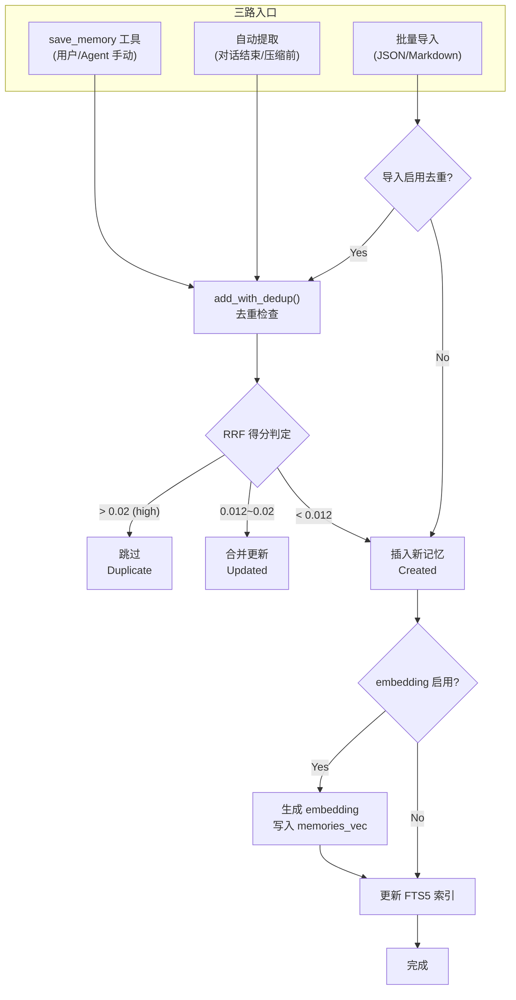
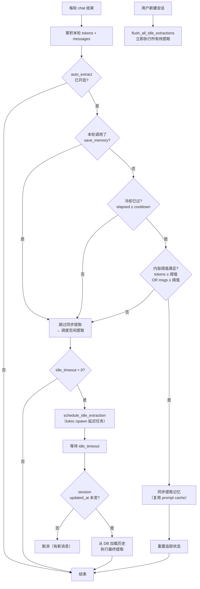
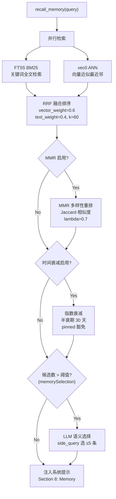
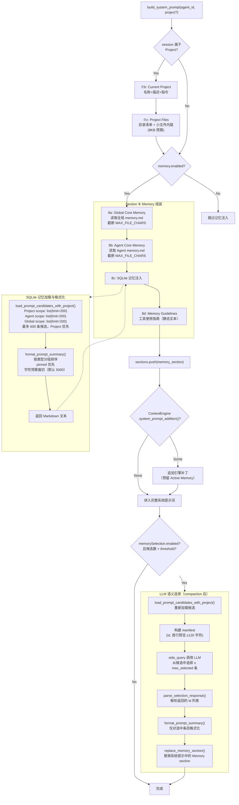

# 记忆系统架构
> 返回 [文档索引](../README.md) | 更新时间：2026-04-28

## 概述

记忆系统基于 **SQLite + FTS5 + sqlite-vec** 构建混合检索引擎，为 AI 助手提供跨会话的长期记忆能力。支持关键词全文检索与向量近似最近邻（ANN）检索的融合排序，通过 RRF（Reciprocal Rank Fusion）算法合并两路结果。记忆可由用户手动保存、Agent 自动提取，或通过文件批量导入。记忆支持 **三级作用域**（Global / Agent / Project），项目级记忆在所属会话间共享但与其他项目隔离。

## 数据模型

### MemoryEntry

| 字段 | 类型 | 说明 |
|------|------|------|
| `id` | `i64` | 自增主键 |
| `memory_type` | `MemoryType` | 记忆类型：`User`（用户信息）/ `Feedback`（偏好与反馈）/ `Project`（项目上下文）/ `Reference`（参考资料） |
| `scope` | `MemoryScope` | 作用域：`Global`（全局共享）/ `Agent { id }`（特定 Agent 私有）/ `Project { id }`（特定项目共享） |
| `content` | `String` | 记忆内容文本 |
| `tags` | `Vec<String>` | 标签列表，JSON 序列化存储 |
| `source` | `String` | 来源：`"user"`（手动保存）/ `"auto"`（Agent 自动提取）/ `"import"`（批量导入） |
| `source_session_id` | `Option<String>` | 来源会话 ID |
| `pinned` | `bool` | 是否置顶（置顶记忆始终优先注入系统提示，时间衰减豁免） |
| `attachment_path` | `Option<String>` | 附件文件绝对路径（存储于 `~/.hope-agent/memory_attachments/`） |
| `attachment_mime` | `Option<String>` | 附件 MIME 类型（如 `image/jpeg`、`audio/mpeg`） |
| `created_at` | `String` | 创建时间 |
| `updated_at` | `String` | 更新时间 |
| `relevance_score` | `Option<f32>` | 检索时填充的相关性得分，不持久化 |

## 存储后端

### SQLite 表结构

**主表 `memories`**：

```sql
CREATE TABLE memories (
    id INTEGER PRIMARY KEY AUTOINCREMENT,
    memory_type TEXT NOT NULL DEFAULT 'user',
    scope_type TEXT NOT NULL DEFAULT 'global',
    scope_agent_id TEXT,
    scope_project_id TEXT,           -- 项目作用域 ID（scope_type='project' 时使用）
    content TEXT NOT NULL,
    tags TEXT NOT NULL DEFAULT '[]',
    source TEXT NOT NULL DEFAULT 'user',
    source_session_id TEXT,
    embedding BLOB,
    pinned INTEGER NOT NULL DEFAULT 0,
    attachment_path TEXT,             -- 附件文件绝对路径
    attachment_mime TEXT,             -- 附件 MIME 类型
    created_at TEXT NOT NULL,
    updated_at TEXT NOT NULL
);
```

**索引**：
- `idx_memories_pinned` — `(pinned DESC, updated_at DESC)`，置顶记忆优先
- `idx_memories_scope` — `(scope_type, scope_agent_id)`，按作用域过滤
- `idx_memories_scope_project` — `(scope_type, scope_project_id)`，按项目作用域过滤
- `idx_memories_type` — `(memory_type)`，按类型过滤
- `idx_memories_updated` — `(updated_at DESC)`，按更新时间排序

**FTS5 全文索引 `memories_fts`**：

```sql
CREATE VIRTUAL TABLE memories_fts USING fts5(
    content, tags,
    content='memories',
    content_rowid='id',
    tokenize='unicode61'
);
```

通过 `AFTER INSERT / UPDATE / DELETE` 触发器自动与主表保持同步。

**向量表 `memories_vec`**：

使用 sqlite-vec 扩展创建的 `vec0` 虚拟表，存储 `float[N]` 维度的 embedding 向量，支持 ANN（近似最近邻）检索。维度 N 由当前 embedding 提供者决定。

**Embedding 缓存表 `embedding_cache`**：

```sql
CREATE TABLE embedding_cache (
    hash TEXT NOT NULL,
    provider TEXT NOT NULL,
    model TEXT NOT NULL,
    embedding BLOB NOT NULL,
    dimensions INTEGER NOT NULL,
    created_at TEXT NOT NULL DEFAULT (datetime('now')),
    PRIMARY KEY (hash, provider, model)
);
```

按内容哈希 + 提供者 + 模型名做联合主键，避免重复计算。超过 `max_entries`（默认 10000）时自动清理最旧条目。

### 并发模型

- **1 个写连接**（`Mutex<Connection>`）：独占写入，同时作为读连接的 fallback
- **4 个读连接**（`Vec<Mutex<Connection>>`，`READ_POOL_SIZE = 4`）：并发只读查询
- **WAL 模式**：读写互不阻塞
- **Round-robin + fallback**：读请求通过 `AtomicUsize` 轮询分配到读连接池，锁竞争时退化到写连接

### 三级作用域与项目隔离

记忆支持三种作用域，优先级从高到低：

| 作用域 | 枚举值 | SQL 列 | 可见范围 |
|--------|--------|--------|---------|
| **Project** | `Project { id }` | `scope_type='project'`, `scope_project_id='{id}'` | 该项目下所有会话 |
| **Agent** | `Agent { id }` | `scope_type='agent'`, `scope_agent_id='{id}'` | 使用该 Agent 的所有会话 |
| **Global** | `Global` | `scope_type='global'` | 所有会话 |

**隔离保证**：
- `recall_memory` / `save_memory` 工具通过 `scope_where(agent_id)` 查询，**有意排除 Project scope**，防止项目记忆在无关会话中泄漏
- 项目记忆仅通过显式 `MemoryScope::Project { id }` 或 `load_prompt_candidates_with_project()` 访问
- `save_memory` 工具支持 `scope="project"` 参数，从当前会话的 `session.project_id` 自动解析项目 ID

**MemoryBackend trait 扩展**（`memory/traits.rs`）：
- `load_prompt_candidates_with_project(agent_id, project_id, shared)` — 加载候选时按 Project → Agent → Global 优先级排序
- `build_prompt_summary_with_project(agent_id, project_id, shared, budget)` — 格式化 prompt 时项目记忆最先保留
- `count_by_project(project_id)` — 统计项目记忆数

## 三路创建

### 创建流程总览



### 1. save_memory 工具 → `add_with_dedup()`

用户或 Agent 通过 `save_memory` 工具显式保存记忆，支持 `scope` 参数指定作用域（`"global"` / `"agent"` / `"project"`）。`scope="project"` 时从当前会话的 `session.project_id` 自动解析项目 ID，无项目上下文则返回错误。自动执行去重检查：

| RRF 得分范围 | 行为 |
|-------------|------|
| `> threshold_high`（默认 0.02） | **跳过** — 判定为重复，返回 `Duplicate { existing_id, score }` |
| `threshold_merge..threshold_high`（默认 0.012..0.02） | **合并** — 更新已有记忆的内容，返回 `Updated { id }` |
| `< threshold_merge` | **插入** — 创建新记忆，返回 `Created { id }` |

### 2. 自动提取

Agent 在以下时机自动提取记忆：

- **Tier 3 压缩前**（`flush_before_compact = true`）：在 LLM 摘要压缩对话历史之前，先提取有价值的记忆
- **阈值触发**：对话过程中，当冷却时间已过且内容阈值满足时，在 assistant 最终消息落库后后台调度提取

自动提取特性：
- 阈值触发的提取通过后台任务执行，不阻塞聊天流结束与前端 loading 状态
- **项目感知作用域**：`resolve_extract_scope(session_id, agent_id)` 查询当前会话的 `project_id`，有则写入 `MemoryScope::Project { id }`，否则回退 `MemoryScope::Agent { id }`。保证项目知识自动积累到项目作用域
- **冷却 + 阈值双层触发**（自上次提取以来，两个条件需同时满足）：
  - 冷却保护：时间间隔 ≥ `extract_time_threshold_secs`（默认 300 秒 = 5 分钟）
  - 内容触发（任一满足）：Token 累积 ≥ `extract_token_threshold`（默认 8000）或 消息条数 ≥ `extract_message_threshold`（默认 10 条）
- **互斥保护**：检测到当前轮次已调用 `save_memory` / `update_core_memory` 工具时，跳过自动提取
- **空闲超时兜底**：当阈值提取因门控未满足而跳过时，调度延迟任务（默认 30 分钟）。会话空闲超时后从 DB 加载历史执行最终提取。新建会话时立即 flush 所有待提取的空闲会话



### 3. 导入

支持两种格式的批量导入：

- **JSON 格式**：`NewMemory` 数组的 JSON 文件
- **Markdown 格式**：按 section 分隔的 Markdown 文件

导入时可选启用去重（`dedup` 参数），返回 `ImportResult { created, skipped_duplicate, failed, errors }`。

## 混合检索引擎

### 检索流水线总览



### 双路并行检索

1. **FTS5 BM25 关键词检索**：基于 `memories_fts` 表的全文匹配，返回按 BM25 得分排序的结果
2. **vec0 ANN 向量检索**：基于 `memories_vec` 表的近似最近邻检索，需要 embedding 提供者已配置

两路检索并行执行，结果通过 RRF 算法融合。

### RRF 融合排序

```
rrf_score = vector_weight / (k + rank_vec) + text_weight / (k + rank_fts)
```

- `vector_weight`：向量检索权重（默认 0.6）
- `text_weight`：关键词检索权重（默认 0.4）
- `k`：RRF 常数（默认 60），k 越大各排名权重越均匀

### 可选 MMR 多样性重排

启用后（默认开启），对 RRF 融合结果进行 MMR（Maximal Marginal Relevance）重排，减少返回结果中的冗余：

- 使用 **Jaccard 系数**计算文本间相似度
- `lambda` 参数控制相关性与多样性的权衡：0 = 最大多样性，1 = 最大相关性（默认 0.7）

### 可选时间衰减

启用后（默认关闭），对检索得分施加指数时间衰减：

- 半衰期：`half_life_days`（默认 30 天），超过半衰期后得分减半
- **pinned 记忆豁免**：置顶记忆不受时间衰减影响，始终保持原始得分

## Embedding 配置模型

> **重要变更**：旧版基于 `embedding.providerType=Auto` 自动优先级机制已全部移除。当前是**多模型显式配置 + 用户选活跃模型**，由两组独立配置驱动：
> - `AppConfig.embedding_models: Vec<EmbeddingModelConfig>` — 用户已配置的多个 embedding 模型
> - `AppConfig.memory_embedding: EmbeddingSelection { enabled, model_config_id, active_signature, last_reembedded_signature }` — 当前给"记忆"用哪个模型

### EmbeddingModelConfig

每条配置一个独立的 embedding 模型实例。字段精简为：

| 字段 | 类型 | 说明 |
|---|---|---|
| `id` | `String` | 模型配置 id（被 `memory_embedding.model_config_id` 引用） |
| `name` | `String` | 显示名 |
| `provider_type` | `EmbeddingProviderType` | `Local` / `OpenaiCompatible` / `Google` |
| `api_model` / `api_dimensions` / `api_base_url` / `api_key` | … | 各 provider 自身配置 |
| `source` | `Option<String>` | 创建自哪个模板预设（GUI 一键安装路径用于回溯） |

`provider_type` 枚举只剩 3 类（不再有 `Auto`）：

| 类型 | 说明 | 示例 |
|---|---|---|
| `Local` (fastembed) | 本地 ONNX 模型，零 API 成本 | bge-small-en / multilingual-e5-small |
| `OpenaiCompatible` | OpenAI `/v1/embeddings` 兼容 | OpenAI / Jina / Cohere / SiliconFlow / Voyage / Mistral / Ollama 等 |
| `Google` | Google Gemini Embedding API（独立格式） | gemini-embedding-001 |

> Voyage / Mistral 单独 ProviderType 已**不存在**——它们都是 `OpenaiCompatible` 类型下的预设模板（`source`）。

### EmbeddingSelection

```rust
pub struct EmbeddingSelection {
    pub enabled: bool,                            // 总开关
    pub model_config_id: Option<String>,          // 引用 embedding_models[].id
    pub active_signature: Option<String>,         // 当前活跃模型的 signature
    pub last_reembedded_signature: Option<String>,// 上次完成重嵌入的 signature（驱动 needsReembed 指示）
}
```

`set_memory_embedding_default(id)` 是切换活跃模型的单一入口：

1. 写 `memory_embedding.model_config_id`
2. 调用 `prune_embedding_cache_to_signature(new_signature)` 清理 `embedding_cache`（防止旧 signature 命中）
3. 标记 `needsReembed` 指示器（前端弹"模型变了，要不要重建向量"）

### 模板选择器（commit ae804aca / 52b27de4）

`embedding_model_templates()` 返回内建预设模板列表（来源：[`memory/embedding/config.rs`](../../crates/ha-core/src/memory/embedding/config.rs)），覆盖：

| 模板 | provider_type | 默认模型 | 维度 |
|---|---|---|---|
| OpenAI | OpenaiCompatible | text-embedding-3-small | 1536 |
| Google Gemini | Google | gemini-embedding-001 | 768 |
| Jina AI | OpenaiCompatible | jina-embeddings-v3 | 1024 |
| Cohere | OpenaiCompatible | embed-multilingual-v3.0 | 1024 |
| SiliconFlow | OpenaiCompatible | BAAI/bge-m3 | 1024 |
| Voyage AI | OpenaiCompatible | voyage-3 | 1024 |
| Mistral | OpenaiCompatible | mistral-embed | 1024 |
| Ollama | OpenaiCompatible | nomic-embed-text | 768 |

Settings → "embedding quick card"（commit f64cab52）作为快速入口，首次使用引导用户挑模板（commit 52b27de4 `prompt before embedding model setup`）。

### 本地模型

`local_embedding_models()` 返回内建本地候选：

| 模型 ID | 名称 | 维度 | 大小 | 最低内存 | 语言 |
|---|---|---|---|---|---|
| `multilingual-e5-small` | Multilingual E5 Small | 384d | 90MB | 8GB | 多语言 |
| `bge-small-zh-v1.5` | BGE Small Chinese v1.5 | 384d | 33MB | 4GB | 中文 |
| `bge-small-en-v1.5` | BGE Small English v1.5 | 384d | 33MB | 4GB | 英文 |
| `bge-large-en-v1.5` | BGE Large English v1.5 | 1024d | 335MB | 16GB | 英文 |

下载/加载经 `local_embedding.rs` 走 `local_model_jobs.rs` 后台任务体系（详见 [本地模型加载](local-model-loading.md)）。

### 多模态支持

- **Gemini** 支持图片和音频的 embedding（通过 `embed_multimodal()` 接口）
- 其他提供者 fallback 为文本描述的 embedding（使用 `label` 字段）
- 支持的图片格式：jpg, jpeg, png, webp, gif, heic, heif
- 支持的音频格式：mp3, wav, ogg, opus, m4a, aac, flac
- 最大文件大小：`max_file_bytes`（默认 10MB）

## LLM 语义选择

当候选记忆数量超过阈值（`threshold`，默认 8 条）时，通过 `side_query` 调用 LLM 从候选列表中选择最相关的记忆：

- 最多选择 `max_selected` 条（默认 5）
- 选择在 compaction 后、cache 快照前执行，确保精简后的系统提示被缓存
- **opt-in 配置**：`memorySelection.enabled = true` 启用
- 失败时退化为全量注入（无记忆丢失）

选择 prompt 格式：向 LLM 提供用户当前消息 + 候选记忆列表（id: preview），要求返回 JSON 数组 `[3, 7, 1]`。

## 无痕会话（Incognito）联动

`sessions.incognito = 1` 时，记忆系统全部被动行为短路。详细行为见 [Session 系统 §无痕会话](session.md#无痕会话incognito)。

| 路径 | incognito=1 行为 |
|---|---|
| `format_prompt_summary()` 注入 SQLite 记忆 | 跳过整段 |
| `refresh_active_memory_suffix()` Active Memory | `agent/mod.rs` 入口短路（清空 suffix 不调 side_query） |
| `memory_extract` 自动提取（inline / idle / flush-before-compact 三触发） | 全部跳过 |
| Awareness suffix（跨会话） | 入口短路（不参与候选采集，不向 peer 置脏位） |
| Dreaming scanner | 候选过滤掉无痕 session 的 source_session_id |

**关闭即焚的记忆侧防御**：`update_session_incognito` 在 `project_id IS NOT NULL` 或 `channel_info IS NOT NULL` 时直接 `Err`——避免无痕态把项目记忆 / IM 记忆强行隔离的状态裂缝。

> 用户显式调 `save_memory` / `recall_memory` 工具仍然工作——"无痕"只是关闭被动行为，不剥夺用户主动权。

## Memory Budget 4 级优先级

`effective_memory_budget(agent, global)` 是 system prompt 注入预算的单一入口，按以下优先级消费总字符预算：

1. **Guidelines**（最高，不可裁剪）— Memory 工具使用指南静态文本
2. **Agent memory.md** — `~/.hope-agent/agents/{id}/memory.md` 截断到 `MAX_FILE_CHARS`
3. **Global memory.md** — `~/.hope-agent/memory.md` 截断到 `MAX_FILE_CHARS`
4. **SQLite 记忆**（最易被裁）— `format_prompt_summary` 输出，按 `Project > Agent > Global > pinned 优先`

> **重要约束**：`recall_memory` / `memory_get` 工具返回**完整原文**，预算仅约束 system prompt 注入路径。模型在工具调用里看到的内容不被预算裁。

## Recall Summary 召回摘要

> 源：[`memory/recall_summary.rs`](../../crates/ha-core/src/memory/recall_summary.rs)

混合检索可能一次返回十几条相关记忆原文，全部塞进 system prompt 既费 token 又冗长。Recall Summary 在召回命中数较多时再走一次 bounded side_query，把那批记忆**压成一段 ≤400 字符的洞察段落**再注入。

### 触发条件

- 命中数 ≥ `min_hits`（默认 3）
- 总字符量 > 预算（避免短结果做无意义压缩）
- opt-in：`AppConfig.recall_summary.enabled` 为 true（默认关，顶层字段，不在 `memorySelection` 下）。设置页 [`memory-panel/RecallSummarySection.tsx`](../../src/components/settings/memory-panel/RecallSummarySection.tsx) 是这个开关的第一个 GUI 入口

### 模型解析与失败回退

经 [`crate::automation::run`](automation-model.md)（purpose `recall_summary`）执行——`recall_summary.model_override`（`ModelChain`）非空则用它，否则落 `function_models.automation` → 聊天全局默认模型，带真正的跨模型降级重试。调用失败 / 超时 / 输出无效 → 回退为原始命中列表的拼接（不丢记忆）。

### 与 LLM 语义选择的区别

| 路径 | 输入 | 输出 |
|---|---|---|
| LLM 语义选择 | 候选 ≤5 条 id | id 数组（哪几条最相关）—— 还是逐条注入 |
| Recall Summary | 已选定的命中记忆全文 | 单段 ≤400 字符的合成摘要 —— 注入一段 |

两个路径独立 opt-in，可以叠加用：先选最相关 5 条，再压成一段。

## 反省式记忆（COMBINED_EXTRACT_PROMPT）

主动记忆提取除了"事实抽取"还要做"用户画像更新"。两件事如果分两次 side_query 跑，token 翻倍 + 时序复杂。`COMBINED_EXTRACT_PROMPT` 让一次 side_query 同时返回 facts + profile：

```jsonc
// LLM 返回结构（伪 JSON）
{
  "facts":   [{ "type": "...", "content": "..." }, ...],
  "profile": { "summary": "...", "preferences": [...] }
}
```

- `facts` 走原 add_with_dedup 流程入库
- `profile` 渲染成 system prompt 的独立 `## User Profile` 段（不用 "About You"——"You" 在 LLM system prompt 里默认指 assistant，会引发角色混淆）
- 配置：`enable_reflection`（默认 true）；关闭时回退到只抽 facts

## Dreaming 离线固化

> **下一代 Dreaming 的完整架构**（结构化 claim 层 / Deep resolver / Memory Profile / Context Pack 注入 / Lucid Review 纠错 / 确定性评测）见 [`dreaming.md`](dreaming.md)——单一真相源。本节只覆盖与记忆召回直接相关的一代 Light 固化机制。

> 源：[`memory/dreaming/`](../../crates/ha-core/src/memory/dreaming/)（含 `config.rs` / `narrative.rs` / `pipeline.rs` / `promotion.rs` / `scanner.rs` / `scoring.rs` / `triggers.rs` 7 个文件）

主对话热路径的自动提取（`memory_extract.rs`）只看最近一段对话，对全库的"哪些记忆值得 pin / 哪些可以归档"无概念。Dreaming 是**离线 LLM 评估器**，扫候选记忆 + 让 LLM 打分 + 自动 pin 高分项 + 写"梦境日记"留给用户审阅。

### 三种触发

| 触发 | 来源 | 用途 |
|---|---|---|
| `idle` | 进程空闲一段时间后 | 后台机会主义 |
| `cron` | 用户定时任务 | 计划性夜间巡查 |
| `manual` | UI 手动点 / 工具调用 | 立即跑一次 |

### 流程

1. **Scanner** 扫 `memories` 表选候选（按时间衰减、近期访问、tags 等组合规则）
2. **Scoring** bounded side_query 让小模型对候选打分（重要性 / 时效性 / 关联度）
3. **Promotion** 按打分阈值决定：高分 → `pinned = 1`；低分 → 标 archive 或保留
4. **Narrative** 把本轮评估结果渲染为 markdown diary，落 `~/.hope-agent/memory/dreams/{date}.md`

### 并发保护

`DREAMING_RUNNING: AtomicBool` + RAII guard 确保同进程任意时刻最多一轮 dreaming：

```rust
struct DreamGuard;
impl Drop for DreamGuard {
    fn drop(&mut self) {
        DREAMING_RUNNING.store(false, Ordering::Release);
    }
}
```

无法 acquire guard 时直接 skip 本轮，不阻塞 scheduler。

### 默认开启 + 触发器

`dreaming.enabled` 默认 **true**。三种触发器：

- **Idle**（默认开，30 分钟阈值）：`app_init.rs` 起 60s ticker，闲置达阈值就跑一次。
- **Cron**（默认关，`0 0 3 * * *` 6 字段）：[`memory/dreaming/cron_loop.rs`](../../crates/ha-core/src/memory/dreaming/cron_loop.rs) 监听 `config:changed { category: "dreaming" }`，按 cron 表达式 `tokio::time::sleep_until` 后调 `manual_run(Cron)`。配置变化即唤醒重排（`Notify`）。
- **Manual**：Dashboard "Run now" 按钮 + ha-settings skill。

### GUI 入口

- **Settings → Memory → Dreaming Tab**（[`src/components/settings/memory-panel/DreamingPanel.tsx`](../../src/components/settings/memory-panel/DreamingPanel.tsx)）：所有配置项 + 状态条（最近一次 cycle + idle 倒计时）。状态条订阅 `dreaming:cycle_complete` 事件 + `dreaming_last_report` / `dreaming_idle_status` invoke。Cron 表达式复用 [`CronExpressionBuilder`](../../src/components/cron/CronExpressionBuilder.tsx)（hourly / daily / weekly / monthly / custom 5 档）。
- **Dashboard → Dreaming Tab**：仅运行历史 + 手动触发，与 Settings 职责分离。
- **ha-settings skill**：仍可在对话里改，与 GUI 通过 `config:changed` 双向同步。

## Active Memory 主动召回

> 源：[`agent/active_memory.rs`](../../crates/ha-core/src/agent/active_memory.rs)

被动 system prompt 注入对"用户偶尔提到一次但当前问题相关"的记忆覆盖不够，因为预算有限会被裁掉。Active Memory 在每轮 user turn 之前调 `refresh_active_memory_suffix(user_text)` **针对当前提问主动召回一组相关记忆**，作为独立 cache block 注入。

**默认关闭**（`enabled=false`）——开启会让每轮 user turn 在主请求前先跑一次 `side_query`（最坏等到 `timeout_ms`，默认 8s），有可见的发送延迟。需要召回增强的用户在 Memory tab 主动打开。关闭时静态 system prompt 段里的被动记忆注入仍然有效。

### 调用时机与预算

- 每轮 user turn 进入时调用，不是流式进行中
- 内部走 bounded `side_query` 让小模型从候选集挑相关项，**严格预算**（不命中预算就放弃，不阻塞主流程）
- 命中后渲染成 `## Active Memory` markdown 段落

### 三级 scope 候选

按 Project → Agent → Global 顺序取候选并合并去重（项目相关在前），交给 side_query 评估相关性。Memory Budget 4 级优先级（见下方"Memory Budget"）裁剪整体规模。

### 15s TTL 缓存

同一会话里连续 15s 内的 turn 复用上一次召回结果，避免短时间多次提问反复跑 side_query。Cache 按 `session_id` 隔离。

### 独立 cache block 注入

注入位置在 system prompt 中是**独立 cache block**（与静态前缀分开）——这样静态前缀缓存仍然命中，Active Memory 段单独失效，不会因为每轮变更整段失效造成 prompt cache miss 雪崩。

### 与 Reflection 的关系

Active Memory **只读**——不写记忆、不主动提取。写入路径见下方"反省式记忆"。

### Active Memory v2（候选扩展到结构化 claim）

> 完整设计见 [`dreaming.md`](dreaming.md) 的「系统提示注入」节。

`ActiveMemoryConfig.include_claims`（per-agent，默认关）开启后，每轮召回的候选除历史记忆外并取结构化 claim：`shortlist_claim_candidates` 按同一 Project → Agent → Global scope 顺序调 `search_claims`（已 effective-active + scope 过滤），与 memory 候选合并进 `build_recall_prompt`（claim 带 `claim:<type>` 标签）。LLM 仍选 1 句注入 `## Active Memory`（复用 v1 单条机制，不改解析 / cache）。

- **过期 claim 不回灌**：候选经 `search_claims` 的 effective-active 过滤，已过期 / superseded 的 claim 不会经此回到 prompt（effective-active 红线）。
- **incognito 归零**：`refresh_active_memory_suffix` 开头 short-circuit，压过一切 claim 候选源。
- 这是 Context Pack「Relevant Claims（动态）」的实际承载——query-dependent 召回走动态 suffix（非静态 prefix），不打爆 prompt cache。

## 内存向量重建（后台任务）

> 源：[`memory/reembed_job.rs`](../../crates/ha-core/src/memory/reembed_job.rs)（commit `af377a7b` / `6d89bfb7` / `2a055ef1` / `de0797ad`）

切换活跃 embedding 模型后，存量记忆的向量按旧维度/旧 signature 算的，需要按新模型批量重建。`start_memory_reembed_job(model_config_id, mode)` 包装成 `LocalModelJobKind::MemoryReembed` 走统一后台任务体系（详见 [本地模型加载](local-model-loading.md)），UI 看到的就是与模型下载同体系的进度条 + 取消按钮。

### 双模式

| 模式 | 行为 | 中途搜索可用？ |
|---|---|---|
| `KeepExisting` | 原行原地覆写 `embedding` 字段，按 batch 推进 | ✅ 旧向量仍可用，搜索不中断 |
| `DeleteAll` | 启动时先 `clear_all_embeddings()` 全清空再开始填充 | ❌ 重建期间纯 FTS5 / 不命中 vec0 |

`DeleteAll` 适用：模型升级 + 维度变化 + 不能容忍新旧混存的场景（部分失败后留下"半旧半新"风险）。`KeepExisting` 是默认。

### 并发互斥

**Invariant：任何时刻最多一个 `MemoryReembed` 在非终态**。新 spawn 前先把已有 active 的 reembed 调 `cancel_job` 收尾，让之前的 runner 在下一个 batch boundary 退出，SQLite write 连接 mutex 串行化重叠。

### Phase key（与前端 i18n 同步）

```rust
pub const PHASE_REEMBED_KEEP:  &str = "reembed-keep";
pub const PHASE_REEMBED_FRESH: &str = "reembed-fresh";
```

前端 [`src/types/local-model-jobs.ts::PHASE_KEY`](../../src/types/local-model-jobs.ts) 必须保持同名，drift 会让本地化 phase label 默默降级为原始字符串。

### needsReembed 指示器清除

成功完成时写 `last_reembedded_signature = current_model.signature()`，前端按 `last_reembedded_signature == active_model.signature()` 判定是否还需要重建（红点消失）。

## 系统提示注入

记忆通过 `format_prompt_summary()` 格式化为 Markdown 并注入系统提示的 Section 8。会话属于某个项目时，系统提示还会在 Memory 之前注入项目上下文（Section ⑦b/⑦c），记忆加载改用 `load_prompt_candidates_with_project()` 按 Project → Agent → Global 优先级排序。

### 注入流程



### Context Pack（结构化 claim 注入）

> 完整设计见 [`dreaming.md`](dreaming.md) 的「系统提示注入」节。

在 v1 注入流程之上叠加结构化 claim，与 legacy memory 段共存于同一 `# Memory` 段、同一 `effective_memory_budget` 预算池：`build_context_pack`（`memory/dreaming/context_pack.rs`）取高 salience（`>= PINNED_MIN_SALIENCE`，默认 0.7）active claim 渲染为 `## Pinned Memory` 静态段（复用首个 cache breakpoint，每行经 `sanitize_for_prompt`）；`covered_by_active_claim_memory_ids` 把被 active managed claim 覆盖的 legacy memory 从 SQLite 段排除（**单一来源 dedup**，阈值同读 `PINNED_MIN_SALIENCE`，`user_pinned` link / `memories.pinned=1` 豁免）；query-dependent 的 Relevant Claims 不进静态 prefix，由 Active Memory v2 动态承担。预算优先级 Core > Pinned >（Profile + legacy）。claim 检索复用混合引擎但**独立存储**（`memory_claims_fts` / `memory_claims_vec`），向量复用记忆嵌入模型。

## 用户纠错闭环（Lucid Review）

> 完整设计见 [`dreaming.md`](dreaming.md) 的「Lucid Review 用户纠错闭环」节。

用户对结构化 claim 的 approve / edit / reject / mark-outdated / move-scope / pin / forget 纠错——**纯 owner 平面、无 agent 工具面**（模型不能自改自己的记忆），唯一入口 `claims::review`。每个动作落 `trigger=user_correction` 审计（before/after 完整字段快照）+ 发 `memory:claim_changed` 实时刷新 Dashboard；approve / edit 把 claim 提到 `user_confirmed`（confidence 0.95）。

## 确定性评测（Golden Fixtures）

> 完整设计见 [`dreaming.md`](dreaming.md) 的「确定性评测」节。

下一代 Dreaming 的 claim 读路径 / effective-status / hidden-set / scope 过滤 / evidence 授权等安全红线由 deterministic golden-fixture eval 守护（[`tests/dreaming_eval.rs`](../../crates/ha-core/tests/dreaming_eval.rs) + 7 个 `tests/fixtures/dreaming/*.json`，跑默认 CI）。改动上述读路径时须在 fixtures 加 case 或保既有绿。

### 输出格式

```markdown
# Memory

## About the User
- ★ [pinned memory content]
- [regular memory content]

## Preferences & Feedback
- ...

## Project Context
- ...

## References
- ...
```

### 注入量控制

| 参数 | 值 | 可配置 | 说明 |
|------|-----|--------|------|
| 候选加载上限（Agent scope） | `200` 条 | 否（硬编码） | `load_prompt_candidates` 对 Agent 作用域的 `list()` 调用 |
| 候选加载上限（Global scope） | `200` 条 | 否（硬编码） | `load_prompt_candidates` 对 Global 作用域的 `list()` 调用 |
| 字符预算 `prompt_budget` | `5000` chars | 是（Agent 级，`agent.json` → `memory.promptBudget`） | `format_prompt_summary()` 的字符上限，超出追加 `[... truncated ...]` |
| Core Memory 截断 | `MAX_FILE_CHARS` | 否（硬编码） | Global/Agent Core Memory MD 文件的截断上限 |
| LLM 语义选择 `max_selected` | `5` 条 | 是（`config.json` → `memorySelection.maxSelected`） | LLM 从候选中最多选几条 |

注入流程：`load_prompt_candidates`（最多 400 条候选）→ `format_prompt_summary`（字符预算裁切）→ 注入 Section 8。若启用 LLM 语义选择，候选先经 LLM 筛选到 ≤5 条再格式化。

### 特性

- 按类型分组（User → Feedback → Project → Reference），每组内 pinned 优先
- 字符预算控制，超出时追加 `[... truncated ...]`
- **Prompt 注入防护**：`sanitize_for_prompt()` 检测并过滤可疑指令注入模式（如 "ignore previous instructions"），转义特殊 LLM token

## 导入/导出

- **JSON 导出/导入**：`NewMemory` 数组格式，保留完整字段
- **Markdown 导出**：按 scope 和 type 分 section 输出人类可读格式
- 导入支持可选去重（复用 `add_with_dedup()` 逻辑）

## 配置项

| 配置路径 | 字段 | 默认值 | 说明 |
|---------|------|--------|------|
| `embedding` | `enabled` | `false` | 启用向量检索 |
| `embedding` | `providerType` | `"openai-compatible"` | 提供者类型 |
| `embedding` | `apiBaseUrl` / `apiKey` / `apiModel` / `apiDimensions` | — | API 模式配置 |
| `embedding` | `localModelId` | — | 本地模型 ID |
| `hybridSearch` | `vectorWeight` | `0.6` | 向量检索权重 |
| `hybridSearch` | `textWeight` | `0.4` | 关键词检索权重 |
| `hybridSearch` | `rrfK` | `60.0` | RRF 常数 k |
| `mmr` | `enabled` | `true` | 启用 MMR 多样性重排 |
| `mmr` | `lambda` | `0.7` | MMR lambda（0=多样性，1=相关性） |
| `temporalDecay` | `enabled` | `false` | 启用时间衰减 |
| `temporalDecay` | `halfLifeDays` | `30.0` | 半衰期（天） |
| `memorySelection` | `enabled` | `false` | 启用 LLM 语义选择 |
| `memorySelection` | `threshold` | `8` | 触发选择的候选数阈值 |
| `memorySelection` | `maxSelected` | `5` | 最大选择数 |
| `dedup` | `thresholdHigh` | `0.02` | 去重跳过阈值 |
| `dedup` | `thresholdMerge` | `0.012` | 去重合并阈值 |
| `multimodal` | `enabled` | `false` | 启用多模态 embedding |
| `multimodal` | `modalities` | `["image", "audio"]` | 支持的模态 |
| `multimodal` | `maxFileBytes` | `10485760` (10MB) | 最大附件大小 |
| `embeddingCache` | `enabled` | `true` | 启用 embedding 缓存 |
| `embeddingCache` | `maxEntries` | `10000` | 最大缓存条目数 |
| `memoryExtract` | `autoExtract` | `true` | 启用自动提取 |
| `memoryExtract` | `flushBeforeCompact` | `true` | 压缩前提取 |
| `memoryExtract` | `extractTokenThreshold` | `8000` | 自上次提取累计 token 触发阈值 |
| `memoryExtract` | `extractMessageThreshold` | `10` | 自上次提取累计消息数触发阈值 |
| `memoryExtract` | `extractTimeThresholdSecs` | `300` | 提取冷却（秒），未到不触发 |
| `memoryExtract` | `extractIdleTimeoutSecs` | `1800` | 会话空闲超时（秒）触发收尾提取，`0` = 关 |

## 硬编码参数

以下参数在源码中以常量或字面量形式定义，修改需要改代码并重新编译。

### 系统提示注入

| 参数 | 值 | 位置 | 说明 |
|------|-----|------|------|
| 候选加载上限（per scope） | `200` | `memory/sqlite/trait_impl.rs` | `load_prompt_candidates` 每个 scope 的 `list()` limit |

### SQLite 连接池

| 参数 | 值 | 位置 | 说明 |
|------|-----|------|------|
| `READ_POOL_SIZE` | `4` | `memory/sqlite/backend.rs` | 只读连接池大小 |

### Embedding HTTP 客户端

| 参数 | 值 | 位置 | 说明 |
|------|-----|------|------|
| Connect Timeout | `10s` | `memory/embedding/api_provider.rs` | HTTP 连接超时 |
| Request Timeout | `30s` | `memory/embedding/api_provider.rs` | HTTP 请求超时 |

### Embedding 批量处理

| 参数 | 值 | 位置 | 说明 |
|------|-----|------|------|
| Google Batch Size | `100` | `memory/embedding/api_provider.rs` | Google 单次批量 embedding 上限 |
| Batch API Max Size | `50,000` | `memory/embedding/api_provider.rs` | OpenAI Batch API 最大条目数 |
| Batch API Poll Interval | `5s` | `memory/embedding/api_provider.rs` | Batch 任务轮询间隔 |
| Batch API Timeout | `60 min` | `memory/embedding/api_provider.rs` | Batch 任务最大等待时间 |

### Embedding Token 上限

| 模型 | Token 上限 | 说明 |
|------|-----------|------|
| OpenAI (text-embedding-3-*、ada-002) | `8191` | — |
| Google (gemini-embedding-001、text-embedding-004) | `2048` | — |
| Google gemini-embedding-2-preview | `8192` | — |
| Voyage (voyage-3、voyage-code-3、voyage-4-large) | `32000` | — |
| Voyage voyage-3-lite | `16000` | — |
| Mistral mistral-embed | `8192` | — |
| Jina jina-embeddings-v3 | `8192` | — |
| Cohere embed-multilingual-v3.0 | `512` | — |
| Ollama nomic-embed-text | `8192` | — |
| BGE 系列 (BAAI/bge*) | `512` | — |
| 其他（默认） | `8192` | — |

文本截断公式：`max_tokens × 4` 字节（保守估算），定义于 `memory/embedding/utils.rs`。

### 自动记忆提取

| 参数 | 值 | 位置 | 说明 |
|------|-----|------|------|
| Prompt 最大提取条数 | `5` | `memory_extract.rs` | 单次提取 LLM 最多返回记忆数 |
| 提取取最近消息数 | `6` | `memory_extract.rs` | 发给 LLM 的最近消息条数 |
| 提取消息截断长度 | `500 chars` | `memory_extract.rs` | 每条消息截断上限 |
| Flush 最大提取条数 | `8` | `memory_extract.rs` | 压缩前 flush 提取上限 |
| Flush 消息总字符上限 | `8,000 chars` | `memory_extract.rs` | Flush 输入的总字符预算 |
| Flush 消息截断长度 | `800 chars` | `memory_extract.rs` | Flush 每条消息截断上限 |
| 解析提取结果上限 | `5` | `memory_extract.rs` | 从 LLM 响应中最多解析的条数 |

## 关键源文件

| 文件 | 说明 |
|------|------|
| `crates/ha-core/src/memory/mod.rs` | 模块入口与 re-exports |
| `crates/ha-core/src/memory/types.rs` | 数据结构定义（MemoryEntry, MemoryType, MemoryScope, 各配置类型） |
| `crates/ha-core/src/memory/traits.rs` | MemoryBackend trait + EmbeddingProvider trait |
| `crates/ha-core/src/memory/sqlite/backend.rs` | SQLite 后端实现（表创建、连接池、WAL） |
| `crates/ha-core/src/memory/sqlite/trait_impl.rs` | MemoryBackend trait 的 SQLite 实现 |
| `crates/ha-core/src/memory/sqlite/prompt.rs` | 系统提示注入格式化 + prompt 注入防护 |
| `crates/ha-core/src/memory/embedding/mod.rs` | Embedding 模块入口 |
| `crates/ha-core/src/memory/embedding/config.rs` | Embedding 配置、预设模板、本地模型定义 |
| `crates/ha-core/src/memory/embedding/local_provider.rs` | 本地 ONNX 模型提供者（fastembed-rs） |
| `crates/ha-core/src/memory/embedding/api_provider.rs` | API embedding 提供者（OpenAI 兼容 + Google） |
| `crates/ha-core/src/memory/embedding/fallback_provider.rs` | Fallback 提供者（主备切换） |
| `crates/ha-core/src/memory/embedding/factory.rs` | Embedding 提供者工厂（按 EmbeddingModelConfig 实例化具体 provider） |
| `crates/ha-core/src/memory/mmr.rs` | MMR 多样性重排实现 |
| `crates/ha-core/src/memory/selection.rs` | LLM 语义选择（prompt 构建 + 响应解析） |
| `crates/ha-core/src/memory/recall_summary.rs` | 召回结果压缩为 ≤400 字符洞察段（opt-in） |
| `crates/ha-core/src/memory/reembed_job.rs` | 内存向量重建后台任务（KeepExisting / DeleteAll 双模式 + 取消） |
| `crates/ha-core/src/memory/dreaming/` | 离线 LLM 评估器（scanner / scoring / promotion / narrative / triggers / pipeline / cron_loop / resolver / profile / context_pack）+ `store::record_user_action`（user_correction 审计 run） |
| `crates/ha-core/src/memory/claims/` | 结构化 claim 层：`store`（schema + 读 API + 纠错原语）/ `write`（双写 + canonicalize）/ `backfill` / `review`（用户纠错闭环 update_claim / forget_claim） |
| `crates/ha-core/src/memory/dreaming/eval.rs` | 确定性 golden-fixture 评测调度器（fixture 类型 + load_fixtures + evaluate，经公共 API 跑真实读路径） |
| `crates/ha-core/tests/fixtures/dreaming/*.json` | 7 个 golden fixture（scope/temporal/conflict/incognito/evidence/legacy-sync/基础），每个限定唯一 scope 命名空间 |
| `crates/ha-core/tests/dreaming_eval.rs` | 确定性评测集成测试（进程隔离独占 claim store global，跑默认 CI） |
| `src/components/dashboard/dreaming/ClaimReviewActions.tsx` | 可复用 claim 纠错工具栏（approve/edit/reject/mark-outdated/move-scope/pin/forget），Dashboard 队列 + Settings 详情共用 |
| `src/components/dashboard/dreaming/NeedsReviewQueue.tsx` | Dashboard Dreaming Center 的 needs_review 队列（监听 `memory:claim_changed` / `memory:review_required`） |
| `crates/ha-core/src/memory/import.rs` | 批量导入/导出（JSON + Markdown） |
| `crates/ha-core/src/memory/helpers.rs` | 辅助函数（加载配置等） |
| `crates/ha-core/src/memory_extract.rs` | 自动记忆提取逻辑（含 COMBINED_EXTRACT_PROMPT 反省式） |
| `crates/ha-core/src/agent/active_memory.rs` | Active Memory 主动召回（15s TTL + 三级 scope + bounded side_query） |
| `crates/ha-core/src/local_embedding.rs` | 本地 embedding 模型一键安装入口（走 `local_model_jobs.rs`） |
| `crates/ha-core/src/project/` | 项目系统（types / db / files），提供项目记忆的上层容器 |
| `crates/ha-core/src/context_compact/engine.rs` | ContextEngine trait，`system_prompt_addition()` 钩子已被 Active Memory 占用 |
| `src/components/sidebar/IconSidebar.tsx` | 记忆侧边栏入口（commit `9644311a`），点击进入记忆管理页 |
| `src/components/memory/VectorSearchStatus.tsx` | 检索流水线状态指示器（commit `6e0483e6`，区分 vec0 可用 vs 降级到 FTS5-only） |
| `src/types/local-model-jobs.ts` | `PHASE_KEY` 与 reembed_job.rs 的 `PHASE_REEMBED_*` 一一对应（drift 会让 i18n phase label 降级为原字符串） |
