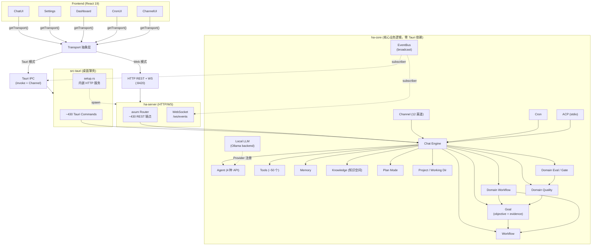
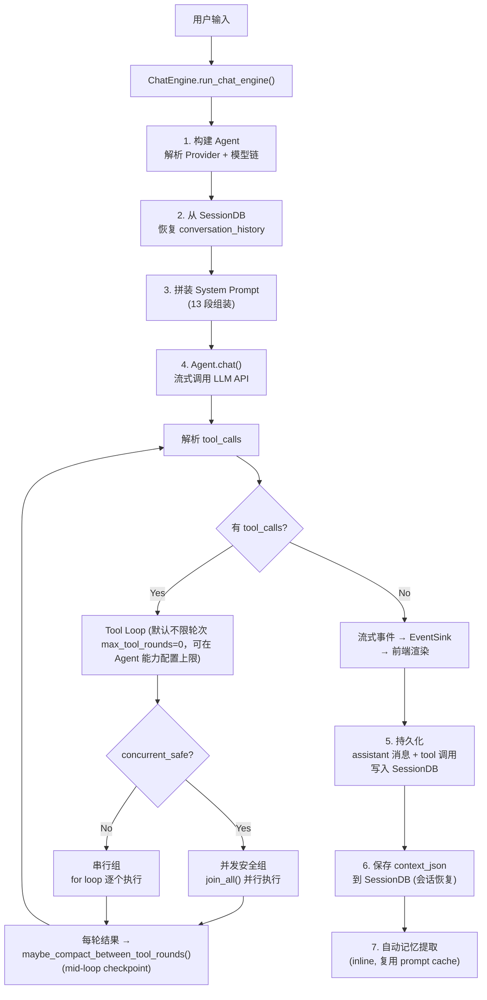
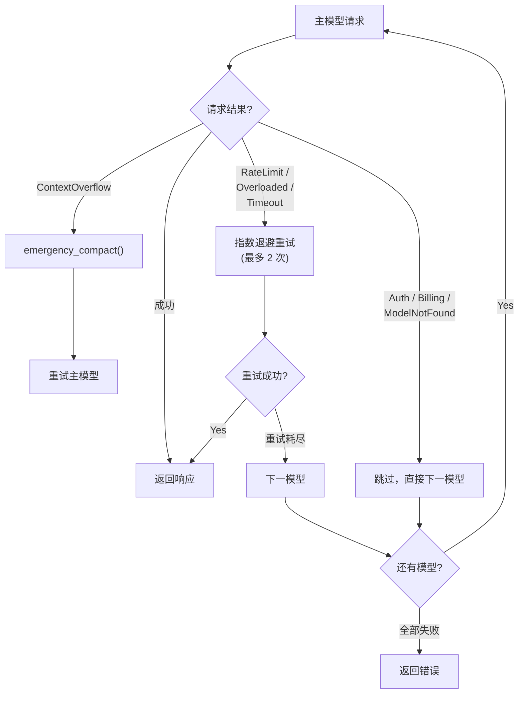
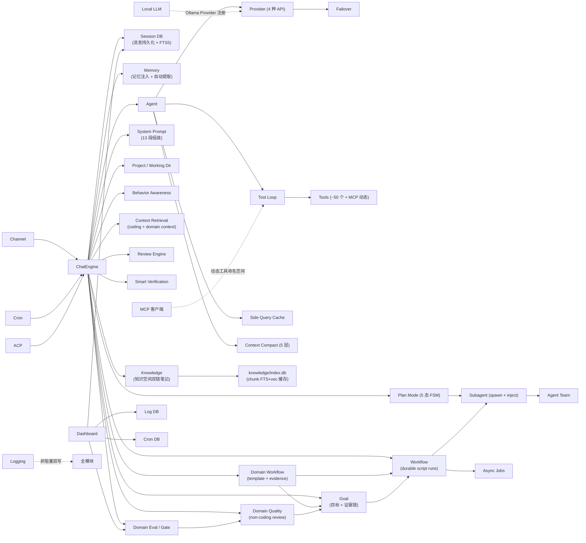

# Hope Agent 系统架构总览

> 返回 [文档索引](../README.md) | 更新时间：2026-07-03

## 系统定位

基于 Rust 的本地 AI 助手，支持三种运行模式：桌面 GUI（Tauri）、HTTP/WS 守护进程、ACP stdio。核心设计目标：**一切复杂逻辑在 ha-core**（零 Tauri 依赖），前端只负责展示和交互，Tauri 和 HTTP 服务都是薄壳。

> 三层架构详细设计见 [前后端分离架构](backend-separation.md)

## 技术栈

| 层 | 技术 |
|---|---|
| 前端 | React 19 + TypeScript, Vite 8, Tailwind CSS v4, shadcn/ui (Radix UI) |
| 前端通信 | Transport 抽象层（Tauri IPC 或 HTTP/WebSocket 双模式） |
| 桌面 | Tauri 2（薄壳，调用 ha-core） |
| 服务器 | axum 0.8（HTTP REST API + WebSocket 流式） |
| 核心 | ha-core（Rust, tokio, reqwest，零 Tauri 依赖） |
| 渲染 | Streamdown + Shiki + KaTeX + Mermaid |
| 存储 | SQLite (WAL) + FTS5 + vec0 向量扩展 |
| 多语言 | i18next (12 种语言) |

## 架构全景

> Tauri 命令、HTTP 端点、工具数量是会增长的活数据；以 [API 参考](api-reference.md) 为单一真相源，其它文档不重复维护精确数字。

## 核心数据流

### 用户消息 → 模型响应（主流程）

### Failover 降级链

## 模块依赖关系

## 项目（Project）与会话工作目录

侧边栏将「会话」和「项目」并列为一等节点，项目是会话分组容器并承载持久化的项目级上下文：

- **项目文件 = 工作目录真实文件**：上传文件直接落项目工作目录（无 `project_files` 表 / 无文本提取注入 / 无 `project_read_file` 工具）；模型靠 `# Working Directory` 段的顶层文件清单 + `read` 工具按需感知
- **记忆优先级**：Project > Agent > Global，预算紧张时项目记忆最先保留；属项目的会话默认把自动提取的记忆写入 Project scope
- **默认工作目录**：`Project.working_dir` 是该项目下会话的默认工作目录；运行时合并优先级 `session.working_dir > project.working_dir > 不注入`，**lazy resolve**——改项目工作目录立即对未单独设置的已有会话生效。合并入口 `session::helpers::effective_session_working_dir`，被 system prompt、`exec` / `read` / `write` 的相对路径解析共同消费
- **IM 路由（无反向认领，Phase A1）**：项目不再认领 channel-account；IM 入站消息默认归 `project_id = NULL`，要归项目从 IM chat 内 `/project <id>` 显式触发，channel worker 调 `set_session_project` 直接改现有 session 不创建新行。Agent 解析按"显式 → 项目 → topic → group → tg-channel → channel-account → AppConfig → 默认"7 级链 (`agent::resolver::resolve_default_agent_id_full`)
- **`/project [name]` 斜杠命令**：无参列项目选择器，有参直接进入对应项目新会话
- **删除级联**：unassign 会话 → 删项目行 → `rm -rf projects/{id}/`（含默认 workspace；用户显式选的外部目录不删）→ 删项目记忆（跨 `memory.db` 单独执行）

详见 [Project 系统](project.md)。

## 知识空间（Knowledge Base）

侧边栏一级导航「知识空间」，是与聊天、Project 平级的**第四种知识容器**——本地优先、AI 原生的双链笔记子系统。笔记是真实 `.md` 文件（唯一真相源），`~/.hope-agent/knowledge/index.db` 只是 chunk 级 FTS5 + 向量的可重建缓存（删了能从 `.md` 全量重建）；KB 注册表与访问绑定落 `sessions.db`（真相源，D9）。

- **AI 原生读写**：agent 经 `note_*` 工具对知识库有完整 CRUD / 链接 / 图谱 / 检索 / 自主维护能力，并能把碎片记忆提炼成结构化笔记——区别于 Obsidian / Logseq「AI 是插件」的形态
- **默认 deny + 显式 attach**：访问唯一经 `effective_kb_access`（source-aware + 调用链 cap），incognito 零访问、IM 默认禁用（账号级 opt-in）；owner 管理平面与 agent 工具平面物理隔离（D10）
- **本地优先可移植**：可绑定现成 Obsidian / Logseq vault（默认只读，opt-in 放开写）+ `notify` watcher 实时同步；与两者文件级 + 公共语法子集非破坏性共存
- **检索独立旗舰**：chunk FTS + 向量 RRF + MMR，独立 store、独立 embedding selector，**绝不折进 `recall_memory`**（D7）

详见 [知识空间（Knowledge Base）](knowledge-base.md)。

## 本地模型加载

`local_llm/` 模块通过 Ollama 的 OpenAI 兼容端点（`http://127.0.0.1:11434/v1/chat/completions`）将本地模型注册为 Provider，启用 `allow_private_network`。模型目录硬编码 Qwen3.6 / Gemma 4 默认量化的 on-disk 大小，根据可用内存（macOS 统一内存 / Windows + Linux 优先 dGPU VRAM 取所选轴 60%，再扣 1 GiB runtime buffer；常量 `RECOMMENDATION_BUDGET_PERCENT=60`）从大到小推荐适配模型；Ollama 进程不由 app 接管。安装、模型拉取、Embedding 拉取统一走 `local_model_jobs.rs` 后台任务表，事件通道 `local_model_job:created` / `:updated` / `:log` / `:completed`。详见 [本地模型加载](local-model-loading.md)。

## 存储架构

| 数据库 | 路径 | 用途 |
|--------|------|------|
| sessions.db | `~/.hope-agent/sessions.db` | 会话、消息、Goal/Event/Link、WorkflowRun/Op/Event、Subagent/ACP/Team 运行记录 |
| memory.db | `~/.hope-agent/memory.db` | 记忆条目 + FTS5 + vec0 向量 + embedding cache |
| knowledge/index.db | `~/.hope-agent/knowledge/index.db` | 知识空间 chunk 索引（FTS5 + vec0），可重建缓存；笔记 `.md` 真相在 `knowledge/{id}/notes/` 或外部 vault，registry 在 sessions.db |
| logs.db | `~/.hope-agent/logs.db` | 结构化日志（可查询/过滤） |
| cron.db | `~/.hope-agent/cron.db` | 定时任务 + 执行日志 |
| background_jobs.db | `~/.hope-agent/background_jobs.db` | 统一后台任务缓存（exec / web_search / image_generate 后台化 + subagent/group 投影） |
| local_model_jobs.db | `~/.hope-agent/local_model_jobs.db` | 本地模型安装 / 拉取后台任务 |
| local_llm_library_cache.db | `~/.hope-agent/local_llm_library_cache.db` | Ollama Library 搜索 / Tag 元数据缓存 |
| recap/recap.db | `~/.hope-agent/recap/recap.db` | 会话深度复盘缓存 |
| canvas/canvas.db | `~/.hope-agent/canvas/canvas.db` | Canvas 画布数据 |
| config.json | `~/.hope-agent/config.json` | Provider 配置、模型链、全局设置 |
| agent.json | `~/.hope-agent/agents/{id}/agent.json` | 每 Agent 独立配置 |
| projects/ | `~/.hope-agent/projects/{id}/` | 项目工作目录（默认 workspace；真实文件。项目记忆在 memory.db，不在此） |
| credentials/ | `~/.hope-agent/credentials/` | OAuth token、MCP server 凭据（0600 原子写） |

所有路径通过 `paths.rs` 集中管理，统一在 `~/.hope-agent/` 目录下。配置读写**强制走** `cached_config()` / `mutate_config()`，禁止重新引入 `Mutex<AppConfig>` 或 load+save 手动克隆模式（详见 [配置系统](config-system.md)）。

## 文档导航

各模块详细架构见对应文档（与 [文档索引](../README.md) 一致）：

### 系统架构

| 模块 | 文档 |
|------|------|
| 三层架构 / EventBus / Transport | [前后端分离架构](backend-separation.md) |
| Tauri / HTTP / ACP 三种入口 | [Transport 运行模式](transport-modes.md) |
| 进程清单 / Guardian 协议 | [进程与并发模型](process-model.md) |
| Tauri ↔ HTTP 命令对照 | [API 参考](api-reference.md) |

### 核心模块

| 模块 | 文档 |
|------|------|
| 对话编排 & 流式输出 | [Chat Engine](chat-engine.md) |
| Provider & Failover | [Provider 系统](provider-system.md) |
| 本地模型加载（Ollama） | [本地模型加载](local-model-loading.md) |
| 提示词 13 段组装 | [提示词系统](prompt-system.md) |
| 工具定义/执行/权限 | [工具系统](tool-system.md) |
| 表单控件 / 焦点 / 菜单 / Tooltip | [UI 交互与表面设计系统](ui-interaction-system.md) |
| 上下文压缩 5 层 + mid-loop checkpoint | [上下文压缩](context-compact.md) |
| 会话 & 消息持久化 | [Session 系统](session.md) |
| 项目容器 & 默认工作目录 | [Project 系统](project.md) |
| 记忆检索 & 提取 | [记忆系统](memory.md) |
| 知识空间双链笔记 & 检索 | [知识空间（Knowledge Base）](knowledge-base.md) |

### 控制平面

| 模块 | 文档 |
|------|------|
| Goal 顶层目标与完成审计 | [Goal 控制平面](goal.md) |
| Workspace / 工作台总览 | [Workspace Control Panel](workspace.md) |
| Durable Workflow / Execution Mode | [Workflow Mode、Workflow Run 与 Execution Mode](workflow.md) |
| Loop 持续触发 | [Loop 控制平面](loop.md) |
| Managed Worktree | [Managed Worktree 控制平面](worktree.md) |
| LSP / Diagnostics / Symbol Context | [LSP 与语义代码智能](lsp.md) |
| Review Engine | [Review Engine 控制平面](review-engine.md) |
| Smart Verification | [Smart Verification 控制平面](verification-engine.md) |
| Context Retrieval v2 | [Context Retrieval v2](context-retrieval.md) |
| Coding Eval / Benchmark | [Coding Eval 控制面评测](coding-eval.md) |
| Coding Improvement / Learning Loop | [Coding Improvement Loop](coding-improvement-loop.md) |
| Domain Workflow / General Evidence | [Domain Workflow 控制平面](domain-workflow.md) |
| Domain Quality review / verification | [Domain Quality 控制平面](domain-quality.md) |
| Domain Eval / General Quality Gate | [Domain Eval 与 Quality Gate 控制平面](domain-eval.md) |

### Agent 能力

| 模块 | 文档 |
|------|------|
| Plan 5 态状态机 | [Plan Mode](plan-mode.md) |
| Ask User 结构化问答 | [Ask User](ask-user.md) |
| 技能发现 & 隔离 | [技能系统](skill-system.md) |
| 子 Agent 系统 | [Subagent](subagent.md) |
| 多 Agent 协作 | [Agent Team](agent-team.md) |
| Side Query 缓存 | [Side Query](side-query.md) |
| 跨会话行为感知 | [行为感知](behavior-awareness.md) |
| 错误分类 & Profile 轮换 | [Failover 系统](failover.md) |

### 接入层

| 模块 | 文档 |
|------|------|
| IM 渠道插件 | [IM Channel](im-channel.md) |
| ACP IDE 直连 | [ACP 协议](acp.md) |
| 斜杠命令 | [斜杠命令](slash-commands.md) |
| MCP 客户端 | [MCP 客户端](mcp.md) |

### 基础设施

| 模块 | 文档 |
|------|------|
| 图像生成 | [图像生成](image-generation.md) |
| 定时任务 | [Cron 调度](cron.md) |
| Sandbox 架构 | [Sandbox](sandbox.md) |
| 数据大盘 / Learning 质量门 | [Dashboard](dashboard.md) |
| Recap 深度复盘 | [Recap](recap.md) |
| 日志系统 | [Logging](logging.md) |
| 可靠性 / Guardian / Crash Journal | [可靠性与崩溃自愈](reliability.md) |
| 配置读写 contract | [配置系统](config-system.md) |
| SSRF / Dangerous Mode / 凭据 | [安全子系统](security.md) |
| 跨平台抽象层 | [跨平台抽象层](platform.md) |
