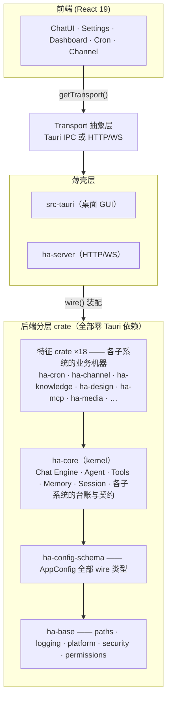
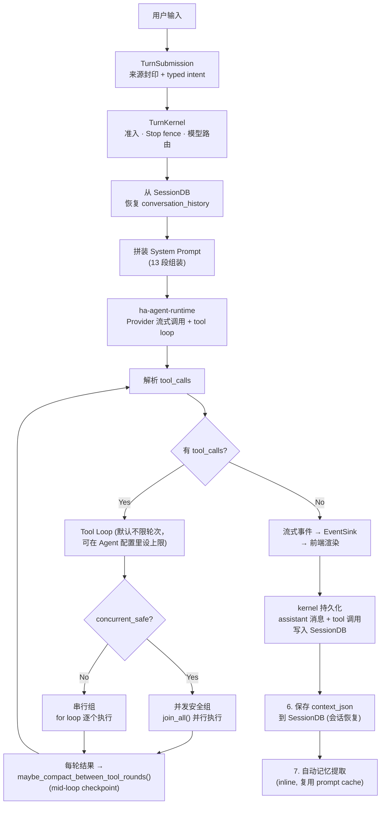
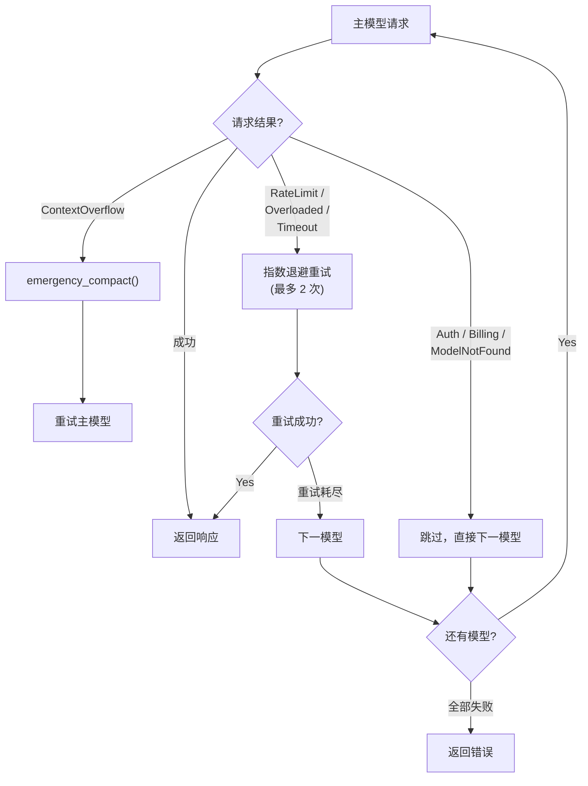
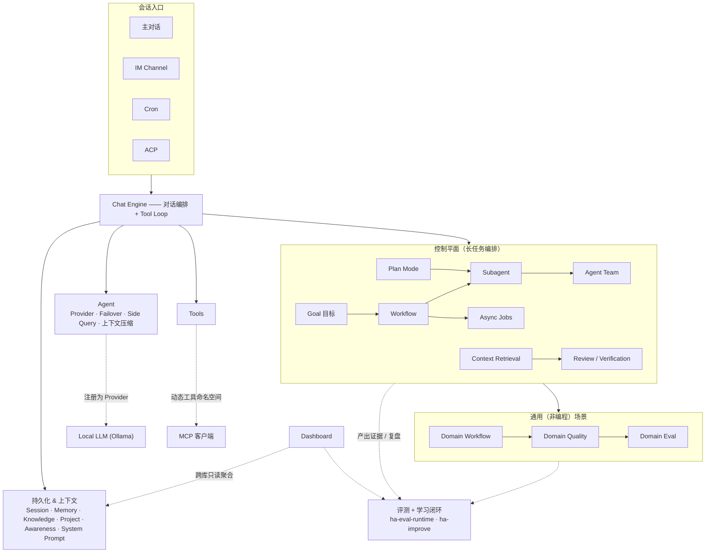

# Hope Agent 系统架构总览

> 返回 [文档索引](../README.md) | 更新时间：2026-07-23

## 系统定位

Hope Agent 是一个基于 Rust 的本地 AI 助手，同一个二进制支持三种运行模式：桌面 GUI（Tauri）、HTTP/WS 守护进程、ACP stdio（供 IDE 直连）。

它的核心设计原则只有一条：**所有业务逻辑都在与界面无关的后端 crate 里，前端和 Tauri / HTTP 服务都只是薄壳。** 后端本身是一组分层的 crate——底层是基础设施，往上是核心业务 kernel，再往上是一个个可独立迁出的「特征 crate」（一个子系统一个）。这些 crate **全部零 Tauri 依赖**，因此同一套业务能力可以被桌面、服务器、CLI 三种入口复用。

分层架构的完整设计见 [前后端分离架构](system/backend-separation.md)。

## 技术栈

| 层 | 技术 |
|---|---|
| 前端 | React 19 + TypeScript, Vite 8, Tailwind CSS v4, shadcn/ui (Radix UI) |
| 前端通信 | Transport 抽象层（Tauri IPC 或 HTTP/WebSocket 双模式） |
| 桌面 | Tauri 2（薄壳，调用 ha-core） |
| 服务器 | axum 0.8（HTTP REST API + WebSocket 流式） |
| 核心 | ha-core + 特征 crate（ha-updater 等；Rust, tokio, reqwest，零 Tauri 依赖） |
| 渲染 | Streamdown + Shiki + KaTeX + Mermaid |
| 存储 | SQLite (WAL) + FTS5 + vec0 向量扩展 |
| 多语言 | i18next (12 种语言) |

## 分层架构

一张图看懂 crate 分层——请求从前端进来，经 Transport 抽象层落到某个薄壳，薄壳再调用后端 crate：

```mermaid
graph TD
    subgraph FE["前端 (React 19)"]
        UI["ChatUI · Settings · Dashboard · Cron · Channel"]
    end
    UI -->|"getTransport()"| TP["Transport 抽象层<br/>Tauri IPC 或 HTTP/WS"]
    TP --> SH

    subgraph SH["薄壳层"]
        direction LR
        TAURI["src-tauri（桌面 GUI）"]
        SERVER["ha-server（HTTP/WS）"]
    end
    SH -->|"wire() 装配"| BE

    subgraph BE["后端分层 crate（全部零 Tauri 依赖）"]
        direction TB
        FEAT["特征 crate ×18 —— 各子系统的业务机器<br/>ha-cron · ha-channel · ha-knowledge · ha-design · ha-mcp · ha-media · …"]
        CORE["ha-core（kernel）<br/>Chat Engine · Agent · Tools · Memory · Session · 各子系统的台账与契约"]
        SCHEMA["ha-config-schema —— AppConfig 全部 wire 类型"]
        BASE["ha-base —— paths · logging · platform · security · permissions"]
        FEAT --> CORE --> SCHEMA --> BASE
    end
```

**「机器」迁出、「台账」留在 kernel。** 拆分不是把整个子系统整体搬走：每个特征 crate 拿走的是业务*机器*（调度、检索、生成这些逻辑），而子系统的*台账*——对 `sessions.db` 的 SQL 访问、wire 类型、纯谓词——恒留在 ha-core kernel，由 kernel 独占数据库的不变量与事务边界。kernel 需要特征 crate 的能力时，只经 `*_hooks` 注册槽反向回调，不直接依赖它们。

### 特征 crate 一览

| 特征 crate | 职责 |
|---|---|
| ha-updater | 自升级：manifest / 验签 / 二进制替换 |
| ha-weather | 天气：Open-Meteo 拉取 + 缓存 |
| ha-acp | ACP：stdio server + 运行时控制面 |
| ha-mac | macOS 控制：Accessibility 快照 / 截屏 |
| ha-design | 设计空间 + Artifacts + Canvas |
| ha-browser | 浏览器自动化：扩展 / CDP 双 backend |
| ha-vcs | 版本控制：git 操作面 + Docker 沙箱 + SearXNG |
| ha-mcp | MCP 客户端：transport / OAuth |
| ha-pet | 桌面宠物：sprite 库 / 导入 / 活动投影 |
| ha-media | 媒体生成：图 / 音 adapter + STT 引擎 |
| ha-local-llm | 本地模型：Ollama 生命周期 / 模型目录 / 本地 embedding |
| ha-dash | 数据大盘：用量 Insights / 控制面聚合 / Recap（只读连接取数） |
| ha-cron | 定时任务：调度器 / 执行器 / 投递 |
| ha-eval-runtime | 评测运行时：coding 评测 runner / 编排 |
| ha-channel | IM 渠道：多个渠道插件 / worker 分发 |
| ha-knowledge | 知识空间：检索 / 编译 / 维护流水线 |
| ha-skills | 技能：解包 / 发现 / 创作 / auto-review |
| ha-improve | 学习闭环：提案队列 / 领域评测 / 质量复核 |

> Tauri 命令、HTTP 端点、工具数量是会增长的活数据；准确数字见 [API 参考](system/api-reference.md)。

## 核心数据流

### 用户消息 → 模型响应（主流程）

```mermaid
flowchart TD
    A["用户输入"] --> B["TurnSubmission<br/>来源封印 + typed intent"]
    B --> C["TurnKernel<br/>准入 · Stop fence · 模型路由"]
    C --> D["从 SessionDB<br/>恢复 conversation_history"]
    D --> E["拼装 System Prompt<br/>(13 段组装)"]
    E --> F["ha-agent-runtime<br/>Provider 流式调用 + tool loop"]

    F --> G["解析 tool_calls"]
    G --> H{"有 tool_calls?"}
    H -- Yes --> I["Tool Loop (默认不限轮次，可在 Agent 配置里设上限)"]
    I --> J{"concurrent_safe?"}
    J -- Yes --> K["并发安全组<br/>join_all() 并行执行"]
    J -- No --> L["串行组<br/>for loop 逐个执行"]
    K --> M["每轮结果 →<br/>maybe_compact_between_tool_rounds()<br/>(mid-loop checkpoint)"]
    L --> M
    M --> G

    H -- No --> N["流式事件 → EventSink<br/>→ 前端渲染"]
    N --> O["kernel 持久化<br/>assistant 消息 + tool 调用<br/>写入 SessionDB"]
    O --> P["6. 保存 context_json<br/>到 SessionDB (会话恢复)"]
    P --> Q["7. 自动记忆提取<br/>(inline, 复用 prompt cache)"]

```

### Failover 降级链

```mermaid
flowchart TD
    A["主模型请求"] --> B{"请求结果?"}
    B -- "成功" --> C["返回响应"]
    B -- "ContextOverflow" --> D["emergency_compact()"]
    D --> E["重试主模型"]
    B -- "RateLimit /<br/>Overloaded /<br/>Timeout" --> F["指数退避重试<br/>(最多 2 次)"]
    F --> G{"重试成功?"}
    G -- Yes --> C
    G -- "重试耗尽" --> H["下一模型"]
    B -- "Auth / Billing /<br/>ModelNotFound" --> I["跳过，直接下一模型"]
    H --> J{"还有模型?"}
    I --> J
    J -- Yes --> A
    J -- "全部失败" --> K["返回错误"]

```

## 运行时关系

分层图讲「代码怎么组织」，这张图讲「跑起来后各部分怎么协作」——四类会话入口都汇入 Chat Engine，长任务交给控制平面编排，编排产出的证据再喂给评测与学习闭环：

```mermaid
graph TD
    subgraph Entry["会话入口"]
        direction LR
        Chat["主对话"]
        IM["IM Channel"]
        Cron["Cron"]
        ACP["ACP"]
    end
    Entry --> CE["Chat Engine —— 对话编排 + Tool Loop"]

    CE --> Agent["Agent<br/>Provider · Failover · Side Query · 上下文压缩"]
    Agent -.->|"注册为 Provider"| LocalLLM["Local LLM (Ollama)"]
    CE --> Tools["Tools"]
    Tools -.->|"动态工具命名空间"| MCP["MCP 客户端"]
    CE --> Store["持久化 & 上下文<br/>Session · Memory · Knowledge · Project · Awareness · System Prompt"]

    CE --> CP
    subgraph CP["控制平面（长任务编排）"]
        direction LR
        Goal["Goal 目标"] --> WF["Workflow"]
        Plan["Plan Mode"] --> Sub["Subagent"]
        WF --> Sub --> Team["Agent Team"]
        WF --> AJ["Async Jobs"]
        CR["Context Retrieval"] --> RV["Review / Verification"]
    end

    CP --> Domain
    subgraph Domain["通用（非编程）场景"]
        direction LR
        DWF["Domain Workflow"] --> DQ["Domain Quality"] --> DE["Domain Eval"]
    end

    CP -.->|"产出证据 / 复盘"| Learn["评测 + 学习闭环<br/>ha-eval-runtime · ha-improve"]
    Domain -.-> Learn
    Dash["Dashboard"] -.->|"跨库只读聚合"| Store
    Dash -.-> Learn
```

图里每个节点都有独立文档，细粒度契约见对应子系统页。

## 项目（Project）与会话工作目录

侧边栏里「会话」和「项目」是并列的一等节点。项目是一组会话的容器，同时承载一份持久的项目级上下文——工作目录、项目记忆、项目指令。

一个项目绑定一个工作目录，该目录下的会话默认都在这里读写文件。上传到项目的文件直接落在这个真实目录里，没有单独的文件表，也不做文本提取注入——模型通过工作目录的顶层文件清单加 `read` 工具按需感知。改动项目工作目录会立即对该项目下未单独设置目录的会话生效（延迟解析，不是创建时固化）。

项目记忆的优先级高于 Agent 和全局记忆，预算紧张时最先保留；属于项目的会话默认把自动提取的记忆写进项目作用域。

删除项目会连带删掉它自建的工作目录和项目记忆（都在 `projects/{id}/` 目录树内），但绝不会碰用户显式指定的外部目录。

详见 [Project 系统](core/project.md)。

## 知识空间（Knowledge Base）

「知识空间」是与聊天、Project 平级的第四种知识容器：一个本地优先、AI 原生的双链笔记子系统。笔记就是磁盘上真实的 `.md` 文件（唯一真相源），可以直接绑定现成的 Obsidian / Logseq vault（默认只读，可显式放开写），文件层面与它们非破坏性共存。`knowledge/index.db` 只是检索用的缓存，删掉能从 `.md` 全量重建。

和 Obsidian / Logseq「AI 是插件」的形态相反，这里 AI 是一等公民：agent 通过 `note_*` 工具对笔记有完整的增删改查、双链、图谱、检索能力，还能把零散记忆提炼成结构化笔记。访问默认拒绝、需显式 attach，无痕会话零访问。检索走独立的全文加向量混合链路，和记忆系统物理隔离、互不干扰。

详见 [知识空间（Knowledge Base）](core/knowledge-base.md)。

## 本地模型加载

`ha-local-llm` 特征 crate 把本地 Ollama 当作一个 Provider 接入（走 Ollama 的 OpenAI 兼容端点）。它内置一份模型目录，按机器可用内存或显存预留出一定余量后，从大到小推荐能跑得动的模型；Ollama 进程由用户自己管理，app 不接管其生命周期。安装、模型拉取、Embedding 下载都走后台任务异步执行——这里正好体现前面说的「机器 / 台账」分工：执行逻辑在特征 crate，而后台任务台账留在 kernel（和记忆、知识库的向量重建共用同一套任务表）。详见 [本地模型加载](core/local-model-loading.md)。

## 存储架构

| 数据库 | 路径 | 用途 |
|--------|------|------|
| sessions.db | `~/.hope-agent/sessions.db` | 会话、消息、Goal/Event/Link、WorkflowRun/Op/Event、Subagent/ACP/Team 运行记录 |
| memory.db | `~/.hope-agent/memory.db` | 记忆条目、Dreaming claim、情节记忆，配 FTS5 + vec0 索引与 embedding 缓存（**Core Memory 正文不在这里**，见下行） |
| Core Memory `.md` | `memory/`、`agents/{id}/memory/`、`projects/{id}/memory/` | 全局 / Agent / 项目三个作用域各一份 Core Memory：`MEMORY.md` 索引 + `topics/*.md` 主题笔记，磁盘 `.md` 为唯一真相源（不入库） |
| knowledge/index.db | `~/.hope-agent/knowledge/index.db` | 知识空间 chunk 索引（FTS5 + vec0），可重建缓存；笔记 `.md` 真相在 `knowledge/{id}/notes/` 或外部 vault，registry 在 sessions.db |
| logs.db | `~/.hope-agent/logs.db` | 结构化日志（可查询/过滤） |
| cron.db | `~/.hope-agent/cron.db` | 定时任务 + 执行日志 |
| wakeups.db | `~/.hope-agent/wakeups.db` | Agent 自排程唤醒 |
| background_jobs.db | `~/.hope-agent/background_jobs.db` | 统一后台任务缓存（exec / web_search / 图音生成后台化 + subagent/group 投影） |
| design/design.db | `~/.hope-agent/design/design.db` | 设计空间注册表，可从磁盘产物重建 |
| local_model_jobs.db | `~/.hope-agent/local_model_jobs.db` | 本地模型安装 / 拉取后台任务 |
| local_llm_library_cache.db | `~/.hope-agent/local_llm_library_cache.db` | Ollama Library 搜索 / Tag 元数据缓存 |
| recap/recap.db | `~/.hope-agent/recap/recap.db` | 会话深度复盘缓存 |
| canvas/canvas.db | `~/.hope-agent/canvas/canvas.db` | Canvas 画布数据 |
| config.json | `~/.hope-agent/config.json` | Provider 配置、模型链、全局设置 |
| agent.json | `~/.hope-agent/agents/{id}/agent.json` | 每 Agent 独立配置 |
| projects/ | `~/.hope-agent/projects/{id}/` | 项目目录：`workspace/` 默认工作区（真实文件）+ `memory/` 项目记忆（`.md`）。删项目即 `rm -rf` 整个目录，记忆随之删除 |
| credentials/ | `~/.hope-agent/credentials/` | OAuth token、MCP server 凭据（0600 原子写） |

所有路径由 `paths.rs` 集中管理，统一挂在 `~/.hope-agent/` 下（完整清单见 [CLI 文档的数据目录速查](system/cli.md#数据目录速查)）。配置的读写都经过一层带缓存的统一入口，避免各处手动加载再保存造成竞争（详见 [配置系统](infra/config-system.md)）。

## 文档导航

完整的模块清单与逐篇说明见 [技术文档索引](../README.md)；本篇只负责讲清系统整体如何运转，索引不在此重复维护。
