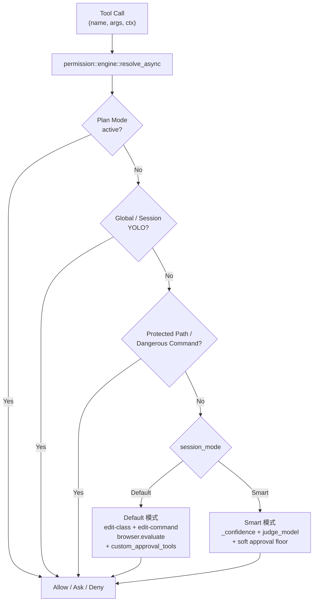

# 权限 / 审批系统架构文档

> 返回 [文档索引](../README.md)
>
> 更新时间：2026-04-30

## 目录

- [概述](#概述)（含决策流程总览图）
- [核心设计：一根信任度轴 + Plan 正交](#核心设计一根信任度轴--plan-正交)
- [优先级矩阵](#优先级矩阵)
- [数据模型](#数据模型)
- [决策引擎（`permission::engine`）](#决策引擎permissionengine)
- [Smart 模式：self_confidence + judge_model](#smart-模式self_confidence--judge_model)
- [保护路径 / 危险命令 / 编辑命令](#保护路径--危险命令--编辑命令)
- [免审批工具与可审批工具](#免审批工具与可审批工具)
- [审批弹窗 UI](#审批弹窗-ui)
- [HTTP 路由与 Tauri 命令对照](#http-路由与-tauri-命令对照)
- [前端组件](#前端组件)
- [配置项](#配置项)
- [已知限制与边界](#已知限制与边界)
- [文件清单](#文件清单)

---

## 概述

Hope Agent 的权限/审批系统决定**每一次工具调用是否需要弹审批对话框**。设计目标是把以前散落在 8 套机制（`ToolPermissionMode` / `dangerous_skip_all_approvals` / `internal` flag / `auto_approve_tools` / `require_approval` / `exec` allowlist / Plan Mode allowlist / `approval_timeout`）里的判定逻辑收敛到**单一规则引擎 + 不同 preset**，参考 Claude Code 的 "unified rule engine + presets" 思路落地。

设计原则：

1. **单入口判定**：所有工具调用走 `permission::engine::resolve_async(ctx) -> Decision`，返回 `Allow / Ask { reason } / Deny { reason }`
2. **一根信任度轴**：从最严格到最宽松——Plan Mode > Default 模式 > Smart 模式 > Yolo 模式（session 级）+ 全局 YOLO（process 级）
3. **Plan Mode 正交**：Plan Mode 是一种"工作模式"而非权限模式，能强行覆盖任何 YOLO 与 Smart override
4. **保护层不可绕过**：保护路径 + 危险命令 + 高风险 macOS 控制在非 YOLO 模式下强制弹审批且不能 AllowAlways；YOLO 模式只 warn 不弹
5. **clean break，不做迁移**：老的 `ToolPermissionMode` / `exec-approvals.json` / `auto_approve_tools` 等字段全部删除，老用户审批规则需要重新设置



---

## 核心设计：一根信任度轴 + Plan 正交

### Session 模式三选一

每个会话独立携带一个 `permission_mode`，存于 `sessions.permission_mode` 列：

| 模式 | 行为 | 谁该用 |
|------|------|--------|
| **Default** | 硬编码"编辑类必审批" + Agent `custom_approval_tools` 叠加 | 大多数用户（傻瓜默认） |
| **Smart** | `_confidence: "high"` 自报跳过 / `judge_model` LLM 决策 / `Both` 并联 | 进阶用户：信任 LLM 在熟悉项目内的判断 |
| **Yolo** | 该 session 内全放行（仅 Plan Mode 仍能拦） | 一次性脚本会话、极信任场景 |

切换入口：聊天标题栏的 `PermissionModeSwitcher` dropdown。会话首次创建时按 `AgentConfig.capabilities.default_session_permission_mode → AppConfig 默认 → "default"` 解析初始值。

### Global YOLO（进程级）

`AppConfig.permission.global_yolo: bool` + CLI flag `--dangerously-skip-all-approvals`（OR 关系）。开启时**所有会话**都视作 YOLO，仅 Plan Mode 仍可拦截。命中保护路径 / 危险命令 / macOS 控制动作时落 `app_warn!` 审计日志、不弹窗（语义：用户既然开了全局 YOLO 就是接受全部风险）。

### Plan Mode（独立工作模式）

Plan Mode 不属于 permission_mode 三选一，而是**正交的工作模式**。激活后：
- 只允许调用白名单内工具（`plan_mode_allowed_tools`）
- 优先级**高于** YOLO——即使开了 Global YOLO 也拦得住
- 决策路径：`Plan Mode active && tool_name ∉ whitelist → Decision::Deny`

---

## 优先级矩阵

`engine::resolve_async` 按以下优先级**从高到低**消费规则：

| # | 规则 | 行为 | 可被覆盖？ |
|---|------|------|------------|
| 1 | **Plan Mode** | 不在白名单 → `Deny`；在白名单 → 继续过 Internal / strict / ask_tools / soft approval 门禁，跳过 YOLO / AllowAlways / Session fallback | ❌ 最高 |
| 2 | **Internal Tools** | `ToolDefinition.internal=true` 的工具直接 `Allow` | 仅次于 Plan |
| 3 | **YOLO**（global / session） | 全部 `Allow`；保护路径/危险命令/macOS 控制动作/browser.evaluate 命中只 warn | 仅 Plan 能压 |
| 4 | **保护路径** | 非 YOLO 时强制 `Ask` + `forbids_allow_always=true` | 仅 YOLO / Plan |
| 5 | **危险命令** | 非 YOLO 时强制 `Ask` + `forbids_allow_always=true` | 仅 YOLO / Plan |
| 6 | **macOS 控制动作** | `mac_control` 普通/隐私动作 → `Ask`；高风险动作 → `Ask` + `forbids_allow_always=true` | 仅 YOLO / Plan |
| 7 | **AllowAlways 累积** | 命中作用域规则 → `Allow`（v1 待 GUI 编辑入口） | 在第 7 层之内 |
| 8 | **Session 模式 preset** | Default / Smart 各自展开 | — |
| 9 | **兜底** | `Decision::Allow` | — |

**Default 模式展开**：edit-class 工具（`write/edit/apply_patch`）→ `Ask`；`exec` 命中编辑命令 → `Ask`；`browser.control.evaluate` → `AskReason::BrowserEvaluate`；`agent_custom_approval_enabled && tool ∈ custom_approval_tools` → `Ask`。

**Smart 模式展开**：`_confidence:"high"`（仅 SelfConfidence/Both 策略） → `Allow`；否则走"soft approval floor"（edit-class / edit-command / browser.evaluate，与 Default 共享但**不消费 custom_approval_tools**）→ `Ask`；async wrapper 在非 strict Ask 时调 judge_model 看是否升级为 Allow / Deny。

---

## 数据模型

### `permission/` 模块结构

```
crates/ha-core/src/permission/
├── mod.rs                  // 入口 + Decision / AskReason 类型
├── rules.rs                // PermissionRules + RuleSpec + ArgMatcher
├── engine.rs               // resolve / resolve_async 决策入口
├── protected_paths.rs      // 保护路径加载/匹配 + 默认值 const
├── dangerous_commands.rs   // 危险命令加载/匹配 + 默认值 const
├── edit_commands.rs        // 编辑命令加载/匹配 + 默认值 const
├── pattern_match.rs        // 零分配 ASCII 大小写无关 substring 匹配
├── list_store.rs           // 三个 list 模块共享的文件 IO + Arc cache 抽象
├── allowlist.rs            // 多作用域 AllowAlways 类型骨架（v1 待 GUI 编辑）
├── mode.rs                 // SessionMode + SmartModeConfig + SmartStrategy + JudgeModelConfig
├── config.rs               // PermissionGlobalConfig + ApprovalTimeoutAction
└── judge.rs                // Smart 模式 judge_model side_query + 60s TTL cache
```

### 核心类型

```rust
// permission/mod.rs
pub enum Decision {
    Allow,
    Ask { reason: AskReason },
    Deny { reason: String },
}

pub enum AskReason {
    EditTool,
    EditCommand { matched_pattern: String },
    DangerousCommand { matched_pattern: String },
    ProtectedPath { matched_path: String },
    AgentCustomList,
    SmartJudge { rationale: String },
    MacControlAction { action: String },
    MacControlDangerousAction { action: String },
    PlanModeAsk,
}

impl AskReason {
    /// 强制每次手动确认（保护路径 / 危险命令 / 高风险 macOS 控制），AllowAlways 按钮置灰
    pub fn forbids_allow_always(&self) -> bool {
        matches!(
            self,
            ProtectedPath { .. } | DangerousCommand { .. } | MacControlDangerousAction { .. }
        )
    }
}

// permission/mode.rs
pub enum SessionMode { Default, Smart, Yolo }
pub enum SmartStrategy { SelfConfidence, JudgeModel, Both }
pub enum SmartFallback { Default, Ask, Allow }

pub struct SmartModeConfig {
    pub strategy: SmartStrategy,
    pub judge_model: Option<JudgeModelConfig>,
    pub fallback: SmartFallback,
}

pub struct JudgeModelConfig {
    pub provider_id: String,
    pub model: String,
    pub extra_prompt: Option<String>,
}
```

### `AppConfig.permission`

```rust
pub struct PermissionGlobalConfig {
    pub global_yolo: bool,                      // GUI + CLI flag 双入口
    pub smart: SmartModeConfig,
    pub approval_timeout_enabled: bool,         // 审批是否自动超时
    pub approval_timeout_secs: u64,             // 审批等待超时秒数
    pub approval_timeout_action: ApprovalTimeoutAction, // Deny / Proceed
}
```

### `AgentConfig.capabilities`（权限相关字段）

```rust
pub struct CapabilitiesConfig {
    /// 是否启用「自定义工具审批」。关闭时 custom_approval_tools 全忽略。
    /// 仅 Default 模式消费；Smart / Yolo 模式直接忽略整个机制。
    pub enable_custom_tool_approval: bool,
    /// 用户勾选的"额外需要审批"的工具名列表
    pub custom_approval_tools: Vec<String>,
    /// Agent 新建会话时的默认权限模式。`None` = 跟随全局
    pub default_session_permission_mode: Option<SessionMode>,
}
```

### Session 表

```sql
ALTER TABLE sessions ADD COLUMN permission_mode TEXT NOT NULL DEFAULT 'default';
-- 取值：'default' | 'smart' | 'yolo'
```

### 文件存储

| 文件 | 用途 |
|------|------|
| `~/.hope-agent/permission/protected-paths.json` | 用户编辑过的保护路径列表（缺失则用硬编码默认值） |
| `~/.hope-agent/permission/dangerous-commands.json` | 危险命令模式列表 |
| `~/.hope-agent/permission/edit-commands.json` | 编辑命令模式列表 |

三个文件共享 `permission::list_store` 的 IO + 缓存抽象：`Arc<Vec<String>>` 单一所有权 + `RwLock<Option<Arc<...>>>` 缓存槽，热路径只 bump refcount 不复制。

---

## 决策引擎（`permission::engine`）

### sync `resolve()` 入口

```rust
pub fn resolve(ctx: &ResolveContext<'_>) -> Decision
```

`ResolveContext` 14 字段，覆盖 tool 信息 + 模式状态 + Plan / YOLO / Agent / smart_config。caller（`tools/execution.rs` + `tools/exec.rs`）每次 dispatch 构造一份。

判定顺序严格按[优先级矩阵](#优先级矩阵)。**所有 sync 路径无 IO、无 LLM、可用于热路径**。

### async `resolve_async()` 入口

```rust
pub async fn resolve_async(ctx: &ResolveContext<'_>) -> Decision
```

先调 sync `resolve()` 拿到 baseline；当：
1. baseline 是 `Decision::Ask` 且 `reason.forbids_allow_always() == false`
2. `session_mode == Smart` 且 strategy ∈ `{ JudgeModel, Both }`
3. `smart_config.judge_model` 非 None

时调 `judge::judge()` 跑一次 LLM 判官；按 `SmartFallback` 降级处理超时/失败。

**性能保证**：非 Smart 会话 `cached_config()` 都不读，`smart_config: None` 让 `active_smart_strategy()` 直接返回 `None` 短路 async 分支——hot path 等价于 sync resolve + 一个零成本 `.await`。

### 重要的设计决策

- **engine 不依赖 AssistantAgent**：通过 `judge.rs` 内部调 `AssistantAgent::judge_one_shot` 静态方法，从 `cached_config().providers` 拿 ProviderConfig 自建 LLM 调用，不用主对话的 cache snapshot
- **保护路径 / 危险命令在 sync 路径**：让 hot path 在 LLM 不可用时仍能正确强制审批
- **macOS 控制动作在 sync 路径**：`mac_control` 的风险由 `action/op/path` 纯参数判断；普通/隐私动作弹审批，高风险动作禁用 AllowAlways
- **浏览器 JS 在 soft approval floor**：`browser` 只有 `action=control && op=evaluate` 进入 `AskReason::BrowserEvaluate`；其它浏览器动作不因此弹审批。Smart 的 `_confidence` / judge_model 可以自动放行该 soft Ask；SSRF 扫描仍由浏览器工具内部执行，不受审批模式影响
- **YOLO 内仍跑风险检查**：保护路径 / 危险命令 / macOS 控制 / browser.evaluate 只为打 `app_warn!` 审计日志，不改决策

---

## Smart 模式：self_confidence + judge_model

### 三种策略

| Strategy | 行为 |
|----------|------|
| `SelfConfidence` | 只读 `args._confidence == "high"`，命中 → Allow；不命中 → fall through |
| `JudgeModel` | 不看 _confidence，直接调 LLM judge |
| `Both` | _confidence 优先；不命中再调 judge |

### `_confidence` 自报字段

模型在 tool_call args 里**主动**加 `_confidence: "high"` 表示"高度确信此次安全"。约束：

- 工具 schema 不暴露这个字段——通过 system prompt（`build_permission_mode_guidance(SessionMode::Smart)`）引导
- 命中 high 直接 Allow（除非命中保护路径 / 危险命令的 strict 层）
- 字段缺失或值非 "high" 不命中，走 fallback
- system prompt guidance 注入位置：`system_prompt/build.rs` 在 `TOOL_CALL_NARRATION_GUIDANCE` 之后；三种 `permission_mode` 都会注入当前模式说明，Smart 模式额外说明 `_confidence` 用法

### `judge_model` 独立 side_query

`permission/judge.rs` 实现：
- 用 `AssistantAgent::judge_one_shot(provider_config, model, prompt, max_tokens)` 跑 bare 模式 LLM 调用——**不复用主对话 cache**（避免污染会话 prefix），不参与 failover/auth 轮换
- 5s 硬超时（`tokio::time::timeout`）
- 60s TTL + 256 cap 的 LRU-ish 缓存：key = hash(tool_name, args_canonical, provider_id, model)
- prompt 强约束 JSON 输出：`{"decision":"allow"|"ask"|"deny","reason":"..."}`
- 解析用 `crate::extract_json_span(text, Some('{'))` 共享的 bracket-balanced 提取器，正确处理字符串字面量内含 `{}`

### 失败降级（`SmartFallback`）

| Fallback | 行为 |
|----------|------|
| `Default` | 保留 sync `Ask`（用户被弹审批） |
| `Ask` | 同上（显式语义） |
| `Allow` | 升级到 `Allow`（最宽松——超时/失败时静默放行） |

### 决策返回

`judge` 返回的 verdict 映射：

| Verdict | Decision |
|---------|----------|
| `allow` | `Decision::Allow` |
| `ask` | `Decision::Ask { reason: AskReason::SmartJudge { rationale } }` |
| `deny` | `Decision::Deny { reason: format!("Smart judge denied: {}", rationale) }` |

---

## 保护路径 / 危险命令 / 编辑命令

三个 list 模块结构高度对称（`protected_paths.rs` / `dangerous_commands.rs` / `edit_commands.rs`），共享 `list_store` 抽象。

### 触发条件

| 列表 | 触发工具 | 匹配维度 | 强制 Ask | 可 AllowAlways |
|------|----------|----------|----------|----------------|
| **保护路径** | `read` / `write` / `edit` / `apply_patch` / `exec`(cwd 或 command 内出现) | 路径前缀 + 通配（`*.env` / `*secret*`） | ✅ 非 YOLO 强制 | ❌ 按钮置灰 |
| **危险命令** | `exec` | 命令字符串 ASCII case-insensitive substring | ✅ 非 YOLO 强制 | ❌ 按钮置灰 |
| **编辑命令** | `exec` | 命令字符串 substring | 仅 Default 模式触发；Smart/YOLO 不消费 | ✅ 可 AllowAlways |
| **macOS 控制** | `mac_control` | `action/op/path` 纯参数分类 | ✅ 普通/隐私/高风险动作 | 普通/隐私动作可；高风险置灰 |

`mac_control` 的只读动作（`status` / `permissions` / `snapshot` / `visual.*` / `elements.find` / `wait` / `apps.list` / `apps.frontmost` / `apps.installed` / `apps.search` / `dock.list` / `spaces.list` / `windows.list` / `act.dry_run` / `menu.list` / `menu.popover` / `dialog.inspect/list`）直接放行；普通突变和隐私敏感动作（例如 `act.perform_action`、`clipboard.get/set/clear`、安全 `dock.select_menu menuItem`）弹审批；高风险突变（例如 `apps.quit`、`windows.close`、危险菜单/dialog 词、`act.perform_action AXConfirm`、危险或 index-only `dock.select_menu`）禁用 AllowAlways。

### 默认值

硬编码在每个模块的 `pub const DEFAULT_*` 数组里，"恢复默认"按钮重置为这些值。代表性条目：

- **保护路径**：`~/.ssh/`, `~/.aws/`, `~/.gnupg/`, `/etc/`, `.env`, `.env.*`, `*secret*`, `*.pem`, `*.key`
- **危险命令**：`rm -rf /`, `git push --force`, `git reset --hard`, `mkfs`, `dd if=.* of=/dev/`, `DROP TABLE`, `docker system prune -a`
- **编辑命令**：`rm `, `mv `, `cp `, `sed -i`, `git commit`, `git add`, `npm install`, `cargo build`, `> `, `>> `

完整列表见 [`crates/ha-core/src/permission/protected_paths.rs`](../../crates/ha-core/src/permission/protected_paths.rs)、[`dangerous_commands.rs`](../../crates/ha-core/src/permission/dangerous_commands.rs)、[`edit_commands.rs`](../../crates/ha-core/src/permission/edit_commands.rs)。

### 文件 IO + 缓存（`list_store`）

```rust
// permission/list_store.rs
pub type Cache = RwLock<Option<Arc<Vec<String>>>>;

pub fn load_or_defaults(cache: &Cache, file: &Path, defaults: &[&str]) -> Arc<Vec<String>>;
pub fn save_and_invalidate(cache: &Cache, file: &Path, patterns: &[String]) -> Result<()>;
pub fn reset_to_defaults(cache: &Cache, file: &Path, defaults: &[&str]) -> Result<Vec<String>>;
```

热路径（`engine::resolve`）只读 cache（`Arc::clone` 即一次 atomic refcount bump），mutator API（`set_*` / `reset_*` Tauri 命令）写盘后 invalidate cache。

### 匹配性能

`pattern_match.rs` 提供零分配 ASCII 大小写无关 substring 匹配——避免 `String::to_lowercase()` 每个 tool dispatch alloc 一份。

---

## 免审批工具与可审批工具

### 免审批（基础核心，固定，UI 不显示开关）

只读 / 元能力 / 应用自身数据 / 用户单向输出，无外部副作用。在 `ToolDefinition.internal=true` 标记，`engine::resolve` 在 Internal Tools 分支直接 `Allow`。

| 类别 | 工具 |
|------|------|
| 文件读取/搜索 | `read` `ls` `grep` `find` |
| 任务管理 | `task_create` `task_update` `task_list` |
| 记忆 | `save_memory` `recall_memory` `memory_get` `update_memory` `delete_memory` `update_core_memory` |
| 文档/通知 | `canvas` `send_notification` |
| 多模态分析 | `pdf` `image`(分析) `get_weather` |
| Cron 管理 | `manage_cron` |
| Subagent / Team | `subagent` `team` |
| Meta | `tool_search` `skill` `job_status` `runtime_cancel` `mcp_resource` `mcp_prompt` |
| 用户交互 | `ask_user_question` |

合计 **31 个**。

### 可审批（出现在 Agent「自定义工具审批」勾选清单）

不再有"全局 per-tool 默认开关"。Default 模式实际审批集 = **硬编码必审批 ∪ Agent 自定义勾选**。

#### 硬编码必审批（不可关闭，YOLO 可 override）

| 触发 | 类别 |
|------|------|
| `write` / `edit` / `apply_patch` | 编辑类工具 |
| `exec` 命中编辑命令模式 | 编辑命令 |
| `browser` 的 `control.evaluate` | 浏览器任意 JavaScript |
| `mac_control` 普通/隐私动作 | macOS 桌面控制 |
| `mac_control` 高风险动作 | macOS 桌面控制（禁用 AllowAlways） |

额外（连 YOLO 都覆盖不了的暂只有 Plan Mode）：保护路径 + 危险命令 + 高风险 macOS 控制在非 YOLO 下强制弹，其中高风险 macOS 控制包括 `apps.quit`、`windows.close`、`dialog.accept` 和命中危险词的 `menu.click`。

#### 自定义勾选可加（Agent 配置「自定义工具审批」开启后展示）

| 工具 | 类别 |
|------|------|
| `process` | 后台进程管理 |
| `browser` | 浏览器控制 |
| `update_settings` `restore_settings_backup` | 配置变更 |
| `send_attachment` `sessions_send` | 外发 |
| `image_generate` | 付费 API |
| `acp_spawn` | 启动外部进程 |
| `web_fetch` `web_search` | 网络访问 |
| `peek_sessions` `sessions_list` `sessions_history` `session_status` `agents_list` | 跨会话只读 |
| `get_settings` `list_settings_backups` | 设置查询 |

合计 **17 个内置可加项**。MCP 工具不进 Agent 自定义清单（避免 N 项展开太长），统一由 `McpServerConfig.default_approval` 字段 server 级开关。`mac_control` 也不进入自定义勾选清单；它按 `action/op` 细分只读、普通/隐私动作和高风险突变。

> **「自定义工具审批」仅 Default 模式生效**——Smart / Yolo 模式忽略整个机制。UI 显式提示用户。

---

## 审批弹窗 UI

### `ApprovalDialog.tsx`

文件：[`src/components/chat/ApprovalDialog.tsx`](../../src/components/chat/ApprovalDialog.tsx)

#### 元素

| 元素 | 来源 |
|------|------|
| 顶部图标（红 / 橙） | `isStrict = reason.kind ∈ {protected_path, dangerous_command, mac_control_dangerous_action}` 切红色 ShieldAlert |
| 倒计时圆环（右上） | 读 `get_approval_timeout` + `get_approval_timeout_action` 配置；剩 ≤30s 变红 |
| Reason banner（红 / 琥珀） | 后端经 `ApprovalRequest.reason: { kind, detail }` 透传，对 9 种 `AskReason` 渲染 i18n 文案 |
| 工作目录 | `current.cwd`，等宽字体 |
| 命令 / 操作摘要 | `current.command`（args 自动截断到 200 字符） |
| 三按钮 | `Deny`（红） + `Allow Once`（默认聚焦） + `Allow Always`（strict 时置灰） |

#### Strict 模式 UI 区别

```ts
const isStrict =
  reason?.kind === "protected_path" ||
  reason?.kind === "dangerous_command" ||
  reason?.kind === "mac_control_dangerous_action"
```

`isStrict=true` 时：
- 顶部图标换红色 ShieldAlert
- Allow Always 按钮 `disabled` + `title={t("approval.allowAlwaysDisabled")}`

#### 倒计时实现

```ts
useEffect(() => {
  if (!currentId || timeoutSecs === null || timeoutSecs <= 0) return
  const startMs = Date.now()
  const total = timeoutSecs
  let id: number | null = null
  const tick = () => {
    const next = Math.max(0, total - Math.floor((Date.now() - startMs) / 1000))
    setRemaining(next)
    if (next <= 0 && id !== null) { window.clearInterval(id); id = null }
  }
  tick()
  id = window.setInterval(tick, 1000)
  return () => { if (id !== null) window.clearInterval(id) }
}, [currentId, timeoutSecs])
```

`setState` 在 interval 回调里（不是 effect 体），满足 `react-hooks/set-state-in-effect` lint。剩 0s 自停 interval。

### `ApprovalReasonPayload` 后端 → 前端

`crates/ha-core/src/tools/approval.rs::ApprovalReasonPayload` 序列化为：

```json
{
  "kind": "protected_path" | "edit_tool" | "edit_command" | "dangerous_command" | "agent_custom_list" | "smart_judge" | "mac_control_action" | "mac_control_dangerous_action" | "plan_mode_ask",
  "detail": "可选明文"
}
```

`From<&AskReason>` 单一映射点，TS 类型 `ApprovalRequest.reason` 在 [`src/components/chat/ApprovalDialog.tsx:16`](../../src/components/chat/ApprovalDialog.tsx#L16) 与之对齐。

### `PermissionModeSwitcher` 标题栏切换器

文件：[`src/components/chat/input/PermissionModeSwitcher.tsx`](../../src/components/chat/input/PermissionModeSwitcher.tsx)

三档下拉，每档独立色调（Default 灰 / Smart 琥珀 / Yolo 红）+ 图标（Shield / ShieldCheck / ShieldAlert）。点击后端经 `set_permission_mode` 持久化到 `sessions.permission_mode`。

### `GlobalYoloSection` 设置卡片

[`src/components/settings/approval-panel/GlobalYoloSection.tsx`](../../src/components/settings/approval-panel/GlobalYoloSection.tsx) 切换全局 YOLO；CLI flag 触发的"运行时强制 YOLO"额外渲染琥珀提示条（`status.cliFlag=true` 时）。

### 斜杠命令入口 `/permission`

桌面与 IM 共享同一份命令实现，处理器在 [`crates/ha-core/src/slash_commands/handlers/utility.rs`](../../crates/ha-core/src/slash_commands/handlers/utility.rs) `handle_permission`：

- `/permission default | smart | yolo` —— 切换 `SessionMeta.permission_mode`，落点为 [`SessionDB::update_session_permission_mode`](../../crates/ha-core/src/session/db.rs)；
  - 桌面端通过 `CommandAction::SetToolPermission` → `useChatStream.setPermissionMode` → `POST /api/chat/permission-mode` 写入；
  - IM 端在 [`channel/worker/slash.rs`](../../crates/ha-core/src/channel/worker/slash.rs) 的 `SetToolPermission` 分支直接调 SessionDB，并 emit EventBus 事件 `permission:mode_changed`（payload `{ sessionId, mode }`）供桌面端订阅刷新。
- 命令必须传参：`arg_options` 在 IM 端按渠道能力分流——支持按钮的渠道（Telegram / Feishu / Discord / Slack / QQ Bot / LINE / Google Chat）渲成 inline keyboard 三按钮选单（default / smart / yolo），不支持按钮的（WeChat / iMessage / IRC / Signal / WhatsApp）回 `Usage: /permission <mode>` + Options 文本列表，用户复制粘贴选项即可（[`channel/worker/slash.rs`](../../crates/ha-core/src/channel/worker/slash.rs)）。桌面前端同样靠 `argOptions` 弹子菜单。
- 查看当前模式走 `/status` 命令（输出里有 `Permission Mode` 行），或直接看桌面标题栏 `PermissionModeSwitcher` dropdown。
- `IM_DISABLED_COMMANDS` 不含 `permission`，IM 内可直接调用。

旧的 `auto / ask / full` 三档已彻底废弃——v1 期间这三个字符串值会被 `SessionMode::parse_or_default` 全部降级成 `Default`，且没有别名兼容。

---

## HTTP 路由与 Tauri 命令对照

| Tauri Command | HTTP | 用途 |
|---|---|---|
| `set_permission_mode` | `POST /api/chat/permission-mode` | 切换会话 permission_mode（替代旧 `set_tool_permission_mode`） |
| `get_global_yolo_status` | `GET /api/permission/global-yolo` | 返回 `{ cliFlag, configFlag, active }` 三态 |
| `set_dangerous_skip_all_approvals` | `PUT /api/permission/global-yolo` | 切换 `AppConfig.permission.global_yolo` |
| `get_smart_mode_config` | `GET /api/permission/smart` | 读 SmartModeConfig（strategy + judge_model + fallback） |
| `set_smart_mode_config` | `PUT /api/permission/smart` | 写 SmartModeConfig |
| `get_protected_paths` | `GET /api/permission/protected-paths` | 返回 `{ current, defaults }` |
| `set_protected_paths` | `PUT /api/permission/protected-paths` | 全量替换 |
| `reset_protected_paths` | `POST /api/permission/protected-paths/reset` | 恢复硬编码默认值 |
| `get_dangerous_commands` | `GET /api/permission/dangerous-commands` | 同上结构 |
| `set_dangerous_commands` | `PUT /api/permission/dangerous-commands` | 全量替换 |
| `reset_dangerous_commands` | `POST /api/permission/dangerous-commands/reset` | 恢复默认 |
| `get_edit_commands` | `GET /api/permission/edit-commands` | 同上结构 |
| `set_edit_commands` | `PUT /api/permission/edit-commands` | 全量替换 |
| `reset_edit_commands` | `POST /api/permission/edit-commands/reset` | 恢复默认 |
| `get_approval_timeout` | `GET /api/config/approval-timeout` | 等待秒数（迁移到 `permission` 域，命令名保留兼容） |
| `set_approval_timeout` | `POST /api/config/approval-timeout` | 同上 |
| `get_approval_timeout_action` | `GET /api/config/approval-timeout-action` | `deny` / `proceed` |
| `set_approval_timeout_action` | `POST /api/config/approval-timeout-action` | 同上 |
| `respond_to_approval` | `POST /api/chat/approval` | 弹窗按钮回调（`allow_once` / `allow_always` / `deny`） |

后端实现：[`src-tauri/src/commands/permission.rs`](../../src-tauri/src/commands/permission.rs) + [`crates/ha-server/src/routes/permission.rs`](../../crates/ha-server/src/routes/permission.rs)（双壳镜像；后续可按需合并到 `permission::api` 模块）。

---

## 前端组件

| 组件 | 路径 | 职责 |
|------|------|------|
| `ApprovalDialog` | `src/components/chat/ApprovalDialog.tsx` | 审批弹窗（倒计时 + reason banner + strict UI） |
| `PermissionModeSwitcher` | `src/components/chat/input/PermissionModeSwitcher.tsx` | 标题栏 dropdown 切换 default/smart/yolo |
| `ApprovalPanel` | `src/components/settings/ApprovalPanel.tsx` | 「设置 → 权限」一级 tab 容器 |
| `GlobalYoloSection` | `src/components/settings/approval-panel/GlobalYoloSection.tsx` | Global YOLO 开关 + CLI flag 提示 |
| `SmartModeSection` | `src/components/settings/approval-panel/SmartModeSection.tsx` | strategy / judge_model / fallback 三段配置 |
| `PatternListEditor` | `src/components/settings/approval-panel/PatternListEditor.tsx` | 三 list（保护路径 / 编辑命令 / 危险命令）的通用 CRUD UI（discriminator 模式） |
| `ApprovalTimeoutSection` | `src/components/settings/approval-panel/ApprovalTimeoutSection.tsx` | 等待超时秒数 + 默认动作 |
| `ApprovalTab` | `src/components/settings/agent-panel/tabs/ApprovalTab.tsx` | Agent 内「审批」tab：自定义工具审批开关 + 17 工具勾选 + 默认会话权限模式 |
| `RadioPills` | `src/components/ui/radio-pills.tsx` | SmartMode strategy/fallback + ApprovalTimeout action 共享单选 pills |

---

## 配置项

### `AppConfig.permission`

| 字段 | 类型 | 默认 | 说明 |
|------|------|------|------|
| `global_yolo` | `bool` | `false` | 进程级强制 YOLO（与 CLI flag OR 关系） |
| `smart.strategy` | `SmartStrategy` | `SelfConfidence` | 三档策略 |
| `smart.judge_model` | `Option<JudgeModelConfig>` | `None` | 仅 JudgeModel/Both 策略下消费 |
| `smart.fallback` | `SmartFallback` | `Default` | judge 不可达时降级 |
| `approval_timeout_enabled` | `bool` | `false` | 是否启用审批自动超时；默认永不超时 |
| `approval_timeout_secs` | `u64` | `300` | 启用自动超时后的审批等待秒数（`0` = 无限等） |
| `approval_timeout_action` | `ApprovalTimeoutAction` | `Deny` | 超时动作 |

### `AgentConfig.capabilities`

| 字段 | 类型 | 默认 | 说明 |
|------|------|------|------|
| `enable_custom_tool_approval` | `bool` | `false` | 关闭时 `custom_approval_tools` 列表全忽略 |
| `custom_approval_tools` | `Vec<String>` | `[]` | 仅 Default 模式生效 |
| `default_session_permission_mode` | `Option<SessionMode>` | `None` | 该 agent 新建会话的默认 mode |

### `Session`

| 字段 | 类型 | 默认 | 说明 |
|------|------|------|------|
| `permission_mode` | `String` | `"default"` | 当前会话权限模式（`default` / `smart` / `yolo`） |

---

## 已知限制与边界

1. **AllowAlways 多作用域持久化未连 GUI**（v1）：`permission/allowlist.rs` 暴露了 `AllowScope` enum + 类型骨架，但 GUI 编辑入口 + 4 个作用域文件 IO 都是骨架——弹窗按钮目前固定走 "Allow Once"，AllowAlways 行为仅作用在 exec 命令前缀 allowlist（旧的 `is_command_allowed` 路径，未升级）。下一版补：
   - 编辑器 UI 在「设置 → 权限 → AllowAlways」
   - 弹窗按上下文动态高亮 in-this-project / in-this-session / agent-home / globally

2. **`smart_judge` 不复用主对话 prompt cache**：`judge_one_shot` 走 bare 模式，每次 cache miss 是完整 token 成本（60s TTL 摊销）。若要复用 system_prompt + history 前缀命中 prompt cache，需要把 agent 引用透传到 engine async 路径

3. **`SessionMeta.permission_mode` 仍是 `String`**：消费方各自 `SessionMode::parse_or_default(&m.permission_mode)`。enum 已存在但未替换字段类型

4. **权限模式 system prompt cache 失效**：`build_permission_mode_guidance` 注入位置在 `TOOL_CALL_NARRATION_GUIDANCE` 之后但仍在 prefix 里——session 切 mode 会作废静态前缀缓存一次。原 plan 描述的"作为 suffix cache block 不作废静态前缀"未实现（需要改 chat_round provider 适配，跨 4 个 provider）

5. **判官 cache key 不规范化对象键序**：`args.to_string()` 哈希——同语义不同键序产生不同 cache key

6. **不做老数据迁移**：`ToolPermissionMode` / `exec-approvals.json` / `auto_approve_tools` / `require_approval` 一律不读，重启后默认值生效，老用户审批规则需要重新设置

7. **保护路径 project-level 叠加未实现**：v1 仅全局唯一文件 `~/.hope-agent/permission/protected-paths.json`，没有按项目分层（按需求看是否要做）

---

## 文件清单

### 后端（Rust）

| 文件 | 角色 |
|------|------|
| `crates/ha-core/src/permission/mod.rs` | `Decision` + `AskReason` + 模块入口 |
| `crates/ha-core/src/permission/engine.rs` | 决策引擎 sync `resolve` + async `resolve_async` |
| `crates/ha-core/src/permission/judge.rs` | Smart judge_model side_query + 60s TTL cache |
| `crates/ha-core/src/permission/mode.rs` | SessionMode + SmartModeConfig + SmartStrategy + SmartFallback + JudgeModelConfig |
| `crates/ha-core/src/permission/config.rs` | PermissionGlobalConfig + ApprovalTimeoutAction |
| `crates/ha-core/src/permission/protected_paths.rs` | 保护路径列表 + 默认值 |
| `crates/ha-core/src/permission/dangerous_commands.rs` | 危险命令列表 + 默认值 |
| `crates/ha-core/src/permission/edit_commands.rs` | 编辑命令列表 + 默认值 |
| `crates/ha-core/src/permission/list_store.rs` | 三列表共享的文件 IO + Arc cache 抽象 |
| `crates/ha-core/src/permission/pattern_match.rs` | 零分配 ASCII 大小写无关 substring 匹配 |
| `crates/ha-core/src/permission/rules.rs` | PermissionRules + RuleSpec + ArgMatcher（v1 未消费） |
| `crates/ha-core/src/permission/allowlist.rs` | AllowScope 类型骨架（v1 待 GUI 编辑入口） |
| `crates/ha-core/src/tools/approval.rs` | ApprovalRequest/Response + ApprovalReasonPayload + check_and_request_approval |
| `crates/ha-core/src/tools/execution.rs` | tool dispatch 入口，调 `engine::resolve_async` |
| `crates/ha-core/src/tools/exec.rs` | exec 工具内置审批门 + 命令前缀 allowlist 兼容 |
| `crates/ha-core/src/agent/side_query.rs` | `judge_one_shot` 静态方法 |
| `crates/ha-core/src/system_prompt/build.rs` | Permission mode guidance 注入位置 |
| `crates/ha-core/src/system_prompt/constants.rs` | `build_permission_mode_guidance` |
| `src-tauri/src/commands/permission.rs` | 12 个 Tauri 命令 |
| `crates/ha-server/src/routes/permission.rs` | 12 个 HTTP 路由（镜像） |

### 前端

| 文件 | 角色 |
|------|------|
| `src/components/chat/ApprovalDialog.tsx` | 审批弹窗 |
| `src/components/chat/input/PermissionModeSwitcher.tsx` | 标题栏 mode dropdown |
| `src/components/settings/ApprovalPanel.tsx` | 「设置 → 权限」一级 tab |
| `src/components/settings/approval-panel/*.tsx` | YOLO / Smart / 三 list / Timeout 子卡片 |
| `src/components/settings/agent-panel/tabs/ApprovalTab.tsx` | Agent 配置内「审批」tab |
| `src/components/ui/radio-pills.tsx` | 共享单选 pills 组件 |
| `src/types/chat.ts` | `SessionMode` / `ApprovalRequest.reason` 类型定义 |

### 测试

| 文件 | 覆盖 |
|------|------|
| `crates/ha-core/src/permission/engine.rs` (`#[cfg(test)] mod tests`) | 31 个 sync + async resolve 测试 |
| `crates/ha-core/src/permission/judge.rs` (tests) | parse_response + cache 行为 |
| `crates/ha-core/src/permission/{protected_paths,dangerous_commands,edit_commands,pattern_match,mode,rules,allowlist}.rs` | 模块自身的边界覆盖 |
| 合计 | **50+ 个 permission unit test** |
