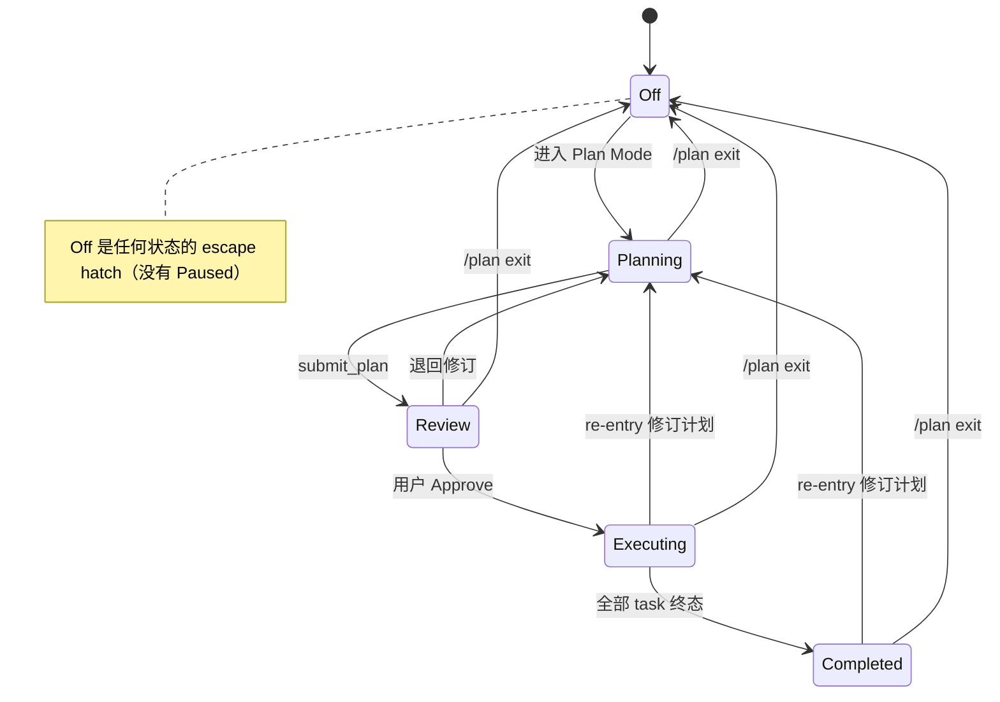
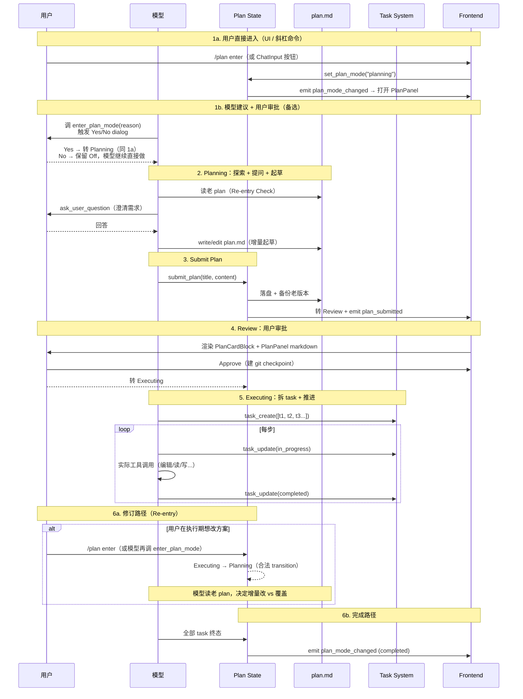

# Hope Agent Plan Mode 架构文档

> 返回 [文档索引](../README.md)
>
> 更新时间：2026-05-02

## 目录

- [概述](#概述)
- [设计哲学：plan ≠ todo](#设计哲学plan--todo)
- [状态机](#状态机)
- [后端架构](#后端架构)
  - [模块结构](#模块结构)
  - [工具清单](#工具清单)
  - [System Prompt 注入](#system-prompt-注入)
  - [Plan 文件持久化](#plan-文件持久化)
  - [Plan → Completed 的自动转换（task 驱动）](#plan--completed-的自动转换task-驱动)
  - [Git Checkpoint](#git-checkpoint)
- [前端架构](#前端架构)
  - [usePlanMode Hook](#useplanmode-hook)
  - [PlanPanel（右侧面板，单一职责）](#planpanel右侧面板单一职责)
  - [PlanCardBlock（消息流摘要）](#plancardblock消息流摘要)
  - [TaskBlock + TaskProgressPanel（进度展示）](#taskblock--taskprogresspanel进度展示)
- [完整交互流程](#完整交互流程)
- [入口一览](#入口一览)
- [事件系统](#事件系统)
- [与 Claude Code / OpenCode 对比](#与-claude-code--opencode-对比)
- [文件清单](#文件清单)

---

## 概述

Plan Mode 是 Hope Agent 的「先想清楚再做」工作模式：模型在动手前把 Context / Approach / Files / Reuse / Verification 写成 markdown 设计文档，用户审批后才进入实施阶段。设计文档（**plan**）是稳定契约，实施进度（**task**）走另一套独立工具——两份各司其职、零同步成本。

适用场景覆盖编程（架构选型、多文件重构、新功能）+ 通用任务（写文章、做调研、整理资料、决策支持）。

**进入 Plan Mode 的核心契约：用户主权**。模型**不能自己转 state**——三条入口都最终由用户拍板：

1. **用户直接进入**：UI 工具栏 Plan 按钮 / `/plan enter` 斜杠命令 / 前端 `set_plan_mode` Tauri 命令 / HTTP API。用户已经表达意图，直接转 Planning state
2. **模型建议 + 用户审批**：`enter_plan_mode` 工具——模型识别非 trivial 任务时调用，**工具内部触发 Yes/No 审批 dialog**，用户接受才转 state，用户拒绝就让模型继续直接做事

这跟 claude-code 的 `EnterPlanMode` 工具设计完全对齐——工具调用本身是"我建议进 plan mode 探索 X"的信号，不是"我现在转 state"的命令。

## 设计哲学：plan ≠ todo

借鉴 claude-code 和 opencode 的双轨分离：

| 抽象 | 角色 | 工具 | 形态 | 生命周期 |
|---|---|---|---|---|
| **plan.md** | 设计契约（用户审批的对象） | `submit_plan` | 自由 markdown，无 checkbox / 无 status 字段 | 审批后冻结，要改重进 Plan Mode |
| **task list** | 实施进度（执行心电图） | `task_create` / `task_update` / `task_list` | 结构化 `{content, activeForm, status}`，三态 | 实施期动态推进，session 持久化 |

历史上 Hope 把这两个概念耦合（plan 文件带 checkbox + 后端 `PlanStep.status` 同步），导致模型既要 `update_plan_step` 又要 `task_update`，两份进度真相必然漂移。2026-05 重构彻底拆开：plan 退回纯设计文档形态，task 系统独占进度追踪。

## 状态机



| 状态 | 含义 | plan.md 可写 | 工具白名单 | 进度追踪 |
|---|---|---|---|---|
| **Off** | 不在 Plan Mode | — | 全部 | task_* 可选（>3 步任务建议用） |
| **Planning** | 模型在制定计划 | ✅ 仅 plan.md | read / grep / glob / web_* / ask_user_question / write(plan only) / exec(approval) | 不追踪 |
| **Review** | 用户审批中 | ❌ 锁 | 同 Planning | 不追踪 |
| **Executing** | 已审批，实施中 | ❌ 冻结 | 全开 | **必须** task_* |
| **Completed** | 全部 task 终态 | ❌ 永久只读 | 全开 | task list 历史保留 |

**没有 Paused 状态**——长时间挂起就 `/plan exit` 退出，需要时再 re-entry；想"暂停"就停止发消息。这是 claude-code 验证过的模式。

合法转移定义在 [`crates/ha-core/src/plan/types.rs::PlanModeState::is_valid_transition`](../../crates/ha-core/src/plan/types.rs)。Re-entry transition (`Executing → Planning` / `Completed → Planning`) 替代了之前的 `amend_plan` 工具，用户想在执行/完成后改方案就重进 Plan Mode 走完整审批流程。

## 后端架构

### 模块结构

```
crates/ha-core/src/plan/
├── mod.rs           # 公开 re-export
├── types.rs         # PlanModeState (5 态) + PlanMeta + PlanVersionInfo + PlanAgentConfig
├── store.rs         # 内存 store + restore_from_db + checkpoint 决策
├── file_io.rs       # plan 文件读写 + 版本备份
├── git.rs           # Git checkpoint 创建/回滚/清理
├── constants.rs     # PLAN_MODE_SYSTEM_PROMPT / PLAN_EXECUTING_SYSTEM_PROMPT_PREFIX 等
├── subagent.rs      # 计划子 Agent 注册（可选）
└── tests.rs         # 状态机 + transition 单测
```

`PlanMeta` 字段（删了 step / paused 后）：
```rust
pub struct PlanMeta {
    pub session_id: String,
    pub title: Option<String>,
    pub file_path: String,
    pub state: PlanModeState,
    pub created_at: String,
    pub updated_at: String,
    pub version: u32,                   // 编辑递增，用于版本备份
    pub checkpoint_ref: Option<String>, // git branch/stash ref
}
```

### 工具清单

| 工具 | 文件 | 作用 | 触发 |
|---|---|---|---|
| `enter_plan_mode` | [`tools/enter_plan_mode.rs`](../../crates/ha-core/src/tools/enter_plan_mode.rs) | 模型**建议**进入 plan mode（带可选 `reason` 参数）。复用 `ask_user_question` 底层基础设施触发 Yes/No dialog；用户接受才转 Planning state；用户拒绝则保持 Off + tool result 告知模型"用户决定不进 plan mode"。Guard 只拒 in-progress 状态（Planning/Review/Executing），允许 `Off` / `Completed` 走完整审批流程（Completed 是状态机允许的 re-entry 路径，让用户能在做完一个 plan 后基于上次 plan 重新规划）。等待用户响应受 `AppConfig.ask_user_question_timeout_enabled` 控制：默认永不超时；开启后复用 `ask_user_question_timeout_secs`，超时按"Skip planning"默认处理（清 pending state + 返回超时 message）让模型继续直接做 | 模型建议 + 用户审批 |
| `submit_plan` | [`tools/submit_plan.rs`](../../crates/ha-core/src/tools/submit_plan.rs) | Planning 末尾写入 plan 文件 + 转 Review state | 模型自主 |
| `ask_user_question` | [`tools/ask_user_question.rs`](../../crates/ha-core/src/tools/ask_user_question.rs) | 制定计划期间向用户结构化提问（澄清需求/方案选择） | Planning 期 |
| `task_create` / `task_update` / `task_list` | [`tools/task.rs`](../../crates/ha-core/src/tools/task.rs) | 进度追踪（实施期唯一进度真相） | Executing 期 |

**已删除的工具**：`update_plan_step`、`amend_plan`、`PlanStep` / `PlanStepStatus` 数据结构、`parser.rs` 整个文件——历史上这些用于 step level 进度追踪，现已被 task 系统取代。

### System Prompt 注入

入口在 [`agent/plan_context.rs::resolve_plan_context_for_session`](../../crates/ha-core/src/agent/plan_context.rs)（核心逻辑在 ha-core，`src-tauri/src/commands/chat.rs` 只 early-resolve plan state 后委托进 chat_engine），按 plan state 分支：

| State | 注入 prompt | 来源常量 |
|---|---|---|
| Planning | 5 阶段规划工作流 + Restrictions + Re-entry Check + 推荐 plan 结构 | `PLAN_MODE_SYSTEM_PROMPT` |
| Review | `# Plan Review` header + 待审批的 plan content | plan content（plan 文件中途消失时 fallback 到 `PLAN_MODE_SYSTEM_PROMPT`） |
| Executing | "plan 已冻结" + "用 task_create 拆 todos + task_update 推进" + plan content | `PLAN_EXECUTING_SYSTEM_PROMPT_PREFIX + plan_content` |
| Completed | 总结指令 + plan content | `PLAN_COMPLETED_SYSTEM_PROMPT + plan_content` |

**Re-entry Check 段**（`PLAN_MODE_SYSTEM_PROMPT` 顶部）强制模型进 plan mode 后**先读老 plan 文件**，按"同任务增量修订 / 不同任务覆盖"分支处理，对齐 claude-code 的 plan-mode-re-entry 设计。

### Plan 文件持久化

- **路径**：`~/.hope-agent/plans/<agent_id>/<session_id>/plan-{YYYYMMDDTHHMMSSZ}-{nano}.md`，按 agent + session 双层子目录物理隔离。模型 ls 自己 session 的目录只看到自己的 plan 文件，跨 session 误读路径堵死（解决"模型 ls /plans 看到所有 session 旧文件，按时间戳挑最新的撞上别 session"的根因）
- **目录构造**：[`paths::session_plans_dir(agent_id, session_id)`](../../crates/ha-core/src/paths.rs) — `agent_id` 与 `session_id` 都做 alphanum + `-` / `_` sanitize 防御 path traversal（深度防御，本身已是 slug/UUID）；[`file_io::session_plans_dir_for(session_id)`](../../crates/ha-core/src/plan/file_io.rs) 内部查 SessionDB 反查 agent_id，DB 缺失（极罕见 session-create vs first-write race）落 `_unknown_agent` bucket 不让写失败
- **老文件迁移**：[`plan::migrate_flat_plans_to_subdirs`](../../crates/ha-core/src/plan/file_io.rs) 在 `app_init::start_background_tasks` primary 块通过 `spawn_blocking` 跑——扫 `~/.hope-agent/plans/*.md` flat 文件，按文件名前 8 字符 short_id 反查 [`SessionDB::find_sessions_by_id_prefix`](../../crates/ha-core/src/session/db.rs)；唯一匹配 → mv 到 `<agent>/<session>/`；多重/未知匹配留 flat + warn 等人工核对。幂等可重复跑
- **版本备份**：覆盖前自动 copy 到 `plan-{...}-v{N}.md`（同 session 子目录内），`N` 在内存 `PlanMeta.version` + 磁盘 `max_disk_version()` 取大者递增（重启后内存计数器重置不会覆盖老备份）
- **写入入口**：`save_plan_file(session_id, content)` —— 唯一被 `submit_plan` 工具调用 + Tauri 命令 `save_plan_content` + HTTP `PUT /api/plan/{sid}/content`
- **读取入口**：`load_plan_file(session_id) -> Result<Option<String>>`

### Plan → Completed 的自动转换（task 驱动）

Executing 期间 plan **完成度的唯一信号源是 task 系统**——历史上由 `update_plan_step` 工具的"全 step 终态"自动收尾，那条路径已删，现在统一走 [`plan::maybe_complete_plan`](../../crates/ha-core/src/plan/transition.rs)（公开 helper）。两条 caller 共用同一 side effect：

- **模型驱动路径** [`tools/task.rs::tool_task_update`](../../crates/ha-core/src/tools/task.rs)：模型调 `task_update(id, status: "completed")` 触发
- **用户驱动路径** [`session::set_task_status_and_snapshot`](../../crates/ha-core/src/session/tasks.rs)：用户在 TaskProgressPanel 手动点完成（或 HTTP `PATCH /api/tasks/{id}/status`）触发

不论哪条路径，逻辑都是：

1. 写入 task 状态 + emit `task_updated` 快照
2. 若本次 status 是 `Completed` → 调 `maybe_complete_plan(session_id, &tasks)`
3. helper 内部检测：
   - 当前 plan state 是 `Executing`
   - **plan-期 task 范围**内全部 task 终态（非空）—— 用 `PlanMeta.executing_started_at` 作为切片点过滤 `task.created_at >= start`，避免遗留 pending task 阻塞自动收尾或单纯完成旧 task 误触发完成
4. 全满足 → `transition_state(Completed, "all_tasks_completed")` 走标准副作用包（cleanup git ref + 清 `meta.checkpoint_ref` + DB persist + emit `plan_mode_changed`）

**`executing_started_at` 持久化**：`PlanMeta.executing_started_at: Option<String>` 由 [`transition_state`](../../crates/ha-core/src/plan/transition.rs) 在转入 Executing 时 stamp（rfc3339 UTC），同时写到 `sessions.plan_executing_started_at` SQLite 列（migration `ALTER TABLE sessions ADD COLUMN plan_executing_started_at TEXT`）。`restore_from_db` 从 DB 读回 stamp 填到内存 PlanMeta，跨会话切换 / app 重启都能正确恢复切片起点；转 Off 时 DB 列清空。无 stamp（崩溃恢复等极端情况）回退到全 session 检查避免死锁——但 stamp 总会在正常流程中存在。

**`plan_completed_at` 精确完成时间**：`sessions.plan_completed_at` 在进入 Completed 时写入；Completed → Off 归档时保留完成事实；重新进入 Planning 时清空，代表开启新 lifecycle。历史 completed 行不以 `sessions.updated_at` 回填，Dashboard 通过 `sampleCount / eligibleCount` 明示精确耗时覆盖率。Plan 索引以 `completedAt` 暴露该字段。

如果模型在 Executing 期没用 task 系统（比如直接做完一两步小事不拆 todos），plan 会停在 Executing 直到用户手动 `/plan exit` 或新一轮 `task_update` 触发自动收尾。这是有意的——task list 为空时无法判断"是否真的全做完"。

### Git Checkpoint

Hope 比 claude-code / opencode 多的高价值能力：

- **创建时机**：`Review → Executing` 转移瞬间（仅当 `should_create_execution_checkpoint` 为 true，避免重复）
- **机制**：在工作目录 git 仓库内创建一个临时 branch 或 stash，`PlanMeta.checkpoint_ref` 记录 ref name
- **清理时机**：`Executing → Completed` 或 `→ Off`（`cleanup_checkpoint`），用户也可通过 `plan_rollback` 命令显式回滚到该点。**`Completed` 路径除了 `cleanup_checkpoint` 删 git ref 外还显式清 `meta.checkpoint_ref = None`**——`set_plan_state(Off)` 走 `map.remove` 整体 drop 不需要，但 `Completed` 保留 PlanMeta 必须显式清，否则 `get_plan_checkpoint` 返回 stale ref 导致前端 Rollback 按钮可点但 git ref 不存在
- **入口**：`create_checkpoint_for_session` / `rollback_to_checkpoint` / `cleanup_checkpoint` 在 [`plan/git.rs`](../../crates/ha-core/src/plan/git.rs)；transition 一致性由 [`transition_state`](../../crates/ha-core/src/plan/transition.rs) 集中

### Mid-turn Plan Mode 收紧（执行层 fallback）

**问题**：模型在普通会话（Off）turn 中途调 `enter_plan_mode` 工具且用户接受后，plan store 实时状态变为 Planning，但当前 turn 的 `AssistantAgent` 是 turn 起始时按 Off 构建的——`plan_agent_mode = Off` 字段不会刷新，turn 内剩余 tool_call 仍能调用 write/edit/apply_patch/canvas 改文件，违反 user-sovereignty 契约（用户同意"先规划"后期望文件不被修改）。

**修复**：`resolve_tool_permission`（[`tools/execution.rs`](../../crates/ha-core/src/tools/execution.rs)）入口加 live state fallback：

```text
if !is_internal_tool
   && ctx.plan_mode_allowed_tools.is_empty()        // turn 起始时 Off 快照
   && live_plan_state ∈ {Planning, Review}          // 实时状态已切换
   && tool_name ∈ PLAN_MODE_DENIED_TOOLS            // 高危 mutation 工具
=> Decision::Deny { reason: "Plan Mode (state: ...) just entered this turn — '...' is denied." }
```

`enter_plan_mode` 工具 result 文本同步告知模型当前 turn schema 已 stale，让它主动收敛到 read-only 工具集（read / grep / glob / find / ls / lsp / web_* / ask_user_question / submit_plan）。下一条 user 消息触发新 agent 重建后走标准 PlanAgent 路径。

## 前端架构

### usePlanMode Hook

[`src/components/chat/plan-mode/usePlanMode.ts`](../../src/components/chat/plan-mode/usePlanMode.ts) 维护 plan 相关 React state，订阅后端事件。

返回值（已瘦身，删了 planSteps / progress / completedCount 等 step 派生字段）：

```ts
{
  planState: PlanModeState           // 5 态
  planContent: string                // plan 文件全文
  showPanel: boolean                 // 右侧 PlanPanel 是否展开
  planCardInfo: { title } | null     // submit_plan 后的卡片摘要
  pendingQuestionGroup: ...          // ask_user_question 待答
  planSubagentRunning: boolean       // 计划子 agent 状态
  enterPlanMode / exitPlanMode / approvePlan / openPlanPanel: () => Promise
}
```

订阅事件：`plan_mode_changed` / `plan_submitted` / `ask_user_request` / `plan_subagent_status`。**不再订阅** `plan_step_updated` / `plan_amended` / `plan_content_updated`（这些事件已删）。

### PlanPanel（右侧面板，单一职责）

[`src/components/chat/plan-mode/PlanPanel.tsx`](../../src/components/chat/plan-mode/PlanPanel.tsx) **只渲染 plan markdown**——这是设计契约的视图。

- 标题栏：版本历史 / Pop Out / 最大化 / 关闭
- 主体：`<MarkdownRenderer content={planContent} />`，所有状态都用 markdown 渲染
- 评论功能：Review/Planning 状态下用户可选中段落给反馈（`<plan-inline-comment>` wrapper 提交回 LLM）
- 底部 action bar：根据 state 显示「Approve」/「Resume」/「Rollback」/「Exit」按钮

**不渲染 step list / progress bar / phase 分组**——任务进度由 TaskBlock + TaskProgressPanel 负责，避免三处重复。

### PlanCardBlock（消息流摘要）

[`src/components/chat/plan-mode/PlanCardBlock.tsx`](../../src/components/chat/plan-mode/PlanCardBlock.tsx) 是 `submit_plan` 后嵌入消息流的卡片，包含：

- 标题 + 「View in panel」链接
- 可选 `summary` 摘要行
- Action 按钮（review 状态：Approve / Exit；executing：执行中；completed：完成）

不再渲染 step phase 分组——简化为简单卡片入口。

### TaskBlock + TaskProgressPanel（进度展示）

进度独立于 Plan Mode，由 task 系统提供：

- [`src/components/chat/message/TaskBlock.tsx`](../../src/components/chat/message/TaskBlock.tsx)：消息流里的**历史快照**，每次 `task_*` 工具调用结果嵌入对应消息气泡
- [`src/components/chat/tasks/TaskProgressPanel.tsx`](../../src/components/chat/tasks/TaskProgressPanel.tsx)：ChatInput 上方的**实时进度面板**，渲染当前 session 全量 task list

PlanPanel = 契约视图，TaskProgressPanel = 实时视图，TaskBlock = 历史视图。三者各司其职零重叠。

## 完整交互流程



## 入口一览

| 路径 | 入口 | 实现 |
|---|---|---|
| 模型建议（带用户审批） | `enter_plan_mode` 工具 → 弹 Yes/No dialog → 用户接受才转 state | [`tools/enter_plan_mode.rs`](../../crates/ha-core/src/tools/enter_plan_mode.rs) |
| 斜杠命令 | `/plan enter / exit / approve / show` | [`slash_commands/handlers/plan.rs`](../../crates/ha-core/src/slash_commands/handlers/plan.rs) |
| 桌面前端 | ChatInput Plan 按钮 → Tauri `set_plan_mode` | [`src-tauri/src/commands/plan.rs`](../../src-tauri/src/commands/plan.rs) |
| HTTP 客户端 | `POST /api/plan/{sid}/mode {state}` | [`crates/ha-server/src/routes/plan.rs`](../../crates/ha-server/src/routes/plan.rs) |
| IM 渠道 | `/plan` 斜杠命令通过 channel/worker/slash 路径 | [`channel/worker/slash.rs`](../../crates/ha-core/src/channel/worker/slash.rs) |

**注意**：Tauri / HTTP 路径都显式 reject `state=="paused"`（保留拒绝逻辑作为客户端兼容兜底，避免外部 API 误用）。

## 事件系统

| 事件 | 触发时机 | Payload | 消费者 |
|---|---|---|---|
| `plan_mode_changed` | state 切换 | `{sessionId, state, reason}` | usePlanMode → 更新 React state |
| `plan_submitted` | submit_plan 工具调用 | `{sessionId, title}` | usePlanMode → 显示 PlanCardBlock + 打开 PlanPanel |
| `ask_user_request` | ask_user_question 工具调用 | AskUserQuestionGroup | PlanPanel → 渲染问答 UI |
| `plan_subagent_status` | 计划子 agent 状态变化 | `{sessionId, status, runId}` | usePlanMode → 显示 "calculating plan..." indicator |
| `task_updated` | task_* 工具调用 | `{sessionId, tasks}` | TaskBlock + TaskProgressPanel |

**已删除的事件**：`plan_step_updated` / `plan_amended` / `plan_content_updated`。

## 与 Claude Code / OpenCode 对比

| 维度 | Hope（重构后） | Claude Code | OpenCode |
|---|---|---|---|
| Plan 形态 | 自由 markdown 设计文档（无 checkbox） | 自由 markdown 设计文档（无 checkbox） | 自由 markdown |
| Plan 进度 | task 系统（独立） | TodoWrite（独立） | todowrite 工具 |
| 双轨分离 | ✅ plan / task | ✅ plan / TodoWrite | ✅ plan / todowrite |
| 工作模式 | 5 状态机（独立 mode） | Plan Mode（独立 mode） | 独立 plan agent（agent 切换） |
| 模型建议入口 | ✅ `enter_plan_mode` 工具（带用户 Yes/No 审批） | ✅ `EnterPlanMode` 工具（带用户审批） | ❌ 用户切 agent |
| Plan 冻结期 | Executing+Completed 全冻结 | 冻结，需 re-entry | plan agent permission deny edit |
| Re-entry | ✅ `Executing/Completed → Planning` | ✅ system-reminder-plan-mode-re-entry | ✅ 切回 plan agent |
| Git Checkpoint | ✅ 独有能力 | ❌ | ❌ |
| 通用任务支持 | ✅ 5 类场景例子 | 编程为主 | 编程为主 |
| Paused 状态 | ❌ 删除（用 exit/stop） | ❌ | ❌ |

Hope 的 Git Checkpoint + 通用任务覆盖是相对 claude-code/opencode 的差异化优势。

## 文件清单

**后端核心**（`crates/ha-core/src/plan/`）：
- `mod.rs` / `types.rs` / `store.rs` / `file_io.rs` / `git.rs` / `constants.rs` / `subagent.rs` / `tests.rs`

**工具实现**（`crates/ha-core/src/tools/`）：
- `enter_plan_mode.rs` / `submit_plan.rs` / `ask_user_question.rs` / `task.rs`
- 工具定义：`definitions/plan_tools.rs` / `definitions/task_tools.rs`

**斜杠命令**：
- `crates/ha-core/src/slash_commands/handlers/plan.rs`
- `crates/ha-core/src/slash_commands/types.rs`（CommandAction::EnterPlanMode / ExitPlanMode / ApprovePlan / ShowPlan）

**Tauri 命令**：
- `src-tauri/src/commands/plan.rs`：`get_plan_mode` / `set_plan_mode` / `get_plan_content` / `save_plan_content` / `respond_ask_user_question` / `get_pending_ask_user_group` / `get_plan_versions` / `load_plan_version_content` / `restore_plan_version` / `plan_rollback` / `get_plan_checkpoint` / `get_plan_file_path` / `cancel_plan_subagent`

**HTTP 路由**：
- `crates/ha-server/src/routes/plan.rs`：`/plan/{sid}/mode` / `/content` / `/versions` / `/version/load` / `/version/restore` / `/rollback` / `/checkpoint` / `/file-path` / `/pending-ask-user` / `/cancel`

**前端核心**：
- `src/components/chat/plan-mode/usePlanMode.ts`：状态 + 事件订阅
- `src/components/chat/plan-mode/PlanPanel.tsx`：右侧面板（纯 markdown 渲染）
- `src/components/chat/plan-mode/PlanCardBlock.tsx`：消息流卡片
- `src/components/chat/plan-mode/CommentPopover.tsx` / `usePlanComment.ts`：inline 评论
- `src/PlanDetachedWindow.tsx`：独立窗口（Pop Out）

**Task 系统（进度追踪）**：
- `src/components/chat/message/TaskBlock.tsx`：消息流历史
- `src/components/chat/tasks/TaskProgressPanel.tsx` / `taskProgress.ts` / `useTaskProgressSnapshot.ts`：实时面板

**已删除的文件**（历史参考）：
- `crates/ha-core/src/tools/plan_step.rs`
- `crates/ha-core/src/tools/amend_plan.rs`
- `crates/ha-core/src/plan/parser.rs`
- `src/components/chat/plan-mode/PlanStepItem.tsx`
- `src/components/chat/plan-mode/PlanBlock.tsx`
- `src/components/chat/plan-mode/PlanActionBar.tsx`
- `src/components/chat/plan-mode/planParser.ts`

---

## 历史 Plan 索引（只读）

> 新增于 2026-05-11。

跨会话浏览 / `@plan:` mention / Dashboard 统计共用同一索引层 [`crates/ha-core/src/plan/index.rs`](../../crates/ha-core/src/plan/index.rs)。两个核心入口：

- `list_all_plans(filter: PlanIndexFilter)`：扫 `~/.hope-agent/plans/<agent>/<session>/` 二级目录，对每个 session 取**当前 plan 文件**（排除 `-v{N}.md` 备份）+ 文件 mtime + version 总数；再用 `SessionDB::get_session` 反查 session 元信息（title / project_id / 持久化的 `plan_mode`）。运行时 state 优先从内存 `PLAN_STORE` 取，缺失回退到 `sessions.plan_mode`。`orphan = true` 标识 session 行已删但 plan 文件残留。
- `resolve_plan_mention(short_id, version)`：把前 4–16 位的 session id 前缀解析回唯一 `(session_id, agent_id, file_path)`。`version = 0` 选当前；`version > 0` 走 `list_plan_versions` 找 `-v{N}.md`。

**为什么不引入 `plans` 索引表**：plan 双源持久化（文件系统 + `sessions.plan_mode`）已足够，扫盘成本在 < 5000 plan 规模下 < 50ms；引入新表需要事件驱动写 + 迁移脚本 + drift 风险，相对收益不值。如果未来 plan 总数破万，再做事件表迁移。

**前端调用面**：
- Tauri: `list_plans` / `resolve_plan_mention` ([`src-tauri/src/commands/plan_index.rs`](../../src-tauri/src/commands/plan_index.rs))
- HTTP: `POST /api/plan/list` / `POST /api/plan/resolve-mention` ([`crates/ha-server/src/routes/plan.rs`](../../crates/ha-server/src/routes/plan.rs))

**Plans View 只读契约**（[`src/components/plans/PlansView.tsx`](../../src/components/plans/PlansView.tsx)）：右侧详情面板**严格不暴露写接口**——复用 `PlanPanel` 时通过 `planState="off"` + 不传 `onApprove` / `onRequestChanges` / `onExit` 强制屏蔽编辑路径；版本列表里的 restore 按钮也仅在 `planning` / `review` 状态显示（详情见 [PlanPanel.tsx](../../src/components/chat/plan-mode/PlanPanel.tsx)）。

**`@plan:<short>:v<n>` mention 协议**：
- 解析端：[`src/components/chat/plan-mention/parsePlanMentions.ts`](../../src/components/chat/plan-mention/parsePlanMentions.ts) 正则 `/@plan:([0-9a-f]{4,16})(?::v(\d+))?/gi`，与现有 file-mention 不冲突（首 token `plan:` 前缀消歧）
- 展开端：[`expandPlanMentions.ts`](../../src/components/chat/plan-mention/expandPlanMentions.ts) 调 `resolve_plan_mention` → 把 plan 文件作为 `text/markdown` attachment append 到 `attachments[]`，与 `expandMentionsToAttachments` 共用 dedup-by-file_path 路径

**Dashboard Plan stats**：Plan 指标已并入“目标与执行 → Plan 与 Task”，由 [`dashboard/control_plane.rs`](../../crates/ha-core/src/dashboard/control_plane.rs) 按 created cohort 统计完成率、activeNow、状态/Agent/项目/趋势与精确 P50。旧 [`dashboard/plan_stats.rs`](../../crates/ha-core/src/dashboard/plan_stats.rs) 命令和 API 保留兼容。独立 Plans View 继续是只读历史页，负责正文、版本、`@plan` 引用与跳回会话，不重复承担统计。

## 变更历史

- **2026-05-11**：跨会话 plan 索引（`list_all_plans` / `resolve_plan_mention`）+ Plans 全局只读 view + `@plan:<short>:v<n>` mention 协议 + Dashboard Plan 统计。PlanPanel 版本按钮放开到所有 state，已归档 plan 可回看历史版本，restore 仍仅在 `planning` / `review` 可点。
- **2026-05-02**：plan / task 解耦重构。Plan 退回纯设计文档（无 checkbox / 无 step status），task 系统独占进度追踪；删除 Paused 状态；删除 amend_plan / update_plan_step / PlanStep；新增 `enter_plan_mode` 工具（**建议+用户审批**语义，模型不能自己转 state，复用 ask_user_question 底层基础设施）；新增 task 全部完成时自动转 `Completed` state 路径（[`tools/task.rs::maybe_complete_plan`](../../crates/ha-core/src/tools/task.rs)）；PlanPanel 单一职责改为只渲染 markdown。同 PR 内三处 codex review 修复：(1) 执行层 mid-turn Plan Mode fallback——`resolve_tool_permission` 入口实时检查 plan store 兜住 turn 中切 plan mode 后剩余 schema 仍含 mutation 工具的漏洞；(2) `PlanMeta.executing_started_at` 时间戳 + `maybe_complete_plan` 按 plan-期 task 范围判定，避免遗留 pending task 阻塞自动收尾或误触发；(3) `transition_state` 在 Completed 路径显式清 `meta.checkpoint_ref` 避免 stale rollback ref
- **2026-03-29**：六态状态机 + 双 Agent 模式（已废弃，见上述重构）
