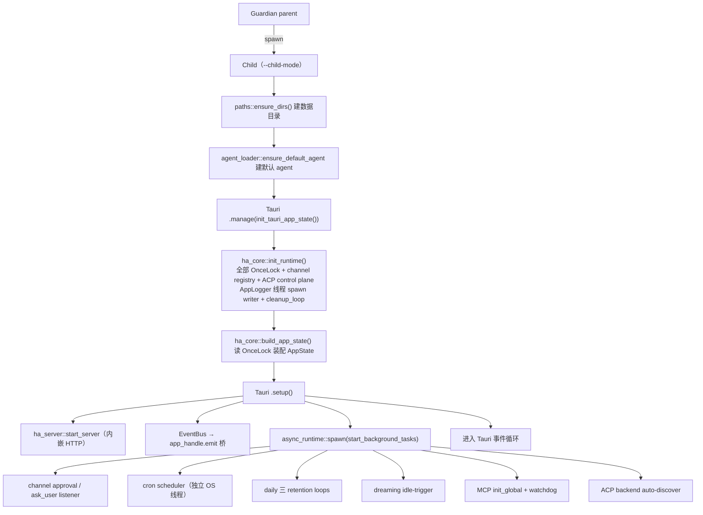
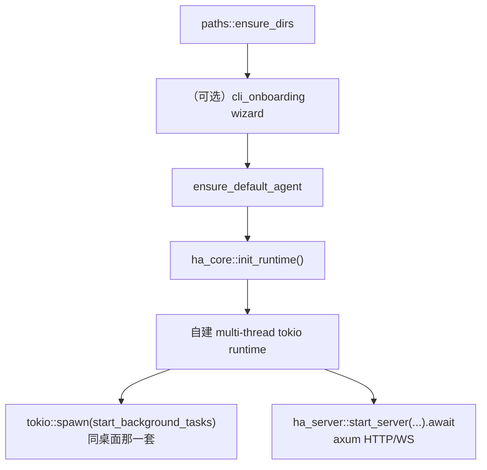
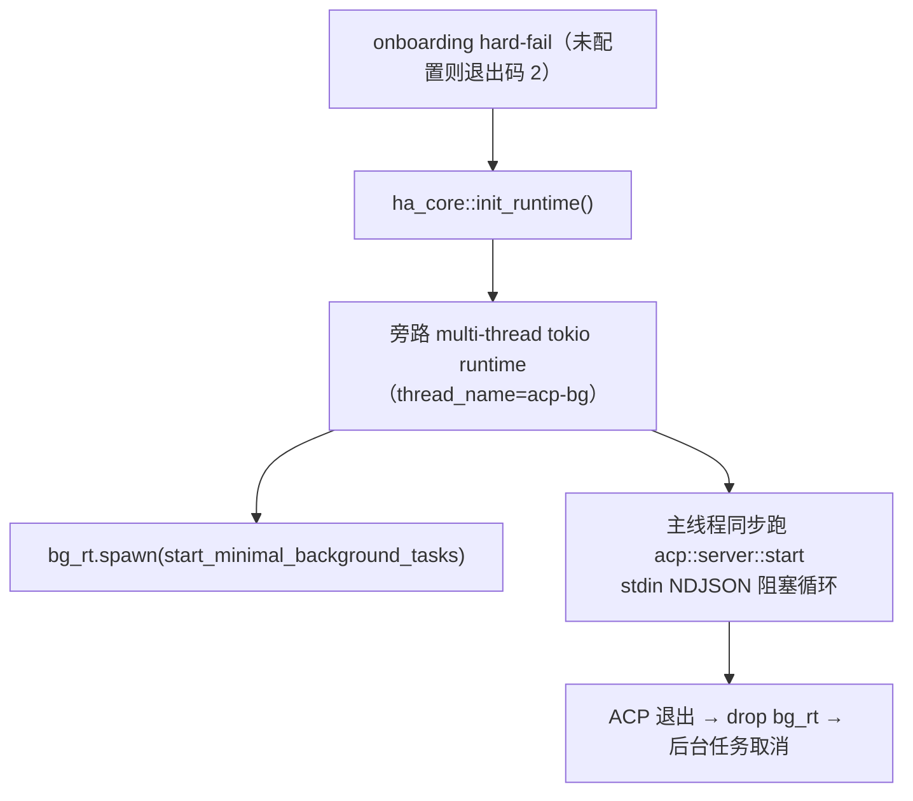

# 进程与并发模型

> 返回 [文档索引](../README.md) | 更新时间：2026-04-25 | 关联源码：[`src-tauri/src/main.rs`](../../src-tauri/src/main.rs)、[`guardian.rs`](../../crates/ha-core/src/guardian.rs)、[`app_init.rs`](../../crates/ha-core/src/app_init.rs)、[`logging/app_logger.rs`](../../crates/ha-core/src/logging/app_logger.rs)、[`cron/scheduler.rs`](../../crates/ha-core/src/cron/scheduler.rs)

Hope Agent 的后台工作单元分四层。工程排查常见问题（"为什么重启才生效"、"哪个任务挂了但日志看不出来"）多半落在某一层。

| 层级 | 载体 | 谁创建 | 典型代表 |
|------|------|--------|----------|
| A · 二进制运行模式 | 真·独立 OS 进程 | `main()` 按 argv 分派 | `hope-agent` GUI / `hope-agent server` / `hope-agent acp` |
| B · 独立 OS 线程 | `std::thread::spawn` + 独立 tokio Runtime | 需要 Send 豁免或绕开 Tauri reactor 时序 | AppLogger writer、Cron 调度器、Weather 后台刷新 |
| C · 长驻 tokio 任务 | `tokio::spawn` 复用主 runtime | `start_background_tasks()` + 子系统 spawn | Channel worker、ask_user 清理、async_jobs retention |
| D · 动态子进程 | `Command::spawn` / `tokio::process` | 工具 / ACP / Docker / 系统服务安装 | `exec` 工具、Codex CLI、launchd plist |

**关键事实**：三种模式共享 [`ha_core::init_runtime()`](../../crates/ha-core/src/app_init.rs) 这一个初始化入口，所有 OnceLock 单例（SessionDB / ProjectDB / LogDB / AppLogger / MemoryBackend / CronDB / ChannelRegistry / ChannelDB / SubagentCancelRegistry / EventBus 等）在三种模式下都会被注入。后台任务的差异由调用 `start_background_tasks()`（桌面 + server）还是 `start_minimal_background_tasks()`（acp）决定——ACP 是 IDE 拉起的单次会话进程，不需要 daily 节流循环、cron 调度器、channel auto-start、dreaming idle 触发器、MCP watchdog。详细对照见下文「跨模式能力对照」。

---

## Layer A · 二进制运行模式

`hope-agent` 是单一可执行文件，入口在 [`src-tauri/src/main.rs`](../../src-tauri/src/main.rs)。按首个 argv 分派：

| argv 模式 | 处理入口 | 含义 |
|-----------|----------|------|
| `hope-agent acp [...]` | `run_acp_server` | stdio ACP 子进程（被 IDE / Claude Code 等拉起） |
| `hope-agent server [...]` | `run_server` | 前台 HTTP/WS 守护进程；`server install/uninstall/status/stop/setup` 走同入口分派子命令 |
| `hope-agent --child-mode` 或 `HOPE_AGENT_CHILD=1` | `run_child` | Guardian 派生的子进程，真正加载 Tauri GUI |
| 其它（含无参） | `run_guardian` / `run_child` | Release 默认走 Guardian 父子；Dev / `config.guardian.enabled=false` 直接 `run_child` |

三种模式共享同一个 `ha-core` 库——Provider / Tool Loop / Memory 等**业务代码**复用；但是否启动 Layer B/C 的后台驱动由各模式的 `fn run_*` 自行决定，详见下文「跨模式能力不对等」。

### Guardian 父子模式（Release GUI）

Release 桌面默认启用 [`ha_core::guardian::run_guardian`](../../crates/ha-core/src/guardian.rs)，父进程不跑 Tauri 只做监工，child 以 `--child-mode` 加载 GUI。崩溃计数超 `GuardianConfig.diagnosis_threshold`（默认 5）触发备份 + 自诊断，再超 `max_crashes`（默认 8）放弃。child 自身还有一层 `catch_unwind` + `MAX_CHILD_PANICS = 3`（定义在 [`src-tauri/src/main.rs`](../../src-tauri/src/main.rs)）兜底非 fatal panic，不必走到父 Guardian 层。

两条关键协议（并发视角必须知道的）：

- **`exit(42)` = 立即重启**：child 主动 `std::process::exit(EXIT_CODE_RESTART)` 请求无冷却重启（crash_count 不累加），用于 auto-fix / 配置热切换等场景
- **恢复标记传递**：崩溃恢复重启前父 `Command` 注入 `HOPE_AGENT_RECOVERED=1` + `HOPE_AGENT_CRASH_COUNT=N`，child 可据此做「上次是崩溃恢复」UI 提示

> 完整参数表、退出码协议细节、Self-Diagnosis prompt 与 Auto-Fix 覆盖范围、Crash Journal schema 见 [reliability.md](reliability.md)，本文不复述。

**不适用范围**：`hope-agent server` 由 launchd / systemd 托管重启，`hope-agent acp` 由 IDE 控制生命周期，两者都绕开 Guardian；`config.guardian.enabled = false` 或 Debug 构建也跳过父子分离。

### 多进程数据共享

三种模式同时运行时共用 `~/.hope-agent/` 下的文件：

- **`config.json`**：进程**内**用 [`cached_config()`](../../crates/ha-core/src/config/) ArcSwap 快照 + [`mutate_config()`](../../crates/ha-core/src/config/persistence.rs) 写锁串行，跨进程无锁——A 进程改了 B 进程要等文件级事件或重启才能感知
- **SQLite**（`session.db` / `logs.db` / `memory.db` / `cron.db` / `channels.db` 等）：全部 `PRAGMA journal_mode=WAL`，多进程并发读、单 writer 串行
- **EventBus**：进程**内**事件总线；跨进程必须走 HTTP/WS 或 stdio
- **OAuth 凭据**（`credentials/auth.json`）：读时按需 refresh，写时 best-effort。多进程同时 refresh 可能互相覆盖，token 有效期长容忍这种竞态

**跨进程互斥空白**：GUI 和 server 两种模式**不要**同时起同一套 Channel worker——IM 长轮询在两边都跑会对上游 double-poll，当前靠部署习惯规避（server 模式独立起 worker，GUI 内嵌 server 共进程），无代码级互斥锁。Cron 同理。

---

## Layer B · 独立 OS 线程（各带独立 tokio Runtime）

固定模式：`std::thread::spawn(|| Runtime::new().block_on(...))`。走这条路径的动机只有两个：

1. **Tauri `.manage()` 时机**：桌面 GUI 启动时，`init_app_state()` 在 Tauri reactor 就绪前就要建 `AppLogger` 等全局单例，此时 `tokio::spawn` 会 panic "no reactor"——必须自带 runtime 的线程
2. **`Send` 豁免**：有些内层持有非 `Send` 借用（典型：跨 `.await` 的 `MutexGuard`），用独立 current-thread runtime 包住整段 future，父 async 上下文只 `join()` 线程句柄

### 长驻型

| 线程 | 位置 | 职责 |
|------|------|------|
| **AppLogger writer** | [`logging/app_logger.rs`](../../crates/ha-core/src/logging/app_logger.rs) | mpsc channel 收 `PendingLog` → 批量写 SQLite + 纯文本文件。cleanup_loop 作为同 runtime 内 `tokio::spawn` 任务附着 |
| **Cron 调度器** | [`cron/scheduler.rs`](../../crates/ha-core/src/cron/scheduler.rs) | 独立线程 `cron-scheduler` + `new_multi_thread` runtime（2 worker threads）跑 tick 循环 |
| **Weather 后台刷新** | [`weather.rs::start_background_refresh`](../../crates/ha-core/src/weather.rs) | 定时拉取天气 API 注入 system prompt |
| **Guardian Windows 信号监听** | [`guardian.rs`](../../crates/ha-core/src/guardian.rs) | Windows 无 POSIX 信号，用一条迷你线程跑 current-thread runtime 接 `ctrl_c` / `ctrl_break`（仅 `#[cfg(windows)]`） |

### 每次调用 spawn 一次（任务完成线程即回收）

在业务路径里按需创建，线程寿命 = 目标任务寿命，不是后台守护，只是 runtime 豁免门票：

| 入口 | 位置 | 触发时机 |
|------|------|----------|
| Subagent spawn | [`subagent/spawn.rs`](../../crates/ha-core/src/subagent/spawn.rs) | 模型调 `subagent(action="spawn_and_wait" / "spawn")`，子会话独立跑 |
| Subagent injection | [`subagent/injection.rs`](../../crates/ha-core/src/subagent/injection.rs) | 子会话结果注入回父会话 |
| Async Jobs spawn | [`async_jobs/spawn.rs`](../../crates/ha-core/src/async_jobs/spawn.rs) | `exec` / `web_search` / `image_generate` 异步化执行 |
| Async Jobs injection | [`async_jobs/injection.rs`](../../crates/ha-core/src/async_jobs/injection.rs) | 异步 job 完成后结果注入主对话 |
| Agent context 构造 | [`agent/context.rs`](../../crates/ha-core/src/agent/context.rs) | 特定跨 `.await` 借用路径用独立线程规避 Send 问题 |

> **识别技巧**：grep `tokio::runtime::Builder::new_current_thread()` 能一眼看出谁在走这条路。一共 ~8 处，全集中在 subagent / async_jobs / agent_context / channel 少数几个渠道实现里。

---

## Layer C · 长驻 tokio 任务（复用主 runtime）

相对 Layer B，这里直接 `tokio::spawn` 挂到所在模式的主 runtime，不再开新线程。

### 启动入口（桌面独占）

[`ha_core::app_init::start_background_tasks()`](../../crates/ha-core/src/app_init.rs) 集中拉起绝大多数 Layer C 任务，**当前仅在桌面 Tauri `.setup()` 里 await**（见 [`src-tauri/src/setup.rs`](../../src-tauri/src/setup.rs) `L215`）。`hope-agent server` / `hope-agent acp` 不调用——见下节「跨模式能力不对等」。

### 清单（均为桌面模式）

| 任务 | 周期 | 位置 |
|------|------|------|
| ask_user 启动清理 + 每日定时清理 | 启动一次 + `SECS_PER_DAY` | [`app_init.rs`](../../crates/ha-core/src/app_init.rs) `start_background_tasks` 内 |
| Channel 自动启动已启用账户 | 启动一次 | [`app_init.rs`](../../crates/ha-core/src/app_init.rs) |
| Async Jobs 残留回放 | 启动一次 | [`async_jobs::replay_pending_jobs`](../../crates/ha-core/src/async_jobs/) |
| Async Jobs retention 轮询 | 启动一次 + 每日 | [`async_jobs::spawn_retention_loop`](../../crates/ha-core/src/async_jobs/retention.rs) |
| Recap facet retention 轮询 | 启动一次 + 每日 | [`recap::spawn_facet_retention_loop`](../../crates/ha-core/src/recap/) |
| Dreaming 空闲触发 | 每 60s 检查（`MissedTickBehavior::Skip`） | [`app_init.rs`](../../crates/ha-core/src/app_init.rs) → [`memory::dreaming`](../../crates/ha-core/src/memory/dreaming/) |
| **Channel worker 主循环**（每账户一条） | 轮询 / 长连接取决于渠道协议 | [`channel/worker/`](../../crates/ha-core/src/channel/worker/) |
| **ACP 健康检查**（仅内嵌 ACP runtime） | 周期 ping | [`acp_control/health.rs`](../../crates/ha-core/src/acp_control/health.rs) |

模式无关的两类：

| 任务 | 模式 | 位置 |
|------|------|------|
| Server HTTP listener | 桌面内嵌 + `hope-agent server` 独立 | [`ha_server::start_server`](../../crates/ha-server/src/lib.rs) |
| AppLogger cleanup（挂在 logger runtime，不是主 runtime） | 三种模式（`init_runtime` 注入） | [`logging/app_logger.rs::cleanup_loop`](../../crates/ha-core/src/logging/app_logger.rs) |

### 设计约定

- **一律用 `tokio::time::interval(...)`** 而不是 `loop { sleep }`——可以精确控制首 tick 是否立即 fire、是否 `MissedTickBehavior::Skip` 跳过堆积 tick
- **幂等**：任何任务都可能因为 Guardian 重启而重跑；启动一次性的清理（如 ask_user 过期）都要写成「重复跑 no-op」，不假设前一次残留
- **失败不 panic**：tokio 任务 panic 只杀自身不杀 runtime，但依旧要用 `match` + `app_warn!` 记录而非 `unwrap()`——否则日志静默消失
- **共享 AtomicBool 串行化**：Dreaming 等「可能被多路触发」的任务在入口拿全局 `AtomicBool` 做互斥，防 idle-trigger 和手动触发叠跑

### Primary / Secondary 协作（多进程并存）

`init_runtime()` 起手就调 [`runtime_lock::acquire_or_secondary`](../../crates/ha-core/src/runtime_lock.rs)，在 `~/.hope-agent/runtime.lock` 上抢一把 OS 级 advisory exclusive lock：

- **Unix**：`flock(LOCK_EX | LOCK_NB)`，文件 fd 带 `O_CLOEXEC` 防 Guardian fork 继承
- **Windows**：`OpenOptions::share_mode(FILE_SHARE_READ)` 写独占（挡其它 writer 的 ERROR_SHARING_VIOLATION，但放行同进程只读诊断 `current_holder()`，故不用 `FILE_SHARE_NONE`）+ `FILE_FLAG_NO_INHERIT_HANDLE`
- **共同**：进程退出 / panic / SIGKILL / 断电时 OS 自动释放，无 heartbeat 调度依赖

第一个抢到的进程是 **Primary**，第二个起来的是 **Secondary**。模式不参与（first-come-first-served）：单跑 ACP 时 ACP 自然成为 Primary 并完成 cleanup；桌面 + ACP 共存时桌面通常先抢，ACP 退让为 Secondary。

**Primary-only 子系统**——这些会写共享 SQLite 状态或竞争外部资源，多进程并发会互相破坏：

| 子系统 | Primary-only 原因 |
|--------|------------------|
| `subagent::cleanup_orphan_runs` | 否则 mark live runs 失败 |
| `team::cleanup::cleanup_orphan_teams` | 同上的级联 |
| `session::cleanup_orphan_incognito` | **硬 DELETE incognito 会话** + cascade messages |
| `cron::start_scheduler` | 两个 scheduler tick 会双 claim 同一 cron job |
| `async_jobs::replay_pending_jobs` | 否则把 Primary 还在跑的 async 工具标 Interrupted |
| `async_jobs` / `recap` retention 循环 | 跨进程并行扫 spool 文件互相删 |
| Daily ask_user purge 循环 | 撞同一 SQLite |
| Dreaming idle-trigger 循环 | `DREAMING_RUNNING` AtomicBool 仅进程内互斥 |
| Channel auto-start | 同一 Telegram bot account 被两个进程抢 webhook |
| MCP watchdog 循环 | 两个 watchdog 重复重连同一 MCP server |
| ACP backend auto-discover | 抢 `acp_runs` 行 |

**Tier-agnostic（所有 tier 都跑）**：

| 子系统 | 理由 |
|--------|------|
| `init_runtime()`（DB / OnceLock 注入） | 进程内单例，多进程各持各的引用 |
| `build_app_state()` | 仅桌面调用（Tauri AppState） |
| Channel 入站 dispatcher（自带独立线程） | EventBus 单订阅者 |
| Channel approval / ask_user listener | EventBus 多订阅者无害；按 `channel_account_id` 路由 |
| MCP `init_global`（仅 catalog 注册） | 幂等；catalog snippet 所有模式都要看到 |
| Manual API（`run-now` / `dreaming::manual_run` / `start_account` 按钮） | 走原子 SQL claim 等 race-safe 入口 |

**incognito 双重防御**：除 `runtime_lock::is_primary()` gate 之外，[`purge_orphan_incognito_sessions`](../../crates/ha-core/src/session/db.rs#L1561) SQL 还过滤 `AND updated_at < now-60s`——即便锁逻辑回归，刚刚创建或写入的活会话也不会被删。

**合法 cleanup 场景仍正常工作**：Guardian 重启 child / launchd 重启 daemon / 物理断电后下次启动 / `kill -9` 后下次启动——这些场景下"上一进程"的 fd 已被 OS 关闭，lock 自动释放，下次启动的进程抢到 lock 成为新 Primary，跑 cleanup 清前一次残骸。

### 跨模式能力对照

三种模式共享 `init_runtime()`，差异在后台任务层和 Primary 选举结果。

| 子系统 / 调用 | 桌面 GUI | `hope-agent server` | `hope-agent acp` |
|---------------|:-------:|:-------------------:|:----------------:|
| `init_runtime("role")`（DB + OnceLock + lock 选举） | ✓ | ✓ | ✓ |
| `build_app_state()`（构造 Tauri `AppState`） | ✓ | ✗ | ✗ |
| `start_background_tasks()` | ✓ | ✓ | ✗ |
| `start_minimal_background_tasks()` | ✗ | ✗ | ✓ |
| Channel 入站 dispatcher | ✓ | ✓ | ✓ |
| Channel approval / ask_user listener | ✓ | ✓ | ✓ |
| MCP `init_global`（catalog） | ✓ | ✓ | ✓ |
| **Primary-only 子系统**（cron / channel auto-start / dreaming / retention / MCP watchdog / async_jobs replay / ACP discover / incognito purge / 三件套 cleanup） | 抢到 lock 时 ✓ | 抢到 lock 时 ✓ | 抢到 lock 时 ✓（典型 ACP-only 场景） |
| EventBus → Tauri 前端桥 | ✓ | ✗ | ✗ |
| 内嵌 HTTP server（`ha_server::start_server`） | ✓ | ✓（独立运行而非内嵌） | ✗ |
| ACP stdio 主循环 | ✗ | ✗ | ✓ |

ACP minimal 的"少做"主要是后台 tier 选择（不跑 cron / dreaming / channel auto-start / watchdog 这些长跑循环），加上 Primary-only gate 兜底。

---

## Layer C′ · 阻塞工作隔离（`spawn_blocking` 池）

Layer A–D 之外的一条横切约定，专治「同步阻塞把 async runtime 拖垮」。

**背景**：全app 每个 SQLite 库（`sessions` / `cron` / `channel` / `logs`）都是同步 rusqlite 藏在 `Mutex<Connection>` 后面；config 持久化在全局写锁内做同步文件 IO（写前校验读 + autosave 拷贝 + `fs::write`）。直接从 `async fn` 里 inline 调用，会把一个 tokio worker 钉住整个「锁等待 + IO」时长。桌面默认 runtime 的 worker 只有 `num_cpus` 个（Windows 笔记本常 2–4）；一旦底层文件 IO 卡住（杀软实时扫描、云同步的 home 目录、慢盘），worker 被逐个吃光直到整个 runtime 饿死——表现为「进程还活着，但发消息永久转圈、设置页全部加载中」（issue #433 Bug 2 复现于 Windows）。

**单一入口**：[`ha_core::blocking::run_blocking(f)`](../../crates/ha-core/src/blocking.rs) —— 把同步闭包丢到 tokio 的 blocking 池（数百条可挥霍的线程）并 `await`，卡住的库 / config 写只降级该功能，不再冻结全 app。慢于 5s 的 op 会 `app_warn!("blocking", ...)` 带闭包定义点落进 `logs.db`，把下次现场的卡死 IO 从 heisenbug 变成可 grep 的证据。

**两个便捷包装**（调用方优先用它们）：

| 包装 | 位置 | 用途 |
|------|------|------|
| `SessionDB::run(\|db\| ...)` | [`session/db.rs`](../../crates/ha-core/src/session/db.rs) | `Arc<SessionDB>` 上的所有同步方法（读 + 写）在 async 上下文里的唯一调用姿势 |
| `config::mutate_config_async(reason, f)` | [`config/persistence.rs`](../../crates/ha-core/src/config/persistence.rs) | `mutate_config` 的 spawn_blocking 版；async 上下文改配置走它 |

**红线（新增 async 路径必守）**：`src-tauri` 命令与 `ha-server` handler 里，任何 SessionDB / CronDB / ChannelDB / ProjectDB / LogDB 的同步调用、以及 `mutate_config` / provider crud 等走同步文件 IO 的 helper，**一律经 `run_blocking` / `SessionDB::run` / `mutate_config_async` 下放到 blocking 池，禁止 inline 在 async fn 里直接调**。例外：`cached_config()` / `load_config()` 是 lock-free 快照读，无需下放；已在独立 OS 线程 / 自建 runtime（Layer B）里跑的同步代码不重复包裹。相邻的多个同步调用应合并进**一个** `run_blocking` 闭包（保持原有顺序与错误语义），避免每调一次跳一次线程。

**附带加固**：config 的 load-failure 恢复读盘（`recover_from_load_failure`）加 2s 冷却——`config.json` 短暂不可读时，设置页一次打开会触发 ~20 次 `load_config()`，旧逻辑每次都同步重读该不可读文件，冷却把这波「文件已经在闹脾气时的读 IO 风暴」压成每 2s 至多一次；用户可见的 Retry 路径（`config_health`）不受节流。

---

## Layer D · 动态子进程（`Command::spawn`）

按需拉起的外部二进制，分三类：

### D1 · 长驻式子进程（生命周期跟上层状态绑定）

| 场景 | 位置 | 生命周期 |
|------|------|----------|
| **ACP 运行时**（Codex CLI / Claude Code 等） | [`acp_control/runtime_stdio.rs`](../../crates/ha-core/src/acp_control/runtime_stdio.rs) | 会话存活期间，配 [`acp_control/health.rs`](../../crates/ha-core/src/acp_control/health.rs) 健康检查 |
| **IM Channel 子进程**（部分协议实现） | [`channel/process_manager.rs`](../../crates/ha-core/src/channel/process_manager.rs) | 账户启用期间 |
| **Docker 容器**（SearXNG / 部署目标） | [`docker/lifecycle.rs`](../../crates/ha-core/src/docker/lifecycle.rs), [`docker/deploy.rs`](../../crates/ha-core/src/docker/deploy.rs) | 容器自身生命周期；Hope Agent 退出不一定 kill |

### D2 · 单次调用型（短命，完成即回收）

| 场景 | 位置 |
|------|------|
| `exec` 工具（用户命令执行 + PTY） | [`tools/exec.rs`](../../crates/ha-core/src/tools/exec.rs) |
| Sandbox 隔离执行 | [`sandbox.rs`](../../crates/ha-core/src/sandbox.rs) |
| Plan Mode git 调用 | [`plan/git.rs`](../../crates/ha-core/src/plan/git.rs) |
| Skill 依赖安装（brew / npm / go / uv） | [`skills/commands.rs`](../../crates/ha-core/src/skills/commands.rs) |
| Provider / Docker 代理探测 | [`provider/proxy.rs`](../../crates/ha-core/src/provider/proxy.rs), [`docker/proxy.rs`](../../crates/ha-core/src/docker/proxy.rs) |
| 跨平台原语（打开终端 / 检测环境） | [`platform/mod.rs`](../../crates/ha-core/src/platform/) |
| Agent loader 初始化（git clone 默认模板） | [`agent_loader.rs`](../../crates/ha-core/src/agent_loader.rs) |
| 托盘（macOS 打开 URL / 通知） | [`src-tauri/src/tray.rs`](../../src-tauri/src/tray.rs) |

### D3 · 一次性系统注册（不拉起进程，只落配置）

`hope-agent server install` 把 [`platform/service.rs`](../../crates/ha-core/src/platform/service.rs) 的 plist / unit 写入系统（`service_install.rs` 仅是转发到 `platform::service` 的兼容薄壳），由 launchd / systemd 真正去执行 `hope-agent server start`：

- macOS：`~/Library/LaunchAgents/ai.hopeagent.server.plist`（label = `SERVICE_LABEL` 常量）
- Linux：`~/.config/systemd/user/hope-agent.service`
- Windows：暂不支持 `server install`，走 Task Scheduler 手动方案，见 [`windows-development.md`](../platform/windows-development.md)

文件格式与参数细节见 [backend-separation.md §系统服务集成](backend-separation.md)。

安装后 `hope-agent server` 作为 Layer A 的独立进程被 launchd / systemd 守护，和 Guardian 无关——**不要给 server 再套 Guardian**，两层重启语义会打架。

---

## 生命周期与清理

### 启动顺序

桌面 GUI（child 模式）：

`hope-agent server`：

`hope-agent acp`：

每个 ACP `session/prompt` 在 `run_agent_chat` 内部用 `current_thread` runtime + `block_on` 跑工具循环，与外层旁路 runtime 互不嵌套。

### 退出路径

| 退出源 | 行为 |
|--------|------|
| Guardian 收到 SIGTERM/SIGINT/CTRL_BREAK | 不再重启 child，父子一起退 |
| Child 正常 `exit(0)` | Guardian 认为是用户主动退出，父进程也退 |
| Child `exit(42)` | Guardian 视为「请求立即重启」（如自诊断 auto-fix 后），crash_count 不累加 |
| Child 非 0 非 42 退出 | 崩溃计数 +1，指数退避后重启；达阈值跑备份 + 自诊断 |
| tokio 任务 panic | 只杀任务自身，不杀进程；靠 `app_warn!` 记录 |
| 独立线程 panic | 只杀该线程；AppLogger writer 若 panic，消息积压到 mpsc 满后 `eprintln!` 兜底 |

### 已知空白

- **Layer B 长驻线程无统一 join**：AppLogger / Cron / Weather 在进程退出时被 OS 回收，没显式 `shutdown()`。正常退出靠 mpsc channel 关闭 → loop 自然退出；`std::process::exit()` 强退不走这条路
- **ACP / Docker / Channel 子进程无统一终止钩子**：各自实现 `Drop` / `shutdown()`，退出时是否 kill 子进程取决于模块；Guardian 强杀 child 可能留 orphan 子进程——已知代价
- **Cron / Channel 跨进程重复触发**：见 Layer A 多进程数据共享章节
- **ACP `acp::server::start` 仍是同步签名**：依赖外层 main 包旁路 runtime + 主线程同步 stdin。完全 async 化是 follow-up。

---

## 排查指引

| 症状 | 先看 |
|------|------|
| UI 保存配置没生效 | `cached_config()` vs `mutate_config()` —— 见 [config-system.md](config-system.md) |
| Cron / Channel 任务停了 | 桌面 / server 模式都应该跑（共享 `start_background_tasks`）；ACP 模式 cron / channel auto-start 按设计跳过。Guardian 反复重启看 `~/.hope-agent/crash_journal.json` |
| 日志 DB 不缩 / 膨胀 | AppLogger cleanup_loop 是否存活（grep `logging / cleanup` 日志）；`max_size_mb` 是否设了 0。三种模式都通过 `init_runtime` 初始化 AppLogger |
| server install 后 "No such service" | 检查 `~/Library/LaunchAgents/ai.hopeagent.server.plist`（macOS）或 `~/.config/systemd/user/hope-agent.service`（Linux）；`hope-agent server status` 能否拿到真实 PID |
| ACP 连接后无响应 | `acp_control/health.rs` ping 是否超时；Codex CLI 子进程是否僵死 |
| 关 GUI 窗口进程不退 | 正常——桌面 GUI 默认「关闭 = 隐藏到托盘」，走 `Quit` 菜单项才真正退出 |

## 关联文档

- [可靠性与崩溃自愈](reliability.md)——Guardian 三层保活全景、Crash Journal、Self-Diagnosis、Auto-Fix、子系统 watchdog
- [前后端分离架构](backend-separation.md)——三 crate 职责切分、系统服务安装细节
- [Cron 调度](cron.md)——Layer B 独立线程 + 2 worker threads runtime
- [IM 渠道系统](im-channel.md)——Layer C worker + Layer D 子进程混合
- [ACP 协议](acp.md)——Layer A `acp` 模式 + Layer D ACP runtime 上下游
- [配置系统](config-system.md)——多进程共享的 `config.json` 读写 contract
- [日志系统](logging.md)——AppLogger 独立线程 + cleanup_loop 细节
