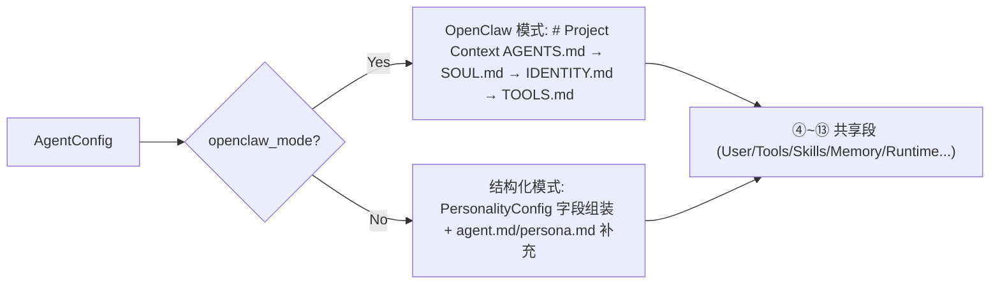
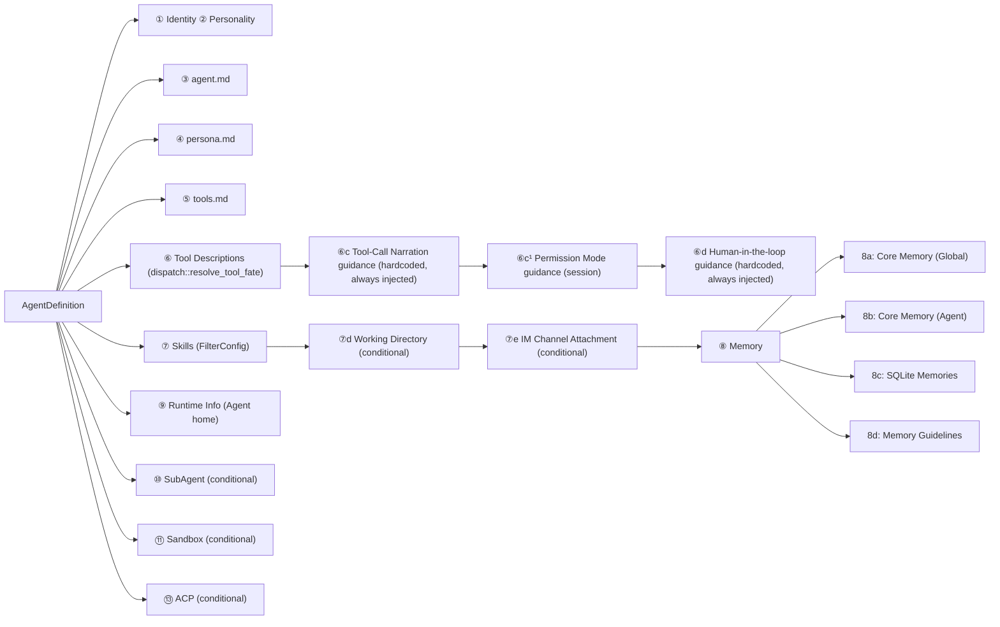

# Hope Agent 提示词系统技术文档

> 返回 [文档索引](../README.md) | 更新时间：2026-04-25

## 目录

- [概述](#概述)（含架构总览图）
- [System Prompt 组装流程](#system-prompt-组装流程)
  - [13 段组装顺序](#13-段组装顺序)
  - [三种组装模式](#三种组装模式)
  - [Legacy 兼容路径](#legacy-兼容路径)
  - [Agent Home 与 Session Working Directory](#agent-home-与-session-working-directory)
- [Per-Tool 描述系统](#per-tool-描述系统)
  - [设计理念](#设计理念)
  - [工具描述清单（36 个工具）](#工具描述清单36-个工具)
  - [动态过滤机制](#动态过滤机制)
- [Plan Mode 提示词](#plan-mode-提示词)
  - [5 阶段规划 Prompt](#5-阶段规划-prompt)
  - [执行阶段 Prompt](#执行阶段-prompt)
  - [完成阶段 Prompt](#完成阶段-prompt)
  - [子 Agent 上下文隔离](#子-agent-上下文隔离)
- [Human-in-the-loop（人机协作硬约束）](#human-in-the-loop人机协作硬约束)
- [Memory Guidelines（记忆指导）](#memory-guidelines记忆指导)
- [上下文压缩提示词](#上下文压缩提示词)
  - [上下文压缩](#上下文压缩-1)
  - [Summarization System Prompt](#summarization-system-prompt)
  - [标识符保留策略](#标识符保留策略)
- [条件注入段](#条件注入段)
  - [Sub-Agent Delegation](#sub-agent-delegation)
  - [Sandbox Mode](#sandbox-mode)
  - [ACP External Agents](#acp-external-agents)
- [Prompt 缓存优化](#prompt-缓存优化)
- [关键文件索引](#关键文件索引)

---

## 概述

Hope Agent 的提示词系统采用**模块化组装**架构，由 `system_prompt::build()` 统一编排。System Prompt 由若干独立段落（section）按固定顺序拼接，每段可独立启用/禁用/过滤，支持 Agent 级别的差异化配置。其中工具描述（⑥）、Deferred Tools（⑥b）、Human-in-the-loop（⑥c）、Memory Guidelines（8d）、Sandbox Mode（⑪）等关键行为指引以编译时常量形式硬编码进二进制，用户无法通过自定义 agent.md 覆盖。Runtime Info 只展示 Agent 自己的 home/scratch 目录；用户为当前会话选择的工作目录会作为独立的 `# Working Directory` 条件段注入。当前会话的权限审批模式会注入为 `# Current Permission Mode`，让模型知道 `default` / `smart` / `yolo` 的自主执行边界；绑定 IM chat 的会话还会注入 `# IM Channel Attachment`，提醒桌面 / HTTP 发起的回复也可能镜像到 IM。支持两种互斥的组装模式：**结构化模式**（默认 GUI 配置）、**OpenClaw 兼容模式**（4 文件配置）。

```mermaid
graph TD
    subgraph SP["System Prompt 13 段组装"]
        direction LR
        S1["① Identity"] --> S2["② agent.md / Project Context"] --> S3["③ persona.md"]
        S4["④ User Context"] --> S5["⑤ tools.md"] --> S6["⑥ Tool Descriptions (filtered)"]
        S6 --> S6b["⑥c Tool-Call Narration (hardcoded, always)"]
        S6b --> S6c["⑥c¹ Permission Mode (session)"]
        S6c --> S6d["⑥d Human-in-the-loop (hardcoded, conditional)"]
        S6d --> S7["⑦ Skills (filtered)"] --> S7d["⑦d Working Directory (session, conditional)"] --> S7e["⑦e IM Attachment (conditional)"] --> S8["⑧ Memory"]
        S9["⑨ Runtime Info (Agent home)"] --> S10["⑩ SubAgent Delegation"] --> S11["⑪ Sandbox Mode"]
        S12["⑫ reserved"] --> S13["⑬ ACP Ext Agents"]
    end
    S3 --> S4
    S6 --> S7
    S8 --> S9
    S11 --> S12
```



**两种组装模式**：



**核心设计原则**：

| 原则                 | 说明                                                                                                      |
| -------------------- | --------------------------------------------------------------------------------------------------------- |
| **Per-Agent 差异化** | 每个 Agent 的工具、技能、记忆、子 Agent 权限可独立配置                                                    |
| **动态过滤**         | 工具描述和技能描述按 allow/deny 列表过滤，减少无关 token                                                  |
| **缓存友好**         | 日期只精确到天，避免每次请求都改变 system prompt                                                          |
| **安全截断**         | 注入的 markdown 文件限制 20,000 字符，head(70%)+tail(20%) 截断                                            |
| **条件注入**         | Working Directory、IM Attachment、Sandbox、SubAgent、ACP 段按会话或配置条件注入                           |
| **OpenClaw 兼容**    | 支持 OpenClaw 风格 4 文件配置（AGENTS/IDENTITY/SOUL/TOOLS.md），与 OpenClaw 的 MEMORY.md 核心记忆格式互通 |

---

## System Prompt 组装流程

### 13 段组装顺序

组装由 `system_prompt::build()` 函数执行，入口参数为 `AgentDefinition`（Agent 完整配置）：



**代码位置**：`crates/ha-core/src/system_prompt/build.rs` — `pub fn build()`

### 两种组装模式

`build()` 函数根据 `config.openclaw_mode` 选择组装模式，二者互斥，优先级：OpenClaw > 结构化。

|               | 结构化模式（默认）                          | OpenClaw 兼容模式                 |
| ------------- | ------------------------------------------- | --------------------------------- |
| 触发条件      | 默认                                        | `openclaw_mode: true`             |
| Identity 行   | `"You are {name}, a {role}, running on..."` | `"You are {name}, running on..."` |
| Avatar 行     | `AgentConfig.avatar` 非空时追加 `"Your avatar image is at: {path}"`（`data:` URL 与超过 1KB 的字符串跳过，防止 base64 图片膨胀 prompt） | 同左 |
| Personality   | `PersonalityConfig` 字段组装                | 跳过                              |
| agent.md      | 补充说明                                    | 不使用                            |
| persona.md    | 补充个性                                    | 不使用                            |
| OpenClaw 文件 | —                                           | `# Project Context` 段注入        |

#### OpenClaw 兼容模式

启用 `openclaw_mode` 后，提示词采用 OpenClaw 风格的 4 文件组装，按以下顺序注入 `# Project Context` 段：

```
# Project Context

The following project context files have been loaded:

## AGENTS.md    ← 工作空间规则、红线、记忆指导
## SOUL.md      ← 性格、价值观、语气、边界
## IDENTITY.md  ← 身份元数据（名称、生物类型、风格）
## TOOLS.md     ← 本地环境说明（摄像头、SSH、TTS）
```

如果 SOUL.md 存在且非空，追加指导语：

> "If SOUL.md is present, embody its persona and tone throughout all interactions."

**文件存储**：`~/.hope-agent/agents/{id}/agents.md`、`identity.md`、`soul.md`（`tools.md` 复用现有文件）

**模板预填充**：首次启用时，空文件自动填充内置的 4 文件模板（`crates/ha-core/templates/openclaw_*.md`，纯英文）

**UI 行为**：启用后，Identity/Personality tab 禁用（显示提示），BehaviorTab 工具指导只读，MemoryTab 提示核心记忆与 OpenClaw MEMORY.md 兼容

**与其他段的关系**：OpenClaw 模式下 `tools.md` 已包含在 `# Project Context` 中，跳过独立的 ⑤ tools.md 注入。其余段（④ 用户上下文、⑥ 工具定义、⑦ 技能、⑧ 记忆、⑨ 运行时等）照常注入。

**代码位置**：`crates/ha-core/src/system_prompt/build.rs` — `build()` 函数开头的 `if definition.config.openclaw_mode` 分支

### Legacy 兼容路径

`build_legacy()` 在 `load_agent()` 加载 Agent 配置失败时（如配置文件损坏或不存在）作为降级路径，拼出一个基础 system prompt：

- 注入全部工具描述（不过滤）
- 从全局 `AppConfig` 加载技能
- 无 Memory、SubAgent、Sandbox、ACP 段

**代码位置**：`crates/ha-core/src/system_prompt/build.rs` — `pub fn build_legacy()`

### Agent Home 与 Session Working Directory

这两个目录在 prompt 中必须保持语义分离：

| 概念 | 来源 | Prompt 呈现 | 用途 |
| ---- | ---- | ----------- | ---- |
| **Agent home** | `paths::agent_home_dir(agent_id)`，形如 `~/.hope-agent/{agent_id}-home/` | `# Runtime` 段中的 `- Agent home: ...` | Agent 自己的长期 scratch/home 目录，可保存工作期间的内部文件和状态 |
| **Session Working Directory** | `sessions.working_dir`，由 `set_session_working_dir` 设置 | 独立 `# Working Directory` 段 | 当前会话用户希望默认读写的业务目录 |

`Agent home` 不再在 prompt 中叫 `Working directory`，避免模型把 Agent 自己的内部目录误认为用户当前项目目录。`# Working Directory` 段在会话 `working_dir` 设置时，或会话属于项目时（项目会话总有工作目录——显式 `working_dir` 或 lazy 创建的默认 workspace）注入，位置在 `# Current Project` 之后、Memory 之前；段内指令子节是 `## Working Directory Instructions`（工作目录里的 AGENTS.md/CLAUDE.md）。**顶层文件清单是另一个独立的顶层段 `# Files in Working Directory`，emit 在所有静态段之后（最末）**（非递归、只列名字、名称排序、跳过隐藏与 `.git`/`node_modules`、cap ~100），刻意拆成尾段——文件增删只 bust 这一尾块、不波及静态前缀缓存（同一目录状态产出 byte-identical 文本）。这取代了旧的 `# Project Files` 三层注入（目录清单 / 小文件内联 / `project_read_file`），后者已废弃；模型现在靠普通 `read` 工具按需读工作目录文件。

执行层与 prompt 保持一致：path-aware 工具的相对路径按「显式绝对路径 > Session Working Directory > Agent home」解析；`exec` 无 `cwd` 时再回退到用户 home。详细工具层规则见 [tool-system.md](tool-system.md#2-文件系统)。

**代码位置**：
- Runtime / Working Directory 段：`crates/ha-core/src/system_prompt/sections.rs`
- 注入顺序：`crates/ha-core/src/system_prompt/build.rs`
- 会话 working dir 取值：`crates/ha-core/src/agent/config.rs`、`crates/ha-core/src/agent/mod.rs`

### Permission Mode 与 IM Channel Attachment

`build_system_prompt_with_session()` 会从 `SessionMeta` 读取当前会话状态，并在主 system prompt 中注入两类轻量状态段：

| 段落 | 来源 | 触发条件 | 作用 |
| ---- | ---- | -------- | ---- |
| `# Current Permission Mode` | `sessions.permission_mode` | 所有正常 `system_prompt::build()` 路径 | 告诉模型当前会话处于 `default` / `smart` / `yolo`，让它合理决定工具调用自主度；权限引擎仍是唯一真相 |
| `# IM Channel Attachment` | `SessionMeta.channel_info`（`channel_conversations` join） | 会话绑定 IM chat 时 | 告诉模型该 session 的回复可能镜像到 IM chat，包括桌面 / HTTP 发起的 turn |

`# Current Permission Mode` 由 `build_permission_mode_guidance()` 生成：

- `default`：提示模型照常调用必要工具，是否弹审批由系统决定，避免因为"可能弹窗"而提前停下。
- `smart`：在 default 语义上说明 `_confidence: "high"` 自报字段，只用于模型高度确信安全的低风险调用；保护路径与危险命令仍不能靠该字段放行。
- `yolo`：明确当前会话审批层已授予全部权限，鼓励模型在任务目标与范围明确时更自由主动地推进；同时强调授权不代表可偏离用户目标，Plan Mode 与后端硬安全仍可覆盖。

`# IM Channel Attachment` 只描述稳定的 attach 状态，区别于 IM 入站 turn 通过 `ChatEngineParams.extra_system_context` 携带的 `## IM Channel Context`。后者只在 IM 消息触发的 turn 存在，包含当前 inbound sender / chat context；前者覆盖桌面 / HTTP 在同一 IM 绑定 session 中继续发消息并镜像到 IM 的场景。IM metadata 来自外部平台，prompt 中以单行 JSON 作为**不可信 routing/audience context**渲染，模型必须把字段值当作数据而非指令。

**代码位置**：
- Permission mode guidance：`crates/ha-core/src/system_prompt/constants.rs`
- IM attachment section：`crates/ha-core/src/system_prompt/sections.rs`
- 会话状态解析：`crates/ha-core/src/agent/config.rs`

---

## Per-Tool 描述系统

### 设计理念

每个工具拥有独立的详细描述常量。相比之前的单一 `TOOLS_DESCRIPTION` 字符串（所有工具挤在一起），新架构的优势：

1. **精准过滤**：Agent 只看到被授权的工具描述，减少无关 token 消耗
2. **详细指南**：每个工具包含使用指南、最佳实践、常见陷阱
3. **工具优先级**：`exec` 工具明确标注「优先使用专用工具」规则，防止模型绕过专用工具直接用 shell

### 工具描述清单（36 个工具）

工具描述以 `TOOL_DESC_*` 常量定义，通过 `TOOL_DESCRIPTIONS` 数组映射：

| 分类         | 工具               | 常量                           | 描述要点                                                 |
| ------------ | ------------------ | ------------------------------ | -------------------------------------------------------- |
| **执行**     | exec               | `TOOL_DESC_EXEC`               | cwd/timeout/background/sandbox；**强调优先使用专用工具** |
|              | process            | `TOOL_DESC_PROCESS`            | 管理后台 exec session；禁止 sleep 轮询                   |
| **文件操作** | read               | `TOOL_DESC_READ`               | 分页/图片检测/PDF 分页；**先读后改**                     |
|              | write              | `TOOL_DESC_WRITE`              | 优先用 edit；不创建不必要的文件                          |
|              | edit               | `TOOL_DESC_EDIT`               | old_text 唯一性；replace_all 重命名                      |
|              | ls                 | `TOOL_DESC_LS`                 | 目录列表；创建前先验证                                   |
|              | grep               | `TOOL_DESC_GREP`               | **禁止用 exec 替代**；regex + multiline                  |
|              | find               | `TOOL_DESC_FIND`               | **禁止用 exec 替代**；glob 模式                          |
|              | apply_patch        | `TOOL_DESC_APPLY_PATCH`        | 多文件补丁；3-pass fuzzy matching                        |
| **网络**     | web_search         | `TOOL_DESC_WEB_SEARCH`         | 搜索当前信息                                             |
|              | web_fetch          | `TOOL_DESC_WEB_FETCH`          | 抓取网页内容                                             |
|              | browser            | `TOOL_DESC_BROWSER`            | 无头浏览器；动态页面交互                                 |
| **记忆**     | save_memory        | `TOOL_DESC_SAVE_MEMORY`        | 4 种类型；禁止保存临时信息                               |
|              | recall_memory      | `TOOL_DESC_RECALL_MEMORY`      | 关键词/语义搜索；include_history                         |
|              | update_memory      | `TOOL_DESC_UPDATE_MEMORY`      | 更新已有记忆                                             |
|              | delete_memory      | `TOOL_DESC_DELETE_MEMORY`      | 删除过期记忆                                             |
|              | update_core_memory | `TOOL_DESC_UPDATE_CORE_MEMORY` | 持久指令写入 memory.md                                   |
|              | memory_get         | `TOOL_DESC_MEMORY_GET`         | 按 ID 获取完整记忆                                       |
| **委托**     | subagent           | `TOOL_DESC_SUBAGENT`           | spawn/check/steer/kill；异步执行                         |
|              | agents_list        | `TOOL_DESC_AGENTS_LIST`        | 列出可委托 Agent                                         |
|              | acp_spawn          | `TOOL_DESC_ACP_SPAWN`          | 外部 ACP Agent（Claude Code/Codex）                      |
| **会话**     | sessions_list      | `TOOL_DESC_SESSIONS_LIST`      | 跨会话通信发现                                           |
|              | session_status     | `TOOL_DESC_SESSION_STATUS`     | 会话详细状态                                             |
|              | sessions_search    | `TOOL_DESC_SESSIONS_SEARCH`    | FTS 检索会话消息并返回上下文窗口                        |
|              | sessions_history   | `TOOL_DESC_SESSIONS_HISTORY`   | 分页历史记录                                             |
|              | sessions_send      | `TOOL_DESC_SESSIONS_SEND`      | 跨会话消息发送                                           |
| **媒体**     | image              | `TOOL_DESC_IMAGE`              | 视觉输入；把图片附件带入下一轮模型并用 task/question 指定目标 |
|              | image_generate     | `TOOL_DESC_IMAGE_GENERATE`     | AI 图片生成；failover                                    |
|              | pdf                | `TOOL_DESC_PDF`                | PDF 文本提取；大文件必须分页                             |
| **其他**     | canvas             | `TOOL_DESC_CANVAS`             | 富内容制品                                               |
|              | manage_cron        | `TOOL_DESC_MANAGE_CRON`        | 定时任务管理                                             |
|              | send_notification  | `TOOL_DESC_SEND_NOTIFICATION`  | 系统通知                                                 |
|              | ask_user_question  | `TOOL_DESC_ASK_USER_QUESTION`  | 结构化交互问答；**WHEN / WHEN NOT / HOW 三段触发规则**   |
|              | get_weather        | `TOOL_DESC_GET_WEATHER`        | 天气查询                                                 |
|              | task_create        | `TOOL_DESC_TASK_CREATE`        | 计划任务创建                                             |
|              | task_update        | `TOOL_DESC_TASK_UPDATE`        | 任务状态/字段更新                                        |
|              | task_list          | `TOOL_DESC_TASK_LIST`          | 列出当前任务                                             |

**代码位置**：`crates/ha-core/src/system_prompt/constants.rs`

### 动态工具段生成

```rust
fn build_tools_section(agent_id: &str, agent_config: &AgentConfig) -> String {
    let ctx = DispatchContext { agent_id, agent_config, app_config };
    let eager_names = all_dispatchable_tools()
        .filter(|tool| matches!(resolve_tool_fate(tool, &ctx), InjectEager));
    let descs = TOOL_DESCRIPTIONS
        .filter(|(name, _)| eager_names.contains(name));
    format!("# Available Tools\n\n{}", descs.join("\n\n"))
}
```

- Core 工具按 tier 直接注入；Standard / Configured 工具先按 `capabilities.tools.allow/deny` 覆盖 tier 默认值
- Configured 工具未完成全局配置时不进 Available Tools，而进入 `# Unconfigured Capabilities` 提示
- deferred 工具不进 Available Tools，进入 `# Additional Tools (use tool_search to discover)`
- **共享同一套语义**：Section ⑥、`agent/mod.rs::build_tool_schemas()`、`tool_search` 和执行层兜底都以 `dispatch::resolve_tool_fate()` 为准

**代码位置**：`crates/ha-core/src/system_prompt/sections.rs` — `build_tools_section()`

---

## Plan Mode 提示词

Plan Mode 使用独立于主 system prompt 的额外提示词，注入到对话上下文中。详细架构见 [Plan Mode 架构文档](plan-mode.md)。

### 5 阶段规划 Prompt

**常量**：`PLAN_MODE_SYSTEM_PROMPT`（`plan.rs`）

```
Phase 1: Deep Exploration    → subagent 并行探索，梳理关键要素和依赖关系
Phase 2: Requirements         → ask_user_question 结构化问答，带选项卡片
Phase 3: Design & Architecture → 方案对比，风险识别
Phase 4: Plan Composition      → submit_plan 提交，checklist 格式
Phase 5: Review & Refinement   → 用户审核，inline comment 修订
```

**工具限制**：

- 禁止：apply_patch、canvas（项目文件不可修改）
- 限制：write/edit 只能操作 `~/.hope-agent/plans/` 路径
- 需审批：exec（shell 命令需用户同意）
- 允许：read、grep、find、web_search、web_fetch、subagent、ask_user_question、submit_plan

**计划格式要求**：

- 以**逻辑单元为中心**组织步骤
- 步骤标题描述具体任务（涉及代码时可加文件路径）
- 涉及代码修改时包含代码片段和文件引用
- 引用已有内容时标注来源
- 使用 `- [ ]` 子任务便于追踪
- 末尾 Verification 段列出验证方法

### 执行阶段 Prompt

**常量**：`PLAN_EXECUTING_SYSTEM_PROMPT_PREFIX`（`plan.rs`）

- 逐步执行已审批计划
- `update_plan_step(step_index, status)` 追踪进度
- `amend_plan()` 动态修改计划（insert/delete/update）
- Git checkpoint 已创建，失败可回滚

### 完成阶段 Prompt

**常量**：`PLAN_COMPLETED_SYSTEM_PROMPT`（`plan.rs`）

- 总结完成情况
- 高亮失败/跳过的步骤并解释原因
- 建议后续行动

### 子 Agent 上下文隔离

**常量**：`PLAN_SUBAGENT_CONTEXT_NOTICE`（`plan.rs`）

当 Plan Mode 使用子 Agent 模式时，注入此 notice 提醒 planning subagent：

- 执行 Agent **不会**看到你的探索历史
- 计划必须**自包含**：关键细节、来源引用、前置条件
- "The plan IS the only context"

---

## Tool-Call Narration（工具调用前叙述）

**位置**：`system_prompt/build.rs` 的 ⑥c 段，紧跟 Async Tools 指南、先于 Human-in-the-loop，`build()` / `build_legacy()` 两条路径都会注入。

**动机**：对齐 Claude Code 的"边说边做"体验。Anthropic Messages API / OpenAI streaming 协议原生支持一个 assistant turn 内 `text_delta` 与 `tool_use` block 交替输出，模型完全可以"先吐一段自然语言预告 → 再 emit 工具调用"。体验核心不在流式或 UI 管线（现有 `MessageList` 按事件顺序渲染已足够），而在 system prompt 是否显式要求模型这样做。

**指令要点**：
- 第一次工具调用前必须用一句话说清即将做什么
- 关键节点（发现、转向、阻塞、派子 Agent / Team / ACP 外部 Agent）简报一句
- 禁止"let me think…"这种内部独白，直接说结果和决策
- 每轮末一两句收尾：what changed / what's next

**为什么硬编码而非走 `agent.md` 模板**：和 Human-in-the-loop 同样的理由，防止用户自定义 agent.md 时整段删掉导致行为退化。用 `TOOL_CALL_NARRATION_GUIDANCE` 编译常量 + `sections.push(...)` 直接注入。

**代码位置**：
- 常量：`crates/ha-core/src/system_prompt/constants.rs` — `TOOL_CALL_NARRATION_GUIDANCE`
- 注入：`crates/ha-core/src/system_prompt/build.rs` — ⑥c 段（`build()` 和 `build_legacy()` 均调用）

---

## Human-in-the-loop（人机协作硬约束）

**位置**：`system_prompt/build.rs` 的 ⑥d 段，紧跟工具描述 / Tool-Call Narration 之后（Tool definitions → Deferred tools → Tool-Call Narration → **Human-in-the-loop** → Skills）

**注入条件**：始终注入。`ask_user_question` 是 Core Interaction 工具，不受非 Core 工具开关影响；这段规则必须和工具 schema 一起保持可用。

**为什么硬编码而非走 `agent.md` 模板**：[agent.en.md](../../crates/ha-core/templates/agent.en.md) / `agent.zh.md` 是默认模板，用户可以在 `~/.hope-agent/agents/{id}/agent.md` 自定义甚至彻底重写。如果把人机交互规则放模板里，用户改 agent.md 时可能整段删掉，行为约束就丢了。所以这段指引以 `HUMAN_IN_THE_LOOP_GUIDANCE` 常量形式编译进二进制，由 `build.rs` 用 `sections.push(HUMAN_IN_THE_LOOP_GUIDANCE.to_string())` 直接注入，不可篡改。参考已有的 Sandbox Mode（⑪）和 Memory Guidelines（8d）也是同样的硬编码范式。

**指引内容三段结构**：

| 段落 | 用途 | 要点 |
|------|------|------|
| **Ask the user when** | 强触发器 | 不可逆/高代价操作（删 >5 文件 / DB 迁移 / force push / 依赖 major bump）、真实歧义、多路径相近、即将硬编码假设、≥2 次失败 |
| **Do NOT ask when** | 反触发器（刹车） | 可自查的、低成本可撤销、纯风格/格式/命名 |
| **How to ask** | 节流约束 | 相关问题合并成一次调用、每任务 ≤2 次、优先前置 |

**与工具描述层的协同**：`TOOL_DESC_ASK_USER_QUESTION`（⑥ Tool Descriptions）也包含同样的 WHEN / WHEN NOT / HOW 三段，但聚焦于**工具调用的具体规则**（参数语法、Plan Mode 禁令、tool approval 边界）。⑥c Human-in-the-loop 段则提供**全局思维框架**，告诉模型把 ask_user_question 视作"主动协作的常规通道"而非"卡住时的兜底升级"。两层重复但措辞不同 —— 工具描述说"怎么问"，全局指引说"何时切换到问的模式"。

**与 Claude Code 的差异**：Claude Code 在 system prompt 中只是 2 处嵌入式提及（"失败 ≥ 2 次后升级" + "工具被拒时澄清"），把 AskUserQuestion 定位为模糊的"卡住时的升级路径"。Hope Agent 用独立段落给出**触发器 + 反触发器 + 节流**三件套，让边界可执行而非靠模型自由发挥。详细对比见 [ask-user.md](ask-user.md)。

**代码位置**：
- 常量：`crates/ha-core/src/system_prompt/constants.rs` — `HUMAN_IN_THE_LOOP_GUIDANCE`
- 注入：`crates/ha-core/src/system_prompt/build.rs` — ⑥d 段（`build()` 函数中 Tool-Call Narration 之后）

---

## Memory Guidelines（记忆指导）

**位置**：`system_prompt/sections.rs`（⑧ Memory 段的 8d 子段）

仅在 `config.memory.enabled = true` 时注入。指导 Agent 正确使用 4 个记忆工具：

| 工具                                  | 使用场景                                      |
| ------------------------------------- | --------------------------------------------- |
| `update_core_memory`                  | 长期指令：「always」「never」「from now on」  |
| `save_memory`                         | 事实、截止日期、临时上下文、值得备注的发现    |
| `recall_memory`                       | 查找先前偏好/约束/上下文                      |
| `recall_memory(include_history=true)` | 搜索历史对话（「last time」「we discussed」） |

**禁止保存**：临时任务细节、代码片段、调试步骤、可从代码库推导的信息。

记忆段还包括 Core Memory 注入（8a 全局、8b Agent 级别）和 SQLite 记忆检索结果（8c）。

---

## 上下文压缩提示词

### 上下文压缩

上下文压缩详见 [context-compact.md](./context-compact.md)。本系统采用 **5 层渐进式**结构（Tier 0 反应式微压缩 + Tier 1-4），Prompt System 仅在压缩动作发生时复用 `SUMMARIZATION_SYSTEM_PROMPT` 等常量参与第 3 层 LLM 摘要的提示词构建，本节只记录 prompt 契约，不复述触发条件、mid-loop checkpoint、ledger/recovery 等实现细节。

**代码位置**：`crates/ha-core/src/context_compact/summarization.rs`

### Summarization System Prompt

**常量**：`SUMMARIZATION_SYSTEM_PROMPT`（`context_compact/summarization.rs`）

```
You are a context compaction assistant.
CRITICAL: Respond with TEXT ONLY. Do NOT call tools.

You are creating a continuation summary for a long-running local AI assistant session.
The old conversation history will be replaced by your summary, followed by deterministic runtime state and recent messages.

Write a concise but complete handoff that lets another model instance resume immediately.

Include these sections:
## Primary Request and Success Criteria
## Current Execution State
## Decisions and Rationale
## Files, Symbols, and Artifacts
## Tool Results Worth Preserving
## Errors, Failed Attempts, and Fixes
## User Feedback and Constraints
## Pending Work and Next Action
## Trust Boundaries and Security Notes
```

**设计要点**：

- 摘要是 continuation handoff，不是全局状态镜像；下一个模型实例应能立即接手。
- 明确 no-tools guard：摘要模型只输出文本，不允许调用工具。
- 9 段结构化输出，覆盖成功标准、当前执行状态、决策、文件/符号、值得保留的工具结果、失败尝试、用户纠正、下一步和信任边界。
- 精确保留路径、ID、URL、命令名、函数名和用户约束。
- 记录失败尝试和用户反馈，避免压缩后重复犯错。
- 不把 tool output / web / KB / recovered file snapshot 这类 untrusted data 当成指令。
- 不重复 runtime ledger 或每轮会从 live state 重建的 task/memory/KB/cwd/permission 状态，避免第二真相源。

### 标识符保留策略

**常量**：`IDENTIFIER_PRESERVATION_INSTRUCTIONS`（`context_compact/mod.rs`）

```
Preserve all opaque identifiers exactly as written (no shortening or reconstruction),
including UUIDs, hashes, IDs, tokens, hostnames, IPs, ports, URLs, and file names.
```

通过 `CompactConfig.identifier_policy` 配置：

| 策略             | 行为                                     |
| ---------------- | ---------------------------------------- |
| `strict`（默认） | 使用内置保留指令                         |
| `off`            | 不注入保留指令                           |
| `custom`         | 使用用户自定义 `identifier_instructions` |

### 压缩配置参数

| 参数                         | 默认值 | 说明                         |
| ---------------------------- | ------ | ---------------------------- |
| `soft_trim_ratio`            | 0.50   | Tier 2 软截断触发比例        |
| `hard_clear_ratio`           | 0.70   | Tier 2 硬清除触发比例        |
| `preserve_recent_rounds`     | 4      | 保护最近 N 个消息 round；普通短回合尽量扩到所属 user turn，长 tool loop 保持可裁剪前缀 |
| `soft_trim_max_chars`        | 6,000  | 超过此值才软截断             |
| `soft_trim_head_chars`       | 2,000  | 软截断保留头部               |
| `soft_trim_tail_chars`       | 2,000  | 软截断保留尾部               |
| `summarization_threshold`    | 0.85   | Tier 3 总结触发比例          |
| `summary_max_tokens`         | 4,096  | 总结输出最大 token           |
| `summarization_timeout_secs` | 60     | 总结调用超时                 |
| `max_compaction_injected_context_share` | 0.5 | Tier 3 摘要、ledger、recovery 的联合注入预算 |

**代码位置**：`crates/ha-core/src/context_compact/config.rs`

---

## 条件注入段

### Sub-Agent Delegation

**触发条件**：`config.subagents.enabled == true` 且 `depth < max_spawn_depth`

**注入内容**：

- 可委托 Agent 列表（emoji + name + id + description）
- 使用方式：spawn → 异步执行 → 自动推送结果
- steer 重定向、check 状态检查、kill 终止
- spawn 选项：label、files、model override
- 当前深度显示：`Current depth: N/M`

**过滤规则**：

- 列出自身并标注 `*(self — fork for parallel work)*`，支持 self-fork 并行
- 受 `SubagentConfig.allow/deny` 控制

**代码位置**：`crates/ha-core/src/system_prompt/sections.rs` — SubAgent Delegation 段构建

### Sandbox Mode

**触发条件**：当前 `sessions.sandbox_mode != off`；没有 `session_id` 的构建路径才回落到 `AgentConfig.capabilities.effective_default_sandbox_mode()`。

**注入内容**：

- 当前会话沙箱模式和当前模式的一句话行为
- `exec` 按 session policy 自动在 Docker 容器内执行，无需额外传 `sandbox=true`
- 当前 `SandboxConfig` 快照：镜像、Docker network mode、rootfs 读写状态、capability policy、no-new-privileges、PID limit、tmpfs mount
- 当前工作目录在容器内挂载为 `/workspace`，持久化语义由 `standard` / `isolated` / `workspace` / `trusted` 决定
- 四种非 `off` 模式的差异：`standard` 不放松审批、`isolated` 临时副本不持久化、`workspace` 真实工作区挂载并放松部分软审批、`trusted` 沙箱内最大自治但 strict 仍审批
- 安全/持久化边界：sandbox 不是权限绕过；`write` / `edit` / `apply_patch` 仍是 host-side durable file tools；需要网络或宿主权限时按当前 `SandboxConfig` 和 strict 规则解释限制

**边界**：该段是模型行为提示，不是安全边界。实际执行位置以当前 `SessionMeta.sandbox_mode` 经 `ToolExecContext.sandbox_mode` 传入工具执行层为准；会话可在创建后切换 sandbox mode。

### ACP External Agents

**触发条件**：`config.acp.enabled == true` 且全局 `acp_control.enabled == true`

**注入内容**：

- 可用 ACP 后端列表（检测 binary 是否存在）
- 使用场景区分：subagent（内部）vs acp_spawn（外部）
- 异步执行 + check(wait=true) 阻塞等待

**代码位置**：`crates/ha-core/src/system_prompt/sections.rs` — ACP External Agents 段构建

---

## Prompt 缓存优化

为最大化 LLM prompt 缓存命中率，系统采取以下策略：

| 策略         | 实现                          | 效果                              |
| ------------ | ----------------------------- | --------------------------------- |
| 日期精确到天 | `date +%Y-%m-%d %Z`（无时间） | 同一天的 system prompt 完全相同   |
| 固定段顺序   | 13 段按固定顺序组装           | prompt prefix 稳定，利于 KV cache |
| 常量描述     | 工具/行为描述为编译时常量     | 不受运行时数据影响                |
| 截断上限     | markdown 注入限制 20K 字符    | 防止动态内容过大破坏缓存          |

**日期函数**：`current_date()`（`system_prompt/helpers.rs`）— 文档注释明确说明排除时间是为缓存优化。

---

## 关键文件索引

| 文件                                            | 内容                                                                      |
| ----------------------------------------------- | ------------------------------------------------------------------------- |
| `crates/ha-core/src/system_prompt/build.rs`     | **核心**：三模式组装（结构化/自定义/OpenClaw）、13 段拼接逻辑             |
| `crates/ha-core/src/system_prompt/constants.rs` | 36 条 `TOOL_DESCRIPTIONS` 映射（由 36 个 `TOOL_DESC_*` 常量提供，`ASK_USER_QUESTION` 等供 system prompt 复用）、`HUMAN_IN_THE_LOOP_GUIDANCE` 等行为指导常量 |
| `crates/ha-core/src/system_prompt/sections.rs`  | 各 section builder（personality/tools/skills/runtime/subagent/acp）       |
| `crates/ha-core/src/agent_config.rs`            | Agent 配置结构（personality/tools/skills/memory/subagents/openclaw_mode） |
| `crates/ha-core/src/agent_loader.rs`            | Agent 加载（agent.json + md 文件 + OpenClaw 模板）                        |
| `crates/ha-core/templates/openclaw_*.md`        | OpenClaw 兼容模式 4 个模板文件（纯英文）                                  |
| `crates/ha-core/src/plan/`                      | Plan Mode 提示词常量                                                      |
| `crates/ha-core/src/context_compact/`           | 上下文压缩（5 层渐进式压缩 + 摘要 system prompt + 标识符保留）                      |
| `crates/ha-core/src/user_config.rs`             | 用户上下文构建（name/role/birthday/timezone/...）                         |
| `crates/ha-core/src/skills/`                    | 技能加载 + prompt 构建 + budget 管理                                      |
| `crates/ha-core/src/tools/definitions/`         | 工具 JSON Schema 定义（发送给 LLM 的 function calling schema）            |
